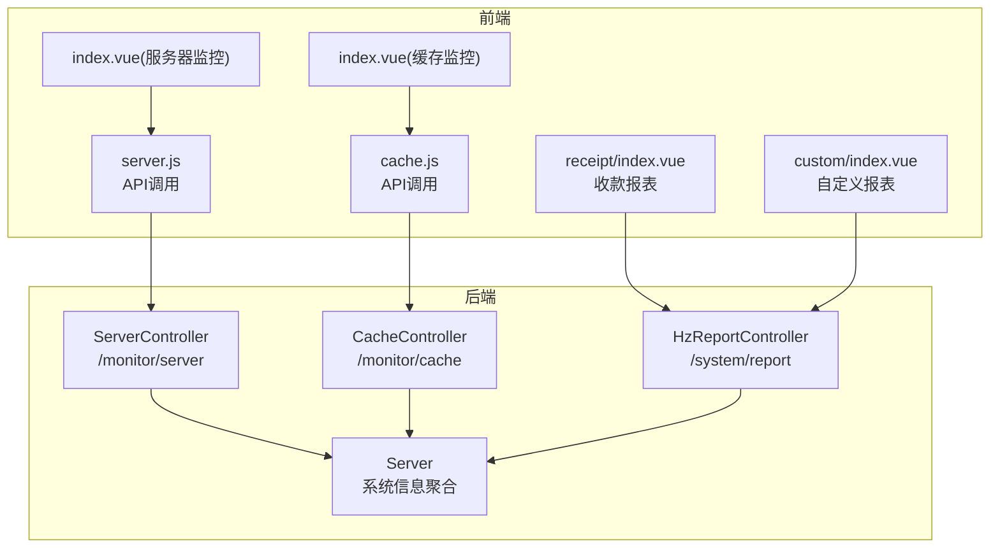
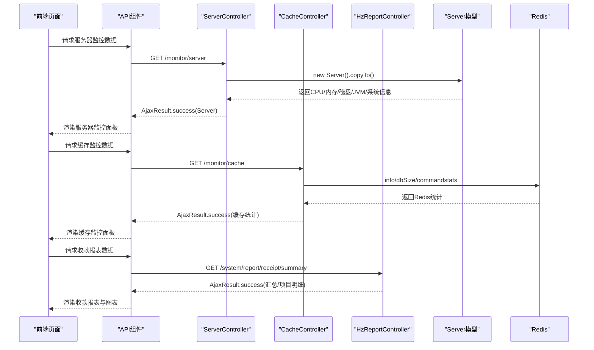
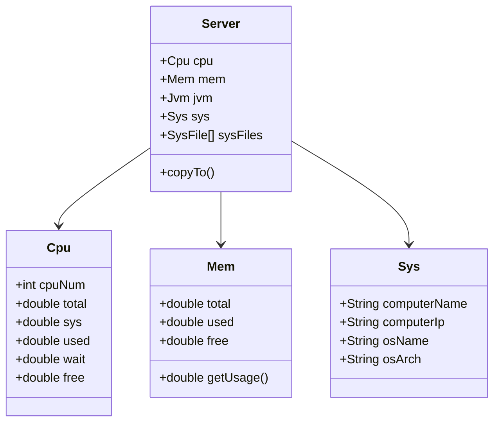
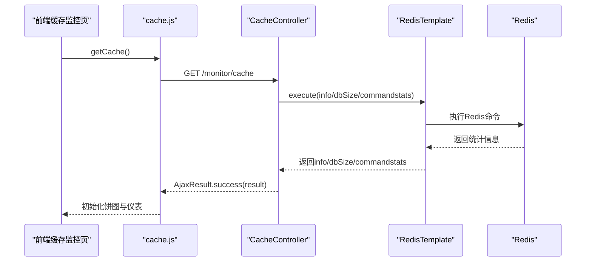
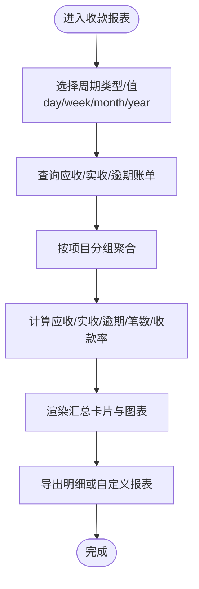
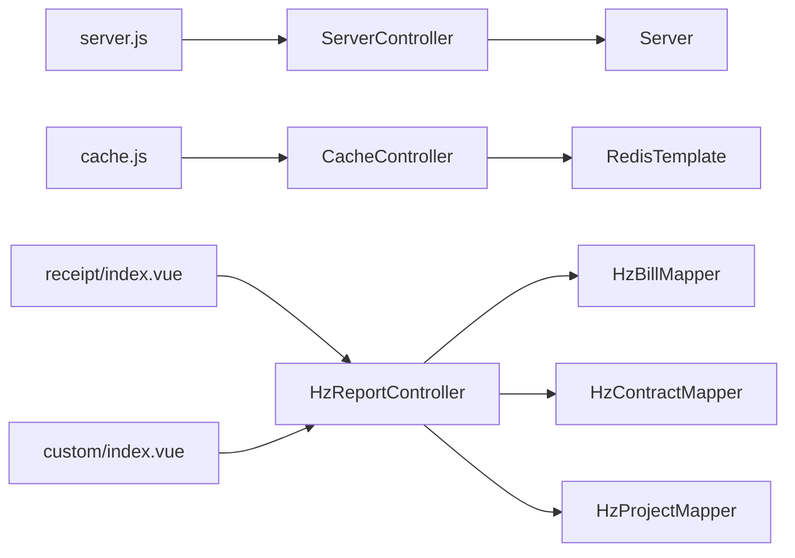

# 系统监控管理

<cite>
**本文档引用的文件**
- [ServerController.java](file://ruoyi-admin/src/main/java/com/ruoyi/web/controller/monitor/ServerController.java)
- [Server.java](file://ruoyi-framework/src/main/java/com/ruoyi/framework/web/domain/Server.java)
- [Cpu.java](file://ruoyi-framework/src/main/java/com/ruoyi/framework/web/domain/server/Cpu.java)
- [Mem.java](file://ruoyi-framework/src/main/java/com/ruoyi/framework/web/domain/server/Mem.java)
- [Sys.java](file://ruoyi-framework/src/main/java/com/ruoyi/framework/web/domain/server/Sys.java)
- [server.js](file://ruoyi-ui/src/api/monitor/server.js)
- [index.vue（服务器监控）](file://ruoyi-ui/src/views/monitor/server/index.vue)
- [CacheController.java](file://ruoyi-admin/src/main/java/com/ruoyi/web/controller/monitor/CacheController.java)
- [cache.js](file://ruoyi-ui/src/api/monitor/cache.js)
- [index.vue（缓存监控）](file://ruoyi-ui/src/views/monitor/cache/index.vue)
- [HzReportController.java](file://ruoyi-admin/src/main/java/com/ruoyi/web/controller/system/HzReportController.java)
- [index.vue（收款报表）](file://ruoyi-ui/src/views/gangzhu/report/receipt/index.vue)
- [index.vue（自定义报表）](file://ruoyi-ui/src/views/gangzhu/report/custom/index.vue)
- [SysNotice.java](file://ruoyi-system/src/main/java/com/ruoyi/system/domain/SysNotice.java)
- [09-消息通知.md](file://docs/数据字典/09-消息通知.md)
</cite>

## 目录
1. [简介](#简介)
2. [项目结构](#项目结构)
3. [核心组件](#核心组件)
4. [架构概览](#架构概览)
5. [详细组件分析](#详细组件分析)
6. [依赖分析](#依赖分析)
7. [性能考虑](#性能考虑)
8. [故障排查指南](#故障排查指南)
9. [结论](#结论)
10. [附录](#附录)

## 简介
本文件面向港好住信息系统，系统化梳理监控管理能力，覆盖系统运行状态监控（CPU、内存、磁盘、网络）、业务关键指标监控（收款、账单、支付），以及监控可视化与报表工具的使用方法。文档以代码为依据，提供架构图、序列图与流程图，帮助开发者与运维人员快速理解与扩展监控体系。

## 项目结构
监控相关功能主要分布在以下模块：
- 后端监控接口与模型：ruoyi-admin（控制器）、ruoyi-framework（系统信息模型）
- 前端监控界面：ruoyi-ui（服务器监控、缓存监控、业务报表）
- 业务报表与指标：ruoyi-admin（收款报表控制器）、ruoyi-ui（前端报表视图）

**图表来源**
- [ServerController.java:15-27](file://ruoyi-admin/src/main/java/com/ruoyi/web/controller/monitor/ServerController.java#L15-L27)
- [CacheController.java:30-86](file://ruoyi-admin/src/main/java/com/ruoyi/web/controller/monitor/CacheController.java#L30-L86)
- [HzReportController.java:37-800](file://ruoyi-admin/src/main/java/com/ruoyi/web/controller/system/HzReportController.java#L37-L800)
- [Server.java:29-241](file://ruoyi-framework/src/main/java/com/ruoyi/framework/web/domain/Server.java#L29-L241)
- [server.js:1-9](file://ruoyi-ui/src/api/monitor/server.js#L1-L9)
- [index.vue（服务器监控）:178-208](file://ruoyi-ui/src/views/monitor/server/index.vue#L178-L208)
- [cache.js:1-58](file://ruoyi-ui/src/api/monitor/cache.js#L1-L58)
- [index.vue（缓存监控）:67-149](file://ruoyi-ui/src/views/monitor/cache/index.vue#L67-L149)
- [index.vue（收款报表）:65-100](file://ruoyi-ui/src/views/gangzhu/report/receipt/index.vue#L65-L100)
- [index.vue（自定义报表）:54-279](file://ruoyi-ui/src/views/gangzhu/report/custom/index.vue#L54-L279)

**章节来源**
- [ServerController.java:1-27](file://ruoyi-admin/src/main/java/com/ruoyi/web/controller/monitor/ServerController.java#L1-L27)
- [CacheController.java:1-86](file://ruoyi-admin/src/main/java/com/ruoyi/web/controller/monitor/CacheController.java#L1-L86)
- [HzReportController.java:1-800](file://ruoyi-admin/src/main/java/com/ruoyi/web/controller/system/HzReportController.java#L1-L800)
- [Server.java:1-241](file://ruoyi-framework/src/main/java/com/ruoyi/framework/web/domain/Server.java#L1-L241)
- [server.js:1-9](file://ruoyi-ui/src/api/monitor/server.js#L1-L9)
- [index.vue（服务器监控）:1-208](file://ruoyi-ui/src/views/monitor/server/index.vue#L1-L208)
- [cache.js:1-58](file://ruoyi-ui/src/api/monitor/cache.js#L1-L58)
- [index.vue（缓存监控）:1-149](file://ruoyi-ui/src/views/monitor/cache/index.vue#L1-L149)
- [index.vue（收款报表）:65-100](file://ruoyi-ui/src/views/gangzhu/report/receipt/index.vue#L65-L100)
- [index.vue（自定义报表）:54-279](file://ruoyi-ui/src/views/gangzhu/report/custom/index.vue#L54-L279)

## 核心组件
- 系统监控模型：Server 聚合 CPU、内存、JVM、系统与磁盘信息，通过 OSHI 采集主机指标。
- 服务器监控接口：ServerController 提供 /monitor/server 获取系统监控数据。
- 缓存监控接口：CacheController 提供 /monitor/cache 获取 Redis 基础信息、命令统计与 Key 列表。
- 业务监控报表：HzReportController 提供收款汇总、明细、自定义报表等接口，前端以图表与表格展示。

**章节来源**
- [Server.java:29-241](file://ruoyi-framework/src/main/java/com/ruoyi/framework/web/domain/Server.java#L29-L241)
- [Cpu.java:1-101](file://ruoyi-framework/src/main/java/com/ruoyi/framework/web/domain/server/Cpu.java#L1-L101)
- [Mem.java:1-61](file://ruoyi-framework/src/main/java/com/ruoyi/framework/web/domain/server/Mem.java#L1-L61)
- [Sys.java:1-84](file://ruoyi-framework/src/main/java/com/ruoyi/framework/web/domain/server/Sys.java#L1-L84)
- [ServerController.java:15-27](file://ruoyi-admin/src/main/java/com/ruoyi/web/controller/monitor/ServerController.java#L15-L27)
- [CacheController.java:30-86](file://ruoyi-admin/src/main/java/com/ruoyi/web/controller/monitor/CacheController.java#L30-L86)
- [HzReportController.java:64-224](file://ruoyi-admin/src/main/java/com/ruoyi/web/controller/system/HzReportController.java#L64-L224)

## 架构概览
系统监控采用“后端采集 + 前端展示”的分层设计：
- 后端通过 Server 与 OSHI 采集系统指标，通过 CacheController 读取 Redis 信息，通过 HzReportController 聚合业务指标。
- 前端通过 API 组件调用后端接口，使用 ECharts 进行可视化展示。

**图表来源**
- [ServerController.java:19-26](file://ruoyi-admin/src/main/java/com/ruoyi/web/controller/monitor/ServerController.java#L19-L26)
- [CacheController.java:48-71](file://ruoyi-admin/src/main/java/com/ruoyi/web/controller/monitor/CacheController.java#L48-L71)
- [HzReportController.java:64-224](file://ruoyi-admin/src/main/java/com/ruoyi/web/controller/system/HzReportController.java#L64-L224)
- [server.js:3-8](file://ruoyi-ui/src/api/monitor/server.js#L3-L8)
- [cache.js:3-9](file://ruoyi-ui/src/api/monitor/cache.js#L3-L9)
- [index.vue（服务器监控）:194-205](file://ruoyi-ui/src/views/monitor/server/index.vue#L194-L205)
- [index.vue（缓存监控）:88-141](file://ruoyi-ui/src/views/monitor/cache/index.vue#L88-L141)
- [index.vue（收款报表）:65-100](file://ruoyi-ui/src/views/gangzhu/report/receipt/index.vue#L65-L100)

## 详细组件分析

### 系统资源监控（CPU/内存/磁盘/网络）
- 采集方式：Server.copyTo() 使用 OSHI 采集 CPU、内存、磁盘与系统信息；JVM 信息通过 Runtime 与系统属性获取。
- 展示方式：前端 index.vue（服务器监控）以表格形式展示 CPU 使用率、内存总量/使用率、磁盘使用率、服务器与 JVM 信息。
- 关键指标：
  - CPU：核心数、用户使用率、系统使用率、空闲率
  - 内存：总量、已用、剩余、使用率
  - 磁盘：各挂载点总/可用/已用、使用率
  - 网络：通过 Redis info 中 instantaneous_input_kbps/instantaneous_output_kbps（缓存监控页亦有体现）

**图表来源**
- [Server.java:29-184](file://ruoyi-framework/src/main/java/com/ruoyi/framework/web/domain/Server.java#L29-L184)
- [Cpu.java:10-101](file://ruoyi-framework/src/main/java/com/ruoyi/framework/web/domain/server/Cpu.java#L10-L101)
- [Mem.java:10-61](file://ruoyi-framework/src/main/java/com/ruoyi/framework/web/domain/server/Mem.java#L10-L61)
- [Sys.java:8-84](file://ruoyi-framework/src/main/java/com/ruoyi/framework/web/domain/server/Sys.java#L8-L84)

**章节来源**
- [Server.java:108-208](file://ruoyi-framework/src/main/java/com/ruoyi/framework/web/domain/Server.java#L108-L208)
- [Cpu.java:10-101](file://ruoyi-framework/src/main/java/com/ruoyi/framework/web/domain/server/Cpu.java#L10-L101)
- [Mem.java:10-61](file://ruoyi-framework/src/main/java/com/ruoyi/framework/web/domain/server/Mem.java#L10-L61)
- [index.vue（服务器监控）:6-175](file://ruoyi-ui/src/views/monitor/server/index.vue#L6-L175)

### 缓存监控（Redis）
- 采集方式：CacheController 通过 RedisTemplate 执行 info、dbSize、commandstats，解析命令统计与 Key 列表。
- 展示方式：前端 index.vue（缓存监控）以表格与饼图/仪表展示 Redis 版本、运行模式、内存、命令分布、使用情况。
- 关键指标：版本、运行模式、端口、客户端数、运行时长、使用内存、内存上限、AOF/RDB 状态、Key 数量、网络入口/出口。

**图表来源**
- [CacheController.java:48-71](file://ruoyi-admin/src/main/java/com/ruoyi/web/controller/monitor/CacheController.java#L48-L71)
- [cache.js:3-9](file://ruoyi-ui/src/api/monitor/cache.js#L3-L9)
- [index.vue（缓存监控）:88-141](file://ruoyi-ui/src/views/monitor/cache/index.vue#L88-L141)

**章节来源**
- [CacheController.java:30-86](file://ruoyi-admin/src/main/java/com/ruoyi/web/controller/monitor/CacheController.java#L30-L86)
- [cache.js:1-58](file://ruoyi-ui/src/api/monitor/cache.js#L1-L58)
- [index.vue（缓存监控）:1-149](file://ruoyi-ui/src/views/monitor/cache/index.vue#L1-L149)

### 业务监控（收款与账单）
- 收款汇总：HzReportController.receiptSummary 按项目分组统计应收、实收、逾期、笔数、收款率等。
- 明细与导出：提供明细列表、按账单类型统计、Excel 导出。
- 自定义报表：支持按项目/月份/账单类型等维度组合，动态聚合应收、实收、逾期、笔数、收款率等指标。
- 前端展示：收款报表页以卡片与柱状图展示汇总指标；自定义报表页支持维度/指标勾选、动态图表与表格。

**图表来源**
- [HzReportController.java:64-224](file://ruoyi-admin/src/main/java/com/ruoyi/web/controller/system/HzReportController.java#L64-L224)
- [index.vue（收款报表）:65-100](file://ruoyi-ui/src/views/gangzhu/report/receipt/index.vue#L65-L100)
- [index.vue（自定义报表）:54-279](file://ruoyi-ui/src/views/gangzhu/report/custom/index.vue#L54-L279)

**章节来源**
- [HzReportController.java:64-352](file://ruoyi-admin/src/main/java/com/ruoyi/web/controller/system/HzReportController.java#L64-L352)
- [index.vue（收款报表）:65-100](file://ruoyi-ui/src/views/gangzhu/report/receipt/index.vue#L65-L100)
- [index.vue（自定义报表）:54-279](file://ruoyi-ui/src/views/gangzhu/report/custom/index.vue#L54-L279)

### 监控告警机制与通知
- 当前仓库未发现独立的告警规则引擎或阈值配置文件。系统具备基础监控数据采集与可视化能力，告警机制需结合外部平台或扩展实现。
- 通知能力可通过消息模板与公告表进行扩展，例如在阈值触发时推送系统通知或公告。

**章节来源**
- [SysNotice.java:15-102](file://ruoyi-system/src/main/java/com/ruoyi/system/domain/SysNotice.java#L15-L102)
- [09-消息通知.md:1-77](file://docs/数据字典/09-消息通知.md#L1-L77)

## 依赖分析
- 后端依赖：ServerController 依赖 Server 模型；CacheController 依赖 RedisTemplate；HzReportController 依赖多个 Mapper 与实体。
- 前端依赖：index.vue 依赖对应的 API 文件；ECharts 用于图表渲染。

**图表来源**
- [ServerController.java:15-27](file://ruoyi-admin/src/main/java/com/ruoyi/web/controller/monitor/ServerController.java#L15-L27)
- [CacheController.java:30-86](file://ruoyi-admin/src/main/java/com/ruoyi/web/controller/monitor/CacheController.java#L30-L86)
- [HzReportController.java:41-58](file://ruoyi-admin/src/main/java/com/ruoyi/web/controller/system/HzReportController.java#L41-L58)
- [server.js:1-9](file://ruoyi-ui/src/api/monitor/server.js#L1-L9)
- [cache.js:1-58](file://ruoyi-ui/src/api/monitor/cache.js#L1-L58)
- [index.vue（收款报表）:65-100](file://ruoyi-ui/src/views/gangzhu/report/receipt/index.vue#L65-L100)
- [index.vue（自定义报表）:54-279](file://ruoyi-ui/src/views/gangzhu/report/custom/index.vue#L54-L279)

**章节来源**
- [ServerController.java:1-27](file://ruoyi-admin/src/main/java/com/ruoyi/web/controller/monitor/ServerController.java#L1-L27)
- [CacheController.java:1-86](file://ruoyi-admin/src/main/java/com/ruoyi/web/controller/monitor/CacheController.java#L1-L86)
- [HzReportController.java:1-800](file://ruoyi-admin/src/main/java/com/ruoyi/web/controller/system/HzReportController.java#L1-L800)
- [server.js:1-9](file://ruoyi-ui/src/api/monitor/server.js#L1-L9)
- [cache.js:1-58](file://ruoyi-ui/src/api/monitor/cache.js#L1-L58)
- [index.vue（收款报表）:65-100](file://ruoyi-ui/src/views/gangzhu/report/receipt/index.vue#L65-L100)
- [index.vue（自定义报表）:54-279](file://ruoyi-ui/src/views/gangzhu/report/custom/index.vue#L54-L279)

## 性能考虑
- 系统监控采集：Server.copyTo() 使用 OSHI 采集 CPU 时延时 1 秒，避免瞬时采样误差；建议在低频轮询场景下使用。
- Redis 采集：info/dbSize/commandstats 为轻量级命令，建议控制轮询频率，避免对 Redis 造成压力。
- 报表聚合：自定义报表按维度分组与聚合，建议限制查询时间范围与项目集合，避免大数据集导致的延迟。

[本节为通用指导，无需特定文件引用]

## 故障排查指南
- 服务器监控无数据
  - 检查 /monitor/server 接口权限与路由是否正确
  - 确认 Server.copyTo() 是否抛出异常
  - 前端请求是否成功返回 AjaxResult.success
- 缓存监控异常
  - 检查 Redis 连接与 RedisTemplate 配置
  - 确认 Redis 是否支持 info、dbSize、commandstats 命令
- 报表数据为空
  - 核对时间范围与项目过滤条件
  - 检查账单状态与支付时间字段是否符合预期

**章节来源**
- [ServerController.java:19-26](file://ruoyi-admin/src/main/java/com/ruoyi/web/controller/monitor/ServerController.java#L19-L26)
- [CacheController.java:48-71](file://ruoyi-admin/src/main/java/com/ruoyi/web/controller/monitor/CacheController.java#L48-L71)
- [HzReportController.java:64-224](file://ruoyi-admin/src/main/java/com/ruoyi/web/controller/system/HzReportController.java#L64-L224)
- [index.vue（服务器监控）:194-205](file://ruoyi-ui/src/views/monitor/server/index.vue#L194-L205)
- [index.vue（缓存监控）:88-141](file://ruoyi-ui/src/views/monitor/cache/index.vue#L88-L141)

## 结论
港好住信息系统已具备完善的系统资源监控与业务报表能力，涵盖 CPU、内存、磁盘、网络与 Redis 的关键指标采集与可视化展示，并提供收款汇总、明细与自定义报表工具。后续可在现有基础上扩展告警规则与阈值配置，结合消息模板与公告表实现通知闭环，进一步完善监控告警体系。

[本节为总结性内容，无需特定文件引用]

## 附录
- 扩展监控指标建议
  - 新增系统指标：网络流量、进程数、负载等，可在 Server 模型中新增字段并通过 copyTo() 采集。
  - 新增业务指标：用户活跃度、订单量、支付成功率等，可在 HzReportController 中新增聚合接口，并在前端视图中展示。
- 自定义监控规则
  - 建议在 CacheController 或新增的告警控制器中增加阈值判断逻辑，结合 SysNotice 进行通知下发。
- 可视化优化
  - 使用 ECharts 的折线图、仪表盘、热力图等组件丰富监控面板，提升可读性与交互体验。

[本节为扩展建议，无需特定文件引用]