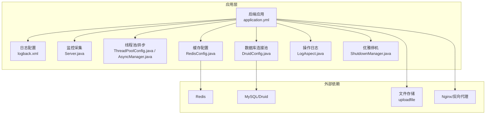
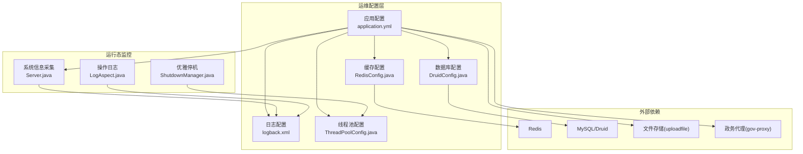
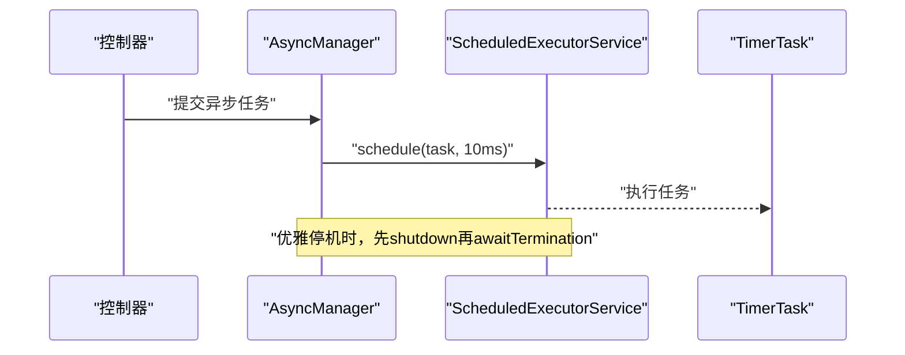
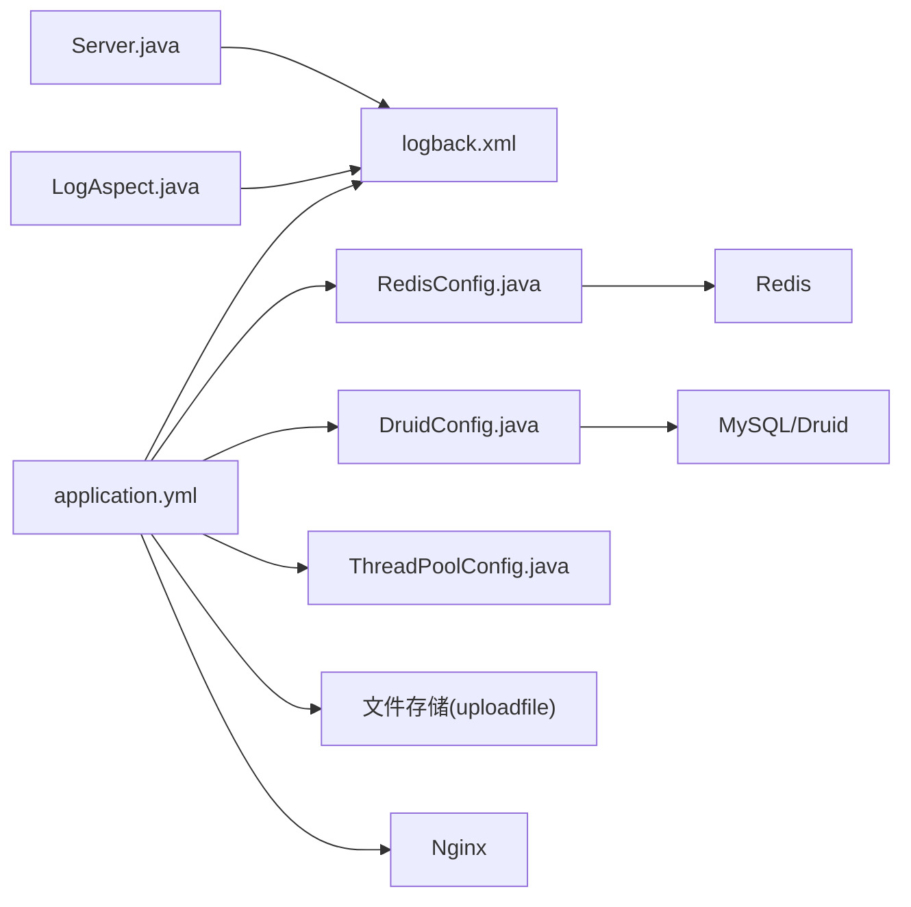
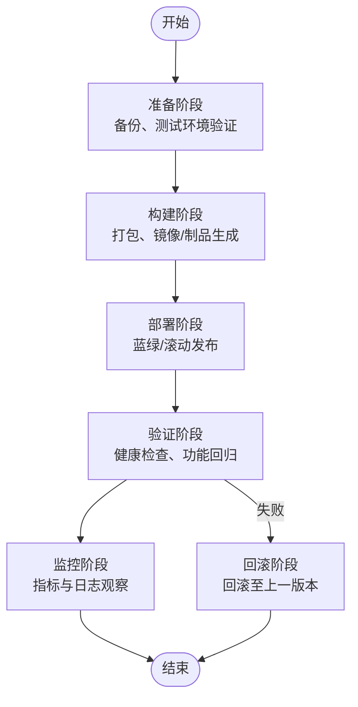
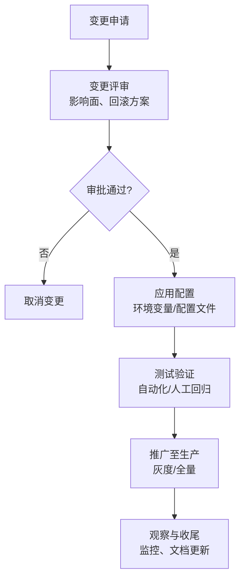
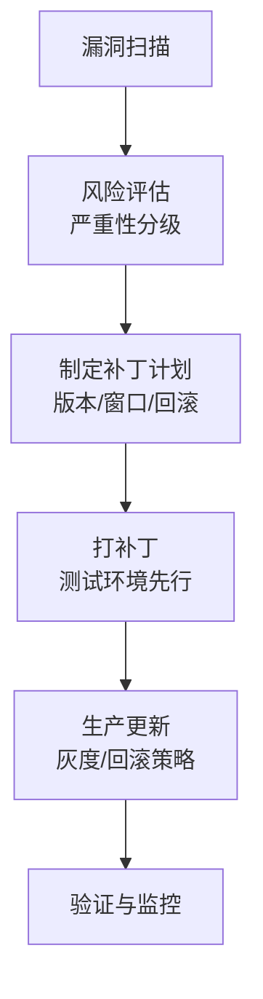

# 系统运维管理

<cite>
**本文引用的文件**   
- [application.yml](file://ruoyi-admin/src/main/resources/application.yml)
- [logback.xml](file://ruoyi-admin/src/main/resources/logback.xml)
- [RedisConfig.java](file://ruoyi-framework/src/main/java/com/ruoyi/framework/config/RedisConfig.java)
- [DruidConfig.java](file://ruoyi-framework/src/main/java/com/ruoyi/framework/config/DruidConfig.java)
- [ThreadPoolConfig.java](file://ruoyi-framework/src/main/java/com/ruoyi/framework/config/ThreadPoolConfig.java)
- [Server.java](file://ruoyi-framework/src/main/java/com/ruoyi/framework/web/domain/Server.java)
- [LogAspect.java](file://ruoyi-framework/src/main/java/com/ruoyi/framework/aspectj/LogAspect.java)
- [AsyncManager.java](file://ruoyi-framework/src/main/java/com/ruoyi/framework/manager/AsyncManager.java)
- [ShutdownManager.java](file://ruoyi-framework/src/main/java/com/ruoyi/framework/manager/ShutdownManager.java)
- [Threads.java](file://ruoyi-common/src/main/java/com/ruoyi/common/utils/Threads.java)
- [README.md](file://ghz-gov-proxy/deploy/README.md)
- [技术方案.html](file://技术方案.html)
</cite>

## 目录
1. [简介](#简介)
2. [项目结构](#项目结构)
3. [核心组件](#核心组件)
4. [架构总览](#架构总览)
5. [详细组件分析](#详细组件分析)
6. [依赖关系分析](#依赖关系分析)
7. [性能考量](#性能考量)
8. [故障排查指南](#故障排查指南)
9. [结论](#结论)
10. [附录](#附录)

## 简介
本指南面向港好住信息系统运维团队，提供从日常监控、日志管理、性能调优、容量规划，到数据备份恢复、文件存储管理、缓存清理，再到健康检查、异常告警、故障处理、版本升级与配置变更管理、安全补丁更新等全生命周期运维实践。文档结合代码库中的配置与实现，给出可落地的操作规范与可视化流程图，帮助快速定位问题、稳定系统运行。

## 项目结构
系统由后端Spring Boot应用、前端Vue管理界面、以及若干独立模块组成。运维关注的关键位置包括：
- 应用配置与运行参数：ruoyi-admin/src/main/resources/application.yml
- 日志配置：ruoyi-admin/src/main/resources/logback.xml
- 运维监控与系统信息采集：ruoyi-framework/web/domain/Server.java
- 异步与线程池：ruoyi-framework/config/ThreadPoolConfig.java、ruoyi-framework/manager/AsyncManager.java、ruoyi-common/utils/Threads.java
- 缓存与限流：ruoyi-framework/config/RedisConfig.java
- 数据库连接池与监控：ruoyi-framework/config/DruidConfig.java
- 操作日志与审计：ruoyi-framework/aspectj/LogAspect.java
- 退出与优雅停机：ruoyi-framework/manager/ShutdownManager.java
- 政务接口代理部署与联调：ghz-gov-proxy/deploy/README.md
- 基础设施与备份策略参考：技术方案.html

**图表来源**
- [application.yml:1-238](file://ruoyi-admin/src/main/resources/application.yml#L1-L238)
- [logback.xml:1-93](file://ruoyi-admin/src/main/resources/logback.xml#L1-L93)
- [Server.java:1-241](file://ruoyi-framework/src/main/java/com/ruoyi/framework/web/domain/Server.java#L1-L241)
- [ThreadPoolConfig.java:1-64](file://ruoyi-framework/src/main/java/com/ruoyi/framework/config/ThreadPoolConfig.java#L1-L64)
- [AsyncManager.java:1-56](file://ruoyi-framework/src/main/java/com/ruoyi/framework/manager/AsyncManager.java#L1-L56)
- [RedisConfig.java:1-71](file://ruoyi-framework/src/main/java/com/ruoyi/framework/config/RedisConfig.java#L1-L71)
- [DruidConfig.java:1-127](file://ruoyi-framework/src/main/java/com/ruoyi/framework/config/DruidConfig.java#L1-L127)
- [LogAspect.java:1-257](file://ruoyi-framework/src/main/java/com/ruoyi/framework/aspectj/LogAspect.java#L1-L257)
- [ShutdownManager.java:1-40](file://ruoyi-framework/src/main/java/com/ruoyi/framework/manager/ShutdownManager.java#L1-L40)

**章节来源**
- [application.yml:1-238](file://ruoyi-admin/src/main/resources/application.yml#L1-L238)
- [logback.xml:1-93](file://ruoyi-admin/src/main/resources/logback.xml#L1-L93)
- [Server.java:1-241](file://ruoyi-framework/src/main/java/com/ruoyi/framework/web/domain/Server.java#L1-L241)
- [ThreadPoolConfig.java:1-64](file://ruoyi-framework/src/main/java/com/ruoyi/framework/config/ThreadPoolConfig.java#L1-L64)
- [AsyncManager.java:1-56](file://ruoyi-framework/src/main/java/com/ruoyi/framework/manager/AsyncManager.java#L1-L56)
- [RedisConfig.java:1-71](file://ruoyi-framework/src/main/java/com/ruoyi/framework/config/RedisConfig.java#L1-L71)
- [DruidConfig.java:1-127](file://ruoyi-framework/src/main/java/com/ruoyi/framework/config/DruidConfig.java#L1-L127)
- [LogAspect.java:1-257](file://ruoyi-framework/src/main/java/com/ruoyi/framework/aspectj/LogAspect.java#L1-L257)
- [ShutdownManager.java:1-40](file://ruoyi-framework/src/main/java/com/ruoyi/framework/manager/ShutdownManager.java#L1-L40)

## 核心组件
- 应用配置与运行参数：端口、Tomcat线程池、文件上传大小、Redis连接、MyBatis-Plus、Swagger、XSS防护、微信/电子签等第三方集成参数均集中于application.yml，便于统一运维与灰度发布。
- 日志体系：logback.xml按INFO/ERROR拆分滚动日志，支持系统操作日志与用户行为日志分离，便于审计与问题定位。
- 监控采集：Server.java通过OSHI采集CPU、内存、磁盘、JVM等指标，为健康检查与容量规划提供数据基础。
- 线程池与异步：ThreadPoolConfig.java定义核心/最大线程数、队列容量、拒绝策略；AsyncManager.java负责异步任务调度；Threads.java提供优雅停机与异常打印。
- 缓存与限流：RedisConfig.java配置RedisTemplate与限流脚本，支撑高频读取与流量治理。
- 数据库连接池：DruidConfig.java启用动态数据源、监控页面广告移除、统计页面定制，便于DBA巡检与性能分析。
- 操作日志：LogAspect.java统一拦截控制器层操作，记录用户、IP、URL、耗时、异常等，落库异步处理，避免阻塞主流程。
- 优雅停机：ShutdownManager.java在容器销毁前触发异步任务回收，确保数据一致性与资源释放。

**章节来源**
- [application.yml:19-238](file://ruoyi-admin/src/main/resources/application.yml#L19-L238)
- [logback.xml:1-93](file://ruoyi-admin/src/main/resources/logback.xml#L1-L93)
- [Server.java:108-241](file://ruoyi-framework/src/main/java/com/ruoyi/framework/web/domain/Server.java#L108-L241)
- [ThreadPoolConfig.java:20-64](file://ruoyi-framework/src/main/java/com/ruoyi/framework/config/ThreadPoolConfig.java#L20-L64)
- [AsyncManager.java:14-56](file://ruoyi-framework/src/main/java/com/ruoyi/framework/manager/AsyncManager.java#L14-L56)
- [Threads.java:42-98](file://ruoyi-common/src/main/java/com/ruoyi/common/utils/Threads.java#L42-L98)
- [RedisConfig.java:22-71](file://ruoyi-framework/src/main/java/com/ruoyi/framework/config/RedisConfig.java#L22-L71)
- [DruidConfig.java:32-127](file://ruoyi-framework/src/main/java/com/ruoyi/framework/config/DruidConfig.java#L32-L127)
- [LogAspect.java:85-137](file://ruoyi-framework/src/main/java/com/ruoyi/framework/aspectj/LogAspect.java#L85-L137)
- [ShutdownManager.java:14-40](file://ruoyi-framework/src/main/java/com/ruoyi/framework/manager/ShutdownManager.java#L14-L40)

## 架构总览
系统运维涉及“应用配置—运行态监控—日志审计—数据库/缓存—文件存储—代理与外部接口”的全链路协同。下图展示运维关键节点与交互：

**图表来源**
- [application.yml:1-238](file://ruoyi-admin/src/main/resources/application.yml#L1-L238)
- [logback.xml:1-93](file://ruoyi-admin/src/main/resources/logback.xml#L1-L93)
- [RedisConfig.java:1-71](file://ruoyi-framework/src/main/java/com/ruoyi/framework/config/RedisConfig.java#L1-L71)
- [DruidConfig.java:1-127](file://ruoyi-framework/src/main/java/com/ruoyi/framework/config/DruidConfig.java#L1-L127)
- [ThreadPoolConfig.java:1-64](file://ruoyi-framework/src/main/java/com/ruoyi/framework/config/ThreadPoolConfig.java#L1-L64)
- [Server.java:1-241](file://ruoyi-framework/src/main/java/com/ruoyi/framework/web/domain/Server.java#L1-L241)
- [LogAspect.java:1-257](file://ruoyi-framework/src/main/java/com/ruoyi/framework/aspectj/LogAspect.java#L1-L257)
- [ShutdownManager.java:1-40](file://ruoyi-framework/src/main/java/com/ruoyi/framework/manager/ShutdownManager.java#L1-L40)

## 详细组件分析

### 应用配置与运行参数（application.yml）
- 服务器端口、Tomcat线程池、URI编码、排队数、最大线程与最小空闲线程等，直接影响并发承载与响应时延。
- 文件上传大小上限、profile路径决定静态资源与VR全景图等大文件的承载能力与存储位置。
- Redis连接参数、超时、池大小，决定缓存命中率与限流脚本执行效率。
- MyBatis-Plus全局配置、日志实现类、驼峰映射、缓存开关等，影响ORM性能与调试体验。
- Swagger开启与路径、国际化资源路径、XSS过滤范围、防盗链开关等，影响API可发现性与安全边界。
- 第三方集成参数（微信支付、电子签、郑好办、政务代理），统一在配置中心管理，便于灰度与回滚。

运维建议
- 在压测或高峰期前，结合Server.java采集的CPU/内存/磁盘使用率，调整Tomcat线程池与Redis池大小。
- 大文件上传场景下，优先评估磁盘IO与Nginx上传上限，避免因单次请求过大导致超时。
- 分环境区分配置（dev/test/prod），通过profiles切换与环境变量覆盖，减少误操作风险。

**章节来源**
- [application.yml:19-238](file://ruoyi-admin/src/main/resources/application.yml#L19-L238)

### 日志管理（logback.xml）
- INFO/ERROR双通道滚动日志，按天切割，保留60天，降低单文件体积与磁盘压力。
- 系统操作日志与用户行为日志分离，便于审计与合规。
- 控制台与文件同时输出，便于开发调试与生产观察。

运维建议
- 结合LogAspect.java记录的操作日志，建立统一的告警阈值（如ERROR级日志量突增、特定接口耗时异常）。
- 定期清理过期日志，监控日志目录空间，防止磁盘占满导致应用异常。

**章节来源**
- [logback.xml:1-93](file://ruoyi-admin/src/main/resources/logback.xml#L1-L93)
- [LogAspect.java:85-137](file://ruoyi-framework/src/main/java/com/ruoyi/framework/aspectj/LogAspect.java#L85-L137)

### 系统健康与容量监控（Server.java）
- 采集CPU核数、使用率、等待率；内存总量/使用/空闲；JVM内存与版本；磁盘挂载点、使用率与容量。
- 提供容量预警阈值建议：CPU使用率>80%、磁盘使用率>85%、内存使用率>85%触发预警。

运维建议
- 将采集结果接入监控面板（如Prometheus/Grafana），设置阈值告警。
- 结合ThreadPoolConfig.java的线程池参数，观察线程排队长度与拒绝次数，判断是否需要扩容。

**章节来源**
- [Server.java:108-241](file://ruoyi-framework/src/main/java/com/ruoyi/framework/web/domain/Server.java#L108-L241)

### 线程池与异步任务（ThreadPoolConfig.java、AsyncManager.java、Threads.java）
- 线程池核心参数：核心线程、最大线程、队列容量、空闲存活时间、拒绝策略（CallerRunsPolicy）。
- 异步任务通过AsyncManager调度，延迟10ms执行，避免瞬时抖动。
- 优雅停机：ShutdownManager在销毁前调用shutdownAndAwaitTermination，确保异步任务有序结束。

运维建议
- 观察线程池拒绝次数与队列长度，结合业务峰值进行容量规划。
- 发布前进行压测，验证拒绝策略在高负载下的稳定性。

**图表来源**
- [AsyncManager.java:14-56](file://ruoyi-framework/src/main/java/com/ruoyi/framework/manager/AsyncManager.java#L14-L56)
- [ThreadPoolConfig.java:48-62](file://ruoyi-framework/src/main/java/com/ruoyi/framework/config/ThreadPoolConfig.java#L48-L62)
- [Threads.java:42-64](file://ruoyi-common/src/main/java/com/ruoyi/common/utils/Threads.java#L42-L64)

**章节来源**
- [ThreadPoolConfig.java:20-64](file://ruoyi-framework/src/main/java/com/ruoyi/framework/config/ThreadPoolConfig.java#L20-L64)
- [AsyncManager.java:14-56](file://ruoyi-framework/src/main/java/com/ruoyi/framework/manager/AsyncManager.java#L14-L56)
- [Threads.java:42-98](file://ruoyi-common/src/main/java/com/ruoyi/common/utils/Threads.java#L42-L98)

### 缓存与限流（RedisConfig.java）
- RedisTemplate序列化策略：key/value采用String/JSON序列化，Hash同样配置，保证跨语言与跨模块兼容。
- 限流脚本：基于Lua的原子计数+过期控制，支持按key限流，适合登录/验证码/接口保护等场景。
- 运维要点：监控命中率、过期键比例、内存使用；定期清理无用键；合理设置TTL。

运维建议
- 针对热点数据增加副本或分片，避免单实例成为瓶颈。
- 限流阈值应结合SLA与业务峰值设定，并预留10%-30%余量。

**章节来源**
- [RedisConfig.java:22-71](file://ruoyi-framework/src/main/java/com/ruoyi/framework/config/RedisConfig.java#L22-L71)

### 数据库连接池与监控（DruidConfig.java）
- 动态数据源：支持主从切换，按需启用从库，提升读扩展能力。
- 监控页面：statViewServlet可配置，广告移除过滤器避免UI污染。
- 运维要点：关注连接池活跃数、等待时间、泄漏检测；定期巡检慢SQL。

运维建议
- 生产环境开启statViewServlet并限制访问；结合慢SQL日志优化查询。
- 主从库一致性校验与延迟监控，避免读到旧数据。

**章节来源**
- [DruidConfig.java:32-127](file://ruoyi-framework/src/main/java/com/ruoyi/framework/config/DruidConfig.java#L32-L127)

### 操作日志与审计（LogAspect.java）
- 统一拦截控制器层，记录用户、IP、URL、方法、请求方式、耗时、异常信息。
- 支持保存请求/响应参数（敏感字段过滤），异步入库，避免阻塞主线程。
- 运维要点：建立日志聚合与检索平台，设置异常占比与耗时阈值告警。

运维建议
- 敏感字段（密码等）默认过滤；必要时临时放开并严格审计。
- 定期清理历史操作日志，控制存储成本。

**章节来源**
- [LogAspect.java:85-137](file://ruoyi-framework/src/main/java/com/ruoyi/framework/aspectj/LogAspect.java#L85-L137)

### 优雅停机（ShutdownManager.java）
- 应用销毁前触发AsyncManager.shutdown，确保异步任务有序结束。
- 与Threads.java的优雅停机配合，避免任务丢失或资源泄露。

运维建议
- 发布流程中预留停机窗口，确保异步任务在窗口内完成。
- 结合K8s/PM2等进程管理器，设置优雅停机信号与超时时间。

**章节来源**
- [ShutdownManager.java:14-40](file://ruoyi-framework/src/main/java/com/ruoyi/framework/manager/ShutdownManager.java#L14-L40)
- [Threads.java:42-64](file://ruoyi-common/src/main/java/com/ruoyi/common/utils/Threads.java#L42-L64)

### 政务接口代理运维（ghz-gov-proxy/deploy/README.md）
- 三层联调：L1本机、L2专线、L3公网，逐层验证网络连通与代理转发。
- API Key校验：请求头必须携带X-Api-Key，错误将返回401。
- 健康检查：/api/v1/gov/ping，状态UP表示服务可用。
- 常见问题：L1失败（jar未启动）、L2失败（服务器间不可达）、L3失败（NAT/防火墙）、401（Key错误）、504（政务接口超时）。

运维建议
- 建立代理健康巡检脚本，定时探测各层级连通性。
- 与政务侧约定SLA与超时阈值，超出阈值及时告警并降级。

**章节来源**
- [README.md:1-177](file://ghz-gov-proxy/deploy/README.md#L1-L177)

## 依赖关系分析
- 配置驱动：application.yml为全局配置源，影响日志、缓存、数据库、线程池、第三方集成等子系统。
- 运行态监控：Server.java为底层采集入口，ThreadPoolConfig.java与LogAspect.java为运行态观测与审计入口。
- 外部依赖：Redis、MySQL/Druid、文件存储、Nginx、政务代理共同构成系统边界。

**图表来源**
- [application.yml:1-238](file://ruoyi-admin/src/main/resources/application.yml#L1-L238)
- [logback.xml:1-93](file://ruoyi-admin/src/main/resources/logback.xml#L1-L93)
- [RedisConfig.java:1-71](file://ruoyi-framework/src/main/java/com/ruoyi/framework/config/RedisConfig.java#L1-L71)
- [DruidConfig.java:1-127](file://ruoyi-framework/src/main/java/com/ruoyi/framework/config/DruidConfig.java#L1-L127)
- [ThreadPoolConfig.java:1-64](file://ruoyi-framework/src/main/java/com/ruoyi/framework/config/ThreadPoolConfig.java#L1-L64)
- [Server.java:1-241](file://ruoyi-framework/src/main/java/com/ruoyi/framework/web/domain/Server.java#L1-L241)
- [LogAspect.java:1-257](file://ruoyi-framework/src/main/java/com/ruoyi/framework/aspectj/LogAspect.java#L1-L257)

**章节来源**
- [application.yml:1-238](file://ruoyi-admin/src/main/resources/application.yml#L1-L238)
- [logback.xml:1-93](file://ruoyi-admin/src/main/resources/logback.xml#L1-L93)
- [RedisConfig.java:1-71](file://ruoyi-framework/src/main/java/com/ruoyi/framework/config/RedisConfig.java#L1-L71)
- [DruidConfig.java:1-127](file://ruoyi-framework/src/main/java/com/ruoyi/framework/config/DruidConfig.java#L1-L127)
- [ThreadPoolConfig.java:1-64](file://ruoyi-framework/src/main/java/com/ruoyi/framework/config/ThreadPoolConfig.java#L1-L64)
- [Server.java:1-241](file://ruoyi-framework/src/main/java/com/ruoyi/framework/web/domain/Server.java#L1-L241)
- [LogAspect.java:1-257](file://ruoyi-framework/src/main/java/com/ruoyi/framework/aspectj/LogAspect.java#L1-L257)

## 性能考量
- 线程池参数：根据峰值QPS与平均响应时间，估算核心线程与队列容量，避免过多上下文切换与阻塞。
- 缓存命中：通过RedisConfig.java的序列化与限流脚本，结合监控面板观察命中率与过期键比例。
- 数据库：DruidConfig.java开启监控，识别慢SQL与连接池瓶颈；读写分离与索引优化同步推进。
- 文件存储：application.yml中的文件上传上限与uploadfile目录容量，需与Nginx/CDN策略协同。
- 日志：INFO/ERROR分离与按天滚动，避免单文件过大影响IO。

[本节为通用指导，无需具体文件引用]

## 故障排查指南
- 健康检查
  - 应用：访问/actuator或自定义健康端点，确认服务状态。
  - 代理：参考ghz-gov-proxy部署文档的三层联调步骤，逐步验证L1/L2/L3连通性。
- 常见现象与定位
  - L1失败（本机健康检查不通）：查看运行日志与进程状态。
  - L1通/L2失败：检查服务器间网络与端口连通性。
  - L2通/L3失败：检查NAT映射与防火墙策略。
  - 401：确认请求头X-Api-Key正确。
  - 504：政务接口超时，建议延长超时或降级。
- 日志与审计
  - 结合logback.xml与LogAspect.java，定位ERROR级异常与耗时接口。
  - 关注线程池拒绝次数与队列长度，判断是否需要扩容。
- 数据库与缓存
  - Druid监控页面查看慢SQL与连接池状态。
  - Redis键空间扫描与TTL分布，清理过期键与热点键。

**章节来源**
- [README.md:154-163](file://ghz-gov-proxy/deploy/README.md#L154-L163)
- [logback.xml:1-93](file://ruoyi-admin/src/main/resources/logback.xml#L1-L93)
- [LogAspect.java:85-137](file://ruoyi-framework/src/main/java/com/ruoyi/framework/aspectj/LogAspect.java#L85-L137)
- [DruidConfig.java:84-125](file://ruoyi-framework/src/main/java/com/ruoyi/framework/config/DruidConfig.java#L84-L125)

## 结论
本指南基于代码库中的配置与实现，给出了港好住信息系统运维的标准化流程与最佳实践。通过统一的配置中心、完善的日志与审计、可观测的系统指标、合理的线程池与缓存策略，以及清晰的故障排查路径，可显著提升系统的稳定性与可维护性。建议在生产环境中配套监控与告警平台，形成闭环运维。

[本节为总结，无需具体文件引用]

## 附录

### 运维手册模板（条目式）
- 系统基本信息
  - 系统名称、版本、负责人、联系方式
  - 服务器清单（IP、角色、端口、用途）
- 配置管理
  - application.yml分环境配置清单与变更审批流程
  - 环境变量覆盖清单（如GOV_PROXY_*、ZHB_*）
- 监控与告警
  - 关键指标阈值（CPU/内存/磁盘/线程池/Redis/数据库）
  - 告警渠道与升级路径（电话/邮件/IM）
- 日志与审计
  - 日志目录与保留策略、轮转规则
  - 操作日志保存范围与敏感字段过滤
- 数据备份与恢复
  - 数据库全量/增量备份策略与保留期
  - 文件备份策略与异地容灾
- 容量规划
  - 服务器规格建议、线程池参数建议、缓存容量建议
- 应急预案
  - 健康检查脚本、常见故障处置流程、回滚步骤
- 变更管理
  - 版本升级流程、配置变更审批、安全补丁更新流程

[本节为模板说明，无需具体文件引用]

### 版本升级流程（示意）

[本图为概念流程，无需图表来源]

### 配置变更管理（示意）

[本图为概念流程，无需图表来源]

### 安全补丁更新（示意）

[本图为概念流程，无需图表来源]

### 备份恢复策略（参考）
- 数据库全量备份：每日凌晨2点
- 增量备份：每4小时
- 文件备份：每日备份至NAS
- 备份保留：30天
- 恢复演练：每季度一次

**章节来源**
- [技术方案.html:1937-1943](file://技术方案.html#L1937-L1943)