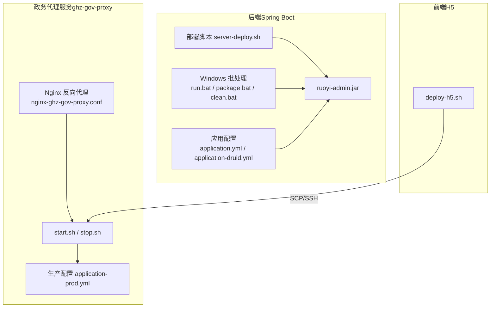
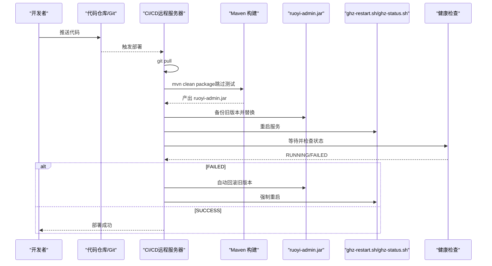
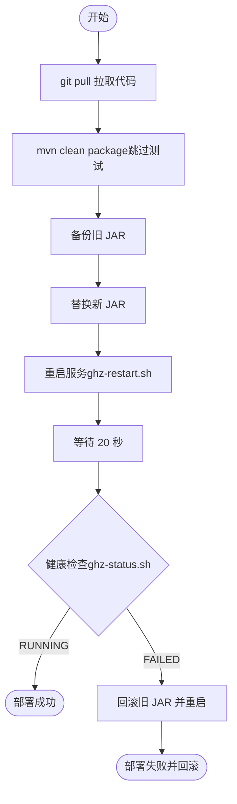
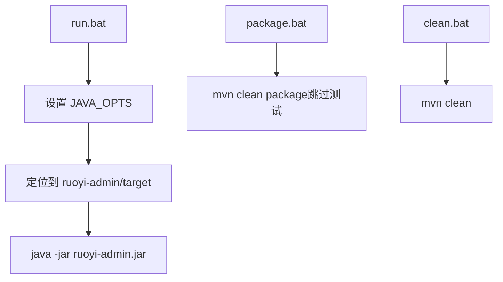
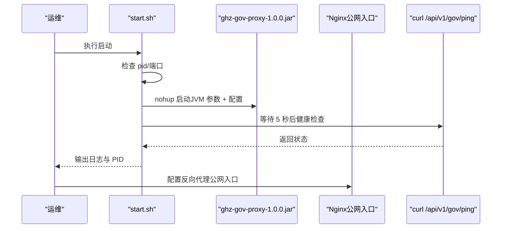
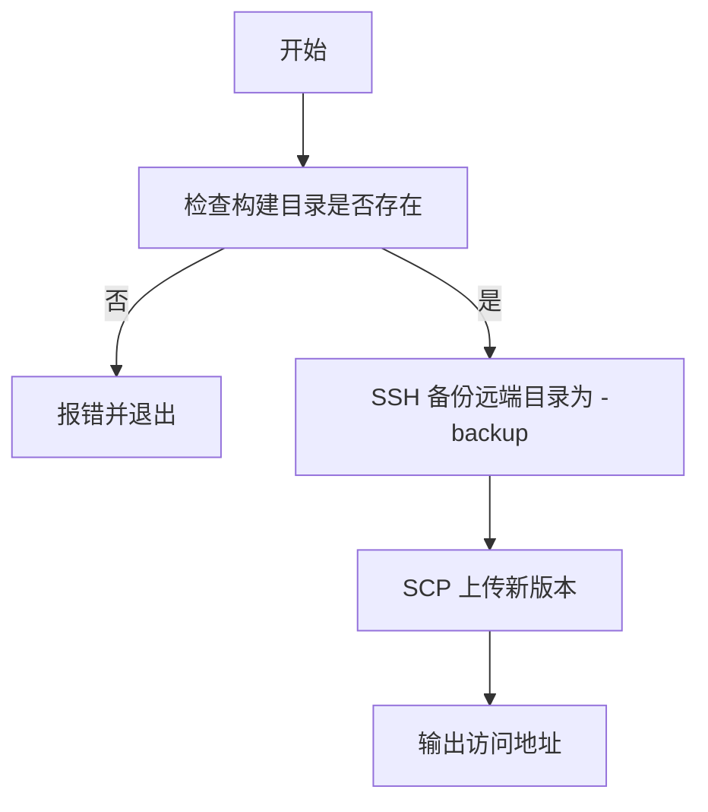
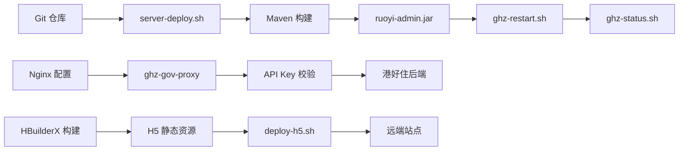

# 部署运维操作

<cite>
**本文引用的文件**
- [server-deploy.sh](file://server-deploy.sh)
- [run.bat](file://bin/run.bat)
- [package.bat](file://bin/package.bat)
- [clean.bat](file://bin/clean.bat)
- [start.sh](file://ghz-gov-proxy/deploy/start.sh)
- [stop.sh](file://ghz-gov-proxy/deploy/stop.sh)
- [application-prod.yml](file://ghz-gov-proxy/deploy/application-prod.yml)
- [nginx-ghz-gov-proxy.conf](file://ghz-gov-proxy/deploy/nginx-ghz-gov-proxy.conf)
- [README.md（ghz-gov-proxy 部署指南）](file://ghz-gov-proxy/deploy/README.md)
- [港好住后端对接指南.md](file://ghz-gov-proxy/deploy/港好住后端对接指南.md)
- [application.yml（ruoyi-admin）](file://ruoyi-admin/src/main/resources/application.yml)
- [application-druid.yml（ruoyi-admin）](file://ruoyi-admin/src/main/resources/application-druid.yml)
- [deploy-h5.sh](file://uniapp-h5/deploy-h5.sh)
- [部署总结.md](file://部署总结.md)
</cite>

## 目录
1. [简介](#简介)
2. [项目结构](#项目结构)
3. [核心组件](#核心组件)
4. [架构总览](#架构总览)
5. [详细组件分析](#详细组件分析)
6. [依赖关系分析](#依赖关系分析)
7. [性能考量](#性能考量)
8. [故障排查指南](#故障排查指南)
9. [结论](#结论)
10. [附录](#附录)

## 简介
本文件面向港好住信息系统运维与开发团队，提供标准化的部署运维操作流程与最佳实践，覆盖自动化部署（代码拉取、编译打包、服务替换与重启）、多环境策略（开发/测试/生产）、服务启停管理（正常启动、优雅关闭、强制重启）、回滚机制（自动与手动）、部署监控与健康检查，以及常见问题与风险控制措施。文中所有流程均基于仓库现有脚本与配置文件进行梳理与可视化呈现。

## 项目结构
本项目包含后端 Spring Boot 应用、前端 H5、政务代理服务及配套 Nginx 配置、Windows 打包与运行批处理脚本、以及部署总结与对接文档。关键部署相关目录与文件如下：
- 后端自动化部署脚本：server-deploy.sh
- Windows 打包/运行脚本：bin/run.bat、bin/package.bat、bin/clean.bat
- 政务代理服务：ghz-gov-proxy/deploy/start.sh、stop.sh、application-prod.yml、nginx-ghz-gov-proxy.conf
- 前端 H5 一键部署：uniapp-h5/deploy-h5.sh
- 配置样例：ruoyi-admin/src/main/resources/application.yml、application-druid.yml
- 运维总结与对接文档：部署总结.md、ghz-gov-proxy/deploy/README.md、港好住后端对接指南.md

图表来源
- [server-deploy.sh:1-42](file://server-deploy.sh#L1-L42)
- [run.bat:1-14](file://bin/run.bat#L1-L14)
- [package.bat:1-12](file://bin/package.bat#L1-L12)
- [clean.bat:1-12](file://bin/clean.bat#L1-L12)
- [start.sh:1-47](file://ghz-gov-proxy/deploy/start.sh#L1-L47)
- [stop.sh:1-42](file://ghz-gov-proxy/deploy/stop.sh#L1-L42)
- [application-prod.yml:1-26](file://ghz-gov-proxy/deploy/application-prod.yml#L1-L26)
- [nginx-ghz-gov-proxy.conf:1-45](file://ghz-gov-proxy/deploy/nginx-ghz-gov-proxy.conf#L1-L45)
- [application.yml:1-238](file://ruoyi-admin/src/main/resources/application.yml#L1-L238)
- [application-druid.yml:1-64](file://ruoyi-admin/src/main/resources/application-druid.yml#L1-L64)
- [deploy-h5.sh:1-42](file://uniapp-h5/deploy-h5.sh#L1-L42)

章节来源
- [server-deploy.sh:1-42](file://server-deploy.sh#L1-L42)
- [run.bat:1-14](file://bin/run.bat#L1-L14)
- [package.bat:1-12](file://bin/package.bat#L1-L12)
- [clean.bat:1-12](file://bin/clean.bat#L1-L12)
- [start.sh:1-47](file://ghz-gov-proxy/deploy/start.sh#L1-L47)
- [stop.sh:1-42](file://ghz-gov-proxy/deploy/stop.sh#L1-L42)
- [application-prod.yml:1-26](file://ghz-gov-proxy/deploy/application-prod.yml#L1-L26)
- [nginx-ghz-gov-proxy.conf:1-45](file://ghz-gov-proxy/deploy/nginx-ghz-gov-proxy.conf#L1-L45)
- [application.yml:1-238](file://ruoyi-admin/src/main/resources/application.yml#L1-L238)
- [application-druid.yml:1-64](file://ruoyi-admin/src/main/resources/application-druid.yml#L1-L64)
- [deploy-h5.sh:1-42](file://uniapp-h5/deploy-h5.sh#L1-L42)

## 核心组件
- 后端自动化部署脚本 server-deploy.sh：负责拉取代码、编译打包、备份旧版本、替换 JAR、重启服务、健康检查与自动回滚。
- Windows 批处理：run.bat 用于本地运行 JAR；package.bat 用于打包；clean.bat 用于清理 target。
- 政务代理服务：start.sh/stop.sh 提供启动与优雅停止；application-prod.yml 提供生产配置；nginx-ghz-gov-proxy.conf 提供公网入口反向代理。
- 前端 H5 一键部署：deploy-h5.sh 通过 SSH/SFTP 上传构建产物并进行备份与回滚。
- 应用配置：application.yml 与 application-druid.yml 提供端口、日志、数据库、文件上传、政务代理等关键参数。

章节来源
- [server-deploy.sh:1-42](file://server-deploy.sh#L1-L42)
- [run.bat:1-14](file://bin/run.bat#L1-L14)
- [package.bat:1-12](file://bin/package.bat#L1-L12)
- [clean.bat:1-12](file://bin/clean.bat#L1-L12)
- [start.sh:1-47](file://ghz-gov-proxy/deploy/start.sh#L1-L47)
- [stop.sh:1-42](file://ghz-gov-proxy/deploy/stop.sh#L1-L42)
- [application-prod.yml:1-26](file://ghz-gov-proxy/deploy/application-prod.yml#L1-L26)
- [nginx-ghz-gov-proxy.conf:1-45](file://ghz-gov-proxy/deploy/nginx-ghz-gov-proxy.conf#L1-L45)
- [application.yml:1-238](file://ruoyi-admin/src/main/resources/application.yml#L1-L238)
- [application-druid.yml:1-64](file://ruoyi-admin/src/main/resources/application-druid.yml#L1-L64)
- [deploy-h5.sh:1-42](file://uniapp-h5/deploy-h5.sh#L1-L42)

## 架构总览
后端采用“Git 推送触发 → 远程服务器拉取 → Maven 编译 → 替换 JAR → 重启服务 → 健康检查”的自动化流水线；前端 H5 通过 SSH/SFTP 一键部署至静态站点；政务代理服务通过 Nginx 在互联网区与政务外网之间进行跨网转发，港好住后端仅需调用公网入口并携带 API Key。

图表来源
- [server-deploy.sh:1-42](file://server-deploy.sh#L1-L42)

章节来源
- [server-deploy.sh:1-42](file://server-deploy.sh#L1-L42)
- [部署总结.md:17-59](file://部署总结.md#L17-L59)

## 详细组件分析

### 后端自动化部署流程（server-deploy.sh）
- 步骤概览
  1) 切换到代码目录并拉取最新代码
  2) Maven 清理并打包（跳过测试），限定模块 ruoyi-admin
  3) 备份当前运行的 JAR（ruoyi-admin.jar → ruoyi-admin-backup.jar）
  4) 替换为目标 JAR
  5) 调用 ghz-restart.sh 重启服务
  6) 等待并使用 ghz-status.sh 检查状态，失败则自动回滚并再次重启

图表来源
- [server-deploy.sh:1-42](file://server-deploy.sh#L1-L42)

章节来源
- [server-deploy.sh:1-42](file://server-deploy.sh#L1-L42)
- [部署总结.md:17-59](file://部署总结.md#L17-L59)

### Windows 本地运行与打包（bin/*.bat）
- run.bat：设置 JVM 参数并以 java -jar 方式运行 ruoyi-admin.jar，适用于本地调试。
- package.bat：执行 Maven 打包，跳过测试。
- clean.bat：清理 target 目录。

图表来源
- [run.bat:1-14](file://bin/run.bat#L1-L14)
- [package.bat:1-12](file://bin/package.bat#L1-L12)
- [clean.bat:1-12](file://bin/clean.bat#L1-L12)

章节来源
- [run.bat:1-14](file://bin/run.bat#L1-L14)
- [package.bat:1-12](file://bin/package.bat#L1-L12)
- [clean.bat:1-12](file://bin/clean.bat#L1-L12)

### 政务代理服务（ghz-gov-proxy）启动与停止
- 启动流程（start.sh）
  - 检查是否已运行（run.pid）
  - 创建日志目录
  - nohup 启动 Java 进程，设置 JVM 参数与配置文件路径
  - 启动后等待 5 秒并使用 curl 健康检查
- 停止流程（stop.sh）
  - 优先通过 run.pid 获取进程号，否则通过端口查找
  - kill 优雅停止，等待 10 秒，超时则强制 kill -9
  - 清理 run.pid

图表来源
- [start.sh:1-47](file://ghz-gov-proxy/deploy/start.sh#L1-L47)
- [stop.sh:1-42](file://ghz-gov-proxy/deploy/stop.sh#L1-L42)
- [application-prod.yml:1-26](file://ghz-gov-proxy/deploy/application-prod.yml#L1-L26)
- [nginx-ghz-gov-proxy.conf:1-45](file://ghz-gov-proxy/deploy/nginx-ghz-gov-proxy.conf#L1-L45)

章节来源
- [start.sh:1-47](file://ghz-gov-proxy/deploy/start.sh#L1-L47)
- [stop.sh:1-42](file://ghz-gov-proxy/deploy/stop.sh#L1-L42)
- [application-prod.yml:1-26](file://ghz-gov-proxy/deploy/application-prod.yml#L1-L26)
- [nginx-ghz-gov-proxy.conf:1-45](file://ghz-gov-proxy/deploy/nginx-ghz-gov-proxy.conf#L1-L45)
- [README.md（ghz-gov-proxy 部署指南）:1-177](file://ghz-gov-proxy/deploy/README.md#L1-L177)
- [港好住后端对接指南.md:1-679](file://ghz-gov-proxy/deploy/港好住后端对接指南.md#L1-L679)

### 前端 H5 一键部署（deploy-h5.sh）
- 读取构建产物目录，检查存在性
- 备份远端目录（如存在）为 -backup
- 通过 SCP 上传新版本
- 输出访问地址，无需额外 Nginx 重载

图表来源
- [deploy-h5.sh:1-42](file://uniapp-h5/deploy-h5.sh#L1-L42)

章节来源
- [deploy-h5.sh:1-42](file://uniapp-h5/deploy-h5.sh#L1-L42)

### 多环境部署策略
- 开发环境：本地 run.bat 启动，application.yml 默认端口与日志级别较高，适合调试。
- 测试环境：可复用 application.yml 与 application-druid.yml，调整数据库与文件存储路径。
- 生产环境：使用 ghz-gov-proxy 的 application-prod.yml，Nginx 反向代理公网入口，港好住后端通过 API Key 调用。

章节来源
- [application.yml:1-238](file://ruoyi-admin/src/main/resources/application.yml#L1-L238)
- [application-druid.yml:1-64](file://ruoyi-admin/src/main/resources/application-druid.yml#L1-L64)
- [application-prod.yml:1-26](file://ghz-gov-proxy/deploy/application-prod.yml#L1-L26)
- [nginx-ghz-gov-proxy.conf:1-45](file://ghz-gov-proxy/deploy/nginx-ghz-gov-proxy.conf#L1-L45)
- [README.md（ghz-gov-proxy 部署指南）:1-177](file://ghz-gov-proxy/deploy/README.md#L1-L177)

### 服务启停管理（正常启动、优雅关闭、强制重启）
- 正常启动：start.sh 检查运行状态、准备日志、nohup 启动并健康检查。
- 优雅关闭：stop.sh 通过 kill 等待 10 秒，超时强制 kill -9。
- 强制重启：可通过 ghz-restart.sh 或 stop.sh + start.sh 组合实现。

章节来源
- [start.sh:1-47](file://ghz-gov-proxy/deploy/start.sh#L1-L47)
- [stop.sh:1-42](file://ghz-gov-proxy/deploy/stop.sh#L1-L42)
- [部署总结.md:56-59](file://部署总结.md#L56-L59)

### 部署回滚机制（自动与手动）
- 自动回滚：server-deploy.sh 在健康检查失败后，将 ruoyi-admin-backup.jar 恢复为 ruoyi-admin.jar 并重启。
- 手动回滚：通过备份目录或版本管理工具恢复旧版本 JAR，再执行重启。

章节来源
- [server-deploy.sh:32-39](file://server-deploy.sh#L32-L39)
- [部署总结.md:31-39](file://部署总结.md#L31-L39)

### 部署监控与健康检查
- 后端：server-deploy.sh 使用 ghz-status.sh 检查服务状态；日志路径参考部署总结。
- 前端：H5 部署后通过访问 https://app.caigon.cn 验证。
- 政务代理：start.sh 启动后 5 秒健康检查；README 提供 L1/L2/L3 三层健康检查步骤与故障排查。

章节来源
- [server-deploy.sh:31-39](file://server-deploy.sh#L31-L39)
- [deploy-h5.sh:41-42](file://uniapp-h5/deploy-h5.sh#L41-L42)
- [start.sh:38-46](file://ghz-gov-proxy/deploy/start.sh#L38-L46)
- [README.md（ghz-gov-proxy 部署指南）:110-150](file://ghz-gov-proxy/deploy/README.md#L110-L150)
- [部署总结.md:41-54](file://部署总结.md#L41-L54)

## 依赖关系分析
- 后端部署依赖
  - Git 仓库与远程服务器权限
  - Maven 环境与本地编译能力
  - 重启与状态脚本（ghz-restart.sh、ghz-status.sh）
  - 目标路径与备份策略
- 政务代理依赖
  - JRE 8 运行时
  - Nginx 反向代理配置
  - API Key 与请求头校验
- 前端依赖
  - HBuilderX 构建产物
  - SSH 密钥与目标服务器权限
  - 远端路径与备份策略

图表来源
- [server-deploy.sh:1-42](file://server-deploy.sh#L1-L42)
- [nginx-ghz-gov-proxy.conf:1-45](file://ghz-gov-proxy/deploy/nginx-ghz-gov-proxy.conf#L1-L45)
- [deploy-h5.sh:1-42](file://uniapp-h5/deploy-h5.sh#L1-L42)

章节来源
- [server-deploy.sh:1-42](file://server-deploy.sh#L1-L42)
- [nginx-ghz-gov-proxy.conf:1-45](file://ghz-gov-proxy/deploy/nginx-ghz-gov-proxy.conf#L1-L45)
- [deploy-h5.sh:1-42](file://uniapp-h5/deploy-h5.sh#L1-L42)

## 性能考量
- 编译阶段：server-deploy.sh 使用 -DskipTests 跳过测试，缩短构建时间；建议在 CI 中保留该策略。
- JVM 参数：start.sh 与 run.bat 提供内存与 GC 参数示例，可根据业务峰值调优。
- 健康检查：server-deploy.sh 等待 20 秒后再检查；Nginx 代理设置较长读取超时以适配政务接口慢响应。
- 前端静态资源：H5 通过 SCP 上传，建议开启浏览器缓存与 CDN 加速（如需）。

章节来源
- [server-deploy.sh:13-13](file://server-deploy.sh#L13-L13)
- [start.sh:22-24](file://ghz-gov-proxy/deploy/start.sh#L22-L24)
- [run.bat:9-11](file://bin/run.bat#L9-L11)
- [nginx-ghz-gov-proxy.conf:32-34](file://ghz-gov-proxy/deploy/nginx-ghz-gov-proxy.conf#L32-L34)

## 故障排查指南
- 后端部署失败
  - 检查 ghz-status.sh 返回状态
  - 自动回滚后再次启动
  - 参考部署总结中的日志查看与服务状态命令
- 政务代理服务
  - L1：本机 curl /api/v1/gov/ping 未通，查看 run.log
  - L2：专线层连不通，检查 Nginx 与防火墙
  - L3：公网 42.228.16.25:8088 未通，检查 NAT 与白名单
  - API Key 错误：确认请求头 X-Api-Key
- 前端 H5
  - 构建目录缺失：先在 HBuilderX 执行“发行 → 网站 PC Web”
  - 上传失败：检查 SSH 密钥、端口与远端路径

章节来源
- [server-deploy.sh:31-39](file://server-deploy.sh#L31-L39)
- [部署总结.md:41-59](file://部署总结.md#L41-L59)
- [README.md（ghz-gov-proxy 部署指南）:154-163](file://ghz-gov-proxy/deploy/README.md#L154-L163)
- [港好住后端对接指南.md:486-526](file://ghz-gov-proxy/deploy/港好住后端对接指南.md#L486-L526)
- [deploy-h5.sh:20-24](file://uniapp-h5/deploy-h5.sh#L20-L24)

## 结论
本标准流程文档基于仓库现有脚本与配置，提供了从代码拉取、编译打包、服务替换与重启、健康检查到自动/手动回滚的完整闭环。结合多环境策略与三层健康检查方法，可显著提升部署的可控性与安全性。建议在 CI/CD 中固化 server-deploy.sh 的执行步骤，并在生产环境严格执行 API Key 与白名单管理。

## 附录
- 关键路径与配置
  - 后端 JAR 与备份：/www/wwwroot/ghz-backend/ruoyi-admin.jar、ruoyi-admin-backup.jar
  - 日志路径：/www/wwwroot/ghz-backend/logs/app.log、deploy.log
  - 政务代理配置：/opt/ghz-gov-proxy/application-prod.yml
  - Nginx 配置：/etc/nginx/conf.d/ghz-gov-proxy.conf
- 常用命令
  - 查看部署日志：tail -f /www/wwwroot/ghz-backend/logs/deploy.log
  - 查看应用日志：tail -f /www/wwwroot/ghz-backend/logs/app.log
  - 查看服务状态：sudo supervisorctl status ghz-backend
  - 手动重启：sudo supervisorctl restart ghz-backend

章节来源
- [部署总结.md:31-59](file://部署总结.md#L31-L59)
- [application-prod.yml:1-26](file://ghz-gov-proxy/deploy/application-prod.yml#L1-L26)
- [nginx-ghz-gov-proxy.conf:1-45](file://ghz-gov-proxy/deploy/nginx-ghz-gov-proxy.conf#L1-L45)