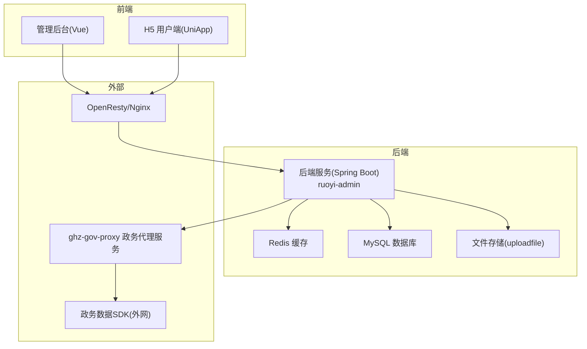
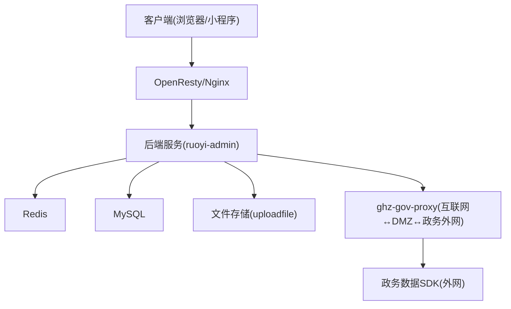
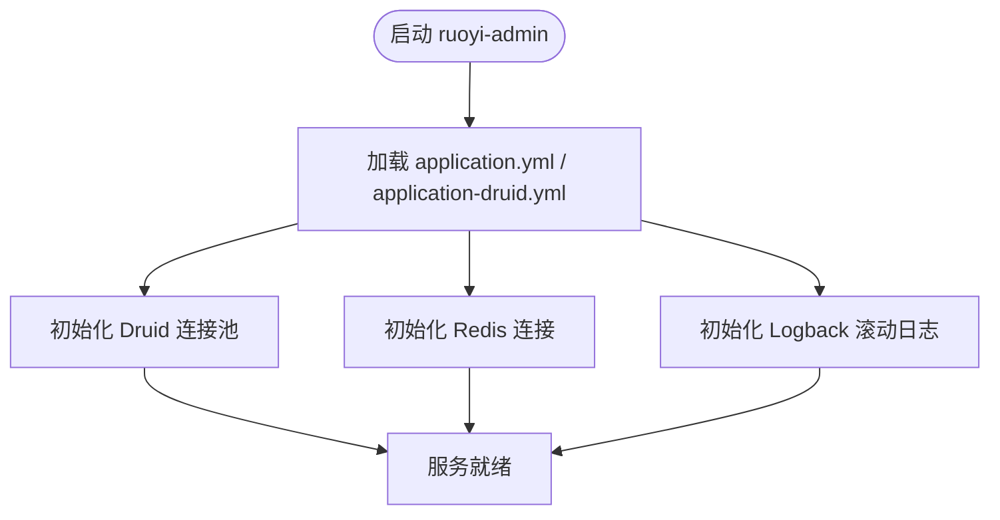
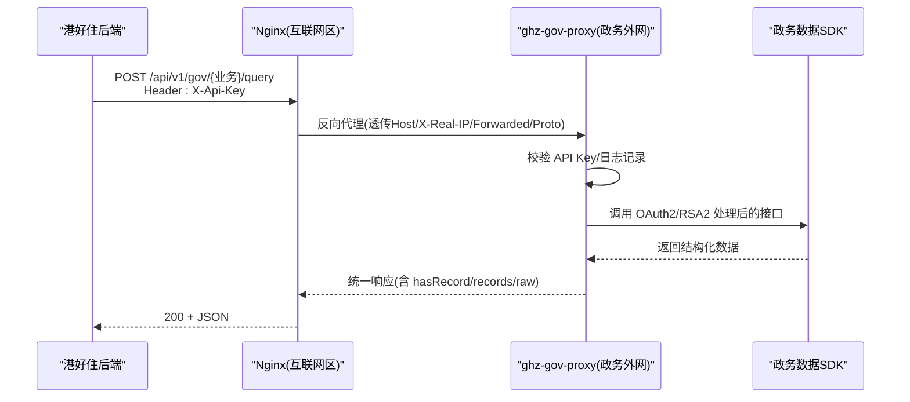
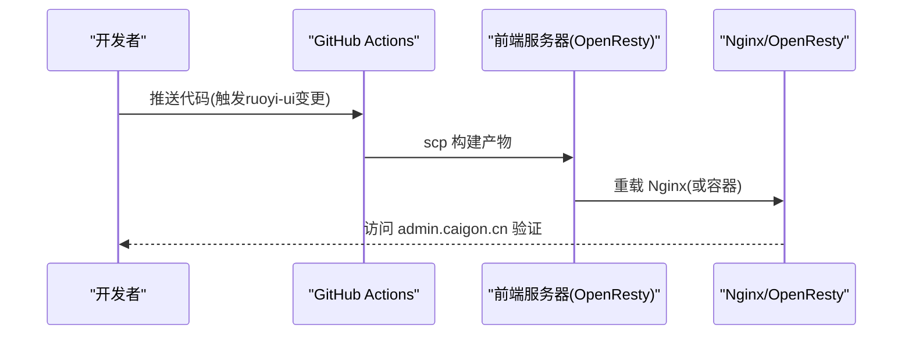
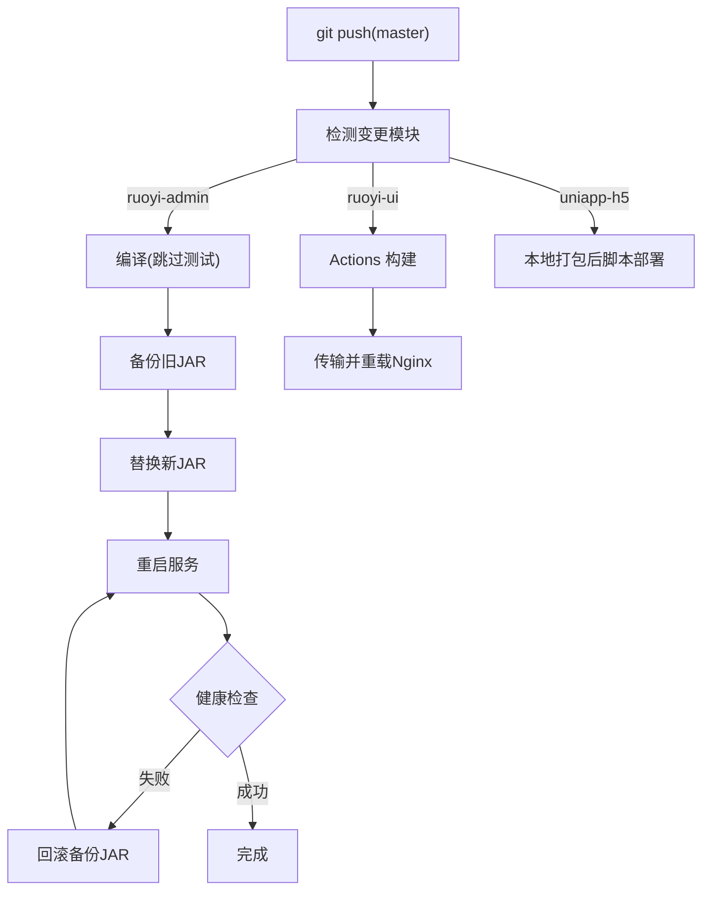
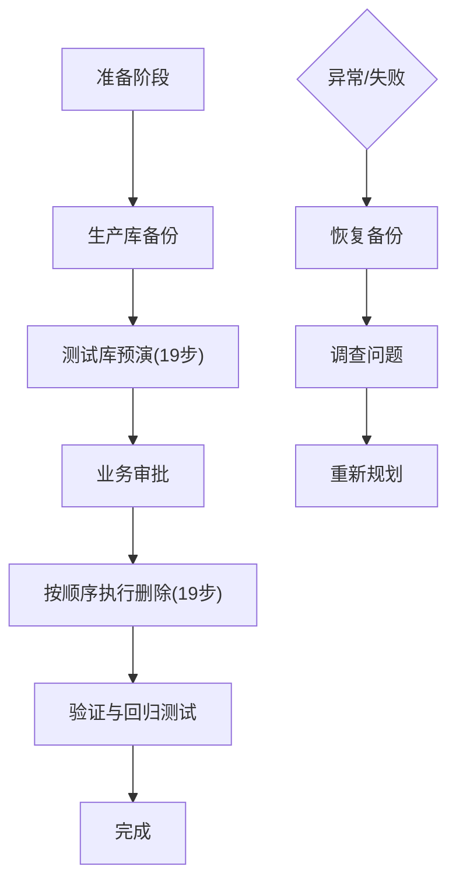
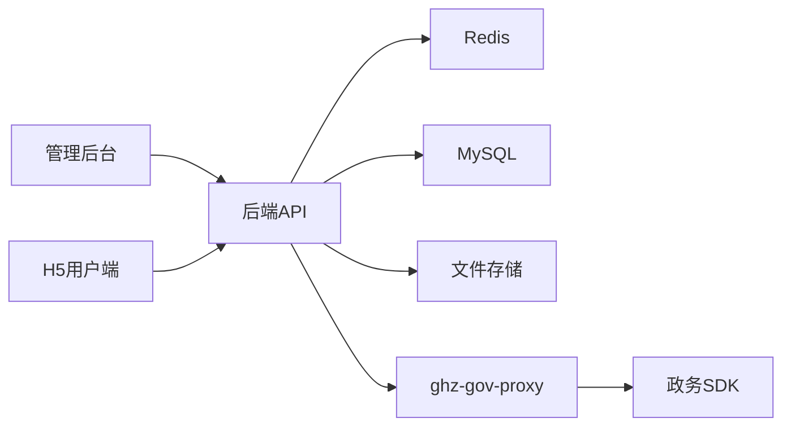

# 部署与运维

<cite>
**本文引用的文件**   
- [.gitignore](file://.gitignore)
- [ghz-gov-proxy 部署配置(application-prod.yml)](file://ghz-gov-proxy/deploy/application-prod.yml)
- [ghz-gov-proxy Nginx 反向代理配置(nginx-ghz-gov-proxy.conf)](file://ghz-gov-proxy/deploy/nginx-ghz-gov-proxy.conf)
- [ghz-gov-proxy 启动脚本(start.sh)](file://ghz-gov-proxy/deploy/start.sh)
- [ghz-gov-proxy 停止脚本(stop.sh)](file://ghz-gov-proxy/deploy/stop.sh)
- [港好住后端对接指南(ghz-gov-proxy)](file://ghz-gov-proxy/deploy/港好住后端对接指南.md)
- [ruoyi-admin 主配置(application.yml)](file://ruoyi-admin/src/main/resources/application.yml)
- [ruoyi-admin 数据源配置(application-druid.yml)](file://ruoyi-admin/src/main/resources/application-druid.yml)
- [ruoyi-admin 日志配置(logback.xml)](file://ruoyi-admin/src/main/resources/logback.xml)
- [后端一键部署脚本(server-deploy.sh)](file://server-deploy.sh)
- [H5 一键部署脚本(deploy-h5.sh)](file://uniapp-h5/deploy-h5.sh)
- [部署总结(部署流程与运维规范)](file://部署总结.md)
- [数据库清理研究(数据清理研究.md)](file://README_数据清理研究.md)
</cite>

## 更新摘要
**所做更改**   
- 新增代码仓库清理与维护章节，详细说明.gitignore文件变更内容
- 添加一次性迁移脚本与中间产物的忽略规则说明
- 新增AI临时文件清理规范
- 更新仓库整洁性管理最佳实践

## 目录
1. [简介](#简介)
2. [项目结构](#项目结构)
3. [核心组件](#核心组件)
4. [架构总览](#架构总览)
5. [详细组件分析](#详细组件分析)
6. [依赖分析](#依赖分析)
7. [性能考虑](#性能考虑)
8. [故障排查指南](#故障排查指南)
9. [代码仓库清理与维护](#代码仓库清理与维护)
10. [结论](#结论)
11. [附录](#附录)

## 简介
本指南面向港好住信息系统（后端、管理后台、H5 用户端）的部署与运维，覆盖多环境配置差异、CI/CD 自动化流程、容器化与负载均衡、高可用设计、数据库备份恢复、文件存储管理、日志轮转、性能监控与容量规划、故障处理与应急预案、版本管理与灰度发布、回滚策略等运维管理体系，并提供部署检查清单与运维手册。

## 项目结构
系统由以下主要模块构成：
- 后端服务（Spring Boot）：ruoyi-admin
- 管理后台（Vue）：ruoyi-ui
- H5 用户端（UniApp）：uniapp-h5
- 政务数据代理服务（Spring Boot）：ghz-gov-proxy
- 部署与运维脚本：server-deploy.sh、deploy-h5.sh、ghz-gov-proxy 启停脚本与 Nginx 配置

**图表来源**
- [部署总结(部署流程与运维规范):1-224](file://部署总结.md#L1-L224)
- [ruoyi-admin 主配置(application.yml):1-238](file://ruoyi-admin/src/main/resources/application.yml#L1-L238)
- [ruoyi-admin 数据源配置(application-druid.yml):1-64](file://ruoyi-admin/src/main/resources/application-druid.yml#L1-L64)
- [ruoyi-admin 日志配置(logback.xml):1-93](file://ruoyi-admin/src/main/resources/logback.xml#L1-L93)
- [ghz-gov-proxy Nginx 反向代理配置(nginx-ghz-gov-proxy.conf):1-45](file://ghz-gov-proxy/deploy/nginx-ghz-gov-proxy.conf#L1-L45)

**章节来源**
- [部署总结(部署流程与运维规范):1-224](file://部署总结.md#L1-L224)

## 核心组件
- 后端服务 ruoyi-admin
  - 端口、Tomcat 线程池、文件上传大小、Redis 连接、MyBatis-Plus、Swagger、XSS 过滤、微信/易宝对接、政务代理配置等
- 数据库与缓存
  - MySQL 主库地址与连接池参数；Redis 连接与池配置
- 日志与文件存储
  - Logback 滚动日志策略；文件上传目录与权限
- 政务代理服务 ghz-gov-proxy
  - 生产配置（端口、API Key、日志）、Nginx 反向代理（公网入口、超时、Header 透传）、启停脚本与健康检查
- 前端部署
  - 管理后台：GitHub Actions 自动构建与部署
  - H5 用户端：本地打包后脚本部署至 OpenResty

**章节来源**
- [ruoyi-admin 主配置(application.yml):1-238](file://ruoyi-admin/src/main/resources/application.yml#L1-L238)
- [ruoyi-admin 数据源配置(application-druid.yml):1-64](file://ruoyi-admin/src/main/resources/application-druid.yml#L1-L64)
- [ruoyi-admin 日志配置(logback.xml):1-93](file://ruoyi-admin/src/main/resources/logback.xml#L1-L93)
- [ghz-gov-proxy 部署配置(application-prod.yml):1-26](file://ghz-gov-proxy/deploy/application-prod.yml#L1-L26)
- [ghz-gov-proxy Nginx 反向代理配置(nginx-ghz-gov-proxy.conf):1-45](file://ghz-gov-proxy/deploy/nginx-ghz-gov-proxy.conf#L1-L45)
- [ghz-gov-proxy 启动脚本(start.sh):1-47](file://ghz-gov-proxy/deploy/start.sh#L1-L47)
- [ghz-gov-proxy 停止脚本(stop.sh):1-42](file://ghz-gov-proxy/deploy/stop.sh#L1-L42)
- [H5 一键部署脚本(deploy-h5.sh):1-42](file://uniapp-h5/deploy-h5.sh#L1-L42)

## 架构总览
系统采用"前端（管理后台/H5）+ 后端（Spring Boot）+ 缓存/数据库 + 政务代理"的分层架构。前端通过 OpenResty/Nginx 提供静态资源与路由；后端负责业务逻辑与数据访问；Redis 提升读性能；MySQL 存储业务数据；政务代理服务作为互联网与政务外网之间的桥梁，提供标准化 REST 接口与 OAuth2/RSA2 处理。

**图表来源**
- [部署总结(部署流程与运维规范):1-224](file://部署总结.md#L1-L224)
- [ghz-gov-proxy Nginx 反向代理配置(nginx-ghz-gov-proxy.conf):1-45](file://ghz-gov-proxy/deploy/nginx-ghz-gov-proxy.conf#L1-L45)
- [ruoyi-admin 主配置(application.yml):1-238](file://ruoyi-admin/src/main/resources/application.yml#L1-L238)

## 详细组件分析

### 后端服务 ruoyi-admin
- 配置要点
  - 服务器端口、上下文路径、Tomcat 线程池与排队数
  - 文件上传大小上限、国际化资源路径
  - Redis 连接与池参数、MyBatis-Plus 全局配置
  - Swagger 开关与分组、XSS 过滤白名单
  - 微信支付、e签宝对接参数
  - 政务代理服务地址与 API Key（支持环境变量覆盖）
- 日志策略
  - 控制台输出 + 按日期滚动的日志文件（INFO/ERROR 分离）
  - 用户操作日志独立文件
- 数据库连接
  - Druid 连接池参数、主库地址与凭证、慢 SQL 记录

**图表来源**
- [ruoyi-admin 主配置(application.yml):1-238](file://ruoyi-admin/src/main/resources/application.yml#L1-L238)
- [ruoyi-admin 数据源配置(application-druid.yml):1-64](file://ruoyi-admin/src/main/resources/application-druid.yml#L1-L64)
- [ruoyi-admin 日志配置(logback.xml):1-93](file://ruoyi-admin/src/main/resources/logback.xml#L1-L93)

**章节来源**
- [ruoyi-admin 主配置(application.yml):1-238](file://ruoyi-admin/src/main/resources/application.yml#L1-L238)
- [ruoyi-admin 数据源配置(application-druid.yml):1-64](file://ruoyi-admin/src/main/resources/application-druid.yml#L1-L64)
- [ruoyi-admin 日志配置(logback.xml):1-93](file://ruoyi-admin/src/main/resources/logback.xml#L1-L93)

### 政务代理服务 ghz-gov-proxy
- 生产配置
  - 端口、API Key（X-Api-Key）、日志文件与保留策略
- Nginx 反向代理
  - 监听 8088、公网 42.228.16.25:8088 → 内网 172.19.25.77:9001
  - 请求体大小限制、访问/错误日志、Header 透传
  - 超时配置（连接/读取/发送）与关闭代理缓冲
  - 健康检查路径 /api/v1/gov/ping
- 启停脚本
  - 启动：检查 PID、创建日志目录、JVM 参数、nohup 启动、健康检查
  - 停止：优雅停止（10s）+ 强制 kill(-9)

**图表来源**
- [ghz-gov-proxy Nginx 反向代理配置(nginx-ghz-gov-proxy.conf):1-45](file://ghz-gov-proxy/deploy/nginx-ghz-gov-proxy.conf#L1-L45)
- [ghz-gov-proxy 部署配置(application-prod.yml):1-26](file://ghz-gov-proxy/deploy/application-prod.yml#L1-L26)
- [港好住后端对接指南(ghz-gov-proxy):1-679](file://ghz-gov-proxy/deploy/港好住后端对接指南.md#L1-L679)

**章节来源**
- [ghz-gov-proxy 部署配置(application-prod.yml):1-26](file://ghz-gov-proxy/deploy/application-prod.yml#L1-L26)
- [ghz-gov-proxy Nginx 反向代理配置(nginx-ghz-gov-proxy.conf):1-45](file://ghz-gov-proxy/deploy/nginx-ghz-gov-proxy.conf#L1-L45)
- [ghz-gov-proxy 启动脚本(start.sh):1-47](file://ghz-gov-proxy/deploy/start.sh#L1-L47)
- [ghz-gov-proxy 停止脚本(stop.sh):1-42](file://ghz-gov-proxy/deploy/stop.sh#L1-L42)
- [港好住后端对接指南(ghz-gov-proxy):1-679](file://ghz-gov-proxy/deploy/港好住后端对接指南.md#L1-L679)

### 前端部署（管理后台与 H5）
- 管理后台（ruoyi-ui）
  - GitHub Actions 自动触发：检测 ruoyi-ui 变更 → 本地构建 → 传输至前端服务器 → Nginx 重载
  - 关键路径：/opt/1panel/www/sites/admin.caigon.cn/index/
- H5 用户端（uniapp-h5）
  - 本地 HBuilderX 构建 → 脚本部署至 app.caigon.cn → OpenResty 托管
  - 关键路径：/opt/1panel/www/sites/app.caigon.cn/index/

**图表来源**
- [部署总结(部署流程与运维规范):69-92](file://部署总结.md#L69-L92)

**章节来源**
- [部署总结(部署流程与运维规范):69-92](file://部署总结.md#L69-L92)
- [H5 一键部署脚本(deploy-h5.sh):1-42](file://uniapp-h5/deploy-h5.sh#L1-L42)

### CI/CD 自动化流程
- 后端（ruoyi-admin）
  - 触发条件：git 推送且涉及 ruoyi-**/** 或 pom.xml
  - 流程：拉取代码 → 本地编译 → 备份旧 JAR → 替换新 JAR → 重启服务 → 健康检查（失败则回滚）
- 管理后台（ruoyi-ui）
  - 触发条件：git 推送且涉及 ruoyi-ui/**
  - 流程：GitHub Actions 本地构建 → 传输 → Nginx 重载
- H5 用户端（uniapp-h5）
  - 手动流程：本地打包 → 脚本部署 → 验证

**图表来源**
- [后端一键部署脚本(server-deploy.sh):1-42](file://server-deploy.sh#L1-L42)
- [部署总结(部署流程与运维规范):17-66](file://部署总结.md#L17-L66)

**章节来源**
- [后端一键部署脚本(server-deploy.sh):1-42](file://server-deploy.sh#L1-L42)
- [部署总结(部署流程与运维规范):17-66](file://部署总结.md#L17-L66)

### 数据库备份与恢复
- 备份
  - 使用 mysqldump 对生产库进行完整备份，确保文件 >100MB
- 恢复
  - 发生意外时，立即停止删除/部署，恢复备份并调查问题
- 数据清理研究
  - 生成了清理研究总结、执行计划、分析报告与详细查询结果，提供 19 步删除顺序与验证清单

**图表来源**
- [数据库清理研究(数据清理研究.md):1-305](file://README_数据清理研究.md#L1-L305)

**章节来源**
- [数据库清理研究(数据清理研究.md):1-305](file://README_数据清理研究.md#L1-L305)

### 文件存储管理
- 上传目录
  - ruoyi-admin 配置了文件上传根目录（生产环境指向 /www/wwwroot/ghzupload）
- 权限与可用性
  - 确保部署用户对上传目录具有读写权限；图片无法访问时检查目录与权限

**章节来源**
- [ruoyi-admin 主配置(application.yml):9-12](file://ruoyi-admin/src/main/resources/application.yml#L9-L12)
- [部署总结(部署流程与运维规范):205-207](file://部署总结.md#L205-L207)

### 日志轮转与审计
- 后端日志
  - Logback 按日滚动，INFO/ERROR 分离，用户操作日志独立文件
- 政务代理日志
  - Nginx 访问/错误日志与应用日志（结构化）
- 审计建议
  - 对政务接口调用进行审计日志（操作人、被查询人、时间、耗时、结果摘要）

**章节来源**
- [ruoyi-admin 日志配置(logback.xml):1-93](file://ruoyi-admin/src/main/resources/logback.xml#L1-L93)
- [ghz-gov-proxy Nginx 反向代理配置(nginx-ghz-gov-proxy.conf):15-17](file://ghz-gov-proxy/deploy/nginx-ghz-gov-proxy.conf#L15-L17)
- [ghz-gov-proxy 部署配置(application-prod.yml):18-25](file://ghz-gov-proxy/deploy/application-prod.yml#L18-L25)
- [港好住后端对接指南(ghz-gov-proxy):576-578](file://ghz-gov-proxy/deploy/港好住后端对接指南.md#L576-L578)

### 高可用与负载均衡
- 前端
  - OpenResty/Nginx 托管静态资源与路由，支持伪静态与重载
- 后端
  - Supervisor 守护进程，支持状态查询与重启
- 政务代理
  - Nginx 作为互联网区反向代理，透传 Header 并设置超时；健康检查路径 /api/v1/gov/ping

**章节来源**
- [部署总结(部署流程与运维规范):41-59](file://部署总结.md#L41-L59)
- [ghz-gov-proxy Nginx 反向代理配置(nginx-ghz-gov-proxy.conf):1-45](file://ghz-gov-proxy/deploy/nginx-ghz-gov-proxy.conf#L1-L45)

### 版本管理、灰度发布与回滚
- 版本管理
  - 通过 Git 推送触发 CI/CD；后端 JAR 备份与回滚机制
- 灰度发布
  - 建议结合 Nginx upstream 多实例与蓝绿/金丝雀策略（当前脚本为单实例）
- 回滚策略
  - 后端：自动回滚（健康检查失败）；手动恢复备份
  - H5：保留旧版本目录（远程备份），快速回滚

**章节来源**
- [后端一键部署脚本(server-deploy.sh):15-39](file://server-deploy.sh#L15-L39)
- [部署总结(部署流程与运维规范):209-216](file://部署总结.md#L209-L216)

## 依赖分析
- 组件耦合
  - 后端依赖 Redis、MySQL、文件存储与政务代理服务
  - 前端依赖后端 API，Nginx/OpenResty 提供路由与静态资源
- 外部依赖
  - 政务数据 SDK（仅在代理服务侧使用）
  - 微信支付/e签宝等第三方服务

**图表来源**
- [ruoyi-admin 主配置(application.yml):166-229](file://ruoyi-admin/src/main/resources/application.yml#L166-L229)
- [ghz-gov-proxy Nginx 反向代理配置(nginx-ghz-gov-proxy.conf):21-21](file://ghz-gov-proxy/deploy/nginx-ghz-gov-proxy.conf#L21-L21)

**章节来源**
- [ruoyi-admin 主配置(application.yml):166-229](file://ruoyi-admin/src/main/resources/application.yml#L166-L229)
- [ghz-gov-proxy Nginx 反向代理配置(nginx-ghz-gov-proxy.conf):1-45](file://ghz-gov-proxy/deploy/nginx-ghz-gov-proxy.conf#L1-L45)

## 性能考虑
- 后端
  - 调整 Tomcat 线程池与排队数，提升并发处理能力
  - 合理设置文件上传大小，避免内存压力
  - Redis 缓存热点数据（建议按接口与缓存时长策略）
- 政务代理
  - 超时设置（连接 10s、读取 30s+），Nginx 关闭代理缓冲以降低延迟
- 日志
  - 滚动策略与级别控制，避免磁盘 IO 压力过大

**章节来源**
- [ruoyi-admin 主配置(application.yml):20-36](file://ruoyi-admin/src/main/resources/application.yml#L20-L36)
- [ruoyi-admin 主配置(application.yml):62-65](file://ruoyi-admin/src/main/resources/application.yml#L62-L65)
- [ghz-gov-proxy Nginx 反向代理配置(nginx-ghz-gov-proxy.conf):30-37](file://ghz-gov-proxy/deploy/nginx-ghz-gov-proxy.conf#L30-L37)
- [ruoyi-admin 日志配置(logback.xml):18-27](file://ruoyi-admin/src/main/resources/logback.xml#L18-L27)

## 故障排查指南
- 后端服务
  - 查看部署日志与应用日志；检查 Supervisor 状态；必要时手动重启
  - 编译失败时回滚备份 JAR
- 管理后台
  - 页面 404：检查伪静态配置（try_files $uri $uri/ /index.html）
- H5 用户端
  - API 地址错误：确认 config/index.js env 为 production，重新打包部署
- 政务代理
  - 健康检查失败：检查 L3 进程与 L2 Nginx；确认白名单 IP 与 API Key
  - 超时/连接失败：检查超时配置与网络连通性

**章节来源**
- [部署总结(部署流程与运维规范):41-59](file://部署总结.md#L41-L59)
- [部署总结(部署流程与运维规范):199-203](file://部署总结.md#L199-L203)
- [部署总结(部署流程与运维规范):218-219](file://部署总结.md#L218-L219)
- [ghz-gov-proxy 启动脚本(start.sh):38-46](file://ghz-gov-proxy/deploy/start.sh#L38-L46)
- [港好住后端对接指南(ghz-gov-proxy):586-593](file://ghz-gov-proxy/deploy/港好住后端对接指南.md#L586-L593)

## 代码仓库清理与维护

### .gitignore 文件变更说明
为维护代码仓库的整洁性和安全性，项目对.gitignore文件进行了重要更新，新增了12条规则，专门用于忽略一次性迁移脚本、中间产物和AI临时文件。

#### 新增规则分类

**一次性迁移脚本与中间产物（第79-86行）**
- id_mappings.json：ID映射数据文件
- fix_tenant_mapping.py：租户映射修复脚本
- migrate_data.py：数据迁移主脚本
- PAGINATION_CHECKLIST.csv：分页检查清单
- PAGINATION_REPAIR_REPORT.txt：分页修复报告
- delete_analysis_report.txt：删除分析报告
- detailed_query_results.md：详细查询结果文档

**AI临时文件（第88-89行）**
- tmpclaude-*：Claude AI助手临时文件

#### 清理工作背景
这些文件属于开发过程中的临时产物，不应纳入版本控制：
- 迁移脚本仅在特定数据迁移场景下使用，完成后应被清理
- 中间产物包含大量临时数据和分析报告
- AI生成的临时文件占用存储空间且无版本价值

#### 仓库整洁性管理最佳实践
- **定期清理**：建立定期清理临时文件的流程
- **分支管理**：将一次性脚本放在专用分支中管理
- **文档分离**：将临时文档与源代码分离存储
- **自动化清理**：在CI/CD流程中集成自动清理步骤

**章节来源**
- [.gitignore:79-89](file://.gitignore#L79-L89)

### 临时文件与中间产物管理

#### 开发工具临时文件
- **Playwright MCP 临时快照**：.playwright-mcp/ 目录
- **macOS 系统文件**：.DS_Store
- **IDE 临时文件**：各种IDE的临时文件和缓存目录

#### 构建工具产物
- **Gradle 缓存**：.gradle/ 目录
- **Maven 构建**：target/ 目录
- **Node.js 依赖**：node_modules/ 目录（在特定子目录中）

#### 运行时数据
- **运行时日志**：logs/ 目录
- **截图目录**：jietu/ 和 qietu/ 目录
- **备份目录**：uniapp-h5-backup-/ 目录

**章节来源**
- [.gitignore:52-77](file://.gitignore#L52-L77)

### 代码仓库维护规范

#### 忽略文件管理原则
1. **最小化原则**：只忽略必要的临时文件
2. **安全性原则**：不忽略任何敏感配置文件
3. **可维护性原则**：保持忽略规则清晰易懂
4. **团队协作原则**：统一团队的忽略规则标准

#### 常见忽略模式
- **通配符模式**：*.log、*.tmp、*~
- **目录模式**：/build/、/dist/、node_modules/
- **特殊文件**：.DS_Store、Thumbs.db
- **IDE特定**：.idea/、.vscode/

#### 版本控制最佳实践
- **提交前检查**：使用 git status 检查未跟踪文件
- **批量清理**：定期执行 git clean -fdx 清理未跟踪文件
- **分支隔离**：将临时文件放在独立分支中
- **文档同步**：更新.gitignore时同步更新开发文档

**章节来源**
- [.gitignore:1-90](file://.gitignore#L1-L90)

## 结论
本指南提供了港好住信息系统从后端、前端到政务代理的完整部署与运维方案，涵盖 CI/CD 自动化、高可用与负载均衡、数据库与文件存储管理、日志与审计、性能与容量规划、故障处理与应急预案、版本管理与回滚策略。新增的.gitignore文件变更进一步强化了代码仓库的整洁性管理，通过12条新增规则有效隔离了一次性迁移脚本、中间产物和AI临时文件，为项目的长期可持续发展奠定了良好基础。建议在生产环境中严格执行备份与回滚策略，完善监控与告警体系，并根据业务增长逐步引入容器化与多实例部署。

## 附录

### 多环境配置差异与部署流程
- 开发环境
  - 端口：8090；文件上传大小较小；XSS 过滤与 Swagger 可开启
- 测试环境
  - 端口：与生产接近；数据库与缓存可为测试实例；日志级别可调整
- 生产环境
  - 端口：8090（后端）；9001（政务代理）；严格的 API Key 与白名单；Nginx 超时与 Header 透传；健康检查

**章节来源**
- [ruoyi-admin 主配置(application.yml):19-22](file://ruoyi-admin/src/main/resources/application.yml#L19-L22)
- [ghz-gov-proxy 部署配置(application-prod.yml):7-9](file://ghz-gov-proxy/deploy/application-prod.yml#L7-L9)
- [ghz-gov-proxy Nginx 反向代理配置(nginx-ghz-gov-proxy.conf):7-13](file://ghz-gov-proxy/deploy/nginx-ghz-gov-proxy.conf#L7-L13)

### 部署检查清单
- 后端
  - 代码已推送至 Gitee/GitHub；CI/CD 已触发；部署日志与应用日志正常；Supervisor 状态 RUNNING
- 前端
  - 管理后台：伪静态配置正确；H5：API 地址为生产；OpenResty 已重载
- 政务代理
  - Nginx 配置生效；L3 进程运行；/ping 健康检查返回 UP；白名单 IP 与 API Key 正确
- 数据库与文件
  - 备份完成；测试库预演通过；文件上传目录权限正确
- 代码仓库
  - .gitignore 规则更新完成；临时文件已清理；仓库整洁性得到改善

**章节来源**
- [部署总结(部署流程与运维规范):175-220](file://部署总结.md#L175-L220)
- [数据库清理研究(数据清理研究.md):175-189](file://README_数据清理研究.md#L175-L189)
- [.gitignore:79-89](file://.gitignore#L79-L89)