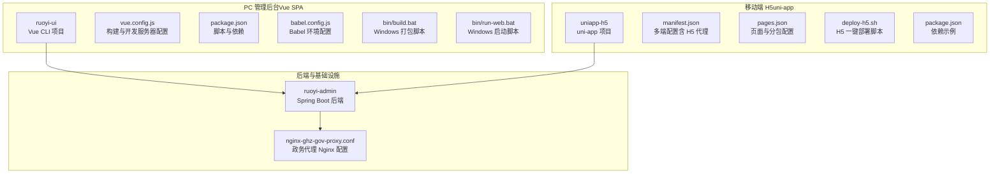
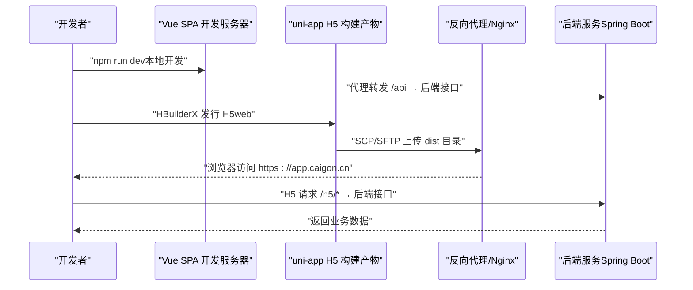
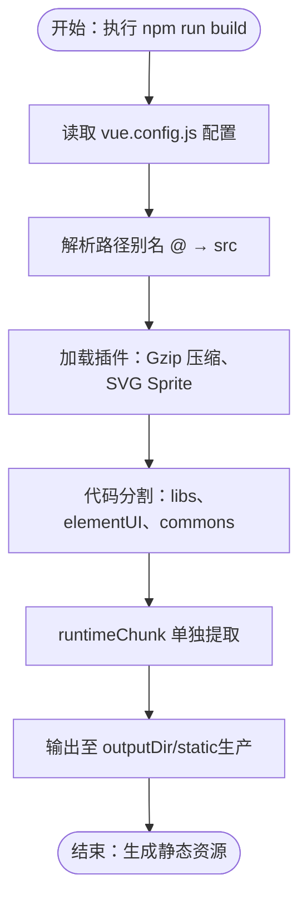
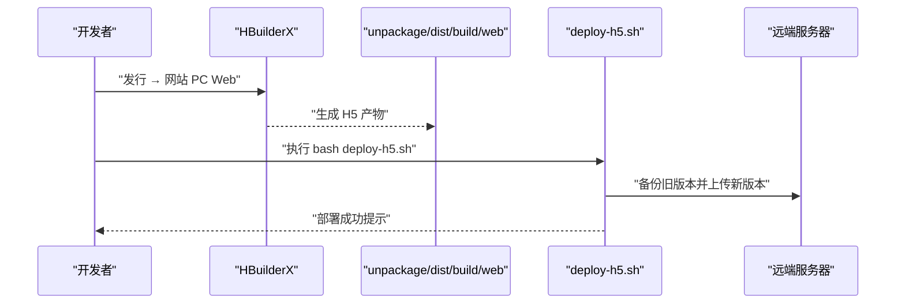
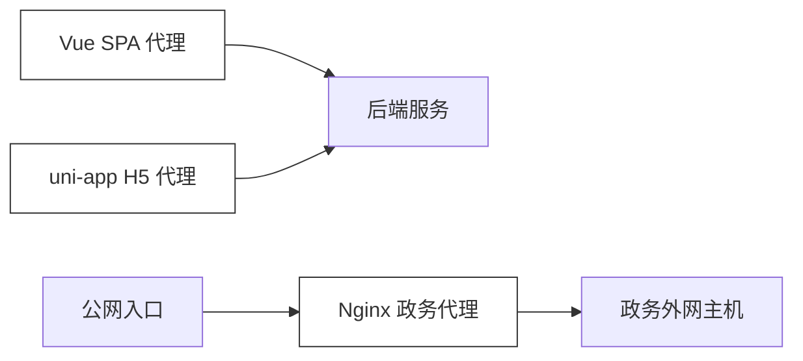
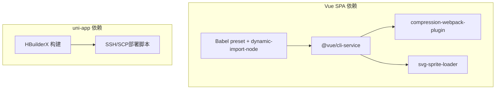

# 前端应用部署

<cite>
**本文引用的文件**   
- [ruoyi-ui/vue.config.js](file://ruoyi-ui/vue.config.js)
- [ruoyi-ui/package.json](file://ruoyi-ui/package.json)
- [ruoyi-ui/babel.config.js](file://ruoyi-ui/babel.config.js)
- [ruoyi-ui/bin/build.bat](file://ruoyi-ui/bin/build.bat)
- [ruoyi-ui/bin/run-web.bat](file://ruoyi-ui/bin/run-web.bat)
- [uniapp-h5/deploy-h5.sh](file://uniapp-h5/deploy-h5.sh)
- [uniapp-h5/manifest.json](file://uniapp-h5/manifest.json)
- [uniapp-h5/pages.json](file://uniapp-h5/pages.json)
- [uniapp-h5/package.json](file://uniapp-h5/package.json)
- [ghz-gov-proxy/deploy/nginx-ghz-gov-proxy.conf](file://ghz-gov-proxy/deploy/nginx-ghz-gov-proxy.conf)
- [ruoyi-admin/src/main/resources/application.yml](file://ruoyi-admin/src/main/resources/application.yml)
</cite>

## 目录
1. [简介](#简介)
2. [项目结构](#项目结构)
3. [核心组件](#核心组件)
4. [架构总览](#架构总览)
5. [详细组件分析](#详细组件分析)
6. [依赖关系分析](#依赖关系分析)
7. [性能考虑](#性能考虑)
8. [故障排查指南](#故障排查指南)
9. [结论](#结论)
10. [附录](#附录)

## 简介
本文件面向前端应用部署场景，围绕两类前端产物展开：
- PC 管理后台：基于 Vue.js 的单页应用（SPA），通过 Vue CLI 构建，包含开发与生产环境的构建配置、代理、静态资源优化与输出目录等。
- 移动端 H5 应用：基于 uni-app 的多端统一应用，重点说明 H5 页面构建、小程序构建与多端统一发布策略。

文档同时解释构建配置文件的作用、静态资源优化策略、本地开发与生产环境的差异对比，以及与后端服务的集成与代理关系。

## 项目结构
本仓库包含两个主要前端工程：
- ruoyi-ui：PC 管理后台前端（Vue 2 + Element-UI）
- uniapp-h5：移动端 H5 应用（uni-app）

图表来源
- [ruoyi-ui/vue.config.js:1-138](file://ruoyi-ui/vue.config.js#L1-L138)
- [ruoyi-ui/package.json:1-74](file://ruoyi-ui/package.json#L1-L74)
- [ruoyi-ui/babel.config.js:1-13](file://ruoyi-ui/babel.config.js#L1-L13)
- [ruoyi-ui/bin/build.bat:1-12](file://ruoyi-ui/bin/build.bat#L1-L12)
- [ruoyi-ui/bin/run-web.bat:1-12](file://ruoyi-ui/bin/run-web.bat#L1-L12)
- [uniapp-h5/manifest.json:1-107](file://uniapp-h5/manifest.json#L1-L107)
- [uniapp-h5/pages.json:1-324](file://uniapp-h5/pages.json#L1-L324)
- [uniapp-h5/deploy-h5.sh:1-42](file://uniapp-h5/deploy-h5.sh#L1-L42)
- [ghz-gov-proxy/deploy/nginx-ghz-gov-proxy.conf:1-45](file://ghz-gov-proxy/deploy/nginx-ghz-gov-proxy.conf#L1-L45)

章节来源
- [ruoyi-ui/vue.config.js:1-138](file://ruoyi-ui/vue.config.js#L1-L138)
- [ruoyi-ui/package.json:1-74](file://ruoyi-ui/package.json#L1-L74)
- [ruoyi-ui/babel.config.js:1-13](file://ruoyi-ui/babel.config.js#L1-L13)
- [ruoyi-ui/bin/build.bat:1-12](file://ruoyi-ui/bin/build.bat#L1-L12)
- [ruoyi-ui/bin/run-web.bat:1-12](file://ruoyi-ui/bin/run-web.bat#L1-L12)
- [uniapp-h5/manifest.json:1-107](file://uniapp-h5/manifest.json#L1-L107)
- [uniapp-h5/pages.json:1-324](file://uniapp-h5/pages.json#L1-L324)
- [uniapp-h5/deploy-h5.sh:1-42](file://uniapp-h5/deploy-h5.sh#L1-L42)
- [ghz-gov-proxy/deploy/nginx-ghz-gov-proxy.conf:1-45](file://ghz-gov-proxy/deploy/nginx-ghz-gov-proxy.conf#L1-L45)

## 核心组件
- Vue SPA 构建与开发服务器
  - 构建命令与输出：通过 npm 脚本触发 Vue CLI 构建，输出目录与静态资源目录由配置文件决定。
  - 开发服务器与代理：devServer 提供本地开发服务，并对后端接口进行代理转发。
  - 资源优化：开启 Gzip 压缩插件、SVG Sprite、代码分割与运行时拆分。
- uni-app H5 构建与多端发布
  - H5 构建：在 HBuilderX 中导出 H5，产物位于指定目录，随后通过一键部署脚本发布到远端。
  - 小程序构建：在 manifest.json 中配置各小程序平台参数，按平台编译。
  - 多端统一：通过 pages.json 统一页面与分包配置，减少重复维护成本。

章节来源
- [ruoyi-ui/vue.config.js:1-138](file://ruoyi-ui/vue.config.js#L1-L138)
- [ruoyi-ui/package.json:1-74](file://ruoyi-ui/package.json#L1-L74)
- [uniapp-h5/manifest.json:1-107](file://uniapp-h5/manifest.json#L1-L107)
- [uniapp-h5/pages.json:1-324](file://uniapp-h5/pages.json#L1-L324)
- [uniapp-h5/deploy-h5.sh:1-42](file://uniapp-h5/deploy-h5.sh#L1-L42)

## 架构总览
前端应用与后端服务的交互路径如下：

图表来源
- [ruoyi-ui/vue.config.js:33-53](file://ruoyi-ui/vue.config.js#L33-L53)
- [uniapp-h5/manifest.json:81-105](file://uniapp-h5/manifest.json#L81-L105)
- [uniapp-h5/deploy-h5.sh:17-42](file://uniapp-h5/deploy-h5.sh#L17-L42)
- [ruoyi-admin/src/main/resources/application.yml:20-25](file://ruoyi-admin/src/main/resources/application.yml#L20-L25)

## 详细组件分析

### PC 管理后台（Vue SPA）构建与部署
- 构建命令与脚本
  - npm 脚本：提供开发、生产构建与预览命令，便于本地与 CI 环境使用。
  - Windows 批处理：封装 npm 脚本，便于在 Windows 环境一键启动或打包。
- 输出目录与静态资源
  - 输出目录与静态资源目录由配置文件定义，确保生产环境与 CDN/反向代理路径一致。
- 开发服务器与代理
  - devServer 配置了本地端口、跨域代理、Swagger 文档代理等，便于前后端联调。
- 路径别名与插件
  - 路径别名指向 src，提升导入便捷性。
  - SVG Sprite Loader 与 Gzip 压缩插件提升资源加载效率。
- 代码分割与运行时
  - 分包策略将第三方库、UI 组件与公共组件拆分，降低首屏体积。
  - 运行时单独提取，提升缓存命中率。
- Babel 环境优化
  - development 环境启用动态导入优化插件，加速热更新。

图表来源
- [ruoyi-ui/vue.config.js:61-79](file://ruoyi-ui/vue.config.js#L61-L79)
- [ruoyi-ui/vue.config.js:101-136](file://ruoyi-ui/vue.config.js#L101-L136)
- [ruoyi-ui/babel.config.js:6-12](file://ruoyi-ui/babel.config.js#L6-L12)

章节来源
- [ruoyi-ui/package.json:7-12](file://ruoyi-ui/package.json#L7-L12)
- [ruoyi-ui/bin/build.bat:1-12](file://ruoyi-ui/bin/build.bat#L1-L12)
- [ruoyi-ui/bin/run-web.bat:1-12](file://ruoyi-ui/bin/run-web.bat#L1-L12)
- [ruoyi-ui/vue.config.js:24-28](file://ruoyi-ui/vue.config.js#L24-L28)
- [ruoyi-ui/vue.config.js:33-53](file://ruoyi-ui/vue.config.js#L33-L53)
- [ruoyi-ui/vue.config.js:64-66](file://ruoyi-ui/vue.config.js#L64-L66)
- [ruoyi-ui/vue.config.js:111-134](file://ruoyi-ui/vue.config.js#L111-L134)
- [ruoyi-ui/babel.config.js:1-13](file://ruoyi-ui/babel.config.js#L1-L13)

### 移动端 H5 应用（uni-app）构建与部署
- H5 构建
  - 在 HBuilderX 中“发行 → 网站 PC Web”，输出到指定目录。
  - 一键部署脚本负责备份、上传与验证，确保线上稳定更新。
- 小程序构建
  - 在 manifest.json 中配置各小程序平台（如微信、支付宝、百度、头条）的 appid、权限与组件化等。
- 多端统一发布策略
  - pages.json 统一声明页面与分包，避免多端重复配置。
  - H5 代理配置集中于 manifest.json 的 devServer.proxy，便于联调。

图表来源
- [uniapp-h5/deploy-h5.sh:1-42](file://uniapp-h5/deploy-h5.sh#L1-L42)
- [uniapp-h5/manifest.json:81-105](file://uniapp-h5/manifest.json#L81-L105)
- [uniapp-h5/pages.json:1-324](file://uniapp-h5/pages.json#L1-L324)

章节来源
- [uniapp-h5/deploy-h5.sh:1-42](file://uniapp-h5/deploy-h5.sh#L1-L42)
- [uniapp-h5/manifest.json:1-107](file://uniapp-h5/manifest.json#L1-L107)
- [uniapp-h5/pages.json:1-324](file://uniapp-h5/pages.json#L1-L324)
- [uniapp-h5/package.json:1-6](file://uniapp-h5/package.json#L1-L6)

### 后端服务与代理集成
- Vue SPA 代理
  - 通过 devServer.proxy 将 /api 前缀转发至后端服务，路径重写去除前缀，便于统一管理。
- uni-app H5 代理
  - 在 manifest.json 的 devServer.proxy 中配置 /app、/h5、/profile 等前缀，便于本地联调。
- 政务代理 Nginx
  - 互联网区转发服务器将公网请求转发至政务外网主机，设置超时与日志，保障长耗时接口稳定性。

图表来源
- [ruoyi-ui/vue.config.js:37-50](file://ruoyi-ui/vue.config.js#L37-L50)
- [uniapp-h5/manifest.json:87-103](file://uniapp-h5/manifest.json#L87-L103)
- [ghz-gov-proxy/deploy/nginx-ghz-gov-proxy.conf:19-38](file://ghz-gov-proxy/deploy/nginx-ghz-gov-proxy.conf#L19-L38)

章节来源
- [ruoyi-ui/vue.config.js:37-50](file://ruoyi-ui/vue.config.js#L37-L50)
- [uniapp-h5/manifest.json:87-103](file://uniapp-h5/manifest.json#L87-L103)
- [ghz-gov-proxy/deploy/nginx-ghz-gov-proxy.conf:1-45](file://ghz-gov-proxy/deploy/nginx-ghz-gov-proxy.conf#L1-L45)

## 依赖关系分析
- 构建工具链
  - Vue SPA：Vue CLI 服务、Babel、Webpack 插件（Gzip、SVG Sprite、Script Ext Html）。
  - uni-app：HBuilderX 构建 H5，配合部署脚本自动化发布。
- 运行时依赖
  - Vue SPA：Element-UI、Axios、路由、状态管理等。
  - uni-app：按需引入依赖，示例包含平滑签名库等。
- 开发与运维
  - Windows 批处理脚本简化本地开发与打包流程。
  - Nginx 配置保障代理与日志可观测性。

图表来源
- [ruoyi-ui/package.json:52-64](file://ruoyi-ui/package.json#L52-L64)
- [ruoyi-ui/babel.config.js:1-13](file://ruoyi-ui/babel.config.js#L1-L13)
- [uniapp-h5/deploy-h5.sh:29-35](file://uniapp-h5/deploy-h5.sh#L29-L35)

章节来源
- [ruoyi-ui/package.json:26-64](file://ruoyi-ui/package.json#L26-L64)
- [uniapp-h5/package.json:1-6](file://uniapp-h5/package.json#L1-L6)
- [ruoyi-ui/babel.config.js:1-13](file://ruoyi-ui/babel.config.js#L1-L13)

## 性能考虑
- 代码分割
  - 第三方库、UI 组件与公共组件分包，降低首屏体积，提升缓存复用。
- 资源压缩
  - Gzip 压缩静态资源，减少传输体积。
- 运行时优化
  - runtimeChunk 单独提取，提升缓存命中率。
- 图标与样式
  - SVG Sprite 减少 HTTP 请求，Sass 扩展输出便于主题定制。
- 本地开发体验
  - development 环境启用动态导入优化插件，显著提升热更新速度。

章节来源
- [ruoyi-ui/vue.config.js:111-136](file://ruoyi-ui/vue.config.js#L111-L136)
- [ruoyi-ui/vue.config.js:68-78](file://ruoyi-ui/vue.config.js#L68-L78)
- [ruoyi-ui/vue.config.js:84-99](file://ruoyi-ui/vue.config.js#L84-L99)
- [ruoyi-ui/babel.config.js:6-12](file://ruoyi-ui/babel.config.js#L6-L12)

## 故障排查指南
- 本地开发无法访问后端接口
  - 检查 devServer 代理配置与路径重写规则是否正确。
  - 确认后端服务端口与跨域设置。
- uni-app H5 构建失败或部署异常
  - 确认 HBuilderX 已正确导出 H5 至预期目录。
  - 检查部署脚本中的远端主机、用户、密钥与路径配置。
- 静态资源 404 或缓存问题
  - 核对输出目录与静态资源目录配置，确保与反向代理路径一致。
  - 清理浏览器缓存或强制刷新。
- 政务接口超时
  - 检查 Nginx 代理超时配置，必要时延长读取与发送超时时间。

章节来源
- [ruoyi-ui/vue.config.js:33-53](file://ruoyi-ui/vue.config.js#L33-L53)
- [uniapp-h5/deploy-h5.sh:17-24](file://uniapp-h5/deploy-h5.sh#L17-L24)
- [ghz-gov-proxy/deploy/nginx-ghz-gov-proxy.conf:29-34](file://ghz-gov-proxy/deploy/nginx-ghz-gov-proxy.conf#L29-L34)

## 结论
- Vue SPA 通过完善的构建配置与代理机制，实现了高效的本地开发与生产部署。
- uni-app 提供了从 H5 到小程序的多端统一开发体验，结合一键部署脚本，可快速上线。
- 后端与代理层（Nginx）的协同，保障了接口转发与长耗时请求的稳定性。
- 建议在生产环境中启用 CDN 与缓存策略，并持续监控构建产物体积与加载性能。

## 附录
- 本地开发与生产环境差异要点
  - publicPath：生产与开发一致，确保静态资源路径正确。
  - devServer 代理：仅在开发环境生效，生产环境由 Nginx 或 CDN 处理。
  - 环境变量：通过 npm scripts 传递，如 NODE_ENV、端口等。
- API 接口代理设置
  - Vue SPA：/api 前缀代理至后端服务。
  - uni-app H5：/app、/h5、/profile 等前缀代理，便于区分业务域。
- 部署验证
  - Vue SPA：构建后检查 dist 目录与静态资源。
  - uni-app H5：部署脚本完成后访问域名验证。

章节来源
- [ruoyi-ui/vue.config.js:24-28](file://ruoyi-ui/vue.config.js#L24-L28)
- [ruoyi-ui/vue.config.js:37-50](file://ruoyi-ui/vue.config.js#L37-L50)
- [uniapp-h5/manifest.json:87-103](file://uniapp-h5/manifest.json#L87-L103)
- [uniapp-h5/deploy-h5.sh:41-42](file://uniapp-h5/deploy-h5.sh#L41-L42)