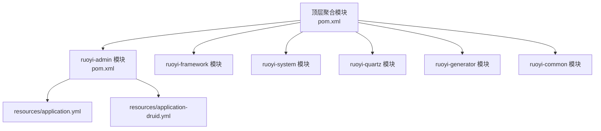
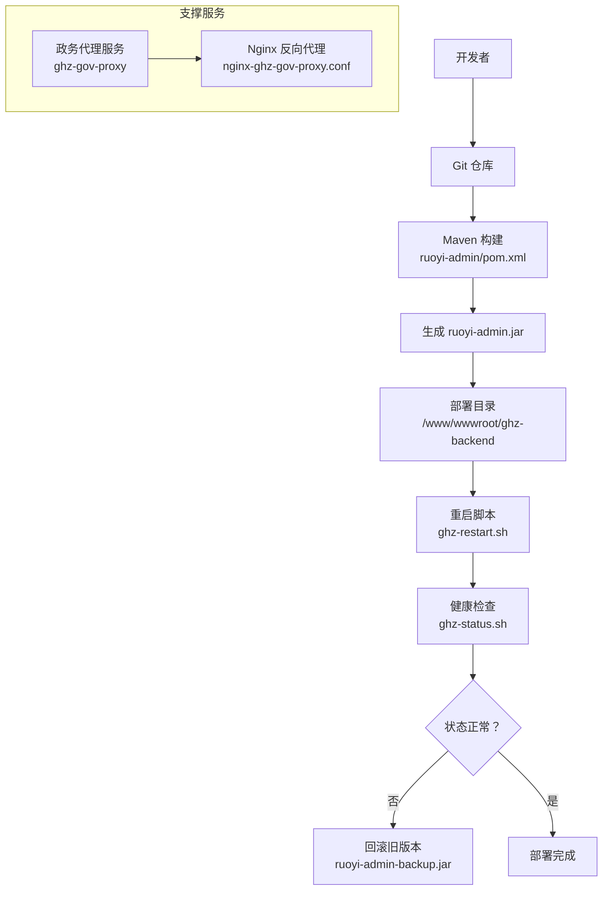
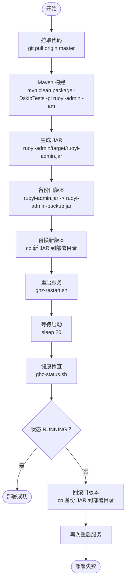
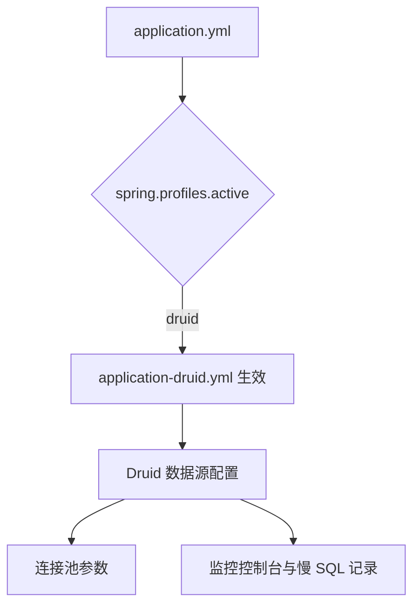
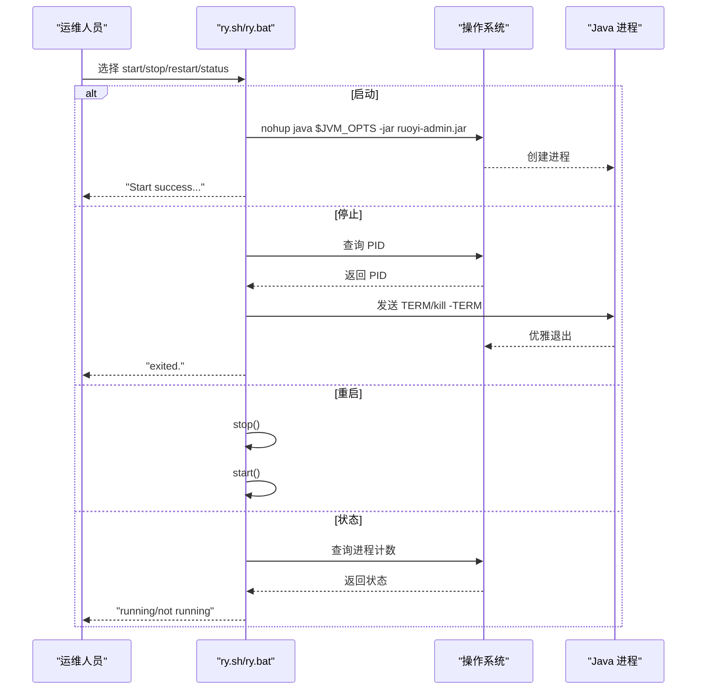
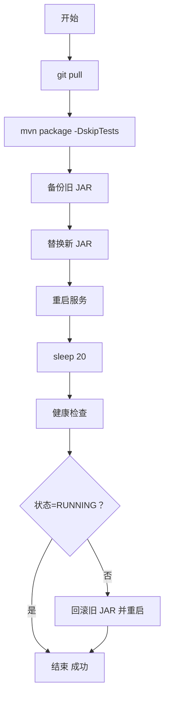
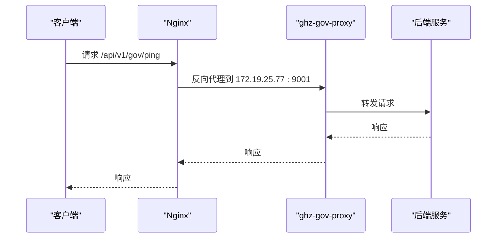
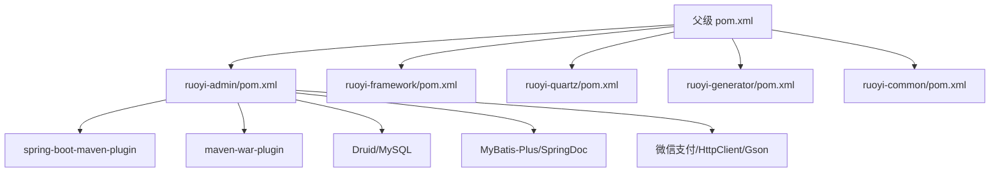

# 后端服务部署

<cite>
**本文引用的文件**
- [server-deploy.sh](file://server-deploy.sh)
- [application.yml](file://ruoyi-admin/src/main/resources/application.yml)
- [application-druid.yml](file://ruoyi-admin/src/main/resources/application-druid.yml)
- [pom.xml](file://ruoyi-admin/pom.xml)
- [pom.xml](file://pom.xml)
- [ry.sh](file://ry.sh)
- [ry.bat](file://ry.bat)
- [package.bat](file://bin/package.bat)
- [run.bat](file://bin/run.bat)
- [clean.bat](file://bin/clean.bat)
- [start.sh](file://ghz-gov-proxy/deploy/start.sh)
- [stop.sh](file://ghz-gov-proxy/deploy/stop.sh)
- [application-prod.yml](file://ghz-gov-proxy/deploy/application-prod.yml)
- [nginx-ghz-gov-proxy.conf](file://ghz-gov-proxy/deploy/nginx-ghz-gov-proxy.conf)
</cite>

## 目录
1. [简介](#简介)
2. [项目结构](#项目结构)
3. [核心组件](#核心组件)
4. [架构总览](#架构总览)
5. [详细组件分析](#详细组件分析)
6. [依赖关系分析](#依赖关系分析)
7. [性能考虑](#性能考虑)
8. [故障排查指南](#故障排查指南)
9. [结论](#结论)
10. [附录](#附录)

## 简介
本文件面向后端服务部署工程师与运维人员，系统性阐述基于 Spring Boot 的后端服务部署流程与最佳实践。内容涵盖 Maven 打包配置、JAR 文件部署、服务启动与停止脚本、多环境配置文件（application.yml 与 application-druid.yml）的差异与使用、部署脚本 server-deploy.sh 的工作原理（含代码拉取、编译打包、备份与回滚）、服务重启机制与健康检查流程，以及部署失败的自动回滚策略。同时提供 Windows 与 Linux 环境下的部署差异说明，包括批处理脚本与 Shell 脚本的使用方法。

## 项目结构
本仓库采用多模块 Maven 结构，后端服务主体位于 ruoyi-admin 模块，核心打包与插件配置集中在该模块的 pom.xml 中。顶层 pom.xml 统一管理版本与插件。ruoyi-admin 的资源目录包含多环境配置文件，用于区分开发、测试与生产环境的数据源与外部依赖配置。

图表来源
- [pom.xml:184-192](file://pom.xml#L184-L192)
- [pom.xml:1-140](file://ruoyi-admin/pom.xml#L1-L140)
- [application.yml:57-58](file://ruoyi-admin/src/main/resources/application.yml#L57-L58)
- [application-druid.yml:1-64](file://ruoyi-admin/src/main/resources/application-druid.yml#L1-L64)

章节来源
- [pom.xml:184-192](file://pom.xml#L184-L192)
- [pom.xml:109-138](file://ruoyi-admin/pom.xml#L109-L138)
- [application.yml:57-58](file://ruoyi-admin/src/main/resources/application.yml#L57-L58)
- [application-druid.yml:1-64](file://ruoyi-admin/src/main/resources/application-druid.yml#L1-L64)

## 核心组件
- Maven 打包与插件
  - ruoyi-admin 模块使用 spring-boot-maven-plugin 进行 repackage，生成可执行 JAR；同时保留 war 打包插件配置以满足多场景需求。
  - 顶层 pom.xml 统一管理 Java 版本、Spring Boot 与第三方依赖版本，确保各模块一致性。
- 多环境配置
  - application.yml：定义项目基础配置、服务器端口、文件上传大小、国际化、Redis、MyBatis-Plus、Swagger、XSS、微信支付、e签宝、政务代理等。
  - application-druid.yml：定义 Druid 数据源配置，包含主库连接参数、连接池参数、监控控制台与慢 SQL 记录等。
  - 通过 spring.profiles.active: druid 指定启用 druid 配置文件。
- 部署脚本
  - server-deploy.sh：自动化部署流程，包含代码拉取、Maven 打包、备份旧版本、替换新版本、重启服务与健康检查，失败时自动回滚。
  - ry.sh / ry.bat：通用的 Java 进程启停脚本，支持 start/stop/restart/status。
- 支撑服务
  - 政务代理服务 ghz-gov-proxy：独立的 Spring Boot 服务，提供健康检查端点与 Nginx 反向代理配置，用于对接外部政务接口。

章节来源
- [pom.xml:109-138](file://ruoyi-admin/pom.xml#L109-L138)
- [pom.xml:15-36](file://pom.xml#L15-L36)
- [application.yml:57-58](file://ruoyi-admin/src/main/resources/application.yml#L57-L58)
- [application-druid.yml:1-64](file://ruoyi-admin/src/main/resources/application-druid.yml#L1-L64)
- [server-deploy.sh:1-42](file://server-deploy.sh#L1-L42)
- [ry.sh:1-87](file://ry.sh#L1-L87)
- [ry.bat:1-68](file://ry.bat#L1-L68)

## 架构总览
后端服务部署涉及以下关键环节：代码版本管理（Git）、构建与打包（Maven）、服务运行（Java 进程）、健康检查与回滚（部署脚本）、以及外部依赖（政务代理服务）。部署脚本 server-deploy.sh 将这些环节串联起来，形成闭环的自动化发布流程。

图表来源
- [server-deploy.sh:7-39](file://server-deploy.sh#L7-L39)
- [pom.xml:109-138](file://ruoyi-admin/pom.xml#L109-L138)
- [nginx-ghz-gov-proxy.conf:1-45](file://ghz-gov-proxy/deploy/nginx-ghz-gov-proxy.conf#L1-L45)

## 详细组件分析

### Maven 打包配置与 JAR 部署
- 插件与目标
  - spring-boot-maven-plugin：执行 repackage 目标，生成可执行 JAR，包含启动类与依赖。
  - maven-war-plugin：配置 war 打包，设置 warName 与跳过缺失 web.xml 校验。
- 构建命令
  - server-deploy.sh 使用 mvn clean package -DskipTests -pl ruoyi-admin -am，仅对 ruoyi-admin 模块进行增量构建并跳过测试，缩短构建时间。
- JAR 部署
  - 构建产物 ruoyi-admin/target/ruoyi-admin.jar 被复制到 /www/wwwroot/ghz-backend/ruoyi-admin.jar，供运行脚本启动。

图表来源
- [server-deploy.sh:7-39](file://server-deploy.sh#L7-L39)
- [pom.xml:109-138](file://ruoyi-admin/pom.xml#L109-L138)

章节来源
- [server-deploy.sh:11-23](file://server-deploy.sh#L11-L23)
- [pom.xml:109-138](file://ruoyi-admin/pom.xml#L109-L138)

### 多环境配置文件：application.yml 与 application-druid.yml
- application.yml
  - 指定激活配置文件：spring.profiles.active: druid，使 application-druid.yml 生效。
  - 定义服务器端口、上下文路径、Tomcat 线程池参数、日志级别、文件上传大小、Redis 连接、MyBatis-Plus 全局配置、Swagger 文档路径、XSS 过滤规则、微信支付与 e签宝集成配置、政务代理服务基地址与 API Key（支持环境变量覆盖）等。
- application-druid.yml
  - 定义 Druid 数据源类型、驱动类、主库连接参数（URL、用户名、密码）。
  - 连接池参数：初始连接数、最小/最大空闲连接、最大活跃连接、等待超时、连接与网络超时、空闲连接检测周期、最小/最大存活时间。
  - 控制台与过滤器：开启 Web Stat Filter、Stat View Servlet，并配置登录凭据与慢 SQL 记录阈值。
- 使用建议
  - 在生产环境，确保 application.yml 中的 spring.profiles.active 指向 druid。
  - 对于敏感配置（如数据库密码、API Key），优先通过环境变量注入，避免硬编码在配置文件中。

图表来源
- [application.yml:57-58](file://ruoyi-admin/src/main/resources/application.yml#L57-L58)
- [application-druid.yml:1-64](file://ruoyi-admin/src/main/resources/application-druid.yml#L1-L64)

章节来源
- [application.yml:57-58](file://ruoyi-admin/src/main/resources/application.yml#L57-L58)
- [application-druid.yml:1-64](file://ruoyi-admin/src/main/resources/application-druid.yml#L1-L64)

### 服务启动与停止脚本：ry.sh 与 ry.bat
- ry.sh（Linux）
  - 提供 start/stop/restart/status 四种操作。
  - 启动：nohup 以 JVM 参数运行 ruoyi-admin.jar，输出重定向至 /dev/null。
  - 停止：通过 ps 查询进程 PID，发送 TERM 信号，等待优雅退出，超时后强制 kill。
  - 重启：先 stop，再 start。
- ry.bat（Windows）
  - 提供菜单式交互：启动、停止、重启、状态查询。
  - 启动：使用 jps 检测是否已运行，避免重复启动；通过 javaw 启动。
  - 停止：使用 jps 查找 PID 并 taskkill 强制结束。
  - 重启：先 stop，再 start。
  - 状态：显示当前进程运行状态。

图表来源
- [ry.sh:22-73](file://ry.sh#L22-L73)
- [ry.bat:26-67](file://ry.bat#L26-L67)

章节来源
- [ry.sh:1-87](file://ry.sh#L1-L87)
- [ry.bat:1-68](file://ry.bat#L1-L68)

### 部署脚本 server-deploy.sh 工作原理
- 步骤分解
  - 拉取最新代码：git pull origin master。
  - 编译打包：mvn clean package -DskipTests -pl ruoyi-admin -am，跳过测试提升效率。
  - 备份旧版本：若存在旧 JAR，则复制为 ruoyi-admin-backup.jar。
  - 替换新版本：将新构建的 JAR 复制到部署目录。
  - 重启服务：调用 /usr/local/bin/ghz-restart.sh。
  - 健康检查：等待 20 秒后执行 /usr/local/bin/ghz-status.sh，检查状态是否为 RUNNING。
  - 自动回滚：若状态非 RUNNING，则回滚旧版本并再次重启。
- 失败回滚策略
  - 通过备份 JAR 与条件判断实现自动回滚，减少人工干预与业务中断时间。

图表来源
- [server-deploy.sh:7-39](file://server-deploy.sh#L7-L39)

章节来源
- [server-deploy.sh:1-42](file://server-deploy.sh#L1-L42)

### 政务代理服务与 Nginx 反向代理
- 启动与停止
  - start.sh：检查是否已运行，准备日志目录，nohup 启动 Java 进程，设置 JVM 参数，输出到 run.log，并进行健康检查。
  - stop.sh：通过 run.pid 或 lsof 查找进程，优雅停止（10 秒内），超时后强制 kill -9，并清理 pid 文件。
- 生产配置
  - application-prod.yml：定义 server.port、安全 API Key、日志文件输出等。
- Nginx 反向代理
  - nginx-ghz-gov-proxy.conf：监听 8088，转发到 172.19.25.77:9001，透传关键请求头，设置超时与缓冲策略，并提供 /api/v1/gov/ping 健康检查直通。

图表来源
- [nginx-ghz-gov-proxy.conf:19-43](file://ghz-gov-proxy/deploy/nginx-ghz-gov-proxy.conf#L19-L43)
- [start.sh:26-46](file://ghz-gov-proxy/deploy/start.sh#L26-L46)
- [stop.sh:10-41](file://ghz-gov-proxy/deploy/stop.sh#L10-L41)
- [application-prod.yml:7-25](file://ghz-gov-proxy/deploy/application-prod.yml#L7-L25)

章节来源
- [start.sh:1-47](file://ghz-gov-proxy/deploy/start.sh#L1-L47)
- [stop.sh:1-42](file://ghz-gov-proxy/deploy/stop.sh#L1-L42)
- [application-prod.yml:1-26](file://ghz-gov-proxy/deploy/application-prod.yml#L1-L26)
- [nginx-ghz-gov-proxy.conf:1-45](file://ghz-gov-proxy/deploy/nginx-ghz-gov-proxy.conf#L1-L45)

### Windows 与 Linux 环境下的部署差异
- 构建与运行
  - Windows：使用 bin/package.bat、bin/run.bat、bin/clean.bat，通过 set/JAVA_OPTS 设置 JVM 参数，使用 javaw 启动。
  - Linux：使用 server-deploy.sh 与 ry.sh，通过 nohup 启动，使用 JVM 参数与优雅停止逻辑。
- 配置注入
  - Windows 与 Linux 均可通过环境变量覆盖敏感配置（如政务代理 API Key、数据库密码等），避免硬编码。
- 脚本兼容性
  - Linux 脚本更偏向自动化与健康检查，Windows 脚本更偏向交互式菜单与本地调试。

章节来源
- [package.bat:1-12](file://bin/package.bat#L1-L12)
- [run.bat:1-14](file://bin/run.bat#L1-L14)
- [clean.bat:1-12](file://bin/clean.bat#L1-L12)
- [ry.sh:1-87](file://ry.sh#L1-L87)
- [ry.bat:1-68](file://ry.bat#L1-L68)

## 依赖关系分析
- 模块依赖
  - ruoyi-admin 依赖 ruoyi-framework、ruoyi-quartz、ruoyi-generator 等模块，通过父级 pom.xml 的 dependencyManagement 统一版本。
- 插件依赖
  - spring-boot-maven-plugin 与 maven-war-plugin 在 ruoyi-admin 模块中配置，保证打包行为一致。
- 外部依赖
  - Druid 连接池、MySQL 驱动、MyBatis-Plus、SpringDoc、微信支付 SDK、Apache HttpClient、Gson、commons-codec 等均在 ruoyi-admin 的 pom.xml 中声明。

图表来源
- [pom.xml:39-182](file://pom.xml#L39-L182)
- [pom.xml:18-107](file://ruoyi-admin/pom.xml#L18-L107)

章节来源
- [pom.xml:39-182](file://pom.xml#L39-L182)
- [pom.xml:18-107](file://ruoyi-admin/pom.xml#L18-L107)

## 性能考虑
- JVM 参数
  - 通过 JAVA_OPTS/ry.sh 的 JVM 参数设置堆大小、元空间大小、GC 策略等，建议根据实际内存与并发量调整。
- 连接池与超时
  - application-druid.yml 中的连接池参数与超时设置直接影响数据库访问性能与稳定性，建议结合压测结果优化。
- 构建效率
  - server-deploy.sh 使用 -DskipTests 与增量构建，显著缩短构建时间，适合 CI/CD 流水线。

## 故障排查指南
- 部署失败回滚
  - server-deploy.sh 在健康检查失败时自动回滚旧版本并重启，减少业务中断。
- 进程状态与停止
  - 使用 ry.sh/ry.bat 的 status 与 stop 功能快速定位与终止异常进程。
- 健康检查
  - server-deploy.sh 通过 /usr/local/bin/ghz-status.sh 检查服务状态；政务代理服务通过 /api/v1/gov/ping 进行健康检查。
- 日志定位
  - 政务代理服务日志输出到 run.log，可使用 tail -f 查看；Nginx 访问与错误日志位于 /var/log/nginx/ 下，便于排查代理层问题。

章节来源
- [server-deploy.sh:29-39](file://server-deploy.sh#L29-L39)
- [ry.sh:65-73](file://ry.sh#L65-L73)
- [ry.bat:59-67](file://ry.bat#L59-L67)
- [start.sh:38-46](file://ghz-gov-proxy/deploy/start.sh#L38-L46)
- [nginx-ghz-gov-proxy.conf:15-17](file://ghz-gov-proxy/deploy/nginx-ghz-gov-proxy.conf#L15-L17)

## 结论
本文系统梳理了基于 Spring Boot 的后端服务部署流程，明确了 Maven 打包、多环境配置、自动化部署脚本、服务启停与健康检查、以及失败回滚策略。通过 server-deploy.sh 与 ry.sh/ry.bat 的配合，实现了从代码拉取到服务上线的全链路自动化；通过 application.yml 与 application-druid.yml 的分离，实现了配置的清晰与可维护；通过政务代理服务与 Nginx 的协同，保障了对外接口的稳定与可观测。建议在生产环境中优先使用环境变量注入敏感配置，并结合压测结果优化 JVM 与连接池参数。

## 附录
- 常用命令与路径
  - 构建：mvn clean package -DskipTests -pl ruoyi-admin -am
  - 启动：nohup java $JVM_OPTS -jar ruoyi-admin.jar
  - 停止：kill -TERM $PID（优雅）或 kill -9 $PID（强制）
  - 健康检查：ghz-status.sh 或 curl http://127.0.0.1:9001/api/v1/gov/ping
- 配置覆盖
  - 政务代理 API Key：GOV_PROXY_API_KEY
  - 政务代理基地址：GOV_PROXY_BASE_URL
  - 数据库密码：通过环境变量注入（示例：DRUID_PASSWORD）