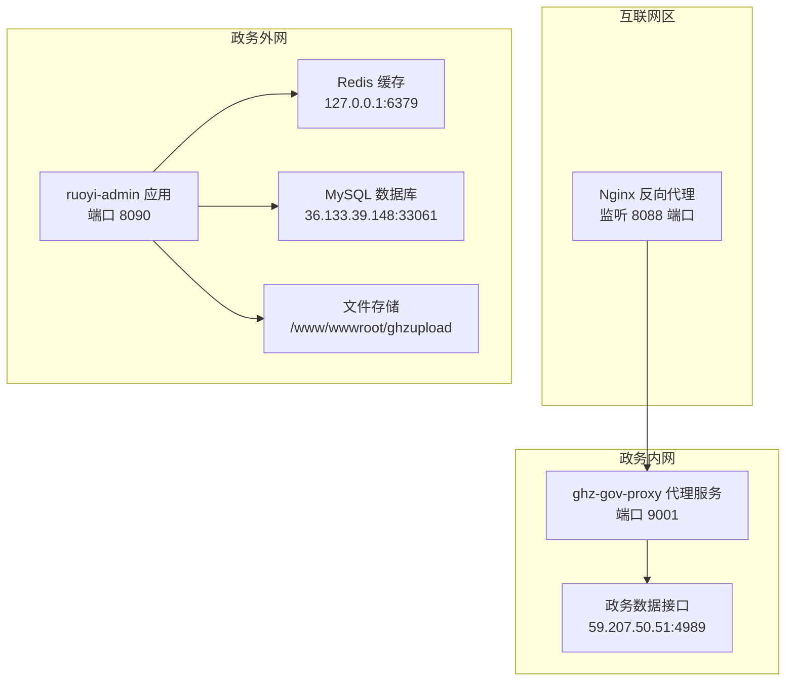
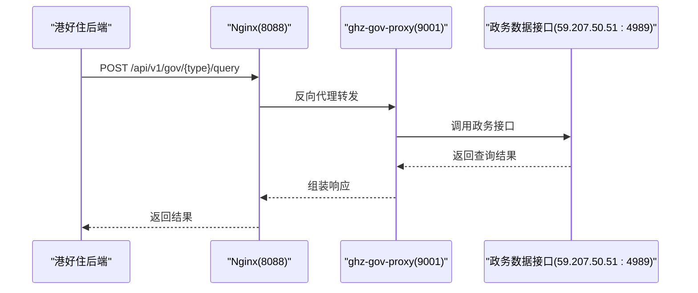
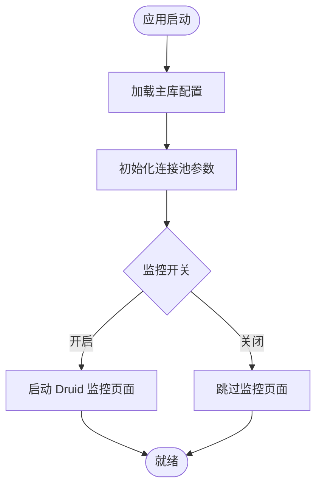
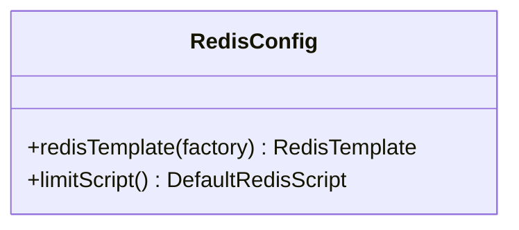
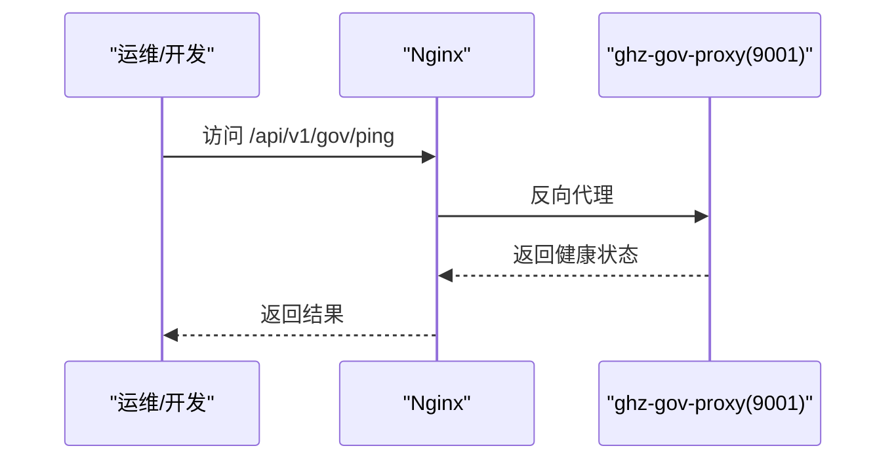
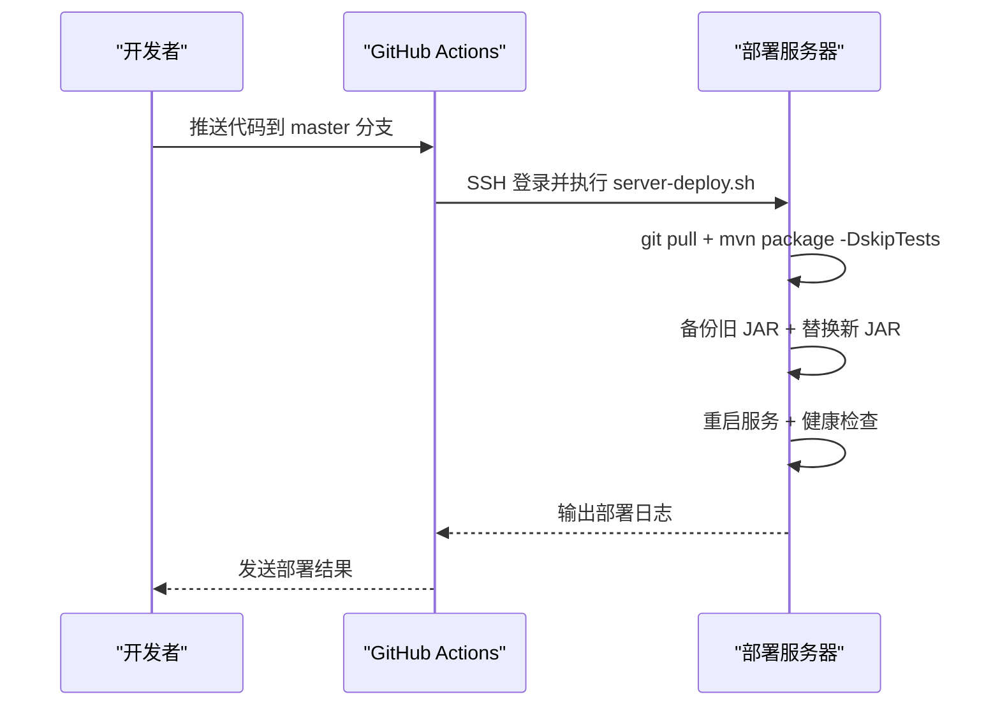
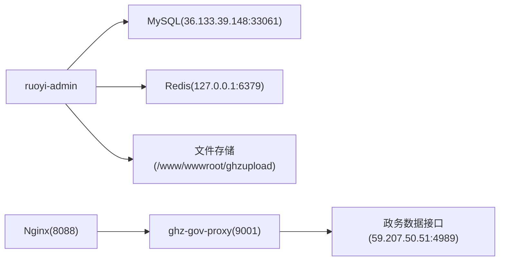

# 基础设施配置

<cite>
**本文引用的文件**
- [ghz-gov-proxy 部署配置(application-prod.yml)](file://ghz-gov-proxy/deploy/application-prod.yml)
- [ghz-gov-proxy Nginx 反向代理配置(nginx-ghz-gov-proxy.conf)](file://ghz-gov-proxy/deploy/nginx-ghz-gov-proxy.conf)
- [ghz-gov-proxy 启动脚本(start.sh)](file://ghz-gov-proxy/deploy/start.sh)
- [ghz-gov-proxy 停止脚本(stop.sh)](file://ghz-gov-proxy/deploy/stop.sh)
- [ghz-gov-proxy 部署指南(README.md)](file://ghz-gov-proxy/deploy/README.md)
- [ruoyi-admin 应用配置(application.yml)](file://ruoyi-admin/src/main/resources/application.yml)
- [ruoyi-admin 数据源配置(application-druid.yml)](file://ruoyi-admin/src/main/resources/application-druid.yml)
- [ruoyi-framework Redis 配置(RedisConfig.java)](file://ruoyi-framework/src/main/java/com/ruoyi/framework/config/RedisConfig.java)
- [ruoyi-framework Druid 多数据源配置(DruidConfig.java)](file://ruoyi-framework/src/main/java/com/ruoyi/framework/config/DruidConfig.java)
- [微信支付证书(apiclient_key.pem)](file://ruoyi-admin/src/main/resources/certs/apiclient_key.pem)
- [微信支付证书(pub_key.pem)](file://ruoyi-admin/src/main/resources/certs/pub_key.pem)
- [后端部署脚本(server-deploy.sh)](file://server-deploy.sh)
- [前端H5部署脚本(deploy-h5.sh)](file://uniapp-h5/deploy-h5.sh)
- [GitHub Actions 后端流水线(backend-deploy.yml)](file://.github/workflows/backend-deploy.yml)
- [GitHub Actions 前端流水线(frontend-admin-deploy.yml)](file://.github/workflows/frontend-admin-deploy.yml)
</cite>

## 目录
1. [简介](#简介)
2. [项目结构](#项目结构)
3. [核心组件](#核心组件)
4. [架构总览](#架构总览)
5. [详细组件分析](#详细组件分析)
6. [依赖关系分析](#依赖关系分析)
7. [性能考虑](#性能考虑)
8. [故障排查指南](#故障排查指南)
9. [结论](#结论)
10. [附录](#附录)

## 简介
本文件面向系统运维与开发团队，提供完整的基础设施配置说明，涵盖数据库连接、Redis 缓存、文件存储、多环境配置管理、Nginx 反向代理、GitHub Actions 自动化部署以及服务器环境要求与性能优化建议。文档基于仓库中的实际配置文件与脚本整理而成，确保读者能够准确理解并复现生产环境的部署与运行。

## 项目结构
该工程包含多个子模块与部署资产，基础设施相关的关键位置如下：
- 后端应用 ruoyi-admin：包含数据库、Redis、文件存储、微信支付、政务代理等配置
- 政务代理服务 ghz-gov-proxy：独立的 Java 服务，负责对外提供统一的政务数据查询接口
- 部署与自动化：包含 Nginx 配置、启动/停止脚本、GitHub Actions 流水线、一键部署脚本

图表来源
- [ghz-gov-proxy Nginx 反向代理配置(nginx-ghz-gov-proxy.conf):1-44](file://ghz-gov-proxy/deploy/nginx-ghz-gov-proxy.conf#L1-L44)
- [ghz-gov-proxy 部署配置(application-prod.yml):1-26](file://ghz-gov-proxy/deploy/application-prod.yml#L1-L26)
- [ruoyi-admin 应用配置(application.yml):1-238](file://ruoyi-admin/src/main/resources/application.yml#L1-L238)

章节来源
- [ghz-gov-proxy 部署配置(application-prod.yml):1-26](file://ghz-gov-proxy/deploy/application-prod.yml#L1-L26)
- [ghz-gov-proxy Nginx 反向代理配置(nginx-ghz-gov-proxy.conf):1-44](file://ghz-gov-proxy/deploy/nginx-ghz-gov-proxy.conf#L1-L44)
- [ruoyi-admin 应用配置(application.yml):1-238](file://ruoyi-admin/src/main/resources/application.yml#L1-L238)

## 核心组件
- 数据库连接配置
  - 数据源类型：Druid
  - 主库地址：36.133.39.148:33061
  - 用户名与密码：通过环境变量注入
  - 连接池参数：初始连接、最小空闲、最大活跃、超时等均有明确配置
- Redis 缓存配置
  - 默认本地 127.0.0.1:6379
  - 使用字符串序列化 Key，JSON 序列化 Value
  - 提供限流 Lua 脚本支持
- 文件存储配置
  - 上传目录：/www/wwwroot/ghzupload
  - 支持 VR 全景图与大图上传，单文件与总上传大小已调优
- 微信支付与 e签宝
  - 微信支付证书与公钥路径配置
  - e签宝生产/沙箱切换、回调与跳转地址
- 政务代理服务
  - 独立 Java 应用，监听 9001 端口
  - Nginx 作为公网入口，转发至 9001
  - 健康检查路径 /api/v1/gov/ping

章节来源
- [ruoyi-admin 数据源配置(application-druid.yml):1-64](file://ruoyi-admin/src/main/resources/application-druid.yml#L1-L64)
- [ruoyi-framework Redis 配置(RedisConfig.java):1-71](file://ruoyi-framework/src/main/java/com/ruoyi/framework/config/RedisConfig.java#L1-L71)
- [ruoyi-admin 应用配置(application.yml):1-238](file://ruoyi-admin/src/main/resources/application.yml#L1-L238)
- [ghz-gov-proxy 部署配置(application-prod.yml):1-26](file://ghz-gov-proxy/deploy/application-prod.yml#L1-L26)
- [ghz-gov-proxy Nginx 反向代理配置(nginx-ghz-gov-proxy.conf):1-44](file://ghz-gov-proxy/deploy/nginx-ghz-gov-proxy.conf#L1-L44)

## 架构总览
系统由“互联网区 Nginx + 政务外网应用 + 政务内网代理 + 政务数据接口”构成三层架构。Nginx 作为公网入口，负责请求转发与超时设置；代理服务处理与政务接口的交互，并提供统一的业务查询接口；应用层负责业务逻辑、缓存、数据库与文件存储。

图表来源
- [ghz-gov-proxy 部署指南(README.md):3-14](file://ghz-gov-proxy/deploy/README.md#L3-L14)
- [ghz-gov-proxy Nginx 反向代理配置(nginx-ghz-gov-proxy.conf):19-38](file://ghz-gov-proxy/deploy/nginx-ghz-gov-proxy.conf#L19-L38)

章节来源
- [ghz-gov-proxy 部署指南(README.md):1-177](file://ghz-gov-proxy/deploy/README.md#L1-L177)
- [ghz-gov-proxy Nginx 反向代理配置(nginx-ghz-gov-proxy.conf):1-44](file://ghz-gov-proxy/deploy/nginx-ghz-gov-proxy.conf#L1-L44)

## 详细组件分析

### 数据库连接配置
- 连接池：Druid，主库启用，从库默认关闭
- 关键参数：初始连接、最小空闲、最大活跃、连接/网络超时、空闲检测周期、慢 SQL 记录
- 控制台：开启 Druid 监控页面，设置登录凭据与白名单
- 环境变量：数据库 URL、用户名、密码可通过环境变量覆盖

图表来源
- [ruoyi-admin 数据源配置(application-druid.yml):1-64](file://ruoyi-admin/src/main/resources/application-druid.yml#L1-L64)
- [ruoyi-framework Druid 多数据源配置(DruidConfig.java):32-127](file://ruoyi-framework/src/main/java/com/ruoyi/framework/config/DruidConfig.java#L32-L127)

章节来源
- [ruoyi-admin 数据源配置(application-druid.yml):1-64](file://ruoyi-admin/src/main/resources/application-druid.yml#L1-L64)
- [ruoyi-framework Druid 多数据源配置(DruidConfig.java):1-127](file://ruoyi-framework/src/main/java/com/ruoyi/framework/config/DruidConfig.java#L1-L127)

### Redis 缓存配置
- 序列化：Key 使用字符串序列化，Value 使用 JSON 序列化
- 缓存注解：启用 Spring Cache
- 限流脚本：提供基于 Lua 的限流脚本，支持按 key 计数与过期时间控制

图表来源
- [ruoyi-framework Redis 配置(RedisConfig.java):17-71](file://ruoyi-framework/src/main/java/com/ruoyi/framework/config/RedisConfig.java#L17-L71)

章节来源
- [ruoyi-framework Redis 配置(RedisConfig.java):1-71](file://ruoyi-framework/src/main/java/com/ruoyi/framework/config/RedisConfig.java#L1-L71)

### 文件存储配置
- 上传目录：/www/wwwroot/ghzupload（生产环境示例）
- 单文件与总上传大小：分别为 200MB 与 300MB，满足 VR 全景图与大图场景
- 开发/测试环境示例：本地路径 uploadfile

章节来源
- [ruoyi-admin 应用配置(application.yml):9-17](file://ruoyi-admin/src/main/resources/application.yml#L9-L17)
- [ruoyi-admin 应用配置(application.yml):60-66](file://ruoyi-admin/src/main/resources/application.yml#L60-L66)

### 微信支付与 e签宝配置
- 微信支付：证书与公钥路径、平台密钥、通知域名等均配置于 application.yml
- e签宝：支持沙箱与生产环境切换，回调与跳转地址均为公网可访问地址

章节来源
- [ruoyi-admin 应用配置(application.yml):179-219](file://ruoyi-admin/src/main/resources/application.yml#L179-L219)

### 政务代理服务（ghz-gov-proxy）
- 独立 Java 应用，监听 9001 端口，提供 /api/v1/gov/ping 健康检查
- Nginx 作为公网入口，监听 8088，转发至 9001，并设置超时与请求体大小
- 启动/停止脚本：支持 PID 文件、优雅停机、健康检查

图表来源
- [ghz-gov-proxy Nginx 反向代理配置(nginx-ghz-gov-proxy.conf):40-43](file://ghz-gov-proxy/deploy/nginx-ghz-gov-proxy.conf#L40-L43)
- [ghz-gov-proxy 部署配置(application-prod.yml):7-9](file://ghz-gov-proxy/deploy/application-prod.yml#L7-L9)

章节来源
- [ghz-gov-proxy 部署配置(application-prod.yml):1-26](file://ghz-gov-proxy/deploy/application-prod.yml#L1-L26)
- [ghz-gov-proxy Nginx 反向代理配置(nginx-ghz-gov-proxy.conf):1-44](file://ghz-gov-proxy/deploy/nginx-ghz-gov-proxy.conf#L1-L44)
- [ghz-gov-proxy 启动脚本(start.sh):1-47](file://ghz-gov-proxy/deploy/start.sh#L1-L47)
- [ghz-gov-proxy 停止脚本(stop.sh):1-42](file://ghz-gov-proxy/deploy/stop.sh#L1-L42)

### 多环境配置管理策略
- ruoyi-admin 应用通过 spring.profiles.active: druid 指定数据源配置文件
- 数据库连接参数可通过环境变量覆盖（如 ZHB_*、GOV_PROXY_*、GHZ_PREVIEW_PHONES）
- ghz-gov-proxy 通过 --spring.config.location 指定生产配置文件
- 建议策略：
  - 开发环境：本地 application.yml + 本地数据库/Redis
  - 测试环境：application-druid.yml + 测试库 + 测试 Redis
  - 生产环境：application-prod.yml + 生产库 + 生产 Redis + 证书文件

章节来源
- [ruoyi-admin 应用配置(application.yml):57-58](file://ruoyi-admin/src/main/resources/application.yml#L57-L58)
- [ruoyi-admin 应用配置(application.yml):166-178](file://ruoyi-admin/src/main/resources/application.yml#L166-L178)
- [ruoyi-admin 应用配置(application.yml):220-229](file://ruoyi-admin/src/main/resources/application.yml#L220-L229)
- [ghz-gov-proxy 部署配置(application-prod.yml):4-4](file://ghz-gov-proxy/deploy/application-prod.yml#L4-L4)

### Nginx 反向代理配置
- 监听 8088 端口，转发至 172.19.25.77:9001
- 透传 Host、X-Real-IP、X-Forwarded-For、X-Forwarded-Proto
- 超时设置：连接 10s、读写 60s
- 请求体大小：10m
- 健康检查路径：/api/v1/gov/ping 直通

章节来源
- [ghz-gov-proxy Nginx 反向代理配置(nginx-ghz-gov-proxy.conf):7-44](file://ghz-gov-proxy/deploy/nginx-ghz-gov-proxy.conf#L7-L44)

### GitHub Actions 自动化部署
- 后端流水线：监听 ruoyi-* 目录与 pom.xml 变更，通过 SSH 触发服务器上的部署脚本
- 前端流水线：用于管理前端 admin 的 CI/CD（具体配置位于工作流文件）
- 一键部署脚本：拉取代码、跳过测试编译、备份旧版本、替换 JAR、重启服务并健康检查

图表来源
- [.github 工作流(backend-deploy.yml):1-31](file://.github/workflows/backend-deploy.yml#L1-L31)
- [后端部署脚本(server-deploy.sh):1-42](file://server-deploy.sh#L1-L42)

章节来源
- [.github 工作流(backend-deploy.yml):1-31](file://.github/workflows/backend-deploy.yml#L1-L31)
- [.github 工作流(frontend-admin-deploy.yml):1-200](file://.github/workflows/frontend-admin-deploy.yml#L1-L200)
- [后端部署脚本(server-deploy.sh):1-42](file://server-deploy.sh#L1-L42)

## 依赖关系分析
- 应用层依赖
  - ruoyi-admin 依赖 MySQL（Druid 连接池）、Redis（缓存与限流）、文件系统（上传目录）
  - 政务代理服务依赖 Nginx 作为入口，依赖政务内网接口
- 部署与运维依赖
  - GitHub Actions 通过 SSH 与部署脚本协作
  - Nginx 配置与防火墙策略影响公网可达性

图表来源
- [ruoyi-admin 数据源配置(application-druid.yml):12-14](file://ruoyi-admin/src/main/resources/application-druid.yml#L12-L14)
- [ruoyi-framework Redis 配置(RedisConfig.java):24-41](file://ruoyi-framework/src/main/java/com/ruoyi/framework/config/RedisConfig.java#L24-L41)
- [ghz-gov-proxy Nginx 反向代理配置(nginx-ghz-gov-proxy.conf):21-21](file://ghz-gov-proxy/deploy/nginx-ghz-gov-proxy.conf#L21-L21)

章节来源
- [ruoyi-admin 数据源配置(application-druid.yml):1-64](file://ruoyi-admin/src/main/resources/application-druid.yml#L1-L64)
- [ruoyi-framework Redis 配置(RedisConfig.java):1-71](file://ruoyi-framework/src/main/java/com/ruoyi/framework/config/RedisConfig.java#L1-L71)
- [ghz-gov-proxy Nginx 反向代理配置(nginx-ghz-gov-proxy.conf):1-44](file://ghz-gov-proxy/deploy/nginx-ghz-gov-proxy.conf#L1-L44)

## 性能考虑
- 数据库连接池
  - 合理设置初始连接、最小空闲、最大活跃，避免频繁创建销毁连接
  - 启用慢 SQL 记录，定期分析慢查询
- Redis
  - 使用合适的序列化策略，避免大对象频繁序列化
  - 结合限流脚本控制热点接口的并发
- Nginx
  - 读写超时设置为 60s，满足政务接口最长响应时间
  - 关闭代理缓存，保证实时性
- 应用线程与上传
  - Tomcat 线程池参数已调优，上传文件大小适当提高以支持大图

章节来源
- [ruoyi-admin 数据源配置(application-druid.yml):22-44](file://ruoyi-admin/src/main/resources/application-druid.yml#L22-L44)
- [ruoyi-framework Redis 配置(RedisConfig.java):44-70](file://ruoyi-framework/src/main/java/com/ruoyi/framework/config/RedisConfig.java#L44-L70)
- [ghz-gov-proxy Nginx 反向代理配置(nginx-ghz-gov-proxy.conf):29-37](file://ghz-gov-proxy/deploy/nginx-ghz-gov-proxy.conf#L29-L37)
- [ruoyi-admin 应用配置(application.yml):26-36](file://ruoyi-admin/src/main/resources/application.yml#L26-L36)
- [ruoyi-admin 应用配置(application.yml):60-66](file://ruoyi-admin/src/main/resources/application.yml#L60-L66)

## 故障排查指南
- L1 层（本机）健康检查失败
  - 检查 run.log 日志，确认应用是否正常启动
- L2 层（专线）健康检查失败
  - 使用 telnet 验证 172.19.25.77:9001 可达性
- L3 层（公网）失败
  - 检查运营商/NAT 与防火墙策略，确认 8088 端口开放
  - 若返回 401，确认请求头 X-Api-Key 是否正确
  - 若返回 504，确认政务接口响应时间，必要时调整 Nginx 超时
- 数据库连接异常
  - 检查数据库地址、端口、用户名、密码是否正确
  - 查看 Druid 监控页面与慢 SQL 日志
- Redis 连接异常
  - 确认 Redis 服务状态与网络连通性
  - 检查序列化配置是否一致

章节来源
- [ghz-gov-proxy 部署指南(README.md):154-163](file://ghz-gov-proxy/deploy/README.md#L154-L163)
- [ruoyi-admin 数据源配置(application-druid.yml):47-64](file://ruoyi-admin/src/main/resources/application-druid.yml#L47-L64)

## 结论
本基础设施配置文档基于仓库中的真实配置与脚本，明确了数据库、Redis、文件存储、Nginx 代理、多环境管理与自动化部署的要点。建议在生产环境中严格遵循环境变量覆盖策略、证书与密钥的安全管理、以及完善的健康检查与回滚机制，确保系统稳定运行。

## 附录
- 服务器环境要求与建议
  - JDK：OpenJDK 8（代理服务）
  - Nginx：安装并启用，开放 8088 端口
  - MySQL：36.133.39.148:33061，使用 SSL 连接
  - Redis：127.0.0.1:6379，建议启用持久化与合理内存上限
  - 文件存储：/www/wwwroot/ghzupload，具备足够磁盘空间与 IO 性能
- 证书与密钥
  - 微信支付私钥与公钥路径已在配置中声明，部署时确保文件存在且权限正确

章节来源
- [ghz-gov-proxy 部署指南(README.md):38-46](file://ghz-gov-proxy/deploy/README.md#L38-L46)
- [ruoyi-admin 应用配置(application.yml):185-197](file://ruoyi-admin/src/main/resources/application.yml#L185-L197)
- [微信支付证书(apiclient_key.pem):1-29](file://ruoyi-admin/src/main/resources/certs/apiclient_key.pem#L1-L29)
- [微信支付证书(pub_key.pem):1-10](file://ruoyi-admin/src/main/resources/certs/pub_key.pem#L1-L10)