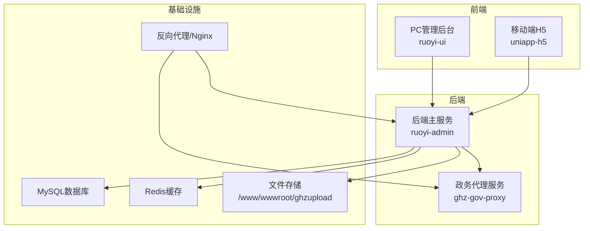
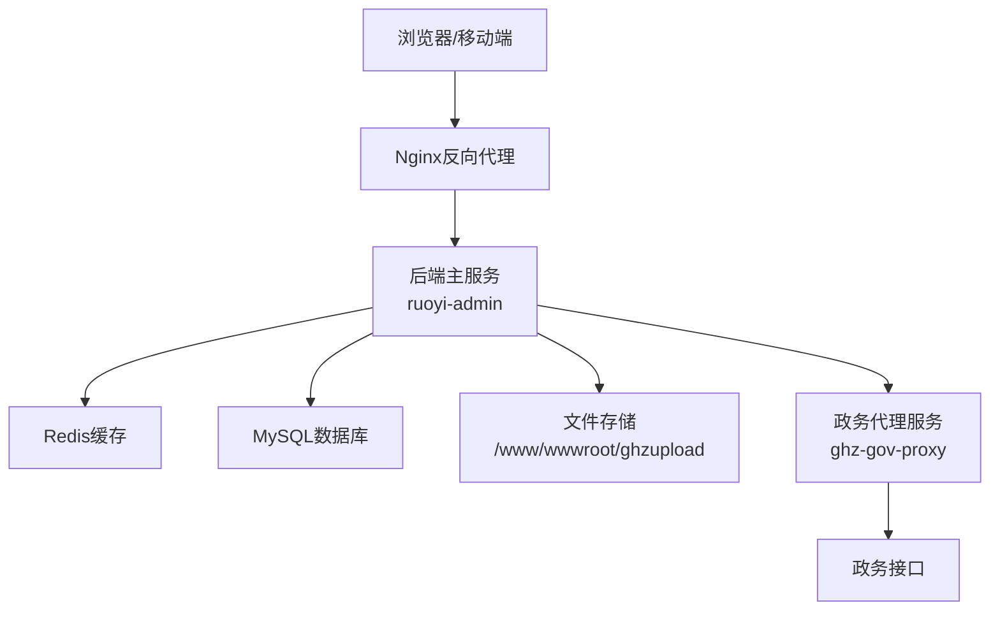
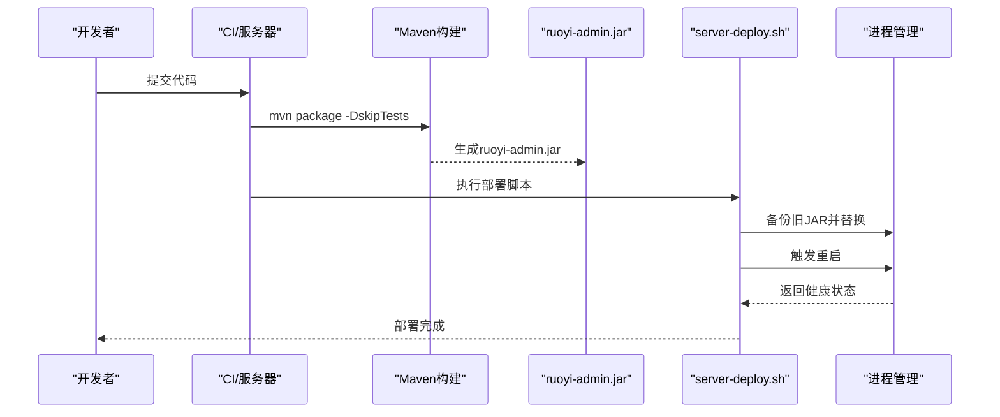
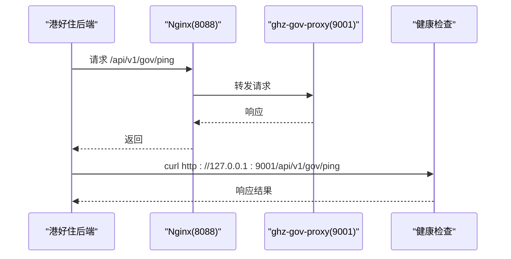
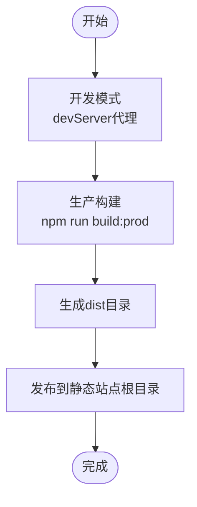
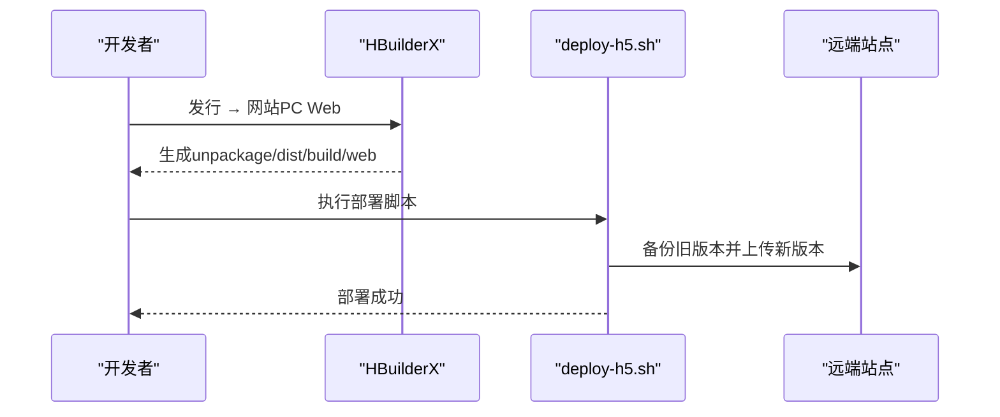
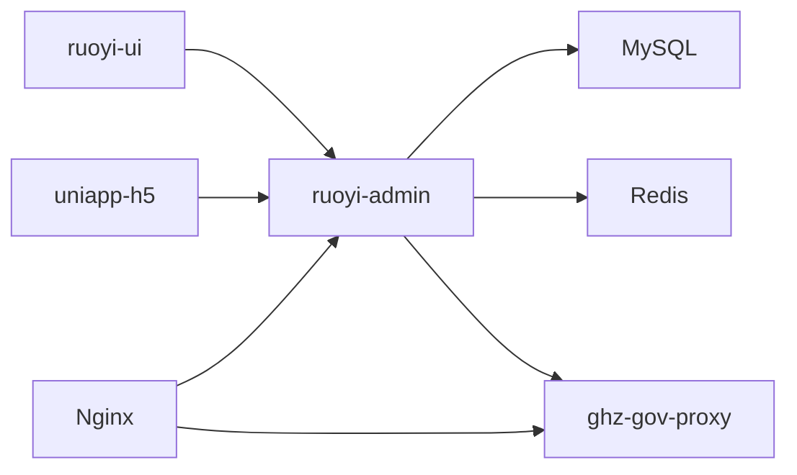

# 部署架构设计

<cite>
**本文引用的文件**
- [ghz-gov-proxy/deploy/start.sh](file://ghz-gov-proxy/deploy/start.sh)
- [ghz-gov-proxy/deploy/stop.sh](file://ghz-gov-proxy/deploy/stop.sh)
- [ghz-gov-proxy/deploy/nginx-ghz-gov-proxy.conf](file://ghz-gov-proxy/deploy/nginx-ghz-gov-proxy.conf)
- [ghz-gov-proxy/deploy/application-prod.yml](file://ghz-gov-proxy/deploy/application-prod.yml)
- [ghz-gov-proxy/src/main/resources/application.yml](file://ghz-gov-proxy/src/main/resources/application.yml)
- [ruoyi-admin/src/main/resources/application.yml](file://ruoyi-admin/src/main/resources/application.yml)
- [ruoyi-admin/src/main/resources/application-druid.yml](file://ruoyi-admin/src/main/resources/application-druid.yml)
- [ruoyi-admin/pom.xml](file://ruoyi-admin/pom.xml)
- [ruoyi-ui/vue.config.js](file://ruoyi-ui/vue.config.js)
- [ruoyi-ui/bin/build.bat](file://ruoyi-ui/bin/build.bat)
- [uniapp-h5/deploy-h5.sh](file://uniapp-h5/deploy-h5.sh)
- [uniapp-h5/package.json](file://uniapp-h5/package.json)
- [server-deploy.sh](file://server-deploy.sh)
- [bin/package.bat](file://bin/package.bat)
- [ruoyi-admin/src/main/resources/banner.txt](file://ruoyi-admin/src/main/resources/banner.txt)
- [ruoyi-admin/src/main/resources/logback.xml](file://ruoyi-admin/src/main/resources/logback.xml)
</cite>

## 目录
1. [简介](#简介)
2. [项目结构](#项目结构)
3. [核心组件](#核心组件)
4. [架构总览](#架构总览)
5. [详细组件分析](#详细组件分析)
6. [依赖分析](#依赖分析)
7. [性能考虑](#性能考虑)
8. [故障排查指南](#故障排查指南)
9. [结论](#结论)
10. [附录](#附录)

## 简介
本文件面向港好住信息系统，提供一套完整的部署架构设计文档，涵盖多环境部署策略（开发、测试、生产）、后端服务（Spring Boot）打包与部署、前端应用（PC管理后台与移动端H5）构建与发布、静态资源与文件存储、数据库连接、负载均衡与反向代理、SSL与网络安全、以及部署检查清单与运维脚本使用指南。

## 项目结构
系统主要由以下子系统组成：
- 后端主服务：ruoyi-admin（Spring Boot Web服务）
- 政务数据代理服务：ghz-gov-proxy（Spring Boot代理服务）
- PC管理后台前端：ruoyi-ui（Vue 3）
- 移动端H5前端：uniapp-h5（H5构建与发布）
- 部署与运维脚本：server-deploy.sh、start.sh、stop.sh、deploy-h5.sh 等

图表来源
- [ruoyi-admin/src/main/resources/application.yml:11-12](file://ruoyi-admin/src/main/resources/application.yml#L11-L12)
- [ruoyi-admin/src/main/resources/application-druid.yml:12-14](file://ruoyi-admin/src/main/resources/application-druid.yml#L12-L14)
- [ghz-gov-proxy/deploy/nginx-ghz-gov-proxy.conf:7-44](file://ghz-gov-proxy/deploy/nginx-ghz-gov-proxy.conf#L7-L44)

章节来源
- [ruoyi-admin/src/main/resources/application.yml:11-12](file://ruoyi-admin/src/main/resources/application.yml#L11-L12)
- [ruoyi-admin/src/main/resources/application-druid.yml:12-14](file://ruoyi-admin/src/main/resources/application-druid.yml#L12-L14)
- [ghz-gov-proxy/deploy/nginx-ghz-gov-proxy.conf:7-44](file://ghz-gov-proxy/deploy/nginx-ghz-gov-proxy.conf#L7-L44)

## 核心组件
- 后端主服务 ruoyi-admin
  - Spring Boot 应用，打包为可执行 JAR，提供管理后台与H5接口
  - 配置文件：application.yml（通用配置）、application-druid.yml（数据库Druid连接池）
  - 构建插件：spring-boot-maven-plugin、maven-war-plugin
- 政务代理服务 ghz-gov-proxy
  - Spring Boot 应用，提供统一政务接口代理，支持API Key鉴权
  - 配置文件：src/main/resources/application.yml（开发默认）、deploy/application-prod.yml（生产）
  - Nginx 反向代理：ghz-gov-proxy.conf
- PC管理后台 ruoyi-ui
  - Vue 3 前端，开发时通过 devServer 代理到后端，生产打包输出 dist
  - 构建配置：vue.config.js、build.bat
- 移动端H5 uniapp-h5
  - H5构建产物发布至远端站点，使用 deploy-h5.sh 一键部署
  - 依赖：package.json（第三方库）

章节来源
- [ruoyi-admin/pom.xml:109-138](file://ruoyi-admin/pom.xml#L109-L138)
- [ruoyi-admin/src/main/resources/application.yml:52-94](file://ruoyi-admin/src/main/resources/application.yml#L52-L94)
- [ruoyi-admin/src/main/resources/application-druid.yml:12-64](file://ruoyi-admin/src/main/resources/application-druid.yml#L12-L64)
- [ghz-gov-proxy/src/main/resources/application.yml:1-13](file://ghz-gov-proxy/src/main/resources/application.yml#L1-L13)
- [ghz-gov-proxy/deploy/application-prod.yml:1-26](file://ghz-gov-proxy/deploy/application-prod.yml#L1-L26)
- [ruoyi-ui/vue.config.js:20-53](file://ruoyi-ui/vue.config.js#L20-L53)
- [ruoyi-ui/bin/build.bat:1-12](file://ruoyi-ui/bin/build.bat#L1-L12)
- [uniapp-h5/deploy-h5.sh:1-42](file://uniapp-h5/deploy-h5.sh#L1-L42)
- [uniapp-h5/package.json:1-6](file://uniapp-h5/package.json#L1-L6)

## 架构总览
系统采用“前端分离 + 后端微服务化”的架构：
- 前端通过 Nginx 反向代理访问后端，H5通过独立域名访问
- 后端主服务对外提供REST API，内部通过Redis缓存与MySQL数据库交互
- 政务代理服务作为外部接口的统一入口，负责鉴权与转发
- 静态资源与上传文件存储于共享文件系统，供后端读写

图表来源
- [ghz-gov-proxy/deploy/nginx-ghz-gov-proxy.conf:7-44](file://ghz-gov-proxy/deploy/nginx-ghz-gov-proxy.conf#L7-L44)
- [ruoyi-admin/src/main/resources/application.yml:72-94](file://ruoyi-admin/src/main/resources/application.yml#L72-L94)
- [ruoyi-admin/src/main/resources/application-druid.yml:12-64](file://ruoyi-admin/src/main/resources/application-druid.yml#L12-L64)

## 详细组件分析

### 后端主服务 ruoyi-admin 部署
- 打包与构建
  - Maven 插件：spring-boot-maven-plugin 生成可执行 JAR；maven-war-plugin 生成 WAR（兼容部署）
  - 构建产物命名：finalName 为 ruoyi-admin
- 运行与配置
  - 端口：8090（开发），生产环境可通过环境变量或配置文件覆盖
  - 文件上传：单文件与总大小上限配置，支持VR全景图等大文件
  - Redis：本地开发默认，生产环境指向内网Redis
  - 数据库：Druid 连接池，主库地址与凭据在 application-druid.yml 中配置
  - 日志：Logback 输出到 logs 目录，支持滚动与分级
- 部署流程
  - 本地打包：bin/package.bat 或 mvn clean package
  - 服务器部署：server-deploy.sh 自动拉取代码、打包、备份、替换、重启并健康检查
  - 启停脚本：ghz-gov-proxy/deploy/start.sh、stop.sh（同理可迁移至后端主服务）

图表来源
- [server-deploy.sh:1-42](file://server-deploy.sh#L1-L42)
- [ruoyi-admin/pom.xml:109-138](file://ruoyi-admin/pom.xml#L109-L138)
- [bin/package.bat:1-12](file://bin/package.bat#L1-L12)

章节来源
- [ruoyi-admin/pom.xml:109-138](file://ruoyi-admin/pom.xml#L109-L138)
- [ruoyi-admin/src/main/resources/application.yml:52-94](file://ruoyi-admin/src/main/resources/application.yml#L52-L94)
- [ruoyi-admin/src/main/resources/application-druid.yml:12-64](file://ruoyi-admin/src/main/resources/application-druid.yml#L12-L64)
- [server-deploy.sh:1-42](file://server-deploy.sh#L1-L42)
- [bin/package.bat:1-12](file://bin/package.bat#L1-L12)

### 政务代理服务 ghz-gov-proxy 部署
- 配置与安全
  - 开发默认：application.yml（端口9001，DEBUG日志）
  - 生产配置：deploy/application-prod.yml（端口9001，生产API Key，日志文件）
- 反向代理
  - Nginx 将公网 42.228.16.25:8088 转发至 172.19.25.77:9001
  - 透传 Host、X-Real-IP、X-Forwarded-For、X-Forwarded-Proto
  - 超时配置：proxy_connect_timeout 10s，proxy_read/send_timeout 60s
- 启停脚本
  - start.sh：检查运行状态、守护进程、健康检查
  - stop.sh：优雅停止，超时强制 kill

图表来源
- [ghz-gov-proxy/deploy/nginx-ghz-gov-proxy.conf:7-44](file://ghz-gov-proxy/deploy/nginx-ghz-gov-proxy.conf#L7-L44)
- [ghz-gov-proxy/deploy/start.sh:38-46](file://ghz-gov-proxy/deploy/start.sh#L38-L46)
- [ghz-gov-proxy/src/main/resources/application.yml:1-13](file://ghz-gov-proxy/src/main/resources/application.yml#L1-L13)
- [ghz-gov-proxy/deploy/application-prod.yml:1-26](file://ghz-gov-proxy/deploy/application-prod.yml#L1-L26)

章节来源
- [ghz-gov-proxy/src/main/resources/application.yml:1-13](file://ghz-gov-proxy/src/main/resources/application.yml#L1-L13)
- [ghz-gov-proxy/deploy/application-prod.yml:1-26](file://ghz-gov-proxy/deploy/application-prod.yml#L1-L26)
- [ghz-gov-proxy/deploy/nginx-ghz-gov-proxy.conf:7-44](file://ghz-gov-proxy/deploy/nginx-ghz-gov-proxy.conf#L7-L44)
- [ghz-gov-proxy/deploy/start.sh:1-47](file://ghz-gov-proxy/deploy/start.sh#L1-L47)
- [ghz-gov-proxy/deploy/stop.sh:1-42](file://ghz-gov-proxy/deploy/stop.sh#L1-L42)

### PC管理后台 ruoyi-ui 部署
- 开发与构建
  - 开发：devServer 代理到后端（默认 http://localhost:8090）
  - 生产：npm run build:prod 输出 dist，静态资源位于 static 目录
  - Gzip 压缩：webpack 插件开启 gzip 压缩
- 部署
  - 本地打包：ruoyi-ui/bin/build.bat
  - 服务器部署：将 dist 目录发布到 Nginx/静态站点根目录

图表来源
- [ruoyi-ui/vue.config.js:20-53](file://ruoyi-ui/vue.config.js#L20-L53)
- [ruoyi-ui/bin/build.bat:1-12](file://ruoyi-ui/bin/build.bat#L1-L12)

章节来源
- [ruoyi-ui/vue.config.js:20-53](file://ruoyi-ui/vue.config.js#L20-L53)
- [ruoyi-ui/bin/build.bat:1-12](file://ruoyi-ui/bin/build.bat#L1-L12)

### 移动端H5 uniapp-h5 部署
- 构建
  - 在 HBuilderX 中“发行 → 网站 PC Web”，输出到 unpackage/dist/build/web
- 发布
  - 使用 deploy-h5.sh 通过 SSH/SFTP 将产物上传至远端站点目录
  - 支持备份旧版本，避免回滚

图表来源
- [uniapp-h5/deploy-h5.sh:1-42](file://uniapp-h5/deploy-h5.sh#L1-L42)

章节来源
- [uniapp-h5/deploy-h5.sh:1-42](file://uniapp-h5/deploy-h5.sh#L1-L42)
- [uniapp-h5/package.json:1-6](file://uniapp-h5/package.json#L1-L6)

## 依赖分析
- 组件耦合
  - ruoyi-admin 依赖 MySQL（Druid）、Redis、微信支付、e签宝、政数接口代理
  - ghz-gov-proxy 依赖各政务SDK与HTTP客户端
  - 前端 ruoyi-ui 与 uniapp-h5 通过 Nginx 反向代理访问后端
- 外部依赖
  - Nginx：反向代理与静态资源
  - MySQL：业务数据
  - Redis：会话与缓存
  - 文件系统：上传文件存储

图表来源
- [ruoyi-admin/src/main/resources/application.yml:72-94](file://ruoyi-admin/src/main/resources/application.yml#L72-L94)
- [ruoyi-admin/src/main/resources/application-druid.yml:12-64](file://ruoyi-admin/src/main/resources/application-druid.yml#L12-L64)
- [ghz-gov-proxy/deploy/nginx-ghz-gov-proxy.conf:7-44](file://ghz-gov-proxy/deploy/nginx-ghz-gov-proxy.conf#L7-L44)

章节来源
- [ruoyi-admin/src/main/resources/application.yml:72-94](file://ruoyi-admin/src/main/resources/application.yml#L72-L94)
- [ruoyi-admin/src/main/resources/application-druid.yml:12-64](file://ruoyi-admin/src/main/resources/application-druid.yml#L12-L64)
- [ghz-gov-proxy/deploy/nginx-ghz-gov-proxy.conf:7-44](file://ghz-gov-proxy/deploy/nginx-ghz-gov-proxy.conf#L7-L44)

## 性能考虑
- 后端
  - 线程与连接：Tomcat 最大线程 800、最小空闲 100、接受队列 1000
  - 文件上传：单文件 200MB、总大小 300MB，满足VR全景图
  - Redis 连接池：最小空闲 0、最大空闲 8、最大连接 8
- 前端
  - Gzip 压缩：减少传输体积
  - 代码分割：按 chunk 分离第三方库与公共模块
- 代理
  - Nginx 超时放宽：政务接口最长可达 20~25 秒，代理层预留 60 秒
  - 关闭代理缓冲：避免大响应占用内存

章节来源
- [ruoyi-admin/src/main/resources/application.yml:20-36](file://ruoyi-admin/src/main/resources/application.yml#L20-L36)
- [ruoyi-admin/src/main/resources/application.yml:60-66](file://ruoyi-admin/src/main/resources/application.yml#L60-L66)
- [ruoyi-admin/src/main/resources/application.yml:82-94](file://ruoyi-admin/src/main/resources/application.yml#L82-L94)
- [ruoyi-ui/vue.config.js:68-78](file://ruoyi-ui/vue.config.js#L68-L78)
- [ruoyi-ui/vue.config.js:111-135](file://ruoyi-ui/vue.config.js#L111-L135)
- [ghz-gov-proxy/deploy/nginx-ghz-gov-proxy.conf:30-38](file://ghz-gov-proxy/deploy/nginx-ghz-gov-proxy.conf#L30-L38)

## 故障排查指南
- 启动失败
  - 检查进程 PID 与端口占用：start.sh/stop.sh
  - 查看日志：ruoyi-admin 的 logs 目录与 ghz-gov-proxy 的 run.log
- 健康检查
  - 后端：curl /v3/api-docs 或 Swagger UI
  - 代理：curl http://127.0.0.1:9001/api/v1/gov/ping
- 数据库连接
  - 确认 application-druid.yml 中主库地址、用户名、密码正确
  - 检查防火墙与网络连通性
- 文件上传
  - 确认 profile 路径存在且具备写权限
  - 检查 Nginx 上传大小限制与后端 multipart 配置

章节来源
- [ghz-gov-proxy/deploy/start.sh:13-17](file://ghz-gov-proxy/deploy/start.sh#L13-L17)
- [ghz-gov-proxy/deploy/stop.sh:10-20](file://ghz-gov-proxy/deploy/stop.sh#L10-L20)
- [ruoyi-admin/src/main/resources/logback.xml:1-93](file://ruoyi-admin/src/main/resources/logback.xml#L1-L93)
- [ruoyi-admin/src/main/resources/application.yml:11-12](file://ruoyi-admin/src/main/resources/application.yml#L11-L12)
- [ruoyi-admin/src/main/resources/application-druid.yml:12-14](file://ruoyi-admin/src/main/resources/application-druid.yml#L12-L14)

## 结论
本部署架构以“前后端分离 + 代理统一入口”为核心，结合 Nginx 反向代理、Redis 缓存与 MySQL 数据库存储，形成稳定可扩展的生产级部署方案。通过统一的构建与部署脚本，实现自动化、可回滚的发布流程；通过环境变量与配置文件分离，实现多环境差异化部署。

## 附录

### 多环境部署策略与配置差异
- 开发环境
  - ruoyi-admin：端口 8090，devtools 热部署开启，日志级别较高
  - ruoyi-ui：devServer 代理到本地后端
  - ghz-gov-proxy：本地开发端口 9001，DEBUG 日志
- 测试环境
  - 与生产类似，但数据库与Redis为测试实例，文件存储路径与证书按测试域配置
- 生产环境
  - ruoyi-admin：profile 指向 /www/wwwroot/ghzupload，数据库与Redis为生产实例
  - ghz-gov-proxy：使用 deploy/application-prod.yml，Nginx 8088 公网入口

章节来源
- [ruoyi-admin/src/main/resources/application.yml:19-22](file://ruoyi-admin/src/main/resources/application.yml#L19-L22)
- [ruoyi-admin/src/main/resources/application.yml:11-12](file://ruoyi-admin/src/main/resources/application.yml#L11-L12)
- [ghz-gov-proxy/src/main/resources/application.yml:1-13](file://ghz-gov-proxy/src/main/resources/application.yml#L1-L13)
- [ghz-gov-proxy/deploy/application-prod.yml:1-26](file://ghz-gov-proxy/deploy/application-prod.yml#L1-L26)

### 部署检查清单
- 后端主服务
  - Maven 构建产物存在
  - 服务器目录权限与空间充足
  - 备份旧JAR，替换新JAR
  - 重启服务并健康检查
- 政务代理服务
  - Nginx 配置生效
  - API Key 与 base-url 配置一致
  - 健康检查 /api/v1/gov/ping 可达
- 前端
  - ruoyi-ui：dist 构建产物完整
  - uniapp-h5：HBuilderX 发行产物存在
  - 远端站点目录可写
- 基础设施
  - MySQL/Redis 可连通
  - 文件存储路径存在且可写
  - 防火墙开放必要端口

章节来源
- [server-deploy.sh:1-42](file://server-deploy.sh#L1-L42)
- [ghz-gov-proxy/deploy/nginx-ghz-gov-proxy.conf:7-44](file://ghz-gov-proxy/deploy/nginx-ghz-gov-proxy.conf#L7-L44)
- [uniapp-h5/deploy-h5.sh:19-24](file://uniapp-h5/deploy-h5.sh#L19-L24)

### 环境变量与配置要点
- ruoyi-admin
  - ZHB_*、WECHAT_*、ESIGN_*、GOV_PROXY_* 等通过环境变量注入
  - 文件存储路径 profile
- ghz-gov-proxy
  - GOV_PROXY_BASE_URL、GOV_PROXY_API_KEY
- uniapp-h5
  - H5 部署目标主机、用户、端口、远端路径、私钥路径

章节来源
- [ruoyi-admin/src/main/resources/application.yml:167-178](file://ruoyi-admin/src/main/resources/application.yml#L167-L178)
- [ruoyi-admin/src/main/resources/application.yml:180-198](file://ruoyi-admin/src/main/resources/application.yml#L180-L198)
- [ruoyi-admin/src/main/resources/application.yml:199-219](file://ruoyi-admin/src/main/resources/application.yml#L199-L219)
- [ruoyi-admin/src/main/resources/application.yml:220-230](file://ruoyi-admin/src/main/resources/application.yml#L220-L230)
- [ghz-gov-proxy/deploy/application-prod.yml:14-16](file://ghz-gov-proxy/deploy/application-prod.yml#L14-L16)
- [uniapp-h5/deploy-h5.sh:9-15](file://uniapp-h5/deploy-h5.sh#L9-L15)

### 启动脚本使用指南
- ruoyi-admin
  - 本地打包：bin/package.bat 或 mvn clean package
  - 服务器部署：server-deploy.sh（自动拉取、构建、备份、替换、重启、健康检查）
- ghz-gov-proxy
  - 启动：ghz-gov-proxy/deploy/start.sh
  - 停止：ghz-gov-proxy/deploy/stop.sh
- 前端
  - ruoyi-ui：ruoyi-ui/bin/build.bat
  - uniapp-h5：HBuilderX 发行 → 网站 PC Web；然后执行 uniapp-h5/deploy-h5.sh

章节来源
- [bin/package.bat:1-12](file://bin/package.bat#L1-L12)
- [server-deploy.sh:1-42](file://server-deploy.sh#L1-L42)
- [ghz-gov-proxy/deploy/start.sh:1-47](file://ghz-gov-proxy/deploy/start.sh#L1-L47)
- [ghz-gov-proxy/deploy/stop.sh:1-42](file://ghz-gov-proxy/deploy/stop.sh#L1-L42)
- [ruoyi-ui/bin/build.bat:1-12](file://ruoyi-ui/bin/build.bat#L1-L12)
- [uniapp-h5/deploy-h5.sh:1-42](file://uniapp-h5/deploy-h5.sh#L1-L42)