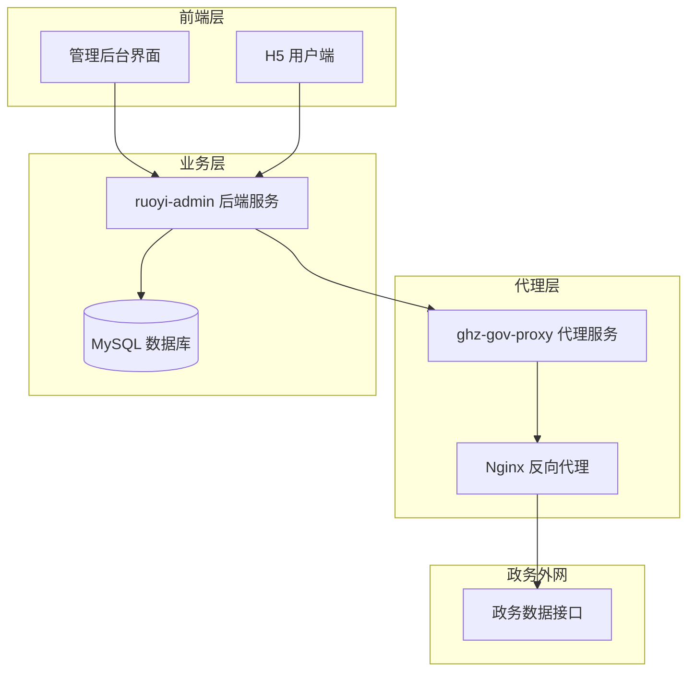
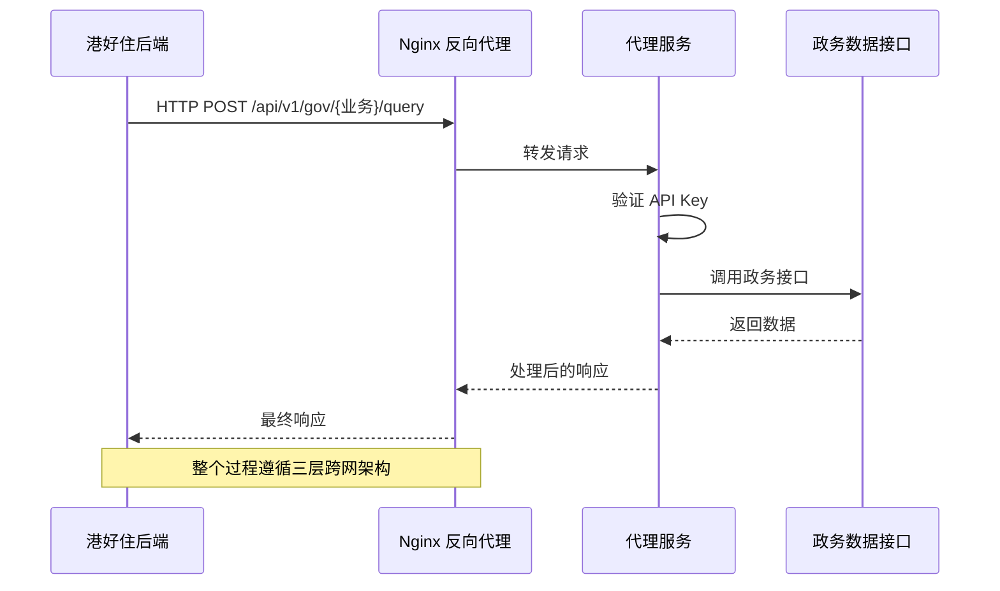
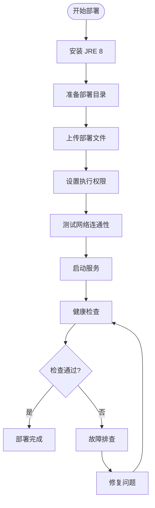
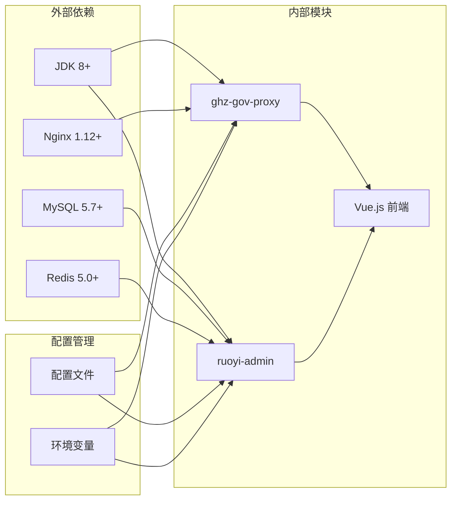
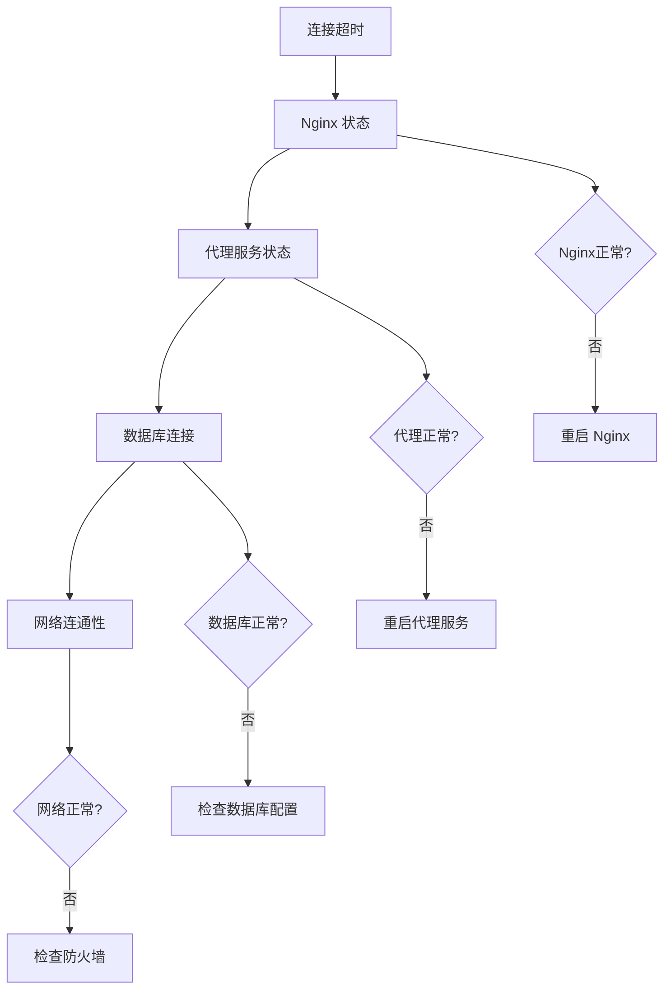
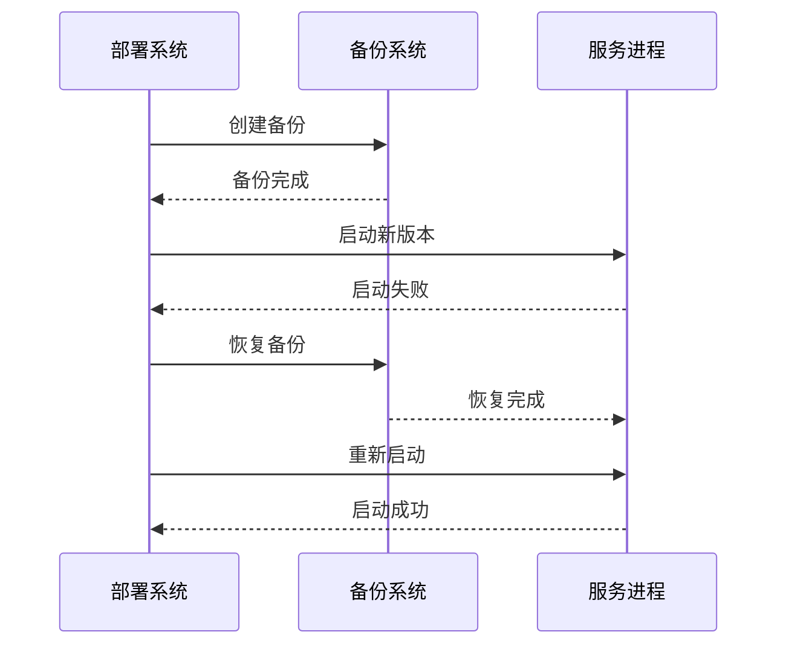

# 部署检查清单

<cite>
**本文引用的文件**
- [ghz-gov-proxy 部署指南（正式环境）](file://ghz-gov-proxy/deploy/README.md)
- [ghz-gov-proxy 启动脚本](file://ghz-gov-proxy/deploy/start.sh)
- [ghz-gov-proxy 停止脚本](file://ghz-gov-proxy/deploy/stop.sh)
- [ghz-gov-proxy Nginx 配置](file://ghz-gov-proxy/deploy/nginx-ghz-gov-proxy.conf)
- [ghz-gov-proxy 生产配置](file://ghz-gov-proxy/deploy/application-prod.yml)
- [ruoyi-admin 应用配置](file://ruoyi-admin/src/main/resources/application.yml)
- [ruoyi-admin 数据源配置](file://ruoyi-admin/src/main/resources/application-druid.yml)
- [ruoyi-admin Maven 构建配置](file://ruoyi-admin/pom.xml)
- [ghz-gov-proxy 应用配置](file://ghz-gov-proxy/src/main/resources/application.yml)
- [ghz-gov-proxy Maven 构建配置](file://ghz-gov-proxy/pom.xml)
- [服务端一键部署脚本](file://server-deploy.sh)
- [H5 一键部署脚本](file://uniapp-h5/deploy-h5.sh)
- [RuoYi 项目配置](file://ruoyi-common/src/main/java/com/ruoyi/common/config/RuoYiConfig.java)
- [应用配置类](file://ruoyi-framework/src/main/java/com/ruoyi/framework/config/ApplicationConfig.java)
- [Druid 多数据源配置](file://ruoyi-framework/src/main/java/com/ruoyi/framework/config/DruidConfig.java)
- [港好住后端对接指南](file://ghz-gov-proxy/deploy/港好住后端对接指南.md)
</cite>

## 目录
1. [简介](#简介)
2. [项目结构](#项目结构)
3. [核心组件](#核心组件)
4. [架构概览](#架构概览)
5. [详细组件分析](#详细组件分析)
6. [依赖关系分析](#依赖关系分析)
7. [性能考虑](#性能考虑)
8. [故障排查指南](#故障排查指南)
9. [结论](#结论)
10. [附录](#附录)

## 简介

本部署检查清单旨在为港好住系统的部署提供全面、标准化的操作指导。该系统采用三层跨网架构，通过 Nginx 反向代理实现互联网与政务外网的安全联通，支持婚姻、社保、公租房、不动产四项政务数据查询服务。

系统主要由三个核心模块组成：
- **前端应用**：基于 Vue.js 的管理后台界面
- **后端服务**：基于 Spring Boot 的业务处理服务
- **代理服务**：专门处理政务数据接口调用的中间层

## 项目结构

**图表来源**
- [ghz-gov-proxy 部署指南（正式环境）:1-177](file://ghz-gov-proxy/deploy/README.md#L1-L177)
- [ruoyi-admin 应用配置:1-238](file://ruoyi-admin/src/main/resources/application.yml#L1-L238)

**章节来源**
- [ghz-gov-proxy 部署指南（正式环境）:1-177](file://ghz-gov-proxy/deploy/README.md#L1-L177)
- [ruoyi-admin 应用配置:1-238](file://ruoyi-admin/src/main/resources/application.yml#L1-L238)

## 核心组件

### 代理服务组件

代理服务是整个系统的核心，负责处理与政务数据接口的通信：

| 组件 | 位置 | 端口 | 功能 |
|------|------|------|------|
| ghz-gov-proxy | 172.19.25.77 | 9001 | 政务数据代理服务 |
| Nginx | 172.27.139.244 | 8088 | 反向代理服务 |
| API Key | 配置文件 | - | 认证密钥 |

### 后端服务组件

后端服务提供业务逻辑处理和数据管理：

| 组件 | 位置 | 端口 | 功能 |
|------|------|------|------|
| ruoyi-admin | 服务器 | 8090 | 管理后台服务 |
| MySQL | 36.133.39.148 | 33061 | 数据存储 |
| Redis | 本地 | 6379 | 缓存服务 |

**章节来源**
- [ghz-gov-proxy 生产配置:1-26](file://ghz-gov-proxy/deploy/application-prod.yml#L1-L26)
- [ghz-gov-proxy Nginx 配置:1-45](file://ghz-gov-proxy/deploy/nginx-ghz-gov-proxy.conf#L1-L45)
- [ruoyi-admin 数据源配置:1-64](file://ruoyi-admin/src/main/resources/application-druid.yml#L1-L64)

## 架构概览

**图表来源**
- [ghz-gov-proxy 部署指南（正式环境）:4-14](file://ghz-gov-proxy/deploy/README.md#L4-L14)
- [港好住后端对接指南:24-37](file://ghz-gov-proxy/deploy/港好住后端对接指南.md#L24-L37)

## 详细组件分析

### 部署前准备工作

#### 环境检查清单

| 检查项目 | 检查内容 | 检查方法 |
|----------|----------|----------|
| 系统环境 | CentOS/RHEL 7+ 或 Ubuntu 18+ | `cat /etc/os-release` |
| Java 环境 | JDK 8+ | `java -version` |
| 网络连通性 | 政务外网 59.207.50.51:4989 | `telnet 59.207.50.51 4989` |
| 防火墙配置 | 端口开放情况 | `firewall-cmd --list-all` |
| 磁盘空间 | 足够的磁盘空间 | `df -h` |

#### 依赖验证清单

| 依赖类型 | 版本要求 | 验证命令 |
|----------|----------|----------|
| Java | 1.8 | `java -version` |
| Maven | 3.6+ | `mvn -version` |
| MySQL | 5.7+ | `mysql --version` |
| Nginx | 1.12+ | `nginx -v` |

**章节来源**
- [ghz-gov-proxy 部署指南（正式环境）:36-100](file://ghz-gov-proxy/deploy/README.md#L36-L100)

### 部署过程关键检查点

#### 代理服务部署检查

**图表来源**
- [ghz-gov-proxy 启动脚本:1-47](file://ghz-gov-proxy/deploy/start.sh#L1-L47)
- [ghz-gov-proxy 停止脚本:1-42](file://ghz-gov-proxy/deploy/stop.sh#L1-L42)

#### 后端服务部署检查

| 检查阶段 | 检查内容 | 检查方法 | 预期结果 |
|----------|----------|----------|----------|
| 代码拉取 | git 拉取最新代码 | `git pull origin master` | 成功 |
| 编译打包 | Maven 编译 | `mvn clean package` | 无错误 |
| 备份旧版本 | 备份现有 JAR | `cp ruoyi-admin.jar backup.jar` | 成功 |
| 替换新版本 | 复制新 JAR | `cp target/ruoyi-admin.jar` | 成功 |
| 重启服务 | 服务重启 | `ghz-restart.sh` | 正常启动 |
| 健康检查 | 状态检查 | `ghz-status.sh` | RUNNING |

**章节来源**
- [服务端一键部署脚本:1-42](file://server-deploy.sh#L1-L42)

### 部署后验证流程

#### 功能测试验证

| 测试类型 | 测试接口 | 测试方法 | 验证标准 |
|----------|----------|----------|----------|
| 健康检查 | /api/v1/gov/ping | `curl http://42.228.16.25:8088/api/v1/gov/ping` | 返回 status: UP |
| 婚姻查询 | /api/v1/gov/marriage/query | `curl -X POST` | hasRecord: true/false |
| 社保查询 | /api/v1/gov/social/query | `curl -X POST` | records 数组非空 |
| 公租房查询 | /api/v1/gov/housing/query | `curl -X POST` | hasRecord: true/false |
| 不动产查询 | /api/v1/gov/estate/query | `curl -X POST` | hasRecord: true/false |

#### 性能测试验证

| 性能指标 | 阈值要求 | 测试方法 |
|----------|----------|----------|
| 响应时间 | < 5 秒（婚姻/社保/公租房） | `curl -w %{time_total}` |
| 不动产响应 | < 30 秒 | `curl --max-time 30` |
| 并发处理 | 支持 10+ 并发 | 压力测试工具 |
| 内存使用 | < 512MB | `top` 命令监控 |

#### 安全检查验证

| 安全项目 | 检查内容 | 检查方法 |
|----------|----------|----------|
| API Key | 密钥正确性 | 配置文件对比 |
| 防火墙 | 白名单配置 | `firewall-cmd --list-rich-rules` |
| 日志安全 | 敏感信息脱敏 | 日志审计 |
| 权限控制 | 文件权限 | `ls -la` |

**章节来源**
- [港好住后端对接指南:486-526](file://ghz-gov-proxy/deploy/港好住后端对接指南.md#L486-L526)

## 依赖关系分析

**图表来源**
- [ghz-gov-proxy Maven 构建配置:21-25](file://ghz-gov-proxy/pom.xml#L21-L25)
- [ruoyi-admin Maven 构建配置:18-107](file://ruoyi-admin/pom.xml#L18-L107)

**章节来源**
- [ghz-gov-proxy Maven 构建配置:1-108](file://ghz-gov-proxy/pom.xml#L1-L108)
- [ruoyi-admin Maven 构建配置:1-140](file://ruoyi-admin/pom.xml#L1-L140)

## 性能考虑

### 系统性能指标

| 指标类型 | 正常阈值 | 监控方法 |
|----------|----------|----------|
| CPU 使用率 | < 80% | `top`, `htop` |
| 内存使用 | < 70% | `free -h` |
| 磁盘空间 | > 20% | `df -h` |
| 网络带宽 | < 90% | `iftop` |
| 数据库连接 | < 80% | `SHOW STATUS LIKE 'Threads_connected'` |

### 性能优化建议

1. **数据库优化**
   - 连接池配置：maxActive = 20
   - 连接超时：connectTimeout = 30000ms
   - 查询超时：socketTimeout = 60000ms

2. **应用优化**
   - JVM 堆内存：-Xmx512m
   - GC 策略：G1GC
   - 日志级别：INFO

3. **网络优化**
   - Nginx 超时：proxy_read_timeout 60s
   - 连接复用：keepalive
   - 缓存策略：静态资源缓存

## 故障排查指南

### 常见部署问题及解决方案

#### 启动失败问题

| 问题现象 | 可能原因 | 解决方案 |
|----------|----------|----------|
| 服务无法启动 | 端口被占用 | `lsof -i :9001` 查找进程 |
| 内存不足 | JVM 内存配置过高 | 调整 `-Xmx` 参数 |
| 依赖缺失 | Maven 依赖未下载 | `mvn dependency:resolve` |
| 配置错误 | application.yml 配置错误 | 检查配置文件格式 |

#### 连接超时问题

**图表来源**
- [ghz-gov-proxy 部署指南（正式环境）:154-163](file://ghz-gov-proxy/deploy/README.md#L154-L163)

#### 权限问题

| 权限问题 | 现象描述 | 解决方法 |
|----------|----------|----------|
| 文件权限 | 无法读取配置文件 | `chmod 644 application-prod.yml` |
| 目录权限 | 无法写入日志 | `chmod 755 logs/` |
| 执行权限 | 启动脚本无法执行 | `chmod +x start.sh` |
| 网络权限 | 无法访问外部接口 | 检查防火墙规则 |

#### API Key 错误

| 错误类型 | 现象 | 解决方法 |
|----------|------|----------|
| 401 错误 | 认证失败 | 检查请求头 X-Api-Key |
| Key 不匹配 | 服务端拒绝 | 确认配置文件中的 Key |
| 头部缺失 | 服务端拒绝 | 添加 X-Api-Key 头部 |

**章节来源**
- [ghz-gov-proxy 部署指南（正式环境）:154-163](file://ghz-gov-proxy/deploy/README.md#L154-L163)
- [港好住后端对接指南:486-526](file://ghz-gov-proxy/deploy/港好住后端对接指南.md#L486-L526)

### 应急处理预案

#### 回滚策略

**图表来源**
- [服务端一键部署脚本:15-39](file://server-deploy.sh#L15-L39)

#### 应急响应流程

1. **问题发现**：监控告警或用户反馈
2. **初步诊断**：检查服务状态和日志
3. **紧急处理**：执行回滚或重启
4. **问题定位**：分析错误日志和配置
5. **问题修复**：修改配置或代码
6. **验证测试**：功能和性能验证
7. **恢复服务**：重新部署并监控

**章节来源**
- [服务端一键部署脚本:1-42](file://server-deploy.sh#L1-L42)

## 结论

本部署检查清单提供了港好住系统部署的完整指导，涵盖了从环境准备到部署验证的全过程。通过标准化的检查点和故障排查流程，可以确保部署过程的安全性和可靠性。

关键要点包括：
- 三层跨网架构的安全性设计
- 标准化的部署流程和检查点
- 完善的故障排查和应急处理机制
- 性能监控和优化建议

建议在实际部署过程中严格按照检查清单执行，并根据具体环境进行适当调整。

## 附录

### 部署检查清单模板

#### 环境准备检查清单

- [ ] 系统版本验证
- [ ] Java 环境安装
- [ ] 网络连通性测试
- [ ] 端口开放检查
- [ ] 磁盘空间检查

#### 服务部署检查清单

- [ ] 代码拉取和编译
- [ ] 配置文件验证
- [ ] 服务启动测试
- [ ] 健康检查验证
- [ ] 功能测试执行

#### 验证测试检查清单

- [ ] 基础功能测试
- [ ] 性能基准测试
- [ ] 安全性验证
- [ ] 监控配置检查
- [ ] 文档更新确认

### 联系信息

| 角色 | 姓名 | 联系方式 |
|------|------|----------|
| 代理服务开发/运维 | 王文 | （内部 IM） |
| 政务运维（网络/防火墙） | 周昂达 | 17610792896 |
| 政务数据源头 | 大数据管理局 | （通过周昂达转接） |