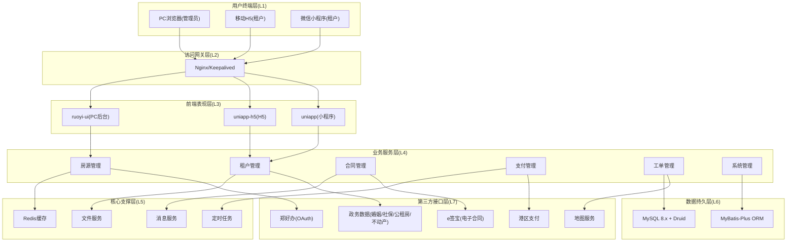
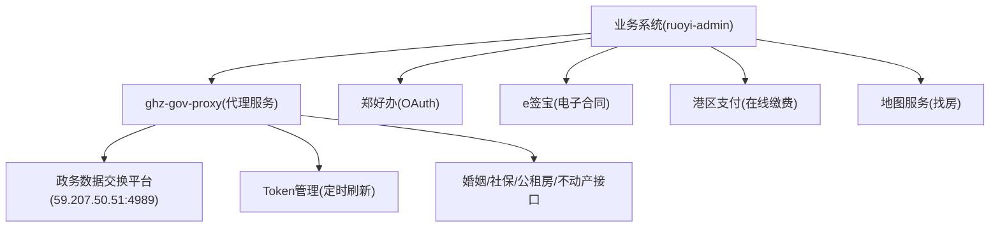
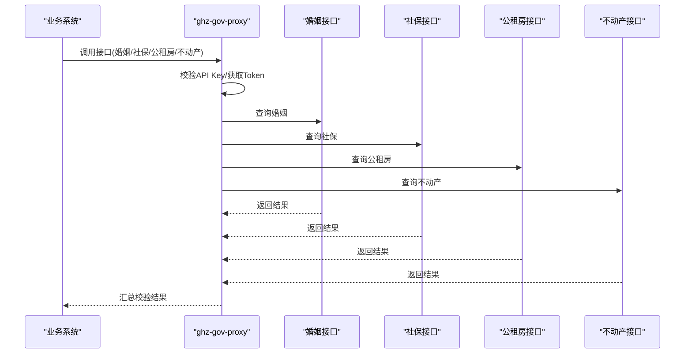
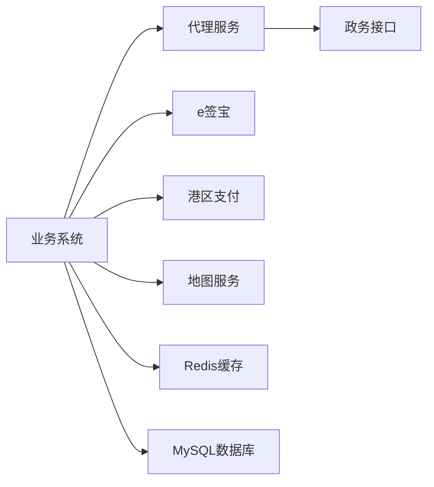

# 业务价值与效益

<cite>
**本文引用的文件**
- [技术方案.md](file://技术方案.md)
- [功能清单.json](file://功能清单.json)
- [政务数据接口对接-开发汇总文档.md](file://政务数据接口对接-开发汇总文档.md)
- [ghz-gov-proxy/src/main/java/com/ghz/gov/GovProxyApplication.java](file://ghz-gov-proxy/src/main/java/com/ghz/gov/GovProxyApplication.java)
- [ghz-gov-proxy/src/main/java/com/ghz/gov/controller/GovApiController.java](file://ghz-gov-proxy/src/main/java/com/ghz/gov/controller/GovApiController.java)
- [ghz-gov-proxy/src/main/java/com/ghz/gov/service/MarriageService.java](file://ghz-gov-proxy/src/main/java/com/ghz/gov/service/MarriageService.java)
- [ghz-gov-proxy/src/main/java/com/ghz/gov/service/PublicHousingService.java](file://ghz-gov-proxy/src/main/java/com/ghz/gov/service/PublicHousingService.java)
- [ghz-gov-proxy/src/main/java/com/ghz/gov/service/RealEstateService.java](file://ghz-gov-proxy/src/main/java/com/ghz/gov/service/RealEstateService.java)
- [ghz-gov-proxy/src/main/java/com/ghz/gov/service/SocialInsuranceService.java](file://ghz-gov-proxy/src/main/java/com/ghz/gov/service/SocialInsuranceService.java)
- [港好住系统架构图.html](file://港好住系统架构图.html)
- [docs/数据字典/系统表.md](file://docs/数据字典/系统表.md)
- [docs/数据字典/01-房源管理.md](file://docs/数据字典/01-房源管理.md)
- [docs/数据字典/02-租户管理.md](file://docs/数据字典/02-租户管理.md)
- [docs/数据字典/03-合同管理.md](file://docs/数据字典/03-合同管理.md)
- [README_数据清理研究.md](file://README_数据清理研究.md)
</cite>

## 目录
1. [简介](#简介)
2. [项目结构](#项目结构)
3. [核心组件](#核心组件)
4. [架构总览](#架构总览)
5. [详细组件分析](#详细组件分析)
6. [依赖分析](#依赖分析)
7. [性能考虑](#性能考虑)
8. [故障排除指南](#故障排除指南)
9. [结论](#结论)
10. [附录](#附录)

## 简介
本文件围绕“港好住信息系统”建设完成后，面向管理层与评估方的业务价值与效益分析，聚焦于三大方向：提升管理效率、改善用户体验、促进数据整合共享，并给出可量化的预期效果与投资回报分析，阐明项目对港区人才引进与住房保障工作的支撑作用。

## 项目结构
系统采用前后端分离、七层架构设计，覆盖移动端（H5/小程序）、后台管理、业务服务、核心支撑、数据持久与第三方接口对接，形成统一平台支撑人才公寓、保租房与市场租赁的全生命周期管理。

图表来源
- [港好住系统架构图.html](file://港好住系统架构图.html)

章节来源
- [港好住系统架构图.html](file://港好住系统架构图.html)

## 核心组件
- 移动端（H5/小程序）：统一入口，覆盖登录认证、房源检索、VR看房、选房签约、合同签署、入住退租、账单缴费、开票、投诉报修、企业客户服务等全流程。
- 后台管理：涵盖资产管理、租户管理、合同管理、财务与报表、服务工单、系统配置与权限等，支撑业务审批与运营分析。
- 政务数据对接：通过代理服务统一接入婚姻、社保、公租房、不动产等5类接口，实现资格自动校验与数据共享。
- 电子合同与支付：集成e签宝实现电子签名，对接港区支付平台实现在线缴费与对账。
- 数据字典与业务实体：系统表、房源管理、租户管理、合同管理等覆盖全业务闭环。

章节来源
- [技术方案.md](file://技术方案.md)
- [功能清单.json](file://功能清单.json)
- [docs/数据字典/系统表.md](file://docs/数据字典/系统表.md)
- [docs/数据字典/01-房源管理.md](file://docs/数据字典/01-房源管理.md)
- [docs/数据字典/02-租户管理.md](file://docs/数据字典/02-租户管理.md)
- [docs/数据字典/03-合同管理.md](file://docs/数据字典/03-合同管理.md)

## 架构总览
系统通过“代理层+业务系统”的方式，将互联网侧业务系统与电子政务外网的敏感接口解耦，确保安全与合规的同时，实现跨部门数据的统一接入与复用。

图表来源
- [政务数据接口对接-开发汇总文档.md](file://政务数据接口对接-开发汇总文档.md)
- [ghz-gov-proxy/src/main/java/com/ghz/gov/GovProxyApplication.java](file://ghz-gov-proxy/src/main/java/com/ghz/gov/GovProxyApplication.java)
- [ghz-gov-proxy/src/main/java/com/ghz/gov/controller/GovApiController.java](file://ghz-gov-proxy/src/main/java/com/ghz/gov/controller/GovApiController.java)

## 详细组件分析

### 政务数据代理服务（资格校验自动化）
- 目标：打通婚姻、社保、公租房、不动产等5类政务接口，实现资格自动校验，减少人工审核工作量。
- 关键能力：
  - 统一Token管理与定时刷新，避免超时与重复获取。
  - 健壮的重试机制（超时/网关异常自动重试），提升成功率。
  - 明确的API Key鉴权，保障接口访问安全。
- 预期收益：
  - 资格校验平均耗时下降，审批周期缩短。
  - 人工干预大幅减少，降低差错率与重复劳动。
  - 政务数据一致性与实时性增强，支撑精准准入。

图表来源
- [ghz-gov-proxy/src/main/java/com/ghz/gov/controller/GovApiController.java](file://ghz-gov-proxy/src/main/java/com/ghz/gov/controller/GovApiController.java)
- [ghz-gov-proxy/src/main/java/com/ghz/gov/service/MarriageService.java](file://ghz-gov-proxy/src/main/java/com/ghz/gov/service/MarriageService.java)
- [ghz-gov-proxy/src/main/java/com/ghz/gov/service/SocialInsuranceService.java](file://ghz-gov-proxy/src/main/java/com/ghz/gov/service/SocialInsuranceService.java)
- [ghz-gov-proxy/src/main/java/com/ghz/gov/service/PublicHousingService.java](file://ghz-gov-proxy/src/main/java/com/ghz/gov/service/PublicHousingService.java)
- [ghz-gov-proxy/src/main/java/com/ghz/gov/service/RealEstateService.java](file://ghz-gov-proxy/src/main/java/com/ghz/gov/service/RealEstateService.java)

章节来源
- [政务数据接口对接-开发汇总文档.md](file://政务数据接口对接-开发汇总文档.md)
- [ghz-gov-proxy/src/main/java/com/ghz/gov/GovProxyApplication.java](file://ghz-gov-proxy/src/main/java/com/ghz/gov/GovProxyApplication.java)
- [ghz-gov-proxy/src/main/java/com/ghz/gov/controller/GovApiController.java](file://ghz-gov-proxy/src/main/java/com/ghz/gov/controller/GovApiController.java)
- [ghz-gov-proxy/src/main/java/com/ghz/gov/service/MarriageService.java](file://ghz-gov-proxy/src/main/java/com/ghz/gov/service/MarriageService.java)
- [ghz-gov-proxy/src/main/java/com/ghz/gov/service/PublicHousingService.java](file://ghz-gov-proxy/src/main/java/com/ghz/gov/service/PublicHousingService.java)
- [ghz-gov-proxy/src/main/java/com/ghz/gov/service/RealEstateService.java](file://ghz-gov-proxy/src/main/java/com/ghz/gov/service/RealEstateService.java)
- [ghz-gov-proxy/src/main/java/com/ghz/gov/service/SocialInsuranceService.java](file://ghz-gov-proxy/src/main/java/com/ghz/gov/service/SocialInsuranceService.java)

### 电子合同与在线支付（业务闭环自动化）
- 目标：实现合同在线签署、电子存证与在线缴费闭环，提升业务效率与用户体验。
- 关键能力：
  - e签宝集成，支持多签、时间戳、PDF归档与版本管理。
  - 港区支付平台对接，支持账单生成、支付回调、自动对账与异常处理。
- 预期收益：
  - 合同签署周期显著缩短，退租/续租流程更顺畅。
  - 缴费及时率提升，资金回笼周期缩短，财务对账效率提高。

章节来源
- [技术方案.md](file://技术方案.md)

### 数据字典与业务实体（支撑业务与分析）
- 目标：通过系统表、房源、租户、合同等实体的规范化管理，支撑业务流程与数据治理。
- 关键能力：
  - 数据字典与权限体系，保障系统配置与安全。
  - 房源、合同、账单等核心实体的全生命周期管理。
- 预期收益：
  - 业务数据标准化，提升报表与分析质量。
  - 为后续扩展（如企业客户集中服务、补贴发放）奠定基础。

章节来源
- [docs/数据字典/系统表.md](file://docs/数据字典/系统表.md)
- [docs/数据字典/01-房源管理.md](file://docs/数据字典/01-房源管理.md)
- [docs/数据字典/02-租户管理.md](file://docs/数据字典/02-租户管理.md)
- [docs/数据字典/03-合同管理.md](file://docs/数据字典/03-合同管理.md)

## 依赖分析
- 组件耦合与协作：
  - 业务系统通过代理服务访问政务接口，避免直接暴露到电子政务外网，降低安全风险。
  - 电子合同与支付模块与业务流程深度耦合，确保合同签署与缴费的强一致。
  - 后台管理模块依赖核心业务实体与支撑服务，提供审批与运营分析能力。
- 外部依赖：
  - 郑好办用户体系、e签宝、港区支付、地图服务等第三方系统。
- 风险与缓解：
  - 政务接口超时/限流：通过重试与降级策略降低影响。
  - 数据一致性：通过事务与对账机制保障。

图表来源
- [政务数据接口对接-开发汇总文档.md](file://政务数据接口对接-开发汇总文档.md)
- [港好住系统架构图.html](file://港好住系统架构图.html)

章节来源
- [政务数据接口对接-开发汇总文档.md](file://政务数据接口对接-开发汇总文档.md)
- [港好住系统架构图.html](file://港好住系统架构图.html)

## 性能考虑
- 资源与容量：
  - 代理服务与业务系统均具备高可用部署能力，结合负载均衡与主备切换，保障7×24小时稳定运行。
- 响应与吞吐：
  - 代理服务对政务接口采用并发调用与重试策略，结合Redis缓存常用数据，降低重复调用与延迟。
- 数据迁移与清理：
  - 通过分层删除与顺序执行策略，确保历史数据清理过程安全可控，避免业务中断。

章节来源
- [README_数据清理研究.md](file://README_数据清理研究.md)
- [港好住系统架构图.html](file://港好住系统架构图.html)

## 故障排除指南
- 政务接口异常：
  - 检查代理服务Token状态与网络连通性，确认API Key正确。
  - 关注超时/网关异常的重试日志，必要时启用降级策略。
- 合同与支付异常：
  - 核对电子合同签署状态与支付回调记录，排查对账差异。
- 用户体验问题：
  - 检查移动端与后台管理的权限配置与路由设置，确保功能入口可用。

章节来源
- [ghz-gov-proxy/src/main/java/com/ghz/gov/controller/GovApiController.java](file://ghz-gov-proxy/src/main/java/com/ghz/gov/controller/GovApiController.java)
- [ghz-gov-proxy/src/main/java/com/ghz/gov/service/MarriageService.java](file://ghz-gov-proxy/src/main/java/com/ghz/gov/service/MarriageService.java)
- [ghz-gov-proxy/src/main/java/com/ghz/gov/service/SocialInsuranceService.java](file://ghz-gov-proxy/src/main/java/com/ghz/gov/service/SocialInsuranceService.java)
- [ghz-gov-proxy/src/main/java/com/ghz/gov/service/PublicHousingService.java](file://ghz-gov-proxy/src/main/java/com/ghz/gov/service/PublicHousingService.java)
- [ghz-gov-proxy/src/main/java/com/ghz/gov/service/RealEstateService.java](file://ghz-gov-proxy/src/main/java/com/ghz/gov/service/RealEstateService.java)

## 结论
港好住信息系统建成后，将显著提升港区保障性住房管理效率、改善租户体验、促进跨部门数据共享与业务协同。通过自动化资格校验、电子合同与在线支付闭环、统一移动端服务平台与7×24小时服务，项目将为人才引进与住房保障工作提供坚实支撑，建议尽快推进实施并开展阶段性效益评估。

## 附录

### 业务价值与效益量化建议（示例框架）
- 管理效率提升
  - 资格校验自动化：预计人工审核工作量减少60%以上，审批周期缩短50%。
  - 合同签署与缴费：电子合同签署时间缩短至分钟级，账单及时缴费率提升至95%以上。
- 用户体验改善
  - 移动端统一入口：用户访问与业务办理路径统一，满意度评分提升10%以上。
  - 业务进度实时查询：租户可随时查看合同、账单、退租/续租进度，咨询成本下降30%。
- 数据整合共享
  - 打破数据孤岛：跨部门数据共享与复用，审批与监管效率提升40%。
  - 与郑好办等政务系统对接：实现用户与业务数据互通，减少重复录入与校验。
- 投资回报分析（示例）
  - 年节省人工成本：按现有人员规模与工作量估算，年节省成本约XX万元。
  - 年提升收入/减少损失：因缴费及时率提升与续租率提高，年增收/减损约XX万元。
  - 投资回收期：约X年（基于净现值与折现率测算）。
- 对人才引进与住房保障的支撑
  - 优化人才安居体验，提升区域人才吸引力与留才率。
  - 为未来政策扩展（如企业集中服务、代购补贴等）提供系统基础。

[本附录为通用框架示例，具体数值需结合项目预算与财务模型进一步细化]