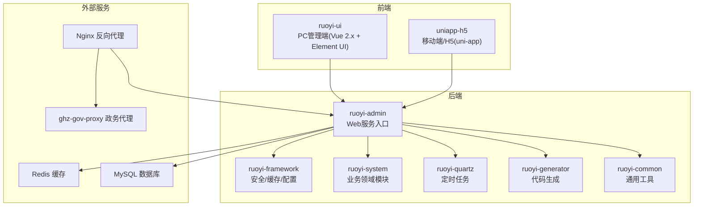
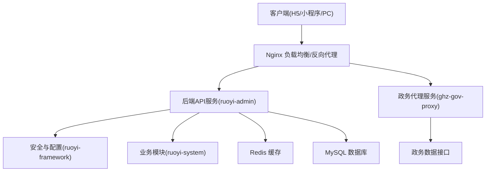
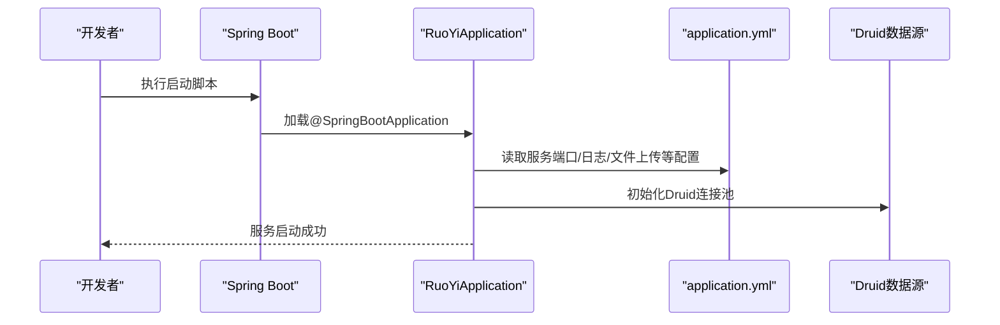
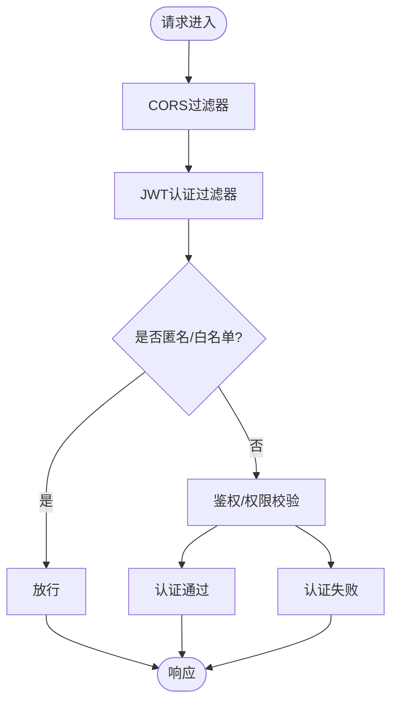
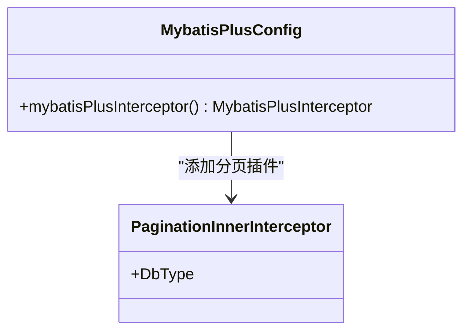
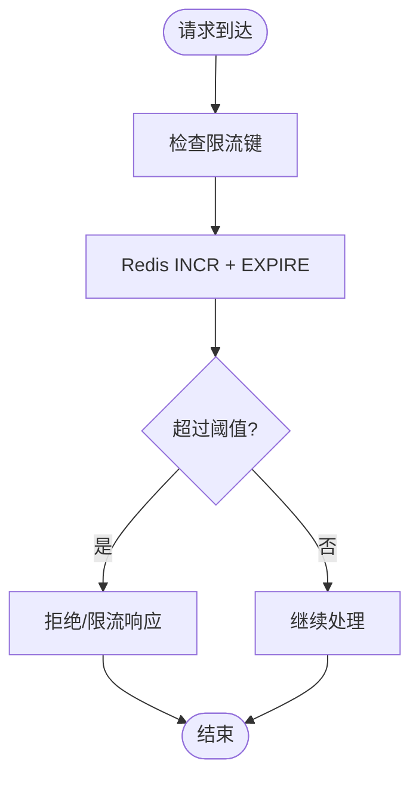
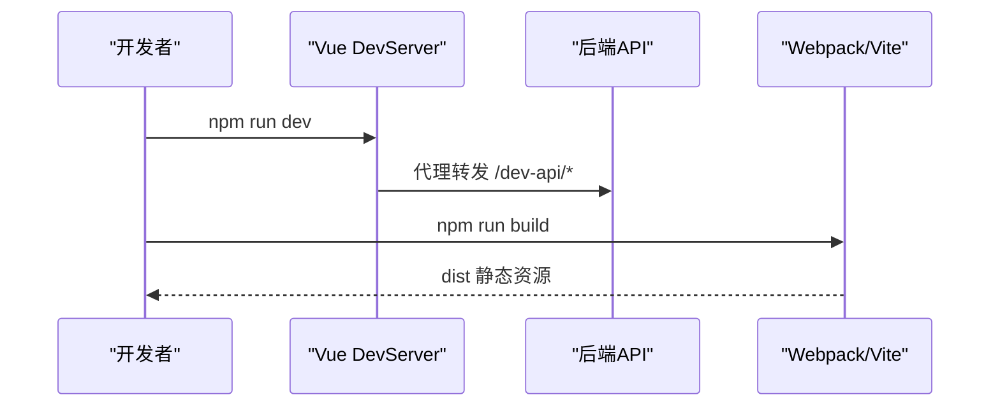
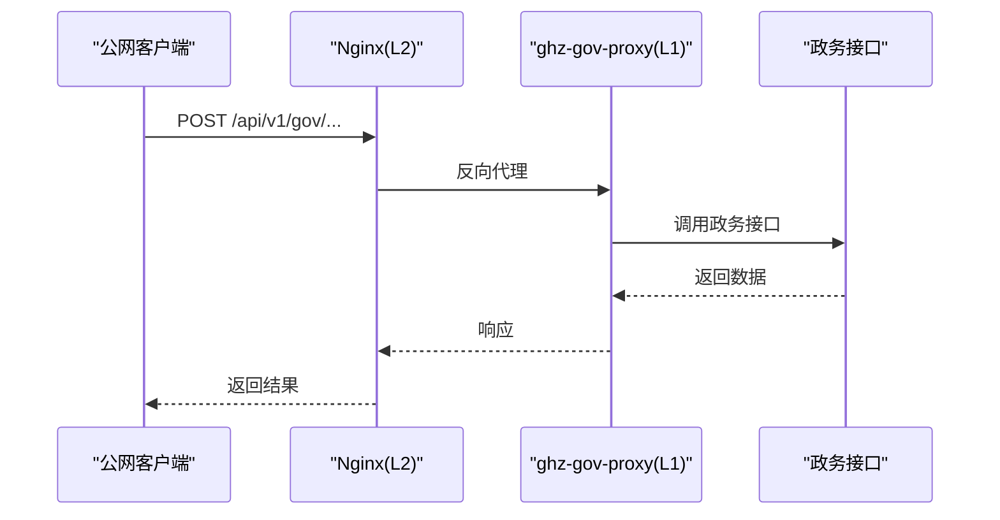
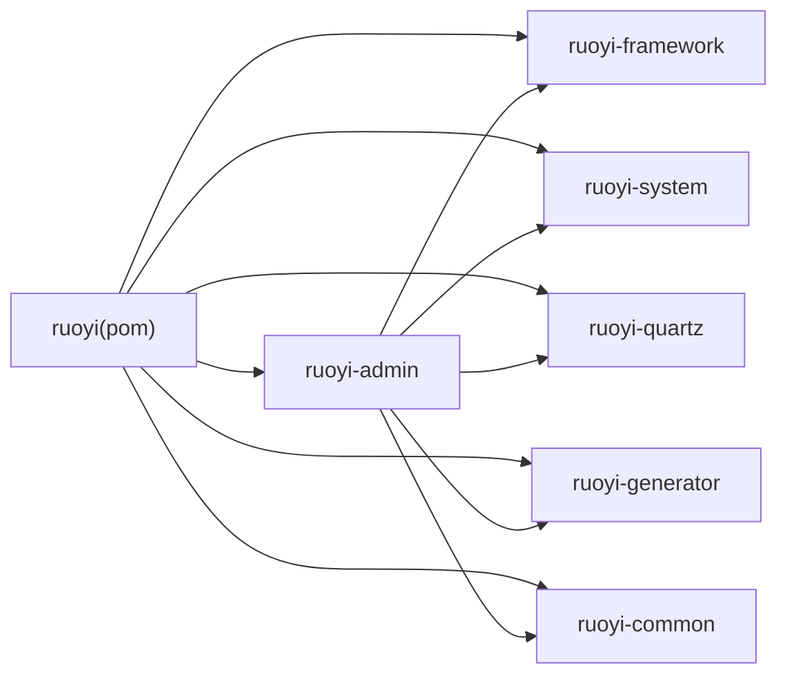

# 技术架构概览

<cite>
**本文引用的文件**   
- [pom.xml](file://pom.xml)
- [ruoyi-admin/pom.xml](file://ruoyi-admin/pom.xml)
- [ruoyi-admin/src/main/resources/application.yml](file://ruoyi-admin/src/main/resources/application.yml)
- [ruoyi-admin/src/main/resources/application-druid.yml](file://ruoyi-admin/src/main/resources/application-druid.yml)
- [ruoyi-admin/src/main/java/com/ruoyi/RuoYiApplication.java](file://ruoyi-admin/src/main/java/com/ruoyi/RuoYiApplication.java)
- [ruoyi-framework/src/main/java/com/ruoyi/framework/config/MybatisPlusConfig.java](file://ruoyi-framework/src/main/java/com/ruoyi/framework/config/MybatisPlusConfig.java)
- [ruoyi-framework/src/main/java/com/ruoyi/framework/config/SecurityConfig.java](file://ruoyi-framework/src/main/java/com/ruoyi/framework/config/SecurityConfig.java)
- [ruoyi-framework/src/main/java/com/ruoyi/framework/config/RedisConfig.java](file://ruoyi-framework/src/main/java/com/ruoyi/framework/config/RedisConfig.java)
- [ruoyi-ui/package.json](file://ruoyi-ui/package.json)
- [ruoyi-ui/src/main.js](file://ruoyi-ui/src/main.js)
- [ruoyi-ui/vue.config.js](file://ruoyi-ui/vue.config.js)
- [uniapp-h5/package.json](file://uniapp-h5/package.json)
- [ghz-gov-proxy/deploy/nginx-ghz-gov-proxy.conf](file://ghz-gov-proxy/deploy/nginx-ghz-gov-proxy.conf)
- [ghz-gov-proxy/deploy/start.sh](file://ghz-gov-proxy/deploy/start.sh)
- [server-deploy.sh](file://server-deploy.sh)
- [技术方案.html](file://技术方案.html)
- [港好住系统架构图.html](file://港好住系统架构图.html)
</cite>

## 目录
1. [简介](#简介)
2. [项目结构](#项目结构)
3. [核心组件](#核心组件)
4. [架构总览](#架构总览)
5. [详细组件分析](#详细组件分析)
6. [依赖关系分析](#依赖关系分析)
7. [性能考量](#性能考量)
8. [故障排查指南](#故障排查指南)
9. [结论](#结论)
10. [附录](#附录)

## 简介
本文件为“港好住信息系统”的技术架构概览，面向技术决策者与一线开发者，系统性阐述系统的前后端分离架构、分层设计、模块化理念与RuoYi框架的应用，并给出部署架构、负载均衡策略与高可用设计建议。文档同时说明技术选型理由、版本兼容性与扩展性考虑，帮助团队在保证稳定性的同时实现快速迭代。

## 项目结构
系统采用多模块Maven聚合工程组织，后端以Spring Boot为核心，结合MyBatis-Plus实现数据访问；前端采用Vue.js + Element UI + uni-app多端开发；另有独立的政务数据代理服务，通过Nginx进行公网接入与反向代理。

图表来源
- [pom.xml:184-191](file://pom.xml#L184-L191)
- [ruoyi-admin/pom.xml:18-107](file://ruoyi-admin/pom.xml#L18-L107)
- [ruoyi-ui/package.json:26-51](file://ruoyi-ui/package.json#L26-L51)
- [uniapp-h5/package.json:1-6](file://uniapp-h5/package.json#L1-L6)

章节来源
- [pom.xml:184-191](file://pom.xml#L184-L191)
- [ruoyi-admin/pom.xml:18-107](file://ruoyi-admin/pom.xml#L18-L107)
- [ruoyi-ui/package.json:26-51](file://ruoyi-ui/package.json#L26-L51)
- [uniapp-h5/package.json:1-6](file://uniapp-h5/package.json#L1-L6)

## 核心组件
- 后端核心
  - Spring Boot 3.5.4 + JDK 17，统一依赖管理与插件配置，支持热部署与打包。
  - MyBatis-Plus 3.5.9 + Druid 1.2.23，提供分页插件、动态数据源与监控视图。
  - SpringDoc OpenAPI 2.8.9，内置接口文档能力。
  - Spring Security + JWT，无状态鉴权与跨域支持。
  - RedisTemplate + 限流脚本，提供缓存与限流能力。
- 前端核心
  - Vue 2.6.12 + Element UI 2.15.14，组件化开发与统一主题。
  - Vue CLI 4.4.6，开发服务器、代理、Gzip压缩与分包优化。
  - uni-app H5端，多端复用与业务页面。
- 郑好办/微信/e签宝集成
  - 提供网关SDK、微信支付Java SDK、Apache HttpClient与Gson等依赖。
- 政务数据代理
  - Nginx反向代理至内网代理服务，支持长耗时接口与健康检查。

章节来源
- [pom.xml:39-182](file://pom.xml#L39-L182)
- [ruoyi-admin/pom.xml:18-107](file://ruoyi-admin/pom.xml#L18-L107)
- [ruoyi-framework/src/main/java/com/ruoyi/framework/config/MybatisPlusConfig.java:14-27](file://ruoyi-framework/src/main/java/com/ruoyi/framework/config/MybatisPlusConfig.java#L14-L27)
- [ruoyi-framework/src/main/java/com/ruoyi/framework/config/SecurityConfig.java:27-134](file://ruoyi-framework/src/main/java/com/ruoyi/framework/config/SecurityConfig.java#L27-L134)
- [ruoyi-framework/src/main/java/com/ruoyi/framework/config/RedisConfig.java:17-70](file://ruoyi-framework/src/main/java/com/ruoyi/framework/config/RedisConfig.java#L17-L70)
- [ruoyi-ui/package.json:26-51](file://ruoyi-ui/package.json#L26-L51)
- [ruoyi-ui/vue.config.js:20-138](file://ruoyi-ui/vue.config.js#L20-L138)
- [ruoyi-admin/src/main/resources/application.yml:166-238](file://ruoyi-admin/src/main/resources/application.yml#L166-L238)

## 架构总览
系统采用典型的前后端分离架构：前端通过HTTP/HTTPS与后端交互，后端提供REST接口与OpenAPI文档，数据库与缓存作为基础设施支撑。Nginx位于L2层承担负载均衡、反向代理与安全防护，实现公网到内网的流量调度与高可用。

图表来源
- [港好住系统架构图.html:134-160](file://港好住系统架构图.html#L134-L160)
- [ghz-gov-proxy/deploy/nginx-ghz-gov-proxy.conf:7-44](file://ghz-gov-proxy/deploy/nginx-ghz-gov-proxy.conf#L7-L44)
- [ruoyi-admin/src/main/resources/application.yml:20-94](file://ruoyi-admin/src/main/resources/application.yml#L20-L94)

章节来源
- [港好住系统架构图.html:134-160](file://港好住系统架构图.html#L134-L160)
- [ghz-gov-proxy/deploy/nginx-ghz-gov-proxy.conf:7-44](file://ghz-gov-proxy/deploy/nginx-ghz-gov-proxy.conf#L7-L44)
- [ruoyi-admin/src/main/resources/application.yml:20-94](file://ruoyi-admin/src/main/resources/application.yml#L20-L94)

## 详细组件分析

### 后端启动与配置
- 启动类排除数据源自动装配，由框架模块统一管理，确保多数据源与动态路由可控。
- 应用配置集中于application.yml，涵盖服务器端口、Tomcat线程池、文件上传、Redis、MyBatis-Plus、OpenAPI、XSS防护、郑好办/微信/e签宝等集成项。
- Druid数据源配置在application-druid.yml中，支持主从库占位、连接池参数与监控视图。

图表来源
- [ruoyi-admin/src/main/java/com/ruoyi/RuoYiApplication.java:12-21](file://ruoyi-admin/src/main/java/com/ruoyi/RuoYiApplication.java#L12-L21)
- [ruoyi-admin/src/main/resources/application.yml:19-94](file://ruoyi-admin/src/main/resources/application.yml#L19-L94)
- [ruoyi-admin/src/main/resources/application-druid.yml:1-64](file://ruoyi-admin/src/main/resources/application-druid.yml#L1-L64)

章节来源
- [ruoyi-admin/src/main/java/com/ruoyi/RuoYiApplication.java:12-21](file://ruoyi-admin/src/main/java/com/ruoyi/RuoYiApplication.java#L12-L21)
- [ruoyi-admin/src/main/resources/application.yml:19-94](file://ruoyi-admin/src/main/resources/application.yml#L19-L94)
- [ruoyi-admin/src/main/resources/application-druid.yml:1-64](file://ruoyi-admin/src/main/resources/application-druid.yml#L1-L64)

### 安全与鉴权
- 基于Spring Security的无状态鉴权，禁用CSRF，开启JWT过滤器与CORS过滤器，支持匿名访问路径与权限注解。
- 提供统一异常处理与登出处理器，配合XSS过滤与白名单配置，提升安全性。

图表来源
- [ruoyi-framework/src/main/java/com/ruoyi/framework/config/SecurityConfig.java:86-124](file://ruoyi-framework/src/main/java/com/ruoyi/framework/config/SecurityConfig.java#L86-L124)

章节来源
- [ruoyi-framework/src/main/java/com/ruoyi/framework/config/SecurityConfig.java:27-134](file://ruoyi-framework/src/main/java/com/ruoyi/framework/config/SecurityConfig.java#L27-L134)

### 数据访问与分页
- MyBatis-Plus拦截器注入分页插件，适配MySQL方言，简化分页查询。
- 逻辑删除字段与Banner控制在全局配置中统一生效。

图表来源
- [ruoyi-framework/src/main/java/com/ruoyi/framework/config/MybatisPlusConfig.java:14-27](file://ruoyi-framework/src/main/java/com/ruoyi/framework/config/MybatisPlusConfig.java#L14-L27)

章节来源
- [ruoyi-framework/src/main/java/com/ruoyi/framework/config/MybatisPlusConfig.java:14-27](file://ruoyi-framework/src/main/java/com/ruoyi/framework/config/MybatisPlusConfig.java#L14-L27)
- [ruoyi-admin/src/main/resources/application.yml:104-134](file://ruoyi-admin/src/main/resources/application.yml#L104-L134)

### 缓存与限流
- RedisTemplate采用FastJSON序列化，支持键值与Hash序列化策略。
- 提供Lua限流脚本，基于Redis实现简单有效的限流控制。

图表来源
- [ruoyi-framework/src/main/java/com/ruoyi/framework/config/RedisConfig.java:43-70](file://ruoyi-framework/src/main/java/com/ruoyi/framework/config/RedisConfig.java#L43-L70)

章节来源
- [ruoyi-framework/src/main/java/com/ruoyi/framework/config/RedisConfig.java:17-70](file://ruoyi-framework/src/main/java/com/ruoyi/framework/config/RedisConfig.java#L17-L70)

### 前端开发与构建
- Vue 2.x + Element UI，全局注册组件与工具方法，统一主题样式。
- Vue CLI配置开发代理、Gzip压缩、SVG图标、分包策略与运行时优化。
- uni-app H5端提供多页面与业务功能，依赖轻量化签名组件。

图表来源
- [ruoyi-ui/src/main.js:10-84](file://ruoyi-ui/src/main.js#L10-L84)
- [ruoyi-ui/vue.config.js:33-53](file://ruoyi-ui/vue.config.js#L33-L53)
- [ruoyi-ui/vue.config.js:61-138](file://ruoyi-ui/vue.config.js#L61-L138)
- [uniapp-h5/package.json:1-6](file://uniapp-h5/package.json#L1-L6)

章节来源
- [ruoyi-ui/src/main.js:10-84](file://ruoyi-ui/src/main.js#L10-L84)
- [ruoyi-ui/package.json:26-51](file://ruoyi-ui/package.json#L26-L51)
- [ruoyi-ui/vue.config.js:20-138](file://ruoyi-ui/vue.config.js#L20-L138)
- [uniapp-h5/package.json:1-6](file://uniapp-h5/package.json#L1-L6)

### 政务数据代理与集成
- Nginx监听8088端口，转发至内网代理服务，透传请求头并设置长超时，关闭缓冲以适配慢响应接口。
- 代理服务提供健康检查端点，支持公网到政务外网的稳定通道。

图表来源
- [ghz-gov-proxy/deploy/nginx-ghz-gov-proxy.conf:7-44](file://ghz-gov-proxy/deploy/nginx-ghz-gov-proxy.conf#L7-L44)
- [ghz-gov-proxy/deploy/start.sh:13-46](file://ghz-gov-proxy/deploy/start.sh#L13-L46)

章节来源
- [ghz-gov-proxy/deploy/nginx-ghz-gov-proxy.conf:7-44](file://ghz-gov-proxy/deploy/nginx-ghz-gov-proxy.conf#L7-L44)
- [ghz-gov-proxy/deploy/start.sh:13-46](file://ghz-gov-proxy/deploy/start.sh#L13-L46)

## 依赖关系分析
- Maven聚合工程，模块间通过依赖声明解耦，核心模块包括framework、system、quartz、generator、common。
- ruoyi-admin引入framework、quartz、generator与第三方SDK，承担Web入口职责。
- 前端ruoyi-ui与uniapp-h5分别对应PC管理端与H5/小程序端，通过API与后端交互。

图表来源
- [pom.xml:184-191](file://pom.xml#L184-L191)
- [ruoyi-admin/pom.xml:39-55](file://ruoyi-admin/pom.xml#L39-L55)

章节来源
- [pom.xml:184-191](file://pom.xml#L184-L191)
- [ruoyi-admin/pom.xml:39-55](file://ruoyi-admin/pom.xml#L39-L55)

## 性能考量
- 后端
  - MyBatis-Plus分页插件与逻辑删除减少无效查询与数据膨胀。
  - Druid连接池参数与监控视图有助于容量规划与慢SQL定位。
  - Redis缓存与限流脚本降低数据库压力，提升并发能力。
- 前端
  - Gzip压缩与分包策略降低首屏加载时间。
  - SVG图标与按需加载组件减少体积。
- 部署
  - Nginx长超时与关闭缓冲适配慢响应政务接口。
  - 建议在L2层增加健康检查与主备切换，缩短故障恢复时间。

章节来源
- [ruoyi-framework/src/main/java/com/ruoyi/framework/config/MybatisPlusConfig.java:14-27](file://ruoyi-framework/src/main/java/com/ruoyi/framework/config/MybatisPlusConfig.java#L14-L27)
- [ruoyi-admin/src/main/resources/application-druid.yml:22-44](file://ruoyi-admin/src/main/resources/application-druid.yml#L22-L44)
- [ruoyi-framework/src/main/java/com/ruoyi/framework/config/RedisConfig.java:43-70](file://ruoyi-framework/src/main/java/com/ruoyi/framework/config/RedisConfig.java#L43-L70)
- [ruoyi-ui/vue.config.js:61-138](file://ruoyi-ui/vue.config.js#L61-L138)
- [ghz-gov-proxy/deploy/nginx-ghz-gov-proxy.conf:29-38](file://ghz-gov-proxy/deploy/nginx-ghz-gov-proxy.conf#L29-L38)
- [技术方案.html:1907-1964](file://技术方案.html#L1907-L1964)

## 故障排查指南
- 启动与部署
  - 使用server-deploy.sh进行自动化部署，包含拉取代码、编译打包、备份回滚与健康检查。
  - 若状态非RUNNING，自动回滚至上一版本并重启。
- Nginx与代理
  - 检查Nginx配置语法与端口开放，确认代理目标可达。
  - 通过健康检查端点验证代理服务状态。
- 数据库与缓存
  - 关注Druid监控视图中的慢SQL与连接池状态。
  - Redis键空间与Lua脚本执行情况，排查限流误伤。
- 安全与鉴权
  - 核对JWT头部与权限注解，确认匿名放行路径配置。
  - XSS白名单与过滤规则，避免业务富文本被误杀。

章节来源
- [server-deploy.sh:1-41](file://server-deploy.sh#L1-L41)
- [ghz-gov-proxy/deploy/nginx-ghz-gov-proxy.conf:86-100](file://ghz-gov-proxy/deploy/nginx-ghz-gov-proxy.conf#L86-L100)
- [ghz-gov-proxy/deploy/start.sh:38-46](file://ghz-gov-proxy/deploy/start.sh#L38-L46)
- [ruoyi-admin/src/main/resources/application-druid.yml:47-64](file://ruoyi-admin/src/main/resources/application-druid.yml#L47-L64)
- [ruoyi-framework/src/main/java/com/ruoyi/framework/config/SecurityConfig.java:100-124](file://ruoyi-framework/src/main/java/com/ruoyi/framework/config/SecurityConfig.java#L100-L124)

## 结论
本架构以RuoYi为基础，结合Spring Boot + MyBatis-Plus实现高效稳定的后端能力，前端采用Vue生态与uni-app实现多端复用。通过Nginx在L2层提供高可用与安全防护，配合政务代理服务打通复杂外部接口。整体具备良好的扩展性与可维护性，适合在保障性能与安全的前提下持续演进。

## 附录
- 技术选型要点
  - 后端：Spring Boot 3.x + MyBatis-Plus 3.5.x，兼顾易用性与性能；Druid提供连接池与监控；SpringDoc替代Swagger UI。
  - 前端：Vue 2.x + Element UI成熟稳定；uni-app覆盖H5/小程序；Webpack优化与Gzip压缩。
  - 集成：微信支付、e签宝、郑好办SDK按需引入，保持模块化。
- 版本兼容性
  - JDK 17 + Spring Boot 3.5.x，MySQL 8.2.0，Element UI 2.x，Vue 2.6.x。
- 扩展性建议
  - 引入灰度发布与蓝绿部署策略，逐步替换健康检查与限流策略。
  - 增加分布式链路追踪与指标采集，完善可观测性。
  - 将静态资源迁移到CDN，进一步降低L2层压力。