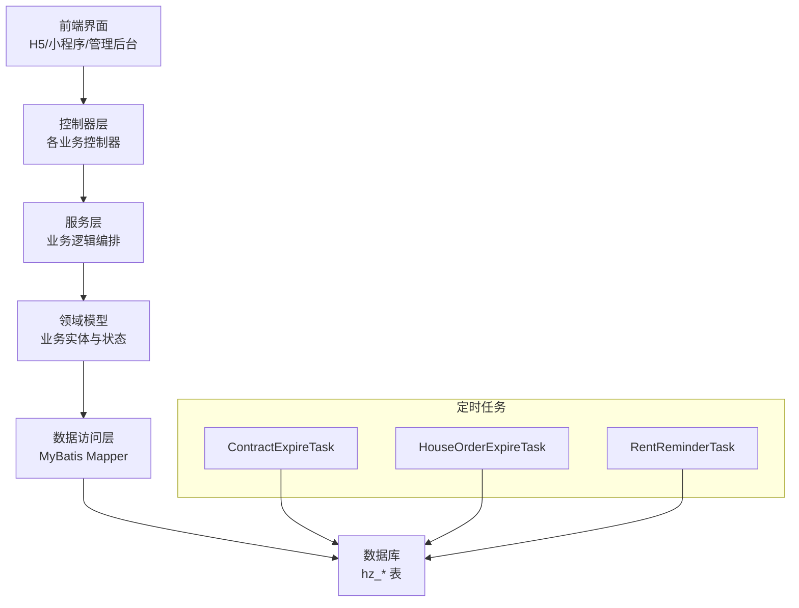
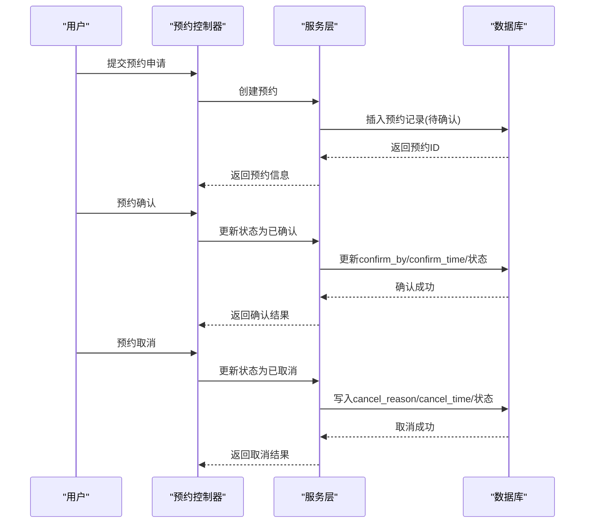
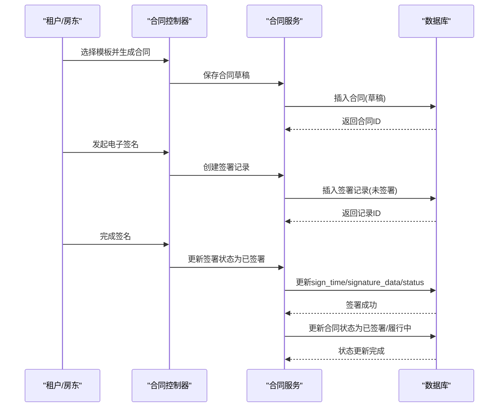
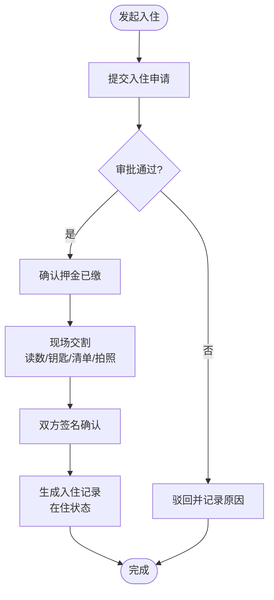
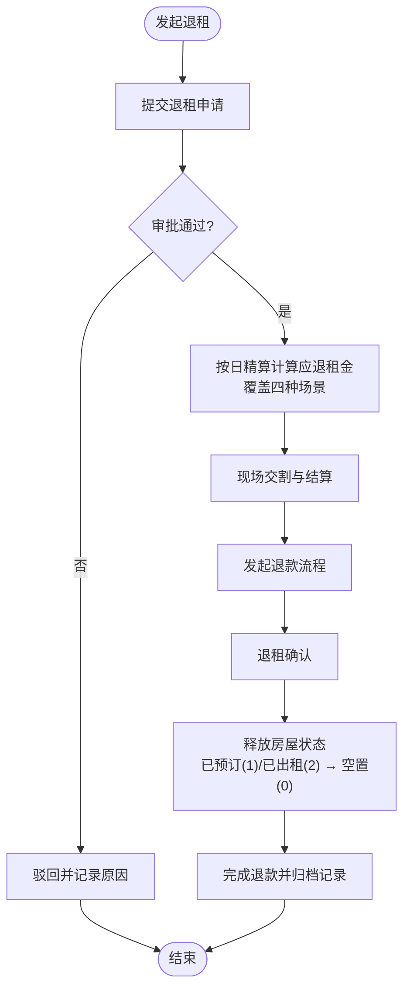
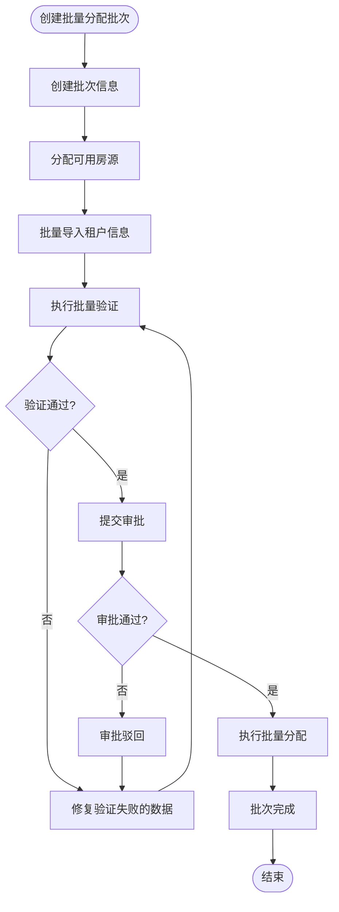
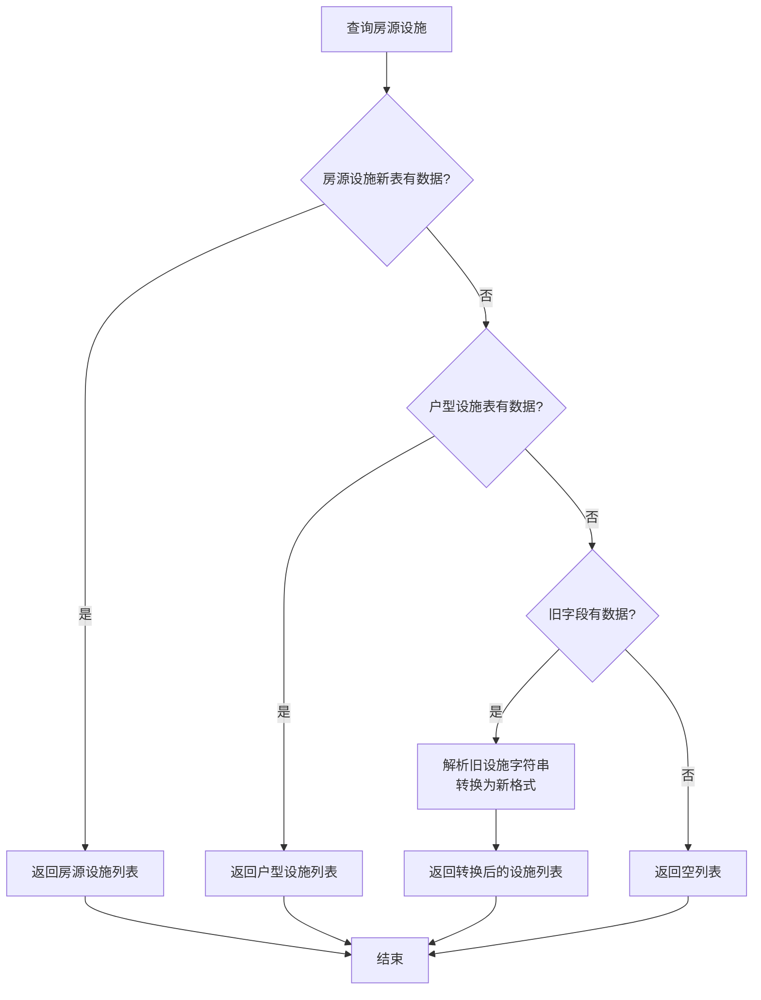
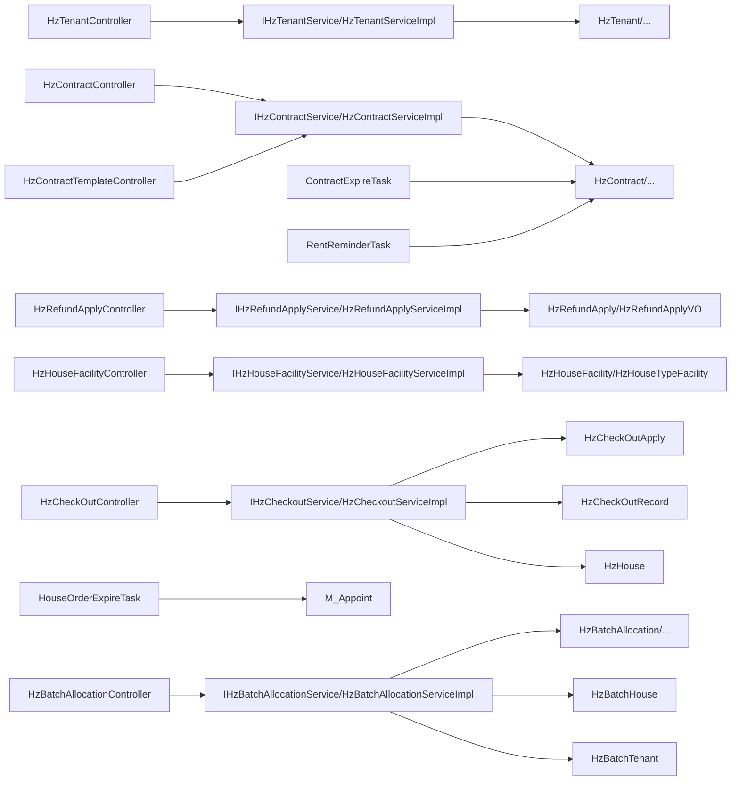

# 业务管理模块

<cite>
**本文引用的文件**
- [01-房源管理.md](file://docs/数据字典/01-房源管理.md)
- [02-租户管理.md](file://docs/数据字典/02-租户管理.md)
- [03-合同管理.md](file://docs/数据字典/03-合同管理.md)
- [04-入住退租.md](file://docs/数据字典/04-入住退租.md)
- [07-预约看房.md](file://docs/数据字典/07-预约看房.md)
- [10-批量分配.md](file://docs/数据字典/10-批量分配.md)
- [HzHouseFacilityController.java](file://ruoyi-system/src/main/java/com/ruoyi/system/controller/HzHouseFacilityController.java)
- [HzHouseFacility.java](file://ruoyi-system/src/main/java/com/ruoyi/system/domain/HzHouseFacility.java)
- [HzHouseTypeFacility.java](file://ruoyi-system/src/main/java/com/ruoyi/system/domain/HzHouseTypeFacility.java)
- [IHzHouseFacilityService.java](file://ruoyi-system/src/main/java/com/ruoyi/system/service/IHzHouseFacilityService.java)
- [HzHouseFacilityServiceImpl.java](file://ruoyi-system/src/main/java/com/ruoyi/system/service/impl/HzHouseFacilityServiceImpl.java)
- [HzHouseTypeFacilityServiceImpl.java](file://ruoyi-system/src/main/java/com/ruoyi/system/service/impl/HzHouseTypeFacilityServiceImpl.java)
- [HzHouseAppController.java](file://ruoyi-admin/src/main/java/com/ruoyi/web/controller/h5/HzHouseAppController.java)
- [HzCheckoutServiceImpl.java](file://ruoyi-system/src/main/java/com/ruoyi/system/service/impl/HzCheckoutServiceImpl.java)
- [HzTenant.java](file://ruoyi-system/src/main/java/com/ruoyi/system/domain/HzTenant.java)
- [HzQualification.java](file://ruoyi-system/src/main/java/com/ruoyi/system/domain/HzQualification.java)
- [HzQualificationAppeal.java](file://ruoyi-system/src/main/java/com/ruoyi/system/domain/HzQualificationAppeal.java)
- [HzCommitment.java](file://ruoyi-system/src/main/java/com/ruoyi/system/domain/HzCommitment.java)
- [HzBlacklist.java](file://ruoyi-system/src/main/java/com/ruoyi/system/domain/HzBlacklist.java)
- [HzCoTenant.java](file://ruoyi-system/src/main/java/com/ruoyi/system/domain/HzCoTenant.java)
- [HzContract.java](file://ruoyi-system/src/main/java/com/ruoyi/system/domain/HzContract.java)
- [HzContractTemplate.java](file://ruoyi-system/src/main/java/com/ruoyi/system/domain/HzContractTemplate.java)
- [HzContractSignature.java](file://ruoyi-system/src/main/java/com/ruoyi/system/domain/HzContractSignature.java)
- [HzHouseExchange.java](file://ruoyi-system/src/main/java/com/ruoyi/system/domain/HzHouseExchange.java)
- [HzCheckInApply.java](file://ruoyi-system/src/main/java/com/ruoyi/system/domain/HzCheckInApply.java)
- [HzCheckInRecord.java](file://ruoyi-system/src/main/java/com/ruoyi/system/domain/HzCheckInRecord.java)
- [HzCheckOutApply.java](file://ruoyi-system/src/main/java/com/ruoyi/system/domain/HzCheckOutApply.java)
- [HzCheckOutRecord.java](file://ruoyi-system/src/main/java/com/ruoyi/system/domain/HzCheckOutRecord.java)
- [HzInventoryList.java](file://ruoyi-system/src/main/java/com/ruoyi/system/domain/HzInventoryList.java)
- [HzItemStatus.java](file://ruoyi-system/src/main/java/com/ruoyi/system/domain/HzItemStatus.java)
- [HzComplaint.java](file://ruoyi-system/src/main/java/com/ruoyi/system/domain/HzComplaint.java)
- [HzRefundApply.java](file://ruoyi-system/src/main/java/com/ruoyi/system/domain/HzRefundApply.java)
- [HzRefundApplyVO.java](file://ruoyi-system/src/main/java/com/ruoyi/system/domain/HzRefundApplyVO.java)
- [HzCheckoutApplyVO.java](file://ruoyi-system/src/main/java/com/ruoyi/system/domain/HzCheckoutApplyVO.java)
- [HzAppointment.java](file://ruoyi-system/src/main/java/com/ruoyi/system/domain/HzAppointment.java)
- [HzViewingRecord.java](file://ruoyi-system/src/main/java/com/ruoyi/system/domain/HzViewingRecord.java)
- [HzBatchAllocation.java](file://ruoyi-system/src/main/java/com/ruoyi/system/domain/HzBatchAllocation.java)
- [HzBatchHouse.java](file://ruoyi-system/src/main/java/com/ruoyi/system/domain/HzBatchHouse.java)
- [HzBatchTenant.java](file://ruoyi-system/src/main/java/com/ruoyi/system/domain/HzBatchTenant.java)
- [HzBatchAllocationController.java](file://ruoyi-admin/src/main/java/com/ruoyi/web/controller/system/HzBatchAllocationController.java)
- [IHzBatchAllocationService.java](file://ruoyi-system/src/main/java/com/ruoyi/system/service/IHzBatchAllocationService.java)
- [HzBatchAllocationServiceImpl.java](file://ruoyi-system/src/main/java/com/ruoyi/system/service/impl/HzBatchAllocationServiceImpl.java)
- [index.vue](file://ruoyi-ui/src/views/gangzhu/house/batch/index.vue)
- [HzTenantController.java](file://ruoyi-admin/src/main/java/com/ruoyi/web/controller/system/HzTenantController.java)
- [IHzTenantService.java](file://ruoyi-system/src/main/java/com/ruoyi/system/service/IHzTenantService.java)
- [HzTenantServiceImpl.java](file://ruoyi-system/src/main/java/com/ruoyi/system/service/impl/HzTenantServiceImpl.java)
- [HzContractController.java](file://ruoyi-admin/src/main/java/com/ruoyi/web/controller/system/HzContractController.java)
- [IHzContractService.java](file://ruoyi-system/src/main/java/com/ruoyi/system/service/IHzContractService.java)
- [HzContractServiceImpl.java](file://ruoyi-system/src/main/java/com/ruoyi/system/service/impl/HzContractServiceImpl.java)
- [HzContractTemplateController.java](file://ruoyi-admin/src/main/java/com/ruoyi/web/controller/system/HzContractTemplateController.java)
- [IHzContractTemplateService.java](file://ruoyi-system/src/main/java/com/ruoyi/system/service/IHzContractTemplateService.java)
- [HzContractTemplateServiceImpl.java](file://ruoyi-system/src/main/java/com/ruoyi/system/service/impl/HzContractTemplateServiceImpl.java)
- [HzCheckInController.java](file://ruoyi-admin/src/main/java/com/ruoyi/web/controller/h5/HzCheckInController.java)
- [HzCheckOutController.java](file://ruoyi-admin/src/main/java/com/ruoyi/web/controller/system/HzCheckOutController.java)
- [HzCohabitantAppController.java](file://ruoyi-admin/src/main/java/com/ruoyi/web/controller/h5/HzCohabitantAppController.java)
- [HzComplaintAppController.java](file://ruoyi-admin/src/main/java/com/ruoyi/web/controller/h5/HzComplaintAppController.java)
- [HzRefundApplyController.java](file://ruoyi-admin/src/main/java/com/ruoyi/web/controller/system/HzRefundApplyController.java)
- [IHzRefundApplyService.java](file://ruoyi-system/src/main/java/com/ruoyi/system/service/IHzRefundApplyService.java)
- [HzRefundApplyServiceImpl.java](file://ruoyi-system/src/main/java/com/ruoyi/system/service/impl/HzRefundApplyServiceImpl.java)
- [HzAppointmentController.java](file://ruoyi-admin/src/main/java/com/ruoyi/web/controller/h5/HzAppointmentController.java)
- [HzContractAppController.java](file://ruoyi-admin/src/main/java/com/ruoyi/web/controller/h5/HzContractAppController.java)
- [HzCommitmentAppController.java](file://ruoyi-admin/src/main/java/com/ruoyi/web/controller/h5/HzCommitmentAppController.java)
- [ContractExpireTask.java](file://ruoyi-quartz/src/main/java/com/ruoyi/quartz/task/ContractExpireTask.java)
- [HouseOrderExpireTask.java](file://ruoyi-quartz/src/main/java/com/ruoyi/quartz/task/HouseOrderExpireTask.java)
- [RentReminderTask.java](file://ruoyi-quartz/src/main/java/com/ruoyi/quartz/task/RentReminderTask.java)
- [HzHouse.java](file://ruoyi-system/src/main/java/com/ruoyi/system/domain/HzHouse.java)
- [TalentApartmentRentCalculator.java](file://ruoyi-system/src/main/java/com/ruoyi/system/util/TalentApartmentRentCalculator.java)
- [EsignServiceImpl.java](file://ruoyi-system/src/main/java/com/ruoyi/system/service/impl/EsignServiceImpl.java)
- [HzUser.java](file://ruoyi-system/src/main/java/com/ruoyi/system/domain/HzUser.java)
</cite>

## 更新摘要
**所做更改**
- 新增房屋设施信息显示增强章节，详细介绍智能回退机制
- 更新房源管理相关章节，增加设施信息显示逻辑说明
- 新增房屋设施数据模型和业务流程说明
- 更新退租管理章节，增加设施信息回退机制说明
- **更新** 新增按日精算租金计算的详细业务逻辑，覆盖四种场景
- **更新** 新增应退租金字段的详细说明，完善退款处理的财务透明度
- **更新** 新增退租系统自动房屋状态释放功能，与入住超时自动解约和合同到期未续租保持对称
- **更新** 新增前端按日精算结果优先使用的优化机制
- **新增** 新增批量租户管理模块的批量分配验证和审批流程增强功能
- **更新** 新增人才公寓租金计算系统教育程度分类调整说明，将高中毕业生纳入70平米面积标准适用范围

## 目录
1. [简介](#简介)
2. [项目结构](#项目结构)
3. [核心组件](#核心组件)
4. [架构总览](#架构总览)
5. [详细组件分析](#详细组件分析)
6. [房屋设施信息显示增强](#房屋设施信息显示增强)
7. [按日精算租金计算](#按日精算租金计算)
8. [应退租金字段详解](#应退租金字段详解)
9. [批量租户管理模块](#批量租户管理模块)
10. [人才公寓租金计算系统教育程度分类调整](#人才公寓租金计算系统教育程度分类调整)
11. [依赖分析](#依赖分析)
12. [性能考虑](#性能考虑)
13. [故障排查指南](#故障排查指南)
14. [结论](#结论)
15. [附录](#附录)

## 简介
本文件面向港好住信息系统"业务管理模块"，围绕九项核心业务能力进行系统化梳理与说明：租户管理、预约看房管理、投诉管理、资格申诉审核、合同管理、入住管理、退租管理、退款管理和合住人管理。文档从数据模型、业务流程、状态控制、数据流转、操作指南与业务规则等方面展开，帮助业务管理人员快速掌握各模块职责、操作路径与关键控制点。

**更新** 新增房屋设施信息显示增强功能，通过智能回退机制确保房源列表始终显示完整的设施信息；新增按日精算租金计算的详细业务逻辑，覆盖四种场景，显著提升租金退款的精确度；新增应退租金字段的详细说明，完善退款处理的财务透明度；新增退租系统自动房屋状态释放功能，与入住超时自动解约和合同到期未续租的释放逻辑保持对称；新增前端按日精算结果优先使用的优化机制，提升用户体验和计算效率；**新增批量租户管理模块的批量分配验证和审批流程增强功能，提供更完善的租户批量管理能力；新增人才公寓租金计算系统教育程度分类调整说明，将高中毕业生纳入70平米面积标准适用范围，体现政策调整对现有业务逻辑的影响。**

## 项目结构
业务管理模块由"前端页面/应用控制器 + 后端控制器 + 服务层 + 数据访问层 + 领域模型 + 定时任务"构成，采用前后端分离与多端协同（H5/小程序/管理后台）的方式支撑业务闭环。

```mermaid
graph TB
subgraph "前端"
FE_H5["H5/小程序页面<br/>预约/合同/入住/退租/合住人/投诉"]
FE_Admin["管理后台页面<br/>租户/合同/合同模板/退款/定时任务<br/>批量租户管理"]
end
subgraph "后端"
C_Tenant["租户控制器<br/>HzTenantController"]
C_Contract["合同控制器<br/>HzContractController"]
C_Template["合同模板控制器<br/>HzContractTemplateController"]
C_CheckIn["入住控制器<br/>HzCheckInController"]
C_CheckOut["退租控制器<br/>HzCheckOutController"]
C_Appointment["预约控制器<br/>HzAppointmentController"]
C_Complaint["投诉控制器<br/>HzComplaintAppController"]
C_Cohabitant["合住人控制器<br/>HzCohabitantAppController"]
C_Refund["退款控制器<br/>HzRefundApplyController"]
C_HouseFacility["房屋设施控制器<br/>HzHouseFacilityController"]
C_BatchAllocation["批量分配控制器<br/>HzBatchAllocationController"]
end
subgraph "服务层"
S_Tenant["租户服务<br/>IHzTenantService/HzTenantServiceImpl"]
S_Contract["合同服务<br/>IHzContractService/HzContractServiceImpl"]
S_Template["合同模板服务<br/>IHzContractTemplateService/HzContractTemplateServiceImpl"]
S_Refund["退款服务<br/>IHzRefundApplyService/HzRefundApplyServiceImpl"]
S_HouseFacility["房屋设施服务<br/>IHzHouseFacilityService/HzHouseFacilityServiceImpl"]
S_Checkout["退租服务<br/>IHzCheckoutService/HzCheckoutServiceImpl"]
S_BatchAllocation["批量分配服务<br/>IHzBatchAllocationService/HzBatchAllocationServiceImpl"]
end
subgraph "领域模型与持久层"
M_Tenant["租户模型<br/>HzTenant"]
M_Qual["资格模型<br/>HzQualification"]
M_Appeal["申诉模型<br/>HzQualificationAppeal"]
M_Black["黑名单模型<br/>HzBlacklist"]
M_Commit["承诺书模型<br/>HzCommitment"]
M_CoTenant["共同租户模型<br/>HzCoTenant"]
M_Contract["合同模型<br/>HzContract"]
M_Tpl["合同模板模型<br/>HzContractTemplate"]
M_Sign["合同签署记录<br/>HzContractSignature"]
M_Exchange["换房记录<br/>HzHouseExchange"]
M_CkInApply["入住申请<br/>HzCheckInApply"]
M_CkInRec["入住记录<br/>HzCheckInRecord"]
M_CkOutApply["退租申请<br/>HzCheckOutApply"]
M_CkOutRec["退租记录<br/>HzCheckOutRecord"]
M_InvList["物品清单<br/>HzInventoryList"]
M_ItemSt["物品状态<br/>HzItemStatus"]
M_Appoint["预约看房<br/>HzAppointment"]
M_ViewRec["看房记录<br/>HzViewingRecord"]
M_Complaint["投诉建议<br/>HzComplaint"]
M_Refund["退款申请<br/>HzRefundApply"]
M_RefundVO["退款申请VO<br/>HzRefundApplyVO"]
M_CheckoutApplyVO["退租申请VO<br/>HzCheckoutApplyVO"]
M_HouseFacility["房屋设施模型<br/>HzHouseFacility"]
M_HouseTypeFacility["户型设施模型<br/>HzHouseTypeFacility"]
M_House["房源模型<br/>HzHouse"]
M_BatchAllocation["批量分配模型<br/>HzBatchAllocation"]
M_BatchHouse["批量房源模型<br/>HzBatchHouse"]
M_BatchTenant["批量租户模型<br/>HzBatchTenant"]
end
subgraph "定时任务"
T1["合同到期任务<br/>ContractExpireTask"]
T2["预约过期任务<br/>HouseOrderExpireTask"]
T3["租金提醒任务<br/>RentReminderTask"]
end
FE_H5 --> C_Appointment
FE_H5 --> C_ContractApp["合同应用控制器"]
FE_H5 --> C_CheckIn
FE_H5 --> C_CheckOut
FE_H5 --> C_Cohabitant
FE_H5 --> C_Complaint
FE_Admin --> C_Tenant
FE_Admin --> C_Contract
FE_Admin --> C_Template
FE_Admin --> C_Refund
FE_Admin --> C_BatchAllocation
C_Tenant --> S_Tenant
C_Contract --> S_Contract
C_Template --> S_Contract
C_Refund --> S_Refund
C_HouseFacility --> S_HouseFacility
C_CheckOut --> S_Checkout
C_BatchAllocation --> S_BatchAllocation
S_Tenant --> M_Tenant
S_Contract --> M_Contract
S_Contract --> M_Tpl
S_Contract --> M_Sign
S_Contract --> M_CoTenant
S_Contract --> M_Exchange
S_Contract --> M_CkInApply
S_Contract --> M_CkInRec
S_Contract --> M_CkOutApply
S_Contract --> M_CkOutRec
S_Contract --> M_InvList
S_Contract --> M_ItemSt
S_Contract --> M_Appoint
S_Contract --> M_ViewRec
S_Contract --> M_Complaint
S_Contract --> M_Refund
S_HouseFacility --> M_HouseFacility
S_HouseFacility --> M_HouseTypeFacility
S_Checkout --> M_CkOutApply
S_Checkout --> M_CkOutRec
S_Checkout --> M_House
S_BatchAllocation --> M_BatchAllocation
S_BatchAllocation --> M_BatchHouse
S_BatchAllocation --> M_BatchTenant
T1 --> M_Contract
T2 --> M_Appoint
T3 --> M_Contract
```



**图表来源**
- [HzHouseFacilityController.java](file://ruoyi-system/src/main/java/com/ruoyi/system/controller/HzHouseFacilityController.java)
- [IHzHouseFacilityService.java](file://ruoyi-system/src/main/java/com/ruoyi/system/service/IHzHouseFacilityService.java)
- [HzHouseFacilityServiceImpl.java](file://ruoyi-system/src/main/java/com/ruoyi/system/service/impl/HzHouseFacilityServiceImpl.java)
- [HzCheckoutServiceImpl.java](file://ruoyi-system/src/main/java/com/ruoyi/system/service/impl/HzCheckoutServiceImpl.java)
- [HzBatchAllocationController.java](file://ruoyi-admin/src/main/java/com/ruoyi/web/controller/system/HzBatchAllocationController.java)
- [IHzBatchAllocationService.java](file://ruoyi-system/src/main/java/com/ruoyi/system/service/IHzBatchAllocationService.java)
- [HzBatchAllocationServiceImpl.java](file://ruoyi-system/src/main/java/com/ruoyi/system/service/impl/HzBatchAllocationServiceImpl.java)

**章节来源**
- [HzTenantController.java](file://ruoyi-admin/src/main/java/com/ruoyi/web/controller/system/HzTenantController.java)
- [HzContractController.java](file://ruoyi-admin/src/main/java/com/ruoyi/web/controller/system/HzContractController.java)
- [HzContractTemplateController.java](file://ruoyi-admin/src/main/java/com/ruoyi/web/controller/system/HzContractTemplateController.java)
- [HzCheckInController.java](file://ruoyi-admin/src/main/java/com/ruoyi/web/controller/h5/HzCheckInController.java)
- [HzCheckOutController.java](file://ruoyi-admin/src/main/java/com/ruoyi/web/controller/system/HzCheckOutController.java)
- [HzCohabitantAppController.java](file://ruoyi-admin/src/main/java/com/ruoyi/web/controller/h5/HzCohabitantAppController.java)
- [HzComplaintAppController.java](file://ruoyi-admin/src/main/java/com/ruoyi/web/controller/h5/HzComplaintAppController.java)
- [HzRefundApplyController.java](file://ruoyi-admin/src/main/java/com/ruoyi/web/controller/system/HzRefundApplyController.java)

## 核心组件
本节对九个核心功能模块的数据模型与关键字段进行归纳，便于理解业务实体与状态流转。

- 租户管理
  - 实体：租户、资格、资格申诉、承诺书、黑名单
  - 关键字段：租户基础信息、信用分、是否黑名单、资格申请类型、自动/人工审核结果、最终结果、承诺书签署状态
  - **章节来源**
    - [02-租户管理.md](file://docs/数据字典/02-租户管理.md)
    - [HzTenant.java](file://ruoyi-system/src/main/java/com/ruoyi/system/domain/HzTenant.java)
    - [HzQualification.java](file://ruoyi-system/src/main/java/com/ruoyi/system/domain/HzQualification.java)
    - [HzQualificationAppeal.java](file://ruoyi-system/src/main/java/com/ruoyi/system/domain/HzQualificationAppeal.java)
    - [HzCommitment.java](file://ruoyi-system/src/main/java/com/ruoyi/system/domain/HzCommitment.java)
    - [HzBlacklist.java](file://ruoyi-system/src/main/java/com/ruoyi/system/domain/HzBlacklist.java)

- 预约看房管理
  - 实体：预约看房、看房记录
  - 关键字段：预约编号、预约状态（待确认/已确认/已完成/已取消）、确认人与时间、取消原因与时间、看房人数、时间段、满意度评分、是否意向
  - **章节来源**
    - [07-预约看房.md](file://docs/数据字典/07-预约看房.md)
    - [HzAppointment.java](file://ruoyi-system/src/main/java/com/ruoyi/system/domain/HzAppointment.java)
    - [HzViewingRecord.java](file://ruoyi-system/src/main/java/com/ruoyi/system/domain/HzViewingRecord.java)

- 合同管理
  - 实体：合同、合同模板、合同附件、合同签署记录、共同租户、换房记录
  - 关键字段：合同编号、合同类型、模板ID、租金/押金、起止日期、支付周期/日、合同状态、是否续约、签署人类型与签名数据、共同租户关系
  - **章节来源**
    - [03-合同管理.md](file://docs/数据字典/03-合同管理.md)
    - [HzContract.java](file://ruoyi-system/src/main/java/com/ruoyi/system/domain/HzContract.java)
    - [HzContractTemplate.java](file://ruoyi-system/src/main/java/com/ruoyi/system/domain/HzContractTemplate.java)
    - [HzContractSignature.java](file://ruoyi-system/src/main/java/com/ruoyi/system/domain/HzContractSignature.java)
    - [HzCoTenant.java](file://ruoyi-system/src/main/java/com/ruoyi/system/domain/HzCoTenant.java)
    - [HzHouseExchange.java](file://ruoyi-system/src/main/java/com/ruoyi/system/domain/HzHouseExchange.java)

- 入住管理
  - 实体：入住申请、入住记录、物品清单、物品状态
  - 关键字段：计划入住日期、押金缴纳状态与金额、入住日期/时间、电/水/燃气表读数、钥匙数量、清点清单、双方签名、在住/退租状态
  - **章节来源**
    - [04-入住退租.md](file://docs/数据字典/04-入住退租.md)
    - [HzCheckInApply.java](file://ruoyi-system/src/main/java/com/ruoyi/system/domain/HzCheckInApply.java)
    - [HzCheckInRecord.java](file://ruoyi-system/src/main/java/com/ruoyi/system/domain/HzCheckInRecord.java)
    - [HzInventoryList.java](file://ruoyi-system/src/main/java/com/ruoyi/system/domain/HzInventoryList.java)
    - [HzItemStatus.java](file://ruoyi-system/src/main/java/com/ruoyi/system/domain/HzItemStatus.java)

- 退租管理
  - 实体：退租申请、退租记录
  - 关键字段：计划退租日期、退租原因、是否提前解约、违约金、未结账单、应退押金、应退租金、审批状态、退租日期/时间、水电燃气费、损坏赔偿、退款状态与时间、双方签名
  - **更新** 新增按日精算租金计算的详细业务逻辑，覆盖四种场景：
    1. 不满一月退租，退租当期已缴：rentRefund = 已缴 - 日租金×入住天数
    2. 满一月退租，退租当期(下一期)已缴：同上
    3. 退租当期未缴费：currentPeriodOwed = 日租金×入住天数（从应退总额中扣）
    4. 未入住（退租日 ≤ 合同生效日）：全部已付租金账单全额退
  - **更新** 新增应退租金字段：支持按月租金计算应退金额，完善退款处理的财务透明度
  - **更新** 新增自动房屋状态释放功能：在退租确认流程中自动将房屋状态从'已预订'(1)或'已出租'(2)释放为'空置'(0)，与'入住超时自动解约'和'合同到期未续租'的释放逻辑保持对称
  - **更新** 新增前端按日精算结果优先使用的优化机制：优先使用后端按日精算接口返回的结果，提升计算精度和用户体验
  - **章节来源**
    - [04-入住退租.md](file://docs/数据字典/04-入住退租.md)
    - [HzCheckOutApply.java](file://ruoyi-system/src/main/java/com/ruoyi/system/domain/HzCheckOutApply.java)
    - [HzCheckOutRecord.java](file://ruoyi-system/src/main/java/com/ruoyi/system/domain/HzCheckOutRecord.java)
    - [HzRefundApply.java](file://ruoyi-system/src/main/java/com/ruoyi/system/domain/HzRefundApply.java)
    - [HzRefundApplyVO.java](file://ruoyi-system/src/main/java/com/ruoyi/system/domain/HzRefundApplyVO.java)
    - [HzCheckoutApplyVO.java](file://ruoyi-system/src/main/java/com/ruoyi/system/domain/HzCheckoutApplyVO.java)

- 退款管理
  - 实体：退款申请、退款申请VO
  - 关键字段：退款编号、支付ID、租户信息、退款金额、原因、银行账户信息、审批状态与意见、审批人与时间、应退押金、应退租金
  - **更新** 新增应退租金字段：支持退款拆分，完善财务透明度
  - **章节来源**
    - [HzRefundApply.java](file://ruoyi-system/src/main/java/com/ruoyi/system/domain/HzRefundApply.java)
    - [HzRefundApplyVO.java](file://ruoyi-system/src/main/java/com/ruoyi/system/domain/HzRefundApplyVO.java)

- 合住人管理
  - 实体：共同租户
  - 关键字段：合同ID、姓名/身份证/手机号、与主租户关系、状态
  - **章节来源**
    - [03-合同管理.md](file://docs/数据字典/03-合同管理.md)
    - [HzCoTenant.java](file://ruoyi-system/src/main/java/com/ruoyi/system/domain/HzCoTenant.java)

- 投诉管理
  - 实体：投诉建议
  - 关键字段：用户ID、标题/内容、联系方式、图片、状态、是否催办、催办次数与时间、处理结果/时间/人
  - **章节来源**
    - [HzComplaint.java](file://ruoyi-system/src/main/java/com/ruoyi/system/domain/HzComplaint.java)

- 批量租户管理
  - 实体：批量分配、批量房源、批量租户
  - 关键字段：批次ID、批次状态、分配验证规则、审批状态、房源分配信息、租户导入模板、可用房源查询
  - **新增** 批量分配验证：支持批量租户信息的验证规则，确保数据质量和合规性
  - **新增** 审批流程增强：提供更完善的审批状态管理和审批意见记录
  - **新增** 批量操作：支持批量导入、批量分配、批量审批等操作
  - **章节来源**
    - [10-批量分配.md](file://docs/数据字典/10-批量分配.md)
    - [HzBatchAllocation.java](file://ruoyi-system/src/main/java/com/ruoyi/system/domain/HzBatchAllocation.java)
    - [HzBatchHouse.java](file://ruoyi-system/src/main/java/com/ruoyi/system/domain/HzBatchHouse.java)
    - [HzBatchTenant.java](file://ruoyi-system/src/main/java/com/ruoyi/system/domain/HzBatchTenant.java)

## 架构总览
业务管理模块遵循"控制器-服务-领域模型-持久层"的分层架构，结合定时任务实现合同到期、预约过期与租金提醒等自动化流程。



**图表来源**
- [ContractExpireTask.java](file://ruoyi-quartz/src/main/java/com/ruoyi/quartz/task/ContractExpireTask.java)
- [HouseOrderExpireTask.java](file://ruoyi-quartz/src/main/java/com/ruoyi/quartz/task/HouseOrderExpireTask.java)
- [RentReminderTask.java](file://ruoyi-quartz/src/main/java/com/ruoyi/quartz/task/RentReminderTask.java)

## 详细组件分析

### 租户管理模块
- 职责边界
  - 租户信息维护：姓名、身份证、联系方式、性别、出生日期、教育、婚姻、工作单位、紧急联系人、现住址、邮箱、微信、头像、信用分
  - 资格状态管理：资格申请类型、社保月数、本地房产、家庭人口、月收入、自动/人工审核结果、最终结果、状态
  - 黑名单管理：列入/移除原因、生效状态、时间
- 关键流程
  - 资格初审与复审：系统自动规则判断 + 人工复核，形成最终结果
  - 黑名单动态维护：根据违规行为或信用分阈值触发
- 状态控制
  - 租户状态：正常/停用
  - 资格状态：待审核/审核中/已审核
  - 黑名单状态：已移除/生效中
- 数据流转
  - 租户信息变更 → 资格重新评估 → 结果更新至资格表与黑名单表
- 操作指南要点
  - 在管理后台维护租户档案，必要时调整信用分与黑名单状态
  - 对资格申请进行自动/人工审核，确保最终结果准确
- 业务规则
  - 信用分低于阈值可列入黑名单
  - 审核结果需经人工复核，避免误判

**章节来源**
- [02-租户管理.md](file://docs/数据字典/02-租户管理.md)
- [HzTenant.java](file://ruoyi-system/src/main/java/com/ruoyi/system/domain/HzTenant.java)
- [HzQualification.java](file://ruoyi-system/src/main/java/com/ruoyi/system/domain/HzQualification.java)
- [HzBlacklist.java](file://ruoyi-system/src/main/java/com/ruoyi/system/domain/HzBlacklist.java)

### 预约看房管理模块
- 职责边界
  - 预约创建：输入看房人信息、项目/房源、日期与时间段、来访人数、来源渠道
  - 预约确认：确认人与时间、状态更新为"已确认"
  - 预约取消：记录取消原因与时间、状态更新为"已取消"
  - 看房完成：生成看房记录，包含带看人、时长、满意度、是否意向、反馈
- 关键流程
  - 预约提交 → 管理员确认 → 看房执行 → 看房记录归档
- 状态控制
  - 预约状态：待确认/已确认/已完成/已取消
- 数据流转
  - 预约表与看房记录表双向关联，便于追溯
- 操作指南要点
  - 及时确认预约，避免过期失效
  - 看房完成后完善记录，提升后续转化率
- 业务规则
  - 预约状态不可逆向修改，取消需填写原因



**图表来源**
- [HzAppointmentController.java](file://ruoyi-admin/src/main/java/com/ruoyi/web/controller/h5/HzAppointmentController.java)
- [HzAppointment.java](file://ruoyi-system/src/main/java/com/ruoyi/system/domain/HzAppointment.java)
- [HzViewingRecord.java](file://ruoyi-system/src/main/java/com/ruoyi/system/domain/HzViewingRecord.java)

**章节来源**
- [07-预约看房.md](file://docs/数据字典/07-预约看房.md)
- [HzAppointment.java](file://ruoyi-system/src/main/java/com/ruoyi/system/domain/HzAppointment.java)
- [HzViewingRecord.java](file://ruoyi-system/src/main/java/com/ruoyi/system/domain/HzViewingRecord.java)

### 合同管理模块
- 职责边界
  - 合同模板管理：模板名称/编码、合同类型、版本、默认模板、状态
  - 合同签署状态跟踪：租户/房东/共同租户签名、签名时间/IP/地点、状态
  - 合同归档：合同内容、文件URL、附件管理、换房记录
- 关键流程
  - 模板选择 → 合同生成 → 多方电子签名 → 状态推进 → 履行/到期/解约
- 状态控制
  - 合同状态：草稿/待签署/已签署/履行中/已到期/已解约
  - 签署状态：未签署/已签署
- 数据流转
  - 模板表 → 合同表 → 签署记录表 → 附件表 → 换房记录表
- 操作指南要点
  - 使用默认模板，按需定制；签署前校验信息一致性
  - 合同到期前触发到期任务，及时处理续签或解约
- 业务规则
  - 签署必须满足法定要件，签名数据具备法律效力



**图表来源**
- [HzContractController.java](file://ruoyi-admin/src/main/java/com/ruoyi/web/controller/system/HzContractController.java)
- [HzContractTemplateController.java](file://ruoyi-admin/src/main/java/com/ruoyi/web/controller/system/HzContractTemplateController.java)
- [HzContract.java](file://ruoyi-system/src/main/java/com/ruoyi/system/domain/HzContract.java)
- [HzContractTemplate.java](file://ruoyi-system/src/main/java/com/ruoyi/system/domain/HzContractTemplate.java)
- [HzContractSignature.java](file://ruoyi-system/src/main/java/com/ruoyi/system/domain/HzContractSignature.java)

**章节来源**
- [03-合同管理.md](file://docs/数据字典/03-合同管理.md)
- [HzContract.java](file://ruoyi-system/src/main/java/com/ruoyi/system/domain/HzContract.java)
- [HzContractTemplate.java](file://ruoyi-system/src/main/java/com/ruoyi/system/domain/HzContractTemplate.java)
- [HzContractSignature.java](file://ruoyi-system/src/main/java/com/ruoyi/system/domain/HzContractSignature.java)
- [ContractExpireTask.java](file://ruoyi-quartz/src/main/java/com/ruoyi/quartz/task/ContractExpireTask.java)

### 入住管理模块
- 职责边界
  - 入住申请：计划入住日期、押金缴纳状态与金额、审批意见与人
  - 入住执行：计量表读数、钥匙数量、物品清单、入住照片、双方签名
  - 在住状态：物品清单与状态同步、异常事件登记
- 关键流程
  - 申请 → 审批 → 现场交割 → 入住完成 → 在住管理
- 状态控制
  - 申请状态：待审核/已通过/已驳回/已入住
  - 记录状态：在住/已退租
- 数据流转
  - 申请表 → 记录表 → 清单表/状态表
- 操作指南要点
  - 押金收取与登记须一致；现场交割需双人签名
  - 定期盘点物品清单，及时更新状态
- 业务规则
  - 未缴押金不得入住；现场照片与清单作为凭证



**图表来源**
- [HzCheckInApply.java](file://ruoyi-system/src/main/java/com/ruoyi/system/domain/HzCheckInApply.java)
- [HzCheckInRecord.java](file://ruoyi-system/src/main/java/com/ruoyi/system/domain/HzCheckInRecord.java)
- [HzInventoryList.java](file://ruoyi-system/src/main/java/com/ruoyi/system/domain/HzInventoryList.java)
- [HzItemStatus.java](file://ruoyi-system/src/main/java/com/ruoyi/system/domain/HzItemStatus.java)

**章节来源**
- [04-入住退租.md](file://docs/数据字典/04-入住退租.md)
- [HzCheckInApply.java](file://ruoyi-system/src/main/java/com/ruoyi/system/domain/HzCheckInApply.java)
- [HzCheckInRecord.java](file://ruoyi-system/src/main/java/com/ruoyi/system/domain/HzCheckInRecord.java)

### 退租管理模块
- 职责边界
  - 退租申请：计划退租日期、退租原因、是否提前解约、违约金、未结账单、应退押金、应退租金
  - 退租执行：计量表读数、钥匙归还、物品清单与损坏登记、费用结算、退款处理
- 关键流程
  - 申请 → 审批 → 现场交割 → 结算 → 退款 → 记录归档
- 状态控制
  - 申请状态：待审核/已通过/已驳回/已退租
  - 退款状态：待退款/已退款
- 数据流转
  - 申请表 → 记录表 → 结算明细 → 退款申请
- 操作指南要点
  - 现场交割必须完整，损坏赔偿与欠费明确
  - 退款前完成所有结算与审批
- 业务规则
  - 未结清费用不得退款；提前解约按约定扣取违约金

**更新** 新增按日精算租金计算的详细业务逻辑，覆盖四种场景：

#### 四种计算场景
1. **不满一月退租，退租当期已缴**：`rentRefund = 已缴 - 日租金×入住天数`
2. **满一月退租，退租当期(下一期)已缴**：同上
3. **退租当期未缴费**：`currentPeriodOwed = 日租金×入住天数`（从应退总额中扣）
4. **未入住（退租日 ≤ 合同生效日）**：全部已付租金账单全额退

#### 精度计算规则
- **日租金计算**：`日租金 = 月租金 / 当期天数`，先保留2位小数（HALF_UP）再乘入住天数
- **入住天数**：含两端：`end - start + 1`
- **当期应付**：`当期应付 = 日租金 × 入住天数`

#### 后端计算实现
```java
// 关键：先保留 2 位小数（HALF_UP）再乘入住天数
BigDecimal dailyRent = monthlyRent.divide(BigDecimal.valueOf(periodDays), 2, RoundingMode.HALF_UP);
BigDecimal currentPeriodPay = dailyRent.multiply(BigDecimal.valueOf(stayDays))
                                       .setScale(2, RoundingMode.HALF_UP);
```

**更新** 新增应退租金字段：支持按月租金计算应退金额，完善退款处理的财务透明度。应退租金计算逻辑：
- 未入住场景：全部已付租金全额退回
- 已入住场景：统计退租日期之后月份的已付租金
- 支持管理员手动调整应退租金金额

**更新** 新增自动房屋状态释放功能：在退租确认流程中，系统会自动将房屋状态从'已预订'(1)或'已出租'(2)释放为'空置'(0)，与'入住超时自动解约'和'合同到期未续租'的释放逻辑保持对称。此功能通过安全的释放条件避免误改维修中等状态。

**更新** 新增前端按日精算结果优先使用的优化机制：
- 优先使用后端按日精算接口返回的按日精算结果
- 后端未返回时退化为前端计算逻辑
- 提升计算精度和用户体验



**图表来源**
- [HzCheckOutApply.java](file://ruoyi-system/src/main/java/com/ruoyi/system/domain/HzCheckOutApply.java)
- [HzCheckOutRecord.java](file://ruoyi-system/src/main/java/com/ruoyi/system/domain/HzCheckOutRecord.java)
- [HzRefundApply.java](file://ruoyi-system/src/main/java/com/ruoyi/system/domain/HzRefundApply.java)
- [HzCheckoutServiceImpl.java](file://ruoyi-system/src/main/java/com/ruoyi/system/service/impl/HzCheckoutServiceImpl.java)

**章节来源**
- [04-入住退租.md](file://docs/数据字典/04-入住退租.md)
- [HzCheckOutApply.java](file://ruoyi-system/src/main/java/com/ruoyi/system/domain/HzCheckOutApply.java)
- [HzCheckOutRecord.java](file://ruoyi-system/src/main/java/com/ruoyi/system/domain/HzCheckOutRecord.java)
- [HzRefundApply.java](file://ruoyi-system/src/main/java/com/ruoyi/system/domain/HzRefundApply.java)
- [HzRefundApplyVO.java](file://ruoyi-system/src/main/java/com/ruoyi/system/domain/HzRefundApplyVO.java)
- [HzCheckoutApplyVO.java](file://ruoyi-system/src/main/java/com/ruoyi/system/domain/HzCheckoutApplyVO.java)
- [HzCheckoutServiceImpl.java](file://ruoyi-system/src/main/java/com/ruoyi/system/service/impl/HzCheckoutServiceImpl.java)

### 退款管理模块
- 职责边界
  - 退款申请：支付ID、租户信息、退款金额、原因、银行账户信息、应退押金、应退租金
  - 审批与执行：审批状态与意见、审批人与时间、退款状态与时间
- 关键流程
  - 申请 → 审批 → 执行 → 记录
- 状态控制
  - 审批状态：待审核/审核通过/审核驳回
  - 退款状态：待退款/已退款
- 数据流转
  - 退款申请表 → 审批 → 退款执行 → 记录归档
- 操作指南要点
  - 退款前核对账户信息与金额；审批意见需清晰
  - 支持应退押金与应退租金的拆分退款
- 业务规则
  - 仅允许对已支付成功的订单发起退款

**更新** 新增应退租金字段：支持退款拆分，完善财务透明度。应退租金与应退押金的拆分逻辑：
- 应退总额 = 应退押金 + 应退租金
- 系统自动识别微信支付的押金和租金账单
- 支持按账单期号进行匹配和退款

**章节来源**
- [HzRefundApply.java](file://ruoyi-system/src/main/java/com/ruoyi/system/domain/HzRefundApply.java)
- [HzRefundApplyVO.java](file://ruoyi-system/src/main/java/com/ruoyi/system/domain/HzRefundApplyVO.java)

### 合住人管理模块
- 职责边界
  - 共同租户信息：姓名/身份证/手机号、与主租户关系、状态
- 关键流程
  - 在合同签署时添加共同租户 → 日常管理中维护关系与状态
- 状态控制
  - 正常/停用
- 数据流转
  - 合同表 → 共同租户表
- 操作指南要点
  - 与主租户关系需真实有效；变更关系应及时更新
- 业务规则
  - 共同租户需与合同主体一致，否则影响法律效力

**章节来源**
- [03-合同管理.md](file://docs/数据字典/03-合同管理.md)
- [HzCoTenant.java](file://ruoyi-system/src/main/java/com/ruoyi/system/domain/HzCoTenant.java)

### 投诉管理模块
- 职责边界
  - 投诉建议：标题/内容、联系方式、图片、状态、是否催办、催办次数与时间、处理结果/时间/人
- 关键流程
  - 投诉提交 → 分配处理 → 处理反馈 → 归档
- 状态控制
  - 待处理/已处理
  - 是否催办：未催办/已催办
- 数据流转
  - 投诉表 → 处理记录 → 结果归档
- 操作指南要点
  - 及时响应与处理，留存证据与沟通记录
- 业务规则
  - 投诉处理时限与质量标准需符合制度要求

**章节来源**
- [HzComplaint.java](file://ruoyi-system/src/main/java/com/ruoyi/system/domain/HzComplaint.java)

### 批量租户管理模块

**新增** 批量租户管理模块是业务管理模块的重要扩展，专门用于处理大规模租户信息的批量操作和管理。

#### 职责边界
- **批量分配管理**：批次创建、房源分配、租户信息批量导入
- **批量验证**：批量租户信息的验证规则和数据质量检查
- **审批流程**：批量分配的审批状态管理和审批意见记录
- **批量操作**：支持批量导入、批量分配、批量审批等操作

#### 关键实体
- **HzBatchAllocation**：批量分配主表，记录批次基本信息和状态
- **HzBatchHouse**：批量房源分配明细，记录房源分配详情
- **HzBatchTenant**：批量租户信息明细，记录租户导入信息

#### 关键流程
1. **批次创建**：创建批量分配批次，设置批次基本信息
2. **房源分配**：为批次分配可用房源，支持批量选择
3. **租户导入**：批量导入租户信息，支持Excel模板导入
4. **验证检查**：执行批量验证规则，确保数据质量
5. **审批流程**：审批批量分配结果，记录审批意见
6. **执行分配**：正式执行批量分配，更新相关状态

#### 状态控制
- **批次状态**：草稿/待审批/已审批/执行中/已完成/已作废
- **审批状态**：待审批/审批通过/审批驳回
- **验证状态**：未验证/验证通过/验证失败

#### 数据流转
- 批次创建 → 房源分配 → 租户导入 → 验证检查 → 审批 → 执行

#### 操作指南要点
- **批次管理**：在管理后台的批量租户管理页面进行操作
- **模板下载**：支持下载租户导入模板，确保数据格式正确
- **批量验证**：导入前先进行验证，确保数据质量
- **审批流程**：审批通过后才能正式执行分配

#### 业务规则
- 批次状态不可逆向修改
- 验证失败的数据不能进入审批流程
- 审批驳回的批次需要重新修改后再次提交
- 执行中的批次不能进行修改操作



**图表来源**
- [HzBatchAllocationController.java](file://ruoyi-admin/src/main/java/com/ruoyi/web/controller/system/HzBatchAllocationController.java)
- [HzBatchAllocation.java](file://ruoyi-system/src/main/java/com/ruoyi/system/domain/HzBatchAllocation.java)
- [HzBatchHouse.java](file://ruoyi-system/src/main/java/com/ruoyi/system/domain/HzBatchHouse.java)
- [HzBatchTenant.java](file://ruoyi-system/src/main/java/com/ruoyi/system/domain/HzBatchTenant.java)
- [index.vue](file://ruoyi-ui/src/views/gangzhu/house/batch/index.vue)

**章节来源**
- [10-批量分配.md](file://docs/数据字典/10-批量分配.md)
- [HzBatchAllocation.java](file://ruoyi-system/src/main/java/com/ruoyi/system/domain/HzBatchAllocation.java)
- [HzBatchHouse.java](file://ruoyi-system/src/main/java/com/ruoyi/system/domain/HzBatchHouse.java)
- [HzBatchTenant.java](file://ruoyi-system/src/main/java/com/ruoyi/system/domain/HzBatchTenant.java)
- [HzBatchAllocationController.java](file://ruoyi-admin/src/main/java/com/ruoyi/web/controller/system/HzBatchAllocationController.java)
- [IHzBatchAllocationService.java](file://ruoyi-system/src/main/java/com/ruoyi/system/service/IHzBatchAllocationService.java)
- [HzBatchAllocationServiceImpl.java](file://ruoyi-system/src/main/java/com/ruoyi/system/service/impl/HzBatchAllocationServiceImpl.java)
- [index.vue](file://ruoyi-ui/src/views/gangzhu/house/batch/index.vue)

## 房屋设施信息显示增强

### 智能回退机制概述
系统新增房屋设施信息显示增强功能，通过三级智能回退机制确保房源列表始终显示完整的设施信息，提升用户体验和数据完整性。

### 三级回退机制
系统采用三层回退策略，优先级从高到低：

1. **优先查询房源设施新表**：查询 `hz_house_facility` 表获取精确的房源设施配置
2. **回退：查询户型设施表**：通过房源的户型ID查询 `hz_house_type_facility` 表
3. **再回退：查询旧字段**：查询房源表的 `facilities` 旧字段

### 数据模型设计
房屋设施相关的核心数据模型包括：

- **HzHouseFacility**：房源设施表，存储每个房源的具体设施配置
- **HzHouseTypeFacility**：户型设施表，存储户型的标准设施配置
- **HzHouse**：房源表，包含兼容的旧设施字段

### 业务流程


**图表来源**
- [HzHouseFacilityController.java](file://ruoyi-system/src/main/java/com/ruoyi/system/controller/HzHouseFacilityController.java)
- [HzHouseFacilityServiceImpl.java](file://ruoyi-system/src/main/java/com/ruoyi/system/service/impl/HzHouseFacilityServiceImpl.java)

### 核心实现逻辑
系统在多个控制器中实现了智能回退机制：

1. **HzHouseFacilityController**：主要的设施查询控制器
2. **HzHouseAppController**：移动端应用的设施查询
3. **HzCheckoutServiceImpl**：退租流程中的设施信息处理

### 数据转换规则
当从旧字段回退时，系统会将逗号分隔的设施字符串转换为新的设施对象格式：
- `facilityName`：设施名称
- `facilityCategory`：设施分类，默认为"其他"
- `quantity`：设施数量，默认为1
- `itemStatus`：设施状态，默认为"完好"
- `remark`：备注，默认为空

### 前端显示优化
前端应用针对设施信息显示进行了优化：
- 当设施信息为空时显示"无"提示
- 支持按分类过滤设施列表
- 提供设施详情展示功能

### 业务价值
- **提升用户体验**：确保房源详情页始终显示完整的设施信息
- **数据兼容性**：支持历史数据的平滑迁移
- **业务连续性**：避免因数据缺失导致的业务中断
- **系统稳定性**：通过智能回退机制提高系统的容错能力

**章节来源**
- [HzHouseFacilityController.java](file://ruoyi-system/src/main/java/com/ruoyi/system/controller/HzHouseFacilityController.java)
- [HzHouseFacility.java](file://ruoyi-system/src/main/java/com/ruoyi/system/domain/HzHouseFacility.java)
- [HzHouseTypeFacility.java](file://ruoyi-system/src/main/java/com/ruoyi/system/domain/HzHouseTypeFacility.java)
- [IHzHouseFacilityService.java](file://ruoyi-system/src/main/java/com/ruoyi/system/service/IHzHouseFacilityService.java)
- [HzHouseFacilityServiceImpl.java](file://ruoyi-system/src/main/java/com/ruoyi/system/service/impl/HzHouseFacilityServiceImpl.java)
- [HzHouseAppController.java](file://ruoyi-admin/src/main/java/com/ruoyi/web/controller/h5/HzHouseAppController.java)
- [HzCheckoutServiceImpl.java](file://ruoyi-system/src/main/java/com/ruoyi/system/service/impl/HzCheckoutServiceImpl.java)

## 按日精算租金计算

### 业务背景与需求
传统的按月计算租金退款存在精度不足的问题，特别是在不满一月退租的情况下，无法准确计算应退租金。系统引入按日精算算法，通过精确计算日租金和入住天数，提升退款计算的准确性。

### 四种计算场景

#### 场景一：不满一月退租，退租当期已缴
- **计算公式**：`rentRefund = 已缴 - 日租金×入住天数`
- **适用条件**：退租发生在当期账单内，且当期账单已支付
- **业务意义**：按实际入住天数精确退款

#### 场景二：满一月退租，退租当期(下一期)已缴
- **计算公式**：同场景一
- **适用条件**：退租发生在当期账单的下一期，且下一期账单已支付
- **业务意义**：满月退租时的精确计算

#### 场景三：退租当期未缴费
- **计算公式**：`currentPeriodOwed = 日租金×入住天数`
- **适用条件**：退租当期账单未支付
- **业务意义**：从应退总额中扣除当期应付费用

#### 场景四：未入住（退租日 ≤ 合同生效日）
- **计算公式**：全部已付租金账单全额退
- **适用条件**：退租日期早于或等于合同生效日期
- **业务意义**：未实际使用房屋的全额退款

### 精度计算规则

#### 日租金计算
- **计算公式**：`日租金 = 月租金 / 当期天数`
- **精度要求**：先保留2位小数（HALF_UP）再乘入住天数
- **数学表达**：`dailyRent = ROUND(monthlyRent / periodDays, 2)`

#### 入住天数计算
- **计算公式**：含两端：`stayDays = endDate - startDate + 1`
- **业务意义**：包含开始和结束日期的完整入住天数

#### 当期应付计算
- **计算公式**：`currentPeriodPay = 日租金 × 入住天数`
- **精度处理**：结果保留2位小数

### 后端实现逻辑

#### 参数校验与初始化
```java
// 参数校验 + 查合同
if (contractId == null || StringUtils.isEmpty(planCheckoutDate)) {
    result.put("rentRefund", BigDecimal.ZERO);
    result.put("currentPeriodOwed", BigDecimal.ZERO);
    result.put("detail", "参数不足");
    return result;
}
```

#### 未入住场景处理
```java
// 情况四：未入住（退租日 ≤ 合同生效日）
if (!planDate.isAfter(contractStart)) {
    BigDecimal allPaid = BigDecimal.ZERO;
    for (HzBill b : rentBills) {
        if ("1".equals(b.getBillStatus()) && b.getPaidAmount() != null) {
            allPaid = allPaid.add(b.getPaidAmount());
        }
    }
    rentRefund = allPaid;
    detail.append("情况四：未入住（退租日 ≤ 合同生效日），全部已付租金账单全额退还 ¥")
          .append(rentRefund);
}
```

#### 当期账单定位
```java
// 找退租日所在的当期账单
HzBill currentBill = null;
for (HzBill b : rentBills) {
    if (StringUtils.isEmpty(b.getPeriodStartDate()) || StringUtils.isEmpty(b.getPeriodEndDate())) {
        continue;
    }
    try {
        LocalDate ps = LocalDate.parse(b.getPeriodStartDate().substring(0, 10));
        LocalDate pe = LocalDate.parse(b.getPeriodEndDate().substring(0, 10));
        if (!planDate.isBefore(ps) && !planDate.isAfter(pe)) {
            currentBill = b;
            break;
        }
    } catch (Exception ignored) {}
}
```

#### 精确计算实现
```java
// 关键：先保留 2 位小数（HALF_UP）再乘入住天数
BigDecimal dailyRent = monthlyRent.divide(BigDecimal.valueOf(periodDays), 2, RoundingMode.HALF_UP);
BigDecimal currentPeriodPay = dailyRent.multiply(BigDecimal.valueOf(stayDays))
                                       .setScale(2, RoundingMode.HALF_UP);
```

### 前端优化机制

#### 结果优先使用策略
```javascript
// 应退租金：优先用后端接口返回的按日精算结果
let refundableRent = 0;
if (this.refundResult && this.refundResult.rentRefund) {
    refundableRent = Number(this.refundResult.rentRefund) || 0;
} else {
    // 后端未返回时退化为前端计算
    const refundableBills = paidRentBills.filter(bill => {
        if (!bill.billPeriod) return false;
        const [year, month] = bill.billPeriod.split('-');
        const billDate = new Date(parseInt(year), parseInt(month) - 1, 1);
        return billDate > planCheckoutDate;
    });
    refundableRent = refundableBills.reduce((sum, bill) => sum + Number(bill.paidAmount || 0), 0);
}
```

#### 计算说明展示
前端界面提供详细的计算说明：
- **应退总额** = 应退押金 + 应退租金 - 违约金 - 损坏扣款 - 水费 - 电费 - 燃气费 - 暖气费 - 物业费 - 未付账单 - 当期居住扣款
- **当期居住扣款**：未缴当期房租 → 当期应付从押金中扣除
- **建议金额**：系统自动计算的推荐退款金额

### 业务价值与影响

#### 精度提升
- **精确计算**：按实际入住天数精确计算应退租金
- **公平退款**：避免按月计算的误差，保护租户权益
- **财务透明**：提供详细的计算明细和依据

#### 流程优化
- **自动计算**：减少人工计算错误
- **实时反馈**：审批时提供准确的退款金额
- **风险控制**：防止过度退款或不足退款

#### 用户体验
- **透明度提升**：租户可以清楚了解退款计算过程
- **信任增强**：精确的计算增加系统可信度
- **纠纷减少**：减少因计算不准确引发的争议

**章节来源**
- [HzCheckoutServiceImpl.java](file://ruoyi-system/src/main/java/com/ruoyi/system/service/impl/HzCheckoutServiceImpl.java)
- [HzCheckOutController.java](file://ruoyi-admin/src/main/java/com/ruoyi/web/controller/system/HzCheckOutController.java)
- [index.vue](file://ruoyi-ui/src/views/gangzhu/checkout/index.vue)

## 应退租金字段详解

### 字段定义与用途
应退租金字段（`rent_refund`）是退租管理模块的重要组成部分，用于精确计算和显示租户应得的租金退款金额。

#### 数据模型字段
- **字段名**：`rent_refund`
- **类型**：`decimal(10,2)`
- **含义**：应退租金金额（元）
- **默认值**：NULL
- **业务用途**：记录管理员审批时确定的应退租金金额

#### 前端显示逻辑
前端通过Vue计算属性实现应退租金的智能计算和显示：

```javascript
// 计算应退租金（未入住→全部已付租金；已入住→退租日期之后的月份）
computed: {
  refundableRent() {
    // 1. 筛选已支付的租金账单 (billType = '2' 表示租金, billStatus = '1' 表示已支付)
    const paidRentBills = this.billList.filter(bill =>
      bill.billType === '2' && bill.billStatus === '1'
    );

    // 2. 未入住场景：全部已付租金全额退
    if (this.isNotCheckedIn) {
      return paidRentBills.reduce((sum, bill) => sum + Number(bill.paidAmount || 0), 0);
    }

    // 3. 已入住场景：必须有 planCheckoutDate
    if (!this.currentForm.planCheckoutDate) {
      return 0;
    }

    // 4. 找出账单周期在退租日期之后的月份
    const planCheckoutDate = new Date(this.currentForm.planCheckoutDate);
    const refundableBills = paidRentBills.filter(bill => {
      if (!bill.billPeriod) return false;
      // billPeriod 格式：2026-04, 2026-05 等
      const [year, month] = bill.billPeriod.split('-');
      const billDate = new Date(parseInt(year), parseInt(month) - 1, 1);
      // 账单月份 > 计划退租月份（不扣除退租当月）
      return billDate > planCheckoutDate;
    });

    // 5. 统计应退租金总额
    return refundableBills.reduce((sum, bill) => sum + Number(bill.paidAmount || 0), 0);
  }
}
```

### 计算规则与逻辑
应退租金的计算遵循以下规则：

#### 未入住场景
- **计算公式**：全部已付租金账单金额之和
- **适用条件**：租户未实际入住
- **业务意义**：即使未入住也应全额退还已支付的租金

#### 已入住场景
- **计算公式**：退租日期之后月份的已付租金账单金额之和
- **计算步骤**：
  1. 筛选所有已支付的租金账单
  2. 过滤退租日期之后的月份
  3. 统计符合条件的账单金额

#### 管理员调整机制
- 管理员可在审批时手动调整应退租金金额
- 调整后的金额将影响最终的应退总额计算
- 支持与系统自动计算结果进行对比和验证

### 退款拆分机制
应退租金与应退押金支持独立的退款拆分：

```javascript
// 应退租金部分（仅用于展示）
computed: {
  rentRefundPart() {
    const dr = Number(this.approveForm.depositRefund || 0);
    const ra = Number(this.approveForm.refundAmount || 0);
    return Math.max(0, Number((ra - dr).toFixed(2)));
  }
}
```

#### 退款流程
1. **押金退款**：从押金账单中提取对应金额
2. **租金退款**：从租金账单中提取对应金额
3. **独立处理**：两个部分分别进行退款操作
4. **财务透明**：每笔退款都有明确的账单对应关系

### 业务价值与影响
- **财务透明度**：明确区分押金和租金的退款金额
- **计算准确性**：基于实际账单周期精确计算应退金额
- **操作便利性**：支持管理员手动调整，适应特殊情况
- **系统完整性**：完善了退款管理的财务处理逻辑

### 前端交互设计
前端界面提供了直观的应退租金显示和计算说明：

- **实时计算**：根据账单数据实时计算应退金额
- **计算说明**：详细展示计算逻辑和依据
- **金额对比**：显示系统计算值与管理员调整值的差异
- **退款指引**：指导管理员如何正确设置应退租金

**章节来源**
- [HzCheckOutApply.java](file://ruoyi-system/src/main/java/com/ruoyi/system/domain/HzCheckOutApply.java)
- [HzCheckoutApplyVO.java](file://ruoyi-system/src/main/java/com/ruoyi/system/domain/HzCheckoutApplyVO.java)
- [HzRefundApplyVO.java](file://ruoyi-system/src/main/java/com/ruoyi/system/domain/HzRefundApplyVO.java)
- [index.vue](file://ruoyi-ui/src/views/gangzhu/checkout/index.vue)

## 人才公寓租金计算系统教育程度分类调整

### 政策背景与调整内容
根据最新的政策调整，人才公寓租金计算系统的教育程度分类进行了重要更新：将高中毕业生纳入70平米面积标准适用范围。这一调整体现了对高中学历人才的政策倾斜，扩大了70平米面积标准的适用人群。

### 调整前的教育程度分类
在调整之前，人才公寓面积标准适用的教育程度分类如下：
- **博士**：90平米标准
- **大专、本科、硕士**：70平米标准  
- **小学、初中**：不适用（依靠资格申诉前置拦截）

### 调整后的教育程度分类
调整后，教育程度分类变更为：
- **博士**：90平米标准
- **高中、大专、本科、硕士**：70平米标准
- **小学、初中**：不适用

### 核心实现逻辑
调整主要体现在 `TalentApartmentRentCalculator` 类中的 `areaLimitOf` 方法：

```java
public static BigDecimal areaLimitOf(String education) {
    if (education == null) return null;
    switch (education.trim()) {
        case "7": // 博士
            return new BigDecimal("90");
        case "3": // 高中（按本科标准分档）
        case "4": // 大专
        case "5": // 本科
        case "6": // 硕士
            return new BigDecimal("70");
        default:
            return null; // 1/2 小学/初中 不适用
    }
}
```

### 影响范围分析
此次调整对以下业务环节产生直接影响：

#### 1. 合同签署流程
- **新签合同**：高中学历租户在合同签署时可享受70平米面积标准
- **续租合同**：根据当前学历重新计算面积标准
- **电子签名**：在e签宝流程中体现新的面积标准

#### 2. 账单生成逻辑
- **租金计算**：高中学历租户在70平米标准内享受7折优惠
- **超面积收费**：超出70平米部分按标准价计算
- **账单备注**：系统自动生成包含新教育程度分类的计算说明

#### 3. 业务规则变化
- **适用人群扩大**：从原来的"大专、本科、硕士"扩展到"高中、大专、本科、硕士"
- **政策覆盖面增强**：更多高中学历人才受益于优惠政策
- **计算逻辑保持一致**：70平米标准内的7折优惠和超面积标准价计算规则不变

### 技术实现细节
#### 1. 数据模型支持
- **HzUser模型**：`education` 字段支持"3"（高中）字典值
- **数据字典**：教育程度字典包含高中学历标识
- **前端显示**：用户界面正确显示高中学历标识

#### 2. 业务流程集成
- **合同应用控制器**：在合同生成时自动检测新的教育程度分类
- **电子签章服务**：在e签宝流程中应用新的面积标准
- **账单生成服务**：在生成租金账单时考虑教育程度调整

#### 3. 计算逻辑更新
```java
// 调整后的面积标准映射
case "3": // 高中
case "4": // 大专  
case "5": // 本科
case "6": // 硕士
    return new BigDecimal("70");
```

### 业务影响评估
#### 正面影响
- **政策普惠性增强**：更多高中学历人才享受优惠政策
- **业务流程简化**：无需额外的资格审核流程
- **计算逻辑统一**：与现有70平米标准完全兼容
- **用户体验提升**：符合条件的租户可直接享受相应优惠

#### 风险控制
- **数据一致性**：确保教育程度数据的准确录入和更新
- **业务规则一致性**：所有相关业务流程都需同步更新
- **系统兼容性**：保证新旧数据的平滑过渡
- **审计追踪**：完整记录政策调整的实施情况

### 实施效果监控
#### 1. 数据监控
- **教育程度分布**：监控高中学历租户的增长趋势
- **面积标准使用**：统计70平米标准的使用情况
- **优惠政策覆盖率**：评估政策调整的实际效果

#### 2. 业务指标
- **合同签署量**：跟踪新政策下的合同签署情况
- **租金收入**：分析政策调整对租金收入的影响
- **租户满意度**：收集租户对新政策的反馈

### 后续优化建议
#### 1. 系统优化
- **缓存策略**：优化教育程度分类的缓存机制
- **批量处理**：支持历史数据的批量教育程度更新
- **报表分析**：增强相关政策效果的统计分析功能

#### 2. 业务流程
- **培训指导**：加强对业务人员的新政策培训
- **流程优化**：根据实施效果持续优化相关流程
- **监控预警**：建立政策执行效果的监控预警机制

**章节来源**
- [TalentApartmentRentCalculator.java](file://ruoyi-system/src/main/java/com/ruoyi/system/util/TalentApartmentRentCalculator.java)
- [HzContractAppController.java](file://ruoyi-admin/src/main/java/com/ruoyi/web/controller/h5/HzContractAppController.java)
- [EsignServiceImpl.java](file://ruoyi-system/src/main/java/com/ruoyi/system/service/impl/EsignServiceImpl.java)
- [HzUser.java](file://ruoyi-system/src/main/java/com/ruoyi/system/domain/HzUser.java)

## 依赖分析
- 控制器到服务层
  - 租户：HzTenantController → IHzTenantService/HzTenantServiceImpl
  - 合同：HzContractController → IHzContractService/HzContractServiceImpl
  - 合同模板：HzContractTemplateController → IHzContractTemplateService/HzContractTemplateServiceImpl
  - 退款：HzRefundApplyController → IHzRefundApplyService/HzRefundApplyServiceImpl
  - 房屋设施：HzHouseFacilityController → IHzHouseFacilityService/HzHouseFacilityServiceImpl
  - 退租：HzCheckOutController → IHzCheckoutService/HzCheckoutServiceImpl
  - **批量分配**：HzBatchAllocationController → IHzBatchAllocationService/HzBatchAllocationServiceImpl
- 服务层到领域模型
  - 租户服务 → HzTenant、HzQualification、HzBlacklist、HzCommitment、HzQualificationAppeal
  - 合同服务 → HzContract、HzContractTemplate、HzContractSignature、HzCoTenant、HzHouseExchange、HzCheckInApply、HzCheckInRecord、HzCheckOutApply、HzCheckOutRecord、HzInventoryList、HzItemStatus、HzAppointment、HzViewingRecord、HzComplaint、HzRefundApply
  - 房屋设施服务 → HzHouseFacility、HzHouseTypeFacility
  - 退租服务 → HzCheckOutApply、HzCheckOutRecord、HzHouse、HzRefundApply、HzRefundApplyVO、HzCheckoutApplyVO
  - 退款服务 → HzRefundApply、HzRefundApplyVO
  - **批量分配服务** → HzBatchAllocation、HzBatchHouse、HzBatchTenant
  - **批量分配服务** → HzEnterpriseBatch、HzEnterpriseBatchHouse
- 定时任务依赖
  - ContractExpireTask → HzContract
  - HouseOrderExpireTask → HzAppointment
  - RentReminderTask → HzContract



**图表来源**
- [HzHouseFacilityController.java](file://ruoyi-system/src/main/java/com/ruoyi/system/controller/HzHouseFacilityController.java)
- [IHzHouseFacilityService.java](file://ruoyi-system/src/main/java/com/ruoyi/system/service/IHzHouseFacilityService.java)
- [HzHouseFacilityServiceImpl.java](file://ruoyi-system/src/main/java/com/ruoyi/system/service/impl/HzHouseFacilityServiceImpl.java)
- [HzCheckoutServiceImpl.java](file://ruoyi-system/src/main/java/com/ruoyi/system/service/impl/HzCheckoutServiceImpl.java)
- [HzBatchAllocationController.java](file://ruoyi-admin/src/main/java/com/ruoyi/web/controller/system/HzBatchAllocationController.java)
- [IHzBatchAllocationService.java](file://ruoyi-system/src/main/java/com/ruoyi/system/service/IHzBatchAllocationService.java)
- [HzBatchAllocationServiceImpl.java](file://ruoyi-system/src/main/java/com/ruoyi/system/service/impl/HzBatchAllocationServiceImpl.java)

**章节来源**
- [HzTenantController.java](file://ruoyi-admin/src/main/java/com/ruoyi/web/controller/system/HzTenantController.java)
- [HzContractController.java](file://ruoyi-admin/src/main/java/com/ruoyi/web/controller/system/HzContractController.java)
- [HzContractTemplateController.java](file://ruoyi-admin/src/main/java/com/ruoyi/web/controller/system/HzContractTemplateController.java)
- [HzRefundApplyController.java](file://ruoyi-admin/src/main/java/com/ruoyi/web/controller/system/HzRefundApplyController.java)
- [HzHouseFacilityController.java](file://ruoyi-system/src/main/java/com/ruoyi/system/controller/HzHouseFacilityController.java)
- [HzCheckOutController.java](file://ruoyi-admin/src/main/java/com/ruoyi/web/controller/h5/HzCheckOutController.java)
- [HzBatchAllocationController.java](file://ruoyi-admin/src/main/java/com/ruoyi/web/controller/system/HzBatchAllocationController.java)

## 性能考虑
- 查询优化
  - 对高频查询字段建立索引（如合同编号、租户ID、预约状态、合同状态、房源ID）
  - 分页查询与条件过滤，避免全表扫描
  - 房屋设施查询采用三级回退策略，减少重复查询
  - 应退租金计算采用缓存机制，避免重复账单查询
  - **更新** 按日精算计算结果可进行短期缓存，提升审批效率
  - **新增** 批量租户管理查询优化：对批次ID、租户状态、分配状态建立复合索引
  - **新增** 教育程度分类查询优化：对教育程度字典值建立索引，提升政策调整的查询效率
- 写入优化
  - 批量插入与更新，减少事务开销
  - 异步处理非关键路径（如通知、日志）
  - 房屋设施批量保存采用先删后插策略，确保数据一致性
  - 退租申请更新采用原子操作，确保数据一致性
  - **更新** 自动房屋状态释放采用批量更新，避免频繁的单条更新操作
  - **新增** 教育程度分类更新采用批量处理，避免逐条更新带来的性能问题
  - **新增** 批量租户管理验证采用异步处理，避免阻塞主流程
- 缓存策略
  - 合同模板、黑名单白名单等静态/准静态数据缓存
  - 房屋设施配置可考虑短期缓存，平衡数据新鲜度
  - 应退租金计算结果可进行短期缓存
  - **更新** 按日精算计算结果可进行短期缓存，提升审批页面响应速度
  - **新增** 教育程度分类缓存：缓存教育程度字典值，提升政策调整的查询效率
  - **新增** 批量租户模板缓存：缓存租户导入模板，提升导入效率
- 定时任务
  - 合同到期、预约过期、租金提醒任务合理调度，避免高峰期风暴

## 故障排查指南
- 租户与资格
  - 症状：资格审核不通过或反复失败
  - 排查：检查自动/人工审核规则、征信数据、黑名单状态
- 预约看房
  - 症状：预约无法确认或取消失败
  - 排查：核对状态流转、确认人权限、取消原因必填
- 合同与签署
  - 症状：电子签名无效或状态不同步
  - 排查：核对签名数据完整性、签署时间/IP/地点、合同状态推进
- 入住/退租
  - 症状：现场交割数据不一致或无法完成
  - 排查：核对计量表读数、钥匙数量、物品清单与状态、双方签名
  - **更新** 退租房屋状态释放异常：检查房屋状态是否为'已预订'(1)或'已出租'(2)，确认释放条件是否满足
  - **更新** 应退租金计算异常：检查账单数据完整性、退租日期有效性、未入住状态判断
  - **更新** 按日精算计算错误：检查合同月租金、账单周期、入住天数计算逻辑
- 退款
  - 症状：退款被拒或超时
  - 排查：核对支付ID、账户信息、审批状态与意见、应退押金与应退租金拆分
- 房屋设施
  - 症状：房源设施信息显示异常或为空
  - 排查：检查三级回退机制是否正常工作、数据迁移是否完整
- 定时任务
  - 症状：合同到期未提醒、预约过期未处理
  - 排查：检查任务调度、日志与异常
- **新增** 批量租户管理
  - 症状：批量导入失败或验证不通过
  - 排查：检查Excel模板格式、数据字段映射、验证规则配置
  - 症状：批量分配执行失败
  - 排查：检查房源状态、租户资格、分配规则
  - 症状：审批流程异常
  - 排查：检查审批权限、审批状态流转、审批意见记录
- **新增** 教育程度分类调整
  - 症状：高中学历租户无法享受70平米标准
  - 排查：检查教育程度字典值是否正确、面积标准映射是否更新
  - 症状：政策调整后出现计算错误
  - 排查：检查合同签署流程、账单生成逻辑、电子签章服务中的教育程度处理
  - 症状：历史数据中高中学历租户的优惠政策未生效
  - 排查：检查数据迁移脚本、批量更新任务、历史合同的重新计算

**章节来源**
- [HzTenant.java](file://ruoyi-system/src/main/java/com/ruoyi/system/domain/HzTenant.java)
- [HzQualification.java](file://ruoyi-system/src/main/java/com/ruoyi/system/domain/HzQualification.java)
- [HzAppointment.java](file://ruoyi-system/src/main/java/com/ruoyi/system/domain/HzAppointment.java)
- [HzContract.java](file://ruoyi-system/src/main/java/com/ruoyi/system/domain/HzContract.java)
- [HzCheckInRecord.java](file://ruoyi-system/src/main/java/com/ruoyi/system/domain/HzCheckInRecord.java)
- [HzCheckOutRecord.java](file://ruoyi-system/src/main/java/com/ruoyi/system/domain/HzCheckOutRecord.java)
- [HzRefundApply.java](file://ruoyi-system/src/main/java/com/ruoyi/system/domain/HzRefundApply.java)
- [HzRefundApplyVO.java](file://ruoyi-system/src/main/java/com/ruoyi/system/domain/HzRefundApplyVO.java)
- [HzHouseFacility.java](file://ruoyi-system/src/main/java/com/ruoyi/system/domain/HzHouseFacility.java)
- [HzHouseTypeFacility.java](file://ruoyi-system/src/main/java/com/ruoyi/system/domain/HzHouseTypeFacility.java)
- [HzHouse.java](file://ruoyi-system/src/main/java/com/ruoyi/system/domain/HzHouse.java)
- [HzCheckOutApply.java](file://ruoyi-system/src/main/java/com/ruoyi/system/domain/HzCheckOutApply.java)
- [HzBatchAllocation.java](file://ruoyi-system/src/main/java/com/ruoyi/system/domain/HzBatchAllocation.java)
- [HzBatchHouse.java](file://ruoyi-system/src/main/java/com/ruoyi/system/domain/HzBatchHouse.java)
- [HzBatchTenant.java](file://ruoyi-system/src/main/java/com/ruoyi/system/domain/HzBatchTenant.java)
- [ContractExpireTask.java](file://ruoyi-quartz/src/main/java/com/ruoyi/quartz/task/ContractExpireTask.java)
- [HouseOrderExpireTask.java](file://ruoyi-quartz/src/main/java/com/ruoyi/quartz/task/HouseOrderExpireTask.java)
- [RentReminderTask.java](file://ruoyi-quartz/src/main/java/com/ruoyi/quartz/task/RentReminderTask.java)
- [HzCheckoutServiceImpl.java](file://ruoyi-system/src/main/java/com/ruoyi/system/service/impl/HzCheckoutServiceImpl.java)
- [HzBatchAllocationServiceImpl.java](file://ruoyi-system/src/main/java/com/ruoyi/system/service/impl/HzBatchAllocationServiceImpl.java)
- [TalentApartmentRentCalculator.java](file://ruoyi-system/src/main/java/com/ruoyi/system/util/TalentApartmentRentCalculator.java)

## 结论
业务管理模块以清晰的数据模型与严格的流程控制为核心，结合多端协同与定时任务，实现了从租户准入、预约看房、合同签署到入住退租、退款与合住人的全生命周期闭环。新增的房屋设施信息显示增强功能通过智能回退机制确保了数据的完整性和用户体验的稳定性。**新增的按日精算租金计算功能显著提升了退款计算的精确度，覆盖四种典型场景，确保按实际入住天数准确退款。新增的应退租金字段完善了退款处理的财务透明度，支持精确的租金退款计算和独立的退款拆分机制。新增的退租系统自动房屋状态释放功能进一步完善了业务闭环，与入住超时自动解约和合同到期未续租的释放逻辑保持对称，确保系统状态的一致性和业务流程的完整性。新增的前端按日精算结果优先使用机制提升了用户体验和计算效率。** **新增的批量租户管理模块提供了完善的批量分配验证和审批流程增强功能，支持大规模租户信息的批量操作，包括批量导入、批量验证、批量分配和批量审批等核心功能，显著提升了业务管理效率和数据处理能力。** **新增的人才公寓租金计算系统教育程度分类调整说明体现了政策对高中学历人才的倾斜支持，将高中毕业生纳入70平米面积标准适用范围，扩大了优惠政策的覆盖面，同时保持了现有计算逻辑的稳定性和一致性。**建议在日常运营中强化状态校验、数据一致性与合规性审查，并持续优化查询与写入性能，保障业务稳定高效运行。

## 附录
- 术语说明
  - 合同状态：草稿/待签署/已签署/履行中/已到期/已解约
  - 预约状态：待确认/已确认/已完成/已取消
  - 申请状态：待审核/已通过/已驳回/已入住/已退租
  - 审批状态：待审核/审核通过/审核驳回
  - 房屋设施：房源设施/户型设施/旧设施字段
  - 房屋状态：空置(0)/已预订(1)/已出租(2)/维修中(3)/下架(4)
  - 应退租金：按日精算计算的可退还租金金额
  - 按日精算：基于日租金和入住天数的精确计算方法
  - **新增** 批量租户管理：支持大规模租户信息批量操作的管理模块
  - **新增** 批量分配验证：批量租户信息的验证规则和质量检查
  - **新增** 审批流程增强：完善的审批状态管理和审批意见记录
  - **新增** 教育程度分类调整：政策对高中学历人才的倾斜支持
  - **新增** 70平米面积标准：人才公寓的面积优惠政策
- 建议操作清单
  - 每日巡检：合同到期、预约过期、租金提醒
  - 周常检：物品清单与状态、黑名单与资格
  - 月度报：入住/退租/退款统计与分析
  - 季度检：房屋设施配置完整性检查
  - **更新** 退租房屋状态监控：定期检查退租确认后的房屋状态释放情况，确保释放逻辑正确执行
  - **更新** 应退租金核对：定期核对应退租金计算的准确性，确保账单数据与计算结果一致
  - **更新** 按日精算结果验证：定期验证按日精算算法的正确性，确保四种场景的计算逻辑准确
  - **新增** 批量租户管理巡检：定期检查批量导入模板的完整性、批量验证规则的有效性、批量审批流程的合规性
  - **新增** 批量分配监控：监控批量分配的执行状态，及时发现和处理分配异常
  - **新增** 批量操作审计：记录批量操作的日志，确保操作的可追溯性和合规性
  - **新增** 教育程度分类监控：监控政策调整的实施效果，确保高中学历租户正确享受优惠政策
  - **新增** 历史数据清理：定期清理和更新历史数据中的教育程度信息，确保政策执行的一致性