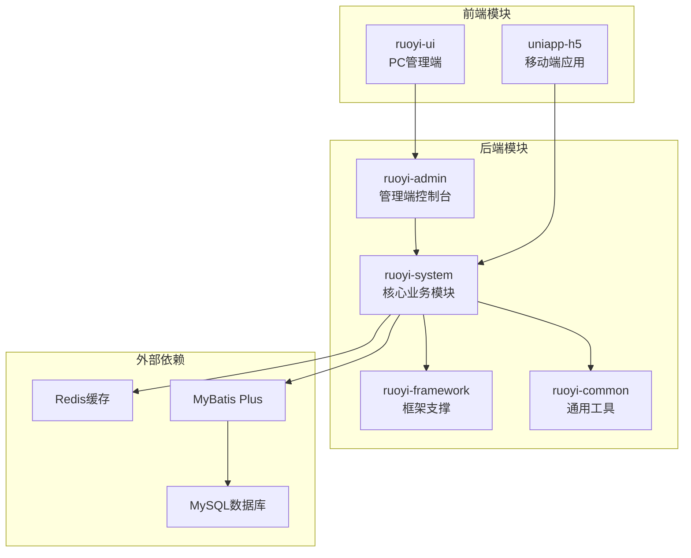
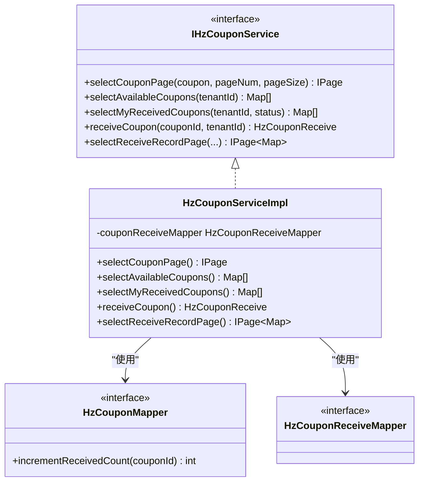
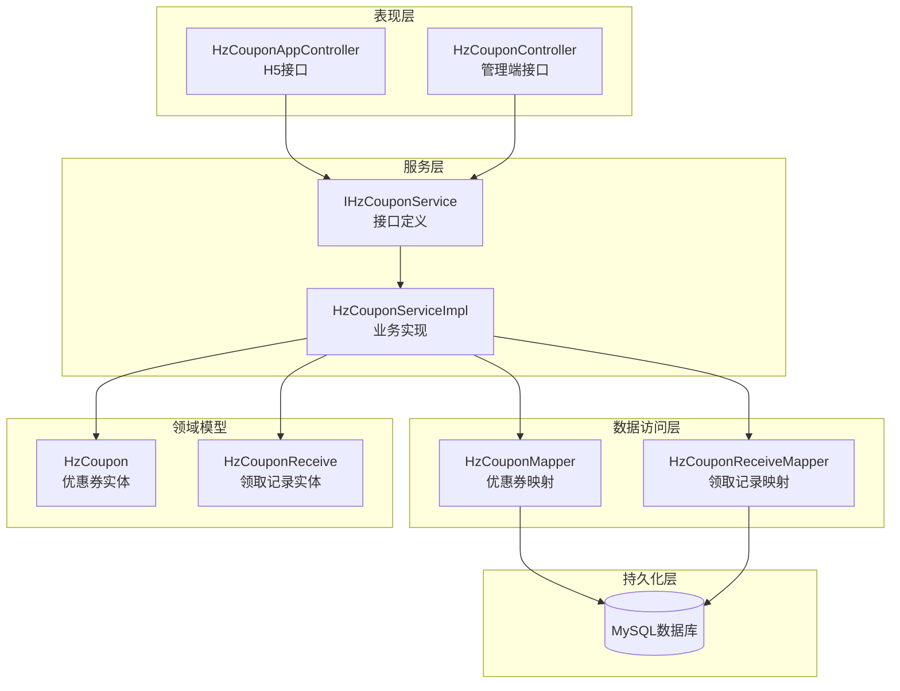
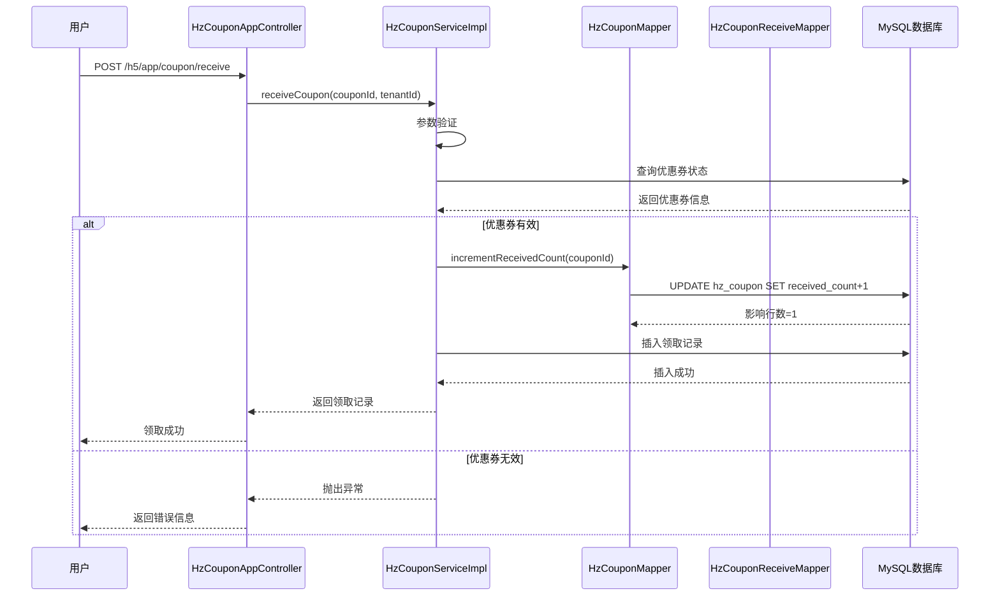
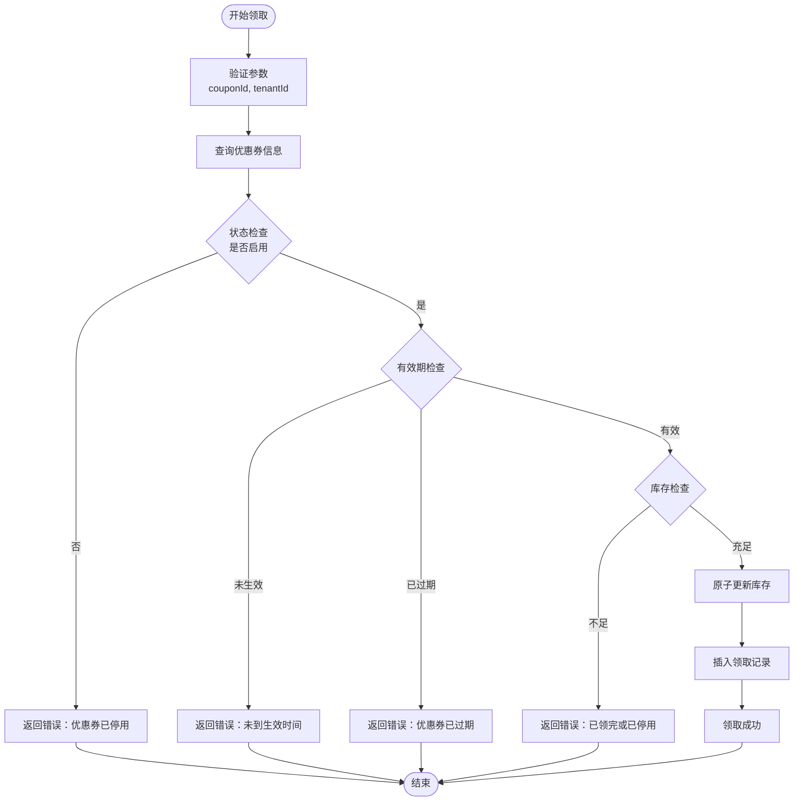
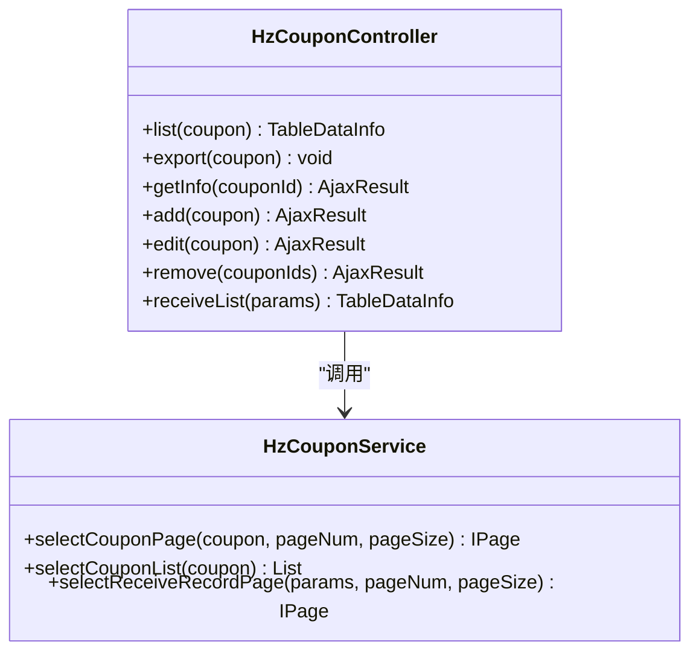
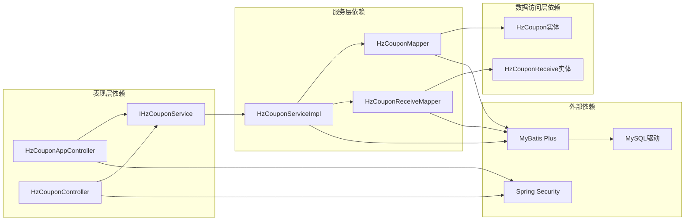

# 优惠券管理系统

<cite>
**本文档引用的文件**
- [HzCoupon.java](file://ruoyi-system/src/main/java/com/ruoyi/system/domain/HzCoupon.java)
- [HzCouponReceive.java](file://ruoyi-system/src/main/java/com/ruoyi/system/domain/HzCouponReceive.java)
- [IHzCouponService.java](file://ruoyi-system/src/main/java/com/ruoyi/system/service/IHzCouponService.java)
- [HzCouponServiceImpl.java](file://ruoyi-system/src/main/java/com/ruoyi/system/service/impl/HzCouponServiceImpl.java)
- [HzCouponMapper.java](file://ruoyi-system/src/main/java/com/ruoyi/system/mapper/HzCouponMapper.java)
- [HzCouponReceiveMapper.java](file://ruoyi-system/src/main/java/com/ruoyi/system/mapper/HzCouponReceiveMapper.java)
- [HzCouponController.java](file://ruoyi-admin/src/main/java/com/ruoyi/web/controller/system/HzCouponController.java)
- [HzCouponAppController.java](file://ruoyi-admin/src/main/java/com/ruoyi/web/controller/h5/HzCouponAppController.java)
- [coupon.js](file://uniapp-h5/api/coupon.js)
</cite>

## 目录
1. [简介](#简介)
2. [项目结构](#项目结构)
3. [核心组件](#核心组件)
4. [架构概览](#架构概览)
5. [详细组件分析](#详细组件分析)
6. [依赖关系分析](#依赖关系分析)
7. [性能考虑](#性能考虑)
8. [故障排除指南](#故障排除指南)
9. [结论](#结论)

## 简介

优惠券管理系统是一个基于RuoYi框架构建的企业级优惠券管理解决方案。该系统支持多种优惠券类型（满减、折扣、抵扣），提供完整的优惠券生命周期管理，包括创建、发放、使用和统计分析等功能。

系统采用前后端分离架构，后端使用Spring Boot + MyBatis Plus技术栈，前端使用Vue.js和UniApp框架。支持管理端和H5移动端两种使用场景，为租户用户提供便捷的优惠券领取和使用体验。

## 项目结构

优惠券管理系统采用标准的Maven多模块项目结构，主要包含以下核心模块：

**图表来源**
- [HzCoupon.java:1-145](file://ruoyi-system/src/main/java/com/ruoyi/system/domain/HzCoupon.java#L1-L145)
- [HzCouponController.java:1-118](file://ruoyi-admin/src/main/java/com/ruoyi/web/controller/system/HzCouponController.java#L1-L118)

**章节来源**
- [HzCoupon.java:1-145](file://ruoyi-system/src/main/java/com/ruoyi/system/domain/HzCoupon.java#L1-L145)
- [HzCouponController.java:1-118](file://ruoyi-admin/src/main/java/com/ruoyi/web/controller/system/HzCouponController.java#L1-L118)

## 核心组件

### 数据模型设计

系统采用两个核心数据模型来管理优惠券及其领取记录：

#### 优惠券实体 (HzCoupon)
优惠券实体定义了优惠券的基本属性和业务规则，包括：
- 基本信息：名称、编码、类型、金额等
- 业务规则：最低消费金额、最高优惠金额、适用类型
- 有效期管理：生效日期、失效日期
- 库存控制：发行总量、已领取数量、已使用数量
- 状态管理：启用/停用状态、逻辑删除标志

#### 领取记录实体 (HzCouponReceive)
领取记录实体跟踪每个租户对优惠券的领取情况：
- 关联信息：优惠券ID、租户ID
- 领取状态：未使用、已使用、已过期
- 时间记录：领取时间、使用时间
- 订单关联：使用订单ID

**章节来源**
- [HzCoupon.java:1-145](file://ruoyi-system/src/main/java/com/ruoyi/system/domain/HzCoupon.java#L1-L145)
- [HzCouponReceive.java:1-83](file://ruoyi-system/src/main/java/com/ruoyi/system/domain/HzCouponReceive.java#L1-L83)

### 服务层架构

服务层采用接口+实现类的设计模式，提供统一的服务抽象：

**图表来源**
- [IHzCouponService.java:1-51](file://ruoyi-system/src/main/java/com/ruoyi/system/service/IHzCouponService.java#L1-L51)
- [HzCouponServiceImpl.java:1-298](file://ruoyi-system/src/main/java/com/ruoyi/system/service/impl/HzCouponServiceImpl.java#L1-L298)
- [HzCouponMapper.java:1-27](file://ruoyi-system/src/main/java/com/ruoyi/system/mapper/HzCouponMapper.java#L1-L27)
- [HzCouponReceiveMapper.java:1-14](file://ruoyi-system/src/main/java/com/ruoyi/system/mapper/HzCouponReceiveMapper.java#L1-L14)

**章节来源**
- [IHzCouponService.java:1-51](file://ruoyi-system/src/main/java/com/ruoyi/system/service/IHzCouponService.java#L1-L51)
- [HzCouponServiceImpl.java:1-298](file://ruoyi-system/src/main/java/com/ruoyi/system/service/impl/HzCouponServiceImpl.java#L1-L298)

## 架构概览

系统采用分层架构设计，确保各层职责清晰、耦合度低：

**图表来源**
- [HzCouponAppController.java:1-64](file://ruoyi-admin/src/main/java/com/ruoyi/web/controller/h5/HzCouponAppController.java#L1-L64)
- [HzCouponController.java:1-118](file://ruoyi-admin/src/main/java/com/ruoyi/web/controller/system/HzCouponController.java#L1-L118)
- [HzCouponServiceImpl.java:1-298](file://ruoyi-system/src/main/java/com/ruoyi/system/service/impl/HzCouponServiceImpl.java#L1-L298)

系统支持两种主要的业务流程：

1. **管理端流程**：管理员通过管理端界面进行优惠券的创建、编辑、删除和统计
2. **H5用户流程**：租户用户通过移动端应用领取和使用优惠券

## 详细组件分析

### H5优惠券领取流程

H5优惠券领取是系统的核心业务流程，采用原子操作确保并发安全：

**图表来源**
- [HzCouponAppController.java:44-62](file://ruoyi-admin/src/main/java/com/ruoyi/web/controller/h5/HzCouponAppController.java#L44-L62)
- [HzCouponServiceImpl.java:178-230](file://ruoyi-system/src/main/java/com/ruoyi/system/service/impl/HzCouponServiceImpl.java#L178-L230)
- [HzCouponMapper.java:15-25](file://ruoyi-system/src/main/java/com/ruoyi/system/mapper/HzCouponMapper.java#L15-L25)

#### 并发控制机制

系统采用双重机制确保优惠券领取的并发安全：

1. **原子更新**：通过SQL原子操作 `received_count = received_count + 1` 实现库存控制
2. **唯一约束**：通过数据库唯一键防止同一用户重复领取同一张优惠券

#### 业务规则验证

领取流程包含完整的业务规则验证：

**图表来源**
- [HzCouponServiceImpl.java:186-230](file://ruoyi-system/src/main/java/com/ruoyi/system/service/impl/HzCouponServiceImpl.java#L186-L230)

**章节来源**
- [HzCouponAppController.java:1-64](file://ruoyi-admin/src/main/java/com/ruoyi/web/controller/h5/HzCouponAppController.java#L1-L64)
- [HzCouponServiceImpl.java:178-230](file://ruoyi-system/src/main/java/com/ruoyi/system/service/impl/HzCouponServiceImpl.java#L178-L230)

### 管理端优惠券管理

管理端提供完整的优惠券生命周期管理功能：

#### 列表查询功能

管理端支持按条件筛选的分页查询：

**图表来源**
- [HzCouponController.java:34-116](file://ruoyi-admin/src/main/java/com/ruoyi/web/controller/system/HzCouponController.java#L34-L116)
- [IHzCouponService.java:18-49](file://ruoyi-system/src/main/java/com/ruoyi/system/service/IHzCouponService.java#L18-L49)

**章节来源**
- [HzCouponController.java:1-118](file://ruoyi-admin/src/main/java/com/ruoyi/web/controller/system/HzCouponController.java#L1-L118)

### 前端集成

系统提供完整的前端API集成：

#### H5前端API封装

前端通过统一的API模块调用后端接口：

| 接口名称 | 请求方法 | 路径 | 功能描述 |
|---------|---------|------|----------|
| 可领取列表 | GET | `/h5/app/coupon/available` | 获取可领取的优惠券列表 |
| 我的优惠券 | GET | `/h5/app/coupon/myList` | 获取用户已领取的优惠券 |
| 领取优惠券 | POST | `/h5/app/coupon/receive` | 领取指定优惠券 |

**章节来源**
- [coupon.js:1-26](file://uniapp-h5/api/coupon.js#L1-L26)

## 依赖关系分析

系统采用清晰的分层依赖关系，确保模块间的松耦合：

**图表来源**
- [HzCouponServiceImpl.java:1-298](file://ruoyi-system/src/main/java/com/ruoyi/system/service/impl/HzCouponServiceImpl.java#L1-L298)
- [HzCouponMapper.java:1-27](file://ruoyi-system/src/main/java/com/ruoyi/system/mapper/HzCouponMapper.java#L1-L27)

### 数据一致性保证

系统通过以下机制确保数据一致性：

1. **事务管理**：使用 `@Transactional` 注解确保业务操作的原子性
2. **并发控制**：原子UPDATE操作防止超卖现象
3. **唯一约束**：数据库唯一键防止重复领取
4. **状态检查**：严格的业务规则验证

**章节来源**
- [HzCouponServiceImpl.java:178-230](file://ruoyi-system/src/main/java/com/ruoyi/system/service/impl/HzCouponServiceImpl.java#L178-L230)

## 性能考虑

### 数据库优化策略

1. **索引设计**：在常用查询字段上建立适当索引
2. **分页查询**：使用MyBatis Plus分页插件优化大数据量查询
3. **批量操作**：支持批量查询和批量更新操作

### 缓存策略

系统具备良好的扩展性以支持缓存优化：
- 优惠券基本信息可缓存到Redis
- 用户领取状态可缓存减少数据库查询
- 统计数据定期刷新

### 并发处理

1. **原子操作**：使用数据库原子操作避免竞态条件
2. **乐观锁**：通过版本号控制并发更新
3. **队列处理**：高并发场景下可引入消息队列异步处理

## 故障排除指南

### 常见问题及解决方案

#### 领取失败问题

| 错误类型 | 可能原因 | 解决方案 |
|---------|---------|---------|
| 参数缺失 | couponId或tenantId为空 | 检查前端传参完整性 |
| 优惠券不存在 | 数据库中无此优惠券 | 验证优惠券ID正确性 |
| 已停用 | 优惠券状态为停用 | 检查优惠券状态 |
| 未到生效期 | 当前时间早于生效时间 | 等待生效时间到达 |
| 已过期 | 当前时间晚于失效时间 | 联系管理员处理 |
| 库存不足 | 已领取数量达到上限 | 提示用户稍后再试 |

#### 并发冲突问题

1. **重复领取**：检查数据库唯一键约束
2. **超卖现象**：确认原子UPDATE操作正常执行
3. **数据不一致**：检查事务边界设置

**章节来源**
- [HzCouponServiceImpl.java:186-230](file://ruoyi-system/src/main/java/com/ruoyi/system/service/impl/HzCouponServiceImpl.java#L186-L230)

### 日志监控

系统建议添加以下关键日志：
- 领取请求日志（包含用户ID、优惠券ID、结果）
- 并发冲突日志（重复领取、超卖尝试）
- 异常处理日志（参数错误、业务规则错误）

## 结论

优惠券管理系统是一个设计合理、架构清晰的企业级应用。系统通过以下特点实现了高效的优惠券管理：

1. **完整的业务覆盖**：支持多种优惠券类型和复杂的业务规则
2. **高并发安全保障**：采用原子操作和唯一约束确保数据一致性
3. **清晰的分层架构**：便于维护和扩展
4. **完善的权限控制**：区分管理端和H5用户的操作权限
5. **良好的用户体验**：简洁直观的操作界面和流畅的交互体验

系统在保证功能完整性的同时，充分考虑了性能和安全性，为企业提供了可靠的优惠券管理解决方案。通过合理的扩展设计，系统可以轻松支持更多的业务场景和更高的并发需求。