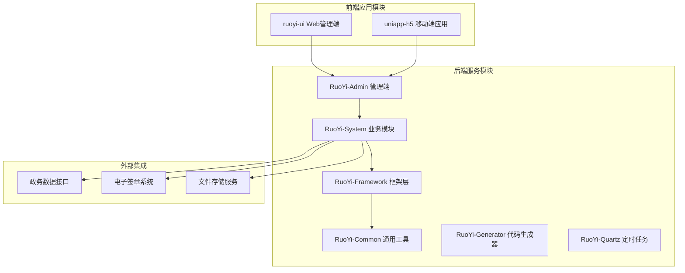
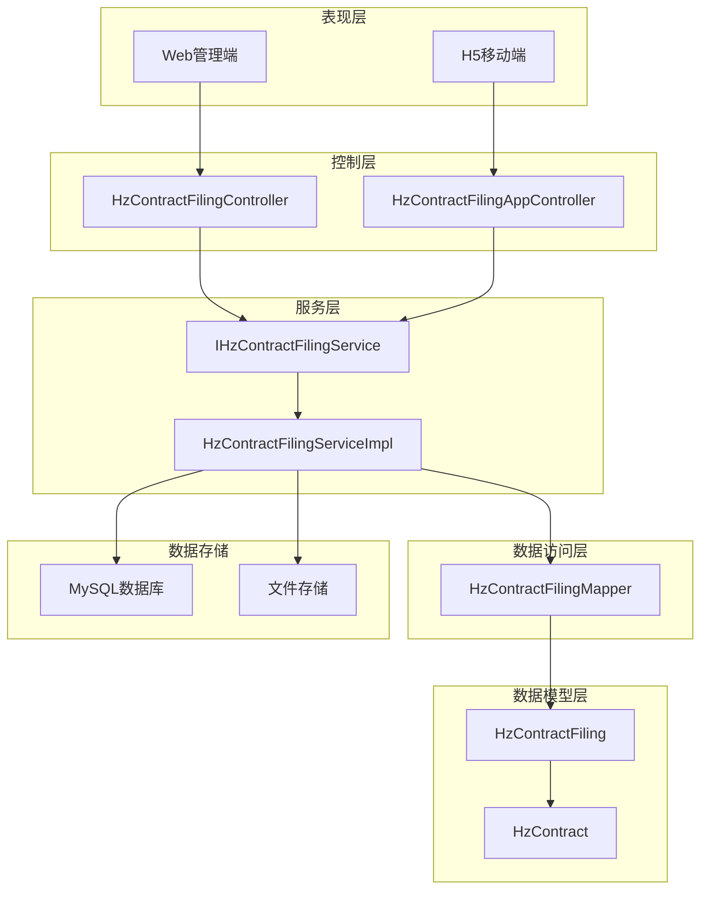
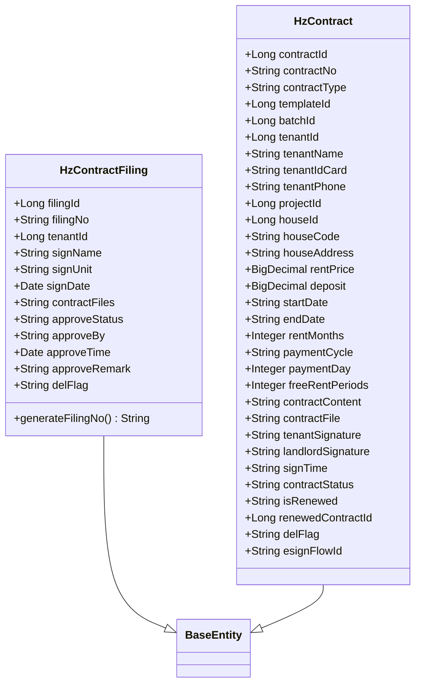
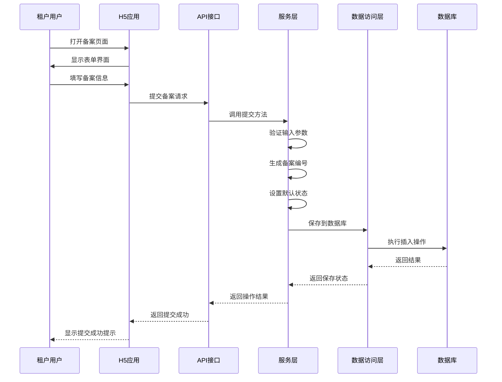
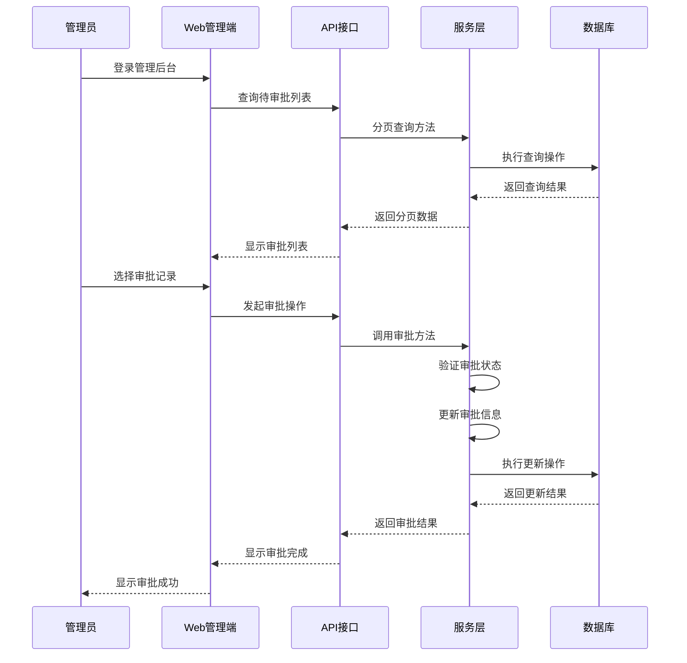
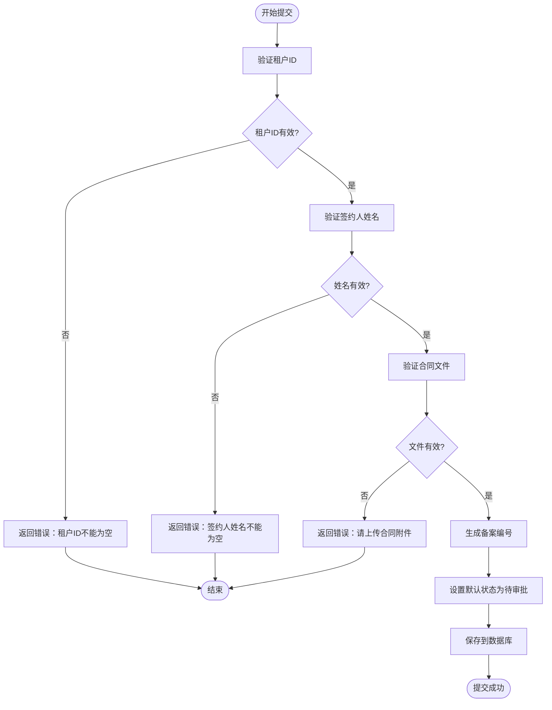
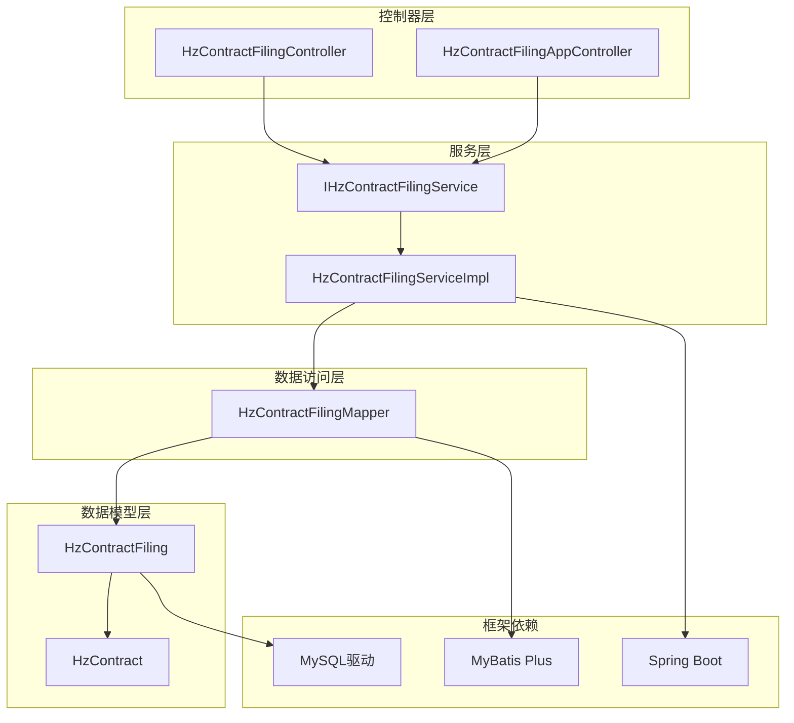

# 合同备案系统

<cite>
**本文档引用的文件**
- [HzContractFiling.java](file://ruoyi-system/src/main/java/com/ruoyi/system/domain/HzContractFiling.java)
- [HzContract.java](file://ruoyi-system/src/main/java/com/ruoyi/system/domain/HzContract.java)
- [IHzContractFilingService.java](file://ruoyi-system/src/main/java/com/ruoyi/system/service/IHzContractFilingService.java)
- [HzContractFilingServiceImpl.java](file://ruoyi-system/src/main/java/com/ruoyi/system/service/impl/HzContractFilingServiceImpl.java)
- [HzContractFilingMapper.java](file://ruoyi-system/src/main/java/com/ruoyi/system/mapper/HzContractFilingMapper.java)
- [HzContractFilingController.java](file://ruoyi-admin/src/main/java/com/ruoyi/web/controller/system/HzContractFilingController.java)
- [HzContractFilingAppController.java](file://ruoyi-admin/src/main/java/com/ruoyi/web/controller/h5/HzContractFilingAppController.java)
- [contract-filing-list.vue](file://uniapp-h5/subpkg/purchase/contract-filing-list.vue)
- [contract-filing-submit.vue](file://uniapp-h5/subpkg/purchase/contract-filing-submit.vue)
</cite>

## 目录
1. [简介](#简介)
2. [项目结构](#项目结构)
3. [核心组件](#核心组件)
4. [架构概览](#架构概览)
5. [详细组件分析](#详细组件分析)
6. [依赖关系分析](#依赖关系分析)
7. [性能考虑](#性能考虑)
8. [故障排除指南](#故障排除指南)
9. [结论](#结论)

## 简介

合同备案系统是一个基于RuoYi框架开发的综合性管理系统，主要服务于房屋租赁合同的备案管理。该系统实现了从租户在线提交合同备案申请，到管理端审批的完整业务流程，支持多角色权限管理和数据安全保障。

系统采用前后端分离架构，后端使用Spring Boot + MyBatis Plus技术栈，前端采用Vue.js和UniApp框架，支持Web端和移动端应用。系统设计遵循现代化企业级应用的标准，具备良好的扩展性和维护性。

## 项目结构

合同备案系统采用标准的Maven多模块项目结构，主要包含以下核心模块：

**图表来源**
- [HzContractFiling.java:1-114](file://ruoyi-system/src/main/java/com/ruoyi/system/domain/HzContractFiling.java#L1-L114)
- [HzContractFilingController.java:1-91](file://ruoyi-admin/src/main/java/com/ruoyi/web/controller/system/HzContractFilingController.java#L1-L91)

**章节来源**
- [HzContractFiling.java:1-114](file://ruoyi-system/src/main/java/com/ruoyi/system/domain/HzContractFiling.java#L1-L114)
- [HzContractFilingController.java:1-91](file://ruoyi-admin/src/main/java/com/ruoyi/web/controller/system/HzContractFilingController.java#L1-L91)

## 核心组件

### 数据模型层

系统的核心数据模型围绕合同备案业务展开，主要包括以下关键实体：

#### 合同备案实体 (HzContractFiling)
合同备案实体是系统的核心数据模型，负责存储租户提交的合同备案信息。该实体继承自基础实体类，具备完整的审计字段支持。

#### 合同实体 (HzContract)
合同实体定义了完整的租赁合同信息，包括租户基本信息、房源信息、租金条款等关键业务字段。

### 服务层组件

#### 服务接口 (IHzContractFilingService)
定义了合同备案业务的核心接口规范，包括分页查询、列表导出、审批操作等功能方法。

#### 服务实现 (HzContractFilingServiceImpl)
提供了合同备案业务的具体实现逻辑，包括数据验证、业务规则处理、状态管理等核心功能。

### 控制器层

#### 管理端控制器 (HzContractFilingController)
负责处理管理端的合同备案业务请求，提供完整的CRUD操作和审批功能。

#### H5端控制器 (HzContractFilingAppController)
专门为移动端应用提供API接口，支持租户在线提交备案申请和查看个人备案记录。

**章节来源**
- [IHzContractFilingService.java:1-52](file://ruoyi-system/src/main/java/com/ruoyi/system/service/IHzContractFilingService.java#L1-L52)
- [HzContractFilingServiceImpl.java:1-152](file://ruoyi-system/src/main/java/com/ruoyi/system/service/impl/HzContractFilingServiceImpl.java#L1-L152)
- [HzContractFilingController.java:1-91](file://ruoyi-admin/src/main/java/com/ruoyi/web/controller/system/HzContractFilingController.java#L1-L91)

## 架构概览

系统采用分层架构设计，确保各层职责清晰、耦合度低：

**图表来源**
- [HzContractFilingController.java:28-30](file://ruoyi-admin/src/main/java/com/ruoyi/web/controller/system/HzContractFilingController.java#L28-L30)
- [HzContractFilingAppController.java:19-21](file://ruoyi-admin/src/main/java/com/ruoyi/web/controller/h5/HzContractFilingAppController.java#L19-L21)
- [HzContractFilingServiceImpl.java:27-30](file://ruoyi-system/src/main/java/com/ruoyi/system/service/impl/HzContractFilingServiceImpl.java#L27-L30)

系统架构具有以下特点：

1. **分层清晰**：表现层、控制层、服务层、数据访问层职责明确
2. **前后端分离**：Web端和移动端分别提供独立的用户体验
3. **权限控制**：基于角色的访问控制机制
4. **数据安全**：支持软删除和审计日志
5. **扩展性强**：模块化设计便于功能扩展

## 详细组件分析

### 合同备案实体分析

#### 数据模型设计

**图表来源**
- [HzContractFiling.java:17-114](file://ruoyi-system/src/main/java/com/ruoyi/system/domain/HzContractFiling.java#L17-L114)
- [HzContract.java:20-606](file://ruoyi-system/src/main/java/com/ruoyi/system/domain/HzContract.java#L20-L606)

#### 字段设计分析

系统中的关键字段设计体现了业务需求和技术考量：

**审批状态字段设计**：
- 0：待审批（初始状态）
- 1：已通过（审批通过）
- 2：已驳回（审批拒绝）

**软删除机制**：
系统采用`delFlag`字段实现软删除，避免物理删除造成的数据丢失风险。

**文件存储策略**：
合同文件采用逗号分隔的URL格式存储，支持多文件上传场景。

**章节来源**
- [HzContractFiling.java:55-76](file://ruoyi-system/src/main/java/com/ruoyi/system/domain/HzContractFiling.java#L55-L76)
- [HzContractFiling.java:51-53](file://ruoyi-system/src/main/java/com/ruoyi/system/domain/HzContractFiling.java#L51-L53)

### 业务流程分析

#### 租户提交备案流程

**图表来源**
- [HzContractFilingAppController.java:52-57](file://ruoyi-admin/src/main/java/com/ruoyi/web/controller/h5/HzContractFilingAppController.java#L52-L57)
- [HzContractFilingServiceImpl.java:52-71](file://ruoyi-system/src/main/java/com/ruoyi/system/service/impl/HzContractFilingServiceImpl.java#L52-L71)

#### 管理端审批流程

**图表来源**
- [HzContractFilingController.java:71-81](file://ruoyi-admin/src/main/java/com/ruoyi/web/controller/system/HzContractFilingController.java#L71-L81)
- [HzContractFilingServiceImpl.java:74-106](file://ruoyi-system/src/main/java/com/ruoyi/system/service/impl/HzContractFilingServiceImpl.java#L74-L106)

#### 数据验证流程

**图表来源**
- [HzContractFilingServiceImpl.java:52-71](file://ruoyi-system/src/main/java/com/ruoyi/system/service/impl/HzContractFilingServiceImpl.java#L52-L71)

**章节来源**
- [HzContractFilingAppController.java:26-57](file://ruoyi-admin/src/main/java/com/ruoyi/web/controller/h5/HzContractFilingAppController.java#L26-L57)
- [HzContractFilingController.java:67-81](file://ruoyi-admin/src/main/java/com/ruoyi/web/controller/system/HzContractFilingController.java#L67-L81)

### 前端组件分析

#### 移动端列表页面

移动端列表页面提供了租户查看个人备案记录的功能，具有以下特性：

**状态筛选功能**：
- 全部：显示所有备案记录
- 待审批：显示待审核的记录
- 已通过：显示审批通过的记录
- 已驳回：显示被驳回的记录

**交互设计**：
- 支持下拉刷新加载更多数据
- 点击卡片跳转到详情页面
- 底部固定提交按钮

#### 提交页面设计

提交页面采用表单形式收集租户的备案信息：

**必填字段验证**：
- 签约人姓名：必填，长度限制
- 签约单位：必填，长度限制  
- 合同签订日期：必填，日期选择器
- 合同附件：必填，支持多文件上传

**文件上传机制**：
- 支持最多5个文件上传
- 预览已上传文件
- 删除不需要的文件
- 上传进度提示

**章节来源**
- [contract-filing-list.vue:1-112](file://uniapp-h5/subpkg/purchase/contract-filing-list.vue#L1-L112)
- [contract-filing-submit.vue:1-140](file://uniapp-h5/subpkg/purchase/contract-filing-submit.vue#L1-L140)

## 依赖关系分析

系统采用模块化设计，各组件之间的依赖关系清晰明确：

**图表来源**
- [HzContractFilingController.java:32-33](file://ruoyi-admin/src/main/java/com/ruoyi/web/controller/system/HzContractFilingController.java#L32-L33)
- [HzContractFilingAppController.java:23-24](file://ruoyi-admin/src/main/java/com/ruoyi/web/controller/h5/HzContractFilingAppController.java#L23-L24)
- [HzContractFilingServiceImpl.java:12-13](file://ruoyi-system/src/main/java/com/ruoyi/system/service/impl/HzContractFilingServiceImpl.java#L12-L13)

### 关键依赖关系

1. **控制器依赖服务接口**：控制器只依赖抽象接口，便于测试和替换实现
2. **服务实现依赖数据访问层**：服务层通过Mapper接口访问数据库
3. **数据访问层依赖MyBatis Plus**：简化数据库操作代码
4. **实体类依赖注解框架**：使用JPA注解进行ORM映射

**章节来源**
- [IHzContractFilingService.java:14](file://ruoyi-system/src/main/java/com/ruoyi/system/service/IHzContractFilingService.java#L14)
- [HzContractFilingMapper.java:11](file://ruoyi-system/src/main/java/com/ruoyi/system/mapper/HzContractFilingMapper.java#L11)

## 性能考虑

### 数据库优化

系统在数据库层面采用了多项优化措施：

**索引设计**：
- 备案编号建立唯一索引，确保数据唯一性
- 租户ID建立普通索引，优化查询性能
- 审批状态建立索引，支持快速筛选
- 创建时间建立索引，优化排序查询

**查询优化**：
- 使用分页查询避免大量数据传输
- 条件查询使用合适的过滤条件
- 列表查询只选择必要字段

### 缓存策略

系统具备良好的缓存扩展能力：

**适合缓存的场景**：
- 常用的配置数据
- 不经常变化的字典数据
- 频繁访问的静态资源

**缓存实现建议**：
- 使用Redis作为分布式缓存
- 实现读写分离策略
- 设置合理的过期时间

### 并发控制

系统在并发处理方面具备以下特性：

**乐观锁机制**：通过版本号或时间戳实现并发控制
**事务管理**：保证数据一致性
**线程安全**：服务层方法设计为无状态

## 故障排除指南

### 常见问题及解决方案

#### 提交备案失败

**问题现象**：租户提交备案时出现错误提示

**可能原因**：
1. 必填字段未填写完整
2. 文件上传失败
3. 网络连接异常
4. 服务器内部错误

**解决步骤**：
1. 检查网络连接是否正常
2. 确认所有必填字段都已填写
3. 验证文件格式和大小限制
4. 查看浏览器控制台错误信息
5. 联系技术支持团队

#### 审批操作异常

**问题现象**：管理端无法进行审批操作

**可能原因**：
1. 审批状态已变更
2. 权限不足
3. 数据库连接异常
4. 参数传递错误

**解决步骤**：
1. 刷新页面确认最新状态
2. 检查用户权限配置
3. 查看系统日志
4. 重新登录系统
5. 联系系统管理员

#### 数据查询问题

**问题现象**：查询结果不完整或显示异常

**可能原因**：
1. 分页参数设置错误
2. 查询条件过于严格
3. 数据库连接池耗尽
4. 缓存数据过期

**解决步骤**：
1. 检查分页参数范围
2. 调整查询条件
3. 清除浏览器缓存
4. 重启应用服务
5. 检查数据库连接状态

### 日志分析

系统提供了完善的日志记录机制：

**日志级别**：
- DEBUG：详细的操作信息
- INFO：一般业务信息
- WARN：警告信息
- ERROR：错误信息

**日志位置**：
- 应用日志：`logs/ghz.log`
- 访问日志：`logs/access.log`
- 错误日志：`logs/error.log`

**章节来源**
- [HzContractFilingServiceImpl.java:54-65](file://ruoyi-system/src/main/java/com/ruoyi/system/service/impl/HzContractFilingServiceImpl.java#L54-L65)
- [HzContractFilingServiceImpl.java:76-96](file://ruoyi-system/src/main/java/com/ruoyi/system/service/impl/HzContractFilingServiceImpl.java#L76-L96)

## 结论

合同备案系统是一个设计合理、架构清晰的企业级应用系统。系统通过模块化的架构设计，实现了租户在线备案和管理端审批的完整业务流程。

### 系统优势

1. **架构设计合理**：采用分层架构，职责分离明确
2. **功能完整**：覆盖了合同备案的全生命周期管理
3. **用户体验良好**：前后端分离，支持多终端访问
4. **安全性高**：具备完善的权限控制和数据保护机制
5. **扩展性强**：模块化设计便于功能扩展和维护

### 技术亮点

1. **前后端分离**：采用现代化的开发模式
2. **权限控制**：基于角色的细粒度权限管理
3. **数据安全**：软删除和审计日志机制
4. **性能优化**：合理的数据库设计和查询优化
5. **错误处理**：完善的异常处理和日志记录

### 改进建议

1. **监控告警**：增加系统监控和告警机制
2. **缓存优化**：引入Redis缓存提升性能
3. **异步处理**：对于耗时操作采用异步处理
4. **测试覆盖**：增加单元测试和集成测试覆盖率
5. **文档完善**：补充API文档和开发指南

该系统为企业提供了可靠的合同备案管理解决方案，具备良好的可维护性和扩展性，能够满足未来业务发展的需要。