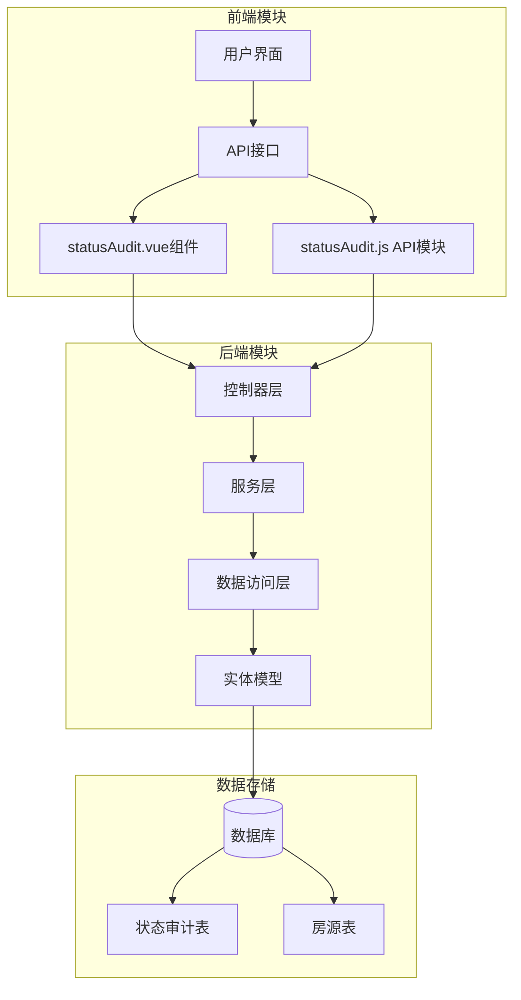
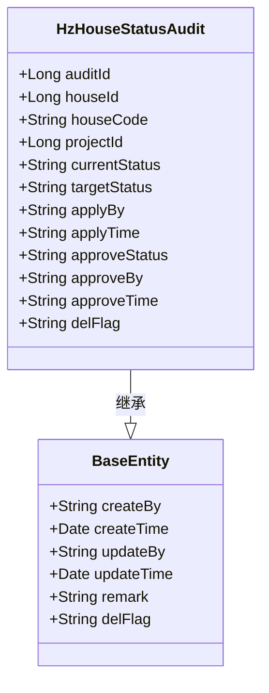
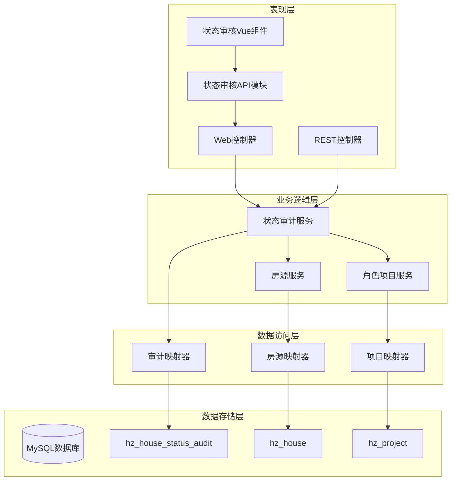
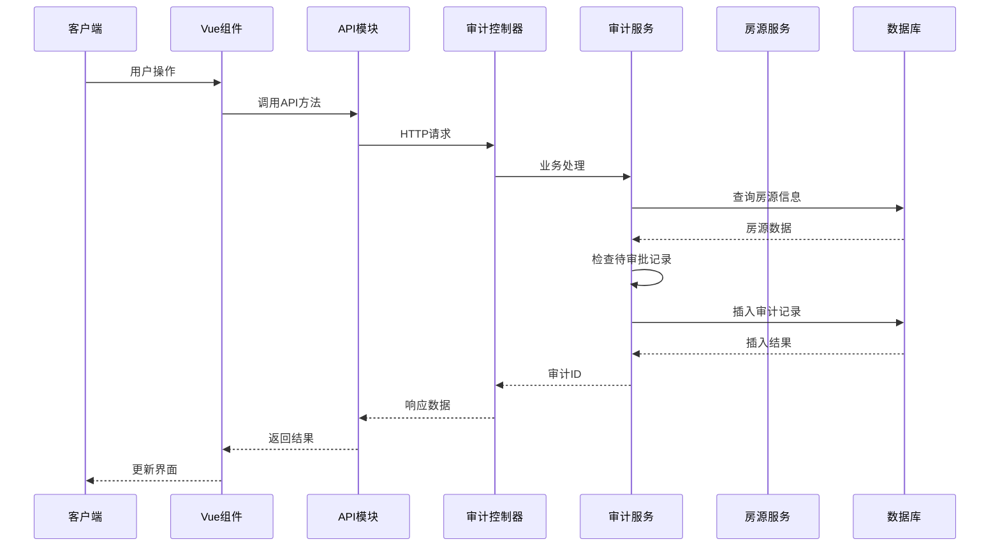
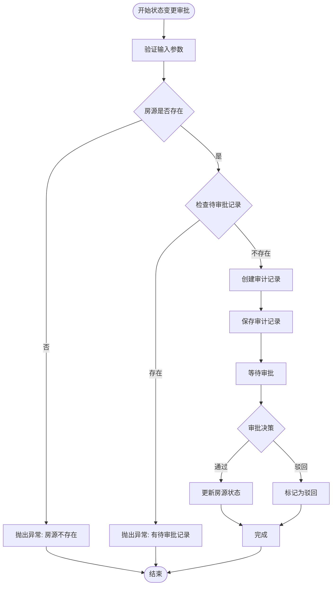
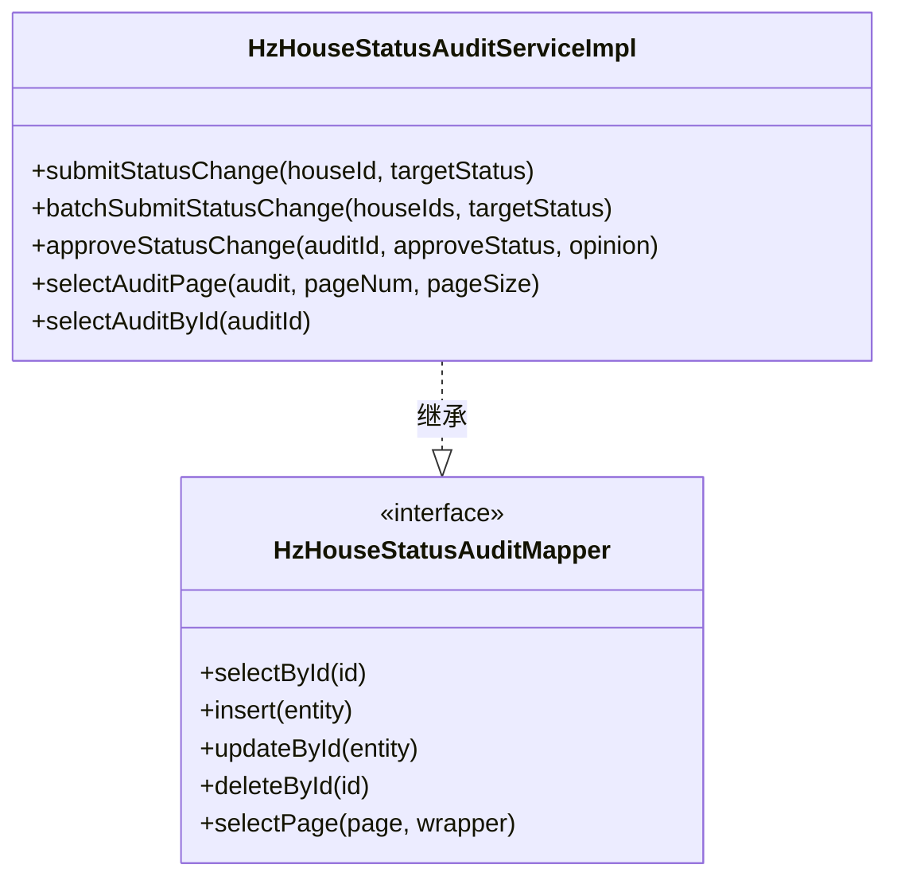
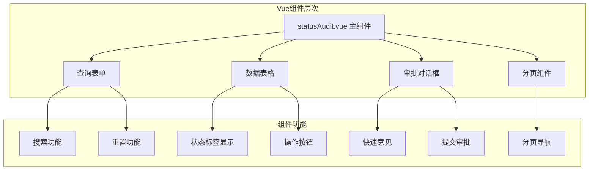
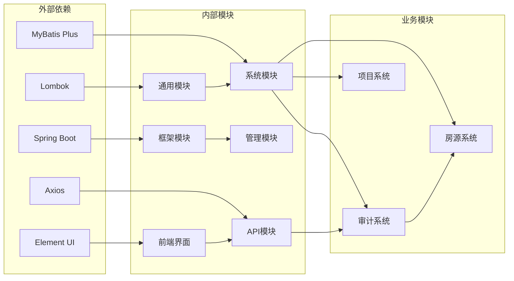

# 房屋状态审计系统

<cite>
**本文档引用的文件**
- [HzHouseStatusAudit.java](file://ruoyi-system/src/main/java/com/ruoyi/system/domain/HzHouseStatusAudit.java)
- [IHzHouseStatusAuditService.java](file://ruoyi-system/src/main/java/com/ruoyi/system/service/IHzHouseStatusAuditService.java)
- [HzHouseStatusAuditServiceImpl.java](file://ruoyi-system/src/main/java/com/ruoyi/system/service/impl/HzHouseStatusAuditServiceImpl.java)
- [HzHouseStatusAuditMapper.java](file://ruoyi-system/src/main/java/com/ruoyi/system/mapper/HzHouseStatusAuditMapper.java)
- [HzHouseStatusAuditController.java](file://ruoyi-admin/src/main/java/com/ruoyi/web/controller/system/HzHouseStatusAuditController.java)
- [HzHouseServiceImpl.java](file://ruoyi-system/src/main/java/com/ruoyi/system/service/impl/HzHouseServiceImpl.java)
- [IHzHouseService.java](file://ruoyi-system/src/main/java/com/ruoyi/system/service/IHzHouseService.java)
- [statusAudit.vue](file://ruoyi-ui/src/views/gangzhu/house/statusAudit.vue)
- [statusAudit.js](file://ruoyi-ui/src/api/gangzhu/statusAudit.js)
- [04-入住退租.md](file://docs/数据字典/04-入住退租.md)
- [01-房源管理.md](file://docs/数据字典/01-房源管理.md)
</cite>

## 更新摘要
**变更内容**
- 新增了基于Vue.js的全新状态审核前端界面
- 新增了statusAudit.vue组件提供直观的审批工作流管理界面
- 新增了statusAudit.js API模块提供前后端交互接口
- 更新了前端架构以支持现代化的Vue.js开发模式
- 增强了用户体验和操作便捷性

## 目录
1. [简介](#简介)
2. [项目结构](#项目结构)
3. [核心组件](#核心组件)
4. [架构概览](#架构概览)
5. [详细组件分析](#详细组件分析)
6. [前端界面设计](#前端界面设计)
7. [API接口设计](#api接口设计)
8. [依赖关系分析](#依赖关系分析)
9. [依赖注入优化](#依赖注入优化)
10. [性能考虑](#性能考虑)
11. [故障排除指南](#故障排除指南)
12. [结论](#结论)

## 简介

房屋状态审计系统是港好住管理系统中的一个关键模块，负责管理房源状态变更的审批流程。该系统确保所有房源状态变更都经过适当的审批程序，维护数据的准确性和合规性。

系统采用Spring Boot + MyBatis Plus框架构建，实现了完整的CRUD操作、权限控制、事务管理和数据验证功能。通过严格的审批流程，防止未经授权的房源状态变更，保障物业管理的规范性。

**更新** 新增了基于Vue.js的现代化前端界面，提供更加直观和高效的审批工作流管理体验。

## 项目结构

房屋状态审计系统主要分布在以下模块中：



**图表来源**
- [statusAudit.vue:1-203](file://ruoyi-ui/src/views/gangzhu/house/statusAudit.vue#L1-L203)
- [statusAudit.js:1-28](file://ruoyi-ui/src/api/gangzhu/statusAudit.js#L1-L28)
- [HzHouseStatusAuditController.java:1-75](file://ruoyi-admin/src/main/java/com/ruoyi/web/controller/system/HzHouseStatusAuditController.java#L1-L75)

**章节来源**
- [statusAudit.vue:1-203](file://ruoyi-ui/src/views/gangzhu/house/statusAudit.vue#L1-L203)
- [statusAudit.js:1-28](file://ruoyi-ui/src/api/gangzhu/statusAudit.js#L1-L28)
- [HzHouseStatusAuditController.java:1-75](file://ruoyi-admin/src/main/java/com/ruoyi/web/controller/system/HzHouseStatusAuditController.java#L1-L75)

## 核心组件

### 数据模型设计

系统的核心数据模型围绕`HzHouseStatusAudit`实体展开，该实体映射到数据库表`hz_house_status_audit`，包含完整的状态变更审计信息。



**图表来源**
- [HzHouseStatusAudit.java:1-109](file://ruoyi-system/src/main/java/com/ruoyi/system/domain/HzHouseStatusAudit.java#L1-L109)

### 服务接口定义

系统提供完整的服务接口，定义了状态变更审批的所有业务操作：

- **单个房源状态变更申请**：`submitStatusChange(houseId, targetStatus)`
- **批量状态变更申请**：`batchSubmitStatusChange(houseIds, targetStatus)`
- **审批状态变更**：`approveStatusChange(auditId, approveStatus, opinion)`
- **分页查询审批列表**：`selectAuditPage(audit, pageNum, pageSize)`
- **查询审批详情**：`selectAuditById(auditId)`

**章节来源**
- [IHzHouseStatusAuditService.java:1-61](file://ruoyi-system/src/main/java/com/ruoyi/system/service/IHzHouseStatusAuditService.java#L1-L61)

## 架构概览

房屋状态审计系统采用经典的三层架构模式，实现了清晰的职责分离和良好的可扩展性。



**图表来源**
- [statusAudit.vue:96-203](file://ruoyi-ui/src/views/gangzhu/house/statusAudit.vue#L96-L203)
- [statusAudit.js:1-28](file://ruoyi-ui/src/api/gangzhu/statusAudit.js#L1-L28)
- [HzHouseStatusAuditController.java:1-75](file://ruoyi-admin/src/main/java/com/ruoyi/web/controller/system/HzHouseStatusAuditController.java#L1-L75)

## 详细组件分析

### 控制器层实现

控制器层提供了完整的HTTP接口，支持多种状态变更操作：



**图表来源**
- [statusAudit.vue:147-199](file://ruoyi-ui/src/views/gangzhu/house/statusAudit.vue#L147-L199)
- [statusAudit.js:4-27](file://ruoyi-ui/src/api/gangzhu/statusAudit.js#L4-L27)
- [HzHouseStatusAuditController.java:29-74](file://ruoyi-admin/src/main/java/com/ruoyi/web/controller/system/HzHouseStatusAuditController.java#L29-L74)

### 服务层业务逻辑

服务层实现了复杂的业务规则和数据验证：



**图表来源**
- [HzHouseStatusAuditServiceImpl.java:44-116](file://ruoyi-system/src/main/java/com/ruoyi/system/service/impl/HzHouseStatusAuditServiceImpl.java#L44-L116)

### 数据访问层设计

数据访问层使用MyBatis Plus简化了数据库操作：



**图表来源**
- [HzHouseStatusAuditMapper.java:1-14](file://ruoyi-system/src/main/java/com/ruoyi/system/mapper/HzHouseStatusAuditMapper.java#L1-L14)
- [HzHouseStatusAuditServiceImpl.java:30-32](file://ruoyi-system/src/main/java/com/ruoyi/system/service/impl/HzHouseStatusAuditServiceImpl.java#L30-L32)

**章节来源**
- [HzHouseStatusAuditController.java:1-75](file://ruoyi-admin/src/main/java/com/ruoyi/web/controller/system/HzHouseStatusAuditController.java#L1-L75)
- [HzHouseStatusAuditServiceImpl.java:1-143](file://ruoyi-system/src/main/java/com/ruoyi/system/service/impl/HzHouseStatusAuditServiceImpl.java#L1-L143)

## 前端界面设计

### Vue.js组件架构

新增的状态审核前端界面采用Vue.js框架构建，提供了现代化的用户交互体验：



**图表来源**
- [statusAudit.vue:1-94](file://ruoyi-ui/src/views/gangzhu/house/statusAudit.vue#L1-L94)
- [statusAudit.vue:146-200](file://ruoyi-ui/src/views/gangzhu/house/statusAudit.vue#L146-L200)

### 界面特性

1. **直观的状态显示**：使用不同颜色的标签区分房源状态
2. **便捷的操作功能**：一键通过或驳回审批申请
3. **智能的权限控制**：基于角色的权限验证
4. **响应式布局**：适配不同屏幕尺寸
5. **快速意见模板**：提供预设的审批意见选项

**章节来源**
- [statusAudit.vue:1-203](file://ruoyi-ui/src/views/gangzhu/house/statusAudit.vue#L1-L203)

## API接口设计

### 前端API模块

新增的statusAudit.js API模块提供了完整的前后端交互接口：

```mermaid
graph LR
subgraph "API接口层次"
listStatusAudit[listStatusAudit 查询列表]
getStatusAudit[getStatusAudit 查询详情]
approveStatusAudit[approveStatusAudit 审批操作]
request[request HTTP请求封装]
end
subgraph "接口功能"
listStatusAudit --> GET[/system/house/statusAudit/list]
getStatusAudit --> GET[/system/house/statusAudit/{id}]
approveStatusAudit --> POST[/system/house/statusAudit/approve]
request --> HTTP[HTTP请求处理]
end
listStatusAudit --> request
getStatusAudit --> request
approveStatusAudit --> request
```

**图表来源**
- [statusAudit.js:1-28](file://ruoyi-ui/src/api/gangzhu/statusAudit.js#L1-L28)

### API接口规范

| 接口名称 | 方法 | URL | 功能描述 |
|---------|------|-----|----------|
| listStatusAudit | GET | `/system/house/statusAudit/list` | 查询房源状态审批列表 |
| getStatusAudit | GET | `/system/house/statusAudit/{auditId}` | 查询审批详情 |
| approveStatusAudit | POST | `/system/house/statusAudit/approve` | 审批操作（通过/驳回） |

**章节来源**
- [statusAudit.js:1-28](file://ruoyi-ui/src/api/gangzhu/statusAudit.js#L1-L28)

## 依赖关系分析

系统各组件之间的依赖关系清晰明确，遵循了依赖倒置原则：



**图表来源**
- [statusAudit.vue:97](file://ruoyi-ui/src/views/gangzhu/house/statusAudit.vue#L97)
- [statusAudit.js:1](file://ruoyi-ui/src/api/gangzhu/statusAudit.js#L1)

### 权限控制机制

系统实现了基于角色的权限控制，确保只有授权用户才能执行特定操作：

- **物业角色权限**：`gangzhu:house:statusChange` - 提交状态变更申请
- **管理方权限**：`gangzhu:house:statusApprove` - 审批状态变更
- **审计查看权限**：`gangzhu:house:statusAudit` - 查看审批列表

**章节来源**
- [HzHouseStatusAuditController.java:29-74](file://ruoyi-admin/src/main/java/com/ruoyi/web/controller/system/HzHouseStatusAuditController.java#L29-L74)

## 依赖注入优化

### 循环依赖处理优化

系统在依赖注入方面进行了重要优化，特别是在处理循环依赖时采用了@Lazy注解来改善启动性能和循环依赖处理。

#### @Lazy注解的应用

在`HzHouseStatusAuditServiceImpl`类中，houseService字段使用了@Lazy注解：

```java
@Autowired
@Lazy
private IHzHouseService houseService;
```

这种设计解决了以下问题：

1. **启动时循环依赖**：避免了服务启动时的循环依赖问题
2. **延迟初始化**：只有在实际使用时才进行依赖注入
3. **性能优化**：减少了启动时的Bean创建开销

#### 依赖注入最佳实践

```mermaid
graph TD
A[循环依赖场景] --> B{使用@Lazy注解}
B --> C[延迟初始化]
C --> D[避免启动时循环依赖]
D --> E[改善启动性能]
E --> F[运行时按需加载]
```

**图表来源**
- [HzHouseStatusAuditServiceImpl.java:37-42](file://ruoyi-system/src/main/java/com/ruoyi/system/service/impl/HzHouseStatusAuditServiceImpl.java#L37-L42)

### 依赖关系重构

系统中的循环依赖主要体现在以下两个服务之间：

```mermaid
graph LR
subgraph "循环依赖分析"
AuditService[HzHouseStatusAuditServiceImpl] <- --> HouseService[HzHouseServiceImpl]
AuditService -.-> HouseService
HouseService -.-> AuditService
end
subgraph "优化后的依赖关系"
AuditService --> HouseService
HouseService -.-> AuditService
end
```

**图表来源**
- [HzHouseStatusAuditServiceImpl.java:37-42](file://ruoyi-system/src/main/java/com/ruoyi/system/service/impl/HzHouseStatusAuditServiceImpl.java#L37-L42)
- [HzHouseServiceImpl.java:68-72](file://ruoyi-system/src/main/java/com/ruoyi/system/service/impl/HzHouseServiceImpl.java#L68-L72)

**章节来源**
- [HzHouseStatusAuditServiceImpl.java:37-42](file://ruoyi-system/src/main/java/com/ruoyi/system/service/impl/HzHouseStatusAuditServiceImpl.java#L37-L42)
- [HzHouseServiceImpl.java:68-72](file://ruoyi-system/src/main/java/com/ruoyi/system/service/impl/HzHouseServiceImpl.java#L68-L72)

## 性能考虑

### 数据库优化策略

1. **索引设计**：为常用查询字段建立适当索引
2. **分页查询**：使用MyBatis Plus分页插件优化大数据量查询
3. **事务管理**：合理使用事务注解确保数据一致性
4. **缓存策略**：结合Redis实现热点数据缓存

### 前端性能优化

1. **组件懒加载**：Vue组件按需加载减少初始包体积
2. **虚拟滚动**：大量数据时使用虚拟滚动提升渲染性能
3. **请求缓存**：API请求结果缓存减少重复请求
4. **图片优化**：资源文件压缩和懒加载

### 并发控制

系统通过以下机制避免并发问题：
- 使用数据库锁防止重复提交
- 实现乐观锁机制处理并发更新
- 合理设置事务隔离级别

### 启动性能优化

依赖注入优化显著改善了系统的启动性能：

- **减少启动时间**：避免了循环依赖导致的启动阻塞
- **内存使用优化**：延迟初始化减少了内存占用
- **Bean生命周期管理**：更合理的Bean创建顺序

## 故障排除指南

### 常见问题及解决方案

| 问题类型 | 症状描述 | 可能原因 | 解决方案 |
|---------|---------|---------|---------|
| 审批失败 | 提交审批时报错 | 房源不存在或有待审批记录 | 检查房源状态和审批历史 |
| 权限错误 | 无法访问审批功能 | 缺少相应权限 | 检查用户角色配置 |
| 数据不一致 | 审批通过但房源状态未更新 | 事务回滚或异常中断 | 检查日志和数据库状态 |
| 前端显示异常 | 审批列表无法加载 | API接口调用失败 | 检查网络连接和接口状态 |
| 性能问题 | 查询响应缓慢 | 缺少索引或查询条件不当 | 优化SQL查询和添加索引 |
| 启动失败 | 应用启动时出现循环依赖错误 | Bean创建顺序问题 | 检查@Lazy注解使用 |

### 日志监控

系统提供了详细的日志记录：
- 审计操作日志
- 异常错误日志  
- 性能监控日志
- 前端错误日志

**章节来源**
- [HzHouseStatusAuditServiceImpl.java:108-116](file://ruoyi-system/src/main/java/com/ruoyi/system/service/impl/HzHouseStatusAuditServiceImpl.java#L108-L116)

## 结论

房屋状态审计系统是一个设计合理、实现完善的业务系统。通过严格的审批流程和权限控制，确保了房源状态变更的合规性和准确性。系统采用现代化的技术栈，具有良好的可扩展性和维护性。

**主要优势包括**：
1. **完整的审批流程**：从申请到审批的全流程管控
2. **严格的权限控制**：基于角色的细粒度权限管理
3. **完善的异常处理**：全面的错误处理和日志记录
4. **良好的性能表现**：优化的数据访问和查询机制
5. **现代化的前端界面**：基于Vue.js的直观用户界面
6. **先进的依赖注入优化**：通过@Lazy注解改善循环依赖处理和启动性能

**技术亮点**：
- 采用@Lazy注解解决循环依赖问题
- 实现延迟初始化提升启动性能
- 完善的事务管理和并发控制
- 清晰的职责分离和模块化设计
- 基于Vue.js的现代化前端架构

**更新亮点**：
- 新增statusAudit.vue组件提供直观的审批界面
- 新增statusAudit.js API模块实现前后端分离
- 增强的用户体验和操作便捷性
- 更好的响应式设计和移动端适配

该系统为港好住管理提供了坚实的技术基础，能够有效支撑业务发展和管理需求。依赖注入优化的引入进一步提升了系统的稳定性和性能表现，而新增的Vue.js前端界面则为用户提供了更加现代化和高效的操作体验。这些改进为未来的功能扩展奠定了良好的技术基础。