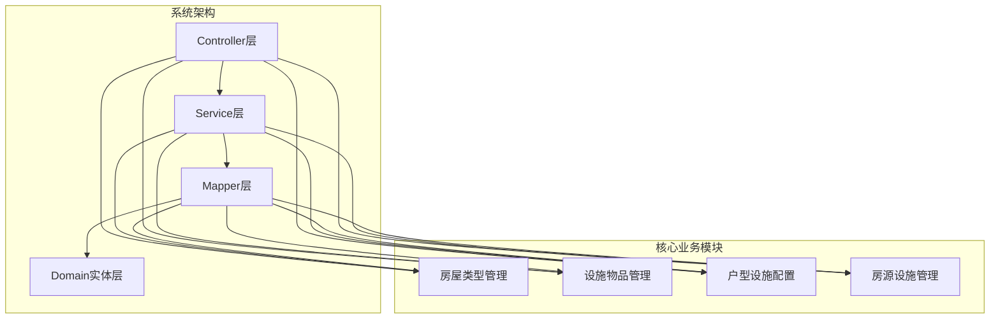
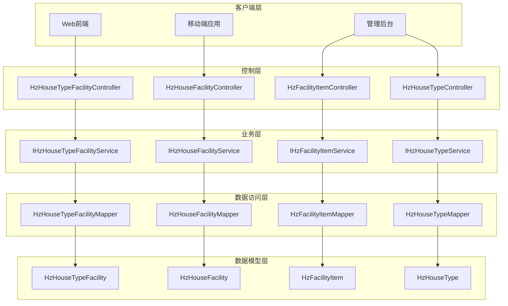
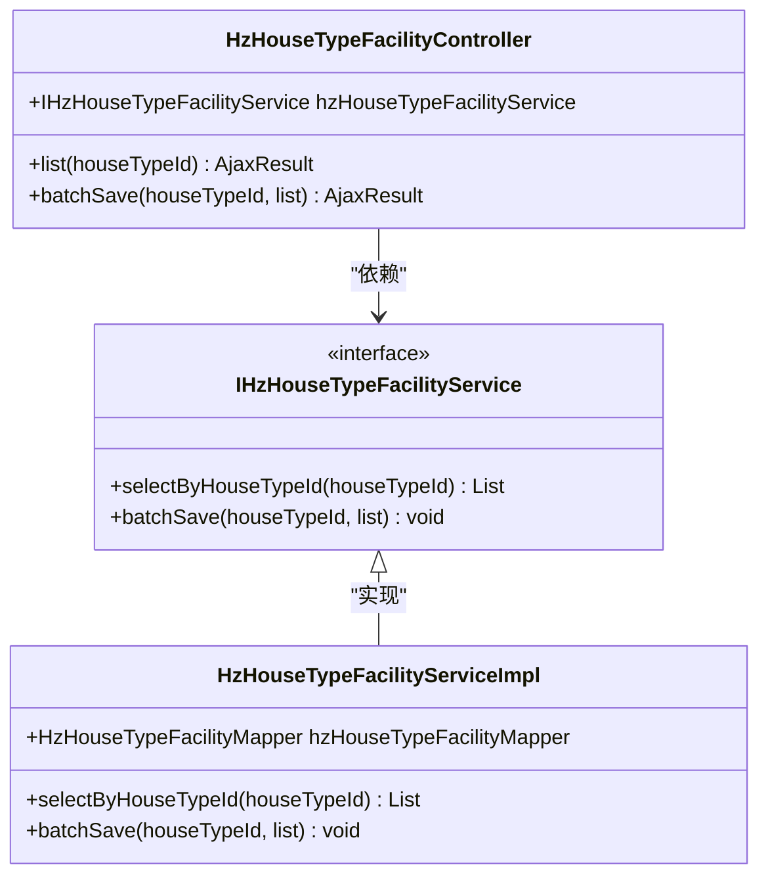
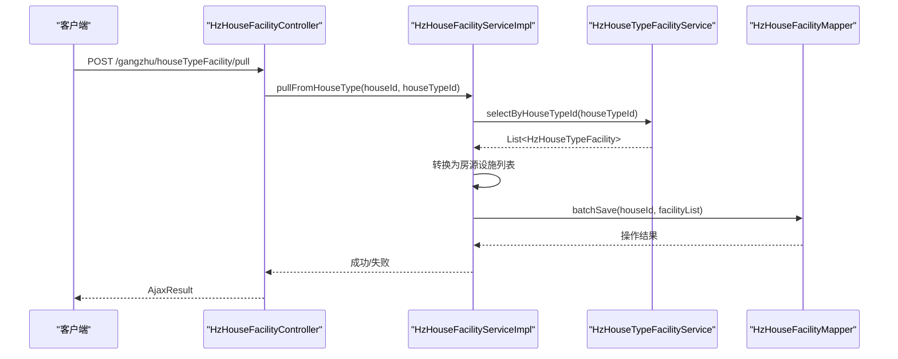
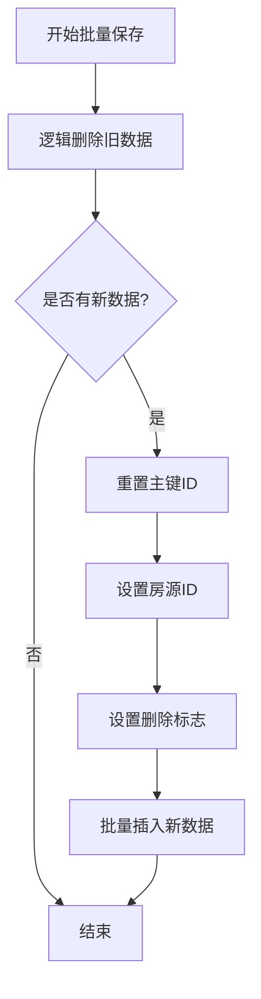
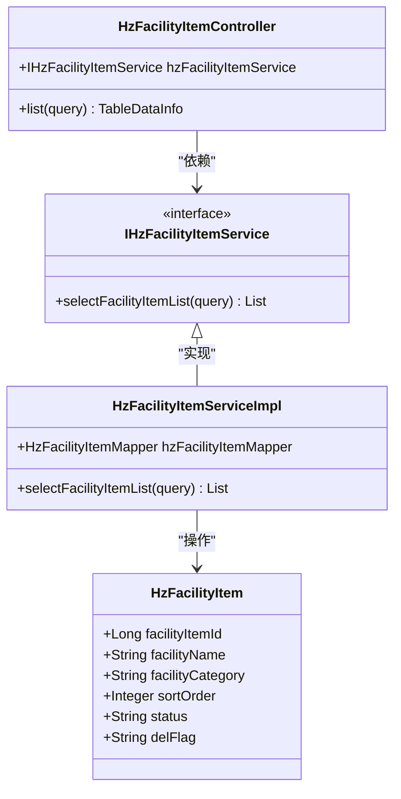
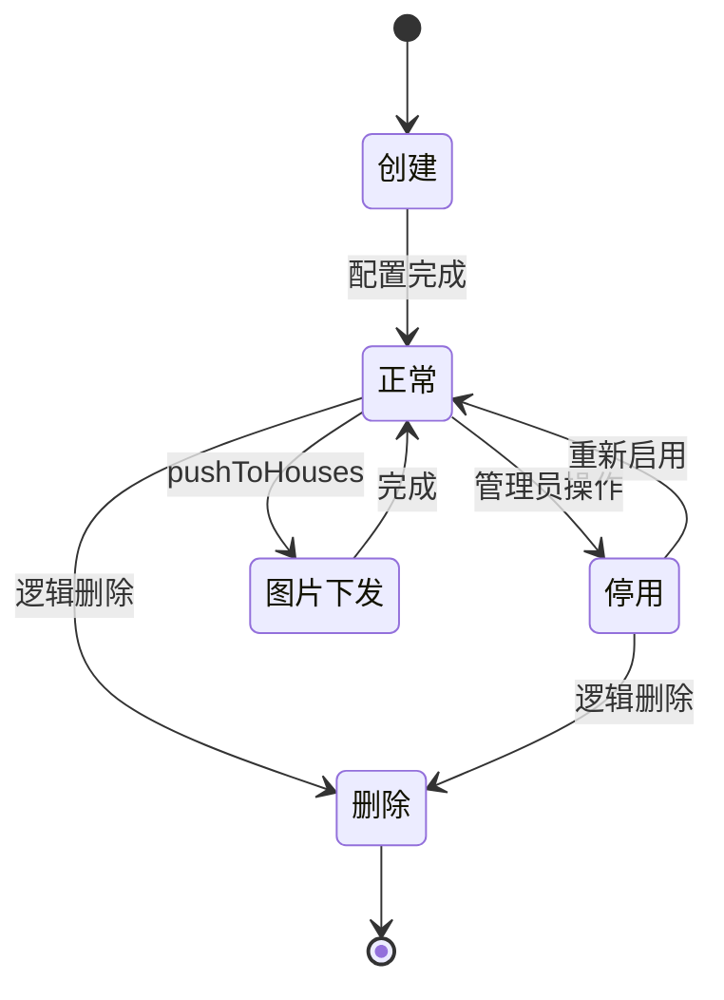
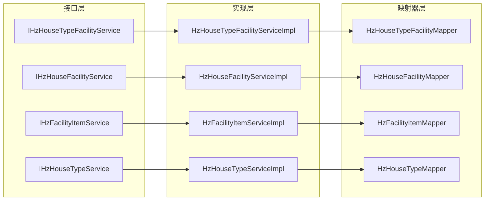
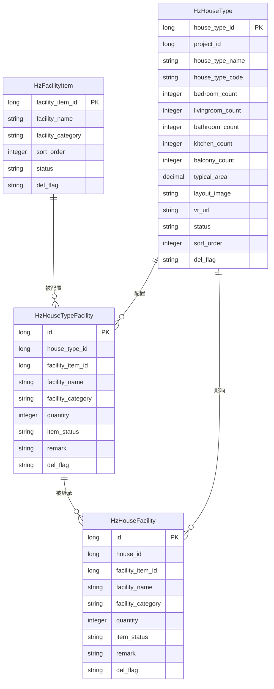

# 房屋类型设施管理

<cite>
**本文档引用的文件**
- [HzHouseTypeFacilityController.java](file://ruoyi-system/src/main/java/com/ruoyi/system/controller/HzHouseTypeFacilityController.java)
- [HzHouseFacilityController.java](file://ruoyi-system/src/main/java/com/ruoyi/system/controller/HzHouseFacilityController.java)
- [HzFacilityItemController.java](file://ruoyi-system/src/main/java/com/ruoyi/system/controller/HzFacilityItemController.java)
- [HzHouseTypeController.java](file://ruoyi-system/src/main/java/com/ruoyi/system/controller/HzHouseTypeController.java)
- [IHzHouseTypeFacilityService.java](file://ruoyi-system/src/main/java/com/ruoyi/system/service/IHzHouseTypeFacilityService.java)
- [HzHouseTypeFacilityServiceImpl.java](file://ruoyi-system/src/main/java/com/ruoyi/system/service/impl/HzHouseTypeFacilityServiceImpl.java)
- [IHzHouseFacilityService.java](file://ruoyi-system/src/main/java/com/ruoyi/system/service/IHzHouseFacilityService.java)
- [HzHouseFacilityServiceImpl.java](file://ruoyi-system/src/main/java/com/ruoyi/system/service/impl/HzHouseFacilityServiceImpl.java)
- [IHzFacilityItemService.java](file://ruoyi-system/src/main/java/com/ruoyi/system/service/IHzFacilityItemService.java)
- [HzFacilityItemServiceImpl.java](file://ruoyi-system/src/main/java/com/ruoyi/system/service/impl/HzFacilityItemServiceImpl.java)
- [HzHouseTypeFacility.java](file://ruoyi-system/src/main/java/com/ruoyi/system/domain/HzHouseTypeFacility.java)
- [HzHouseFacility.java](file://ruoyi-system/src/main/java/com/ruoyi/system/domain/HzHouseFacility.java)
- [HzFacilityItem.java](file://ruoyi-system/src/main/java/com/ruoyi/system/domain/HzFacilityItem.java)
- [HzHouseType.java](file://ruoyi-system/src/main/java/com/ruoyi/system/domain/HzHouseType.java)
- [HzHouseTypeFacilityMapper.java](file://ruoyi-system/src/main/java/com/ruoyi/system/mapper/HzHouseTypeFacilityMapper.java)
- [HzHouseFacilityMapper.java](file://ruoyi-system/src/main/java/com/ruoyi/system/mapper/HzHouseFacilityMapper.java)
- [HzFacilityItemMapper.java](file://ruoyi-system/src/main/java/com/ruoyi/system/mapper/HzFacilityItemMapper.java)
- [HzHouseTypeMapper.java](file://ruoyi-system/src/main/java/com/ruoyi/system/mapper/HzHouseTypeMapper.java)
</cite>

## 目录
1. [简介](#简介)
2. [项目结构](#项目结构)
3. [核心组件](#核心组件)
4. [架构概览](#架构概览)
5. [详细组件分析](#详细组件分析)
6. [依赖关系分析](#依赖关系分析)
7. [性能考虑](#性能考虑)
8. [故障排除指南](#故障排除指南)
9. [结论](#结论)

## 简介

房屋类型设施管理系统是一个基于Spring Boot和MyBatis-Plus的企业级管理系统，专门用于管理房屋类型与设施之间的关联关系。该系统实现了完整的CRUD功能，支持设施物品的分类管理、户型设施配置以及房源设施的动态维护。

系统采用经典的三层架构设计（Controller-Service-Mapper），通过注解驱动的方式实现数据持久化，支持逻辑删除、分页查询、权限控制等功能。整个系统围绕"设施物品-户型设施-房源设施"三层关系展开，形成了完整的设施管理体系。

## 项目结构

系统采用标准的Maven多模块结构，主要包含以下核心模块：

**图表来源**
- [HzHouseTypeFacilityController.java:1-37](file://ruoyi-system/src/main/java/com/ruoyi/system/controller/HzHouseTypeFacilityController.java#L1-L37)
- [HzHouseFacilityController.java:1-200](file://ruoyi-system/src/main/java/com/ruoyi/system/controller/HzHouseFacilityController.java#L1-L200)
- [HzFacilityItemController.java:1-39](file://ruoyi-system/src/main/java/com/ruoyi/system/controller/HzFacilityItemController.java#L1-L39)

**章节来源**
- [HzHouseTypeFacilityController.java:1-37](file://ruoyi-system/src/main/java/com/ruoyi/system/controller/HzHouseTypeFacilityController.java#L1-L37)
- [HzHouseFacilityController.java:1-200](file://ruoyi-system/src/main/java/com/ruoyi/system/controller/HzHouseFacilityController.java#L1-L200)
- [HzFacilityItemController.java:1-39](file://ruoyi-system/src/main/java/com/ruoyi/system/controller/HzFacilityItemController.java#L1-L39)

## 核心组件

系统的核心组件包括四个主要的业务模块，每个模块都有其特定的功能职责：

### 房屋类型模块
负责房屋类型的创建、管理和维护，支持户型图片的上传和VR链接的设置。

### 设施物品模块  
管理所有可用的设施物品，支持按分类筛选和状态管理。

### 户型设施配置模块
建立房屋类型与设施物品之间的关联关系，支持批量配置和管理。

### 房源设施模块
维护具体房源的设施配置，支持从户型批量拉取设施配置。

**章节来源**
- [HzHouseType.java:1-257](file://ruoyi-system/src/main/java/com/ruoyi/system/domain/HzHouseType.java#L1-L257)
- [HzFacilityItem.java:1-119](file://ruoyi-system/src/main/java/com/ruoyi/system/domain/HzFacilityItem.java#L1-L119)
- [HzHouseTypeFacility.java:1-165](file://ruoyi-system/src/main/java/com/ruoyi/system/domain/HzHouseTypeFacility.java#L1-L165)
- [HzHouseFacility.java:1-166](file://ruoyi-system/src/main/java/com/ruoyi/system/domain/HzHouseFacility.java#L1-L166)

## 架构概览

系统采用经典的MVC架构模式，通过RESTful API提供服务，整体架构如下：

**图表来源**
- [HzHouseTypeFacilityController.java:21-37](file://ruoyi-system/src/main/java/com/ruoyi/system/controller/HzHouseTypeFacilityController.java#L21-L37)
- [HzHouseFacilityController.java:1-200](file://ruoyi-system/src/main/java/com/ruoyi/system/controller/HzHouseFacilityController.java#L1-L200)
- [HzFacilityItemController.java:20-39](file://ruoyi-system/src/main/java/com/ruoyi/system/controller/HzFacilityItemController.java#L20-L39)
- [HzHouseTypeController.java:29-209](file://ruoyi-system/src/main/java/com/ruoyi/system/controller/HzHouseTypeController.java#L29-L209)

## 详细组件分析

### 户型设施配置控制器

户型设施配置控制器负责处理与户型设施相关的HTTP请求，提供了完整的CRUD操作接口。

**图表来源**
- [HzHouseTypeFacilityController.java:21-37](file://ruoyi-system/src/main/java/com/ruoyi/system/controller/HzHouseTypeFacilityController.java#L21-L37)
- [IHzHouseTypeFacilityService.java:14-31](file://ruoyi-system/src/main/java/com/ruoyi/system/service/IHzHouseTypeFacilityService.java#L14-L31)
- [HzHouseTypeFacilityServiceImpl.java:20-33](file://ruoyi-system/src/main/java/com/ruoyi/system/service/impl/HzHouseTypeFacilityServiceImpl.java#L20-L33)

#### 核心功能流程

系统提供了两种主要的设施配置方式：

1. **直接配置模式**：通过控制器直接管理户型设施
2. **批量配置模式**：通过服务层进行批量操作

**章节来源**
- [HzHouseTypeFacilityController.java:28-37](file://ruoyi-system/src/main/java/com/ruoyi/system/controller/HzHouseTypeFacilityController.java#L28-L37)
- [HzHouseTypeFacilityServiceImpl.java:25-33](file://ruoyi-system/src/main/java/com/ruoyi/system/service/impl/HzHouseTypeFacilityServiceImpl.java#L25-L33)

### 房源设施管理服务

房源设施管理服务提供了灵活的设施配置能力，支持从户型批量拉取设施配置。

**图表来源**
- [HzHouseFacilityController.java:1-200](file://ruoyi-system/src/main/java/com/ruoyi/system/controller/HzHouseFacilityController.java#L1-L200)
- [HzHouseFacilityServiceImpl.java:73-97](file://ruoyi-system/src/main/java/com/ruoyi/system/service/impl/HzHouseFacilityServiceImpl.java#L73-L97)

#### 批量保存机制

系统采用了"先删后插"的批量保存策略，确保数据的一致性和完整性：

**图表来源**
- [HzHouseFacilityServiceImpl.java:47-68](file://ruoyi-system/src/main/java/com/ruoyi/system/service/impl/HzHouseFacilityServiceImpl.java#L47-L68)

**章节来源**
- [HzHouseFacilityServiceImpl.java:46-97](file://ruoyi-system/src/main/java/com/ruoyi/system/service/impl/HzHouseFacilityServiceImpl.java#L46-L97)

### 设施物品管理

设施物品管理模块提供了设施物品的全生命周期管理，支持按分类和状态的灵活查询。

**图表来源**
- [HzFacilityItemController.java:20-39](file://ruoyi-system/src/main/java/com/ruoyi/system/controller/HzFacilityItemController.java#L20-L39)
- [IHzFacilityItemService.java:14-39](file://ruoyi-system/src/main/java/com/ruoyi/system/service/IHzFacilityItemService.java#L14-L39)
- [HzFacilityItemServiceImpl.java:20-37](file://ruoyi-system/src/main/java/com/ruoyi/system/service/impl/HzFacilityItemServiceImpl.java#L20-L37)

**章节来源**
- [HzFacilityItemController.java:27-37](file://ruoyi-system/src/main/java/com/ruoyi/system/controller/HzFacilityItemController.java#L27-L37)
- [HzFacilityItemServiceImpl.java:25-35](file://ruoyi-system/src/main/java/com/ruoyi/system/service/impl/HzFacilityItemServiceImpl.java#L25-L35)

### 房屋类型管理

房屋类型管理模块提供了完整的房屋类型生命周期管理，支持图片和VR资源的统一管理。

**图表来源**
- [HzHouseTypeController.java:198-207](file://ruoyi-system/src/main/java/com/ruoyi/system/controller/HzHouseTypeController.java#L198-L207)
- [HzHouseTypeServiceImpl.java:184-282](file://ruoyi-system/src/main/java/com/ruoyi/system/service/impl/HzHouseTypeServiceImpl.java#L184-L282)

**章节来源**
- [HzHouseTypeController.java:197-207](file://ruoyi-system/src/main/java/com/ruoyi/system/controller/HzHouseTypeController.java#L197-L207)
- [HzHouseTypeServiceImpl.java:184-282](file://ruoyi-system/src/main/java/com/ruoyi/system/service/impl/HzHouseTypeServiceImpl.java#L184-L282)

## 依赖关系分析

系统各组件之间的依赖关系清晰明确，遵循了依赖倒置原则：

**图表来源**
- [IHzHouseTypeFacilityService.java:14-31](file://ruoyi-system/src/main/java/com/ruoyi/system/service/IHzHouseTypeFacilityService.java#L14-L31)
- [IHzHouseFacilityService.java:14-39](file://ruoyi-system/src/main/java/com/ruoyi/system/service/IHzHouseFacilityService.java#L14-L39)
- [IHzFacilityItemService.java:14-39](file://ruoyi-system/src/main/java/com/ruoyi/system/service/IHzFacilityItemService.java#L14-L39)
- [IHzHouseTypeService.java](file://ruoyi-system/src/main/java/com/ruoyi/system/service/IHzHouseTypeService.java)

### 数据模型关系

系统中的数据模型遵循一对一和一对多的关系设计：

**图表来源**
- [HzFacilityItem.java:21-104](file://ruoyi-system/src/main/java/com/ruoyi/system/domain/HzFacilityItem.java#L21-L104)
- [HzHouseTypeFacility.java:21-165](file://ruoyi-system/src/main/java/com/ruoyi/system/domain/HzHouseTypeFacility.java#L21-L165)
- [HzHouseFacility.java:21-148](file://ruoyi-system/src/main/java/com/ruoyi/system/domain/HzHouseFacility.java#L21-L148)
- [HzHouseType.java:23-234](file://ruoyi-system/src/main/java/com/ruoyi/system/domain/HzHouseType.java#L23-L234)

**章节来源**
- [HzHouseTypeFacilityMapper.java:16-24](file://ruoyi-system/src/main/java/com/ruoyi/system/mapper/HzHouseTypeFacilityMapper.java#L16-L24)
- [HzHouseFacilityMapper.java:14-17](file://ruoyi-system/src/main/java/com/ruoyi/system/mapper/HzHouseFacilityMapper.java#L14-L17)
- [HzFacilityItemMapper.java:14-18](file://ruoyi-system/src/main/java/com/ruoyi/system/mapper/HzFacilityItemMapper.java#L14-L18)

## 性能考虑

系统在设计时充分考虑了性能优化，主要体现在以下几个方面：

### 查询优化
- 使用逻辑删除字段进行软删除，避免物理删除带来的性能损耗
- 通过索引优化常用查询条件（house_type_id、house_id、facility_item_id）
- 支持分页查询，避免大数据量查询导致的内存溢出

### 缓存策略
- 利用MyBatis-Plus的二级缓存机制
- 对频繁访问的设施物品进行缓存管理
- 户型图片和VR资源的静态资源缓存

### 批量操作
- 批量保存采用MyBatis的批量插入优化
- 逻辑删除采用批量更新操作
- 减少数据库连接次数和网络往返

## 故障排除指南

### 常见问题及解决方案

#### 1. 设施配置冲突
**问题描述**：当尝试配置重复的设施时出现异常
**解决方案**：检查设施物品的唯一性约束，确保设施名称和分类组合的唯一性

#### 2. 房源设施同步失败
**问题描述**：从户型拉取设施到房源时出现数据不一致
**解决方案**：确认户型设施配置是否正确，检查批量保存事务是否正常提交

#### 3. 图片下发不完整
**问题描述**：户型图片无法完整下发到所有房源
**解决方案**：验证户型图片类型的有效性，检查房源是否已存在同类型图片

**章节来源**
- [HzHouseTypeServiceImpl.java:184-282](file://ruoyi-system/src/main/java/com/ruoyi/system/service/impl/HzHouseTypeServiceImpl.java#L184-L282)
- [HzHouseFacilityServiceImpl.java:73-97](file://ruoyi-system/src/main/java/com/ruoyi/system/service/impl/HzHouseFacilityServiceImpl.java#L73-L97)

### 日志监控

系统提供了完善的日志记录机制，便于问题排查和性能监控：

- 操作日志：记录所有重要的业务操作
- 异常日志：捕获并记录系统异常信息
- 性能日志：监控关键操作的执行时间

## 结论

房屋类型设施管理系统是一个设计合理、功能完善的业务系统。通过清晰的分层架构、规范的代码组织和完善的业务逻辑，系统能够有效支撑房屋设施管理的各项需求。

系统的主要优势包括：
- **模块化设计**：四个核心模块职责明确，便于维护和扩展
- **事务管理**：关键业务操作采用事务保证数据一致性
- **权限控制**：基于注解的权限控制确保系统安全性
- **性能优化**：合理的查询策略和缓存机制提升系统性能

未来可以考虑的改进方向：
- 增加设施使用状态的实时监控
- 优化大批量数据处理的性能
- 扩展移动端的设施管理功能
- 增强报表统计和数据分析能力