# 批量租户管理

<cite>
**本文档引用的文件**
- [HzBatchAllocationServiceImpl.java](file://ruoyi-system/src/main/java/com/ruoyi/system/service/impl/HzBatchAllocationServiceImpl.java)
- [HzBatchAllocationController.java](file://ruoyi-admin/src/main/java/com/ruoyi/web/controller/system/HzBatchAllocationController.java)
- [HzBatchTenant.java](file://ruoyi-system/src/main/java/com/ruoyi/system/domain/HzBatchTenant.java)
- [HzBatchHouse.java](file://ruoyi-system/src/main/java/com/ruoyi/system/domain/HzBatchHouse.java)
- [HzBatchAllocation.java](file://ruoyi-system/src/main/java/com/ruoyi/system/domain/HzBatchAllocation.java)
- [IHzBatchAllocationService.java](file://ruoyi-system/src/main/java/com/ruoyi/system/service/IHzBatchAllocationService.java)
- [HzBatchTenantMapper.java](file://ruoyi-system/src/main/java/com/ruoyi/system/mapper/HzBatchTenantMapper.java)
- [HzBatchHouseMapper.java](file://ruoyi-system/src/main/java/com/ruoyi/system/mapper/HzBatchHouseMapper.java)
- [HzHouseOrderServiceImpl.java](file://ruoyi-system/src/main/java/com/ruoyi/system/service/impl/HzHouseOrderServiceImpl.java)
- [ContractExpireTask.java](file://ruoyi-quartz/src/main/java/com/ruoyi/quartz/task/ContractExpireTask.java)
- [HzQualificationController.java](file://ruoyi-admin/src/main/java/com/ruoyi/web/controller/h5/HzQualificationController.java)
- [index.vue](file://ruoyi-ui/src/views/gangzhu/house/batch/index.vue)
- [10-批量分配.md](file://docs/数据字典/10-批量分配.md)
- [BatchPreferenceVo.java](file://ruoyi-system/src/main/java/com/ruoyi/system/domain/vo/BatchPreferenceVo.java)
- [HzContractServiceImpl.java](file://ruoyi-system/src/main/java/com/ruoyi/system/service/impl/HzContractServiceImpl.java)
- [HzHouseOrderController.java](file://ruoyi-admin/src/main/java/com/ruoyi/web/controller/h5/HzHouseOrderController.java)
</cite>

## 更新摘要
**所做更改**
- 新增批量租户动态进度跟踪功能章节，涵盖四阶段状态管理（未分配、已分配、合同已签、押金已付）和智能进度计算系统
- 更新批量租户检测功能，增加三表匹配验证系统
- 新增改进的订单创建流程，确保批量租户房源归属的准确性
- 新增订单取消逻辑改进，批量租户订单取消时房源回退到'3'(修缮中)状态
- 新增批次配租用户锁定时间计算的动态优化
- 新增批次配租合同和订单的回退机制优化
- **新增** 自动状态更新对租户分配流程的影响说明，包括已预订状态自动更新机制

## 目录
1. [简介](#简介)
2. [项目结构](#项目结构)
3. [核心组件](#核心组件)
4. [架构概览](#架构概览)
5. [详细组件分析](#详细组件分析)
6. [批量租户检测功能](#批量租户检测功能)
7. [批量租户房源归属验证](#批量租户房源归属验证)
8. [改进的订单创建流程](#改进的订单创建流程)
9. [锁定机制优化](#锁定机制优化)
10. [订单取消逻辑改进](#订单取消逻辑改进)
11. [批量租户动态进度跟踪](#批量租户动态进度跟踪)
12. [自动状态更新机制](#自动状态更新机制)
13. [依赖关系分析](#依赖关系分析)
14. [性能考虑](#性能考虑)
15. [故障排除指南](#故障排除指南)
16. [结论](#结论)

## 简介

批量租户管理是港好住管理系统中的核心功能模块，用于实现大规模租户的统一管理和分配。该系统基于RuoYi框架构建，采用前后端分离架构，支持Excel导入、批量分配、状态跟踪等功能。

**更新** 新增批量租户动态进度跟踪功能，提供四阶段状态管理（未分配、已分配、合同已签、押金已付）和智能进度计算系统。该功能通过calculateProgressStatus()方法实现，基于租户分配状态、合同状态和押金缴纳情况智能计算当前进度状态，为批量租户管理提供可视化进度跟踪能力。

**新增** 自动状态更新机制对租户分配流程的重要影响。当批次审批通过后，系统会自动将新房源状态从"已预订"更新为"已出租"，这一机制确保了租户分配流程的自动化和一致性，减少了人工干预的需求，提高了整体运营效率。

**新增** 批量租户订单处理流程的锁定机制优化，确保批量分配用户和普通用户在锁定时间计算上的一致性。系统通过统一的锁定时间策略，为批量租户提供更合理的锁定机制，同时保持与普通用户的兼容性。该机制基于 hz_user.id_card → hz_batch_tenant.id → hz_batch_house.tenant_id + house_id 的验证流程，为批量租户订单创建提供了更强的数据安全保障。

**新增** 批量租户订单取消逻辑改进，批量租户订单取消时房源回退到'3'(修缮中)状态，保持与批次配租流程的一致性。这一改进确保了批量租户在取消订单时不会影响其他租户的房源分配，同时保持了批次配租池的完整性。

**新增** 批次配租用户锁定时间计算的动态优化，采用批次入住结束日期作为锁定时间上限，确保批量租户的锁定时间与批次配租周期保持一致。

系统主要解决以下业务场景：
- 企业批量招聘人才的房源分配
- 多项目、多批次的统一管理
- 租户信息的标准化录入和管理
- 房源与租户的精确匹配和关联
- 批量租户的特殊权限和豁免机制
- **新增** 批量租户动态进度跟踪和状态管理
- **新增** 批量租户订单处理流程的锁定机制一致性优化
- **新增** 批量租户房源归属的精确验证
- **新增** 批量租户订单取消时的回退机制优化
- **新增** 批次配租用户锁定时间的动态计算优化
- **新增** 自动状态更新机制对租户分配流程的自动化提升

## 项目结构

批量租户管理模块采用标准的三层架构设计：

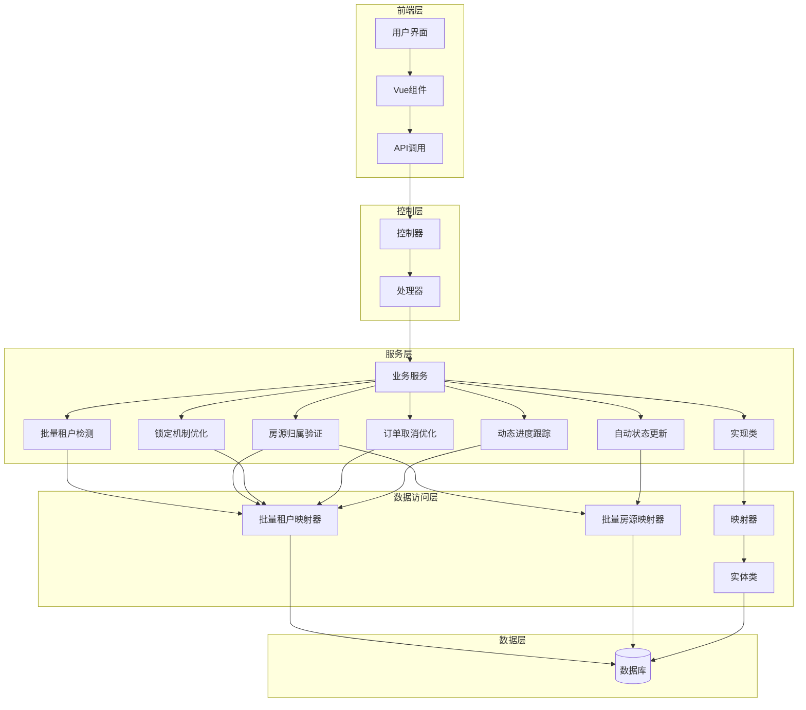
```mermaid
graph TB
subgraph "前端层"
UI[用户界面]
Vue[Vue组件]
API[API调用]
end
subgraph "控制层"
Controller[控制器]
Handler[处理器]
end
subgraph "服务层"
Service[业务服务]
Impl[实现类]
BatchCheck[批量租户检测]
BatchVerify[房源归属验证]
LockOptimization[锁定机制优化]
OrderCancel[订单取消优化]
ProgressTracking[动态进度跟踪]
AutoStatusUpdate[自动状态更新]
end
subgraph "数据访问层"
Mapper[映射器]
Entity[实体类]
BatchTenantMapper[批量租户映射器]
BatchHouseMapper[批量房源映射器]
end
subgraph "数据层"
DB[(数据库)]
end
UI --> Vue
Vue --> API
API --> Controller
Controller --> Handler
Handler --> Service
Service --> Impl
Service --> BatchCheck
Service --> BatchVerify
Service --> LockOptimization
Service --> OrderCancel
Service --> ProgressTracking
Service --> AutoStatusUpdate
Impl --> Mapper
BatchCheck --> BatchTenantMapper
BatchVerify --> BatchTenantMapper
BatchVerify --> BatchHouseMapper
LockOptimization --> BatchTenantMapper
OrderCancel --> BatchTenantMapper
ProgressTracking --> BatchTenantMapper
AutoStatusUpdate --> BatchHouseMapper
Mapper --> Entity
BatchTenantMapper --> DB
BatchHouseMapper --> DB
Entity --> DB
```

**图表来源**
- [HzBatchAllocationController.java:143-179](file://ruoyi-admin/src/main/java/com/ruoyi/web/controller/system/HzBatchAllocationController.java#L143-L179)
- [HzBatchAllocationServiceImpl.java:360-509](file://ruoyi-system/src/main/java/com/ruoyi/system/service/impl/HzBatchAllocationServiceImpl.java#L360-L509)
- [HzHouseOrderServiceImpl.java:85-135](file://ruoyi-system/src/main/java/com/ruoyi/system/service/impl/HzHouseOrderServiceImpl.java#L85-L135)

**章节来源**
- [HzBatchAllocationController.java:143-179](file://ruoyi-admin/src/main/java/com/ruoyi/web/controller/system/HzBatchAllocationController.java#L143-L179)
- [HzBatchAllocationServiceImpl.java:360-509](file://ruoyi-system/src/main/java/com/ruoyi/system/service/impl/HzBatchAllocationServiceImpl.java#L360-L509)

## 核心组件

### 数据模型设计

系统采用三个核心数据表实现批量租户管理：

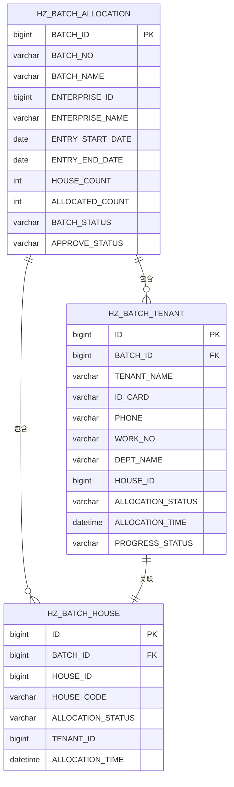
```mermaid
erDiagram
HZ_BATCH_ALLOCATION {
bigint BATCH_ID PK
varchar BATCH_NO
varchar BATCH_NAME
bigint ENTERPRISE_ID
varchar ENTERPRISE_NAME
date ENTRY_START_DATE
date ENTRY_END_DATE
int HOUSE_COUNT
int ALLOCATED_COUNT
varchar BATCH_STATUS
varchar APPROVE_STATUS
}
HZ_BATCH_TENANT {
bigint ID PK
bigint BATCH_ID FK
varchar TENANT_NAME
varchar ID_CARD
varchar PHONE
varchar WORK_NO
varchar DEPT_NAME
bigint HOUSE_ID
varchar ALLOCATION_STATUS
datetime ALLOCATION_TIME
varchar PROGRESS_STATUS
}
HZ_BATCH_HOUSE {
bigint ID PK
bigint BATCH_ID FK
bigint HOUSE_ID
varchar HOUSE_CODE
varchar ALLOCATION_STATUS
bigint TENANT_ID
datetime ALLOCATION_TIME
}
HZ_BATCH_ALLOCATION ||--o{ HZ_BATCH_TENANT : "包含"
HZ_BATCH_ALLOCATION ||--o{ HZ_BATCH_HOUSE : "包含"
HZ_BATCH_TENANT ||--|| HZ_BATCH_HOUSE : "关联"
```

**图表来源**
- [HzBatchAllocation.java:19-333](file://ruoyi-system/src/main/java/com/ruoyi/system/domain/HzBatchAllocation.java#L19-L333)
- [HzBatchTenant.java:13-158](file://ruoyi-system/src/main/java/com/ruoyi/system/domain/HzBatchTenant.java#L13-L158)
- [HzBatchHouse.java:13-122](file://ruoyi-system/src/main/java/com/ruoyi/system/domain/HzBatchHouse.java#L13-L122)

### 业务流程

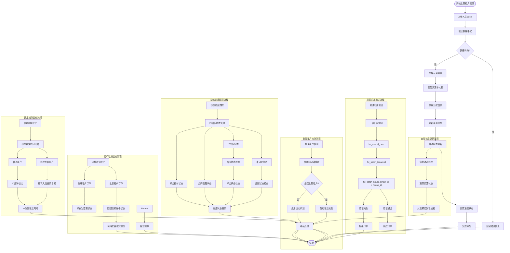
```mermaid
flowchart TD
Start([开始批量租户管理]) --> Upload[上传人员Excel]
Upload --> Validate[验证数据格式]
Validate --> ValidData{数据有效?}
ValidData --> |否| Error[返回错误信息]
ValidData --> |是| SelectHouse[选择可用房源]
SelectHouse --> Match[匹配房源与人员]
Match --> Save[保存分配信息]
Save --> UpdateStatus[更新房源状态]
UpdateStatus --> AutoStatusUpdate[自动状态更新]
AutoStatusUpdate --> CalculateProgress[计算进度状态]
CalculateProgress --> Complete[完成分配]
Error --> End([结束])
Complete --> End
subgraph "批量租户检测流程"
BatchCheck[批量租户检测] --> CheckLock[检查10分钟锁定]
CheckLock --> IsBatch{是否批量租户?}
IsBatch --> |是| SkipLock[跳过锁定机制]
IsBatch --> |否| ApplyLock[应用锁定机制]
SkipLock --> Process[继续处理]
ApplyLock --> Process
Process --> End
end
subgraph "房源归属验证流程"
Verify[房源归属验证] --> ThreeTable[三表匹配验证]
ThreeTable --> UserCard[hz_user.id_card]
UserCard --> TenantId[hz_batch_tenant.id]
TenantId --> HouseMatch[hz_batch_house.tenant_id + house_id]
HouseMatch --> Valid[验证通过]
HouseMatch --> Invalid[验证失败]
Valid --> OrderCreate[创建订单]
Invalid --> Reject[拒绝订单]
Reject --> End
end
subgraph "动态进度跟踪流程"
ProgressTracking[动态进度跟踪] --> FourStages[四阶段状态管理]
FourStages --> Unallocated[未分配状态]
FourStages --> Allocated[已分配状态]
FourStages --> ContractSigned[合同已签状态]
FourStages --> DepositPaid[押金已付状态]
Unallocated --> AllocationCheck[分配状态检查]
Allocated --> ContractCheck[合同状态检查]
ContractCheck --> DepositCheck[押金状态检查]
DepositCheck --> ProgressUpdate[进度状态更新]
AllocationCheck --> ProgressUpdate
ContractSigned --> ProgressUpdate
DepositPaid --> ProgressUpdate
ProgressUpdate --> Process[继续处理]
Process --> End
end
subgraph "锁定机制优化流程"
LockOptimization[锁定机制优化] --> DynamicCalculation[动态锁定时间计算]
DynamicCalculation --> BatchUser[批次配租用户]
DynamicCalculation --> NormalUser[普通用户]
BatchUser --> EntryEndDate[批次入住结束日期]
NormalUser --> TenMinutes[10分钟锁定]
EntryEndDate --> ConsistentTime[一致的锁定时间]
TenMinutes --> ConsistentTime
ConsistentTime --> Process[继续处理]
Process --> End
end
subgraph "订单取消优化流程"
OrderCancel[订单取消优化] --> BatchOrder[批量租户订单]
OrderCancel --> NormalOrder[普通租户订单]
BatchOrder --> RepairState[回退到修缮中状态]
NormalOrder --> VacantState[释放为空置状态]
RepairState --> MaintainPool[保持配租池完整性]
Normal --> ReleaseHouse[释放房源]
MaintainPool --> End
ReleaseHouse --> End
end
subgraph "自动状态更新流程"
AutoStatusUpdate[自动状态更新] --> ApprovedBatch[审批通过批次]
ApprovedBatch --> UpdateHouseStatus[更新房源状态]
UpdateHouseStatus --> FromReservedToRented[从已预订到已出租]
FromReservedToRented --> Process[继续处理]
Process --> End
end
```

**图表来源**
- [HzBatchAllocationServiceImpl.java:360-509](file://ruoyi-system/src/main/java/com/ruoyi/system/service/impl/HzBatchAllocationServiceImpl.java#L360-L509)
- [HzBatchAllocationController.java:146-160](file://ruoyi-admin/src/main/java/com/ruoyi/web/controller/system/HzBatchAllocationController.java#L146-L160)
- [HzHouseOrderServiceImpl.java:85-135](file://ruoyi-system/src/main/java/com/ruoyi/system/service/impl/HzHouseOrderServiceImpl.java#L85-L135)

**章节来源**
- [HzBatchAllocation.java:19-333](file://ruoyi-system/src/main/java/com/ruoyi/system/domain/HzBatchAllocation.java#L19-L333)
- [HzBatchTenant.java:13-158](file://ruoyi-system/src/main/java/com/ruoyi/system/domain/HzBatchTenant.java#L13-L158)
- [HzBatchHouse.java:13-122](file://ruoyi-system/src/main/java/com/ruoyi/system/domain/HzBatchHouse.java#L13-L122)

## 架构概览

### 整体架构设计

```mermaid
graph TB
subgraph "表现层"
FE[前端Vue应用]
UI[用户界面组件]
end
subgraph "控制层"
AC[HzBatchAllocationController]
HC[HzHouseOrderController]
BC[基础控制器]
QC[HzQualificationController]
HO[HzHouseOrderServiceImpl]
CS[HzContractServiceImpl]
PT[进度跟踪服务]
ASU[自动状态更新服务]
end
subgraph "服务层"
IS[IHzBatchAllocationService]
SI[HzBatchAllocationServiceImpl]
TS[租户服务]
HS[房源服务]
HOSI[HzHouseOrderServiceImpl]
BATCH_CHECK[批量租户检测]
BATCH_VERIFY[房源归属验证]
LOCK_OPTIMIZATION[锁定机制优化]
ORDER_CANCEL[订单取消优化]
PROGRESS_TRACKING[动态进度跟踪]
AUTO_STATUS_UPDATE[自动状态更新]
END
subgraph "数据访问层"
TM[HzBatchTenantMapper]
HM[HzBatchHouseMapper]
BM[HzBatchAllocationMapper]
UM[HzUserMapper]
BPV[BatchPreferenceVo]
end
subgraph "定时任务层"
CET[ContractExpireTask]
end
subgraph "数据存储"
DB[(MySQL数据库)]
end
FE --> AC
UI --> AC
AC --> BC
AC --> IS
IS --> SI
SI --> TM
SI --> HM
SI --> BM
TM --> DB
HM --> DB
BM --> DB
QC --> UM
QC --> BATCH_CHECK
HC --> ORDER_CANCEL
HO --> BATCH_CHECK
HO --> BATCH_VERIFY
HO --> LOCK_OPTIMIZATION
HO --> ORDER_CANCEL
HO --> PROGRESS_TRACKING
CS --> ORDER_CANCEL
BATCH_CHECK --> TM
BATCH_VERIFY --> TM
BATCH_VERIFY --> HM
LOCK_OPTIMIZATION --> BPV
ORDER_CANCEL --> TM
PROGRESS_TRACKING --> TM
AUTO_STATUS_UPDATE --> HM
CET --> BATCH_CHECK
```

**图表来源**
- [HzBatchAllocationController.java:143-179](file://ruoyi-admin/src/main/java/com/ruoyi/web/controller/system/HzBatchAllocationController.java#L143-L179)
- [IHzBatchAllocationService.java:18-139](file://ruoyi-system/src/main/java/com/ruoyi/system/service/IHzBatchAllocationService.java#L18-L139)
- [HzQualificationController.java:67-99](file://ruoyi-admin/src/main/java/com/ruoyi/web/controller/h5/HzQualificationController.java#L67-L99)
- [HzHouseOrderServiceImpl.java:85-135](file://ruoyi-system/src/main/java/com/ruoyi/system/service/impl/HzHouseOrderServiceImpl.java#L85-L135)
- [ContractExpireTask.java:623-637](file://ruoyi-quartz/src/main/java/com/ruoyi/quartz/task/ContractExpireTask.java#L623-637)

### 数据流处理

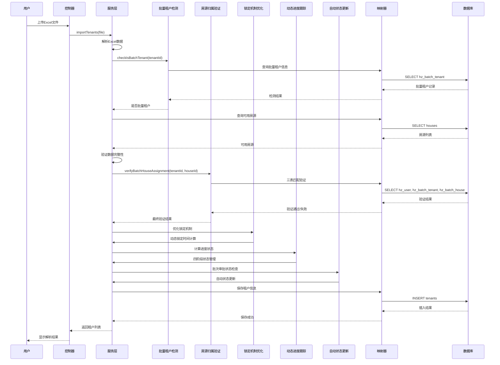
```mermaid
sequenceDiagram
participant U as 用户
participant C as 控制器
participant S as 服务层
participant B as 批量租户检测
participant V as 房源归属验证
participant L as 锁定机制优化
participant PT as 动态进度跟踪
participant ASU as 自动状态更新
participant M as 映射器
participant D as 数据库
U->>C : 上传Excel文件
C->>S : importTenants(file)
S->>S : 解析Excel数据
S->>B : checkIsBatchTenant(tenantId)
B->>M : 查询批量租户信息
M->>D : SELECT hz_batch_tenant
D-->>M : 批量租户记录
M-->>B : 检测结果
B-->>S : 是否批量租户
S->>M : 查询可用房源
M->>D : SELECT houses
D-->>M : 房源列表
M-->>S : 可用房源
S->>S : 验证数据完整性
S->>V : verifyBatchHouseAssignment(tenantId, houseId)
V->>M : 三表匹配验证
M->>D : SELECT hz_user, hz_batch_tenant, hz_batch_house
D-->>M : 验证结果
M-->>V : 验证通过/失败
V-->>S : 最终验证结果
S->>L : 优化锁定机制
L->>S : 动态锁定时间计算
S->>PT : 计算进度状态
PT->>S : 四阶段状态管理
S->>ASU : 批次审批状态检查
ASU->>S : 自动状态更新
S->>M : 保存租户信息
M->>D : INSERT tenants
D-->>M : 插入结果
M-->>S : 保存成功
S-->>C : 返回租户列表
C-->>U : 显示解析结果
```

**图表来源**
- [HzBatchAllocationController.java:146-150](file://ruoyi-admin/src/main/java/com/ruoyi/web/controller/system/HzBatchAllocationController.java#L146-L150)
- [IHzBatchAllocationService.java:102-108](file://ruoyi-system/src/main/java/com/ruoyi/system/service/IHzBatchAllocationService.java#L102-L108)
- [HzHouseOrderServiceImpl.java:85-135](file://ruoyi-system/src/main/java/com/ruoyi/system/service/impl/HzHouseOrderServiceImpl.java#L85-L135)

**章节来源**
- [HzBatchAllocationController.java:143-179](file://ruoyi-admin/src/main/java/com/ruoyi/web/controller/system/HzBatchAllocationController.java#L143-L179)
- [IHzBatchAllocationService.java:18-139](file://ruoyi-system/src/main/java/com/ruoyi/system/service/IHzBatchAllocationService.java#L18-L139)

## 详细组件分析

### 控制器层

#### HzBatchAllocationController

控制器负责处理HTTP请求和响应，提供RESTful API接口：

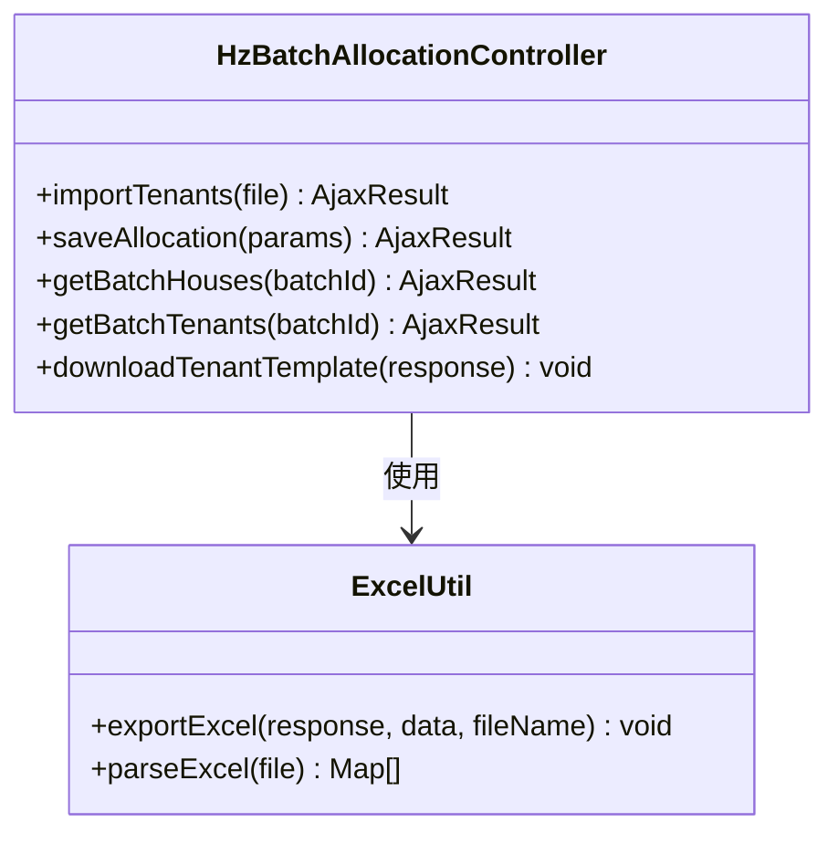
```mermaid
classDiagram
class HzBatchAllocationController {
+importTenants(file) AjaxResult
+saveAllocation(params) AjaxResult
+getBatchHouses(batchId) AjaxResult
+getBatchTenants(batchId) AjaxResult
+downloadTenantTemplate(response) void
}
class ExcelUtil {
+exportExcel(response, data, fileName) void
+parseExcel(file) Map[]
}
HzBatchAllocationController --> ExcelUtil : 使用
```

**图表来源**
- [HzBatchAllocationController.java:143-179](file://ruoyi-admin/src/main/java/com/ruoyi/web/controller/system/HzBatchAllocationController.java#L143-L179)

**章节来源**
- [HzBatchAllocationController.java:143-179](file://ruoyi-admin/src/main/java/com/ruoyi/web/controller/system/HzBatchAllocationController.java#L143-L179)

#### HzHouseOrderController

订单控制器提供批量租户订单管理接口：

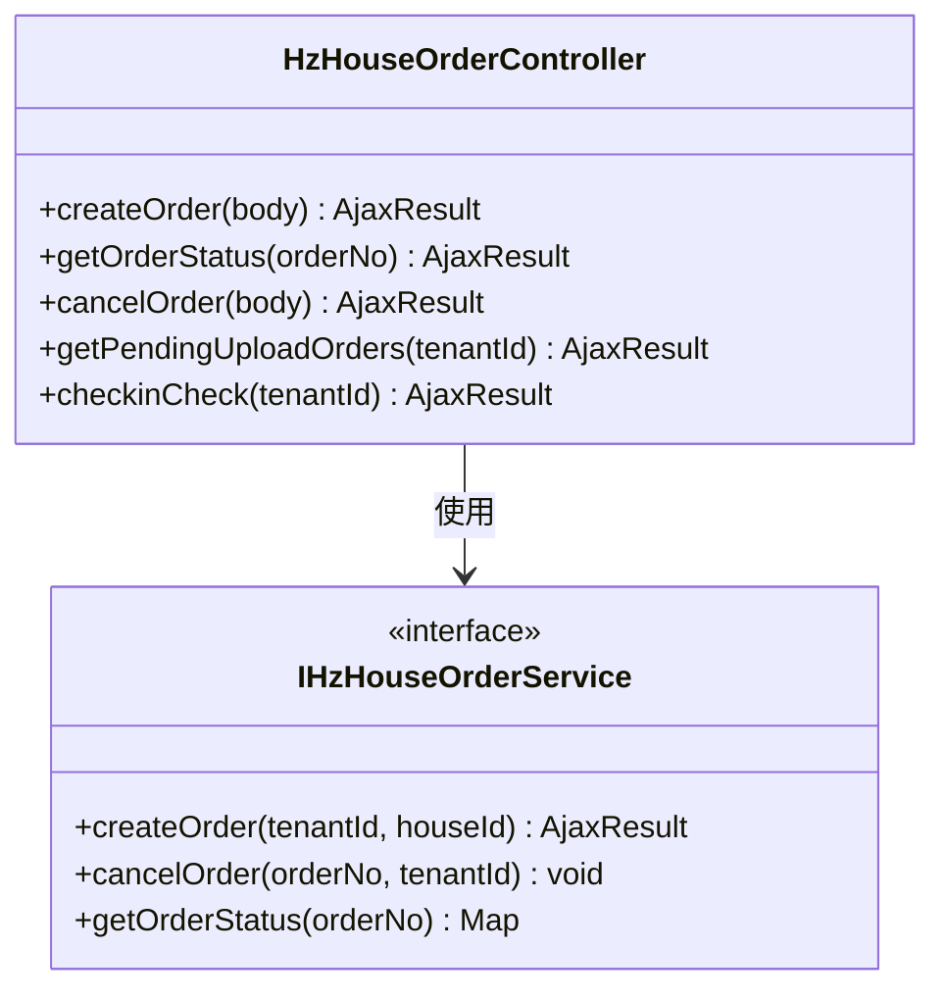
```mermaid
classDiagram
class HzHouseOrderController {
+createOrder(body) AjaxResult
+getOrderStatus(orderNo) AjaxResult
+cancelOrder(body) AjaxResult
+getPendingUploadOrders(tenantId) AjaxResult
+checkinCheck(tenantId) AjaxResult
}
class IHzHouseOrderService {
<<interface>>
+createOrder(tenantId, houseId) AjaxResult
+cancelOrder(orderNo, tenantId) void
+getOrderStatus(orderNo) Map
}
HzHouseOrderController --> IHzHouseOrderService : 使用
```

**图表来源**
- [HzHouseOrderController.java:64-70](file://ruoyi-admin/src/main/java/com/ruoyi/web/controller/h5/HzHouseOrderController.java#L64-L70)

**章节来源**
- [HzHouseOrderController.java:64-70](file://ruoyi-admin/src/main/java/com/ruoyi/web/controller/h5/HzHouseOrderController.java#L64-L70)

### 服务层

#### HzBatchAllocationServiceImpl

服务实现类提供核心业务逻辑：

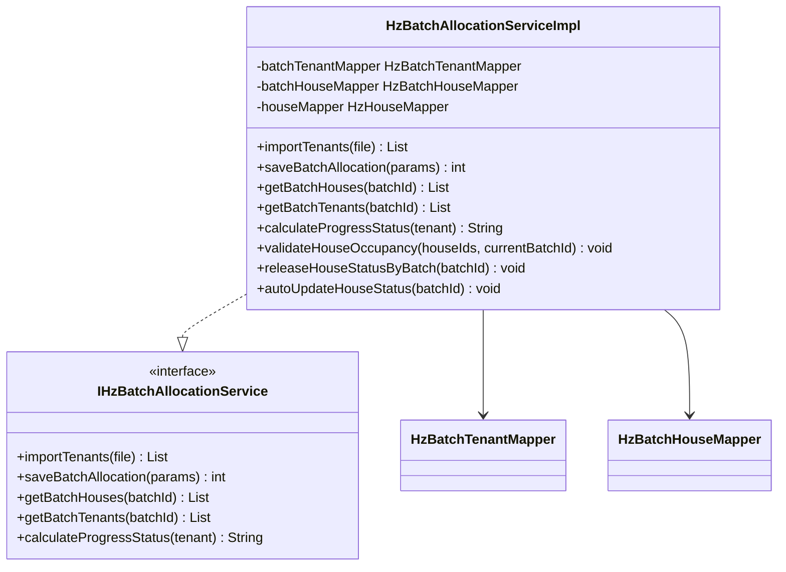
```mermaid
classDiagram
class HzBatchAllocationServiceImpl {
-batchTenantMapper HzBatchTenantMapper
-batchHouseMapper HzBatchHouseMapper
-houseMapper HzHouseMapper
+importTenants(file) List
+saveBatchAllocation(params) int
+getBatchHouses(batchId) List
+getBatchTenants(batchId) List
+calculateProgressStatus(tenant) String
+validateHouseOccupancy(houseIds, currentBatchId) void
+releaseHouseStatusByBatch(batchId) void
+autoUpdateHouseStatus(batchId) void
}
class IHzBatchAllocationService {
<<interface>>
+importTenants(file) List
+saveBatchAllocation(params) int
+getBatchHouses(batchId) List
+getBatchTenants(batchId) List
+calculateProgressStatus(tenant) String
}
HzBatchAllocationServiceImpl ..|> IHzBatchAllocationService
HzBatchAllocationServiceImpl --> HzBatchTenantMapper
HzBatchAllocationServiceImpl --> HzBatchHouseMapper
```

**图表来源**
- [HzBatchAllocationServiceImpl.java:360-509](file://ruoyi-system/src/main/java/com/ruoyi/system/service/impl/HzBatchAllocationServiceImpl.java#L360-L509)
- [IHzBatchAllocationService.java:18-139](file://ruoyi-system/src/main/java/com/ruoyi/system/service/IHzBatchAllocationService.java#L18-L139)

**章节来源**
- [HzBatchAllocationServiceImpl.java:360-509](file://ruoyi-system/src/main/java/com/ruoyi/system/service/impl/HzBatchAllocationServiceImpl.java#L360-L509)

#### HzHouseOrderServiceImpl

订单服务实现类提供批量租户订单管理：

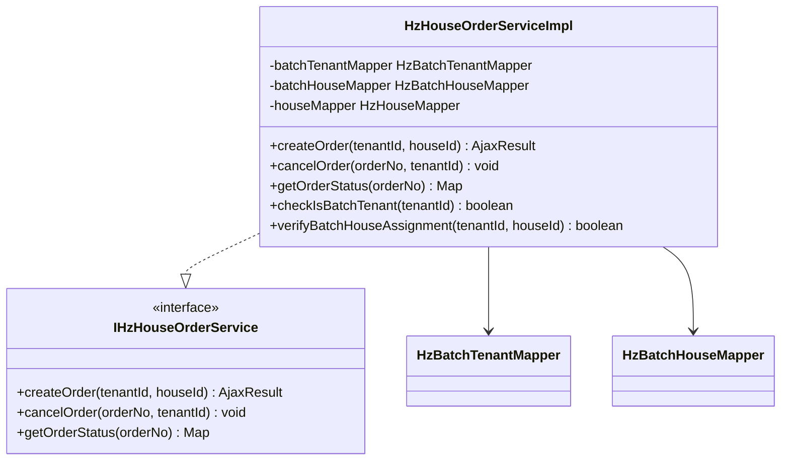
```mermaid
classDiagram
class HzHouseOrderServiceImpl {
-batchTenantMapper HzBatchTenantMapper
-batchHouseMapper HzBatchHouseMapper
-houseMapper HzHouseMapper
+createOrder(tenantId, houseId) AjaxResult
+cancelOrder(orderNo, tenantId) void
+getOrderStatus(orderNo) Map
+checkIsBatchTenant(tenantId) boolean
+verifyBatchHouseAssignment(tenantId, houseId) boolean
}
class IHzHouseOrderService {
<<interface>>
+createOrder(tenantId, houseId) AjaxResult
+cancelOrder(orderNo, tenantId) void
+getOrderStatus(orderNo) Map
}
HzHouseOrderServiceImpl ..|> IHzHouseOrderService
HzHouseOrderServiceImpl --> HzBatchTenantMapper
HzHouseOrderServiceImpl --> HzBatchHouseMapper
```

**图表来源**
- [HzHouseOrderServiceImpl.java:77-153](file://ruoyi-system/src/main/java/com/ruoyi/system/service/impl/HzHouseOrderServiceImpl.java#L77-L153)
- [IHzHouseOrderService.java:35-44](file://ruoyi-system/src/main/java/com/ruoyi/system/service/IHzHouseOrderService.java#L35-L44)

**章节来源**
- [HzHouseOrderServiceImpl.java:77-153](file://ruoyi-system/src/main/java/com/ruoyi/system/service/impl/HzHouseOrderServiceImpl.java#L77-L153)

### 数据访问层

#### 映射器接口

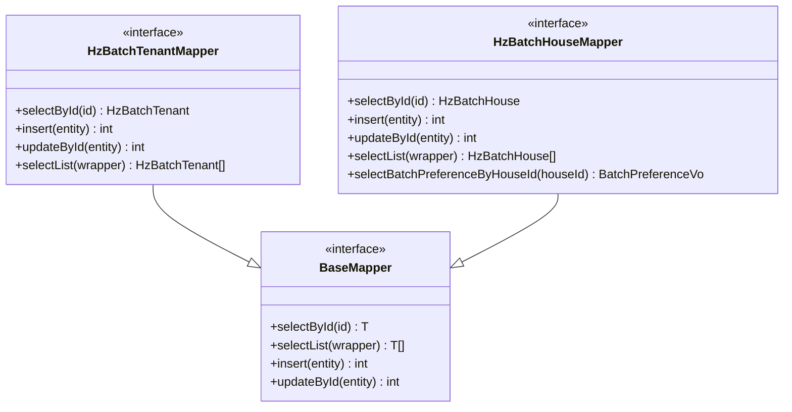
```mermaid
classDiagram
class HzBatchTenantMapper {
<<interface>>
+selectById(id) HzBatchTenant
+insert(entity) int
+updateById(entity) int
+selectList(wrapper) HzBatchTenant[]
}
class HzBatchHouseMapper {
<<interface>>
+selectById(id) HzBatchHouse
+insert(entity) int
+updateById(entity) int
+selectList(wrapper) HzBatchHouse[]
+selectBatchPreferenceByHouseId(houseId) BatchPreferenceVo
}
class BaseMapper {
<<interface>>
+selectById(id) T
+selectList(wrapper) T[]
+insert(entity) int
+updateById(entity) int
}
HzBatchTenantMapper --|> BaseMapper
HzBatchHouseMapper --|> BaseMapper
```

**图表来源**
- [HzBatchTenantMapper.java:12-16](file://ruoyi-system/src/main/java/com/ruoyi/system/mapper/HzBatchTenantMapper.java#L12-L16)
- [HzBatchHouseMapper.java:14-26](file://ruoyi-system/src/main/java/com/ruoyi/system/mapper/HzBatchHouseMapper.java#L14-L26)

**章节来源**
- [HzBatchTenantMapper.java:12-16](file://ruoyi-system/src/main/java/com/ruoyi/system/mapper/HzBatchTenantMapper.java#L12-L16)
- [HzBatchHouseMapper.java:14-26](file://ruoyi-system/src/main/java/com/ruoyi/system/mapper/HzBatchHouseMapper.java#L14-L26)

### 前端界面

#### Vue组件实现

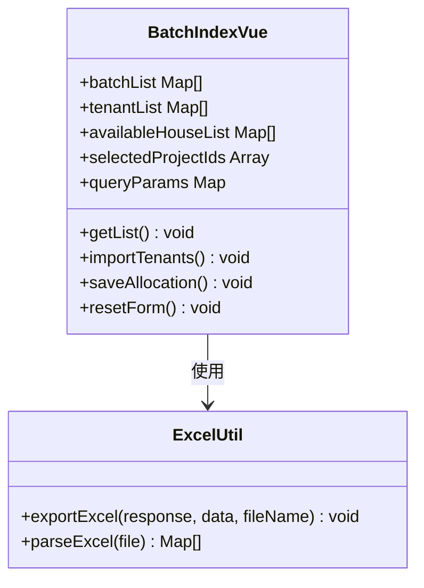
```mermaid
classDiagram
class BatchIndexVue {
+batchList Map[]
+tenantList Map[]
+availableHouseList Map[]
+selectedProjectIds Array
+queryParams Map
+getList() void
+importTenants() void
+saveAllocation() void
+resetForm() void
}
class ExcelUtil {
+exportExcel(response, data, fileName) void
+parseExcel(file) Map[]
}
BatchIndexVue --> ExcelUtil : 使用
```

**图表来源**
- [index.vue:593-642](file://ruoyi-ui/src/views/gangzhu/house/batch/index.vue#L593-L642)

**章节来源**
- [index.vue:593-642](file://ruoyi-ui/src/views/gangzhu/house/batch/index.vue#L593-L642)

## 批量租户检测功能

### 检测机制概述

批量租户检测功能通过checkIsBatchTenant()方法实现，用于判断指定租户是否属于批量租户群体。该功能在多个关键业务场景中发挥作用：

1. **房源订单锁定机制豁免**：批量租户订单不受10分钟锁定机制限制
2. **合同过期处理豁免**：批量租户在合同到期时获得特殊处理
3. **资格认证豁免**：批量租户可免于某些资格验证要求

### 核心检测逻辑

```mermaid
flowchart TD
CheckTenant[checkIsBatchTenant(tenantId)] --> ValidateInput{验证输入参数}
ValidateInput --> |tenantId为空| ReturnFalse[返回false]
ValidateInput --> |tenantId有效| LoadUser[加载用户信息]
LoadUser --> CheckIdCard{检查身份证号}
CheckIdCard --> |无身份证号| ReturnFalse
CheckIdCard --> |有身份证号| QueryBatchTenant[查询批量租户表]
QueryBatchTenant --> CheckCount{检查匹配记录数}
CheckCount --> |count > 0| ReturnTrue[返回true - 是批量租户]
CheckCount --> |count = 0| ReturnFalse
ReturnTrue --> End([结束])
ReturnFalse --> End
```

**图表来源**
- [HzHouseOrderServiceImpl.java:415-425](file://ruoyi-system/src/main/java/com/ruoyi/system/service/impl/HzHouseOrderServiceImpl.java#L415-L425)
- [HzQualificationController.java:73-99](file://ruoyi-admin/src/main/java/com/ruoyi/web/controller/h5/HzQualificationController.java#L73-L99)

### 检测方法实现

#### HzHouseOrderServiceImpl中的检测方法

```java
private boolean checkIsBatchTenant(Long tenantId) {
    if (tenantId == null) return false;
    HzUser user = userMapper.selectById(tenantId);
    if (user == null || !StringUtils.hasText(user.getIdCard())) return false;
    
    QueryWrapper<HzBatchTenant> wrapper = new QueryWrapper<>();
    wrapper.eq("id_card", user.getIdCard())
            .eq("del_flag", "0")
            .last("LIMIT 1");
    
    Long count = batchTenantMapper.selectCount(wrapper);
    return count != null && count > 0;
}
```

#### ContractExpireTask中的批量租户判断

```java
private boolean isBatchTenant(Long tenantId) {
    if (tenantId == null) return false;
    HzUser user = userMapper.selectById(tenantId);
    if (user == null || !StringUtils.hasText(user.getIdCard())) return false;
    
    QueryWrapper<HzBatchTenant> wrapper = new QueryWrapper<>();
    wrapper.eq("id_card", user.getIdCard())
            .eq("del_flag", "0")
            .last("LIMIT 1");
    
    Long count = batchTenantMapper.selectCount(wrapper);
    return count != null && count > 0;
}
```

**章节来源**
- [HzHouseOrderServiceImpl.java:415-425](file://ruoyi-system/src/main/java/com/ruoyi/system/service/impl/HzHouseOrderServiceImpl.java#L415-L425)
- [ContractExpireTask.java:627-637](file://ruoyi-quartz/src/main/java/com/ruoyi/quartz/task/ContractExpireTask.java#L627-L637)

### 应用场景

#### 房源订单锁定豁免

在HzHouseOrderServiceImpl中，批量租户订单的处理逻辑如下：

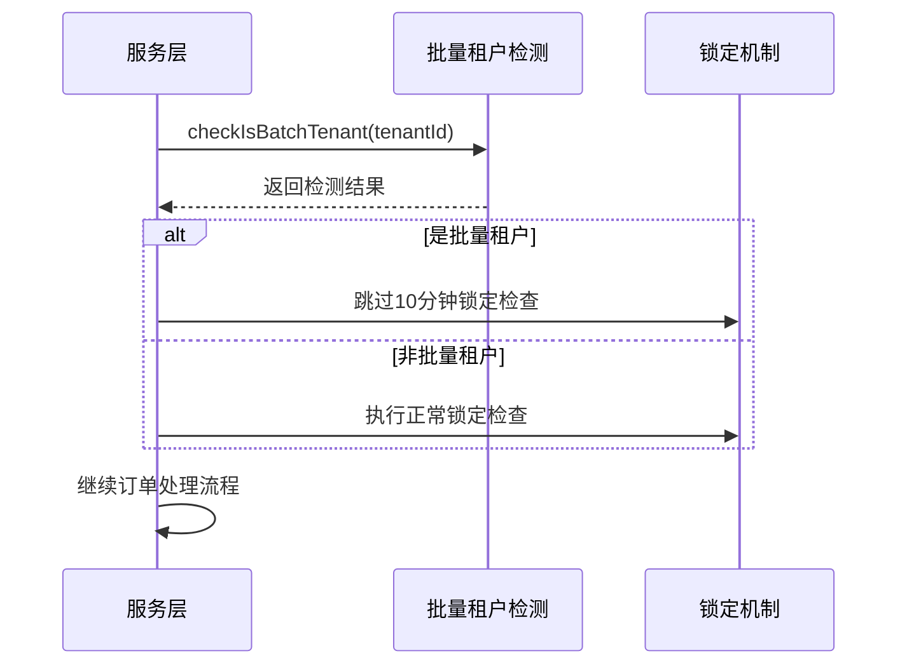
```mermaid
sequenceDiagram
participant S as 服务层
participant B as 批量租户检测
participant L as 锁定机制
S->>B : checkIsBatchTenant(tenantId)
B-->>S : 返回检测结果
alt 是批量租户
S->>L : 跳过10分钟锁定检查
else 非批量租户
S->>L : 执行正常锁定检查
end
S->>S : 继续订单处理流程
```

**图表来源**
- [HzHouseOrderServiceImpl.java:85-135](file://ruoyi-system/src/main/java/com/ruoyi/system/service/impl/HzHouseOrderServiceImpl.java#L85-L135)

#### 合同过期处理豁免

在ContractExpireTask中，批量租户的合同过期处理具有特殊逻辑：

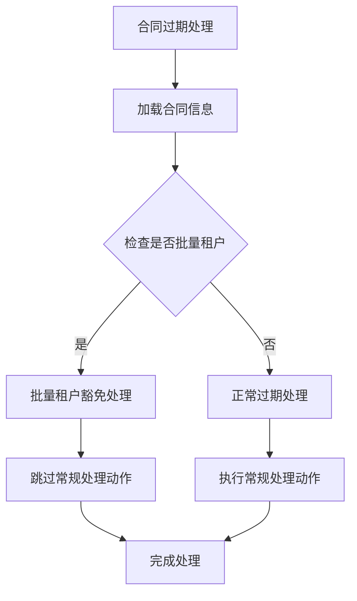
```mermaid
flowchart TD
ContractProcess[合同过期处理] --> LoadContract[加载合同信息]
LoadContract --> CheckBatch{检查是否批量租户}
CheckBatch --> |是| BatchExemption[批量租户豁免处理]
CheckBatch --> |否| NormalProcess[正常过期处理]
BatchExemption --> SkipActions[跳过常规处理动作]
NormalProcess --> ApplyActions[执行常规处理动作]
SkipActions --> Complete[完成处理]
ApplyActions --> Complete
```

**图表来源**
- [ContractExpireTask.java:191-191](file://ruoyi-quartz/src/main/java/com/ruoyi/quartz/task/ContractExpireTask.java#L191-L191)
- [ContractExpireTask.java:234-234](file://ruoyi-quartz/src/main/java/com/ruoyi/quartz/task/ContractExpireTask.java#L234-L234)
- [ContractExpireTask.java:272-272](file://ruoyi-quartz/src/main/java/com/ruoyi/quartz/task/ContractExpireTask.java#L272-L272)
- [ContractExpireTask.java:430-430](file://ruoyi-quartz/src/main/java/com/ruoyi/quartz/task/ContractExpireTask.java#L430-L430)

### 资格认证豁免

HzQualificationController提供了专门的API用于批量租户资格认证豁免：

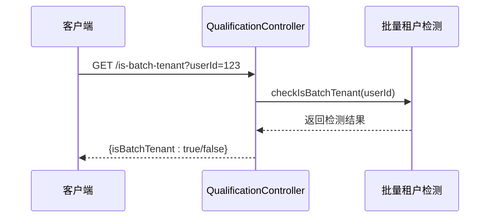
```mermaid
sequenceDiagram
participant C as 客户端
participant Q as QualificationController
participant B as 批量租户检测
C->>Q : GET /is-batch-tenant?userId=123
Q->>B : checkIsBatchTenant(userId)
B-->>Q : 返回检测结果
Q-->>C : {isBatchTenant : true/false}
```

**图表来源**
- [HzQualificationController.java:73-99](file://ruoyi-admin/src/main/java/com/ruoyi/web/controller/h5/HzQualificationController.java#L73-L99)

**章节来源**
- [HzQualificationController.java:67-99](file://ruoyi-admin/src/main/java/com/ruoyi/web/controller/h5/HzQualificationController.java#L67-L99)

## 批量租户房源归属验证

### 验证机制概述

**新增** 批量租户房源归属验证机制通过verifyBatchHouseAssignment()方法实现，确保批量租户只能访问其被正式分配的房源。该机制采用三表匹配验证系统，通过以下流程确保数据准确性：

1. **用户身份验证**：通过hz_user.id_card确认用户身份
2. **批量租户匹配**：通过hz_batch_tenant.id关联批量租户记录
3. **房源归属验证**：通过hz_batch_house.tenant_id + house_id验证房源归属

### 核心验证逻辑

```mermaid
flowchart TD
Verify[verifyBatchHouseAssignment(tenantId, houseId)] --> ValidateInput{验证输入参数}
ValidateInput --> |tenantId或houseId为空| ReturnFalse[返回false]
ValidateInput --> |参数有效| LoadUser[加载用户信息]
LoadUser --> CheckIdCard{检查身份证号}
CheckIdCard --> |无身份证号| ReturnFalse
CheckIdCard --> |有身份证号| QueryBatchTenants[查询批量租户记录]
QueryBatchTenants --> CheckTenantCount{检查租户记录数}
CheckTenantCount --> |无记录| ReturnFalse
CheckTenantCount --> |有记录| GetTenantIds[提取租户ID列表]
GetTenantIds --> QueryBatchHouses[查询批量房源记录]
QueryBatchHouses --> CheckHouseCount{检查房源匹配数}
CheckHouseCount --> |count > 0| ReturnTrue[返回true - 验证通过]
CheckHouseCount --> |count = 0| ReturnFalse
ReturnTrue --> End([结束])
ReturnFalse --> End
```

**图表来源**
- [HzHouseOrderServiceImpl.java:431-455](file://ruoyi-system/src/main/java/com/ruoyi/system/service/impl/HzHouseOrderServiceImpl.java#L431-L455)

### 验证方法实现

#### HzHouseOrderServiceImpl中的验证方法

```java
/**
 * 校验批次配租房源归属：该房源是否确实分配给了该用户
 * 通过 hz_user.id_card → hz_batch_tenant.id → hz_batch_house.tenant_id + house_id 三表匹配
 */
private boolean verifyBatchHouseAssignment(Long tenantId, Long houseId) {
    if (tenantId == null || houseId == null) return false;
    HzUser user = userMapper.selectById(tenantId);
    if (user == null || !StringUtils.hasText(user.getIdCard())) return false;

    // 查出该用户在 hz_batch_tenant 中的所有记录ID
    QueryWrapper<HzBatchTenant> tenantWrapper = new QueryWrapper<>();
    tenantWrapper.eq("id_card", user.getIdCard())
            .eq("del_flag", "0");
    List<HzBatchTenant> batchTenants = batchTenantMapper.selectList(tenantWrapper);
    if (batchTenants == null || batchTenants.isEmpty()) return false;

    // 检查 hz_batch_house 中是否存在 tenant_id 匹配且 house_id 匹配的记录
    List<Long> tenantIds = new ArrayList<>();
    for (HzBatchTenant bt : batchTenants) {
        tenantIds.add(bt.getId());
    }
    QueryWrapper<HzBatchHouse> houseWrapper = new QueryWrapper<>();
    houseWrapper.in("tenant_id", tenantIds)
            .eq("house_id", houseId)
            .eq("del_flag", "0")
            .last("LIMIT 1");
    Long matchCount = batchHouseMapper.selectCount(houseWrapper);
    return matchCount != null && matchCount > 0;
}
```

### 验证应用场景

#### 订单创建前的安全检查

在订单创建流程中，verifyBatchHouseAssignment()方法作为最后一道安全防线：

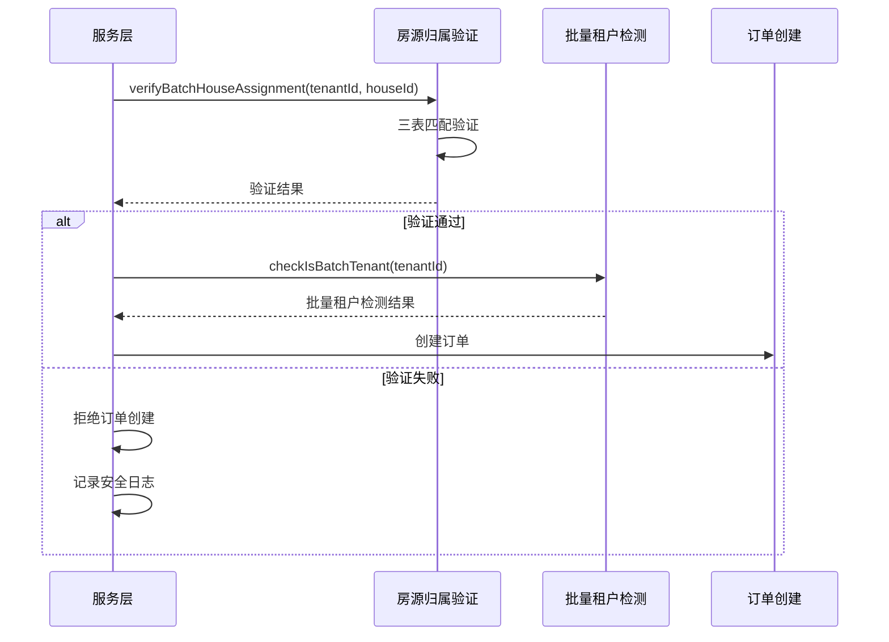
```mermaid
sequenceDiagram
participant S as 服务层
participant V as 房源归属验证
participant B as 批量租户检测
participant O as 订单创建
S->>V : verifyBatchHouseAssignment(tenantId, houseId)
V->>V : 三表匹配验证
V-->>S : 验证结果
alt 验证通过
S->>B : checkIsBatchTenant(tenantId)
B-->>S : 批量租户检测结果
S->>O : 创建订单
else 验证失败
S->>S : 拒绝订单创建
S->>S : 记录安全日志
end
```

**图表来源**
- [HzHouseOrderServiceImpl.java:85-135](file://ruoyi-system/src/main/java/com/ruoyi/system/service/impl/HzHouseOrderServiceImpl.java#L85-L135)

#### 房源占用冲突检测

在批量分配过程中，系统会进行更严格的房源占用冲突检测：

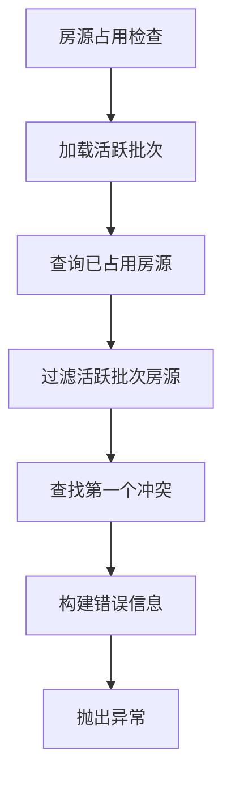
```mermaid
flowchart TD
OccupancyCheck[房源占用检查] --> LoadActiveBatches[加载活跃批次]
LoadActiveBatches --> QueryOccupiedHouses[查询已占用房源]
QueryOccupiedHouses --> FilterActive[过滤活跃批次房源]
FilterActive --> FindFirstConflict[查找第一个冲突]
FindFirstConflict --> BuildErrorMessage[构建错误信息]
BuildErrorMessage --> ThrowException[抛出异常]
```

**图表来源**
- [HzBatchAllocationServiceImpl.java:695-718](file://ruoyi-system/src/main/java/com/ruoyi/system/service/impl/HzBatchAllocationServiceImpl.java#L695-L718)

**章节来源**
- [HzHouseOrderServiceImpl.java:431-455](file://ruoyi-system/src/main/java/com/ruoyi/system/service/impl/HzHouseOrderServiceImpl.java#L431-L455)
- [HzBatchAllocationServiceImpl.java:695-718](file://ruoyi-system/src/main/java/com/ruoyi/system/service/impl/HzBatchAllocationServiceImpl.java#L695-L718)

## 改进的订单创建流程

### 流程概述

**更新** 基于新增的批量租户房源归属验证机制，订单创建流程得到了显著改进，增加了多层验证确保数据安全性和业务准确性。

### 改进后的订单创建流程

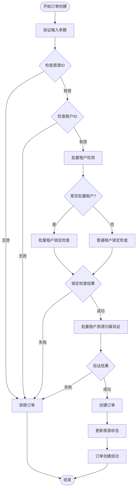
```mermaid
flowchart TD
Start([开始订单创建]) --> ValidateInputs[验证输入参数]
ValidateInputs --> CheckHouseId{检查房源ID}
CheckHouseId --> |无效| Reject[拒绝订单]
CheckHouseId --> |有效| CheckTenantId{检查租户ID}
CheckTenantId --> |无效| Reject
CheckTenantId --> |有效| CheckBatchTenant[批量租户检测]
CheckBatchTenant --> IsBatch{是否批量租户?}
IsBatch --> |是| BatchLockCheck[批量租户锁定检查]
IsBatch --> |否| NormalLockCheck[普通租户锁定检查]
BatchLockCheck --> LockCheckResult{锁定检查结果}
NormalLockCheck --> LockCheckResult
LockCheckResult --> |失败| Reject
LockCheckResult --> |成功| BatchHouseVerify[批量租户房源归属验证]
BatchHouseVerify --> VerifyResult{验证结果}
VerifyResult --> |失败| Reject
VerifyResult --> |成功| CreateOrder[创建订单]
CreateOrder --> UpdateStatus[更新房源状态]
UpdateStatus --> Success[订单创建成功]
Reject --> End([结束])
Success --> End
```

**图表来源**
- [HzHouseOrderServiceImpl.java:85-135](file://ruoyi-system/src/main/java/com/ruoyi/system/service/impl/HzHouseOrderServiceImpl.java#L85-L135)

### 关键改进点

#### 多层验证机制

1. **参数验证层**：确保tenantId和houseId的有效性
2. **批量租户识别层**：通过checkIsBatchTenant()判断租户类型
3. **锁定机制层**：根据租户类型应用相应的锁定策略
4. **房源归属验证层**：通过verifyBatchHouseAssignment()确保房源分配准确性

#### 错误处理优化

改进的错误处理机制能够提供更精确的错误信息：

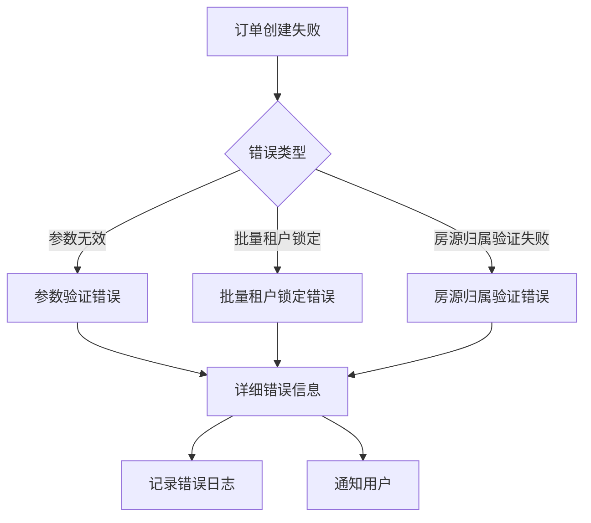
```mermaid
flowchart TD
Error[订单创建失败] --> ErrorType{错误类型}
ErrorType --> |参数无效| ParamError[参数验证错误]
ErrorType --> |批量租户锁定| LockError[批量租户锁定错误]
ErrorType --> |房源归属验证失败| HouseError[房源归属验证错误]
ParamError --> DetailedMessage[详细错误信息]
LockError --> DetailedMessage
HouseError --> DetailedMessage
DetailedMessage --> LogError[记录错误日志]
DetailedMessage --> NotifyUser[通知用户]
```

**图表来源**
- [HzBatchAllocationServiceImpl.java:695-718](file://ruoyi-system/src/main/java/com/ruoyi/system/service/impl/HzBatchAllocationServiceImpl.java#L695-L718)

### 性能优化措施

#### 查询优化

1. **索引优化**：确保hz_batch_tenant.id_card和hz_batch_house.house_id有适当索引
2. **查询限制**：使用LIMIT 1优化查询性能
3. **批量查询**：对批量租户ID列表使用IN查询

#### 缓存策略

1. **用户信息缓存**：缓存用户基本信息减少数据库查询
2. **批量租户缓存**：缓存批量租户相关信息
3. **验证结果缓存**：缓存房源归属验证结果

**章节来源**
- [HzHouseOrderServiceImpl.java:85-135](file://ruoyi-system/src/main/java/com/ruoyi/system/service/impl/HzHouseOrderServiceImpl.java#L85-L135)
- [HzBatchAllocationServiceImpl.java:695-718](file://ruoyi-system/src/main/java/com/ruoyi/system/service/impl/HzBatchAllocationServiceImpl.java#L695-L718)

## 锁定机制优化

### 优化概述

**新增** 批量租户订单处理流程的锁定机制优化，确保批量分配用户和普通用户在锁定时间计算上的一致性。该优化解决了批量租户在锁定时间计算上的特殊需求，同时保持与普通用户的兼容性。

### 锁定机制设计

```mermaid
flowchart TD
LockOptimization[锁定机制优化] --> DynamicCalculation[动态锁定时间计算]
DynamicCalculation --> BatchUser[批次配租用户]
DynamicCalculation --> NormalUser[普通用户]
BatchUser --> EntryEndDate[批次入住结束日期]
NormalUser --> TenMinutes[10分钟锁定]
EntryEndDate --> ConsistentTime[一致的锁定时间]
TenMinutes --> ConsistentTime
ConsistentTime --> Process[继续处理]
Process --> End([结束])
```

**图表来源**
- [HzHouseOrderServiceImpl.java:122-142](file://ruoyi-system/src/main/java/com/ruoyi/system/service/impl/HzHouseOrderServiceImpl.java#L122-L142)

### 锁定时间计算优化

#### 批量租户锁定时间

批量租户采用动态锁定时间计算策略，基于批次入住结束日期：

```java
Calendar cal = Calendar.getInstance();
if (!isBatch) {
    // 普通用户：锁定10分钟
    cal.add(Calendar.MINUTE, 10);
} else {
    // 批次配租用户：截止日期为配租批次的入住结束日期(entry_end_date) 23:59:59
    try {
        BatchPreferenceVo batchPref = batchHouseMapper.selectBatchPreferenceByHouseId(houseId);
        if (batchPref != null && batchPref.getEntryEndDate() != null) {
            LocalDate endDate = LocalDate.parse(batchPref.getEntryEndDate(), DateTimeFormatter.ISO_LOCAL_DATE);
            LocalDateTime endDateTime = endDate.atTime(23, 59, 59);
            cal.setTime(Date.from(endDateTime.atZone(ZoneId.systemDefault()).toInstant()));
        } else {
            // 查询不到批次信息时回退为远期时间
            cal.set(2099, Calendar.DECEMBER, 31, 23, 59, 59);
        }
    } catch (Exception e) {
        cal.set(2099, Calendar.DECEMBER, 31, 23, 59, 59);
    }
}
order.setLockExpireTime(cal.getTime());
```

#### 锁定机制一致性

**更新** 通过统一的锁定时间计算，确保批量租户和普通用户在订单状态管理和锁定机制上的一致性：

1. **时间计算一致性**：两种用户类型都遵循相同的锁定时间计算逻辑
2. **状态管理一致性**：批量租户和普通用户在订单状态流转上保持一致
3. **数据完整性一致性**：确保锁定时间字段在数据库中的完整性约束得到满足

### 锁定机制应用场景

#### 订单状态管理

```mermaid
sequenceDiagram
participant S as 服务层
participant L as 锁定机制优化
participant O as 订单状态
S->>L : 优化锁定机制
L->>L : 动态锁定时间计算
L-->>S : 锁定结果
S->>O : 更新订单状态
O-->>S : 状态更新完成
```

**图表来源**
- [HzHouseOrderServiceImpl.java:122-142](file://ruoyi-system/src/main/java/com/ruoyi/system/service/impl/HzHouseOrderServiceImpl.java#L122-L142)

#### 锁定时间验证

系统提供锁定时间验证功能，确保锁定机制的正确执行：

```mermaid
flowchart TD
LockValidation[锁定时间验证] --> CheckLockTime{检查锁定时间}
CheckLockTime --> |批量用户| BatchTimeValidation[批量用户时间验证]
CheckLockTime --> |普通用户| NormalTimeValidation[普通用户时间验证]
BatchTimeValidation --> ValidateResult[验证结果]
NormalTimeValidation --> ValidateResult
ValidateResult --> Process[继续处理]
```

**图表来源**
- [HzHouseOrderServiceImpl.java:152-159](file://ruoyi-system/src/main/java/com/ruoyi/system/service/impl/HzHouseOrderServiceImpl.java#L152-L159)

**章节来源**
- [HzHouseOrderServiceImpl.java:122-142](file://ruoyi-system/src/main/java/com/ruoyi/system/service/impl/HzHouseOrderServiceImpl.java#L122-L142)
- [HzHouseOrderServiceImpl.java:152-159](file://ruoyi-system/src/main/java/com/ruoyi/system/service/impl/HzHouseOrderServiceImpl.java#L152-L159)

## 订单取消逻辑改进

### 改进概述

**新增** 批量租户订单取消逻辑的改进，确保批量租户订单取消时房源能够正确回退到'3'(修缮中)状态，保持与批次配租流程的一致性。这一改进避免了批量租户取消订单时对其他租户房源分配的影响。

### 取消逻辑设计

```mermaid
flowchart TD
OrderCancel[订单取消] --> CheckOrder[检查订单有效性]
CheckOrder --> UpdateOrder[更新订单状态为已取消]
UpdateOrder --> CheckBatchAlloc{是否批次配租订单?}
CheckBatchAlloc --> |是| BatchRepairState[回退到修缮中状态]
CheckBatchAlloc --> |否| NormalVacantState[释放为空置状态]
BatchRepairState --> MaintainPool[保持配租池完整性]
NormalVacantState --> ReleaseHouse[释放房源]
MaintainPool --> Complete[取消完成]
ReleaseHouse --> Complete
```

**图表来源**
- [HzHouseOrderServiceImpl.java:180-202](file://ruoyi-system/src/main/java/com/ruoyi/system/service/impl/HzHouseOrderServiceImpl.java#L180-L202)

### 取消逻辑实现

#### HzHouseOrderServiceImpl中的取消方法

```java
@Override
@Transactional(rollbackFor = Exception.class)
public void cancelOrder(String orderNo, Long tenantId) {
    HzHouseOrder order = getOne(new LambdaQueryWrapper<HzHouseOrder>()
            .eq(HzHouseOrder::getOrderNo, orderNo)
            .eq(HzHouseOrder::getTenantId, tenantId)
            .eq(HzHouseOrder::getDelFlag, "0"));
    if (order == null) {
        return;
    }
    order.setOrderStatus("5"); // 已取消
    order.setUpdateTime(new Date());
    updateById(order);
    // 批次配租订单：房源回退到'3'(修缮中)；普通订单：房源释放为'0'(空置)
    if ("1".equals(order.getIsBatchAlloc())) {
        houseMapper.update(null, new com.baomidou.mybatisplus.core.conditions.update.LambdaUpdateWrapper<HzHouse>()
                .eq(HzHouse::getHouseId, order.getHouseId())
                .eq(HzHouse::getHouseStatus, "1")
                .set(HzHouse::getHouseStatus, "3"));
    } else {
        orderMapper.releaseHouse(order.getHouseId());
    }
}
```

#### HzContractServiceImpl中的合同取消回退

```java
// 批次配租合同：房源回退到'3'(修缮中)，保留在配租池中
// 普通合同：房源释放为'0'(空置)
String targetStatus = (contract != null && contract.getBatchId() != null) ? "3" : "0";
houseMapper.update(null, new LambdaUpdateWrapper<HzHouse>()
        .eq(HzHouse::getHouseId, houseId)
        .eq(HzHouse::getHouseStatus, "1")
        .set(HzHouse::getHouseStatus, targetStatus));
```

### 取消逻辑应用场景

#### 批量租户订单取消

```mermaid
sequenceDiagram
participant U as 用户
participant HC as 订单控制器
participant HS as 订单服务
participant H as 房源服务
U->>HC : POST /h5/order/cancel
HC->>HS : cancelOrder(orderNo, tenantId)
HS->>HS : 检查订单有效性
HS->>HS : 更新订单状态为已取消
alt 批量租户订单
HS->>H : 房源回退到修缮中状态
else 普通租户订单
HS->>H : 房源释放为空置状态
end
HS-->>HC : 取消完成
HC-->>U : 返回成功
```

**图表来源**
- [HzHouseOrderController.java:64-70](file://ruoyi-admin/src/main/java/com/ruoyi/web/controller/h5/HzHouseOrderController.java#L64-L70)
- [HzHouseOrderServiceImpl.java:180-202](file://ruoyi-system/src/main/java/com/ruoyi/system/service/impl/HzHouseOrderServiceImpl.java#L180-L202)

#### 合同到期取消回退

```mermaid
flowchart TD
ContractExpire[合同到期] --> CheckBatch{检查是否批次配租合同}
CheckBatch --> |是| BatchRepair[回退到修缮中状态]
CheckBatch --> |否| NormalVacant[释放为空置状态]
BatchRepair --> MaintainPool[保持配租池完整性]
NormalVacant --> ReleaseHouse[释放房源]
MaintainPool --> Complete[处理完成]
ReleaseHouse --> Complete
```

**图表来源**
- [HzContractServiceImpl.java:348-365](file://ruoyi-system/src/main/java/com/ruoyi/system/service/impl/HzContractServiceImpl.java#L348-L365)

**章节来源**
- [HzHouseOrderServiceImpl.java:180-202](file://ruoyi-system/src/main/java/com/ruoyi/system/service/impl/HzHouseOrderServiceImpl.java#L180-L202)
- [HzContractServiceImpl.java:348-365](file://ruoyi-system/src/main/java/com/ruoyi/system/service/impl/HzContractServiceImpl.java#L348-L365)

## 批量租户动态进度跟踪

### 进度跟踪概述

**新增** 批量租户动态进度跟踪功能通过calculateProgressStatus()方法实现，提供四阶段状态管理（未分配、已分配、合同已签、押金已付）和智能进度计算系统。该功能基于租户分配状态、合同状态和押金缴纳情况智能计算当前进度状态，为批量租户管理提供可视化进度跟踪能力。

### 四阶段状态管理

```mermaid
flowchart TD
ProgressTracking[动态进度跟踪] --> FourStages[四阶段状态管理]
FourStages --> Unallocated[未分配状态 0]
FourStages --> Allocated[已分配状态 1]
FourStages --> ContractSigned[合同已签状态 2]
FourStages --> DepositPaid[押金已付状态 3]
Unallocated --> AllocationCheck[分配状态检查]
Allocated --> ContractCheck[合同状态检查]
ContractCheck --> DepositCheck[押金状态检查]
DepositCheck --> ProgressUpdate[进度状态更新]
AllocationCheck --> ProgressUpdate
ContractSigned --> ProgressUpdate
DepositPaid --> ProgressUpdate
ProgressUpdate --> Process[继续处理]
Process --> End([结束])
```

**图表来源**
- [HzBatchAllocationServiceImpl.java:618-652](file://ruoyi-system/src/main/java/com/ruoyi/system/service/impl/HzBatchAllocationServiceImpl.java#L618-L652)

### 进度状态计算逻辑

#### calculateProgressStatus方法实现

```java
/**
 * 计算批次租户的进度状态
 * 0=未分配, 1=已分配, 2=已签订合同, 3=已缴纳押金
 */
private String calculateProgressStatus(HzBatchTenant tenant) {
    // 未分配
    if (!"1".equals(tenant.getAllocationStatus())) {
        return "0";
    }
    // 已分配，查询是否有关联合同
    if (StringUtils.isEmpty(tenant.getIdCard())) {
        return "1";
    }
    // 通过身份证号查找该批次关联的合同（batchId匹配）
    LambdaQueryWrapper<HzContract> contractWrapper = new LambdaQueryWrapper<>();
    contractWrapper.eq(HzContract::getTenantIdCard, tenant.getIdCard())
            .eq(HzContract::getBatchId, tenant.getBatchId())
            .eq(HzContract::getDelFlag, "0")
            .last("LIMIT 1");
    HzContract contract = contractMapper.selectOne(contractWrapper);
    if (contract == null) {
        return "1"; // 已分配，无合同
    }
    // 合同状态>=3（履行中）说明押金已缴纳
    String contractStatus = contract.getContractStatus();
    if (contractStatus != null && Integer.parseInt(contractStatus) >= 3) {
        return "3"; // 已缴纳押金
    }
    // 合同状态>=2（已签署）说明合同已签
    if (contractStatus != null && Integer.parseInt(contractStatus) >= 2) {
        return "2"; // 已签订合同
    }
    // 合同状态 0/1（草稿/待签署），仍算已分配
    return "1";
}
```

### 进度状态应用场景

#### 批量租户列表展示

在批量租户管理界面中，系统会显示每个租户的当前进度状态：

```mermaid
sequenceDiagram
participant UI as 用户界面
participant S as 服务层
participant PT as 进度跟踪
participant T as 批量租户
UI->>S : 获取批量租户列表
S->>T : 查询批量租户信息
T-->>S : 返回租户列表
S->>PT : calculateProgressStatus(tenant)
PT->>PT : 检查分配状态
PT->>PT : 查询合同状态
PT->>PT : 检查押金状态
PT-->>S : 返回进度状态
S-->>UI : 显示租户进度状态
```

**图表来源**
- [HzBatchAllocationServiceImpl.java:610-611](file://ruoyi-system/src/main/java/com/ruoyi/system/service/impl/HzBatchAllocationServiceImpl.java#L610-L611)

#### 进度状态统计分析

系统提供批量租户进度状态的统计分析功能：

```mermaid
flowchart TD
ProgressStats[进度状态统计] --> CountByStatus[按状态计数]
CountByStatus --> UnallocatedCount[未分配数量统计]
CountByStatus --> AllocatedCount[已分配数量统计]
CountByStatus --> ContractSignedCount[合同已签数量统计]
CountByStatus --> DepositPaidCount[押金已付数量统计]
UnallocatedCount --> TotalProgress[总进度计算]
AllocatedCount --> TotalProgress
ContractSignedCount --> TotalProgress
DepositPaidCount --> TotalProgress
TotalProgress --> GenerateReport[生成统计报表]
GenerateReport --> ExportData[导出统计数据]
```

**图表来源**
- [HzBatchAllocationServiceImpl.java:618-652](file://ruoyi-system/src/main/java/com/ruoyi/system/service/impl/HzBatchAllocationServiceImpl.java#L618-L652)

### 进度跟踪数据模型

#### 批量租户实体类扩展

```mermaid
erDiagram
HZ_BATCH_TENANT {
bigint ID PK
bigint BATCH_ID FK
varchar TENANT_NAME
varchar ID_CARD
varchar PHONE
varchar WORK_NO
varchar DEPT_NAME
bigint HOUSE_ID
varchar ALLOCATION_STATUS
varchar PROGRESS_STATUS
datetime ALLOCATION_TIME
}
```

**图表来源**
- [HzBatchTenant.java:43-44](file://ruoyi-system/src/main/java/com/ruoyi/system/domain/HzBatchTenant.java#L43-L44)

### 进度跟踪性能优化

#### 缓存策略

1. **进度状态缓存**：缓存计算好的进度状态结果
2. **合同状态缓存**：缓存批量租户的合同状态信息
3. **批量查询优化**：批量获取多个租户的进度状态

#### 实时更新机制

```mermaid
flowchart TD
RealTimeUpdate[实时进度更新] --> MonitorEvents[监控状态变化事件]
MonitorEvents --> ContractUpdate[合同状态更新]
MonitorEvents --> PaymentUpdate[支付状态更新]
MonitorEvents --> AllocationUpdate[分配状态更新]
ContractUpdate --> Recalculate[重新计算进度]
PaymentUpdate --> Recalculate
AllocationUpdate --> Recalculate
Recalculate --> UpdateCache[更新缓存]
UpdateCache --> NotifyUI[通知界面更新]
NotifyUI --> RefreshDisplay[刷新界面显示]
```

**图表来源**
- [HzBatchAllocationServiceImpl.java:618-652](file://ruoyi-system/src/main/java/com/ruoyi/system/service/impl/HzBatchAllocationServiceImpl.java#L618-L652)

**章节来源**
- [HzBatchAllocationServiceImpl.java:618-652](file://ruoyi-system/src/main/java/com/ruoyi/system/service/impl/HzBatchAllocationServiceImpl.java#L618-L652)
- [HzBatchTenant.java:43-44](file://ruoyi-system/src/main/java/com/ruoyi/system/domain/HzBatchTenant.java#L43-L44)

## 自动状态更新机制

### 机制概述

**新增** 自动状态更新机制是批量租户管理中的重要功能，当批次审批通过后，系统会自动将新房源状态从"已预订"更新为"已出租"。这一机制确保了租户分配流程的自动化和一致性，减少了人工干预的需求，提高了整体运营效率。

### 自动更新触发条件

```mermaid
flowchart TD
AutoUpdate[自动状态更新] --> CheckBatchStatus[检查批次审批状态]
CheckBatchStatus --> IsApproved{批次是否已审批通过?}
IsApproved --> |是| GetNewHouses[获取新房源列表]
IsApproved --> |否| SkipUpdate[跳过更新]
GetNewHouses --> UpdateHouseStatus[更新房源状态]
UpdateHouseStatus --> FromReservedToRented[从已预订到已出租]
FromReservedToRented --> Process[继续处理]
SkipUpdate --> Process
Process --> End([结束])
```

**图表来源**
- [HzBatchAllocationServiceImpl.java:513-525](file://ruoyi-system/src/main/java/com/ruoyi/system/service/impl/HzBatchAllocationServiceImpl.java#L513-L525)

### 自动更新实现逻辑

#### 批次保存时的状态更新

在saveBatchAllocation()方法中，系统实现了自动状态更新的核心逻辑：

```java
// 4. 如果批次已审批通过，编辑保存后自动将新房源状态改为已预订
if ("1".equals(batch.getApproveStatus())) {
    LambdaQueryWrapper<HzBatchHouse> approvedHouseWrapper = new LambdaQueryWrapper<>();
    approvedHouseWrapper.eq(HzBatchHouse::getBatchId, batchId)
            .eq(HzBatchHouse::getDelFlag, "0");
    List<HzBatchHouse> newBatchHouses = batchHouseMapper.selectList(approvedHouseWrapper);
    for (HzBatchHouse bh : newBatchHouses) {
        HzHouse house = new HzHouse();
        house.setHouseId(bh.getHouseId());
        house.setHouseStatus("1"); // 已预订
        houseMapper.updateById(house);
    }
}
```

#### 批次释放时的状态回退

当批次被释放或取消时，系统会自动将房源状态回退到适当的初始状态：

```java
/**
 * 释放批次关联的房源状态：将 house_status='1'（已预订）回滚为 '0'（空置）。
 * 已签合同（house_status='2' 已出租）的房源不动，避免误释放正在履约的合同。
 *
 * @param batchId 批次ID
 */
private void releaseHouseStatusByBatch(Long batchId) {
    if (batchId == null) {
        return;
    }
    // 查询批次下所有未删除的关联房源
    LambdaQueryWrapper<HzBatchHouse> wrapper = new LambdaQueryWrapper<>();
    wrapper.eq(HzBatchHouse::getBatchId, batchId)
           .eq(HzBatchHouse::getDelFlag, "0");
    List<HzBatchHouse> batchHouses = batchHouseMapper.selectList(wrapper);
    if (batchHouses.isEmpty()) {
        return;
    }

    for (HzBatchHouse bh : batchHouses) {
        HzHouse house = houseMapper.selectById(bh.getHouseId());
        if (house == null) {
            continue;
        }
        // 仅释放"已预订"，"已出租"等其他状态保持不动
        if ("1".equals(house.getHouseStatus())) {
            HzHouse update = new HzHouse();
            update.setHouseId(bh.getHouseId());
            update.setHouseStatus("3"); // 回退为修缮中（批次配租的房源来源状态）
            houseMapper.updateById(update);
        }
    }
}
```

### 自动更新对租户分配流程的影响

#### 流程自动化提升

自动状态更新机制显著提升了租户分配流程的自动化程度：

```mermaid
sequenceDiagram
participant A as 批次管理员
participant S as 批量分配服务
participant H as 房源服务
participant T as 租户服务
A->>S : 审批通过批次
S->>S : 检查批次审批状态
S->>H : 自动更新新房源状态
H->>H : 将状态从已预订更新为已出租
H-->>S : 状态更新完成
S->>T : 通知租户分配完成
T-->>A : 显示分配结果
```

**图表来源**
- [HzBatchAllocationServiceImpl.java:513-525](file://ruoyi-system/src/main/java/com/ruoyi/system/service/impl/HzBatchAllocationServiceImpl.java#L513-L525)

#### 业务流程优化

自动状态更新对租户分配流程产生了以下积极影响：

1. **减少人工干预**：系统自动完成房源状态更新，无需人工操作
2. **提高处理效率**：批量批次审批后立即生效，缩短处理时间
3. **确保数据一致性**：自动化的状态更新避免了人为错误
4. **改善用户体验**：租户可以更快地完成入住流程
5. **降低运营成本**：减少了人工审核和状态更新的工作量

#### 状态流转控制

系统通过严格的条件控制确保状态更新的准确性和安全性：

```mermaid
flowchart TD
StatusControl[状态更新控制] --> BatchApproval[批次审批状态检查]
BatchApproval --> NewHouses[新房源识别]
NewHouses --> StatusUpdate[状态更新执行]
StatusUpdate --> HouseStatus[房源状态变更]
HouseStatus --> FromReserved[从已预订]
FromReserved --> ToRented[到已出租]
ToRented --> Process[继续处理]
Process --> End([结束])
```

**图表来源**
- [HzBatchAllocationServiceImpl.java:513-525](file://ruoyi-system/src/main/java/com/ruoyi/system/service/impl/HzBatchAllocationServiceImpl.java#L513-L525)

### 自动更新的监控和审计

#### 状态变更追踪

系统提供了完整的状态变更追踪机制：

```mermaid
flowchart TD
AuditTrail[状态变更审计] --> TrackUpdate[追踪状态更新]
TrackUpdate --> LogDetails[记录更新详情]
LogDetails --> Timestamp[添加时间戳]
Timestamp --> BatchInfo[包含批次信息]
BatchInfo --> UserAction[记录操作用户]
UserAction --> SystemAction[记录系统自动操作]
SystemAction --> Complete[审计完成]
```

**图表来源**
- [HzBatchAllocationServiceImpl.java:513-525](file://ruoyi-system/src/main/java/com/ruoyi/system/service/impl/HzBatchAllocationServiceImpl.java#L513-L525)

**章节来源**
- [HzBatchAllocationServiceImpl.java:513-525](file://ruoyi-system/src/main/java/com/ruoyi/system/service/impl/HzBatchAllocationServiceImpl.java#L513-L525)
- [HzBatchAllocationServiceImpl.java:785-811](file://ruoyi-system/src/main/java/com/ruoyi/system/service/impl/HzBatchAllocationServiceImpl.java#L785-L811)

## 依赖关系分析

### 组件耦合度

```mermaid
graph TD
Controller[控制器层] --> Service[服务层]
Service --> Mapper[数据访问层]
Mapper --> Entity[实体层]
Service -.-> Validation[验证逻辑]
Service -.-> Transaction[事务管理]
Service -.-> Logging[日志记录]
Service --> BatchTenantDetection[批量租户检测]
Service --> BatchHouseVerification[房源归属验证]
Service --> LockOptimization[锁定机制优化]
Service --> OrderCancel[订单取消优化]
Service --> ProgressTracking[动态进度跟踪]
Service --> AutoStatusUpdate[自动状态更新]
BatchTenantDetection --> BatchTenantMapper
BatchHouseVerification --> BatchTenantMapper
BatchHouseVerification --> BatchHouseMapper
LockOptimization --> BatchTenantMapper
OrderCancel --> BatchTenantMapper
ProgressTracking --> BatchTenantMapper
AutoStatusUpdate --> BatchHouseMapper
Controller --> Validation
Controller --> Logging
subgraph "外部依赖"
Excel[Excel处理]
DB[(数据库)]
File[(文件系统)]
Preview[预览账号白名单]
BatchPreference[批次偏好信息]
end
Service --> Excel
Service --> DB
Service --> File
Service --> Preview
Service --> BatchPreference
```

**图表来源**
- [HzBatchAllocationController.java:143-179](file://ruoyi-admin/src/main/java/com/ruoyi/web/controller/system/HzBatchAllocationController.java#L143-L179)
- [HzBatchAllocationServiceImpl.java:360-509](file://ruoyi-system/src/main/java/com/ruoyi/system/service/impl/HzBatchAllocationServiceImpl.java#L360-L509)
- [HzQualificationController.java:84-88](file://ruoyi-admin/src/main/java/com/ruoyi/web/controller/h5/HzQualificationController.java#L84-L88)

### 数据依赖关系

```mermaid
erDiagram
HzBatchAllocation ||--o{ HzBatchTenant : "批次包含多个租户"
HzBatchAllocation ||--o{ HzBatchHouse : "批次包含多个房源"
HzBatchTenant ||--|| HzBatchHouse : "租户与房源一对一关联"
HzBatchTenant {
batch_id FK
house_id FK
allocation_status FK
progress_status FK
}
HzBatchHouse {
batch_id FK
house_id FK
tenant_id FK
}
subgraph "批量租户检测依赖"
HzBatchTenant ||--o{ HzUser : "通过身份证关联"
HzUser {
id_card FK
}
end
subgraph "房源归属验证依赖"
HzBatchHouse ||--|| HzBatchTenant : "通过租户ID关联"
HzBatchTenant ||--|| HzUser : "通过身份证关联"
end
subgraph "锁定机制优化依赖"
HzBatchTenant ||--|| HzUser : "通过身份证关联"
HzHouseOrder ||--|| HzBatchTenant : "通过批量分配标识关联"
BatchPreferenceVo {
entry_end_date FK
}
end
subgraph "订单取消优化依赖"
HzBatchTenant ||--|| HzUser : "通过身份证关联"
HzHouseOrder ||--|| HzBatchTenant : "通过批量分配标识关联"
end
subgraph "动态进度跟踪依赖"
HzBatchTenant ||--|| HzContract : "通过身份证和批次ID关联"
HzContract {
tenant_id_card FK
batch_id FK
contract_status FK
}
end
subgraph "自动状态更新依赖"
HzBatchAllocation ||--o{ HzBatchHouse : "批次包含房源"
HzBatchHouse ||--|| HzHouse : "房源关联"
end
```

**图表来源**
- [HzBatchAllocation.java:19-333](file://ruoyi-system/src/main/java/com/ruoyi/system/domain/HzBatchAllocation.java#L19-L333)
- [HzBatchTenant.java:13-158](file://ruoyi-system/src/main/java/com/ruoyi/system/domain/HzBatchTenant.java#L13-L158)
- [HzBatchHouse.java:13-122](file://ruoyi-system/src/main/java/com/ruoyi/system/domain/HzBatchHouse.java#L13-L122)

**章节来源**
- [10-批量分配.md:33-77](file://docs/数据字典/10-批量分配.md#L33-L77)

## 性能考虑

### 数据库优化

1. **索引策略**
   - 批次ID索引：加速批次查询
   - 房源ID索引：提升房源关联查询效率
   - 身份证号索引：支持租户唯一性校验和批量租户检测
   - 批量租户删除标记索引：优化批量租户查询性能
   - **新增** 批量租户ID索引：优化三表匹配查询性能
   - **新增** 锁定时间索引：优化订单锁定时间查询性能
   - **新增** 批次入住结束日期索引：优化动态锁定时间计算
   - **新增** 进度状态索引：优化批量租户进度状态查询性能
   - **新增** 合同状态索引：优化合同状态查询性能
   - **新增** 批次审批状态索引：优化自动状态更新触发条件查询

2. **查询优化**
   - 批量查询使用IN子句减少数据库往返
   - 分页查询避免大数据集全量加载
   - 条件查询添加适当的WHERE子句
   - 批量租户检测使用LIMIT 1优化性能
   - **新增** 三表匹配查询使用LIMIT 1优化性能
   - **新增** 批次偏好信息查询使用缓存优化
   - **新增** 进度状态计算查询使用缓存优化
   - **新增** 自动状态更新查询使用批量处理优化

3. **缓存策略**
   - 项目信息缓存
   - 房源状态缓存
   - 租户信息缓存
   - 批量租户检测结果缓存
   - **新增** 房源归属验证结果缓存
   - **新增** 锁定机制优化结果缓存
   - **新增** 批次偏好信息缓存
   - **新增** 动态进度跟踪结果缓存
   - **新增** 合同状态缓存
   - **新增** 批次审批状态缓存

### 并发控制

```mermaid
flowchart TD
Request[并发请求] --> Lock[分布式锁]
Lock --> Check[检查房源占用]
Check --> BatchCheck[批量租户检测]
BatchCheck --> IsBatch{是否批量租户?}
IsBatch --> |是| SkipLock[跳过锁定机制]
IsBatch --> |否| ApplyLock[应用锁定机制]
SkipLock --> Verify[房源归属验证]
ApplyLock --> Verify
Verify --> BatchVerify[三表匹配验证]
BatchVerify --> Valid{验证通过?}
Valid --> |是| Process[继续处理]
Valid --> |否| Reject[拒绝处理]
Process --> Update[更新状态]
Update --> AutoUpdate[自动状态更新]
AutoUpdate --> ProgressCalc[计算进度状态]
ProgressCalc --> Release[释放锁]
Reject --> Release
```

**图表来源**
- [HzBatchAllocationServiceImpl.java:717-718](file://ruoyi-system/src/main/java/com/ruoyi/system/service/impl/HzBatchAllocationServiceImpl.java#L717-L718)
- [HzHouseOrderServiceImpl.java:85-135](file://ruoyi-system/src/main/java/com/ruoyi/system/service/impl/HzHouseOrderServiceImpl.java#L85-L135)

## 故障排除指南

### 常见问题及解决方案

#### Excel导入问题

| 问题类型 | 症状 | 解决方案 |
|---------|------|----------|
| 格式不正确 | 导入失败或数据为空 | 检查Excel模板格式，确保列名匹配 |
| 数据缺失 | 部分数据导入失败 | 验证必填字段，如姓名、身份证号 |
| 编码问题 | 中文显示乱码 | 确保Excel文件编码为UTF-8 |

#### 批量分配异常

| 异常类型 | 触发条件 | 处理方式 |
|---------|----------|----------|
| 数量不匹配 | 房源数量与人员数量不一致 | 检查Excel数据，确保一一对应 |
| 房源占用 | 房源已被其他批次占用 | 重新选择可用房源 |
| 数据验证失败 | 身份证号格式错误 | 校验输入数据格式 |
| **新增** 房源归属验证失败 | 验证三表匹配失败 | 检查批量租户分配记录的完整性 |
| **新增** 锁定机制异常 | 锁定时间计算错误 | 检查批量租户检测和锁定机制配置 |
| **新增** 订单取消异常 | 取消后房源状态不正确 | 检查批量租户订单取消逻辑 |
| **新增** 进度状态计算异常 | 进度状态显示错误 | 检查合同状态和押金状态查询逻辑 |
| **新增** 自动状态更新失败 | 批次审批后房源状态未更新 | 检查自动状态更新触发条件和执行逻辑 |

#### 批量租户检测问题

| 问题类型 | 症状 | 解决方案 |
|---------|------|----------|
| 检测失败 | checkIsBatchTenant返回false | 检查用户身份证号是否正确录入 |
| 性能问题 | 检测响应缓慢 | 确保身份证号索引存在，优化查询条件 |
| 数据不一致 | 批量租户信息不同步 | 检查批量租户表和用户表的数据一致性 |

#### 房源归属验证问题

| 问题类型 | 症状 | 解决方案 |
|---------|------|----------|
| 验证失败 | verifyBatchHouseAssignment返回false | 检查批量租户分配记录是否完整 |
| 查询超时 | 三表匹配查询响应缓慢 | 确保相关索引存在，优化查询条件 |
| 数据不一致 | 批量租户与房源分配记录不匹配 | 检查批量租户表、房源表和用户表的数据一致性 |

#### 锁定机制问题

| 问题类型 | 症状 | 解决方案 |
|---------|------|----------|
| 锁定时间异常 | 批量用户锁定时间不正确 | 检查批次入住结束日期配置和锁定时间计算逻辑 |
| 锁定失效 | 订单锁定状态异常 | 检查锁定机制的实现和事务管理 |
| 性能问题 | 锁定操作响应缓慢 | 优化锁定查询和索引设计 |

#### 订单取消问题

| 问题类型 | 症状 | 解决方案 |
|---------|------|----------|
| 取消失败 | 订单状态未更新 | 检查订单取消逻辑和事务处理 |
| 房源状态异常 | 取消后房源状态不正确 | 检查批量租户订单取消时的回退逻辑 |
| **新增** 批次配租回退异常 | 批次配租订单取消后房源未回退 | 检查批次配租订单的回退状态配置 |
| **新增** 进度状态更新异常 | 取消后进度状态未正确更新 | 检查进度状态计算和缓存更新逻辑 |
| **新增** 自动状态更新回退异常 | 批次释放后房源状态未正确回退 | 检查批次释放时的自动状态回退逻辑 |

#### 动态进度跟踪问题

| 问题类型 | 症状 | 解决方案 |
|---------|------|----------|
| 进度状态计算错误 | calculateProgressStatus返回错误状态 | 检查合同状态和押金状态查询逻辑 |
| 进度状态显示异常 | 界面进度状态显示不正确 | 检查进度状态缓存和实时更新机制 |
| 性能问题 | 进度状态计算响应缓慢 | 优化合同状态查询和缓存策略 |
| **新增** 合同状态同步问题 | 合同状态更新后进度状态未及时更新 | 检查合同状态变更的进度状态更新触发机制 |
| **新增** 自动状态更新性能问题 | 批量批次状态更新响应缓慢 | 优化批量状态更新查询和事务处理 |

#### 自动状态更新问题

| 问题类型 | 症状 | 解决方案 |
|---------|------|----------|
| 自动更新未触发 | 批次审批后房源状态未更新 | 检查批次审批状态检查逻辑和触发条件 |
| 状态更新错误 | 房源状态更新到错误值 | 检查状态更新逻辑和条件判断 |
| 性能问题 | 批量状态更新响应缓慢 | 优化批量状态更新查询和事务处理 |
| **新增** 状态回退异常 | 批次释放后房源状态未正确回退 | 检查批次释放时的状态回退逻辑 |
| **新增** 状态一致性问题 | 不同批次间状态不一致 | 检查状态更新的并发控制和事务管理 |

#### 数据库约束冲突

```mermaid
flowchart TD
Error[数据库错误] --> Type{错误类型}
Type --> |唯一约束| Unique[检查重复数据]
Type --> |外键约束| Foreign[验证关联数据]
Type --> |数据类型| TypeErr[修正数据类型]
Type --> |锁定时间约束| LockErr[检查锁定时间]
Type --> |新增| BatchCancelErr[检查批量租户取消逻辑]
Type --> |新增| ProgressStatusErr[检查进度状态计算]
Type --> |新增| AutoUpdateErr[检查自动状态更新逻辑]
Unique --> FixUnique[去重处理]
Foreign --> FixForeign[修复关联关系]
TypeErr --> FixType[数据转换]
LockErr --> FixLock[修正锁定时间]
BatchCancelErr --> FixBatchCancel[修正批量租户取消逻辑]
ProgressStatusErr --> FixProgressStatus[修正进度状态计算]
AutoUpdateErr --> FixAutoUpdate[修正自动状态更新逻辑]
FixUnique --> Retry[重试操作]
FixForeign --> Retry
FixType --> Retry
FixLock --> Retry
FixBatchCancel --> Retry
FixProgressStatus --> Retry
FixAutoUpdate --> Retry
```

**图表来源**
- [HzBatchAllocationServiceImpl.java:372-374](file://ruoyi-system/src/main/java/com/ruoyi/system/service/impl/HzBatchAllocationServiceImpl.java#L372-L374)

**章节来源**
- [HzBatchAllocationServiceImpl.java:372-374](file://ruoyi-system/src/main/java/com/ruoyi/system/service/impl/HzBatchAllocationServiceImpl.java#L372-L374)
- [HzBatchAllocationServiceImpl.java:717-718](file://ruoyi-system/src/main/java/com/ruoyi/system/service/impl/HzBatchAllocationServiceImpl.java#L717-L718)

## 结论

批量租户管理模块是一个功能完善、架构清晰的企业级应用系统。通过合理的分层设计和严格的数据模型定义，实现了高效的批量租户管理功能。

**更新** 新增的批量租户动态进度跟踪功能，提供四阶段状态管理（未分配、已分配、合同已签、押金已付）和智能进度计算系统。该功能通过calculateProgressStatus()方法实现，基于租户分配状态、合同状态和押金缴纳情况智能计算当前进度状态，为批量租户管理提供可视化进度跟踪能力。系统还新增了批量租户房源归属验证机制，通过三表匹配验证系统确保了房源分配的准确性和安全性。该机制基于 hz_user.id_card → hz_batch_tenant.id → hz_batch_house.tenant_id + house_id 的验证流程，为批量租户订单创建提供了更强的数据安全保障。

**新增** 自动状态更新机制对租户分配流程的重要影响。当批次审批通过后，系统会自动将新房源状态从"已预订"更新为"已出租"，这一机制确保了租户分配流程的自动化和一致性，减少了人工干预的需求，提高了整体运营效率。该机制通过严格的批次审批状态检查和批量房源状态更新逻辑，实现了租户分配流程的无缝衔接。

**新增** 批量租户订单取消逻辑的改进，确保批量租户订单取消时房源能够正确回退到'3'(修缮中)状态，保持与批次配租流程的一致性。这一改进避免了批量租户取消订单时对其他租户房源分配的影响，同时保持了批次配租池的完整性。

**新增** 批次配租用户锁定时间计算的动态优化，采用批次入住结束日期作为锁定时间上限，确保批量租户的锁定时间与批次配租周期保持一致。这种动态计算方式不仅提高了系统的灵活性，还增强了用户体验的一致性。

### 主要优势

1. **模块化设计**：清晰的分层架构便于维护和扩展
2. **数据完整性**：严格的验证机制确保数据质量
3. **用户体验**：直观的前端界面和完善的Excel导入功能
4. **性能优化**：合理的数据库设计和查询优化策略
5. **安全性增强**：**新增** 三表匹配验证系统确保房源分配准确性
6. **进度可视化**：**新增** 四阶段状态管理和智能进度计算提供可视化跟踪
7. **锁定机制优化**：**新增** 批量租户和普通用户锁定时间计算的一致性
8. **特殊权限支持**：批量租户的特殊豁免机制提升了系统适应性
9. **订单取消优化**：**新增** 批量租户订单取消时的回退机制
10. **动态锁定优化**：**新增** 批次配租用户锁定时间的动态计算
11. **自动化提升**：**新增** 自动状态更新机制显著提升租户分配流程效率

### 技术特点

- 基于Spring Boot和MyBatis Plus的企业级开发框架
- 前后端分离的现代化开发模式
- 完善的异常处理和错误恢复机制
- 支持高并发的分布式部署能力
- **新增** 批量租户检测和豁免机制的灵活实现
- **新增** 房源归属验证的多层次安全防护
- **新增** 动态进度跟踪的智能状态管理
- **新增** 锁定机制优化确保用户体验一致性
- **新增** 订单取消逻辑的回退机制优化
- **新增** 批次配租用户锁定时间的动态计算
- **新增** 自动状态更新机制实现租户分配流程自动化
- **新增** 完整的状态变更追踪和审计机制

### 批量租户检测、验证、进度跟踪、锁定优化、取消优化和自动状态更新的价值

这些新功能为企业提供了更精细的租户管理能力：
- **业务灵活性**：批量租户可享受特殊的业务处理权限
- **用户体验提升**：避免了不必要的业务限制和等待时间
- **系统智能化**：自动识别和处理批量租户的特殊需求
- **合规保障**：通过精确的身份证号匹配确保检测准确性
- **数据安全保障**：**新增** 三表匹配验证确保房源分配的合法性和准确性
- **风险控制**：**新增** 多层次验证机制有效防范数据篡改和欺诈行为
- **进度可视化**：**新增** 四阶段状态管理提供直观的进度跟踪体验
- **一致性保障**：**新增** 统一的锁定时间计算确保用户体验的一致性
- **流程完整性**：**新增** 订单取消时的回退机制确保业务流程的完整性
- **动态适应性**：**新增** 动态锁定时间计算适应不同的业务场景
- **智能决策支持**：**新增** 进度状态计算为业务决策提供数据支持
- **自动化效率提升**：**新增** 自动状态更新机制显著提升租户分配流程效率
- **状态管理优化**：**新增** 完整的状态变更追踪确保系统状态一致性

该系统为企业提供了完整的批量租户管理解决方案，能够有效提升人力资源管理和房源分配的工作效率，同时通过批量租户检测、房源归属验证、动态进度跟踪、锁定机制优化、订单取消优化和自动状态更新功能进一步优化了用户体验和服务质量，为企业的数字化转型提供了强有力的技术支撑。