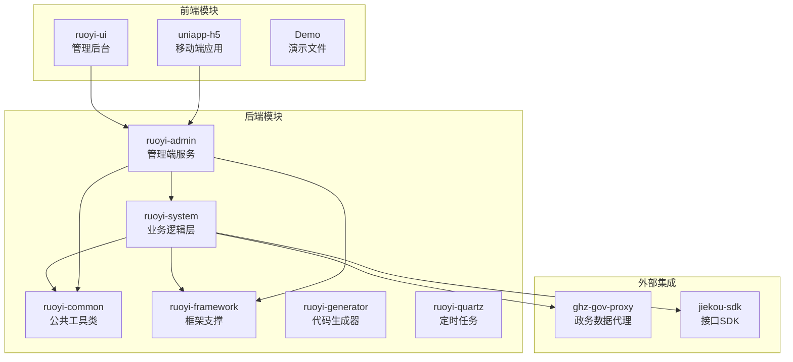
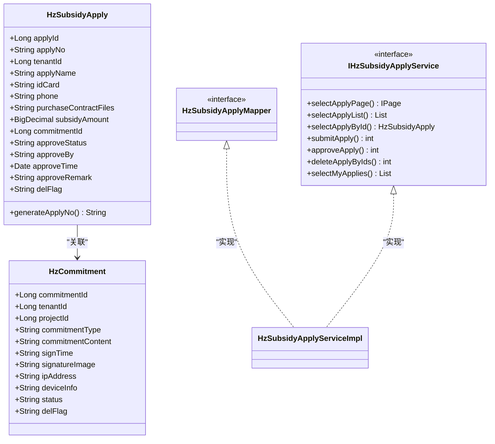
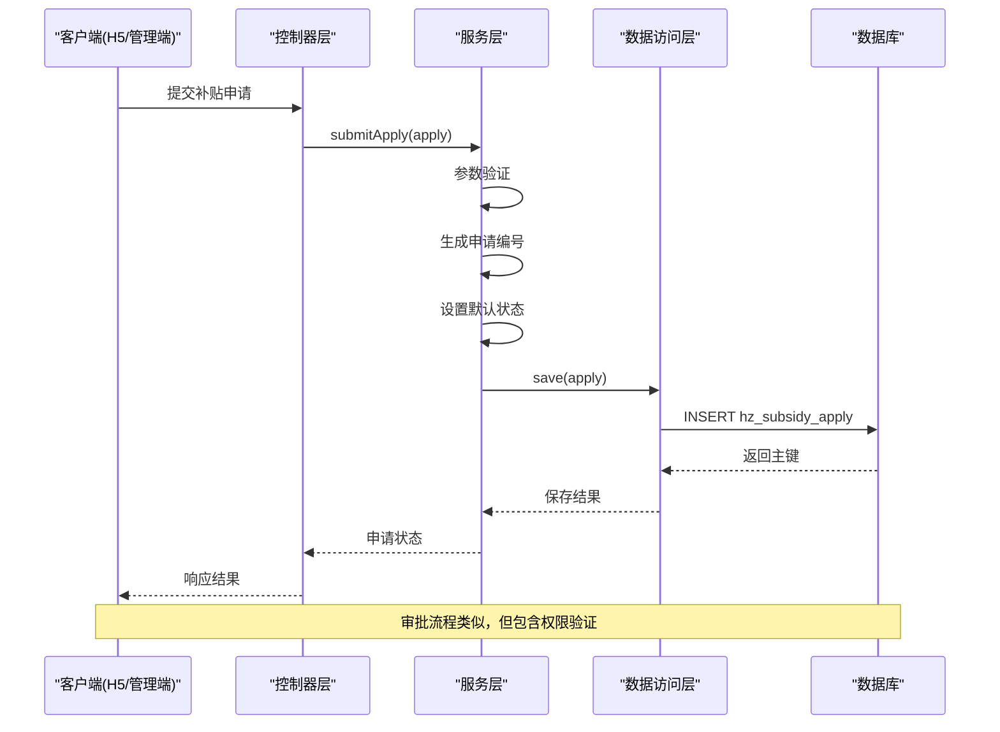
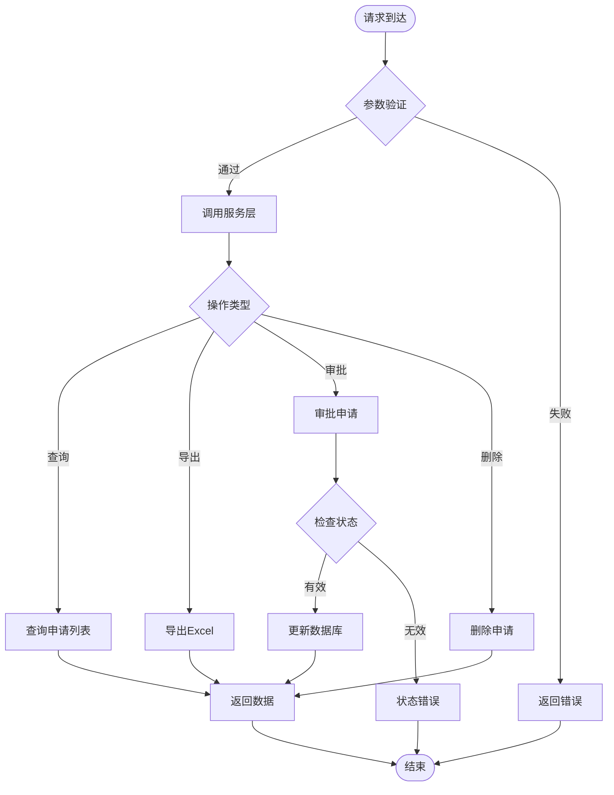
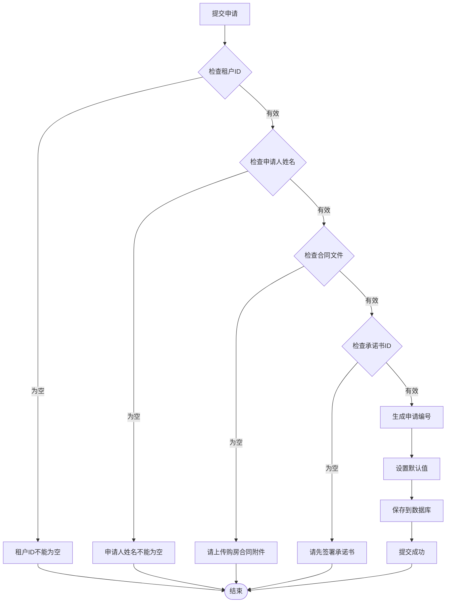
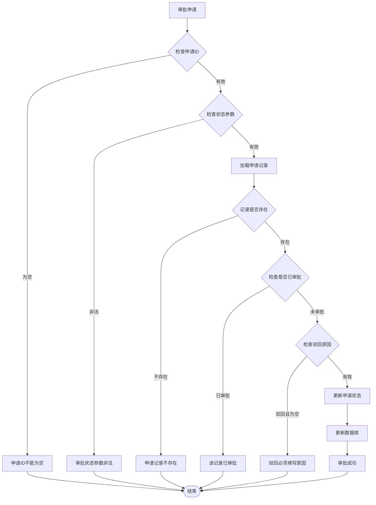
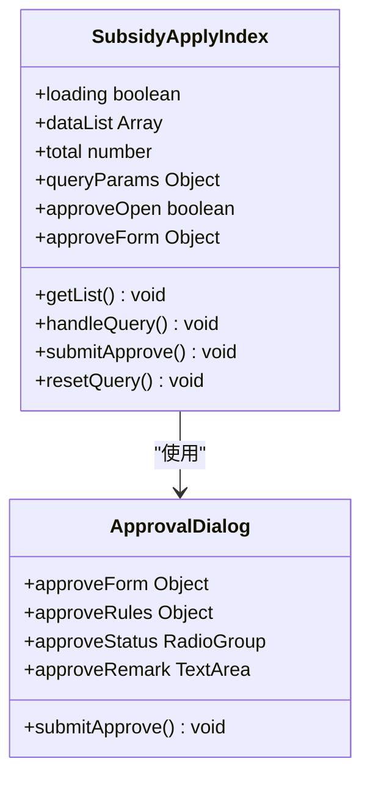
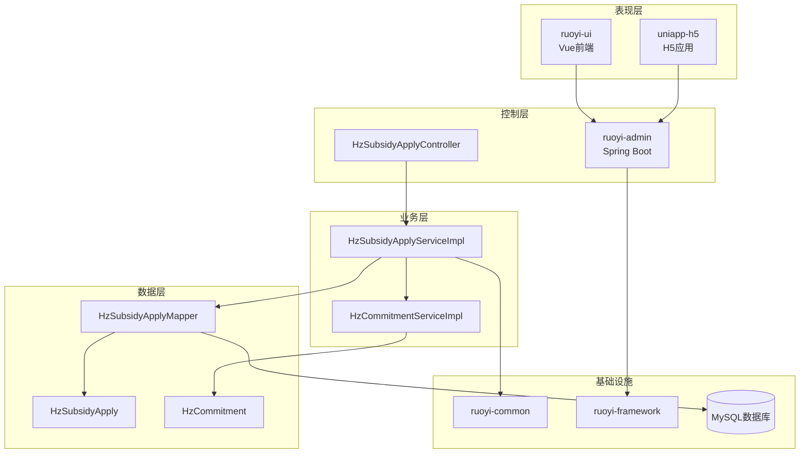

# 补贴申请系统

<cite>
**本文档引用的文件**
- [HzSubsidyApply.java](file://ruoyi-system/src/main/java/com/ruoyi/system/domain/HzSubsidyApply.java)
- [HzSubsidyApplyMapper.java](file://ruoyi-system/src/main/java/com/ruoyi/system/mapper/HzSubsidyApplyMapper.java)
- [IHzSubsidyApplyService.java](file://ruoyi-system/src/main/java/com/ruoyi/system/service/IHzSubsidyApplyService.java)
- [HzSubsidyApplyServiceImpl.java](file://ruoyi-system/src/main/java/com/ruoyi/system/service/impl/HzSubsidyApplyServiceImpl.java)
- [HzSubsidyApplyController.java](file://ruoyi-admin/src/main/java/com/ruoyi/web/controller/system/HzSubsidyApplyController.java)
- [subsidyApply.js](file://uniapp-h5/api/subsidyApply.js)
- [HzCommitment.java](file://ruoyi-system/src/main/java/com/ruoyi/system/domain/HzCommitment.java)
- [HzCommitmentServiceImpl.java](file://ruoyi-system/src/main/java/com/ruoyi/system/service/impl/HzCommitmentServiceImpl.java)
- [index.vue](file://ruoyi-ui/src/views/gangzhu/subsidyApply/index.vue)
</cite>

## 目录
1. [简介](#简介)
2. [项目结构](#项目结构)
3. [核心组件](#核心组件)
4. [架构概览](#架构概览)
5. [详细组件分析](#详细组件分析)
6. [依赖关系分析](#依赖关系分析)
7. [性能考虑](#性能考虑)
8. [故障排除指南](#故障排除指南)
9. [结论](#结论)

## 简介

补贴申请系统是一个基于RuoYi框架开发的综合性管理系统，专门用于处理租户购房后的代购补贴申请流程。该系统采用前后端分离架构，包含完整的审批流程、数据验证、权限控制和报表导出功能。

系统主要功能包括：
- 租户在线提交补贴申请
- 管理员审批流程管理
- 申请状态跟踪和历史记录
- 数据导出和统计分析
- 多层次权限控制和安全验证

## 项目结构

补贴申请系统采用标准的Maven多模块架构，主要分为以下几个核心模块：

**图表来源**
- [HzSubsidyApply.java:1-129](file://ruoyi-system/src/main/java/com/ruoyi/system/domain/HzSubsidyApply.java#L1-L129)
- [HzSubsidyApplyController.java:1-91](file://ruoyi-admin/src/main/java/com/ruoyi/web/controller/system/HzSubsidyApplyController.java#L1-L91)

**章节来源**
- [HzSubsidyApply.java:1-129](file://ruoyi-system/src/main/java/com/ruoyi/system/domain/HzSubsidyApply.java#L1-L129)
- [HzSubsidyApplyController.java:1-91](file://ruoyi-admin/src/main/java/com/ruoyi/web/controller/system/HzSubsidyApplyController.java#L1-L91)

## 核心组件

### 数据模型层

系统的核心数据模型围绕"代购补贴申请"展开，主要包含以下关键实体：

**图表来源**
- [HzSubsidyApply.java:1-129](file://ruoyi-system/src/main/java/com/ruoyi/system/domain/HzSubsidyApply.java#L1-L129)
- [HzCommitment.java:1-174](file://ruoyi-system/src/main/java/com/ruoyi/system/domain/HzCommitment.java#L1-L174)
- [HzSubsidyApplyMapper.java:1-13](file://ruoyi-system/src/main/java/com/ruoyi/system/mapper/HzSubsidyApplyMapper.java#L1-L13)
- [IHzSubsidyApplyService.java:1-36](file://ruoyi-system/src/main/java/com/ruoyi/system/service/IHzSubsidyApplyService.java#L1-L36)

### 业务服务层

系统采用分层架构设计，业务逻辑通过服务层进行封装：

- **HzSubsidyApplyServiceImpl**: 实现代购补贴申请的核心业务逻辑
- **HzCommitmentServiceImpl**: 管理承诺书相关业务
- **权限控制**: 基于注解的权限验证机制

**章节来源**
- [HzSubsidyApplyServiceImpl.java:1-158](file://ruoyi-system/src/main/java/com/ruoyi/system/service/impl/HzSubsidyApplyServiceImpl.java#L1-L158)
- [HzCommitmentServiceImpl.java:1-82](file://ruoyi-system/src/main/java/com/ruoyi/system/service/impl/HzCommitmentServiceImpl.java#L1-L82)

## 架构概览

系统采用经典的三层架构模式，结合现代化的微服务设计理念：

**图表来源**
- [HzSubsidyApplyController.java:67-81](file://ruoyi-admin/src/main/java/com/ruoyi/web/controller/system/HzSubsidyApplyController.java#L67-L81)
- [HzSubsidyApplyServiceImpl.java:52-75](file://ruoyi-system/src/main/java/com/ruoyi/system/service/impl/HzSubsidyApplyServiceImpl.java#L52-L75)

**章节来源**
- [HzSubsidyApplyController.java:1-91](file://ruoyi-admin/src/main/java/com/ruoyi/web/controller/system/HzSubsidyApplyController.java#L1-L91)
- [HzSubsidyApplyServiceImpl.java:1-158](file://ruoyi-system/src/main/java/com/ruoyi/system/service/impl/HzSubsidyApplyServiceImpl.java#L1-L158)

## 详细组件分析

### 控制器组件

管理端控制器提供完整的CRUD操作和审批功能：

**图表来源**
- [HzSubsidyApplyController.java:35-89](file://ruoyi-admin/src/main/java/com/ruoyi/web/controller/system/HzSubsidyApplyController.java#L35-L89)

### 服务层实现

服务层实现了完整的业务规则和数据验证：

#### 申请提交流程

**图表来源**
- [HzSubsidyApplyServiceImpl.java:52-75](file://ruoyi-system/src/main/java/com/ruoyi/system/service/impl/HzSubsidyApplyServiceImpl.java#L52-L75)

#### 审批流程

**图表来源**
- [HzSubsidyApplyServiceImpl.java:78-110](file://ruoyi-system/src/main/java/com/ruoyi/system/service/impl/HzSubsidyApplyServiceImpl.java#L78-L110)

**章节来源**
- [HzSubsidyApplyController.java:1-91](file://ruoyi-admin/src/main/java/com/ruoyi/web/controller/system/HzSubsidyApplyController.java#L1-L91)
- [HzSubsidyApplyServiceImpl.java:1-158](file://ruoyi-system/src/main/java/com/ruoyi/system/service/impl/HzSubsidyApplyServiceImpl.java#L1-L158)

### 前端组件

#### 管理端界面

管理端提供了完整的申请列表管理和审批功能：

**图表来源**
- [index.vue:147-196](file://ruoyi-ui/src/views/gangzhu/subsidyApply/index.vue#L147-L196)

#### H5移动端API

移动端提供了简洁的API接口：

**章节来源**
- [index.vue:1-196](file://ruoyi-ui/src/views/gangzhu/subsidyApply/index.vue#L1-L196)
- [subsidyApply.js:1-25](file://uniapp-h5/api/subsidyApply.js#L1-L25)

## 依赖关系分析

系统各模块之间的依赖关系清晰明确：

**图表来源**
- [HzSubsidyApplyController.java:1-91](file://ruoyi-admin/src/main/java/com/ruoyi/web/controller/system/HzSubsidyApplyController.java#L1-L91)
- [HzSubsidyApplyServiceImpl.java:1-158](file://ruoyi-system/src/main/java/com/ruoyi/system/service/impl/HzSubsidyApplyServiceImpl.java#L1-L158)

**章节来源**
- [HzSubsidyApply.java:1-129](file://ruoyi-system/src/main/java/com/ruoyi/system/domain/HzSubsidyApply.java#L1-L129)
- [HzCommitment.java:1-174](file://ruoyi-system/src/main/java/com/ruoyi/system/domain/HzCommitment.java#L1-L174)

## 性能考虑

### 数据访问优化

1. **分页查询**: 使用MyBatis-Plus分页插件，支持大数据量场景
2. **条件查询**: 通过LambdaQueryWrapper构建动态查询条件
3. **索引设计**: 建议在常用查询字段上建立适当索引

### 缓存策略

1. **静态数据缓存**: 字典数据和配置信息可考虑缓存
2. **查询结果缓存**: 对频繁访问的统计数据进行缓存
3. **会话管理**: 基于JWT的无状态认证机制

### 并发控制

1. **乐观锁**: 使用版本号防止并发更新冲突
2. **事务管理**: 合理的事务边界设计
3. **限流保护**: 基于注解的接口限流机制

## 故障排除指南

### 常见问题及解决方案

#### 申请提交失败

**问题症状**: 提交申请时报错"请先签署承诺书"

**可能原因**:
- commitmentId参数为空
- 承诺书状态无效
- 承诺书已被删除

**解决步骤**:
1. 确认承诺书已成功签署并获取commitmentId
2. 验证承诺书状态为有效
3. 检查承诺书是否被逻辑删除

#### 审批操作异常

**问题症状**: 审批时提示"该记录已审批"

**可能原因**:
- 申请状态已变更
- 并发操作导致的状态冲突

**解决步骤**:
1. 刷新页面确认最新状态
2. 检查是否有其他管理员已处理
3. 重新发起审批请求

#### 权限不足

**问题症状**: 访问接口返回403错误

**可能原因**:
- 用户权限不足
- 缺少必要的角色权限

**解决步骤**:
1. 检查用户角色配置
2. 确认权限标识符正确
3. 重新登录系统

**章节来源**
- [HzSubsidyApplyServiceImpl.java:52-110](file://ruoyi-system/src/main/java/com/ruoyi/system/service/impl/HzSubsidyApplyServiceImpl.java#L52-L110)
- [HzSubsidyApplyController.java:35-89](file://ruoyi-admin/src/main/java/com/ruoyi/web/controller/system/HzSubsidyApplyController.java#L35-L89)

## 结论

补贴申请系统是一个功能完整、架构清晰的现代化管理系统。系统采用分层架构设计，具有以下特点：

**技术优势**:
- 基于Spring Boot和MyBatis-Plus的企业级框架
- 完整的前后端分离架构
- 丰富的权限控制和安全机制
- 良好的扩展性和维护性

**业务价值**:
- 简化了传统的纸质申请流程
- 提高了审批效率和透明度
- 提供了完整的数据统计和报表功能
- 支持移动端和PC端双重访问

**改进建议**:
1. 可以考虑增加工作流引擎支持复杂审批流程
2. 增加消息通知机制提升用户体验
3. 完善日志审计功能
4. 考虑引入缓存机制提升性能

该系统为类似的企业管理应用场景提供了良好的参考模板，具有较强的实用价值和推广意义。