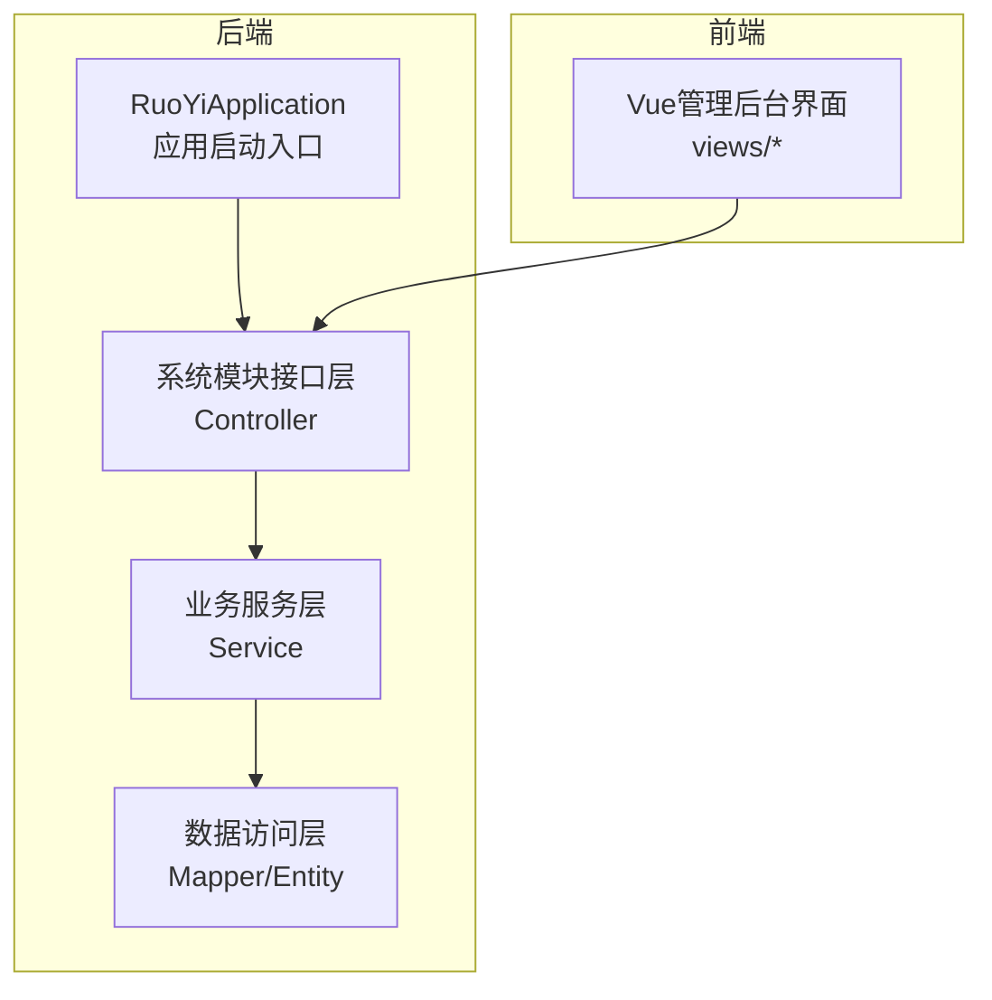
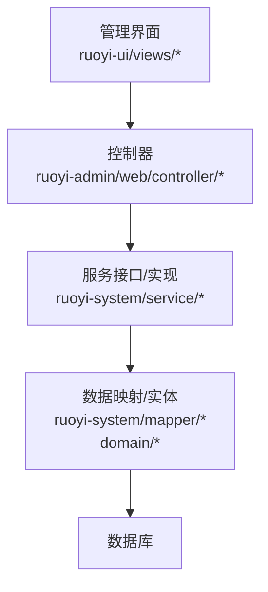
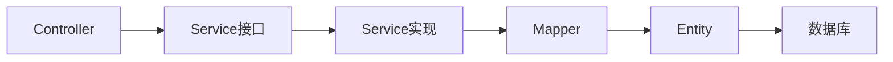

# 后台管理功能模块

<cite>
**本文引用的文件**
- [RuoYiApplication.java](file://ruoyi-admin/src/main/java/com/ruoyi/RuoYiApplication.java)
- [技术方案-完整版.html](file://技术方案-完整版.html)
- [PAGINATION_REPAIR_REPORT.txt](file://PAGINATION_REPAIR_REPORT.txt)
- [README.md](file://docs/港好住交付包-管理后台开发/README.md)
- [HzProjectController.java](file://ruoyi-admin/src/main/java/com/ruoyi/web/controller/system/HzProjectController.java)
- [HzBatchAllocationController.java](file://ruoyi-admin/src/main/java/com/ruoyi/web/controller/system/HzBatchAllocationController.java)
- [HzTenantController.java](file://ruoyi-admin/src/main/java/com/ruoyi/web/controller/system/HzTenantController.java)
- [HzHouseTypeController.java](file://ruoyi-system/src/main/java/com/ruoyi/system/controller/HzHouseTypeController.java)
- [HzHouseController.java](file://ruoyi-system/src/main/java/com/ruoyi/system/controller/HzHouseController.java)
- [HzBuildingController.java](file://ruoyi-system/src/main/java/com/ruoyi/system/controller/HzBuildingController.java)
- [HzUnitController.java](file://ruoyi-system/src/main/java/com/ruoyi/system/controller/HzUnitController.java)
- [HzCheckInController.java](file://ruoyi-system/src/main/java/com/ruoyi/system/controller/HzCheckInController.java)
- [HzCheckoutApplyController.java](file://ruoyi-system/src/main/java/com/ruoyi/system/controller/HzCheckoutApplyController.java)
- [HzContractController.java](file://ruoyi-system/src/main/java/com/ruoyi/system/controller/HzContractController.java)
- [HzBillController.java](file://ruoyi-system/src/main/java/com/ruoyi/system/controller/HzBillController.java)
- [HzInvoiceController.java](file://ruoyi-system/src/main/java/com/ruoyi/system/controller/HzInvoiceController.java)
- [HzComplaintController.java](file://ruoyi-system/src/main/java/com/ruoyi/system/controller/HzComplaintController.java)
- [HzQualificationController.java](file://ruoyi-system/src/main/java/com/ruoyi/system/controller/HzQualificationController.java)
- [HzCommitmentController.java](file://ruoyi-system/src/main/java/com/ruoyi/system/controller/HzCommitmentController.java)
- [HzCoTenantController.java](file://ruoyi-system/src/main/java/com/ruoyi/system/controller/HzCoTenantController.java)
- [HzHouseExchangeController.java](file://ruoyi-system/src/main/java/com/ruoyi/system/controller/HzHouseExchangeController.java)
- [HzEnterpriseController.java](file://ruoyi-system/src/main/java/com/ruoyi/system/controller/HzEnterpriseController.java)
- [HzEnterpriseBatchController.java](file://ruoyi-system/src/main/java/com/ruoyi/system/controller/HzEnterpriseBatchController.java)
- [HzEnterpriseBillController.java](file://ruoyi-system/src/main/java/com/ruoyi/system/controller/HzEnterpriseBillController.java)
- [HzEnterpriseCheckoutController.java](file://ruoyi-system/src/main/java/com/ruoyi/system/controller/HzEnterpriseCheckoutController.java)
- [HzRefundApplyController.java](file://ruoyi-system/src/main/java/com/ruoyi/system/controller/HzRefundApplyController.java)
- [HzRepairController.java](file://ruoyi-system/src/main/java/com/ruoyi/system/controller/HzRepairController.java)
- [HzAppointmentController.java](file://ruoyi-system/src/main/java/com/ruoyi/system/controller/HzAppointmentController.java)
- [HzPolicyAppController.java](file://ruoyi-admin/src/main/java/com/ruoyi/web/controller/h5/HzPolicyAppController.java)
- [HzActivityAppController.java](file://ruoyi-admin/src/main/java/com/ruoyi/web/controller/h5/HzActivityAppController.java)
- [HzAnnouncementController.java](file://ruoyi-admin/src/main/java/com/ruoyi/web/controller/h5/HzAnnouncementController.java)
- [HzBillAppController.java](file://ruoyi-admin/src/main/java/com/ruoyi/web/controller/h5/HzBillAppController.java)
- [HzCheckInAppController.java](file://ruoyi-admin/src/main/java/com/ruoyi/web/controller/h5/HzCheckInAppController.java)
- [HzCheckOutAppController.java](file://ruoyi-admin/src/main/java/com/ruoyi/web/controller/h5/HzCheckOutAppController.java)
- [HzCohabitantAppController.java](file://ruoyi-admin/src/main/java/com/ruoyi/web/controller/h5/HzCohabitantAppController.java)
- [HzCommitmentAppController.java](file://ruoyi-admin/src/main/java/com/ruoyi/web/controller/h5/HzCommitmentAppController.java)
- [HzComplaintAppController.java](file://ruoyi-admin/src/main/java/com/ruoyi/web/controller/h5/HzComplaintAppController.java)
- [HzProjectController.java](file://ruoyi-admin/src/main/java/com/ruoyi/web/controller/h5/HzProjectController.java)
- [HzTenantController.java](file://ruoyi-admin/src/main/java/com/ruoyi/web/controller/h5/HzTenantController.java)
- [HzHouseTypeController.java](file://ruoyi-system/src/main/java/com/ruoyi/system/controller/HzHouseTypeController.java)
- [HzHouseController.java](file://ruoyi-system/src/main/java/com/ruoyi/system/controller/HzHouseController.java)
- [HzBuildingController.java](file://ruoyi-system/src/main/java/com/ruoyi/system/controller/HzBuildingController.java)
- [HzUnitController.java](file://ruoyi-system/src/main/java/com/ruoyi/system/controller/HzUnitController.java)
- [HzCheckInController.java](file://ruoyi-system/src/main/java/com/ruoyi/system/controller/HzCheckInController.java)
- [HzCheckoutApplyController.java](file://ruoyi-system/src/main/java/com/ruoyi/system/controller/HzCheckoutApplyController.java)
- [HzContractController.java](file://ruoyi-system/src/main/java/com/ruoyi/system/controller/HzContractController.java)
- [HzBillController.java](file://ruoyi-system/src/main/java/com/ruoyi/system/controller/HzBillController.java)
- [HzInvoiceController.java](file://ruoyi-system/src/main/java/com/ruoyi/system/controller/HzInvoiceController.java)
- [HzComplaintController.java](file://ruoyi-system/src/main/java/com/ruoyi/system/controller/HzComplaintController.java)
- [HzQualificationController.java](file://ruoyi-system/src/main/java/com/ruoyi/system/controller/HzQualificationController.java)
- [HzCommitmentController.java](file://ruoyi-system/src/main/java/com/ruoyi/system/controller/HzCommitmentController.java)
- [HzCoTenantController.java](file://ruoyi-system/src/main/java/com/ruoyi/system/controller/HzCoTenantController.java)
- [HzHouseExchangeController.java](file://ruoyi-system/src/main/java/com/ruoyi/system/controller/HzHouseExchangeController.java)
- [HzEnterpriseController.java](file://ruoyi-system/src/main/java/com/ruoyi/system/controller/HzEnterpriseController.java)
- [HzEnterpriseBatchController.java](file://ruoyi-system/src/main/java/com/ruoyi/system/controller/HzEnterpriseBatchController.java)
- [HzEnterpriseBillController.java](file://ruoyi-system/src/main/java/com/ruoyi/system/controller/HzEnterpriseBillController.java)
- [HzEnterpriseCheckoutController.java](file://ruoyi-system/src/main/java/com/ruoyi/system/controller/HzEnterpriseCheckoutController.java)
- [HzRefundApplyController.java](file://ruoyi-system/src/main/java/com/ruoyi/system/controller/HzRefundApplyController.java)
- [HzRepairController.java](file://ruoyi-system/src/main/java/com/ruoyi/system/controller/HzRepairController.java)
- [HzAppointmentController.java](file://ruoyi-system/src/main/java/com/ruoyi/system/controller/HzAppointmentController.java)
- [HzActivityController.java](file://ruoyi-admin/src/main/java/com/ruoyi/gangzhu/activity/controller/HzActivityController.java)
- [HzPolicyController.java](file://ruoyi-admin/src/main/java/com/ruoyi/gangzhu/policy/controller/HzPolicyController.java)
- [SysUserController.java](file://ruoyi-system/src/main/java/com/ruoyi/system/controller/SysUserController.java)
- [SysRoleController.java](file://ruoyi-system/src/main/java/com/ruoyi/system/controller/SysRoleController.java)
- [SysConfigController.java](file://ruoyi-system/src/main/java/com/ruoyi/system/controller/SysConfigController.java)
- [SysDictTypeController.java](file://ruoyi-system/src/main/java/com/ruoyi/system/controller/SysDictTypeController.java)
- [SysDictDataController.java](file://ruoyi-system/src/main/java/com/ruoyi/system/controller/SysDictDataController.java)
- [SysPostController.java](file://ruoyi-system/src/main/java/com/ruoyi/system/controller/SysPostController.java)
- [SysNoticeController.java](file://ruoyi-system/src/main/java/com/ruoyi/system/controller/SysNoticeController.java)
- [SysLogininforController.java](file://ruoyi-system/src/main/java/com/ruoyi/system/controller/SysLogininforController.java)
- [SysOperlogController.java](file://ruoyi-system/src/main/java/com/ruoyi/system/controller/SysOperlogController.java)
- [HzReportReceiptController.java](file://ruoyi-ui/src/views/report/receipt/index.vue)
- [HzReportCustomController.java](file://ruoyi-ui/src/views/report/custom/index.vue)
- [HzUserMessageController.java](file://ruoyi-ui/src/views/userMessage/index.vue)
- [HzUserManagementController.java](file://ruoyi-ui/src/views/user/index.vue)
- [HzConfigOperationController.java](file://ruoyi-ui/src/views/config/operation/index.vue)
- [HzConfigTemplateController.java](file://ruoyi-ui/src/views/config/template/index.vue)
- [HzEnterpriseManagementController.java](file://ruoyi-ui/src/views/enterprise/index.vue)
- [HzEnterpriseBatchManagementController.java](file://ruoyi-ui/src/views/enterpriseBatch/index.vue)
- [HzEnterpriseBillManagementController.java](file://ruoyi-ui/src/views/enterpriseBill/index.vue)
- [HzEnterpriseCheckoutManagementController.java](file://ruoyi-ui/src/views/enterpriseCheckout/index.vue)
- [HzHouseManagementController.java](file://ruoyi-ui/src/views/house/index.vue)
- [HzHouseBatchManagementController.java](file://ruoyi-ui/src/views/house/batch/index.vue)
- [HzHouseEnterpriseManagementController.java](file://ruoyi-ui/src/views/house/enterprise/index.vue)
- [HzHouseTypeManagementController.java](file://ruoyi-ui/src/views/houseType/index.vue)
- [HzProjectManagementController.java](file://ruoyi-ui/src/views/project/index.vue)
- [HzBuildingManagementController.java](file://ruoyi-ui/src/views/building/index.vue)
- [HzUnitManagementController.java](file://ruoyi-ui/src/views/unit/index.vue)
- [HzTenantManagementController.java](file://ruoyi-ui/src/views/tenant/index.vue)
- [HzCoTenantManagementController.java](file://ruoyi-ui/src/views/cohabitant/index.vue)
- [HzHouseExchangeManagementController.java](file://ruoyi-ui/src/views/exchange/index.vue)
- [HzContractManagementController.java](file://ruoyi-ui/src/views/contract/index.vue)
- [HzCheckInManagementController.java](file://ruoyi-ui/src/views/checkin/index.vue)
- [HzCheckoutManagementController.java](file://ruoyi-ui/src/views/checkout/index.vue)
- [HzBillManagementController.java](file://ruoyi-ui/src/views/bill/index.vue)
- [HzInvoiceManagementController.java](file://ruoyi-ui/src/views/invoice/index.vue)
- [HzRefundManagementController.java](file://ruoyi-ui/src/views/refund/index.vue)
- [HzComplaintManagementController.java](file://ruoyi-ui/src/views/complaint/index.vue)
- [HzQualificationManagementController.java](file://ruoyi-ui/src/views/qualification/index.vue)
- [HzCommitmentManagementController.java](file://ruoyi-ui/src/views/application/commitment/index.vue)
- [HzCommitmentTemplateManagementController.java](file://ruoyi-ui/src/views/application/commitmentTemplate/index.vue)
- [HzContractTemplateManagementController.java](file://ruoyi-ui/src/views/config/template/index.vue)
- [HzOperationConfigManagementController.java](file://ruoyi-ui/src/views/config/operation/index.vue)
- [HzAppointmentManagementController.java](file://ruoyi-ui/src/views/appointment/index.vue)
- [HzActivityManagementController.java](file://ruoyi-ui/src/views/activity/index.vue)
- [HzPolicyManagementController.java](file://ruoyi-ui/src/views/policy/index.vue)
- [HzRepairManagementController.java](file://ruoyi-ui/src/views/repair/index.vue)
- [HzEnterpriseRepairManagementController.java](file://ruoyi-ui/src/views/service/enterprise.vue)
- [HzDashboardController.java](file://ruoyi-ui/src/views/dashboard/index.vue)
- [HzSystemUserManagementController.java](file://ruoyi-ui/src/views/system/user/index.vue)
- [HzSystemRoleManagementController.java](file://ruoyi-ui/src/views/system/role/index.vue)
- [HzSystemConfigManagementController.java](file://ruoyi-ui/src/views/system/config/index.vue)
- [HzSystemDictManagementController.java](file://ruoyi-ui/src/views/system/dict/index.vue)
- [HzSystemPostManagementController.java](file://ruoyi-ui/src/views/system/post/index.vue)
- [HzSystemNoticeManagementController.java](file://ruoyi-ui/src/views/system/notice/index.vue)
- [HzSystemLogininforManagementController.java](file://ruoyi-ui/src/views/system/logininfor/index.vue)
- [HzSystemOperlogManagementController.java](file://ruoyi-ui/src/views/system/operlog/index.vue)
</cite>

## 目录
1. [简介](#简介)
2. [项目结构](#项目结构)
3. [核心组件](#核心组件)
4. [架构总览](#架构总览)
5. [详细组件分析](#详细组件分析)
6. [依赖分析](#依赖分析)
7. [性能考虑](#性能考虑)
8. [故障排查指南](#故障排查指南)
9. [结论](#结论)
10. [附录](#附录)

## 简介
本文件面向港好住信息系统后台管理功能模块，基于现有工程代码与技术方案，系统梳理19大核心功能模块，覆盖资产管理、业务管理、财务管理、服务管理、系统管理等，并结合后端控制器与前端视图，给出职责边界、业务流程、操作界面设计、权限控制与数据统计分析要点，为系统管理员提供操作指导，为开发团队提供实现参考。

## 项目结构
后台管理采用前后端分离架构，后端基于Spring Boot与RuoYi框架，提供REST接口；前端基于Vue 2 + Element UI，提供管理后台界面。系统启动入口位于后端应用主类，技术方案明确了19大功能模块的职责与流程。



**图表来源**
- [RuoYiApplication.java:12-20](file://ruoyi-admin/src/main/java/com/ruoyi/RuoYiApplication.java#L12-L20)
- [技术方案-完整版.html:1-60](file://技术方案-完整版.html#L1-L60)

**章节来源**
- [RuoYiApplication.java:12-20](file://ruoyi-admin/src/main/java/com/ruoyi/RuoYiApplication.java#L12-L20)
- [技术方案-完整版.html:1-60](file://技术方案-完整版.html#L1-L60)

## 核心组件
- 后端启动与框架
  - 应用启动类负责Spring Boot启动与日志输出。
  - 技术方案明确系统采用前后端分离、RBAC权限模型、JWT认证、MyBatis-Plus等技术选型。
- 前端界面
  - 管理后台采用Vue 2 + Element UI，提供各功能模块的页面与交互。
  - 交付包文档明确了交付要求与技术栈。

**章节来源**
- [RuoYiApplication.java:12-20](file://ruoyi-admin/src/main/java/com/ruoyi/RuoYiApplication.java#L12-L20)
- [技术方案-完整版.html:1-60](file://技术方案-完整版.html#L1-L60)
- [README.md:20-28](file://docs/港好住交付包-管理后台开发/README.md#L20-L28)

## 架构总览
后台管理功能模块围绕“数据-业务-界面”三层展开：数据层由实体与映射构成；业务层由服务接口与实现承载；界面层由控制器与前端视图组成。权限控制通过注解与菜单配置实现，数据统计与报表通过聚合查询与导出能力支撑。



**图表来源**
- [技术方案-完整版.html:1-60](file://技术方案-完整版.html#L1-L60)
- [HzProjectController.java:29-100](file://ruoyi-admin/src/main/java/com/ruoyi/web/controller/system/HzProjectController.java#L29-L100)
- [HzBatchAllocationController.java:29-125](file://ruoyi-admin/src/main/java/com/ruoyi/web/controller/system/HzBatchAllocationController.java#L29-L125)

## 详细组件分析

### 1. 首页数据统计
- 职责
  - 聚合财务、房源、租户、项目等关键指标，形成可视化看板。
- 业务流程
  - 后端按维度统计（如在租人数、应收未收、合同到期预警等），前端渲染图表与卡片。
- 界面设计
  - 仪表盘布局，支持筛选器（时间、项目、状态）与导出。
- 权限与数据
  - 通过权限注解控制访问；数据来源由各业务模块统计接口汇聚。

**章节来源**
- [技术方案-完整版.html:1-60](file://技术方案-完整版.html#L1-L60)
- [HzDashboardController.java](file://ruoyi-ui/src/views/dashboard/index.vue)

### 2. 资产管理
- 2.1 项目管理
  - 职责：项目信息维护、项目内房型批量生成。
  - 控制器提供列表、新增、修改、删除、导出、批量生成标准房型等接口。
  - 界面：项目列表、新增/编辑弹窗、批量生成按钮。
  
  ```mermaid
sequenceDiagram
participant UI as "管理界面"
participant Ctrl as "HzProjectController"
participant Svc as "IHzProjectService"
UI->>Ctrl : GET /system/project/list
Ctrl->>Svc : selectProjectPage(...)
Svc-->>Ctrl : IPage<HzProject>
Ctrl-->>UI : TableDataInfo
UI->>Ctrl : POST /system/project/{projectId}/generateHouseTypes
Ctrl->>Svc : insertHouseType(标准房型)
Svc-->>Ctrl : 结果
Ctrl-->>UI : AjaxResult
```

  **图表来源**
  - [HzProjectController.java:42-169](file://ruoyi-admin/src/main/java/com/ruoyi/web/controller/system/HzProjectController.java#L42-L169)

  **章节来源**
  - [HzProjectController.java:42-169](file://ruoyi-admin/src/main/java/com/ruoyi/web/controller/system/HzProjectController.java#L42-L169)
  - [HzProjectManagementController.java](file://ruoyi-ui/src/views/project/index.vue)

- 2.2 房源管理
  - 职责：房源信息维护、上下架、状态管理、图片与VR管理。
  - 控制器提供分页查询、导入导出、状态变更等接口。
  - 界面：房源列表、详情、批量操作、图片/VR管理。
  
  **章节来源**
  - [HzHouseController.java](file://ruoyi-system/src/main/java/com/ruoyi/system/controller/HzHouseController.java)
  - [HzHouseManagementController.java](file://ruoyi-ui/src/views/house/index.vue)

- 2.3 配租批次管理
  - 职责：集中配租批次的创建、审批、作废、导入人员、保存分配等。
  - 控制器提供列表、审批、作废、导入模板下载、人员导入、保存分配、查询批次房源/人员等接口。
  - 界面：批次列表、审批弹窗、导入模板、人员导入、分配确认。
  
  ```mermaid
sequenceDiagram
participant UI as "管理界面"
participant Ctrl as "HzBatchAllocationController"
participant Svc as "IHzBatchAllocationService"
UI->>Ctrl : GET /system/batch/list
Ctrl->>Svc : selectBatchAllocationPage(...)
Svc-->>Ctrl : IPage<HzBatchAllocation>
Ctrl-->>UI : TableDataInfo
UI->>Ctrl : POST /system/batch/importTenants
Ctrl->>Svc : importTenants(file)
Svc-->>Ctrl : List<Map>
Ctrl-->>UI : AjaxResult
UI->>Ctrl : POST /system/batch/saveAllocation
Ctrl->>Svc : saveBatchAllocation(params)
Svc-->>Ctrl : 结果
Ctrl-->>UI : AjaxResult
```

  **图表来源**
  - [HzBatchAllocationController.java:40-160](file://ruoyi-admin/src/main/java/com/ruoyi/web/controller/system/HzBatchAllocationController.java#L40-L160)

  **章节来源**
  - [HzBatchAllocationController.java:40-160](file://ruoyi-admin/src/main/java/com/ruoyi/web/controller/system/HzBatchAllocationController.java#L40-L160)
  - [HzHouseBatchManagementController.java](file://ruoyi-ui/src/views/house/batch/index.vue)

- 2.4 企业客户管理
  - 职责：企业信息、企业配租批次、企业账单、企业退租等管理。
  - 控制器与界面分别对应企业列表、批次管理、账单管理、退租管理。
  
  **章节来源**
  - [HzEnterpriseController.java](file://ruoyi-system/src/main/java/com/ruoyi/system/controller/HzEnterpriseController.java)
  - [HzEnterpriseBatchController.java](file://ruoyi-system/src/main/java/com/ruoyi/system/controller/HzEnterpriseBatchController.java)
  - [HzEnterpriseBillController.java](file://ruoyi-system/src/main/java/com/ruoyi/system/controller/HzEnterpriseBillController.java)
  - [HzEnterpriseCheckoutController.java](file://ruoyi-system/src/main/java/com/ruoyi/system/controller/HzEnterpriseCheckoutController.java)
  - [HzEnterpriseManagementController.java](file://ruoyi-ui/src/views/enterprise/index.vue)
  - [HzEnterpriseBatchManagementController.java](file://ruoyi-ui/src/views/enterpriseBatch/index.vue)
  - [HzEnterpriseBillManagementController.java](file://ruoyi-ui/src/views/enterpriseBill/index.vue)
  - [HzEnterpriseCheckoutManagementController.java](file://ruoyi-ui/src/views/enterpriseCheckout/index.vue)

### 3. 申请信息管理
- 3.1 租户管理
  - 职责：租户信息查询、导出、修改。
  - 控制器提供分页查询、导出、修改接口。
  
  **章节来源**
  - [HzTenantController.java:36-83](file://ruoyi-admin/src/main/java/com/ruoyi/web/controller/system/HzTenantController.java#L36-L83)
  - [HzTenantManagementController.java](file://ruoyi-ui/src/views/tenant/index.vue)

- 3.2 预约看房管理
  - 职责：预约记录查询、签收、确认看房。
  - 控制器提供列表、签收、导出等接口。
  
  **章节来源**
  - [HzAppointmentController.java](file://ruoyi-system/src/main/java/com/ruoyi/system/controller/HzAppointmentController.java)
  - [HzAppointmentManagementController.java](file://ruoyi-ui/src/views/appointment/index.vue)

- 3.3 投诉管理
  - 职责：投诉记录查询、处置。
  - 控制器提供列表、处理、导出等接口。
  
  **章节来源**
  - [HzComplaintController.java](file://ruoyi-system/src/main/java/com/ruoyi/system/controller/HzComplaintController.java)
  - [HzComplaintManagementController.java](file://ruoyi-ui/src/views/complaint/index.vue)

- 3.4 资格申诉审核
  - 职责：资格申诉的审核、导出。
  - 控制器提供列表、审核、导出等接口。
  
  **章节来源**
  - [HzQualificationController.java](file://ruoyi-system/src/main/java/com/ruoyi/system/controller/HzQualificationController.java)
  - [HzQualificationManagementController.java](file://ruoyi-ui/src/views/qualification/index.vue)

- 3.5 承诺书管理
  - 职责：承诺书查询、导出。
  - 控制器提供列表、导出等接口。
  
  **章节来源**
  - [HzCommitmentController.java](file://ruoyi-system/src/main/java/com/ruoyi/system/controller/HzCommitmentController.java)
  - [HzCommitmentManagementController.java](file://ruoyi-ui/src/views/application/commitment/index.vue)
  - [HzCommitmentTemplateManagementController.java](file://ruoyi-ui/src/views/application/commitmentTemplate/index.vue)

### 4. 合同管理
- 职责：合同查询、审批、导出、模板管理。
- 控制器提供列表、审批、导出、模板管理等接口。
- 界面：合同列表、详情、审批弹窗、模板管理。

**章节来源**
- [HzContractController.java](file://ruoyi-system/src/main/java/com/ruoyi/system/controller/HzContractController.java)
- [HzContractManagementController.java](file://ruoyi-ui/src/views/contract/index.vue)

### 5. 入住/退租管理
- 5.1 入住管理
  - 职责：常态入住、企业入住管理。
  - 控制器提供列表、签收、录入物品清单、确认等接口。
  
  **章节来源**
  - [HzCheckInController.java](file://ruoyi-system/src/main/java/com/ruoyi/system/controller/HzCheckInController.java)
  - [HzCheckInManagementController.java](file://ruoyi-ui/src/views/checkin/index.vue)

- 5.2 退租管理
  - 职责：常态退租、企业退租管理。
  - 控制器提供列表、审批、验收、退费等接口。
  
  **章节来源**
  - [HzCheckoutApplyController.java](file://ruoyi-system/src/main/java/com/ruoyi/system/controller/HzCheckoutApplyController.java)
  - [HzCheckoutManagementController.java](file://ruoyi-ui/src/views/checkout/index.vue)

### 6. 财务管理
- 6.1 租金账单管理
  - 职责：账单查询、催缴、导出。
  - 控制器提供列表、导出、催缴等接口。
  
  **章节来源**
  - [HzBillController.java](file://ruoyi-system/src/main/java/com/ruoyi/system/controller/HzBillController.java)
  - [HzBillManagementController.java](file://ruoyi-ui/src/views/bill/index.vue)

- 6.2 开票管理
  - 职责：开票申请、上传发票、发票查询。
  - 控制器提供列表、上传、导出等接口。
  
  **章节来源**
  - [HzInvoiceController.java](file://ruoyi-system/src/main/java/com/ruoyi/system/controller/HzInvoiceController.java)
  - [HzInvoiceManagementController.java](file://ruoyi-ui/src/views/invoice/index.vue)

- 6.3 退款管理
  - 职责：退款申请、审批、退费。
  - 控制器提供列表、审批、导出等接口。
  
  **章节来源**
  - [HzRefundApplyController.java](file://ruoyi-system/src/main/java/com/ruoyi/system/controller/HzRefundApplyController.java)
  - [HzRefundManagementController.java](file://ruoyi-ui/src/views/refund/index.vue)

- 6.4 企业账单/退租
  - 职责：企业集中账单、退租处理。
  
  **章节来源**
  - [HzEnterpriseBillController.java](file://ruoyi-system/src/main/java/com/ruoyi/system/controller/HzEnterpriseBillController.java)
  - [HzEnterpriseCheckoutController.java](file://ruoyi-system/src/main/java/com/ruoyi/system/controller/HzEnterpriseCheckoutController.java)

### 7. 服务管理
- 7.1 保洁/搬家/报修订单管理
  - 职责：服务订单查询、派单、完成、评价。
  - 控制器提供列表、派单、完成、导出等接口。
  
  **章节来源**
  - [HzRepairController.java](file://ruoyi-system/src/main/java/com/ruoyi/system/controller/HzRepairController.java)
  - [HzRepairManagementController.java](file://ruoyi-ui/src/views/repair/index.vue)
  - [HzEnterpriseRepairManagementController.java](file://ruoyi-ui/src/views/service/enterprise.vue)

### 8. 报表管理
- 职责：项目收款台账、自定义报表、导出。
- 界面：收款报表、自定义报表、导出按钮。

**章节来源**
- [HzReportReceiptController.java](file://ruoyi-ui/src/views/report/receipt/index.vue)
- [HzReportCustomController.java](file://ruoyi-ui/src/views/report/custom/index.vue)

### 9. 系统管理
- 9.1 用户管理
  - 职责：用户查询、新增、修改、删除、重置密码、角色分配。
  - 控制器提供列表、新增、修改、删除、导出等接口。
  
  **章节来源**
  - [SysUserController.java](file://ruoyi-system/src/main/java/com/ruoyi/system/controller/SysUserController.java)
  - [HzSystemUserManagementController.java](file://ruoyi-ui/src/views/system/user/index.vue)

- 9.2 角色权限管理
  - 职责：角色管理、菜单权限、数据权限。
  
  **章节来源**
  - [SysRoleController.java](file://ruoyi-system/src/main/java/com/ruoyi/system/controller/SysRoleController.java)
  - [HzSystemRoleManagementController.java](file://ruoyi-ui/src/views/system/role/index.vue)

- 9.3 配置管理
  - 职责：消息通知、合同模板、运营配置、公告、政策文件。
  
  **章节来源**
  - [SysConfigController.java](file://ruoyi-system/src/main/java/com/ruoyi/system/controller/SysConfigController.java)
  - [HzConfigOperationController.java](file://ruoyi-ui/src/views/config/operation/index.vue)
  - [HzConfigTemplateController.java](file://ruoyi-ui/src/views/config/template/index.vue)

- 9.4 字典、岗位、公告、日志等
  - 职责：字典类型/数据、岗位、通知公告、登录日志、操作日志管理。
  
  **章节来源**
  - [SysDictTypeController.java](file://ruoyi-system/src/main/java/com/ruoyi/system/controller/SysDictTypeController.java)
  - [SysDictDataController.java](file://ruoyi-system/src/main/java/com/ruoyi/system/controller/SysDictDataController.java)
  - [SysPostController.java](file://ruoyi-system/src/main/java/com/ruoyi/system/controller/SysPostController.java)
  - [SysNoticeController.java](file://ruoyi-system/src/main/java/com/ruoyi/system/controller/SysNoticeController.java)
  - [SysLogininforController.java](file://ruoyi-system/src/main/java/com/ruoyi/system/controller/SysLogininforController.java)
  - [SysOperlogController.java](file://ruoyi-system/src/main/java/com/ruoyi/system/controller/SysOperlogController.java)
  - [HzSystemDictManagementController.java](file://ruoyi-ui/src/views/system/dict/index.vue)
  - [HzSystemPostManagementController.java](file://ruoyi-ui/src/views/system/post/index.vue)
  - [HzSystemNoticeManagementController.java](file://ruoyi-ui/src/views/system/notice/index.vue)
  - [HzSystemLogininforManagementController.java](file://ruoyi-ui/src/views/system/logininfor/index.vue)
  - [HzSystemOperlogManagementController.java](file://ruoyi-ui/src/views/system/operlog/index.vue)

### 10. 其他业务模块
- 合住人管理
  - 职责：合住人申请审批。
  
  **章节来源**
  - [HzCoTenantController.java](file://ruoyi-system/src/main/java/com/ruoyi/system/controller/HzCoTenantController.java)
  - [HzCoTenantManagementController.java](file://ruoyi-ui/src/views/cohabitant/index.vue)

- 调换房管理
  - 职责：调换房申请审核。
  
  **章节来源**
  - [HzHouseExchangeController.java](file://ruoyi-system/src/main/java/com/ruoyi/system/controller/HzHouseExchangeController.java)
  - [HzHouseExchangeManagementController.java](file://ruoyi-ui/src/views/exchange/index.vue)

- 活动/政策/公告
  - 职责：活动、政策、公告发布与管理。
  
  **章节来源**
  - [HzActivityController.java](file://ruoyi-admin/src/main/java/com/ruoyi/gangzhu/activity/controller/HzActivityController.java)
  - [HzPolicyController.java](file://ruoyi-admin/src/main/java/com/ruoyi/gangzhu/policy/controller/HzPolicyController.java)
  - [HzActivityAppController.java](file://ruoyi-admin/src/main/java/com/ruoyi/web/controller/h5/HzActivityAppController.java)
  - [HzPolicyAppController.java](file://ruoyi-admin/src/main/java/com/ruoyi/web/controller/h5/HzPolicyAppController.java)
  - [HzAnnouncementController.java](file://ruoyi-admin/src/main/java/com/ruoyi/web/controller/h5/HzAnnouncementController.java)
  - [HzActivityManagementController.java](file://ruoyi-ui/src/views/activity/index.vue)
  - [HzPolicyManagementController.java](file://ruoyi-ui/src/views/policy/index.vue)
  - [HzUserMessageController.java](file://ruoyi-ui/src/views/userMessage/index.vue)

## 依赖分析
- 控制器与服务层
  - 各Controller通过@Autowired注入对应Service接口，遵循依赖倒置原则。
- 分页与导出
  - 报告与列表普遍采用分页工具与Excel导出工具，提升大数据量场景下的性能与可用性。
- 权限控制
  - 使用@PreAuthorize注解配合菜单权限，实现细粒度的接口级权限控制。



**图表来源**
- [HzProjectController.java:33-38](file://ruoyi-admin/src/main/java/com/ruoyi/web/controller/system/HzProjectController.java#L33-L38)
- [HzBatchAllocationController.java:33-34](file://ruoyi-admin/src/main/java/com/ruoyi/web/controller/system/HzBatchAllocationController.java#L33-L34)

**章节来源**
- [HzProjectController.java:33-38](file://ruoyi-admin/src/main/java/com/ruoyi/web/controller/system/HzProjectController.java#L33-L38)
- [HzBatchAllocationController.java:33-34](file://ruoyi-admin/src/main/java/com/ruoyi/web/controller/system/HzBatchAllocationController.java#L33-L34)

## 性能考虑
- 分页与导出
  - 报告与列表普遍采用分页查询与Excel导出，避免一次性加载大量数据。
- 接口分页修复
  - 文档指出部分Service已有分页方法，仅需改Controller；另有部分需新增Service分页方法，建议优先补齐分页能力，降低数据库压力。
- 缓存与异步
  - 可结合Redis缓存热点数据，定时任务异步处理报表生成与通知推送。

**章节来源**
- [PAGINATION_REPAIR_REPORT.txt:33-73](file://PAGINATION_REPAIR_REPORT.txt#L33-L73)

## 故障排查指南
- 权限问题
  - 若出现无权限访问，检查菜单权限与角色配置，确认@PreAuthorize注解对应的权限标识是否存在。
- 分页异常
  - 若列表为空或分页参数无效，检查Controller中分页工具调用与Service分页方法实现。
- 导出失败
  - 检查Excel导出工具调用与响应头设置，确认导出数据量与列定义。
- 数据不一致
  - 核对业务流程（如审批、签收、退租验收）是否按流程执行，必要时回溯操作日志。

**章节来源**
- [HzBatchAllocationController.java:55-62](file://ruoyi-admin/src/main/java/com/ruoyi/web/controller/system/HzBatchAllocationController.java#L55-L62)
- [HzProjectController.java:58-68](file://ruoyi-admin/src/main/java/com/ruoyi/web/controller/system/HzProjectController.java#L58-L68)

## 结论
后台管理功能模块覆盖资产、业务、财务、服务、系统五大域，通过清晰的控制器-服务-数据层分工与完善的权限控制，支撑起从项目到合同、从入住到退租、从账单到报表的全生命周期管理。建议优先完善分页与导出能力，强化数据一致性与异常处理，持续优化用户体验与运维效率。

## 附录
- 交付包与技术栈
  - 前端采用Vue 2 + Element UI + SCSS，后端基于RuoYi框架。
- 业务流程参考
  - 资格校验、选房签约、入住/退租、续租、账单缴费、投诉处理、代购补贴等流程可参考技术方案中的流程图。

**章节来源**
- [README.md:20-28](file://docs/港好住交付包-管理后台开发/README.md#L20-L28)
- [技术方案-完整版.html:1-60](file://技术方案-完整版.html#L1-L60)