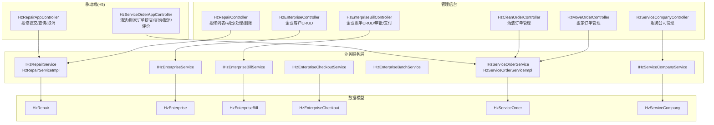
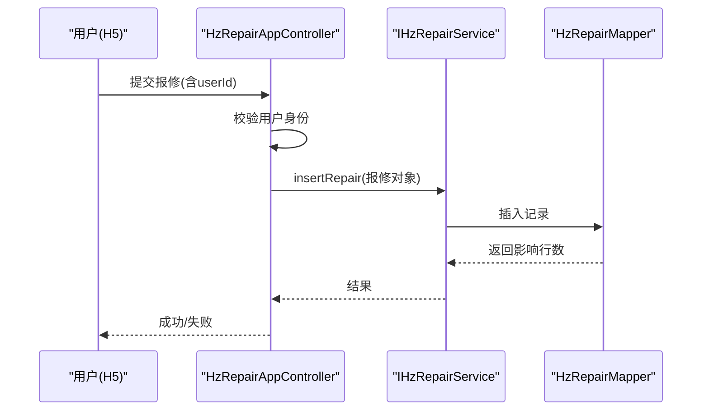
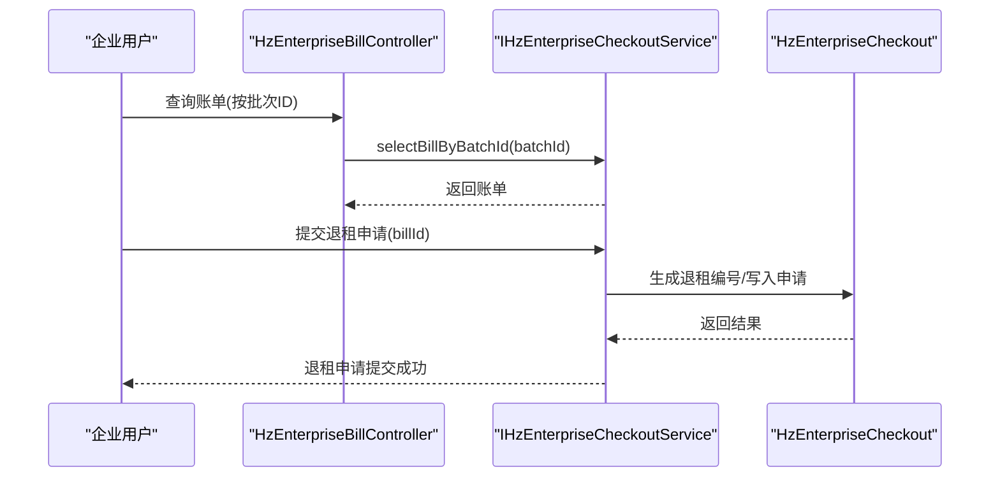
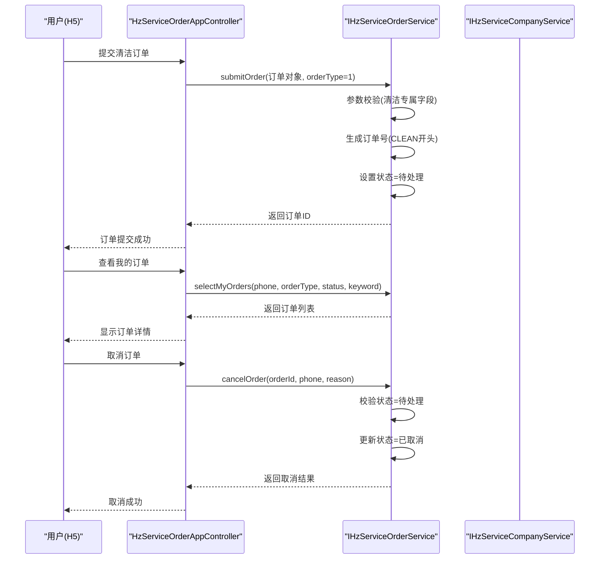
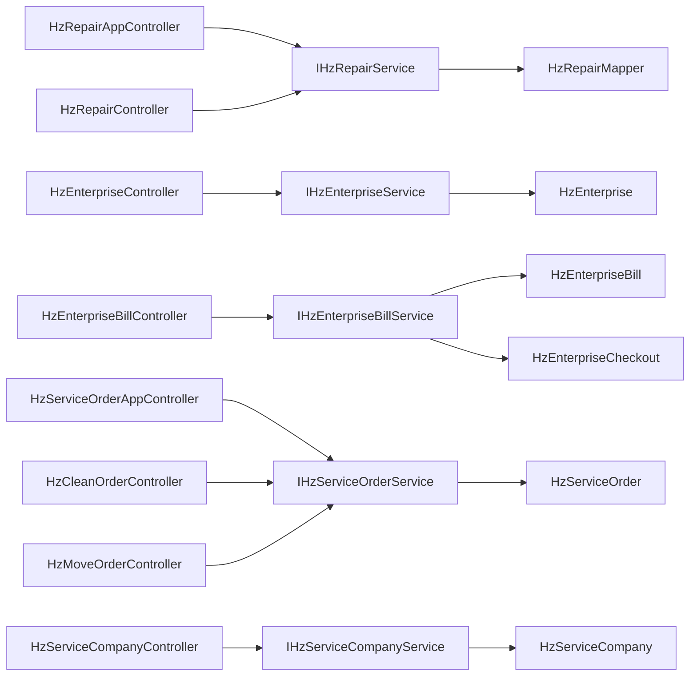

# 服务管理模块

<cite>
**本文引用的文件**
- [HzServiceOrder.java](file://ruoyi-system/src/main/java/com/ruoyi/system/domain/HzServiceOrder.java)
- [HzServiceCompany.java](file://ruoyi-system/src/main/java/com/ruoyi/system/domain/HzServiceCompany.java)
- [IHzServiceOrderService.java](file://ruoyi-system/src/main/java/com/ruoyi/system/service/IHzServiceOrderService.java)
- [HzServiceOrderServiceImpl.java](file://ruoyi-system/src/main/java/com/ruoyi/system/service/impl/HzServiceOrderServiceImpl.java)
- [IHzServiceCompanyService.java](file://ruoyi-system/src/main/java/com/ruoyi/system/service/IHzServiceCompanyService.java)
- [HzServiceCompanyController.java](file://ruoyi-admin/src/main/java/com/ruoyi/web/controller/system/HzServiceCompanyController.java)
- [HzServiceOrderAppController.java](file://ruoyi-admin/src/main/java/com/ruoyi/web/controller/h5/HzServiceOrderAppController.java)
- [HzCleanOrderController.java](file://ruoyi-admin/src/main/java/com/ruoyi/web/controller/system/HzCleanOrderController.java)
- [HzMoveOrderController.java](file://ruoyi-admin/src/main/java/com/ruoyi/web/controller/system/HzMoveOrderController.java)
- [HzRepair.java](file://ruoyi-system/src/main/java/com/ruoyi/system/domain/HzRepair.java)
- [IHzRepairService.java](file://ruoyi-system/src/main/java/com/ruoyi/system/service/IHzRepairService.java)
- [HzRepairServiceImpl.java](file://ruoyi-system/src/main/java/com/ruoyi/system/service/impl/HzRepairServiceImpl.java)
- [HzRepairMapper.java](file://ruoyi-system/src/main/java/com/ruoyi/system/mapper/HzRepairMapper.java)
- [HzRepairAppController.java](file://ruoyi-admin/src/main/java/com/ruoyi/web/controller/h5/HzRepairAppController.java)
- [HzRepairController.java](file://ruoyi-admin/src/main/java/com/ruoyi/web/controller/system/HzRepairController.java)
- [HzEnterprise.java](file://ruoyi-system/src/main/java/com/ruoyi/system/domain/HzEnterprise.java)
- [HzEnterpriseBill.java](file://ruoyi-system/src/main/java/com/ruoyi/system/domain/HzEnterpriseBill.java)
- [HzEnterpriseCheckout.java](file://ruoyi-system/src/main/java/com/ruoyi/system/domain/HzEnterpriseCheckout.java)
- [IHzEnterpriseService.java](file://ruoyi-system/src/main/java/com/ruoyi/system/service/IHzEnterpriseService.java)
- [IHzEnterpriseBillService.java](file://ruoyi-system/src/main/java/com/ruoyi/system/service/IHzEnterpriseBillService.java)
- [IHzEnterpriseCheckoutService.java](file://ruoyi-system/src/main/java/com/ruoyi/system/service/IHzEnterpriseCheckoutService.java)
- [IHzEnterpriseBatchService.java](file://ruoyi-system/src/main/java/com/ruoyi/system/service/IHzEnterpriseBatchService.java)
- [HzEnterpriseController.java](file://ruoyi-admin/src/main/java/com/ruoyi/web/controller/system/HzEnterpriseController.java)
- [HzEnterpriseBillController.java](file://ruoyi-admin/src/main/java/com/ruoyi/web/controller/system/HzEnterpriseBillController.java)
</cite>

## 更新摘要
**变更内容**
- 新增服务订单管理系统：包括清洁和搬家服务的完整实现
- 新增HzServiceOrder和HzServiceCompany实体及其相关服务层
- 新增H5端服务订单控制器和管理端清洁/搬家订单控制器
- 新增服务公司管理功能，支持服务类型分类和分配
- 扩展服务管理模块功能，从单一报修扩展为综合服务管理

## 目录
1. [简介](#简介)
2. [项目结构](#项目结构)
3. [核心组件](#核心组件)
4. [架构总览](#架构总览)
5. [详细组件分析](#详细组件分析)
6. [依赖分析](#依赖分析)
7. [性能考虑](#性能考虑)
8. [故障排查指南](#故障排查指南)
9. [结论](#结论)
10. [附录](#附录)

## 简介
本文件面向港好住信息系统"服务管理模块"，系统性梳理三大核心功能域：
- 物业报修管理：涵盖报修申请接收、维修工单派发、维修进度跟踪、维修评价等闭环流程。
- 企业服务管理：涵盖企业退租管理、企业批量服务（如批量批次与房源关联、批量账单与支付等）。
- **新增** 服务订单管理：涵盖清洁服务和搬家服务的完整订单生命周期管理，包括订单提交、分配、执行、完成和评价。

同时，文档阐述服务流程设计、服务工单管理与服务质量控制机制，并提供面向客服管理人员的操作指南与客户服务流程说明，帮助快速上手与高效运维。

## 项目结构
服务管理模块采用典型的前后端分离与分层架构：
- 控制器层：对外暴露REST接口，分别服务于H5移动端与管理后台。
- 业务服务层：封装具体业务规则与流程编排。
- 数据模型层：定义实体与字段映射，支撑持久化与展示。
- 持久化层：MyBatis-Plus Mapper接口，负责数据库交互。

**图表来源**
- [HzServiceOrderAppController.java:1-124](file://ruoyi-admin/src/main/java/com/ruoyi/web/controller/h5/HzServiceOrderAppController.java#L1-L124)
- [HzCleanOrderController.java:1-107](file://ruoyi-admin/src/main/java/com/ruoyi/web/controller/system/HzCleanOrderController.java#L1-L107)
- [HzMoveOrderController.java:1-100](file://ruoyi-admin/src/main/java/com/ruoyi/web/controller/system/HzMoveOrderController.java#L1-L100)
- [HzServiceCompanyController.java:1-119](file://ruoyi-admin/src/main/java/com/ruoyi/web/controller/system/HzServiceCompanyController.java#L1-L119)

## 核心组件
- 物业报修模块
  - 数据模型：HzRepair（报修编号、用户/项目/楼栋/单元/房间、问题描述、图片、期望维修时间、状态、处理结果/时间/人等）
  - 服务接口：IHzRepairService（分页查询、列表查询、详情、新增/修改、处理、取消、删除、编号生成）
  - 控制器：HzRepairAppController（H5移动端提交/查询/取消）、HzRepairController（管理后台列表/导出/处理/删除）
- 企业服务模块
  - 企业客户：HzEnterprise（企业名称、统一社会信用代码、联系人/电话/邮箱、地址、营业执照、员工人数、已租数量、状态）
  - 企业账单：HzEnterpriseBill（账单编号、批次信息、企业联系信息、房源数量、金额计算、入驻/截止日期、月数、合同/人员名单文件、账单状态、审批状态、支付状态）
  - 企业退租：HzEnterpriseCheckout（退租编号、账单/批次信息、企业联系信息、项目名称、房源信息、数量、金额、月数、退租状态、申请时间）
  - 企业批次：HzEnterpriseBatch（批次信息，配合批量房源关联）
  - 服务接口：IHzEnterpriseService、IHzEnterpriseBillService、IHzEnterpriseCheckoutService、IHzEnterpriseBatchService
  - 控制器：HzEnterpriseController、HzEnterpriseBillController
- **新增** 服务订单模块
  - 服务订单：HzServiceOrder（订单ID、订单号、订单类型、申请人信息、房源信息、期望服务时间、状态、服务公司信息、评分评价等）
  - 服务公司：HzServiceCompany（公司ID、公司名称、服务类型、联系人、电话、地址、服务区域、状态等）
  - 服务接口：IHzServiceOrderService、IHzServiceCompanyService
  - 控制器：HzServiceOrderAppController（H5端）、HzCleanOrderController、HzMoveOrderController、HzServiceCompanyController

**章节来源**
- [HzServiceOrder.java:1-231](file://ruoyi-system/src/main/java/com/ruoyi/system/domain/HzServiceOrder.java#L1-L231)
- [HzServiceCompany.java:1-102](file://ruoyi-system/src/main/java/com/ruoyi/system/domain/HzServiceCompany.java#L1-L102)
- [IHzServiceOrderService.java:1-71](file://ruoyi-system/src/main/java/com/ruoyi/system/service/IHzServiceOrderService.java#L1-L71)
- [HzServiceOrderServiceImpl.java:1-258](file://ruoyi-system/src/main/java/com/ruoyi/system/service/impl/HzServiceOrderServiceImpl.java#L1-L258)
- [IHzServiceCompanyService.java:1-53](file://ruoyi-system/src/main/java/com/ruoyi/system/service/IHzServiceCompanyService.java#L1-L53)

## 架构总览
服务管理模块遵循"控制器-服务-数据模型"的清晰分层，移动端与管理后台通过不同控制器暴露能力，业务规则集中在服务层实现，数据模型统一映射到数据库表。新增的服务订单管理采用"保洁/搬家合表"的设计模式，通过订单类型字段区分不同业务场景。

```mermaid
classDiagram
class HzServiceOrder {
+orderId
+orderNo
+orderType
+applicantName
+applicantPhone
+houseId
+houseAddress
+expectTime
+status
+companyId
+companyName
+rateScore
+rateContent
+cleanType
+roomCount
+fromAddress
+toAddress
+needDisassembly
}
class HzServiceCompany {
+companyId
+companyName
+companyType
+contactPerson
+contactPhone
+address
+serviceArea
+status
}
class HzRepair {
+repairId
+repairNo
+userId
+projectId
+buildingId
+unitId
+location
+roomNo
+phone
+description
+images
+repairDate
+status
+handleResult
+handleTime
+handleBy
+delFlag
}
class HzEnterprise {
+enterpriseId
+enterpriseName
+socialCreditCode
+legalPerson
+contactPerson
+contactPhone
+contactEmail
+enterpriseAddress
+businessLicense
+employeeCount
+rentedCount
+status
+delFlag
}
class HzEnterpriseBill {
+billId
+billNo
+batchId
+batchNo
+batchName
+enterpriseName
+contactPerson
+contactPhone
+houseCount
+totalAmount
+discountAmount
+finalAmount
+checkInDate
+checkOutDate
+months
+contractFile
+personnelFile
+billStatus
+approveStatus
+approveBy
+approveTime
+payTime
+payMethod
+payVoucher
+transactionNo
+delFlag
}
class HzEnterpriseCheckout {
+checkoutId
+checkoutNo
+billId
+batchId
+batchNo
+batchName
+enterpriseName
+contactPerson
+contactPhone
+projectName
+houseInfo
+houseCount
+totalAmount
+discountAmount
+finalAmount
+checkInDate
+checkOutDate
+months
+checkoutStatus
+applyTime
+delFlag
}
class IHzServiceOrderService
class HzServiceOrderServiceImpl
class IHzServiceCompanyService
class IHzRepairService
class HzRepairServiceImpl
class IHzEnterpriseService
class IHzEnterpriseBillService
class IHzEnterpriseCheckoutService
class IHzEnterpriseBatchService
HzServiceOrderServiceImpl ..|> IHzServiceOrderService
HzRepairServiceImpl ..|> IHzRepairService
HzServiceOrderAppController --> IHzServiceOrderService
HzCleanOrderController --> IHzServiceOrderService
HzMoveOrderController --> IHzServiceOrderService
HzServiceCompanyController --> IHzServiceCompanyService
HzRepairAppController --> IHzRepairService
HzRepairController --> IHzRepairService
```

**图表来源**
- [HzServiceOrder.java:1-231](file://ruoyi-system/src/main/java/com/ruoyi/system/domain/HzServiceOrder.java#L1-L231)
- [HzServiceCompany.java:1-102](file://ruoyi-system/src/main/java/com/ruoyi/system/domain/HzServiceCompany.java#L1-L102)
- [HzRepair.java:1-278](file://ruoyi-system/src/main/java/com/ruoyi/system/domain/HzRepair.java#L1-L278)
- [HzEnterprise.java:1-201](file://ruoyi-system/src/main/java/com/ruoyi/system/domain/HzEnterprise.java#L1-L201)
- [HzEnterpriseBill.java:1-378](file://ruoyi-system/src/main/java/com/ruoyi/system/domain/HzEnterpriseBill.java#L1-L378)
- [HzEnterpriseCheckout.java:1-312](file://ruoyi-system/src/main/java/com/ruoyi/system/domain/HzEnterpriseCheckout.java#L1-L312)

## 详细组件分析

### 物业报修管理
- 报修申请接收
  - H5端提交：HzRepairAppController接收报修请求，校验用户身份后调用IHzRepairService.insertRepair完成新增。
  - 关键字段：用户ID、项目/楼栋/单元/房间、问题描述、图片、期望维修时间等。
- 维修工单派发
  - 管理后台HzRepairController支持分页查询、导出、查看详情；处理接口设置处理人并调用IHzRepairService.handleRepair。
- 维修进度跟踪
  - HzRepairController提供按ID查询；HzRepairAppController提供我的报修列表与详情查询，含权限校验。
- 维修评价
  - 当前模型未见显式的评价字段；若需扩展，可在HzRepair或新增评价表进行补充。

**图表来源**
- [HzRepairAppController.java:30-51](file://ruoyi-admin/src/main/java/com/ruoyi/web/controller/h5/HzRepairAppController.java#L30-L51)
- [IHzRepairService.java:50-56](file://ruoyi-system/src/main/java/com/ruoyi/system/service/IHzRepairService.java#L50-L56)
- [HzRepairMapper.java:1-14](file://ruoyi-system/src/main/java/com/ruoyi/system/mapper/HzRepairMapper.java#L1-L14)

**章节来源**
- [HzRepairAppController.java:1-133](file://ruoyi-admin/src/main/java/com/ruoyi/web/controller/h5/HzRepairAppController.java#L1-L133)
- [HzRepairController.java:1-110](file://ruoyi-admin/src/main/java/com/ruoyi/web/controller/system/HzRepairController.java#L1-L110)
- [IHzRepairService.java:1-97](file://ruoyi-system/src/main/java/com/ruoyi/system/service/IHzRepairService.java#L1-L97)
- [HzRepairServiceImpl.java:1-40](file://ruoyi-system/src/main/java/com/ruoyi/system/service/impl/HzRepairServiceImpl.java#L1-L40)
- [HzRepair.java:1-278](file://ruoyi-system/src/main/java/com/ruoyi/system/domain/HzRepair.java#L1-L278)

### 企业服务管理
- 企业退租管理
  - 业务流程：HzEnterpriseBillController提供根据批次ID查询账单；IHzEnterpriseCheckoutService提供提交退租申请、按账单ID查询退租申请、生成退租编号等。
  - 数据模型：HzEnterpriseCheckout包含批次信息、企业联系信息、房源信息、金额与月数、退租状态、申请时间等。
- 企业批量服务
  - 批次与房源关联：IHzEnterpriseBatchService提供保存批次及房源关联、查询批次关联房源列表。
  - 账单与支付：IHzEnterpriseBillService提供账单计算月数、生成账单编号、审核、支付（含管理端线下支付）、提交入住（上传人员名单）等。

**图表来源**
- [HzEnterpriseBillController.java:70-77](file://ruoyi-admin/src/main/java/com/ruoyi/web/controller/system/HzEnterpriseBillController.java#L70-L77)
- [IHzEnterpriseCheckoutService.java:65-93](file://ruoyi-system/src/main/java/com/ruoyi/system/service/IHzEnterpriseCheckoutService.java#L65-L93)
- [HzEnterpriseCheckout.java:1-312](file://ruoyi-system/src/main/java/com/ruoyi/system/domain/HzEnterpriseCheckout.java#L1-L312)

**章节来源**
- [HzEnterpriseBillController.java:1-142](file://ruoyi-admin/src/main/java/com/ruoyi/web/controller/system/HzEnterpriseBillController.java#L1-L142)
- [IHzEnterpriseCheckoutService.java:1-100](file://ruoyi-system/src/main/java/com/ruoyi/system/service/IHzEnterpriseCheckoutService.java#L1-L100)
- [HzEnterpriseCheckout.java:1-312](file://ruoyi-system/src/main/java/com/ruoyi/system/domain/HzEnterpriseCheckout.java#L1-L312)
- [IHzEnterpriseBatchService.java:1-87](file://ruoyi-system/src/main/java/com/ruoyi/system/service/IHzEnterpriseBatchService.java#L1-L87)

### **新增** 服务订单管理
- 订单类型设计
  - 保洁订单：订单类型=1，包含清洁类型、房间数量等专属字段
  - 搬家订单：订单类型=2，包含起运地址、目的地址、物品描述、是否拆装家具等专属字段
  - 采用"合表存储"设计，通过order_type字段区分业务类型
- 订单生命周期
  - 提交阶段：H5端提交订单，系统生成订单号，状态=待处理
  - 分配阶段：管理端为订单分配服务公司，状态=已分配
  - 执行阶段：服务公司执行服务，状态=服务中
  - 完成阶段：管理端标记完成，状态=已完成
  - 评价阶段：H5端对已完成订单进行5星评价
- 服务公司管理
  - 服务类型：1=保洁、2=搬家、3=综合（可承接多种服务）
  - 启用状态：0=启用、1=停用
  - 类型匹配：保洁订单只能分配给保洁或综合公司，搬家订单只能分配给搬家或综合公司

**图表来源**
- [HzServiceOrderAppController.java:62-94](file://ruoyi-admin/src/main/java/com/ruoyi/web/controller/h5/HzServiceOrderAppController.java#L62-L94)
- [HzServiceOrderServiceImpl.java:82-137](file://ruoyi-system/src/main/java/com/ruoyi/system/service/impl/HzServiceOrderServiceImpl.java#L82-L137)

**章节来源**
- [HzServiceOrderAppController.java:1-124](file://ruoyi-admin/src/main/java/com/ruoyi/web/controller/h5/HzServiceOrderAppController.java#L1-L124)
- [HzCleanOrderController.java:1-107](file://ruoyi-admin/src/main/java/com/ruoyi/web/controller/system/HzCleanOrderController.java#L1-L107)
- [HzMoveOrderController.java:1-100](file://ruoyi-admin/src/main/java/com/ruoyi/web/controller/system/HzMoveOrderController.java#L1-L100)
- [HzServiceCompanyController.java:1-119](file://ruoyi-admin/src/main/java/com/ruoyi/web/controller/system/HzServiceCompanyController.java#L1-L119)
- [IHzServiceOrderService.java:1-71](file://ruoyi-system/src/main/java/com/ruoyi/system/service/IHzServiceOrderService.java#L1-L71)
- [HzServiceOrderServiceImpl.java:1-258](file://ruoyi-system/src/main/java/com/ruoyi/system/service/impl/HzServiceOrderServiceImpl.java#L1-L258)
- [IHzServiceCompanyService.java:1-53](file://ruoyi-system/src/main/java/com/ruoyi/system/service/IHzServiceCompanyService.java#L1-L53)

### 服务流程设计与工单管理
- 流程设计
  - 报修流程：提交→分页查询/导出→处理（设置处理人）→删除（逻辑删除）。
  - 企业账单流程：创建/编辑→审批→支付（线上/线下）→提交入住（上传人员名单）→关闭。
  - 企业退租流程：根据账单提交退租申请→生成退租编号→记录退租状态与时间。
  - **新增** 服务订单流程：提交→分页查询/导出→分配服务公司→标记完成→删除（逻辑删除）。
- 工单管理
  - 编号生成：IHzRepairService.generateRepairNo、IHzEnterpriseBillService.generateBillNo、IHzEnterpriseCheckoutService.generateCheckoutNo、IHzServiceOrderService.generateOrderNo。
  - 状态流转：报修状态（待处理/已完成/已取消）、账单状态（待审核/已审核/已支付/已关闭）、审批状态（待审核/已通过/已拒绝）、退租状态（已申请/已处理）、**新增** 服务订单状态（待处理/已分配/服务中/已完成/已取消）。
- 质量控制
  - 权限校验：H5端对报修详情进行"本人可见"校验；管理端接口均使用权限注解保护。
  - 数据导出：支持Excel导出，便于审计与复盘。
  - 日志记录：使用日志注解记录关键操作类型（新增/更新/删除/导出/处理/审批/支付）。

**章节来源**
- [HzRepairController.java:35-108](file://ruoyi-admin/src/main/java/com/ruoyi/web/controller/system/HzRepairController.java#L35-L108)
- [HzEnterpriseBillController.java:110-140](file://ruoyi-admin/src/main/java/com/ruoyi/web/controller/system/HzEnterpriseBillController.java#L110-L140)
- [HzCleanOrderController.java:76-96](file://ruoyi-admin/src/main/java/com/ruoyi/web/controller/system/HzCleanOrderController.java#L76-L96)
- [HzMoveOrderController.java:74-89](file://ruoyi-admin/src/main/java/com/ruoyi/web/controller/system/HzMoveOrderController.java#L74-L89)
- [IHzRepairService.java:91-97](file://ruoyi-system/src/main/java/com/ruoyi/system/service/IHzRepairService.java#L91-L97)
- [IHzEnterpriseBillService.java:92-96](file://ruoyi-system/src/main/java/com/ruoyi/system/service/IHzEnterpriseBillService.java#L92-L96)
- [IHzEnterpriseCheckoutService.java:81-85](file://ruoyi-system/src/main/java/com/ruoyi/system/service/IHzEnterpriseCheckoutService.java#L81-L85)
- [IHzServiceOrderService.java:66-70](file://ruoyi-system/src/main/java/com/ruoyi/system/service/IHzServiceOrderService.java#L66-L70)

### 客户服务流程说明
- 物业报修
  - 用户通过H5提交报修，填写项目/楼栋/单元/房间、问题描述与图片，选择期望维修时间。
  - 管理员在后台查看并处理，设置处理人与处理结果，完成后用户可在H5查看进度与结果。
- 企业服务
  - 企业账单：管理员创建/编辑账单，企业侧可按联系方式查询账单；审批通过后进入支付环节（支持线下支付）。
  - 企业退租：根据已有账单提交退租申请，系统生成退租编号并记录状态与时间。
- **新增** 服务订单
  - 清洁服务：用户通过H5提交清洁订单，选择清洁类型和房间数量，填写期望服务时间。
  - 搬家服务：用户通过H5提交搬家订单，填写起运地址、目的地址、物品描述和是否需要拆装家具。
  - 管理员在后台查看订单，为订单分配合适的服务公司，跟踪服务进度，最终标记完成并支持评价。

**章节来源**
- [HzServiceOrderAppController.java:37-122](file://ruoyi-admin/src/main/java/com/ruoyi/web/controller/h5/HzServiceOrderAppController.java#L37-L122)
- [HzCleanOrderController.java:38-105](file://ruoyi-admin/src/main/java/com/ruoyi/web/controller/system/HzCleanOrderController.java#L38-L105)
- [HzMoveOrderController.java:37-99](file://ruoyi-admin/src/main/java/com/ruoyi/web/controller/system/HzMoveOrderController.java#L37-L99)
- [HzServiceCompanyController.java:54-117](file://ruoyi-admin/src/main/java/com/ruoyi/web/controller/system/HzServiceCompanyController.java#L54-L117)

## 依赖分析
- 组件耦合
  - 控制器依赖服务接口，服务实现依赖Mapper与工具类，降低控制器与数据库直接耦合。
  - **新增** 服务订单模块与现有模块相对独立，通过统一的订单状态和编号生成机制集成。
- 外部依赖
  - MyBatis-Plus用于ORM与分页；Spring Security用于权限控制；ExcelUtil用于导出。
- 潜在风险
  - H5端用户ID目前通过请求参数/头临时获取，建议后续接入JWT认证以提升安全性与一致性。
  - **新增** 服务订单的"合表存储"设计简化了数据库结构，但可能增加查询条件的复杂度。

**图表来源**
- [HzServiceOrderAppController.java:25-31](file://ruoyi-admin/src/main/java/com/ruoyi/web/controller/h5/HzServiceOrderAppController.java#L25-L31)
- [HzCleanOrderController.java:35-36](file://ruoyi-admin/src/main/java/com/ruoyi/web/controller/system/HzCleanOrderController.java#L35-L36)
- [HzMoveOrderController.java:35-36](file://ruoyi-admin/src/main/java/com/ruoyi/web/controller/system/HzMoveOrderController.java#L35-L36)
- [HzServiceCompanyController.java:31-32](file://ruoyi-admin/src/main/java/com/ruoyi/web/controller/system/HzServiceCompanyController.java#L31-L32)

**章节来源**
- [IHzRepairService.java:1-97](file://ruoyi-system/src/main/java/com/ruoyi/system/service/IHzRepairService.java#L1-L97)
- [IHzEnterpriseService.java:1-74](file://ruoyi-system/src/main/java/com/ruoyi/system/service/IHzEnterpriseService.java#L1-L74)
- [IHzEnterpriseBillService.java:1-142](file://ruoyi-system/src/main/java/com/ruoyi/system/service/IHzEnterpriseBillService.java#L1-L142)
- [IHzServiceOrderService.java:1-71](file://ruoyi-system/src/main/java/com/ruoyi/system/service/IHzServiceOrderService.java#L1-L71)
- [IHzServiceCompanyService.java:1-53](file://ruoyi-system/src/main/java/com/ruoyi/system/service/IHzServiceCompanyService.java#L1-L53)

## 性能考虑
- 分页查询：管理端接口统一使用分页工具，避免一次性加载大量数据。
- 导出优化：导出接口限制最大记录数，防止内存溢出。
- 并发控制：服务层使用事务注解保证数据一致性；建议对高频接口增加缓存策略（如企业账单状态缓存）。
- 日志与监控：结合日志注解与审计，便于定位性能瓶颈。
- **新增** 查询优化：服务订单的"合表存储"设计减少了表连接，但需要合理使用索引（order_type、status、applicant_phone等字段）。

## 故障排查指南
- 用户未登录
  - 现象：H5端提交/取消报修返回"用户未登录"。
  - 处理：确认请求中携带userId参数或请求头；后续应接入JWT认证。
- 无权查看
  - 现象：H5端查询他人报修详情被拒绝。
  - 处理：确保当前用户与报修所属用户一致。
- 报修状态不可取消
  - 现象：取消失败提示"仅待处理的报修可取消"。
  - 处理：确认报修状态仍为"待处理"。
- **新增** 订单取消失败
  - 现象：服务订单取消失败，提示"仅待处理订单可取消"。
  - 处理：确认订单状态仍为"待处理"，且操作用户为订单申请人。
- **新增** 订单分配错误
  - 现象：分配服务公司时报错"该公司不承接该服务"。
  - 处理：确认服务公司类型与订单类型匹配（保洁订单只能分配给保洁或综合公司）。

**章节来源**
- [HzServiceOrderAppController.java:87-111](file://ruoyi-admin/src/main/java/com/ruoyi/web/controller/h5/HzServiceOrderAppController.java#L87-L111)
- [HzServiceOrderServiceImpl.java:140-161](file://ruoyi-system/src/main/java/com/ruoyi/system/service/impl/HzServiceOrderServiceImpl.java#L140-L161)
- [HzRepairAppController.java:44-105](file://ruoyi-admin/src/main/java/com/ruoyi/web/controller/h5/HzRepairAppController.java#L44-L105)
- [HzRepairController.java:83-87](file://ruoyi-admin/src/main/java/com/ruoyi/web/controller/system/HzRepairController.java#L83-L87)

## 结论
服务管理模块围绕"物业报修"、"企业服务"和"服务订单"三大主线，构建了从移动端提交到管理后台处理的完整闭环。通过清晰的分层设计与完善的接口能力，既能满足客户服务体验，也能保障运营效率与质量控制。新增的服务订单管理模块采用"保洁/搬家合表"的设计理念，有效简化了系统架构，同时保持了业务逻辑的清晰性。建议后续完善认证体系、扩展评价与满意度反馈机制，并持续优化性能与可观测性。

## 附录
- 操作指南（客服管理人员）
  - 物业报修
    - 登录管理后台，进入"报修管理"页面，分页查看报修列表，导出异常数据。
    - 对"待处理"报修进行处理，填写处理结果与时间，设置处理人。
    - 如需撤销，仅允许对"待处理"状态进行删除（逻辑删除）。
  - 企业账单
    - 创建/编辑企业账单，填写批次信息与企业联系信息。
    - 审核通过后，支持企业侧支付；管理端可进行线下支付并上传凭证。
    - 提交入住时，上传人员名单文件并更新状态。
  - 企业退租
    - 根据账单提交退租申请，系统自动生成退租编号。
    - 记录退租状态与申请时间，完成退租流程。
  - **新增** 服务订单管理
    - 清洁订单：在"保洁订单"页面查看所有清洁订单，支持按状态、时间等条件筛选。
    - 搬家订单：在"搬家订单"页面查看所有搬家订单，支持按状态、时间等条件筛选。
    - 订单分配：为订单分配合适的服务公司，系统会自动校验服务类型匹配性。
    - 订单完成：服务完成后，在订单详情中点击"标记完成"按钮。
    - 服务公司管理：维护服务公司的基本信息、服务类型和启用状态。