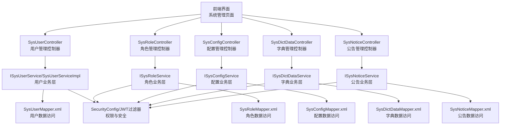
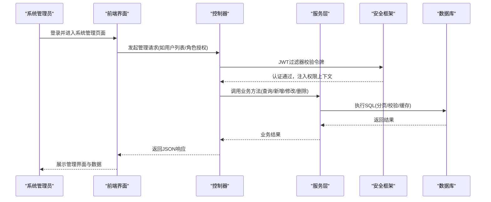
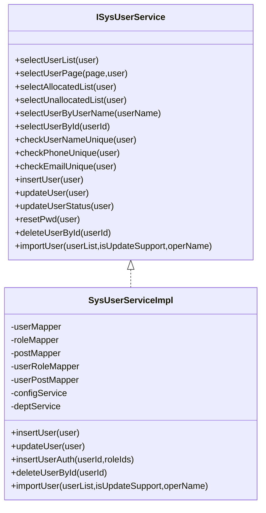
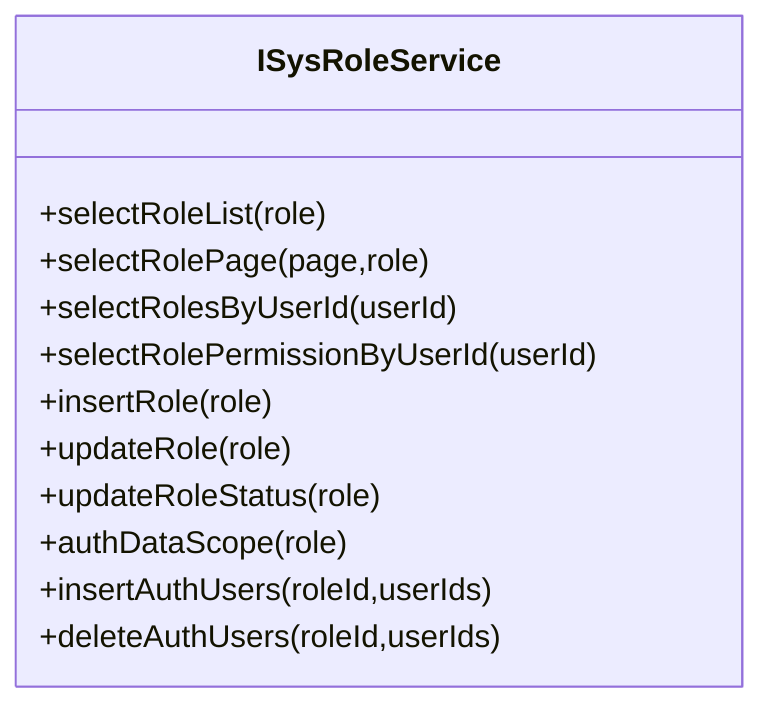
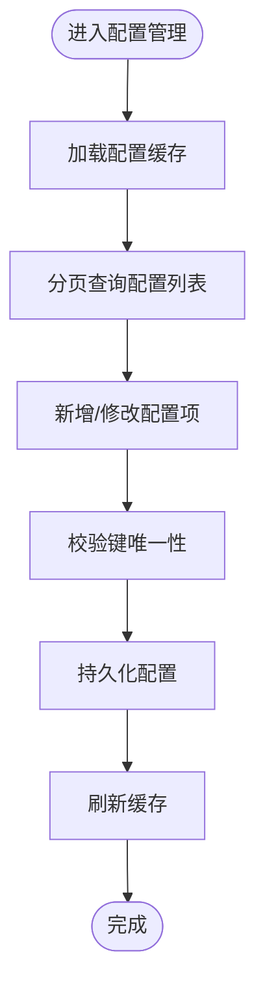
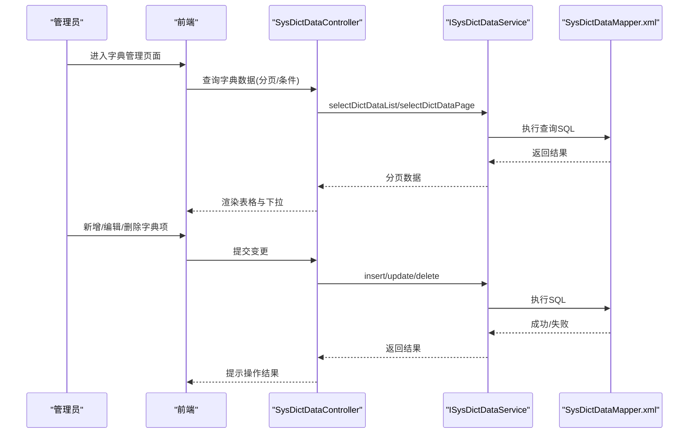
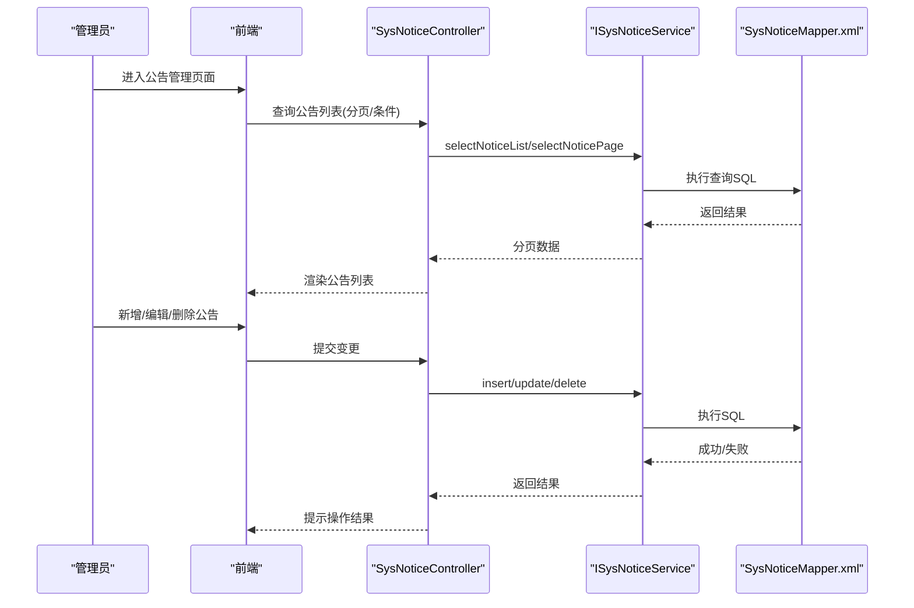
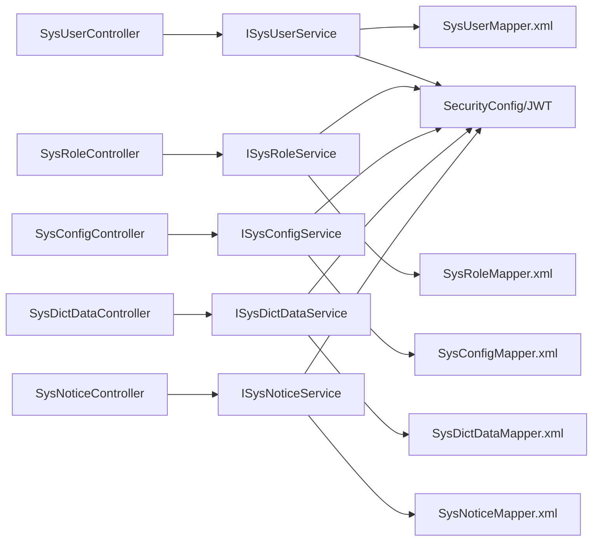

# 系统管理模块

<cite>
**本文档引用的文件**
- [ISysUserService.java](file://ruoyi-system/src/main/java/com/ruoyi/system/service/ISysUserService.java)
- [ISysRoleService.java](file://ruoyi-system/src/main/java/com/ruoyi/system/service/ISysRoleService.java)
- [ISysConfigService.java](file://ruoyi-system/src/main/java/com/ruoyi/system/service/ISysConfigService.java)
- [ISysDictDataService.java](file://ruoyi-system/src/main/java/com/ruoyi/system/service/ISysDictDataService.java)
- [ISysNoticeService.java](file://ruoyi-system/src/main/java/com/ruoyi/system/service/ISysNoticeService.java)
- [SysUserServiceImpl.java](file://ruoyi-system/src/main/java/com/ruoyi/system/service/impl/SysUserServiceImpl.java)
- [SysUserController.java](file://ruoyi-admin/src/main/java/com/ruoyi/web/controller/system/SysUserController.java)
- [SysRoleController.java](file://ruoyi-admin/src/main/java/com/ruoyi/web/controller/system/SysRoleController.java)
- [SysConfigController.java](file://ruoyi-admin/src/main/java/com/ruoyi/web/controller/system/SysConfigController.java)
- [SysNoticeController.java](file://ruoyi-admin/src/main/java/com/ruoyi/web/controller/system/SysNoticeController.java)
- [SysDictDataController.java](file://ruoyi-admin/src/main/java/com/ruoyi/web/controller/system/SysDictDataController.java)
- [SysDictTypeController.java](file://ruoyi-admin/src/main/java/com/ruoyi/web/controller/system/SysDictTypeController.java)
- [HzAnnouncementController.java](file://ruoyi-admin/src/main/java/com/ruoyi/web/controller/h5/HzAnnouncementController.java)
- [HzCouponController.java](file://ruoyi-admin/src/main/java/com/ruoyi/web/controller/h5/HzCouponController.java)
- [SysMenuServiceImpl.java](file://ruoyi-system/src/main/java/com/ruoyi/system/service/impl/SysMenuServiceImpl.java)
- [SysPermissionService.java](file://ruoyi-framework/src/main/java/com/ruoyi/framework/web/service/PermissionService.java)
- [SecurityConfig.java](file://ruoyi-framework/src/main/java/com/ruoyi/framework/config/SecurityConfig.java)
- [JwtAuthenticationTokenFilter.java](file://ruoyi-framework/src/main/java/com/ruoyi/framework/security/filter/JwtAuthenticationTokenFilter.java)
- [GlobalExceptionHandler.java](file://ruoyi-framework/src/main/java/com/ruoyi/framework/web/exception/GlobalExceptionHandler.java)
- [SysConfigMapper.xml](file://ruoyi-system/src/main/resources/mapper/system/SysConfigMapper.xml)
- [SysDictDataMapper.xml](file://ruoyi-system/src/main/resources/mapper/system/SysDictDataMapper.xml)
- [SysNoticeMapper.xml](file://ruoyi-system/src/main/resources/mapper/system/SysNoticeMapper.xml)
- [SysUserMapper.xml](file://ruoyi-system/src/main/resources/mapper/system/SysUserMapper.xml)
- [SysRoleMapper.xml](file://ruoyi-system/src/main/resources/mapper/system/SysRoleMapper.xml)
- [SysMenuMapper.xml](file://ruoyi-system/src/main/resources/mapper/system/SysMenuMapper.xml)
</cite>

## 目录
1. [简介](#简介)
2. [项目结构](#项目结构)
3. [核心组件](#核心组件)
4. [架构总览](#架构总览)
5. [详细组件分析](#详细组件分析)
6. [依赖关系分析](#依赖关系分析)
7. [性能考虑](#性能考虑)
8. [故障排除指南](#故障排除指南)
9. [结论](#结论)
10. [附录](#附录)

## 简介
本文件面向港好住信息系统中的系统管理模块，围绕六大核心功能进行深入说明：用户管理、角色权限管理、配置管理、数据字典管理、通知公告管理和报表管理、优惠券管理。文档从架构设计、数据流、处理逻辑、权限控制、配置机制到运维操作进行全面梳理，帮助系统管理员快速掌握系统管理的操作流程与维护要点。

## 项目结构
系统管理模块主要由以下层次构成：
- 控制器层：负责接收前端请求，调用服务层并返回响应
- 服务层：封装业务逻辑，处理数据校验、事务控制、权限校验等
- 数据访问层：MyBatis Mapper，负责数据库读写
- 安全框架：基于Spring Security与JWT的认证授权体系
- 前端路由与菜单：通过菜单与权限点控制页面与按钮级访问

图表来源
- [SysUserController.java](file://ruoyi-admin/src/main/java/com/ruoyi/web/controller/system/SysUserController.java)
- [SysRoleController.java](file://ruoyi-admin/src/main/java/com/ruoyi/web/controller/system/SysRoleController.java)
- [SysConfigController.java](file://ruoyi-admin/src/main/java/com/ruoyi/web/controller/system/SysConfigController.java)
- [SysDictDataController.java](file://ruoyi-admin/src/main/java/com/ruoyi/web/controller/system/SysDictDataController.java)
- [SysNoticeController.java](file://ruoyi-admin/src/main/java/com/ruoyi/web/controller/system/SysNoticeController.java)
- [ISysUserService.java](file://ruoyi-system/src/main/java/com/ruoyi/system/service/ISysUserService.java)
- [ISysRoleService.java](file://ruoyi-system/src/main/java/com/ruoyi/system/service/ISysRoleService.java)
- [ISysConfigService.java](file://ruoyi-system/src/main/java/com/ruoyi/system/service/ISysConfigService.java)
- [ISysDictDataService.java](file://ruoyi-system/src/main/java/com/ruoyi/system/service/ISysDictDataService.java)
- [ISysNoticeService.java](file://ruoyi-system/src/main/java/com/ruoyi/system/service/ISysNoticeService.java)
- [SysUserMapper.xml](file://ruoyi-system/src/main/resources/mapper/system/SysUserMapper.xml)
- [SysRoleMapper.xml](file://ruoyi-system/src/main/resources/mapper/system/SysRoleMapper.xml)
- [SysConfigMapper.xml](file://ruoyi-system/src/main/resources/mapper/system/SysConfigMapper.xml)
- [SysDictDataMapper.xml](file://ruoyi-system/src/main/resources/mapper/system/SysDictDataMapper.xml)
- [SysNoticeMapper.xml](file://ruoyi-system/src/main/resources/mapper/system/SysNoticeMapper.xml)
- [SecurityConfig.java](file://ruoyi-framework/src/main/java/com/ruoyi/framework/config/SecurityConfig.java)
- [JwtAuthenticationTokenFilter.java](file://ruoyi-framework/src/main/java/com/ruoyi/framework/security/filter/JwtAuthenticationTokenFilter.java)

章节来源
- [SysUserController.java](file://ruoyi-admin/src/main/java/com/ruoyi/web/controller/system/SysUserController.java)
- [SysRoleController.java](file://ruoyi-admin/src/main/java/com/ruoyi/web/controller/system/SysRoleController.java)
- [SysConfigController.java](file://ruoyi-admin/src/main/java/com/ruoyi/web/controller/system/SysConfigController.java)
- [SysDictDataController.java](file://ruoyi-admin/src/main/java/com/ruoyi/web/controller/system/SysDictDataController.java)
- [SysNoticeController.java](file://ruoyi-admin/src/main/java/com/ruoyi/web/controller/system/SysNoticeController.java)

## 核心组件
系统管理模块的核心能力由以下接口与实现提供：
- 用户管理：ISysUserService、SysUserServiceImpl
- 角色权限管理：ISysRoleService
- 配置管理：ISysConfigService
- 数据字典管理：ISysDictDataService
- 通知公告管理：ISysNoticeService
- 权限控制：SecurityConfig、JwtAuthenticationTokenFilter、PermissionService
- 菜单与资源：SysMenuServiceImpl、SysMenuMapper.xml

章节来源
- [ISysUserService.java](file://ruoyi-system/src/main/java/com/ruoyi/system/service/ISysUserService.java)
- [ISysRoleService.java](file://ruoyi-system/src/main/java/com/ruoyi/system/service/ISysRoleService.java)
- [ISysConfigService.java](file://ruoyi-system/src/main/java/com/ruoyi/system/service/ISysConfigService.java)
- [ISysDictDataService.java](file://ruoyi-system/src/main/java/com/ruoyi/system/service/ISysDictDataService.java)
- [ISysNoticeService.java](file://ruoyi-system/src/main/java/com/ruoyi/system/service/ISysNoticeService.java)
- [SysUserServiceImpl.java](file://ruoyi-system/src/main/java/com/ruoyi/system/service/impl/SysUserServiceImpl.java)
- [SysMenuServiceImpl.java](file://ruoyi-system/src/main/java/com/ruoyi/system/service/impl/SysMenuServiceImpl.java)
- [SysMenuMapper.xml](file://ruoyi-system/src/main/resources/mapper/system/SysMenuMapper.xml)

## 架构总览
系统管理模块采用经典的分层架构，结合Spring Security与JWT实现统一的认证与授权：
- 认证：JWT过滤器解析请求中的令牌，构建认证上下文
- 授权：基于用户角色与菜单权限点进行细粒度控制
- 业务：控制器调用服务层，服务层完成数据校验、事务与缓存处理
- 数据：MyBatis映射XML定义SQL，实现高效的数据访问

图表来源
- [JwtAuthenticationTokenFilter.java](file://ruoyi-framework/src/main/java/com/ruoyi/framework/security/filter/JwtAuthenticationTokenFilter.java)
- [SecurityConfig.java](file://ruoyi-framework/src/main/java/com/ruoyi/framework/config/SecurityConfig.java)
- [SysUserController.java](file://ruoyi-admin/src/main/java/com/ruoyi/web/controller/system/SysUserController.java)
- [SysRoleController.java](file://ruoyi-admin/src/main/java/com/ruoyi/web/controller/system/SysRoleController.java)
- [SysUserMapper.xml](file://ruoyi-system/src/main/resources/mapper/system/SysUserMapper.xml)

## 详细组件分析

### 用户管理模块
用户管理涵盖用户信息维护、用户状态控制、用户角色分配、导入导出、登录信息更新等功能。核心职责包括：
- 分页查询用户列表（支持已分配/未分配角色筛选）
- 校验用户名、手机号、邮箱唯一性
- 新增/修改/删除用户，自动维护用户-角色与用户-岗位关联
- 重置用户密码、更新头像与基本信息
- 导入用户数据并按策略进行新增或更新

图表来源
- [ISysUserService.java](file://ruoyi-system/src/main/java/com/ruoyi/system/service/ISysUserService.java)
- [SysUserServiceImpl.java](file://ruoyi-system/src/main/java/com/ruoyi/system/service/impl/SysUserServiceImpl.java)

章节来源
- [ISysUserService.java](file://ruoyi-system/src/main/java/com/ruoyi/system/service/ISysUserService.java)
- [SysUserServiceImpl.java](file://ruoyi-system/src/main/java/com/ruoyi/system/service/impl/SysUserServiceImpl.java)

### 角色权限管理模块
角色权限管理提供角色的创建、修改、启用/停用、数据范围授权以及用户角色授权/取消授权等能力。关键点：
- 查询角色列表与分页
- 校验角色名称与权限键唯一性
- 维护角色与用户的授权关系
- 数据范围授权（限定可见部门范围）

图表来源
- [ISysRoleService.java](file://ruoyi-system/src/main/java/com/ruoyi/system/service/ISysRoleService.java)

章节来源
- [ISysRoleService.java](file://ruoyi-system/src/main/java/com/ruoyi/system/service/ISysRoleService.java)

### 配置管理模块
配置管理用于维护系统参数与业务配置，支持参数的新增、修改、删除、分页查询与缓存管理：
- 通过键名获取配置值
- 开启/关闭验证码开关
- 缓存加载、清空与重置
- 校验配置键唯一性

图表来源
- [ISysConfigService.java](file://ruoyi-system/src/main/java/com/ruoyi/system/service/ISysConfigService.java)
- [SysConfigMapper.xml](file://ruoyi-system/src/main/resources/mapper/system/SysConfigMapper.xml)

章节来源
- [ISysConfigService.java](file://ruoyi-system/src/main/java/com/ruoyi/system/service/ISysConfigService.java)
- [SysConfigMapper.xml](file://ruoyi-system/src/main/resources/mapper/system/SysConfigMapper.xml)

### 数据字典管理模块
数据字典管理支持字典类型的维护与字典数据的增删改查，提供按类型与键值查询标签的能力：
- 分页查询字典数据
- 根据字典类型与键值获取标签
- 新增/修改/删除字典数据

图表来源
- [SysDictDataController.java](file://ruoyi-admin/src/main/java/com/ruoyi/web/controller/system/SysDictDataController.java)
- [ISysDictDataService.java](file://ruoyi-system/src/main/java/com/ruoyi/system/service/ISysDictDataService.java)
- [SysDictDataMapper.xml](file://ruoyi-system/src/main/resources/mapper/system/SysDictDataMapper.xml)

章节来源
- [SysDictDataController.java](file://ruoyi-admin/src/main/java/com/ruoyi/web/controller/system/SysDictDataController.java)
- [ISysDictDataService.java](file://ruoyi-system/src/main/java/com/ruoyi/system/service/ISysDictDataService.java)
- [SysDictDataMapper.xml](file://ruoyi-system/src/main/resources/mapper/system/SysDictDataMapper.xml)

### 通知公告管理模块
通知公告管理支持公告的创建、编辑、发布与删除，并提供分页查询与批量操作：
- 查询公告列表与详情
- 新增/修改/删除公告
- 批量删除公告

图表来源
- [SysNoticeController.java](file://ruoyi-admin/src/main/java/com/ruoyi/web/controller/system/SysNoticeController.java)
- [ISysNoticeService.java](file://ruoyi-system/src/main/java/com/ruoyi/system/service/ISysNoticeService.java)
- [SysNoticeMapper.xml](file://ruoyi-system/src/main/resources/mapper/system/SysNoticeMapper.xml)

章节来源
- [SysNoticeController.java](file://ruoyi-admin/src/main/java/com/ruoyi/web/controller/system/SysNoticeController.java)
- [ISysNoticeService.java](file://ruoyi-system/src/main/java/com/ruoyi/system/service/ISysNoticeService.java)
- [SysNoticeMapper.xml](file://ruoyi-system/src/main/resources/mapper/system/SysNoticeMapper.xml)

### 报表管理与优惠券管理
- 报表管理：通过系统管理页面提供各类运营报表的统计与导出能力，具体报表维度与字段以实际业务为准。
- 优惠券管理：在系统管理模块中提供优惠券的创建、发放、核销与统计分析功能，支持优惠券模板配置与有效期管理。

章节来源
- [HzCouponController.java](file://ruoyi-admin/src/main/java/com/ruoyi/web/controller/h5/HzCouponController.java)

## 依赖关系分析
系统管理模块的依赖关系体现了清晰的分层与解耦：
- 控制器依赖服务接口，避免直接依赖具体实现
- 服务层依赖Mapper XML与配置服务，保证业务逻辑可测试与可扩展
- 安全框架贯穿各层，提供统一的认证与授权
- 菜单与权限点通过SysMenuServiceImpl与SysMenuMapper.xml进行集中管理

图表来源
- [SysUserController.java](file://ruoyi-admin/src/main/java/com/ruoyi/web/controller/system/SysUserController.java)
- [SysRoleController.java](file://ruoyi-admin/src/main/java/com/ruoyi/web/controller/system/SysRoleController.java)
- [SysConfigController.java](file://ruoyi-admin/src/main/java/com/ruoyi/web/controller/system/SysConfigController.java)
- [SysDictDataController.java](file://ruoyi-admin/src/main/java/com/ruoyi/web/controller/system/SysDictDataController.java)
- [SysNoticeController.java](file://ruoyi-admin/src/main/java/com/ruoyi/web/controller/system/SysNoticeController.java)
- [ISysUserService.java](file://ruoyi-system/src/main/java/com/ruoyi/system/service/ISysUserService.java)
- [ISysRoleService.java](file://ruoyi-system/src/main/java/com/ruoyi/system/service/ISysRoleService.java)
- [ISysConfigService.java](file://ruoyi-system/src/main/java/com/ruoyi/system/service/ISysConfigService.java)
- [ISysDictDataService.java](file://ruoyi-system/src/main/java/com/ruoyi/system/service/ISysDictDataService.java)
- [ISysNoticeService.java](file://ruoyi-system/src/main/java/com/ruoyi/system/service/ISysNoticeService.java)
- [SysUserMapper.xml](file://ruoyi-system/src/main/resources/mapper/system/SysUserMapper.xml)
- [SysRoleMapper.xml](file://ruoyi-system/src/main/resources/mapper/system/SysRoleMapper.xml)
- [SysConfigMapper.xml](file://ruoyi-system/src/main/resources/mapper/system/SysConfigMapper.xml)
- [SysDictDataMapper.xml](file://ruoyi-system/src/main/resources/mapper/system/SysDictDataMapper.xml)
- [SysNoticeMapper.xml](file://ruoyi-system/src/main/resources/mapper/system/SysNoticeMapper.xml)
- [SecurityConfig.java](file://ruoyi-framework/src/main/java/com/ruoyi/framework/config/SecurityConfig.java)
- [JwtAuthenticationTokenFilter.java](file://ruoyi-framework/src/main/java/com/ruoyi/framework/security/filter/JwtAuthenticationTokenFilter.java)

## 性能考虑
- 分页查询：用户、角色、字典、公告均提供分页接口，建议在大数据量场景下强制使用分页参数，避免一次性加载过多数据。
- 缓存管理：配置管理提供缓存加载/清空/重置能力，建议在批量配置变更后及时刷新缓存，确保配置生效。
- 数据范围：用户查询默认应用数据范围注解，避免越权访问的同时减少不必要的数据扫描。
- 并发控制：用户导入与角色授权涉及多表写入，服务层使用事务保障一致性，建议控制单次批量规模，避免长时间锁等待。

## 故障排除指南
- 登录鉴权失败：检查JWT过滤器是否正确解析令牌，确认SecurityConfig中的放行路径与拦截规则。
- 权限不足：确认用户角色与菜单权限点是否正确配置，检查SysMenuServiceImpl与SysMenuMapper.xml中的权限映射。
- 数据越权：用户查询与删除操作包含数据范围校验，若出现“无权限访问用户数据”，需检查当前操作用户与目标用户的数据范围关系。
- 配置异常：配置键重复或缓存未刷新会导致配置不生效，建议先校验键唯一性，再执行缓存重置。
- 公告/字典操作失败：检查对应Mapper XML的SQL执行情况，确认主键与外键约束。

章节来源
- [GlobalExceptionHandler.java](file://ruoyi-framework/src/main/java/com/ruoyi/framework/web/exception/GlobalExceptionHandler.java)
- [SysUserServiceImpl.java](file://ruoyi-system/src/main/java/com/ruoyi/system/service/impl/SysUserServiceImpl.java)
- [SysMenuServiceImpl.java](file://ruoyi-system/src/main/java/com/ruoyi/system/service/impl/SysMenuServiceImpl.java)

## 结论
系统管理模块通过清晰的分层设计与完善的权限控制，实现了用户、角色、配置、字典、公告等核心管理能力。配合安全框架与数据范围控制，既能满足日常管理需求，又能保障系统的安全性与稳定性。建议管理员在日常维护中遵循分页查询、缓存管理与权限校验的最佳实践，确保系统高效稳定运行。

## 附录
- 操作指南（概述）
  - 用户管理：通过用户列表页面进行分页查询、新增/编辑、状态切换、角色授权与删除；支持批量删除与导入。
  - 角色管理：创建角色、设置角色状态、配置数据范围、为用户授予角色；支持批量授权与取消授权。
  - 配置管理：新增/修改系统参数与业务配置，开启/关闭验证码；变更后刷新缓存。
  - 字典管理：维护字典类型与字典数据，支持按类型与键值查询标签。
  - 公告管理：创建/编辑/删除公告，支持批量删除；注意公告发布状态与生效时间。
  - 报表管理：在系统管理页面查看各类运营报表并导出。
  - 优惠券管理：创建优惠券模板、设置有效期与使用规则、发放与核销统计。