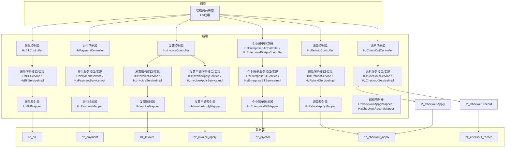
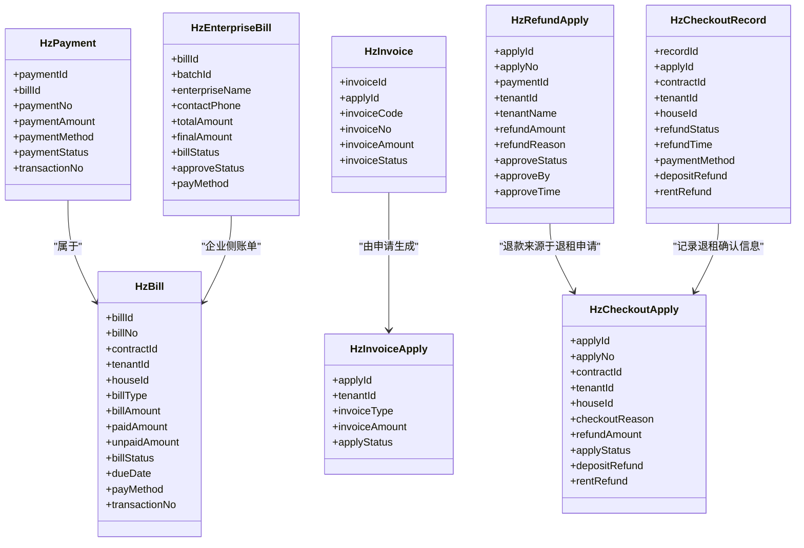
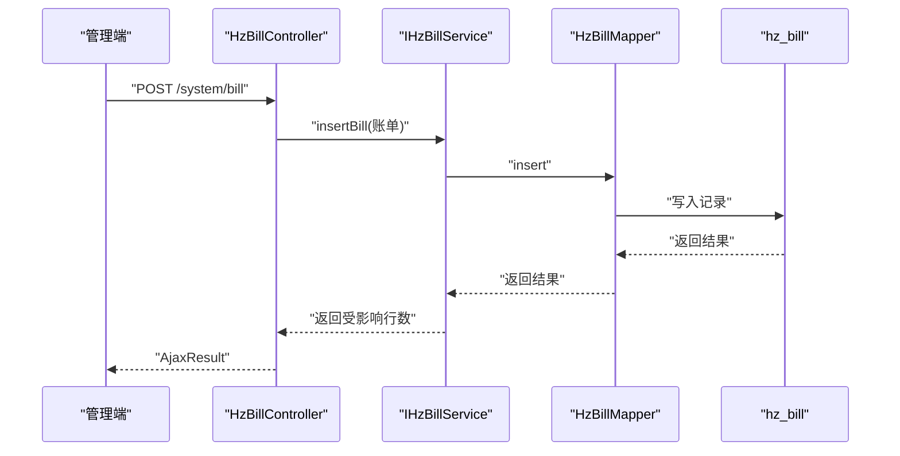
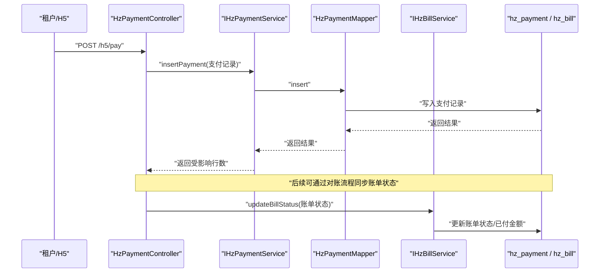
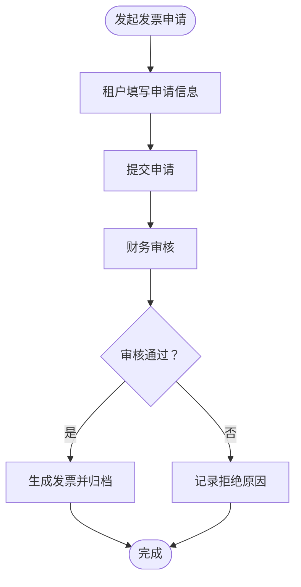
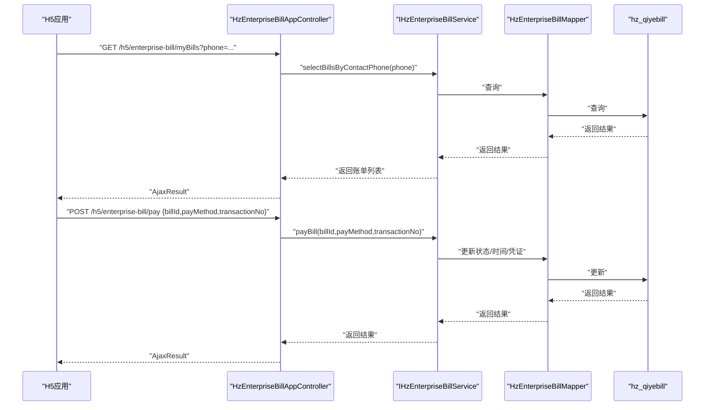
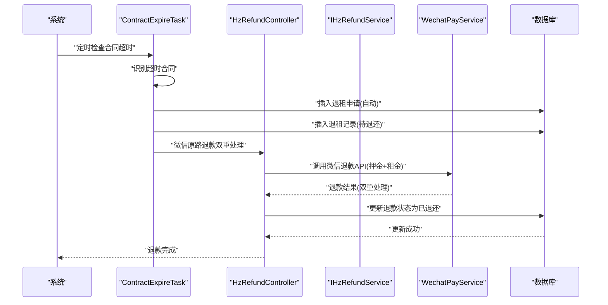
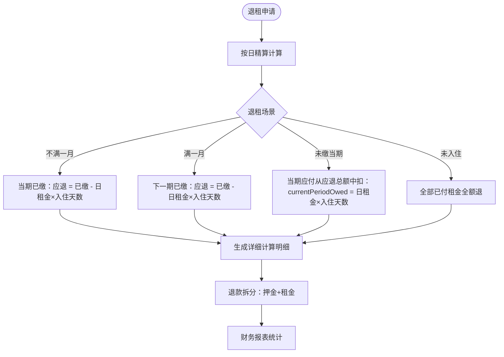
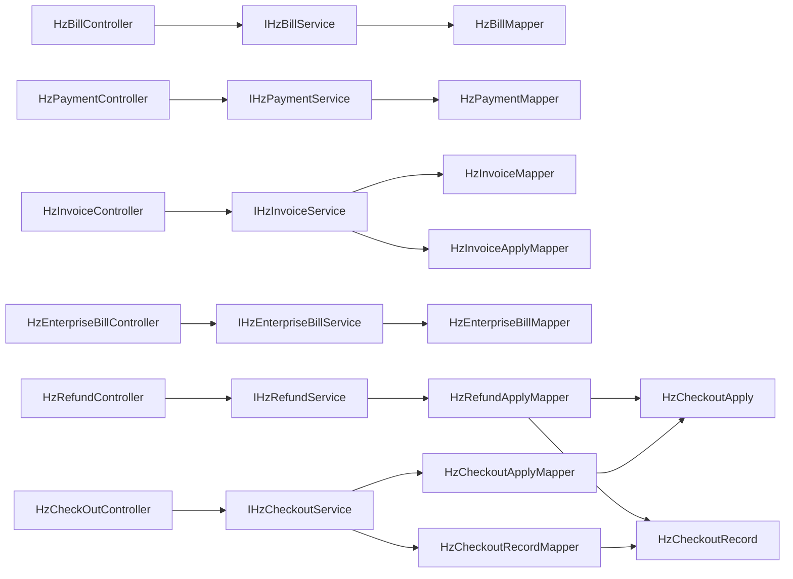

# 财务管理模块

<cite>
**本文引用的文件**
- [HzBill.java](file://ruoyi-system/src/main/java/com/ruoyi/system/domain/HzBill.java)
- [HzBillController.java](file://ruoyi-admin/src/main/java/com/ruoyi/web/controller/system/HzBillController.java)
- [IHzBillService.java](file://ruoyi-system/src/main/java/com/ruoyi/system/service/IHzBillService.java)
- [HzBillServiceImpl.java](file://ruoyi-system/src/main/java/com/ruoyi/system/service/impl/HzBillServiceImpl.java)
- [HzBillMapper.java](file://ruoyi-system/src/main/java/com/ruoyi/system/mapper/HzBillMapper.java)
- [HzBillVO.java](file://ruoyi-system/src/main/java/com/ruoyi/system/domain/HzBillVO.java)
- [HzPayment.java](file://ruoyi-system/src/main/java/com/ruoyi/system/domain/HzPayment.java)
- [IHzPaymentService.java](file://ruoyi-system/src/main/java/com/ruoyi/system/service/IHzPaymentService.java)
- [HzPaymentController.java](file://ruoyi-admin/src/main/java/com/ruoyi/web/controller/h5/HzPaymentController.java)
- [HzPaymentMapper.java](file://ruoyi-system/src/main/java/com/ruoyi/system/mapper/HzPaymentMapper.java)
- [HzInvoiceApply.java](file://ruoyi-system/src/main/java/com/ruoyi/system/domain/HzInvoiceApply.java)
- [HzInvoice.java](file://ruoyi-system/src/main/java/com/ruoyi/system/domain/HzInvoice.java)
- [HzInvoiceController.java](file://ruoyi-admin/src/main/java/com/ruoyi/web/controller/system/HzInvoiceController.java)
- [IHzInvoiceService.java](file://ruoyi-system/src/main/java/com/ruoyi/system/service/IHzInvoiceService.java)
- [IHzInvoiceApplyService.java](file://ruoyi-system/src/main/java/com/ruoyi/system/service/IHzInvoiceApplyService.java)
- [HzInvoiceMapper.java](file://ruoyi-system/src/main/java/com/ruoyi/system/mapper/HzInvoiceMapper.java)
- [HzInvoiceApplyMapper.java](file://ruoyi-system/src/main/java/com/ruoyi/system/mapper/HzInvoiceApplyMapper.java)
- [HzEnterpriseBill.java](file://ruoyi-system/src/main/java/com/ruoyi/system/domain/HzEnterpriseBill.java)
- [HzEnterpriseBillController.java](file://ruoyi-admin/src/main/java/com/ruoyi/web/controller/system/HzEnterpriseBillController.java)
- [HzEnterpriseBillAppController.java](file://ruoyi-admin/src/main/java/com/ruoyi/web/controller/h5/HzEnterpriseBillAppController.java)
- [IHzEnterpriseBillService.java](file://ruoyi-system/src/main/java/com/ruoyi/system/service/IHzEnterpriseBillService.java)
- [HzEnterpriseBillServiceImpl.java](file://ruoyi-system/src/main/java/com/ruoyi/system/service/impl/HzEnterpriseBillServiceImpl.java)
- [HzEnterpriseBillMapper.java](file://ruoyi-system/src/main/java/com/ruoyi/system/mapper/HzEnterpriseBillMapper.java)
- [RentReminderTask.java](file://ruoyi-quartz/src/main/java/com/ruoyi/quartz/task/RentReminderTask.java)
- [HzRefundApply.java](file://ruoyi-system/src/main/java/com/ruoyi/system/domain/HzRefundApply.java)
- [HzRefundApplyVO.java](file://ruoyi-system/src/main/java/com/ruoyi/system/domain/HzRefundApplyVO.java)
- [HzRefundApplyMapper.java](file://ruoyi-system/src/main/java/com/ruoyi/system/mapper/HzRefundApplyMapper.java)
- [IHzRefundService.java](file://ruoyi-system/src/main/java/com/ruoyi/system/service/IHzRefundService.java)
- [HzRefundServiceImpl.java](file://ruoyi-system/src/main/java/com/ruoyi/system/service/impl/HzRefundServiceImpl.java)
- [HzRefundController.java](file://ruoyi-admin/src/main/java/com/ruoyi/web/controller/system/HzRefundController.java)
- [HzCheckoutApply.java](file://ruoyi-system/src/main/java/com/ruoyi/system/domain/HzCheckoutApply.java)
- [HzCheckoutRecord.java](file://ruoyi-system/src/main/java/com/ruoyi/system/domain/HzCheckoutRecord.java)
- [HzCheckoutApplyVO.java](file://ruoyi-system/src/main/java/com/ruoyi/system/domain/HzCheckoutApplyVO.java)
- [HzCheckOutAppController.java](file://ruoyi-admin/src/main/java/com/ruoyi/web/controller/h5/HzCheckOutAppController.java)
- [ContractExpireTask.java](file://ruoyi-quartz/src/main/java/com/ruoyi/quartz/task/ContractExpireTask.java)
- [WechatPayService.java](file://ruoyi-system/src/main/java/com/ruoyi/system/service/WechatPayService.java)
- [WechatPayServiceImpl.java](file://ruoyi-system/src/main/java/com/ruoyi/system/service/impl/WechatPayServiceImpl.java)
- [HzCheckoutServiceImpl.java](file://ruoyi-system/src/main/java/com/ruoyi/system/service/impl/HzCheckoutServiceImpl.java)
- [IHzCheckoutService.java](file://ruoyi-system/src/main/java/com/ruoyi/system/service/IHzCheckoutService.java)
- [HzReportController.java](file://ruoyi-admin/src/main/java/com/ruoyi/web/controller/system/HzReportController.java)
- [checkout.js](file://ruoyi-ui/src/api/gangzhu/checkout.js)
- [index.vue](file://ruoyi-ui/src/views/gangzhu/checkout/index.vue)
- [report.js](file://ruoyi-ui/src/api/gangzhu/report.js)
- [custom/index.vue](file://ruoyi-ui/src/views/gangzhu/report/custom/index.vue)
- [receipt/index.vue](file://ruoyi-ui/src/views/gangzhu/report/receipt/index.vue)
- [refund/index.vue](file://ruoyi-ui/src/views/gangzhu/refund/index.vue)
- [refund.js](file://ruoyi-ui/src/api/gangzhu/refund.js)
</cite>

## 更新摘要
**变更内容**
- 新增按日精算退租租金功能，支持四种不同场景的财务处理
- 增强财务报表对退租租金计算的统计分析能力
- 完善退租退款的详细计算明细和溯源机制
- 新增退租租金按日精算的财务规则和操作指南

## 目录
1. [简介](#简介)
2. [项目结构](#项目结构)
3. [核心组件](#核心组件)
4. [架构总览](#架构总览)
5. [详细组件分析](#详细组件分析)
6. [依赖关系分析](#依赖关系分析)
7. [性能考虑](#性能考虑)
8. [故障排查指南](#故障排查指南)
9. [结论](#结论)
10. [附录](#附录)

## 简介
本文件面向港好住信息系统"财务管理模块"，系统性梳理并说明四大核心功能：
- 租金账单管理：账单生成、账单催缴、账单统计
- 支付管理：支付记录查询、支付状态跟踪、支付对账
- 发票管理：发票申请、发票审核、发票归档
- 企业账单管理：企业侧账单生成、审批、支付、退租结算
- **退款管理**：**重大升级** 支持押金退款+已付租金退款双重处理，新增微信原路退款双重机制，增强防重机制和错误处理能力，**新增押金退款计算的智能兜底逻辑和depositRefund字段的严格验证机制**

**新增功能**：按日精算退租租金功能，覆盖不满一月退租、满一月退租、未缴当期、未入住四种场景，提供精确的租金计算明细和财务报表支持。

文档从架构、数据模型、处理流程、接口定义、定时任务、报表与规则等方面进行深入解析，并提供操作指南与最佳实践，帮助财务管理人员高效完成日常运营工作。

## 项目结构
财务管理相关代码主要分布在以下层次：
- 控制器层：提供REST接口，负责权限校验、请求转发与响应封装
- 服务层：定义业务接口与实现，承载核心业务逻辑
- 数据持久层：MyBatis映射器，负责数据库交互
- 领域模型：实体类描述财务相关数据结构
- 定时任务：自动触发账单催缴等流程

**图表来源**
- [HzBillController.java:25-107](file://ruoyi-admin/src/main/java/com/ruoyi/web/controller/system/HzBillController.java#L25-L107)
- [HzPaymentController.java](file://ruoyi-admin/src/main/java/com/ruoyi/web/controller/h5/HzPaymentController.java)
- [HzInvoiceController.java](file://ruoyi-admin/src/main/java/com/ruoyi/web/controller/system/HzInvoiceController.java)
- [HzEnterpriseBillController.java:99-141](file://ruoyi-admin/src/main/java/com/ruoyi/web/controller/system/HzEnterpriseBillController.java#L99-L141)
- [HzEnterpriseBillAppController.java:36-249](file://ruoyi-admin/src/main/java/com/ruoyi/web/controller/h5/HzEnterpriseBillAppController.java#L36-L249)
- [HzRefundController.java:31-201](file://ruoyi-admin/src/main/java/com/ruoyi/web/controller/system/HzRefundController.java#L31-L201)
- [IHzBillService.java:14-151](file://ruoyi-system/src/main/java/com/ruoyi/system/service/IHzBillService.java#L14-L151)
- [IHzPaymentService.java:13-89](file://ruoyi-system/src/main/java/com/ruoyi/system/service/IHzPaymentService.java#L13-L89)
- [IHzInvoiceService.java:12-62](file://ruoyi-system/src/main/java/com/ruoyi/system/service/IHzInvoiceService.java#L12-L62)
- [IHzEnterpriseBillService.java:16-142](file://ruoyi-system/src/main/java/com/ruoyi/system/service/IHzEnterpriseBillService.java#L16-L142)
- [IHzRefundService.java:10-48](file://ruoyi-system/src/main/java/com/ruoyi/system/service/IHzRefundService.java#L10-L48)
- [IHzCheckoutService.java:180-198](file://ruoyi-system/src/main/java/com/ruoyi/system/service/IHzCheckoutService.java#L180-L198)
- [HzBillMapper.java](file://ruoyi-system/src/main/java/com/ruoyi/system/mapper/HzBillMapper.java)
- [HzPaymentMapper.java](file://ruoyi-system/src/main/java/com/ruoyi/system/mapper/HzPaymentMapper.java)
- [HzInvoiceMapper.java](file://ruoyi-system/src/main/java/com/ruoyi/system/mapper/HzInvoiceMapper.java)
- [HzInvoiceApplyMapper.java](file://ruoyi-system/src/main/java/com/ruoyi/system/mapper/HzInvoiceApplyMapper.java)
- [HzEnterpriseBillMapper.java](file://ruoyi-system/src/main/java/com/ruoyi/system/mapper/HzEnterpriseBillMapper.java)
- [HzRefundApplyMapper.java:8-24](file://ruoyi-system/src/main/java/com/ruoyi/system/mapper/HzRefundApplyMapper.java#L8-L24)

**章节来源**
- [HzBillController.java:25-107](file://ruoyi-admin/src/main/java/com/ruoyi/web/controller/system/HzBillController.java#L25-L107)
- [HzPaymentController.java](file://ruoyi-admin/src/main/java/com/ruoyi/web/controller/h5/HzPaymentController.java)
- [HzInvoiceController.java](file://ruoyi-admin/src/main/java/com/ruoyi/web/controller/system/HzInvoiceController.java)
- [HzEnterpriseBillController.java:99-141](file://ruoyi-admin/src/main/java/com/ruoyi/web/controller/system/HzEnterpriseBillController.java#L99-L141)
- [HzEnterpriseBillAppController.java:36-249](file://ruoyi-admin/src/main/java/com/ruoyi/web/controller/h5/HzEnterpriseBillAppController.java#L36-L249)
- [HzRefundController.java:31-201](file://ruoyi-admin/src/main/java/com/ruoyi/web/controller/system/HzRefundController.java#L31-L201)

## 核心组件
本模块围绕四大财务子系统构建，分别对应不同业务主体与流程阶段：

- 租金账单管理（个人租户侧）
  - 数据模型：HzBill、HzBillVO
  - 控制器：HzBillController
  - 服务：IHzBillService、HzBillServiceImpl
  - 映射器：HzBillMapper
  - 关联：HzPayment（支付记录）、HzInvoiceApply（发票申请）

- 支付管理
  - 数据模型：HzPayment
  - 控制器：HzPaymentController
  - 服务：IHzPaymentService、HzPaymentServiceImpl
  - 映射器：HzPaymentMapper

- 发票管理
  - 数据模型：HzInvoiceApply、HzInvoice
  - 控制器：HzInvoiceController
  - 服务：IHzInvoiceService、IHzInvoiceApplyService、HzInvoiceServiceImpl、HzInvoiceApplyServiceImpl
  - 映射器：HzInvoiceMapper、HzInvoiceApplyMapper

- 企业账单管理（企业侧）
  - 数据模型：HzEnterpriseBill
  - 控制器：HzEnterpriseBillController（管理端）、HzEnterpriseBillAppController（H5）
  - 服务：IHzEnterpriseBillService、HzEnterpriseBillServiceImpl
  - 映射器：HzEnterpriseBillMapper

- **退款管理**（**重大升级**）
  - 数据模型：HzRefundApply、HzRefundApplyVO、HzCheckoutApply、HzCheckoutRecord
  - 控制器：HzRefundController
  - 服务：IHzRefundService、HzRefundServiceImpl
  - 映射器：HzRefundApplyMapper
  - 关联：HzCheckoutApply（退租申请）、HzCheckoutRecord（退租记录）
  - **新增**：微信原路退款双重处理机制，支持押金退款+已付租金退款
  - **新增**：押金退款计算的智能兜底逻辑
  - **新增**：depositRefund字段的严格验证机制
  - **新增**：押金退款的精确拆分和验证

- **退租管理**（**新增功能**）
  - 数据模型：HzCheckoutApply、HzCheckoutRecord
  - 服务：IHzCheckoutService、HzCheckoutServiceImpl
  - 映射器：HzCheckoutApplyMapper、HzCheckoutRecordMapper
  - **新增**：按日精算退租租金功能，支持四种场景的精确计算
  - **新增**：详细的计算明细和溯源机制
  - **新增**：退租租金的财务报表统计支持

**章节来源**
- [HzBill.java:14-354](file://ruoyi-system/src/main/java/com/ruoyi/system/domain/HzBill.java#L14-L354)
- [HzBillController.java:25-107](file://ruoyi-admin/src/main/java/com/ruoyi/web/controller/system/HzBillController.java#L25-L107)
- [IHzBillService.java:14-151](file://ruoyi-system/src/main/java/com/ruoyi/system/service/IHzBillService.java#L14-L151)
- [HzPayment.java:13-202](file://ruoyi-system/src/main/java/com/ruoyi/system/domain/HzPayment.java#L13-L202)
- [HzInvoiceApply.java:11-374](file://ruoyi-system/src/main/java/com/ruoyi/system/domain/HzInvoiceApply.java#L11-L374)
- [HzInvoice.java:11-223](file://ruoyi-system/src/main/java/com/ruoyi/system/domain/HzInvoice.java#L11-L223)
- [HzEnterpriseBill.java:15-378](file://ruoyi-system/src/main/java/com/ruoyi/system/domain/HzEnterpriseBill.java#L15-L378)
- [HzRefundApply.java:11-225](file://ruoyi-system/src/main/java/com/ruoyi/system/domain/HzRefundApply.java#L11-L225)
- [HzRefundApplyVO.java:9-387](file://ruoyi-system/src/main/java/com/ruoyi/system/domain/HzRefundApplyVO.java#L9-L387)
- [HzCheckoutApply.java:16-242](file://ruoyi-system/src/main/java/com/ruoyi/system/domain/HzCheckoutApply.java#L16-L242)
- [HzCheckoutRecord.java:12-364](file://ruoyi-system/src/main/java/com/ruoyi/system/domain/HzCheckoutRecord.java#L12-L364)
- [HzCheckoutServiceImpl.java:885-1046](file://ruoyi-system/src/main/java/com/ruoyi/system/service/impl/HzCheckoutServiceImpl.java#L885-L1046)
- [IHzCheckoutService.java:180-198](file://ruoyi-system/src/main/java/com/ruoyi/system/service/IHzCheckoutService.java#L180-L198)

## 架构总览
财务管理采用经典的分层架构：
- 表现层：REST控制器统一对外暴露接口，进行权限校验与日志记录
- 领域层：服务接口定义业务契约，实现类承载具体业务逻辑
- 数据访问层：MyBatis映射器封装SQL，DAO风格清晰职责
- 数据模型：实体类承载字段与业务含义，VO用于跨表聚合展示

**图表来源**
- [HzBill.java:19-354](file://ruoyi-system/src/main/java/com/ruoyi/system/domain/HzBill.java#L19-L354)
- [HzPayment.java:18-202](file://ruoyi-system/src/main/java/com/ruoyi/system/domain/HzPayment.java#L18-L202)
- [HzInvoiceApply.java:16-374](file://ruoyi-system/src/main/java/com/ruoyi/system/domain/HzInvoiceApply.java#L16-L374)
- [HzInvoice.java:16-223](file://ruoyi-system/src/main/java/com/ruoyi/system/domain/HzInvoice.java#L16-L223)
- [HzEnterpriseBill.java:20-378](file://ruoyi-system/src/main/java/com/ruoyi/system/domain/HzEnterpriseBill.java#L20-L378)
- [HzRefundApply.java:17-225](file://ruoyi-system/src/main/java/com/ruoyi/system/domain/HzRefundApply.java#L17-L225)
- [HzCheckoutApply.java:21-242](file://ruoyi-system/src/main/java/com/ruoyi/system/domain/HzCheckoutApply.java#L21-L242)
- [HzCheckoutRecord.java:17-364](file://ruoyi-system/src/main/java/com/ruoyi/system/domain/HzCheckoutRecord.java#L17-L364)

## 详细组件分析

### 租金账单管理
- 职责边界
  - 账单生成：基于合同与周期自动生成或手工新增
  - 账单催缴：定时任务扫描逾期账单并推送提醒
  - 账单统计：按状态、类型、周期等维度统计分析
- 关键接口
  - 列表/详情/新增/修改/删除：HzBillController
  - 分页查询、状态更新、逾期检查：IHzBillService
- 数据模型
  - HzBill：包含账单编号、类型、金额、已付/未付、状态、滞纳金、逾期标识等
  - HzBillVO：聚合租户、房源、合同等信息的视图对象
- 流程示意

**图表来源**
- [HzBillController.java:74-78](file://ruoyi-admin/src/main/java/com/ruoyi/web/controller/system/HzBillController.java#L74-L78)
- [IHzBillService.java:112-112](file://ruoyi-system/src/main/java/com/ruoyi/system/service/IHzBillService.java#L112-L112)
- [HzBillMapper.java](file://ruoyi-system/src/main/java/com/ruoyi/system/mapper/HzBillMapper.java)

**章节来源**
- [HzBillController.java:32-105](file://ruoyi-admin/src/main/java/com/ruoyi/web/controller/system/HzBillController.java#L32-L105)
- [IHzBillService.java:14-151](file://ruoyi-system/src/main/java/com/ruoyi/system/service/IHzBillService.java#L14-L151)
- [HzBill.java:14-354](file://ruoyi-system/src/main/java/com/ruoyi/system/domain/HzBill.java#L14-L354)
- [HzBillVO.java](file://ruoyi-system/src/main/java/com/ruoyi/system/domain/HzBillVO.java)

### 支付管理
- 职责边界
  - 支付记录查询：按账单ID、支付流水号、状态等条件检索
  - 支付状态跟踪：支持支付中、成功、失败、退款等状态流转
  - 支付对账：与第三方交易号匹配，生成对账差异报告
- 关键接口
  - HzPaymentController：H5侧支付入口
  - IHzPaymentService：支付流水号生成、状态更新、分页查询
- 数据模型
  - HzPayment：包含支付流水号、金额、方式、状态、第三方交易号、凭证、退款信息等

**图表来源**
- [HzPaymentController.java](file://ruoyi-admin/src/main/java/com/ruoyi/web/controller/h5/HzPaymentController.java)
- [IHzPaymentService.java:13-89](file://ruoyi-system/src/main/java/com/ruoyi/system/service/IHzPaymentService.java#L13-L89)
- [HzPayment.java:13-202](file://ruoyi-system/src/main/java/com/ruoyi/system/domain/HzPayment.java#L13-L202)
- [IHzBillService.java:137-144](file://ruoyi-system/src/main/java/com/ruoyi/system/service/IHzBillService.java#L137-L144)

**章节来源**
- [IHzPaymentService.java:13-89](file://ruoyi-system/src/main/java/com/ruoyi/system/service/IHzPaymentService.java#L13-L89)
- [HzPayment.java:13-202](file://ruoyi-system/src/main/java/com/ruoyi/system/domain/HzPayment.java#L13-L202)

### 发票管理
- 职责边界
  - 发票申请：租户提交开票申请，填写抬头、税号、金额、收件信息
  - 发票审核：财务审核申请，决定是否进入开票流程
  - 发票归档：生成PDF并归档，更新发票状态
- 关键接口
  - HzInvoiceController：管理端发票管理
  - IHzInvoiceService / IHzInvoiceApplyService：发票与申请的CRUD与状态管理
- 数据模型
  - HzInvoiceApply：申请信息与状态
  - HzInvoice：发票信息与文件路径

**图表来源**
- [HzInvoiceApply.java:16-374](file://ruoyi-system/src/main/java/com/ruoyi/system/domain/HzInvoiceApply.java#L16-L374)
- [HzInvoice.java:16-223](file://ruoyi-system/src/main/java/com/ruoyi/system/domain/HzInvoice.java#L16-L223)
- [IHzInvoiceService.java:12-62](file://ruoyi-system/src/main/java/com/ruoyi/system/service/IHzInvoiceService.java#L12-L62)
- [IHzInvoiceApplyService.java](file://ruoyi-system/src/main/java/com/ruoyi/system/service/IHzInvoiceApplyService.java)

**章节来源**
- [HzInvoiceController.java](file://ruoyi-admin/src/main/java/com/ruoyi/web/controller/system/HzInvoiceController.java)
- [HzInvoiceApply.java:11-374](file://ruoyi-system/src/main/java/com/ruoyi/system/domain/HzInvoiceApply.java#L11-L374)
- [HzInvoice.java:11-223](file://ruoyi-system/src/main/java/com/ruoyi/system/domain/HzInvoice.java#L11-L223)

### 企业账单管理
- 职责边界
  - 企业账单生成：按批次、房源数量、优惠策略计算总价与优惠后金额
  - 审核与支付：管理端审核通过后支持线上/线下支付
  - 退租结算：上传人员名单后可发起退租流程
- 关键接口
  - HzEnterpriseBillController（管理端）：列表、删除、审核、线下支付
  - HzEnterpriseBillAppController（H5）：查询我的账单、支付、查看可退租账单
  - IHzEnterpriseBillService：账单生命周期管理
- 数据模型
  - HzEnterpriseBill：包含批次信息、企业联系人、合同/人员名单文件、审批与支付状态等

**图表来源**
- [HzEnterpriseBillAppController.java:54-249](file://ruoyi-admin/src/main/java/com/ruoyi/web/controller/h5/HzEnterpriseBillAppController.java#L54-L249)
- [IHzEnterpriseBillService.java:66-141](file://ruoyi-system/src/main/java/com/ruoyi/system/service/IHzEnterpriseBillService.java#L66-L141)
- [HzEnterpriseBillMapper.java](file://ruoyi-system/src/main/java/com/ruoyi/system/mapper/HzEnterpriseBillMapper.java)
- [HzEnterpriseBill.java:15-378](file://ruoyi-system/src/main/java/com/ruoyi/system/domain/HzEnterpriseBill.java#L15-L378)

**章节来源**
- [HzEnterpriseBillController.java:99-141](file://ruoyi-admin/src/main/java/com/ruoyi/web/controller/system/HzEnterpriseBillController.java#L99-L141)
- [HzEnterpriseBillAppController.java:36-249](file://ruoyi-admin/src/main/java/com/ruoyi/web/controller/h5/HzEnterpriseBillAppController.java#L36-L249)
- [IHzEnterpriseBillService.java:16-142](file://ruoyi-system/src/main/java/com/ruoyi/system/service/IHzEnterpriseBillService.java#L16-L142)
- [HzEnterpriseBill.java:15-378](file://ruoyi-system/src/main/java/com/ruoyi/system/domain/HzEnterpriseBill.java#L15-L378)

### 退款管理（**重大升级**）
- 职责边界
  - **双退款系统**：同时支持押金退款和已付租金退款双重处理
  - **微信原路退款双重机制**：押金账单和已付租金账单分别进行原路退款
  - **自动检查入住超时退款**：系统自动检测超时未办理入住的合同，生成自动退款申请
  - **分类显示退款类型**：区分退租退款和入住超时自动退款两类
  - **增强防重机制**：防止重复退款操作，确保资金安全
  - **完善错误处理**：双重退款失败时提供详细错误信息和处理建议
  - **退款状态管理**：支持退款审核、状态跟踪、付款信息提交
  - **押金退款计算的智能兜底逻辑**：当depositRefund字段未保存时，自动从押金账单已付金额推断
  - **depositRefund字段的严格验证机制**：包括null、零值和负数值的处理
  - **押金退款的精确拆分**：支持管理员手动指定押金退款金额，确保退款精度
- 关键接口
  - HzRefundController：管理端退款管理，包括列表查询、详情查看、微信退款、提交付款信息
  - IHzRefundService：退款业务逻辑，包括退款类型识别、状态转换
  - **定时任务**：ContractExpireTask自动处理入住超时退款
  - **微信支付服务**：WechatPayService提供原路退款能力
- 数据模型
  - HzRefundApply：退款申请实体
  - HzRefundApplyVO：退款申请视图，包含费用明细和付款信息
  - HzCheckoutApply：退租申请，作为退款的基础数据来源，包含depositRefund字段
  - HzCheckoutRecord：退租记录，包含退款状态和付款信息，新增depositRefund字段

**图表来源**
- [HzRefundController.java:104-177](file://ruoyi-admin/src/main/java/com/ruoyi/web/controller/system/HzRefundController.java#L104-L177)
- [HzRefundServiceImpl.java:48-125](file://ruoyi-system/src/main/java/com/ruoyi/system/service/impl/HzRefundServiceImpl.java#L48-L125)
- [ContractExpireTask.java:505-577](file://ruoyi-quartz/src/main/java/com/ruoyi/quartz/task/ContractExpireTask.java#L505-L577)
- [WechatPayServiceImpl.java:180-208](file://ruoyi-system/src/main/java/com/ruoyi/system/service/impl/WechatPayServiceImpl.java#L180-L208)

**章节来源**
- [HzRefundController.java:31-201](file://ruoyi-admin/src/main/java/com/ruoyi/web/controller/system/HzRefundController.java#L31-L201)
- [IHzRefundService.java:10-48](file://ruoyi-system/src/main/java/com/ruoyi/system/service/IHzRefundService.java#L10-L48)
- [HzRefundApply.java:11-225](file://ruoyi-system/src/main/java/com/ruoyi/system/domain/HzRefundApply.java#L11-L225)
- [HzRefundApplyVO.java:9-387](file://ruoyi-system/src/main/java/com/ruoyi/system/domain/HzRefundApplyVO.java#L9-L387)
- [HzCheckoutApply.java:16-242](file://ruoyi-system/src/main/java/com/ruoyi/system/domain/HzCheckoutApply.java#L16-L242)
- [HzCheckoutRecord.java:12-364](file://ruoyi-system/src/main/java/com/ruoyi/system/domain/HzCheckoutRecord.java#L12-L364)
- [ContractExpireTask.java:505-577](file://ruoyi-quartz/src/main/java/com/ruoyi/quartz/task/ContractExpireTask.java#L505-L577)
- [WechatPayService.java:30-42](file://ruoyi-system/src/main/java/com/ruoyi/system/service/WechatPayService.java#L30-L42)

### 退租管理（**新增功能**）
- 职责边界
  - **按日精算退租租金**：覆盖四种场景的精确计算
    - 不满一月退租，退租当期已缴：rentRefund = 已缴 - 日租金×入住天数
    - 满一月退租，退租当期(下一期)已缴：同上
    - 退租当期未缴费：currentPeriodOwed = 日租金×入住天数（从应退总额中扣）
    - 未入住（退租日 <= 合同生效日）：全部已付租金账单全额退
  - **详细的计算明细**：包含当期天数、日租金、入住天数、应付金额等
  - **退款拆分溯源**：支持押金退款和租金退款的精确拆分
  - **财务报表支持**：为财务报表提供精确的退租租金统计数据
- 关键接口
  - IHzCheckoutService：退租业务逻辑，包括按日精算计算
  - HzCheckoutServiceImpl：具体的退租计算实现
  - **前端接口**：checkout.js提供按日精算接口调用
- 数据模型
  - HzCheckoutApply：退租申请，包含rentRefund字段
  - HzCheckoutRecord：退租记录，包含rentRefund字段

**图表来源**
- [HzCheckoutServiceImpl.java:885-1046](file://ruoyi-system/src/main/java/com/ruoyi/system/service/impl/HzCheckoutServiceImpl.java#L885-L1046)
- [IHzCheckoutService.java:180-198](file://ruoyi-system/src/main/java/com/ruoyi/system/service/IHzCheckoutService.java#L180-L198)
- [checkout.js](file://ruoyi-ui/src/api/gangzhu/checkout.js)

**章节来源**
- [HzCheckoutServiceImpl.java:885-1046](file://ruoyi-system/src/main/java/com/ruoyi/system/service/impl/HzCheckoutServiceImpl.java#L885-L1046)
- [IHzCheckoutService.java:180-198](file://ruoyi-system/src/main/java/com/ruoyi/system/service/IHzCheckoutService.java#L180-L198)
- [HzCheckoutApply.java:67-73](file://ruoyi-system/src/main/java/com/ruoyi/system/domain/HzCheckoutApply.java#L67-L73)
- [HzCheckoutRecord.java:61-67](file://ruoyi-system/src/main/java/com/ruoyi/system/domain/HzCheckoutRecord.java#L61-L67)

## 依赖关系分析
- 组件耦合
  - 控制器仅依赖服务接口，降低对实现细节的耦合
  - 服务层依赖映射器，避免直接操作数据库
  - 实体类与映射器一一对应，职责清晰
- 外部依赖
  - 支付流程建议对接第三方支付网关，当前H5示例提供占位实现，实际需替换为真实支付回调与对账
  - 发票归档建议集成电子发票平台或本地PDF生成工具
  - **退款管理依赖微信支付服务进行原路退款双重处理**
  - **定时任务依赖WechatPayService进行自动退款处理**
  - **退租管理依赖HzCheckoutServiceImpl进行按日精算计算**
- 循环依赖
  - 当前结构无循环依赖风险

**图表来源**
- [HzBillController.java:25-107](file://ruoyi-admin/src/main/java/com/ruoyi/web/controller/system/HzBillController.java#L25-L107)
- [HzPaymentController.java](file://ruoyi-admin/src/main/java/com/ruoyi/web/controller/h5/HzPaymentController.java)
- [HzInvoiceController.java](file://ruoyi-admin/src/main/java/com/ruoyi/web/controller/system/HzInvoiceController.java)
- [HzEnterpriseBillController.java:99-141](file://ruoyi-admin/src/main/java/com/ruoyi/web/controller/system/HzEnterpriseBillController.java#L99-L141)
- [HzRefundController.java:31-201](file://ruoyi-admin/src/main/java/com/ruoyi/web/controller/system/HzRefundController.java#L31-L201)
- [IHzBillService.java:14-151](file://ruoyi-system/src/main/java/com/ruoyi/system/service/IHzBillService.java#L14-L151)
- [IHzPaymentService.java:13-89](file://ruoyi-system/src/main/java/com/ruoyi/system/service/IHzPaymentService.java#L13-L89)
- [IHzInvoiceService.java:12-62](file://ruoyi-system/src/main/java/com/ruoyi/system/service/IHzInvoiceService.java#L12-L62)
- [IHzEnterpriseBillService.java:16-142](file://ruoyi-system/src/main/java/com/ruoyi/system/service/IHzEnterpriseBillService.java#L16-L142)
- [IHzRefundService.java:10-48](file://ruoyi-system/src/main/java/com/ruoyi/system/service/IHzRefundService.java#L10-L48)
- [IHzCheckoutService.java:180-198](file://ruoyi-system/src/main/java/com/ruoyi/system/service/IHzCheckoutService.java#L180-L198)

**章节来源**
- [IHzBillService.java:14-151](file://ruoyi-system/src/main/java/com/ruoyi/system/service/IHzBillService.java#L14-L151)
- [IHzPaymentService.java:13-89](file://ruoyi-system/src/main/java/com/ruoyi/system/service/IHzPaymentService.java#L13-L89)
- [IHzInvoiceService.java:12-62](file://ruoyi-system/src/main/java/com/ruoyi/system/service/IHzInvoiceService.java#L12-L62)
- [IHzEnterpriseBillService.java:16-142](file://ruoyi-system/src/main/java/com/ruoyi/system/service/IHzEnterpriseBillService.java#L16-L142)
- [IHzRefundService.java:10-48](file://ruoyi-system/src/main/java/com/ruoyi/system/service/IHzRefundService.java#L10-L48)
- [IHzCheckoutService.java:180-198](file://ruoyi-system/src/main/java/com/ruoyi/system/service/IHzCheckoutService.java#L180-L198)

## 性能考虑
- 分页查询
  - 账单与支付均提供分页接口，建议在大数据量场景下设置合理页大小与索引
  - **退款管理同样提供分页查询，建议对退款状态、退款类型、申请时间建立索引**
- 状态索引
  - 对账单状态、支付状态、发票状态建立数据库索引，提升筛选效率
  - **退款状态、退款类型、项目ID等字段建议建立索引**
- 缓存策略
  - 对高频查询（如账单详情、支付记录）可引入Redis缓存，降低数据库压力
- 定时任务
  - 逾期检查与催缴任务建议按分钟级调度，避免频繁全表扫描
  - **入住超时退款定时任务建议按小时级调度，避免频繁扫描合同表**
  - **微信退款双重处理任务建议异步执行，避免阻塞主流程**
  - **按日精算退租租金计算建议缓存常用合同的租金信息，提升计算性能**
- 文件存储
  - 发票PDF与企业人员名单建议使用对象存储并开启CDN加速
  - **退款凭证图片建议使用对象存储并开启CDN加速**
- **双退款系统性能优化**
  - **押金退款和租金退款分别建立独立索引，提升查询效率**
  - **微信退款API调用采用异步处理，避免阻塞退款流程**
  - **防重机制采用分布式锁或数据库唯一约束，确保退款幂等性**
  - **押金退款计算的智能兜底逻辑优化查询性能，减少重复查询**
  - **depositRefund字段的严格验证机制减少无效退款请求**
  - **按日精算退租租金功能优化查询性能，减少重复计算**

## 故障排查指南
- 支付异常
  - 现象：支付状态长时间停留在"支付中"
  - 排查：核对第三方交易号与支付记录一致性，检查回调日志与重试机制
  - 参考：HzPaymentController、IHzPaymentService
- 发票归档缺失
  - 现象：发票状态显示"已开票"但无PDF
  - 排查：确认发票文件路径是否正确、存储权限是否允许访问
  - 参考：HzInvoice、HzInvoiceMapper
- 企业账单无法支付
  - 现象：H5支付接口返回错误
  - 排查：确认账单状态、必填参数（账单ID、支付方式、交易号）是否齐全
  - 参考：HzEnterpriseBillAppController、IHzEnterpriseBillService
- 逾期账单未生成
  - 现象：应触发催缴但未发生
  - 排查：检查RentReminderTask是否启用、cron表达式是否正确、日志是否报错
  - 参考：RentReminderTask
- **退款异常**（**重大升级**）
  - 现象：微信原路退款失败或重复退款
  - 排查：检查押金账单的微信交易号是否存在、退款金额是否正确、防重检查是否通过
  - 参考：HzRefundController、WechatPayService
  - 现象：押金退款成功但租金退款失败
  - 排查：检查首期已付租金账单是否存在、交易号是否完整、退款金额是否超过已付金额
  - 参考：HzRefundController、HzBillMapper
  - 现象：入住超时自动退款未生成
  - 排查：检查ContractExpireTask定时任务是否正常运行、超时时间配置是否正确
  - 参考：ContractExpireTask
  - 现象：双退款系统性能问题
  - 排查：检查微信退款API调用频率、数据库索引是否完善、异步处理是否正常
  - 参考：HzRefundController、WechatPayService
  - **现象：押金退款计算异常**
  - **排查：检查depositRefund字段是否为null、零值或负数值，确认智能兜底逻辑是否正常工作**
  - **参考：HzRefundController中的押金退款计算逻辑，检查押金账单查询是否正确**
  - **现象：depositRefund字段验证失败**
  - **排查：确认depositRefund字段的null、零值和负数值处理逻辑是否正确，检查总退款金额验证**
  - **参考：HzRefundController中的depositRefund验证逻辑**
  - **现象：退款拆分不准确**
  - **排查：检查押金退款和租金退款的拆分逻辑，确认depositRefund字段的精确拆分**
  - **参考：HzRefundController中的退款拆分算法**
- **退租租金计算异常**（**新增功能**）
  - 现象：按日精算结果不准确或为空
  - 排查：检查合同月租金、合同生效日、计划退租日期是否正确，确认账单查询逻辑
  - 参考：HzCheckoutServiceImpl、IHzCheckoutService
  - 现象：计算明细显示错误或缺少关键信息
  - 排查：检查当期天数、日租金、入住天数的计算逻辑，确认四舍五入规则
  - 参考：HzCheckoutServiceImpl中的计算逻辑
  - 现象：退款拆分溯源不准确
  - 排查：检查押金账单和租金账单的查找逻辑，确认交易号匹配
  - 参考：前端index.vue中的退款拆分逻辑

**章节来源**
- [HzPaymentController.java](file://ruoyi-admin/src/main/java/com/ruoyi/web/controller/h5/HzPaymentController.java)
- [IHzPaymentService.java:13-89](file://ruoyi-system/src/main/java/com/ruoyi/system/service/IHzPaymentService.java#L13-L89)
- [HzInvoice.java:11-223](file://ruoyi-system/src/main/java/com/ruoyi/system/domain/HzInvoice.java#L11-L223)
- [HzEnterpriseBillAppController.java:221-237](file://ruoyi-admin/src/main/java/com/ruoyi/web/controller/h5/HzEnterpriseBillAppController.java#L221-L237)
- [RentReminderTask.java](file://ruoyi-quartz/src/main/java/com/ruoyi/quartz/task/RentReminderTask.java)
- [HzRefundController.java:104-177](file://ruoyi-admin/src/main/java/com/ruoyi/web/controller/system/HzRefundController.java#L104-L177)
- [ContractExpireTask.java:505-577](file://ruoyi-quartz/src/main/java/com/ruoyi/quartz/task/ContractExpireTask.java#L505-L577)
- [WechatPayServiceImpl.java:180-208](file://ruoyi-system/src/main/java/com/ruoyi/system/service/impl/WechatPayServiceImpl.java#L180-L208)
- [HzCheckoutServiceImpl.java:885-1046](file://ruoyi-system/src/main/java/com/ruoyi/system/service/impl/HzCheckoutServiceImpl.java#L885-L1046)
- [index.vue](file://ruoyi-ui/src/views/gangzhu/checkout/index.vue)

## 结论
本模块以清晰的分层架构与完善的领域模型支撑了港好住的财务管理需求。通过账单、支付、发票、企业账单与**重大升级的退款管理**五条主线，实现了从生成到催缴、从支付到归档、**从超时自动退款到双退款系统**的完整闭环流程。

**重大升级内容**：
- **双退款系统**：同时支持押金退款和已付租金退款双重处理
- **微信原路退款双重机制**：押金账单和已付租金账单分别进行原路退款
- **增强防重机制**：防止重复退款操作，确保资金安全
- **完善错误处理**：双重退款失败时提供详细错误信息和处理建议
- **分类显示功能**：区分退租退款和入住超时自动退款两类
- **押金退款计算的智能兜底逻辑**：当depositRefund字段未保存时，自动从押金账单已付金额推断
- **depositRefund字段的严格验证机制**：包括null、零值和负数值的处理，确保在老数据和自动退款流程中的数据完整性
- **押金退款的精确拆分**：支持管理员手动指定押金退款金额，确保退款精度

**新增功能**：
- **按日精算退租租金**：覆盖四种场景的精确计算，提供详细的计算明细
- **退租退款拆分溯源**：支持押金退款和租金退款的精确拆分和溯源
- **财务报表统计支持**：为财务报表提供精确的退租租金统计数据

建议在生产环境中完善支付与发票的外部对接、强化定时任务与日志监控、**加强双退款系统的异常处理与防重机制**、**完善押金退款计算的智能兜底逻辑验证**、**确保depositRefund字段的严格验证机制有效运行**、**确保按日精算退租租金功能的性能和准确性**，并持续优化查询性能与数据安全。

## 附录

### 财务流程设计要点
- 账单生成：按合同周期与计费规则生成，支持手动调整
- 账单催缴：基于到期日与逾期天数自动触发提醒
- 支付对账：以第三方交易号为唯一键进行比对，确保账实一致
- 发票归档：申请→审核→开票→归档→状态更新
- 企业账单：批次驱动、审批前置、凭证留痕、退租结算
- **退款管理**：**重大升级** 入住超时自动退款、双退款系统、微信原路退款双重机制、状态跟踪、**押金退款计算的智能兜底逻辑**
- **退租管理**：**新增功能** 按日精算退租租金、详细计算明细、退款拆分溯源、财务报表支持

### 资金流水控制
- 支付记录必须与账单状态联动更新
- 退款流程需记录退款原因与时间
- 支付凭证与交易号必须可追溯
- **退款管理需严格防重机制，避免重复退款**
- **双退款系统需确保押金退款和租金退款的独立性和准确性**
- **押金退款计算需确保智能兜底逻辑的准确性和安全性**
- **depositRefund字段需确保在所有退款场景下的数据完整性**
- **按日精算退租租金需确保四种场景计算的准确性和一致性**
- **退租退款拆分需确保押金和租金的精确拆分和溯源**

### 财务报表生成机制
- 周期性报表：按月度统计收入、回款率、逾期金额
- 账龄分析：按账单到期日分布统计
- 发票统计：按类型与状态统计开票量与金额
- **退款统计**：**重大升级** 按退款类型统计退款金额与笔数，支持双退款系统报表，**包含押金退款计算的智能兜底逻辑统计**
- **退租租金统计**：**新增功能** 按退租场景统计应退租金金额，支持按日精算的详细统计
- **财务报表支持**：**新增功能** 为财务报表提供精确的退租租金统计数据和计算明细

### 操作指南与财务规则
- 账单管理
  - 新增账单时需填写账单类型、周期、金额与到期日
  - 逾期天数与滞纳金按规则自动计算
- 支付管理
  - 支付完成后及时更新账单状态与已付金额
  - 对账差异需在2个工作日内处理
- 发票管理
  - 申请信息需完整准确，发票金额不得大于应付金额
  - 归档文件命名规范，便于检索
- 企业账单
  - 审核通过后方可支付
  - 退租需上传人员名单并核验无欠费
- **退款管理**（**重大升级**）
  - **双退款系统**：同时处理押金退款和已付租金退款
  - **微信原路退款双重机制**：押金账单和租金账单分别进行原路退款
  - **自动退款**：入住超时合同自动产生退款申请，无需人工干预
  - **分类管理**：退租退款与入住超时自动退款分类显示，便于统计分析
  - **防重机制**：重复退款操作会被拦截，确保资金安全
  - **错误处理**：双重退款失败时提供详细错误信息和处理建议
  - **状态跟踪**：退款状态实时更新，支持查看详情与付款信息
  - **性能优化**：采用异步处理和索引优化，确保退款系统稳定运行
  - **押金退款计算**：**新增** 智能兜底逻辑自动推断押金退款金额，确保数据完整性
  - **depositRefund验证**：**新增** 严格验证depositRefund字段的null、零值和负数值，防止数据异常
  - **数据安全**：**新增** 在老数据和自动退款流程中确保depositRefund字段的正确性
  - **退款拆分**：**新增** 支持管理员手动指定押金退款金额，确保退款精度
  - **退款监控**：**新增** 对退款流程进行实时监控，确保资金安全
- **退租管理**（**新增功能**）
  - **按日精算计算**：自动识别四种退租场景，提供精确的计算结果
  - **详细计算明细**：显示当期天数、日租金、入住天数、应付金额等关键信息
  - **退款拆分溯源**：明确标注押金退款和租金退款的账单来源和交易号
  - **财务报表支持**：为财务报表提供精确的退租租金统计数据和计算明细
  - **操作指导**：前端界面提供详细的计算说明和操作提示，确保财务人员正确使用
  - **异常处理**：当后端计算接口失败时，自动降级为前端计算，保证业务连续性
  - **性能优化**：缓存常用合同的租金信息，优化按日精算计算的性能
  - **数据验证**：对合同信息、退租日期、账单状态等进行严格验证，确保计算准确性