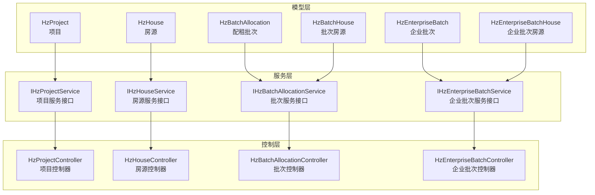
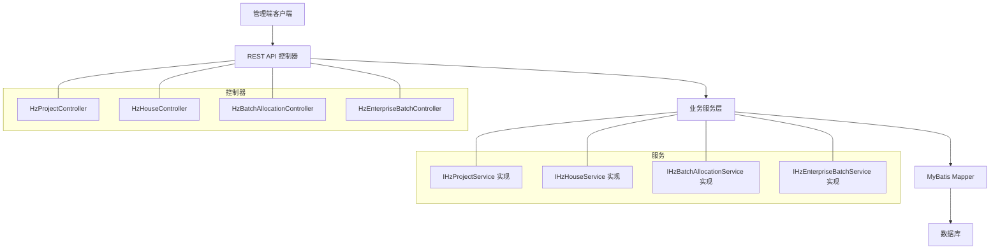
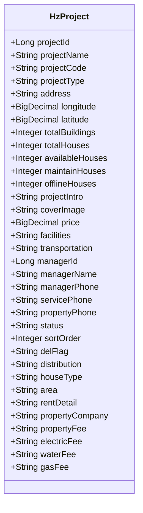
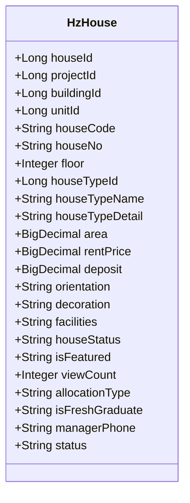
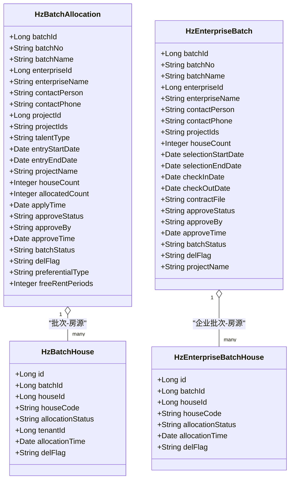
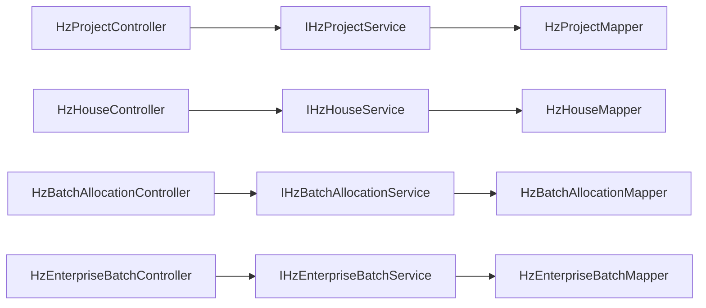

# 资产管理模块

<cite>
**本文引用的文件**
- [HzProject.java](file://ruoyi-system/src/main/java/com/ruoyi/system/domain/HzProject.java)
- [HzHouse.java](file://ruoyi-system/src/main/java/com/ruoyi/system/domain/HzHouse.java)
- [HzBatchAllocation.java](file://ruoyi-system/src/main/java/com/ruoyi/system/domain/HzBatchAllocation.java)
- [HzBatchHouse.java](file://ruoyi-system/src/main/java/com/ruoyi/system/domain/HzBatchHouse.java)
- [HzEnterpriseBatch.java](file://ruoyi-system/src/main/java/com/ruoyi/system/domain/HzEnterpriseBatch.java)
- [HzEnterpriseBatchHouse.java](file://ruoyi-system/src/main/java/com/ruoyi/system/domain/HzEnterpriseBatchHouse.java)
- [IHzProjectService.java](file://ruoyi-system/src/main/java/com/ruoyi/system/service/IHzProjectService.java)
- [HzProjectServiceImpl.java](file://ruoyi-system/src/main/java/com/ruoyi/system/service/impl/HzProjectServiceImpl.java)
- [IHzHouseService.java](file://ruoyi-system/src/main/java/com/ruoyi/system/service/IHzHouseService.java)
- [HzHouseServiceImpl.java](file://ruoyi-system/src/main/java/com/ruoyi/system/service/impl/HzHouseServiceImpl.java)
- [IHzBatchAllocationService.java](file://ruoyi-system/src/main/java/com/ruoyi/system/service/IHzBatchAllocationService.java)
- [HzBatchAllocationServiceImpl.java](file://ruoyi-system/src/main/java/com/ruoyi/system/service/impl/HzBatchAllocationServiceImpl.java)
- [HzEnterpriseBatchController.java](file://ruoyi-admin/src/main/java/com/ruoyi/web/controller/system/HzEnterpriseBatchController.java)
- [HzEnterpriseBatchServiceImpl.java](file://ruoyi-system/src/main/java/com/ruoyi/system/service/impl/HzEnterpriseBatchServiceImpl.java)
- [10-批量分配.md](file://docs/数据字典/10-批量分配.md)
</cite>

## 目录
1. [简介](#简介)
2. [项目结构](#项目结构)
3. [核心组件](#核心组件)
4. [架构概览](#架构概览)
5. [详细组件分析](#详细组件分析)
6. [依赖分析](#依赖分析)
7. [性能考虑](#性能考虑)
8. [故障排查指南](#故障排查指南)
9. [结论](#结论)
10. [附录](#附录)

## 简介
本文件面向港好住信息系统“资产管理模块”，系统化梳理项目管理、房源管理、配租批次管理三大核心功能域，覆盖数据模型设计、业务流程控制、权限管理机制，并提供操作指南与最佳实践，帮助系统管理员高效完成资产管理日常运维。

## 项目结构
资产管理模块由“领域模型 + 服务层 + 控制器 + 文档字典”构成：
- 领域模型：项目、房源、批次、批次房源、企业批次、企业批次房源等实体类
- 服务层：项目、房源、批次、企业批次相关服务接口与实现
- 控制器：系统后台管理端的REST接口，负责对外暴露资产管理能力
- 文档字典：批量分配相关表结构说明，支撑集中配租流程

图表来源
- [HzProject.java:1-544](file://ruoyi-system/src/main/java/com/ruoyi/system/domain/HzProject.java#L1-L544)
- [HzHouse.java:1-441](file://ruoyi-system/src/main/java/com/ruoyi/system/domain/HzHouse.java#L1-L441)
- [HzBatchAllocation.java:1-333](file://ruoyi-system/src/main/java/com/ruoyi/system/domain/HzBatchAllocation.java#L1-L333)
- [HzBatchHouse.java:1-122](file://ruoyi-system/src/main/java/com/ruoyi/system/domain/HzBatchHouse.java#L1-L122)
- [HzEnterpriseBatch.java:1-299](file://ruoyi-system/src/main/java/com/ruoyi/system/domain/HzEnterpriseBatch.java#L1-L299)
- [HzEnterpriseBatchHouse.java:1-126](file://ruoyi-system/src/main/java/com/ruoyi/system/domain/HzEnterpriseBatchHouse.java#L1-L126)

章节来源
- [HzProject.java:1-544](file://ruoyi-system/src/main/java/com/ruoyi/system/domain/HzProject.java#L1-L544)
- [HzHouse.java:1-441](file://ruoyi-system/src/main/java/com/ruoyi/system/domain/HzHouse.java#L1-L441)
- [HzBatchAllocation.java:1-333](file://ruoyi-system/src/main/java/com/ruoyi/system/domain/HzBatchAllocation.java#L1-L333)
- [HzBatchHouse.java:1-122](file://ruoyi-system/src/main/java/com/ruoyi/system/domain/HzBatchHouse.java#L1-L122)
- [HzEnterpriseBatch.java:1-299](file://ruoyi-system/src/main/java/com/ruoyi/system/domain/HzEnterpriseBatch.java#L1-L299)
- [HzEnterpriseBatchHouse.java:1-126](file://ruoyi-system/src/main/java/com/ruoyi/system/domain/HzEnterpriseBatchHouse.java#L1-L126)

## 核心组件
- 项目管理：项目信息维护、项目状态控制、项目资源配置
- 房源管理：房源信息录入、房源状态管理、房源图片管理、房源设施配置
- 配租批次管理：批次创建、房源分配、企业客户配租

章节来源
- [IHzProjectService.java:1-200](file://ruoyi-system/src/main/java/com/ruoyi/system/service/IHzProjectService.java#L1-L200)
- [HzProjectServiceImpl.java:1-99](file://ruoyi-system/src/main/java/com/ruoyi/system/service/impl/HzProjectServiceImpl.java#L1-L99)
- [IHzHouseService.java:1-630](file://ruoyi-system/src/main/java/com/ruoyi/system/service/IHzHouseService.java#L1-L630)
- [HzHouseServiceImpl.java:1-630](file://ruoyi-system/src/main/java/com/ruoyi/system/service/impl/HzHouseServiceImpl.java#L1-L630)
- [IHzBatchAllocationService.java:118-138](file://ruoyi-system/src/main/java/com/ruoyi/system/service/IHzBatchAllocationService.java#L118-L138)
- [HzBatchAllocationServiceImpl.java:73-113](file://ruoyi-system/src/main/java/com/ruoyi/system/service/impl/HzBatchAllocationServiceImpl.java#L73-L113)

## 架构概览
资产管理采用经典的分层架构：控制器层接收请求，服务层编排业务逻辑，持久层负责数据存取。项目与房源作为资产的基本单元，批次作为资源分配的载体，贯穿从“项目-房源-批次”的全链路。

图表来源
- [HzEnterpriseBatchController.java:1-109](file://ruoyi-admin/src/main/java/com/ruoyi/web/controller/system/HzEnterpriseBatchController.java#L1-L109)
- [HzBatchAllocationServiceImpl.java:73-113](file://ruoyi-system/src/main/java/com/ruoyi/system/service/impl/HzBatchAllocationServiceImpl.java#L73-L113)
- [HzHouseServiceImpl.java:1-630](file://ruoyi-system/src/main/java/com/ruoyi/system/service/impl/HzHouseServiceImpl.java#L1-L630)
- [HzProjectServiceImpl.java:1-99](file://ruoyi-system/src/main/java/com/ruoyi/system/service/impl/HzProjectServiceImpl.java#L1-L99)

## 详细组件分析

### 项目管理模块
- 项目信息维护：支持项目基础信息、地理坐标、配套信息、联系方式、状态排序等字段的增删改查
- 项目状态控制：通过状态字段控制项目启用/停用
- 项目资源配置：统计总楼栋数、总房源数、可用房源数、维修中/下架房源数等指标

图表来源
- [HzProject.java:1-544](file://ruoyi-system/src/main/java/com/ruoyi/system/domain/HzProject.java#L1-L544)

章节来源
- [HzProject.java:1-544](file://ruoyi-system/src/main/java/com/ruoyi/system/domain/HzProject.java#L1-L544)
- [IHzProjectService.java:1-200](file://ruoyi-system/src/main/java/com/ruoyi/system/service/IHzProjectService.java#L1-L200)
- [HzProjectServiceImpl.java:1-99](file://ruoyi-system/src/main/java/com/ruoyi/system/service/impl/HzProjectServiceImpl.java#L1-L99)

### 房源管理模块
- 房源信息录入：支持项目/楼栋/单元/户型关联、房源编码、房间号、楼层、面积、租金、押金、朝向、装修、设施等
- 房源状态管理：空置、已预订、已出租、维修中、下架；提供批量状态变更（白名单：0/3/4互转，1/2跳过）
- 房源图片管理：支持上传、排序、封面设置、VR展示
- 房源设施配置：按项目维度配置设施项，支持导入与校验

图表来源
- [HzHouse.java:1-441](file://ruoyi-system/src/main/java/com/ruoyi/system/domain/HzHouse.java#L1-L441)

章节来源
- [HzHouse.java:1-441](file://ruoyi-system/src/main/java/com/ruoyi/system/domain/HzHouse.java#L1-L441)
- [IHzHouseService.java:1-630](file://ruoyi-system/src/main/java/com/ruoyi/system/service/IHzHouseService.java#L1-L630)
- [HzHouseServiceImpl.java:1-630](file://ruoyi-system/src/main/java/com/ruoyi/system/service/impl/HzHouseServiceImpl.java#L1-L630)

### 配租批次管理模块
- 批次创建：支持企业批次与集中配租批次两类，包含批次编号/名称、企业联系人、项目范围、选房/入驻/截止日期、合同文件、审批状态、批次状态等
- 房源分配：集中配租批次与企业批次分别维护批次房源映射，记录分配状态与分配时间
- 企业客户配租：企业批次支持导出、分页查询、生成批次编号等

图表来源
- [HzBatchAllocation.java:1-333](file://ruoyi-system/src/main/java/com/ruoyi/system/domain/HzBatchAllocation.java#L1-L333)
- [HzBatchHouse.java:1-122](file://ruoyi-system/src/main/java/com/ruoyi/system/domain/HzBatchHouse.java#L1-L122)
- [HzEnterpriseBatch.java:1-299](file://ruoyi-system/src/main/java/com/ruoyi/system/domain/HzEnterpriseBatch.java#L1-L299)
- [HzEnterpriseBatchHouse.java:1-126](file://ruoyi-system/src/main/java/com/ruoyi/system/domain/HzEnterpriseBatchHouse.java#L1-L126)

章节来源
- [HzBatchAllocation.java:1-333](file://ruoyi-system/src/main/java/com/ruoyi/system/domain/HzBatchAllocation.java#L1-L333)
- [HzBatchHouse.java:1-122](file://ruoyi-system/src/main/java/com/ruoyi/system/domain/HzBatchHouse.java#L1-L122)
- [HzEnterpriseBatch.java:1-299](file://ruoyi-system/src/main/java/com/ruoyi/system/domain/HzEnterpriseBatch.java#L1-L299)
- [HzEnterpriseBatchHouse.java:1-126](file://ruoyi-system/src/main/java/com/ruoyi/system/domain/HzEnterpriseBatchHouse.java#L1-L126)
- [IHzBatchAllocationService.java:118-138](file://ruoyi-system/src/main/java/com/ruoyi/system/service/IHzBatchAllocationService.java#L118-L138)
- [HzBatchAllocationServiceImpl.java:73-113](file://ruoyi-system/src/main/java/com/ruoyi/system/service/impl/HzBatchAllocationServiceImpl.java#L73-L113)
- [HzEnterpriseBatchController.java:1-109](file://ruoyi-admin/src/main/java/com/ruoyi/web/controller/system/HzEnterpriseBatchController.java#L1-L109)
- [HzEnterpriseBatchServiceImpl.java:1-220](file://ruoyi-system/src/main/java/com/ruoyi/system/service/impl/HzEnterpriseBatchServiceImpl.java#L1-L220)

### 批量分配数据模型
- 集中配租批次表：批次基础信息、审批与状态流转、项目范围、房源数量与分配进度
- 批次房源表：批次与房源的关联、分配状态、租户绑定、分配时间
- 批次租户表：批次内人员信息、分配状态、分配时间

章节来源
- [10-批量分配.md:1-77](file://docs/数据字典/10-批量分配.md#L1-L77)

## 依赖分析
- 控制器到服务：各控制器通过依赖注入调用对应服务接口，遵循“接口隔离”
- 服务到持久层：服务层通过Mapper访问数据库，封装复杂查询与事务
- 实体模型：项目/房源/批次/企业批次等模型字段覆盖业务关键属性，便于前后端交互与报表统计

图表来源
- [HzEnterpriseBatchController.java:1-109](file://ruoyi-admin/src/main/java/com/ruoyi/web/controller/system/HzEnterpriseBatchController.java#L1-L109)
- [HzBatchAllocationServiceImpl.java:73-113](file://ruoyi-system/src/main/java/com/ruoyi/system/service/impl/HzBatchAllocationServiceImpl.java#L73-L113)
- [HzHouseServiceImpl.java:1-630](file://ruoyi-system/src/main/java/com/ruoyi/system/service/impl/HzHouseServiceImpl.java#L1-L630)
- [HzProjectServiceImpl.java:1-99](file://ruoyi-system/src/main/java/com/ruoyi/system/service/impl/HzProjectServiceImpl.java#L1-L99)

## 性能考虑
- 分页查询：项目与企业批次均提供分页接口，避免一次性加载大量数据
- 批量状态变更：在房源服务中提供受控白名单的状态批量切换，减少逐条更新带来的事务压力
- 关联查询优化：房源详情聚合项目/楼栋/单元/户型/图片/VR，建议在Mapper层面使用合理联结与排序策略
- 导入校验：房源导入流程包含项目/楼栋/单元/户型的逐级校验，失败快速反馈，降低脏数据风险

## 故障排查指南
- 房源导入失败：检查项目名称、楼栋名称、单元名称、户型名称是否与现有数据一致；确认房源编码唯一性
- 批次状态异常：集中配租批次仅允许“待审批/已通过/已拒绝”状态下修改；企业批次支持分页导出与查看详情
- 房源状态跳过：当房源处于“已预订/已出租”状态时，批量状态变更会自动跳过，避免影响订单/合同

章节来源
- [HzHouseServiceImpl.java:244-386](file://ruoyi-system/src/main/java/com/ruoyi/system/service/impl/HzHouseServiceImpl.java#L244-L386)
- [HzBatchAllocationServiceImpl.java:104-113](file://ruoyi-system/src/main/java/com/ruoyi/system/service/impl/HzBatchAllocationServiceImpl.java#L104-L113)
- [HzEnterpriseBatchController.java:60-71](file://ruoyi-admin/src/main/java/com/ruoyi/web/controller/system/HzEnterpriseBatchController.java#L60-L71)

## 结论
资产管理模块以清晰的领域模型与分层架构为基础，围绕项目、房源、批次三大核心对象构建了完整的业务闭环。通过严格的权限控制、受控的状态变更与完善的导入校验机制，保障了资产管理的准确性与可追溯性。建议在日常运维中优先使用分页查询与批量操作接口，结合数据字典规范，持续提升资产管理效率与质量。

## 附录

### 操作指南与最佳实践
- 项目管理
  - 新增项目时，同步完善项目主图、设施、交通信息与价格明细
  - 使用项目分页列表查看实时统计（总房源、可用房源、维修中、下架）
- 房源管理
  - 房源导入前，先在项目内建立楼栋、单元、户型，确保关联字段一致
  - 批量状态变更仅在“空置/维修中/下架”之间进行，避免影响已预订/已出租房源
  - 图片与VR上传建议统一排序规则，封面优先展示
- 配租批次管理
  - 企业批次支持导出与分页查询，便于跨项目资源统筹
  - 集中配租批次需严格控制审批状态，确保批次状态与实际分配进度一致

### 权限管理机制
- 控制器方法普遍使用权限注解，仅具备相应菜单权限的用户可执行对应操作
- 建议为不同角色（如项目管理员、资产运营、系统管理员）配置最小权限集，遵循“按需授权”

章节来源
- [HzEnterpriseBatchController.java:47-109](file://ruoyi-admin/src/main/java/com/ruoyi/web/controller/system/HzEnterpriseBatchController.java#L47-L109)
- [HzBatchAllocationServiceImpl.java:73-113](file://ruoyi-system/src/main/java/com/ruoyi/system/service/impl/HzBatchAllocationServiceImpl.java#L73-L113)
- [HzHouseServiceImpl.java:480-567](file://ruoyi-system/src/main/java/com/ruoyi/system/service/impl/HzHouseServiceImpl.java#L480-L567)