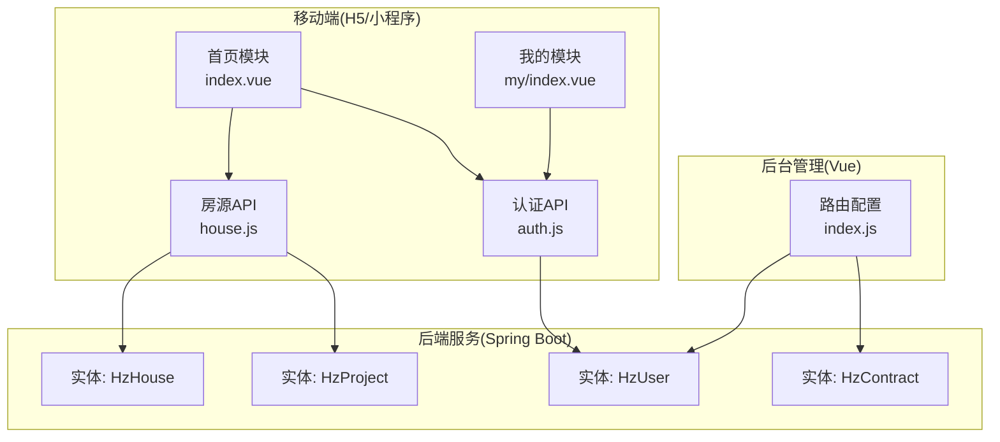
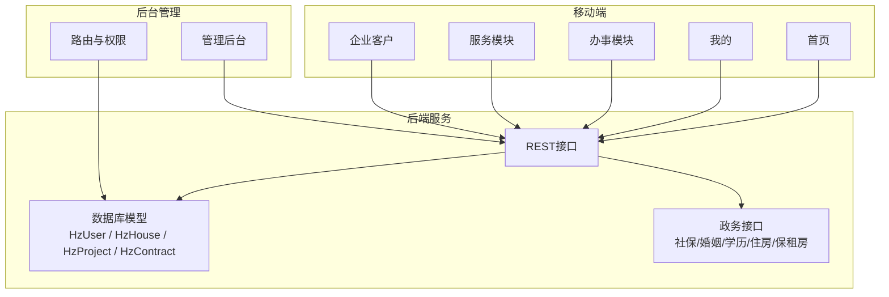
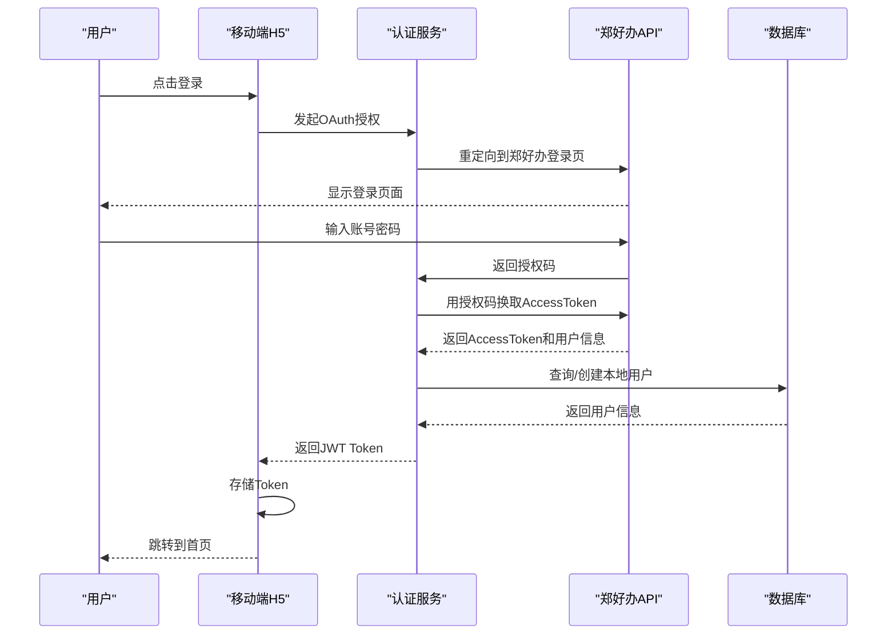
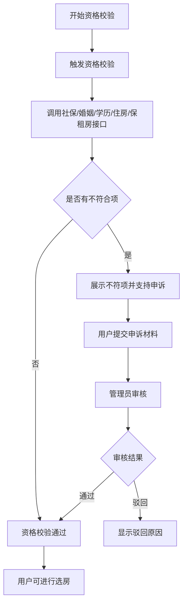
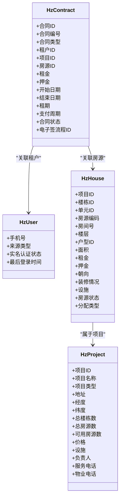

# 核心功能模块

<cite>
**本文引用的文件**
- [功能清单.json](file://功能清单.json)
- [技术方案.md](file://技术方案.md)
- [README.md](file://Docs/港好住交付包-管理后台开发/README.md)
- [index.vue](file://uniapp-h5/pages/index/index.vue)
- [my/index.vue](file://uniapp-h5/pages/my/index.vue)
- [auth.js](file://uniapp-h5/api/auth.js)
- [house.js](file://uniapp-h5/api/house.js)
- [index.js](file://ruoyi-ui/src/router/index.js)
- [HzHouse.java](file://ruoyi-system/src/main/java/com/ruoyi/system/domain/HzHouse.java)
- [HzProject.java](file://ruoyi-system/src/main/java/com/ruoyi/system/domain/HzProject.java)
- [HzUser.java](file://ruoyi-system/src/main/java/com/ruoyi/system/domain/HzUser.java)
- [HzContract.java](file://ruoyi-system/src/main/java/com/ruoyi/system/domain/HzContract.java)
</cite>

## 目录
1. [简介](#简介)
2. [项目结构](#项目结构)
3. [核心组件](#核心组件)
4. [架构总览](#架构总览)
5. [详细组件分析](#详细组件分析)
6. [依赖分析](#依赖分析)
7. [性能考虑](#性能考虑)
8. [故障排查指南](#故障排查指南)
9. [结论](#结论)
10. [附录](#附录)

## 简介
港好住信息系统是一套面向郑州航空港经济综合实验区的人才公寓、保租房与市场租赁的数字化服务平台，覆盖移动端H5/小程序与后台管理系统两大层面。系统通过对接郑好办用户体系、打通多部门政务数据接口（社保、婚姻、学历、住房、保租房），实现从资格校验、选房、签约、入住、退租、续租到缴费、开票、投诉报修等全生命周期业务闭环，并为后台管理提供资产、业务、财务、服务、系统等五大管理域的统一支撑。

## 项目结构
系统采用前后端分离架构：
- 移动端（uni-app）：H5/小程序统一代码，提供登录、首页、办事（人才公寓/保租房/市场租赁）、服务、企业客户、我的等模块。
- 后台管理（Vue2 + Element-UI + 若依框架）：提供首页数据统计、资产管理、业务管理、财务管理、服务管理、系统管理等模块。
- 后端服务（Spring Boot + MyBatis-Plus）：提供REST接口，承载业务逻辑、数据模型与第三方接口集成。

图表来源
- [index.vue](file://uniapp-h5/pages/index/index.vue)
- [my/index.vue](file://uniapp-h5/pages/my/index.vue)
- [auth.js](file://uniapp-h5/api/auth.js)
- [house.js](file://uniapp-h5/api/house.js)
- [index.js](file://ruoyi-ui/src/router/index.js)
- [HzHouse.java](file://ruoyi-system/src/main/java/com/ruoyi/system/domain/HzHouse.java)
- [HzProject.java](file://ruoyi-system/src/main/java/com/ruoyi/system/domain/HzProject.java)
- [HzUser.java](file://ruoyi-system/src/main/java/com/ruoyi/system/domain/HzUser.java)
- [HzContract.java](file://ruoyi-system/src/main/java/com/ruoyi/system/domain/HzContract.java)

章节来源
- [功能清单.json](file://功能清单.json)
- [技术方案.md](file://技术方案.md)
- [README.md](file://Docs/港好住交付包-管理后台开发/README.md)

## 核心组件
- 移动端H5/小程序功能模块
  - 登录模块：对接郑好办用户体系，实现单点登录与用户信息采集。
  - 首页模块：搜索、Banner、金刚位、项目列表等入口。
  - 办事模块：人才公寓、保租房、市场租赁全流程（资格校验、选房、预约看房、合同签署、押金缴纳、入住/退租/续租、账单缴费、开票、合住人申请、调换房申请等）。
  - 服务模块：投诉建议、保洁、搬家、报修等生活服务。
  - 企业客户模块：集中配租、在线缴费、入住/退租、合同备案、代购补贴。
  - 我的模块：消息、房源、合同、申诉记录、信息维护、优惠券、关于我们。
- 后台管理系统功能模块
  - 资产管理：项目管理、房源管理、配租批次管理。
  - 业务管理：租户管理、预约看房、资格申诉审核、合同管理、入住/退租/退款、合住人、调换房、租金账单。
  - 财务管理：账单、收款台账、代购补贴、开票。
  - 服务管理：保洁、搬家、报修订单管理与服务公司管理。
  - 系统管理：用户、角色权限、配置、报表、优惠券、黑名单、数据迁移等。

章节来源
- [功能清单.json](file://功能清单.json)
- [技术方案.md](file://技术方案.md)

## 架构总览
移动端与后台系统通过后端服务进行数据交互，移动端负责用户触达与业务操作，后台负责数据治理与业务审批。系统通过统一的REST接口与实体模型支撑业务流转，同时对接郑好办与多部门数据接口，确保资格校验与政务服务的顺畅衔接。

图表来源
- [index.vue](file://uniapp-h5/pages/index/index.vue)
- [my/index.vue](file://uniapp-h5/pages/my/index.vue)
- [auth.js](file://uniapp-h5/api/auth.js)
- [house.js](file://uniapp-h5/api/house.js)
- [index.js](file://ruoyi-ui/src/router/index.js)
- [HzUser.java](file://ruoyi-system/src/main/java/com/ruoyi/system/domain/HzUser.java)
- [HzHouse.java](file://ruoyi-system/src/main/java/com/ruoyi/system/domain/HzHouse.java)
- [HzProject.java](file://ruoyi-system/src/main/java/com/ruoyi/system/domain/HzProject.java)
- [HzContract.java](file://ruoyi-system/src/main/java/com/ruoyi/system/domain/HzContract.java)

## 详细组件分析

### 登录模块（移动端）
- 功能要点
  - 对接郑好办用户体系，支持OAuth2.0授权登录。
  - 首次登录引导完善个人信息（身份、姓名、身份证、联系电话、工作单位、单位性质、单位电话、配偶等）。
  - 首次登录弹窗展示港区保租房、人才公寓管理现行办法，用户勾选同意后方可继续。
- 技术要点
  - OAuth2.0授权码模式、JWT Token存储与刷新、敏感信息加密存储、会话超时控制。
- 用户价值
  - 一站式身份认证，简化用户操作，确保合规与风险控制。

图表来源
- [auth.js](file://uniapp-h5/api/auth.js)
- [index.vue](file://uniapp-h5/pages/index/index.vue)

章节来源
- [技术方案.md](file://技术方案.md)
- [功能清单.json](file://功能清单.json)
- [auth.js](file://uniapp-h5/api/auth.js)

### 首页模块（移动端）
- 功能要点
  - 搜索：关键词搜索房源/项目，支持分类筛选。
  - Banner：政策通知、办事指引等信息轮播展示。
  - 金刚位：人才公寓、保租房、市场租赁、地图找房、人才家园、政策文件、资料上传、优惠券、我的消息、通知公告等入口。
  - 项目列表：切换人才公寓/保租房/市场租赁，展示项目名称、图片、地址、价格、房源状态等。
- 用户价值
  - 一站式入口，降低用户学习成本，提升业务转化效率。

章节来源
- [index.vue](file://uniapp-h5/pages/index/index.vue)
- [功能清单.json](file://功能清单.json)

### 办事模块（人才公寓/保租房/市场租赁）
- 人才公寓/保租房
  - 资格申诉：自动对接多部门数据接口，展示不符合项，支持手动刷新与申诉。
  - 选房：项目列表、项目详情、承诺书、房源列表、房源详情、VR看房、预约看房。
  - 合同签署：合同信息展示、在线签署、合同记录。
  - 押金缴纳：押金信息、材料上传提示、在线支付、支付记录。
  - 入住/退租/续租：申请、确认、详情、校验、缴费提示。
  - 账单缴费：账单列表、账单缴费、支付记录。
  - 我的合同：合同列表、合同详情、租金缴纳、续租校验、续租合同签订。
  - 开票：开票记录、申请开票、发票信息。
  - 我的预约：预约列表、取消与确认。
  - 合住人申请、调换房申请。
- 市场租赁
  - 无需资格校验与承诺书，流程简化，支持直接选房、签约、入住、退租、续租、缴费。

图表来源
- [技术方案.md](file://技术方案.md)

章节来源
- [技术方案.md](file://技术方案.md)
- [功能清单.json](file://功能清单.json)

### 服务模块（移动端）
- 投诉及建议：投诉记录与发起。
- 保洁订单：搜索、订单列表、申请、评价。
- 搬家订单：搜索、订单列表、申请、评价。
- 物业报修：报修记录、申请、评价。

章节来源
- [功能清单.json](file://功能清单.json)

### 企业客户模块（移动端）
- 在线缴费：集中分配项目信息、单位信息、账期选择、在线支付。
- 入住办理：集中分配项目、入住人员名单模板下载、上传名单、提交入住申请。
- 退租办理：集中分配项目、账期选择、提交退租申请。
- 合同备案：历史记录、审批进度、发起备案申请。
- 代购补贴：历史申请记录、审批进度、发起申请、签署承诺书。

章节来源
- [功能清单.json](file://功能清单.json)

### 我的模块（移动端）
- 账号资料、我的消息、我的房源、我的合同、申诉记录、信息维护、优惠券、关于我们。
- 登录态管理与菜单权限控制。

章节来源
- [my/index.vue](file://uniapp-h5/pages/my/index.vue)
- [功能清单.json](file://功能清单.json)

### 后台管理系统（管理后台）
- 首页数据统计：财务、房源、租户、客户分析等。
- 资产管理：项目管理、房源管理、配租批次管理。
- 业务管理：租户管理、预约看房、资格申诉审核、合同管理、入住/退租/退款、合住人、调换房、租金账单。
- 财务管理：账单、收款台账、代购补贴、开票。
- 服务管理：保洁、搬家、报修订单管理与服务公司管理。
- 系统管理：用户、角色权限、配置、报表、优惠券、黑名单、数据迁移。

章节来源
- [功能清单.json](file://功能清单.json)
- [技术方案.md](file://技术方案.md)
- [README.md](file://Docs/港好住交付包-管理后台开发/README.md)

## 依赖分析
- 移动端依赖
  - 认证API：登录、获取用户信息、更新信息、退出登录、郑好办授权登录、微信登录。
  - 房源API：按项目类型获取房源列表、房源列表、房源详情、VR列表、图片分类。
- 后端实体依赖
  - HzUser：用户基础信息、来源类型、认证状态等。
  - HzHouse：房源信息、状态、设施、分配类型等。
  - HzProject：项目信息、类型、价格、设施、负责人等。
  - HzContract：合同信息、状态、支付周期、电子签流程ID等。
- 路由与权限
  - 后台路由配置与权限控制，支撑管理后台的模块化访问。

图表来源
- [HzUser.java](file://ruoyi-system/src/main/java/com/ruoyi/system/domain/HzUser.java)
- [HzHouse.java](file://ruoyi-system/src/main/java/com/ruoyi/system/domain/HzHouse.java)
- [HzProject.java](file://ruoyi-system/src/main/java/com/ruoyi/system/domain/HzProject.java)
- [HzContract.java](file://ruoyi-system/src/main/java/com/ruoyi/system/domain/HzContract.java)

章节来源
- [auth.js](file://uniapp-h5/api/auth.js)
- [house.js](file://uniapp-h5/api/house.js)
- [index.js](file://ruoyi-ui/src/router/index.js)
- [HzUser.java](file://ruoyi-system/src/main/java/com/ruoyi/system/domain/HzUser.java)
- [HzHouse.java](file://ruoyi-system/src/main/java/com/ruoyi/system/domain/HzHouse.java)
- [HzProject.java](file://ruoyi-system/src/main/java/com/ruoyi/system/domain/HzProject.java)
- [HzContract.java](file://ruoyi-system/src/main/java/com/ruoyi/system/domain/HzContract.java)

## 性能考虑
- 前端性能
  - 首页轮播图与项目列表懒加载、图片URL统一处理与CDN加速。
  - 功能入口按业务开关动态过滤，避免无效渲染。
- 后端性能
  - 实体模型字段明确、查询条件清晰，结合索引与分页，降低数据库压力。
  - 支付、电子签等关键流程采用异步处理与状态轮询，提升稳定性。
- 数据一致性
  - 资格校验并行调用多接口，结合Redis缓存与超时重试，保证结果一致性与用户体验。

## 故障排查指南
- 登录失败
  - 检查OAuth授权流程、Token刷新与存储、会话超时设置。
- 资格校验异常
  - 检查多部门接口连通性、缓存命中率与超时重试策略。
- 房源/项目数据异常
  - 校验HzHouse、HzProject字段映射与查询参数，确认分页与筛选条件。
- 合同/账单异常
  - 核对HzContract状态流转与HzUser信息完整性，检查电子签流程ID与支付回调。

章节来源
- [技术方案.md](file://技术方案.md)
- [auth.js](file://uniapp-h5/api/auth.js)
- [house.js](file://uniapp-h5/api/house.js)
- [HzUser.java](file://ruoyi-system/src/main/java/com/ruoyi/system/domain/HzUser.java)
- [HzHouse.java](file://ruoyi-system/src/main/java/com/ruoyi/system/domain/HzHouse.java)
- [HzProject.java](file://ruoyi-system/src/main/java/com/ruoyi/system/domain/HzProject.java)
- [HzContract.java](file://ruoyi-system/src/main/java/com/ruoyi/system/domain/HzContract.java)

## 结论
港好住信息系统通过移动端与后台管理系统的协同，构建了从“身份认证—资格校验—选房签约—入住退租—缴费开票”的全链路服务体系，并以数据驱动的方式支撑管理决策与运营效率。产品与开发团队可据此功能概览与分解，明确优先级与协作边界，确保系统高质量交付与持续演进。

## 附录
- 功能优先级说明
  - P0：用户登录、首页、人才公寓/保租房/市场租赁核心流程、账单缴费、开票、我的模块等。
  - P1：服务模块（保洁/搬家/报修）、企业客户服务、优惠券等。
- 业务流程图
  - 登录认证流程、资格校验流程、选房签约流程、入住/退租/续租流程、账单缴费流程等详见“第三部分：系统业务流程设计”。

章节来源
- [功能清单.json](file://功能清单.json)
- [技术方案.md](file://技术方案.md)