# 办事模块

<cite>
**本文档引用的文件**
- [pages/affairs/index.vue](file://uniapp-h5/pages/affairs/index.vue)
- [api/checkin.js](file://uniapp-h5/api/checkin.js)
- [api/checkout.js](file://uniapp-h5/api/checkout.js)
- [api/bill.js](file://uniapp-h5/api/bill.js)
- [api/contract.js](file://uniapp-h5/api/contract.js)
- [api/invoice.js](file://uniapp-h5/api/invoice.js)
- [api/appointment.js](file://uniapp-h5/api/appointment.js)
- [api/cohabitant.js](file://uniapp-h5/api/cohabitant.js)
- [api/exchange.js](file://uniapp-h5/api/exchange.js)
- [subpkg/affairs/checkin.vue](file://uniapp-h5/subpkg/affairs/checkin.vue)
- [subpkg/affairs/checkout.vue](file://uniapp-h5/subpkg/affairs/checkout.vue)
- [subpkg/affairs/bill.vue](file://uniapp-h5/subpkg/affairs/bill.vue)
- [subpkg/affairs/contract.vue](file://uniapp-h5/subpkg/affairs/contract.vue)
- [subpkg/affairs/invoice.vue](file://uniapp-h5/subpkg/affairs/invoice.vue)
- [subpkg/affairs/appointment.vue](file://uniapp-h5/subpkg/affairs/appointment.vue)
- [subpkg/affairs/cohabitant.vue](file://uniapp-h5/subpkg/affairs/cohabitant.vue)
- [subpkg/affairs/exchange.vue](file://uniapp-h5/subpkg/affairs/exchange.vue)
- [subpkg/affairs/checkin-confirm.vue](file://uniapp-h5/subpkg/affairs/checkin-confirm.vue)
- [subpkg/affairs/checkout-confirm.vue](file://uniapp-h5/subpkg/affairs/checkout-confirm.vue)
- [ruoyi-admin/src/main/java/com/ruoyi/web/controller/h5/HzHouseAppController.java](file://ruoyi-admin/src/main/java/com/ruoyi/web/controller/h5/HzHouseAppController.java)
</cite>

## 目录
1. [简介](#简介)
2. [项目结构](#项目结构)
3. [核心组件](#核心组件)
4. [架构总览](#架构总览)
5. [详细组件分析](#详细组件分析)
6. [设施分类标准化更新](#设施分类标准化更新)
7. [依赖分析](#依赖分析)
8. [性能考虑](#性能考虑)
9. [故障排查指南](#故障排查指南)
10. [结论](#结论)

## 简介
本文件面向港好住信息系统移动端"办事模块"，系统性梳理并说明8个核心子功能：入住办理、退租办理、账单缴费、我的合同、开票服务、我的预约、合租户申请、调换房申请。内容涵盖业务流程、表单设计、数据验证、状态管理、进度跟踪、历史记录查询、状态变更通知、与后台的数据交互与API调用、权限控制、业务规则验证及用户体验优化建议，并提供面向用户的流程指导与面向开发的技术实现方案。

**更新** 本版本特别关注H5移动端设施分类标准化变更，移动端确认页面的设施分类默认值已从'其他'调整为'墙地面类'，确保设施分类的准确性和一致性。

## 项目结构
办事模块位于 uniapp-h5 的 subpkg/affairs 目录下，入口页面为 pages/affairs/index.vue，负责聚合8个子功能入口并按房源类型（人才公寓/保租房/市场租赁）分组展示图标与跳转逻辑。各子功能均配有独立页面与对应的API封装文件，形成清晰的页面-接口分层。

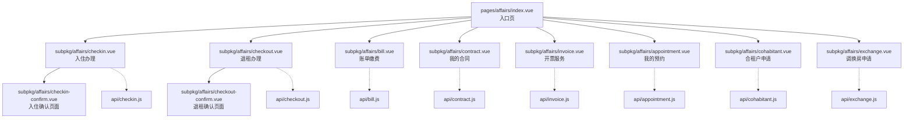

图表来源
- [pages/affairs/index.vue:1-291](file://uniapp-h5/pages/affairs/index.vue#L1-L291)
- [subpkg/affairs/checkin.vue:1-536](file://uniapp-h5/subpkg/affairs/checkin.vue#L1-L536)
- [subpkg/affairs/checkout.vue:1-509](file://uniapp-h5/subpkg/affairs/checkout.vue#L1-L509)
- [subpkg/affairs/bill.vue:1-1003](file://uniapp-h5/subpkg/affairs/bill.vue#L1-L1003)
- [subpkg/affairs/contract.vue:1-1042](file://uniapp-h5/subpkg/affairs/contract.vue#L1-L1042)
- [subpkg/affairs/invoice.vue:1-325](file://uniapp-h5/subpkg/affairs/invoice.vue#L1-L325)
- [subpkg/affairs/appointment.vue:1-437](file://uniapp-h5/subpkg/affairs/appointment.vue#L1-L437)
- [subpkg/affairs/cohabitant.vue:1-658](file://uniapp-h5/subpkg/affairs/cohabitant.vue#L1-L658)
- [subpkg/affairs/exchange.vue:1-310](file://uniapp-h5/subpkg/affairs/exchange.vue#L1-L310)
- [subpkg/affairs/checkin-confirm.vue:1-200](file://uniapp-h5/subpkg/affairs/checkin-confirm.vue#L1-L200)
- [subpkg/affairs/checkout-confirm.vue:1-250](file://uniapp-h5/subpkg/affairs/checkout-confirm.vue#L1-L250)

章节来源
- [pages/affairs/index.vue:1-291](file://uniapp-h5/pages/affairs/index.vue#L1-L291)

## 核心组件
- 入住办理：支持查看入住申请列表、前置条件检查（押金/资料/首期房租）、取消申请、编辑信息、确认入住、查看详情等。
- 退租办理：整合已确认入住单与退租申请，支持退租申请、取消、确认、查看详情、再次退租等。
- 账单缴费：支持当前/历史账单切换、批量勾选、优惠明细、微信JSAPI支付、轮询同步支付结果。
- 我的合同：支持当前/历史合同切换、合同状态步骤指示（签署-支付押金-提交资料-首期房租）、PDF在线查看、续租、支付等。
- 开票服务：支持发票申请列表按日期分组、状态显示、发票详情、申请开票入口。
- 我的预约：支持预约列表、状态映射（待看房/已看房/已过期/已取消）、取消预约、确认看房。
- 合租户申请：选择已确认合同、填写合租人信息（姓名/身份证/电话/关系/入住日期）、提交申请。
- 调换房申请：查看调换房历史、状态（待审核/已完成/已拒绝）、申请调换入口。

章节来源
- [subpkg/affairs/checkin.vue:1-536](file://uniapp-h5/subpkg/affairs/checkin.vue#L1-L536)
- [subpkg/affairs/checkout.vue:1-509](file://uniapp-h5/subpkg/affairs/checkout.vue#L1-L509)
- [subpkg/affairs/bill.vue:1-1003](file://uniapp-h5/subpkg/affairs/bill.vue#L1-L1003)
- [subpkg/affairs/contract.vue:1-1042](file://uniapp-h5/subpkg/affairs/contract.vue#L1-L1042)
- [subpkg/affairs/invoice.vue:1-325](file://uniapp-h5/subpkg/affairs/invoice.vue#L1-L325)
- [subpkg/affairs/appointment.vue:1-437](file://uniapp-h5/subpkg/affairs/appointment.vue#L1-L437)
- [subpkg/affairs/cohabitant.vue:1-658](file://uniapp-h5/subpkg/affairs/cohabitant.vue#L1-L658)
- [subpkg/affairs/exchange.vue:1-310](file://uniapp-h5/subpkg/affairs/exchange.vue#L1-L310)

## 架构总览
移动端采用"页面-接口"分层：页面负责UI与交互，API文件封装HTTP请求，统一通过 utils/request 进行网络调用。页面通过 mixin 进行登录态校验，确保用户身份正确后执行业务操作。

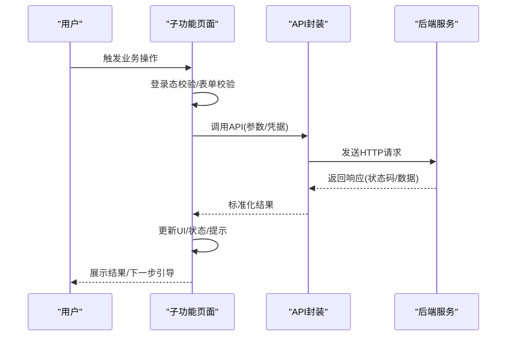

图表来源
- [subpkg/affairs/checkin.vue:108-147](file://uniapp-h5/subpkg/affairs/checkin.vue#L108-L147)
- [api/checkin.js:1-102](file://uniapp-h5/api/checkin.js#L1-L102)
- [subpkg/affairs/bill.vue:142-208](file://uniapp-h5/subpkg/affairs/bill.vue#L142-L208)
- [api/bill.js:1-61](file://uniapp-h5/api/bill.js#L1-L61)

## 详细组件分析

### 入住办理
- 业务流程
  - 前置条件检查：押金是否已缴、资料是否已提交、首期房租是否已缴。
  - 列表展示：支持取消申请、编辑信息、确认入住、查看详情、入驻详情。
  - 状态管理：待办理、审批中、审核通过、已拒绝、已入住确认。
- 表单设计与验证
  - 通过 checkinCheck 接口返回 canCheckin 与 blockMsg，动态控制按钮可用性与提示。
  - 缺失条件时提供"去缴押金/去缴房租"跳转。
- 数据交互
  - 列表：getCheckInList/getConfirmedCheckInList
  - 详情：getCheckInDetail/getCheckInConfirmInfo
  - 提交：submitCheckIn/submitCheckInConfirm
  - 取消：cancelCheckIn
- 状态变更通知
  - 页面 onShow 自动刷新，确保状态同步。
  - 倒计时提示（如资料上传时限）。

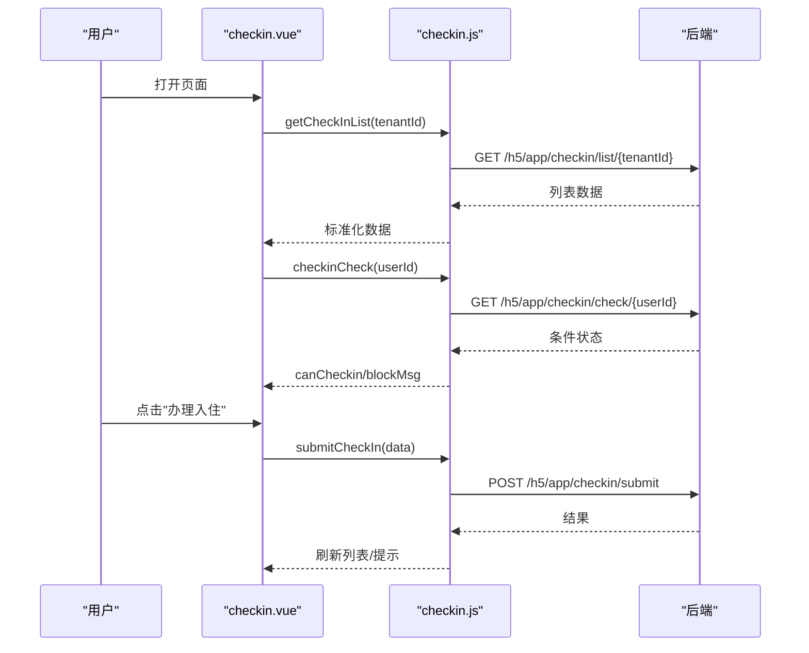

图表来源
- [subpkg/affairs/checkin.vue:158-180](file://uniapp-h5/subpkg/affairs/checkin.vue#L158-L180)
- [subpkg/affairs/checkin.vue:322-338](file://uniapp-h5/subpkg/affairs/checkin.vue#L322-L338)
- [api/checkin.js:10-24](file://uniapp-h5/api/checkin.js#L10-L24)
- [api/checkin.js:52-65](file://uniapp-h5/api/checkin.js#L52-L65)

章节来源
- [subpkg/affairs/checkin.vue:1-536](file://uniapp-h5/subpkg/affairs/checkin.vue#L1-L536)
- [api/checkin.js:1-102](file://uniapp-h5/api/checkin.js#L1-L102)

### 退租办理
- 业务流程
  - 合并策略：优先显示退租申请，若无申请则显示已确认入住单。
  - 支持：退租办理、取消、确认、查看详情、再次退租。
  - 续租合同：押金转移提示，引导从续租合同办理退租。
- 数据交互
  - 列表：getCheckoutList + getConfirmedCheckInList
  - 详情：getCheckoutDetail/getCheckoutConfirm
  - 提交：submitCheckoutApply/submitCheckoutConfirm
  - 取消：cancelCheckoutApply

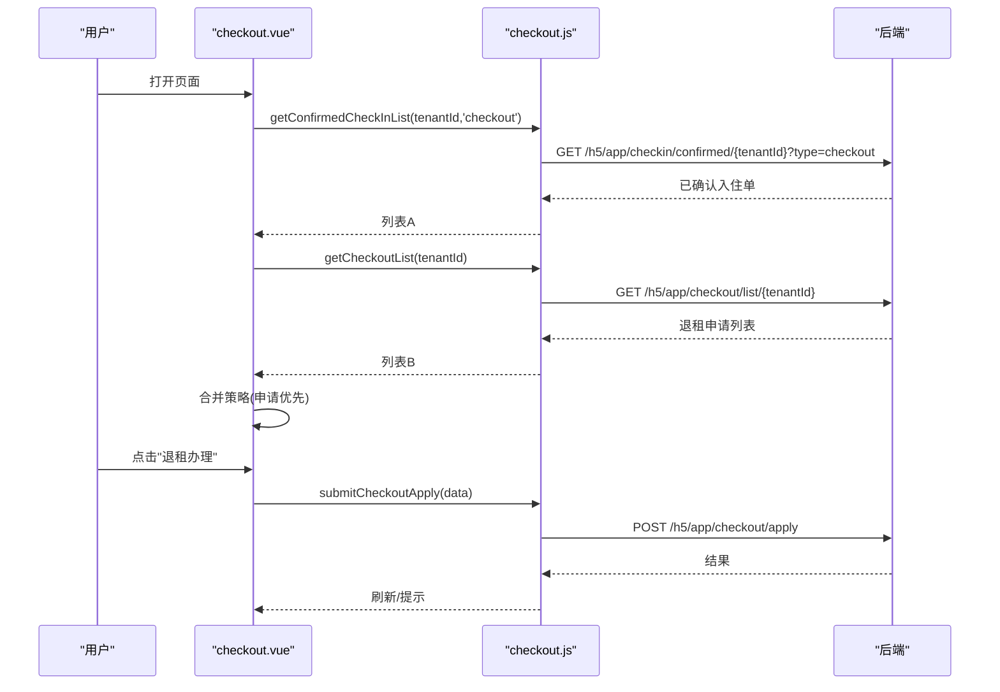

图表来源
- [subpkg/affairs/checkout.vue:147-180](file://uniapp-h5/subpkg/affairs/checkout.vue#L147-L180)
- [api/checkout.js:10-24](file://uniapp-h5/api/checkout.js#L10-L24)
- [api/checkout.js:31-42](file://uniapp-h5/api/checkout.js#L31-L42)

章节来源
- [subpkg/affairs/checkout.vue:1-509](file://uniapp-h5/subpkg/affairs/checkout.vue#L1-L509)
- [api/checkout.js:1-79](file://uniapp-h5/api/checkout.js#L1-L79)

### 账单缴费
- 业务流程
  - 当前/历史账单切换、全选/反选、优惠明细展开、去结算。
  - 微信JSAPI支付：预支付参数 -> 调起支付 -> 轮询同步支付状态。
  - 锁定机制：押金未缴或资料未提交时，租金账单不可选并遮罩提示。
- 数据交互
  - 列表：getBillListByUserId/getBillListByContractId
  - 支付：payBill/payBillBatch
  - 文档状态：/h5/document/status/{userId}

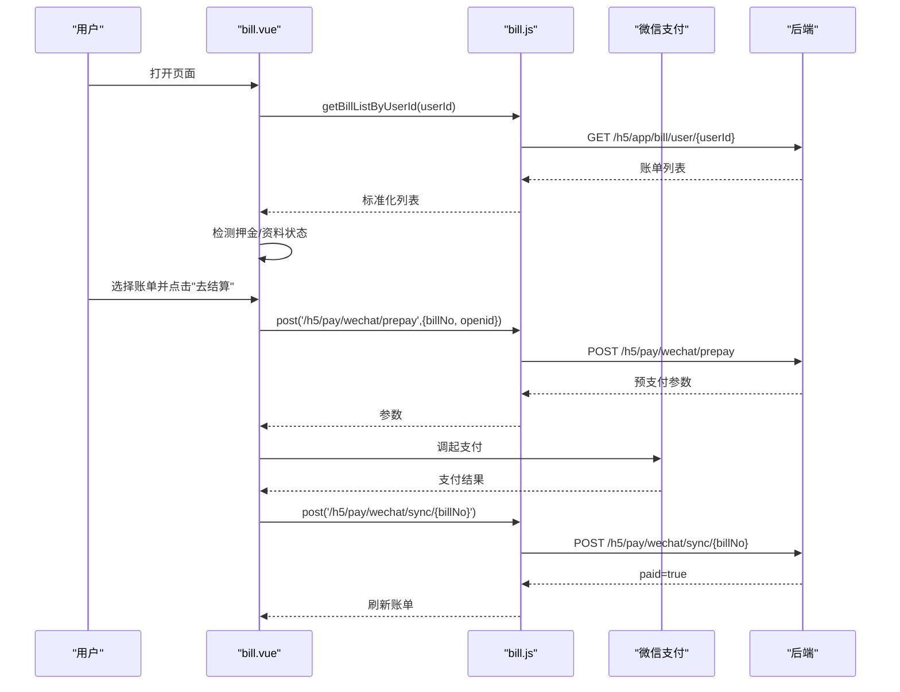

图表来源
- [subpkg/affairs/bill.vue:213-271](file://uniapp-h5/subpkg/affairs/bill.vue#L213-L271)
- [subpkg/affairs/bill.vue:408-428](file://uniapp-h5/subpkg/affairs/bill.vue#L408-L428)
- [api/bill.js:13-24](file://uniapp-h5/api/bill.js#L13-L24)
- [api/bill.js:40-52](file://uniapp-h5/api/bill.js#L40-L52)

章节来源
- [subpkg/affairs/bill.vue:1-1003](file://uniapp-h5/subpkg/affairs/bill.vue#L1-L1003)
- [api/bill.js:1-61](file://uniapp-h5/api/bill.js#L1-L61)

### 我的合同
- 业务流程
  - 当前/历史合同切换、步骤指示（去签署/合同已签/押金已缴/提交资料/资料已审）。
  - PDF在线查看（H5直链/小程序代理下载）。
  - 支付押金、提交资料、续租、租金缴纳。
- 数据交互
  - 列表：getMyContracts
  - PDF：getContractPdfUrl
  - 押金：getDepositBill + payDeposit
  - 续租：renewContract

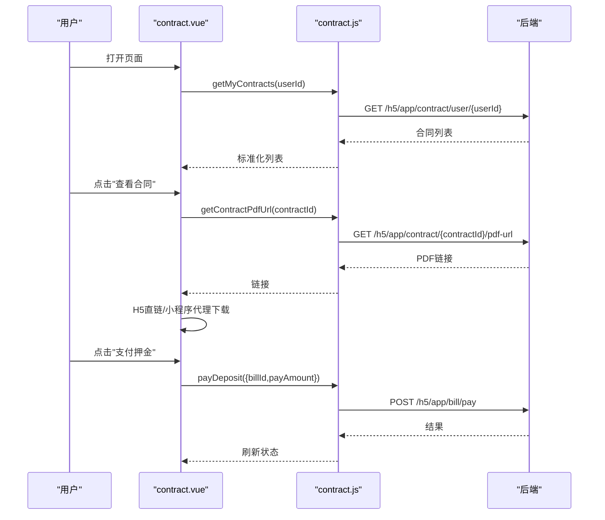

图表来源
- [subpkg/affairs/contract.vue:388-419](file://uniapp-h5/subpkg/affairs/contract.vue#L388-L419)
- [subpkg/affairs/contract.vue:273-334](file://uniapp-h5/subpkg/affairs/contract.vue#L273-L334)
- [api/contract.js:11-13](file://uniapp-h5/api/contract.js#L11-L13)
- [api/contract.js:56-58](file://uniapp-h5/api/contract.js#L56-L58)

章节来源
- [subpkg/affairs/contract.vue:1-1042](file://uniapp-h5/subpkg/affairs/contract.vue#L1-L1042)
- [api/contract.js:1-86](file://uniapp-h5/api/contract.js#L1-L86)

### 开票服务
- 业务流程
  - 发票列表按日期分组、状态显示（开票中/已开票）、发票详情、申请开票入口。
- 数据交互
  - 列表：getMyInvoiceList
  - 详情：getInvoiceDetail
  - 申请：submitInvoiceApply
  - 入住信息：getCheckinInfo
  - 可开票账单：getAvailableBills

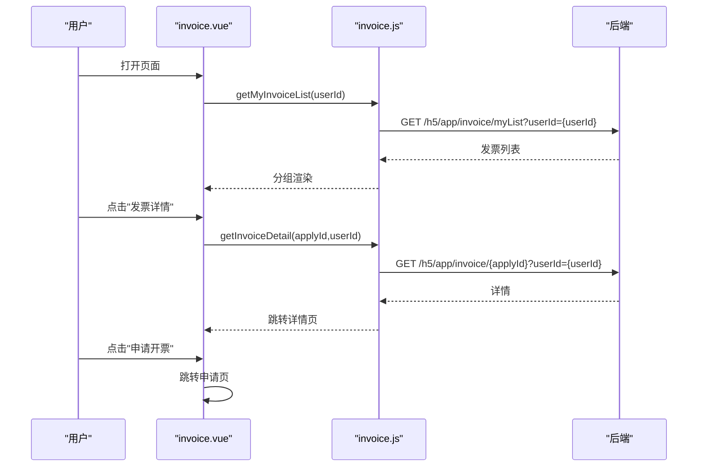

图表来源
- [subpkg/affairs/invoice.vue:118-155](file://uniapp-h5/subpkg/affairs/invoice.vue#L118-L155)
- [api/invoice.js:11-13](file://uniapp-h5/api/invoice.js#L11-L13)
- [api/invoice.js:60-62](file://uniapp-h5/api/invoice.js#L60-L62)

章节来源
- [subpkg/affairs/invoice.vue:1-325](file://uniapp-h5/subpkg/affairs/invoice.vue#L1-L325)
- [api/invoice.js:1-63](file://uniapp-h5/api/invoice.js#L1-L63)

### 我的预约
- 业务流程
  - 预约列表：待看房/已看房/已过期/已取消。
  - 支持取消预约、确认看房。
- 数据交互
  - 列表：getMyAppointments
  - 详情：getAppointmentDetail
  - 操作：cancelAppointment/confirmViewing

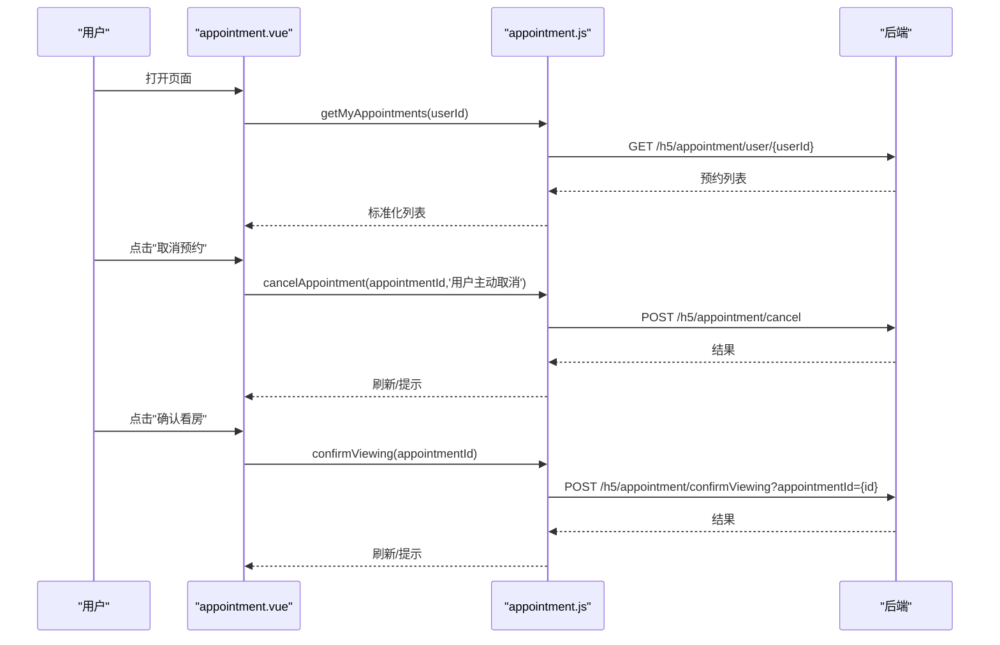

图表来源
- [subpkg/affairs/appointment.vue:92-130](file://uniapp-h5/subpkg/affairs/appointment.vue#L92-L130)
- [api/appointment.js:10-12](file://uniapp-h5/api/appointment.js#L10-L12)
- [api/appointment.js:43-48](file://uniapp-h5/api/appointment.js#L43-L48)

章节来源
- [subpkg/affairs/appointment.vue:1-437](file://uniapp-h5/subpkg/affairs/appointment.vue#L1-L437)
- [api/appointment.js:1-49](file://uniapp-h5/api/appointment.js#L1-L49)

### 合租户申请
- 业务流程
  - 选择已确认合同（可添加合租人的房源）。
  - 填写合租人信息（姓名/身份证/电话/关系/入住日期）。
  - 提交申请并返回上一页。
- 数据交互
  - 列表：getConfirmedContractList
  - 申请：submitCohabitant

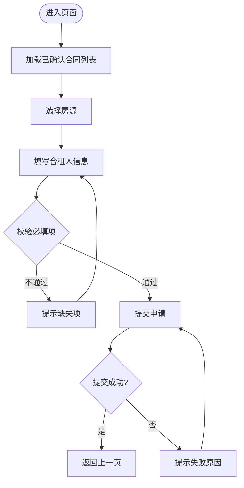

图表来源
- [subpkg/affairs/cohabitant.vue:195-220](file://uniapp-h5/subpkg/affairs/cohabitant.vue#L195-L220)
- [subpkg/affairs/cohabitant.vue:277-365](file://uniapp-h5/subpkg/affairs/cohabitant.vue#L277-L365)
- [api/cohabitant.js:26-28](file://uniapp-h5/api/cohabitant.js#L26-L28)
- [api/cohabitant.js:40-42](file://uniapp-h5/api/cohabitant.js#L40-L42)

章节来源
- [subpkg/affairs/cohabitant.vue:1-658](file://uniapp-h5/subpkg/affairs/cohabitant.vue#L1-L658)
- [api/cohabitant.js:1-50](file://uniapp-h5/api/cohabitant.js#L1-L50)

### 调换房申请
- 业务流程
  - 查看历史：原房源/目标房源/申请信息/审核意见。
  - 状态：待审核/已完成/已拒绝。
  - 申请入口：跳转到申请页。
- 数据交互
  - 列表：getExchangeList
  - 申请：submitExchange（由申请页调用）

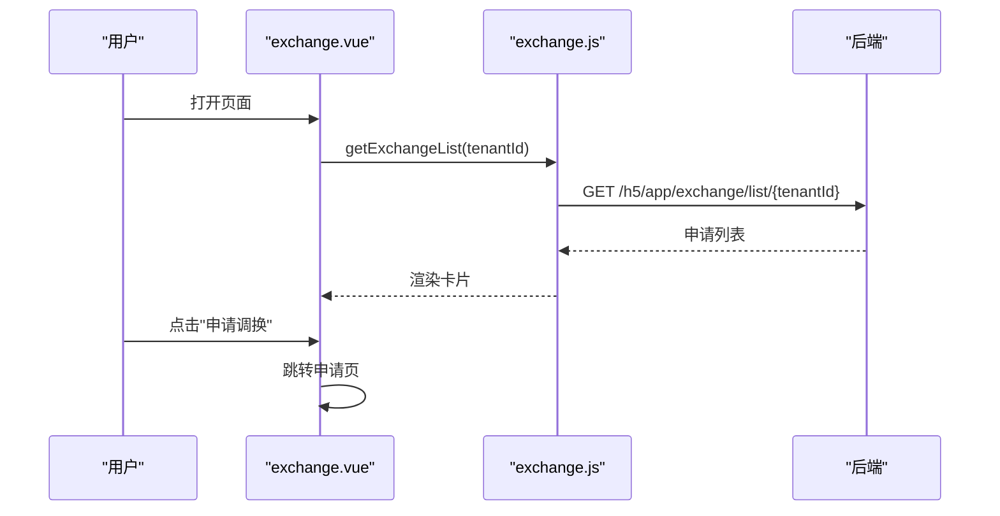

图表来源
- [subpkg/affairs/exchange.vue:120-151](file://uniapp-h5/subpkg/affairs/exchange.vue#L120-L151)
- [api/exchange.js:10-12](file://uniapp-h5/api/exchange.js#L10-L12)

章节来源
- [subpkg/affairs/exchange.vue:1-310](file://uniapp-h5/subpkg/affairs/exchange.vue#L1-L310)
- [api/exchange.js:1-47](file://uniapp-h5/api/exchange.js#L1-L47)

## 设施分类标准化更新

**更新** 根据最新的代码变更，H5移动端设施分类已进行标准化调整：

### 移动端确认页面设施分类默认值变更
- **变更内容**：移动端确认页面的设施分类默认值从'其他'调整为'墙地面类'
- **影响范围**：入住确认页面和退租确认页面
- **实现方式**：在按类别过滤设施时，默认使用'墙地面类'作为分类标识

### 后端设施数据标准化
- **后端实现**：在HzHouseAppController中，当查询旧版h5_house.facilities字段时，所有设施的facilityCategory统一设置为'墙地面类'
- **兼容性**：确保新旧数据格式的一致性，避免分类混乱

### 前端设施展示优化
- **确认页面**：入住确认和退租确认页面均采用统一的设施分类展示逻辑
- **分类过滤**：使用 `(item.facilityCategory || '墙地面类') === category` 进行设施分类过滤
- **用户体验**：确保用户在确认入住或退租时，设施分类显示更加准确和一致

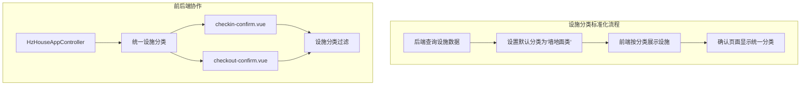

**图表来源**
- [ruoyi-admin/src/main/java/com/ruoyi/web/controller/h5/HzHouseAppController.java:585](file://ruoyi-admin/src/main/java/com/ruoyi/web/controller/h5/HzHouseAppController.java#L585)
- [subpkg/affairs/checkin-confirm.vue:182](file://uniapp-h5/subpkg/affairs/checkin-confirm.vue#L182)
- [subpkg/affairs/checkout-confirm.vue:249](file://uniapp-h5/subpkg/affairs/checkout-confirm.vue#L249)

**章节来源**
- [ruoyi-admin/src/main/java/com/ruoyi/web/controller/h5/HzHouseAppController.java:567-597](file://ruoyi-admin/src/main/java/com/ruoyi/web/controller/h5/HzHouseAppController.java#L567-L597)
- [subpkg/affairs/checkin-confirm.vue:180-185](file://uniapp-h5/subpkg/affairs/checkin-confirm.vue#L180-L185)
- [subpkg/affairs/checkout-confirm.vue:245-250](file://uniapp-h5/subpkg/affairs/checkout-confirm.vue#L245-L250)

## 依赖分析
- 页面与API的依赖关系
  - 入住/退租/账单/合同/发票/预约/合租户/调换房各自拥有独立的API封装文件，页面仅通过API文件暴露的方法进行调用。
- 登录态与权限
  - 页面普遍使用 mixin 进行登录检查，确保 userId 存在再发起请求。
- 数据一致性
  - 页面 onShow 中统一刷新列表，保证状态与后端一致。
- 错误处理
  - 统一使用 uni.showToast 展示错误信息，避免抛出异常导致崩溃。

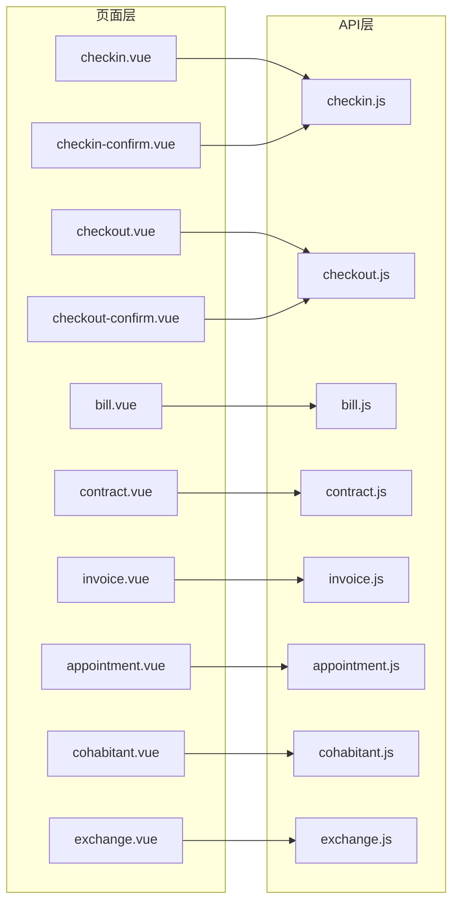

图表来源
- [subpkg/affairs/checkin.vue:108-147](file://uniapp-h5/subpkg/affairs/checkin.vue#L108-L147)
- [subpkg/affairs/checkout.vue:104-138](file://uniapp-h5/subpkg/affairs/checkout.vue#L104-L138)
- [subpkg/affairs/bill.vue:142-208](file://uniapp-h5/subpkg/affairs/bill.vue#L142-L208)
- [subpkg/affairs/contract.vue:191-258](file://uniapp-h5/subpkg/affairs/contract.vue#L191-L258)
- [subpkg/affairs/invoice.vue:49-73](file://uniapp-h5/subpkg/affairs/invoice.vue#L49-L73)
- [subpkg/affairs/appointment.vue:63-90](file://uniapp-h5/subpkg/affairs/appointment.vue#L63-L90)
- [subpkg/affairs/cohabitant.vue:138-193](file://uniapp-h5/subpkg/affairs/cohabitant.vue#L138-L193)
- [subpkg/affairs/exchange.vue:83-112](file://uniapp-h5/subpkg/affairs/exchange.vue#L83-L112)
- [subpkg/affairs/checkin-confirm.vue:92](file://uniapp-h5/subpkg/affairs/checkin-confirm.vue#L92)
- [subpkg/affairs/checkout-confirm.vue:92](file://uniapp-h5/subpkg/affairs/checkout-confirm.vue#L92)

章节来源
- [pages/affairs/index.vue:70-200](file://uniapp-h5/pages/affairs/index.vue#L70-L200)

## 性能考虑
- 列表懒加载与并发请求
  - 账单页并发拉取账单与文档状态，减少等待时间。
- 轮询与节流
  - 支付完成后轮询同步最多5次，避免频繁请求。
- UI渲染优化
  - 列表卡片复用与条件渲染，避免不必要的DOM更新。
- 网络与缓存
  - 合同PDF链接实时刷新，避免403；小程序端通过代理下载规避域名限制。
- 设施分类优化
  - 统一的设施分类默认值减少了数据处理复杂度，提升了页面渲染性能。

## 故障排查指南
- 登录态问题
  - 若页面提示"请先登录"，检查本地存储的 userInfo 与 token 是否存在。
- 接口失败
  - 查看返回的 code 与 msg，结合页面 toast 提示定位问题。
- 支付异常
  - 微信JSAPI支付失败时，检查 openid 是否存在；若取消支付，页面会提示"已取消支付"。
- 状态不同步
  - 页面 onShow 会自动刷新；若仍不同步，检查后端状态变更是否及时。
- 权限与业务规则
  - 入住/退租/合同等页面均有前置条件校验，若按钮不可用，根据提示完成相应操作（如缴押金、上传资料）。
- 设施分类问题
  - 若设施分类显示异常，检查后端HzHouseAppController的设施分类设置逻辑，确保默认值正确。

章节来源
- [subpkg/affairs/bill.vue:408-428](file://uniapp-h5/subpkg/affairs/bill.vue#L408-L428)
- [subpkg/affairs/checkin.vue:337-361](file://uniapp-h5/subpkg/affairs/checkin.vue#L337-L361)
- [ruoyi-admin/src/main/java/com/ruoyi/web/controller/h5/HzHouseAppController.java:585](file://ruoyi-admin/src/main/java/com/ruoyi/web/controller/h5/HzHouseAppController.java#L585)

## 结论
办事模块围绕8个核心子功能构建，采用页面-接口分层设计，配合统一的登录态校验与错误处理机制，实现了从流程引导到状态管理、从数据交互到用户体验的闭环。开发侧可通过标准化API封装快速扩展新功能，运维侧可通过页面自动刷新与轮询机制保障状态一致性。

**更新** 本次设施分类标准化更新进一步提升了移动端用户体验，确保设施分类的准确性和一致性。通过后端统一设置默认分类和前端优化展示逻辑，有效解决了设施分类不一致的问题。建议持续完善业务规则校验与提示文案，提升用户操作体验与成功率。