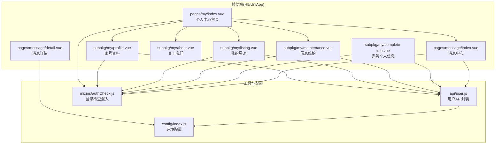
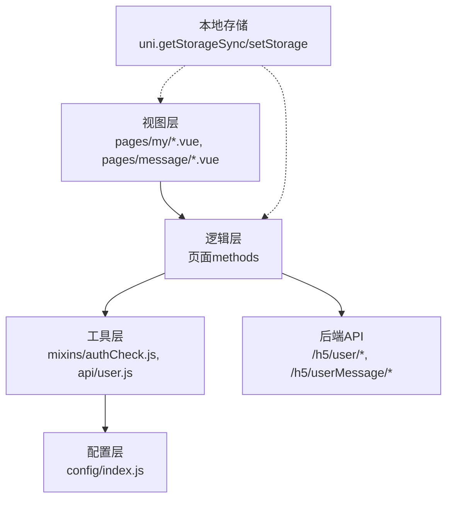
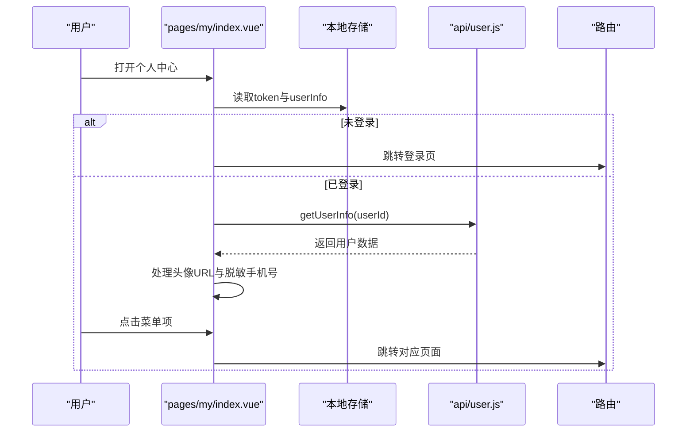
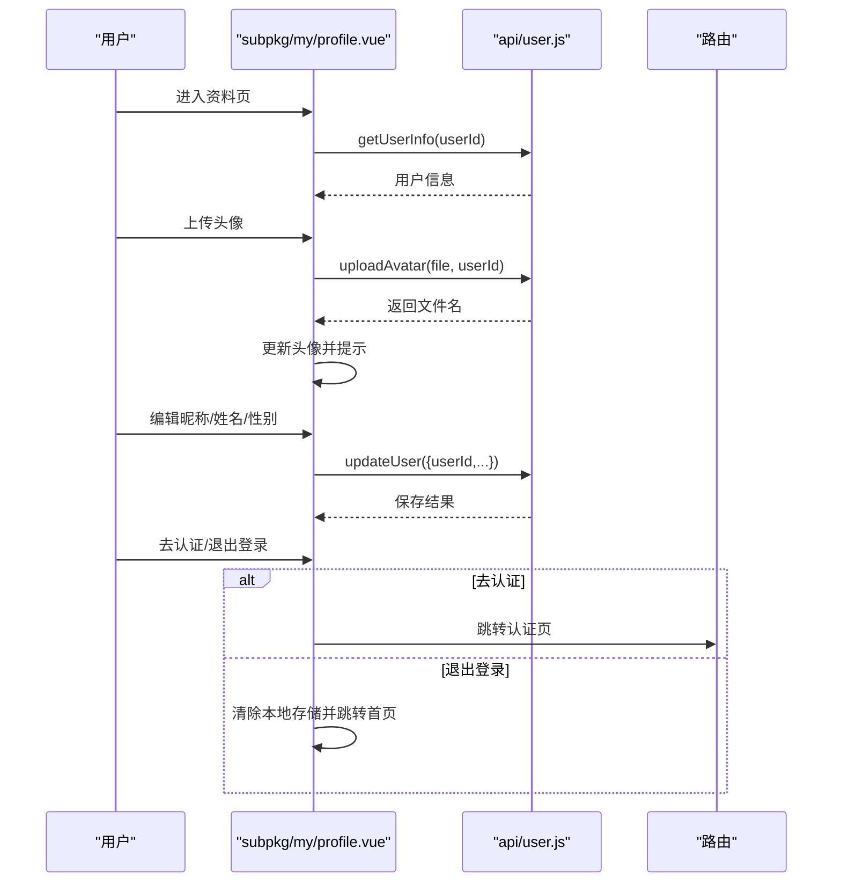
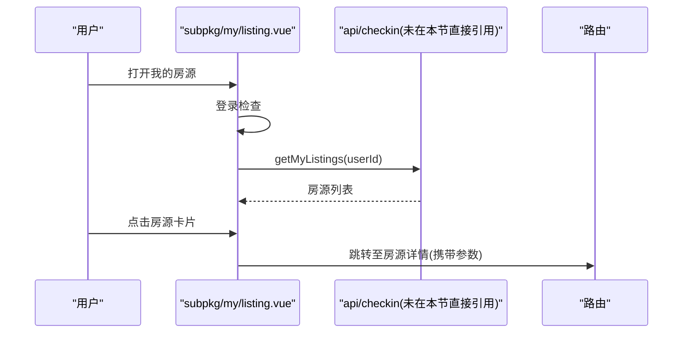
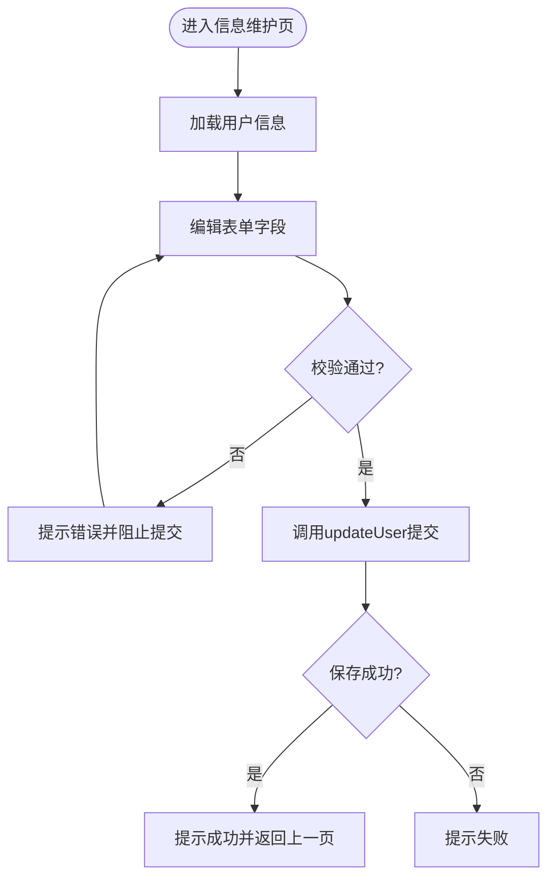
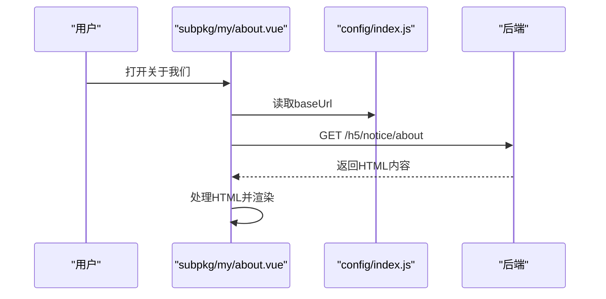
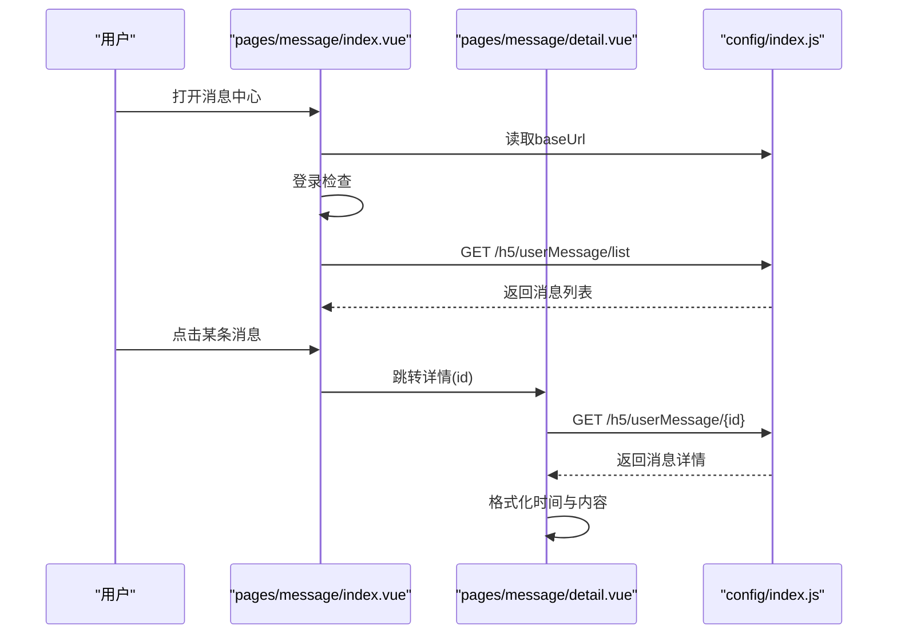
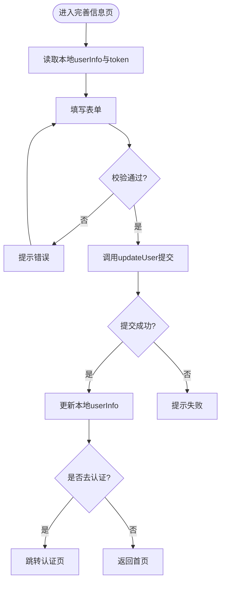
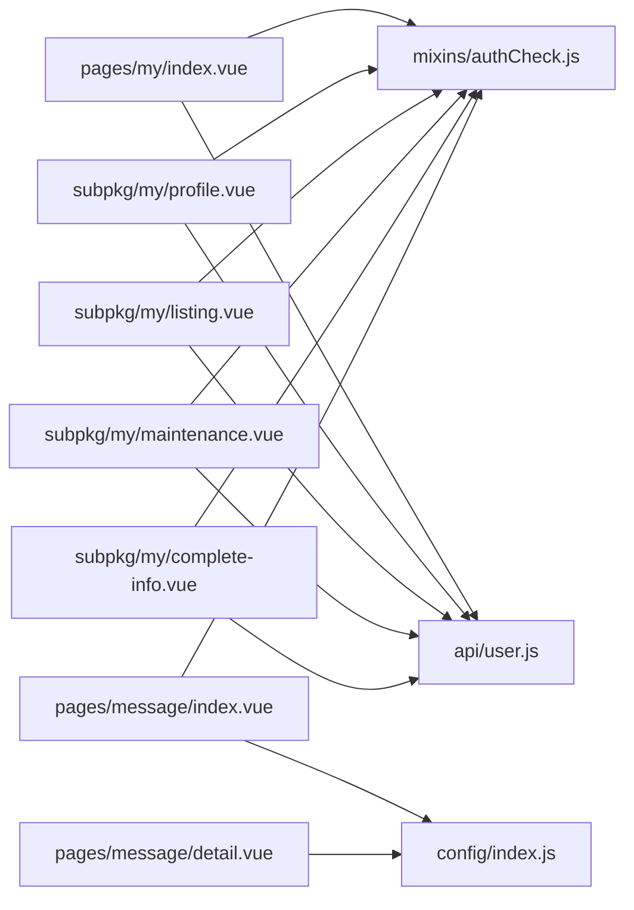

# 我的模块

<cite>
**本文引用的文件**
- [uniapp-h5/pages/my/index.vue](file://uniapp-h5/pages/my/index.vue)
- [uniapp-h5/subpkg/my/profile.vue](file://uniapp-h5/subpkg/my/profile.vue)
- [uniapp-h5/subpkg/my/listing.vue](file://uniapp-h5/subpkg/my/listing.vue)
- [uniapp-h5/subpkg/my/maintenance.vue](file://uniapp-h5/subpkg/my/maintenance.vue)
- [uniapp-h5/subpkg/my/about.vue](file://uniapp-h5/subpkg/my/about.vue)
- [uniapp-h5/subpkg/my/complete-info.vue](file://uniapp-h5/subpkg/my/complete-info.vue)
- [uniapp-h5/pages/message/index.vue](file://uniapp-h5/pages/message/index.vue)
- [uniapp-h5/pages/message/detail.vue](file://uniapp-h5/pages/message/detail.vue)
- [uniapp-h5/api/user.js](file://uniapp-h5/api/user.js)
- [uniapp-h5/mixins/authCheck.js](file://uniapp-h5/mixins/authCheck.js)
- [uniapp-h5/config/index.js](file://uniapp-h5/config/index.js)
</cite>

## 目录
1. [简介](#简介)
2. [项目结构](#项目结构)
3. [核心组件](#核心组件)
4. [架构总览](#架构总览)
5. [详细组件分析](#详细组件分析)
6. [依赖关系分析](#依赖关系分析)
7. [性能考虑](#性能考虑)
8. [故障排查指南](#故障排查指南)
9. [结论](#结论)
10. [附录](#附录)

## 简介
“我的模块”是港好住信息系统移动端的个人中心入口，围绕用户身份与业务数据提供六大核心能力：
- 账号资料：查看与编辑基础资料、头像上传、实名认证入口
- 我的房源：展示用户持有的房源状态与快速跳转详情
- 信息维护：完善个人信息（含单位性质、联系人等），提交后可一键跳转认证
- 关于我们：展示系统介绍与公告内容
- 完善个人信息：新用户首次完善资料流程
- 消息中心：查看系统消息列表与详情

该模块通过统一的登录检查、API封装与配置管理，实现用户信息管理、房源持有查询、资料修改、系统设置等功能，并提供权限控制、数据同步与缓存策略建议。

## 项目结构
“我的模块”主要由以下文件构成：
- 个人中心首页：展示用户信息与功能菜单
- 个人资料页：查看与编辑资料、头像上传、实名认证
- 我的房源页：展示房源卡片与状态
- 信息维护页：完善个人信息并提交
- 关于我们页：展示系统介绍内容
- 消息中心页：消息列表与详情
- API与工具：用户相关接口、登录检查混入、全局配置

**图表来源**
- [uniapp-h5/pages/my/index.vue:1-340](file://uniapp-h5/pages/my/index.vue#L1-L340)
- [uniapp-h5/subpkg/my/profile.vue:1-421](file://uniapp-h5/subpkg/my/profile.vue#L1-L421)
- [uniapp-h5/subpkg/my/listing.vue:1-292](file://uniapp-h5/subpkg/my/listing.vue#L1-L292)
- [uniapp-h5/subpkg/my/maintenance.vue:1-391](file://uniapp-h5/subpkg/my/maintenance.vue#L1-L391)
- [uniapp-h5/subpkg/my/about.vue:1-115](file://uniapp-h5/subpkg/my/about.vue#L1-L115)
- [uniapp-h5/subpkg/my/complete-info.vue:1-343](file://uniapp-h5/subpkg/my/complete-info.vue#L1-L343)
- [uniapp-h5/pages/message/index.vue:1-257](file://uniapp-h5/pages/message/index.vue#L1-L257)
- [uniapp-h5/pages/message/detail.vue:1-176](file://uniapp-h5/pages/message/detail.vue#L1-L176)
- [uniapp-h5/api/user.js:1-209](file://uniapp-h5/api/user.js#L1-L209)
- [uniapp-h5/mixins/authCheck.js:1-49](file://uniapp-h5/mixins/authCheck.js#L1-L49)
- [uniapp-h5/config/index.js:1-64](file://uniapp-h5/config/index.js#L1-L64)

**章节来源**
- [uniapp-h5/pages/my/index.vue:1-340](file://uniapp-h5/pages/my/index.vue#L1-L340)
- [uniapp-h5/subpkg/my/profile.vue:1-421](file://uniapp-h5/subpkg/my/profile.vue#L1-L421)
- [uniapp-h5/subpkg/my/listing.vue:1-292](file://uniapp-h5/subpkg/my/listing.vue#L1-L292)
- [uniapp-h5/subpkg/my/maintenance.vue:1-391](file://uniapp-h5/subpkg/my/maintenance.vue#L1-L391)
- [uniapp-h5/subpkg/my/about.vue:1-115](file://uniapp-h5/subpkg/my/about.vue#L1-L115)
- [uniapp-h5/subpkg/my/complete-info.vue:1-343](file://uniapp-h5/subpkg/my/complete-info.vue#L1-L343)
- [uniapp-h5/pages/message/index.vue:1-257](file://uniapp-h5/pages/message/index.vue#L1-L257)
- [uniapp-h5/pages/message/detail.vue:1-176](file://uniapp-h5/pages/message/detail.vue#L1-L176)
- [uniapp-h5/api/user.js:1-209](file://uniapp-h5/api/user.js#L1-L209)
- [uniapp-h5/mixins/authCheck.js:1-49](file://uniapp-h5/mixins/authCheck.js#L1-L49)
- [uniapp-h5/config/index.js:1-64](file://uniapp-h5/config/index.js#L1-L64)

## 核心组件
- 个人中心首页：顶部展示用户头像、昵称、手机号（脱敏）、实名状态；中部为功能菜单，包含消息中心、我的房源、我的合同、申诉记录、信息维护、优惠券、关于我们。
- 账号资料页：支持头像上传、昵称/姓名编辑、性别选择、实名认证入口；提供退出登录。
- 我的房源页：展示用户持有的房源卡片，包含标题、标签、详情与状态标识，点击跳转至房源详情。
- 信息维护页：完善个人信息（姓名、身份证号、联系方式、工作单位、单位电话、单位性质、学历、配偶），提交后可返回或继续认证。
- 关于我们页：从后端接口动态加载HTML内容并渲染。
- 消息中心页：展示消息列表，支持跳转详情；详情页格式化时间与特殊消息内容。
- 完善个人信息页：新用户首次完善资料流程，提交后更新本地缓存并引导认证。

**章节来源**
- [uniapp-h5/pages/my/index.vue:45-176](file://uniapp-h5/pages/my/index.vue#L45-L176)
- [uniapp-h5/subpkg/my/profile.vue:100-309](file://uniapp-h5/subpkg/my/profile.vue#L100-L309)
- [uniapp-h5/subpkg/my/listing.vue:40-115](file://uniapp-h5/subpkg/my/listing.vue#L40-L115)
- [uniapp-h5/subpkg/my/maintenance.vue:112-245](file://uniapp-h5/subpkg/my/maintenance.vue#L112-L245)
- [uniapp-h5/subpkg/my/about.vue:14-65](file://uniapp-h5/subpkg/my/about.vue#L14-L65)
- [uniapp-h5/pages/message/index.vue:35-113](file://uniapp-h5/pages/message/index.vue#L35-L113)
- [uniapp-h5/pages/message/detail.vue:23-101](file://uniapp-h5/pages/message/detail.vue#L23-L101)
- [uniapp-h5/subpkg/my/complete-info.vue:79-202](file://uniapp-h5/subpkg/my/complete-info.vue#L79-L202)

## 架构总览
“我的模块”的前端架构采用分层设计：
- 视图层：各页面负责UI渲染与交互
- 逻辑层：页面内methods处理业务流程（如头像上传、资料保存、消息加载）
- 工具层：统一登录检查混入、API封装、配置管理
- 数据层：通过HTTP请求与后端交互，使用本地缓存（storage）维持状态

**图表来源**
- [uniapp-h5/pages/my/index.vue:71-95](file://uniapp-h5/pages/my/index.vue#L71-L95)
- [uniapp-h5/subpkg/my/profile.vue:144-154](file://uniapp-h5/subpkg/my/profile.vue#L144-L154)
- [uniapp-h5/subpkg/my/listing.vue:61-66](file://uniapp-h5/subpkg/my/listing.vue#L61-L66)
- [uniapp-h5/subpkg/my/maintenance.vue:150-156](file://uniapp-h5/subpkg/my/maintenance.vue#L150-L156)
- [uniapp-h5/pages/message/index.vue:46-52](file://uniapp-h5/pages/message/index.vue#L46-L52)
- [uniapp-h5/api/user.js:1-209](file://uniapp-h5/api/user.js#L1-L209)
- [uniapp-h5/mixins/authCheck.js:10-48](file://uniapp-h5/mixins/authCheck.js#L10-L48)
- [uniapp-h5/config/index.js:53-63](file://uniapp-h5/config/index.js#L53-L63)

## 详细组件分析

### 个人中心首页（账号资料、菜单跳转）
- 功能要点
  - 登录态判断：从本地存储读取token与userInfo，若未登录则跳转登录页
  - 用户信息展示：头像、昵称、手机号（脱敏）、实名状态标签
  - 菜单项：消息中心、我的房源、我的合同、申诉记录、信息维护、优惠券、关于我们
  - 权限控制：除“关于我们”外，其余菜单需登录
- 数据流
  - 首次进入：onLoad加载用户信息
  - 返回前台：onShow刷新登录态与用户信息
  - 头像URL处理：兼容后端默认头像与静态资源
- 交互流程

**图表来源**
- [uniapp-h5/pages/my/index.vue:71-173](file://uniapp-h5/pages/my/index.vue#L71-L173)
- [uniapp-h5/api/user.js:11-13](file://uniapp-h5/api/user.js#L11-L13)
- [uniapp-h5/config/index.js:1-64](file://uniapp-h5/config/index.js#L1-L64)

**章节来源**
- [uniapp-h5/pages/my/index.vue:45-176](file://uniapp-h5/pages/my/index.vue#L45-L176)

### 账号资料页（资料查看与编辑、头像上传、实名认证、退出登录）
- 功能要点
  - 头像上传：相册/相机选择图片，调用上传接口，成功后更新本地头像
  - 基础资料编辑：昵称、姓名、性别（选择器）、学历、身份证号（脱敏）
  - 实名认证：跳转认证页或根据后端返回状态提示
  - 退出登录：清除本地token与用户信息，跳转首页
- 数据流
  - 登录检查：统一登录检查混入
  - 信息加载：getUserInfo
  - 保存更新：updateUser
  - 头像上传：uploadAvatar
- 交互流程

**图表来源**
- [uniapp-h5/subpkg/my/profile.vue:144-307](file://uniapp-h5/subpkg/my/profile.vue#L144-L307)
- [uniapp-h5/api/user.js:20-69](file://uniapp-h5/api/user.js#L20-L69)
- [uniapp-h5/api/user.js:127-134](file://uniapp-h5/api/user.js#L127-L134)

**章节来源**
- [uniapp-h5/subpkg/my/profile.vue:100-309](file://uniapp-h5/subpkg/my/profile.vue#L100-L309)
- [uniapp-h5/api/user.js:1-209](file://uniapp-h5/api/user.js#L1-L209)

### 我的房源页（房源持有查询与跳转）
- 功能要点
  - 展示用户持有的房源卡片，包含图片、标题、标签、详情与状态
  - 状态映射：在租中、已退租、待办理、待审核、待确认、已拒绝、未知
  - 图片URL处理：外部链接、静态资源、后端相对路径拼接
  - 跳转详情：携带houseId与projectId跳转至房源详情页
- 数据流
  - 登录检查：统一登录检查混入
  - 列表加载：getMyListings(userId)
- 交互流程

**图表来源**
- [uniapp-h5/subpkg/my/listing.vue:61-114](file://uniapp-h5/subpkg/my/listing.vue#L61-L114)

**章节来源**
- [uniapp-h5/subpkg/my/listing.vue:40-115](file://uniapp-h5/subpkg/my/listing.vue#L40-L115)

### 信息维护页（完善个人信息并提交）
- 功能要点
  - 表单字段：姓名、身份证号（脱敏）、联系方式、工作单位、单位电话、单位性质、学历、配偶
  - 校验规则：必填校验、单位电话与本人手机号不能一致
  - 提交保存：updateUser，成功后提示并返回上一页
- 数据流
  - 登录检查：统一登录检查混入
  - 信息加载：getUserInfo
  - 保存更新：updateUser
- 交互流程

**图表来源**
- [uniapp-h5/subpkg/my/maintenance.vue:150-244](file://uniapp-h5/subpkg/my/maintenance.vue#L150-L244)

**章节来源**
- [uniapp-h5/subpkg/my/maintenance.vue:112-245](file://uniapp-h5/subpkg/my/maintenance.vue#L112-L245)

### 关于我们页（系统介绍内容）
- 功能要点
  - 通过HTTP请求获取HTML内容，使用rich-text渲染
  - 降级方案：请求失败或内容为空时显示默认内容
- 数据流
  - GET /h5/notice/about
  - 处理HTML内容（字符串或Buffer）
- 交互流程

**图表来源**
- [uniapp-h5/subpkg/my/about.vue:23-63](file://uniapp-h5/subpkg/my/about.vue#L23-L63)
- [uniapp-h5/config/index.js:53-63](file://uniapp-h5/config/index.js#L53-L63)

**章节来源**
- [uniapp-h5/subpkg/my/about.vue:14-65](file://uniapp-h5/subpkg/my/about.vue#L14-L65)

### 消息中心页（消息列表与详情）
- 功能要点
  - 列表页：加载消息列表，展示标题、摘要、时间，支持跳转详情
  - 详情页：格式化时间与特殊消息内容（如登录欢迎语）
  - 登录检查：统一登录检查混入
- 数据流
  - GET /h5/userMessage/list（列表）
  - GET /h5/userMessage/{id}（详情）
- 交互流程

**图表来源**
- [uniapp-h5/pages/message/index.vue:46-112](file://uniapp-h5/pages/message/index.vue#L46-L112)
- [uniapp-h5/pages/message/detail.vue:37-100](file://uniapp-h5/pages/message/detail.vue#L37-L100)
- [uniapp-h5/config/index.js:53-63](file://uniapp-h5/config/index.js#L53-L63)

**章节来源**
- [uniapp-h5/pages/message/index.vue:35-113](file://uniapp-h5/pages/message/index.vue#L35-L113)
- [uniapp-h5/pages/message/detail.vue:23-101](file://uniapp-h5/pages/message/detail.vue#L23-L101)

### 完善个人信息页（新用户首次完善）
- 功能要点
  - 身份类型、真实姓名、身份证号、联系电话、工作单位、单位联系电话、配偶姓名
  - 校验规则：必填、身份证格式、单位电话与本人手机号不能一致
  - 提交后更新本地userInfo并引导认证或返回首页
- 数据流
  - 校验表单
  - PUT /h5/user/update（通过api封装）
  - 更新本地缓存并跳转
- 交互流程

**图表来源**
- [uniapp-h5/subpkg/my/complete-info.vue:102-201](file://uniapp-h5/subpkg/my/complete-info.vue#L102-L201)
- [uniapp-h5/api/user.js:127-134](file://uniapp-h5/api/user.js#L127-L134)

**章节来源**
- [uniapp-h5/subpkg/my/complete-info.vue:79-202](file://uniapp-h5/subpkg/my/complete-info.vue#L79-L202)

## 依赖关系分析
- 组件耦合
  - 页面间通过路由跳转解耦，仅依赖配置与API封装
  - 统一登录检查混入降低重复逻辑，提升复用性
- 外部依赖
  - 后端API：用户信息、头像上传、消息列表/详情、用户更新
  - 配置：baseUrl、uploadUrl、staticUrl
- 潜在风险
  - 头像URL处理需兼容多种来源（后端默认、静态资源、远程）
  - 消息中心列表降级方案依赖静态数据兜底

**图表来源**
- [uniapp-h5/pages/my/index.vue:46-48](file://uniapp-h5/pages/my/index.vue#L46-L48)
- [uniapp-h5/subpkg/my/profile.vue:103-104](file://uniapp-h5/subpkg/my/profile.vue#L103-L104)
- [uniapp-h5/subpkg/my/listing.vue:41-42](file://uniapp-h5/subpkg/my/listing.vue#L41-L42)
- [uniapp-h5/subpkg/my/maintenance.vue:113-114](file://uniapp-h5/subpkg/my/maintenance.vue#L113-L114)
- [uniapp-h5/subpkg/my/complete-info.vue](file://uniapp-h5/subpkg/my/complete-info.vue#L80)
- [uniapp-h5/pages/message/index.vue:36-37](file://uniapp-h5/pages/message/index.vue#L36-L37)
- [uniapp-h5/pages/message/detail.vue](file://uniapp-h5/pages/message/detail.vue#L24)
- [uniapp-h5/api/user.js:1-209](file://uniapp-h5/api/user.js#L1-L209)
- [uniapp-h5/mixins/authCheck.js:1-49](file://uniapp-h5/mixins/authCheck.js#L1-L49)
- [uniapp-h5/config/index.js:1-64](file://uniapp-h5/config/index.js#L1-L64)

**章节来源**
- [uniapp-h5/mixins/authCheck.js:10-48](file://uniapp-h5/mixins/authCheck.js#L10-L48)
- [uniapp-h5/api/user.js:1-209](file://uniapp-h5/api/user.js#L1-L209)
- [uniapp-h5/config/index.js:53-63](file://uniapp-h5/config/index.js#L53-L63)

## 性能考虑
- 网络请求优化
  - 合理设置请求超时（配置中timeout），避免长时间阻塞
  - 对头像上传使用压缩参数，减少带宽占用
- UI渲染优化
  - 列表页使用虚拟滚动或分页（当前为简单列表，后续可扩展）
  - 图片懒加载与尺寸适配，避免大图阻塞
- 缓存策略建议
  - 用户信息与头像URL可在本地短期缓存，结合onShow刷新逻辑避免重复请求
  - 消息列表可做本地缓存，结合下拉刷新与时间戳控制更新频率
- 错误与降级
  - 消息中心列表失败时清空列表并提示，避免空白渲染
  - HTML内容加载失败时使用默认内容兜底

[本节为通用建议，不直接分析具体文件]

## 故障排查指南
- 登录态异常
  - 现象：进入页面提示请先登录并跳转登录页
  - 排查：确认本地存储token与userInfo是否存在且有效
  - 参考
    - [uniapp-h5/mixins/authCheck.js:16-34](file://uniapp-h5/mixins/authCheck.js#L16-L34)
- 头像上传失败
  - 现象：上传后无反馈或报错
  - 排查：检查uploadUrl配置、Authorization头、后端返回码
  - 参考
    - [uniapp-h5/api/user.js:20-69](file://uniapp-h5/api/user.js#L20-L69)
    - [uniapp-h5/config/index.js:53-63](file://uniapp-h5/config/index.js#L53-L63)
- 消息列表为空或加载失败
  - 现象：消息中心显示暂无消息或加载失败
  - 排查：确认userId、后端接口可用性、网络请求状态码
  - 参考
    - [uniapp-h5/pages/message/index.vue:55-91](file://uniapp-h5/pages/message/index.vue#L55-L91)
- 关于我们内容为空
  - 现象：页面显示默认内容
  - 排查：确认后端接口返回字段与HTML内容
  - 参考
    - [uniapp-h5/subpkg/my/about.vue:27-63](file://uniapp-h5/subpkg/my/about.vue#L27-L63)

**章节来源**
- [uniapp-h5/mixins/authCheck.js:16-34](file://uniapp-h5/mixins/authCheck.js#L16-L34)
- [uniapp-h5/api/user.js:20-69](file://uniapp-h5/api/user.js#L20-L69)
- [uniapp-h5/config/index.js:53-63](file://uniapp-h5/config/index.js#L53-L63)
- [uniapp-h5/pages/message/index.vue:55-91](file://uniapp-h5/pages/message/index.vue#L55-L91)
- [uniapp-h5/subpkg/my/about.vue:27-63](file://uniapp-h5/subpkg/my/about.vue#L27-L63)

## 结论
“我的模块”通过清晰的页面职责划分与统一的工具层封装，实现了用户信息管理、房源持有查询、资料修改、系统设置与消息通知等核心功能。配合登录检查与配置管理，确保了权限控制与跨环境一致性。建议后续在消息中心引入分页与缓存策略，在房源列表增加筛选与排序能力，并持续完善错误降级与用户体验细节。

[本节为总结性内容，不直接分析具体文件]

## 附录
- 统一登录检查混入
  - 作用：在多个页面中统一处理登录态校验与跳转
  - 使用：在页面mixins中引入并在onLoad中调用
  - 参考
    - [uniapp-h5/mixins/authCheck.js:10-48](file://uniapp-h5/mixins/authCheck.js#L10-L48)
- API封装
  - 用户信息：getUserInfo、updateUser、uploadAvatar、getUserAuthStatus
  - 标签映射：getEducationLabel、getGenderLabel
  - 脱敏工具：maskPhone、maskIdCard
  - 参考
    - [uniapp-h5/api/user.js:11-209](file://uniapp-h5/api/user.js#L11-L209)
- 配置管理
  - 环境区分：development/test/production
  - 关键配置：baseUrl、uploadUrl、staticUrl、timeout
  - 参考
    - [uniapp-h5/config/index.js:53-63](file://uniapp-h5/config/index.js#L53-L63)

**章节来源**
- [uniapp-h5/mixins/authCheck.js:10-48](file://uniapp-h5/mixins/authCheck.js#L10-L48)
- [uniapp-h5/api/user.js:11-209](file://uniapp-h5/api/user.js#L11-L209)
- [uniapp-h5/config/index.js:53-63](file://uniapp-h5/config/index.js#L53-L63)