# 房源类型模块

<cite>
**本文档引用的文件**
- [pages/house/all.vue](file://uniapp-h5/pages/house/all.vue)
- [pages/talent/index.vue](file://uniapp-h5/pages/talent/index.vue)
- [pages/rental/index.vue](file://uniapp-h5/pages/rental/index.vue)
- [pages/market/index.vue](file://uniapp-h5/pages/market/index.vue)
- [pages/project/detail.vue](file://uniapp-h5/pages/project/detail.vue)
- [pages/room/select.vue](file://uniapp-h5/pages/room/select.vue)
- [pages/room/detail.vue](file://uniapp-h5/pages/room/detail.vue)
- [pages/room/vr.vue](file://uniapp-h5/pages/room/vr.vue)
- [pages/map/index.vue](file://uniapp-h5/pages/map/index.vue)
- [api/project.js](file://uniapp-h5/api/project.js)
- [api/house.js](file://uniapp-h5/api/house.js)
- [api/map.js](file://uniapp-h5/api/map.js)
- [api/contract.js](file://uniapp-h5/api/contract.js)
- [HzProjectController.java](file://ruoyi-admin/src/main/java/com/ruoyi/web/controller/h5/HzProjectController.java)
- [HzHouseAppController.java](file://ruoyi-admin/src/main/java/com/ruoyi/web/controller/h5/HzHouseAppController.java)
- [TalentApartmentRentCalculator.java](file://ruoyi-system/src/main/java/com/ruoyi/system/util/TalentApartmentRentCalculator.java)
- [HzHouseMapper.xml](file://ruoyi-system/src/main/resources/mapper/system/HzHouseMapper.xml)
- [HzHouseTypeMapper.xml](file://ruoyi-system/src/main/resources/mapper/system/HzHouseTypeMapper.xml)
</cite>

## 更新摘要
**所做更改**
- 新增批量分配状态验证章节，详细说明移动端房源详情页面的权限控制机制
- 更新房源选择流程，增加批量配租用户免校验的业务逻辑
- 补充资格校验流程的技术实现细节
- 增加批量分配用户身份识别的算法说明

## 目录
1. [引言](#引言)
2. [项目结构](#项目结构)
3. [核心组件](#核心组件)
4. [架构概览](#架构概览)
5. [详细组件分析](#详细组件分析)
6. [批量分配状态验证](#批量分配状态验证)
7. [依赖关系分析](#依赖关系分析)
8. [性能考虑](#性能考虑)
9. [故障排除指南](#故障排除指南)
10. [结论](#结论)

## 引言

港好住信息系统移动端房源类型模块是一个完整的房源管理解决方案，专注于为用户提供便捷的找房体验。该模块涵盖三种主要房源类型：人才公寓、保租房和市场租赁，每种类型都有专门的页面和功能特性。

本模块的核心目标是为用户提供直观的房源浏览、筛选和选择功能，同时为开发团队提供清晰的技术实现方案。系统采用前后端分离架构，前端使用UniApp框架构建移动端应用，后端基于Spring Boot提供RESTful API服务。

**更新** 新增批量分配状态验证功能，防止非分配用户选择房源，确保房源分配的合规性和安全性。

## 项目结构

### 前端架构

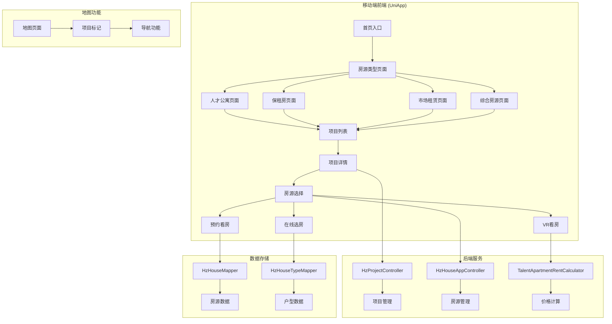

**图表来源**
- [pages/house/all.vue:1-498](file://uniapp-h5/pages/house/all.vue#L1-L498)
- [pages/talent/index.vue:1-502](file://uniapp-h5/pages/talent/index.vue#L1-L502)
- [pages/rental/index.vue:1-491](file://uniapp-h5/pages/rental/index.vue#L1-L491)
- [pages/market/index.vue:1-491](file://uniapp-h5/pages/market/index.vue#L1-L491)

### 后端架构

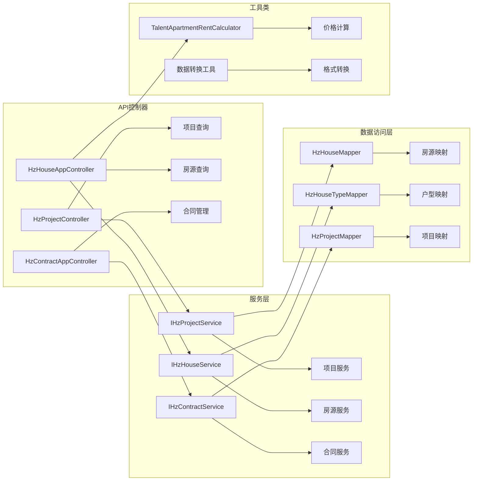

**图表来源**
- [HzProjectController.java:1-95](file://ruoyi-admin/src/main/java/com/ruoyi/web/controller/h5/HzProjectController.java#L1-L95)
- [HzHouseAppController.java:254-312](file://ruoyi-admin/src/main/java/com/ruoyi/web/controller/h5/HzHouseAppController.java#L254-L312)
- [TalentApartmentRentCalculator.java:1-97](file://ruoyi-system/src/main/java/com/ruoyi/system/util/TalentApartmentRentCalculator.java#L1-L97)

**章节来源**
- [pages/house/all.vue:1-498](file://uniapp-h5/pages/house/all.vue#L1-L498)
- [pages/talent/index.vue:1-502](file://uniapp-h5/pages/talent/index.vue#L1-L502)
- [pages/rental/index.vue:1-491](file://uniapp-h5/pages/rental/index.vue#L1-L491)
- [pages/market/index.vue:1-491](file://uniapp-h5/pages/market/index.vue#L1-L491)

## 核心组件

### 房源类型页面组件

系统提供了四种专门的房源类型页面，每种都针对特定的用户群体和需求：

#### 人才公寓页面
- **项目类型**: 1
- **目标用户**: 高学历人才
- **特色功能**: 人才公寓7折分档租金计算
- **页面路径**: `/pages/talent/index.vue`

#### 保租房页面  
- **项目类型**: 2
- **目标用户**: 符合保障条件的租户
- **特色功能**: 保障性住房政策支持
- **页面路径**: `/pages/rental/index.vue`

#### 市场租赁页面
- **项目类型**: 3
- **目标用户**: 一般市场租户
- **特色功能**: 完整的市场租赁流程
- **页面路径**: `/pages/market/index.vue`

#### 综合房源页面
- **项目类型**: null（不限制）
- **目标用户**: 所有用户
- **特色功能**: 展示所有类型的房源
- **页面路径**: `/pages/house/all.vue`

### 房源筛选组件

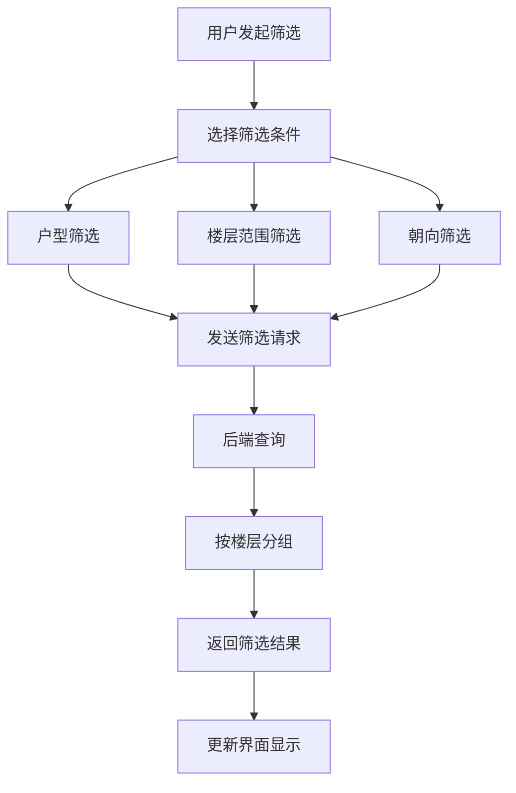

**图表来源**
- [pages/room/select.vue:265-313](file://uniapp-h5/pages/room/select.vue#L265-L313)
- [HzHouseAppController.java:266-286](file://ruoyi-admin/src/main/java/com/ruoyi/web/controller/h5/HzHouseAppController.java#L266-L286)

**章节来源**
- [pages/room/select.vue:1-800](file://uniapp-h5/pages/room/select.vue#L1-L800)
- [HzHouseAppController.java:254-312](file://ruoyi-admin/src/main/java/com/ruoyi/web/controller/h5/HzHouseAppController.java#L254-L312)

## 架构概览

### 数据流架构

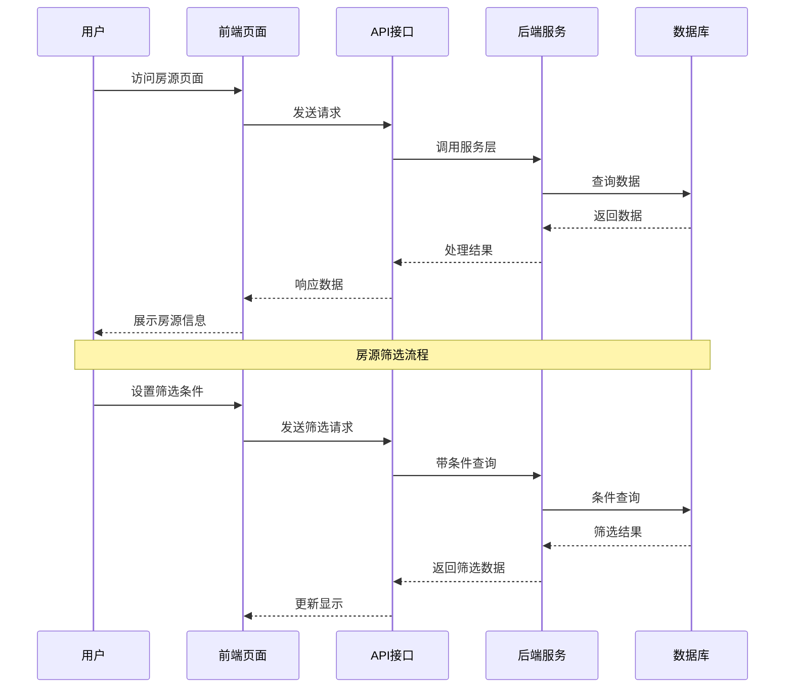

**图表来源**
- [api/project.js:13-15](file://uniapp-h5/api/project.js#L13-L15)
- [HzProjectController.java:73-94](file://ruoyi-admin/src/main/java/com/ruoyi/web/controller/h5/HzProjectController.java#L73-L94)

### 价格计算架构

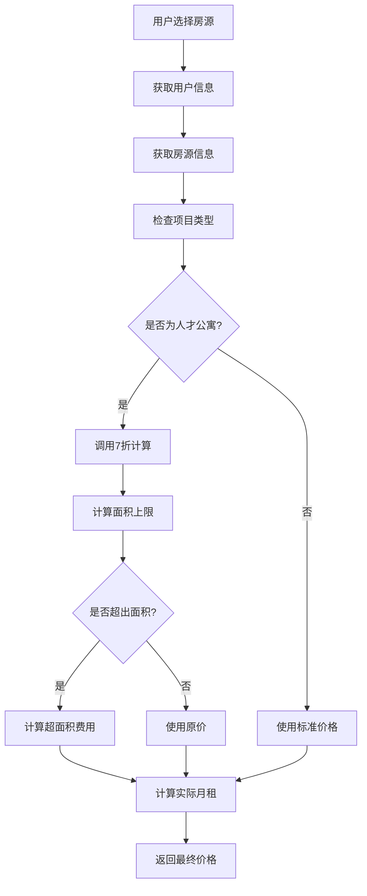

**图表来源**
- [TalentApartmentRentCalculator.java:58-97](file://ruoyi-system/src/main/java/com/ruoyi/system/util/TalentApartmentRentCalculator.java#L58-L97)
- [HzContractAppController.java:492-506](file://ruoyi-admin/src/main/java/com/ruoyi/web/controller/h5/HzContractAppController.java#L492-L506)

**章节来源**
- [api/project.js:1-37](file://uniapp-h5/api/project.js#L1-L37)
- [HzProjectController.java:1-95](file://ruoyi-admin/src/main/java/com/ruoyi/web/controller/h5/HzProjectController.java#L1-L95)

## 详细组件分析

### 房源列表组件

#### 人才公寓列表组件

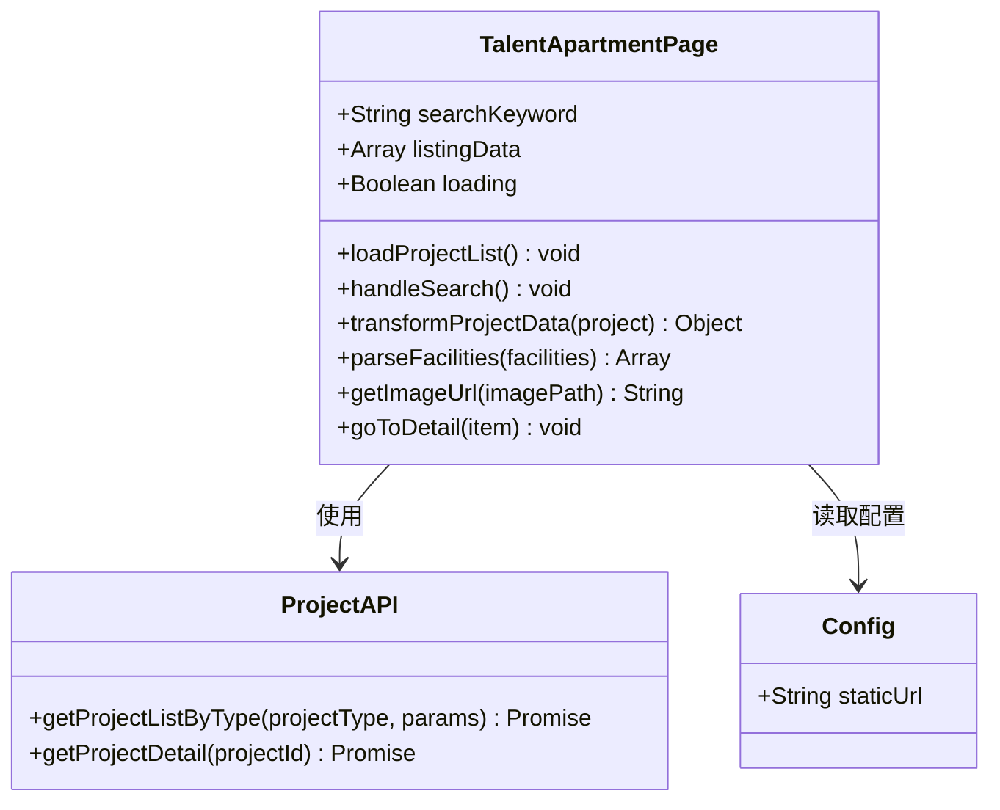

**图表来源**
- [pages/talent/index.vue:67-199](file://uniapp-h5/pages/talent/index.vue#L67-L199)
- [api/project.js:13-15](file://uniapp-h5/api/project.js#L13-L15)

#### 保租房列表组件

保租房页面与人才公寓页面结构相似，但使用不同的项目类型参数：

- **项目类型**: "2"（保租房）
- **数据源**: `/h5/project/listByType/2`
- **功能差异**: 主要面向保障性住房申请人群

#### 市场租赁列表组件

市场租赁页面提供最全面的房源展示：

- **项目类型**: "3"（市场租赁）
- **特点**: 完整的市场租赁流程支持
- **功能**: 价格透明、房源多样

**章节来源**
- [pages/talent/index.vue:89-129](file://uniapp-h5/pages/talent/index.vue#L89-L129)
- [pages/rental/index.vue:87-128](file://uniapp-h5/pages/rental/index.vue#L87-L128)
- [pages/market/index.vue:87-128](file://uniapp-h5/pages/market/index.vue#L87-L128)

### 项目详情组件

项目详情页面提供完整的房源信息展示：

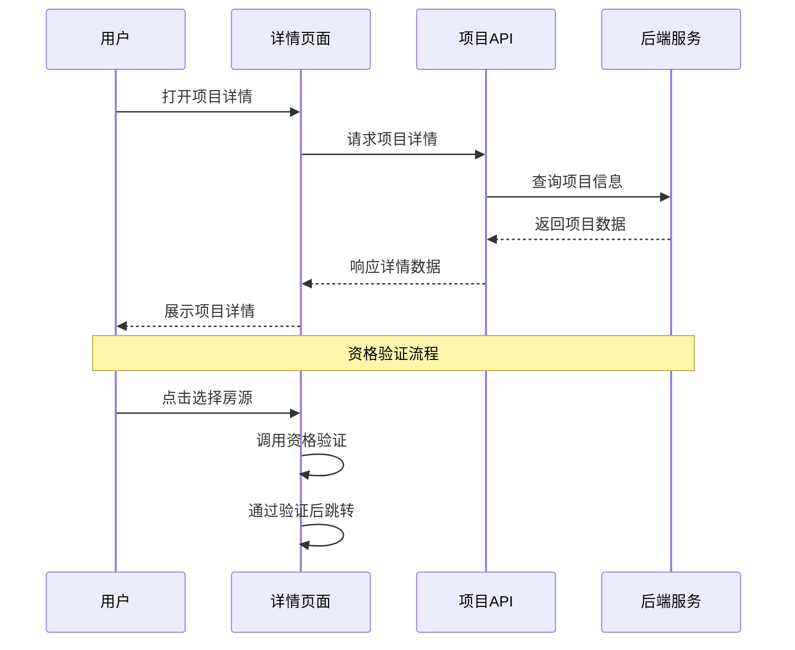

**图表来源**
- [pages/project/detail.vue:144-188](file://uniapp-h5/pages/project/detail.vue#L144-L188)
- [pages/project/detail.vue:235-248](file://uniapp-h5/pages/project/detail.vue#L235-L248)

#### 详情信息展示

项目详情页面包含以下关键信息：

- **基本信息**: 项目名称、地址、联系方式
- **房源信息**: 总房源数、分布情况、户型面积
- **价格信息**: 租金详情、物业费、水电燃气费用
- **服务信息**: 物业公司、服务电话、项目简介

**章节来源**
- [pages/project/detail.vue:1-522](file://uniapp-h5/pages/project/detail.vue#L1-L522)

### 房源选择组件

房源选择组件提供完整的房源筛选和选择功能：

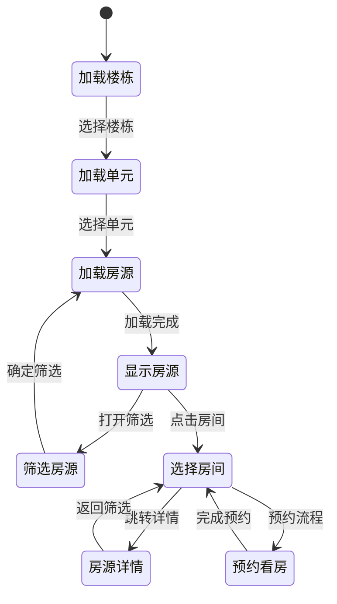

**图表来源**
- [pages/room/select.vue:206-374](file://uniapp-h5/pages/room/select.vue#L206-L374)

#### 筛选功能

房源筛选支持多种条件：

- **户型筛选**: 1-6室任意组合
- **楼层筛选**: 自定义楼层范围
- **朝向筛选**: 南、东、北、西及组合朝向
- **实时筛选**: 筛选条件变更时自动刷新数据

**章节来源**
- [pages/room/select.vue:81-146](file://uniapp-h5/pages/room/select.vue#L81-L146)
- [HzHouseAppController.java:266-286](file://ruoyi-admin/src/main/java/com/ruoyi/web/controller/h5/HzHouseAppController.java#L266-L286)

### VR看房组件

VR看房提供沉浸式的房源浏览体验：

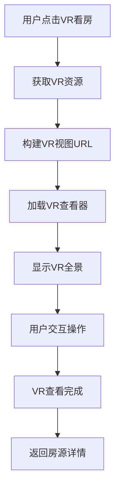

**图表来源**
- [pages/room/vr.vue:35-77](file://uniapp-h5/pages/room/vr.vue#L35-L77)

#### VR功能特性

- **全景展示**: 支持360度全景浏览
- **交互操作**: 支持缩放、旋转等操作
- **多平台支持**: H5、小程序、APP兼容
- **资源管理**: 支持外部VR资源链接

**章节来源**
- [pages/room/vr.vue:1-102](file://uniapp-h5/pages/room/vr.vue#L1-L102)

### 地图找房组件

地图找房提供基于地理位置的房源展示：

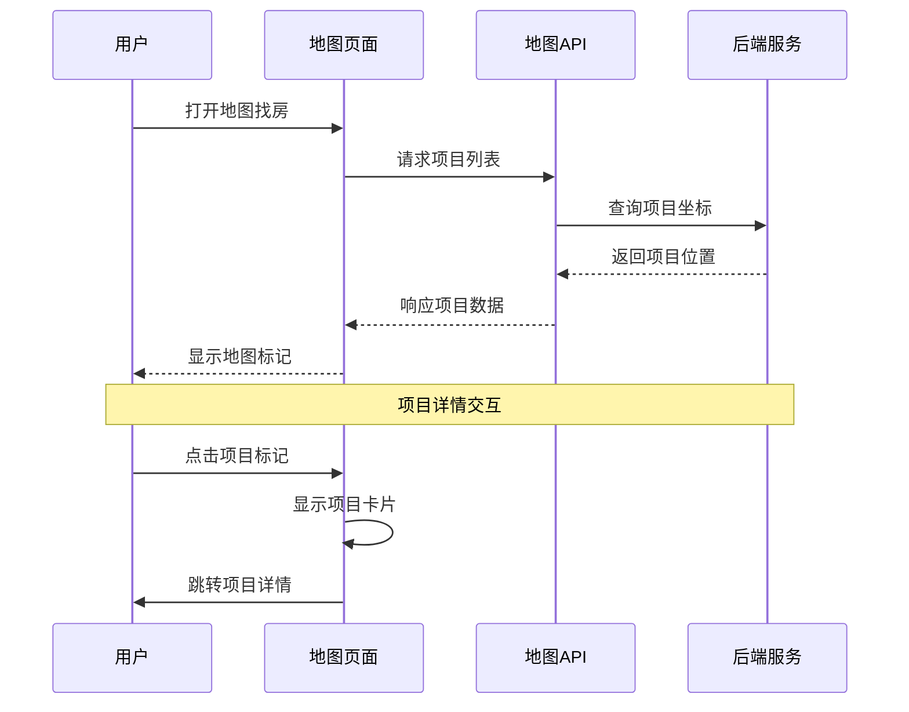

**图表来源**
- [pages/map/index.vue:33-78](file://uniapp-h5/pages/map/index.vue#L33-L78)
- [api/map.js:11-22](file://uniapp-h5/api/map.js#L11-L22)

**章节来源**
- [pages/map/index.vue:1-78](file://uniapp-h5/pages/map/index.vue#L1-L78)
- [api/map.js:1-22](file://uniapp-h5/api/map.js#L1-L22)

## 批量分配状态验证

### 批量配租用户识别机制

系统新增了批量分配状态验证功能，用于识别批量配租用户并提供免校验特权。该功能通过以下算法实现：

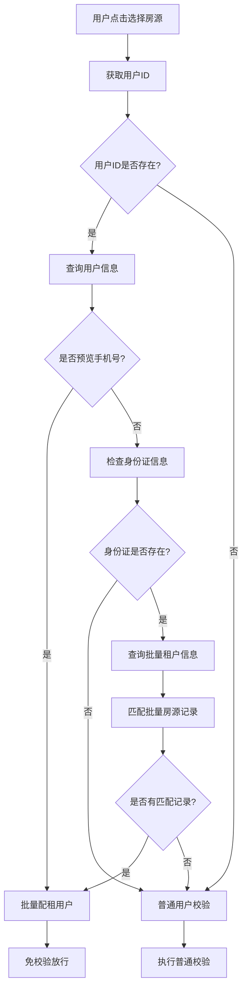

**图表来源**
- [HzHouseAppController.java:379-405](file://ruoyi-admin/src/main/java/com/ruoyi/web/controller/h5/HzHouseAppController.java#L379-L405)

### 批量分配用户判定逻辑

系统通过以下条件判断用户是否为批量配租用户：

1. **预览手机号用户**: 使用预览手机号的用户自动认定为批量配租用户
2. **身份证匹配用户**: 
   - 查询批量租户表中的身份证匹配记录
   - 在批量房源表中查找对应的房源分配记录
   - 存在匹配记录则认定为批量配租用户

### 资格校验流程

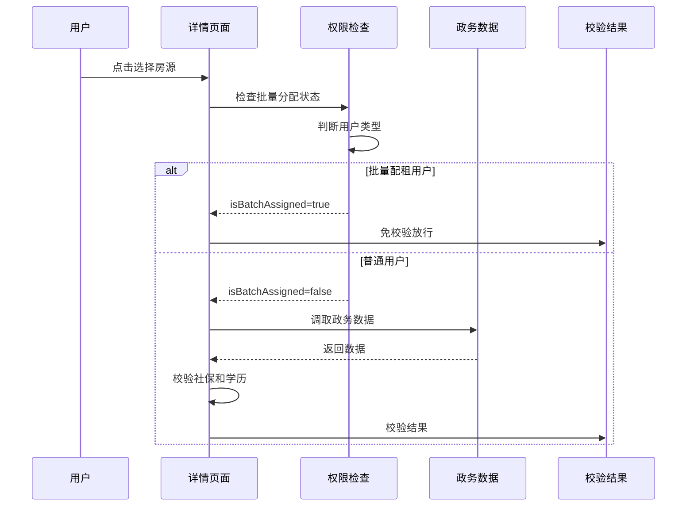

**图表来源**
- [HzHouseAppController.java:379-405](file://ruoyi-admin/src/main/java/com/ruoyi/web/controller/h5/HzHouseAppController.java#L379-L405)

### 技术实现细节

#### 后端实现

批量分配状态验证在`HzHouseAppController`中实现，主要逻辑包括：

- **用户身份识别**: 从JWT令牌中提取用户ID
- **批量租户查询**: 通过身份证信息查询批量租户表
- **房源匹配验证**: 检查批量房源分配记录
- **状态返回**: 返回`isBatchAssigned`布尔值给前端

#### 前端集成

前端在房源详情页面集成批量分配状态验证：

- **状态检查**: 页面加载时检查`isBatchAssigned`状态
- **权限控制**: 批量配租用户跳过资格校验流程
- **普通用户处理**: 按原有流程执行政务数据校验

**章节来源**
- [HzHouseAppController.java:379-405](file://ruoyi-admin/src/main/java/com/ruoyi/web/controller/h5/HzHouseAppController.java#L379-L405)

## 依赖关系分析

### 前端依赖关系

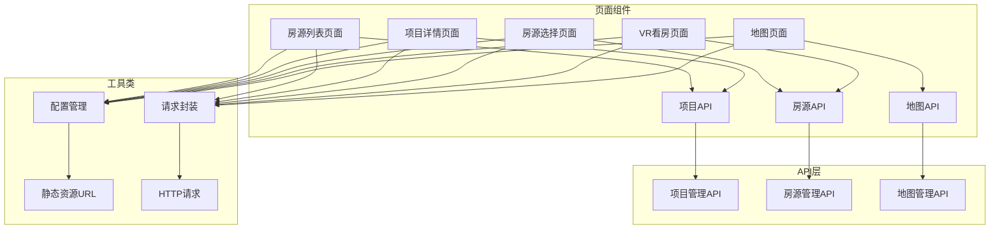

**图表来源**
- [api/project.js:1-37](file://uniapp-h5/api/project.js#L1-L37)
- [api/house.js:1-58](file://uniapp-h5/api/house.js#L1-L58)
- [api/map.js:1-22](file://uniapp-h5/api/map.js#L1-L22)

### 后端依赖关系

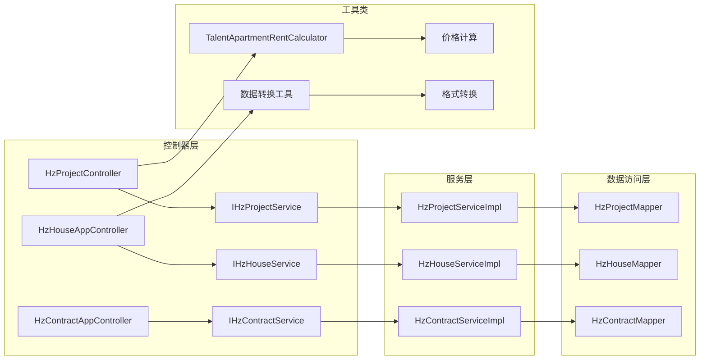

**图表来源**
- [HzProjectController.java:27-28](file://ruoyi-admin/src/main/java/com/ruoyi/web/controller/h5/HzProjectController.java#L27-L28)
- [HzHouseAppController.java:1-20](file://ruoyi-admin/src/main/java/com/ruoyi/web/controller/h5/HzHouseAppController.java#L1-L20)

**章节来源**
- [HzProjectController.java:1-95](file://ruoyi-admin/src/main/java/com/ruoyi/web/controller/h5/HzProjectController.java#L1-L95)
- [HzHouseAppController.java:254-312](file://ruoyi-admin/src/main/java/com/ruoyi/web/controller/h5/HzHouseAppController.java#L254-L312)

## 性能考虑

### 数据加载优化

1. **分页加载**: 后端支持分页查询，避免一次性加载大量数据
2. **缓存策略**: 前端对常用数据进行缓存，减少重复请求
3. **懒加载**: 图片和VR资源采用懒加载方式
4. **请求合并**: 对频繁的相似请求进行合并处理

### 筛选性能优化

1. **索引优化**: 数据库对常用查询字段建立索引
2. **查询优化**: 后端使用高效的SQL查询语句
3. **结果缓存**: 筛选结果进行短期缓存
4. **增量更新**: 支持局部数据更新而非全量刷新

### VR性能优化

1. **资源压缩**: VR资源进行压缩和优化
2. **CDN加速**: 使用CDN分发VR资源
3. **渐进式加载**: VR内容分阶段加载
4. **内存管理**: VR查看器的内存使用优化

### 批量分配验证性能

1. **状态缓存**: 批量分配状态在用户会话中缓存
2. **查询优化**: 批量租户和房源匹配查询使用索引
3. **异步处理**: 验证过程不影响页面渲染
4. **结果复用**: 验证结果在当前会话内复用

## 故障排除指南

### 常见问题及解决方案

#### 房源列表加载失败

**问题描述**: 房源列表无法加载或显示空白

**可能原因**:
1. 网络连接异常
2. API接口返回错误
3. 数据格式不正确

**解决步骤**:
1. 检查网络连接状态
2. 查看API响应状态码
3. 验证数据格式完整性
4. 清除应用缓存后重试

#### 房源筛选无效

**问题描述**: 筛选条件设置后无效果

**可能原因**:
1. 筛选参数传递错误
2. 后端查询条件不匹配
3. 数据库索引问题

**解决步骤**:
1. 检查筛选参数格式
2. 验证后端查询逻辑
3. 确认数据库索引状态
4. 重启应用后重试

#### VR看房加载失败

**问题描述**: VR看房页面无法显示或加载缓慢

**可能原因**:
1. VR资源链接失效
2. 网络环境不支持
3. 设备兼容性问题

**解决步骤**:
1. 检查VR资源URL有效性
2. 尝试切换网络环境
3. 更新应用版本
4. 检查设备兼容性

#### 批量分配验证失败

**问题描述**: 批量配租用户仍需进行资格校验

**可能原因**:
1. 用户身份识别错误
2. 批量租户数据缺失
3. 房源分配记录不匹配
4. 缓存状态过期

**解决步骤**:
1. 检查用户登录状态和身份信息
2. 验证批量租户表数据完整性
3. 确认批量房源分配记录存在
4. 清除缓存后重新登录
5. 联系管理员检查数据同步

**章节来源**
- [pages/room/select.vue:300-312](file://uniapp-h5/pages/room/select.vue#L300-L312)
- [pages/room/vr.vue:28-34](file://uniapp-h5/pages/room/vr.vue#L28-L34)
- [HzHouseAppController.java:379-405](file://ruoyi-admin/src/main/java/com/ruoyi/web/controller/h5/HzHouseAppController.java#L379-L405)

## 结论

港好住信息系统移动端房源类型模块是一个功能完整、架构清晰的房源管理解决方案。系统通过精心设计的用户界面和强大的后端服务，为用户提供了便捷的找房体验。

### 主要优势

1. **多类型支持**: 完整支持人才公寓、保租房、市场租赁三种房源类型
2. **智能筛选**: 提供灵活的房源筛选功能，满足不同用户需求
3. **沉浸式体验**: VR看房功能提供身临其境的房源浏览体验
4. **技术先进**: 采用现代化的前后端分离架构，具备良好的扩展性
5. **安全可靠**: 新增批量分配状态验证，确保房源分配的合规性

### 技术亮点

1. **价格计算**: 人才公寓7折分档租金计算，体现政策支持
2. **地图集成**: 地图找房功能，提升用户体验
3. **响应式设计**: 适配多种移动设备和屏幕尺寸
4. **性能优化**: 多层次的性能优化策略，确保流畅体验
5. **权限控制**: 批量分配状态验证，防止非分配用户选择房源

### 发展建议

1. **功能扩展**: 可考虑增加更多筛选维度和个性化推荐
2. **用户体验**: 进一步优化交互流程和视觉效果
3. **数据分析**: 增强数据分析功能，为运营决策提供支持
4. **技术升级**: 持续跟进新技术，保持系统先进性
5. **安全加固**: 持续完善权限控制和数据安全保障机制

该模块为港好住信息系统提供了坚实的房源管理基础，为用户和开发团队都带来了显著的价值。新增的批量分配状态验证功能进一步提升了系统的安全性和合规性，为房源分配管理提供了强有力的技术支撑。