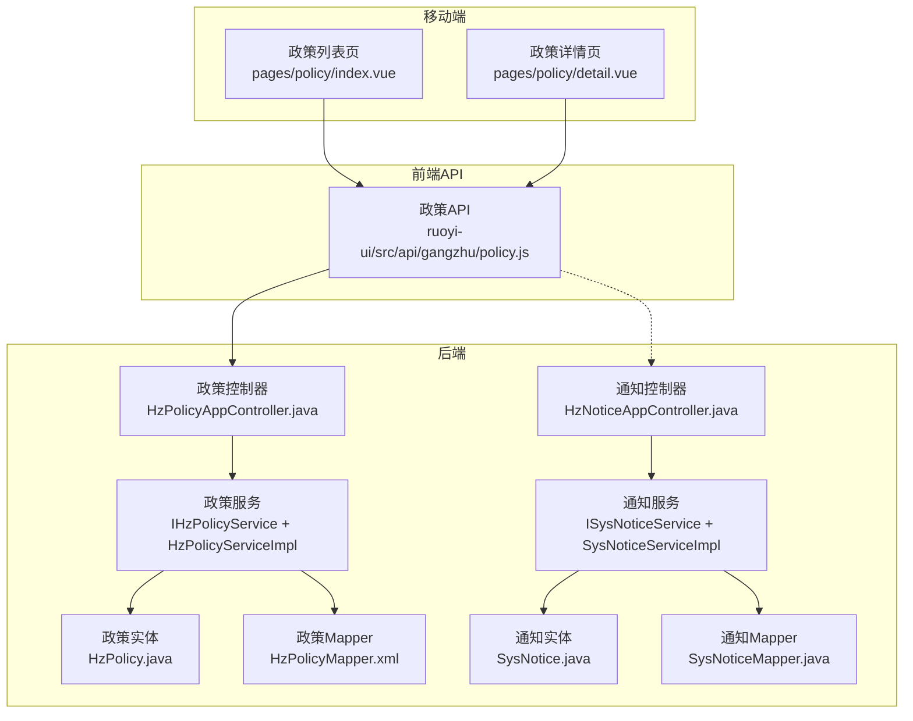
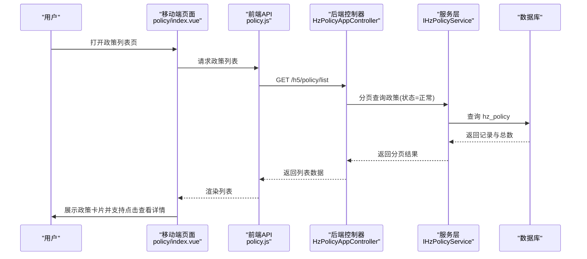
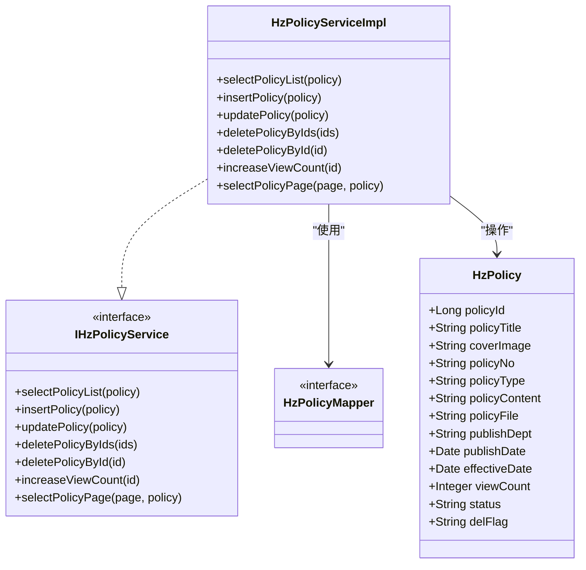
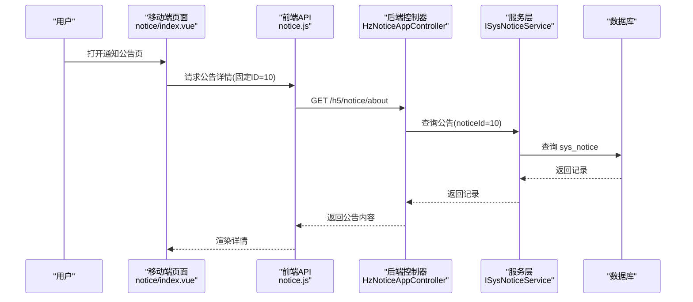
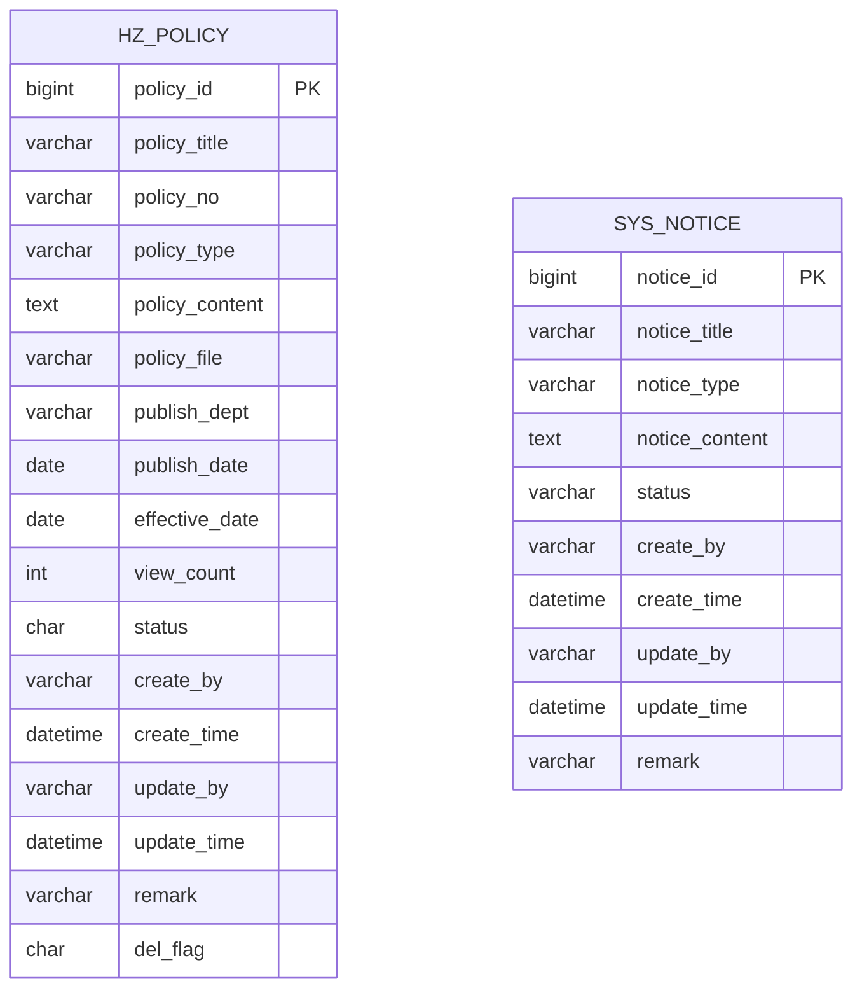
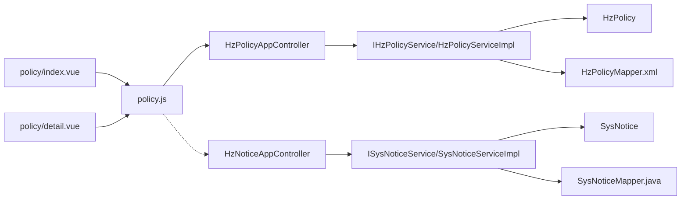

# 政策公告模块

<cite>
**本文引用的文件**
- [uniapp-h5/pages/policy/index.vue](file://uniapp-h5/pages/policy/index.vue)
- [uniapp-h5/pages/policy/detail.vue](file://uniapp-h5/pages/policy/detail.vue)
- [ruoyi-ui/src/api/gangzhu/policy.js](file://ruoyi-ui/src/api/gangzhu/policy.js)
- [ruoyi-admin/src/main/java/com/ruoyi/web/controller/h5/HzPolicyAppController.java](file://ruoyi-admin/src/main/java/com/ruoyi/web/controller/h5/HzPolicyAppController.java)
- [ruoyi-admin/src/main/java/com/ruoyi/gangzhu/policy/domain/HzPolicy.java](file://ruoyi-admin/src/main/java/com/ruoyi/gangzhu/policy/domain/HzPolicy.java)
- [ruoyi-admin/src/main/java/com/ruoyi/gangzhu/policy/service/IHzPolicyService.java](file://ruoyi-admin/src/main/java/com/ruoyi/gangzhu/policy/service/IHzPolicyService.java)
- [ruoyi-admin/src/main/java/com/ruoyi/gangzhu/policy/service/impl/HzPolicyServiceImpl.java](file://ruoyi-admin/src/main/java/com/ruoyi/gangzhu/policy/service/impl/HzPolicyServiceImpl.java)
- [ruoyi-admin/src/main/resources/mapper/gangzhu/HzPolicyMapper.xml](file://ruoyi-admin/src/main/resources/mapper/gangzhu/HzPolicyMapper.xml)
- [ruoyi-system/src/main/java/com/ruoyi/system/domain/SysNotice.java](file://ruoyi-system/src/main/java/com/ruoyi/system/domain/SysNotice.java)
- [ruoyi-system/src/main/java/com/ruoyi/system/service/ISysNoticeService.java](file://ruoyi-system/src/main/java/com/ruoyi/system/service/ISysNoticeService.java)
- [ruoyi-system/src/main/java/com/ruoyi/system/service/impl/SysNoticeServiceImpl.java](file://ruoyi-system/src/main/java/com/ruoyi/system/service/impl/SysNoticeServiceImpl.java)
- [ruoyi-system/src/main/java/com/ruoyi/system/mapper/SysNoticeMapper.java](file://ruoyi-system/src/main/java/com/ruoyi/system/mapper/SysNoticeMapper.java)
- [ruoyi-admin/src/main/java/com/ruoyi/web/controller/h5/HzNoticeAppController.java](file://ruoyi-admin/src/main/java/com/ruoyi/web/controller/h5/HzNoticeAppController.java)
- [docs/数据字典/09-消息通知.md](file://docs/数据字典/09-消息通知.md)
</cite>

## 目录
1. [简介](#简介)
2. [项目结构](#项目结构)
3. [核心组件](#核心组件)
4. [架构总览](#架构总览)
5. [详细组件分析](#详细组件分析)
6. [依赖关系分析](#依赖关系分析)
7. [性能考虑](#性能考虑)
8. [故障排查指南](#故障排查指南)
9. [结论](#结论)
10. [附录](#附录)

## 简介
本文件面向港好住信息系统移动端“政策公告”模块，围绕两大核心功能进行系统化说明：通知公告与政策文件。文档覆盖移动端页面的列表展示、详情阅读、分类筛选、内容管理、发布流程、推送机制、权限控制、版本管理、更新提醒、收藏与历史记录、搜索过滤等用户体验优化，并提供后端技术实现方案，帮助用户及时准确获取政策信息，同时为开发团队提供可落地的实现参考。

## 项目结构
政策公告模块在当前仓库中由三部分组成：
- 移动端 uni-app 页面：负责政策公告的列表与详情展示、图片与富文本渲染、基础交互。
- 前端 API 层：封装对后端接口的调用，统一参数与响应格式。
- 后端 Spring Boot 控制器与服务层：提供政策文件与通知公告的查询、分页、状态校验、浏览计数等能力。

图表来源
- [uniapp-h5/pages/policy/index.vue:1-242](file://uniapp-h5/pages/policy/index.vue#L1-L242)
- [uniapp-h5/pages/policy/detail.vue:1-235](file://uniapp-h5/pages/policy/detail.vue#L1-L235)
- [ruoyi-ui/src/api/gangzhu/policy.js:1-53](file://ruoyi-ui/src/api/gangzhu/policy.js#L1-L53)
- [ruoyi-admin/src/main/java/com/ruoyi/web/controller/h5/HzPolicyAppController.java:1-65](file://ruoyi-admin/src/main/java/com/ruoyi/web/controller/h5/HzPolicyAppController.java#L1-L65)
- [ruoyi-admin/src/main/java/com/ruoyi/gangzhu/policy/domain/HzPolicy.java:1-185](file://ruoyi-admin/src/main/java/com/ruoyi/gangzhu/policy/domain/HzPolicy.java#L1-L185)
- [ruoyi-admin/src/main/java/com/ruoyi/gangzhu/policy/service/IHzPolicyService.java:1-73](file://ruoyi-admin/src/main/java/com/ruoyi/gangzhu/policy/service/IHzPolicyService.java#L1-L73)
- [ruoyi-admin/src/main/java/com/ruoyi/gangzhu/policy/service/impl/HzPolicyServiceImpl.java:1-111](file://ruoyi-admin/src/main/java/com/ruoyi/gangzhu/policy/service/impl/HzPolicyServiceImpl.java#L1-L111)
- [ruoyi-admin/src/main/resources/mapper/gangzhu/HzPolicyMapper.xml:1-28](file://ruoyi-admin/src/main/resources/mapper/gangzhu/HzPolicyMapper.xml#L1-L28)
- [ruoyi-system/src/main/java/com/ruoyi/system/domain/SysNotice.java:1-103](file://ruoyi-system/src/main/java/com/ruoyi/system/domain/SysNotice.java#L1-L103)
- [ruoyi-system/src/main/java/com/ruoyi/system/service/ISysNoticeService.java:1-67](file://ruoyi-system/src/main/java/com/ruoyi/system/service/ISysNoticeService.java#L1-L67)
- [ruoyi-system/src/main/java/com/ruoyi/system/service/impl/SysNoticeServiceImpl.java:1-57](file://ruoyi-system/src/main/java/com/ruoyi/system/service/impl/SysNoticeServiceImpl.java#L1-L57)
- [ruoyi-system/src/main/java/com/ruoyi/system/mapper/SysNoticeMapper.java:1-70](file://ruoyi-system/src/main/java/com/ruoyi/system/mapper/SysNoticeMapper.java#L1-L70)
- [ruoyi-admin/src/main/java/com/ruoyi/web/controller/h5/HzNoticeAppController.java:1-62](file://ruoyi-admin/src/main/java/com/ruoyi/web/controller/h5/HzNoticeAppController.java#L1-L62)

章节来源
- [uniapp-h5/pages/policy/index.vue:1-242](file://uniapp-h5/pages/policy/index.vue#L1-L242)
- [uniapp-h5/pages/policy/detail.vue:1-235](file://uniapp-h5/pages/policy/detail.vue#L1-L235)
- [ruoyi-ui/src/api/gangzhu/policy.js:1-53](file://ruoyi-ui/src/api/gangzhu/policy.js#L1-L53)
- [ruoyi-admin/src/main/java/com/ruoyi/web/controller/h5/HzPolicyAppController.java:1-65](file://ruoyi-admin/src/main/java/com/ruoyi/web/controller/h5/HzPolicyAppController.java#L1-L65)
- [ruoyi-system/src/main/java/com/ruoyi/system/domain/SysNotice.java:1-103](file://ruoyi-system/src/main/java/com/ruoyi/system/domain/SysNotice.java#L1-L103)
- [ruoyi-admin/src/main/java/com/ruoyi/web/controller/h5/HzNoticeAppController.java:1-62](file://ruoyi-admin/src/main/java/com/ruoyi/web/controller/h5/HzNoticeAppController.java#L1-L62)

## 核心组件
- 移动端页面
  - 政策列表页：加载政策列表、格式化封面图与发布日期、跳转详情。
  - 政策详情页：加载详情、处理富文本图片路径、格式化日期。
- 前端 API
  - 提供政策文件列表、详情、新增、修改、删除、浏览计数等方法。
- 后端控制器
  - 政策文件：提供列表分页、详情查询、状态校验、浏览计数。
  - 通知公告：提供固定“关于我们”内容、按ID获取公告详情。
- 服务与数据层
  - 政策文件：查询、分页、新增、修改、删除、浏览计数。
  - 通知公告：查询、分页、新增、修改、删除。

章节来源
- [uniapp-h5/pages/policy/index.vue:33-121](file://uniapp-h5/pages/policy/index.vue#L33-L121)
- [uniapp-h5/pages/policy/detail.vue:29-130](file://uniapp-h5/pages/policy/detail.vue#L29-L130)
- [ruoyi-ui/src/api/gangzhu/policy.js:1-53](file://ruoyi-ui/src/api/gangzhu/policy.js#L1-L53)
- [ruoyi-admin/src/main/java/com/ruoyi/web/controller/h5/HzPolicyAppController.java:22-64](file://ruoyi-admin/src/main/java/com/ruoyi/web/controller/h5/HzPolicyAppController.java#L22-L64)
- [ruoyi-admin/src/main/java/com/ruoyi/gangzhu/policy/service/impl/HzPolicyServiceImpl.java:31-110](file://ruoyi-admin/src/main/java/com/ruoyi/gangzhu/policy/service/impl/HzPolicyServiceImpl.java#L31-L110)
- [ruoyi-system/src/main/java/com/ruoyi/system/domain/SysNotice.java:15-102](file://ruoyi-system/src/main/java/com/ruoyi/system/domain/SysNotice.java#L15-L102)

## 架构总览
移动端通过 uni.request 调用后端接口，后端控制器根据请求参数调用服务层，服务层通过 MyBatis 完成数据库操作。政策文件与通知公告分别对应独立的数据模型与控制器，但共享统一的分页与状态校验逻辑。

图表来源
- [uniapp-h5/pages/policy/index.vue:47-71](file://uniapp-h5/pages/policy/index.vue#L47-L71)
- [ruoyi-ui/src/api/gangzhu/policy.js:4-10](file://ruoyi-ui/src/api/gangzhu/policy.js#L4-L10)
- [ruoyi-admin/src/main/java/com/ruoyi/web/controller/h5/HzPolicyAppController.java:33-45](file://ruoyi-admin/src/main/java/com/ruoyi/web/controller/h5/HzPolicyAppController.java#L33-L45)
- [ruoyi-admin/src/main/java/com/ruoyi/gangzhu/policy/service/impl/HzPolicyServiceImpl.java:100-109](file://ruoyi-admin/src/main/java/com/ruoyi/gangzhu/policy/service/impl/HzPolicyServiceImpl.java#L100-L109)

## 详细组件分析

### 政策文件模块
- 列表展示
  - 前端通过 GET /h5/policy/list 获取分页数据，仅返回状态为“正常”的政策。
  - 列表项包含标题、发布部门、发布日期、封面图，支持点击进入详情。
- 详情阅读
  - 前端通过 GET /h5/policy/{id} 获取详情，自动增加浏览计数。
  - 富文本中的图片路径会替换为完整 URL，确保移动端正确显示。
- 分类筛选
  - 服务层支持按标题、类型、发布部门、状态进行条件查询与分页。
- 内容管理与发布流程
  - 后端提供政策文件的增删改查接口；前端提供浏览计数接口。
  - 发布流程建议：编辑 -> 设置状态为“正常” -> 对外可见。
- 权限控制
  - 管理端接口使用权限注解保护；用户端接口不涉及敏感权限。
- 版本管理与更新提醒
  - 建议通过“生效日期”字段与前端提示实现版本控制；后端可记录更新时间。
- 收藏与历史记录
  - 当前代码未实现收藏与历史记录功能，可在移动端本地存储或后端扩展用户行为表实现。
- 搜索过滤
  - 支持按标题模糊匹配、按类型/部门精确匹配、按状态过滤。

图表来源
- [ruoyi-admin/src/main/java/com/ruoyi/gangzhu/policy/domain/HzPolicy.java:14-184](file://ruoyi-admin/src/main/java/com/ruoyi/gangzhu/policy/domain/HzPolicy.java#L14-L184)
- [ruoyi-admin/src/main/java/com/ruoyi/gangzhu/policy/service/IHzPolicyService.java:15-73](file://ruoyi-admin/src/main/java/com/ruoyi/gangzhu/policy/service/IHzPolicyService.java#L15-L73)
- [ruoyi-admin/src/main/java/com/ruoyi/gangzhu/policy/service/impl/HzPolicyServiceImpl.java:23-110](file://ruoyi-admin/src/main/java/com/ruoyi/gangzhu/policy/service/impl/HzPolicyServiceImpl.java#L23-L110)
- [ruoyi-admin/src/main/resources/mapper/gangzhu/HzPolicyMapper.xml:7-25](file://ruoyi-admin/src/main/resources/mapper/gangzhu/HzPolicyMapper.xml#L7-L25)

章节来源
- [uniapp-h5/pages/policy/index.vue:47-121](file://uniapp-h5/pages/policy/index.vue#L47-L121)
- [uniapp-h5/pages/policy/detail.vue:54-130](file://uniapp-h5/pages/policy/detail.vue#L54-L130)
- [ruoyi-ui/src/api/gangzhu/policy.js:4-52](file://ruoyi-ui/src/api/gangzhu/policy.js#L4-L52)
- [ruoyi-admin/src/main/java/com/ruoyi/web/controller/h5/HzPolicyAppController.java:33-63](file://ruoyi-admin/src/main/java/com/ruoyi/web/controller/h5/HzPolicyAppController.java#L33-L63)
- [ruoyi-admin/src/main/java/com/ruoyi/gangzhu/policy/service/impl/HzPolicyServiceImpl.java:32-109](file://ruoyi-admin/src/main/java/com/ruoyi/gangzhu/policy/service/impl/HzPolicyServiceImpl.java#L32-L109)
- [docs/数据字典/09-消息通知.md:78-101](file://docs/数据字典/09-消息通知.md#L78-L101)

### 通知公告模块
- 列表与详情
  - 管理端提供通知公告的列表与详情接口；用户端可通过固定ID获取“关于我们”内容。
- 内容管理
  - 支持新增、修改、删除、分页查询；状态字段用于控制是否对外展示。
- 权限控制
  - 管理端接口使用权限注解保护；用户端接口不涉及敏感权限。

图表来源
- [ruoyi-admin/src/main/java/com/ruoyi/web/controller/h5/HzNoticeAppController.java:24-44](file://ruoyi-admin/src/main/java/com/ruoyi/web/controller/h5/HzNoticeAppController.java#L24-L44)
- [ruoyi-system/src/main/java/com/ruoyi/system/domain/SysNotice.java:15-102](file://ruoyi-system/src/main/java/com/ruoyi/system/domain/SysNotice.java#L15-L102)
- [ruoyi-system/src/main/java/com/ruoyi/system/service/impl/SysNoticeServiceImpl.java:30-33](file://ruoyi-system/src/main/java/com/ruoyi/system/service/impl/SysNoticeServiceImpl.java#L30-L33)

章节来源
- [ruoyi-admin/src/main/java/com/ruoyi/web/controller/h5/HzNoticeAppController.java:24-61](file://ruoyi-admin/src/main/java/com/ruoyi/web/controller/h5/HzNoticeAppController.java#L24-L61)
- [ruoyi-system/src/main/java/com/ruoyi/system/domain/SysNotice.java:15-102](file://ruoyi-system/src/main/java/com/ruoyi/system/domain/SysNotice.java#L15-L102)
- [ruoyi-system/src/main/java/com/ruoyi/system/service/ISysNoticeService.java:21-66](file://ruoyi-system/src/main/java/com/ruoyi/system/service/ISysNoticeService.java#L21-L66)
- [ruoyi-system/src/main/java/com/ruoyi/system/service/impl/SysNoticeServiceImpl.java:30-57](file://ruoyi-system/src/main/java/com/ruoyi/system/service/impl/SysNoticeServiceImpl.java#L30-L57)
- [ruoyi-system/src/main/java/com/ruoyi/system/mapper/SysNoticeMapper.java:24-70](file://ruoyi-system/src/main/java/com/ruoyi/system/mapper/SysNoticeMapper.java#L24-L70)

### 数据模型与表结构
- 政策文件表 hz_policy
  - 字段涵盖标题、文号、类型、内容、文件、发布部门、发布/生效日期、浏览计数、状态、创建/更新信息与删除标志。
- 通知公告表 sys_notice
  - 字段涵盖标题、类型、内容、状态与通用字段。

图表来源
- [docs/数据字典/09-消息通知.md:78-101](file://docs/数据字典/09-消息通知.md#L78-L101)
- [ruoyi-system/src/main/java/com/ruoyi/system/domain/SysNotice.java:19-85](file://ruoyi-system/src/main/java/com/ruoyi/system/domain/SysNotice.java#L19-L85)

章节来源
- [docs/数据字典/09-消息通知.md:78-101](file://docs/数据字典/09-消息通知.md#L78-L101)
- [ruoyi-system/src/main/java/com/ruoyi/system/domain/SysNotice.java:19-85](file://ruoyi-system/src/main/java/com/ruoyi/system/domain/SysNotice.java#L19-L85)

## 依赖关系分析
- 组件耦合
  - 移动端页面依赖前端 API；前端 API 依赖后端控制器；控制器依赖服务层；服务层依赖 Mapper 与实体。
- 关系图

图表来源
- [uniapp-h5/pages/policy/index.vue:47-71](file://uniapp-h5/pages/policy/index.vue#L47-L71)
- [uniapp-h5/pages/policy/detail.vue:54-90](file://uniapp-h5/pages/policy/detail.vue#L54-L90)
- [ruoyi-ui/src/api/gangzhu/policy.js:4-18](file://ruoyi-ui/src/api/gangzhu/policy.js#L4-L18)
- [ruoyi-admin/src/main/java/com/ruoyi/web/controller/h5/HzPolicyAppController.java:33-63](file://ruoyi-admin/src/main/java/com/ruoyi/web/controller/h5/HzPolicyAppController.java#L33-L63)
- [ruoyi-admin/src/main/java/com/ruoyi/gangzhu/policy/service/impl/HzPolicyServiceImpl.java:32-109](file://ruoyi-admin/src/main/java/com/ruoyi/gangzhu/policy/service/impl/HzPolicyServiceImpl.java#L32-L109)
- [ruoyi-system/src/main/java/com/ruoyi/system/service/impl/SysNoticeServiceImpl.java:30-33](file://ruoyi-system/src/main/java/com/ruoyi/system/service/impl/SysNoticeServiceImpl.java#L30-L33)

## 性能考虑
- 列表分页
  - 使用分页查询避免一次性加载大量数据，建议前端设置合理的每页大小与上拉加载策略。
- 图片资源
  - 列表与详情均对图片路径进行处理，建议后端提供静态资源域名统一管理，减少跨域与重定向。
- 浏览计数
  - 每次详情访问增加浏览计数，建议采用异步或去抖策略降低数据库压力。
- 富文本渲染
  - 对富文本图片路径进行替换，建议在后端存储时规范化路径，减少前端处理成本。

## 故障排查指南
- 列表为空或状态异常
  - 检查后端是否正确设置状态为“正常”，以及分页参数是否合理。
- 详情加载失败
  - 核对政策 ID 是否存在且状态为“正常”，确认富文本图片路径替换逻辑是否生效。
- 图片无法显示
  - 确认静态资源域名配置与路径拼接逻辑，检查外部链接与相对路径处理分支。
- 权限相关错误
  - 管理端接口需具备相应权限；用户端接口无需登录态，但需保证数据状态正确。

章节来源
- [ruoyi-admin/src/main/java/com/ruoyi/web/controller/h5/HzPolicyAppController.java:52-63](file://ruoyi-admin/src/main/java/com/ruoyi/web/controller/h5/HzPolicyAppController.java#L52-L63)
- [uniapp-h5/pages/policy/detail.vue:107-118](file://uniapp-h5/pages/policy/detail.vue#L107-L118)
- [uniapp-h5/pages/policy/index.vue:98-109](file://uniapp-h5/pages/policy/index.vue#L98-L109)

## 结论
政策公告模块在当前仓库中已实现移动端政策文件的列表与详情展示、富文本图片处理与浏览计数等关键能力；通知公告模块提供固定内容与按ID查询能力。后续可在移动端扩展收藏与历史记录、搜索过滤与版本提醒，在后端完善权限控制与推送机制，以进一步提升用户体验与运营效率。

## 附录
- 接口定义（移动端调用）
  - 政策列表：GET /h5/policy/list（分页参数 pageNum/pageSize）
  - 政策详情：GET /h5/policy/{id}
  - 通知公告详情（固定ID=10）：GET /h5/notice/about
- 前端 API 方法
  - listPolicy(query)、getPolicy(id)、addPolicy(data)、updatePolicy(data)、delPolicy(id)、increaseViewCount(id)
- 数据模型字段
  - 政策文件：标题、文号、类型、内容、文件、发布部门、发布/生效日期、浏览计数、状态、创建/更新信息与删除标志
  - 通知公告：标题、类型、内容、状态与通用字段