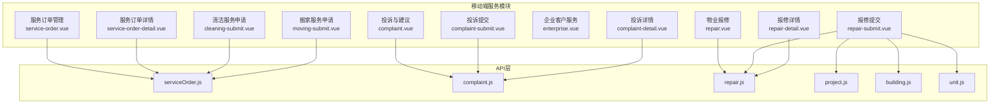
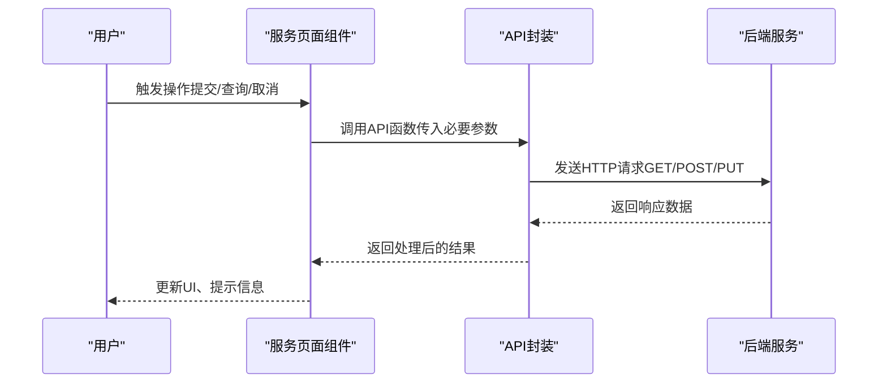
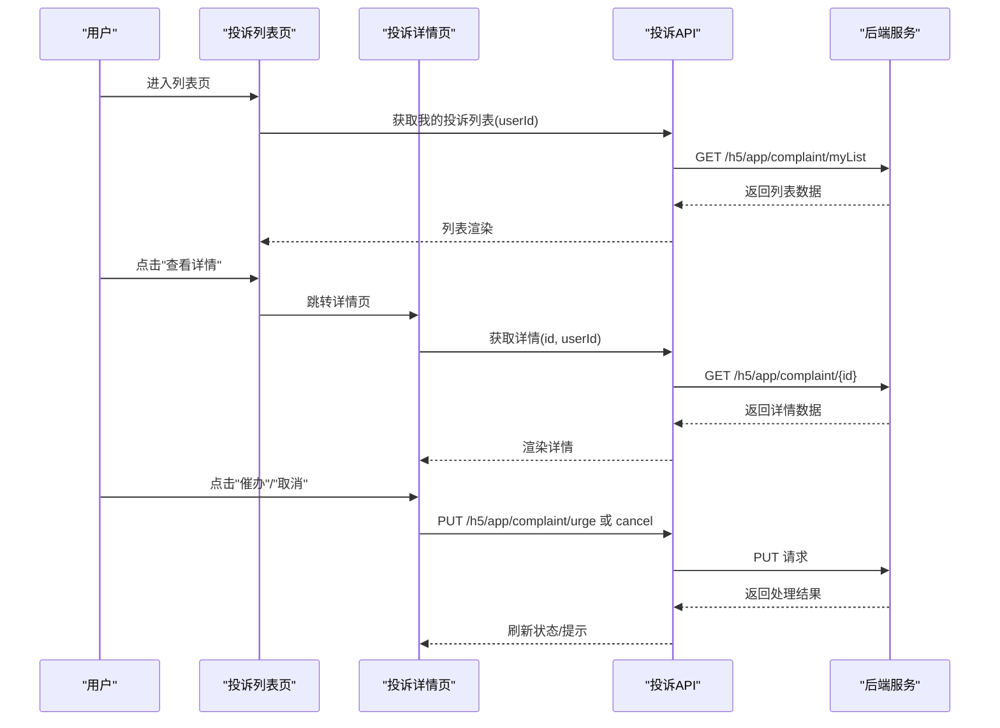
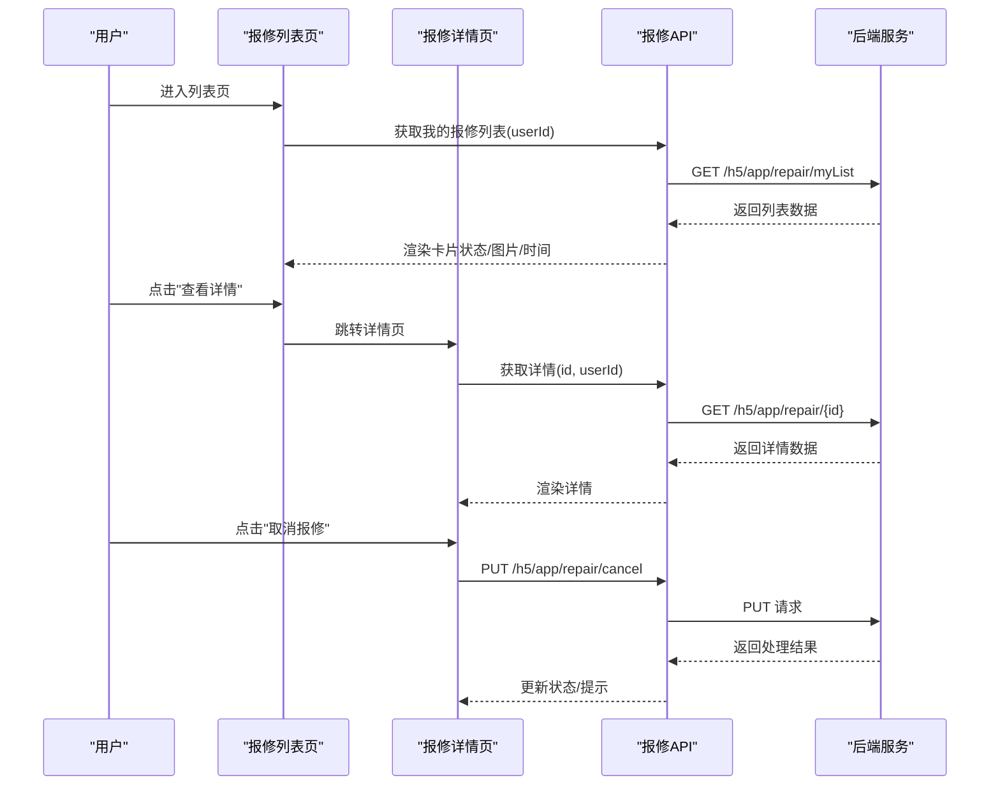
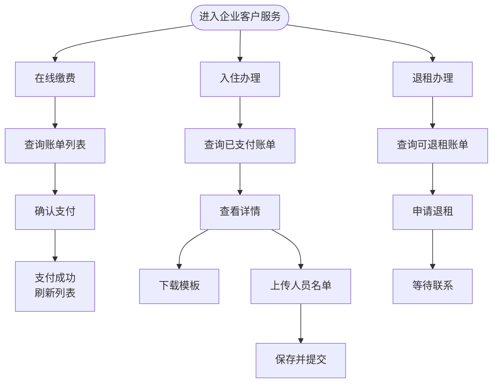
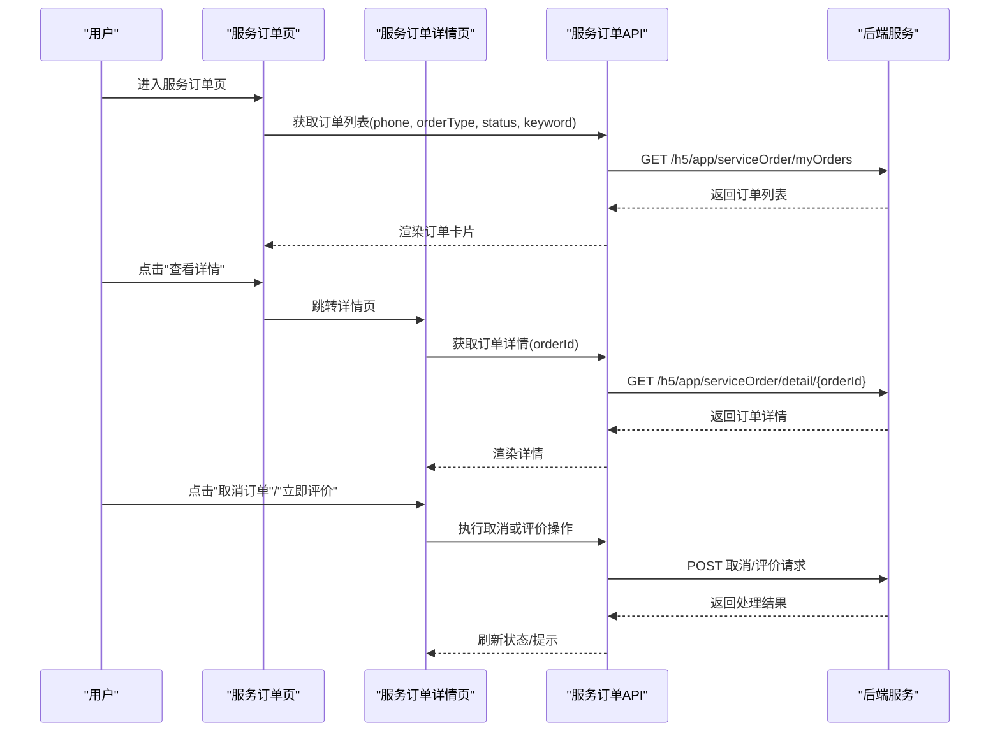
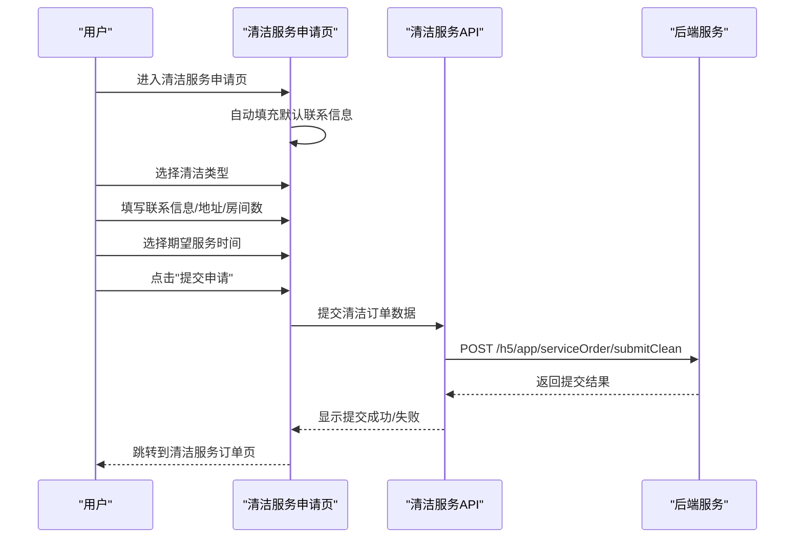
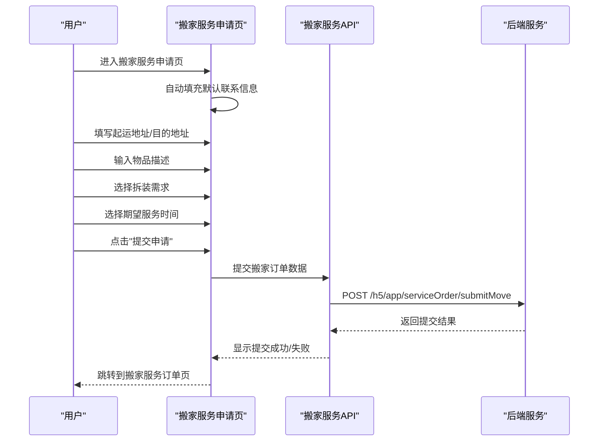
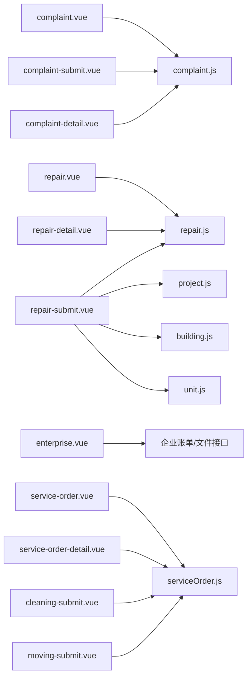

# 服务模块

<cite>
**本文档引用的文件**
- [complaint.vue](file://uniapp-h5/subpkg/service/complaint.vue)
- [complaint-submit.vue](file://uniapp-h5/subpkg/service/complaint-submit.vue)
- [complaint-detail.vue](file://uniapp-h5/subpkg/service/complaint-detail.vue)
- [repair.vue](file://uniapp-h5/subpkg/service/repair.vue)
- [repair-submit.vue](file://uniapp-h5/subpkg/service/repair-submit.vue)
- [repair-detail.vue](file://uniapp-h5/subpkg/service/repair-detail.vue)
- [enterprise.vue](file://uniapp-h5/subpkg/service/enterprise.vue)
- [service-order.vue](file://uniapp-h5/subpkg/service/service-order.vue)
- [service-order-detail.vue](file://uniapp-h5/subpkg/service/service-order-detail.vue)
- [cleaning-submit.vue](file://uniapp-h5/subpkg/service/cleaning-submit.vue)
- [moving-submit.vue](file://uniapp-h5/subpkg/service/moving-submit.vue)
- [serviceOrder.js](file://uniapp-h5/api/serviceOrder.js)
- [complaint.js](file://uniapp-h5/api/complaint.js)
- [repair.js](file://uniapp-h5/api/repair.js)
- [project.js](file://uniapp-h5/api/project.js)
- [building.js](file://uniapp-h5/api/building.js)
- [unit.js](file://uniapp-h5/api/unit.js)
- [index.vue](file://uniapp-h5/pages/service/index.vue)
</cite>

## 目录
1. [简介](#简介)
2. [项目结构](#项目结构)
3. [核心组件](#核心组件)
4. [架构总览](#架构总览)
5. [详细组件分析](#详细组件分析)
6. [新增功能详解](#新增功能详解)
7. [依赖关系分析](#依赖关系分析)
8. [性能考虑](#性能考虑)
9. [故障排查指南](#故障排查指南)
10. [结论](#结论)

## 简介
本文件面向港好住信息系统移动端服务模块，围绕四大核心功能进行深入说明：投诉与建议、物业报修、企业客户、清洁服务、搬家服务。文档详细阐述五类服务申请的流程设计、状态管理、进度跟踪与反馈机制，并覆盖数据展示、历史记录查询、满意度评价等能力。同时给出分类管理、优先级处理、工单流转等业务逻辑说明，旨在为终端用户提供便捷的服务申请体验，为开发团队提供清晰的技术实现指导。

## 项目结构
服务模块位于 uniapp-h5 的 subpkg/service 目录下，按功能划分为四个主要模块：
- 投诉与建议：complaint.vue、complaint-submit.vue、complaint-detail.vue
- 物业报修：repair.vue、repair-submit.vue、repair-detail.vue
- 企业客户：enterprise.vue（含在线缴费、入住办理、退租办理）
- 服务订单：service-order.vue、service-order-detail.vue（统一管理清洁和搬家服务）
- 清洁服务：cleaning-submit.vue（保洁服务申请）
- 搬家服务：moving-submit.vue（搬家服务申请）

前端通过 API 层调用后端接口，实现数据交互；各页面采用 Vue 单文件组件形式组织，配合样式与交互逻辑，形成完整的移动端服务能力。

**图表来源**
- [complaint.vue:1-377](file://uniapp-h5/subpkg/service/complaint.vue#L1-L377)
- [complaint-submit.vue:1-491](file://uniapp-h5/subpkg/service/complaint-submit.vue#L1-L491)
- [complaint-detail.vue:1-469](file://uniapp-h5/subpkg/service/complaint-detail.vue#L1-L469)
- [repair.vue:1-401](file://uniapp-h5/subpkg/service/repair.vue#L1-L401)
- [repair-submit.vue:1-849](file://uniapp-h5/subpkg/service/repair-submit.vue#L1-L849)
- [repair-detail.vue:1-475](file://uniapp-h5/subpkg/service/repair-detail.vue#L1-L475)
- [enterprise.vue:1-1323](file://uniapp-h5/subpkg/service/enterprise.vue#L1-L1323)
- [service-order.vue:1-274](file://uniapp-h5/subpkg/service/service-order.vue#L1-L274)
- [service-order-detail.vue:1-428](file://uniapp-h5/subpkg/service/service-order-detail.vue#L1-L428)
- [cleaning-submit.vue:1-365](file://uniapp-h5/subpkg/service/cleaning-submit.vue#L1-L365)
- [moving-submit.vue:1-329](file://uniapp-h5/subpkg/service/moving-submit.vue#L1-L329)
- [serviceOrder.js:1-73](file://uniapp-h5/api/serviceOrder.js#L1-L73)
- [complaint.js:1-53](file://uniapp-h5/api/complaint.js#L1-L53)
- [repair.js:1-49](file://uniapp-h5/api/repair.js#L1-L49)
- [project.js:1-37](file://uniapp-h5/api/project.js#L1-L37)
- [building.js:1-14](file://uniapp-h5/api/building.js#L1-L14)
- [unit.js:1-14](file://uniapp-h5/api/unit.js#L1-L14)

**章节来源**
- [complaint.vue:1-377](file://uniapp-h5/subpkg/service/complaint.vue#L1-L377)
- [repair.vue:1-401](file://uniapp-h5/subpkg/service/repair.vue#L1-L401)
- [enterprise.vue:1-1323](file://uniapp-h5/subpkg/service/enterprise.vue#L1-L1323)
- [service-order.vue:1-274](file://uniapp-h5/subpkg/service/service-order.vue#L1-L274)
- [cleaning-submit.vue:1-365](file://uniapp-h5/subpkg/service/cleaning-submit.vue#L1-L365)
- [moving-submit.vue:1-329](file://uniapp-h5/subpkg/service/moving-submit.vue#L1-L329)

## 核心组件
- 投诉与建议：提供我的投诉列表、提交投诉、查看详情、催办、取消等功能，支持图片上传、状态展示与时间格式化。
- 物业报修：提供我的报修列表、提交报修、查看详情、取消报修等功能，支持位置三级联动选择、图片上传、期望维修时间选择。
- 企业客户：提供在线缴费、入住办理、退租办理三大板块，支持账单查询、人员名单上传、模板下载、文件查看等。
- **清洁服务**：提供清洁服务申请、订单管理、详情查看等功能，支持多种清洁类型选择、期望时间选择、房间数统计。
- **搬家服务**：提供搬家服务申请、订单管理、详情查看等功能，支持起运地址、目的地址、物品描述、拆装需求等信息填写。
- **统一服务订单管理**：通过一个页面统一管理所有服务类型的订单，支持状态筛选、关键字搜索、详情查看、取消订单、评价等功能。

**章节来源**
- [complaint.vue:64-176](file://uniapp-h5/subpkg/service/complaint.vue#L64-L176)
- [repair.vue:79-196](file://uniapp-h5/subpkg/service/repair.vue#L79-L196)
- [enterprise.vue:258-752](file://uniapp-h5/subpkg/service/enterprise.vue#L258-L752)
- [service-order.vue:100-213](file://uniapp-h5/subpkg/service/service-order.vue#L100-L213)
- [cleaning-submit.vue:150-294](file://uniapp-h5/subpkg/service/cleaning-submit.vue#L150-L294)
- [moving-submit.vue:155-277](file://uniapp-h5/subpkg/service/moving-submit.vue#L155-L277)

## 架构总览
服务模块采用"页面组件 + API 封装 + 后端接口"的分层架构：
- 页面组件负责视图渲染、用户交互与状态管理；
- API 封装对请求方法进行统一封装，便于复用与维护；
- 后端接口提供数据支撑，包括投诉、报修、企业账单、项目/楼栋/单元等基础数据，以及新增的服务订单管理接口。

**图表来源**
- [serviceOrder.js:15-72](file://uniapp-h5/api/serviceOrder.js#L15-L72)
- [complaint.js:15-52](file://uniapp-h5/api/complaint.js#L15-L52)
- [repair.js:20-48](file://uniapp-h5/api/repair.js#L20-L48)
- [complaint.vue:90-148](file://uniapp-h5/subpkg/service/complaint.vue#L90-L148)
- [repair-submit.vue:436-515](file://uniapp-h5/subpkg/service/repair-submit.vue#L436-L515)

## 详细组件分析

### 投诉与建议流程
- 流程概览：列表展示 → 查看详情 → 催办/取消 → 提交新投诉
- 关键特性：
  - 列表状态标识（待处理/已处理）、催办标记、时间格式化
  - 提交表单校验（标题、内容、联系方式、手机号格式）
  - 图片上传（最多9张，支持删除）
  - 详情页展示处理结果与时间，支持取消
- 状态管理：前端维护列表与详情数据，后端通过状态字段驱动 UI 展示

**图表来源**
- [complaint.vue:90-148](file://uniapp-h5/subpkg/service/complaint.vue#L90-L148)
- [complaint-detail.vue:169-259](file://uniapp-h5/subpkg/service/complaint-detail.vue#L169-L259)
- [complaint.js:23-52](file://uniapp-h5/api/complaint.js#L23-L52)

**章节来源**
- [complaint.vue:64-176](file://uniapp-h5/subpkg/service/complaint.vue#L64-L176)
- [complaint-submit.vue:76-287](file://uniapp-h5/subpkg/service/complaint-submit.vue#L76-L287)
- [complaint-detail.vue:100-261](file://uniapp-h5/subpkg/service/complaint-detail.vue#L100-L261)
- [complaint.js:15-52](file://uniapp-h5/api/complaint.js#L15-L52)

### 物业报修流程
- 流程概览：列表展示 → 查看详情 → 取消报修 → 提交报修
- 关键特性：
  - 位置三级联动（项目/楼栋/单元），自动拼接完整位置
  - 期望维修时间选择器（年月日）
  - 图片上传与预览，支持删除
  - 状态标签（待处理/已完成/已取消）
- 状态管理：根据后端状态映射不同标签与样式

**图表来源**
- [repair.vue:105-196](file://uniapp-h5/subpkg/service/repair.vue#L105-L196)
- [repair-detail.vue:196-289](file://uniapp-h5/subpkg/service/repair-detail.vue#L196-L289)
- [repair.js:28-48](file://uniapp-h5/api/repair.js#L28-L48)

**章节来源**
- [repair.vue:79-196](file://uniapp-h5/subpkg/service/repair.vue#L79-L196)
- [repair-submit.vue:160-517](file://uniapp-h5/subpkg/service/repair-submit.vue#L160-L517)
- [repair-detail.vue:118-291](file://uniapp-h5/subpkg/service/repair-detail.vue#L118-L291)
- [repair.js:20-48](file://uniapp-h5/api/repair.js#L20-L48)

### 企业客户服务流程
- 在线缴费：查询账单 → 确认支付 → 成功后刷新列表
- 入住办理：查询已支付账单 → 查看详情 → 下载模板/上传人员名单 → 保存
- 退租办理：查询可退租账单 → 申请退租 → 等待联系

**图表来源**
- [enterprise.vue:287-751](file://uniapp-h5/subpkg/service/enterprise.vue#L287-L751)

**章节来源**
- [enterprise.vue:258-752](file://uniapp-h5/subpkg/service/enterprise.vue#L258-L752)

## 新增功能详解

### 统一服务订单管理
服务模块新增了统一的服务订单管理功能，通过一个页面管理所有类型的服务订单：

- **功能特点**：
  - 支持清洁服务和搬家服务的统一管理
  - 状态筛选（全部/待处理/已分配/服务中/已完成/已取消）
  - 关键字搜索（订单号/地址）
  - 订单卡片展示（订单号、状态、关键信息、提交时间）
  - 详情查看、取消订单、评价功能

- **状态管理**：
  - 待处理（0）：订单已提交，等待分配
  - 已分配（1）：服务公司已分配
  - 服务中（2）：服务进行中
  - 已完成（3）：服务已完成
  - 已取消（4）：订单已取消

**图表来源**
- [service-order.vue:157-213](file://uniapp-h5/subpkg/service/service-order.vue#L157-L213)
- [service-order-detail.vue:256-351](file://uniapp-h5/subpkg/service/service-order-detail.vue#L256-L351)
- [serviceOrder.js:15-63](file://uniapp-h5/api/serviceOrder.js#L15-L63)

**章节来源**
- [service-order.vue:100-213](file://uniapp-h5/subpkg/service/service-order.vue#L100-L213)
- [service-order-detail.vue:190-351](file://uniapp-h5/subpkg/service/service-order-detail.vue#L190-L351)
- [serviceOrder.js:15-72](file://uniapp-h5/api/serviceOrder.js#L15-L72)

### 清洁服务申请流程
清洁服务提供了完整的申请流程，支持多种清洁类型：

- **清洁类型**：
  - 日常保洁（daily）
  - 深度保洁（deep）
  - 开荒保洁（rough）
  - 退租保洁（checkout）

- **申请表单**：
  - 联系人信息（姓名、电话）
  - 服务地址（详细地址）
  - 房间数（可选）
  - 期望服务时间（年月日时）
  - 备注信息（可选）

- **表单验证**：
  - 必填项校验（清洁类型、联系人、电话、地址、期望时间）
  - 手机号格式验证
  - 日期选择器集成

**图表来源**
- [cleaning-submit.vue:233-294](file://uniapp-h5/subpkg/service/cleaning-submit.vue#L233-L294)
- [serviceOrder.js:37-39](file://uniapp-h5/api/serviceOrder.js#L37-L39)

**章节来源**
- [cleaning-submit.vue:150-294](file://uniapp-h5/subpkg/service/cleaning-submit.vue#L150-L294)
- [serviceOrder.js:37-39](file://uniapp-h5/api/serviceOrder.js#L37-L39)

### 搬家服务申请流程
搬家服务提供了详细的搬家申请流程：

- **申请表单**：
  - 联系人信息（姓名、电话）
  - 起运地址（详细地址）
  - 目的地址（详细地址）
  - 物品描述（可选）
  - 拆装需求（是/否）
  - 期望服务时间（年月日时）
  - 备注信息（可选）

- **特色功能**：
  - 物品描述输入框，支持详细物品清单
  - 拆装需求选择（需要/不需要）
  - 日期选择器集成

**图表来源**
- [moving-submit.vue:214-277](file://uniapp-h5/subpkg/service/moving-submit.vue#L214-L277)
- [serviceOrder.js:45-47](file://uniapp-h5/api/serviceOrder.js#L45-L47)

**章节来源**
- [moving-submit.vue:155-277](file://uniapp-h5/subpkg/service/moving-submit.vue#L155-L277)
- [serviceOrder.js:45-47](file://uniapp-h5/api/serviceOrder.js#L45-L47)

## 依赖关系分析
- 页面组件依赖 API 封装函数，API 封装统一使用请求工具发送 HTTP 请求
- 报修提交依赖项目/楼栋/单元 API 实现三级联动
- 企业客户服务依赖账单查询与文件上传/下载接口
- **新增**：清洁和搬家服务依赖统一的服务订单 API，支持订单提交、取消、评价等功能

**图表来源**
- [complaint.vue:65-66](file://uniapp-h5/subpkg/service/complaint.vue#L65-L66)
- [complaint-submit.vue:77-78](file://uniapp-h5/subpkg/service/complaint-submit.vue#L77-L78)
- [complaint-detail.vue:101-102](file://uniapp-h5/subpkg/service/complaint-detail.vue#L101-L102)
- [repair.vue:80-81](file://uniapp-h5/subpkg/service/repair.vue#L80-L81)
- [repair-submit.vue:161-165](file://uniapp-h5/subpkg/service/repair-submit.vue#L161-L165)
- [repair-detail.vue:119-120](file://uniapp-h5/subpkg/service/repair-detail.vue#L119-L120)
- [project.js:13-15](file://uniapp-h5/api/project.js#L13-L15)
- [building.js:11-13](file://uniapp-h5/api/building.js#L11-L13)
- [unit.js:11-13](file://uniapp-h5/api/unit.js#L11-L13)
- [service-order.vue:99-100](file://uniapp-h5/subpkg/service/service-order.vue#L99-L100)
- [service-order-detail.vue:191](file://uniapp-h5/subpkg/service/service-order-detail.vue#L191)
- [cleaning-submit.vue:148](file://uniapp-h5/subpkg/service/cleaning-submit.vue#L148)
- [moving-submit.vue:156](file://uniapp-h5/subpkg/service/moving-submit.vue#L156)

**章节来源**
- [complaint.js:1-53](file://uniapp-h5/api/complaint.js#L1-L53)
- [repair.js:1-49](file://uniapp-h5/api/repair.js#L1-L49)
- [project.js:1-37](file://uniapp-h5/api/project.js#L1-L37)
- [building.js:1-14](file://uniapp-h5/api/building.js#L1-L14)
- [unit.js:1-14](file://uniapp-h5/api/unit.js#L1-L14)
- [serviceOrder.js:1-73](file://uniapp-h5/api/serviceOrder.js#L1-L73)

## 性能考虑
- 列表懒加载与空状态：在加载过程中显示"加载中"，避免空白屏；无数据时显示"暂无记录"，提升感知
- 图片处理：压缩上传、限制数量（最多9张），减少网络与内存压力
- 时间格式化：前端统一格式化，避免重复计算
- 三级联动：按需加载，减少初始请求量
- 取消/催办等高频操作增加防重复提交开关，避免重复请求
- **新增**：服务订单列表支持分页加载，优化大数据量场景下的性能表现
- **新增**：清洁和搬家服务表单采用异步提交，避免界面卡顿

## 故障排查指南
- 登录态缺失：若用户未登录，页面会引导跳转登录页；请检查本地存储的用户信息与 token
- 网络异常：请求失败时统一提示"加载失败/提交失败"，可在控制台查看错误堆栈
- 图片上传失败：检查上传接口返回码与文件大小限制；确保网络稳定
- 取消/催办失败：确认当前状态是否允许取消或催办；查看后端返回的错误信息
- 企业文件上传：H5 与小程序环境采用不同上传方式，注意兼容性与权限设置
- **新增**：服务订单加载失败：检查手机号是否完善，确认用户身份认证状态
- **新增**：清洁/搬家服务提交失败：检查必填项是否完整，手机号格式是否正确
- **新增**：订单详情加载失败：确认订单ID是否有效，用户是否有权限查看该订单

**章节来源**
- [complaint-submit.vue:94-107](file://uniapp-h5/subpkg/service/complaint-submit.vue#L94-L107)
- [repair-submit.vue:204-229](file://uniapp-h5/subpkg/service/repair-submit.vue#L204-L229)
- [complaint-detail.vue:133-146](file://uniapp-h5/subpkg/service/complaint-detail.vue#L133-L146)
- [repair-detail.vue:160-177](file://uniapp-h5/subpkg/service/repair-detail.vue#L160-L177)
- [enterprise.vue:280-285](file://uniapp-h5/subpkg/service/enterprise.vue#L280-L285)
- [service-order.vue:157-175](file://uniapp-h5/subpkg/service/service-order.vue#L157-L175)
- [cleaning-submit.vue:233-294](file://uniapp-h5/subpkg/service/cleaning-submit.vue#L233-L294)
- [moving-submit.vue:214-277](file://uniapp-h5/subpkg/service/moving-submit.vue#L214-L277)

## 结论
服务模块通过清晰的功能划分与稳定的前后端交互，实现了投诉与建议、物业报修、企业客户、清洁服务、搬家服务五大核心服务能力。页面组件围绕状态管理与用户体验优化，API 封装提供一致的请求抽象，三级联动与文件上传等细节提升了易用性与可靠性。

**主要更新**：
- 新增清洁服务和搬家服务两大类服务功能，扩展了原有的服务模块能力
- 引入统一的服务订单管理机制，支持多类型服务的统一管理
- 完善了服务申请的表单验证和用户体验设计
- 增强了状态管理和进度跟踪功能

建议后续结合业务发展持续完善分类与优先级策略、满意度评价与工单流转机制，进一步增强服务闭环与运营效率。同时可以考虑增加更多服务类型，如家政服务、维修服务等，以满足用户多样化的需求。