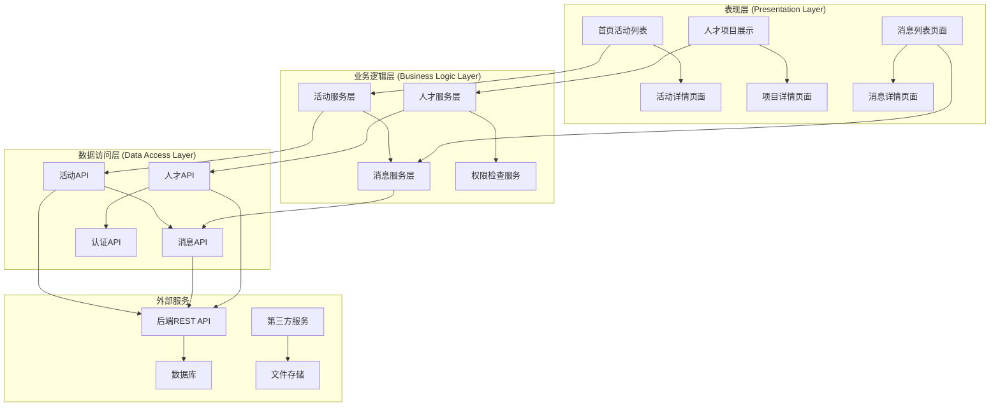
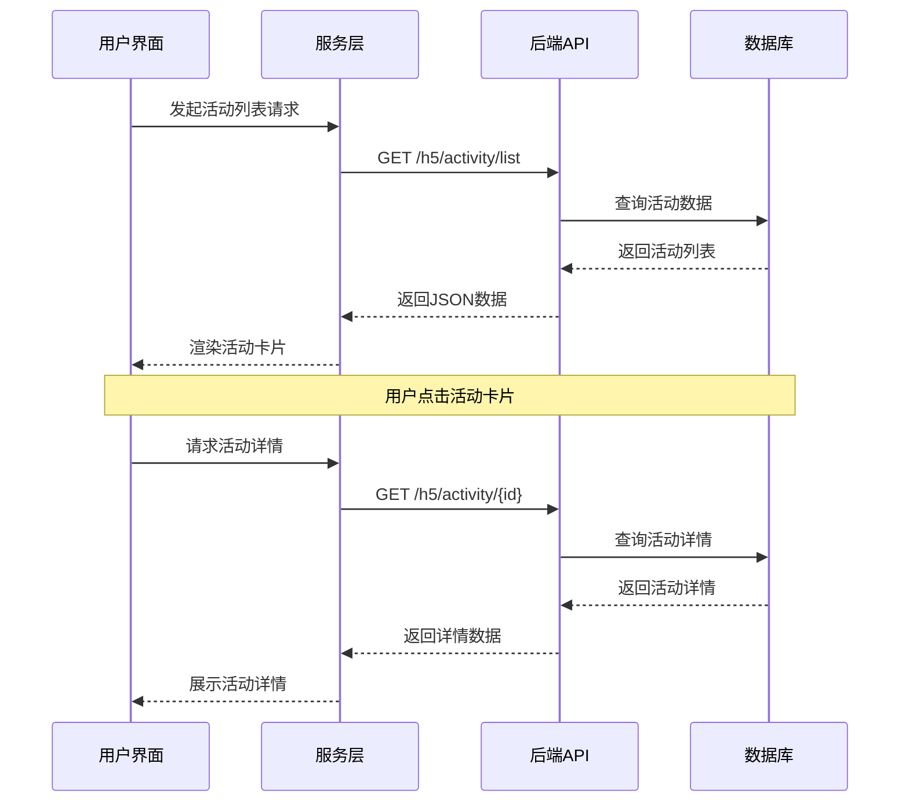
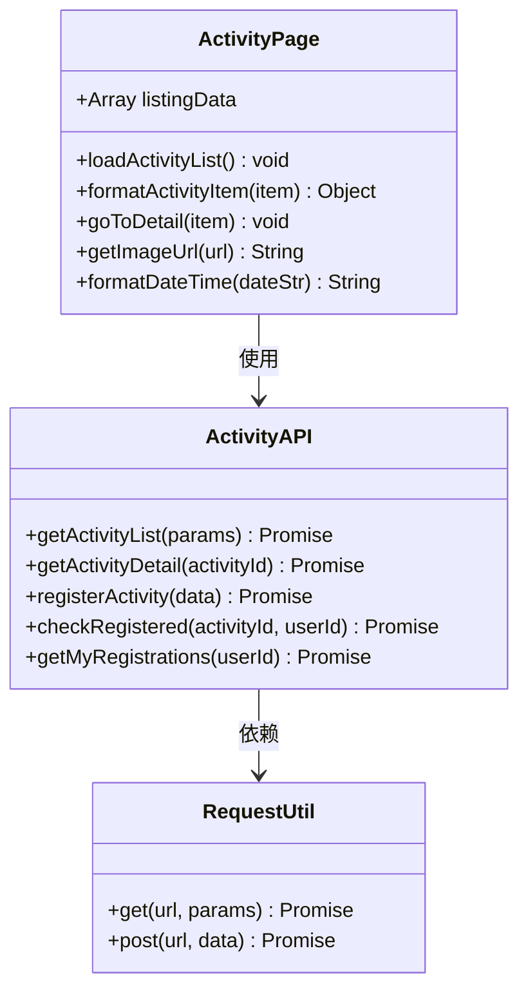
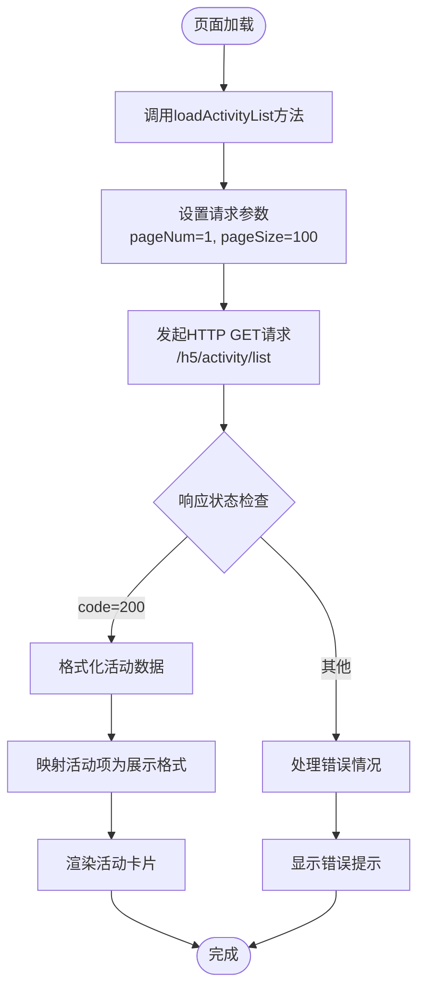
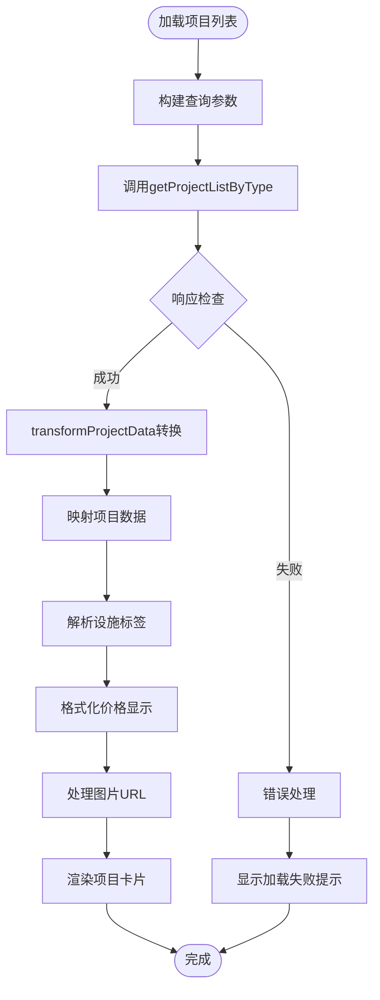
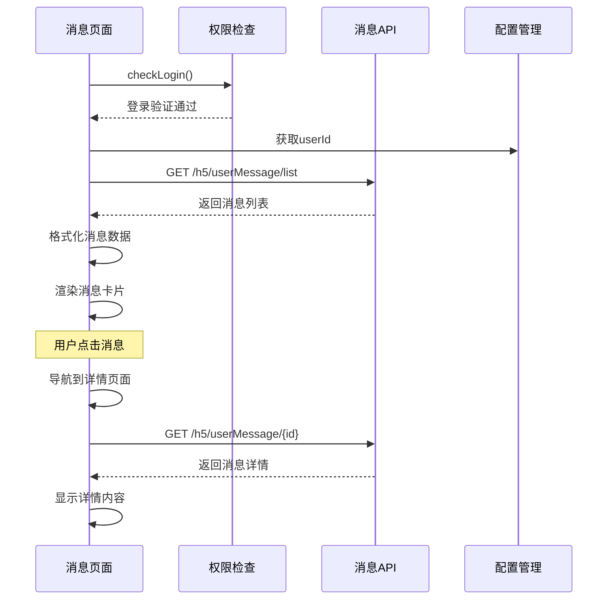
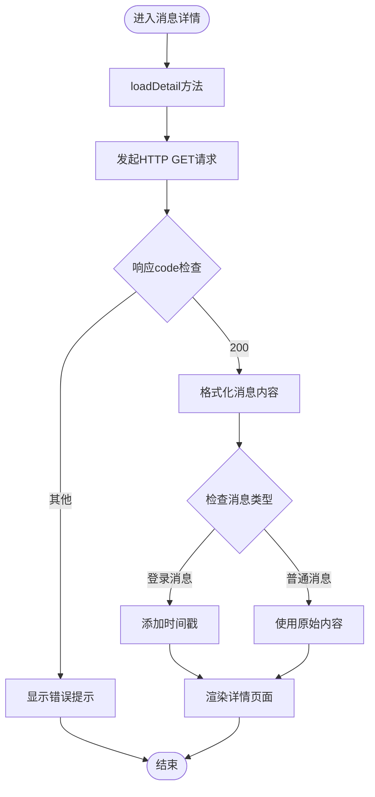
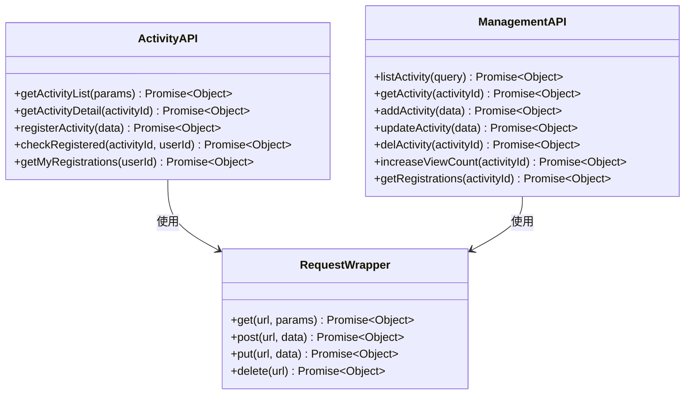
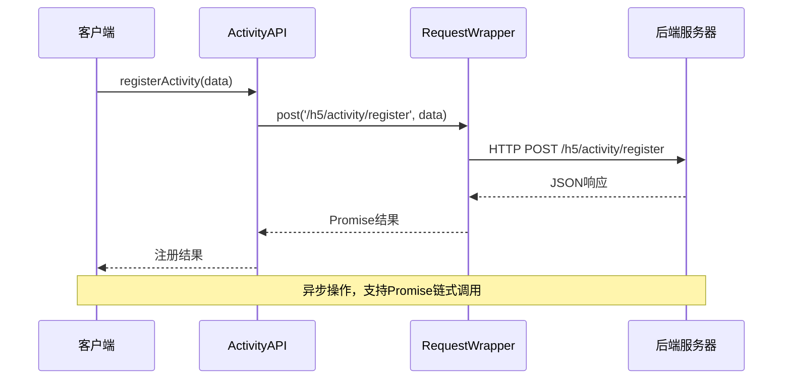
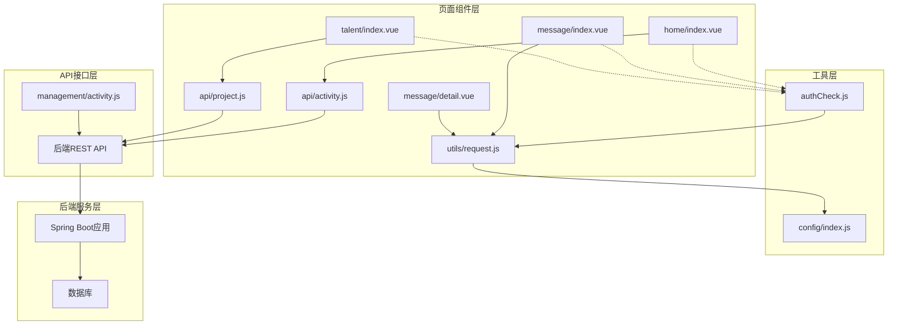

# 活动社区模块

<cite>
**本文档引用的文件**
- [uniapp-h5/api/activity.js](file://uniapp-h5/api/activity.js)
- [ruoyi-ui/src/api/gangzhu/activity.js](file://ruoyi-ui/src/api/gangzhu/activity.js)
- [uniapp-h5/pages/home/index.vue](file://uniapp-h5/pages/home/index.vue)
- [uniapp-h5/pages/home/detail.vue](file://uniapp-h5/pages/home/detail.vue)
- [uniapp-h5/pages/talent/index.vue](file://uniapp-h5/pages/talent/index.vue)
- [uniapp-h5/pages/message/index.vue](file://uniapp-h5/pages/message/index.vue)
- [uniapp-h5/pages/message/detail.vue](file://uniapp-h5/pages/message/detail.vue)
- [uniapp-h5/utils/request.js](file://uniapp-h5/utils/request.js)
- [uniapp-h5/config/index.js](file://uniapp-h5/config/index.js)
- [uniapp-h5/mixins/authCheck.js](file://uniapp-h5/mixins/authCheck.js)
</cite>

## 目录
1. [简介](#简介)
2. [项目结构](#项目结构)
3. [核心组件](#核心组件)
4. [架构概览](#架构概览)
5. [详细组件分析](#详细组件分析)
6. [依赖关系分析](#依赖关系分析)
7. [性能考虑](#性能考虑)
8. [故障排除指南](#故障排除指南)
9. [结论](#结论)

## 简介

港好住信息系统移动端活动社区模块是一个集成了活动管理和消息通知功能的综合性社区平台。该模块主要包含两大核心功能：人才家园和我的消息，为用户提供丰富的社区交流体验。

**核心功能概述：**
- **人才家园**：提供人才公寓项目展示、搜索和详情查看功能
- **我的消息**：实现消息通知、消息详情阅读和用户交互功能
- **活动社区**：支持活动列表展示、活动详情阅读、活动报名参与机制

该模块采用前后端分离架构，前端使用UniApp框架开发，后端基于Spring Boot框架，通过RESTful API进行数据交互。

## 项目结构

活动社区模块在项目中的组织结构如下：

```mermaid
graph TB
subgraph "前端应用 (UniApp)"
A[pages/] --> B[home/ 活动社区页面]
A --> C[talent/ 人才家园页面]
A --> D[message/ 消息页面]
E[api/ API接口] --> F[activity.js 活动API]
G[utils/] --> H[request.js 请求封装]
I[mixins/] --> J[authCheck.js 权限检查]
end
subgraph "后端服务"
K[RESTful API] --> L[/h5/activity/ 活动接口]
K --> M[/h5/userMessage/ 消息接口]
K --> N[/gangzhu/activity/ 管理端接口]
end
B --> L
C --> L
D --> M
F --> L
F --> M
```

**图表来源**
- [uniapp-h5/pages/home/index.vue:1-364](file://uniapp-h5/pages/home/index.vue#L1-L364)
- [uniapp-h5/pages/talent/index.vue:1-502](file://uniapp-h5/pages/talent/index.vue#L1-L502)
- [uniapp-h5/pages/message/index.vue:1-257](file://uniapp-h5/pages/message/index.vue#L1-L257)

**章节来源**
- [uniapp-h5/pages/home/index.vue:1-364](file://uniapp-h5/pages/home/index.vue#L1-L364)
- [uniapp-h5/pages/talent/index.vue:1-502](file://uniapp-h5/pages/talent/index.vue#L1-L502)
- [uniapp-h5/pages/message/index.vue:1-257](file://uniapp-h5/pages/message/index.vue#L1-L257)

## 核心组件

### 活动社区组件

活动社区模块的核心组件包括活动列表展示、活动详情阅读、活动报名功能等。这些组件通过统一的API接口与后端服务进行数据交互。

**活动社区功能特性：**
- 实时活动列表展示，支持分页加载
- 活动详情信息完整展示
- 用户活动报名参与机制
- 活动状态管理和时间展示

### 人才家园组件

人才家园模块专注于人才公寓项目的展示和搜索功能，为用户提供便捷的房源查找服务。

**人才家园功能特性：**
- 项目名称搜索功能
- 房源状态实时显示
- 价格和距离信息展示
- 设施标签分类显示

### 消息通知组件

消息通知模块实现了完整的消息管理系统，包括消息列表展示、消息详情查看和用户交互功能。

**消息通知功能特性：**
- 消息列表分页展示
- 消息详情完整阅读
- 时间戳格式化显示
- 登录状态自动检查

**章节来源**
- [uniapp-h5/api/activity.js:1-55](file://uniapp-h5/api/activity.js#L1-L55)
- [ruoyi-ui/src/api/gangzhu/activity.js:1-61](file://ruoyi-ui/src/api/gangzhu/activity.js#L1-L61)

## 架构概览

活动社区模块采用分层架构设计，确保了系统的可维护性和扩展性。



**图表来源**
- [uniapp-h5/pages/home/index.vue:62-85](file://uniapp-h5/pages/home/index.vue#L62-L85)
- [uniapp-h5/pages/message/index.vue:56-91](file://uniapp-h5/pages/message/index.vue#L56-L91)
- [uniapp-h5/pages/talent/index.vue:91-129](file://uniapp-h5/pages/talent/index.vue#L91-L129)

### 数据流架构



**图表来源**
- [uniapp-h5/pages/home/index.vue:62-85](file://uniapp-h5/pages/home/index.vue#L62-L85)
- [uniapp-h5/pages/home/detail.vue:44-76](file://uniapp-h5/pages/home/detail.vue#L44-L76)

## 详细组件分析

### 活动社区页面组件

活动社区页面组件负责展示活动列表和处理用户交互。

#### 组件结构分析



**图表来源**
- [uniapp-h5/pages/home/index.vue:51-176](file://uniapp-h5/pages/home/index.vue#L51-L176)
- [uniapp-h5/api/activity.js:11-54](file://uniapp-h5/api/activity.js#L11-L54)
- [uniapp-h5/utils/request.js](file://uniapp-h5/utils/request.js)

#### 活动列表展示流程



**图表来源**
- [uniapp-h5/pages/home/index.vue:62-85](file://uniapp-h5/pages/home/index.vue#L62-L85)

**章节来源**
- [uniapp-h5/pages/home/index.vue:51-176](file://uniapp-h5/pages/home/index.vue#L51-L176)

### 人才家园页面组件

人才家园页面组件专注于人才公寓项目的展示和搜索功能。

#### 数据转换和展示逻辑



**图表来源**
- [uniapp-h5/pages/talent/index.vue:91-129](file://uniapp-h5/pages/talent/index.vue#L91-L129)

#### 项目数据转换规则

| 字段 | 转换规则 | 示例 |
|------|----------|------|
| 项目ID | 直接映射 | projectId → projectId |
| 项目名称 | 字符串处理 | projectName → title |
| 房源状态 | 数值比较 | availableHouses > 0 → hasUnits |
| 总套数 | 算术运算 | totalHouses - offlineHouses → totalUnits |
| 价格 | 数值转换 | price → parseFloat(price) |
| 图片URL | URL拼接策略 | 根据前缀选择不同处理方式 |

**章节来源**
- [uniapp-h5/pages/talent/index.vue:136-190](file://uniapp-h5/pages/talent/index.vue#L136-L190)

### 消息通知页面组件

消息通知页面组件实现了完整的消息管理系统。

#### 消息列表加载流程



**图表来源**
- [uniapp-h5/pages/message/index.vue:46-112](file://uniapp-h5/pages/message/index.vue#L46-L112)
- [uniapp-h5/mixins/authCheck.js](file://uniapp-h5/mixins/authCheck.js)

#### 消息详情展示逻辑



**图表来源**
- [uniapp-h5/pages/message/detail.vue:44-100](file://uniapp-h5/pages/message/detail.vue#L44-L100)

**章节来源**
- [uniapp-h5/pages/message/index.vue:39-112](file://uniapp-h5/pages/message/index.vue#L39-L112)
- [uniapp-h5/pages/message/detail.vue:26-101](file://uniapp-h5/pages/message/detail.vue#L26-L101)

### API接口组件

活动社区模块的API接口组件提供了完整的数据访问能力。

#### 前端API接口定义



**图表来源**
- [uniapp-h5/api/activity.js:1-55](file://uniapp-h5/api/activity.js#L1-L55)
- [ruoyi-ui/src/api/gangzhu/activity.js:1-61](file://ruoyi-ui/src/api/gangzhu/activity.js#L1-L61)

#### API调用流程



**图表来源**
- [uniapp-h5/api/activity.js:33-35](file://uniapp-h5/api/activity.js#L33-L35)
- [uniapp-h5/utils/request.js](file://uniapp-h5/utils/request.js)

**章节来源**
- [uniapp-h5/api/activity.js:1-55](file://uniapp-h5/api/activity.js#L1-L55)
- [ruoyi-ui/src/api/gangzhu/activity.js:1-61](file://ruoyi-ui/src/api/gangzhu/activity.js#L1-L61)

## 依赖关系分析

活动社区模块的依赖关系体现了清晰的分层架构设计。



**图表来源**
- [uniapp-h5/pages/home/index.vue:64-65](file://uniapp-h5/pages/home/index.vue#L64-L65)
- [uniapp-h5/pages/message/index.vue:36-37](file://uniapp-h5/pages/message/index.vue#L36-L37)
- [uniapp-h5/pages/talent/index.vue:64-65](file://uniapp-h5/pages/talent/index.vue#L64-L65)

### 组件耦合度分析

活动社区模块在设计上遵循了低耦合高内聚的原则：

**低耦合特性：**
- 页面组件与API接口通过统一的请求封装层解耦
- 工具函数独立封装，便于复用和测试
- 配置管理独立，支持环境切换

**高内聚特性：**
- 页面组件职责单一，专注UI逻辑
- API接口按功能模块划分
- 工具函数功能明确，单一职责

**章节来源**
- [uniapp-h5/utils/request.js](file://uniapp-h5/utils/request.js)
- [uniapp-h5/config/index.js](file://uniapp-h5/config/index.js)
- [uniapp-h5/mixins/authCheck.js](file://uniapp-h5/mixins/authCheck.js)

## 性能考虑

活动社区模块在性能优化方面采用了多种策略：

### 数据缓存策略
- 活动列表数据采用分页加载，避免一次性加载大量数据
- 图片资源使用懒加载和CDN加速
- 用户会话信息本地缓存，减少重复请求

### 网络优化
- 统一的请求封装，支持请求拦截和响应处理
- 错误重试机制，提升用户体验
- 请求超时控制，防止长时间等待

### 前端性能优化
- 组件按需加载，减少初始包体积
- 图片资源压缩和格式优化
- CSS样式scoped作用域，避免全局污染

## 故障排除指南

### 常见问题及解决方案

**活动列表加载失败**
- 检查网络连接状态
- 验证后端API接口可用性
- 查看浏览器控制台错误信息

**消息显示异常**
- 确认用户登录状态
- 检查消息ID参数传递
- 验证消息数据格式

**图片资源加载失败**
- 检查图片URL格式
- 验证CDN服务状态
- 确认图片权限设置

**章节来源**
- [uniapp-h5/pages/home/index.vue:78-84](file://uniapp-h5/pages/home/index.vue#L78-L84)
- [uniapp-h5/pages/message/index.vue:85-90](file://uniapp-h5/pages/message/index.vue#L85-L90)
- [uniapp-h5/pages/message/detail.vue:68-75](file://uniapp-h5/pages/message/detail.vue#L68-L75)

## 结论

港好住信息系统移动端活动社区模块通过精心设计的架构和完善的组件实现，为用户提供了优质的社区交流体验。模块具有以下特点：

**技术优势：**
- 采用现代化的UniApp框架，支持多端部署
- 清晰的分层架构，便于维护和扩展
- 完善的API接口设计，支持灵活的功能组合

**用户体验：**
- 流畅的页面交互和数据加载
- 直观的信息展示和导航
- 响应式的界面适配

**开发友好性：**
- 模块化的设计便于团队协作
- 完善的错误处理机制
- 良好的代码可读性和可维护性

该模块为港好住信息系统的移动化发展奠定了坚实的基础，为后续功能扩展和性能优化提供了良好的技术支撑。