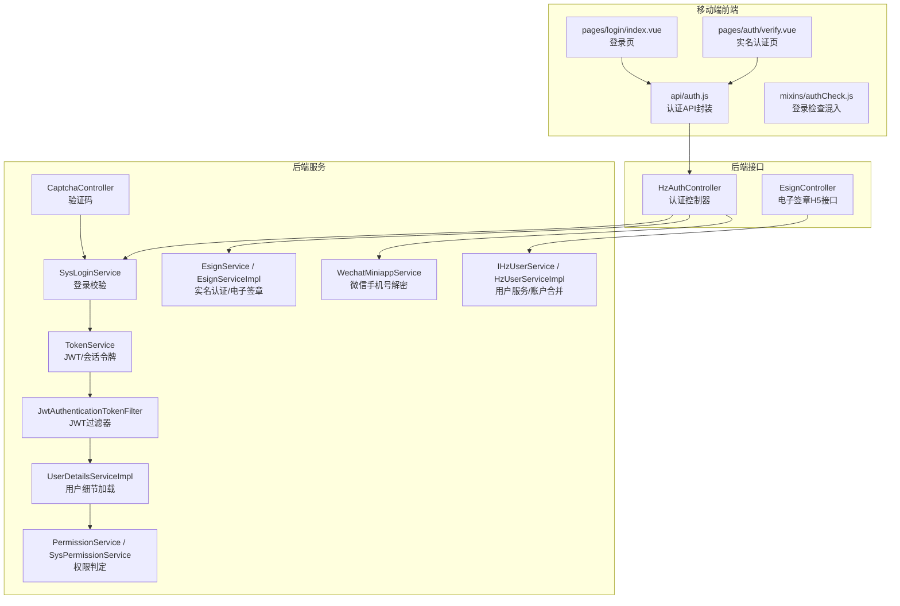
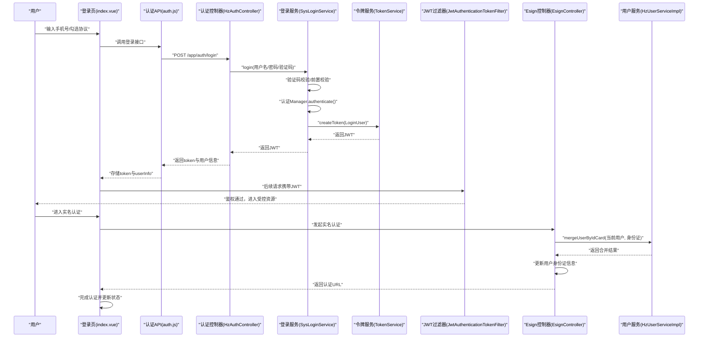
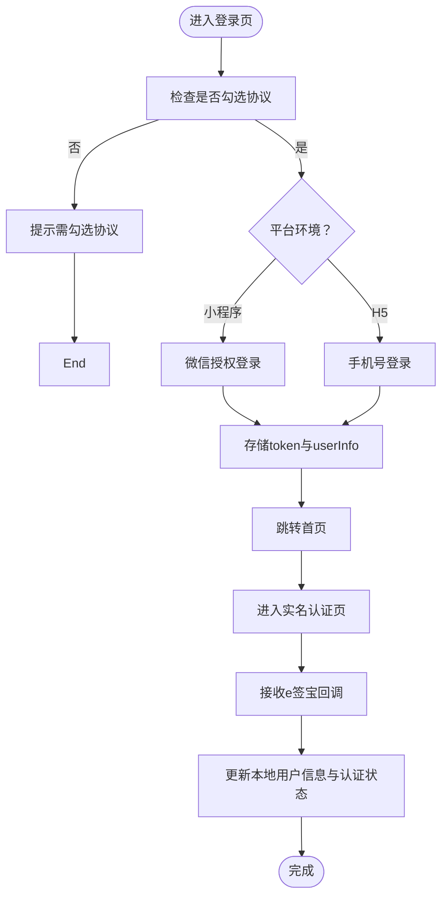
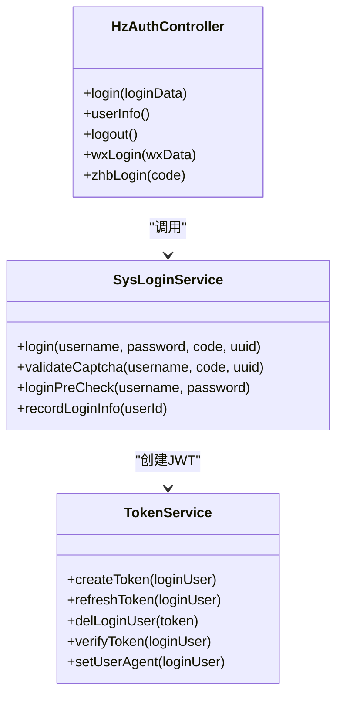
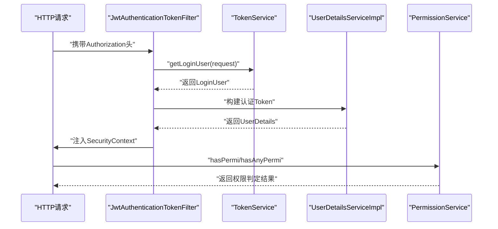
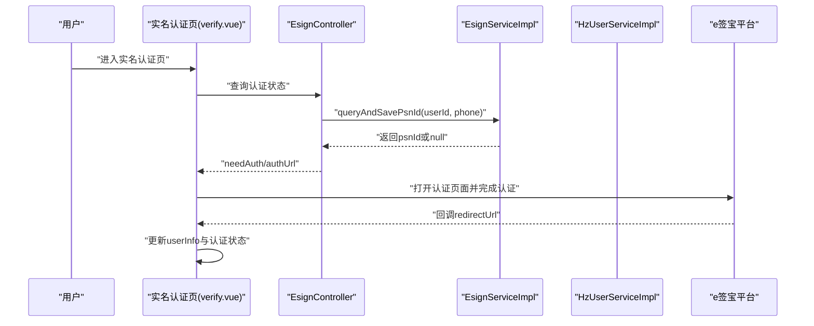
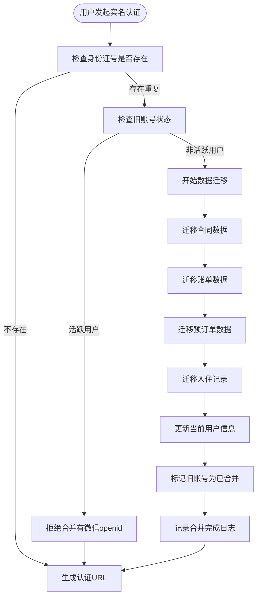
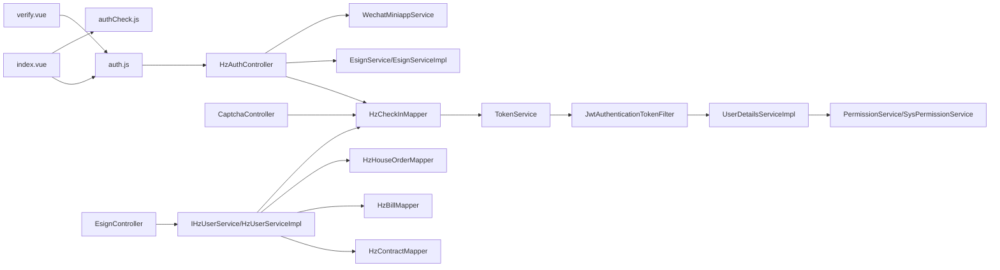

# 登录认证模块

<cite>
**本文引用的文件**
- [uniapp-h5/pages/login/index.vue](file://uniapp-h5/pages/login/index.vue)
- [uniapp-h5/api/auth.js](file://uniapp-h5/api/auth.js)
- [uniapp-h5/mixins/authCheck.js](file://uniapp-h5/mixins/authCheck.js)
- [uniapp-h5/pages/auth/verify.vue](file://uniapp-h5/pages/auth/verify.vue)
- [ruoyi-admin/src/main/java/com/ruoyi/web/controller/system/HzAuthController.java](file://ruoyi-admin/src/main/java/com/ruoyi/web/controller/system/HzAuthController.java)
- [ruoyi-admin/src/main/java/com/ruoyi/web/controller/h5/EsignController.java](file://ruoyi-admin/src/main/java/com/ruoyi/web/controller/h5/EsignController.java)
- [ruoyi-framework/src/main/java/com/ruoyi/framework/web/service/SysLoginService.java](file://ruoyi-framework/src/main/java/com/ruoyi/framework/web/service/SysLoginService.java)
- [ruoyi-framework/src/main/java/com/ruoyi/framework/web/service/TokenService.java](file://ruoyi-framework/src/main/java/com/ruoyi/framework/web/service/TokenService.java)
- [ruoyi-framework/src/main/java/com/ruoyi/framework/security/filter/JwtAuthenticationTokenFilter.java](file://ruoyi-framework/src/main/java/com/ruoyi/framework/security/filter/JwtAuthenticationTokenFilter.java)
- [ruoyi-framework/src/main/java/com/ruoyi/framework/web/service/UserDetailsServiceImpl.java](file://ruoyi-framework/src/main/java/com/ruoyi/framework/web/service/UserDetailsServiceImpl.java)
- [ruoyi-framework/src/main/java/com/ruoyi/framework/web/service/PermissionService.java](file://ruoyi-framework/src/main/java/com/ruoyi/framework/web/service/PermissionService.java)
- [ruoyi-framework/src/main/java/com/ruoyi/framework/web/service/SysPermissionService.java](file://ruoyi-framework/src/main/java/com/ruoyi/framework/web/service/SysPermissionService.java)
- [ruoyi-admin/src/main/java/com/ruoyi/web/service/WechatMiniappService.java](file://ruoyi-admin/src/main/java/com/ruoyi/web/service/WechatMiniappService.java)
- [ruoyi-admin/src/main/java/com/ruoyi/web/controller/common/CaptchaController.java](file://ruoyi-admin/src/main/java/com/ruoyi/web/controller/common/CaptchaController.java)
- [ruoyi-system/src/main/java/com/ruoyi/system/service/EsignService.java](file://ruoyi-system/src/main/java/com/ruoyi/system/service/EsignService.java)
- [ruoyi-system/src/main/java/com/ruoyi/system/service/impl/EsignServiceImpl.java](file://ruoyi-system/src/main/java/com/ruoyi/system/service/impl/EsignServiceImpl.java)
- [ruoyi-system/src/main/java/com/ruoyi/system/service/impl/HzUserServiceImpl.java](file://ruoyi-system/src/main/java/com/ruoyi/system/service/impl/HzUserServiceImpl.java)
- [ruoyi-system/src/main/java/com/ruoyi/system/service/IHzUserService.java](file://ruoyi-system/src/main/java/com/ruoyi/system/service/IHzUserService.java)
- [ruoyi-common/src/main/java/com/ruoyi/common/core/domain/model/LoginUser.java](file://ruoyi-common/src/main/java/com/ruoyi/common/core/domain/model/LoginUser.java)
- [ruoyi-ui/src/utils/auth.js](file://ruoyi-ui/src/utils/auth.js)
</cite>

## 更新摘要
**所做更改**
- 新增"自动用户账户合并功能"章节，详细介绍身份证账号自动合并机制
- 更新实名认证流程，增加自动合并触发时机和安全策略
- 新增账户合并业务流程图和安全验证机制说明
- 更新相关服务层实现细节和数据库操作说明

## 目录
1. [简介](#简介)
2. [项目结构](#项目结构)
3. [核心组件](#核心组件)
4. [架构总览](#架构总览)
5. [详细组件分析](#详细组件分析)
6. [自动用户账户合并功能](#自动用户账户合并功能)
7. [依赖分析](#依赖分析)
8. [性能考虑](#性能考虑)
9. [故障排查指南](#故障排查指南)
10. [结论](#结论)
11. [附录](#附录)

## 简介
本文件面向港好住信息系统移动端登录认证模块，系统性梳理移动端登录、实名认证、电子签名认证、JWT令牌管理、会话保持、权限与访问控制等关键能力。文档以"前端页面与API调用""后端控制器与服务层""安全过滤与权限体系"为主线，提供流程图、时序图与类图，帮助开发团队快速理解与落地。

**更新** 新增自动用户账户合并功能，增强用户体验并防止账号重复

## 项目结构
围绕移动端登录认证，涉及以下关键目录与文件：
- 前端（uniapp-h5）
  - 登录页与实名认证页：pages/login/index.vue、pages/auth/verify.vue
  - API封装：api/auth.js
  - 登录检查混入：mixins/authCheck.js
- 后端（ruoyi-admin/ruoyi-framework/ruoyi-system）
  - 认证控制器：HzAuthController、EsignController
  - 登录与令牌服务：SysLoginService、TokenService
  - JWT过滤器：JwtAuthenticationTokenFilter
  - 用户细节与权限：UserDetailsServiceImpl、PermissionService、SysPermissionService
  - 微信小程序服务：WechatMiniappService
  - 验证码控制器：CaptchaController
  - 电子签章服务：EsignService 及其实现 EsignServiceImpl
  - 用户服务：IHzUserService、HzUserServiceImpl（新增账户合并功能）

**图表来源**
- [uniapp-h5/pages/login/index.vue:1-240](file://uniapp-h5/pages/login/index.vue#L1-L240)
- [uniapp-h5/pages/auth/verify.vue:193-267](file://uniapp-h5/pages/auth/verify.vue#L193-L267)
- [uniapp-h5/api/auth.js:1-55](file://uniapp-h5/api/auth.js#L1-L55)
- [uniapp-h5/mixins/authCheck.js:1-49](file://uniapp-h5/mixins/authCheck.js#L1-L49)
- [ruoyi-admin/src/main/java/com/ruoyi/web/controller/system/HzAuthController.java:1-200](file://ruoyi-admin/src/main/java/com/ruoyi/web/controller/system/HzAuthController.java#L1-L200)
- [ruoyi-admin/src/main/java/com/ruoyi/web/controller/h5/EsignController.java:1-84](file://ruoyi-admin/src/main/java/com/ruoyi/web/controller/h5/EsignController.java#L1-L84)
- [ruoyi-framework/src/main/java/com/ruoyi/framework/web/service/SysLoginService.java:1-177](file://ruoyi-framework/src/main/java/com/ruoyi/framework/web/service/SysLoginService.java#L1-L177)
- [ruoyi-framework/src/main/java/com/ruoyi/framework/web/service/TokenService.java:96-184](file://ruoyi-framework/src/main/java/com/ruoyi/framework/web/service/TokenService.java#L96-L184)
- [ruoyi-framework/src/main/java/com/ruoyi/framework/security/filter/JwtAuthenticationTokenFilter.java:1-45](file://ruoyi-framework/src/main/java/com/ruoyi/framework/security/filter/JwtAuthenticationTokenFilter.java#L1-L45)
- [ruoyi-framework/src/main/java/com/ruoyi/framework/web/service/UserDetailsServiceImpl.java:1-67](file://ruoyi-framework/src/main/java/com/ruoyi/framework/web/service/UserDetailsServiceImpl.java#L1-L67)
- [ruoyi-framework/src/main/java/com/ruoyi/framework/web/service/PermissionService.java:1-80](file://ruoyi-framework/src/main/java/com/ruoyi/framework/web/service/PermissionService.java#L1-L80)
- [ruoyi-framework/src/main/java/com/ruoyi/framework/web/service/SysPermissionService.java:1-49](file://ruoyi-framework/src/main/java/com/ruoyi/framework/web/service/SysPermissionService.java#L1-L49)
- [ruoyi-admin/src/main/java/com/ruoyi/web/service/WechatMiniappService.java:123-172](file://ruoyi-admin/src/main/java/com/ruoyi/web/service/WechatMiniappService.java#L123-L172)
- [ruoyi-admin/src/main/java/com/ruoyi/web/controller/common/CaptchaController.java:34-76](file://ruoyi-admin/src/main/java/com/ruoyi/web/controller/common/CaptchaController.java#L34-L76)
- [ruoyi-system/src/main/java/com/ruoyi/system/service/EsignService.java:1-50](file://ruoyi-system/src/main/java/com/ruoyi/system/service/EsignService.java#L1-L50)
- [ruoyi-system/src/main/java/com/ruoyi/system/service/impl/EsignServiceImpl.java:50-98](file://ruoyi-system/src/main/java/com/ruoyi/system/service/impl/EsignServiceImpl.java#L50-L98)
- [ruoyi-system/src/main/java/com/ruoyi/system/service/impl/HzUserServiceImpl.java:364-445](file://ruoyi-system/src/main/java/com/ruoyi/system/service/impl/HzUserServiceImpl.java#L364-L445)

**章节来源**
- [uniapp-h5/pages/login/index.vue:1-240](file://uniapp-h5/pages/login/index.vue#L1-L240)
- [uniapp-h5/api/auth.js:1-55](file://uniapp-h5/api/auth.js#L1-L55)
- [ruoyi-admin/src/main/java/com/ruoyi/web/controller/system/HzAuthController.java:1-200](file://ruoyi-admin/src/main/java/com/ruoyi/web/controller/system/HzAuthController.java#L1-L200)
- [ruoyi-framework/src/main/java/com/ruoyi/framework/web/service/SysLoginService.java:1-177](file://ruoyi-framework/src/main/java/com/ruoyi/framework/web/service/SysLoginService.java#L1-L177)

## 核心组件
- 移动端登录页与实名认证页
  - 登录页负责协议勾选、手机号登录、微信小程序授权登录、登录成功后存储token与用户信息，并跳转首页。
  - 实名认证页负责接收e签宝回调，更新本地用户认证状态与信息。
- 认证API封装
  - 统一封装登录、获取用户信息、更新信息、退出登录、郑好办登录、微信小程序登录等接口。
- 登录检查混入
  - 为需要登录的页面提供统一登录态检查与引导跳转。
- 后端认证控制器
  - 提供/app/auth/*接口，处理登录、获取用户信息、退出登录、郑好办登录、微信小程序登录等。
  - **新增** EsignController：处理实名认证状态查询、认证URL生成、身份证账号自动合并等功能。
- 登录与令牌服务
  - SysLoginService：验证码校验、用户前置校验、认证流程、记录登录日志、生成JWT。
  - TokenService：创建令牌、刷新令牌、删除用户身份信息、设置UA信息、基于Redis缓存登录用户。
- JWT过滤器
  - JwtAuthenticationTokenFilter：从请求解析JWT，校验并注入Security上下文。
- 用户细节与权限
  - UserDetailsServiceImpl：按用户名加载用户、校验状态、构建LoginUser。
  - PermissionService/SysPermissionService：基于用户权限集合进行权限判定。
- 电子签章与实名认证
  - EsignService 接口与 EsignServiceImpl 实现：提供实名认证URL生成、认证状态查询与保存、签署流程等。
  - **更新** EsignController：H5环境下对外暴露实名认证与签署相关接口，集成自动账户合并功能。
- 微信小程序服务
  - WechatMiniappService：手机号解密、access_token管理与重试。
- 验证码
  - CaptchaController：生成图形验证码并写入Redis。
- **新增** 用户服务与账户合并
  - IHzUserService 接口：定义用户服务基础方法，包括新增的mergeUserByIdCard方法。
  - HzUserServiceImpl：实现用户服务功能，包含身份证账号自动合并逻辑。

**章节来源**
- [uniapp-h5/pages/login/index.vue:63-232](file://uniapp-h5/pages/login/index.vue#L63-L232)
- [uniapp-h5/pages/auth/verify.vue:193-267](file://uniapp-h5/pages/auth/verify.vue#L193-L267)
- [uniapp-h5/api/auth.js:1-55](file://uniapp-h5/api/auth.js#L1-L55)
- [uniapp-h5/mixins/authCheck.js:1-49](file://uniapp-h5/mixins/authCheck.js#L1-L49)
- [ruoyi-admin/src/main/java/com/ruoyi/web/controller/system/HzAuthController.java:1-200](file://ruoyi-admin/src/main/java/com/ruoyi/web/controller/system/HzAuthController.java#L1-L200)
- [ruoyi-admin/src/main/java/com/ruoyi/web/controller/h5/EsignController.java:53-88](file://ruoyi-admin/src/main/java/com/ruoyi/web/controller/h5/EsignController.java#L53-L88)
- [ruoyi-framework/src/main/java/com/ruoyi/framework/web/service/SysLoginService.java:1-177](file://ruoyi-framework/src/main/java/com/ruoyi/framework/web/service/SysLoginService.java#L1-L177)
- [ruoyi-framework/src/main/java/com/ruoyi/framework/web/service/TokenService.java:96-184](file://ruoyi-framework/src/main/java/com/ruoyi/framework/web/service/TokenService.java#L96-L184)
- [ruoyi-framework/src/main/java/com/ruoyi/framework/security/filter/JwtAuthenticationTokenFilter.java:1-45](file://ruoyi-framework/src/main/java/com/ruoyi/framework/security/filter/JwtAuthenticationTokenFilter.java#L1-L45)
- [ruoyi-framework/src/main/java/com/ruoyi/framework/web/service/UserDetailsServiceImpl.java:1-67](file://ruoyi-framework/src/main/java/com/ruoyi/framework/web/service/UserDetailsServiceImpl.java#L1-L67)
- [ruoyi-framework/src/main/java/com/ruoyi/framework/web/service/PermissionService.java:1-80](file://ruoyi-framework/src/main/java/com/ruoyi/framework/web/service/PermissionService.java#L1-L80)
- [ruoyi-framework/src/main/java/com/ruoyi/framework/web/service/SysPermissionService.java:1-49](file://ruoyi-framework/src/main/java/com/ruoyi/framework/web/service/SysPermissionService.java#L1-L49)
- [ruoyi-admin/src/main/java/com/ruoyi/web/service/WechatMiniappService.java:123-172](file://ruoyi-admin/src/main/java/com/ruoyi/web/service/WechatMiniappService.java#L123-L172)
- [ruoyi-admin/src/main/java/com/ruoyi/web/controller/common/CaptchaController.java:34-76](file://ruoyi-admin/src/main/java/com/ruoyi/web/controller/common/CaptchaController.java#L34-L76)
- [ruoyi-system/src/main/java/com/ruoyi/system/service/EsignService.java:1-50](file://ruoyi-system/src/main/java/com/ruoyi/system/service/EsignService.java#L1-L50)
- [ruoyi-system/src/main/java/com/ruoyi/system/service/impl/EsignServiceImpl.java:50-98](file://ruoyi-system/src/main/java/com/ruoyi/system/service/impl/EsignServiceImpl.java#L50-L98)
- [ruoyi-system/src/main/java/com/ruoyi/system/service/impl/HzUserServiceImpl.java:364-445](file://ruoyi-system/src/main/java/com/ruoyi/system/service/impl/HzUserServiceImpl.java#L364-L445)
- [ruoyi-system/src/main/java/com/ruoyi/system/service/IHzUserService.java:108-116](file://ruoyi-system/src/main/java/com/ruoyi/system/service/IHzUserService.java#L108-L116)

## 架构总览
移动端登录认证的整体流程如下：
- 前端登录页收集手机号与协议勾选，调用后端登录接口。
- 后端进行验证码校验、用户前置校验、认证与日志记录，生成JWT并返回给前端。
- 前端存储token与用户信息，后续请求携带JWT。
- 后端JWT过滤器解析并校验JWT，注入认证上下文，交由权限服务进行权限判定。
- 实名认证与电子签章通过EsignService与EsignController对接e签宝，完成后更新本地认证状态。
- **新增** 身份证账号自动合并：在实名认证过程中检测重复身份证，自动合并旧账号业务数据到新账号。

**图表来源**
- [uniapp-h5/pages/login/index.vue:184-232](file://uniapp-h5/pages/login/index.vue#L184-L232)
- [uniapp-h5/api/auth.js:11-13](file://uniapp-h5/api/auth.js#L11-L13)
- [ruoyi-admin/src/main/java/com/ruoyi/web/controller/system/HzAuthController.java:40-120](file://ruoyi-admin/src/main/java/com/ruoyi/web/controller/system/HzAuthController.java#L40-L120)
- [ruoyi-framework/src/main/java/com/ruoyi/framework/web/service/SysLoginService.java:63-100](file://ruoyi-framework/src/main/java/com/ruoyi/framework/web/service/SysLoginService.java#L63-L100)
- [ruoyi-framework/src/main/java/com/ruoyi/framework/web/service/TokenService.java:114-125](file://ruoyi-framework/src/main/java/com/ruoyi/framework/web/service/TokenService.java#L114-L125)
- [ruoyi-framework/src/main/java/com/ruoyi/framework/security/filter/JwtAuthenticationTokenFilter.java:30-43](file://ruoyi-framework/src/main/java/com/ruoyi/framework/security/filter/JwtAuthenticationTokenFilter.java#L30-L43)
- [ruoyi-admin/src/main/java/com/ruoyi/web/controller/h5/EsignController.java:53-88](file://ruoyi-admin/src/main/java/com/ruoyi/web/controller/h5/EsignController.java#L53-L88)
- [ruoyi-system/src/main/java/com/ruoyi/system/service/impl/HzUserServiceImpl.java:364-445](file://ruoyi-system/src/main/java/com/ruoyi/system/service/impl/HzUserServiceImpl.java#L364-L445)

## 详细组件分析

### 登录页与实名认证页
- 登录页（index.vue）
  - 支持微信小程序与H5两种登录路径：小程序通过微信授权手机号，H5通过手机号直接登录。
  - 登录前强制勾选协议，点击登录后调用API封装的login接口，成功后存储token与userInfo并跳转首页。
- 实名认证页（verify.vue）
  - 接收e签宝回调后，更新本地userInfo中的实名认证状态与psnId，并持久化状态位，确保登录后仍可见认证完成。

**图表来源**
- [uniapp-h5/pages/login/index.vue:94-114](file://uniapp-h5/pages/login/index.vue#L94-L114)
- [uniapp-h5/pages/login/index.vue:115-181](file://uniapp-h5/pages/login/index.vue#L115-L181)
- [uniapp-h5/pages/login/index.vue:184-232](file://uniapp-h5/pages/login/index.vue#L184-L232)
- [uniapp-h5/pages/auth/verify.vue:193-216](file://uniapp-h5/pages/auth/verify.vue#L193-L216)

**章节来源**
- [uniapp-h5/pages/login/index.vue:63-232](file://uniapp-h5/pages/login/index.vue#L63-L232)
- [uniapp-h5/pages/auth/verify.vue:193-267](file://uniapp-h5/pages/auth/verify.vue#L193-L267)

### 认证API封装与登录检查混入
- 认证API封装（auth.js）
  - 提供登录、获取用户信息、更新信息、退出登录、郑好办登录、微信小程序登录等接口。
- 登录检查混入（authCheck.js）
  - 统一校验token与userInfo，未登录时提示并跳转登录页，登录成功后回调业务逻辑。

**章节来源**
- [uniapp-h5/api/auth.js:1-55](file://uniapp-h5/api/auth.js#L1-L55)
- [uniapp-h5/mixins/authCheck.js:1-49](file://uniapp-h5/mixins/authCheck.js#L1-L49)

### 后端认证控制器与登录服务
- 认证控制器（HzAuthController）
  - 对外提供/app/auth/*接口，处理登录、获取用户信息、退出登录、郑好办登录、微信小程序登录等。
- 登录服务（SysLoginService）
  - 校验验证码、前置参数、调用认证Manager、记录登录日志、生成JWT。
- 令牌服务（TokenService）
  - 创建JWT、刷新令牌、删除用户身份信息、设置UA信息、基于Redis缓存登录用户。

**图表来源**
- [ruoyi-admin/src/main/java/com/ruoyi/web/controller/system/HzAuthController.java:1-200](file://ruoyi-admin/src/main/java/com/ruoyi/web/controller/system/HzAuthController.java#L1-L200)
- [ruoyi-framework/src/main/java/com/ruoyi/framework/web/service/SysLoginService.java:63-177](file://ruoyi-framework/src/main/java/com/ruoyi/framework/web/service/SysLoginService.java#L63-L177)
- [ruoyi-framework/src/main/java/com/ruoyi/framework/web/service/TokenService.java:114-184](file://ruoyi-framework/src/main/java/com/ruoyi/framework/web/service/TokenService.java#L114-L184)

**章节来源**
- [ruoyi-admin/src/main/java/com/ruoyi/web/controller/system/HzAuthController.java:1-200](file://ruoyi-admin/src/main/java/com/ruoyi/web/controller/system/HzAuthController.java#L1-L200)
- [ruoyi-framework/src/main/java/com/ruoyi/framework/web/service/SysLoginService.java:1-177](file://ruoyi-framework/src/main/java/com/ruoyi/framework/web/service/SysLoginService.java#L1-L177)
- [ruoyi-framework/src/main/java/com/ruoyi/framework/web/service/TokenService.java:96-184](file://ruoyi-framework/src/main/java/com/ruoyi/framework/web/service/TokenService.java#L96-L184)

### JWT过滤器与权限体系
- JWT过滤器（JwtAuthenticationTokenFilter）
  - 从请求解析JWT，校验并注入Security上下文，供后续权限判定使用。
- 用户细节与权限
  - UserDetailsServiceImpl：按用户名加载用户、校验状态、构建LoginUser。
  - PermissionService/SysPermissionService：基于用户权限集合进行权限判定与角色权限获取。

**图表来源**
- [ruoyi-framework/src/main/java/com/ruoyi/framework/security/filter/JwtAuthenticationTokenFilter.java:30-43](file://ruoyi-framework/src/main/java/com/ruoyi/framework/security/filter/JwtAuthenticationTokenFilter.java#L30-L43)
- [ruoyi-framework/src/main/java/com/ruoyi/framework/web/service/TokenService.java:114-155](file://ruoyi-framework/src/main/java/com/ruoyi/framework/web/service/TokenService.java#L114-L155)
- [ruoyi-framework/src/main/java/com/ruoyi/framework/web/service/UserDetailsServiceImpl.java:37-65](file://ruoyi-framework/src/main/java/com/ruoyi/framework/web/service/UserDetailsServiceImpl.java#L37-L65)
- [ruoyi-framework/src/main/java/com/ruoyi/framework/web/service/PermissionService.java:27-80](file://ruoyi-framework/src/main/java/com/ruoyi/framework/web/service/PermissionService.java#L27-L80)
- [ruoyi-framework/src/main/java/com/ruoyi/framework/web/service/SysPermissionService.java:36-49](file://ruoyi-framework/src/main/java/com/ruoyi/framework/web/service/SysPermissionService.java#L36-L49)

**章节来源**
- [ruoyi-framework/src/main/java/com/ruoyi/framework/security/filter/JwtAuthenticationTokenFilter.java:1-45](file://ruoyi-framework/src/main/java/com/ruoyi/framework/security/filter/JwtAuthenticationTokenFilter.java#L1-L45)
- [ruoyi-framework/src/main/java/com/ruoyi/framework/web/service/UserDetailsServiceImpl.java:1-67](file://ruoyi-framework/src/main/java/com/ruoyi/framework/web/service/UserDetailsServiceImpl.java#L1-L67)
- [ruoyi-framework/src/main/java/com/ruoyi/framework/web/service/PermissionService.java:1-80](file://ruoyi-framework/src/main/java/com/ruoyi/framework/web/service/PermissionService.java#L1-L80)
- [ruoyi-framework/src/main/java/com/ruoyi/framework/web/service/SysPermissionService.java:1-49](file://ruoyi-framework/src/main/java/com/ruoyi/framework/web/service/SysPermissionService.java#L1-L49)

### 实名认证与电子签名认证
- 实名认证流程
  - 通过EsignController对外提供实名认证状态查询与认证URL生成。
  - EsignServiceImpl根据用户信息与e签宝参数生成认证URL，支持预填姓名与身份证号。
- 电子签名流程
  - EsignService定义模板填充、文件创建、签署流创建、签署URL获取、回调处理等能力。
  - H5环境下，verify.vue在e签宝回调后更新本地认证状态与psnId。

**图表来源**
- [ruoyi-admin/src/main/java/com/ruoyi/web/controller/h5/EsignController.java:50-82](file://ruoyi-admin/src/main/java/com/ruoyi/web/controller/h5/EsignController.java#L50-L82)
- [ruoyi-system/src/main/java/com/ruoyi/system/service/impl/EsignServiceImpl.java:76-98](file://ruoyi-system/src/main/java/com/ruoyi/system/service/impl/EsignServiceImpl.java#L76-L98)
- [uniapp-h5/pages/auth/verify.vue:193-216](file://uniapp-h5/pages/auth/verify.vue#L193-L216)

**章节来源**
- [ruoyi-admin/src/main/java/com/ruoyi/web/controller/h5/EsignController.java:1-84](file://ruoyi-admin/src/main/java/com/ruoyi/web/controller/h5/EsignController.java#L1-L84)
- [ruoyi-system/src/main/java/com/ruoyi/system/service/EsignService.java:1-50](file://ruoyi-system/src/main/java/com/ruoyi/system/service/EsignService.java#L1-L50)
- [ruoyi-system/src/main/java/com/ruoyi/system/service/impl/EsignServiceImpl.java:50-98](file://ruoyi-system/src/main/java/com/ruoyi/system/service/impl/EsignServiceImpl.java#L50-L98)
- [uniapp-h5/pages/auth/verify.vue:193-267](file://uniapp-h5/pages/auth/verify.vue#L193-L267)

### 微信小程序登录与手机号解密
- 小程序登录
  - 登录页通过微信授权获取手机号，随后调用后端wxLogin接口完成登录。
- 手机号解密
  - WechatMiniappService封装access_token获取与手机号解密逻辑，对token过期场景进行重试。

**章节来源**
- [uniapp-h5/pages/login/index.vue:115-181](file://uniapp-h5/pages/login/index.vue#L115-L181)
- [ruoyi-admin/src/main/java/com/ruoyi/web/service/WechatMiniappService.java:123-172](file://ruoyi-admin/src/main/java/com/ruoyi/web/service/WechatMiniappService.java#L123-L172)

### 验证码与会话保持
- 验证码
  - CaptchaController生成图形验证码并写入Redis，SysLoginService在登录时进行验证码校验。
- 会话保持
  - TokenService在创建JWT后将LoginUser缓存至Redis，并在即将到期时自动刷新，保证会话持续有效。

**章节来源**
- [ruoyi-admin/src/main/java/com/ruoyi/web/controller/common/CaptchaController.java:45-76](file://ruoyi-admin/src/main/java/com/ruoyi/web/controller/common/CaptchaController.java#L45-L76)
- [ruoyi-framework/src/main/java/com/ruoyi/framework/web/service/SysLoginService.java:110-129](file://ruoyi-framework/src/main/java/com/ruoyi/framework/web/service/SysLoginService.java#L110-L129)
- [ruoyi-framework/src/main/java/com/ruoyi/framework/web/service/TokenService.java:148-155](file://ruoyi-framework/src/main/java/com/ruoyi/framework/web/service/TokenService.java#L148-L155)

## 自动用户账户合并功能

### 功能概述
系统新增身份证账号自动合并功能，在用户实名认证过程中自动检测并合并重复的身份证账号，有效防止账号重复并提升用户体验。该功能通过智能识别重复身份证号，自动将旧账号的业务数据迁移到新账号，同时确保不会误伤活跃用户。

### 触发时机与流程
- **触发时机**：用户在实名认证时，系统检测到相同身份证号已存在于其他账号中
- **安全策略**：仅合并"从未登录过"的旧账号（无微信openid、无最后登录时间），避免影响活跃用户
- **业务迁移**：自动迁移合同、账单、预订单、入住记录等关联业务数据

**图表来源**
- [ruoyi-admin/src/main/java/com/ruoyi/web/controller/h5/EsignController.java:53-59](file://ruoyi-admin/src/main/java/com/ruoyi/web/controller/h5/EsignController.java#L53-L59)
- [ruoyi-system/src/main/java/com/ruoyi/system/service/impl/HzUserServiceImpl.java:364-445](file://ruoyi-system/src/main/java/com/ruoyi/system/service/impl/HzUserServiceImpl.java#L364-L445)

### 核心实现逻辑
- **重复检测**：通过身份证号查询数据库，排除当前用户ID，查找其他活跃用户
- **安全验证**：检查旧账号是否具有微信openid或最后登录时间，确保只合并非活跃用户
- **数据迁移**：批量更新合同、账单、预订单、入住记录等关联表的tenant_id字段
- **信息补全**：将旧账号的有效信息（如教育背景、工作单位等）补充到当前用户
- **状态标记**：将旧账号标记为已合并状态（del_flag='2'），并记录备注信息

### 业务影响与收益
- **用户体验提升**：避免用户因重复身份证而无法完成实名认证
- **数据完整性**：确保用户的业务数据完整迁移，不丢失历史记录
- **系统稳定性**：通过安全策略避免误伤活跃用户，保证系统安全
- **数据一致性**：自动化的数据迁移确保业务数据的一致性和准确性

**章节来源**
- [ruoyi-admin/src/main/java/com/ruoyi/web/controller/h5/EsignController.java:53-59](file://ruoyi-admin/src/main/java/com/ruoyi/web/controller/h5/EsignController.java#L53-L59)
- [ruoyi-system/src/main/java/com/ruoyi/system/service/impl/HzUserServiceImpl.java:364-445](file://ruoyi-system/src/main/java/com/ruoyi/system/service/impl/HzUserServiceImpl.java#L364-L445)
- [ruoyi-system/src/main/java/com/ruoyi/system/service/IHzUserService.java:108-116](file://ruoyi-system/src/main/java/com/ruoyi/system/service/IHzUserService.java#L108-L116)

## 依赖分析
- 前端依赖
  - 登录页依赖API封装与登录检查混入；实名认证页依赖API封装与本地状态持久化。
- 后端依赖
  - 认证控制器依赖用户服务、消息服务、微信小程序服务与电子签章服务。
  - 登录服务依赖认证Manager、Redis缓存、用户服务与配置服务。
  - JWT过滤器依赖令牌服务；权限服务依赖用户细节服务与Security工具。
  - **新增** EsignController依赖用户服务实现自动账户合并功能。

**图表来源**
- [uniapp-h5/pages/login/index.vue:63-232](file://uniapp-h5/pages/login/index.vue#L63-L232)
- [uniapp-h5/pages/auth/verify.vue:193-267](file://uniapp-h5/pages/auth/verify.vue#L193-L267)
- [uniapp-h5/api/auth.js:1-55](file://uniapp-h5/api/auth.js#L1-L55)
- [uniapp-h5/mixins/authCheck.js:1-49](file://uniapp-h5/mixins/authCheck.js#L1-L49)
- [ruoyi-admin/src/main/java/com/ruoyi/web/controller/system/HzAuthController.java:1-200](file://ruoyi-admin/src/main/java/com/ruoyi/web/controller/system/HzAuthController.java#L1-L200)
- [ruoyi-framework/src/main/java/com/ruoyi/framework/web/service/SysLoginService.java:1-177](file://ruoyi-framework/src/main/java/com/ruoyi/framework/web/service/SysLoginService.java#L1-L177)
- [ruoyi-framework/src/main/java/com/ruoyi/framework/web/service/TokenService.java:96-184](file://ruoyi-framework/src/main/java/com/ruoyi/framework/web/service/TokenService.java#L96-L184)
- [ruoyi-framework/src/main/java/com/ruoyi/framework/security/filter/JwtAuthenticationTokenFilter.java:1-45](file://ruoyi-framework/src/main/java/com/ruoyi/framework/security/filter/JwtAuthenticationTokenFilter.java#L1-L45)
- [ruoyi-framework/src/main/java/com/ruoyi/framework/web/service/UserDetailsServiceImpl.java:1-67](file://ruoyi-framework/src/main/java/com/ruoyi/framework/web/service/UserDetailsServiceImpl.java#L1-L67)
- [ruoyi-framework/src/main/java/com/ruoyi/framework/web/service/PermissionService.java:1-80](file://ruoyi-framework/src/main/java/com/ruoyi/framework/web/service/PermissionService.java#L1-L80)
- [ruoyi-framework/src/main/java/com/ruoyi/framework/web/service/SysPermissionService.java:1-49](file://ruoyi-framework/src/main/java/com/ruoyi/framework/web/service/SysPermissionService.java#L1-L49)
- [ruoyi-admin/src/main/java/com/ruoyi/web/service/WechatMiniappService.java:123-172](file://ruoyi-admin/src/main/java/com/ruoyi/web/service/WechatMiniappService.java#L123-L172)
- [ruoyi-admin/src/main/java/com/ruoyi/web/controller/common/CaptchaController.java:34-76](file://ruoyi-admin/src/main/java/com/ruoyi/web/controller/common/CaptchaController.java#L34-L76)
- [ruoyi-system/src/main/java/com/ruoyi/system/service/EsignService.java:1-50](file://ruoyi-system/src/main/java/com/ruoyi/system/service/EsignService.java#L1-L50)
- [ruoyi-system/src/main/java/com/ruoyi/system/service/impl/EsignServiceImpl.java:50-98](file://ruoyi-system/src/main/java/com/ruoyi/system/service/impl/EsignServiceImpl.java#L50-L98)
- [ruoyi-system/src/main/java/com/ruoyi/system/service/impl/HzUserServiceImpl.java:364-445](file://ruoyi-system/src/main/java/com/ruoyi/system/service/impl/HzUserServiceImpl.java#L364-L445)

## 性能考虑
- 令牌刷新策略
  - 在即将到期前自动刷新Redis缓存，减少频繁重建登录用户对象的开销。
- 缓存命中优化
  - JWT与LoginUser均缓存在Redis，建议合理设置过期时间与内存容量，避免热点key抖动。
- 过滤器与认证链路
  - JWT过滤器仅做一次解析与校验，避免重复认证；权限判定采用集合查找，复杂度较低。
- 小程序手机号解密
  - 对access_token过期场景进行重试，减少外部接口异常导致的失败率。
- **新增** 账户合并性能
  - 数据迁移操作使用批量更新，避免逐条处理；事务控制确保数据一致性；日志记录便于性能监控。

## 故障排查指南
- 登录失败
  - 检查验证码是否正确且未过期；确认用户名/密码长度与格式符合要求；核对黑名单IP限制。
- JWT无效或过期
  - 检查前端是否正确携带Authorization头；确认后端JWT过滤器是否生效；查看令牌刷新逻辑是否正常。
- 实名认证未生效
  - 确认e签宝回调是否正确到达；检查verify.vue是否更新了本地认证状态与psnId；核对EsignController的状态查询逻辑。
- 权限不足
  - 检查用户角色与权限集合；确认PermissionService的权限判定逻辑；核对菜单权限与角色权限映射。
- **新增** 账户合并失败
  - 检查旧账号是否为活跃用户（是否有微信openid）；确认数据库连接和事务配置；查看合并日志中的错误信息。

**章节来源**
- [ruoyi-framework/src/main/java/com/ruoyi/framework/web/service/SysLoginService.java:110-165](file://ruoyi-framework/src/main/java/com/ruoyi/framework/web/service/SysLoginService.java#L110-L165)
- [ruoyi-framework/src/main/java/com/ruoyi/framework/security/filter/JwtAuthenticationTokenFilter.java:30-43](file://ruoyi-framework/src/main/java/com/ruoyi/framework/security/filter/JwtAuthenticationTokenFilter.java#L30-L43)
- [uniapp-h5/pages/auth/verify.vue:193-216](file://uniapp-h5/pages/auth/verify.vue#L193-L216)
- [ruoyi-framework/src/main/java/com/ruoyi/framework/web/service/PermissionService.java:27-80](file://ruoyi-framework/src/main/java/com/ruoyi/framework/web/service/PermissionService.java#L27-L80)
- [ruoyi-system/src/main/java/com/ruoyi/system/service/impl/HzUserServiceImpl.java:364-445](file://ruoyi-system/src/main/java/com/ruoyi/system/service/impl/HzUserServiceImpl.java#L364-L445)

## 结论
本模块以"前端登录页与API封装—后端认证控制器与服务—JWT过滤与权限体系—实名认证与电子签章"为主线，形成完整的移动端登录认证闭环。通过Redis缓存与自动刷新机制保障会话稳定，结合权限服务实现细粒度访问控制。

**更新** 新增的自动用户账户合并功能进一步增强了系统的用户体验和数据完整性，通过智能的安全策略确保不会误伤活跃用户，同时自动迁移业务数据保证用户历史记录的完整性。建议在生产环境中进一步完善监控与告警，确保登录与认证链路的稳定性与安全性。

## 附录
- 关键数据模型（LoginUser）
  - LoginUser承载用户ID、部门ID、用户实体、权限集合、登录时间与过期时间等，作为JWT载荷与Redis缓存的关键对象。
- **新增** 账户合并状态标识
  - del_flag='2'：表示账号已合并，用于标识被系统自动合并的旧账号。

**章节来源**
- [ruoyi-common/src/main/java/com/ruoyi/common/core/domain/model/LoginUser.java:236-266](file://ruoyi-common/src/main/java/com/ruoyi/common/core/domain/model/LoginUser.java#L236-L266)
- [ruoyi-system/src/main/java/com/ruoyi/system/service/impl/HzUserServiceImpl.java:435-439](file://ruoyi-system/src/main/java/com/ruoyi/system/service/impl/HzUserServiceImpl.java#L435-L439)