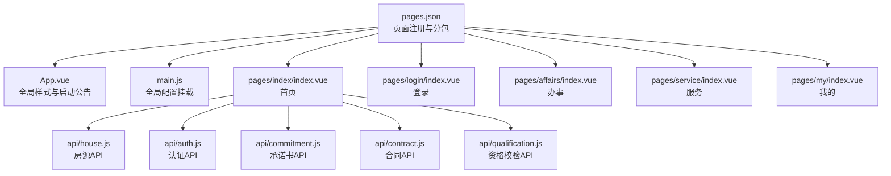
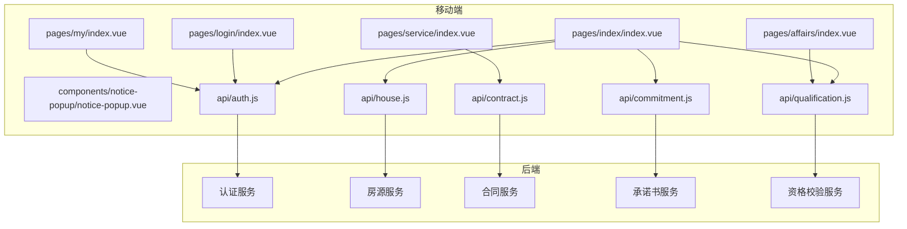
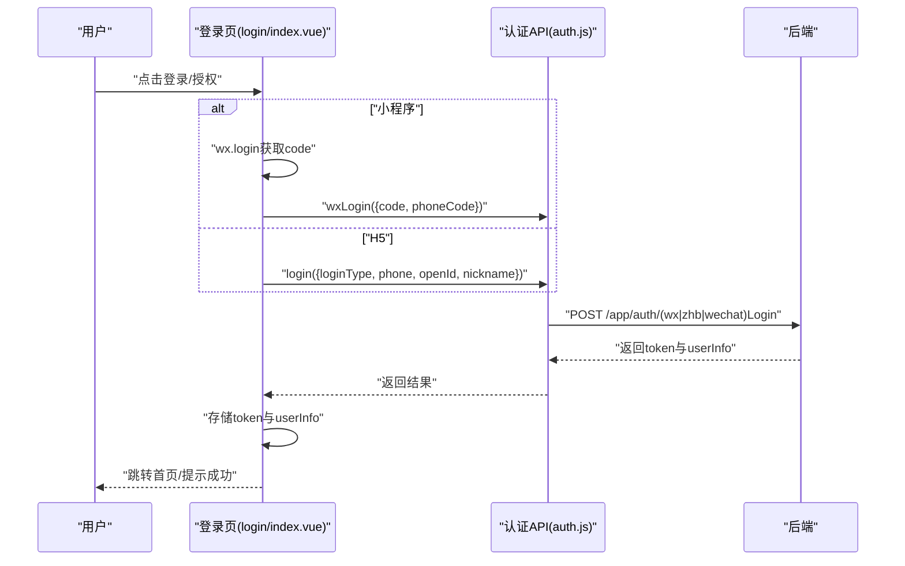
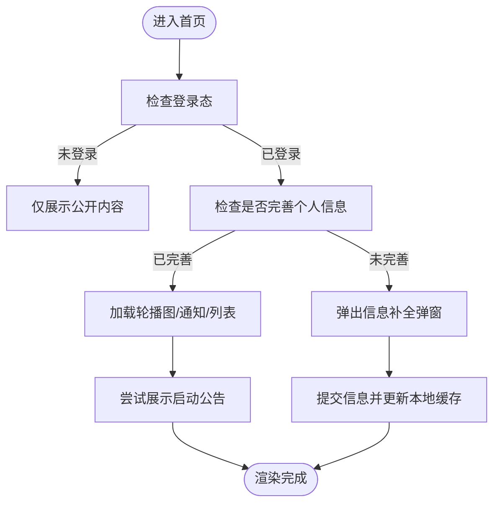
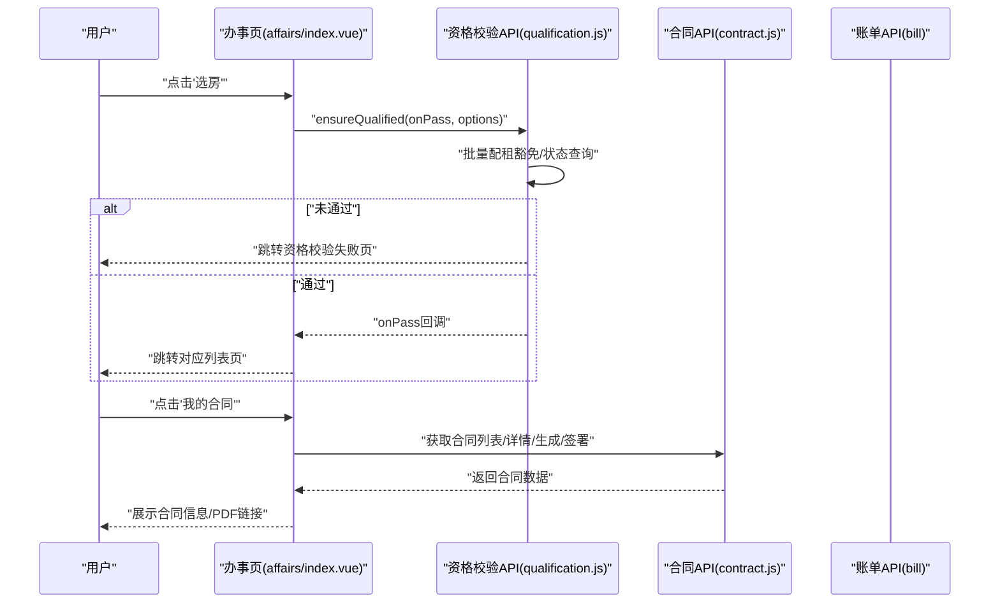
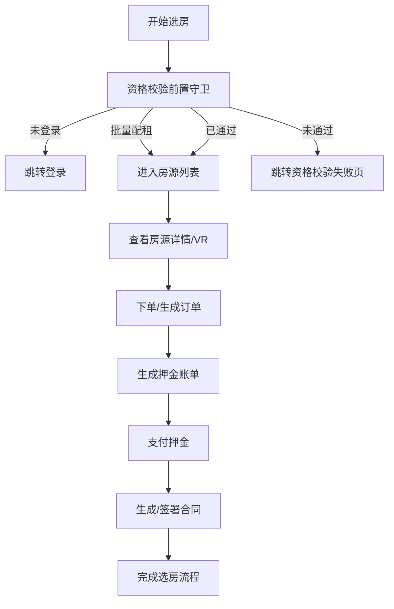
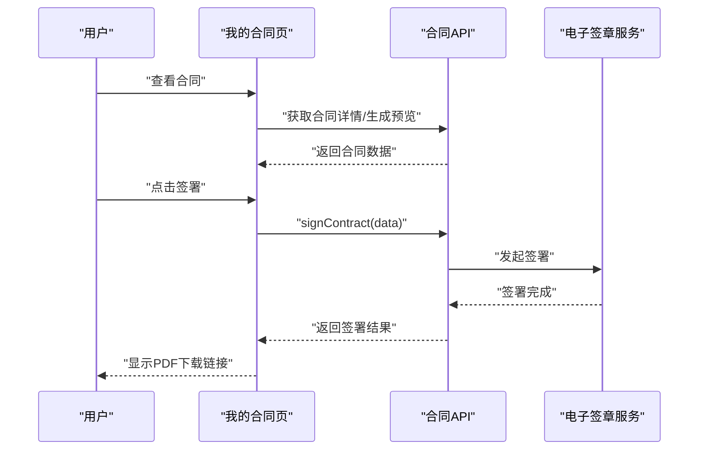
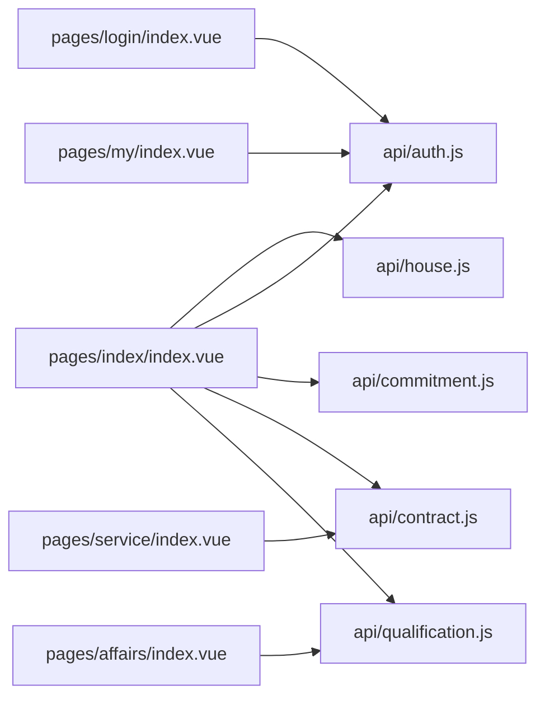

# 移动端功能模块

<cite>
**本文引用的文件**
- [pages.json](file://uniapp-h5/pages.json)
- [App.vue](file://uniapp-h5/App.vue)
- [main.js](file://uniapp-h5/main.js)
- [login/index.vue](file://uniapp-h5/pages/login/index.vue)
- [index/index.vue](file://uniapp-h5/pages/index/index.vue)
- [affairs/index.vue](file://uniapp-h5/pages/affairs/index.vue)
- [service/index.vue](file://uniapp-h5/pages/service/index.vue)
- [my/index.vue](file://uniapp-h5/pages/my/index.vue)
- [auth.js](file://uniapp-h5/api/auth.js)
- [commitment.js](file://uniapp-h5/api/commitment.js)
- [contract.js](file://uniapp-h5/api/contract.js)
- [house.js](file://uniapp-h5/api/house.js)
- [qualification.js](file://uniapp-h5/api/qualification.js)
</cite>

## 目录
1. [简介](#简介)
2. [项目结构](#项目结构)
3. [核心组件](#核心组件)
4. [架构总览](#架构总览)
5. [详细组件分析](#详细组件分析)
6. [依赖分析](#依赖分析)
7. [性能考虑](#性能考虑)
8. [故障排查指南](#故障排查指南)
9. [结论](#结论)
10. [附录](#附录)

## 简介
本文件面向港好住信息系统移动端（H5/小程序），系统性梳理并说明移动端的8大核心功能模块：用户登录认证模块、首页模块、办事模块（人才公寓、保租房、市场租赁）、服务模块、企业客户模块、我的模块。文档覆盖各模块功能点、业务流程、用户交互设计、移动端与后台的数据交互关系与API调用方式，并提供流程图、依赖关系图与实现要点，帮助产品经理明确功能规格，帮助开发团队高效落地。

## 项目结构
移动端基于 uni-app（H5/小程序）构建，采用分包策略组织页面与子模块，主包负责基础路由与公共资源，子包承载高耦合或高频功能，降低首屏体积与加载压力。页面注册集中于 pages.json，全局样式与字体在 App.vue 中统一注入，应用入口在 main.js 中完成配置挂载。

图表来源
- [pages.json:1-324](file://uniapp-h5/pages.json#L1-L324)
- [App.vue:1-98](file://uniapp-h5/App.vue#L1-L98)
- [main.js:1-30](file://uniapp-h5/main.js#L1-L30)

章节来源
- [pages.json:1-324](file://uniapp-h5/pages.json#L1-L324)
- [App.vue:1-98](file://uniapp-h5/App.vue#L1-L98)
- [main.js:1-30](file://uniapp-h5/main.js#L1-L30)

## 核心组件
- 页面与导航：首页、登录、办事、服务、我的、各类子页面（如资格校验、入住/退租、合同、报修、企业客户等）。
- API 层：认证、承诺书、合同、房源、资格校验等模块化封装，统一通过 request 工具发起 HTTP 请求。
- 全局能力：启动公告弹窗、字体注入、全局配置挂载、功能开关（feature flags）控制。

章节来源
- [pages.json:1-324](file://uniapp-h5/pages.json#L1-L324)
- [index/index.vue:1-800](file://uniapp-h5/pages/index/index.vue#L1-L800)
- [login/index.vue:1-443](file://uniapp-h5/pages/login/index.vue#L1-L443)
- [affairs/index.vue:1-291](file://uniapp-h5/pages/affairs/index.vue#L1-L291)
- [service/index.vue:1-209](file://uniapp-h5/pages/service/index.vue#L1-L209)
- [my/index.vue:1-340](file://uniapp-h5/pages/my/index.vue#L1-L340)
- [auth.js:1-55](file://uniapp-h5/api/auth.js#L1-L55)
- [commitment.js:1-35](file://uniapp-h5/api/commitment.js#L1-L35)
- [contract.js:1-86](file://uniapp-h5/api/contract.js#L1-L86)
- [house.js:1-58](file://uniapp-h5/api/house.js#L1-L58)
- [qualification.js:1-161](file://uniapp-h5/api/qualification.js#L1-L161)

## 架构总览
移动端采用“页面-组件-API-后端”四层架构：
- 页面层：承载业务视图与交互逻辑。
- 组件层：通用组件（如公告弹窗）复用。
- API 层：对后端接口进行语义化封装，统一错误处理与参数传递。
- 后端：提供认证、房源、合同、资格校验等能力。

图表来源
- [index/index.vue:1-800](file://uniapp-h5/pages/index/index.vue#L1-L800)
- [login/index.vue:1-443](file://uniapp-h5/pages/login/index.vue#L1-L443)
- [affairs/index.vue:1-291](file://uniapp-h5/pages/affairs/index.vue#L1-L291)
- [service/index.vue:1-209](file://uniapp-h5/pages/service/index.vue#L1-L209)
- [my/index.vue:1-340](file://uniapp-h5/pages/my/index.vue#L1-L340)
- [auth.js:1-55](file://uniapp-h5/api/auth.js#L1-L55)
- [house.js:1-58](file://uniapp-h5/api/house.js#L1-L58)
- [contract.js:1-86](file://uniapp-h5/api/contract.js#L1-L86)
- [commitment.js:1-35](file://uniapp-h5/api/commitment.js#L1-L35)
- [qualification.js:1-161](file://uniapp-h5/api/qualification.js#L1-L161)

## 详细组件分析

### 用户登录认证模块
- 功能点
  - 微信小程序一键登录（手机号授权）、H5 手机号登录。
  - 登录协议勾选与隐私政策跳转。
  - 登录成功后存储 token 与用户信息，跳转首页并触发信息补全弹窗。
  - 退出登录。
- 业务流程
  - 用户同意协议后，小程序通过 wx.login 获取 code 并结合手机号授权码调用后端登录接口；H5 直接提交手机号登录。
  - 登录成功后写入本地缓存，首页根据 isInfoCompleted 决定是否弹出信息补全。
- 关键API
  - 登录、微信登录、获取用户信息、更新用户信息、退出登录。
- 用户交互设计
  - 登录页提供返回入口，满足小程序审核要求；协议勾选为必选项。
  - 登录态缺失时，部分功能页通过 ensureQualified 进行前置守卫。

图表来源
- [login/index.vue:115-230](file://uniapp-h5/pages/login/index.vue#L115-L230)
- [auth.js:11-54](file://uniapp-h5/api/auth.js#L11-L54)

章节来源
- [login/index.vue:1-443](file://uniapp-h5/pages/login/index.vue#L1-L443)
- [auth.js:1-55](file://uniapp-h5/api/auth.js#L1-L55)

### 首页模块
- 功能点
  - 启动公告弹窗（承诺书模板，每次启动弹一次）。
  - 个人信息补全弹窗（登录后未完善资料时弹出）。
  - 轮播图、通知滚动、功能图标网格、分类标签（人才公寓/保租房/市场租赁）。
  - 项目与房源列表展示，支持切换分类与子标签。
- 业务流程
  - App.onLaunch 拉取启动公告，首页 onShow 时尝试展示；用户可关闭但不会本地记忆。
  - 个人信息补全弹窗仅在 isInfoCompleted=false 时出现，提交后更新本地缓存并关闭弹窗。
  - 图标点击区分公开浏览与需登录功能，登录态缺失时跳转登录页。
- 关键API
  - 轮播图、最新通知、项目列表、房源列表、更新用户信息。

图表来源
- [index/index.vue:302-420](file://uniapp-h5/pages/index/index.vue#L302-L420)
- [App.vue:9-38](file://uniapp-h5/App.vue#L9-L38)

章节来源
- [index/index.vue:1-800](file://uniapp-h5/pages/index/index.vue#L1-L800)
- [App.vue:1-98](file://uniapp-h5/App.vue#L1-L98)

### 办事模块（人才公寓/保租房/市场租赁）
- 功能点
  - 三大板块功能入口（资格申诉、选房、入住/退租、续租、账单缴费、我的合同、开票、我的预约、合住人申请、调换房申请）。
  - 根据 feature flags 控制板块与功能可见性。
- 业务流程
  - 点击功能图标跳转至对应子页面；选房根据类型跳转到不同列表页。
  - 入住/退租/续租/账单/合同/发票等流程涉及资格校验前置守卫与后端接口联动。
- 关键API
  - 资格校验状态查询、触发校验、批量配租豁免、合同列表/生成/签署/续租、账单/押金支付、发票申请与状态查询等。

图表来源
- [affairs/index.vue:78-198](file://uniapp-h5/pages/affairs/index.vue#L78-L198)
- [qualification.js:60-101](file://uniapp-h5/api/qualification.js#L60-L101)
- [contract.js:11-85](file://uniapp-h5/api/contract.js#L11-L85)

章节来源
- [affairs/index.vue:1-291](file://uniapp-h5/pages/affairs/index.vue#L1-L291)
- [qualification.js:1-161](file://uniapp-h5/api/qualification.js#L1-L161)
- [contract.js:1-86](file://uniapp-h5/api/contract.js#L1-L86)

### 服务模块
- 功能点
  - 投诉与建议、物业报修、企业客户入口。
- 业务流程
  - 点击服务卡片跳转至对应子页面；部分功能预留扩展。
- 关键API
  - 投诉/报修/企业客户相关接口（具体实现位于 subpkg/service 下）。

章节来源
- [service/index.vue:1-209](file://uniapp-h5/pages/service/index.vue#L1-L209)

### 企业客户模块
- 功能点
  - 企业客户专属入口，便于批量租户与企业相关事务处理。
- 业务流程
  - 点击进入企业客户服务页，后续流程由后端接口支撑。

章节来源
- [service/index.vue:65-68](file://uniapp-h5/pages/service/index.vue#L65-L68)

### 我的模块
- 功能点
  - 用户信息展示与编辑、我的消息、我的房源、我的合同、申诉记录、信息维护、优惠券、关于我们。
  - 未登录状态下点击需登录的菜单项自动跳转登录页。
- 业务流程
  - 登录后拉取用户信息并脱敏手机号；头像处理本地默认与后端静态资源。
  - 菜单点击区分登录态与非登录态，部分页面（如实名认证）在未认证时引导前往认证。
- 关键API
  - 获取用户信息、更新用户信息、头像处理、手机号脱敏等。

章节来源
- [my/index.vue:1-340](file://uniapp-h5/pages/my/index.vue#L1-L340)

### 在线选房流程（概念流程）
- 流程说明
  - 用户在首页或办事页进入相应项目/房源列表，点击“选房”后触发资格校验前置守卫；通过后进入选房页面，完成房源选择与订单生成，随后进入支付与合同签署流程。
- 关键环节
  - 资格校验前置守卫（批量配租豁免、状态查询、失败页跳转）。
  - 房源列表与详情（图片、VR、设施、价格）。
  - 押金账单与支付。
  - 合同生成与签署。

[此图为概念流程，不直接映射具体代码文件]

### 合同签署流程（概念流程）
- 流程说明
  - 用户在“我的合同”中查看合同，若未签署则进入签署流程；签署完成后可获取 PDF 下载链接。
- 关键环节
  - 合同生成与预览。
  - 签署接口调用。
  - PDF 链接刷新（避免过期）。

[此图为概念流程，不直接映射具体代码文件]

## 依赖分析
- 页面与分包
  - pages.json 统一注册页面与分包，首页与登录为主包核心，其余功能以 subpkg 形式拆分。
- 组件与API
  - 首页依赖房源、认证、承诺书、合同、资格校验等API；登录页依赖认证API；办事页依赖资格校验与合同API；我的页依赖认证与用户信息API。
- 全局能力
  - App.vue 注入字体与启动公告；main.js 挂载全局配置，供所有组件访问。

图表来源
- [pages.json:1-324](file://uniapp-h5/pages.json#L1-L324)
- [index/index.vue:1-800](file://uniapp-h5/pages/index/index.vue#L1-L800)
- [login/index.vue:1-443](file://uniapp-h5/pages/login/index.vue#L1-L443)
- [affairs/index.vue:1-291](file://uniapp-h5/pages/affairs/index.vue#L1-L291)
- [service/index.vue:1-209](file://uniapp-h5/pages/service/index.vue#L1-L209)
- [my/index.vue:1-340](file://uniapp-h5/pages/my/index.vue#L1-L340)
- [house.js:1-58](file://uniapp-h5/api/house.js#L1-L58)
- [auth.js:1-55](file://uniapp-h5/api/auth.js#L1-L55)
- [commitment.js:1-35](file://uniapp-h5/api/commitment.js#L1-L35)
- [contract.js:1-86](file://uniapp-h5/api/contract.js#L1-L86)
- [qualification.js:1-161](file://uniapp-h5/api/qualification.js#L1-L161)

章节来源
- [pages.json:1-324](file://uniapp-h5/pages.json#L1-L324)

## 性能考虑
- 分包策略：将高频子模块放入 subpkg，减少主包体积，提升首屏加载速度。
- 图片优化：首页图片统一处理（本地/静态/后端静态资源），避免跨域与重复请求。
- 缓存与本地存储：登录态、用户信息、资格校验状态合理利用本地缓存，减少重复请求。
- 字体注入：全局字体在 App.vue 中一次性注入，避免重复声明。

[本节为通用建议，不直接分析具体文件]

## 故障排查指南
- 登录失败
  - 检查协议勾选、手机号输入合法性、网络状态；小程序场景检查 wx.login 与授权回调。
- 资格校验异常
  - 使用 ensureQualified 的兜底逻辑，若无法读取状态则跳转资格校验进度页；关注批量配租豁免逻辑。
- 合同/PDF 下载失败
  - 合同PDF链接需实时刷新，确保调用获取PDF链接接口后再下载。
- 首页公告不显示
  - 确认 App.onLaunch 已拉取公告并广播事件；首页 onShow 时尝试展示。

章节来源
- [login/index.vue:115-230](file://uniapp-h5/pages/login/index.vue#L115-L230)
- [qualification.js:60-101](file://uniapp-h5/api/qualification.js#L60-L101)
- [contract.js:72-74](file://uniapp-h5/api/contract.js#L72-L74)
- [App.vue:9-38](file://uniapp-h5/App.vue#L9-L38)

## 结论
移动端以清晰的页面分层与模块化API为基础，围绕“登录认证—首页—办事—服务—我的”的主线串联核心业务。通过资格校验前置守卫、合同/承诺书签署、房源与账单闭环，形成完整的租住服务链路。建议在后续迭代中持续完善企业客户、报修、投诉等功能，并加强埋点与监控以优化用户体验与稳定性。

[本节为总结性内容，不直接分析具体文件]

## 附录
- 功能优先级建议
  - 高优先：登录认证、首页、资格校验、合同/承诺书、选房与支付、我的信息。
  - 中优先：办事子流程（入住/退租/续租/发票/预约/调换房）、服务（报修/投诉）、企业客户。
  - 低优先：地图找房、政策文件、优惠券、资料上传等。
- 用户体验设计要点
  - 登录页必须提供返回/取消入口；协议勾选为必选项。
  - 首页公告与信息补全弹窗需简洁明确，避免阻断核心路径。
  - 资格校验失败页提供清晰原因与申诉入口。
  - 合同/承诺书签署流程提供进度提示与重试机制。

[本节为通用建议，不直接分析具体文件]