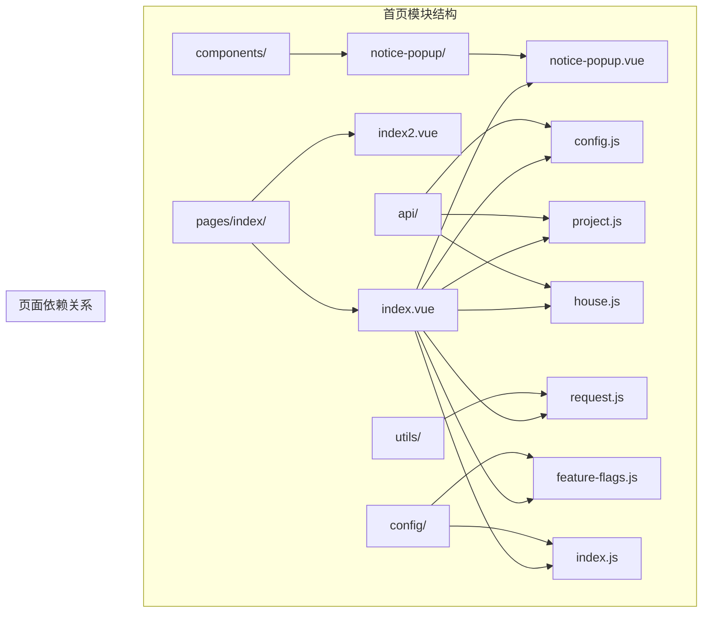
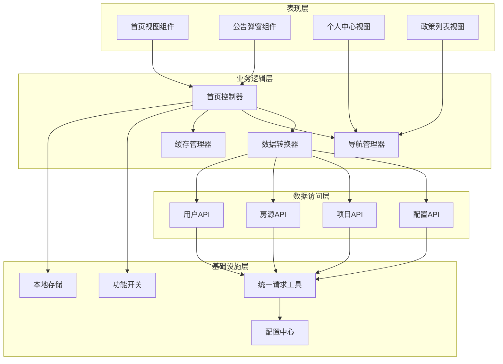
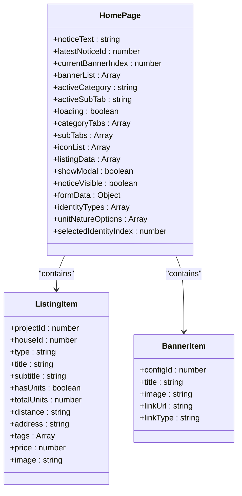
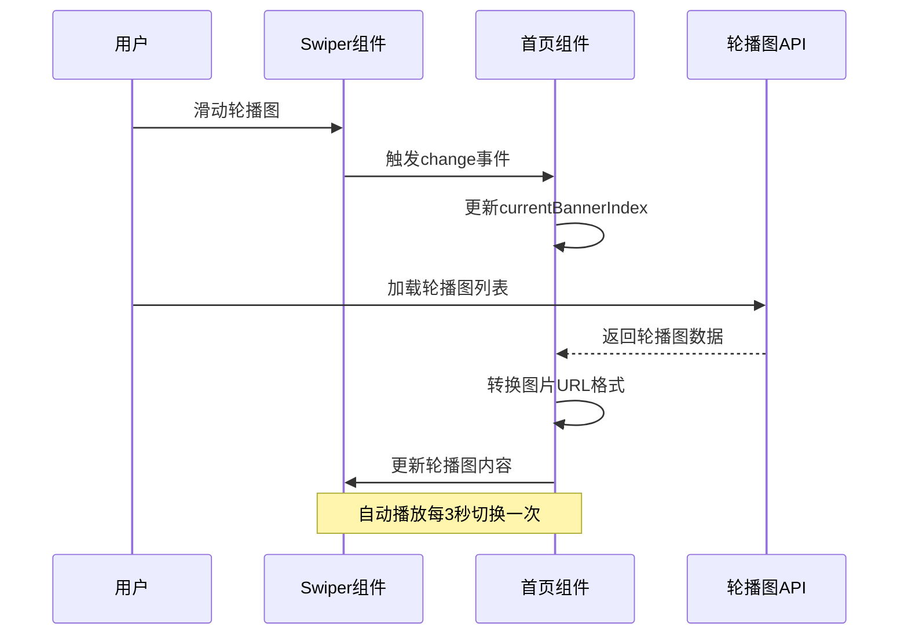
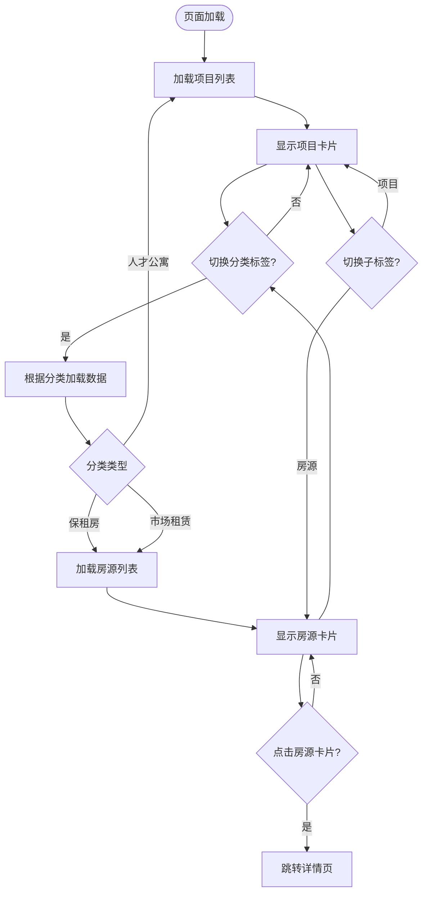
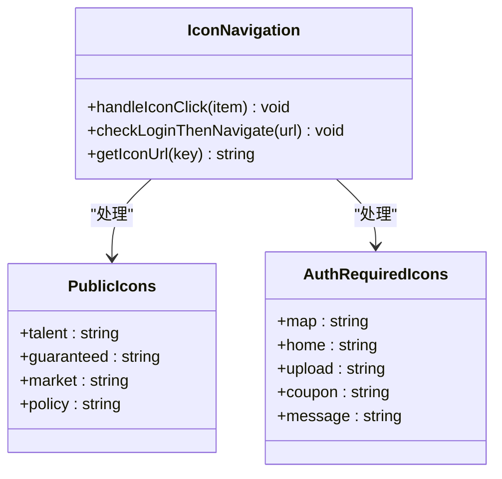
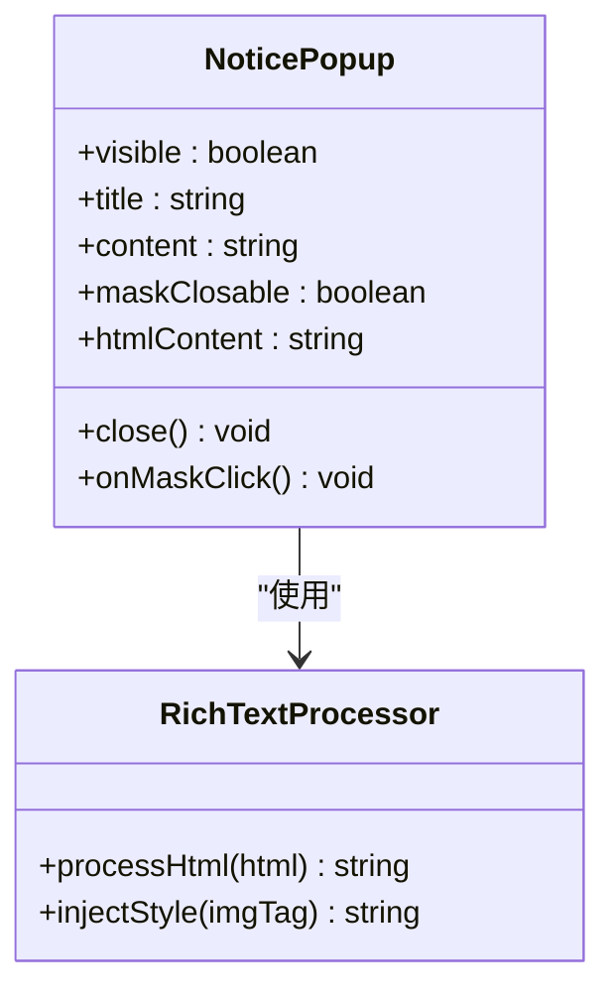
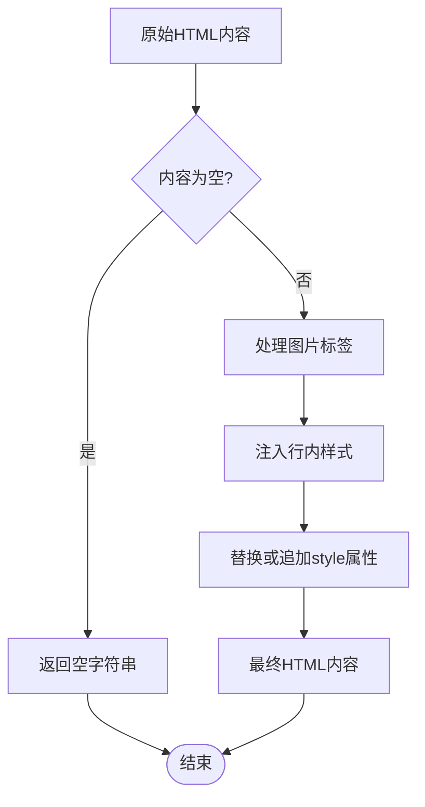
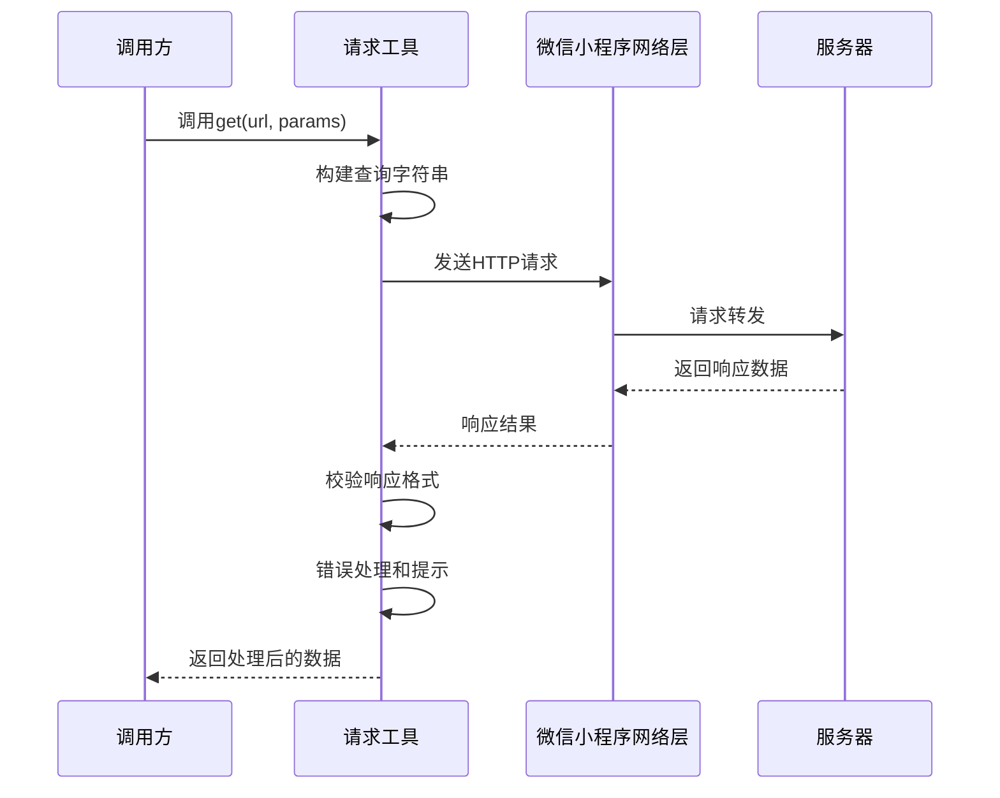
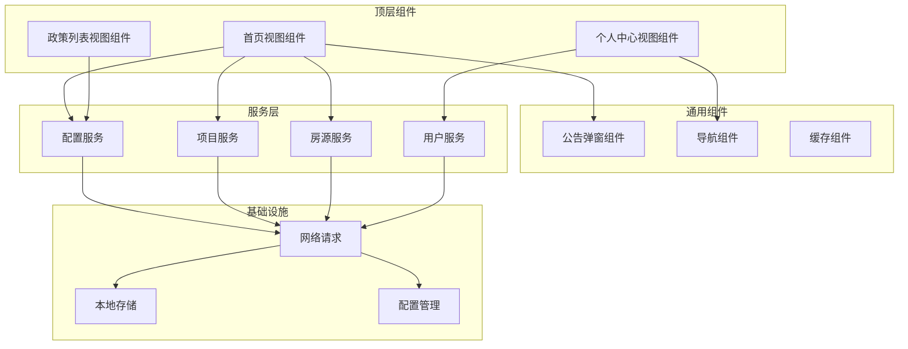

# 首页模块

<cite>
**本文档引用的文件**
- [首页/index.vue](file://uniapp-h5/pages/index/index.vue)
- [首页/index2.vue](file://uniapp-h5/pages/index/index2.vue)
- [个人中心/my/index.vue](file://uniapp-h5/pages/my/index.vue)
- [政策列表/policy/index.vue](file://uniapp-h5/pages/policy/index.vue)
- [公告弹窗组件/notice-popup.vue](file://uniapp-h5/components/notice-popup/notice-popup.vue)
- [运营配置API/config.js](file://uniapp-h5/api/config.js)
- [项目管理API/project.js](file://uniapp-h5/api/project.js)
- [房源管理API/house.js](file://uniapp-h5/api/house.js)
- [统一请求工具/request.js](file://uniapp-h5/utils/request.js)
- [配置中心/index.js](file://uniapp-h5/config/index.js)
- [功能开关/feature-flags.js](file://uniapp-h5/config/feature-flags.js)
</cite>

## 目录
1. [简介](#简介)
2. [项目结构](#项目结构)
3. [核心组件](#核心组件)
4. [架构概览](#架构概览)
5. [详细组件分析](#详细组件分析)
6. [依赖关系分析](#依赖关系分析)
7. [性能考虑](#性能考虑)
8. [故障排除指南](#故障排除指南)
9. [结论](#结论)
10. [附录](#附录)

## 简介
港好住信息系统移动端首页模块是用户进入应用后的第一个界面，承担着信息聚合、功能导航、用户体验优化等核心职责。该模块通过精心设计的信息架构，将房源推荐、政策公告、活动通知、个人中心快捷入口等功能有机整合，为用户提供一站式的服务入口。

首页模块采用响应式设计，适配不同屏幕尺寸的移动设备，通过轮播图展示重要信息，通过九宫格图标提供快速功能入口，通过房源卡片展示精选内容，并通过通知栏实时推送最新动态。整个设计遵循港好住的品牌视觉规范，确保用户在各个功能间的流畅切换。

## 项目结构
首页模块位于UniApp项目的pages目录下，采用模块化的文件组织方式：

**图表来源**
- [首页/index.vue:1-800](file://uniapp-h5/pages/index/index.vue#L1-L800)
- [首页/index2.vue:1-800](file://uniapp-h5/pages/index/index2.vue#L1-L800)
- [公告弹窗组件/notice-popup.vue:1-166](file://uniapp-h5/components/notice-popup/notice-popup.vue#L1-L166)

**章节来源**
- [首页/index.vue:1-800](file://uniapp-h5/pages/index/index.vue#L1-L800)
- [首页/index2.vue:1-800](file://uniapp-h5/pages/index/index2.vue#L1-L800)

## 核心组件
首页模块由多个核心组件协同工作，形成完整的功能体系：

### 1. 首页主界面组件
首页主界面采用Vue.js单文件组件形式，包含以下主要功能区域：
- **启动公告弹窗**：用于展示系统重要通知和承诺书
- **个人信息弹窗**：引导用户完善个人信息
- **滚动内容区域**：承载所有信息展示和交互功能
- **Hero轮播图**：展示重要广告和活动信息
- **功能图标网格**：提供快捷功能入口
- **通知栏**：实时显示最新公告
- **房源列表区域**：展示项目和房源信息

### 2. 公告弹窗组件
独立的公告弹窗组件提供统一的通知展示体验，支持HTML内容渲染和富文本展示。

### 3. API接口层
通过专门的API模块管理所有后端接口调用，包括配置管理、项目查询、房源管理等功能。

**章节来源**
- [首页/index.vue:214-772](file://uniapp-h5/pages/index/index.vue#L214-L772)
- [公告弹窗组件/notice-popup.vue:27-67](file://uniapp-h5/components/notice-popup/notice-popup.vue#L27-L67)

## 架构概览
首页模块采用分层架构设计，确保代码的可维护性和扩展性：

**图表来源**
- [首页/index.vue:214-772](file://uniapp-h5/pages/index/index.vue#L214-L772)
- [统一请求工具/request.js:20-71](file://uniapp-h5/utils/request.js#L20-L71)
- [配置中心/index.js:53-63](file://uniapp-h5/config/index.js#L53-L63)

## 详细组件分析

### 首页主界面组件分析

#### 数据结构设计
首页组件采用响应式数据绑定，主要数据结构包括：

**图表来源**
- [首页/index.vue:226-282](file://uniapp-h5/pages/index/index.vue#L226-L282)
- [首页/index.vue:473-550](file://uniapp-h5/pages/index/index.vue#L473-L550)

#### 核心功能流程

##### 轮播图组件实现
轮播图采用微信小程序的swiper组件，具备自动播放、指示点显示、点击切换等功能：

**图表来源**
- [首页/index.vue:98-111](file://uniapp-h5/pages/index/index.vue#L98-L111)
- [首页/index.vue:424-426](file://uniapp-h5/pages/index/index.vue#L424-L426)
- [首页/index.vue:685-704](file://uniapp-h5/pages/index/index.vue#L685-L704)

##### 房源列表展示逻辑
首页支持两种房源展示模式：项目模式和房源模式，通过分类标签进行切换：

**图表来源**
- [首页/index.vue:432-466](file://uniapp-h5/pages/index/index.vue#L432-L466)
- [首页/index.vue:503-532](file://uniapp-h5/pages/index/index.vue#L503-L532)
- [首页/index.vue:636-649](file://uniapp-h5/pages/index/index.vue#L636-L649)

##### 功能图标导航系统
首页提供九宫格图标作为快捷入口，支持公开功能和需要登录的功能：

**图表来源**
- [首页/index.vue:599-627](file://uniapp-h5/pages/index/index.vue#L599-L627)
- [首页/index.vue:615-626](file://uniapp-h5/pages/index/index.vue#L615-L626)

**章节来源**
- [首页/index.vue:94-210](file://uniapp-h5/pages/index/index.vue#L94-L210)
- [首页/index.vue:432-770](file://uniapp-h5/pages/index/index.vue#L432-L770)

### 公告弹窗组件分析

#### 组件设计特点
公告弹窗组件采用独立的Vue组件形式，具有以下设计特点：

**图表来源**
- [公告弹窗组件/notice-popup.vue:28-67](file://uniapp-h5/components/notice-popup/notice-popup.vue#L28-L67)
- [公告弹窗组件/notice-popup.vue:37-54](file://uniapp-h5/components/notice-popup/notice-popup.vue#L37-L54)

#### HTML内容处理机制
组件内置智能的HTML内容处理机制，确保公告内容在不同平台的一致性：

**图表来源**
- [公告弹窗组件/notice-popup.vue:40-54](file://uniapp-h5/components/notice-popup/notice-popup.vue#L40-L54)

**章节来源**
- [公告弹窗组件/notice-popup.vue:1-166](file://uniapp-h5/components/notice-popup/notice-popup.vue#L1-L166)

### API接口层分析

#### 统一请求工具设计
首页模块采用统一的请求工具，提供标准化的HTTP通信能力：

**图表来源**
- [统一请求工具/request.js:76-89](file://uniapp-h5/utils/request.js#L76-L89)
- [统一请求工具/request.js:20-71](file://uniapp-h5/utils/request.js#L20-L71)

#### API接口分类
首页模块涉及的API接口按照功能分为以下几类：

| 接口类别 | 文件 | 主要功能 | 参数 |
|---------|------|----------|------|
| 运营配置 | config.js | 轮播图、通知、图标配置 | 无 |
| 项目管理 | project.js | 项目列表查询、详情获取 | 项目类型、分页参数 |
| 房源管理 | house.js | 房源列表查询、详情获取 | 项目类型、限制数量 |
| 用户管理 | user.js | 用户信息查询、更新 | 用户ID |

**章节来源**
- [运营配置API/config.js:1-37](file://uniapp-h5/api/config.js#L1-L37)
- [项目管理API/project.js:1-37](file://uniapp-h5/api/project.js#L1-L37)
- [房源管理API/house.js:1-58](file://uniapp-h5/api/house.js#L1-L58)
- [统一请求工具/request.js:1-135](file://uniapp-h5/utils/request.js#L1-L135)

## 依赖关系分析

### 组件间依赖关系
首页模块的组件间依赖关系呈现清晰的层次结构：

**图表来源**
- [首页/index.vue:222-225](file://uniapp-h5/pages/index/index.vue#L222-L225)
- [个人中心/my/index.vue:46-48](file://uniapp-h5/pages/my/index.vue#L46-L48)
- [政策列表/policy/index.vue:34-35](file://uniapp-h5/pages/policy/index.vue#L34-L35)

### 外部依赖分析
首页模块对外部依赖主要体现在以下几个方面：

1. **UniApp框架**：基于Vue.js生态和UniApp跨平台框架
2. **微信小程序API**：利用微信小程序的原生能力
3. **后端服务**：通过RESTful API与后端服务通信
4. **第三方库**：使用轻量级的工具函数和组件

**章节来源**
- [首页/index.vue:214-225](file://uniapp-h5/pages/index/index.vue#L214-L225)
- [配置中心/index.js:53-63](file://uniapp-h5/config/index.js#L53-L63)

## 性能考虑

### 数据加载优化策略
首页模块采用了多种性能优化策略来提升用户体验：

#### 1. 懒加载机制
- **轮播图延迟加载**：仅在页面可见时加载轮播图数据
- **房源列表虚拟滚动**：大量房源时采用虚拟滚动减少DOM节点
- **图片懒加载**：使用Intersection Observer实现图片懒加载

#### 2. 缓存策略
- **内存缓存**：将已加载的数据缓存在内存中
- **本地存储缓存**：利用localStorage缓存常用配置
- **条件缓存**：根据数据更新频率设置不同的缓存策略

#### 3. 网络优化
- **请求合并**：将多个小请求合并为批量请求
- **防抖节流**：对频繁触发的操作进行防抖处理
- **连接复用**：复用HTTP连接减少握手开销

### 渲染性能优化
- **组件拆分**：将复杂页面拆分为多个独立组件
- **响应式更新**：使用Vue的响应式系统精确控制更新范围
- **事件委托**：对大量元素使用事件委托减少监听器数量

## 故障排除指南

### 常见问题及解决方案

#### 1. 数据加载失败
**问题描述**：首页数据无法正常加载
**可能原因**：
- 网络连接异常
- 后端服务不可用
- 接口参数错误

**解决步骤**：
1. 检查网络连接状态
2. 验证API接口地址配置
3. 查看控制台错误日志
4. 重试请求或降级处理

#### 2. 图片显示异常
**问题描述**：轮播图或房源图片无法正常显示
**可能原因**：
- 图片URL格式不正确
- 图片服务器访问受限
- 图片格式不支持

**解决步骤**：
1. 验证图片URL格式
2. 检查图片服务器状态
3. 转换为标准图片格式
4. 使用占位符图片

#### 3. 功能导航异常
**问题描述**：点击功能图标无响应或跳转错误
**可能原因**：
- 导航URL配置错误
- 登录状态检查逻辑异常
- 页面路由配置问题

**解决步骤**：
1. 检查图标URL映射表
2. 验证登录状态检测逻辑
3. 测试页面路由配置
4. 添加错误边界处理

**章节来源**
- [统一请求工具/request.js:42-67](file://uniapp-h5/utils/request.js#L42-L67)
- [首页/index.vue:376-420](file://uniapp-h5/pages/index/index.vue#L376-L420)

## 结论
港好住信息系统移动端首页模块通过精心设计的架构和丰富的功能特性，为用户提供了优质的移动端服务体验。模块采用现代化的前端技术栈，实现了良好的性能表现和可维护性。

首页模块的核心优势包括：
1. **功能完整性**：涵盖房源推荐、政策公告、活动通知、个人中心等核心功能
2. **用户体验优化**：通过轮播图、九宫格图标、智能导航等提升用户操作效率
3. **技术架构先进**：采用分层架构、组件化设计、统一API管理等最佳实践
4. **性能表现优秀**：通过多种优化策略确保页面加载速度和交互流畅性

未来可以进一步扩展的方向包括个性化推荐算法、用户偏好设置、内容推荐系统等高级功能，为用户提供更加智能化的服务体验。

## 附录

### API接口规范
首页模块使用的API接口遵循统一的规范：

| 接口名称 | 方法 | URL | 参数 | 返回值 |
|---------|------|-----|------|--------|
| 获取轮播图列表 | GET | /h5/config/banners | 无 | 轮播图数组 |
| 获取最新通知 | GET | /h5/config/latestNotice | 无 | 通知对象 |
| 按类型获取项目列表 | GET | /h5/project/listByType/{type} | type, params | 项目数组 |
| 按类型获取房源列表 | GET | /h5/app/house/listByProjectType/{type} | type, limit | 房源数组 |

### 配置参数说明
首页模块的关键配置参数：

| 配置项 | 类型 | 默认值 | 描述 |
|-------|------|--------|------|
| baseUrl | string | development.baseUrl | 后端API基础地址 |
| staticUrl | string | development.staticUrl | 静态资源访问地址 |
| timeout | number | 30000 | 请求超时时间（毫秒） |
| guaranteed | boolean | false | 保租房功能开关 |
| market | boolean | false | 市场租赁功能开关 |

### 开发规范
- **代码风格**：遵循Vue.js官方风格指南
- **组件命名**：采用PascalCase命名法
- **文件组织**：按功能模块划分文件夹结构
- **注释规范**：为关键函数和复杂逻辑添加详细注释
- **错误处理**：统一的错误处理和用户提示机制