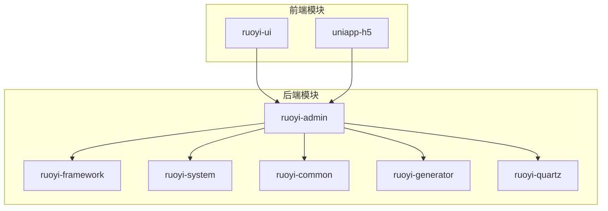
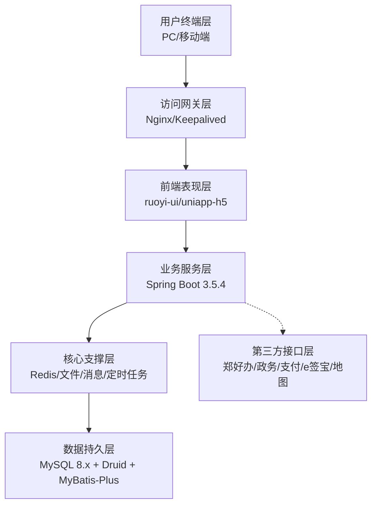
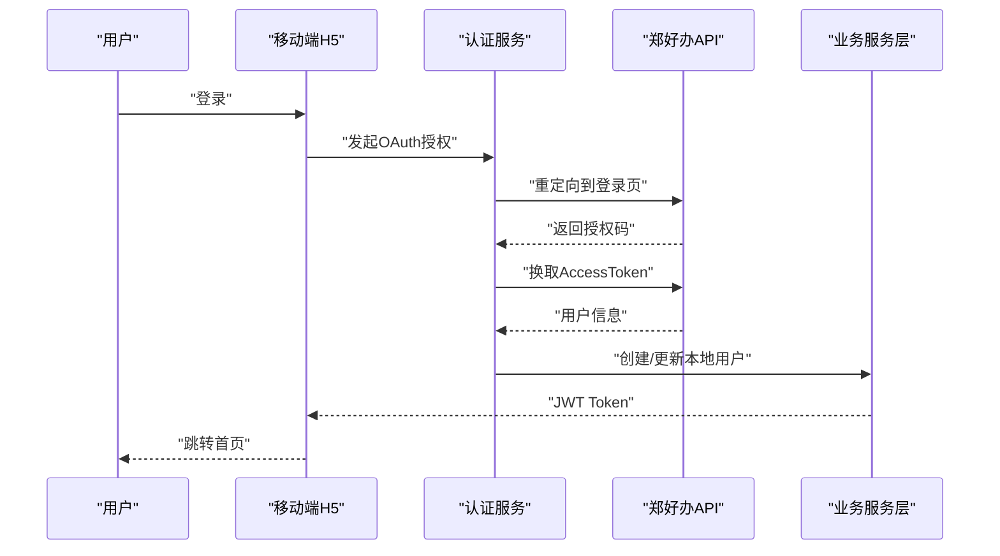
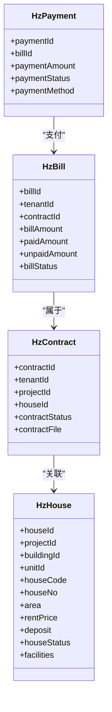
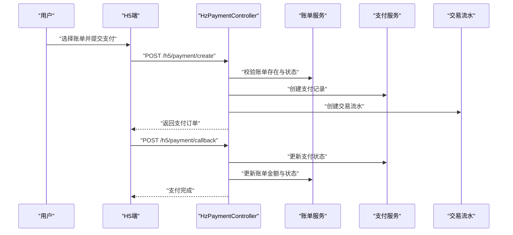
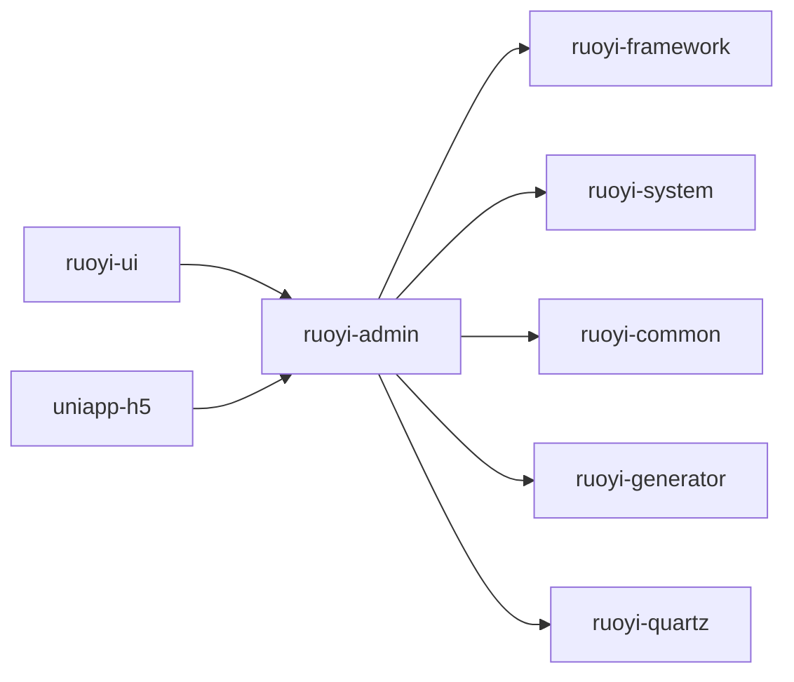

# 项目概述

<cite>
**本文档引用的文件**
- [pom.xml](file://pom.xml)
- [技术方案.md](file://技术方案.md)
- [港好住系统架构图.html](file://港好住系统架构图.html)
- [README_数据清理研究.md](file://README_数据清理研究.md)
- [application.yml](file://ruoyi-admin/src/main/resources/application.yml)
- [HzHouse.java](file://ruoyi-system/src/main/java/com/ruoyi/system/domain/HzHouse.java)
- [pages.json](file://uniapp-h5/pages.json)
- [HzContractController.java](file://ruoyi-admin/src/main/java/com/ruoyi/web/controller/system/HzContractController.java)
- [HzPaymentController.java](file://ruoyi-admin/src/main/java/com/ruoyi/web/controller/h5/HzPaymentController.java)
- [ApplicationConfig.java](file://ruoyi-framework/src/main/java/com/ruoyi/framework/config/ApplicationConfig.java)
</cite>

## 目录
1. [简介](#简介)
2. [项目结构](#项目结构)
3. [核心组件](#核心组件)
4. [架构总览](#架构总览)
5. [详细组件分析](#详细组件分析)
6. [依赖分析](#依赖分析)
7. [性能考虑](#性能考虑)
8. [故障排查指南](#故障排查指南)
9. [结论](#结论)
10. [附录](#附录)

## 简介
港好住信息系统是为郑州航空港经济综合实验区打造的保障性住房综合管理平台，覆盖人才公寓、保租房与市场租赁三大业务板块。系统采用前后端分离的七层架构，支持移动端H5、微信小程序与PC管理后台的多端协同，提供从资格校验、房源浏览、在线选房、电子合同签署、入住退租到账单缴费的全生命周期业务闭环。系统基于Spring Boot 3.5.4与若依(RuoYi)框架，结合MyBatis-Plus、Redis、MySQL、Nginx等核心技术栈，满足高并发、高可用与多端一致性的业务需求。

## 项目结构
项目采用Maven多模块聚合工程组织，后端以“ruoyi-*”为核心模块，前端分为ruoyi-ui管理后台与uniapp-h5移动端两套独立工程，配合gov-proxy对外部政务接口进行统一代理与安全管控。

- 后端模块划分
  - ruoyi-admin：应用主模块，包含启动类、路由与控制器入口
  - ruoyi-framework：安全、拦截器、AOP、Redis、MyBatis-Plus配置等基础设施
  - ruoyi-system：业务域模型与服务实现，包含69个核心实体与57个服务
  - ruoyi-common：通用注解、异常、工具类与XSS防护
  - ruoyi-generator：代码生成器
  - ruoyi-quartz：定时任务调度

- 前端模块划分
  - ruoyi-ui：PC管理后台，基于Vue 2 + Element UI
  - uniapp-h5：移动端H5与微信小程序，基于uni-app + Vue 2

**图表来源**
- [pom.xml:184-191](file://pom.xml#L184-L191)
- [港好住系统架构图.html:335-353](file://港好住系统架构图.html#L335-L353)

**章节来源**
- [pom.xml:184-191](file://pom.xml#L184-L191)
- [港好住系统架构图.html:335-353](file://港好住系统架构图.html#L335-L353)

## 核心组件
- 用户终端层：PC浏览器、移动H5、微信小程序
- 访问网关层：Nginx负载均衡、反向代理、安全防护与主备切换
- 前端表现层：ruoyi-ui管理后台、uniapp-h5移动端
- 业务服务层：房源管理、租户管理、合同管理、支付管理、工单管理、系统管理
- 核心支撑层：Redis缓存、文件服务、消息服务、定时任务
- 数据持久层：MySQL 8.x + Druid连接池 + MyBatis-Plus ORM
- 第三方接口层：郑好办OAuth、政务数据接口代理、港区支付、e签宝电子合同、地图服务

**章节来源**
- [港好住系统架构图.html:107-305](file://港好住系统架构图.html#L107-L305)

## 架构总览
系统采用七层架构，L1-L7逐层解耦，L4业务服务层通过Spring Boot微服务化思想拆分模块，L5支撑层提供公共能力，L7第三方接口层通过gov-proxy统一接入，确保安全与可治理。

**图表来源**
- [港好住系统架构图.html:107-305](file://港好住系统架构图.html#L107-L305)

## 详细组件分析

### 业务流程总览（登录→资格校验→选房签约→入住缴费→续租退租）

**图表来源**
- [技术方案.md:606-642](file://技术方案.md#L606-L642)

**章节来源**
- [技术方案.md:606-642](file://技术方案.md#L606-L642)

### 资源管理与数据模型
- 房源实体（HzHouse）包含项目、楼栋、单元、户型、面积、租金、押金、设施、状态等字段，支持导入导出与状态流转
- 支付与账单（HzBill、HzPayment、HzTransaction）形成闭环，支持部分/全额支付与回调对账
- 合同管理（HzContract、EsignService）集成e签宝，支持模板控件查询与电子签流程

**图表来源**
- [HzHouse.java:14-147](file://ruoyi-system/src/main/java/com/ruoyi/system/domain/HzHouse.java#L14-L147)
- [HzContractController.java:31-200](file://ruoyi-admin/src/main/java/com/ruoyi/web/controller/system/HzContractController.java#L31-L200)

**章节来源**
- [HzHouse.java:14-147](file://ruoyi-system/src/main/java/com/ruoyi/system/domain/HzHouse.java#L14-L147)
- [HzContractController.java:31-200](file://ruoyi-admin/src/main/java/com/ruoyi/web/controller/system/HzContractController.java#L31-L200)

### 支付流程（H5端）

**图表来源**
- [HzPaymentController.java:40-147](file://ruoyi-admin/src/main/java/com/ruoyi/web/controller/h5/HzPaymentController.java#L40-L147)

**章节来源**
- [HzPaymentController.java:40-147](file://ruoyi-admin/src/main/java/com/ruoyi/web/controller/h5/HzPaymentController.java#L40-L147)

### 多端页面与导航
- uniapp-h5采用pages.json配置页面与分包，包含首页、办事、服务、我的等Tab导航，以及子包如“办事”、“服务”、“企业客户”等业务模块
- 管理后台ruoyi-ui提供33个业务页面，覆盖资产管理、业务管理、财务管理、系统管理等

**章节来源**
- [pages.json:1-324](file://uniapp-h5/pages.json#L1-L324)

## 依赖分析
- 核心依赖
  - Spring Boot 3.5.4、Spring Security 6.x、MyBatis-Plus 3.5.9、MySQL 8.x、Druid 1.2.23、Redis、Nginx、Vue 2.6、Element UI
- Maven模块依赖关系
  - ruoyi-admin依赖framework、system、common，并引入generator与quartz
  - ruoyi-system依赖common与framework，承载69个实体与57个服务
  - ruoyi-ui与uniapp-h5分别依赖后端API

**图表来源**
- [pom.xml:184-191](file://pom.xml#L184-L191)
- [港好住系统架构图.html:335-353](file://港好住系统架构图.html#L335-L353)

**章节来源**
- [pom.xml:184-191](file://pom.xml#L184-L191)
- [港好住系统架构图.html:335-353](file://港好住系统架构图.html#L335-L353)

## 性能考虑
- 前端性能
  - uniapp-h5采用分包加载、rem适配与下拉刷新，优化首屏与交互体验
  - ruoyi-ui使用Vuex与Vue Router提升页面切换性能
- 后端性能
  - MyBatis-Plus逻辑删除与分页插件减少无效查询
  - Druid连接池监控与慢SQL统计，结合Nginx限流与健康检查
  - Redis缓存热点数据（JWT、验证码、数据字典），降低数据库压力
- 数据库
  - 主从复制与读写分离，69张业务表按模块拆分，配合索引与分区策略

**章节来源**
- [application.yml:60-94](file://ruoyi-admin/src/main/resources/application.yml#L60-L94)
- [ApplicationConfig.java:17-37](file://ruoyi-framework/src/main/java/com/ruoyi/framework/config/ApplicationConfig.java#L17-L37)

## 故障排查指南
- 登录与认证
  - 检查application.yml中的郑好办网关配置与密钥参数，确认Authorization头与Token有效期
- 支付回调
  - 核对HzPaymentController的回调逻辑，确保账单状态与支付状态一致性，关注交易流水同步
- 数据迁移与清理
  - 参考数据清理研究文档，按19步顺序执行，确保外键约束与依赖关系正确
- 定时任务
  - 检查ruoyi-quartz模块的任务调度与异常日志，确保合同到期、账单生成等任务稳定运行

**章节来源**
- [application.yml:166-238](file://ruoyi-admin/src/main/resources/application.yml#L166-L238)
- [HzPaymentController.java:98-147](file://ruoyi-admin/src/main/java/com/ruoyi/web/controller/h5/HzPaymentController.java#L98-L147)
- [README_数据清理研究.md:155-172](file://README_数据清理研究.md#L155-L172)

## 结论
港好住信息系统以“业务驱动、技术赋能”为核心，围绕人才公寓、保租房与市场租赁三大场景，构建了覆盖全生命周期的数字化管理体系。通过前后端分离、多端协同与统一的业务服务层，系统实现了高扩展性与高可用性，为港区保障性住房的规范化、智能化管理提供了坚实支撑。

## 附录
- 技术栈速览
  - 后端：Spring Boot 3.5.4、Spring Security 6.x、MyBatis-Plus 3.5.9、MySQL 8.x、Druid、Redis
  - 前端：Vue 2.6、Element UI、uni-app + Vue 2
  - 文档：SpringDoc OpenAPI 2.8
  - 构建与部署：Maven + Java 17、GitHub Actions CI/CD

**章节来源**
- [港好住系统架构图.html:368-383](file://港好住系统架构图.html#L368-L383)