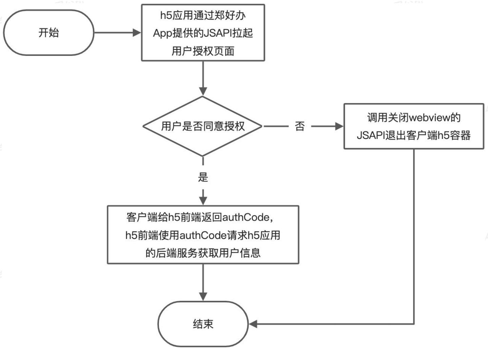
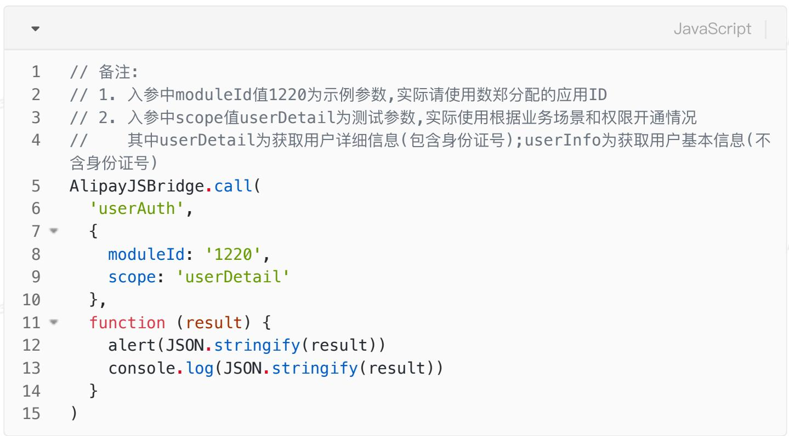
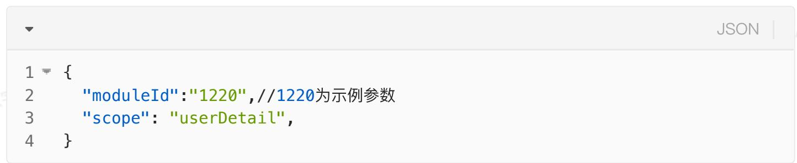
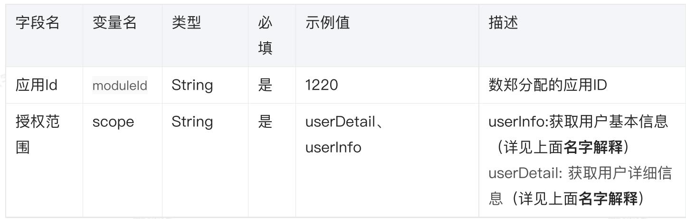

# 修改记录

# 一、功能介绍及参数解释

功能介绍

名词解释

# 二、用户授权前端流程图

# 三、用户授权流程前端涉及到的参数获取方式：

获取mouldeld:

# 四、业务方前端相关JSAPI:

1、初始化JSAPI

AlipayJSBridgeReady 调用方法代码示例：

2、获取用户授权码JSAPI

入参：

出参:

3、关闭当前WebView容器JSAPI

# 五、开发联调方式

# 六、常见问题

1、前端接入是否需要引入js

2、userAuth JSAPI测试参数

3、调用userAuth JSAPI是否需要判断用户登录态

4、用户未进行实名认证（LO用户），获取不到身份证号怎么办

5、授权码authCode是否可以重复使用，有无时间限制？

6、如何进行调试

7、其他问题

# 修改记录

<table><tr><td>日期</td><td>版本号</td><td>修订说明</td><td>修订人</td></tr><tr><td>2022.05.10</td><td>1.0.0</td><td>初始版本</td><td>王煜坤、张刚</td></tr></table>

# 一、功能介绍及参数解释

# 功能介绍

本文档旨在向接入郑好办的业务方h5提供对接流程、郑好办jsapi如何使用，业务参数如何获取及传递，提高接入业务方开发效率。

# 名词解释

h5应用、h5前端：要透出到郑好办的业务方h5

客户端：郑好办app

mouldeld：郑好办方提供的应用ID，测试参数和生产参数联系运营人员获取

用户基本信息：用户昵称，用户手机号，用户唯一标示（zid）、用户性别

用户详细信息：用户真实姓名、身份证号、用户昵称，用户手机号，用户唯一标示（zid）、用户性别

# 二、用户授权前端流程图




备注：

jsapi调用Demo下载地址: https://cdn-test.digitalcnzz.com/zhb/jsapi_test/Demo.zip

# 三、用户授权流程前端涉及到的参数获取方式：

获取mouldeld:

moduleId即应用ID，请联系运营人员获取

# 四、业务方前端相关JSAPI:

jsapi调用Demo

Demo下载地址: https://cdn-test.digitalcnzz.com/zhb/jsapi_test/Demo.zip

# 1、初始化JSAPI

当window.onload后，容器会初始化，产生全局变量AlipayJSBridge，然后触发JS Bridge

初始化完毕（AlipayJSBridgeReady）事件。AlipayJSBridge 注入是一个异步过程，因此尽可能监听window.onload事件后，再调用


AlipayJSBridgeReady 调用方法代码示例：


```html
1 <script>
2 //备注:
3 //无需另外引入js，参照下文开发联调方式生成二维码，线上郑好办扫一扫即可
4 function ready(callback) {
5 if (window.AlipayJSBridge) {
6 callback && callback();
7 } else {
8 document.addEventListener('AlipayJSBridgeReady', callback, false);
9 }
10 }
11 ready(function(){
12 alert('bridge ready');
13 });
14 </script>
```

# 2、获取用户授权码JSAPI

该JSAPI会判断用户是否登录，如果用户未登录，客户端会处理登录逻辑，前端无感知，无需前端项目主动调用登录




# 入参：

# (参数取值见下方备注)

-  $\{\text{String}\} : \text{userAuth} -$  调起native进行用户授权

- {map}: map - 请求数据

- map中的参数如下：







# 备注：

1、mouldeld的值参见文末用户授权接入流程

2、scope表示开发者需要获取的用户信息范围，两种授权范围需要单独申请后端接口调用权限

# 出参：

- {function}: function(res) {} - 回调函数

```txt
JSON
1 { 
2 "code":0, 
3 "message":"用户授权成功", 
4 "data":{ 
5 "authCode":"dsxsdfsdfs" 
6 } 
7 }
```

<table><tr><td>字段名</td><td>变量名</td><td>类型</td><td>示例值</td><td>描述</td></tr><tr><td>返回码</td><td>code</td><td>String</td><td>0</td><td>返回值:0成功1参数错误2用户取消授权无data数据3用户取消登录无data数据4授权失败,无data数据</td></tr><tr><td>返回描述</td><td>message</td><td>string</td><td>success</td><td>返回码描述</td></tr><tr><td>返回结果</td><td>data</td><td>json</td><td></td><td>返回结果</td></tr><tr><td>授权码</td><td>authCode</td><td>String</td><td></td><td>拿到授权码去换取用户token有效期10分钟</td></tr></table>

# 3、关闭当前WebView容器JSAPI

如果用户取消授权或者授权失败，可以调用JSAPI关闭当前webview容器以提升用户体验。

```javascript
JavaScript 1 AlipayJSBridge.call('popWindow');
```

# 五、开发联调方式

前端H5链接地址生成二维码，使用正式版郑好办APP扫码访问即可。（郑好办可在手机应用商店下载)

注：本地环境联调需要使用郑好办V9.9.9版本进行测试

二维码生成工具：https://cdn-test.digitalcnzz.com/zhb/jsapi_test/QRCode/index.html#/qrCode

# 六、常见问题

# 1、前端接入是否需要引入js

jsapi相关的初始化、授权、关闭等都无需另外引入js

# 2、userAuth JSAPI测试参数

moduled:

scope: userDetail

moduleld的值请联系运营人员获取

# 3、调用userAuth JSAPI是否需要判断用户登录态

前端项目调用userAuth时无需判断用户是否已登录，客户端已经处理了登录逻辑，用户未登录时会自动拉起登录，对前端无感知，因此前端无需手段判断登录

# 4、用户未进行实名认证（LO用户），获取不到身份证号怎么办

用户认证等级为LO时，接口返回的用户信息不包含身份证号等，如果应用要求用户已进行实名认证，可在未获取到身份证号时，调用实名认证JSAPI拉起用户认证页面，用户进行认证过后，再进行获取用户信息操作

拉起实名认证JSAPI如下：

# 调用代码示例

```javascript
JavaScript   
1 AlipayJSBridge.call('getonverified',{}function(result){   
2   
3 }）;
```

# 出参JSON

```txt
JSON  
1 { result':false', 3 'message':'回调信息', 4 'authLevel':'用户认证等级' 5 }
```

<table><tr><td>字段名</td><td>变量名</td><td>类型</td><td>示例值</td><td>描述</td></tr><tr><td>提示信息</td><td>message</td><td>string</td><td>页面返回成功</td><td></td></tr><tr><td>返回状态</td><td>result</td><td>string</td><td>true</td><td>用户是否已认证true是,false否</td></tr><tr><td>授权码</td><td>authCode</td><td>int</td><td>2</td><td>0未认证1:L1认证,1:L2认证</td></tr></table>

# 5、授权码authCode是否可以重复使用，有无时间限制？

不能重复使用，业务方前后端联调时，一个authCode只能用一次且每个authCode有效期是10min

# 6、如何进行调试

详见上文开发联调方式

# 7、其他问题

应用上线流程问题请联系@郑好办运营黎哲/时阳阳/龚雨处理技术对接问题请联系运营人员联系研发处理