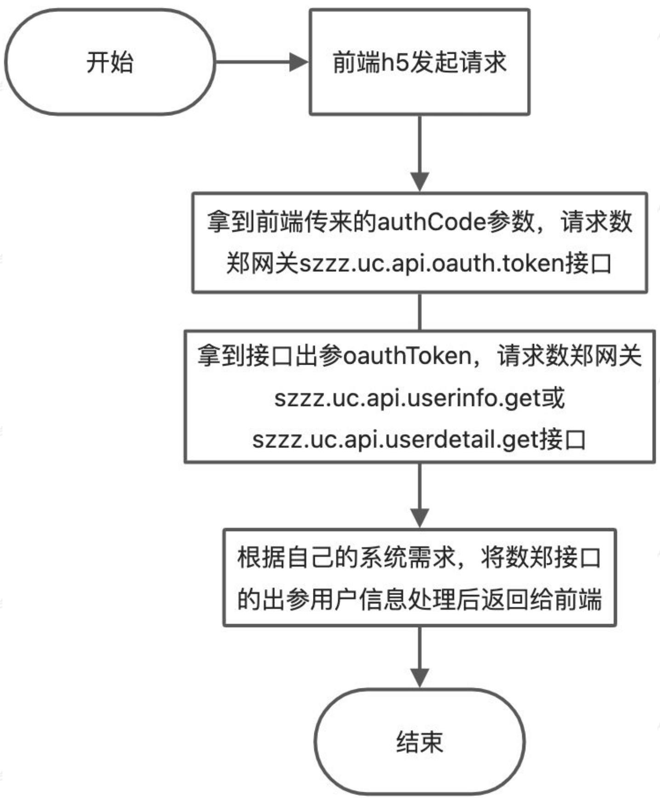

# 文档修订记录

# 一、接口功能介绍及相关参数解释

1、接口介绍

2、相关参数

scope:

authCode:

oauthToken:

grantType:

reOauthToken:

moduled:

ExpiresIn:

zid:

3、相关参数获取方式

# 二、用户授权业务方后端一般流程

1、流程图

2、Demo

# 三、接口规范与数郑网关简介

1、数郑网关简介

2、网关接口地址

3、网关必传参数

4、网关出参格式

5、网关code含义

6、接口规范

# 四、接口列表

1、获取 OAuthToken接口（szzz.uc.ai.oauth_token）

网关请求入参method值：

接口入参（SDK入参）：

接口出参 (data中的数据) :

错误码含义:

请求代码示例：

2、获取用户信息接口（szzz.uc.ai.userInfo.get/szzz.uc.ai.userdetail.get）

网关请求入参method值：

接口入参（SDK入参）：

接口出参 (data中的数据) :

错误码含义:

请求代码示例：

# 五、常见问题及解决方案

1、测试参数

2、用户未进行实名认证（LO用户），获取不到身份证号怎么办

3、接口返回401未登录

4、接口返回无权限

5、提示令牌已过期

6、调用jsapi后提示需要鉴权

7、其他问题

# 文档修订记录

<table><tr><td>日期</td><td>修订内容</td><td>版本</td><td>修订人</td></tr><tr><td>2022-05-10</td><td>接口文档规范化</td><td>V1.0.0</td><td>王煜坤</td></tr><tr><td>2025-04-03</td><td>生产网关域名替换</td><td>V.1.0.1</td><td>李洋</td></tr></table>

# 一、接口功能介绍及相关参数解释

# 1、接口介绍

该文档相关接口用于对接郑好办用户体系，获取用户信息使用。本文档共涉及三个接口：

szzz.uc.ai.oauth_token：获取用户信息鉴权token接口

szzz.uc.ai.userinfo.get：获取用户基本信息

szzz.uc.ai.userdetail.get：获取用户详细信息

其中szzz.uc.ai.oauth_token为一定会使用到的接口，另外两个接口根据业务场景可能只需要使用一个

# 2、相关参数

# scope:

授权范围，scope表示开发者需要请求用户授权的权限范围。前端调用jsapi获取authCode时传的scope需和后端请求接口时传的scope保持一致

<table><tr><td>前端scope</td><td>网关接口method值</td><td>描述</td><td>备注</td></tr><tr><td>userInfo</td><td>szzz.uc.ai.userinfo.get</td><td>获取用户基本信息（zid、手机号、昵称等信息）</td><td>需单独申请调用权限</td></tr><tr><td>userDetail</td><td>szzz.uc.ai.userdetail.get</td><td>获取用户详细信息（zid、uid，、手机、姓名、身份证号等信息）</td><td>需单独申请调用权限</td></tr></table>

# authCode:

授权码，临时的用户授权凭证（authCode单次有效，不可重复使用，有效期10分钟）。

# oauthToken:

访问令牌。通过该令牌调用需要授权类接口。

# grantType:

授权类型，支持如下类型：

- authorization_code：用户授权，此类型下传入用户授权码 authCode 换取用户授权令牌 OAuthToken，无需传入 reOauthToken。

- refresh_token: 刷新令牌，此类型下传入有效的 reOauthToken用于刷新授权令牌，无需传入 authCode。

# reOauthToken:

刷新令牌。通过该令牌可以刷新 OAuthToken（有效期30天）。

# moduleld:

开放平台分配给开发者的应用ID，由郑好办管理人员配置，开发者需要提供相应的信息。

# expiresln:

访问令牌的有效时间，单位是秒。

zid:

郑好办用户ID。

# 3、相关参数获取方式

获取mouldeld:

填写“郑好办事项服务上线申请表”，后提交给郑好办运营人员，即可获取mouldeld获取appld、ivStr、keyStr、secretKey:

1、如果应用中不涉及用户身份证号，姓名字段申请基本用户信息接口

2、如果应用中涉及用户身份证号，姓名字段申请详细用户信息接口，并且描述使用身份证号信息的场景

接口权限申请对接后，即可获取appId、ivStr、keyStr、secretKey

# 二、用户授权业务方后端一般流程

# 1、流程图




# 2、Demo

数郑提供完整流程测试Demo（Java/PHP/Python/JS版），请点击下方链接下载运行测试

JAVA Demo下载地址: https://cdn-test.digitalcnzz.com/zhb/jsapi_test/Demo.zip

后端项目需用到的jar包：https://cdn.digitalcnzz.com/pss/open-platform/static/szzz-open-gateway-sdk-1.0-SNAPSHOTJAR

Pyhton、PHP、JS、JAVA版本Demo: https://cdn-

test.digitalcnzz.com/zhb/jsapi_test/szzz_open_GATEway_demo_v1_0_0.zip

# 三、接口规范与数郑网关简介

# 1、数郑网关简介

数郑的接口通过网关进行请求；数郑提供SDK（Java版），业务方后端系统导入该jar包后，按照接口介绍中的代码示例的方式进行调用即可，无需关注内部加密逻辑和网络请求；数郑网关通过method参数区分不同的接口

# 2、网关接口地址

<table><tr><td colspan="2">Plain Text</td></tr><tr><td>1</td><td>线上访问地址</td></tr><tr><td>2</td><td>https://zhenghaoban.zzsxzspj.zhengzhou.gov.cn:10019/open/api/do</td></tr></table>

# 3、网关必传参数

<table><tr><td>属性</td><td>类型</td><td>必填</td><td>说明</td></tr><tr><td>appld</td><td>string</td><td>是</td><td>用户信息授权接口申请通过后数郑分配，注意与上述mouldeld进行区分，appld和moduleld是两个参数</td></tr><tr><td>method</td><td>string</td><td>是</td><td>接口method，下文提供</td></tr><tr><td>ivStr</td><td>string</td><td>是</td><td>网关加密参数，用户信息授权接口申请通过后数郑分配</td></tr><tr><td>keyStr</td><td>string</td><td>是</td><td>网关加密参数，用户信息授权接口申请通过后数郑分配</td></tr><tr><td>secretKey</td><td>string</td><td>是</td><td>网关加密参数，用户信息授权接口申请通过后数郑分配</td></tr><tr><td>body</td><td>string</td><td>是</td><td>接口业务参数，为JSON格式化的字符串</td></tr></table>

以上参数中：method和body根据不同接口需要的参数来传；appld、ivStr、keyStr、secretKey为数郑分配的固定参数

# 4、网关出参格式

<table><tr><td>属性</td><td>类型</td><td>必填</td><td>说明</td></tr><tr><td>code</td><td>Int</td><td>是</td><td>网关状态码</td></tr><tr><td>message</td><td>string</td><td>是</td><td>网关提示信息</td></tr><tr><td>data</td><td>object</td><td>是</td><td>接口返回的数据内容</td></tr></table>

# 5、网关code含义

<table><tr><td>code值</td><td>含义</td></tr><tr><td>0</td><td>请求成功，接口正常返回数据</td></tr><tr><td></td><td></td></tr><tr><td></td><td></td></tr></table>

# 6、接口规范

接口通信协议：HTTPS

接口编码格式：UTF-8

返回参数格式：以JSON形式返回

接口地址：https://zhenghaoban.zzsxzspj.zhengzhou.gov.cn:10019/open/api/do

备注：数郑已提供Java版本SDK，可直接使用，网络请求相关SDK已封装，无需关注请求数据格式等内容，只需对出参JSON数据和接口错误异常情况进行处理即可。

# 四、接口列表

# 1、获取 OAuthToken接口（szzz.uc api.oauth_token）

网关请求入参method值：

szzz.uc.ai.oauth.token

接口入参（SDK入参）：

<table><tr><td>属性</td><td>类型</td><td>必填</td><td>说明</td></tr><tr><td>moduleId</td><td>string</td><td>是</td><td>数郑开放平台分配给开发者的应用ID，注意与上述 appld进行区分，appld和moduleId是两个参数</td></tr><tr><td>grantType</td><td>string</td><td>是</td><td>值为authorization_code时，代表用authCode换取 oauthToken；值为refresh_token时，代表用 reOauthToken换取oauthToken。</td></tr><tr><td>authCode</td><td>string</td><td>否</td><td>授权码，用户对应用授权后得到,当grantType=authorization_code时必填。(前端调用jsapi获取并传递给后端服务)</td></tr><tr><td>reOauthToken</td><td>string</td><td>否</td><td>刷新令牌，上次换取访问令牌时得到，当grantType=refresh_token时必填。</td></tr></table>


接口出参（data中的数据）：


<table><tr><td>属性</td><td>类型</td><td>必填</td><td>说明</td></tr><tr><td>oauthToken</td><td>string</td><td>是</td><td>访问令牌</td></tr><tr><td>expiresIn</td><td>Int</td><td>是</td><td>访问令牌的有效时间，单位是秒。</td></tr><tr><td>reOauthToken</td><td>string</td><td>是</td><td>刷新令牌。通过该令牌可以刷新oauthToken。</td></tr><tr><td>zid</td><td>string</td><td>是</td><td>郑好办用户ID</td></tr></table>


错误码含义：


<table><tr><td>code值</td><td>含义</td></tr><tr><td>0</td><td>请求成功，接口正常返回数据</td></tr><tr><td></td><td></td></tr><tr><td></td><td></td></tr></table>

# 请求代码示例：

```java
import com.alibaba.fastjson.json0bject;
import com.digital.szzz_GATEwaysdk.ai.GatewaySender;
import com.digital.szzz_GATEwaysdk.bean.GatewayResponse;
import com.digital.szzz_GATEwaysdk.util.AesUtil;
import com.digital.szzz_GATEwaysdk.utilSIGNUtil;
import java.nio.charrset.StandardCharrsets;
public class MainTest {
    public static void main(String[] args) {
        /* 通过网关调用的method名称 */
        String method = "szzz.uc.ai.oauth.token";
        /* 业务参数，具体取值参考下文接口入参*/
        JSON0bject json = new JSON0bject();
        json.put("moduleId", "1220");
        json.put("grantType", "authorization_code");
        // 这里的authCode是随便写的，实际应使用前端调用jsapi获取到的authCode
        json.put("authCode", "dsa4d5d456wd");
        String body = json.toString();
        /* 网关必传参数，当前参数仅为示例，用户信息授权接口申请通过后数郑分配，参见文末用户
            授权接入流程 */
            String appId = "testApi";
            String ivStr = "dT75Gm+jR+P302sthbfguA=="};
            String keyStr = "T69mM0GctM4XUbCsphlauQ=="};
            String secreKey = "abcsadfefafd";
            /* 请求网关接口 */
            GatewayResponse response = GatewaySender.send(appId, method, ivStr, keyStr, secreKey, body, 2000, 2000);
            /* code不为200时，请求异常（这个code是网络状态code，不是接口出参code） */
            if (response_Code() != 200) {
                System.out.println("code not succ + response");
            }
            return;
        }
    */
}
```

```java
44 /** 接口出参获取 */
45 byte[] data = AesUtil.base64ToByte(responseGetData());
46 byte[]plainData = AesUtil.decrypt(AesUtil.base64ToByte(ivStr), AesUtil.base64ToByte(keyStr), data);
47 System.out.println("receive plain data " + new String(plainData, StandardChars.UTF_8));
48 } else {
49 /* * 网关出参被篡改 */
50 System.out.println("sign failed! " + factSign);
51 }
52 }
53 }
54 }
55
```


返回示例：


```javascript
JSON
1 { "code": 0, "message": "操作成功", "data": { " OAuthToken": "ULJ53H7vrUP5qvhQt2NlvpVhk9he2tYr0epkpvnb", "expireIn": 7200, "re0authToken": "01drMeauKEPdfKpVCHqUBShoJAbKl4oeWYK2D45F", "cid": "1606408741394572" }
10 }
```

# 2、获取用户信息接口

(szzz.uc.ai.userInfo.get/szzz.uc.ai.userdetail.get)

网关请求入参method值：

获取用户基本信息：szzz.uc.ai.userInfo.get (需单独开通权限)

获取用户详细信息：szzz.uc.ai.userdetail.get (需单独开通权限)


接口入参（SDK入参）：


```txt
属性 类型 必填 说明
```

<table><tr><td>oauthToken</td><td>string</td><td>是</td><td>访问令牌</td></tr><tr><td>moduleId</td><td>string</td><td>是</td><td>开放平台分配给开发者的应用ID（需和前端调用jsapi传入的保持一致）</td></tr></table>


接口出参（data中的数据）：


<table><tr><td>属性</td><td>类型</td><td>必填</td><td>说明</td></tr><tr><td>cid</td><td>string</td><td>是</td><td>郑好办用户ID</td></tr><tr><td>phone</td><td>string</td><td>是</td><td>手机号</td></tr><tr><td>avatarUrl</td><td>string</td><td>是</td><td>头像地址</td></tr><tr><td>gender</td><td>int</td><td>是</td><td>性别，0:男 1:女</td></tr><tr><td>displayName</td><td>string</td><td>是</td><td>昵称</td></tr><tr><td>idCode</td><td>string</td><td>是</td><td>身份证号（详细信息中返回）</td></tr><tr><td>realName</td><td>string</td><td>是</td><td>真实姓名（详细信息中返回）</td></tr></table>


错误码含义：


<table><tr><td>code值</td><td>含义</td></tr><tr><td>0</td><td>请求成功，接口正常返回数据</td></tr><tr><td></td><td></td></tr><tr><td></td><td></td></tr></table>

# 请求代码示例：

```java
import com.alibaba.fastjson.json0bject;
import com.digital.szzz[gatewaysdk api.GatewaySender;
import com.digital.szzz[gatewaysdk破裂.GatewayResponse;
import com.digital.szzz[gatewaysdk.util.AesUtil;
import com.digital.szzz[gatewaysdk.utilSIGNUtil;
import java.nio.charset.StandardCharsets;
public class MainTest {
    public static void main(String[] args) {
        /* 通过网关调用的method名称 */
        String method = "szzz.uc.ai.userdetail.get";
        /* 业务参数，具体取值参考下文接口入参*/
        JSON0bject json = new JSON0bject();
        json.put("moduleId", "1220");
        // 这里的oauthToken为随便写的，实际应使用szzz.uc.ai.oauth_token接口返回的响应值
        json.put("oauthToken", "dasdasdasdas56da47s56da4d6d4a89wda65ds456");
        String body = json.toString();
        /* 网关必传参数，当前参数仅为示例，用户信息授权接口申请通过后数郑分配，参见文末用户授权接入流程 */
        String appId = "testApi";
        String ivStr = "dT75Gm+jR+P302sthbfguA=="};
        String keyStr = "T69mM0GctM4XUbCsphlauQ=="};
        String secreKey = "abcsadfefafd";
        /* 请求网关接口 */
        GatewayResponse response = GatewaySender.send(appId, method, ivStr, keyStr, secreKey, body, 2000, 2000);
        /* code不为200时，请求异常（这个code是网络状态code，不是接口出参code） */
        if (responseGPC() != 200) {
            System.out.println("code not succ + response");
            return;
        }
        /* 验证接口出参未被恶意拦截篡改 */
        String expectSign = response积极响应();
        String factSign = SignUtil积极响应(response, SECRETKey);
        if (expectSign.equals(factSign)) {
            /* 网关出参未被篡改 */
            System.out.println("sign succ + factSign");
        }
    }
}
```

```txt
43 /** 接口出参获取 */
byte[] data = AesUtil.base64ToByte(responseGetData());
byte[]plainData = AesUtil.decrypt(AesUtil.base64ToByte(ivStr), AesUtil.base64ToByte(keyStr), data);
System.out.println("receive plain data " + new String(plainData, StandardCharrsets.UTF_8));
} else {
*** 网关出参被篡改 */
System.out.println("sign failed! " + factSign);
}
```


返回示例：


```txt
JSON
1 { 
2 "code": 0, 
3 "message": "操作成功", 
4 "data": { 
5 "cid": "1606408741394572", 
6 "phone": "13213213213", 
7 "?url": null, 
8 "gender": 0, 
9 "displayName": "孙星1130", 
10 "idCode": "xxxxxxxxxxxxxxxxxx", 
11 "realName": "xxx", 
12 "uid":"xxxxx" 
13 } 
14 }
```

# 五、常见问题及解决方案

# 1、测试参数

请联系运营人员获取测试参数，并提供应用的跳转链接，例如：

https://www.xxx.com/zhenghaoban/index.html。

# 2、用户未进行实名认证（LO用户），获取不到身份证号怎么办

后端一般不用考虑，由前端处理，参考前端文档常见问题及解决方案

# 3、接口返回401未登录

authCode无效或已过期，一个authCode只能使用一次且有效期只有十分钟，测试时请让前端使用JSAPI生成最新的authCode进行测试

# 4、接口返回无权限

可能原因有以下几点：

1、后端和前端使用的moduleId不一致，请使用相同的moduleId

2、后端和前端使用的scope不一致，当前端使用userInfo时，后端对应接口为

szzz.uc.ai.userinfo.get，当前端使用userDetail时，后端对应接口为szzz.uc.ai.userdetail.get

3、未开通对应接口权限，szzz.uc.ai.userdetail.get和szzz.uc.ai.userinfo.get接口都需要单独开通权限，请根据自己的应用需要联系运营人员开通对应权限

# 5、提示令牌已过期

网关请求参数中有个timestamp字段，他的值和郑好办服务器时间相差超过5分钟，会返回这个错误，解决方法：三方应用开发人员检查下服务器时间是否设置正确

# 6、调用jsapi后提示需要鉴权

在本地环境调试时，需要使用郑好办V9.9.9版本的应用包，

# 7、其他问题

应用上线流程问题请联系运营人员处理

技术对接问题请联系运营人员联系研发处理