# 技术方案

&nbsp;

&nbsp;

项目名称：郑州数据集团有限公司房屋管理系统人力服务采购项目

项目编号：SJJTZC-2026-ZB-07-01

&nbsp;

&nbsp;

&nbsp;

&nbsp;

投标人：河南卓康电子科技有限公司

&nbsp;

　　　　年　　月　　日

\newpage

<center>**目 录**</center>

```{=openxml}
<w:p><w:r><w:fldChar w:fldCharType="begin"/></w:r><w:r><w:instrText xml:space="preserve"> TOC \o "1-3" \h \z \u </w:instrText></w:r><w:r><w:fldChar w:fldCharType="separate"/></w:r><w:r><w:t>请在 Word 中右键"更新域"生成目录与页码。</w:t></w:r><w:r><w:fldChar w:fldCharType="end"/></w:r></w:p>
```

\newpage

# 第一章 项目需求分析

## 1.1 项目理解与建设背景

### 1.1.1 从"人力服务采购"本质出发的项目理解

本项目在招标定位上是一项"研发团队驻场开发服务"采购，而非简单的软件产品交付。我方对此有清晰的判断：招标人真正需要的，不是一套一次性交付即告结束的软件，而是一支**能够长期驻场、随业务演进持续迭代、并提供六年运维保障的稳定研发力量**，以及在这支力量支撑下逐步建成、持续可用的房屋管理系统。

这一本质决定了本技术方案的三条主线：

其一，**以"可持续交付"为核心**。方案不追求一次性堆砌功能，而是围绕驻场团队"边建设、边运行、边优化"的工作节奏，把开发规划、质量管控、运维保障组织成一个闭环，确保系统在整个合同期内始终处于健康、可维护、可扩展的状态。

其二，**以"业务连续性"为红线**。房屋租赁业务涉及群众切身利益（选房、签约、缴费、退租、开票），任何一次上线、变更、迁移都不能中断在办业务、不能影响资金安全。方案在实施、安全、运维各章节均把业务连续性作为不可逾越的底线。

其三，**以"贴合港区实际"为特色**。本项目服务于郑州航空港区保租房、人才公寓、市场租赁三类业态，业务规则复杂、政务数据对接多、群众使用面广。方案的每一项设计都力求"接得上港区的数据、装得下三类业态的差异、经得起群众的高频使用"。

### 1.1.2 政策背景

近年来，国家将发展保障性租赁住房、完善住房保障体系摆在突出位置。《关于加快发展保障性租赁住房的意见》（国办发〔2021〕22号）明确提出扩大保障性租赁住房供给、缓解新市民与青年人住房困难；"十四五"规划要求以数字化手段提升住房保障管理效能。在人才安居方面，各地陆续出台人才公寓政策，通过租金优惠、资格核验、优先配租等方式吸引和留住人才。

与此同时，"放管服"改革与政务服务"一网通办"深入推进，"郑好办"等政务平台成为群众办事的统一入口，要求各业务系统与政务用户体系、政务数据实现互联互通。本项目建设的房屋管理系统，正是上述政策在住房保障与人才安居领域数字化落地的具体载体。

### 1.1.3 业务背景与现状痛点

郑州航空港区承担着保障性租赁住房、人才公寓、市场租赁三类住房的运营管理职责，服务对象覆盖新市民、各层次人才及普通租户，业务链条长、参与方多、周期跨度大。在信息化手段不足的情况下，存在以下现实痛点：

- **办事线下化、多头跑**：资格核验、选房、签约、缴费、退租、开票等环节高度依赖线下与人工，群众办事往返多、周期长；
- **资格核验人工化**：社保、婚姻、学历、住房、既有保租房等资格条件需人工向多部门核对，效率低、易出错、难留痕；
- **业务规则差异大**：保租房、人才公寓、市场租赁在准入条件、租金标准、优惠政策、配租方式上各不相同，人工管理难以统一；
- **资金与合同管理分散**：押金、租金的收缴、退款、开票缺乏统一台账，合同签署与归档不规范，对账困难；
- **数据沉淀不足**：房源、租户、合同、财务数据分散在台账与个人手中，难以形成面向管理决策的统一视图。

这些痛点共同指向一个结论：需要一套覆盖"房源—租户—合同—资金"全链条、贯通"移动端—小程序端—公众号端—后台管理端"多渠道、对接港区政务数据的房屋管理系统，并配以长期驻场的专业研发运维团队。

### 1.1.4 现状调研与需求量化分析

为使方案贴合港区实际，我方在需求分析阶段梳理了三类业态的业务量级、办事频次与数据规模，作为容量规划、性能目标与人力投入测算的依据。下表为基于项目背景的业务规模判断（实际以甲方最新数据为准，系统按可弹性扩展设计，不因规模增长受限）：

| 业务维度 | 现状特征 | 对系统的诉求 |
|:--------|:--------|:------------|
| 房源规模 | 覆盖多个项目、数千套房源，含保租、人才、市场三类 | 房源层级化管理、批量维护、状态精确 |
| 租户规模 | 面向新市民、多层次人才及普通租户，注册与活跃用户持续增长 | 用户体系与郑好办打通、高并发承载 |
| 办事高峰 | 集中配租、集中缴费时段瞬时并发高 | 关键交易稳定、支付幂等、防超卖 |
| 资金流水 | 押金、租金、退款高频发生，需可对账 | 全程台账、幂等、可追溯 |
| 政务核验 | 社保/婚姻/学历/住房等多源核验、频次高 | 统一核验、容错降级、留痕申诉 |

上述量化分析表明：本系统的核心挑战不在单一功能的实现，而在于"高频办事下的稳定性、资金流转的准确性、多源核验的可靠性"三者的同时满足，这也决定了方案在架构选型、性能设计、运维保障上的侧重。

### 1.1.5 需求调研方法与需求确认机制

为确保对招标需求的准确理解，我方在实施初期将采用"文档研读 + 现场访谈 + 原型确认"三段式需求调研方法：以招标文件第五章采购需求与功能明细（序号1—211）为基线，逐条对照理解；进场后与甲方业务、运营、信息化人员开展分业态访谈，澄清业态规则边界；对关键交互（选房、缴费、退租）以低保真原型与甲方确认，形成经双方签字的《需求规格说明书》作为开发与验收基线。需求变更一律走第三章的变更管理流程，做到有据可查、可追溯。

这一机制的价值在于：把"招标文件的书面要求"与"甲方的真实业务意图"对齐，避免因理解偏差导致返工，为60日历天开发期的按期交付奠定基础。

### 1.1.6 项目定位

综合上述理解，本项目定位为：**面向郑州航空港区保租房、人才公寓、市场租赁三类业态的一体化房屋管理系统，采用驻场研发服务模式建设与运营，对内支撑管理机构精细化运营、对外为群众提供全流程线上办事服务，并通过与郑好办及港区政务数据的对接，实现"资格自动核验、业务掌上办理、资金安全可溯、管理数据驱动"的建设目标。**

## 1.2 建设目标与总体蓝图

### 1.2.1 总体建设目标

- **群众端"掌上办"**：租户从找房、看房、资格核验、选房、签约、缴费、入住、续租、退租到开票，全流程在移动端/小程序/公众号完成，最大限度减少跑动。
- **管理端"一站管"**：管理人员在后台统一管理房源、合同、账单、优惠券、消息、运营、支付与数据看板，实现三类业态集中运营、分类施策。
- **数据"自动核"**：通过郑好办用户体系与港区政务数据接口，实现社保、婚姻、学历、住房等资格条件的自动核验与申诉闭环。
- **资金"安全溯"**：押金、租金收缴与退款对接港区支付接口，全程台账化、可对账、可追溯。
- **系统"长稳跑"**：以六年免费运维为保障，确保系统长期稳定、安全合规、持续演进。

### 1.2.2 总体蓝图（分层描述）

本系统采用"四端接入、一体后台、双向对接、数据贯通"的总体蓝图，自下而上分为五个层次：

- **接入层**：移动端（H5）、微信小程序端、微信公众号端面向群众；后台管理端面向管理人员。四端共享统一的业务服务与数据。
- **应用层**：以八大业务域（房源管理、合同管理、优惠券管理、消息管理、个人中心、运营中心、支付管理、数据看板）承载全部业务功能。
- **服务层**：以统一的业务服务、权限服务、支付服务、签约服务、核验服务、消息服务等构成后端能力底座。
- **对接层**：对上联通郑好办用户体系与港区政务数据接口、港区支付接口、电子签章、人脸识别等外部能力。
- **数据层**：以关系型数据库为核心，配合缓存与文件存储，沉淀房源、租户、合同、资金、运营等全量数据，向数据看板输出决策视图。

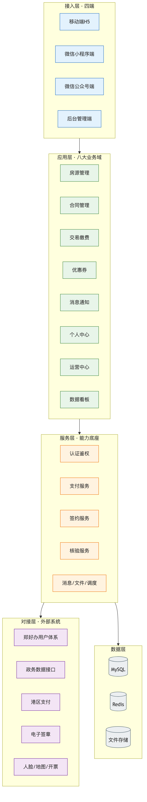

<center>图1-1 系统总体蓝图</center>

## 1.3 建设内容全景（以租赁全生命周期为主轴）

区别于按"端"或"模块"简单罗列，本方案从**租户在系统中经历的完整生命周期**出发梳理建设内容，使功能覆盖与真实业务动线一一对应。

### 1.3.1 生命周期主线：找房 → 核验 → 选房 → 签约 → 缴费 → 入住 → 在租 → 续租/退租 → 开票

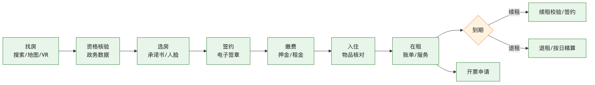

<center>图1-2 租赁全生命周期主线</center>

| 阶段 | 群众端建设内容 | 管理端支撑内容 | 关键对接 |
|:-----|:--------------|:--------------|:--------|
| 找房 | 首页金刚位、搜索、地图找房、项目/房源列表与详情、VR看房 | 项目/楼栋/单元/房源维护、房源上下架、地图点位维护 | 地图服务 |
| 核验 | 资格自动校验、不符项展示、在线申诉、申诉记录 | 资格规则配置、申诉审批 | 郑好办、政务数据（社保/婚姻/学历/住房/保租房） |
| 选房 | 承诺书签署、房源筛选、选定房源、预约看房、人脸识别 | 选房规则、承诺书模板、看房预约管理 | 人脸识别 |
| 签约 | 在线签署合同、合同下载 | 合同模板、签署监控、合同归档 | 电子签章 |
| 缴费 | 押金/租金在线缴纳、优惠计算、账期选择 | 账单生成、优惠券核销、缴费台账、对账 | 港区支付 |
| 入住 | 入住申请、物品核对、签字确认、入住详情 | 入住审批、物品清单、入住确认 | — |
| 在租 | 我的合同、我的房源、账单、消息、优惠券、投诉/保洁/搬家/报修服务 | 合同台账、账单管理、服务工单、消息推送 | 港区支付 |
| 续租/退租 | 续租校验、续租签约、退租申请、退租确认与退费、签字 | 续租审批、退租审批、退款核算与执行 | 电子签章、港区支付 |
| 开票 | 申请开票、账期选择、发票预览与下载 | 开票管理 | 开票/发票服务 |

### 1.3.2 业态差异叠加：三类业态在主线上的差异化

在统一生命周期主线之上，三类业态叠加差异化规则：

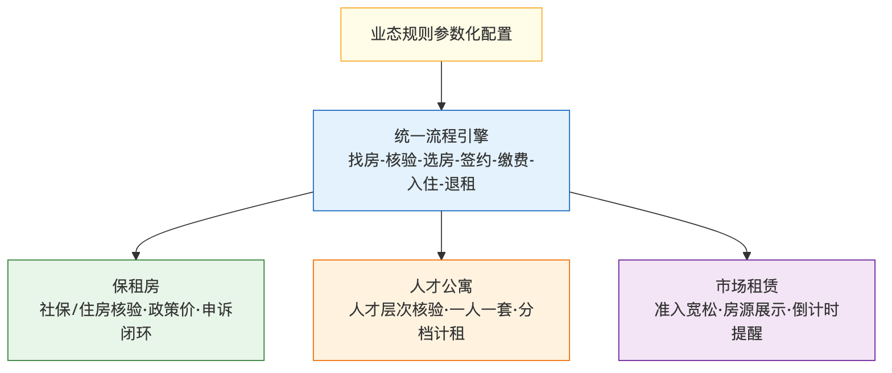

<center>图1-3 三类业态差异化承载</center>

- **保租房**：强调准入资格核验（社保、住房等）、租金政策优惠、资格申诉闭环；
- **人才公寓**：强调人才资格与层次核验、"一人一套"约束、租金按人才层次与户型分档、人才家园信息展示；
- **市场租赁**：准入相对宽松，强调房源展示、预约看房、合同倒计时提醒等市场化运营特性。

系统通过"统一流程引擎 + 业态规则参数化"的方式承载差异，既保证群众端体验一致，又满足三类业态各自的管理要求。

### 1.3.3 增值服务与企业客户

除个人租赁主线外，系统还建设：

- **生活服务**：投诉建议、保洁订单、搬家订单、物业报修等生活服务的下单、记录、评价闭环；
- **企业客户**：面向集中配租的企业客户，提供在线缴费、批量入住办理（上传入住人员名单）、退租办理、合同备案、代购补贴申请等功能。

### 1.3.4 后台管理与数据看板

后台管理端建设登录、首页数据概览、房源管理、合同管理、账单/支付管理、优惠券管理、消息管理、运营中心、系统管理及数据看板，形成对全部前端业务的统一管控与数据沉淀，数据看板围绕财务、房源、用户转化等维度输出管理视图。

### 1.3.5 系统对接、数据迁移与培训

- **系统对接**：郑好办用户体系、港区政务数据接口、港区支付接口、电子签章、人脸识别、地图服务、开票服务；
- **数据迁移**：将存量房源、租户、合同、缴费等数据清洗、转换、迁移入新系统，保证业务连续；
- **培训与移交**：面向管理人员的操作培训与面向运维的知识转移，交付完整文档与源代码。

## 1.4 业务需求分析（以三类业态为主轴）

### 1.4.1 三类业态的业务角色与权责

系统业务角色主要包括：租户（新市民/人才/普通租户）、企业客户、房源管家、业务审批人员、运营人员、系统管理员。各角色在三类业态下的权责通过统一的角色—权限模型（RBAC）进行管理，并支持数据权限（按项目/业态范围）控制，确保"该看的看得到、不该看的看不到"。

**角色权责与权限矩阵**：

| 角色 | 主要职责 | 关键权限 | 数据范围 |
|:----|:--------|:--------|:--------|
| 租户 | 办理找房、核验、选房、签约、缴费、退租、开票 | 仅限本人业务办理与查询 | 仅本人数据 |
| 企业客户 | 集中缴费、批量入住、退租、合同备案、补贴申请 | 本企业相关业务办理 | 本企业名下数据 |
| 房源管家 | 房源维护、看房预约、入住确认、日常运营 | 房源与客户运营相关操作 | 所辖项目/业态 |
| 业务审批人员 | 资格申诉审批、入住/退租/续租审批 | 审批类操作 | 所辖项目/业态 |
| 运营人员 | 优惠券、消息、公告、活动运营与数据分析 | 运营配置与数据查看 | 授权业态范围 |
| 系统管理员 | 用户/角色/权限/字典/参数配置与系统维护 | 系统管理全部功能 | 全局（受审计约束）|

权限模型采用"角色—菜单—按钮—数据"四级控制：菜单权限决定可见模块，按钮权限决定可执行操作，数据权限决定可访问的数据范围，敏感操作（退款、批量导出等）额外记录操作审计日志，做到权责清晰、行为可溯。

### 1.4.2 保租房业务需求

- 准入以资格核验为前提，核验维度包括社保、住房、婚姻等；
- 支持资格不符项的展示、手动刷新与在线申诉，申诉经审批后可继续办理；
- 租金执行保租房政策价，支持优惠券；
- 覆盖选房、签约、押金/租金缴纳、入住、续租、退租、开票全流程。

**保租房准入核验维度明细**：

| 核验维度 | 核验要点 | 数据来源 | 不符处理 |
|:--------|:--------|:--------|:--------|
| 社保 | 在本地连续缴纳社保达规定月数 | 港区政务数据 | 展示不符项、支持申诉 |
| 住房 | 在规定范围内无自有住房/未享受其他住房保障 | 港区政务数据 | 展示不符项、支持申诉 |
| 婚姻 | 婚姻状况符合家庭申请口径 | 港区政务数据 | 展示不符项、支持申诉 |
| 既有保租房 | 未重复承租保租房 | 系统内数据+政务数据 | 阻断并提示 |
| 身份实名 | 实名与人脸核身一致 | 郑好办/人脸识别 | 阻断并提示 |

保租房业务的关键在于"资格核验的严谨性与申诉的人性化"并重：核验结果直接决定能否办事，因此必须准确、留痕；同时对因数据时延或口径导致的误判，提供手动刷新与在线申诉通道，由管理人员审批复核，避免"一刀切"影响群众合理权益。

### 1.4.3 人才公寓业务需求

- 准入以人才资格与层次核验为前提，遵循"一人一套"约束；
- 租金按人才层次与户型面积分档计算（含特定层次、特定面积的差异化规则）；
- 提供人才家园信息展示；
- 其余流程与保租房一致，差异集中在准入与计租规则。

**人才公寓计租规则示意**：人才公寓租金按"人才层次 × 户型面积档"二维分档确定，并可叠加阶段性优惠。系统将计租规则抽象为可配置的规则表，管理人员可在后台维护层次与面积档的对应租金标准，无需修改代码即可适配政策调整：

| 人才层次 | 可租户型档 | 计租方式 | 特殊约束 |
|:--------|:---------|:--------|:--------|
| 高层次人才 | 大户型/多居室 | 政策优惠价，可享更高补贴比例 | 一人一套 |
| 中层次人才 | 中等户型 | 政策优惠价 | 一人一套 |
| 基础人才 | 标准户型 | 政策优惠价 | 一人一套 |

"一人一套"约束在系统中通过用户维度的在租校验实现：同一自然人在人才公寓业态下已有生效合同时，不得重复选房签约，从源头杜绝一人多套。

### 1.4.4 市场租赁业务需求

- 准入相对宽松，突出房源展示、预约看房、合同管理；
- 支持新签约合同倒计时提醒等市场化特性；
- 覆盖选房、签约、缴费、入住、续租、退租、开票全流程。

### 1.4.5 企业客户业务需求

面向集中配租场景，支持企业以单位为主体的在线缴费、批量入住（上传人员名单）、退租办理、合同备案与代购补贴申请，满足企业集中承租的管理需要。

### 1.4.6 核心业务流程需求（举要）

- **资格核验流程**：进入办事 → 系统自动调取政务数据核验 → 展示不符项 → 用户手动刷新/在线申诉 → 审批 → 通过后继续；
- **选房签约流程**：签承诺书 → 筛选房源 → 选定 → 人脸识别核身 → 在线签约 → 合同归档；
- **缴费流程**：生成账单 → 选择账期 → 优惠计算 → 港区支付 → 回调确认 → 台账更新（押金未缴不得选租期账单）；
- **入住流程**：入住申请 → 审批签收 → 物品核对 → 签字确认入住；
- **退租流程**：退租申请 → 审批 → 实际退租日期核定 → 按日精算退款 → 签字确认 → 房源状态释放；
- **续租流程**：续租校验（资格/欠费）→ 签署续租合同 → 缴费。

### 1.4.7 非功能性业务约束

- 资金类操作必须准确、可对账、可追溯，杜绝重复扣款与漏账；
- 群众个人敏感信息（身份、人脸、支付）须依法保护；
- 业务高峰（集中选房、集中缴费）期间系统须稳定可用。

## 1.5 应用功能需求分析

### 1.5.1 移动端/小程序端/公众号端功能需求

三端面向群众，功能主线一致（找房、核验、选房、签约、缴费、入住、在租服务、续租退租、开票、生活服务、企业客户、个人中心），因渠道特性略有差异：小程序端强调即用即走与人脸识别等原生能力，公众号端强调消息触达与轻量入口，H5端强调兼容性与分享传播。三端共享同一套后端服务与业务数据，保证功能与数据一致。

### 1.5.2 后台管理端功能需求

后台管理端需覆盖：登录与权限、首页数据概览、房源管理（项目/楼栋/单元/房源/地图/VR）、合同管理、账单与支付管理、优惠券管理、消息管理、运营中心、企业客户管理、生活服务工单管理、系统管理与数据看板，满足三类业态的集中运营与分类管理。

### 1.5.3 实施与对接功能需求

- 与郑好办完成用户体系对接与单点登录/授权；
- 与港区政务数据接口完成社保、婚姻、学历、住房、保租房等资格数据核验对接；
- 与港区支付接口完成缴费与退款对接；
- 与电子签章、人脸识别、地图、开票等第三方能力对接；
- 完成存量数据迁移与上线切换。

### 1.5.4 功能需求理解小结

系统功能可归纳为"一条主线（租赁全生命周期）、三类业态（保租/人才/市场）、四个渠道（移动/小程序/公众号/后台）、八大业务域、多方对接"，本方案后续各章将围绕这一结构展开设计、实施、安全与运维安排。

## 1.6 建设重难点解析与应对思路

> 本方案对重难点的识别，立足于"三类业态 + 多方对接 + 资金安全 + 群众高频使用"的项目特征，逐项给出应对思路（详细设计见后续章节）。

### 1.6.1 重难点一：三类业态差异化规则的统一承载

**难在哪**：保租、人才、市场三类业态在准入、计租、优惠、配租上规则各异，若为每类业态单独开发，将造成代码重复、维护困难。

**怎么解**：采用"统一流程引擎 + 业态规则参数化"，将共性流程沉淀为通用能力，将差异规则抽象为可配置参数与策略，新增或调整业态规则时以配置为主、编码为辅。

### 1.6.2 重难点二：多渠道政务数据对接与自动资格核验

**难在哪**：资格核验涉及郑好办及多个政务数据源，接口协议、可用性、数据口径不一，且核验结果直接决定群众能否办事，容错要求高。

**怎么解**：建立统一核验服务，屏蔽各数据源差异；对接口调用做超时、重试、降级与留痕；核验不通过时提供清晰的不符项展示与在线申诉闭环，兼顾严谨与人性化。

### 1.6.3 重难点三：资金安全与账单准确性

**难在哪**：押金、租金的收缴与退款直接关系群众利益与资金安全，存在重复支付、回调丢失、退款错算等风险。

**怎么解**：支付以港区支付接口为唯一通道，订单与回调严格幂等；账单按账期制管理，押金未缴不得缴租期账单；退租退款以核定的实际退租日期按日精算并"一次定死"、全程台账化。

### 1.6.4 重难点四：存量数据迁移的完整性与业务连续性

**难在哪**：存量房源、合同、缴费数据来源多样、质量参差，迁移既要完整准确，又不能中断在办业务。

**怎么解**：采用"抽取—清洗—转换—校验—试迁—正式迁移"的分步策略，迁移前全表核对、冲突实体差异化处理，迁移后逐表校验残留与一致性，对历史迁入数据坚持"零干预"原则，确保群众端能正常查看自己的合同与账单。

### 1.6.5 重难点五：四端一致性与低成本维护

**难在哪**：四端并存，若各端逻辑分散，将导致体验不一致与维护成本高。

**怎么解**：四端共享统一后端服务与业务规则，前端按渠道差异做适配而非重复实现业务逻辑，配合统一的技术规范与代码复用，降低长期维护成本。

### 1.6.6 关键难点：驻场模式下的进度与质量双控

**难在哪**：驻场开发边建边用，需求持续、节点密集，进度与质量易顾此失彼。

**怎么解**：以迭代开发+里程碑基线管控进度，以编码规范、代码评审、多层测试、缺陷闭环管控质量，以周报月报与例会保障与招标人的同频推进（详见第三章）。

## 1.7 系统非功能性需求分析

### 1.7.1 性能需求

系统面向群众高频使用，须保证常规操作页面响应迅速、支付与核验等关键交易在可接受时间内完成，并能承受集中选房、集中缴费等业务高峰的并发压力（性能指标与压测方案见第三章）。

本方案设定如下可度量的性能目标，作为设计、开发与验收测试的量化依据：

| 性能指标 | 目标值 | 说明 |
|:--------|:------|:-----|
| 常规页面响应 | 95%请求≤2秒 | 列表、详情等常规查询 |
| 关键交易响应 | 支付下单/核验≤3秒（不含第三方耗时） | 端到端可接受时延 |
| 系统并发 | 支持业务高峰并发在线，弹性可扩展 | 通过水平扩展应对峰值 |
| 接口成功率 | 核心接口成功率≥99.9% | 剔除第三方不可用因素 |
| 数据库 | 慢查询受控、主备延迟秒级 | 索引优化+读写分离预留 |

上述目标通过"缓存加速热点数据、数据库索引与慢查询治理、静态资源分离、关键交易异步化与幂等、应用无状态化便于水平扩展"等设计手段保障，并在系统测试阶段以压力测试验证。

### 1.7.2 可用性与可靠性需求

系统须具备高可用能力，关键业务7×24小时可用；具备完善的备份与恢复机制，保证数据不丢失、故障可快速恢复（运维保障见第五章）。

### 1.7.3 兼容性需求

移动端/小程序/公众号须兼容主流手机机型与微信版本，后台管理端须兼容主流浏览器，保证不同终端下功能与展示正常。

### 1.7.4 易用性需求

面向普通群众的端应做到界面清晰、操作路径短、提示明确，尽量降低使用门槛；面向管理人员的后台应做到布局合理、操作高效。

### 1.7.5 可扩展性与可维护性需求

系统架构应支持业务功能的平滑扩展与业态规则的灵活调整，代码结构清晰、注释完整、文档齐备，便于长期驻场运维与二次开发。

### 1.7.6 安全合规需求

系统须满足信息系统安全技术与安全管理要求，适配二级等保各项控制措施，依法保护个人信息，保障资金与数据安全（详见第四章）。

## 1.8 术语与定义

- **保租房**：保障性租赁住房，面向新市民、青年人等群体的政策性租赁住房。
- **人才公寓**：面向各层次人才提供的、享受租金优惠等政策的租赁住房。
- **市场租赁**：按市场化方式出租的房源。
- **郑好办**：郑州市政务服务统一平台，提供统一用户体系与政务服务入口。
- **资格核验**：通过政务数据自动核对租户是否符合保租房/人才公寓准入条件的过程。
- **账期制账单**：按租金所属期间（起止日期）生成与管理账单的机制。
- **实际退租日期**：退租审批时由管理人员核定、作为退款按日精算基准的日期。
- **业态**：保租房、人才公寓、市场租赁三类租赁业务类型的统称。
- **四端**：移动端（H5）、微信小程序端、微信公众号端、后台管理端。

## 1.9 总体建设原则

基于上述需求分析，本方案确立六项贯穿全生命周期的建设原则，作为后续设计、实施、安全、运维各章节的统一遵循：

1. **业务优先、贴合实际**：一切设计从港区三类业态的真实业务动线出发，功能覆盖招标功能明细全部条目，不做与业务脱节的过度设计。
2. **稳定为本、连续不断**：把业务连续性作为红线，上线、变更、迁移均以"不中断在办业务、不影响资金安全"为前提。
3. **资金安全、账实相符**：涉及资金的每一笔操作均可对账、可追溯、幂等防重，杜绝重复扣款与漏账错账。
4. **合规先行、保护隐私**：满足二级等保要求，依法保护群众身份、人脸、支付等敏感信息，安全贯穿开发到运维全过程。
5. **务实取舍、易于维护**：架构选型以"够用、稳定、易维护"为准，避免为技术而技术，降低六年运维期的长期维护成本。
6. **持续演进、平滑扩展**：以参数化、模块化设计承载业态规则变化与功能扩展，支撑驻场团队"边建边用、持续迭代"的工作模式。

上述原则将在第二章的架构与功能设计、第三章的实施管理、第四章的安全管理、第五章的运维管理、第六章的服务保障中逐一落地，形成"需求—设计—实施—安全—运维—保障"的完整闭环。

\newpage

# 第二章 应用系统功能设计

## 2.1 应用系统功能执行标准

本系统的设计、开发、测试与验收，统一遵循国家、行业相关标准与招标人的技术要求，确保系统"建得规范、用得可靠、验得清楚"。主要执行标准如下：

### 2.1.1 软件工程与质量标准

- GB/T 8566 信息技术 软件生存周期过程；
- GB/T 8567 计算机软件文档编制规范；
- GB/T 9385 计算机软件需求规格说明规范；
- GB/T 16260 系统与软件工程 系统与软件质量要求和评价（SQuaRE）；
- GB/T 25000 系列 系统与软件质量要求和评价。

### 2.1.2 安全与等保标准

- GB/T 22239 信息安全技术 网络安全等级保护基本要求（按二级要求适配）；
- GB/T 22240 信息安全技术 网络安全等级保护定级指南；
- GB/T 25070 信息安全技术 网络安全等级保护安全设计技术要求；
- GB/T 28448 信息安全技术 网络安全等级保护测评要求；
- GB/T 35273 信息安全技术 个人信息安全规范。

### 2.1.3 数据与接口标准

- GB/T 32960 数据接口相关规范及 RESTful 接口设计规范；
- JSON 数据交换格式、HTTPS 传输安全；
- 遵循郑好办、港区政务数据接口、港区支付接口等各外部系统的对接规范。

### 2.1.4 编码与交付标准

- 遵循阿里巴巴《Java 开发手册》与前端编码规范；
- 源代码可独立编译生成与生产环境一致的可执行文件，结构清晰、注释完整，附编译部署脚本与说明文档；
- 交付物符合 GB/T 8567 文档编制规范。

### 2.1.5 质量目标

系统整体质量目标为"合格"，符合国家、行业相关合格质量标准及招标人要求，具体量化为：功能符合需求、关键交易零资金差错、核心接口高可用、缺陷密度受控、通过二级等保测评要求。

## 2.2 系统组成

### 2.2.1 总体组成视图

系统由"四端应用 + 一体后台 + 能力底座 + 对接网关 + 数据资源"五个部分组成：

- **四端应用**：移动端（H5）、微信小程序端、微信公众号端、后台管理端；
- **一体后台**：承载八大业务域的应用服务集合；
- **能力底座**：认证鉴权、支付、签约、核验、消息、文件、任务调度等公共能力；
- **对接网关**：统一对外部系统（郑好办、政务数据、支付、签章、人脸、地图、开票）的调用与适配；
- **数据资源**：关系型数据库、缓存、文件存储及数据看板所需的数据视图。

### 2.2.2 八大业务域组成

| 业务域 | 主要构成 |
|:------|:--------|
| 房源管理域 | 项目、楼栋、单元、房源、户型、地图点位、VR资源、房源状态机 |
| 合同管理域 | 合同模板、签署、归档、状态机、续租/退租、企业合同备案 |
| 交易缴费域 | 账单、账期、押金/租金、优惠核销、支付订单、退款、对账 |
| 优惠券域 | 券模板、发放、领取、核销、失效 |
| 消息通知域 | 站内信、模板消息、公告、政策文件推送 |
| 个人中心域 | 我的合同/房源/账单/消息/优惠券、资料、资格与申诉 |
| 运营中心域 | 首页配置、banner、金刚位、活动、内容运营 |
| 数据看板域 | 财务、房源、用户转化等管理视图 |
| 生活服务域 | 投诉建议、保洁、搬家、报修工单 |
| 企业客户域 | 企业缴费、批量入住、退租、合同备案、代购补贴 |

（业态规则以参数化方式贯穿于房源、合同、交易缴费等域中。）

### 2.2.3 能力底座组成

认证鉴权（含郑好办对接与本地RBAC）、支付服务（港区支付通道封装）、签约服务（电子签章封装）、核验服务（政务数据核验封装）、人脸核身服务、消息服务、文件服务、定时任务调度、日志与审计等公共能力，供各业务域复用。

## 2.3 系统结构

### 2.3.1 分层结构

系统采用经典分层结构，自上而下为：

- **表现层**：四端界面，负责交互与展示；
- **接口层**：统一的 RESTful API 网关，负责鉴权、路由、参数校验、限流；
- **业务逻辑层**：八大业务域的服务实现，承载业务规则与流程编排；
- **能力层**：支付、签约、核验、消息等公共能力；
- **数据访问层**：统一的数据访问组件，负责与数据库、缓存、文件存储交互；
- **数据层**：关系型数据库、缓存、文件存储。


<center>图2-1 系统分层结构图</center>

### 2.3.2 技术架构：前后端分离 + 模块化单体

考虑本项目"驻场开发、六年运维、低成本维护"的定位，系统采用**前后端分离 + 模块化单体（Modular Monolith）**的技术架构，而非过度拆分的微服务：

- **前后端分离**：前端四端独立开发部署，后端提供统一 API，前后端通过 HTTPS + Token 交互；
- **模块化单体**：后端按业务域清晰分模块（高内聚、低耦合），部署为可水平扩展的应用实例，兼顾开发效率、运维成本与可扩展性；
- **演进友好**：模块边界清晰，未来若某业务域需独立伸缩，可平滑演进为独立服务，避免一步到位的过度设计。

这一取舍的理由是：项目由驻场小团队长期维护，模块化单体在保证清晰边界的同时，显著降低了分布式带来的运维复杂度与故障面，最契合本项目的实际。

### 2.3.3 部署结构

系统采用负载均衡 + 多应用实例 + 数据库主备 + 缓存 + 文件存储 + 政务网络代理的部署结构，通过反向代理统一入口，应用实例无状态可水平扩展，政务数据对接经由合规的网络代理通道访问（部署架构与网络分区详见第四、五章）。


<center>图2-2 部署架构图</center>

## 2.4 系统支撑

### 2.4.1 技术选型及理由

系统技术选型立足"成熟稳定、生态完善、团队熟练、便于长期维护"的原则，与现有系统保持一致：

| 层次 | 技术选型 | 选型理由 |
|:-----|:--------|:--------|
| 后端框架 | Spring Boot 3.5.x + Spring Security | 主流企业级框架，生态成熟，安全组件完善 |
| 持久层 | MyBatis-Plus | 通用 CRUD 开箱即用，减少样板代码，便于驻场团队高效开发 |
| 数据库 | MySQL 8.x | 稳定可靠、运维成本低、社区支持广泛 |
| 缓存 | Redis | 高性能缓存与会话/令牌存储、分布式锁 |
| 鉴权 | JWT + Redis | 无状态令牌 + 服务端可控失效，适配四端与前后端分离 |
| 前端（后台） | Vue 2.6 + Element UI | 组件丰富、上手快，适合后台管理类中后台系统 |
| 前端（群众端） | uni-app | 一套代码多端（H5/小程序/公众号），降低多端维护成本 |
| 接口文档 | SpringDoc（OpenAPI 3.0） | 接口文档自动化，便于联调与交付 |
| 定时任务 | Quartz | 账单生成、超时处理、对账等定时作业 |

**关于 uni-app 的选型说明**：群众端需同时覆盖 H5、微信小程序、公众号，uni-app"一套代码多端发布"能显著降低多端并行维护的人力成本，契合驻场小团队的长期运维定位，同时可调用小程序原生能力（如人脸识别）。

### 2.4.2 运行环境支撑

- **操作系统**：主流 Linux 服务器操作系统；
- **应用运行**：JDK 17 运行环境；
- **数据库/缓存**：MySQL 8.x、Redis；
- **Web/代理**：Nginx/OpenResty 作为反向代理与静态资源服务；
- **容器化**：关键组件容器化部署，便于环境一致性与快速恢复；
- **政务网络**：经合规代理通道访问港区政务数据接口。

### 2.4.3 公共支撑能力

- **统一认证鉴权**：JWT 令牌签发与校验、Redis 会话管理、RBAC 权限与数据权限；
- **统一支付能力**：封装港区支付接口，统一下单、回调、查询、退款、幂等控制；
- **统一签约能力**：封装电子签章，统一模板管理、发起签署、结果回调、合同归档；
- **统一核验能力**：封装政务数据核验，统一调用、超时重试、降级、留痕；
- **统一消息能力**：站内信、模板消息、公告推送；
- **统一文件能力**：上传、存储、访问（相对路径存储 + 前端拼接访问地址）；
- **统一任务调度**：账单生成、超时关单、自动解约、对账等定时作业；
- **统一日志审计**：操作日志、登录日志、接口调用日志、安全审计日志。

## 2.5 应用功能详细设计

> 本节按八大业务域展开功能详细设计，每一业务域给出功能构成、关键规则与处理流程，力求"每一项功能都对应真实业务动线、每一条规则都可落地执行"。

**四端功能总清单**：为便于甲方整体把握系统功能覆盖，先给出四端功能总清单，后续各小节展开详细设计。

| 端 | 功能模块 | 主要功能 |
|:--|:--------|:--------|
| 移动端/小程序/公众号（群众端） | 找房 | 首页、地图找房、VR看房、房源列表与详情、搜索筛选 |
| 群众端 | 办事 | 资格核验、不符申诉、选房、承诺书签署、人脸核身 |
| 群众端 | 合同 | 在线签署、合同查看下载、续租、退租申请 |
| 群众端 | 缴费 | 押金/租金缴纳、优惠券核销、账单查看、开票申请 |
| 群众端 | 入住 | 入住申请、物品清单确认、入住详情 |
| 群众端 | 个人中心 | 我的合同/房源/账单/消息/优惠券、资料上传、资格与申诉 |
| 群众端 | 生活服务 | 投诉建议、保洁、搬家、报修下单与评价 |
| 群众端 | 消息 | 站内信、模板消息、公告、政策文件 |
| 后台管理端 | 房源管理 | 项目/楼栋/单元/房源/户型、地图点位、VR资源、上下架 |
| 后台管理端 | 合同管理 | 合同、签署、归档、续租/退租、企业合同备案 |
| 后台管理端 | 交易管理 | 账单、账期、支付订单、退款、对账、开票 |
| 后台管理端 | 运营管理 | 首页配置、banner、金刚位、活动、优惠券、消息公告 |
| 后台管理端 | 客户管理 | 用户、企业客户、资格核验记录、申诉审批 |
| 后台管理端 | 生活服务管理 | 工单受理、派单、处理、反馈 |
| 后台管理端 | 数据看板 | 财务、房源、用户转化看板 |
| 后台管理端 | 系统管理 | 用户/角色/菜单/部门/岗位/字典/参数/日志 |

上述功能以八大业务域为骨架、四端为触点组织，群众端与管理端共享统一后端与业务规则，保证功能完整、动线连贯。

### 2.5.1 房源管理域

**功能构成**：项目管理、楼栋管理、单元管理、房源管理、户型管理、地图找房、VR看房、房源上下架与状态管理。

**关键设计**：

- **层级模型**：项目 → 楼栋 → 单元 → 房源，房源关联户型（含面积、租金基准、设施）；
- **房源状态机**：空置、已预订、已签约、已入住、退租释放等状态按规则流转，选房/签约/入住/退租各环节自动驱动状态变化，避免"一房多签"；
- **地图找房**：项目/房源在地图上以点位展示，支持按业态、区域筛选，点位维护经纬度采用腾讯地图；
- **VR看房**：房源可关联 VR 资源，群众端一键进入全景看房；
- **可见性控制**：按业态、配租方式、批次等控制房源在群众端的可见范围（如批次配租房源仅对特定用户可见）。


<center>图2-8 房源状态机</center>

**房源管理域功能清单**：

| 功能项 | 功能说明 | 使用角色 |
|:------|:--------|:--------|
| 项目管理 | 维护项目基本信息、业态归属、位置、简介、封面 | 房源管家/管理员 |
| 楼栋管理 | 维护楼栋编号、楼层、朝向等属性 | 房源管家 |
| 单元管理 | 维护单元与楼栋的从属关系 | 房源管家 |
| 房源管理 | 维护房号、面积、户型、租金基准、朝向、状态 | 房源管家 |
| 户型管理 | 维护户型图、面积区间、设施配置、租金档 | 房源管家 |
| 地图找房 | 维护经纬度点位，群众端地图筛选展示 | 房源管家 |
| VR看房 | 关联VR资源，群众端全景看房 | 房源管家 |
| 上下架 | 控制房源在群众端的可售/可租状态 | 房源管家 |
| 批量维护 | 批量导入/调整房源，提升维护效率 | 房源管家 |

**房源状态流转规则**：房源状态由业务事件驱动自动流转，不允许手工随意置态，确保"状态即事实"。核心规则为：选房锁定使房源由"空置"进入"已预订"并占用（设置预订超时释放）；签约完成进入"已签约"；入住确认进入"已入住"；退租完成后经"退租释放"回到"空置"。所有状态变更均记录操作人、时间与来源事件，杜绝"一房多签"与状态错乱。

**层级数据模型说明**：项目、楼栋、单元、房源构成四级层级，房源关联户型获得面积与租金基准。这一模型既支撑保租房/人才公寓的按项目集中管理，也支撑市场租赁的分散房源管理；地图找房与VR看房作为增值展示能力挂接在房源之上，不改变核心层级。

### 2.5.2 合同管理域

**功能构成**：合同模板、在线签署、合同归档与下载、合同状态机、续租、退租、企业合同备案。

**关键设计**：

- **在线签署**：对接电子签章，群众端发起签署、完成后合同归档并可下载；
- **合同状态机**：涵盖待签署、待付款、生效、到期、退租、作废等状态，跨渠道保持一致；押金支付超时可触发合同失效；
- **续租**：续租前校验资格与欠费，通过后签署续租合同；
- **退租**：退租申请 → 审批核定实际退租日期 → 按日精算退款 → 签字确认 → 合同状态与房源状态联动释放；
- **企业合同备案**：支持企业集中配租合同的备案与管理。

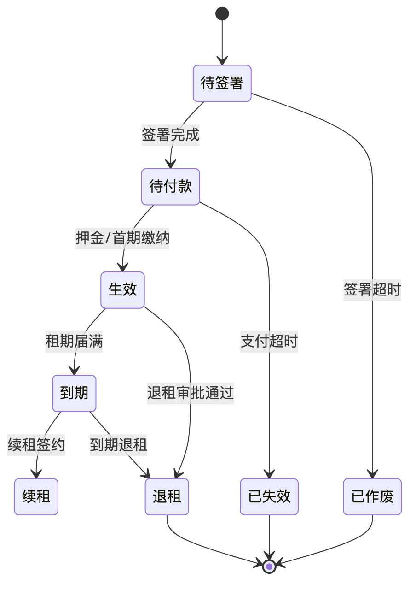

<center>图2-9 合同状态机</center>

**合同签署与归档流程**：群众端发起签署后，系统按业态与租金规则生成合同要素，调用电子签章平台按模板创建签署任务；租户完成签署后，签章平台回调通知，系统将合同 PDF 归档并更新状态为"待付款"；押金/首期款缴纳后合同"生效"。整个过程对租户透明、对管理端可监控，归档合同随时可在个人中心与后台下载。

**续租与退租业务规则**：

- **续租**：租期临近到期时系统提醒；租户发起续租，系统校验资格（人才层次是否仍符合）与欠费情况，通过后按新租期与租金生成续租合同并签署，续租合同与原合同关联，形成完整租赁履历；
- **退租**：租户发起退租申请，管理端审批时核定"实际退租日期"，系统据此按日精算应退租金与押金，退款金额一次核定后锁定（一次定死），租户签字确认后执行原路退款，合同置"退租"、房源联动释放。退租全程台账化，退款金额、核定依据、操作人、时间均可追溯。

**企业合同备案**：面向企业集中配租场景，支持企业主体下的合同集中备案与查询，与批量入住、企业缴费联动，满足单位承租的规范化管理。

### 2.5.3 交易缴费域

**功能构成**：账单管理、账期管理、押金/租金缴纳、优惠核销、支付订单、退款、对账。

**关键设计**：

- **账期制账单**：账单按租金所属期间（起止日期）生成与管理，清晰对应缴费区间；
- **缴费约束**：押金未缴清不得缴纳租期账单，保证缴费顺序与资金逻辑正确；
- **支付幂等**：以港区支付接口为唯一通道，下单与回调严格幂等，杜绝重复扣款；回调丢失时由定时对账/查单兜底推进；
- **退款精算**：退租退款以核定的实际退租日期按日精算，金额一次核定后锁定（一次定死），全程台账化、可追溯；
- **押金规则**：押金按统一规则收取（如统一额度），退租时按规则退还。

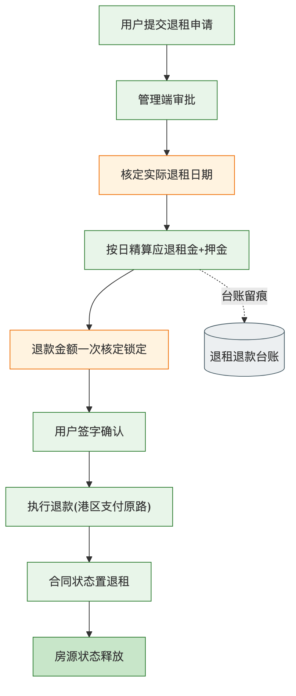

<center>图2-10 退租退款精算流程图</center>

**账单生成与账期管理**：系统以账期制管理账单，按合同租金所属期间（起止日期）生成账单，清晰对应缴费区间。账单类型区分押金账单与租期账单，押金账单优先，未缴清押金不得缴纳租期账单。账单支持逾期状态标识与缴费提醒，由定时任务在临期/逾期时触发消息通知。

**支付幂等与对账机制**：所有资金收缴以港区支付接口为唯一通道。下单时生成业务唯一键，回调处理严格幂等，重复回调不产生重复入账；针对回调丢失场景，定时任务主动查单补偿，确保账单状态与实际支付一致。系统每日进行支付对账，比对系统台账与支付渠道流水，差异项自动标记并告警，由运维人员核查处理，做到"笔笔可对、账实相符"。

**退款精算规则详解**：退租退款以管理端核定的"实际退租日期"为基准，按日精算应退租金（已缴未住部分）与押金（按规则扣除后的余额），精算结果一次核定后锁定并持久化，不因后续操作而改变；退款经租户签字确认后按原支付路径退回，退款状态全程可查。此设计确保退款金额有据可依、不可篡改、可追溯，保护群众资金权益的同时便于甲方审计。

### 2.5.4 优惠券域

**功能构成**：券模板配置、发放、领取、核销、失效。

**关键设计**：券模板定义面额/折扣、适用范围、有效期；发放支持定向/领取两种方式；缴费时按规则核销，核销与账单、支付联动，防止重复使用与超范围使用。

**优惠券业务规则**：券模板可配置面额型（直减）与折扣型（打折）两类；适用范围可限定业态、项目、账单类型；发放方式支持系统定向发放与用户主动领取；核销时校验券的有效期、适用范围与使用状态，一券一用、用后即核销，核销记录与对应账单、支付订单强关联，防止重复核销与跨范围滥用。券的失效由到期自动失效与管理端手动作废两种方式驱动。

### 2.5.5 消息通知域

**功能构成**：站内信、模板消息、公告、政策文件推送。

**关键设计**：关键业务节点（审批结果、缴费提醒、合同到期、退租进度等）自动触发消息；启动公告支持弹窗展示；公告/政策文件在群众端集中展示。

**消息触发场景清单**：

| 触发场景 | 消息类型 | 触达渠道 |
|:--------|:--------|:--------|
| 资格核验/申诉结果 | 站内信+模板消息 | 群众端 |
| 账单生成/临期/逾期 | 缴费提醒 | 群众端 |
| 合同到期临近 | 到期提醒 | 群众端 |
| 退租进度变更 | 进度通知 | 群众端 |
| 入住审批结果 | 审批通知 | 群众端 |
| 政策/公告发布 | 公告推送 | 群众端 |

消息发送采用异步化处理，避免阻塞主业务；模板消息对接微信能力，站内信在个人中心统一查看，公告支持置顶与弹窗，政策文件集中归档展示。

### 2.5.6 个人中心域

**功能构成**：我的合同、我的房源、我的账单、我的消息、我的优惠券、我的资料、资格与申诉、生活服务入口。

**关键设计**：以租户为中心聚合其全部业务对象；资格核验结果与申诉入口清晰展示；资料上传采用相对路径存储、前端拼接访问地址的机制。个人中心是群众的业务总入口，聚合展示"我的合同、房源、账单、消息、优惠券"，并提供资料上传、资格查看与申诉、生活服务下单等入口，让群众在一处即可掌握自己的全部租赁事项。

### 2.5.7 运营中心域

**功能构成**：首页配置、banner、金刚位、活动、内容运营。

**关键设计**：首页各栏位、活动可由运营人员在后台配置，无需发版即可调整群众端展示，支撑常态化运营。运营中心将群众端首页的 banner、金刚位、推荐位、活动位等做成可配置项，运营人员通过后台即可调整展示内容与顺序，实现"不改代码即可运营"，契合六年运维期内持续运营的需要。

### 2.5.8 数据看板域

**功能构成**：财务看板、房源看板、用户转化看板。

**关键设计**：围绕收缴/退款、房源出租率、办事转化等维度提供管理视图，数据来源于业务库的统计视图，支撑管理决策。数据看板面向管理者，提供财务收缴与退款汇总、房源出租率与空置分析、用户办事转化漏斗等视图，帮助管理机构掌握运营态势、辅助决策；看板数据基于业务库统计生成，支持按业态、项目、时间维度筛选。

### 2.5.9 生活服务域

**功能构成**：投诉建议、保洁订单、搬家订单、物业报修。

**关键设计**：群众端下单 → 工单流转 → 处理 → 反馈评价的闭环，后台统一管理工单。生活服务将投诉建议、保洁、搬家、报修等需求线上化，群众端一键下单，后台按工单流转处理并反馈，形成"下单—受理—处理—反馈—评价"闭环，提升居住服务体验与管理规范性。

### 2.5.10 企业客户域

**功能构成**：企业在线缴费、批量入住办理（上传人员名单）、退租办理、合同备案、代购补贴申请。

**关键设计**：面向集中配租企业，以单位为主体承载批量业务，批量入住支持名单上传与批量校验。企业客户域面向集中配租的单位客户，支持以企业为主体的在线缴费、批量入住（上传入住人员名单并批量校验）、退租办理、合同备案与代购补贴申请，满足企业集中承租的规模化、规范化管理需要，与个人租赁主线共用底层能力但在入口与流程上做企业化适配。

### 2.5.11 实施与对接项设计

实施与对接项（郑好办对接、政务数据核验对接、支付对接、签章/人脸/地图/开票对接、数据迁移、培训移交）在功能上体现为一系列对接适配与数据处理能力，详见 2.6 接口设计与第三章实施管理。

### 2.5.12 关键业务流程详细设计

本节对贯穿租赁生命周期的关键流程给出分步设计，每个流程明确正常路径与异常处理，作为开发与测试的详细依据。

**（1）资格核验流程**

1. 租户经郑好办授权进入办事，选择目标业态与项目；
2. 系统调用统一核验服务，向港区政务数据接口请求社保、住房、婚姻等核验；
3. 接口正常返回：逐项比对资格规则，全部符合则进入选房，存在不符项则展示明细；
4. 接口超时/失败：按策略重试，仍失败则降级为"稍后重试/转人工"，并全程留痕；
5. 不符项处理：租户可手动刷新（数据时延场景）或在线申诉，提交佐证材料；
6. 申诉审批：管理端审批通过则放行进入选房，不通过则说明理由并终止或要求整改。

**（2）选房签约流程**

1. 资格通过后，租户签署选房承诺书；
2. 按业态筛选可选房源（受可见性与状态约束，仅展示"空置且可选"房源）；
3. 选定房源，系统锁定房源为"已预订"并设置预订超时；
4. 人脸识别实人核身，确保签约人与申请人一致；
5. 系统按业态与计租规则生成合同要素，调用电子签章创建签署任务；
6. 租户在线签署，签章平台回调，系统归档合同并置"待付款"；
7. 异常：签署超时或放弃，释放房源预订、合同作废。

**（3）缴费入住流程**

1. 合同"待付款"，系统生成押金账单（及首期租金账单）；
2. 租户缴纳押金（押金优先规则，未缴押金不得缴租期账单）；
3. 通过港区支付下单、支付、回调，系统幂等入账并置合同"生效"；
4. 租户发起入住申请，管理端安排入住、核对物品清单；
5. 租户签字确认入住，房源置"已入住"，入住详情可查。

**（4）退租退款流程**

1. 租户在个人中心发起退租申请；
2. 管理端审批并核定"实际退租日期"；
3. 系统按实际退租日期按日精算应退租金与押金，退款金额一次核定锁定；
4. 租户签字确认退款金额；
5. 系统经港区支付原路退款，退款成功后合同置"退租"、房源"退租释放"→"空置"；
6. 全程台账记录，退款依据、金额、操作人、时间可追溯。

**（5）续租流程**

1. 租期临近到期，系统提前提醒租户；
2. 租户发起续租，系统校验资格（人才层次等）与欠费情况；
3. 校验通过，按新租期与租金生成续租合同并签署；
4. 缴纳新租期费用，续租生效，续租合同与原合同关联形成履历。

**（6）开票流程**

1. 租户在缴费完成后于个人中心发起开票申请，选择开票信息（抬头、税号等）；
2. 系统校验该笔缴费是否可开票、是否已开票，防止重复开票；
3. 调用开票/发票服务提交开票请求，记录开票状态；
4. 开票成功后回写发票信息，租户可在线预览与下载发票；
5. 异常：开票失败给出原因提示并支持重试，全程状态可查。

**（7）企业批量入住流程**

1. 企业客户在企业入口上传入住人员名单（按模板）；
2. 系统批量校验名单（人员信息、资格、房源匹配）并反馈校验结果；
3. 校验通过的批量生成合同/账单，未通过项返回明细供修正；
4. 企业统一缴费，系统批量入账并推进入住；
5. 全过程以企业为主体归集，合同集中备案、可批量查询。

**（8）生活服务工单流程**

1. 群众端选择服务类型（投诉建议/保洁/搬家/报修）下单；
2. 系统生成工单并按类型/项目派单至相应处理人；
3. 处理人受理、处理并回填处理结果；
4. 群众端收到处理反馈并评价；
5. 后台统一监控工单时效与满意度，超时预警。

### 2.5.13 各端交互设计要点

- **移动端（H5）**：强调兼容性与分享传播，页面自适应主流机型，办事路径短、提示明确；
- **微信小程序端**：即用即走，充分利用小程序原生能力（人脸识别、微信支付、模板消息）；
- **微信公众号端**：以消息触达与轻量入口为主，承接通知提醒与办事跳转；
- **后台管理端**：面向管理人员，布局规整、操作高效，列表—详情—操作动线清晰，重要操作二次确认并留审计。

四端共享统一后端服务与业务规则，前端仅按渠道特性做交互适配，不重复实现业务逻辑，保证功能与数据一致、维护成本可控。

### 2.5.14 关键业务规则汇总

为便于开发、测试与验收统一口径，将贯穿系统的关键业务规则汇总如下，作为落地准绳：

| 规则域 | 规则 | 说明 |
|:------|:----|:----|
| 资格核验 | 以政务核验数据为准，不符可申诉 | 数据源为权威，兼顾人性化 |
| 房源占用 | 一房一签，选房即锁定、超时释放 | 状态机 + 唯一约束防一房多签 |
| 缴费顺序 | 押金未缴清不得缴租期账单 | 保证资金逻辑正确 |
| 支付通道 | 港区支付为唯一通道 | 杜绝多渠道混乱 |
| 支付幂等 | 下单/回调按业务唯一键幂等 | 杜绝重复扣款 |
| 对账兜底 | 每日对账 + 回调丢失查单补偿 | 账实相符 |
| 退款精算 | 按实际退租日按日精算、一次核定锁定 | 防篡改、可追溯 |
| 续租校验 | 续租校验资格与欠费 | 符合条件方可续租 |
| 开票防重 | 同一缴费不可重复开票 | 校验已开票状态 |
| 数据迁移 | 历史迁入数据零干预 | 保障群众端历史可查 |
| 权限控制 | RBAC 四级 + 数据权限 | 最小权限、防越权 |

上述规则在需求、设计、代码、测试各环节保持一致，任何一处实现都以本表为准，避免理解偏差导致返工。

## 2.6 系统接口设计

### 2.6.1 接口设计原则

- **统一网关**：所有对外/对内接口经统一 API 网关，集中鉴权、限流、日志；
- **标准协议**：采用 RESTful + JSON，传输经 HTTPS 加密；
- **安全可控**：接口鉴权、参数校验、敏感数据脱敏、防重放；
- **健壮容错**：超时、重试、熔断、降级、幂等；
- **可观测**：接口调用全链路日志与监控。

### 2.6.2 郑好办用户体系对接

对接郑好办统一用户体系，实现群众以郑好办身份进入系统的授权登录与用户信息获取。设计要点：遵循郑好办对接规范完成授权码/令牌交换，映射到系统内用户，处理首次进入的用户建档，保证用户体系一致。

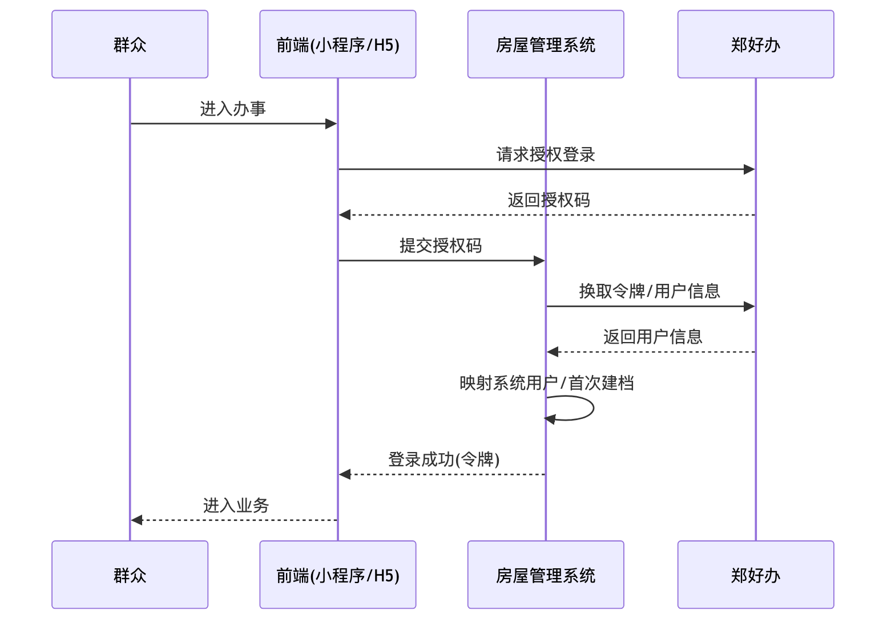

<center>图2-3 郑好办对接时序图</center>

### 2.6.3 政务数据资格核验对接

对接港区政务数据接口，核验社保、婚姻、学历、住房、既有保租房等资格数据。设计要点：

- **统一核验服务**：屏蔽各数据源差异，对外提供统一核验入口；
- **网络合规**：经合规政务网络代理通道访问；
- **容错**：超时重试、失败降级（转人工/申诉）、全程留痕；
- **闭环**：核验不通过时展示不符项并支持在线申诉与审批。

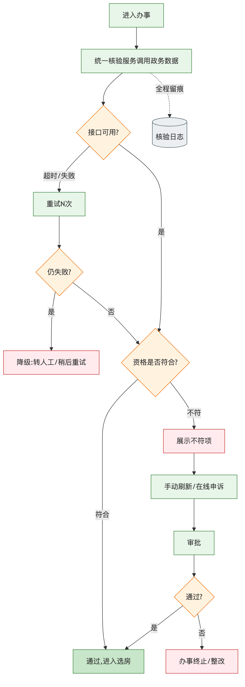

<center>图2-4 资格核验流程图</center>

### 2.6.4 支付与其他第三方接口对接

- **港区支付接口**：统一下单、回调、查询、退款，严格幂等与对账；
- **电子签章**：模板管理、发起签署、结果回调、合同归档；
- **人脸识别**：选房/核身环节的实人认证；
- **地图服务**：地图找房点位与经纬度（腾讯地图）；
- **开票/发票**：开票申请与发票预览下载。

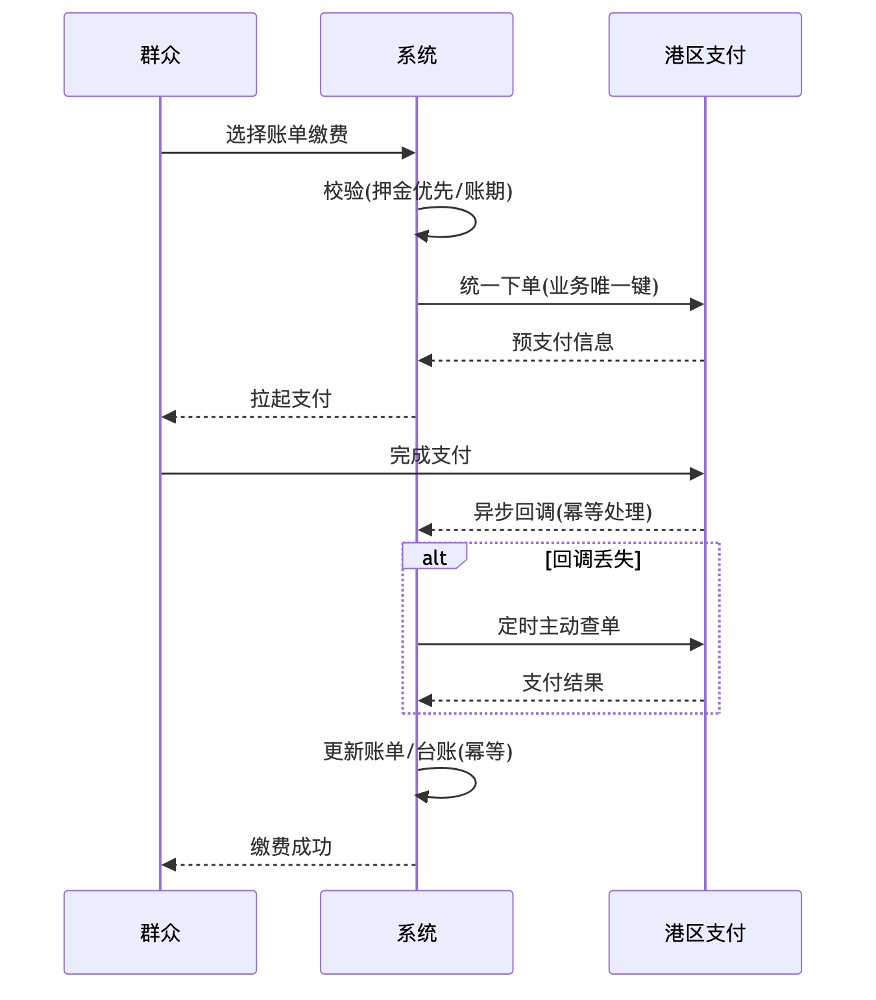

<center>图2-5 支付缴费对接时序图</center>

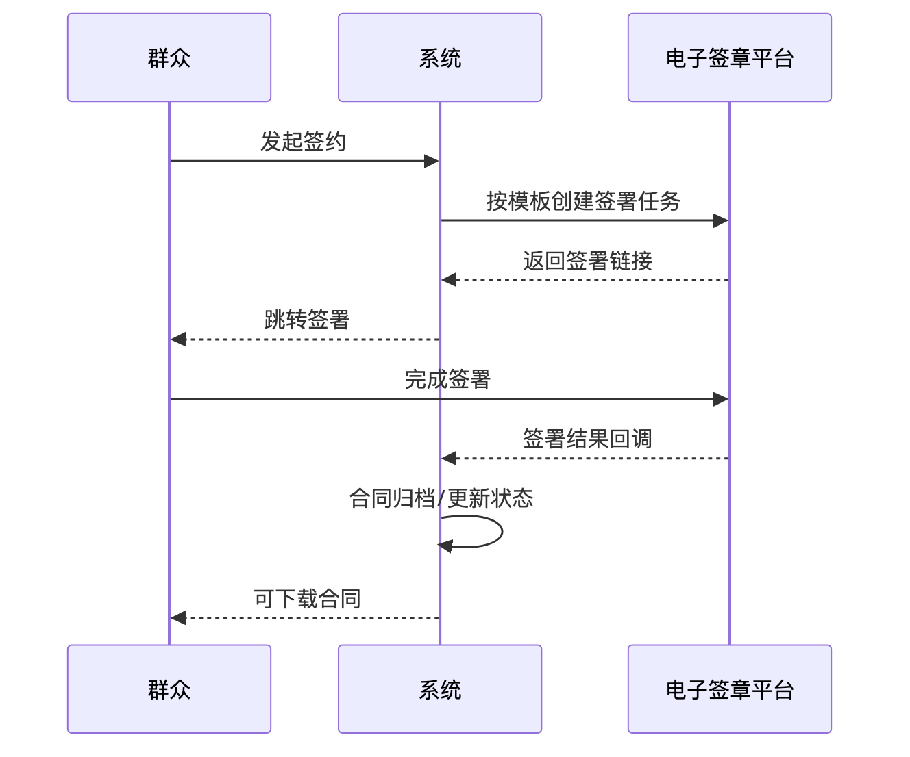

<center>图2-6 电子签章时序图</center>

### 2.6.5 内部接口与数据交换

四端与后端、各业务域之间通过统一 API 交互，业务域之间通过清晰的服务接口协作，避免跨域直接访问数据，保证模块边界清晰。

### 2.6.6 接口异常处理与容错设计

- **超时与重试**：对外部接口设置合理超时与有限次重试；
- **幂等**：支付、签约、核验等关键接口以业务唯一键保证幂等；
- **降级**：外部依赖不可用时提供降级路径（如转人工、稍后重试）；
- **补偿**：支付回调丢失由定时查单/对账兜底；
- **告警**：接口异常触发监控告警，便于快速处置。

### 2.6.7 外部对接接口清单

系统对接的外部接口汇总如下，各接口均通过统一网关封装、经合规通道访问、全链路留痕：

| 接口对象 | 用途 | 交互方式 | 关键保障 |
|:--------|:-----|:--------|:--------|
| 郑好办用户体系 | 授权登录、用户信息获取 | 授权码/令牌交换 | 用户映射、首次建档 |
| 港区政务数据接口 | 社保/婚姻/学历/住房/保租房核验 | 请求-响应 | 超时重试、降级、留痕 |
| 港区支付接口 | 下单、支付、查询、退款 | 下单+异步回调 | 幂等、对账、查单补偿 |
| 电子签章平台 | 合同签署、结果回调、归档 | 任务创建+回调 | 模板管理、归档 |
| 人脸识别 | 选房/核身实人认证 | 请求-响应 | 活体检测、比对 |
| 地图服务（腾讯地图） | 地图找房点位、经纬度 | SDK/API | 点位维护 |
| 开票/发票服务 | 开票申请、发票获取 | 请求-响应 | 状态回写 |
| 微信消息能力 | 模板消息推送 | 请求-响应 | 异步发送 |

### 2.6.8 接口安全与版本管理

所有接口统一采用 HTTPS 传输，令牌鉴权，敏感字段脱敏；对外提供的接口按版本管理，向下兼容，变更走变更管理流程；接口文档由 SpringDoc 自动生成并随系统交付，便于甲方与第三方联调对接。接口调用记录纳入审计日志，支持按调用方、时间、结果检索，满足可追溯与安全审计要求。

\newpage

## 2.7 系统数据设计

### 2.7.1 数据实体总体设计

系统数据围绕"房源—租户—合同—资金—运营"五大主题组织，主要实体包括：

- **房源主题**：项目、楼栋、单元、房源、户型、设施、地图点位、VR资源；
- **租户主题**：用户（统一用户主表）、资格核验记录、申诉记录、企业客户；
- **合同主题**：合同、合同签署记录、续租记录、退租记录、企业合同备案；
- **资金主题**：账单、账期、支付订单、退款记录、优惠券及核销记录、对账记录、开票记录；
- **运营主题**：消息、公告、活动、banner、工单（投诉/保洁/搬家/报修）、操作日志。

各实体之间以清晰的主外键关系关联，用户以统一用户主表为准（历史上的租户表已废弃）。


<center>图2-7 核心数据实体关系图</center>

### 2.7.2 核心实体字段设计（示例）

以合同、账单、退租三个关键实体为例说明字段设计要点：

**合同实体（要点）**：合同编号、租户、房源、业态类型、合同状态、签署状态、起止日期、租金、押金、签署时间、归档路径等；合同编号采用带业务含义的编码规则，状态字段由合同状态机驱动。

**账单实体（要点）**：账单编号、合同、账单类型（押金/租金）、所属账期起止、应缴金额、优惠金额、实缴金额、支付订单、缴费状态、缴费时间等；账期起止用于账期制管理。

**退租实体（要点）**：退租申请、合同、计划退租日期、实际退租日期、应退押金、应退租金、退款金额（一次核定锁定）、退款状态、签字确认、房源释放状态等；退款金额以实际退租日期按日精算并持久化。

**核心实体字段设计明细表**（节选关键字段，实际以数据库设计文档为准）：

| 实体 | 关键字段 | 类型/约束 | 说明 |
|:----|:--------|:---------|:-----|
| 用户 | 用户ID、郑好办标识、姓名、证件号、手机号、人才层次、状态 | 主键/唯一/脱敏 | 统一用户主表，证件号加密存储 |
| 房源 | 房源ID、项目/楼栋/单元、房号、户型、面积、租金基准、状态 | 主键/外键/枚举 | 状态由状态机驱动 |
| 合同 | 合同编号、用户、房源、业态、状态、签署状态、起止日期、租金、押金、归档路径 | 主键/唯一编号 | 编号含业务语义 |
| 账单 | 账单编号、合同、类型、账期起止、应缴、优惠、实缴、支付订单、状态 | 主键/外键 | 账期制管理 |
| 支付订单 | 订单号、账单、业务唯一键、金额、渠道、状态、回调时间 | 主键/唯一键 | 幂等控制核心 |
| 退租 | 退租ID、合同、计划/实际退租日期、应退押金/租金、退款金额、退款状态 | 主键/外键 | 退款一次核定锁定 |
| 核验记录 | 记录ID、用户、核验类型、结果、数据来源、核验时间 | 主键/外键 | 全程留痕 |
| 优惠券 | 券ID、模板、用户、面额/折扣、适用范围、有效期、使用状态 | 主键/外键 | 一券一用 |

**数据完整性与一致性保障**：核心业务表间通过外键关系与唯一约束保障引用完整性；资金相关操作（缴费入账、退款）以数据库事务保证原子性；跨表状态联动（合同↔房源、账单↔支付）通过服务层事务与状态机规则保证一致，杜绝中间态脏数据。

### 2.7.3 数据设计规范

- 统一命名规范（表名、字段名语义清晰）；
- 统一编码字符集，避免乱码；
- 合理索引（唯一索引防重、查询索引提效）；
- 逻辑删除统一（全局逻辑删除字段），避免误删；
- 金额字段统一精度，避免精度丢失；
- 时间字段统一类型与时区处理。

### 2.7.4 关键编码规则设计

对合同编号、账单编号、订单编号、工单编号等采用"业务前缀 + 日期 + 序列"的编码规则，保证全局唯一、可读、可追溯，便于对账与检索。

### 2.7.5 数据量估算与增长预测

结合三类业态的房源规模、租户规模与业务频次，对房源、合同、账单、支付、日志等主要数据表进行数据量估算与年度增长预测，据此制定索引、分区（如日志按时间）、归档与备份策略，保证系统在数据持续增长下的查询性能与存储可控（详见第五章数据备份与运维）。

### 2.7.6 数据库核心表清单

系统数据库按五大主题组织，核心表清单如下（节选，实际以数据库设计文档为准）：

| 主题 | 核心表 | 主要用途 |
|:----|:------|:--------|
| 房源 | 项目表、楼栋表、单元表、房源表、户型表、地图点位表、VR资源表 | 房源层级与展示资源 |
| 租户 | 用户表、资格核验记录表、申诉记录表、企业客户表 | 用户与资格管理 |
| 合同 | 合同表、合同签署记录表、续租记录表、退租记录表、企业合同备案表 | 合同全生命周期 |
| 资金 | 账单表、账期表、支付订单表、退款记录表、优惠券表、优惠券核销表、对账记录表、开票记录表 | 资金收缴与票据 |
| 运营 | 消息表、公告表、活动表、banner表、工单表、操作日志表、登录日志表 | 运营与审计 |

各表以统一命名规范、统一字符集、统一逻辑删除字段设计，主外键关系清晰；用户以统一用户主表为准，历史租户表已废弃，避免多套用户数据不一致。

### 2.7.7 索引与性能设计

结合查询场景设计索引，兼顾查询效率与写入成本：

- **唯一索引防重**：合同编号、账单编号、订单业务唯一键等建唯一索引，从数据库层防止重复；
- **查询索引提效**：高频查询字段（用户、房源、合同、账期、状态）建组合索引，支撑列表与筛选；
- **分区与归档**：日志类大表按时间分区，历史数据定期归档，控制单表体量；
- **慢查询治理**：上线前与运维期持续排查慢查询，优化 SQL 与索引；
- **读写分离预留**：数据库主备结构预留读写分离能力，应对查询压力增长。

上述设计保证系统在数据量持续增长与业务高峰（集中选房、集中缴费）下仍具备稳定的查询性能。

### 2.7.8 存量数据迁移设计

本项目涉及存量房源、租户、合同、缴费等数据迁入新系统，迁移采用"抽取—清洗—转换—校验—试迁—正式迁移"六步策略，确保完整、准确、业务连续：

| 步骤 | 工作内容 | 质量控制 |
|:----|:--------|:--------|
| 抽取 | 从原系统/台账导出存量数据 | 全量导出、记录总量 |
| 清洗 | 处理缺失、重复、格式不规范数据 | 清洗规则评审、留存原始副本 |
| 转换 | 按新模型映射字段、编码转换 | 映射表评审、差异实体特殊处理 |
| 校验 | 逐表核对数量与关键字段一致性 | 迁移前后全表核对 |
| 试迁 | 在测试环境完整演练迁移 | 发现问题回退重来 |
| 正式迁移 | 生产环境正式迁入并复核 | 停机窗口/灰度、迁后校验 |

**迁移原则**：对历史迁入数据坚持"零干预"原则，保证群众端能正常查看自己的历史合同与账单；迁移前后进行数据量与一致性核对，冲突实体差异化处理；迁移方案与回退方案经甲方确认后实施，确保迁移不影响在办业务。

## 2.8 系统安全设计

> 本节从应用系统功能设计角度给出安全设计要点，完整安全体系（漏洞/病毒/攻击/制度/等保）详见第四章。

### 2.8.1 认证与授权安全

- 统一 JWT 令牌认证，令牌经 Redis 管理可控失效；
- RBAC 角色权限 + 数据权限（按项目/业态范围）双重控制；
- 后台接口 `@PreAuthorize` 注解式权限校验，前端按钮级权限控制。

认证方面，群众端经郑好办授权登录、后台管理端账号密码登录，均签发 JWT 令牌并由 Redis 统一管理，支持强制下线与令牌失效；授权方面采用"角色—菜单—按钮—数据"四级权限模型，接口层以注解式权限校验拦截越权访问，数据权限按项目/业态限定可见范围，确保权限最小化。

### 2.8.2 数据安全

- 传输层 HTTPS 加密；
- 敏感信息（身份证、人脸、支付）加密存储与展示脱敏；
- 个人信息按最小必要原则采集、按 GB/T 35273 保护；
- 数据库账号最小权限、访问审计。

数据全生命周期安全：采集环节遵循最小必要与授权同意；传输环节全程 HTTPS 加密；存储环节对证件号、人脸特征、支付敏感信息加密保存；展示环节对敏感字段脱敏（如证件号中间位掩码）；使用环节以数据权限约束访问范围；销毁环节按规范处理，全过程可审计。

### 2.8.3 交易与资金安全

- 支付唯一通道 + 全程幂等 + 对账兜底；
- 退款金额一次核定锁定，防篡改；
- 关键资金操作全程留痕、可追溯。

资金安全是本系统的重中之重：所有收缴以港区支付为唯一通道，杜绝多渠道混乱；下单与回调以业务唯一键幂等处理，防止重复扣款；每日对账比对系统台账与渠道流水，差异告警核查；退款金额一次核定后锁定持久化，不可篡改；所有资金操作均记录完整台账，支持逐笔追溯与审计。

### 2.8.4 应用安全

- 输入校验与输出编码，防 SQL 注入、XSS；
- 防重放、防越权（对象级权限校验）；
- 关键操作二次确认与操作日志。

应用层针对常见 Web 攻击建立防护：参数化查询与输入校验防 SQL 注入，输出编码防 XSS，令牌与时间戳防重放，对象级权限校验防越权（防止越权访问他人合同/账单），文件上传做类型与大小校验并隔离存储，关键操作（退款、批量导出、权限变更）二次确认并记录操作日志。

### 2.8.5 接口与对接安全

- 外部对接经合规网络通道，接口鉴权与白名单；
- 政务数据调用留痕、最小化获取、按需使用。

对外对接均经合规网络通道与统一网关，接口鉴权、来源白名单、频率限制多重防护；政务数据调用遵循最小化获取、按需使用、全程留痕原则，仅采集资格核验所必需的数据项，不留存与业务无关的敏感数据，满足政务数据使用合规要求。

## 2.9 系统非功能设计

除功能实现外，系统在性能、可用性、可扩展性、可维护性等非功能维度同步设计，保证"好用、耐用、易维护"。

### 2.9.1 性能设计

- **响应时间**：常规页面与接口响应控制在秒级，关键交易（缴费、核验）在可接受时限内完成；
- **缓存优化**：热点数据（字典、房源列表、配置）经 Redis 缓存，降低数据库压力；
- **数据库优化**：合理索引、慢查询治理、连接池调优，保证高频查询效率；
- **静态资源优化**：前端资源经反向代理与浏览器缓存加速，图片/VR资源按需加载。

### 2.9.2 高并发场景设计

针对集中选房、集中缴费等业务高峰，系统从多层面保障并发能力：

- **无状态可扩展**：应用实例无状态，可水平扩展应对并发增长；
- **选房防超卖**：房源锁定采用并发安全控制（状态机 + 唯一约束），杜绝一房多签；
- **缴费防重复**：支付下单与回调严格幂等，杜绝并发重复扣款；
- **限流保护**：网关对高频接口限流，防止突发流量击穿后端；
- **异步削峰**：消息通知等非实时操作异步处理，平滑峰值压力。

### 2.9.3 可用性设计

- **多实例部署**：应用多实例 + 负载均衡，单实例故障不影响整体可用；
- **数据库主备**：数据库主备结构，主库故障可切换；
- **健康检查**：实例健康检查与自动摘除异常节点；
- **容错降级**：外部接口（政务核验、支付、签章）异常时容错降级，保障主流程不中断。

### 2.9.4 可扩展性设计

- **模块化边界**：业务域模块化，新增业态/功能以扩展模块与配置为主；
- **参数化业态**：保租/人才/市场差异以参数化承载，新增业态以配置为主、少改码；
- **接口标准化**：对接采用标准化封装，新增外部对接复用统一模式；
- **演进友好**：模块边界清晰，未来某业务域可平滑演进为独立服务。

### 2.9.5 可维护性设计

- **规范统一**：编码、命名、日志、异常处理规范统一，便于团队协作与长期维护；
- **文档完整**：需求、设计、接口、部署、运维文档齐全并同步更新；
- **日志完善**：分级日志与操作审计，便于问题定位；
- **低耦合**：能力封装与模块解耦，改一处不牵动全身，契合六年长期运维。

## 2.10 方案特色与技术亮点总结

本章功能设计围绕项目特点形成如下特色与亮点：

1. **一条主线贯通四端**：以租赁全生命周期为主线组织功能，四端共享统一后端与业务规则，体验一致、维护成本低；
2. **业态差异参数化承载**：以"统一流程引擎 + 业态规则参数化"承载保租/人才/市场差异，扩展业态以配置为主；
3. **资金安全多重保障**：支付唯一通道 + 幂等 + 对账兜底 + 退款一次定死，守住资金红线；
4. **政务核验闭环友好**：统一核验服务 + 容错降级 + 不符项展示 + 在线申诉，兼顾严谨与人性化；
5. **架构取舍务实**：采用模块化单体而非过度微服务，最契合驻场小团队长期低成本运维；
6. **数据迁移零干预**：对历史迁入数据坚持零干预，保障群众端合同可正常查看、业务连续。

\newpage

# 第三章 项目实施管理

## 3.1 实施管理总体思路

本项目采用驻场开发服务模式，实施管理的总体思路是"**一支稳定团队、一套敏捷节奏、一条质量底线、一个协同界面**"：以稳定的驻场团队为基础，以迭代开发+里程碑基线为节奏，以规范与多层测试为质量底线，以周报月报例会为与招标人的协同界面，实现"开发—对接—测试—验收"全流程可控。

招标硬性约束：开发期 **60 日历天**（自甲方书面开工通知起算），研发服务总人月数 **不少于 37 人月**，六年免费运维，付款按"签约25% → 初验50% → 终验95% → 5%运维保证金期满结算"节点执行。本章各项安排均以此为锚点。

## 3.2 人员配置

### 3.2.1 项目组织架构

项目设立"决策层—管理层—执行层"三级组织：

- **决策层**：项目发起人/公司分管领导，负责重大事项决策与资源保障；
- **管理层**：项目经理，负责整体计划、进度、质量、风险、沟通；
- **执行层**：驻场研发团队（前端、后端、对接、测试、实施运维），负责具体开发、对接、测试、上线与运维。


<center>图3-1 项目组织架构图</center>

### 3.2.2 驻场团队角色与职责

| 角色 | 主要职责 |
|:-----|:--------|
| 项目经理 | 总体计划与协调、进度质量风险管控、对甲方沟通、周报月报 |
| 后端开发工程师 | 后端服务、业务逻辑、数据库、接口开发 |
| 前端开发工程师 | 四端界面开发与联调 |
| 对接工程师 | 郑好办、政务数据、支付、签章、人脸等外部对接 |
| 测试工程师 | 测试计划、用例、执行、缺陷跟踪、回归 |
| 实施运维工程师 | 部署、上线、数据迁移、日常运维与用户培训 |

各角色职责清晰、协同配合，关键岗位配备具备相应经验的人员，驻场人员满足"3年以上系统运维及管理经验、独立承担任务与进度把控、良好沟通与服务意识"的要求。

### 3.2.3 岗位任职资格要求

- **项目经理**：具备信息系统项目管理经验与相应资质，具备统筹协调与风险管控能力；
- **开发工程师**：熟练掌握 Spring Boot/MyBatis-Plus/Vue/uni-app 技术栈，具备同类系统开发经验；
- **对接工程师**：具备政务/支付/第三方接口对接经验，熟悉网络与安全要求；
- **测试工程师**：具备测试用例设计与自动化/性能测试能力；
- **实施运维工程师**：具备 Linux/数据库/中间件运维与部署经验、良好服务意识。

### 3.2.4 人月投入分布

围绕"总人月不少于37人月"的约束，人月投入按项目阶段动态分布：开发期（60日历天）集中投入以完成核心功能建设与对接，进入运维期后按运维保障需要配置稳定驻场力量。人月投入随阶段呈"前密后稳"分布，保证开发期强度与运维期连续性。

| 阶段 | 投入重点 | 人月强度 |
|:-----|:--------|:--------|
| 启动准备 | 环境、需求确认、方案细化 | 中 |
| 核心开发（开发期内） | 四端与八大业务域开发、对接 | 高 |
| 联调测试 | 对接联调、系统测试、性能测试 | 高 |
| 上线验收 | 数据迁移、上线、初验、终验 | 中高 |
| 运维期 | 驻场运维、迭代优化、培训 | 稳定 |

（累计人月不少于37人月，具体分配在项目启动会与甲方确认后细化。）

**分角色人月投入分解（示意，总计不少于37人月）**：

| 角色 | 开发期投入 | 运维期投入 | 说明 |
|:----|:---------|:---------|:-----|
| 项目经理 | 全程 | 全程 | 计划、协调、质量、沟通 |
| 后端开发 | 集中高强度 | 按需迭代 | 业务域与接口开发 |
| 前端开发 | 集中高强度 | 按需迭代 | 四端界面与联调 |
| 对接工程师 | 集中高强度 | 按需维护 | 外部对接与联调 |
| 测试工程师 | 中后期集中 | 回归保障 | 测试与缺陷跟踪 |
| 实施运维 | 中后期集中 | 全程驻场 | 部署、迁移、运维、培训 |

我方承诺研发服务总投入不少于 37 人月；若在总人月内未能完成约定交付，我方自担费用继续投入人员直至如期交付，不因人月用尽而中断或降低交付质量。

### 3.2.5 团队后方支撑

除驻场团队外，公司后方配备架构师、数据库专家、安全专家作为二线支撑，驻场团队遇到复杂技术问题可随时调用后方资源远程支援，形成"前场驻场 + 后方专家"的双层保障，提升疑难问题的处置能力与响应速度。

### 3.2.6 人员进场与到岗保障

- 接甲方书面开工通知后，项目经理与核心开发人员按计划进场；
- 建立到岗签到与考勤机制，服从甲方现场管理与考勤要求；
- 关键岗位设 AB 角，防止单点缺位影响进度。

### 3.2.7 人员稳定性与替换保障

- 与团队成员签订项目承诺，保证项目期内人员稳定；
- 确需替换时，提前报告甲方并保证接替人员能力不低于原岗位、做好交接，避免影响进度与质量；
- 建立知识共享与文档沉淀机制，降低人员变动风险。

### 3.2.8 人员配置数量与到岗计划

结合 60 日历天开发期与六年运维期的不同强度需求，我方按"开发期强配置、运维期稳配置"原则安排人员数量与到岗节奏，确保关键岗位不断档、总投入不少于 37 人月。

| 岗位 | 开发期配置 | 运维期配置 | 到岗时点 |
|:----|:---------|:---------|:--------|
| 项目经理 | 1 人（全程） | 1 人（全程） | 开工通知后立即到岗 |
| 后端开发工程师 | 多人集中 | 按需驻场/远程 | 第1周到岗 |
| 前端开发工程师 | 多人集中 | 按需驻场/远程 | 第1周到岗 |
| 对接工程师 | 专岗 | 按需 | 第1周到岗（对接前置） |
| 测试工程师 | 专岗 | 回归保障 | 第4周到岗 |
| 实施运维工程师 | 专岗 | 全程驻场 | 第6周到岗、运维期常驻 |

开发期采取"核心岗位满员并行、测试与实施按节点滚动进场"的方式，压缩关键路径工期；进入运维期后，保留项目经理与实施运维工程师作为常态驻场力量，开发与对接人员转为按需响应，既满足六年免费运维的连续保障要求，又控制长期人力成本。所有到岗人员服从甲方现场考勤与管理要求，关键岗位设 AB 角，杜绝单点缺位。

## 3.3 开发规划

### 3.3.1 开发模式

采用**迭代增量开发**：将系统按业务域与优先级切分为若干迭代，每个迭代完成"可运行、可演示、可验证"的功能增量，边开发边与甲方确认，快速响应需求调整，契合驻场"边建边用"的节奏。

### 3.3.2 开发阶段规划

结合 60 日历天开发期，划分为四个阶段：

1. **启动与设计阶段**：环境搭建、需求最终确认、详细设计、技术验证；
2. **核心开发阶段**：四端与八大业务域核心功能开发、关键对接（郑好办、政务核验、支付、签章）；
3. **联调与测试阶段**：对接联调、系统测试、性能测试、缺陷修复；
4. **迁移与上线阶段**：数据迁移、上线部署、初验、终验准备。


<center>图3-2 项目实施流程图</center>

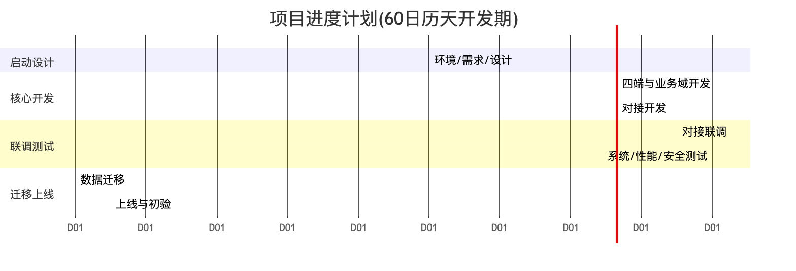

<center>图3-3 进度甘特图</center>

**60日历天开发期周计划分解**（以书面开工通知为第0天，实际以启动会确认为准）：

| 周次 | 主要任务 | 阶段产出 |
|:----|:--------|:--------|
| 第1周 | 环境搭建、需求最终确认、详细设计启动 | 环境就绪、需求规格基线 |
| 第2周 | 详细设计、数据库设计、技术验证、对接规范对齐 | 设计文档、库表设计 |
| 第3—4周 | 用户主链路开发（找房/核验/选房/签约）、郑好办与核验对接 | 主链路可演示 |
| 第5—6周 | 缴费/入住/合同开发、支付与签章对接 | 交易链路可演示 |
| 第7周 | 续租/退租/开票、生活服务、企业客户、运营与看板开发 | 全功能基本完成 |
| 第8周 | 对接联调、系统测试、性能与安全测试、缺陷修复 | 测试报告、缺陷清零 |
| 第9周 | 数据迁移演练与正式迁移、灰度验证 | 迁移完成、灰度通过 |
| 第9—10周内收尾 | 上线部署、初验准备与初验 | 上线运行、初步验收 |

各阶段存在合理并行与交叠以压缩工期；关键路径为"需求确认→主链路开发→关键对接联调→系统测试→数据迁移→上线"。我方将在启动会上与甲方确认细化到周/到人的作战计划，并按周跟踪偏差、及时纠偏，确保60日历天内完成开发部署并具备上线条件。

### 3.3.3 迭代任务分解

按"用户旅程优先"的原则安排迭代顺序：优先打通"找房—核验—选房—签约—缴费—入住"主链路，再完善续租/退租/开票、生活服务、企业客户、运营与看板，保证主干业务尽早可用、可演示。每个迭代输出功能清单、验收标准与演示。

### 3.3.4 需求管理

- 建立需求登记与变更台账，需求来源、状态、责任人清晰；
- 需求变更走变更评审，评估影响后再实施（详见 3.6 变更管理）；
- 以功能清单为基线，逐项跟踪实现与验收状态，确保"不缺项、不漏项"。

## 3.4 开发测试与协作管理

### 3.4.1 协作机制

- **例会**：每日站会同步进展与阻塞，每周周会对齐计划与风险；
- **协同工具**：需求/任务/缺陷统一在协作平台跟踪，代码统一版本管理；
- **甲方协同**：设立与甲方的固定沟通窗口，周报周知、月报总结、重大事项即时沟通。

### 3.4.2 测试管理

建立"单元测试—集成测试—系统测试—验收测试"多层测试体系：

- **单元测试**：开发自测关键逻辑；
- **集成测试**：业务域间与对接接口集成验证；
- **系统测试**：按功能清单与业务流程全面测试；
- **验收测试**：配合甲方开展验收，覆盖关键业务场景。


<center>图3-4 测试流程图</center>

### 3.4.3 关键业务测试用例样例

| 编号 | 场景 | 前置 | 步骤 | 预期 |
|:----|:----|:----|:----|:----|
| TC-01 | 保租房资格核验通过 | 用户已郑好办登录 | 发起办事→系统核验社保/住房 | 核验通过，可进入选房 |
| TC-02 | 资格不符与申诉 | 存在不符项 | 展示不符项→提交申诉→审批通过 | 申诉通过后可继续办理 |
| TC-03 | 押金未缴不得缴租 | 押金账单未缴 | 尝试缴纳租期账单 | 系统阻止并提示先缴押金 |
| TC-04 | 支付回调丢失兜底 | 支付成功但回调丢失 | 触发定时查单 | 系统查单补推进，账单标记已缴 |
| TC-05 | 退租按日精算 | 在租合同 | 审批核定实际退租日期 | 退款按日精算并锁定金额 |
| TC-06 | 一房多签防护 | 房源已被签约 | 另一用户尝试选该房 | 系统拒绝，房源不可选 |

### 3.4.4 缺陷管理细则

缺陷按严重程度分级（致命/严重/一般/轻微），全程在缺陷管理平台跟踪"发现—定位—修复—验证—关闭"闭环；致命/严重缺陷优先处理，回归测试防止引入新问题；上线前致命/严重缺陷清零。


<center>图3-5 缺陷管理流程图</center>

### 3.4.5 质量保证

- 代码评审（Code Review）覆盖关键改动；
- 静态代码检查与规范校验；
- 持续集成（编译/测试自动化）保证主干可用；
- 关键交易（支付、退款、核验）专项质量校验。

### 3.4.6 性能压测方案

针对集中选房、集中缴费等高峰场景开展性能压测：设定并发目标与响应时间目标，使用压测工具模拟高并发，观测响应时间、吞吐、错误率与资源占用，定位瓶颈并优化（数据库索引、缓存、连接池、慢查询治理），出具压测报告。

### 3.4.7 测试环境与测试数据管理

建立与生产环境隔离的独立测试环境，用于系统测试、性能压测、数据迁移演练与灰度验证。测试环境与生产环境在中间件版本、数据库结构上保持一致，保证测试结果可信。测试数据管理遵循以下原则：

- **数据脱敏**：从生产/存量提取的测试数据必须脱敏（身份证、手机号、人脸等敏感字段），严禁真实敏感数据流入测试环境；
- **数据可复位**：测试数据集可一键重置，保证每轮测试起点一致、结果可复现；
- **覆盖典型场景**：构造覆盖多业态、多状态（在租/退租/欠费/申诉）、边界值（临期、逾期、零元账单）的测试数据，保证测试充分。

### 3.4.8 持续集成与自动化保障

建立持续集成（CI）流水线：代码提交后自动触发编译、静态检查与自动化测试，主干构建失败即时告警、快速修复，保证"主干随时可编译、可部署"。关键交易链路（核验、支付、退款、签署）编写自动化回归用例，每次重要改动后自动回归，防止"改一处、坏一片"。构建产物版本化归档，与 Git 标签一一对应，支持按版本快速部署与回滚。此机制既契合招标"源代码可独立编译生成与生产环境一致的可执行文件"的要求，也为六年运维期的持续迭代提供了稳定的工程底座。

## 3.5 配置与变更管理

### 3.5.1 配置管理

- **代码配置**：统一版本管理（Git），分支策略清晰（主干/开发/发布），标签管理版本；
- **环境配置**：开发/测试/生产环境配置分离，敏感配置加密管理；
- **制品配置**：构建产物版本化，可追溯、可回滚。

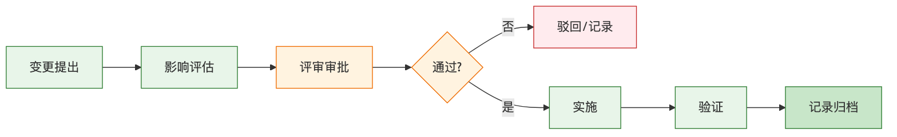

<center>图3-6 变更管理流程图</center>

### 3.5.2 变更管理

变更（需求/设计/代码/配置）走统一变更流程：提出→评估影响→评审审批→实施→验证→记录。重大变更需甲方确认，所有变更留痕可追溯，防止无序变更影响进度与质量。

## 3.6 技术规范管控

### 3.6.1 编码规范细则（要点）

- 遵循阿里《Java 开发手册》，命名、注释、异常处理规范统一；
- 新代码统一采用 MyBatis-Plus，优先使用 BaseMapper 通用方法，减少样板 XML；
- 前端遵循组件规范与目录约定，API 统一管理；
- 提交信息规范，关键改动关联需求/缺陷编号。

### 3.6.2 数据库规范细则（要点）

- 表/字段命名语义清晰、统一字符集；
- 统一逻辑删除字段与全局配置；
- 索引合理、防重唯一索引到位；
- 金额/时间字段类型与精度统一；
- 变更脚本版本化、可回滚，生产变更审慎评审。

## 3.7 部署对接及运行测试保障

### 3.7.1 外部对接联调计划

对接联调是本项目的关键环节，需与多个外部系统协同，制定专项联调计划：

| 对接项 | 联调内容 | 保障措施 |
|:------|:--------|:--------|
| 郑好办用户体系 | 授权登录、用户信息 | 提前对接规范、联调环境准备 |
| 政务数据核验 | 社保/婚姻/学历/住房核验 | 合规网络通道、容错降级验证 |
| 港区支付 | 下单/回调/查询/退款 | 幂等与对账专项验证 |
| 电子签章 | 模板/签署/回调/归档 | 签署全链路联调 |
| 人脸识别 | 实人核身 | 端上能力联调 |
| 地图/开票 | 点位/开票 | 功能联调 |

联调按"接口连通—单场景验证—全流程贯通—异常演练"推进，确保上线前对接稳定可靠。

### 3.7.2 运行测试保障

上线前完成系统运行测试：功能回归、性能压测、安全测试、数据迁移校验、灰度验证，形成测试报告，确保系统在生产环境稳定运行。

### 3.7.3 上线切换方案与回退预案

系统上线采取"停机窗口迁移 + 灰度验证 + 全量放开"的稳妥切换策略，最大限度降低对在办业务的影响：

1. **上线前准备**：完成生产环境部署与配置核对、数据迁移演练通过、回退预案与操作清单准备就绪、上线值守人员与甲方接口人到位；
2. **切换执行**：在与甲方约定的低峰停机窗口执行存量数据正式迁移与系统切换，迁移完成后立即执行迁后校验（数据量核对、关键业务抽验）；
3. **灰度验证**：先开放核心链路（登录、找房、账单查看）供小范围验证，确认无误后逐步放开全部功能；
4. **回退预案**：切换过程中若出现重大阻断问题且短时无法修复，立即按回退预案恢复到切换前状态（保留切换前数据库快照与原系统入口），保证业务连续，择期重新上线。

上线切换全程有操作清单、时间节点与责任人，关键步骤双人复核，做到"每一步可控、出问题可退"。

## 3.8 低成本、标准化实现系统互联互通

系统以"标准化接口 + 统一网关 + 能力封装"实现低成本互联互通：

- **标准化**：对外对内接口统一采用 RESTful+JSON+HTTPS，遵循各外部系统对接规范，降低对接与维护成本；
- **能力封装**：将支付、签约、核验等外部能力封装为内部统一服务，业务域复用同一封装，避免重复对接；
- **配置化**：对接参数、业态规则配置化，环境切换与规则调整无需大规模改码；
- **一套多端**：群众端 uni-app 一套代码多端发布，后端一套服务支撑四端，显著降低多端互通成本。

这些举措使系统在满足互联互通要求的同时，把建设与长期运维成本控制在合理范围，契合驻场服务模式。

## 3.9 项目风险管理

### 3.9.1 风险管理机制

建立"识别—评估—应对—监控"的风险管理闭环，项目经理牵头维护风险登记册，定期评审风险状态与应对进展。

### 3.9.2 项目风险登记册

| 风险 | 影响 | 应对措施 |
|:----|:----|:--------|
| 政务接口不稳定/变更 | 核验受阻 | 容错降级、留痕、与数据方保持沟通、申诉兜底 |
| 需求频繁变更 | 进度压力 | 迭代吸收、变更评审、基线管控 |
| 关键人员变动 | 进度/质量波动 | AB角、文档沉淀、平滑交接 |
| 数据迁移质量 | 业务连续性 | 分步迁移、全表校验、试迁与回退预案 |
| 业务高峰性能 | 可用性 | 压测、缓存、水平扩展、限流 |
| 资金对账差错 | 资金安全 | 幂等、对账、台账、专项校验 |

### 3.9.3 风险升级路径

一般风险由项目经理处置；重大风险按"项目经理→管理层→决策层"升级，必要时与甲方协商应对，保证风险可控。

### 3.9.4 项目沟通管理计划

- **周报**：每周向甲方报送进展、计划、风险；
- **月报**：每月总结（运维期每月末前2个工作日报送运维月报）；
- **例会**：定期项目例会与专题会；
- **即时沟通**：重大事项即时沟通与响应。

## 3.10 项目文档管理

交付并持续维护完整项目文档：需求规格、设计文档、接口文档、测试文档、部署文档、操作手册、运维手册、源代码及编译部署说明。文档随开发同步更新、版本化管理，保证交付物齐全、可维护、可移交。

## 3.11 培训管理

为保证系统顺利交付使用，我方制定分层培训计划，覆盖管理人员、运营人员与运维人员：

| 培训对象 | 培训内容 | 形式 | 时机 |
|:--------|:--------|:----|:-----|
| 业务管理人员 | 房源/合同/账单/审批等日常操作 | 现场授课+实操 | 上线前 |
| 运营人员 | 首页配置、优惠券、消息公告运营 | 现场授课+实操 | 上线前 |
| 系统管理员 | 用户权限、字典参数、系统维护 | 现场授课+文档 | 上线前 |
| 甲方运维/接口人 | 部署、监控、故障处置、二次开发入门 | 专题+文档 | 上线前后 |

培训提供操作手册、培训 PPT 与录屏，培训后进行操作考核确认掌握；运维期内按需提供常态化补充培训，确保新进人员也能快速上手。

## 3.12 验收管理

系统按"初步验收—试运行—最终验收"三阶段推进：

1. **初步验收**：完成全部功能开发与部署、通过系统测试后，配合甲方进行初步验收，验收通过进入试运行；
2. **试运行**：试运行期内持续观察系统运行，因我方原因产生的故障由我方负责解决并承担费用，试运行期相应顺延；出现重大缺陷的，自缺陷修复之日起重新计算试运行期；
3. **最终验收**：完成全部功能、通过试运行、通过等保二级测评、并配合完成源代码接收校验后，进行最终验收。

我方承诺：验收不合格项无条件整改直至合格；未通过等保二级测评前不申请最终验收；交付全部源代码并保证可独立编译生成与生产环境一致的可执行文件。

## 3.13 源代码移交与知识转移

本项目按招标要求交付全部源代码，并保证甲方可独立编译、部署、维护与二次开发，杜绝技术锁定：

- **源代码完整交付**：交付前后端全部源代码、数据库脚本、配置样例与依赖清单，代码结构清晰、注释完整；
- **可独立编译**：随代码交付编译部署脚本与说明文档，甲方或第三方在标准环境下可独立编译生成与生产环境一致的可执行文件；
- **知识转移**：通过技术文档移交、架构讲解、代码走读、部署演示等方式，向甲方运维与接口人员完成知识转移，确保甲方具备自主运维与继续开发的能力；
- **无技术后门与许可陷阱**：不设置任何技术后门、时间锁或商业许可限制，源代码及交付物知识产权按合同约定归属甲方。

知识转移在运维期内持续开展，形成"文档 + 讲解 + 陪同实操"的常态化机制，逐步降低甲方对我方的依赖，真正实现"交得出、接得住、用得好"。

## 3.14 项目实施保障承诺

为保证项目在 60 日历天内高质量交付并平稳进入六年运维期，我方作出如下实施保障承诺：

1. **进度承诺**：严格按经甲方确认的作战计划推进，按周跟踪偏差、及时纠偏，确保开发期内完成开发部署并具备上线条件；
2. **质量承诺**：以多层测试与代码评审为质量底线，上线前致命/严重缺陷清零，关键交易零资金差错；
3. **人力承诺**：研发服务总投入不少于 37 人月，若总人月内未完成约定交付，我方自担费用继续投入直至如期交付；
4. **配合承诺**：全程配合甲方管理要求、验收要求与等保测评要求，不合格项无条件整改；
5. **连续承诺**：开发期与运维期人员平滑衔接，关键岗位不断档，保证服务连续性。

上述承诺纳入项目管理并接受甲方监督，作为我方履约的刚性约束。

\newpage

# 第四章 系统安全管理

## 4.1 安全管理总体策略

本系统承载群众个人信息与资金交易，安全是不可逾越的底线。安全管理总体策略概括为"**纵深防御、全程管控、合规达标**"：

- **纵深防御**：从物理、网络、边界、主机、应用、数据到管理，构建多层防线，任一层被突破仍有后续防线；
- **全程管控**：安全贯穿开发、测试、上线、运行、运维全生命周期（DevSecOps），而非事后补救；
- **合规达标**：适配信息系统安全技术与安全管理要求，满足二级等保各项控制措施，依法保护个人信息。


<center>图4-1 纵深防御体系图</center>

本章按招标评审点依次阐述：系统漏洞风险防控、病毒风险防控、黑客攻击风险防控、管理制度缺陷风险防控、二级等保安全控制措施，并补充个人信息与密码应用专项、安全测试与日常运营。

## 4.2 系统漏洞风险防控

### 4.2.1 开发阶段漏洞预防

- **安全编码规范**：制定并执行安全编码规范，从源头防范 SQL 注入、XSS、越权、敏感信息泄露等常见漏洞；
- **安全代码评审**：关键改动纳入代码评审，重点检查输入校验、权限校验、加密处理；
- **依赖安全**：对第三方组件进行来源与版本管控，及时跟进已知漏洞（如框架安全公告）并升级，规避已知 CVE 风险；
- **安全设计评审**：涉及认证、支付、政务对接的功能在设计阶段做安全评审。

### 4.2.2 运行阶段漏洞管理

- **漏洞扫描**：定期对系统进行漏洞扫描（应用、主机、中间件、数据库）；
- **漏洞处置闭环**：发现漏洞按严重程度分级处置，"发现—评估—修复—验证—复扫"闭环；
- **补丁管理**：操作系统、中间件、数据库补丁定期评估更新，兼顾安全与稳定；
- **应急响应**：对高危漏洞启动应急响应，第一时间缓解并修复。

### 4.2.3 安全基线配置规范

对操作系统、数据库、中间件、Web 服务建立并执行安全基线：关闭无用端口与服务、最小权限账号、强口令策略、日志开启、默认账号处理、超时与锁定策略等，定期核查基线符合性。

### 4.2.4 常见漏洞类型与防护措施对照

针对 Web 应用常见漏洞（参照 OWASP 通用威胁），我方在编码、配置、运行三个层面建立系统性防护，形成"类型—风险—防护措施"对照，确保逐类可防、可查、可验：

| 漏洞类型 | 风险 | 防护措施 |
|:--------|:----|:--------|
| SQL 注入 | 数据泄露/篡改 | 参数化查询、ORM 预编译、输入校验、最小库权限 |
| 跨站脚本 XSS | 会话窃取/挂马 | 输出编码、富文本白名单过滤、CSP 策略 |
| 越权访问 | 数据横向/纵向越权 | 对象级权限校验、数据权限限定、接口鉴权 |
| CSRF | 伪造请求 | Token 校验、同源校验、关键操作二次确认 |
| 敏感信息泄露 | 隐私/凭证外泄 | 加密存储、展示脱敏、日志脱敏、错误信息屏蔽 |
| 文件上传漏洞 | 上传木马 | 类型/大小校验、重命名存储、病毒扫描、非执行目录 |
| 认证会话缺陷 | 冒用身份 | JWT+Redis 可控失效、登录锁定、强口令 |
| 失效访问控制 | 未授权操作 | 默认拒绝、白名单授权、注解式权限拦截 |
| 安全配置错误 | 暴露攻击面 | 安全基线、关闭默认账号/无用服务、最小暴露 |
| 组件已知漏洞 | 被利用 CVE | 依赖清单、版本管控、漏洞跟踪与及时升级 |

上述每类漏洞在开发阶段由安全编码规范与代码评审预防，在测试阶段由漏洞扫描与渗透测试验证，在运行阶段由监控告警与应急处置兜底，形成全周期闭环。

## 4.3 病毒风险防控

- **主机防护**：服务器部署防病毒/防恶意软件能力，定期更新病毒库与全盘扫描；
- **上传文件安全**：对用户上传文件做类型/大小校验与病毒扫描，隔离可疑文件，防止恶意文件上传与传播；
- **来源管控**：软件与组件仅从可信来源获取并校验完整性，防止携带恶意代码；
- **介质管理**：规范移动介质使用，防止病毒经介质传入；
- **定期巡检**：将病毒防护纳入日常巡检，发现异常及时处置。

## 4.4 黑客攻击风险防控

### 4.4.1 网络边界防护

- 部署防火墙进行访问控制，仅开放必要端口与服务；
- 反向代理统一入口，隐藏内部结构；
- 政务数据对接经合规网络代理通道，边界访问最小化；
- 具备抗常见网络攻击（如流量异常）的监测与处置能力。

### 4.4.2 应用层攻击防护

- **注入与XSS**：参数化查询、输入校验、输出编码，防 SQL 注入与跨站脚本；
- **越权防护**：对象级权限校验，防水平/垂直越权；
- **CSRF/重放**：令牌校验、时间戳/随机数防重放；
- **暴力破解**：登录失败锁定、验证码、频率限制；
- **接口限流**：网关限流防刷，保护后端；
- **敏感操作**：关键操作二次确认与审计。

### 4.4.3 数据安全防护

- 传输 HTTPS 加密，存储敏感字段加密；
- 展示脱敏（身份证、手机号、银行/支付信息）；
- 数据库最小权限、访问审计、防拖库；
- 备份数据加密与安全存放。

### 4.4.4 渗透测试与攻防演练

上线前及运维期定期开展渗透测试与攻防演练，模拟真实攻击验证防护有效性，对发现问题闭环整改，持续提升安全水位。

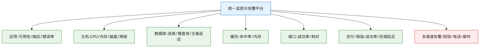

<center>图4-2 系统监控与安全告警体系图</center>

### 4.4.5 网络分区与访问控制策略

系统按"分区分域、最小连通"原则划分网络区域，各区之间通过访问控制策略严格管控，降低横向渗透风险：

| 区域 | 承载 | 访问控制策略 |
|:----|:----|:-----------|
| 公网接入区 | 反向代理/负载均衡 | 仅开放 HTTPS，隐藏内部结构 |
| 应用区 | 后端应用实例 | 仅接受接入区转发，禁止直接公网访问 |
| 数据区 | 数据库、缓存 | 仅应用区可访问，最小端口、最小账号权限 |
| 政务对接区 | 政务数据代理通道 | 经合规代理定向访问，白名单限制 |
| 管理运维区 | 运维与监控 | 堡垒机/跳板访问、多因子、操作审计 |

各区之间默认拒绝、按需放行，跨区访问经防火墙策略控制并记录；管理运维通道与业务通道隔离，特权操作全程审计，做到"进得来看得见、动一下有记录"。

## 4.5 管理制度缺陷风险防控

技术防护需以管理制度为保障。本项目建立并执行以下安全管理制度（执行条款）：

**安全管理制度清单一览**：

| 制度 | 核心内容 | 执行要点 |
|:----|:--------|:--------|
| 安全责任制度 | 责任到人、纳入考核 | 明确安全第一责任人 |
| 账号权限管理制度 | 实名、最小授权、定期复核 | 离岗回收、特权专管 |
| 上线发布管理制度 | 审批、测试、回滚 | 发布留痕、发后验证 |
| 数据管理制度 | 分级、加密、脱敏、审批 | 生产数据操作禁令 |
| 日志审计制度 | 全量日志、定期审计 | 留存达标、异常追溯 |
| 安全教育制度 | 定期培训 | 意识与技能提升 |
| 第三方管理制度 | 评估、鉴权、留痕 | 最小授权对接 |
| 应急响应制度 | 分级、流程、演练 | 报告时限明确 |
| 制度监督检查机制 | 定期/不定期检查 | 偏差闭环整改 |

### 4.5.1 安全责任制度

明确项目经理为安全第一责任人，各岗位安全职责到人，安全事项纳入考核，责任可追溯。

### 4.5.2 账号权限管理制度

账号实名、最小授权、定期复核；离岗及时回收；特权账号专项管理与审计；禁止账号共享。

### 4.5.3 上线发布管理制度

上线走审批与发布流程，发布前完成测试与安全检查，具备回滚预案，发布后验证，全程留痕。

### 4.5.4 数据管理制度

数据分级管理，敏感数据加密与脱敏；数据导出与访问审批留痕；生产数据严禁未授权操作，遵循"生产数据真实性与操作禁令"原则。

### 4.5.5 日志审计制度

统一记录操作日志、登录日志、接口日志、安全日志，留存期满足要求，定期审计异常行为。

### 4.5.6 安全教育制度

定期对团队开展安全意识与技能培训，提升整体安全能力。

### 4.5.7 第三方管理制度

对接第三方须评估安全合规，接口鉴权与最小授权，数据交换留痕。

### 4.5.8 应急响应制度

制定安全应急预案，明确分级、流程、职责与报告时限，定期演练。

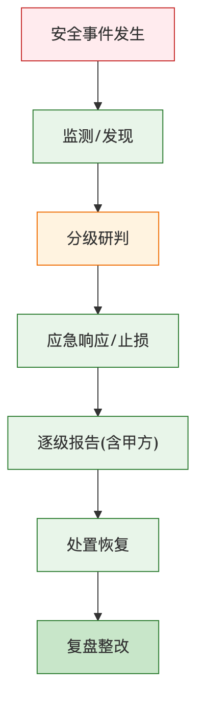

<center>图4-3 安全应急预案流程图</center>

### 4.5.9 制度执行监督与检查机制

设立定期与不定期检查机制，检查制度执行情况，对偏差整改闭环，保证制度落地而非停留于纸面。

## 4.6 二级等保安全控制措施

系统按 GB/T 22239 二级等保要求适配以下控制措施：

### 4.6.1 安全物理环境

依托合规机房，具备门禁、监控、防火、防水、防雷、温湿度控制与可靠供电，物理访问受控。

### 4.6.2 安全通信网络

网络架构合理分区，通信传输加密（HTTPS/TLS），关键网络设备与链路具备可靠性保障。

### 4.6.3 安全区域边界

边界访问控制、入侵防范、恶意代码防范、安全审计到位，非法接入与外联受控。

### 4.6.4 安全计算环境

主机与应用具备身份鉴别、访问控制、安全审计、入侵防范、恶意代码防范、数据完整性与保密性保护、个人信息保护等控制。

### 4.6.5 安全管理中心

集中的系统管理、审计管理与安全管理，统一监控、日志与告警，集中管控安全状态。

### 4.6.6 安全管理体系

覆盖安全管理制度、安全管理机构、安全管理人员、安全建设管理与安全运维管理，形成技管结合的完整体系。

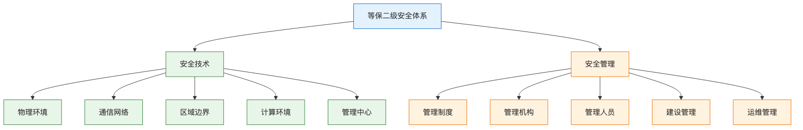

<center>图4-4 等保二级安全体系图</center>

### 4.6.7 二级等保控制点符合性对照

为便于甲方与测评机构核查，我方将系统安全设计与二级等保主要控制项逐条对应，形成符合性对照表（节选核心控制点）：

| 等保类别 | 控制要求 | 本系统落实措施 |
|:--------|:--------|:--------------|
| 身份鉴别 | 用户身份唯一标识与鉴别 | 群众端郑好办授权登录、后台账号口令登录，统一 JWT 令牌 |
| 身份鉴别 | 登录失败处理 | 失败次数锁定、验证码、异常告警 |
| 访问控制 | 最小授权与职责分离 | RBAC 四级权限、数据权限、特权账号专管 |
| 访问控制 | 默认拒绝原则 | 接口默认鉴权、白名单授权、越权拦截 |
| 安全审计 | 覆盖重要用户与操作 | 操作/登录/接口/安全日志全覆盖，留痕可追溯 |
| 安全审计 | 日志保护与留存 | 日志集中存储、防篡改、留存期满足要求 |
| 入侵防范 | 边界与主机入侵防范 | 防火墙、反向代理、基线加固、异常监测 |
| 恶意代码防范 | 主机与上传防护 | 防病毒、上传文件扫描、可信来源管控 |
| 数据完整性 | 传输与存储完整性 | HTTPS/TLS 传输、关键数据校验、事务保证 |
| 数据保密性 | 敏感数据加密 | 身份证/人脸/支付加密存储、传输加密 |
| 数据备份恢复 | 备份与可恢复 | 定期备份、异地/异盘存放、定期恢复演练 |
| 个人信息保护 | 采集使用合规 | 最小必要、明示同意、脱敏、合规删除 |
| 安全管理制度 | 制度健全并执行 | 九类安全制度并配套检查监督机制 |
| 安全运维管理 | 变更/漏洞/应急管理 | 变更审批、漏洞闭环、应急预案与演练 |

我方承诺配合甲方完成二级等保测评，测评发现问题无条件闭环整改，未通过等保二级测评前不申请最终验收。

## 4.7 个人信息与密码应用专项设计

### 4.7.1 个人信息保护专项

- **最小必要**：仅采集业务必需的个人信息；
- **明示同意**：采集人脸、身份等敏感信息前明示并获取同意；
- **加密与脱敏**：敏感信息加密存储、展示脱敏；
- **权限最小**：个人信息访问最小授权、访问留痕；
- **合规删除**：按规定处理个人信息的保存与删除，遵循 GB/T 35273。

### 4.7.2 密码应用设计

- 传输与关键存储采用合规加密算法；
- 口令加盐哈希存储，不可逆；
- 密钥安全管理，避免硬编码；
- 支付、签章等关键环节遵循相应密码与安全规范。

### 4.7.3 数据分级分类与保护策略

对系统数据按敏感程度分级，差异化施加保护，做到"该严的严、该省的省"，兼顾安全与效率：

| 数据级别 | 典型数据 | 保护策略 |
|:--------|:--------|:--------|
| 核心敏感 | 身份证号、人脸、支付/银行信息 | 加密存储、展示脱敏、最小授权、访问留痕、严禁导出 |
| 重要业务 | 合同、账单、退款、核验记录 | 权限控制、操作审计、事务保护、备份 |
| 一般业务 | 房源、公告、活动、消息 | 常规权限与备份 |
| 公开数据 | 政策文件、对外展示内容 | 完整性保护，防篡改 |

数据分级贯穿采集、传输、存储、使用、销毁全生命周期：采集遵循最小必要与明示同意，传输统一 HTTPS，存储按级别加密，使用按级别授权并留痕，销毁按规定合规处理。个人信息处理全过程符合 GB/T 35273 要求。

## 4.8 安全测试与验证

上线前开展安全测试（漏洞扫描、渗透测试、配置基线核查、权限与越权测试、敏感信息泄露检查），形成安全测试报告并闭环整改；运维期定期复测，保证系统持续满足安全要求并通过等保测评。

**安全测试内容清单**：

| 测试项 | 测试内容 | 通过标准 |
|:------|:--------|:--------|
| 漏洞扫描 | 应用/主机/中间件/数据库扫描 | 高危漏洞清零、中危受控 |
| 渗透测试 | 模拟真实攻击验证防护 | 无可利用的高危路径 |
| 越权测试 | 水平/垂直越权 | 无越权访问 |
| 敏感信息 | 传输/存储/日志泄露检查 | 无明文敏感信息泄露 |
| 基线核查 | 系统/库/中间件基线 | 符合安全基线 |
| 认证会话 | 登录/令牌/会话安全 | 无绕过与固定会话 |

## 4.9 日常安全运营与安全事件分级报告

### 4.9.1 日常安全运营

- 安全监控与告警 7×24 值守；
- 定期漏洞扫描、日志审计、基线核查；
- 安全补丁与病毒库定期更新；
- 安全事件登记与复盘持续改进。

### 4.9.2 安全事件分级与报告时限

安全事件按影响程度分级（特别重大/重大/较大/一般），按预案在规定时限内逐级报告与处置，重大及以上事件第一时间响应、报告甲方并启动应急，事后复盘整改，防止再次发生。

### 4.9.3 安全应急分场景处置预案

针对典型安全事件场景，预置处置预案，做到"事发有章可循、处置有条不紊"：

| 场景 | 首要处置 | 后续处置 |
|:----|:--------|:--------|
| 数据疑似泄露 | 隔离受影响系统、冻结相关账号 | 溯源定级、报告甲方、评估影响、整改加固 |
| 遭受网络攻击 | 边界拦截、限流、封禁异常来源 | 分析攻击路径、修复漏洞、加固防护 |
| 发现高危漏洞 | 评估暴露面、临时缓解 | 打补丁/升级、复扫验证、闭环记录 |
| 病毒/恶意文件 | 隔离清除、阻断传播 | 全盘扫描、来源排查、防护升级 |
| 账号异常/越权 | 强制下线、回收权限 | 审计溯源、修复权限缺陷 |
| 系统被篡改 | 下线止损、切换备份 | 恢复可信版本、溯源、加固 |

所有安全事件登记建档、复盘改进，重大及以上事件按报告时限上报甲方与相关主管部门。

### 4.9.4 安全管理组织与责任矩阵

安全管理"技管结合、责任到人"，明确各角色安全职责：

| 角色 | 安全职责 |
|:----|:--------|
| 安全第一责任人（项目经理） | 统筹安全管理、资源保障、重大事件决策 |
| 开发人员 | 安全编码、漏洞修复、配合安全评审 |
| 测试人员 | 安全测试、越权/渗透验证、缺陷跟踪 |
| 实施运维人员 | 基线加固、监控值守、补丁更新、应急处置 |
| 全体成员 | 遵守安全制度、参加安全培训、报告安全隐患 |

安全职责纳入项目考核，责任可追溯，确保安全要求落到实处而非停留纸面。

\newpage

# 第五章 系统运维管理

## 5.1 运维管理总体框架

本项目提供六年免费运维服务（自最终验收合格之日起），运维管理总体框架为"**一支驻场队伍、一套运维制度、一组监控工具、一条响应链路**"，覆盖招标运维要求的全部子项：系统部署升级、运维制度、运维技术工具、服务响应、运维范围、指标考核、日常维护、故障应急处置、系统及软件运行保障、人员配置、数据备份。

运维硬性约束：故障响应时限 **紧急10分钟、一般2小时**；远程服务 **7×24小时** 响应（热线电话、网络支持、邮件报送）；驻场按甲方考勤，**周运维报送、月度运维报告（每月末前2个工作日报送）**、故障处理记录台账。本章各项均以此为准。

## 5.2 系统部署升级

### 5.2.1 发布流程细化

系统升级发布遵循标准化流程，保证"升级不中断业务、可验证、可回滚"：

1. **需求确认**：明确升级内容与影响范围，报甲方审批；
2. **测试验证**：在测试环境完成功能与回归测试、安全检查；
3. **发布准备**：准备发布包、部署脚本、数据库变更脚本与回滚预案；
4. **窗口发布**：选择业务低峰窗口发布，必要时灰度；
5. **发布验证**：按验证清单核验关键功能与关键交易；
6. **回滚机制**：验证不通过立即回滚，保证系统可用；
7. **记录归档**：发布过程与结果记录归档。

### 5.2.2 发布验证清单（模板）

| 序号 | 验证项 | 通过标准 |
|:----|:------|:--------|
| 1 | 服务启动与健康检查 | 全部实例正常 |
| 2 | 登录与鉴权 | 四端可正常登录 |
| 3 | 核心业务（选房/签约/缴费/退租） | 关键流程可走通 |
| 4 | 支付与回调 | 下单/回调/对账正常 |
| 5 | 政务核验 | 核验接口连通、容错正常 |
| 6 | 数据一致性 | 关键数据无异常 |
| 7 | 监控与日志 | 监控采集、日志输出正常 |

## 5.3 运维制度

建立并执行以下运维制度，保证运维工作规范有序：

### 5.3.1 值班制度

7×24 值班安排，明确值班人员、职责与交接要求，热线电话畅通，保证任何时段有人响应。

### 5.3.2 巡检制度

每日巡检系统运行状态（服务、数据库、缓存、磁盘、接口、备份），记录巡检结果，发现隐患及时处置。

### 5.3.3 故障管理制度

故障"发现—登记—响应—处置—恢复—复盘"闭环管理，按级别在规定时限响应，形成故障处理记录台账。

### 5.3.4 备份制度

按备份策略执行数据与配置备份，定期校验备份可用性并开展恢复演练。

### 5.3.5 报送制度

周运维报送、月度运维报告（每月末前2个工作日报送），重大事项即时报送甲方。

### 5.3.6 交接班制度

值班交接明确未完成事项、风险与注意点，保证运维连续。

## 5.4 运维技术工具

### 5.4.1 监控工具与指标

部署系统监控工具，对以下指标监控并设置告警阈值：

| 监控对象 | 关键指标 | 告警阈值（示例） |
|:--------|:--------|:--------------|
| 应用服务 | 可用性、响应时间、错误率 | 错误率>1%、响应>阈值 |
| 主机资源 | CPU、内存、磁盘、网络 | 使用率>85% |
| 数据库 | 连接数、慢查询、主备延迟 | 慢查询突增、延迟>阈值 |
| 缓存 | 命中率、内存、连接 | 命中率骤降、内存超限 |
| 接口对接 | 成功率、耗时 | 成功率<阈值 |
| 支付/核验 | 交易成功率、回调延迟 | 成功率下降告警 |


<center>图5-1 监控体系分层图</center>

### 5.4.2 日志与告警工具

统一日志采集与检索，关键异常触发多渠道告警（短信/电话/邮件），保证故障第一时间被发现。

### 5.4.3 运维工具清单

我方为本项目运维配置成熟的工具链，覆盖监控、日志、告警、发布、备份各环节，做到"看得见、管得住、动得快"：

| 工具类别 | 用途 | 说明 |
|:--------|:----|:----|
| 监控告警 | 主机/应用/中间件/业务指标监控 | 阈值告警、趋势分析 |
| 日志管理 | 日志采集、检索、审计 | 集中存储、按关键字快速定位 |
| 发布部署 | 版本发布、回滚 | 脚本化/版本化、可回退 |
| 备份恢复 | 数据/配置备份与恢复 | 定期备份、恢复演练 |
| 堡垒机 | 运维访问审计 | 特权操作留痕 |
| 工单系统 | 报障/需求/进度跟踪 | 台账化、可追溯 |

工具选型以"成熟稳定、低成本、易维护"为原则，优先复用甲方现有运维设施，避免重复建设与额外费用。

### 5.4.4 自动化运维能力

在常规运维之上引入适度自动化，降低人工操作风险、提升响应速度：健康检查与关键指标采集自动化、异常自动告警、备份任务定时自动执行并校验、发布与回滚脚本化。自动化范围以"稳妥可控"为界，关键变更仍保留人工审批与复核环节，避免自动化误操作放大影响。

## 5.5 服务响应

### 5.5.1 服务响应方式

提供 7×24 小时热线电话、网络支持、邮件报送三种响应方式，多渠道保证甲方可随时触达。

### 5.5.2 工单处理流程

报障/需求 → 工单登记 → 分派 → 处置 → 反馈 → 关闭，全程台账化，处理进度与结果可查。

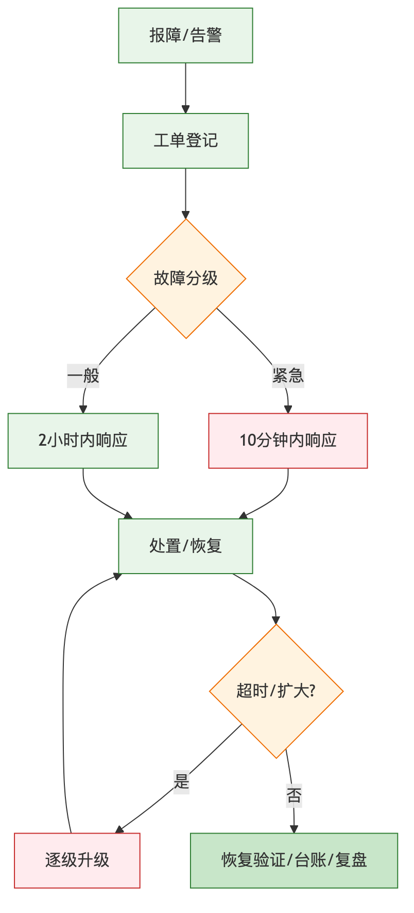

<center>图5-2 故障响应流程图</center>

### 5.5.3 故障处理记录台账（模板）

| 字段 | 说明 |
|:----|:----|
| 工单编号 | 唯一编号 |
| 报障时间/来源 | 时间与渠道 |
| 故障级别 | 紧急/一般 |
| 现象描述 | 故障表现 |
| 响应时间 | 首次响应时间 |
| 处置过程 | 定位与处理 |
| 恢复时间 | 恢复时间 |
| 根因与改进 | 复盘结论 |

### 5.5.4 服务级别协议（SLA）矩阵

| 故障级别 | 判定 | 响应时限 | 处置目标 |
|:--------|:----|:--------|:--------|
| 紧急 | 系统不可用、资金/核验受阻 | 10分钟内响应 | 尽快恢复，全程跟进 |
| 一般 | 局部功能异常、不影响主流程 | 2小时内响应 | 限时解决 |
| 咨询/优化 | 使用咨询、优化建议 | 按约定响应 | 计划内处理 |

### 5.5.5 问题升级路径

超时未解决或影响扩大时，按"值班运维→运维负责人→项目经理→公司支持/甲方协同"逐级升级，调动资源保障解决。

## 5.6 运维范围

运维范围涵盖：

- **应用系统运维**：四端应用与后端服务的运行保障、缺陷修复、小幅优化；
- **数据库与中间件运维**：MySQL、Redis、Nginx/OpenResty 等运行保障；
- **对接运维**：郑好办、政务核验、支付、签章等对接的稳定性保障；
- **数据运维**：备份、恢复、数据一致性维护；
- **安全运维**：安全监控、漏洞与补丁、基线核查；
- **用户支持**：操作答疑、常态化培训。

（不含甲方自有网络、机房等基础设施的产权责任，但配合甲方处理相关问题。）

### 5.6.1 运维责任边界

为避免责任不清导致的推诿，明确我方与甲方的运维责任边界：

| 事项 | 我方职责 | 甲方职责 |
|:----|:--------|:--------|
| 应用系统运行 | 负责保障、修复、优化 | 提出需求、验收 |
| 数据库/中间件 | 负责运维保障 | 提供资源与权限 |
| 外部对接稳定性 | 负责我方侧适配与容错 | 协调第三方/政务侧 |
| 基础设施（网络/机房） | 配合排查 | 承担产权与保障责任 |
| 数据备份与恢复 | 执行备份、演练、恢复 | 提供存储资源、确认策略 |
| 安全事件 | 技术处置、报告 | 决策、对外协调 |

责任边界在运维服务协议中明确，遇跨边界问题双方协同处置，我方不因边界问题推诿或延误响应。

## 5.7 指标考核

建立运维服务考核指标，接受甲方监督：

| 指标 | 目标 |
|:----|:----|
| 系统可用率 | 达到约定目标 |
| 紧急故障响应达成率 | 10分钟内响应达成 |
| 一般故障响应达成率 | 2小时内响应达成 |
| 备份成功率 | 100% |
| 月报及时率 | 每月末前2个工作日报送 |
| 用户满意度 | 达到约定目标 |

考核结果与运维保证金结算挂钩，激励持续改进。

## 5.8 日常维护

### 5.8.1 周维护与月维护检查清单

- **周维护**：日志清理与审计、备份校验、性能巡检、隐患排查、周报报送；
- **月维护**：容量评估、补丁评估、安全基线核查、数据一致性抽查、月度运维报告。

### 5.8.2 日巡检记录表（模板）

| 巡检项 | 正常标准 | 结果 |
|:------|:--------|:----|
| 服务运行 | 全部在线 | □ |
| 主机资源 | 使用率正常 | □ |
| 数据库 | 无异常、主备正常 | □ |
| 备份 | 昨日备份成功 | □ |
| 接口对接 | 成功率正常 | □ |
| 告警 | 无未处理告警 | □ |

## 5.9 故障应急处置

针对高频高影响故障场景制定处置卡，保证快速处置：

### 5.9.1 场景一：应用服务宕机

判定→切流量至健康实例→重启/扩容→定位根因→恢复验证→复盘。

### 5.9.2 场景二：数据库故障

判定→主备切换（如适用）→止损→恢复→数据一致性校验→复盘。

### 5.9.3 场景三：支付渠道异常

判定→暂停相关缴费入口并提示→与支付方核实→恢复后对账补偿→复盘，确保无重复扣款、无漏账。

### 5.9.4 场景四：政务核验接口中断

判定→核验降级（转人工/申诉）→保障业务不中断→接口恢复后回归→复盘。

### 5.9.5 场景五：签章平台异常

判定→暂停在线签署入口并提示→与签章方核实→恢复后补签与状态校准→复盘，确保合同签署与归档不丢失、不重复。

### 5.9.6 场景六：数据异常/误操作

判定→立即止损（暂停相关操作）→依据备份与操作日志回滚或修复→数据一致性核对→复盘并强化审批与权限，防止再次发生。

### 5.9.7 故障分级响应时限对照

| 级别 | 典型场景 | 响应时限 | 处置与报告 |
|:----|:--------|:--------|:----------|
| 紧急 | 系统不可用、资金/核验/签署受阻 | 10分钟内响应 | 立即处置、全程跟进、及时报告甲方 |
| 一般 | 局部功能异常、不影响主流程 | 2小时内响应 | 限时解决、记录台账 |
| 咨询/优化 | 使用咨询、优化建议 | 按约定响应 | 计划内处理 |

### 5.9.8 应急演练计划

运维期内定期组织应急演练，覆盖宕机切换、数据库故障、备份恢复、安全事件等典型场景，检验预案有效性与团队处置能力；演练形成记录并据此优化预案与处置卡，做到"平时练、战时用"。


<center>图5-3 应急预案流程图</center>

## 5.10 系统及软件运行保障

- 保障操作系统、数据库、中间件、应用长期稳定运行；
- 定期健康检查与性能调优（慢查询治理、缓存优化、连接池调优）；
- 容量管理与扩容评估，保障业务增长下的性能；
- 版本与补丁管理，兼顾安全与稳定。

## 5.11 运维人员配置

### 5.11.1 运维团队与职责

配置稳定的驻场运维力量，涵盖运维负责人、系统/数据库运维、应用运维、安全运维等职责（可与开发团队协同复用），满足 7×24 响应与驻场要求，人员具备 3 年以上系统运维及管理经验。

### 5.11.2 用户常态化培训计划

- 上线初期集中培训管理人员操作；
- 运维期定期回访与专题培训，随功能迭代更新培训内容；
- 提供操作手册与培训材料。

### 5.11.3 运维知识库

沉淀故障案例、处置手册、常见问题、系统文档，形成运维知识库，提升处置效率、降低人员变动风险。

### 5.11.4 六年运维分年度安排

六年免费运维期内，运维工作按"稳定保障为主、迭代优化为辅"的节奏推进，各年度既有共性常态工作，也有阶段侧重：

| 年度 | 工作侧重 | 常态工作 |
|:----|:--------|:--------|
| 第1年 | 系统稳定期保障、用户培训强化、问题快速收敛 | 巡检、监控、备份、周月报、故障处置 |
| 第2—3年 | 按需迭代优化、性能与体验提升、安全复测 | 同上 + 迭代优化、等保复测配合 |
| 第4—5年 | 容量评估与优化、技术组件安全升级评估 | 同上 + 容量与版本管理 |
| 第6年 | 期满移交准备、文档与知识库完善、平稳过渡 | 同上 + 移交准备 |

每年度形成年度运维总结，回顾运行情况、故障统计、改进成效并规划下一年度重点；六年间保持人员与服务的连续性，关键岗位不断档。

## 5.12 数据备份

### 5.12.1 备份策略明细

| 备份对象 | 方式 | 频率 | 保留 |
|:--------|:----|:----|:----|
| 业务数据库 | 全量 | 每周 | 按约定周期 |
| 业务数据库 | 增量 | 每日 | 按约定周期 |
| 配置与代码 | 版本化 | 变更即备 | 长期 |
| 上传文件 | 定期 | 每日/每周 | 按约定周期 |

备份数据加密存放，异地/异介质保存，防止单点丢失。


<center>图5-4 备份恢复体系图</center>

### 5.12.2 恢复演练方案

定期开展恢复演练，验证备份可用性与恢复时效（RTO/RPO），演练结果记录并优化备份策略，确保"备得了、也恢复得了"。

**恢复目标（RTO/RPO）**：针对不同故障级别设定分层恢复目标，指导备份策略与演练：

| 故障类型 | 恢复目标 RTO | 数据丢失容忍 RPO | 恢复手段 |
|:--------|:-----------|:---------------|:--------|
| 应用实例故障 | 分钟级 | 无数据丢失 | 健康实例接管/重启扩容 |
| 数据库故障 | 小时级 | 尽量趋近于零 | 主备切换/最近备份恢复 |
| 数据误操作 | 按影响评估 | 至最近可用备份点 | 备份+操作日志回滚修复 |
| 机房级灾难 | 按约定 | 至异地备份点 | 异地/异介质备份恢复 |

具体 RTO/RPO 指标在运维协议中与甲方确认；每次恢复演练均核对是否达成目标，未达成则优化备份频率与恢复流程。

## 5.13 运维服务持续改进

建立"监控—分析—优化"的持续改进机制，基于监控数据、故障复盘、用户反馈定期优化系统与运维流程，形成改进闭环。

## 5.14 运维报告体系

- **周报**：系统运行、故障处理、待办事项；
- **月报**：运行指标、故障统计、优化情况、下月计划（每月末前2个工作日报送）；
- **专项报告**：重大变更、重大故障、安全事件专项报告。

## 5.15 运维服务期满移交方案

六年运维服务期满前，制定移交方案：整理并交付完整系统文档、源代码、运维记录与知识库，配合甲方或后续运维方开展知识转移与过渡衔接，设置过渡期保障平稳交接，运维保证金按约定在期满后结算。

\newpage

# 第六章 服务期限保证

## 6.1 服务期限总体承诺

我方郑重承诺：本项目自合同签订生效之日起至运维服务期结束，全程提供有保障的服务。核心时限承诺如下：

- **定制化开发期**：自甲方书面开工通知起 **60 日历天** 内完成定制化开发与部署实施；
- **研发投入**：研发服务总人月数 **不少于 37 人月**；
- **免费运维期**：自最终验收合格之日起提供 **6 年** 免费运维；
- **服务连续**：合同生效至运维期满，服务不间断、责任不脱节。

我方将以充足的人力、成熟的技术、规范的管理确保上述时限如期兑现，并对逾期承担违约责任。

## 6.2 项目总体进度计划

### 6.2.1 总体进度安排（60日历天开发期）

以书面开工通知为起点（记为 D0），总体进度按四阶段推进：

| 阶段 | 时间区间 | 主要工作 | 阶段成果 |
|:----|:--------|:--------|:--------|
| 启动与设计 | D0～D10 | 环境搭建、需求确认、详细设计、技术验证、数据迁移方案 | 需求与设计基线、环境就绪 |
| 核心开发 | D8～D45 | 四端与八大业务域开发、郑好办/政务核验/支付/签章对接 | 主链路可运行可演示 |
| 联调与测试 | D35～D55 | 对接联调、系统测试、性能压测、安全测试、缺陷修复 | 测试报告、缺陷清零 |
| 迁移与上线 | D50～D60 | 数据迁移、上线部署、初验准备、试运行 | 系统上线、初验 |

（各阶段存在合理交叠并行，以压缩整体工期；关键路径见 6.2.3。）


<center>图6-1 项目进度甘特图（60日历天开发期）</center>


<center>图6-2 六年免费运维年度工作安排</center>

### 6.2.2 里程碑基线管理

设置关键里程碑并纳入基线管控，逐一验收：

| 里程碑 | 计划节点 | 验收标志 |
|:------|:--------|:--------|
| M1 需求与设计确认 | D10 | 需求/设计基线通过评审 |
| M2 主链路可演示 | D30 | 找房—核验—选房—签约—缴费可演示 |
| M3 对接联调完成 | D45 | 郑好办/核验/支付/签章联调通过 |
| M4 系统测试完成 | D55 | 测试报告、缺陷清零 |
| M5 上线与初验 | D60 | 系统上线、驻场研发功能初验 |
| M6 最终验收 | 按约定 | 终验合格，进入6年运维 |

### 6.2.3 关键路径与并行策略

关键路径为"需求设计→核心开发→对接联调→系统测试→上线初验"。为保障 60 日历天目标：

- **并行**：前端与后端并行、开发与对接并行、测试提前介入；
- **优先**：优先打通主链路，非关键功能滚动跟进；
- **缓冲**：关键节点预留缓冲，吸收对接与迁移的不确定性；
- **资源倾斜**：核心开发与联调阶段人力集中投入，保证强度。

### 6.2.4 付款节点与进度里程碑关联

招标付款节点与项目关键里程碑一一对应，形成"进度达成即付款依据"的约束，既保障甲方资金安全，也倒逼进度按期兑现：

| 付款节点 | 比例 | 对应里程碑 | 触发条件 |
|:--------|:----|:----------|:--------|
| 合同签订 | 25% | 项目启动 | 合同生效、启动会 |
| 初步验收 | 50% | M5 上线与初验 | 完成开发部署、通过初验 |
| 最终验收 | 95%（累计） | M6 最终验收 | 通过终验与等保二级测评、源代码接收 |
| 运维保证金 | 5% | 运维期满 | 六年运维服务期满、无违约 |

付款节点与进度绑定后，我方更有动力按期高质量交付；任一节点未达成即不触发对应付款，形成刚性进度约束。

## 6.3 定制化开发期限保证

- 采用迭代开发，按里程碑交付可演示成果，进度可见可控；
- 充足开发人力投入（总人月不少于37人月），关键岗位 AB 角防缺位；
- 需求变更走评审、以基线管控，防止范围蔓延拖累工期；
- 每周向甲方报送开发进度，偏差及时纠偏。

## 6.4 部署实施期限保证

- 提前准备部署脚本与环境，标准化部署降低不确定性；
- 数据迁移采用"分步迁移+试迁+校验+回退预案"，保证迁移不拖延、不丢数；
- 上线选择低峰窗口并具备回滚能力，保证平稳上线。

## 6.5 技术对接期限保证

- 提前获取并研读郑好办、政务核验、支付、签章等对接规范；
- 制定对接联调专项计划，按"连通—单场景—全流程—异常演练"推进；
- 与各接口方保持沟通窗口，及时解决联调问题；
- 对接容错设计保证个别接口波动不阻塞整体进度。

## 6.6 测试培训期限保证

- 测试提前介入、与开发并行，多层测试保证质量不拖期；
- 上线前完成系统测试、性能压测、安全测试并出报告；
- 上线初期集中培训管理人员，保证系统"交得出、用得起来"。

## 6.7 上线验收期限保证

- 按里程碑推进初验（驻场研发功能初验）与终验；
- 提前准备验收材料与交付物清单，配合甲方验收；
- 验收问题限时整改闭环，保证如期通过。

## 6.8 逾期风险防控与违约责任承诺

### 6.8.1 逾期风险防控

- 进度周跟踪、里程碑基线管控、关键节点缓冲；
- 风险登记册动态管理，重大风险升级处置；
- 资源保障机制，必要时增派人力保节点。

### 6.8.2 违约责任承诺

我方承诺严格遵守合同约定的服务期限，如因我方原因导致逾期，愿按合同约定承担相应违约责任，绝不以任何理由推诿。

## 6.9 项目交付物清单

| 类别 | 交付物 |
|:----|:------|
| 软件 | 四端应用与后端服务、可执行文件 |
| 源代码 | 完整源代码（可独立编译、结构清晰、注释完整）及编译部署脚本与说明 |
| 文档 | 需求规格、设计文档、接口文档、数据库文档、测试文档、部署文档、操作手册、运维手册 |
| 数据 | 数据迁移结果与校验报告 |
| 报告 | 测试报告、性能报告、安全测试报告、验收报告 |
| 培训 | 培训材料与培训记录 |

## 6.10 六年免费运维服务年度工作安排

| 年度 | 工作重点 |
|:----|:--------|
| 第1年 | 稳定运行保障、上线问题收敛、用户培训强化、运维流程磨合 |
| 第2年 | 性能与体验优化、常态化培训、知识库完善 |
| 第3年 | 功能迭代优化、安全复测、容量评估 |
| 第4年 | 持续优化、等保复查配合、数据治理 |
| 第5年 | 稳定保障、优化改进、移交材料准备启动 |
| 第6年 | 稳定保障、移交方案实施、平稳过渡与结算 |

每年提供不少于约定次数的巡检、培训与优化，按月报送运维报告，全程 7×24 响应。

## 6.11 需甲方配合事项清单

为保障时限如期兑现，恳请甲方配合以下事项：

- 及时下达书面开工通知、明确对接人与现场办公条件；
- 协调郑好办、政务数据、支付、签章等接口方的对接资源与联调环境；
- 及时提供存量数据与业务规则确认；
- 及时组织需求确认、里程碑评审与验收；
- 提供必要的网络、机房等基础设施条件。

我方将与甲方紧密配合，共同保障项目在约定期限内高质量交付并稳定运行六年。

## 6.12 服务承诺汇总

为便于甲方一览我方对本项目各项时限与服务的硬性承诺，汇总如下：

| 承诺项 | 承诺内容 |
|:------|:--------|
| 开发期 | 自书面开工通知起 60 日历天内完成开发部署 |
| 研发投入 | 研发服务总人月数不少于 37 人月 |
| 免费运维 | 自最终验收合格起 6 年免费运维 |
| 故障响应 | 紧急 10 分钟、一般 2 小时内响应 |
| 远程服务 | 7×24 小时热线/网络/邮件响应 |
| 运维报送 | 周运维报送、月度运维报告（每月末前 2 个工作日报送） |
| 源代码 | 交付全部源代码，可独立编译生成与生产一致的可执行文件 |
| 等保 | 未通过等保二级测评前不申请最终验收 |
| 违约 | 因我方原因逾期，按合同约定承担违约责任 |

上述承诺构成我方履约的刚性约束，纳入合同并接受甲方全程监督考核。

## 6.13 期限保证的组织与资源支撑

时限承诺的兑现依托组织与资源的双重保障：

- **组织保障**：设立项目经理统筹进度、质量与风险，公司决策层提供资源保障与重大事项决策，形成"决策层—管理层—执行层"的责任链；
- **人力保障**：开发期核心岗位满员并行，运维期常态驻场，关键岗位设 AB 角，必要时公司增派人力保节点；
- **技术保障**：成熟稳定的技术栈与工程化工具链（CI、监控、备份、发布回滚）降低不确定性；
- **后方支撑**：公司架构师、数据库与安全专家作为二线支撑，随时支援疑难问题；
- **机制保障**：周跟踪、里程碑基线、风险登记册、关键节点缓冲，保证进度可见、偏差可纠、风险可控。

凭借上述保障，我方有充分把握在约定期限内高质量完成开发部署，并以稳定连续的服务保障系统运行六年，实现"建得好、交得出、用得久"。

\newpage
