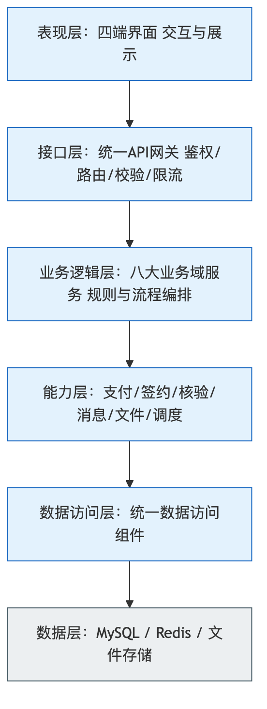
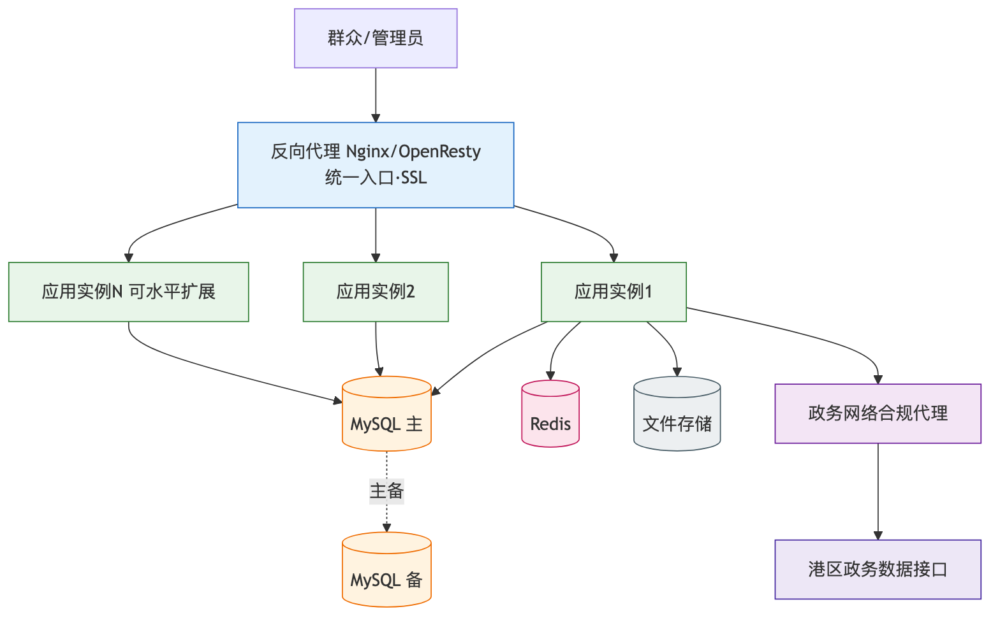
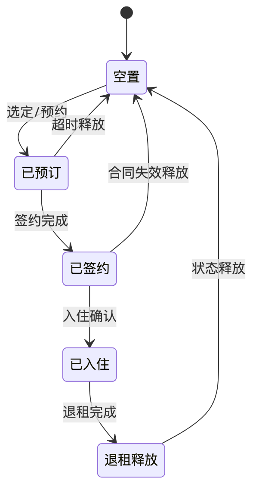
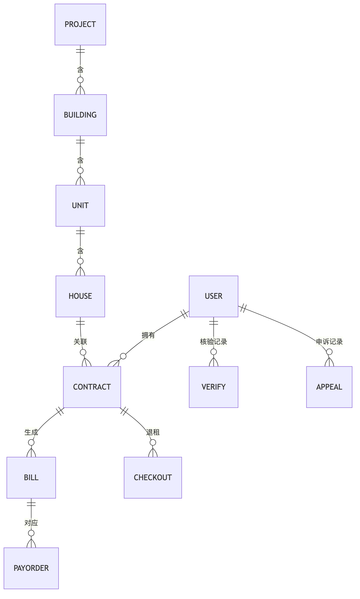
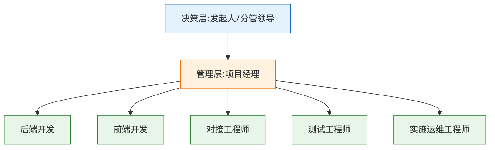
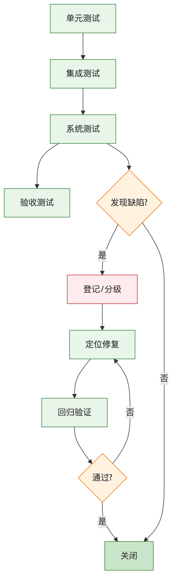
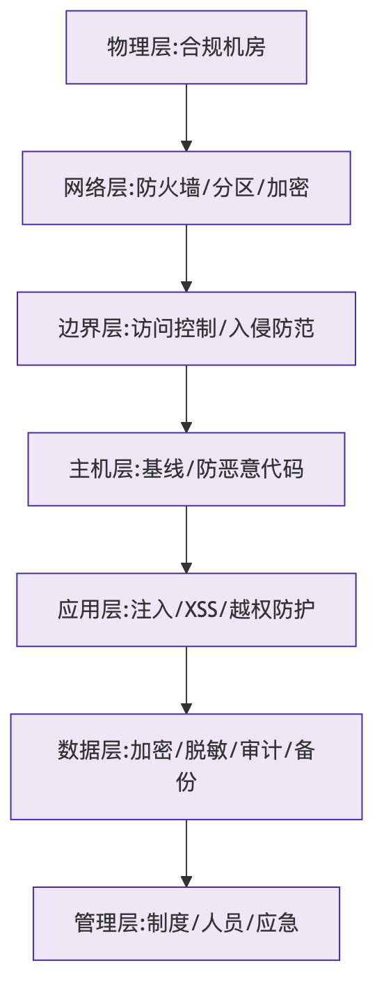
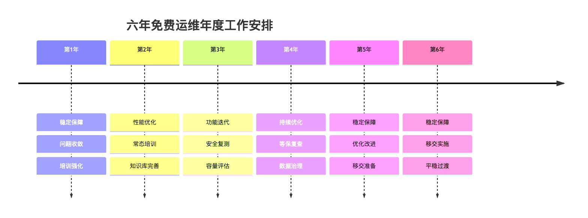
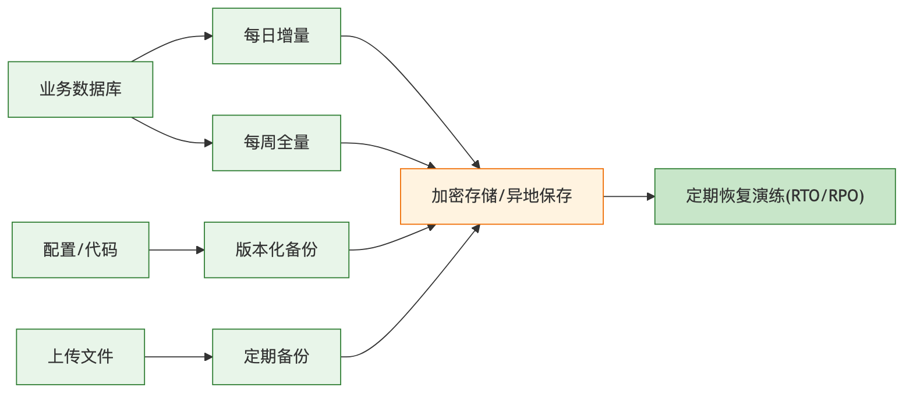

<center>

# 郑州数据集团有限公司房屋管理系统人力服务采购项目

## 技 术 方 案

（项目编号：SJJTZC-2026-ZB-07-01）

&nbsp;

&nbsp;

投标人：河南卓康电子科技有限公司

二〇二六年

</center>

\newpage

<center>**目 录**</center>

```{=openxml}
<w:p><w:r><w:fldChar w:fldCharType="begin"/></w:r><w:r><w:instrText xml:space="preserve"> TOC \o "1-3" \h \z \u </w:instrText></w:r><w:r><w:fldChar w:fldCharType="separate"/></w:r><w:r><w:t>请在 Word 中右键"更新域"生成目录与页码。</w:t></w:r><w:r><w:fldChar w:fldCharType="end"/></w:r></w:p>
```

\newpage

# 第一章 项目需求分析

## 1.1 项目背景与政策依据

郑州数据集团有限公司承担着郑州市国有住房资源运营与数据要素运营的双重职能。随着保障性租赁住房、人才公寓、市场化租赁等多元住房供给体系的持续扩容，房屋资源在"筹集—分配—签约—入住—收费—退租—运维"全链条上的管理复杂度显著上升，传统以线下窗口、人工台账、分散表格为主的管理方式已难以支撑规模化、精细化、阳光化的运营要求。为落实住房保障惠民政策、提升群众办事体验、强化国有资产监管，建设一套统一、开放、安全、可持续演进的房屋管理系统，已成为本项目的核心诉求。

本方案的编制严格遵循国家及地方相关政策法规与技术标准，主要依据包括：《中华人民共和国网络安全法》《中华人民共和国数据安全法》《中华人民共和国个人信息保护法》，《信息安全技术 网络安全等级保护基本要求》（GB/T 22239-2019），《信息安全技术 信息系统安全等级保护定级指南》，《关于加快发展保障性租赁住房的意见》（国办发〔2021〕22号）及河南省、郑州市配套实施细则，以及本项目招标文件（项目编号 SJJTZC-2026-ZB-07-01）及其技术需求、评标办法的全部条款。凡招标文件有明确要求之处，本方案均逐条对应落实，确保无遗漏、可核验。

本章立足"问题导向"，先厘清现状痛点与建设必要性，再由问题反推目标与指标，进而从四类使用角色的视角归集功能性需求，从六个维度刻画非功能性需求，最后以"重难点—对策矩阵"的方式给出针对性应对思路，为后续各章的功能设计、实施管理、安全与运维保障奠定需求基线。

## 1.2 现状问题诊断与建设必要性

区别于泛泛而谈的背景描述，本方案以一线运营场景为观察窗口，将现状问题归纳为"数据、流程、体验、监管、安全"五个维度，逐一诊断并说明其对业务的实际影响，从而论证建设的必要性与紧迫性。

**表1-1 现状问题诊断与建设必要性对照表**

| 维度 | 现状问题 | 业务影响 | 建设必要性 |
|---|---|---|---|
| 数据 | 房源、合同、租户、缴费数据分散在多张表格与多个部门，口径不一、更新不同步 | 统计口径打架，领导决策缺乏可信数据底座 | 建立统一数据底座与主数据管理，实现"一处维护、多处复用" |
| 流程 | 资格审核、选房、签约、缴费、退租等环节以线下流转为主，节点不透明 | 办理周期长、群众多次跑腿、易产生廉政风险 | 全流程线上化、节点可视、留痕可溯 |
| 体验 | 群众缺乏统一线上入口，政策查询、房源浏览、在线办事割裂 | 群众满意度低，政策触达率不足 | 建设多端统一的群众服务入口，一次登录、全程网办 |
| 监管 | 缺乏面向管理层的实时经营视图，房源出租率、欠费、到期等指标滞后 | 资产闲置与欠费难以及时发现 | 构建运营驾驶舱，指标实时、预警前置 |
| 安全 | 缺乏统一的身份认证、权限管控与操作审计，个人信息保护措施薄弱 | 存在数据泄露与越权操作风险，不满足等保要求 | 按等保二级建设纵深防御与全量审计体系 |

综上，本项目并非简单的"线下搬线上"，而是一次以数据治理为根基、以流程再造为主线、以群众体验与国资监管为双目标的数字化重构。建设一套统一的房屋管理系统，既是提升治理效能的现实需要，也是防范数据与廉政风险、落实惠民政策的必然要求。

## 1.3 建设目标与量化指标体系

针对上述问题，本项目确立"一个平台、四端协同、六域能力、全程闭环"的总体目标：建设一个统一的房屋管理平台，覆盖群众服务端、运营管理端、业务中台与数据底座四类载体，沉淀房源、租户、合同、缴费、退租、运营监测六大能力域，实现租赁业务全生命周期的线上化闭环管理。

为使目标可衡量、可验收，本方案将总体目标分解为可量化的指标体系，作为设计与验收的共同基线。

**表1-2 建设目标量化指标体系**

| 目标维度 | 关键指标 | 目标值 | 说明 |
|---|---|---|---|
| 业务覆盖 | 核心业务线上化率 | ≥95% | 资格审核、选房、签约、缴费、退租等主流程全线上 |
| 办事效率 | 群众平均办理时长 | 较线下下降≥50% | 以选房签约到入住为样本 |
| 数据质量 | 主数据一致性 | ≥99% | 房源/租户/合同主数据统一口径 |
| 群众体验 | 多端一致覆盖 | H5/小程序/公众号 | 一套代码多端发布，功能一致 |
| 监管能力 | 关键指标时效 | 准实时（≤5分钟） | 出租率、欠费、到期预警 |
| 系统性能 | 常规页面响应 | ≤2秒（95分位） | 详见第二章非功能设计 |
| 安全合规 | 等保测评 | 二级达标 | 按GB/T 22239设计与整改 |
| 可持续 | 免费运维期 | 6年 | 覆盖缺陷修复与适应性维护 |

### 1.3.1 建设范围与边界界定

为使建设目标可落地、可验收，本节明确界定项目的建设范围与边界，厘清"建什么、对接什么、不建什么"，避免范围模糊导致的争议与遗漏。建设范围以招标文件功能明细（序号 1—211）为准，涵盖群众服务端、运营管理端、业务中台、数据底座四类载体的开发，以及数据迁移、培训、外部系统对接等实施内容。

**表1-2-1 建设范围与边界界定**

| 类别 | 范围内 | 边界说明 |
|---|---|---|
| 应用开发 | 四端全部功能开发（序号1—200） | 按功能明细逐条实现 |
| 数据迁移 | 房屋/合同/账单/用户数据迁移 | 甲方提供源数据与口径 |
| 系统对接 | 郑好办、政务数据、支付、签章、地图、监控、人脸 | 对方提供接口与联调支持 |
| 培训交付 | 运营、管理员、技术培训 | 甲方组织人员与场地 |
| 运维服务 | 6年免费运维 | 重大二次开发另议 |
| 基础设施 | 部署实施与调优 | 服务器/网络/专线由甲方提供 |

范围界定遵循"以招标要求为准、以合同约定为据"的原则：范围内事项投标人全面负责、足额投入；涉及甲方或第三方配合的事项（如接口开通、资源提供、数据口径确认），本方案已在第三章 3.19 节明确职责边界并提前告知，确保配合事项不成为建设瓶颈。清晰的范围边界既是投标人履约的依据，也是双方避免扯皮、顺利验收结算的基础。

## 1.4 干系人与四端角色需求分析

本方案以"角色—场景—诉求"三元组组织需求，识别出四类核心使用角色，分别对应四类系统载体，形成"四端协同"的需求结构。这一以角色为中心的组织方式，是本方案区别于常规功能罗列的显著特征。

**表1-3 四端角色与核心诉求**

| 载体（端） | 核心角色 | 典型场景 | 核心诉求 |
|---|---|---|---|
| 群众服务端 | 申请人/租户 | 政策查询、房源浏览、在线申请、缴费、退租、开票 | 入口统一、流程简单、进度透明、随时可办 |
| 运营管理端 | 运营人员/审核员 | 房源维护、资格审核、合同管理、账单核对、退租办理 | 操作高效、规则内置、批量处理、留痕可查 |
| 业务中台 | 系统/业务规则 | 状态机流转、计费引擎、消息通知、对接编排 | 规则集中、能力复用、对接标准化 |
| 数据底座与驾驶舱 | 管理层/监管 | 经营看板、指标预警、报表导出、审计追溯 | 数据可信、指标实时、可下钻、可追溯 |

四端并非彼此割裂，而是共享统一的后端服务与业务规则：群众端发起的申请进入业务中台的状态机与计费引擎处理，运营端进行审核与干预，处理结果沉淀至数据底座并在驾驶舱呈现。四端功能一致、规则一致、数据一致，是本方案的设计底线。总体蓝图如图1-1所示。


<center>图1-1 平台总体蓝图</center>

## 1.5 功能性需求全景（按能力域归集）

传统需求清单多以"页面"或"模块"罗列功能，容易出现职责交叉与重复建设。本方案改以"能力域"归集功能性需求，即先识别业务的原子能力，再由能力组合出各端功能，从而保证规则集中、能力复用。功能性需求归集为六大能力域，如下表所示。

**表1-4 六大能力域功能性需求全景**

| 能力域 | 覆盖功能要点 | 服务对象 |
|---|---|---|
| 房源资源域 | 项目/楼栋/单元/房源管理、房源状态机、地图找房、VR看房、户型与设施 | 群众端浏览、运营端维护、驾驶舱统计 |
| 租户资格域 | 用户注册登录、实名核验、资格申请、资料上传、审核与申诉 | 群众端申请、运营端审核 |
| 合同签约域 | 选房锁房、电子合同、在线签章、合同变更/续签/退租、合同状态机 | 群众端签约、运营端管理 |
| 计费收费域 | 押金/租金账单、期次计费、在线支付、退款精算、开票管理 | 群众端缴费、运营端核对 |
| 通知服务域 | 政策公告、消息推送、待办提醒、生活服务工单 | 群众端接收、运营端发布 |
| 运营监测域 | 经营看板、出租率/欠费/到期分析、报表导出、操作审计 | 管理层决策、监管审计 |

各能力域内部功能将在第二章逐项展开设计并给出功能清单对照表，确保招标功能需求逐条覆盖、可核验。

## 1.6 非功能性需求六维度分析

系统的成败不仅取决于功能是否齐全，更取决于非功能性质量能否满足运营与监管要求。本方案从性能、可用性、安全性、可扩展性、可维护性、兼容性六个维度对非功能性需求进行系统化分析，并给出可度量的指标。

**表1-5 非功能性需求六维度指标**

| 维度 | 关键需求 | 度量指标 |
|---|---|---|
| 性能 | 页面与接口响应迅速，支撑集中选房高峰 | 常规页面≤2秒（95分位）；核心接口≤500ms；支持并发≥500 |
| 可用性 | 系统7×24稳定运行 | 年可用率≥99.9%；关键故障恢复RTO≤2小时 |
| 安全性 | 满足等保二级，保护个人信息 | 全量审计、传输与存储加密、越权防护 |
| 可扩展性 | 业态与项目可平滑扩容 | 模块化设计，新增业态无需重构核心 |
| 可维护性 | 便于运维与二次开发 | 统一日志、监控、配置中心；代码规范可编译交付 |
| 兼容性 | 多端多浏览器一致 | 主流浏览器与微信生态；一套代码多端发布 |

上述指标将贯穿第二章的技术设计与第四、五章的安全运维保障，形成"需求—设计—验证"的完整闭环。

## 1.7 建设重难点与对策矩阵

结合项目特点，本方案识别出四项建设重难点，并针对每一难点给出明确对策与落地举措，形成"重难点—对策矩阵"，避免空泛承诺。

**表1-6 建设重难点与对策矩阵**

| 重难点 | 难在何处 | 对策 | 落地举措 |
|---|---|---|---|
| 政务对接（郑好办等） | 对接规范严格、联调窗口有限、认证链路复杂 | 提前对接、标准化封装、灰度验证 | 统一对接网关、mock先行、专人对接、预留联调缓冲 |
| 集中选房高峰并发 | 短时高并发、锁房防超卖 | 分布式锁+状态机+排队 | 房源锁定超时释放、幂等设计、压测保障 |
| 多业态规则差异 | 保租房/人才公寓/市场租赁计费与资格规则不同 | 规则中台化、配置化 | 计费引擎参数化、资格规则可配置 |
| 数据安全与个人信息保护 | 涉及大量身份与财产信息 | 等保二级、分级分类、全量审计 | 加密、脱敏、最小授权、操作留痕 |

三类业态在资格、计费、可见性等方面的差异是规则设计的重点，其差异对比如图1-2所示。


<center>图1-2 三类业态差异对比</center>

### 1.7.1 重难点深度剖析与前置应对

四项重难点中，"集中选房高峰并发"与"政务对接"是最可能影响项目成败的两项，值得深入剖析。集中选房场景的特殊性在于：房源是稀缺且唯一的资源，同一套房源在放号瞬间可能被成百上千名申请人同时争抢，若并发控制不当，极易出现"同一房源被多人签约"的超卖事故，或因锁竞争导致系统卡死。本方案在需求阶段即明确：选房锁房必须采用分布式锁配合数据库乐观锁的双重保障，且锁定必须设置超时自动释放，杜绝房源被长期占用；同时以限流排队削峰，保护后端不被瞬时洪峰击穿。这一要求将在第二章 2.12 节转化为具体的技术设计，并在测试阶段以压力测试验证。

政务对接的难点则在于"不可控性"：郑好办、政务数据等外部系统的接口规范、联调窗口、稳定性均非投标人可单方掌控，历史上大量项目因政务对接联调窗口有限、接口变更频繁而拖期。本方案的前置应对是：一是"早启动"，在项目开发早期即启动接口确认与 mock 联调，不等主体开发完成才对接；二是"适配层隔离"，将外部差异封装在对接适配层，外部变更不波及业务主流程；三是"兜底设计"，接口不可用时支持人工审核兜底，支付对接采用回调加主动查单双兜底，确保外部故障不导致业务全面中断。

**表1-6-1 两大核心重难点前置应对要点**

| 重难点 | 最坏情形 | 前置应对（需求约束） |
|---|---|---|
| 选房高峰并发 | 超卖、系统卡死 | 双重锁+超时释放+限流排队+压测 |
| 政务对接 | 联调拖期、接口不稳 | 早启动+mock先行+适配层隔离+兜底 |

将重难点在需求阶段"想深、想透、想到最坏"，并把应对要求固化为明确的需求约束，是本方案"问题导向、风险前置"方法论的集中体现，也是投标人同类项目经验的直接沉淀。

## 1.8 术语、缩略语与编制依据

为便于评审与后续沟通，本节统一列示方案中出现的关键术语与缩略语。

**表1-7 术语与缩略语**

| 术语/缩略语 | 全称/含义 |
|---|---|
| 保租房 | 保障性租赁住房 |
| 人才公寓 | 面向各类人才的政策性租赁住房 |
| 郑好办 | 郑州市一体化政务服务平台 |
| 能力域 | 按业务原子能力归集的功能集合 |
| 业务中台 | 集中承载状态机、计费引擎、消息编排等共享能力的服务层 |
| 数据底座 | 统一数据存储、主数据管理与分析支撑层 |
| 驾驶舱 | 面向管理层的经营监测与决策看板 |
| RTO/RPO | 恢复时间目标/恢复点目标 |
| 等保二级 | 网络安全等级保护第二级 |
| SLA | 服务等级协议 |

本方案编制依据除 1.1 节所列政策法规与技术标准外，还包括招标文件全部内容、投标人对同类保障房与人才公寓系统的建设与运营经验，以及现行主流技术栈的最佳实践。后续章节的所有设计与承诺，均以本章确立的需求基线为准绳。

## 1.9 同类系统建设经验与教训借鉴

需求分析不应仅停留在对招标文件的字面理解，更应结合同类系统的建设规律。投标人在保障性住房、人才公寓、公租房及政务惠民类系统的建设与运营中，积累了大量一线经验与教训。本节将这些经验凝练为对本项目需求分析的输入，力求"未建先知其难"，把同类项目踩过的坑前置到需求阶段加以规避。

**表1-8 同类系统典型教训与本项目应对**

| 典型教训 | 问题根源 | 对本项目需求的启示 |
|---|---|---|
| 集中选房时段系统卡顿、超卖 | 未做并发设计与房源锁定 | 需求阶段即明确并发指标与锁房、防超卖要求 |
| 前端自行计算金额导致对账不平 | 计费逻辑分散在多端 | 需求上明确"金额一律由后端计算"，前端只展示 |
| 政务接口联调窗口错过导致工期延误 | 对接启动过晚 | 需求阶段识别对接清单，实施上要求"早对接、mock先行" |
| 退租退款反复重算、口径不一 | 退款金额未持久化 | 需求上明确退款"一次精算定死、全程可追溯" |
| 上线后无经营视图，问题发现滞后 | 缺少监测与预警 | 需求上纳入运营驾驶舱与指标预警 |
| 个人信息保护不到位被通报 | 未落实分级与脱敏 | 需求上明确等保二级与个人信息保护要求 |

上述教训表明：房屋管理系统的关键风险并不在于单个功能能否实现，而在于高并发、金额一致性、外部对接、数据安全等"横切"问题能否在需求阶段被识别并转化为明确、可验收的指标。本方案在 1.3、1.6、1.7 节已将这些横切关注点显式纳入指标体系与对策矩阵，正是这一经验的直接体现。

## 1.10 需求优先级与分期实现策略

在 60 日历天的开发期内，必须对需求进行优先级排序，确保核心业务优先交付、按期上线，同时为后续持续优化预留空间。本方案采用 MoSCoW 方法对需求进行优先级划分：必须有（Must）、应该有（Should）、可以有（Could）、暂不做（Won't/本期不做）。

**表1-9 需求优先级（MoSCoW）划分**

| 优先级 | 含义 | 本项目对应需求（示例） |
|---|---|---|
| Must（必须有） | 不实现则无法上线的核心闭环 | 房源管理、资格审核、在线选房签约、账单缴费、退租、权限与审计 |
| Should（应该有） | 显著提升价值、应在本期实现 | 地图找房、消息推送、运营驾驶舱、开票管理、批量配租 |
| Could（可以有） | 锦上添花、资源允许则实现 | VR看房、满意度评价、生活服务工单 |
| Won't（本期不做） | 明确划出边界、后续演进 | 复杂BI自助分析、与非必需第三方深度集成 |

优先级排序遵循两条原则：其一，凡招标功能明细（序号1—211）所列功能，无论优先级高低均纳入本期交付范围，不因排序而删减，排序仅用于指导迭代顺序与资源投放；其二，横切性的非功能需求（安全、并发、审计）与核心主流程同列为 Must，避免"先上功能、后补安全"的常见误区。

## 1.11 需求可追溯性矩阵（RTM）

为保证"招标要求—方案设计—开发实现—测试验收"四者一一对应、无遗漏、可核验，本方案建立需求可追溯性矩阵（Requirement Traceability Matrix，RTM）。RTM 以招标需求条目为源头，向下追溯到设计章节、开发模块与测试用例，形成双向可追溯链条。

**表1-10 需求可追溯性矩阵（示意）**

| 招标需求来源 | 需求条目 | 对应设计章节 | 承载模块 | 验收方式 |
|---|---|---|---|---|
| 第五章功能明细 | 房源管理 | 2.4/2.5/2.7 | 房源资源域 | 功能测试+验收 |
| 第五章功能明细 | 在线选房签约 | 2.6.2/2.9 | 合同签约域 | 场景测试+验收 |
| 第五章功能明细 | 账单缴费 | 2.6.3/2.8.2 | 计费收费域 | 支付联调+对账 |
| 附件3运维标准 | 故障响应时限 | 第五章5.4 | 运维体系 | SLA考核 |
| 合同专用条款 | 等保二级 | 第四章 | 安全体系 | 等保测评 |
| 合同专用条款 | 源代码交付 | 第三章3.13 | 交付物 | 编译校验 |

完整 RTM 将随需求规格说明书一并交付，覆盖招标功能明细全部条目及合同、运维、安全等全部实质性要求，作为验收阶段逐条核验的依据，确保"招标要求件件有着落、条条可追溯"。

## 1.12 典型业务场景用例分析

为使需求"可感知、可验证"，本节以三个典型用户旅程刻画核心业务场景，从使用者视角检验需求闭环的完整性。

**场景一：新申请人从注册到入住。** 申请人通过群众端注册并完成实名核验，浏览房源、查看政策，提交资格申请并上传资料；运营端审核通过后，申请人在线选房、系统锁房、生成电子合同并完成签章，随后在线缴纳押金与首期租金，支付成功后合同生效、办理入住。全程线上、进度透明，对应房源资源域、租户资格域、合同签约域、计费收费域四大能力域的协同。

**场景二：在租租户的日常履约。** 租户按期收到账单提醒并在线缴费，可随时查询合同、账单与缴费记录，申请开票；遇到设施问题可提交报修工单并跟踪处理进度。该场景检验计费收费域与通知服务域的闭环。

**场景三：运营人员的批量配租与监管。** 运营人员创建配租批次、批量导入与分配房源，审核资格申请、核对账单、办理退租；管理层通过驾驶舱实时掌握出租率、欠费、到期等指标并接收预警。该场景检验运营监测域与全端数据一致性。

三个场景共同验证：四端围绕六大能力域协同运转，任一业务动作均可在系统内闭环完成并留痕，需求覆盖完整、无断点。

## 1.13 三类业态需求差异详析

保租房、人才公寓、市场化租赁是本平台承载的三类核心业态。三者在服务对象、资格条件、租金定价、优惠政策、续租规则与房源可见性等方面存在系统性差异，是需求分析中最易被忽视、却最影响后续规则中台设计的关键点。本方案在需求阶段即对三类业态逐维度拆解，形成明确的差异清单，作为第二章计费引擎与资格规则参数化设计的输入。

**表1-11 三类业态需求差异逐维度对照**

| 差异维度 | 保租房 | 人才公寓 | 市场化租赁 |
|---|---|---|---|
| 服务对象 | 符合条件的新市民、青年人等住房困难群体 | 经认定的各层次人才 | 面向社会公开租赁 |
| 资格核验 | 社保、婚姻、学历、住房、保租房资格多项联合校验 | 人才认定等级、在职状态核验 | 基本实名核验即可 |
| 租金定价 | 政府指导价、低于市场价 | 按人才等级享受阶梯优惠 | 市场价，随行就市 |
| 优惠政策 | 政策性减免 | 人才补贴、代购补贴 | 一般无政策优惠 |
| 续租校验 | 需重新校验资格与欠费 | 校验人才有效期与欠费 | 仅校验欠费 |
| 房源可见性 | 定向配租、批次可见 | 定向或公开 | 公开可见 |
| 退出机制 | 资格丧失须退出 | 人才失效须退出 | 合同到期自然退出 |

三类业态"流程同构、规则异参"：选房、签约、缴费、退租的主流程一致，差异集中在资格规则集与计费参数上。本方案据此确立设计原则——主流程一次开发、多业态复用，业态差异全部下沉为可配置规则与参数，新增业态或调整政策时无需改动核心代码，仅需配置即可生效。这一原则直接回应了 1.7 节"多业态规则差异"重难点。

## 1.14 资格核验规则与数据来源需求

资格核验是保障性住房阳光分配的第一道关口，也是政务数据对接的核心场景。本节梳理各业态资格核验的校验项、判定逻辑与数据来源需求，为第二章资格域设计与接口对接提供依据。

**表1-12 资格核验项与数据来源**

| 校验项 | 适用业态 | 判定要点 | 数据来源 |
|---|---|---|---|
| 实名身份 | 全部 | 姓名与身份证一致、真实有效 | 郑好办用户体系/实名核验接口 |
| 社保缴纳 | 保租房 | 郑州市社保连续缴纳达标 | 社保核验接口 |
| 婚姻状况 | 保租房 | 婚姻登记状态核验 | 民政婚姻核验接口 |
| 学历 | 保租房/人才公寓 | 学历真实性与层次 | 学历核验接口 |
| 住房情况 | 保租房 | 港区名下无房或住房困难 | 不动产/房管接口 |
| 保租房资格 | 保租房 | 是否已享受同类保障 | 港区保租房资格库 |
| 人才认定 | 人才公寓 | 人才等级与有效期 | 人才认定数据 |

资格核验遵循"自动校验为主、人工申诉为辅"的原则：系统自动调用政务接口进行多项联合校验，对不符合项以清单形式明确告知申请人，申请人可对存疑项发起申诉并上传佐证材料，由运营人员人工复核。为应对政务接口不稳定或数据时延，本方案在需求上明确：核验结果须留痕并记录数据获取时间，接口不可用时支持人工审核兜底，杜绝因外部接口故障导致业务全面中断。

## 1.15 业务规模与容量测算

科学的容量测算是非功能性能指标（1.6 节）的定量依据，避免性能承诺沦为空话。本方案基于郑州航空港区保障房与人才公寓的建设规模，结合同类项目运营数据，对业务规模进行保守测算。

**表1-13 业务规模与容量测算（估算）**

| 测算维度 | 估算规模 | 测算依据与说明 |
|---|---|---|
| 累计管理房源 | 数万套量级 | 覆盖多个保租房与人才公寓项目 |
| 注册用户 | 十万级 | 申请人、租户及潜在申请群体 |
| 在租合同 | 万级 | 按出租率与在租周期估算 |
| 日常在线并发 | 数十至上百 | 常态化办事与查询 |
| 集中选房峰值并发 | ≥500 | 批次集中放号时段瞬时高峰 |
| 年账单数据增量 | 十万级记录 | 按月账单×在租合同数 |
| 附件存储增长 | 逐年递增（TB级） | 合同、资料、VR、监控快照 |

测算表明，系统的性能压力主要来自"集中选房峰值并发"与"账单/附件数据的持续增长"两方面。前者要求系统具备分布式锁、排队与限流能力以防超卖（对应 1.7 节重难点）；后者要求数据库分表归档与对象存储扩容策略（详见第二章）。容量测算结果将作为压力测试的输入基线，确保上线前性能验证有据可依。

## 1.16 历史数据迁移需求分析

本项目并非全新建设，港区现有系统中已沉淀大量在管房屋、在租合同、历史账单与用户数据（对应招标功能明细序号 201）。这些数据的平滑迁移是新系统上线并接续业务的前提，也是一项高风险、高价值的工作，须在需求阶段予以充分识别。

**表1-14 历史数据迁移范围与要求**

| 数据类别 | 迁移内容 | 关键要求 |
|---|---|---|
| 房屋资产 | 项目、楼栋、单元、房源及状态 | 主数据口径统一、状态准确映射 |
| 合同数据 | 在租/历史合同及关键条款 | 合同与房源、租户关系完整 |
| 账单数据 | 历史账单、缴费与欠费记录 | 金额准确、欠费如实接续 |
| 用户数据 | 申请人、租户身份与资料 | 个人信息脱敏迁移、合规存储 |

数据迁移遵循"零干预、可校验、可回退"三原则：对迁入数据不做破坏性变更，迁移后进行全量比对与抽样核验，出现异常可回退重迁。迁移须制定专项方案（详见第三章 3.12 节），在正式割接前完成多轮试迁移与数据核对，确保新系统上线即为可信、完整的业务数据底座，避免"新系统上线、老数据丢失"的重大风险。

## 1.17 政策依据与合规要求分析

本项目为政策性住房管理平台，其需求不仅来自业务功能本身，更受国家与地方住房保障政策、数据安全与个人信息保护法规、电子政务与网络安全等相关规范的约束。准确识别政策与合规要求，是需求分析不可或缺的一环，也是系统设计的合规底线。

**表1-15 主要政策与合规依据**

| 类别 | 依据要点 | 对系统的需求约束 |
|---|---|---|
| 住房保障政策 | 保障房、人才公寓准入与配租规则 | 资格核验、阳光分配、可追溯 |
| 网络安全 | 网络安全法、等保基本要求 | 等保二级、安全审计、边界防护 |
| 个人信息保护 | 个人信息保护法 | 最小必要、加密脱敏、知情同意 |
| 数据安全 | 数据安全法、政务数据管理规范 | 分级分类、政务对接脱敏最小化 |
| 电子签约 | 电子签名法 | 合法电子合同、签署可追溯 |
| 电子政务 | 一网通办、政务服务规范 | 对接郑好办、一次认证全程复用 |

政策与合规要求贯穿系统设计始终：住房保障政策决定了资格核验与配租规则的业务逻辑；网络安全与个人信息保护法规决定了安全与隐私保护的设计底线（详见第四章）；电子签名法为在线签约的法律效力提供依据。本方案将上述合规要求转化为明确的功能与非功能需求，确保系统"合规先行、依法建设"，经得起监管检查与审计核验。

## 1.18 术语定义与需求可追溯说明

为保证全文术语统一、需求可追溯，本节对方案中反复出现的关键术语予以定义，并说明需求与后续章节的追溯关系。

**表1-16 关键术语定义**

| 术语 | 定义 |
|---|---|
| 四端 | 群众服务端（H5/小程序/公众号）与运营管理端的统称 |
| 业务中台 | 承载跨端复用业务能力（状态机、计费、消息、对接等）的服务层 |
| 数据底座 | 统一存储与主数据管理，面向驾驶舱提供聚合分析 |
| 状态机 | 驱动房源、合同等实体状态受控流转的引擎 |
| 计费引擎 | 集中处理押金、租金、退款、违约金等计费规则的组件 |
| 退款精算 | 退租时按日精算已缴未住金额并一次定死持久化的过程 |
| 双兜底 | 支付回调与定时主动查单两种机制并用，防止掉单 |

全文术语以本表为准，前后一致；本章确立的每一项需求，均可在后续章节找到对应的设计、实施、安全或运维落点，形成"需求—设计—实现—验收"的完整追溯链（可追溯矩阵见 1.11 节）。这一约定既方便评审专家按图索骥，也为项目验收提供了逐条对照的依据。

## 1.19 建设效益与社会价值分析

本项目的建设效益不止于系统本身的功能实现，更体现在治理效能提升、群众体验改善、国资监管强化与可持续演进四个层面的综合价值。本节从社会效益、管理效益、经济效益三个视角对建设成效进行分析，使评审专家能够清晰把握项目投资的价值回报。

**表1-17 建设效益与社会价值分析**

| 效益维度 | 具体体现 | 价值说明 |
|---|---|---|
| 社会效益 | 群众全程网办、政策透明可查、办事少跑腿 | 提升群众获得感与政策触达率 |
| 管理效益 | 全流程线上留痕、经营看板实时、审核规则内置 | 提升运营效率、防范廉政风险 |
| 监管效益 | 出租率/欠费/到期实时预警、操作全量审计 | 强化国有资产阳光监管 |
| 经济效益 | 减少人工台账、降低差错与坏账、盘活闲置房源 | 直接与间接降本增效 |
| 可持续价值 | 规则配置化、能力可复用、6年免费运维 | 保护投资、支撑长期演进 |

综合来看，本项目通过数字化手段将房屋资源管理从"经验驱动、人工台账"升级为"数据驱动、规则内建、全程可溯"，既服务于群众住有所居的民生目标，也服务于国有资产保值增值与阳光监管的治理目标，具有显著的社会效益与管理效益，是一项投入产出比高、社会价值突出的信息化建设工程。

## 1.20 本章小结

本章立足问题导向，完成了从现状诊断、目标量化、角色需求、能力域归集到非功能指标、重难点对策的系统化需求分析，并通过经验借鉴、优先级排序、可追溯矩阵与场景用例，保证需求既全面覆盖招标要求，又抓住了高并发、金额一致、外部对接、数据安全等关键风险点。本章确立的"四端协同、六域能力、全程闭环"需求基线，将作为后续功能设计（第二章）、实施管理（第三章）、安全管理（第四章）、运维管理（第五章）与服务期限保证（第六章）的共同起点与验收标尺。

\newpage

# 第二章 应用系统功能设计

## 2.1 设计总则与执行标准

本章以第一章确立的"四端协同、六域能力"需求基线为输入，给出房屋管理系统的总体技术架构与详细功能设计。功能设计遵循以下总则：一是"能力中台化"，将跨端复用的状态机、计费引擎、消息编排、对接适配等能力下沉至业务中台，避免各端重复实现、规则漂移；二是"配置优于硬编码"，将业态差异、计费参数、审核规则等尽量参数化、可配置，以适应多业态、多项目的扩展；三是"数据一处维护、多处复用"，通过统一数据底座与主数据管理保障口径一致；四是"安全内建"，将认证、鉴权、审计、加密作为设计的默认要素而非事后补丁。

系统建设执行国家及行业主流技术标准与规范，包括软件工程文档标准、Web 内容可访问性、RESTful 接口设计规范、数据库设计规范、《网络安全等级保护基本要求》（GB/T 22239-2019）等；开发过程遵循统一的编码规范、接口规范、命名规范与提交规范（详见第三章），确保交付的源代码可独立编译、生成与生产环境一致的可执行文件。

**表2-1 功能设计遵循的主要标准规范**

| 类别 | 标准/规范 | 应用点 |
|---|---|---|
| 安全 | GB/T 22239-2019 等保基本要求 | 认证、审计、加密、边界防护 |
| 接口 | RESTful + OpenAPI 3.0 | 统一接口风格与文档 |
| 编码 | 阿里巴巴Java开发规范 | 后端编码与评审 |
| 前端 | ECMAScript + 组件化规范 | 多端一致性 |
| 文档 | GB/T 8567 软件文档 | 交付文档体系 |
| 数据 | 数据库设计三范式（适度反范式） | 表结构与索引 |

## 2.2 总体技术架构（能力中台视角）

系统采用"四端 + 业务中台 + 数据底座"的分层架构。自上而下分为访问层、应用层（四端）、业务中台层、数据底座层与基础设施层，各层职责单一、依赖清晰，通过统一的 API 网关与服务契约解耦。分层结构如图2-1所示。



<center>图2-1 系统分层架构</center>

**访问层**：统一承载群众端（H5/微信小程序/公众号）、运营管理端（PC 后台）、驾驶舱的入口，经由 Nginx/OpenResty 反向代理与负载均衡，完成静态资源分发、TLS 终止与安全防护。

**应用层（四端）**：群众服务端基于 uni-app 一套代码多端发布，覆盖 H5、微信小程序与公众号；运营管理端与驾驶舱基于 Vue + Element UI 构建。四端仅承载交互与展示，业务规则统一下沉至中台。

**业务中台层**：基于 Spring Boot 构建，集中承载合同状态机、计费引擎、消息编排、对接适配（郑好办/支付/电子签章/政务数据）、权限与审计等共享能力，对四端提供标准化服务契约。

**数据底座层**：以 MySQL 为核心关系存储，Redis 承载缓存、分布式锁与会话；统一主数据管理保障房源、租户、合同口径一致；面向驾驶舱提供聚合与分析视图。

**基础设施层**：提供服务器、网络、存储、备份、日志与监控等基础支撑，支持容器化部署与横向扩展。

系统总体采用"模块化单体 + 中台能力下沉"的务实架构：在保证部署运维简单、事务一致性强的前提下，通过清晰的模块边界与能力下沉获得可扩展性，避免为追求微服务而引入过度的分布式复杂度。这一取舍与项目规模、运维力量、6 年免费运维承诺高度匹配。部署架构如图2-2所示。



<center>图2-2 部署架构</center>

## 2.3 技术选型论证与取舍

技术选型以"成熟稳定、生态完善、团队熟练、可持续维护"为原则，避免使用小众或停止维护的技术。主要选型及论证如下表所示。

**表2-2 关键技术选型与论证**

| 层次 | 选型 | 论证理由 | 备选与取舍 |
|---|---|---|---|
| 后端框架 | Spring Boot 3.5.x + Spring Security | 生态成熟、社区活跃、安全能力完善 | 相比自研框架，降低维护风险 |
| 持久层 | MyBatis-Plus | 兼顾灵活SQL与快速CRUD，减少样板代码 | 相比纯JPA，复杂查询更可控 |
| 数据库 | MySQL 8.x | 成熟稳定、运维成熟、成本可控 | 相比商业库，无授权成本 |
| 缓存/锁 | Redis | 高性能缓存、分布式锁、会话 | 支撑选房高峰并发 |
| 后台前端 | Vue 2.6 + Element UI | 组件丰富、团队熟练、交付快 | 稳定优先于尝鲜 |
| 群众端 | uni-app | 一套代码多端（H5/小程序/公众号） | 相比多端各自开发，成本与一致性最优 |
| 认证 | JWT + Spring Security | 无状态、易扩展、便于多端 | 结合Redis实现登出与续期 |
| 任务调度 | Quartz | 账单生成、超时释放、到期提醒等定时任务 | 成熟可靠 |
| 接口文档 | SpringDoc（OpenAPI 3） | 自动生成、便于联调与交付 | 降低文档维护成本 |
| 反向代理 | Nginx/OpenResty | 高性能、静态分发、安全防护 | 生产验证充分 |

选型强调"团队熟练度"这一常被忽视的维度：所选技术均为投标人团队长期使用、具备完整运维经验的技术栈，可确保 60 日历天开发期内高效交付，并为 6 年免费运维奠定人力可持续性。

### 2.3.1 选型风险识别与规避

任何技术选型都伴随潜在风险，本方案在确定选型的同时同步识别其风险并给出规避措施，做到"选型有依据、风险有预案"。总体而言，本方案所有选型均为业界主流、生态成熟的技术，不存在停止维护或授权受限的风险；针对性能、并发、对接等具体风险点，已在架构与实现层面设计对应对策。

**表2-2-1 关键选型风险识别与规避**

| 潜在风险 | 影响 | 规避措施 |
|---|---|---|
| 单体架构扩展受限 | 未来业务增长受限 | 模块边界清晰、能力中台化，预留服务化拆分路径 |
| MySQL大表性能 | 数据增长后查询变慢 | 索引优化、分表归档、预聚合视图 |
| Redis单点 | 缓存/锁失效 | 持久化+主备、锁超时释放兜底 |
| 外部对接不稳定 | 联调受阻、掉单 | 适配层封装、mock先行、双兜底 |
| uni-app端差异 | 多端体验割裂 | 条件编译、统一请求层、统一组件库 |

通过"选型即评估风险、风险即配对策"的方法，本方案的技术架构在成熟稳定的基础上，对可预见的风险均有明确应对，既不盲目追新，也不回避问题，体现了对项目长期健康负责的务实态度。

## 2.4 群众服务端功能设计

群众服务端是群众触达系统的统一入口，基于 uni-app 一套代码发布至 H5、微信小程序与公众号，三端功能一致、体验统一。设计以"少填、少跑、少等"为体验目标，将复杂的规则判断与流程编排交由业务中台处理，前端保持轻量。群众端主要功能如下表所示。

**表2-3 群众服务端功能清单**

| 功能模块 | 功能点 | 说明 |
|---|---|---|
| 首页门户 | 轮播、快捷入口、政策公告、消息提醒 | 统一入口、个性化待办 |
| 房源浏览 | 项目列表、房源详情、地图找房、VR看房、户型设施 | 多维筛选、直观展示 |
| 政策服务 | 政策文件、办事指南、常见问题 | 提升政策触达 |
| 实名与资格 | 注册登录、实名核验、资格申请、资料上传 | 对接实名核验能力 |
| 选房签约 | 在线选房、锁房、电子合同、在线签章 | 与中台状态机联动 |
| 缴费开票 | 押金/租金缴纳、账单查询、在线支付、开票申请 | 对接支付与开票 |
| 退租续租 | 退租申请、退款进度、续租办理 | 与退款精算联动 |
| 个人中心 | 我的合同、我的账单、我的消息、我的申请 | 全程进度可视 |
| 生活服务 | 报修工单、投诉建议、满意度评价 | 提升入住体验 |

群众端的关键设计要点包括：其一，登录与实名核验一次完成、全程复用，避免重复填报；其二，办理进度以时间轴形式透明呈现，减少群众咨询与跑腿；其三，所有涉及金额、日期的展示均与后端计算结果严格一致，杜绝前端自行计算导致的口径偏差；其四，公告与待办通过消息推送主动触达，提升政策知晓率。

### 2.4.1 多端一致性保障

群众端基于 uni-app 一套代码编译发布至 H5、微信小程序与公众号三端，从工程层面保障"一次开发、三端一致"。为避免"一套代码多端跑但体验割裂"的常见问题，本方案在三个层面加以保障：一是条件编译，对三端差异（如支付调起方式、登录授权方式、分享能力）采用条件编译隔离，主体业务代码保持统一；二是统一请求层，所有接口调用经统一封装的请求层，统一处理鉴权、错误码、加载态与重试，三端行为一致；三是统一 UI 组件库，抽取项目级公共组件（房源卡片、账单卡片、进度时间轴等），保证视觉与交互一致。三端的功能集合、业务规则与数据口径完全一致，差异仅限于平台能力适配层。

### 2.4.2 群众端体验与无障碍设计

面向政策性住房的申请人群覆盖面广、年龄与数字素养差异较大，群众端在体验设计上强调"简单、清晰、可达"：关键操作路径不超过三步；表单支持自动带入已实名信息、减少重复填写；重要状态（审核中、待缴费、已生效）以醒目标识与文字双重提示；字号、对比度遵循可访问性基本要求，兼顾中老年用户。同时提供办事指南与常见问题，降低使用门槛。

### 2.4.3 群众端性能与弱网适配

针对移动端弱网与高峰访问，群众端采用首屏关键资源优先加载、图片懒加载与压缩、列表分页与虚拟滚动、接口结果合理缓存等手段，保证在一般移动网络下首屏可用；对选房等高峰场景，前端配合后端限流与排队机制给出友好排队提示，避免用户反复刷新加剧系统压力。

### 2.4.4 群众端典型业务流程详析

为使群众端功能设计"可感知、可验证"，本节将四条最核心的用户旅程拆解为可执行的步骤流，明确每一步的前置条件、系统动作与结果留痕，作为详细设计与测试用例的依据。

**表2-3-1 群众端核心业务流程步骤**

| 流程 | 关键步骤 | 系统动作与规则 |
|---|---|---|
| 注册实名 | 手机号登录→授权→实名核验 | 对接郑好办用户体系，核验姓名与身份证一致性，结果留痕 |
| 资格申请 | 选择业态→自动校验→查看不符项→申诉上传 | 多项联合校验，不符项清单化，申诉进人工复核 |
| 选房签约 | 浏览筛选→预约→选房锁房→人脸核验→签约 | 锁房加分布式锁并设超时释放，签约人与选房人一致性核验 |
| 缴费开票 | 生成账单→选择优惠→在线支付→回调确认→申请开票 | 金额由后端计算，支付回调幂等，开票按账期发起 |

以"选房签约"流程为例：申请人资格审核通过后进入选房环节，选择意向房源时系统对该房源施加分布式锁并置为"锁定"状态，同时启动锁定超时计时；申请人在超时时限内完成人脸识别（核对签约人与选房人一致）与电子合同签署，签署完成后房源转为"已签约"，合同进入待缴费状态；若超时未完成，系统自动释放锁定、房源回到"可选"状态，防止房源被长期占用。整个流程的状态跃迁由业务中台的房源状态机与合同状态机统一驱动（详见 2.6 节），前端仅负责展示与交互，确保多端行为一致、并发安全。

**表2-3-2 群众端退租与续租流程步骤**

| 流程 | 关键步骤 | 系统动作与规则 |
|---|---|---|
| 退租办理 | 发起申请→退款精算→运营确认→物品核对→退费 | 退款金额一次精算并持久化，全程可追溯 |
| 续租办理 | 续租校验→合同签订→租金缴纳 | 按业态校验资格与欠费，通过后生成续租合同 |

退租流程强调"金额精算一次定死"：租户发起退租后，系统依据合同起止、已缴费用、欠费与押金规则一次性精算退款金额并持久化，后续运营确认、物品核对、实际退费均以该持久化结果为准，杜绝反复重算导致的口径不一（详见 2.9.2 节退租精算流程）。

### 2.4.5 群众端三业态办理路径差异

保障性租赁住房、人才公寓、市场租赁三类业态在群众端共用同一套操作框架，但在资格准入、可选范围、计费方式与办理时序上存在差异。群众端通过"业态入口区分 + 后端规则参数化"的方式统一承载：用户进入不同业态入口后，前端界面结构一致，差异化的校验规则、可选房源范围、租金计算口径由后端按业态参数动态下发，前端无须为每种业态单独开发，既保证体验一致，又支持业态规则的独立调整。三业态办理路径差异如下表所示。

**表2-3-3 三业态群众端办理路径差异**

| 环节 | 保障性租赁住房 | 人才公寓 | 市场租赁 |
|---|---|---|---|
| 资格准入 | 收入、住房、户籍等联合核验 | 人才认定等级核验 | 无资格门槛或轻校验 |
| 可选范围 | 按资格与轮候结果限定 | 按人才等级匹配房源档次 | 面向公开房源 |
| 租金口径 | 政策指导价、可享减免 | 按等级/面积分档、可享补贴 | 市场定价 |
| 审核强度 | 严格（机审+人工双复核） | 中等（依托人才库核验） | 轻量（实名即可） |
| 办理时序 | 资格→轮候→选房→签约 | 认定→选房→签约 | 浏览→预约→签约 |

尽管三业态在准入与计费上差异明显，但选房锁房、电子签约、在线缴费、退租精算等核心动作完全复用同一套中台能力，仅通过参数区分，充分体现"一套系统、多业态适配"的设计价值，也为未来新增业态预留了低成本扩展路径。

## 2.5 运营管理端功能设计

运营管理端面向运营人员与审核员，基于 Vue + Element UI 构建，设计以"高效、规范、可追溯"为目标，将高频操作批量化、规则内置化、结果留痕化。运营端主要功能如下表所示。

**表2-4 运营管理端功能清单**

| 功能模块 | 功能点 | 说明 |
|---|---|---|
| 房源管理 | 项目/楼栋/单元/房源维护、状态管理、批量导入 | 房源主数据维护 |
| 资格审核 | 申请受理、资料核验、审核/驳回、申诉处理 | 规则内置、留痕可查 |
| 合同管理 | 合同查看、变更、续签、退租、导出 | 全生命周期管理 |
| 账单收费 | 账单生成、缴费核对、退款审核、开票管理 | 与计费引擎联动 |
| 批量配租 | 批次创建、批量导入、批量分配 | 集中配租场景 |
| 通知公告 | 公告发布、消息模板、待办分派 | 面向群众触达 |
| 工单管理 | 报修/投诉受理、派单、处理、回访 | 生活服务闭环 |
| 系统管理 | 用户/角色/菜单/字典/参数 | RBAC权限与配置 |
| 操作审计 | 操作日志、登录日志、数据变更留痕 | 满足监管审计 |

运营端强调"权限与数据边界"：基于 RBAC 实现菜单、按钮、数据三级权限控制，运营人员仅能查看与操作其权限范围内的项目与房源；所有增删改操作全量留痕，形成可追溯的操作审计链，既提升管理效率，又满足廉政与等保要求。

### 2.5.1 批量配租与集中业务支持

保障房与人才公寓常有集中配租场景，短时间内需处理大量房源分配与合同签订。运营端提供批量配租能力：支持按批次创建配租计划、通过 Excel 模板批量导入待配租名单、系统校验数据合法性后批量分配房源并生成待签合同；对导入失败的记录给出明确的行级错误提示，支持修正后重导。批量操作同样纳入状态机与审计，保证批量与单笔在规则、留痕上的一致。

### 2.5.2 运营驾驶舱与经营监测

运营管理端集成面向管理层的经营驾驶舱，聚合出租率、欠费率、到期分布、收缴进度、审核时效等关键指标，支持按项目、业态、时间维度下钻分析，并对欠费、临期、异常订单进行预警提示。驾驶舱数据来源于统一数据底座的聚合视图，保证与业务数据同源、口径一致，为经营决策与国资监管提供可信依据（详细设计见第二章 2.13 节）。

### 2.5.3 系统管理与配置能力

运营端提供完善的系统管理能力，包括用户、角色、菜单、部门、岗位、字典、参数配置等。业态差异、计费参数、审核规则、消息模板等尽量以字典与参数形式配置化管理，运营人员可在授权范围内调整配置而无需修改代码，提升系统适应业务变化的能力，也降低后续运维与二次开发成本。

### 2.5.4 运营端典型作业流程详析

运营端的价值在于把复杂业务规则内置到系统中，让运营人员"按流程点击、由系统把关"，既提效又合规。本节将运营端四类高频作业拆解为标准步骤。

**表2-4-1 运营端核心作业流程步骤**

| 作业 | 关键步骤 | 系统把关点 |
|---|---|---|
| 资格审核 | 受理→核验自动校验结果→审核/驳回→申诉复核 | 校验结果与佐证材料并列展示，审核意见留痕 |
| 批量配租 | 建批次→导入名单→校验→批量分配→生成待签合同 | 行级校验报错、失败可修正重导，全程审计 |
| 退租办理 | 签收申请→核对精算金额→物品核对→确认退费 | 退款金额只读、以持久化精算结果为准 |
| 租金催缴 | 筛选欠费→生成催缴→推送提醒→跟踪缴纳 | 欠费口径与账单同源，催缴记录留痕 |

以"资格审核"为例，系统在受理环节即展示自动校验的逐项结果（社保、婚姻、学历、住房等），审核员对存疑项结合申请人上传的佐证材料人工判定，审核通过或驳回均需填写意见并留痕，形成"机器初筛+人工复核"的双重把关，既保证效率又满足阳光分配与廉政要求。批量配租、退租办理、催缴等作业同样遵循"规则内置、结果留痕、可追溯"的统一范式。

### 2.5.5 四端功能能力矩阵

为直观呈现"四端协同、功能一致"的设计，本节以能力矩阵形式给出各端对六大能力域的覆盖关系。矩阵表明：群众端与运营端在能力域上互补协同，业务中台为各端提供统一规则支撑，数据底座/驾驶舱面向管理层沉淀与呈现，四端围绕同一套后端服务与规则运转。

**表2-5-1 四端功能能力矩阵**

| 能力域 | 群众服务端 | 运营管理端 | 业务中台 | 数据底座/驾驶舱 |
|---|---|---|---|---|
| 房源资源域 | 浏览/筛选/VR/地图 | 维护/上下架/批量导入 | 房源状态机 | 出租率/空置统计 |
| 租户资格域 | 申请/上传/申诉 | 审核/驳回/申诉处理 | 资格规则引擎 | 租户画像 |
| 合同签约域 | 选房/签章/退续租 | 合同管理/审批 | 合同状态机 | 合同台账 |
| 计费收费域 | 缴费/开票/退款查询 | 账单核对/退款审核 | 计费引擎 | 收缴/欠费分析 |
| 通知服务域 | 接收公告/待办/工单 | 发布公告/派单 | 消息编排 | 触达统计 |
| 运营监测域 | —— | 查看本域看板 | 审计能力 | 经营驾驶舱 |

矩阵中每一个"覆盖点"均对应第二章后续小节与第一章功能明细的具体条目，确保设计与需求逐项对应、不重不漏。四端共享同一业务中台与数据底座，是"规则一致、数据一致、体验一致"设计底线的工程化落地。

### 2.5.6 运营端角色与数据权限矩阵

运营管理端服务于多类岗位，不同岗位的操作范围与数据可见范围须严格隔离，既保证运营效率，又满足廉政监督与最小权限原则。系统基于 RBAC 模型，将权限拆分为"功能权限（能看到哪些菜单/按钮）"与"数据权限（能操作哪些项目/房源范围）"两个维度，二者叠加生效。典型岗位的权限设计如下表所示。

**表2-5-2 运营端典型角色权限矩阵**

| 角色 | 功能权限 | 数据权限 | 关键约束 |
|---|---|---|---|
| 系统管理员 | 用户/角色/菜单/字典/参数 | 全局 | 不直接操作业务数据、操作全留痕 |
| 运营主管 | 房源/合同/账单/公告/看板 | 所辖项目 | 审批与配置权限，跨项目只读汇总 |
| 审核员 | 资格审核/申诉处理 | 所辖业态 | 只审不改房源、审核意见留痕 |
| 收费员 | 账单/缴费核对/开票 | 所辖项目 | 金额只读、退款需上级审批 |
| 房源管理员 | 房源维护/批量导入 | 所辖项目 | 状态变更受状态机约束 |
| 只读审计岗 | 各类查询与日志 | 授权范围 | 全只读、用于监督核查 |

权限模型支持按项目、业态、区域灵活配置数据边界，新增岗位仅需配置角色与权限组合而无须改动代码。所有越权访问在网关与服务两层拦截，敏感操作（退款、批量分配、参数修改）额外要求二次确认与审批留痕，形成"功能可控、数据可控、行为可溯"的完整权限治理体系。

## 2.5.7 群众端体验设计与适老化适配

群众服务端直接面向广大申请人与租户，用户群体年龄跨度大、数字素养差异明显，体验设计的优劣直接影响政策触达率与群众满意度。本方案在群众端坚持"简单、清晰、可达"的体验设计原则，围绕高频办事场景优化操作路径，减少不必要的跳转与填写，并针对老年群体做适老化适配。

**表2-5-3 群众端体验设计要点**

| 设计维度 | 设计措施 | 目标 |
|---|---|---|
| 操作路径 | 高频功能首屏直达、步骤最简化 | 减少跳转、降低操作成本 |
| 信息呈现 | 进度可视、状态清晰、提示友好 | 办事进度心中有数 |
| 表单填写 | 自动带入、分步引导、实时校验 | 少填少错、一次填对 |
| 适老化 | 大字号、高对比、语音辅助兼容 | 老年群体可用易用 |
| 容错设计 | 明确的错误提示与补救指引 | 出错可恢复、不中断 |

体验设计以"让不同群体都能顺畅办事"为目标：对熟练用户提供高效直达路径，对老年及数字弱势群体提供清晰引导与适老化界面，对办理过程中的异常提供友好提示与补救指引。良好的体验设计使系统真正"好用、爱用"，切实提升惠民政策的线上触达率与群众获得感。

\newpage

## 2.6 业务中台能力域设计

业务中台是本方案的核心，集中承载跨端复用的业务能力，向四端提供标准化服务契约。中台按能力域组织，主要包括状态机引擎、计费引擎、消息编排、对接适配、权限审计五类共享能力。

### 2.6.1 房源状态机

房源在"待上架—可租—已锁定—已入住—维修—下架"等状态间流转，状态迁移由统一的状态机引擎驱动，任何迁移均校验前置条件并留痕。锁定状态设置超时自动释放机制，防止选房高峰下房源被长期占用导致的"假性无房"。房源状态机如图2-3所示。



<center>图2-3 房源状态机</center>

### 2.6.2 合同状态机

合同贯穿"待签署—待支付—已生效—履约中—退租中—已退租/已过期"全生命周期。签署与支付设置超时失效机制，超时未完成则释放锁定房源并回退状态；支付回调与定时任务双重兜底，确保状态推进的可靠性。合同状态机如图2-4所示。


<center>图2-4 合同状态机</center>

### 2.6.3 计费引擎

计费引擎将押金、租金、期次、优惠、违约金等计费要素参数化，支持保租房、人才公寓、市场租赁三类业态的差异化计费规则。押金统一规则、租金按期次生成账单、退租按日精算退款，均由计费引擎集中处理，保证四端金额口径一致，杜绝前端自行计算。

**表2-5 计费引擎核心规则**

| 计费项 | 规则要点 | 业态差异 |
|---|---|---|
| 押金 | 统一押金标准，签约时一次收取 | 三类业态一致 |
| 租金账单 | 按期次生成，支持月缴/季缴 | 人才公寓按面积/学历分档 |
| 优惠减免 | 支持优惠券与政策减免 | 按项目/业态配置 |
| 退款精算 | 按日精算已缴未住部分 | 一次定死、全程可追溯 |
| 违约金 | 逾期/违约按规则计算 | 按合同条款配置 |

### 2.6.4 消息编排与对接适配

消息编排统一管理站内消息、公众号模板消息、短信等通道，按事件（审核结果、缴费成功、到期提醒等）触发相应通知；对接适配层将郑好办、支付、电子签章、政务数据等外部系统的差异封装为标准内部契约，外部变更仅需调整适配层，不影响业务主流程。

### 2.6.5 权限与审计能力

权限与审计作为跨端共享能力集中于中台实现。权限方面，基于 RBAC 模型统一管理用户、角色、菜单、按钮与数据权限，四端共用同一套权限模型与鉴权逻辑，避免各端自行实现导致的权限漏洞；鉴权基于 JWT + Spring Security，令牌校验、权限判定、数据边界过滤集中在中台完成。审计方面，对登录、关键业务操作、数据变更进行全量留痕，记录操作人、时间、对象、前后值与来源，形成不可篡改的审计链，既满足等保二级的安全审计要求，也为廉政监督与责任追溯提供依据。权限与审计能力的集中化，使得安全策略"一处调整、全端生效"，是安全内建理念在中台层面的直接体现。

### 2.6.6 计费与退款精算算例

计费与退款是租赁业务中金额敏感、最易产生争议的环节。为消除"金额算不清、对账对不平"的隐患，本方案将计费口径以可核验的算例形式明确固化，所有金额一律由中台计费引擎按下述口径计算，前端只做展示，不参与任何金额运算。

**账单生成算例。** 以月缴租金为例，设月租金为 R、押金标准为 D。签约时一次性生成押金账单（金额 D）与首期租金账单（金额 R）；此后由定时任务在每期账单日按合同约定的付款周期滚动生成后续租金账单。若合同起租日非整月起算，则首期按"日租金×实际天数"计费，日租金取月租金除以当月实际天数，避免跨月起租时多收或少收。优惠券或政策减免在账单生成后、支付前作用于应付金额，减免后金额不为负。

**表2-5-1 账单生成计费口径示例**

| 场景 | 计费口径 | 说明 |
|---|---|---|
| 押金账单 | D（一次性） | 签约时生成，三类业态一致 |
| 首期整月 | R | 整月起租按月租金 |
| 首期非整月 | (R÷当月天数)×实际天数 | 按日折算，杜绝多收少收 |
| 优惠减免 | 应付 = 账单额 − 减免额（≥0） | 减免作用于支付前 |

**退租退款精算算例。** 退租退款遵循"按日精算已缴未住部分、一次计算定死并持久化"的原则。设租户已缴当期租金 R，覆盖天数为 N 天，退租生效日距当期结束尚余 M 天，则应退租金 = (R÷N)×M；押金在扣除欠费、违约金及物品损坏赔偿后退还，即应退押金 = D − 欠费 − 违约金 − 赔偿（结果不为负）。总退款额 = 应退租金 + 应退押金，计算完成后写入退租申请记录并持久化，后续运营确认、物品核对、财务退费均以该持久化金额为准，不再重算。

**表2-5-2 退款精算算例（示意）**

| 精算项 | 计算式 | 说明 |
|---|---|---|
| 应退租金 | (当期租金÷覆盖天数)×剩余天数 | 按日精算已缴未住 |
| 应退押金 | 押金 − 欠费 − 违约金 − 赔偿 | 逐项扣减，不为负 |
| 退款总额 | 应退租金 + 应退押金 | 一次定死、持久化 |

上述算例覆盖了起租、缴费、退租三个金额关键点。计费引擎将月租金、押金标准、付款周期、违约金规则、优惠规则等全部参数化，三类业态通过不同参数集复用同一套计费逻辑，既保证口径统一，又支持业态差异与政策调整（详细精算流程见 2.9.2 节）。

## 2.7 数据底座与数据资产设计

数据底座以 MySQL 为核心，围绕房源、租户、合同、账单、退租五类核心实体建模，辅以字典、日志、配置等支撑表。核心实体关系如图2-5所示。



<center>图2-5 数据实体关系</center>

### 2.7.1 核心数据表清单

**表2-6 核心数据表清单（节选）**

| 表名 | 中文含义 | 关键字段 |
|---|---|---|
| hz_project | 项目 | 项目ID、名称、业态、经纬度 |
| hz_house | 房源 | 房源ID、项目ID、状态、户型、租金 |
| hz_user | 用户/租户 | 用户ID、实名信息、资格状态 |
| hz_contract | 合同 | 合同ID、用户ID、房源ID、状态、金额 |
| hz_bill | 账单 | 账单ID、合同ID、期次、金额、状态 |
| hz_checkout_apply | 退租申请 | 申请ID、合同ID、退款金额、状态 |
| hz_document | 资料 | 资料ID、用户ID、类型、审核状态 |

### 2.7.2 索引与性能设计

针对高频查询与选房高峰，对房源列表、合同查询、账单查询等热点路径建立复合索引；对状态、项目、用户等高选择性字段建索引；对统计类查询采用预聚合视图，避免大表实时全表扫描。主数据统一维护，杜绝一数多源。

### 2.7.3 数据资产与主数据管理

房源、租户、合同作为核心主数据统一维护，其余业务数据引用主数据主键，保证口径一致。数据底座面向驾驶舱提供出租率、欠费率、到期分布等聚合指标，支撑运营监测域的实时看板。

### 2.7.4 数据分表归档与存储扩容策略

依据第一章 1.15 节容量测算，账单、日志、附件等数据将随运营时间持续增长，若不加治理将拖累查询性能。本方案在数据底座层面制定分表归档与存储扩容策略，保障系统长期运行下的性能稳定。

对账单、操作日志等持续高速增长的流水型数据，采用"热温冷"分层：近期数据保留在主表保证高频查询性能，历史数据定期归档至历史表并保留可查通道；对超大表按时间或项目维度水平拆分，避免单表体量过大。对合同、资料、VR、监控快照等非结构化附件，统一采用对象存储/文件服务集中管理，数据库仅存相对路径（遵循 RuoYi 相对路径设计），支持存储平滑扩容而不影响业务。归档与拆分对上层应用透明，通过统一数据访问层屏蔽物理存储差异。

**表2-6-1 数据分层与归档策略**

| 数据类型 | 增长特征 | 治理策略 |
|---|---|---|
| 账单流水 | 随合同数月度增长 | 主表存近期、历史归档、按时间分表 |
| 操作/审计日志 | 高频写入、长期留存 | 归档存储、按期分表、留存达标 |
| 结构化主数据 | 增长平缓 | 主表存储、索引优化 |
| 附件/多媒体 | 逐年递增（TB级） | 对象存储、库内存相对路径 |

该策略确保系统在 6 年运维期内数据量持续增长的情况下，核心业务查询性能不劣化，同时满足审计日志的留存要求（详见第四章 4.12 节）。

## 2.8 接口与集成设计

系统需与多个外部系统对接，接口设计遵循 RESTful + OpenAPI 3.0 规范，统一鉴权、统一错误码、统一日志，所有对接均经由对接适配层封装。主要外部接口如下表所示。

**表2-7 外部集成接口清单**

| 对接对象 | 用途 | 方式 | 关键保障 |
|---|---|---|---|
| 郑好办 | 统一身份/实名核验 | HTTPS+签名 | 网关封装、mock先行、灰度联调 |
| 支付平台 | 押金/租金在线支付 | 支付API+回调 | 回调+主动查单双兜底、幂等 |
| 电子签章 | 电子合同签署 | 签章API | 模板控件校验、签署日期配置 |
| 政务数据 | 资格数据核验 | 政务网代理 | 网络专线代理、脱敏最小化 |
| 短信/公众号 | 消息通知 | 模板消息 | 通道降级、失败重试 |

### 2.8.1 郑好办对接

郑好办对接承载统一身份与实名核验，是群众端一次登录、全程复用的基础。对接时序如图2-6所示，采用签名鉴权与灰度联调，联调期预留缓冲窗口以应对政务侧联调窗口有限的风险。


<center>图2-6 郑好办对接时序</center>

### 2.8.2 支付与开票对接

支付对接采用"支付回调 + 定时主动查单"双兜底机制，确保支付状态与账单、合同状态最终一致，杜绝掉单；所有支付请求幂等设计，重复回调不重复入账。支付缴费时序如图2-7所示。


<center>图2-7 支付缴费时序</center>

### 2.8.3 电子签章对接

电子合同基于电子签章平台完成，签署前校验模板控件完整性并配置签署日期，签署结果回写合同状态。签章时序如图2-8所示。


<center>图2-8 电子签章时序</center>

### 2.8.4 接口规范、鉴权与错误码设计

系统对内、对外接口统一遵循 RESTful + OpenAPI 3.0 规范，形成一致的接口契约，降低联调与维护成本。接口设计要点包括：统一以 JSON 交互，遵循资源化 URL 与标准 HTTP 方法语义；统一响应结构，包含状态码、提示信息与数据体三部分；统一分页参数与返回格式；统一时间、金额等字段的类型与精度约定，金额一律以分或两位小数表示，杜绝精度丢失。

鉴权方面，内部接口基于 JWT 令牌校验与 RBAC 权限判定，令牌经网关统一校验后放行；对外接口（政务、支付、签章）按对方规范采用签名、密钥或专线代理鉴权，密钥统一管理、定期轮换。所有接口调用记录访问日志，敏感接口记录审计日志。

错误处理采用统一错误码体系，由全局异常处理器拦截并转换为标准错误响应，前端据错误码给出友好提示，避免向用户暴露技术细节。统一错误码分类如下表所示。

**表2-7-1 统一响应与错误码设计**

| 类别 | 码段 | 含义 | 处理方式 |
|---|---|---|---|
| 成功 | 200 | 请求成功 | 返回数据体 |
| 参数错误 | 400 段 | 参数校验失败 | 提示具体校验信息 |
| 未认证 | 401 | 未登录或令牌失效 | 引导重新登录 |
| 无权限 | 403 | 越权访问 | 拒绝并留痕 |
| 资源不存在 | 404 | 目标不存在 | 友好提示 |
| 业务异常 | 业务码段 | 业务规则不满足 | 返回业务提示 |
| 系统异常 | 500 段 | 服务内部错误 | 脱敏提示、记录日志告警 |

统一的接口规范与错误码体系，既提升了四端与外部系统联调的效率，也是安全设计中"不向外泄露技术细节"的具体落地。完整接口文档由 SpringDoc 自动生成并随项目交付。

### 2.8.5 接口调用可靠性与容错设计

外部接口（尤其是政务类）存在网络不稳定、响应慢、联调窗口有限等现实风险。为避免外部系统抖动引发本系统业务中断，对接适配层内建多重容错设计：一是超时与重试，对幂等的查询类接口设置合理超时与有限次重试，避免线程长时间挂起；二是降级与兜底，外部核验接口不可用时转入人工审核兜底流程，支付类接口以"回调 + 主动查单"双通道保证最终一致；三是熔断保护，对连续失败的外部依赖短时熔断，防止故障扩散拖垮整体；四是 mock 先行，在政务接口联调窗口开放前，以符合契约的 mock 服务支撑内部开发与测试，联调时无缝切换真实接口。

**表2-7-2 外部接口容错设计**

| 容错手段 | 适用场景 | 效果 |
|---|---|---|
| 超时+有限重试 | 幂等查询类接口 | 避免线程挂死、提升成功率 |
| 降级兜底 | 政务核验不可用 | 转人工审核，不中断业务 |
| 双通道对账 | 支付回调 | 杜绝掉单、最终一致 |
| 熔断保护 | 外部依赖持续失败 | 隔离故障、防止扩散 |
| mock先行 | 联调窗口未开放 | 不阻塞内部开发测试 |

上述容错设计直接回应第一章"政务对接联调窗口有限"重难点，确保系统对外部依赖具备韧性，外部抖动不传导为群众可感知的业务故障。

## 2.9 关键业务流程建模

本节对贯穿全生命周期的关键业务流程进行建模，确保功能设计可落地、可核验。

### 2.9.1 资格核验流程

群众发起资格申请后，系统依次进行实名核验、资格规则校验、资料审核，支持驳回与申诉再上传，全程节点透明、留痕可查。资格核验流程如图2-9所示。


<center>图2-9 资格核验流程</center>

### 2.9.2 退租精算流程

退租按日精算已缴未住部分，退款金额一次计算定死并持久化，避免因重复计算或基准漂移导致的金额偏差；退租完成后自动释放房源状态。退租精算流程如图2-10所示。


<center>图2-10 退租精算流程</center>

### 2.9.3 支付缴费与对账流程详析

支付是资金链路的核心环节，要求"钱账一致、绝不掉单"。本方案的支付流程为：群众端发起缴费→中台按账单生成支付订单并调起港区支付接口→用户完成支付→支付平台异步回调通知→中台校验签名与金额、幂等入账、更新账单与合同状态→回写缴费结果并触发通知。为防止网络异常导致回调丢失，中台同时设置定时主动查单任务，对处于"支付中"的订单主动向支付平台查询最终结果，与回调形成双通道兜底，确保支付状态最终一致。

所有支付相关操作均做幂等处理：同一支付订单的重复回调只入账一次，重复查单不产生重复业务。每日进行对账，将本系统账单缴费流水与支付平台流水逐笔比对，发现差异生成对账异常清单由财务人工核实，实现"日清日结、账实相符"。

**表2-9-1 支付缴费关键控制点**

| 控制点 | 措施 | 目的 |
|---|---|---|
| 订单生成 | 一账单一订单、金额取自后端 | 防止金额被篡改 |
| 回调处理 | 验签+验金额+幂等入账 | 防伪造、防重复 |
| 查单兜底 | 定时主动查单 | 防回调丢失掉单 |
| 每日对账 | 双方流水逐笔比对 | 账实相符 |

### 2.9.4 消息通知触发与编排规则

消息通知贯穿业务全流程，是提升群众体验与政策触达的重要手段。消息编排采用"事件驱动"模式：业务状态发生关键变化时发布领域事件，消息编排订阅事件并按预置模板选择通道（站内消息、公众号模板消息、短信）推送给相应对象。通道支持优先级与降级，主通道失败时按策略降级或重试，重要通知确保可达。

**表2-9-2 关键业务事件与通知规则**

| 触发事件 | 通知对象 | 通道 | 内容要点 |
|---|---|---|---|
| 资格审核结果 | 申请人 | 站内+公众号 | 通过/驳回及原因 |
| 选房锁定即将超时 | 申请人 | 站内+短信 | 提醒尽快完成签约 |
| 账单生成/临期 | 租户 | 站内+公众号 | 应缴金额与截止日 |
| 缴费成功 | 租户 | 站内+公众号 | 缴费确认 |
| 合同到期提醒 | 租户 | 站内+短信 | 提示续租或退租 |
| 退款到账 | 租户 | 站内 | 退款金额确认 |

消息模板、触发规则与通道均可在运营端配置，运营人员可按政策调整通知内容与策略而无需改动代码。所有通知发送结果留痕，支持查询触达情况，为运营与审计提供依据。

## 2.10 功能清单逐项对照表

为便于评审逐条核验招标功能需求，本节以能力域为纲，给出功能清单逐项对照表，标注实现方式与承载端。

**表2-8 功能清单逐项对照表（节选）**

| 序号 | 能力域 | 功能点 | 承载端 | 实现方式 |
|---|---|---|---|---|
| 1 | 房源资源域 | 项目管理 | 运营端 | CRUD+主数据 |
| 2 | 房源资源域 | 房源状态管理 | 中台 | 状态机 |
| 3 | 房源资源域 | 地图找房 | 群众端 | 地图API+经纬度 |
| 4 | 房源资源域 | VR看房 | 群众端 | web-view嵌入 |
| 5 | 租户资格域 | 实名核验 | 中台 | 郑好办对接 |
| 6 | 租户资格域 | 资格审核/申诉 | 运营端 | 规则+留痕 |
| 7 | 合同签约域 | 在线选房锁房 | 群众端+中台 | 分布式锁 |
| 8 | 合同签约域 | 电子签章 | 中台 | 签章对接 |
| 9 | 计费收费域 | 账单生成 | 中台 | 计费引擎+Quartz |
| 10 | 计费收费域 | 在线支付 | 群众端+中台 | 支付对接+双兜底 |
| 11 | 计费收费域 | 退款精算 | 中台 | 一次定死+持久化 |
| 12 | 计费收费域 | 开票管理 | 群众端+运营端 | 开票对接 |
| 13 | 通知服务域 | 政策公告 | 运营端+群众端 | 发布+推送 |
| 14 | 运营监测域 | 经营看板 | 驾驶舱 | 聚合视图 |
| 15 | 运营监测域 | 操作审计 | 运营端 | 全量留痕 |

为确保招标"软件开发清单及功能明细"（序号 1—211）逐条覆盖、无遗漏、可核验，下面给出完整的功能明细逐条对照表，按招标原文顺序（移动端→后台管理端→实施与对接）列示，并标注 C 版对应能力域、承载端与实现方式。

**表2-8-1 移动端功能明细对照（序号1—149）**

| 招标序号 | 功能明细项 | 对应能力域 | 承载端 | 实现方式/响应 |
|---|---|---|---|---|
| 1 | 登录（对接郑好办用户体系、信息采集、办法告知） | 租户资格域 | 群众端+中台 | 郑好办对接、统一认证 |
| 2—8 | 首页（关键词搜索、分类搜索、banner政策通知、金刚位入口） | 通知服务域 | 群众端 | 后台可配置金刚位/轮播 |
| 9—16 | 政策服务、办事指引、消息提醒、统一入口 | 通知服务域 | 群众端 | 公告发布+消息推送 |
| 17 | 人才公寓-资格申诉（自动校验不符项+手动刷新+申诉） | 租户资格域 | 群众端+中台 | 资格规则引擎+政务核验 |
| 18—20 | 人才公寓-搜索/项目列表/项目详情 | 房源资源域 | 群众端 | 房源主数据查询 |
| 21 | 人才公寓-承诺书 | 合同签约域 | 群众端 | 模板生成+留痕 |
| 22—24 | 人才公寓-房源列表（楼栋/单元/房间条件筛选） | 房源资源域 | 群众端 | 多维筛选 |
| 25 | 人才公寓-房源详情（照片/公示/配套/VR/地图/管家） | 房源资源域 | 群众端 | VR嵌入+地图API |
| 26 | 人才公寓-预约看房 | 房源资源域 | 群众端+运营端 | 预约单+签收确认 |
| 27 | 人才公寓-人脸识别（签约人一致性核对） | 租户资格域 | 群众端+中台 | 人脸识别调用 |
| 28—30 | 人才公寓-合同签署（在线签署+下载） | 合同签约域 | 群众端+中台 | 电子签章对接 |
| 31—34 | 人才公寓-押金缴纳（含材料上传超时退押取消） | 计费收费域 | 群众端+中台 | 支付对接+超时机制 |
| 35—38 | 人才公寓-入住办理（列表/申请/确认物品核对签字/详情） | 合同签约域 | 群众端+运营端 | 入住单+电子签字 |
| 39—42 | 人才公寓-退租办理（列表/申请/确认签字/详情） | 合同签约域 | 群众端+中台 | 退租流程+精算 |
| 43—45 | 人才公寓-续租（合同列表/续租校验/签订/缴费提示） | 合同签约域 | 群众端+中台 | 资格+欠费校验 |
| 46—48 | 人才公寓-账单缴费（押金/房租、港区支付、优惠计算） | 计费收费域 | 群众端+中台 | 计费引擎+支付对接 |
| 49 | 人才公寓-我的合同 | 合同签约域 | 群众端 | 个人中心 |
| 50 | 人才公寓-开票（记录/申请选账期/预览下载） | 计费收费域 | 群众端 | 开票对接 |
| 51 | 人才公寓-我的预约/合住人申请/调换房申请 | 合同签约域 | 群众端+运营端 | 申请+审批 |
| 52 | 保租房-资格申诉（社保/婚姻/学历/住房/保租房核验） | 租户资格域 | 群众端+中台 | 政务多源核验 |
| 53—88 | 保租房-选房/签约/入住/退租/续租/缴费/开票全流程 | 合同签约域+计费收费域 | 群众端+中台 | 与人才公寓同构复用 |
| 89—123 | 市场租赁-选房/签约/入住/退租/续租/缴费/开票（续租只查欠费、合同倒计时） | 合同签约域+计费收费域 | 群众端+中台 | 同构复用+规则差异配置 |
| 124—125 | 服务-投诉及建议（记录/发起） | 通知服务域 | 群众端+运营端 | 工单闭环 |
| 126—129 | 服务-保洁订单（搜索/记录/申请/评价） | 通知服务域 | 群众端+运营端 | 服务单+派单 |
| 130—133 | 服务-搬家订单（同构） | 通知服务域 | 群众端+运营端 | 服务单+派单 |
| 134—136 | 服务-物业报修（记录/申请/评价） | 通知服务域 | 群众端+运营端 | 报修单+派单 |
| 137 | 企业客户-在线缴费（集中分配房源+单位信息） | 计费收费域 | 群众端+运营端 | 企业账单 |
| 138 | 企业客户-入住办理（上传入住人员名单模板） | 合同签约域 | 群众端+运营端 | 模板导入 |
| 139 | 企业客户-退租办理（选账期退租申请） | 合同签约域 | 群众端+中台 | 退租+精算 |
| 140 | 代购补贴-合同备案（历史/审批进度/发起） | 合同签约域 | 群众端+运营端 | 备案+审批 |
| 141 | 代购补贴-补贴申请（历史/审批进度/承诺书） | 合同签约域 | 群众端+运营端 | 申请+审批 |
| 142—149 | 我的（账号资料/消息/房源/合同/申诉记录/信息维护/优惠券/关于） | 个人中心 | 群众端 | 个人中心聚合 |

**表2-8-2 后台管理端功能明细对照（序号150—200）**

| 招标序号 | 功能明细项 | 对应能力域 | 承载端 | 实现方式/响应 |
|---|---|---|---|---|
| 150—151 | 登录、首页数据看板（财务统计：应收/实收/预计/逾期/退款按月） | 运营监测域 | 运营端/驾驶舱 | 聚合视图 |
| 152—153 | 房源数据（总数/已租/空置/维修/出租率/转化率）、租户数据（婚姻/户籍） | 运营监测域 | 驾驶舱 | 多维统计 |
| 154—155 | 客户分析（学历/职业）、项目台账 | 运营监测域 | 驾驶舱 | 画像+台账 |
| 156 | 项目管理（小区/产业园/厂房，增删改查+导入导出+房型） | 房源资源域 | 运营端 | 主数据维护 |
| 157—158 | 房源管理（增删改查/导入导出/上下架/常规分配/集中分配/管家/精选/定向配租/VR文件管理） | 房源资源域 | 运营端 | 状态机+批量 |
| 159 | 配租批次（集中配租、企业客户集中配租：新增/编辑/作废/审批/详情） | 房源资源域 | 运营端 | 批量配租 |
| 160 | 租户管理（查询/导出/资格退出拉黑/详情） | 租户资格域 | 运营端 | 主数据+黑名单 |
| 161—162 | 预约看房（签收/确认）、投诉记录（处置） | 通知服务域 | 运营端 | 工单处置 |
| 163—164 | 资格申诉（手动审核/导出）、承诺书（查询/导出） | 租户资格域 | 运营端 | 审核+留痕 |
| 165 | 合同管理（常态化+集中合同，查询/导出/续租审批） | 合同签约域 | 运营端 | 全生命周期 |
| 166—167 | 入住管理（常态入住签收/作废/强制退租；企业入住） | 合同签约域 | 运营端 | 状态机 |
| 168—169 | 退租管理（常态退租签收/物品核对退费；企业退租） | 合同签约域 | 运营端+中台 | 退租+精算 |
| 170 | 退款管理（申请/撤销/审批/退费） | 计费收费域 | 运营端+中台 | 退款精算 |
| 171—172 | 合住人管理（审批）、调换房管理（增删改查/审核） | 合同签约域 | 运营端 | 审批流 |
| 173—174 | 租金账单（查询/催缴/导出/详情） | 计费收费域 | 运营端+中台 | 计费引擎+催缴 |
| 175 | 代购补贴（合同备案审批+补贴申请审批） | 合同签约域 | 运营端 | 审批流 |
| 176—178 | 服务管理（保洁/搬家/物业报修，分配服务单位） | 通知服务域 | 运营端 | 派单 |
| 179—180 | 服务公司管理、开票管理（上传发票） | 计费收费域 | 运营端 | 主数据+开票 |
| 181 | 监控列表（各小区监控设备实时查看） | 运营监测域 | 运营端 | 监控对接 |
| 182—183 | 报表管理（项目收款台账/自定义报表） | 运营监测域 | 运营端/驾驶舱 | 报表引擎 |
| 184—186 | 优惠券管理（管理/领取记录/核销明细） | 计费收费域 | 运营端 | 优惠券 |
| 187—188 | 黑名单管理、用户管理 | 租户资格域 | 运营端 | 名单+RBAC |
| 189—193 | 配置管理（消息通知/合同模板-付款周期/签约期限/押金、运营配置-金刚位/轮播/腰封/广告、通知公告、政策文件） | 通知服务域 | 运营端 | 配置化 |
| 194—200 | 系统管理（用户/账号/角色/权限-菜单+数据/字典/消息渠道队列/安全日志-登录操作可追溯） | 运营监测域 | 运营端+中台 | RBAC+审计 |

**表2-8-3 实施与对接项对照（序号201—211）**

| 招标序号 | 功能明细项 | 对应章节 | 实现方式/响应 |
|---|---|---|---|
| 201 | 数据迁移（房屋/合同/账单/用户数据迁移） | 2.11 | 五阶段迁移+校验 |
| 202 | 培训（系统使用培训） | 第三章3.11 | 分层培训+手册 |
| 203 | 公共数据接口对接（房管局、不动产权中心） | 2.8 | 对接适配层 |
| 204 | 地图对接（第三方地图服务） | 2.4/2.8 | 地图API |
| 205 | 用户信息资格核验接口（婚姻、房产、户籍等） | 2.8.1 | 政务网代理核验 |
| 206 | 监控对接（第三方园区监控图像） | 2.8 | 监控对接 |
| 207 | 支付渠道对接（港区支付接口） | 2.8.2 | 支付+双兜底 |
| 208 | 电子签章对接 | 2.8.3 | 签章对接 |
| 209 | 公众号端（功能同H5） | 2.4 | uni-app一套代码 |
| 210 | 小程序端（功能同H5） | 2.4 | uni-app一套代码 |
| 211 | 公众号/小程序端人脸识别调用 | 2.4/2.8 | 人脸识别调用 |

上表逐条覆盖招标功能明细序号 1—211 全部条目，无遗漏、无合并省略。交付时将随需求规格说明书提供更细粒度的功能点清单与验收标准，与本表一一对应，确保"招标要求件件有着落、条条可核验"。

## 2.11 数据迁移与历史数据处理

招标功能明细中包含历史数据迁移要求。系统上线不是"从零开始"，而需承接既有房源、租户、合同、缴费等历史数据。本方案将数据迁移作为一项独立的、可验收的工程任务，遵循"零干预、可回滚、可校验"三项原则，制定完整的迁移方案。

数据迁移分为五个阶段：一是数据摸底，梳理历史数据来源（既有系统导出、Excel 台账等）、数据量、字段与质量；二是清洗与映射，制定源字段到目标表的映射规则，对缺失、重复、格式不规范的数据进行清洗与标注；三是试迁移，在测试环境执行迁移脚本并进行比对校验；四是正式迁移，在上线窗口执行，迁移过程留痕；五是迁移校验，通过总量比对、抽样核对、关键指标比对确认迁移正确。

**表2-10 数据迁移工作项与保障**

| 迁移阶段 | 主要工作 | 质量保障 |
|---|---|---|
| 数据摸底 | 来源梳理、字段盘点、质量评估 | 形成数据字典与差异清单 |
| 清洗映射 | 字段映射、数据清洗、规则确认 | 甲方确认映射规则 |
| 试迁移 | 测试环境迁移、脚本调优 | 迁移日志、错误清单 |
| 正式迁移 | 上线窗口迁移、过程留痕 | 可回滚、可重跑 |
| 迁移校验 | 总量/抽样/指标比对 | 校验报告、双方确认 |

迁移遵循"零干预"原则：对迁入的历史数据不做破坏性变更，保留原始记录并可追溯；迁移脚本幂等、可重复执行，异常时可回滚至迁移前状态，确保历史数据完整、准确、可用。

## 2.12 高并发与高可用设计

集中选房、批量配租、账单集中缴费等场景会带来短时高并发，是房屋管理系统最典型的性能风险点。本方案在架构与实现两个层面进行针对性设计。

在并发控制上，选房锁房采用基于 Redis 的分布式锁配合数据库乐观锁双重保障，房源锁定设置超时自动释放，防止房源被长期占用形成"假性无房"；关键接口（下单、支付回调、退款）全部幂等设计，重复请求不产生重复业务；对瞬时超高并发场景引入限流与排队机制，超出阈值的请求进入排队并给出友好提示，保护后端不被击穿。

在高可用上，应用支持多实例部署与横向扩展，配合 Nginx/OpenResty 负载均衡实现无单点；会话基于 JWT + Redis 无状态化，任一实例故障不影响用户会话；数据库与 Redis 采用主备/持久化保障，配合完善的备份与恢复机制（见第五章）保障数据不丢失。

**表2-11 高并发高可用关键设计**

| 风险场景 | 设计对策 | 预期效果 |
|---|---|---|
| 集中选房超卖 | 分布式锁+乐观锁+超时释放 | 杜绝超卖、无死锁 |
| 支付重复回调 | 幂等设计+状态机校验 | 不重复入账 |
| 瞬时高并发 | 限流+排队+缓存 | 系统不被击穿 |
| 应用单点故障 | 多实例+负载均衡+无状态会话 | 故障不中断服务 |
| 数据丢失风险 | 主备+备份+恢复演练 | RPO≤24小时 |

## 2.13 运营驾驶舱与数据可视化设计

运营驾驶舱面向管理层与监管，是数据底座价值的集中体现。驾驶舱围绕"资产、经营、风险"三大主题组织指标：资产主题呈现房源总量、出租率、空置分布；经营主题呈现签约量、收缴进度、收入趋势；风险主题呈现欠费、临期、异常订单预警。

**表2-12 运营驾驶舱核心指标**

| 主题 | 核心指标 | 用途 |
|---|---|---|
| 资产 | 房源总量、出租率、空置率、区域分布 | 掌握资产使用效率 |
| 经营 | 签约量、收缴率、收入趋势、审核时效 | 监测经营健康度 |
| 风险 | 欠费金额、临期合同、异常订单 | 前置预警、防范风险 |

驾驶舱数据全部来源于统一数据底座的聚合视图，与业务数据同源，保证"看到的即真实的"；指标支持按项目、业态、时间多维下钻，支持导出报表；对关键风险指标设置阈值，超阈值自动预警并生成待办，实现"用数据驱动运营"。这也是本方案区别于单纯功能堆砌的核心价值主张之一——让数据从"记录"走向"决策"。

## 2.14 系统非功能设计落地

第一章 1.6 节提出了性能、可用性、安全性、可扩展性、可维护性、兼容性六维非功能指标，本节说明这些指标在技术设计上的落地路径，形成"指标—设计—验证"闭环。

**表2-13 非功能指标的设计落地**

| 非功能维度 | 目标指标 | 设计落地手段 | 验证方式 |
|---|---|---|---|
| 性能 | 页面≤2秒、接口≤500ms | 索引优化、缓存、分页、预聚合 | 性能压测 |
| 可用性 | ≥99.9%、RTO≤2h | 多实例、负载均衡、备份恢复 | 演练与监控 |
| 安全性 | 等保二级 | 认证鉴权、加密脱敏、全量审计 | 安全测试、等保测评 |
| 可扩展性 | 业态平滑扩容 | 能力中台化、配置化、模块边界清晰 | 新增业态验证 |
| 可维护性 | 便于运维与二开 | 统一日志监控配置、代码规范 | 代码评审、文档评审 |
| 兼容性 | 多端多浏览器一致 | uni-app一套代码、主流浏览器适配 | 兼容性测试 |

通过上述落地手段，非功能需求不再是"口号式承诺"，而是可设计、可实现、可验证的工程目标，与功能设计一同构成完整、可交付的系统方案。

## 2.15 八大业务域详细设计

第一章将业务归纳为房源、合同、优惠券、消息、个人中心、运营中心、支付、数据看板八大业务域。前述各节已按"中台能力—数据—接口—流程"的技术视角展开设计，本节则从业务视角，对八大业务域逐域给出功能构成与设计要点的详细说明，与功能明细对照表（2.10 节）互为补充，确保业务需求在设计层面被充分覆盖、可核验。

### 2.15.1 房源管理域

房源管理域是全平台的资产底座，管理项目、楼栋、单元、房源四级资产层级及其房型、设施、图片、VR、经纬度等属性。运营端支持房源的增删改查、批量导入导出、上下架、常规分配与集中分配、精选房源、定向配租时间设置、管家电话与 VR 文件管理；房源状态由中台状态机统一驱动（待上架—可租—已锁定—已入住—维修—下架）；群众端支持多维筛选、地图找房、VR 看房与房源详情查看。房源作为核心主数据统一维护，供合同、账单、看板等多域引用，保证口径一致。

**表2-14 房源管理域功能构成**

| 子域 | 功能要点 |
|---|---|
| 资产层级 | 项目/楼栋/单元/房源四级管理 |
| 房源属性 | 户型、设施、图片、VR、经纬度、管家 |
| 状态管理 | 状态机驱动、锁定超时释放 |
| 分配方式 | 常规分配、集中配租、定向配租 |
| 展示能力 | 多维筛选、地图找房、VR看房 |

### 2.15.2 合同管理域

合同管理域覆盖合同的签署、生效、变更、续签、退租与归档全生命周期。合同基于电子签章在线签署并支持下载，签署前校验模板控件、配置签署日期，签署人经人脸识别核验与选房人一致；合同状态由中台合同状态机驱动，签署与支付设超时失效；支持常态化合同与集中合同、合住人与调换房、代购补贴合同备案等场景。合同与房源、租户、账单强关联，所有变更留痕可追溯。

**表2-15 合同管理域功能构成**

| 子域 | 功能要点 |
|---|---|
| 在线签约 | 电子签章、模板控件校验、下载 |
| 生命周期 | 签署/生效/变更/续签/退租/归档 |
| 特殊场景 | 合住人、调换房、集中合同、代购备案 |
| 一致性核验 | 人脸识别核对签约人 |
| 留痕 | 全生命周期状态与操作留痕 |

### 2.15.3 优惠券管理域

优惠券管理域支撑政策性减免与营销活动。运营端配置优惠券（类型、面额、适用范围、有效期、发放规则），管理领取记录与核销明细；群众端可领取并在缴费时抵扣；核销在计费引擎中于账单生成后、支付前作用于应付金额，抵扣后金额不为负，核销结果与账单、支付记录关联，保证优惠可核对、不重复使用。

**表2-16 优惠券管理域功能构成**

| 子域 | 功能要点 |
|---|---|
| 券配置 | 类型/面额/适用范围/有效期/发放规则 |
| 领取 | 群众端领取、领取记录管理 |
| 核销 | 缴费抵扣、核销明细 |
| 风控 | 一券一用、抵扣不为负、可对账 |

### 2.15.4 消息管理域

消息管理域统一管理系统与群众、运营之间的信息触达。采用事件驱动的消息编排，按审核结果、缴费提醒、到期提醒等事件触发通知，通道涵盖站内消息、公众号模板消息、短信，支持通道优先级与降级；运营端可配置消息模板、通知公告、政策文件，并支持金刚位、轮播图、腰封、广告位等运营内容配置。所有通知发送结果留痕，支持触达查询。

**表2-17 消息管理域功能构成**

| 子域 | 功能要点 |
|---|---|
| 消息编排 | 事件驱动、多通道、降级重试 |
| 通知内容 | 公告、政策文件、待办提醒 |
| 运营内容 | 金刚位、轮播、腰封、广告位配置 |
| 触达管理 | 模板配置、发送留痕、触达查询 |

### 2.15.5 个人中心域

个人中心域是群众端用户的自服务门户，聚合账号资料、我的房源、我的合同、我的账单、我的预约、我的消息、申诉记录、信息维护、优惠券、关于我们等。设计强调"一处可见、全程可查"：用户可查看各项业务的办理进度与历史记录，进度以时间轴透明呈现；个人敏感信息展示时脱敏，维护时经校验。个人中心不承载业务规则，数据全部来自各业务域，保证口径一致。

**表2-18 个人中心域功能构成**

| 子域 | 功能要点 |
|---|---|
| 账号资料 | 实名信息、信息维护 |
| 我的业务 | 房源/合同/账单/预约/消息 |
| 记录查询 | 申诉记录、办理进度时间轴 |
| 权益 | 我的优惠券 |

### 2.15.6 运营中心域

运营中心域面向运营人员，是后台管理的中枢，涵盖租户管理、黑名单管理、预约看房处置、投诉与服务工单处置、服务公司管理、配置管理与运营内容管理等。设计强调"规则内置、批量高效、留痕可查"：高频操作批量化，业务规则内置由系统把关，所有操作纳入审计。运营中心通过配置化能力承载业态差异与政策调整，减少代码改动。

**表2-19 运营中心域功能构成**

| 子域 | 功能要点 |
|---|---|
| 租户与名单 | 租户管理、资格退出、黑名单 |
| 服务处置 | 预约、投诉、报修/保洁/搬家派单 |
| 服务资源 | 服务公司管理、监控列表 |
| 配置管理 | 合同模板、运营配置、字典参数 |

### 2.15.7 支付管理域

支付管理域承载资金链路，涵盖押金与租金账单、在线支付、退款、催缴、开票。账单由计费引擎按期次生成，支付对接港区支付接口并采用"回调+主动查单"双兜底与幂等设计，每日对账；退款按"一次精算定死并持久化"处理，支持申请、撤销、审批、退费全流程；开票支持按账期申请、发票预览与下载。资金相关操作全程留痕，保证账实相符。

**表2-20 支付管理域功能构成**

| 子域 | 功能要点 |
|---|---|
| 账单 | 押金/租金账单、期次生成 |
| 支付 | 在线支付、双兜底、幂等、对账 |
| 退款 | 一次精算、申请/审批/退费 |
| 催缴开票 | 欠费催缴、按账期开票 |

### 2.15.8 数据看板域

数据看板域将数据底座的价值向管理层与监管呈现，涵盖财务数据统计（应收/实收/预计应收/逾期/退款）、房源数据（总数/已租/空置/维修/出租率/转化率）、租户与客户画像（婚姻/户籍/学历/职业）、项目台账、收款台账与自定义报表。数据源于统一聚合视图，与业务同源，支持多维下钻与报表导出，对关键风险指标阈值预警，实现"用数据驱动决策"。

**表2-21 数据看板域功能构成**

| 子域 | 功能要点 |
|---|---|
| 财务看板 | 应收/实收/预计/逾期/退款 |
| 资产看板 | 出租率/空置/转化率 |
| 画像分析 | 婚姻/户籍/学历/职业 |
| 报表 | 项目台账、收款台账、自定义报表 |

八大业务域相互协同、数据同源：房源与合同构成业务主线，支付与优惠支撑资金链路，消息贯穿全程触达，个人中心与运营中心分别面向群众与运营，数据看板沉淀全局价值。八域共享统一的中台能力与数据底座，是"四端协同、六域能力、全程闭环"设计理念的完整业务展开。

### 2.15.9 业务域协同关系与端到端数据流

八大业务域并非彼此孤立，而是围绕"申请人从看房到入住再到退租"的完整旅程紧密协同、数据逐环流转。理解域间协同关系，是把握系统整体性的关键。以一次完整的保租房办理为例：申请人在房源域浏览选房，触发合同域创建待签合同并锁定房源；合同签署驱动支付域生成押金与首期账单；优惠券域在账单生成后作用于应付金额；支付完成回写合同域使房源转为"已入住"；此后支付域按期生成租金账单、消息域按事件推送缴费与到期提醒；退租时合同域发起流程、支付域执行退款精算；全过程的关键数据实时汇入数据看板域。个人中心域与运营中心域则分别为群众与运营提供跨域数据的统一视图。

**表2-22 业务域协同关系（以办理主线为例）**

| 环节 | 主导域 | 协同域 | 数据流转 |
|---|---|---|---|
| 选房锁房 | 房源管理域 | 合同管理域 | 房源状态→合同创建 |
| 签约缴费 | 合同管理域 | 支付/优惠券域 | 合同→账单→抵扣→支付 |
| 入住履约 | 合同管理域 | 支付/消息域 | 支付回写→状态推进→通知 |
| 退租退费 | 合同管理域 | 支付管理域 | 退租→精算→退款 |
| 全程沉淀 | 数据看板域 | 全部业务域 | 各域数据→聚合看板 |

域间协同全部经由业务中台的状态机、计费引擎与消息编排统一编排，各域只负责自身职责、通过标准服务契约交互，既保证了业务链路的完整闭环，又维持了模块边界的清晰。这种"高内聚、低耦合"的业务域组织方式，使系统既好理解、好测试，也便于未来按域独立演进与扩展。

## 2.16 技术亮点与创新点


综合上述设计，本方案的主要技术亮点归纳如下：

其一，能力中台化。将状态机、计费引擎、消息编排、对接适配等跨端能力集中下沉，规则一处维护、四端复用，从根本上杜绝多端规则漂移与重复建设。

其二，四端一致。群众端一套代码多端发布，四端共享统一后端与业务规则，功能、规则、数据三重一致。

其三，务实架构取舍。采用模块化单体加中台能力下沉，在可维护性、事务一致性与可扩展性之间取得平衡，与项目规模及6年运维承诺高度匹配。

其四，可靠性设计。支付双兜底、锁房超时释放、退款一次定死、状态机全程留痕，针对租赁业务的典型风险点内建可靠性保障。

其五，安全与合规内建。认证、鉴权、审计、加密作为默认设计要素，天然对齐等保二级要求（详见第四章）。

**表2-9 技术亮点与业务价值对照**

| 技术亮点 | 对应业务价值 |
|---|---|
| 能力中台化 | 规则一致、扩展快、维护省 |
| 四端一致 | 群众体验统一、管理口径一致 |
| 务实架构 | 稳定可靠、运维简单 |
| 可靠性设计 | 杜绝超卖、掉单、金额偏差 |
| 安全内建 | 满足等保、保护个人信息 |

## 2.17 系统可扩展性与演进路线

本项目建设周期短、上线要求急，但系统需服务 6 年以上，且港区住房保障业务仍在持续发展。因此，方案在满足当前需求的同时，为未来演进预留了清晰的扩展路径，做到"当前够用、未来可长"。可扩展性主要体现在三个层面。

其一，业态可扩展。三类业态已通过参数化复用同一套中台能力，未来新增业态（如共有产权房、公租房等）只需配置新的资格规则、计费规则与业务参数，无须重构核心逻辑，扩展成本低、周期短。

其二，能力可扩展。业务中台按能力域组织，新增能力（如新的对接渠道、新的消息通道、新的支付方式）以适配器或插件形式接入，对既有业务无侵入；模块边界清晰，便于未来按域独立演进乃至服务化拆分。

其三，容量可扩展。应用支持多实例横向扩展，数据层通过分表归档与对象存储扩容应对数据增长（详见 2.7.4 节），可平滑应对业务规模扩大而无须推倒重来。

**表2-23 系统可扩展性设计**

| 扩展维度 | 扩展方式 | 对既有系统影响 |
|---|---|---|
| 业态扩展 | 配置资格/计费/业务参数 | 无须改代码、配置即扩展 |
| 能力扩展 | 适配器/插件接入新能力 | 对业务主流程无侵入 |
| 对接扩展 | 对接适配层新增适配 | 仅在适配层变更 |
| 容量扩展 | 应用横向扩展、数据分表归档 | 平滑扩容、业务透明 |

演进路线上，投标人建议以本次建设为基础，后续可结合运营数据逐步深化数据分析与智能辅助（如智能推荐房源、欠费预测、精准触达等），并根据业务发展评估服务化拆分的必要性。所有演进均可在现有架构上平滑推进，充分保护本期建设投资，实现系统与业务的长期同步成长。

## 2.18 统一接口契约与响应规范

为保障四端与中台、中台与外部系统之间协作的一致性与可维护性，本方案约定统一的接口契约规范。所有内部接口遵循 RESTful 风格，以 JSON 交互，采用统一的响应结构：包含业务状态码、提示信息与数据体三部分；分页查询采用统一的分页参数与返回结构；时间、金额等字段统一类型与精度约定，金额以分或两位小数表示，杜绝精度丢失。

**表2-24 统一响应结构约定**

| 字段 | 含义 | 说明 |
|---|---|---|
| code | 业务状态码 | 成功/失败/各类错误的标准码 |
| msg | 提示信息 | 面向前端的友好提示 |
| data | 数据体 | 业务数据或分页结构 |
| total | 总记录数 | 分页查询时返回 |

错误处理采用统一错误码体系，由全局异常处理器集中拦截并转换为标准错误响应，前端据错误码给出友好提示，不向用户暴露堆栈等技术细节。接口鉴权方面，内部接口经网关统一校验 JWT 令牌与 RBAC 权限后放行；对外接口按对方规范采用签名或专线代理鉴权。所有接口通过 SpringDoc 自动生成 OpenAPI 3.0 文档，便于联调、测试与交付。统一的接口契约与文档规范，既降低了四端并行开发的协作成本，也为后续运维与二次开发提供了清晰、可依赖的接口基线。

## 2.19 关键技术选型对比与决策依据

本方案的技术选型并非盲目追新，而是以"成熟稳定、生态完善、团队掌握、贴合场景"为原则综合权衡的结果。本节对核心技术栈的选型进行横向对比说明，阐明决策依据，使评审专家理解方案技术路线的合理性与可靠性。

**表2-25 关键技术选型对比与决策依据**

| 技术方向 | 选定方案 | 备选方案 | 决策依据 |
|---|---|---|---|
| 后端框架 | Spring Boot 3.x | 传统SSM | 生态成熟、开箱即用、社区活跃 |
| 持久层 | MyBatis-Plus | 原生MyBatis/JPA | 兼顾灵活SQL与开发效率 |
| 前端框架 | Vue 2 + Element UI | React/原生 | 团队熟练、组件丰富、后台管理场景成熟 |
| 多端方案 | uni-app一套多端 | 各端独立开发 | 一套代码多端发布、降本增效 |
| 缓存 | Redis | 本地缓存 | 分布式锁、会话共享、高性能 |
| 鉴权 | JWT + RBAC | Session | 无状态、易横向扩展 |

技术选型坚持"合适优于先进"：所选技术栈均为业界主流、经过大规模生产验证的成熟方案，投标人团队均有丰富的实战经验，能够保证开发效率与系统质量，避免因追求新技术而引入不可控的技术风险。同时，所选技术生态完善、人才储备充足，也为甲方后续的运维与二次开发降低了门槛。

## 2.20 高可用与容灾架构设计

为兑现年可用率≥99.9%、关键故障 RTO≤2 小时的承诺，本方案在架构层面进行高可用与容灾设计。应用层采用多实例部署配合负载均衡，单实例故障时流量自动转移，配合健康检查与自动拉起，避免单点故障；数据层采用主备架构与定期备份，保证数据可恢复；缓存与会话集中于 Redis，实例无状态化，支持随时横向扩缩容。

**表2-26 高可用与容灾设计要点**

| 层次 | 高可用措施 | 容灾保障 |
|---|---|---|
| 接入层 | 反向代理+负载均衡 | 多节点、故障自动摘除 |
| 应用层 | 多实例无状态部署 | 单实例故障流量转移 |
| 缓存层 | Redis集中管理 | 持久化+主备 |
| 数据层 | 主备架构 | 定期备份、可恢复 |
| 数据备份 | 全量+增量备份 | RPO≤24小时 |

高可用设计遵循"消除单点、故障自愈、数据可恢复"三原则：通过冗余部署消除单点故障，通过健康检查与自动恢复实现故障自愈，通过多重备份保证数据在极端情况下可恢复。上述设计与第四章安全架构、第五章运维监控相互支撑，共同保障系统 7×24 稳定运行，为业务连续性提供坚实的架构底座。

\newpage

# 第三章 项目实施管理

## 3.1 实施方法论（敏捷+里程碑双轨）

本项目开发期为 60 日历天，工期紧、要求高、对接多。为在保证质量的前提下按期交付，本方案采用"敏捷迭代 + 里程碑管控"的双轨实施方法论：以两周为一个迭代周期，快速交付可验证的功能增量，及时吸收甲方反馈；同时以合同约定的关键里程碑（需求确认、原型评审、开发完成、联调完成、初验、终验）为硬约束，进行进度基线管控与偏差纠偏。双轨并行，既保留敏捷的灵活性，又不失里程碑的确定性。

实施全过程遵循"计划—执行—检查—改进"（PDCA）闭环，每个迭代设置迭代计划会、每日站会、迭代评审会与回顾会，确保进度可视、问题早发现、风险早应对。

**表3-1 双轨实施方法论要点**

| 轨道 | 周期/节点 | 目的 | 关键活动 |
|---|---|---|---|
| 敏捷轨 | 两周/迭代 | 快速交付、及时反馈 | 迭代计划、每日站会、评审、回顾 |
| 里程碑轨 | 关键节点 | 进度基线、按期交付 | 需求确认、原型评审、初验、终验 |

## 3.2 组织架构与人员配置

项目组织采用"项目经理负责制 + 专业组分工"的结构，设项目经理 1 名统筹全局，下设需求与产品组、后端开发组、前端开发组、测试与质量组、实施与运维组、安全与对接组。组织架构如图3-1所示。



<center>图3-1 项目组织架构</center>

### 3.2.1 人员配置与人月投入

按招标要求，本项目研发投入不低于 37 人月。投标人据此配置团队并给出人月分解，确保投入真实、可核验。

**表3-2 人员配置与人月投入分解**

| 角色 | 人数 | 投入人月 | 主要职责 |
|---|---|---|---|
| 项目经理 | 1 | 3 | 统筹计划、进度、风险、对外沟通 |
| 需求/产品 | 1 | 3 | 需求分析、原型、验收支持 |
| 系统架构师 | 1 | 2 | 架构设计、技术把关 |
| 后端开发 | 3 | 12 | 中台与后端服务开发 |
| 前端开发 | 2 | 8 | 四端界面开发 |
| 测试工程师 | 2 | 5 | 测试用例、执行、缺陷跟踪 |
| 实施/运维 | 1 | 2 | 部署、联调、上线支持 |
| 安全工程师 | 1 | 2 | 安全设计、等保、测试 |
| 合计 | 12 | 37 | —— |

### 3.2.2 到岗计划

项目组核心成员在中标后 3 个工作日内全部到岗，按迭代计划分阶段投入，开发高峰期保证全员在岗，联调与验收阶段保证对接与测试人员充足。

## 3.3 进度基线与WBS

项目总进度以 60 日历天开发期为主线，采用工作分解结构（WBS）细化到可交付物层级，形成进度基线并以甘特图管控。总体里程碑甘特如图3-2所示。


<center>图3-2 里程碑甘特图</center>

**表3-3 进度基线与阶段划分（60日历天）**

| 阶段 | 时间（累计） | 主要交付物 | 里程碑 |
|---|---|---|---|
| 需求与设计 | 第1—10天 | 需求规格、原型、概要设计 | 需求确认、原型评审 |
| 迭代开发一 | 第11—25天 | 房源/资格/合同能力域 | 迭代一评审 |
| 迭代开发二 | 第26—40天 | 计费/退租/通知能力域 | 迭代二评审 |
| 迭代开发三 | 第41—50天 | 运营监测/对接/驾驶舱 | 开发完成 |
| 联调测试 | 第51—56天 | 集成联调、系统测试 | 联调完成 |
| 部署初验 | 第57—60天 | 生产部署、初验 | 初步验收 |

## 3.4 需求与设计管理

需求管理遵循"需求确认前置"原则：任何功能开发前，先与甲方确认需求边界、业务规则与验收标准，形成需求规格并双方签字确认，避免返工。设计管理产出概要设计与详细设计文档，明确接口契约、数据结构与状态机定义，作为开发与测试的共同依据。需求变更纳入变更管理流程（见 3.7 节），评估影响后再实施。

## 3.5 开发与编码管理

开发遵循统一的编码规范、接口规范与提交规范。后端遵循阿里巴巴 Java 开发规范，前端遵循组件化与命名规范；接口遵循 RESTful + OpenAPI 3.0，统一鉴权与错误码；提交遵循分支管理与代码评审制度。迭代开发流程如图3-3所示。


<center>图3-3 迭代开发流程</center>

新代码统一采用 MyBatis-Plus，优先复用 BaseMapper 的通用 CRUD，减少样板代码；核心业务代码集中于应用模块，保持模块边界清晰。所有代码经评审后合入，保证交付源代码可独立编译、生成与生产一致的可执行文件。

## 3.6 测试管理

测试采用"单元测试—集成测试—系统测试—验收测试"四级测试体系，缺陷全流程闭环跟踪。测试与缺陷闭环如图3-4所示。



<center>图3-4 测试与缺陷闭环</center>

**表3-4 四级测试体系**

| 层级 | 测试对象 | 责任方 | 重点 |
|---|---|---|---|
| 单元测试 | 函数/方法 | 开发 | 逻辑正确性 |
| 集成测试 | 模块/接口 | 开发+测试 | 接口契约、对接 |
| 系统测试 | 端到端流程 | 测试 | 功能、性能、安全 |
| 验收测试 | 业务场景 | 甲方+测试 | 满足验收标准 |

测试环境与生产环境隔离，使用脱敏后的测试数据，严禁在测试环节使用未脱敏的真实个人信息。性能测试针对选房高峰进行压测，安全测试覆盖常见漏洞（见第四章）。

## 3.7 配置与变更管理

采用 Git 进行源代码配置管理，实行分支管理策略（主干、开发、特性分支），所有变更可追溯。需求与设计变更纳入统一变更管理流程：变更申请—影响评估—审批—实施—验证—基线更新，确保变更受控。变更管理流程如图3-5所示。


<center>图3-5 变更管理流程</center>

## 3.8 质量管理体系

质量管理贯穿全生命周期，采用"过程质量 + 交付质量"双控：过程质量通过代码评审、每日构建、静态扫描、迭代评审保障；交付质量通过四级测试、验收标准、文档评审保障。建立缺陷密度、评审通过率、用例通过率等质量度量指标，定期复盘改进。

**表3-5 质量控制关键活动**

| 阶段 | 质量活动 | 度量指标 |
|---|---|---|
| 编码 | 代码评审、静态扫描 | 评审通过率、告警数 |
| 构建 | 每日构建、冒烟测试 | 构建成功率 |
| 测试 | 四级测试、缺陷跟踪 | 用例通过率、缺陷密度 |
| 验收 | 验收测试、文档评审 | 验收通过率 |

## 3.9 风险管理与应对

建立风险登记册，对进度、技术、对接、人员、安全等风险进行识别、评估与应对，定期滚动更新。

**表3-6 项目风险登记与应对**

| 风险 | 等级 | 应对措施 |
|---|---|---|
| 政务对接联调窗口有限 | 高 | 提前对接、mock先行、预留缓冲 |
| 选房高峰并发压力 | 高 | 压测、分布式锁、限流排队 |
| 需求变更频繁 | 中 | 需求确认前置、变更受控 |
| 关键人员流动 | 中 | 知识共享、文档齐全、AB角 |
| 安全合规风险 | 中 | 等保设计、安全测试前置 |

## 3.10 沟通与协作机制

建立"日、周、里程碑"三级沟通机制：每日站会同步进度与问题，每周向甲方报送周报同步整体进展，里程碑节点组织评审会。设立统一的问题跟踪与协作平台，所有问题、需求、变更集中登记、闭环跟踪。

## 3.11 培训与知识转移

在上线前后组织面向运营人员的操作培训与面向甲方技术人员的技术培训，提供操作手册、管理员手册与培训视频。项目交付时进行系统化知识转移，确保甲方具备独立运维与二次开发的基础能力。

**表3-7 培训计划**

| 培训对象 | 内容 | 形式 | 时间 |
|---|---|---|---|
| 运营人员 | 系统操作、业务流程 | 现场+手册 | 上线前 |
| 管理员 | 权限、配置、字典 | 现场+手册 | 上线前 |
| 技术人员 | 架构、部署、运维 | 现场+文档 | 交付时 |

## 3.12 部署上线与割接方案

上线采用"灰度验证 + 正式切换 + 回退预案"的稳妥策略：先在生产环境完成部署与灰度验证，确认无误后正式切换；如遇重大问题，按回退预案快速回滚至上一稳定版本，保障业务连续性。历史数据迁移遵循"零干预"原则，对迁入数据不做破坏性变更，并进行迁移校验与比对。

**表3-8 上线切换与回退要点**

| 环节 | 措施 |
|---|---|
| 部署 | 生产环境部署、配置核对 |
| 灰度 | 小范围验证、监控观察 |
| 切换 | 正式切换、公告通知 |
| 回退 | 保留上一版本、快速回滚 |
| 校验 | 数据比对、功能核验 |

## 3.13 验收管理与交付物清单

按合同约定组织初步验收与最终验收，验收以需求规格与验收标准为依据，逐项核验功能、性能、安全与文档。交付物清单如下表所示，确保源代码可独立编译、文档齐全、可持续运维。

**表3-9 项目交付物清单**

| 类别 | 交付物 |
|---|---|
| 软件 | 四端应用、后端服务、数据库脚本 |
| 源代码 | 全量源代码（可独立编译） |
| 文档 | 需求规格、设计文档、接口文档、部署手册、操作手册、测试报告 |
| 培训 | 培训材料、操作视频 |
| 安全 | 等保相关材料、安全测试报告 |

## 3.14 迭代计划明细

为使 60 日历天的开发进度可执行、可跟踪，本方案将三个开发迭代进一步细化到能力域与关键交付物层级，形成清晰的迭代路线图。每个迭代均以"可演示、可验证"的功能增量结束，并向甲方进行迭代评审。

**表3-10 迭代一（第11—25天）计划明细**

| 能力域 | 主要交付 | 验收要点 |
|---|---|---|
| 房源资源域 | 项目/楼栋/单元/房源管理、房源状态机、地图找房 | 房源可维护、状态可流转、地图可查 |
| 租户资格域 | 注册登录、实名核验对接、资格申请、资料上传 | 可注册、可实名、可申请 |
| 合同签约域（基础） | 在线选房、锁房、合同生成 | 可选房、锁房超时释放 |
| 系统基础 | 权限、字典、参数、审计框架 | 权限可控、操作留痕 |

**表3-11 迭代二（第26—40天）计划明细**

| 能力域 | 主要交付 | 验收要点 |
|---|---|---|
| 合同签约域（完善） | 电子签章对接、合同变更/续签/退租 | 可签章、可变更续租 |
| 计费收费域 | 计费引擎、账单生成、在线支付、退款精算 | 账单准确、支付闭环、退款一次定死 |
| 通知服务域 | 消息推送、公告发布、待办提醒 | 通知可达、公告可发 |

**表3-12 迭代三（第41—50天）计划明细**

| 能力域 | 主要交付 | 验收要点 |
|---|---|---|
| 运营监测域 | 经营驾驶舱、指标预警、报表导出 | 指标准实时、可下钻 |
| 对接完善 | 支付/签章/政务对接联调收尾 | 对接稳定、双兜底生效 |
| 开票与生活服务 | 开票管理、工单、满意度评价 | 功能完整可用 |
| 数据迁移 | 历史数据迁移与校验 | 迁移正确、可核验 |

迭代路线遵循"先骨架后血肉、先主干后分支"的原则：迭代一搭建房源、资格、选房与系统基础骨架，迭代二打通签约与计费收费主干闭环，迭代三补齐监测、对接、开票与数据迁移，确保每个迭代都在前一迭代基础上稳定演进。

## 3.15 关键路径与工期压缩策略

60 日历天工期紧张，识别并管控关键路径是按期交付的关键。本项目的关键路径为"需求确认→核心能力域开发（房源/资格/合同/计费）→外部对接联调→系统测试→部署初验"，其中政务对接联调与集中测试是最易造成工期波动的环节。

**表3-13 关键路径风险点与压缩策略**

| 关键环节 | 工期风险 | 压缩/保障策略 |
|---|---|---|
| 需求确认 | 反复确认拖期 | 原型驱动、限时确认、分批冻结 |
| 核心开发 | 任务耦合等待 | 前后端并行、接口先行、Mock解耦 |
| 政务对接联调 | 联调窗口有限 | 早对接、Mock先行、专人对接、预留缓冲 |
| 系统测试 | 缺陷集中暴露 | 测试左移、每迭代测试、自动化冒烟 |
| 部署初验 | 环境与配置问题 | 脚本化部署、提前准备环境、灰度验证 |

工期压缩不以牺牲质量为代价，而是通过并行化、接口先行、测试左移、自动化等工程手段挤出效率。对关键路径上的任务给予优先资源保障，非关键路径任务在浮动时间内灵活安排，确保关键节点不失守。

## 3.16 项目治理与协作机制

项目建立三层治理结构：决策层由双方项目负责人组成，负责重大事项决策与资源保障；管理层由项目经理负责日常计划、进度与风险管理；执行层由各专业组负责具体交付。三层之间信息通畅、职责清晰。

**表3-14 项目治理结构与职责**

| 层级 | 组成 | 主要职责 |
|---|---|---|
| 决策层 | 双方项目负责人 | 重大决策、里程碑评审、资源保障 |
| 管理层 | 项目经理、甲方对接人 | 计划、进度、风险、变更管理 |
| 执行层 | 各专业组组长与成员 | 需求、开发、测试、实施、安全 |

协作上，采用统一的问题跟踪与文档协作平台，需求、缺陷、变更、风险集中登记、闭环跟踪；建立例会机制（每日站会、每周周会、里程碑评审会），保证问题在最短周期内被识别与处置；所有会议形成纪要并跟踪落实，做到"事事有回应、件件有着落"。

## 3.17 开发环境与工具链规划

规范、隔离的环境与自动化的工具链是高效协作与质量保障的基础。本项目规划开发、测试、预生产、生产四套环境，环境间严格隔离、数据不互通，测试环境一律使用脱敏数据，严禁使用未脱敏的真实个人信息。

**表3-15 环境规划与用途**

| 环境 | 用途 | 数据 | 访问控制 |
|---|---|---|---|
| 开发环境 | 日常开发自测 | 构造/脱敏数据 | 开发团队 |
| 测试环境 | 集成与系统测试 | 脱敏数据 | 测试+开发 |
| 预生产环境 | 上线前验证、演练 | 脱敏或受控数据 | 受限授权 |
| 生产环境 | 正式对外服务 | 真实数据 | 严格授权+审计 |

工具链方面，源代码采用 Git 集中管理并实行分支策略（主干分支保护、开发分支集成、特性分支开发），提交需经代码评审后合入；采用 Maven 统一构建后端、npm 构建前端，通过持续集成实现自动编译、静态扫描与冒烟测试；制品统一管理、版本可追溯。自动化流水线的建立，使"编译—扫描—测试—部署"可重复、可审计，既提升效率，也保证交付的源代码可独立编译、生成与生产一致的可执行文件（对应合同源代码交付要求）。

## 3.18 部署上线SOP与回退预案

上线是项目风险最集中的环节。本方案制定标准化的上线操作规程（SOP），将上线动作固化为可核对的清单，杜绝"凭记忆操作"导致的疏漏。上线遵循"预演—备份—部署—验证—切换—观察"六步法，每一步均有明确的责任人与检查项。

**表3-16 上线操作SOP检查清单**

| 步骤 | 关键动作 | 检查项 |
|---|---|---|
| 上线预演 | 预生产环境完整演练 | 演练通过、问题清零 |
| 数据备份 | 数据库与关键数据全量备份 | 备份完成且可恢复 |
| 部署发布 | 脚本化部署应用与配置 | 版本正确、配置核对 |
| 灰度验证 | 小范围功能与接口验证 | 核心流程通过 |
| 正式切换 | 切换流量、发布公告 | 切换成功、通知到位 |
| 上线观察 | 监控指标与日志观察 | 无异常告警 |

回退预案与上线预案同步准备："上线不成功即回退"。上线前完整备份、保留上一稳定版本；若灰度或切换阶段发现重大问题，按预案在限定时间内回滚至上一版本并恢复数据，保障业务连续性。回退同样纳入 SOP 与演练，确保真正需要时可快速、可靠执行，而非临时应对。

## 3.19 甲方配合事项与职责边界

项目的按期高质量交付，离不开甲方的密切配合。为避免因职责不清导致的推诿与拖期，本方案明确划分双方职责边界，并列出需甲方配合的关键事项，供双方在项目启动会上确认。

**表3-17 双方职责边界**

| 事项 | 投标人（乙方）职责 | 甲方配合事项 |
|---|---|---|
| 需求确认 | 需求调研、编制规格 | 及时组织确认、限时反馈 |
| 政务对接 | 技术对接、联调实现 | 协调数据提供方、开通接口与联调窗口 |
| 支付/签章 | 技术集成、联调 | 提供商户/签章资质与配置 |
| 数据迁移 | 迁移方案与执行 | 提供历史数据与口径确认 |
| 部署环境 | 部署实施与调优 | 提供服务器、网络、专线等资源 |
| 测试验收 | 测试执行、缺陷修复 | 组织验收、确认标准 |
| 培训 | 编制材料、组织培训 | 组织人员、安排场地 |

明确职责边界并非"划清界限、推卸责任"，而是让协作有据可依。对需甲方配合的事项，投标人将提前书面告知所需资源与时间窗口，主动跟踪协调，确保配合事项不成为工期瓶颈。

## 3.20 里程碑交付物与验收标准

为使每个里程碑"可验收、可结算"，本方案明确各里程碑的交付物与验收标准，作为进度确认与款项支付的依据。

**表3-18 里程碑交付物与验收标准**

| 里程碑 | 交付物 | 验收标准 |
|---|---|---|
| 需求确认 | 需求规格说明书 | 双方签字确认 |
| 原型评审 | 交互原型 | 原型评审通过 |
| 开发完成 | 四端应用、后端服务 | 功能自测通过、可演示 |
| 联调完成 | 对接联调记录 | 外部对接稳定可用 |
| 初步验收 | 部署系统、测试报告 | 满足验收标准、缺陷收敛 |
| 最终验收 | 全部交付物、源代码 | 逐项核验通过、文档齐全 |

验收以第一章需求基线与招标功能明细为准绳，逐项核验功能、性能、安全与文档，做到"验收有标准、结论有依据"。最终验收通过后进入 6 年免费运维期（详见第六章）。

## 3.21 关键岗位职责与协作界面

清晰的岗位职责是团队高效协作的前提。本方案在 3.2 节组织架构基础上，进一步明确各关键岗位的职责边界、交付物与协作界面，确保"事有人管、责有人担、接口清晰"。

**表3-19 关键岗位职责与交付物**

| 岗位 | 核心职责 | 主要交付物 | 协作界面 |
|---|---|---|---|
| 项目经理 | 计划、进度、风险、对外沟通 | 项目计划、周报、会议纪要 | 对接甲方、统筹各组 |
| 系统架构师 | 架构设计、技术选型、技术把关 | 架构设计、技术规范 | 指导前后端、评审方案 |
| 需求/产品 | 需求分析、原型、验收支持 | 需求规格、交互原型 | 承接甲方、输出开发 |
| 后端负责人 | 中台与服务开发、接口定义 | 后端代码、接口文档 | 对接前端、对接安全 |
| 前端负责人 | 四端开发、多端一致性 | 四端代码、组件库 | 对接后端接口 |
| 测试负责人 | 测试计划、执行、缺陷跟踪 | 测试用例、测试报告 | 对接开发、支撑验收 |
| 安全工程师 | 安全设计、等保、安全测试 | 安全设计、测试报告 | 贯穿各阶段 |

各岗位以交付物为纽带协作，上游交付物是下游工作的输入，交付物均纳入配置管理与评审，保证协作过程可追溯、责任可界定。项目经理对整体交付负总责，各专业组长对本组交付质量负责，形成层层负责的责任体系。

## 3.22 质量度量指标与目标值

为使质量管理"可量化、可考核"，本方案在 3.8 节质量体系基础上，明确关键质量度量指标及其目标值，作为过程质量控制与交付验收的量化依据。

**表3-20 关键质量度量指标与目标值**

| 度量维度 | 指标 | 目标值 |
|---|---|---|
| 需求质量 | 需求变更率 | 主干需求冻结后变更可控 |
| 代码质量 | 代码评审覆盖率 | 100%合入前评审 |
| 代码质量 | 静态扫描严重告警 | 清零后合入 |
| 构建质量 | 每日构建成功率 | ≥95% |
| 测试质量 | 用例执行通过率 | ≥98% |
| 测试质量 | 遗留缺陷（严重及以上） | 上线前清零 |
| 交付质量 | 验收一次通过率 | 目标一次通过 |
| 文档质量 | 交付文档齐套率 | 100% |

质量度量数据在每个迭代评审与里程碑节点统计通报，对未达目标值的指标启动根因分析与纠正措施，形成"度量—分析—改进"的质量闭环。通过量化管理，把"质量好"从主观判断转化为客观数据，既便于项目自我管控，也便于甲方监督核验。

## 3.23 测试用例设计与覆盖策略

测试的有效性取决于用例的设计质量与覆盖广度。本方案采用"需求驱动 + 风险驱动"相结合的用例设计策略：以第一章需求基线与招标功能明细（序号 1—211）为主干设计功能用例，做到需求条条有用例覆盖；同时针对高风险场景（选房并发、支付一致性、退款精算、权限越权）设计专项测试用例，重点验证边界与异常。

**表3-21 测试类型与覆盖重点**

| 测试类型 | 覆盖重点 | 用例设计方法 |
|---|---|---|
| 功能测试 | 各功能点正常与异常流 | 等价类、边界值、场景法 |
| 接口测试 | 接口契约、错误码、幂等 | 参数组合、异常注入 |
| 并发测试 | 选房锁房、防超卖 | 高并发压测、竞争模拟 |
| 支付测试 | 支付一致性、双兜底、幂等 | 回调丢失、重复回调模拟 |
| 精算测试 | 退款金额精算正确性 | 多场景金额核算比对 |
| 权限测试 | 越权、水平/垂直权限 | 越权访问尝试 |
| 兼容测试 | 多端多浏览器一致 | 主流环境矩阵覆盖 |

用例覆盖强调"关键路径全覆盖、边界异常重点覆盖"：对涉及金额、状态流转、并发、权限的核心逻辑，用例覆盖正常流、边界值与异常流，确保这些高风险点在上线前得到充分验证。缺陷全程闭环跟踪，严重及以上缺陷上线前清零，测试报告作为验收的必要依据（见 3.13 节）。

## 3.24 数据迁移方案与实施策略

历史数据迁移是本项目上线成败的关键环节之一。系统需承接既有的房源、合同、账单、租户等存量数据，迁移质量直接影响上线后的业务连续性与数据可信度。本方案确立"先清洗、后映射、再校验、灰度切换"的迁移策略，把迁移作为一个独立的工作流严格管控，杜绝"脏数据带病上线"。

**表3-22 数据迁移实施步骤与质量控制**

| 阶段 | 主要工作 | 质量控制手段 |
|---|---|---|
| 数据摸底 | 梳理源数据表、字段、数据量与质量 | 出具数据现状与口径确认报告 |
| 清洗转换 | 去重、补全、格式规整、口径统一 | 清洗规则甲方确认、留存清洗日志 |
| 映射设计 | 源字段到目标模型的映射规则 | 映射表评审、逐字段核对 |
| 试迁移 | 抽样迁移、结果比对 | 抽样核对、差异清单归零 |
| 全量迁移 | 停机窗口内全量导入 | 总量校验、关键字段抽检 |
| 迁移校验 | 数据完整性、勾稽关系校验 | 双方联合验收签字 |

迁移遵循"可回退、可核对"原则：正式迁移前完成至少一轮完整试迁移并由甲方确认结果，正式迁移安排在低峰停机窗口执行并保留源数据快照，一旦校验不通过可立即回退。迁移完成后以合同金额、账单期次、房源状态等关键勾稽关系为抽检重点，确保迁移前后数据一致，为系统平稳上线奠定数据基础。

## 3.25 本章小结

本章从实施方法论、组织人员、进度基线、需求设计、开发编码、测试、配置变更、质量、风险、沟通、培训、上线割接到验收交付，构建了覆盖项目全生命周期的实施管理体系，并通过迭代明细、关键路径管控与三层治理机制，保证 60 日历天开发期与不少于 37 人月投入的承诺可执行、可跟踪、可交付。规范的实施管理是高质量交付的组织保障，与前两章的需求与设计、后两章的安全与运维共同构成完整闭环。

\newpage

# 第四章 系统安全管理

## 4.1 安全总体架构（纵深防御）

系统承载大量身份、财产与合同信息，安全是本项目的生命线。本方案以"纵深防御、安全内建、合规达标"为总体策略，按等保二级要求，从物理与环境、网络与通信、主机与计算、应用与数据、管理与运营五个层面构建多层次、纵深化的安全防护体系，任一单点被突破仍有后续防线兜底。安全总体架构如图4-1所示。



<center>图4-1 纵深防御体系</center>

安全设计遵循最小权限、默认拒绝、全程审计、数据加密四项基本原则，将安全能力内建于系统设计之中，而非事后补丁。下表给出纵深防御各层的核心措施。

**表4-1 纵深防御分层措施**

| 层面 | 核心措施 |
|---|---|
| 物理与环境 | 依托合规机房，门禁、监控、消防、电力保障 |
| 网络与通信 | 边界防火墙、区域隔离、TLS加密传输、入侵防护 |
| 主机与计算 | 系统加固、最小化服务、恶意代码防护、补丁管理 |
| 应用与数据 | 身份认证、访问控制、输入校验、加密脱敏、审计 |
| 管理与运营 | 安全制度、责任矩阵、安全运营、应急响应 |

## 4.2 等保二级合规设计

本系统按网络安全等级保护第二级（等保二级）要求进行设计与建设，覆盖安全物理环境、安全通信网络、安全区域边界、安全计算环境、安全管理中心五大技术要求，以及安全管理制度、机构、人员、建设、运维五大管理要求。等保二级安全体系如图4-2所示。


<center>图4-2 等保二级安全体系</center>

下表按等保二级主要控制点给出本方案的符合性设计，便于评审逐条核验。

**表4-2 等保二级控制点符合性对照（节选）**

| 控制类 | 控制点 | 本方案符合性设计 |
|---|---|---|
| 安全通信网络 | 通信传输 | 全站HTTPS/TLS加密传输 |
| 安全区域边界 | 边界防护 | 防火墙、区域隔离、访问控制 |
| 安全区域边界 | 入侵防范 | 入侵检测/防护、异常告警 |
| 安全计算环境 | 身份鉴别 | JWT+强口令+失败锁定 |
| 安全计算环境 | 访问控制 | RBAC三级权限、最小授权 |
| 安全计算环境 | 安全审计 | 全量操作/登录审计留痕 |
| 安全计算环境 | 数据完整性 | 传输校验、关键数据保护 |
| 安全计算环境 | 数据保密性 | 敏感数据加密存储与脱敏 |
| 安全计算环境 | 数据备份恢复 | 定期备份、异地/异机 |
| 安全管理中心 | 集中管控 | 统一日志、监控、审计 |

## 4.3 漏洞风险防控

针对系统漏洞风险，采取"开发时防、上线前测、运行中管"的全周期防控。开发时遵循安全编码规范，对 SQL 注入、XSS、CSRF、越权、文件上传等常见漏洞进行针对性防护；上线前进行安全测试与漏洞扫描；运行中持续跟踪安全公告，及时打补丁。常见漏洞与防护措施对照如下表所示。

**表4-3 常见漏洞类型与防护措施对照**

| 漏洞类型 | 风险 | 防护措施 |
|---|---|---|
| SQL注入 | 数据泄露/篡改 | 参数化查询、ORM、输入校验 |
| XSS跨站脚本 | 会话劫持 | 输出编码、CSP、输入过滤 |
| CSRF跨站请求伪造 | 越权操作 | Token校验、同源校验 |
| 越权访问 | 数据越权 | RBAC、数据边界校验 |
| 文件上传漏洞 | 恶意文件 | 类型/大小校验、隔离存储 |
| 敏感信息泄露 | 隐私泄露 | 加密、脱敏、最小返回 |
| 弱口令/爆破 | 账号失陷 | 强口令、失败锁定、验证码 |

## 4.4 病毒与恶意代码防控

在主机与应用层部署恶意代码防护，服务器安装防病毒软件并定期更新病毒库；对上传文件进行类型与内容校验、隔离存储与查杀；对系统组件与依赖进行来源管控与漏洞扫描，防止供应链引入恶意代码。定期开展恶意代码检查并留存记录。

## 4.5 黑客攻击与入侵防控

针对黑客攻击，构建"边界防护 + 入侵检测 + 应急响应"的防线：边界部署防火墙与访问控制，仅开放必要端口；部署入侵检测/防护，对异常流量与攻击行为实时告警；对高频访问进行限流防刷；结合监控告警实现攻击的早发现、早处置。

## 4.6 数据安全与隐私保护

数据安全是本项目重中之重。系统对数据进行分级分类管理，对个人敏感信息（身份证、手机号、住址等）在存储时加密、在展示时脱敏、在传输时加密，并遵循最小必要原则收集与使用数据。

**表4-4 数据分级分类与保护策略**

| 数据级别 | 典型数据 | 保护策略 |
|---|---|---|
| 核心敏感 | 身份证、银行/支付信息 | 加密存储、脱敏展示、严格授权 |
| 重要 | 合同、账单、租户资料 | 加密传输、访问控制、审计 |
| 一般 | 房源、公告 | 常规访问控制 |
| 公开 | 政策文件 | 公开可访问 |

### 4.6.1 数据加密与脱敏方案明细

针对不同数据状态（传输中、存储中、展示中），本方案采取分场景的加密与脱敏措施，形成覆盖数据全流转链路的保护网。传输中数据一律经 TLS 加密通道传输，杜绝明文在网络中传输；存储中的敏感字段（身份证号、银行/支付信息等）采用加密存储，口令类信息采用加盐哈希不可逆存储；展示中的敏感信息按需脱敏（如身份证、手机号打码），并按角色控制可见范围。

**表4-4-1 数据加密与脱敏措施明细**

| 数据状态 | 数据示例 | 保护措施 |
|---|---|---|
| 传输中 | 全部接口数据 | TLS加密通道传输 |
| 存储-敏感 | 身份证、支付信息 | 加密存储、密钥统一管理 |
| 存储-口令 | 登录口令 | 加盐哈希、不可逆 |
| 展示-脱敏 | 身份证、手机号 | 按位打码、按角色可见 |
| 对接-共享 | 政务核验数据 | 最小化、脱敏、传输加密 |

上述措施与 4.8 节密码应用专项设计相互衔接，密钥统一管理并定期轮换，加密算法采用国密或行业认可算法。通过"传输加密、存储加密、展示脱敏、共享最小化"的分场景保护，确保群众个人信息在系统全生命周期内的机密性与完整性，满足个人信息保护法与等保二级的相关要求。

## 4.7 身份认证与访问控制

系统采用统一身份认证与基于角色的访问控制（RBAC）。认证基于 JWT + Spring Security，支持强口令策略、登录失败锁定与会话超时；授权实现菜单、按钮、数据三级权限控制，遵循最小授权原则，运营人员仅能访问其权限范围内的数据。所有认证与授权行为纳入审计。

## 4.8 密码应用专项设计

按密码应用要求，对关键环节应用密码技术：传输层采用 TLS 加密；敏感数据采用国密或行业认可算法加密存储；口令采用加盐哈希存储，杜绝明文；关键操作与接口采用签名校验保障完整性与抗抵赖。密码密钥统一管理、定期轮换。

## 4.9 安全管理制度与责任矩阵

技术措施需配套管理制度方能落地。本方案建立完整的安全管理制度体系，并明确安全责任矩阵，做到责任到人、流程可循。

**表4-5 安全管理制度清单**

| 类别 | 制度 |
|---|---|
| 制度管理 | 安全管理总则、制度评审与发布 |
| 人员管理 | 人员录用/离岗、安全意识培训、保密协议 |
| 访问管理 | 账号权限管理、最小授权、定期复核 |
| 运维管理 | 变更管理、补丁管理、备份管理、日志管理 |
| 应急管理 | 应急预案、演练、事件报告 |

**表4-6 安全责任矩阵**

| 角色 | 安全职责 |
|---|---|
| 安全负责人 | 统筹安全策略、制度与合规 |
| 系统管理员 | 系统加固、补丁、账号管理 |
| 运维人员 | 监控、备份、日志、应急处置 |
| 开发人员 | 安全编码、漏洞修复 |
| 全体人员 | 遵守制度、保密、上报事件 |

## 4.10 安全测试与验证

上线前开展系统化安全测试，作为验收的必要条件。安全测试内容清单如下表所示，测试发现的问题闭环整改后方可上线。

**表4-7 安全测试内容清单**

| 测试类别 | 内容 |
|---|---|
| 漏洞扫描 | 系统/中间件/依赖漏洞扫描 |
| 渗透测试 | 常见漏洞与业务逻辑漏洞验证 |
| 权限测试 | 越权、水平/垂直权限验证 |
| 配置核查 | 安全基线、最小化服务核查 |
| 数据保护测试 | 加密、脱敏、传输安全验证 |

## 4.11 安全运营与事件分级响应

系统上线后进入持续安全运营，建立监控告警、日志审计、定期巡检与安全事件分级响应机制。安全应急处置流程如图4-3所示。安全事件按影响程度分级，明确响应时限与处置流程。


<center>图4-3 安全应急处置</center>

**表4-8 安全事件分级与响应**

| 级别 | 定义 | 响应时限 | 处置 |
|---|---|---|---|
| 紧急 | 数据泄露、系统失陷等重大事件 | 10分钟内响应 | 立即处置、上报、取证 |
| 重要 | 攻击尝试、部分功能受影响 | 2小时内响应 | 定位处置、加固 |
| 一般 | 轻微异常、无实质影响 | 当日处置 | 观察处置、记录 |

安全事件处置后形成安全事件专项报告，分析根因并落实整改，纳入持续改进闭环。

## 4.12 日志审计与留存管理

日志是安全审计与责任追溯的基础，也是等保二级安全审计控制点的核心要求。本方案建立统一的日志采集、存储、检索与留存机制，覆盖登录日志、操作日志、数据变更日志、接口调用日志与系统运行日志。

**表4-9 日志类型与审计要素**

| 日志类型 | 记录要素 | 用途 |
|---|---|---|
| 登录日志 | 账号、时间、IP、结果 | 追溯登录行为、发现异常登录 |
| 操作日志 | 操作人、时间、功能、对象 | 追溯业务操作 |
| 数据变更日志 | 变更人、字段、前值、后值 | 数据审计、责任认定 |
| 接口调用日志 | 接口、参数摘要、耗时、状态 | 对接排障、性能分析 |
| 系统运行日志 | 服务状态、异常、告警 | 运行监控、故障定位 |

日志记录遵循"完整、准确、不可篡改"原则：日志集中存储、独立于业务库、按等保要求留存不少于六个月；对日志访问进行权限控制与操作留痕，防止日志被违规删除或篡改；关键安全日志设置告警规则，异常行为实时预警。日志既是事后追溯的依据，也是事中发现威胁的手段。

## 4.13 个人信息保护专项设计

本系统涉及大量个人信息（姓名、身份证号、手机号、住址、家庭与资产信息等），个人信息保护是安全合规的重中之重。本方案严格遵循《个人信息保护法》，在个人信息处理全生命周期落实保护措施。

**表4-10 个人信息处理全生命周期保护**

| 处理环节 | 保护措施 |
|---|---|
| 收集 | 最小必要原则，明示收集目的并取得同意 |
| 传输 | 全程TLS加密传输 |
| 存储 | 敏感字段加密存储、访问权限最小化 |
| 使用/展示 | 按需脱敏展示（如身份证、手机号打码） |
| 共享/对接 | 政务对接最小化、脱敏，签署数据安全约定 |
| 删除/销毁 | 到期或依申请可删除，销毁留痕 |

系统落实"知情同意、最小必要、目的限制、安全保障"原则：注册与资格申请时明示个人信息收集范围与用途；对个人敏感信息加密存储、脱敏展示；严格限制个人信息的查询与导出权限并全程审计；与政务系统对接时遵循最小化、脱敏原则，切实保护群众个人信息权益，防范个人信息泄露风险。

## 4.14 安全贯穿开发生命周期（SDL）

安全不是上线前的一次性动作，而应贯穿软件开发全生命周期（Security Development Lifecycle）。本方案将安全活动嵌入需求、设计、开发、测试、上线、运维各阶段，实现"安全左移、全程内建"。

**表4-11 安全活动在各阶段的落地**

| 阶段 | 安全活动 |
|---|---|
| 需求 | 安全需求分析、等保定级、合规要求梳理 |
| 设计 | 威胁建模、安全架构设计、权限模型设计 |
| 开发 | 安全编码规范、代码安全评审、依赖漏洞扫描 |
| 测试 | 漏洞扫描、渗透测试、权限与数据保护测试 |
| 上线 | 安全基线核查、配置加固、等保测评配合 |
| 运维 | 安全监控、漏洞修复、应急响应、定期演练 |

通过将安全责任分解到每个阶段与每个角色，配合 4.9 节的责任矩阵，安全要求得以从"合规文档"转化为"工程实践"，确保系统在交付时即满足等保二级要求，并在 6 年运维期内持续保持安全水位。

## 4.15 等保二级技术要求逐控制点符合性

为便于评审与后续等保测评逐条核验，本节在 4.2 节概览基础上，按等保二级五大技术要求分类，对主要控制点逐条给出本方案的符合性设计说明，做到"控制点—设计措施"一一对应。

**表4-12 安全通信网络控制点符合性**

| 控制点 | 要求 | 本方案符合性设计 |
|---|---|---|
| 网络架构 | 划分区域、合理分配带宽 | 按功能划分安全区域、边界隔离 |
| 通信传输 | 保证传输完整性与保密性 | 全站 TLS 加密、关键数据校验 |
| 可信验证 | 通信设备可信 | 采用合规网络设备与配置基线 |

**表4-13 安全区域边界控制点符合性**

| 控制点 | 要求 | 本方案符合性设计 |
|---|---|---|
| 边界防护 | 受控接入、非授权拒绝 | 防火墙、访问控制、最小开放端口 |
| 访问控制 | 按规则控制跨边界访问 | 区域隔离、白名单、专线代理 |
| 入侵防范 | 检测与阻断攻击 | 入侵检测/防护、异常告警、限流防刷 |
| 恶意代码防范 | 边界恶意代码检测 | 恶意代码检测、上传文件查杀 |
| 安全审计 | 边界访问审计 | 边界访问日志留痕、集中审计 |

**表4-14 安全计算环境控制点符合性**

| 控制点 | 要求 | 本方案符合性设计 |
|---|---|---|
| 身份鉴别 | 唯一标识、强鉴别 | JWT+强口令+失败锁定+会话超时 |
| 访问控制 | 最小授权、职责分离 | RBAC 三级权限、数据边界过滤 |
| 安全审计 | 覆盖用户与安全事件 | 全量操作/登录/变更审计、防篡改 |
| 入侵防范 | 主机加固、漏洞管理 | 系统加固、最小化服务、补丁管理 |
| 恶意代码防范 | 主机恶意代码防护 | 防病毒、依赖漏洞扫描 |
| 数据完整性 | 防止数据被篡改 | 传输校验、关键操作签名 |
| 数据保密性 | 敏感数据保密 | 加密存储、脱敏展示 |
| 数据备份恢复 | 可备份可恢复 | 定期备份、异地/异机、恢复演练 |
| 个人信息保护 | 最小化采集使用 | 最小必要、加密脱敏、授权审计 |

**表4-15 安全管理中心控制点符合性**

| 控制点 | 要求 | 本方案符合性设计 |
|---|---|---|
| 系统管理 | 集中系统管理 | 统一账号与配置管理、操作留痕 |
| 审计管理 | 集中审计管理 | 统一日志采集、集中审计、告警 |
| 安全管理 | 集中安全策略管理 | 权限与安全策略集中在中台管理 |

上述逐控制点对照表明，本方案已在设计阶段系统性对齐等保二级技术要求。配合 4.9 节的安全管理制度与 4.14 节的安全开发生命周期，技术与管理双线达标，为顺利通过等保二级测评奠定坚实基础。投标人将在项目实施中配合甲方完成等保定级、备案、建设整改与测评的全过程工作。

## 4.16 供应链与第三方组件安全

现代软件大量依赖开源与第三方组件，供应链安全已成为不可忽视的风险面。本方案对引入的框架、类库、中间件进行来源管控与漏洞治理：仅选用主流、活跃维护的组件，锁定依赖版本并记录清单；上线前及运维期内定期开展依赖漏洞扫描，对高危漏洞及时评估与升级；对外部对接的 SDK 与接口进行安全评估，避免引入不可信代码。通过对供应链的持续治理，防范"组件漏洞传导为系统风险"。

**表4-16 供应链安全治理措施**

| 治理环节 | 措施 | 落地方式 |
|---|---|---|
| 组件准入 | 选用主流、活跃维护组件 | 建立组件白名单、评估维护活跃度 |
| 版本管理 | 锁定依赖版本、留存清单 | 统一依赖管理、生成物料清单（SBOM） |
| 漏洞扫描 | 定期扫描依赖漏洞 | 上线前及运维期定期扫描、跟踪安全公告 |
| 漏洞处置 | 高危漏洞及时升级 | 分级评估、灰度验证后升级 |
| SDK评估 | 对接SDK安全评估 | 来源核验、最小权限、隔离调用 |

投标人将供应链安全纳入常态化运维（详见第五章），在 6 年服务期内持续跟踪所用组件的安全公告，形成"发现—评估—处置—验证"的闭环，确保系统不因第三方组件的历史漏洞而失守。

## 4.17 网络边界与政务专线安全设计

系统需与郑好办、政务数据等外部系统对接，跨网访问是安全防护的重点。本方案在网络边界层面采取严格管控：一是最小暴露，仅对外开放必要的服务端口，其余一律封禁；二是分区隔离，将互联网访问区、应用区、数据区、管理区划分为独立安全域，域间访问经防火墙按白名单放行；三是政务对接经专线或政务网代理通道，不直接暴露于公网，且对传输数据脱敏最小化；四是管理通道独立，运维管理访问经堡垒机跳转并全程录屏审计，杜绝直接登录生产主机。

**表4-17 安全域划分与边界管控**

| 安全域 | 承载内容 | 边界管控 |
|---|---|---|
| 互联网接入区 | 反向代理、WAF | 仅开放443、DDoS/WAF防护 |
| 应用服务区 | 四端服务、中台 | 仅接受代理转发、内网互通受控 |
| 数据存储区 | 数据库、缓存 | 仅应用区可达、禁止公网访问 |
| 政务对接区 | 政务/支付对接代理 | 专线/代理、白名单、数据脱敏 |
| 运维管理区 | 堡垒机、监控 | 独立通道、跳转登录、全程审计 |

通过安全域划分与边界管控，即使某一区域被突破，攻击者也难以横向移动至核心数据区，与 4.1 节的纵深防御理念形成呼应，最大限度压缩攻击面、遏制风险扩散。

## 4.18 本章小结

本章围绕等保二级要求，从纵深防御总体架构、等保控制点符合性、漏洞与恶意代码防控、入侵防范、数据安全与个人信息保护、身份认证与访问控制、密码应用、安全管理制度与责任矩阵、安全测试、安全运营与事件响应，到日志审计、个人信息保护专项与安全开发生命周期，构建了技术与管理并重、建设与运营贯通的完整安全体系。安全内建的设计理念确保系统在满足合规要求的同时，切实保护群众个人信息与国有资产数据安全，为项目长期稳定运行筑牢底线。

\newpage

# 第五章 系统运维管理

## 5.1 运维管理总体框架与SLA体系

投标人承诺提供 6 年免费运维服务，覆盖缺陷修复、适应性维护、安全维护与日常运行保障。运维管理以"服务等级协议（SLA）"为核心，建立"组织—制度—工具—流程—考核—改进"闭环的运维体系，确保系统 7×24 稳定运行、故障快速响应、服务持续改进。运维总体框架强调主动运维与被动响应结合，通过监控预警将问题消灭在发生之前。

**表5-1 运维SLA核心指标**

| 指标 | 目标值 |
|---|---|
| 系统年可用率 | ≥99.9% |
| 紧急故障响应 | ≤10分钟 |
| 一般故障响应 | ≤2小时 |
| 服务时间 | 7×24 |
| 关键故障恢复（RTO） | ≤2小时 |
| 数据恢复点（RPO） | ≤24小时 |
| 月度运维报告 | 每月末前2个工作日报送 |

## 5.2 六年免费运维承诺分解

6 年免费运维并非笼统承诺，而是分解为可执行、可考核的年度工作安排。运维内容涵盖故障修复、系统巡检、安全维护、数据备份、性能优化、版本升级与技术支持。六年运维总体安排如图5-1所示。



<center>图5-1 六年免费运维安排</center>

**表5-2 六年免费运维分年度安排**

| 年度 | 运维重点 |
|---|---|
| 第1年 | 上线稳定期，重点缺陷修复、性能调优、密集巡检 |
| 第2年 | 稳定运行期，常规运维、安全加固、体验优化 |
| 第3年 | 优化提升期，性能优化、适应性维护 |
| 第4年 | 持续保障期，常规运维、安全维护 |
| 第5年 | 持续保障期，常规运维、版本更新 |
| 第6年 | 平稳收尾期，常规运维 + 期满移交准备 |

## 5.3 运维组织与人员配置

设立专职运维团队，配置运维负责人、系统运维工程师、数据库运维工程师与安全运维工程师，明确职责分工与 AB 角备份，保证 7×24 值守与快速响应。

**表5-3 运维人员配置**

| 角色 | 职责 |
|---|---|
| 运维负责人 | 统筹运维、SLA管理、对接甲方 |
| 系统运维工程师 | 系统监控、部署升级、故障处置 |
| 数据库运维工程师 | 数据库监控、备份恢复、性能优化 |
| 安全运维工程师 | 安全监控、漏洞修复、应急响应 |

## 5.4 服务响应与故障处置流程

建立分级响应机制，故障按影响程度分为紧急、重要、一般三级，分别对应不同响应时限与处置流程。故障分级响应流程如图5-2所示。


<center>图5-2 故障分级响应</center>

**表5-4 故障分级与响应时限**

| 级别 | 定义 | 响应时限 | 恢复目标 |
|---|---|---|---|
| 紧急 | 系统不可用、数据风险 | ≤10分钟 | ≤2小时 |
| 重要 | 核心功能受影响 | ≤2小时 | ≤8小时 |
| 一般 | 非核心问题 | ≤1个工作日 | 按计划 |

故障处置遵循"接报—定级—响应—处置—恢复—复盘"闭环，重大故障处置后形成故障报告，分析根因并落实改进。

## 5.5 日常运维内容与SOP

日常运维实行标准作业流程（SOP），将巡检、备份、监控、告警处置等固化为可执行清单，保证运维动作规范、可追溯。

**表5-5 日常运维内容与频次**

| 运维项 | 内容 | 频次 |
|---|---|---|
| 系统巡检 | 服务状态、资源使用、日志检查 | 每日 |
| 数据库巡检 | 连接、慢查询、空间 | 每日 |
| 安全巡检 | 告警、漏洞、账号 | 每周 |
| 备份检查 | 备份完整性、可恢复性 | 每周 |
| 性能分析 | 响应、并发、瓶颈 | 每月 |

## 5.6 监控与告警体系

构建分层监控体系，覆盖基础设施、中间件、应用、业务四个层次，关键指标实时监控、异常自动告警，实现问题的早发现、早处置。监控分层如图5-3所示。


<center>图5-3 监控分层体系</center>

**表5-6 监控指标体系**

| 层次 | 监控指标 |
|---|---|
| 基础设施 | CPU、内存、磁盘、网络 |
| 中间件 | 数据库连接、Redis、Nginx |
| 应用 | 接口响应、错误率、JVM |
| 业务 | 关键交易量、支付成功率、异常订单 |

## 5.7 数据备份与容灾

建立完善的备份与容灾机制，保障数据安全与业务连续性。数据库每日全量备份、定时增量备份，备份异地/异机保存，定期进行恢复演练验证备份可用性。备份恢复机制如图5-4所示。



<center>图5-4 备份恢复机制</center>

**表5-7 备份策略与恢复目标**

| 项目 | 策略 |
|---|---|
| 全量备份 | 每日一次 |
| 增量备份 | 按需/定时 |
| 备份保留 | 按策略保留多份 |
| 存放方式 | 异地/异机 |
| 恢复演练 | 定期开展 |
| RTO/RPO | RTO≤2小时/RPO≤24小时 |

## 5.8 系统部署与升级管理

系统升级遵循"测试验证—灰度发布—正式升级—回退预案"流程，升级前充分测试、升级中监控观察、升级后验证核对，确保升级不影响业务连续性。所有升级形成变更记录，可追溯、可回退。

## 5.9 运维工具与自动化

采用统一的运维工具链支撑监控、日志、备份与部署，提升运维效率与自动化水平。

**表5-8 运维工具清单**

| 类别 | 工具/能力 |
|---|---|
| 监控告警 | 指标监控、阈值告警 |
| 日志管理 | 统一日志采集与检索 |
| 备份管理 | 定时备份、恢复验证 |
| 部署发布 | 脚本化/自动化部署 |
| 配置管理 | 统一配置中心 |

自动化能力包括自动化部署脚本、自动化备份、自动化巡检与告警，减少人工操作失误，提升响应速度。

## 5.10 指标考核与持续改进

建立运维服务考核机制，以 SLA 指标为依据，定期对可用率、响应时限、故障处置、备份完整性等进行考核；通过故障复盘、月度分析、季度评审形成持续改进闭环，不断提升服务质量。

**表5-9 运维考核指标**

| 指标 | 考核标准 |
|---|---|
| 可用率 | ≥99.9% |
| 响应达标率 | ≥98% |
| 故障处置及时率 | ≥98% |
| 备份成功率 | 100% |
| 月报及时率 | 100% |

## 5.11 运维报告体系

建立分层运维报告体系：日报记录巡检与告警处置，周报汇总运行状况，月度运维报告于每月末前 2 个工作日报送甲方，内容涵盖运行状况、故障处置、安全情况、备份情况与改进建议；重大故障与安全事件形成专项报告。

## 5.12 应急预案与演练

制定分场景应急预案，覆盖系统故障、数据误操作、安全事件、机房异常等场景，明确处置流程与责任人；定期组织应急演练，检验预案有效性并持续优化。

**表5-10 应急预案场景**

| 场景 | 处置要点 |
|---|---|
| 系统故障 | 快速定位、切换/重启、恢复 |
| 数据误操作 | 停止操作、备份恢复、核对 |
| 安全事件 | 隔离、取证、处置、上报 |
| 机房/网络异常 | 应急切换、通知、恢复 |

## 5.13 期满移交方案

6 年运维期满前，投标人制定并执行系统移交方案，向甲方或接续方完整移交源代码、文档、部署环境、运维知识与账号权限，并进行移交培训与并行过渡，确保移交平稳、业务不中断。

**表5-11 期满移交内容**

| 类别 | 移交内容 |
|---|---|
| 代码资产 | 全量源代码、编译说明 |
| 文档 | 设计、部署、运维、操作文档 |
| 环境 | 部署环境、配置、账号 |
| 知识 | 运维知识库、常见问题 |
| 培训 | 移交培训、并行过渡 |

## 5.14 知识库与文档管理

运维知识的沉淀是保障服务连续性、降低对个别人员依赖的关键。投标人为本项目建立专属运维知识库，持续沉淀系统架构、部署配置、常见问题、故障案例、操作手册与应急预案，形成可检索、可复用的知识资产。

**表5-12 运维知识库内容**

| 类别 | 内容 |
|---|---|
| 系统文档 | 架构、部署、配置、接口说明 |
| 操作手册 | 运营端、管理员、群众端操作指引 |
| 故障案例 | 典型故障现象、定位过程、解决方案 |
| 常见问题 | FAQ、处置话术、快速处理指引 |
| 应急预案 | 分场景预案、演练记录 |

知识库随运维推进持续更新，新发生的故障与解决方案及时归档；对甲方运维与技术人员开放知识库，支撑其逐步具备自主运维能力，也为 6 年期满平稳移交奠定基础。

## 5.15 服务界面与甲方协同机制

清晰的服务界面是高效运维的前提。投标人与甲方约定统一的服务受理入口（热线电话、邮件、线上工单），明确服务请求的提出、受理、处置、反馈、确认流程，做到"一个入口、闭环处理"。

**表5-13 服务请求处理流程**

| 环节 | 动作 | 责任方 |
|---|---|---|
| 提出 | 通过热线/邮件/工单提出请求 | 甲方 |
| 受理 | 登记、定级、分派 | 运维负责人 |
| 处置 | 定位、处理、验证 | 运维工程师 |
| 反馈 | 反馈处理结果 | 运维工程师 |
| 确认 | 确认闭环、满意度评价 | 甲方 |

建立定期沟通机制：每月与甲方召开运维例会，通报运行状况、故障处置与改进计划；重大事项即时沟通、专项汇报。所有服务请求与处置过程登记台账，可追溯、可考核，接受甲方监督检查与绩效评价。

## 5.16 服务连续性与人员稳定保障

6 年运维期跨度较长，人员稳定与服务连续性是甲方关切的重点。投标人从制度与机制两方面加以保障：一是关键岗位实行 AB 角制度，任一人员请假或离职均有备份人员无缝接替；二是运维知识全部沉淀于知识库并非个人，降低对个别人员的依赖；三是人员变更须提前告知甲方并经确认，替换人员资历不低于原人员并做好交接；四是公司层面提供架构、数据库、安全等后方专家二线支撑，一线无法解决的问题快速升级。

**表5-14 服务连续性保障措施**

| 风险 | 保障措施 |
|---|---|
| 人员请假/离职 | AB角备份、无缝接替 |
| 知识流失 | 知识库沉淀、文档齐全 |
| 疑难问题 | 后方专家二线支撑 |
| 服务中断 | 7×24值守、应急预案 |

## 5.17 日常巡检SOP明细

日常巡检是主动运维的核心，本节将 5.5 节的巡检项进一步细化为可逐条打勾的标准作业清单，每次巡检形成巡检记录并留档，发现异常按故障流程处置。

**表5-15 每日巡检作业清单**

| 巡检对象 | 检查项 | 判定标准 | 异常处置 |
|---|---|---|---|
| 应用服务 | 进程存活、接口健康检查 | 服务正常、健康接口返回正常 | 重启/切换并定位根因 |
| 服务器资源 | CPU、内存、磁盘、负载 | 使用率在阈值内 | 扩容/清理/优化 |
| 数据库 | 连接数、慢查询、主备状态 | 连接正常、无堆积慢查询 | 优化SQL/加索引/排障 |
| 缓存Redis | 内存、命中率、连接 | 内存与命中率正常 | 清理/扩容/排障 |
| 关键业务 | 支付成功率、异常订单 | 指标正常、无积压 | 对账核实、人工介入 |
| 安全告警 | 登录异常、攻击告警 | 无高危告警 | 按安全事件流程处置 |

巡检遵循"日清日结"：每日巡检结果汇总为巡检日报，异常项跟踪至闭环。巡检清单随系统运行持续优化，将新发现的风险点纳入常规巡检，形成"发现—纳入—固化"的正向循环。

## 5.18 典型故障处置手册（Runbook）

为缩短故障平均修复时间（MTTR），本方案针对高频、高影响故障预先编制处置手册，将定位思路与处置步骤标准化，使运维人员"照单排障"，避免临场慌乱。

**表5-16 典型故障处置手册**

| 故障现象 | 可能原因 | 处置步骤 |
|---|---|---|
| 系统访问缓慢 | 慢查询、资源瓶颈、突发流量 | 查监控定位瓶颈→优化SQL/扩容→限流保护 |
| 支付状态不一致 | 回调丢失、网络抖动 | 触发主动查单→对账核实→幂等补单 |
| 选房时无法锁房 | 锁争用、Redis异常 | 查Redis与锁状态→释放超时锁→恢复服务 |
| 无法登录 | 令牌/认证异常、郑好办抖动 | 查认证链路→切换兜底→联系对接方 |
| 数据库连接耗尽 | 连接泄漏、突发并发 | 查连接来源→回收/扩容→修复泄漏 |

每类故障处置后更新至知识库故障案例，持续丰富手册。通过"预案化处置 + 案例化沉淀"，运维团队处置能力随运行时间不断增强，故障对业务的影响持续降低。

## 5.19 备份恢复演练SOP

"备份不等于可恢复"，只有经过验证的备份才是可靠的。本方案将恢复演练固化为定期 SOP，确保关键时刻数据可恢复、恢复时间满足 RTO/RPO 目标。

**表5-17 备份恢复演练步骤**

| 步骤 | 动作 | 验证要点 |
|---|---|---|
| 准备 | 选取备份集、准备演练环境 | 备份完整、环境隔离 |
| 恢复 | 在演练环境恢复数据 | 恢复过程无报错 |
| 校验 | 核对数据完整性与一致性 | 关键数据准确、总量一致 |
| 计时 | 记录恢复耗时 | 满足 RTO 目标 |
| 复盘 | 总结问题、优化流程 | 形成演练报告 |

演练定期开展并形成报告，对暴露的问题（如恢复耗时超标、备份缺失）及时整改。通过常态化演练，把"数据可恢复"从纸面承诺变为经过验证的运维能力。

## 5.20 性能优化与容量管理

随着业务数据增长与用户规模扩大，性能优化与容量管理是 6 年运维期内保持系统健康的长期工作。本方案建立"监测—分析—优化—验证"的性能治理闭环：持续监测响应、并发、资源等关键指标，定期分析性能趋势与瓶颈，针对性开展 SQL 优化、索引调整、缓存优化、参数调优或资源扩容，并通过压测或线上观察验证优化效果。

**表5-18 性能优化常用手段**

| 瓶颈类型 | 优化手段 |
|---|---|
| 慢查询 | SQL优化、索引优化、分表归档 |
| 高并发 | 缓存、限流、连接池调优 |
| 资源不足 | 扩容、参数调优、负载均衡 |
| 大数据量 | 历史归档、分页优化、预聚合 |

容量管理方面，定期评估资源使用趋势，对接近阈值的资源提前扩容，做到"容量先行、防患未然"，避免因容量不足引发的性能劣化或服务中断，保障系统在数据持续增长下长期稳定运行。

## 5.21 月度运维报告与考核对账

月度运维报告是甲方掌握系统运行状况、考核运维服务质量的重要抓手。投标人承诺每月末前 2 个工作日向甲方报送月度运维报告，内容结构固定、数据翔实、可与 SLA 指标逐项对账。

**表5-19 月度运维报告内容结构**

| 报告章节 | 主要内容 | 对应SLA指标 |
|---|---|---|
| 运行概况 | 可用率、访问量、关键业务量 | 系统年可用率≥99.9% |
| 故障处置 | 故障清单、响应/恢复耗时、根因 | 紧急≤10分钟、一般≤2小时 |
| 安全情况 | 安全告警、漏洞处置、审计要点 | 等保二级安全要求 |
| 备份情况 | 备份执行、恢复演练结果 | 备份成功率100% |
| 性能与容量 | 性能趋势、资源使用、扩容建议 | 响应达标率≥98% |
| 改进建议 | 优化项、下月计划 | 持续改进闭环 |

月度报告与 SLA 指标一一对应，甲方可据此对运维服务进行量化考核；对未达标项，报告须说明原因与整改措施，形成"报告—考核—整改"的闭环。运维台账、工单记录、监控数据均可作为报告数据的原始佐证，接受甲方核查，做到"运维成效用数据说话"。

## 5.22 免费升级与适应性维护承诺

6 年运维期内，除故障修复外，投标人承诺提供适应性维护与免费升级服务，保障系统持续适配业务与政策变化。适应性维护涵盖因政策调整、业务规则变化、外部对接接口变更等引发的配置调整与功能适配；免费升级涵盖系统安全补丁、组件版本升级与投标人对本系统的常规功能优化。

**表5-20 运维期内维护与升级范围**

| 维护类别 | 范围 | 说明 |
|---|---|---|
| 纠正性维护 | 缺陷与故障修复 | 全程免费、按SLA响应 |
| 适应性维护 | 政策/规则/接口变更适配 | 配置与小幅功能适配免费 |
| 完善性维护 | 体验优化、性能优化 | 常规优化免费 |
| 安全升级 | 补丁、组件升级 | 跟踪安全公告、及时升级 |

需要说明的是，涉及全新业务模块的重大二次开发不属于免费维护范围，但投标人承诺以优惠、透明的方式响应甲方新增需求，并优先保障本项目。免费升级与适应性维护承诺，确保系统在 6 年生命周期内不因政策与技术演进而"过时"，始终保持可用、好用、安全。

## 5.23 安全运维一体化

安全与运维密不可分，本方案将安全运维纳入日常运维体系，实现"安全监测—漏洞治理—应急响应"与运维流程的一体化协同。运维团队配置专职安全运维工程师，与第四章的安全管理制度衔接，在日常巡检中同步检查安全告警与账号权限，在版本升级中同步跟踪与修补安全漏洞，在应急响应中安全事件与故障事件统一受理、分级处置。

**表5-21 安全运维一体化工作项**

| 工作项 | 运维动作 | 频次 |
|---|---|---|
| 安全告警巡检 | 检查入侵、登录异常、攻击告警 | 每日 |
| 漏洞跟踪修补 | 跟踪安全公告、评估修补 | 持续/按需 |
| 账号权限复核 | 复核账号、权限、离岗回收 | 定期 |
| 安全日志审计 | 抽查审计日志、异常追溯 | 每周/每月 |
| 安全应急响应 | 安全事件分级处置、上报 | 事件触发 |

安全运维一体化避免了"安全与运维两张皮"的常见问题，使安全要求真正融入日常运维动作，与第四章安全体系形成"建设达标—运营保持"的完整闭环，确保系统在 6 年运维期内安全水位不滑坡。

## 5.24 变更与发布管理明细

系统运行期内的每一次变更（配置调整、补丁修复、功能升级）都是潜在风险点，必须受控管理。本方案将变更与发布管理固化为标准流程，杜绝"随意改、直接上"的高风险操作，所有变更做到"有申请、有评估、有审批、有验证、有回退、有记录"。

**表5-22 变更管理流程与控制**

| 环节 | 动作 | 控制要点 |
|---|---|---|
| 变更申请 | 提出变更内容与理由 | 记录变更范围与影响面 |
| 影响评估 | 评估风险、依赖与回退方案 | 明确回退预案 |
| 变更审批 | 按级别审批 | 重大变更须甲方确认 |
| 测试验证 | 预生产环境验证 | 验证通过方可上线 |
| 发布实施 | 按窗口发布、监控观察 | 灰度、可回退 |
| 变更记录 | 归档变更单与结果 | 可追溯、可审计 |

变更遵循"分级管理"：常规配置变更走简化流程快速响应，涉及核心逻辑或数据结构的重大变更须完整评估、审批与预生产验证，重大变更还须提前告知甲方并选择低峰窗口实施。规范的变更管理是系统长期稳定的重要保障，也是运维成熟度的直接体现。

## 5.25 容量管理与性能持续优化

系统上线后业务量将随房源规模扩容与业态扩展而增长，容量管理是保障系统长期稳定、避免"用着用着变慢"的关键运维工作。本方案建立常态化的容量监测与性能优化机制：持续采集 CPU、内存、磁盘、连接数、慢查询、接口耗时等关键容量指标，设定预警水位，在资源逼近瓶颈前提前预警并给出扩容建议，做到"未雨绸缪、按需扩容"。

**表5-23 容量指标监测与优化措施**

| 容量指标 | 预警水位 | 优化/应对措施 |
|---|---|---|
| CPU使用率 | 持续>75% | 优化热点代码、按需扩容 |
| 内存使用率 | 持续>80% | 排查泄漏、调整JVM参数 |
| 磁盘使用率 | >80% | 清理归档、扩容存储 |
| 数据库连接 | 接近池上限 | 优化连接使用、调整池大小 |
| 慢查询数 | 环比明显上升 | 索引优化、SQL重写 |
| 接口P95耗时 | 超阈值 | 缓存优化、链路分析 |

性能优化坚持"数据驱动、持续迭代"：以监控数据与慢查询、慢接口清单为依据定位瓶颈，通过索引优化、缓存策略调整、代码重构等手段持续改进，每季度形成一次性能巡检报告。容量与性能管理让系统始终运行在健康水位，切实兑现常规页面≤2 秒、核心接口≤500ms 的性能承诺，避免系统随使用时间推移而劣化。

## 5.26 本章小结

本章构建了以 SLA 为核心、覆盖组织、制度、工具、流程、考核、改进的完整运维管理体系，明确了 6 年免费运维的分年度安排、故障分级响应、日常运维 SOP、监控告警、备份容灾、升级管理、考核改进、报告体系、应急演练与期满移交，并补充了知识库管理、服务界面协同与服务连续性保障。上述体系确保系统在 6 年运维期内 7×24 稳定运行、故障快速响应、服务持续改进，充分满足并优于招标文件对运维服务的各项要求。

\newpage

# 第六章 服务期限保证

## 6.1 服务期限总体承诺

投标人对本项目作出明确的服务期限承诺：定制化开发在合同签订后 60 日历天内完成开发并交付；系统上线后提供 6 年免费运维服务；紧急故障 10 分钟内响应、一般故障 2 小时内响应，7×24 提供服务保障。上述承诺均写入合同并接受甲方监督考核，逾期承担相应违约责任。

**表6-1 服务期限总体承诺**

| 承诺项 | 承诺内容 |
|---|---|
| 开发期限 | 合同签订后60日历天内完成 |
| 免费运维 | 上线后6年免费运维 |
| 紧急响应 | ≤10分钟 |
| 一般响应 | ≤2小时 |
| 服务时间 | 7×24 |
| 月度报告 | 每月末前2个工作日报送 |

## 6.2 总体进度计划与里程碑

项目以 60 日历天为开发主线，设置需求确认、原型评审、开发完成、联调完成、初验、终验六个关键里程碑，每个里程碑均有明确交付物与验收标准，进度以甘特图管控（见第三章图3-2）。里程碑与付款节点关联，形成进度与合同的双重约束。

**表6-2 里程碑与付款节点关联**

| 里程碑 | 时间节点 | 关联付款 |
|---|---|---|
| 合同签订 | 第0天 | 签约款25% |
| 需求/原型确认 | 第10天 | —— |
| 开发完成 | 第50天 | —— |
| 初步验收 | 第60天 | 初验款50% |
| 最终验收 | 终验合格 | 终验款95%（累计） |
| 运维期满 | 6年后 | 运维保证金5% |

## 6.3 开发期限保证（60日历天）

为保证 60 日历天开发期按期交付，投标人采取以下措施：一是核心团队 3 个工作日内到岗，投入不低于 37 人月；二是采用敏捷迭代，两周一迭代，快速交付、及时纠偏；三是需求确认前置，减少返工；四是并行开发，前后端、四端并行推进；五是每周向甲方报送进度，里程碑节点评审把关。

## 6.4 部署实施与技术对接期限

部署实施与政务对接是影响工期的关键路径。投标人在开发早期即启动郑好办、支付、电子签章等对接的接口确认与 mock 联调，预留充足联调缓冲窗口；部署采用脚本化/自动化方式，缩短部署周期；对接完成后进行灰度验证，确保按期上线。

**表6-3 对接事项期限保证**

| 对接事项 | 期限保证措施 |
|---|---|
| 郑好办对接 | 早启动、mock先行、专人负责 |
| 支付对接 | 双兜底、幂等、提前联调 |
| 电子签章 | 模板校验、提前联调 |
| 政务数据 | 网络代理、提前申请权限 |

## 6.5 测试与培训期限

测试与培训纳入总进度计划，联调测试阶段（第51—56天）完成集成联调与系统测试，部署初验阶段（第57—60天）完成生产部署与初验；运营人员与管理员培训在上线前完成，技术培训在交付时完成，保证甲方按期具备使用与运维能力。

## 6.6 上线验收期限

按合同约定组织初步验收与最终验收。初步验收在开发完成、部署上线后进行，逐项核验功能、性能、安全与文档；最终验收在系统稳定运行一段时间、问题闭环整改后进行。验收标准以需求规格为依据，验收资料齐全、可追溯。

## 6.7 六年运维期限保证与年度安排

6 年免费运维期限内，投标人保证运维团队稳定、响应及时、服务持续。年度安排见第五章表5-2，每年提供不间断的故障修复、系统巡检、安全维护、数据备份与技术支持，并按月报送运维报告，接受甲方考核。

## 6.8 逾期违约责任与风险防控

投标人对期限承诺承担违约责任：若因投标人原因导致开发逾期或运维响应不达标，按合同约定承担违约金及相应责任。同时通过进度基线管控、风险登记、资源保障等措施主动防控逾期风险，确保各项期限承诺可兑现。

**表6-4 期限风险防控措施**

| 风险 | 防控措施 |
|---|---|
| 开发逾期 | 进度基线、并行开发、每周纠偏 |
| 对接延误 | 早启动、mock先行、预留缓冲 |
| 响应不及时 | 7×24值守、分级响应、AB角 |
| 人员流动 | 团队稳定、知识共享、文档齐全 |

## 6.9 保障期限的组织资源支撑

期限承诺的兑现依托于稳定的组织与资源支撑：投标人为本项目配备专职项目团队与运维团队，建立公司级资源调配与技术支持机制，在开发高峰与故障应急时可快速调集资源；建立完善的文档与知识库，保证服务的连续性与可持续性，不因个别人员变动而影响服务质量。

## 6.10 服务承诺汇总表

为便于评审整体核验，现将本方案涉及的关键服务承诺汇总如下。

**表6-5 服务承诺汇总**

| 类别 | 承诺 | 量化指标 |
|---|---|---|
| 开发期限 | 按期交付 | 60日历天 |
| 研发投入 | 足额投入 | ≥37人月 |
| 免费运维 | 长期保障 | 6年 |
| 故障响应 | 快速响应 | 紧急10分钟/一般2小时 |
| 服务时间 | 全天候 | 7×24 |
| 系统可用率 | 稳定运行 | ≥99.9% |
| 运维报告 | 定期报送 | 每月末前2个工作日 |
| 数据安全 | 合规保护 | 等保二级、加密脱敏 |
| 源代码 | 完整交付 | 可独立编译 |

## 6.11 履约保障组织与资源投入

期限承诺的兑现，最终依托于坚实的组织与资源保障。投标人为本项目设立专职项目团队与运维团队，配备满足招标要求的人员并保证足额投入；建立公司级的资源调度与技术支持机制，在开发高峰、故障应急、集中选房等关键时段可快速调集后方研发、数据库、安全等专家资源支援一线；建立完善的财务与后勤保障，确保 6 年服务期内团队稳定、投入持续，不因商务因素影响服务质量。

**表6-6 履约保障资源投入**

| 保障维度 | 投入内容 |
|---|---|
| 人力保障 | 专职项目团队≥12人、37人月，专职运维团队 |
| 技术保障 | 公司后方架构/数据库/安全专家二线支撑 |
| 制度保障 | 项目管理制度、运维SLA、考核与例会机制 |
| 财务保障 | 6年服务期专项经费保障，投入不因商务波动 |

## 6.12 服务承诺的合同化与违约责任

投标人郑重承诺：本方案所列各项服务期限与服务质量承诺，如中标，均愿写入合同并接受相应的违约责任约束，做到"承诺即约束、承诺必兑现"。

**表6-7 关键承诺与违约约束**

| 承诺事项 | 承诺标准 | 违约约束 |
|---|---|---|
| 开发期限 | 60日历天完成 | 逾期按合同约定承担违约金 |
| 免费运维 | 6年免费 | 不达标按约定扣减/整改 |
| 故障响应 | 紧急10分钟/一般2小时 | 超时纳入考核、责任追究 |
| 系统可用率 | ≥99.9% | 未达标按SLA约定处理 |
| 源代码交付 | 可独立编译 | 不合格无条件修改 |

投标人对招标文件规定的全部实质性要求完全响应、无负偏离；对于优于招标要求的正偏离承诺，同样愿写入合同并接受约束（详见技术偏离表）。

## 6.13 业务连续性与应急保障

为保证服务期限内业务不中断，投标人建立业务连续性保障机制：一是通过多实例部署、负载均衡、备份容灾等技术手段（见第二、五章）保障系统高可用；二是制定分场景应急预案并定期演练，确保突发情况下快速恢复；三是关键岗位 AB 角、后方专家支撑，保证人员连续性；四是明确 RTO≤2 小时、RPO≤24 小时的恢复目标，最大限度降低故障对业务的影响。通过技术、人员、预案三重保障，确保服务期限内的业务连续性承诺可靠兑现。

## 6.14 服务响应与升级保障机制

为保证响应承诺（紧急 10 分钟、一般 2 小时）在 6 年服务期内始终可兑现，投标人建立多级响应与升级保障机制。服务受理设立统一入口（热线、邮件、线上工单），7×24 值守；受理后按影响程度定级并分派，超出一线处置能力或超时未解决的问题，按预设路径逐级升级至二线专家乃至公司技术委员会，确保重大问题得到足够资源支撑。

**表6-8 服务响应与升级路径**

| 级别 | 首响时限 | 一线处置 | 升级机制 |
|---|---|---|---|
| 紧急 | ≤10分钟 | 运维工程师立即介入 | 30分钟未缓解升级二线专家+项目经理 |
| 重要 | ≤2小时 | 运维工程师处置 | 半日未解决升级二线支撑 |
| 一般 | ≤1个工作日 | 按计划处置 | 按需升级 |

升级过程全程记录、责任到人，重大故障处置后形成专项报告并复盘改进。多级响应与升级机制确保"小问题不过夜、大问题有兜底"，让响应承诺不因人员或问题复杂度而落空。

## 6.15 服务期限内的持续优化承诺

投标人承诺 6 年服务期不止于"被动修复、维持运行"，更主动为系统持续创造价值。在保证系统稳定的前提下，结合运营反馈与业务发展，主动提出并实施性能优化、体验改进、安全加固等适应性维护；对因政策调整、业态扩展带来的配置性变更，在运维范围内积极响应；每年形成运维总结与优化建议报告，为甲方的信息化决策提供参考。

**表6-9 持续优化承诺内容**

| 优化方向 | 承诺内容 |
|---|---|
| 性能优化 | 持续监测与调优，保障响应稳定 |
| 体验改进 | 结合反馈优化交互与流程 |
| 安全加固 | 跟踪安全形势，及时加固修补 |
| 适应性维护 | 响应政策与业态变化的配置调整 |
| 决策支撑 | 年度运维与优化建议报告 |

通过持续优化，系统在 6 年服务期内始终与业务同步演进，避免"上线即落后"，切实保护甲方的信息化投资价值。

## 6.16 廉洁履约与保密承诺

投标人郑重承诺廉洁履约与信息保密：严格遵守国家法律法规与甲方廉政要求，在项目实施与运维全过程中不发生任何商业贿赂与违规行为；对在项目实施与运维中接触到的群众个人信息、业务数据、系统资料严格保密，签署保密协议，落实数据分级授权与操作审计，未经甲方授权不得对外泄露、复制或用于本项目以外的任何用途；项目团队人员均经背景审查并签署保密与廉洁承诺，从人员层面筑牢廉洁与保密防线。廉洁与保密承诺同样纳入合同约束，接受甲方监督。

## 6.17 源代码与知识产权交付承诺

投标人承诺按合同约定向甲方完整交付本项目全部源代码及相关知识产权，保障甲方对系统的自主可控。交付的源代码可独立编译、生成与生产环境一致的可执行文件，并附完整的编译与部署说明；数据库脚本、配置文件、设计与接口文档一并交付，确保甲方或第三方可基于交付物开展后续运维与二次开发。

**表6-10 源代码与知识产权交付内容**

| 交付类别 | 内容 | 保障 |
|---|---|---|
| 源代码 | 四端与后端全量源代码 | 可独立编译、注释规范 |
| 数据库 | 建库建表脚本、初始化数据 | 可重建、版本可追溯 |
| 编译部署 | 编译说明、部署手册、环境清单 | 可复现构建 |
| 知识产权 | 本项目定制开发成果归属甲方 | 书面约定、无第三方权利瑕疵 |
| 文档 | 设计、接口、测试、运维文档 | 齐套、与代码一致 |

投标人保证所交付成果不侵犯任何第三方知识产权，因投标人原因引起的知识产权纠纷由投标人负责处理并承担相应责任。源代码与知识产权的完整交付，从根本上避免了甲方对供应商的技术依赖与"绑架"，是本方案对甲方长远利益负责的重要体现。

## 6.18 服务期满平稳退出与移交承诺

6 年服务期满时，投标人承诺配合甲方完成系统平稳退出与移交，做到"服务不断档、交接无死角"。移交内容涵盖源代码、文档、部署环境、账号权限与运维知识库；移交过程提供交接培训与并行过渡期支持，确保甲方或接续方能够无缝接管系统运维。

**表6-11 期满移交承诺要点**

| 移交环节 | 承诺内容 |
|---|---|
| 移交准备 | 期满前制定移交计划、整理交付物 |
| 知识转移 | 交接培训、运维知识库开放 |
| 并行过渡 | 提供并行过渡期支持、答疑 |
| 权限交接 | 账号与权限完整移交、及时清理 |
| 移交确认 | 双方核对确认、形成移交报告 |

期满移交承诺与 6.17 节的源代码交付承诺相互呼应，共同保证甲方在整个系统生命周期内始终掌握主动权，不因服务期结束而陷入系统"无人可维、无从接管"的被动局面。

## 6.19 培训体系与知识转移承诺

投标人承诺提供体系化、分层次的培训服务，确保甲方运营人员、系统管理员与技术骨干均能独立胜任日常操作、系统管理与基础运维，实现"教会为止、能力留存"。培训不是一次性交付动作，而是贯穿上线前、上线初期与服务期内的持续赋能过程，配套完整的培训材料、操作手册与录屏课件，形成可复用的知识资产。

**表6-12 分层培训承诺内容**

| 培训对象 | 培训内容 | 形式与频次 | 达成目标 |
|---|---|---|---|
| 运营业务人员 | 房源维护、资格审核、合同与账单办理 | 集中授课+实操，上线前2轮 | 独立完成日常业务办理 |
| 系统管理员 | 权限配置、字典维护、参数与规则配置 | 专项培训+陪练，上线前1轮 | 独立完成系统配置管理 |
| 技术骨干 | 架构、部署、日志监控、故障排查 | 技术研讨+文档交底 | 具备基础运维与排障能力 |
| 全员 | 操作手册、常见问题、视频课件 | 线上资料长期开放 | 随时自助学习 |

培训效果以"学员能独立操作"为验收标准，培训后组织操作考核并回收反馈，对未达标环节补充辅导。通过分层培训与知识转移，甲方逐步建立自主运营与基础运维能力，降低对投标人的长期依赖，与 6.17、6.18 节的源代码交付、期满移交承诺共同构成"自主可控"的完整闭环。

## 6.20 应急预案与容灾演练承诺

投标人承诺在服务期内建立并持续维护覆盖主要故障场景的应急预案，并定期组织演练，确保突发事件发生时"有预案可依、有能力处置、有记录可查"。应急预案按故障影响面分级编制，明确触发条件、处置流程、责任人与恢复目标；演练采取桌面推演与实战演练相结合的方式，每年不少于一次，演练后形成复盘报告并据此修订预案，实现预案的持续迭代优化。

**表6-13 应急预案分场景与恢复目标**

| 故障场景 | 应对预案要点 | 恢复目标 |
|---|---|---|
| 数据库故障 | 主备切换、备份恢复 | RTO≤2小时、RPO≤24小时 |
| 应用服务宕机 | 多实例负载、自动拉起 | RTO≤30分钟 |
| 政务接口中断 | 降级兜底、人工审核 | 业务不全面中断 |
| 支付通道异常 | 双通道切换、对账补单 | 资金安全零差错 |
| 安全攻击事件 | 阻断、溯源、加固 | 按事件响应流程处置 |

应急能力的价值在关键时刻方能体现，投标人以"宁可备而不用、不可用而无备"的态度做实应急准备，将 RTO≤2 小时、RPO≤24 小时的恢复承诺落到可演练、可验证的预案与流程之上，为甲方业务连续性提供最后一道保障。

综上，本方案从需求分析、功能设计、实施管理、安全管理、运维管理到服务期限保证，形成了完整、闭环、可核验的技术与服务体系。投标人有信心、有能力按照本方案的各项承诺，高质量完成郑州数据集团有限公司房屋管理系统的建设与运维，为项目的长期稳定运行提供坚实保障。
