# 技术方案

**（郑州数据集团有限公司房屋管理系统人力服务采购项目）**

---

# 第一章 项目需求分析

## 1.1 项目建设背景

### 1.1.1 政策背景

近年来，国家高度重视住房保障体系建设，"租购并举"成为住房制度改革的核心方向。《国务院办公厅关于加快发展保障性租赁住房的意见》（国办发〔2021〕22号）明确提出加快完善以公租房、保障性租赁住房和共有产权住房为主体的住房保障体系；河南省、郑州市相继出台保障性租赁住房筹集建设与运营管理办法，要求以数字化手段提升保障性住房分配、运营、监管的效率与公平性。

郑州航空港经济综合实验区作为国家级航空经济先行区，产业人口快速集聚，人才公寓、保障性租赁住房、市场化租赁住房的供给规模持续扩大。传统依靠线下窗口受理、纸质档案管理、人工对账的房屋管理模式，已难以支撑多项目、多业态、大体量的租赁业务运营需求。

本项目建设所依据的主要政策文件如下表所示：

| 层级 | 政策文件 | 与本项目的关联要点 |
|---|---|---|
| 国家 | 《国务院办公厅关于加快发展保障性租赁住房的意见》（国办发〔2021〕22号） | 明确保障性租赁住房基础制度与支持政策，要求提升租赁住房管理服务水平 |
| 国家 | 《"十四五"公共服务规划》 | 要求扩大保障性租赁住房供给，完善住房保障服务体系 |
| 国家 | 《关于加强新市民、青年人等群体住房保障工作的意见》 | 聚焦新市民、青年人住房困难问题，要求简化准入审核流程 |
| 国家 | 《"数字中国"建设整体布局规划》 | 要求推进公共服务数字化、普惠化，政务服务"一网通办" |
| 行业 | 《住房和城乡建设部关于加强轻资产住房租赁企业监管的意见》 | 对租赁资金、租金监管提出规范化要求 |
| 河南省 | 《河南省加快发展保障性租赁住房实施方案》 | 明确全省保租房筹集目标与运营管理要求 |
| 郑州市 | 《郑州市保障性租赁住房运营管理办法》 | 规定保租房申请条件、审核程序、租金标准、退出机制 |
| 郑州市 | 《郑州市人才公寓建设管理办法》 | 规定人才公寓的申请资格、配租程序、优惠政策 |
| 港区 | 郑州航空港经济综合实验区保租房、人才公寓管理现行办法 | 本项目资格校验、配租流程、租金政策的直接业务依据 |
| 数字政务 | 郑州市"郑好办"一体化政务服务平台建设要求 | 要求各类民生服务接入郑好办统一用户体系，实现"一次认证、全网通办" |

从政策导向可以看出：**住房保障业务的"数字化、平台化、协同化"是明确的建设方向**——资格审核要与政务数据打通实现"免证明"，业务办理要向移动端迁移实现"掌上办"，运营管理要以数据为支撑实现"精细化"。本项目正是上述政策要求在郑州航空港经济综合实验区住房租赁领域的具体落地。

### 1.1.2 业务背景

郑州数据集团有限公司承担着区域房屋租赁业务的数字化运营职责。当前房屋租赁管理业务面临以下现实问题：

1. **业务流程线上化程度不足**：选房、签约、入住、退租、续租、缴费等核心业务环节仍存在线下办理、人工流转的情况，租户往返跑腿多、办理周期长；
2. **多业态管理口径不统一**：人才公寓、保租房、市场租赁三类业务在资格条件、配租方式、租金标准、审批流程上各不相同，缺乏统一的系统化承载；
3. **数据孤岛问题突出**：房源、合同、账单、租户数据分散管理，与郑好办用户体系、政务资格核验数据、支付渠道、电子签章等外部系统未打通，资格审核依赖人工线下核查；
4. **运营决策缺乏数据支撑**：出租率、收缴率、逾期率等关键经营指标无法实时统计，管理层缺少直观的数据看板；
5. **存量数据亟需迁移整合**：现有系统中的房屋、合同、账单、用户等港区业务数据需要平滑迁移至新系统，保证业务连续性。

上述问题对各方主体的影响分析如下：

| 影响对象 | 现状问题带来的影响 | 数字化改造后的预期改善 |
|---|---|---|
| 租户（个人） | 资格审核周期长，需线下提交证明材料；选房、签约、缴费需多次跑现场；办理进度不透明 | 政务数据自动核验"免证明"，全流程掌上办理，进度实时可查 |
| 企业客户 | 批量入住/退租依靠线下名单流转，办理效率低、易出错 | 名单模板在线上传、批量办理，审批流程线上留痕 |
| 运营管理人员 | 房源台账手工维护，配租组织依靠电话与表格，审批流转慢 | 房源状态实时联动，配租批次在线管理，审批一键流转 |
| 财务人员 | 对账依赖人工核对流水，退款流程长，开票手工登记 | 支付渠道自动对账，退款在线审批，开票申请与交付线上化 |
| 管理决策层 | 经营数据靠事后统计报表，时效性差、口径不一 | 数据看板实时呈现出租率、收缴率、逾期率等核心指标 |
| 监管与审计 | 纸质档案调阅困难，操作过程难以追溯 | 全流程电子留痕，操作日志可查可追溯 |

### 1.1.3 项目定位

本项目通过采购研发团队驻场开发服务，构建包含**房源管理、合同管理、优惠券管理、消息管理、个人中心、运营中心、支付管理、数据看板**等业务的房屋管理系统，覆盖**移动端、小程序端、微信公众号端、后台管理端**四端，实现房屋租赁业务"申请—选房—签约—入住—居住服务—退租—结算"全生命周期线上化闭环，打造"数据多跑路、群众少跑腿"的智慧化房屋管理服务平台。

围绕上述定位，我方将本项目的建设目标细化为一个总目标与五个分项目标：

**总目标**：在60日历天开发期内，建成覆盖四端、承载三类租赁业态、贯通八大业务域的房屋管理系统，完成存量数据迁移与八项外部系统对接，通过验收后提供6年免费驻场运维服务，支撑港区房屋租赁业务长期稳定运行。

| 分项目标 | 目标描述 | 衡量标准 |
|---|---|---|
| 业务全流程线上化 | 选房、签约、入住、退租、续租、缴费、开票等核心业务全部线上办理 | 211项功能明细全部实现并通过验收 |
| 资格核验自动化 | 保租房、人才公寓资格通过政务数据接口自动核验 | 社保/婚姻/学历/住房/保租房五维自动校验上线，人工审核兜底 |
| 多端体验一致化 | 移动端、小程序端、公众号端功能与体验完全一致 | 三端功能项覆盖率100%，同一业务多端办理结果一致 |
| 数据资产完整化 | 存量业务数据完整迁移，经营数据实时可视 | 迁移数据比对一致率100%，数据看板核心指标实时更新 |
| 运行保障长效化 | 建立驻场运维体系，保障系统长期稳定 | 年可用率≥99.5%，紧急故障10分钟响应，免费运维6年 |

## 1.2 项目建设内容

根据招标文件第五章采购需求，本项目建设内容包括软件定制化开发、系统集成调试、试运行、验收、交付、运维、技术培训等驻场服务工作。系统业务全景如下图所示：

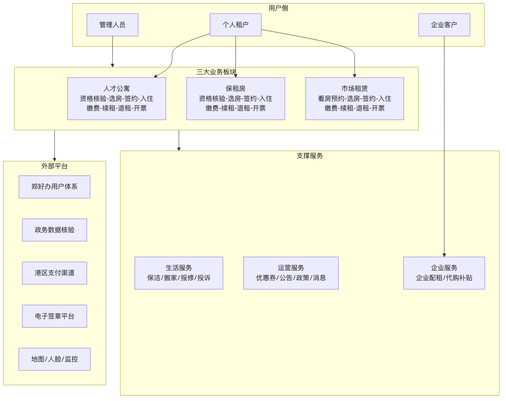

具体建设内容如下：

### 1.2.1 四端应用建设

| 端 | 建设内容 | 功能范围 |
|---|---|---|
| 移动端（H5） | 面向租户的移动服务门户 | 登录（对接郑好办）、首页、办事（人才公寓/保租房/市场租赁）、服务、企业客户、代购补贴、我的，共约149项功能 |
| 小程序端 | 微信小程序，功能同H5 | 全量业务功能 + 人脸识别调用 |
| 微信公众号端 | 公众号内嵌H5，功能同H5 | 全量业务功能，依托公众号触达与消息推送 |
| 后台管理端 | 面向运营管理人员的PC管理系统 | 数据看板、资产管理、申请信息、合同管理、入住/退租/退款管理、服务管理、报表管理、优惠券管理、配置管理、系统管理，共约51项功能 |

### 1.2.2 八大业务域建设

1. **房源管理**：项目（小区/产业园/厂房）、楼栋、单元、房源四级资产台账，房型管理，房源上下架，常规分配与集中分配（配租批次、企业集中配租），VR看房文件管理，地图找房，管家电话，精选房源，定向配租；
2. **合同管理**：合同在线签署（对接电子签章）、合同模板配置（付款周期/签约期限/押金金额）、续租审批、常态化合同与集中合同管理、代购补贴合同备案；
3. **优惠券管理**：优惠券新增/编辑/删除、领取记录、核销明细、缴费抵扣计算；
4. **消息管理**：消息通知、通知公告、政策文件发布，消息渠道与消息队列配置；
5. **个人中心**：账号资料、我的房源、我的合同、我的预约、我的消息、申诉记录、信息维护、优惠券；
6. **运营中心**：金刚位/轮播图/腰封位/广告位运营配置、租户管理、黑名单管理、预约看房处理、投诉处置、资格申诉审核、服务订单（保洁/搬家/报修）分派、服务公司管理、监控列表；
7. **支付管理**：押金/租金账单管理、在线支付（对接港区支付接口）、退款申请与审批、账单催缴、开票管理（申请开票/上传发票/发票下载）；
8. **数据看板**：财务数据统计（应收/实收/逾期/退款）、房源出租率统计、租户画像（婚姻/户籍/学历/职业）、项目收款台账、自定义报表。

### 1.2.3 系统对接建设

| 序号 | 对接项 | 对接内容 |
|---|---|---|
| 1 | 郑好办用户体系 | 统一用户认证、单点登录、用户信息采集 |
| 2 | 公共数据接口 | 房管局、不动产权中心相关接口 |
| 3 | 用户信息资格核验接口 | 社保（郑州市）、婚姻（郑州市）、学历（郑州市）、住房（港区）、保租房（港区）等自动资格核验 |
| 4 | 支付渠道 | 港区支付接口，押金/租金在线缴纳与退款 |
| 5 | 电子签章 | 合同在线签署、电子合同存证与下载 |
| 6 | 人脸识别 | 签约人与选房人一致性核验（小程序/公众号端） |
| 7 | 地图服务 | 第三方地图，项目定位、距离计算、导航跳转 |
| 8 | 园区监控 | 第三方园区监控图像对接，管理端实时查看 |

### 1.2.4 数据迁移与培训

- **数据迁移**：将现有系统中港区业务数据（房屋数据、合同数据、账单数据、用户数据等）完整迁移至新系统，保证迁移前后数据一致、业务连续；
- **系统培训**：面向管理端运营人员与相关业务人员开展系统使用培训，提供操作手册与常态化培训支持。

## 1.3 项目建设重难点解析

结合我方在同类保障性住房租赁管理平台建设中的实践经验，我们对本项目的重难点解析如下：

### 1.3.1 重点一：三类业态统一承载与差异化流程设计

人才公寓、保租房、市场租赁三类业务的主体流程同构（选房→签约→入住→退租→续租→缴费→开票），但在**资格校验规则**（人才公寓需人才认定，保租房需社保/婚姻/学历/住房多维核验，市场租赁仅查欠费）、**配租方式**（常规分配/集中分配/企业集中配租）、**审批链路**上存在显著差异。

**应对策略**：采用"统一业务模型 + 业务类型策略分流"的设计模式，合同、账单、房源使用统一数据模型并以业务类型字段区分，资格校验、续租校验等差异化环节采用策略模式按业务类型分流处理，既保证代码复用降低维护成本，又支持各业态规则独立演进。

### 1.3.2 重点二：多渠道政务数据对接与自动资格核验

保租房资格自动校验需要对接社保、婚姻、学历、住房、保租房共5类政务数据接口，接口分属不同层级（郑州市级/港区级），存在网络环境隔离、接口协议差异、响应时效不稳定等问题。

**应对策略**：我方在同类项目中已完整实现政务数据接口对接，采用"**政务接口代理网关**"模式：由部署于可访问政务网络环境的代理服务统一封装各政务接口，业务系统仅与代理网关交互；核验结果按业务规则设置合理缓存周期，减少重复调用；接口异常时自动降级为"人工审核"通道并给用户明确提示，保证业务不中断。该模式已在生产环境稳定运行，可低成本复用至本项目。

### 1.3.3 重点三：支付资金安全与账单准确性

押金、租金在线支付涉及资金安全，需处理支付回调丢失、重复支付、超时未支付、部分退款等复杂场景；账单生成需精确处理租期拆分、优惠券抵扣、逾期计算等规则，"押金未缴不可选租期账单缴费"等业务约束必须严格保证。

**应对策略**：基于我方成熟的支付对接经验，实施"**支付状态机 + 回调兜底 + 主动对账**"三重保障：订单状态机严格约束状态流转，防止重复支付；支付回调幂等处理，并以定时任务主动查询支付渠道补偿回调丢失；超时未支付订单自动取消释放房源；退款按账单明细拆分执行；每日与支付渠道对账，差异及时告警人工介入。

### 1.3.4 重点四：存量数据迁移的完整性与业务连续性

现有系统承载着在租合同、在途账单、历史缴费等生产数据，迁移过程必须保证数据不丢、不错、不重，且新旧系统切换期间业务不中断。

**应对策略**：我方具备同类系统老数据迁移的完整实战经验，采用"**分域清洗—映射转换—试迁移校验—增量补迁—并行核对**"五步迁移法：先对房屋、用户、合同、账单四大数据域分别制定清洗规则与字段映射表；在测试环境完成试迁移并输出比对报告（记录数、金额合计、关键字段抽样比对）；正式切换选择业务低峰期，切换后保留旧系统只读查询一段时间，用于并行核对与追溯。

### 1.3.5 重点五：多端一致性与低成本维护

移动端、小程序端、公众号端功能要求完全一致，若各端独立开发将造成约三倍的开发与维护成本，且极易出现多端行为不一致。

**应对策略**：采用 **uni-app 跨端统一开发框架**，一套代码编译产出 H5、微信小程序、公众号（H5内嵌）三端应用，业务逻辑、接口调用、页面交互完全一致；仅对人脸识别等平台差异能力做条件编译适配。该方案可显著压缩开发工期，并保证后续需求迭代"一处修改、三端生效"。

### 1.3.6 难点：驻场开发模式下的进度与质量双控

本项目开发期仅60日历天、总人月数不少于37人月，工期紧、任务重，且驻场开发需与甲方深度协同，需求确认、联调对接、验收节奏都依赖高效的协作机制。

**应对策略**：详见本方案第三章项目实施管理与第六章服务期限保证。核心措施包括：进场即冻结需求基线、按周迭代交付可视化成果、每日站会+每周例会双频同步、里程碑评审制、关键路径（政务接口/支付/电子签章对接）提前启动联调申请。

## 1.4 项目业务需求分析

### 1.4.1 业务角色分析

| 角色 | 说明 | 主要诉求 |
|---|---|---|
| 个人租户 | 人才公寓/保租房/市场租赁的申请人与承租人 | 线上完成资格申诉、选房、签约、缴费、开票、退租全流程，少跑腿、进度透明 |
| 企业客户 | 集中配租房源的承租单位 | 批量办理入住/退租、单位在线缴费 |
| 运营管理人员 | 甲方房屋租赁运营团队 | 房源台账清晰、审批高效、账单可催缴、报表可导出 |
| 财务人员 | 甲方财务部门 | 收款台账准确、退款流程可控、开票规范 |
| 系统管理员 | 平台管理与运维人员 | 权限精细可控、日志可追溯、配置灵活 |

各类角色与系统各端的对应关系如下图所示：

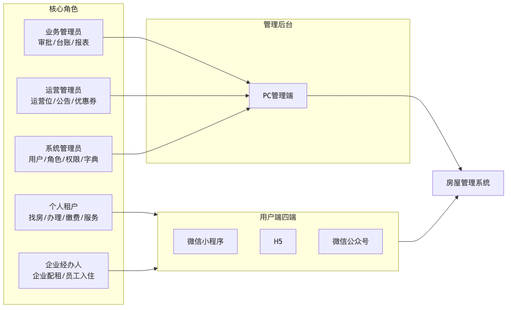

### 1.4.2 核心业务流程需求

#### 1.4.2.1 资格申诉与核验流程

系统自动调用政务接口核验资格，不符项支持用户手动刷新与在线申诉，管理端人工复核，形成"自动核验为主、人工审核兜底"的资格管理闭环。

| 环节 | 参与角色 | 流程要求 |
|---|---|---|
| 自动核验 | 系统 | 用户发起申请后，自动调用社保（郑州市）、婚姻（郑州市）、学历（郑州市）、住房（港区）、保租房（港区）核验接口，逐项返回核验结果 |
| 不符项展示 | 租户 | 核验不通过项以列表形式明确展示，注明不符原因 |
| 手动刷新 | 租户 | 用户补正信息后（如社保补缴到账）可手动触发重新核验 |
| 在线申诉 | 租户 | 对核验结果有异议的，在线提交申诉说明与佐证材料 |
| 人工复核 | 运营管理人员 | 管理端受理申诉，人工审核后录入复核结论，结论回写资格状态 |
| 记录留痕 | 系统 | 每次核验、申诉、复核均留存记录，支持导出审计 |

#### 1.4.2.2 选房签约流程

项目/房源浏览（含VR看房、地图导航）→ 签订承诺书 → 选定房源 →（人脸识别核验）→ 在线签署合同（电子签章）→ 押金缴纳（限时上传材料，超时自动退押解约）。流程关键需求点：

- 房源列表须按楼栋/单元/房间层级展示，支持户型、朝向、楼层等条件筛选；
- 房源详情提供照片、公示信息、周边配套、VR看房、地图导航、管家电话，信息充分辅助决策；
- 选房前须在线签订承诺书；小程序/公众号端签约前进行人脸识别，核验签约人与选房人一致；
- 合同采用电子签章在线签署，签署完成支持在线下载；
- 押金缴纳设置时限，同时限时上传要求材料，超时系统自动退还押金并取消合同、释放房源。

#### 1.4.2.3 入住办理流程

入住申请 → 管理端签收审核 → 租户勾选房间物品核对状态 → 电子签字确认入住。要求物品核对清单由系统按房源设施配置自动生成，租户逐项勾选核对，签字确认后形成入住确认单存档；企业客户支持上传入住人员名单模板批量办理。

#### 1.4.2.4 居住服务流程

投诉建议、保洁/搬家/报修订单在线申请，管理端分派服务公司，租户在线评价。要求服务订单全程状态可查（已申请/已分派/服务中/已完成/已评价），服务公司作为独立管理对象支持增删改查与服务范围配置。

#### 1.4.2.5 退租结算流程

退租申请 → 管理端签收 → 物品核对与退费信息确认 → 电子签字确认退租 → 退款申请、审批、退费。要求退费金额由系统按租期自动计算并支持人工调整留痕；退款须经审批流程，审批通过后原路退回；管理端另需支持强制退租处理能力。

#### 1.4.2.6 续租管理流程

续租资格校验（人才公寓/保租房校验资格+欠费，市场租赁仅校验欠费）→ 续租合同在线签订 → 管理端审批 → 租金缴纳提示。要求续租校验规则按业态差异化配置，校验不通过时明确提示不通过原因。

#### 1.4.2.7 账单缴费与开票流程

账单自动生成 → 在线支付（支持优惠券抵扣）→ 逾期催缴 → 按账期申请开票 → 发票在线预览下载。关键约束：**押金账单未缴清前不允许选择租期账单缴费**；支付对接港区支付接口，支持第三方在线支付；优惠券抵扣金额自动计算；管理端支持按账单维度催缴并记录催缴历史。

#### 1.4.2.8 运营管理流程

配租批次管理（新增/编辑/作废/审批/详情）、企业客户集中配租、黑名单管理、金刚位/轮播图/腰封位/广告位运营配置、通知公告与政策文件发布。要求集中配租支持房源与人员的批量绑定与审批流转，运营位配置实时生效。

### 1.4.3 非功能性需求分析

| 需求类别 | 需求描述 |
|---|---|
| 性能需求 | 核心页面响应时间≤2秒；支付类接口响应≤3秒；支持高峰期（集中配租选房）并发访问不降级 |
| 可用性需求 | 系统7×24小时运行，年可用率≥99.5%；关键组件冗余部署 |
| 安全需求 | 满足网络安全等级保护二级要求；敏感数据（身份证、手机号）加密存储、脱敏展示；操作日志可查可追溯 |
| 兼容性需求 | 移动端兼容主流机型与微信内浏览器；管理端兼容Chrome/Edge等主流浏览器 |
| 可扩展性需求 | 模块化架构，支持后续业务域扩展与新配租政策快速上线 |
| 数据需求 | 存量数据完整迁移；数据备份可恢复（每日全量+增量）；报表数据准确一致 |

各类非功能需求的细化指标与理解如下：

**（1）性能需求细化**

| 指标项 | 指标要求 | 说明 |
|---|---|---|
| 普通页面加载 | ≤2秒（P95） | 房源列表、合同列表等常规查询页面 |
| 复杂查询响应 | ≤3秒（P95） | 数据看板聚合统计、报表导出触发 |
| 支付类接口 | ≤3秒 | 下单、支付结果查询接口，超时须有兜底提示 |
| 文件类操作 | 图片上传≤5秒/张；VR资源采用CDN分发按需加载 | 保障弱网环境可用 |
| 并发能力 | 支撑集中配租选房高峰并发；热点房源库存扣减准确无超卖 | 通过缓存预热、队列削峰、分布式锁保障 |
| 批量处理 | 账单批量生成、名单批量导入等后台任务不阻塞在线业务 | 异步任务化处理，进度可查 |

**（2）可用性与可靠性需求细化**：系统全年7×24小时不间断运行，年可用率≥99.5%（对应全年不可用时间≤43.8小时）；应用服务无状态化设计支持多实例部署，数据库主从热备；发布升级采用低峰期灰度方式，单次计划内停机不超过30分钟并提前公告；任何单点故障不得导致数据丢失，RPO≤4小时、RTO≤2小时。

**（3）安全需求细化**：整体满足GB/T 22239-2019等保二级要求；身份证号、手机号等个人敏感信息加密存储、界面脱敏展示、导出受控；登录鉴权采用统一认证+会话超时控制；权限按角色最小化授权并支持数据权限隔离；登录日志与操作日志全量留存且不可篡改，保存期限满足审计要求。

**（4）易用性需求细化**：移动端交互面向普通租户设计，关键业务（选房、签约、缴费）操作步骤清晰、状态提示明确；表单校验即时反馈，错误提示语义友好；管理端列表支持多条件筛选、排序、导出，高频操作路径不超过3次点击；对老年用户等群体保证字体可读性与操作容错。

### 1.4.4 需求理解的三个关键判断

基于对招标需求的整体分析，我方形成以下三个关键判断，并以此指导方案设计：

1. **本项目是"业务平台"而非"信息展示系统"**：211项功能中约80%涉及业务流转、状态变更与资金往来，系统设计必须以业务状态机、审批流、资金安全为核心，而非简单的信息增删改查；
2. **对接质量决定项目成败**：郑好办、政务核验、支付、签章、人脸识别、地图、监控、公共数据8类对接贯穿核心流程，任何一个对接不畅都会阻断主业务链路，因此对接工作必须提前启动、并行推进、预设降级方案；
3. **迁移与并行期是风险最集中的阶段**：存量在租合同与在途账单迁移后必须立即可用，切换期间的每一笔缴费都不能出错，必须以演练充分、可回退的迁移方案保障平稳过渡。

## 1.5 应用功能需求分析

依据招标文件"软件开发清单及功能明细"（共211项功能），我方对应用功能需求梳理如下：

### 1.5.1 移动端功能需求（含小程序端、公众号端）

| 功能模块 | 功能要点 | 项数 |
|---|---|---|
| 登录 | 对接郑好办用户体系、用户信息采集、管理办法告知 | 1 |
| 首页 | 搜索、banner位、金刚位（后台可配置） | 7 |
| 办事-人才公寓 | 资格申诉、选房（项目/房源/VR/预约看房）、人脸识别、合同签署、押金缴纳、入住/退租/续租办理、账单缴费、我的合同、开票、合住人、调换房 | 约35 |
| 办事-保租房 | 资格申诉（五维政务核验）+ 同构全流程 | 约37 |
| 办事-市场租赁 | 同构全流程（续租仅欠费校验、合同倒计时） | 约35 |
| 服务 | 投诉建议、保洁/搬家/报修订单及评价 | 13 |
| 企业客户 | 在线缴费、批量入住、退租办理 | 3 |
| 代购补贴 | 合同备案、代购补贴申请 | 2 |
| 我的 | 账号资料、消息、房源、合同、申诉记录、信息维护、优惠券、关于我们 | 8 |

对移动端各功能模块的需求理解细化如下：

**（1）登录与首页模块**：登录对接郑好办用户体系实现统一认证，同步采集用户基础信息，并在首次进入时告知港区保租房、人才公寓管理现行办法；首页承担业务分流职责——搜索（关键词/分类）、banner位（政策通知、办事指引轮播跳转）、金刚位（人才公寓/保租房/市场租赁等入口，后台可配置）、地图找房（房源地图点位、按区域/小区/户型筛选、按业态筛选、跳转房源详情）、人才家园、政策文件、资料上传、优惠券领取、我的消息等入口均须支持后台运营配置。

**（2）办事模块（人才公寓/保租房/市场租赁三业态）**：三业态共享同构的业务流程骨架，差异在资格校验与续租校验规则。需求要点：

| 业务环节 | 需求要点 | 业态差异 |
|---|---|---|
| 资格申诉 | 自动核验不符项列表展示、手动刷新、在线申诉 | 人才公寓按人才认定政策；保租房按社保/婚姻/学历/住房/保租房五维核验；市场租赁无资格门槛 |
| 项目与房源浏览 | 项目列表/详情、房源列表（楼栋/单元/房间、条件筛选）、房源详情（照片/公示信息/周边配套/VR看房/地图导航/管家电话） | 三业态一致 |
| 预约看房 | 在线预约、预约记录查询 | 三业态一致 |
| 承诺书 | 选房前在线签订承诺书 | 三业态一致 |
| 人脸识别 | 签合同人与选房人一致性核对（小程序/公众号端） | 三业态一致 |
| 合同签署 | 在线签署（电子签章）、合同下载 | 三业态一致 |
| 押金缴纳 | 在线缴纳押金，限时上传材料，超时退押金取消合同 | 三业态一致 |
| 入住办理 | 入住列表/申请/确认（勾选物品核对+签字）/详情 | 三业态一致 |
| 退租办理 | 退租列表/申请/确认（签字）/详情 | 三业态一致 |
| 续租办理 | 合同列表、续租校验、合同签订、租金缴纳提示 | 人才公寓/保租房校验资格+欠费；市场租赁仅校验欠费 |
| 账单缴费 | 押金账单+房租账单，港区支付接口在线支付，优惠计算 | 押金未缴不能选租期账单（三业态一致） |
| 我的合同 | 合同列表与详情查看 | 市场租赁新签约合同支持倒计时展示 |
| 开票 | 开票记录、开票申请（选账期）、发票预览下载 | 三业态一致 |
| 合住人申请 | 在线提交合住人申请 | 按业态政策执行 |
| 调换房申请 | 在线提交调换房申请 | 按业态政策执行 |

**（3）服务模块**：投诉及建议（记录/发起）、保洁订单（搜索/记录/申请/评价）、搬家订单（同构）、物业报修（记录/申请/评价），共13项。服务订单须与房源、合同关联，评价结果供管理端服务质量考核使用。

**（4）企业客户模块**：面向集中配租承租单位，提供在线缴费（集中分配房源+单位信息）、入住办理（上传入住人员名单模板批量办理）、退租办理（选账期发起退租申请）3项功能，满足企业批量业务办理诉求。

**（5）代购补贴模块**：合同备案（历史备案/审批进度/发起备案）、代购补贴申请（历史申请/审批进度/签署承诺书）2项功能，备案与申请均走管理端审批流。

**（6）我的模块**：账号资料、我的消息、我的房源、我的合同、申诉记录、信息维护、优惠券、关于我们8项功能，构成用户个人事务管理中心。

### 1.5.2 后台管理端功能需求

| 功能模块 | 功能要点 | 项数 |
|---|---|---|
| 首页数据看板 | 财务统计、房源数据、租户数据、客户分析、项目台账 | 5 |
| 资产管理 | 项目管理、房源管理（含VR管理、配租）、配租批次、企业客户 | 4 |
| 申请信息 | 租户管理、预约看房、投诉记录、资格申诉、承诺书 | 5 |
| 合同/入住/退租/退款 | 合同管理、常态/企业入住、常态/企业退租、退款管理、合住人、调换房、租金账单、代购补贴 | 11 |
| 服务管理 | 保洁/搬家/报修分派、服务公司、开票管理、监控列表 | 6 |
| 报表管理 | 项目收款台账、自定义报表 | 2 |
| 优惠券管理 | 优惠券管理、领取记录、核销明细 | 3 |
| 运营配置 | 黑名单、用户管理、消息通知、合同模板、运营位配置、通知公告、政策文件 | 7 |
| 系统管理 | 用户/账号/角色/权限/字典/消息/安全日志 | 7 |

对后台管理端各功能模块的需求理解细化如下：

**（1）首页数据看板**：财务数据统计（应收/实收/预计应收/逾期/退款金额，按月筛选）、房源数据（总数/已租/空置/维修/出租率/转化率）、租户数据（婚姻/户籍分布）、客户分析（学历/职业分布）、项目台账，为管理层提供"打开系统即见经营全貌"的决策入口，指标须与业务明细数据严格一致。

**（2）资产管理**：项目管理支持小区/产业园/厂房三类项目的增删改查、导入导出与房型管理；房源管理支持增删改查、导入导出、上下架、常规分配/集中分配切换、管家电话维护、精选房源标记、定向配租时间设置、VR文件管理；配租批次支持集中配租（房源+人员绑定，新增/编辑/作废/审批/详情）与企业客户集中配租。资产数据是全系统的基础，房源状态须与合同、入住、退租业务实时联动。

**（3）申请信息管理**：租户管理（查询/导出/资格退出拉黑/详情）、预约看房（签收/确认）、投诉记录（处置）、资格申诉（手动审核/导出）、承诺书（查询/导出），构成面向租户申请事务的统一受理台。

**（4）合同与业务管理**：合同管理覆盖常态化合同与集中合同（查询/导出/续租审批）；入住管理区分常态入住（签收/作废/强制退租）与企业入住；退租管理支持物品核对与退费确认；退款管理走申请/撤销/审批/退费闭环；合住人与调换房走审批流；租金账单支持查询/催缴/导出/详情；代购补贴含合同备案审批与补贴申请审批。本模块是运营人员日常使用频率最高的业务中枢，审批时效与操作留痕是核心要求。

**（5）服务管理**：保洁订单/搬家订单/物业报修的分派处理（指定服务公司）、服务公司管理、开票管理（上传发票）、监控列表（各小区监控设备实时查看）。

**（6）报表与运营管理**：报表管理（项目收款台账/自定义报表）、优惠券管理（管理/领取记录/核销明细）、黑名单管理、用户管理、配置管理（消息通知模板、合同模板——付款周期/签约期限/押金金额、运营配置——金刚位/轮播图/腰封位/广告位、通知公告、政策文件）。其中**自定义报表**要求支持运营人员自选统计维度与字段生成报表并导出；**合同模板配置**直接决定签约业务规则，变更须有审批与生效控制。

**（7）系统管理**：用户/账号/角色/权限（菜单权限+数据权限）/字典/消息管理（渠道+队列）/安全日志（登录日志、操作日志可查可追溯），为全系统提供统一的权限与配置底座。

### 1.5.3 实施与对接需求

数据迁移（房屋/合同/账单/用户数据）、系统使用培训、公共数据接口对接（房管局/不动产权中心）、地图对接、资格核验接口对接、监控对接、支付渠道对接、电子签章对接、公众号端与小程序端构建、人脸识别调用，共11项。

### 1.5.4 功能需求理解小结

我方已逐项研读全部211项功能明细，并与我方已建成运行的同类住房租赁管理平台功能体系进行了逐项比对：**约90%的功能项与我方已有成熟实现直接对应**（选房签约、入住退租、账单支付、开票、配租批次、企业集中配租、服务订单、数据看板等），其余功能项（优惠券核销体系、自定义报表、监控对接等）我方已有清晰的技术实现路径。这使我方能够以"成熟方案定制化适配"取代"从零开发"，在60日历天开发期内高质量完成交付。

## 1.6 系统非功能性需求分析

除功能性需求外，本项目作为面向公众的政务服务类系统，对性能、可用性、兼容性、易用性、可扩展性与安全合规均有较高要求。我方对非功能性需求的分析与设计指标承诺如下：

### 1.6.1 性能需求

| 指标项 | 指标要求 | 设计保障措施 |
|---|---|---|
| 页面响应时间 | 普通页面≤2秒，复杂查询页面≤3秒 | 接口瘦身、懒加载、CDN静态资源分发 |
| 接口响应时间 | 一般业务接口≤500ms（P95），查询类接口≤1秒（P95） | 索引优化、热点数据Redis缓存、读写分离 |
| 并发能力 | 支持≥1000用户在线、≥200并发事务，选房高峰场景专项压测 | 应用无状态多实例部署、连接池调优、异步削峰 |
| 批量处理 | 万级房源/租户数据导入导出≤5分钟，异步任务不阻塞在线业务 | 异步任务队列+分批处理+进度反馈 |
| 报表统计 | 看板指标秒级返回，明细报表万级数据导出≤3分钟 | 统计走只读从库与预聚合，导出异步生成 |
| 高峰承载 | 配租批次开放选房瞬时高峰不宕机、不超卖 | 房源锁定原子化（Redis+数据库双重约束）、排队削峰 |

### 1.6.2 可用性与可靠性需求

| 指标项 | 指标要求 | 设计保障措施 |
|---|---|---|
| 系统年可用率 | ≥99.5% | 关键组件冗余部署、健康检查、自动故障转移 |
| 故障响应 | 紧急故障10分钟内响应，一般故障2小时内响应 | 驻场值守+监控告警三级推送+应急处置卡 |
| 数据可靠性 | RPO≤4小时、RTO≤2小时 | 每日全量+日间增量备份、异机存放、每季度恢复演练 |
| 事务一致性 | 资金相关操作强一致，支付零差错 | 支付状态机+回调幂等+每日对账三重保障 |
| 容错能力 | 外部接口故障不导致主流程中断 | 适配器隔离、超时熔断、降级人工通道 |

### 1.6.3 兼容性需求

| 维度 | 兼容要求 |
|---|---|
| 移动端浏览器 | 微信内置浏览器、主流手机浏览器（基于WebKit/Blink内核）全兼容 |
| 微信生态 | 微信小程序基础库近两年主流版本；公众号网页授权规范 |
| 管理端浏览器 | Chrome、Edge、360（极速模式）、火狐等主流现代浏览器 |
| 屏幕适配 | 移动端主流分辨率自适应；管理端1366×768及以上分辨率适配 |
| 操作系统 | 服务端兼容主流Linux发行版；客户端不限操作系统 |

### 1.6.4 易用性需求

1. **面向公众的低门槛设计**：办事流程步骤化引导、表单项通俗化命名、必要处提供示例与说明，中老年用户也可顺畅完成申请、缴费操作；
2. **状态透明**：申请审核、合同签署、退租退款等在途业务全程进度可视，减少用户电话咨询；
3. **防错设计**：关键操作二次确认、表单实时校验即时提示、超时操作自动保存草稿；
4. **管理端效率设计**：高频审批操作支持批量处理，列表页记忆查询条件，导出模板与页面所见一致。

### 1.6.5 可扩展性与可维护性需求

1. **业务可扩展**：业务类型策略化设计，新增业态（如新增配租政策类型）仅需扩展策略实现而不改动主干代码；
2. **能力可替换**：支付、签章、地图等外部能力适配器化，更换服务商不影响业务层；
3. **配置驱动**：运营位、合同模板、消息模板、审批规则等以配置管理，运营调整零发版；
4. **可观测性**：日志、指标、链路三位一体，问题定位从"小时级"缩短到"分钟级"；
5. **文档与注释**：交付代码注释完整、文档齐套，保障甲方后续自主维护与二次开发。

### 1.6.6 安全合规需求

系统需满足网络安全等级保护二级要求，遵循《网络安全法》《数据安全法》《个人信息保护法》相关规定：身份鉴别、访问控制、安全审计、数据加密、个人信息最小化采集与脱敏展示、日志留存不少于6个月。详细安全设计见本方案第四章。

## 1.7 术语与定义

为保证方案表述与评审理解一致，对本方案高频术语定义如下：

| 术语 | 定义 |
|---|---|
| 四端应用 | 移动端（H5）、微信小程序端、微信公众号端、后台管理端的合称 |
| 三类业态 | 人才公寓、保租房（保障性租赁住房）、市场租赁三类租赁业务的合称 |
| 常规分配 | 租户自主浏览房源、自主选房签约的开放式配租方式 |
| 集中分配 | 以配租批次绑定房源清单与人员名单、限窗口期选房的配租方式 |
| 企业集中配租 | 面向企业客户批量绑定房源、企业统一缴费与批量入住的配租方式 |
| 资格核验 | 通过政务数据接口对申请人社保、婚姻、学历、住房、保租房等信息进行自动比对校验 |
| 资格申诉 | 自动核验不通过时，申请人提交证明材料由人工复核的救济通道 |
| 配租批次 | 集中分配业务的管理单元，包含房源清单、人员名单、选房时间窗 |
| 押金账单/租期账单 | 合同签署后生成的押金缴纳单据；按付款周期拆分生成的租金缴纳单据 |
| 挡板服务 | 外部接口未开通期间用于模拟其请求响应行为的测试替身服务 |
| 灰度发布 | 新版本先对部分用户/流量开放验证，再逐步放量至全量的发布方式 |
| RPO/RTO | 灾难恢复指标：最大可容忍数据丢失时长/最大可容忍业务中断时长 |
| 等保二级 | 网络安全等级保护第二级，本系统的安全建设与测评基准 |
| 初验/终验 | 初步验收（开发交付后）与最终验收（按合同约定条件达成后）

# 第二章 应用系统功能设计

## 2.1 应用系统功能执行标准

本项目软件开发、测试、验收、文档编制全过程严格执行下列国家标准与行业规范：

| 类别 | 标准编号 | 标准名称 |
|---|---|---|
| 软件工程 | GB/T 8566-2007 | 信息技术 软件生存周期过程 |
| 软件工程 | GB/T 8567-2006 | 计算机软件文档编制规范 |
| 软件质量 | GB/T 25000.51-2016 | 系统与软件工程 系统与软件质量要求和评价 |
| 软件测试 | GB/T 15532-2008 | 计算机软件测试规范 |
| 验收规范 | GB/T 28035-2011 | 软件系统验收规范 |
| 信息安全 | GB/T 22239-2019 | 信息安全技术 网络安全等级保护基本要求（二级） |
| 信息安全 | GB/T 25070-2019 | 信息安全技术 网络安全等级保护安全设计技术要求 |
| 数据安全 | GB/T 35273-2020 | 信息安全技术 个人信息安全规范 |
| 密码应用 | GB/T 39786-2021 | 信息安全技术 信息系统密码应用基本要求 |
| 接口规范 | GB/T 36478 | 物联网/政务信息资源交换体系相关接口规范 |
| 无障碍 | GB/T 37668-2019 | 信息技术 互联网内容无障碍可访问性技术要求与测试方法 |

同时遵循甲方信息化建设管理规定、郑好办开放平台接入规范、微信小程序/公众号平台开发规范、支付渠道接入安全规范。

## 2.2 系统组成

系统由"四端应用 + 八大业务域 + 三类支撑平台"组成：

**（1）四端应用**：移动端（H5）、微信小程序端、微信公众号端、后台管理端（PC Web）。三个用户端基于 uni-app 跨端框架统一开发，功能完全一致；后台管理端基于 Vue + Element UI 构建。

**（2）八大业务域**：房源管理、合同管理、优惠券管理、消息管理、个人中心、运营中心、支付管理、数据看板。

**（3）三类支撑平台**：
- **基础支撑平台**：统一权限（RBAC，菜单权限+数据权限）、字典管理、参数配置、代码生成、定时任务调度、操作日志与安全审计；
- **集成支撑平台**：郑好办认证适配器、政务数据代理网关、支付网关适配器、电子签章适配器、人脸识别适配器、地图服务适配器、监控视频适配器、消息推送渠道（站内信/模板消息/短信）；
- **数据支撑平台**：MySQL 主数据库、Redis 缓存、文件存储服务、数据备份与迁移工具集。

系统功能架构如下图所示：

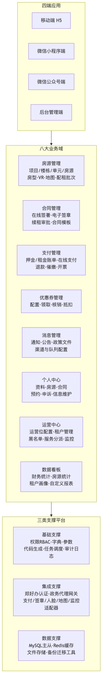

## 2.3 系统结构

系统采用前后端分离的分层架构设计，自上而下分为用户终端层、访问网关层、前端表现层、业务服务层、核心支撑层、数据持久层、第三方接口层，共七层。系统总体架构如下图所示：

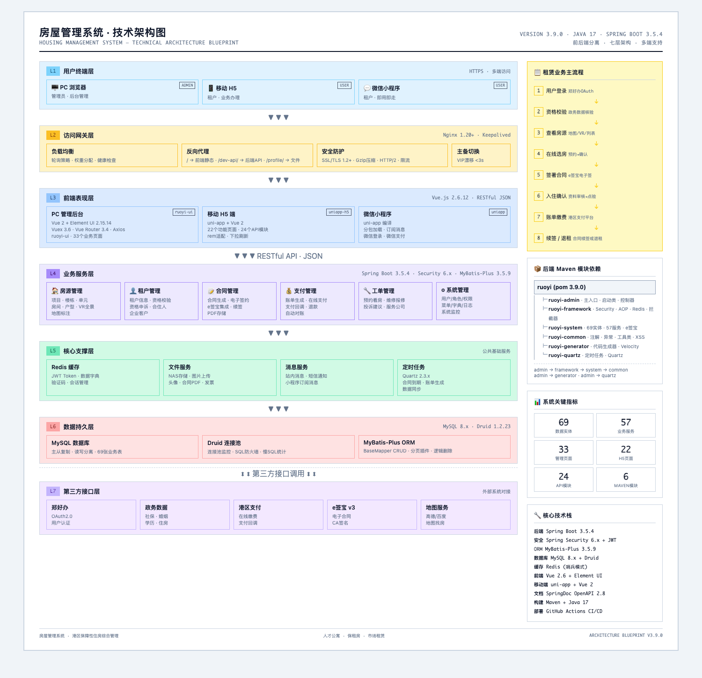

各层设计说明：

| 层次 | 组成 | 设计要点 |
|---|---|---|
| 用户终端层 | H5/小程序/公众号/PC浏览器 | 多终端接入，响应式适配 |
| 访问网关层 | Nginx 反向代理 | HTTPS 卸载、负载均衡、静态资源缓存、限流防护 |
| 前端表现层 | uni-app 三端 + Vue 管理端 | 组件化开发、路由权限控制、接口统一封装 |
| 业务服务层 | Spring Boot 业务应用 | 八大业务域 RESTful 服务，Controller-Service-Mapper 分层 |
| 核心支撑层 | Spring Security、MyBatis-Plus、Quartz、消息队列 | 认证授权、ORM、定时任务（账单生成/合同到期/超时取消）、异步解耦 |
| 数据持久层 | MySQL 主从 + Redis + 文件存储 | 读写分离、热点缓存、附件/VR文件存储 |
| 第三方接口层 | 郑好办/政务核验/支付/签章/人脸/地图/监控 | 适配器模式封装，可插拔替换 |

该架构具有以下特点：

1. **成熟稳定**：基于业界广泛验证的 Java 技术体系（Spring Boot 3 + Spring Security + MyBatis-Plus + MySQL + Redis），我方已有同类系统在生产环境长期稳定运行；
2. **模块化、高内聚低耦合**：业务域之间通过服务接口交互，第三方能力通过适配器隔离，便于扩展与替换；
3. **信创兼容**：技术栈全面兼容信创环境，可平滑适配国产数据库（达梦、人大金仓）、国产操作系统（麒麟）、国产中间件（东方通），满足后续国产化演进要求；
4. **弹性可扩展**：应用无状态设计，会话集中存储于 Redis，支持横向扩容应对集中配租等高峰场景。

## 2.4 系统支撑

### 2.4.1 技术选型

| 类别 | 选型 | 说明 |
|---|---|---|
| 后端框架 | Spring Boot 3.x（Java 17） | 主流企业级框架，生态完善 |
| 安全框架 | Spring Security + JWT | 认证授权、接口鉴权 |
| ORM | MyBatis-Plus | 高效数据访问，减少冗余代码 |
| 数据库 | MySQL 8.x（主从） | 事务可靠，支持读写分离 |
| 缓存 | Redis | 会话、热点数据、分布式锁 |
| 任务调度 | Quartz | 账单生成、合同到期处理、支付超时取消、对账 |
| 用户端框架 | uni-app（Vue语法） | 一套代码编译 H5/小程序/公众号三端 |
| 管理端框架 | Vue + Element UI | 成熟中后台方案 |
| Web服务器 | Nginx | 反向代理、负载均衡 |
| 接口文档 | SpringDoc（OpenAPI 3.0） | 接口在线文档，联调降本 |

### 2.4.2 运行环境支撑

- **服务器环境**：应用服务器、数据库服务器、缓存服务器、文件服务器按生产/测试双环境规划，生产环境关键节点冗余部署；
- **部署方式**：支持甲方指定的云环境或本地机房部署；应用以服务化方式托管（进程守护、开机自启、故障自动拉起）；
- **环境隔离**：开发、测试、生产三套环境物理或逻辑隔离，配置参数外部化管理，杜绝环境间配置串用。

各环境资源规划建议如下（最终以甲方实际资源与部署评审确认为准）：

| 环境 | 节点 | 用途 | 配置建议 | 冗余策略 |
|---|---|---|---|---|
| 生产 | 应用服务器×2 | 后端服务多实例部署 | 8核16G起 | 双实例负载均衡，单点故障自动摘除 |
| 生产 | 数据库服务器 | MySQL主库+从库 | 8核32G起，SSD磁盘 | 主从复制，从库承担只读统计查询 |
| 生产 | 缓存服务器 | Redis | 4核8G起 | 主从+哨兵，故障自动切换 |
| 生产 | 文件/静态资源 | 附件存储、前端静态资源、VR文件 | 按容量规划（百GB级起） | 定期备份+CDN分发 |
| 生产 | 备份存储 | 数据库与附件备份 | 与生产数据分离的异机存储 | 每日备份+异地留存 |
| 测试 | 应用+数据库+缓存 | 集成测试、验收测试、迁移演练 | 可合并部署，4核8G起×2 | 与生产隔离，结构与生产一致 |
| 开发 | 开发联调环境 | 每日构建部署、开发自测 | 项目组内部资源 | — |

系统部署架构如下图所示：

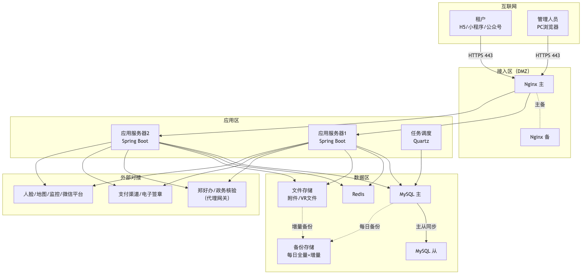

### 2.4.3 公共支撑能力

统一登录与单点认证、统一权限（菜单+按钮+数据三级粒度）、统一字典、统一文件上传（图片/文档/VR全景文件）、统一消息（站内信/微信模板消息/短信可配置）、统一日志（登录日志/操作日志/接口调用日志）、代码生成器（标准 CRUD 快速生成，支撑60天工期）。

## 2.5 核心业务功能设计

以下按八大业务域展开功能设计（功能项与招标功能清单211项逐一对应）。

### 2.5.0 功能设计方法说明

为保证功能设计与招标功能明细严格对应、便于评审核对，本节采用统一的设计描述框架：每个业务域先给出**设计概述与设计目标**，再按功能点给出**逐项功能设计表**，表格字段约定如下：

| 字段 | 说明 |
|---|---|
| 功能点 | 与招标"软件开发清单及功能明细"对应的功能名称 |
| 功能设计说明 | 功能的页面构成、操作流程、系统处理逻辑 |
| 关键业务规则 | 该功能必须满足的约束条件、校验规则、状态联动 |

所有功能点的数据操作均遵守统一的通用设计约定，不在逐项表中重复描述：

1. **权限约定**：管理端每个功能均受RBAC权限控制（菜单可见性、按钮操作权、数据范围权三级）；用户端功能均需登录后访问（政策浏览类除外）；
2. **留痕约定**：所有新增、修改、删除、审批、导出操作均记录操作日志（操作人、时间、对象、内容摘要）；
3. **列表约定**：管理端列表页均支持多条件组合查询、分页、排序；带导出功能的列表导出字段与查询结果一致；
4. **表单约定**：所有表单前后端双重校验，必填项、格式、长度、数值范围校验规则一致；
5. **状态约定**：涉及状态流转的业务对象（房源、合同、账单、订单、审批单）均采用状态机管理，非法状态跳转一律拒绝并留痕。

### 2.5.1 房源管理

**设计概述**：房源管理是全系统的资产数据底座，建立"项目→楼栋→单元→房源"四级资产台账，向上支撑选房、签约、入住业务，向下联动数据看板的出租率统计。设计目标：资产账实一致、房源状态与业务实时联动、配租方式灵活可配。

逐项功能设计如下：

| 功能点 | 功能设计说明 | 关键业务规则 |
|---|---|---|
| 项目管理 | 管理端维护小区/产业园/厂房三类项目档案：项目基础信息（名称、地址、经纬度、业态类型、管理办法）、项目图片、周边配套说明；支持增删改查、Excel导入导出 | 项目地址与地图坐标联动校验；项目下存在在租房源时不允许删除 |
| 房型管理 | 按项目维护房型（户型名称、居室、面积、朝向、装修标准、户型图、租金标准），房源关联房型自动继承属性 | 房型被房源引用时变更需二次确认；面积、租金为必填数值 |
| 房源管理 | 房源档案增删改查、批量导入导出；上下架控制；管家电话维护；精选房源标记；定向配租时间设置；VR文件上传与管理 | 上架必须信息完整（照片、租金、房型）；下架不影响在租合同；VR文件校验格式与大小 |
| 房源状态机 | 空置、已预订（选房锁定）、已出租、维修中、下架五状态流转；选房锁定设有效期，支付超时自动释放回空置 | 状态流转全部由业务动作驱动，禁止手工直接改状态（特殊场景走批量状态变更审批）；同一房源同一时刻仅允许一个有效锁定，防一房多租 |
| 常规分配 | 租户自主浏览房源→选房→签约的开放式配租通道 | 仅"空置+已上架+符合业态可见性规则"的房源可被选择 |
| 集中分配（配租批次） | 配租批次新增/编辑/作废/审批/详情：绑定房源清单与人员名单，批次内人员在配租时间窗内选房 | 批次房源在窗口期内仅对批次内人员可见；批次作废自动释放未选房源；批次操作走审批流 |
| 企业客户集中配租 | 面向企业客户的批量配租：企业信息+集中分配房源清单绑定，企业端在线缴费、批量入住 | 企业配租房源不进入个人选房池；企业欠费时限制新增配租 |
| 预约看房管理 | 用户端在线预约看房，管理端签收/确认预约并安排带看 | 同一用户对同一项目的有效预约不重复创建；预约状态变化触发消息通知 |
| VR看房 | 管理端按房源/房型上传VR全景文件，用户端房源详情内嵌VR漫游 | VR资源CDN分发按需加载，不阻塞详情页首屏 |
| 地图找房 | 房源地图点位聚合展示，按区域/小区/户型筛选，按人才公寓/保租房/市场化业态筛选，点击跳转房源详情，支持导航 | 地图点位数据与房源上下架状态实时同步 |

**页面与交互设计要点**：管理端房源列表采用"树形项目导航+列表"双栏布局，支持按楼栋/单元下钻；房源批量导入提供标准Excel模板与导入校验报告（成功/失败明细）；用户端房源列表卡片展示核心决策信息（租金、面积、朝向、楼层、标签），详情页信息分区呈现（照片轮播/公示信息/周边配套/VR入口/位置导航/管家电话一键拨打）。

房源状态流转设计如下图所示：

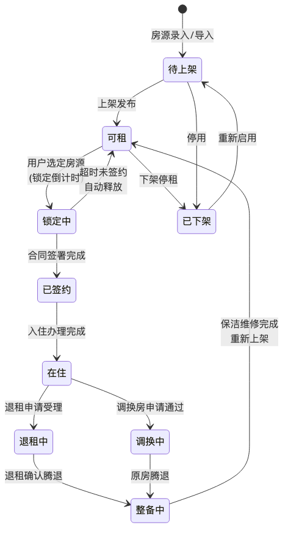

企业客户集中配租业务流程如下图所示：

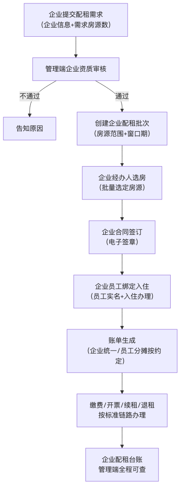

### 2.5.2 合同管理

**设计概述**：合同管理承载租赁关系的法律载体，覆盖"模板配置→在线签署→履行管理→续租/变更→到期/解除"全生命周期，对接电子签章保证合同法律效力。设计目标：签署流程合规可信、合同状态自动管控、多类型合同统一台账。

逐项功能设计如下：

| 功能点 | 功能设计说明 | 关键业务规则 |
|---|---|---|
| 合同模板配置 | 管理端按项目/业态配置合同模板：付款周期（月付/季付/半年付/年付）、签约期限、押金金额等签约要素；模板版本化管理 | 模板变更仅影响新签合同，存量合同按签署时模板执行；模板要素变更留痕可追溯 |
| 合同在线签署 | 租户在线阅读合同全文→确认签约信息→电子签名→平台与租户双方签章→合同生成PDF存证；支持合同在线下载 | 签署前完成人脸识别核验（小程序/公众号端）；签署链接限时有效；签署完成不可篡改 |
| 合同状态管理 | 待签署、待生效、履行中、待续签、已到期、已解除、已作废全状态机管理；定时任务自动处理到期提醒、超时未签作废、押金超时解约 | 状态流转均有触发条件与留痕；解除/作废须记录原因；状态变化联动房源状态与账单停止生成 |
| 续租办理 | 用户端发起续租→系统校验（人才公寓/保租房：资格+欠费；市场租赁：仅欠费）→在线签署续租合同→管理端续租审批→租金缴纳提示 | 续租合同租期与原合同无缝衔接；校验不通过明确提示原因；原合同到期前设置续租提醒窗口 |
| 合同台账 | 常态化合同与集中合同统一台账：多条件查询（项目/业态/状态/租期/租户）、导出、详情追溯（签署记录/账单记录/变更记录） | 导出受权限控制并留痕；集中合同关联配租批次信息 |
| 我的合同（用户端） | 合同列表与详情：合同要素、签署状态、关联账单入口、续租入口、合同下载 | 市场租赁新签约合同展示签约倒计时；仅本人合同可见 |
| 合同备案（代购补贴） | 用户端发起合同备案（上传备案材料）→管理端备案审批→备案进度查询 | 备案通过方可发起代购补贴申请；审批意见回传用户端 |
| 合住人管理 | 用户端提交合住人申请（合住人身份信息）→管理端审批→合住人信息关联合同 | 合住人数量受房型限制；合住人身份信息脱敏展示 |
| 调换房管理 | 用户端提交调换房申请→管理端审核→审核通过后办理换房手续（原房源释放、新房源签约） | 换房前须结清原房源账单；原合同与新合同关联可追溯 |

**电子签章集成设计**：采用模板化签署流——系统预置合同模板与签署控件位置，签约时自动填充合同要素（租户信息、房源信息、租金、租期、押金），发起签署流后由租户完成个人签名、平台完成企业签章；签署状态通过回调+主动回查双通道同步；已签合同文件加密存证，支持司法举证调取。

合同全生命周期状态流转如下图所示：

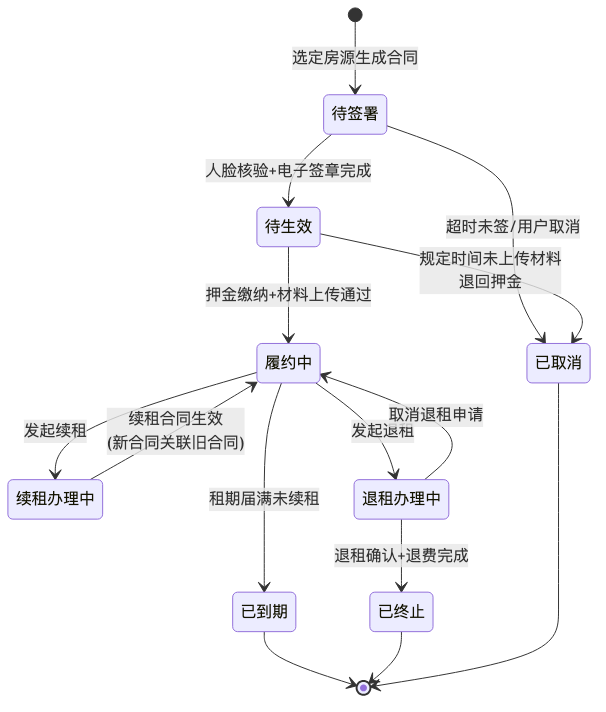

选房签约业务流程如下图所示：

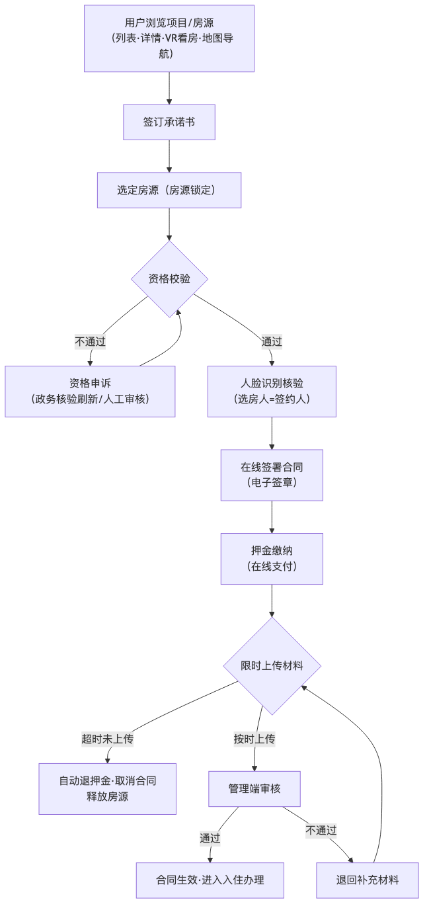

签约完成后的入住办理业务流程如下图所示：

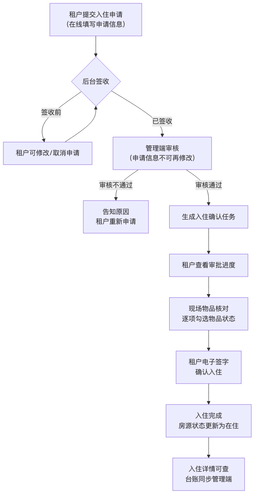

合同到期前的续租办理业务流程如下图所示：

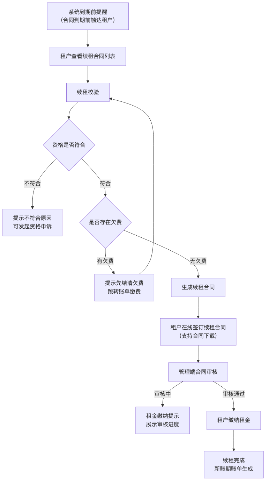

### 2.5.3 支付管理

**设计概述**：支付管理是资金往来的核心域，覆盖"账单生成→在线支付→对账→退款→催缴→开票"完整资金链路，对接港区支付接口。设计目标：账单准确、资金安全、每一分钱可对账可追溯。

逐项功能设计如下：

| 功能点 | 功能设计说明 | 关键业务规则 |
|---|---|---|
| 押金账单 | 合同签署后自动生成押金账单，用户端在线缴纳；押金缴纳设时限并联动材料上传要求 | 超时未缴自动退押金、取消合同、释放房源；押金金额取自合同模板配置 |
| 租金账单 | 按合同付款周期自动拆分生成租期账单（账期起止、应缴金额、缴费截止日）；支持账单详情查看 | **押金账单未缴清前，租期账单不可选择缴费**；账期拆分精确到日，首末期按天数折算 |
| 在线支付 | 对接港区支付接口发起第三方在线支付：下单→跳转支付→回调确认→账单核销；支持优惠券抵扣计算 | 支付订单状态机严格管理（待支付/支付中/已支付/已关闭/已退款）；回调验签+幂等处理；超时订单自动关闭 |
| 优惠计算 | 缴费时自动匹配用户可用优惠券，计算抵扣金额并展示实付金额 | 优惠券使用规则（适用范围/有效期/面额）严格校验；一笔账单限用规则可配置；核销记录留痕 |
| 主动对账 | 每日定时与支付渠道对账单比对：平台订单与渠道流水逐笔核对，差异生成对账异常清单 | 差异账单冻结自动核销，人工处理后闭环；对账结果日报留存 |
| 退款管理 | 退租结算/超时退押场景发起退款申请→（撤销）→管理端审批→调用渠道退款→退款结果确认→凭证留存 | 退款按原账单明细拆分执行、原路退回；退款单与原支付单强关联；审批留痕 |
| 账单催缴 | 逾期账单自动标记，管理端支持单笔/批量催缴，触发消息通知（站内信/模板消息/短信可配置）；催缴历史记录 | 逾期规则（宽限期）可配置；催缴频次受限防骚扰 |
| 项目收款台账 | 按项目/按月统计应收、实收、逾期、退款，支持导出 | 台账口径与账单明细严格一致，支持追溯到单笔账单 |
| 开票管理 | 用户端按账期申请开票（选择已缴账期）→管理端受理并上传发票文件→用户端发票预览与下载；开票记录全程可查 | 同一账期不可重复申请开票；发票文件与账单关联存档 |
| 企业在线缴费 | 企业客户对集中分配房源批量缴费：企业信息+房源清单+账期汇总缴纳 | 企业缴费生成汇总支付单，核销时拆分回写各房源账单 |

**资金安全三重保障机制**：

1. **支付状态机**：订单状态流转严格受控，同一账单不允许并发生成多个有效支付单，从源头防止重复支付；
2. **回调兜底**：支付回调幂等处理（同一回调多次到达仅生效一次）；定时任务主动查询支付渠道订单状态，补偿回调丢失场景，确保"渠道已扣款、平台未核销"的账单最终一致；
3. **每日对账**：以渠道对账单为基准逐笔核对，差异当日告警、专人处理、处理结果留痕，实现资金零差错闭环。

账单缴费业务流程如下图所示：

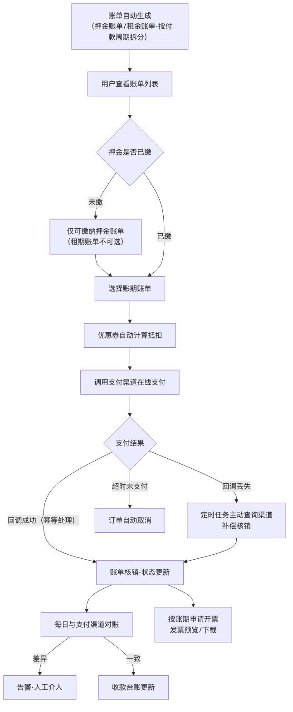

开票管理业务流程如下图所示：

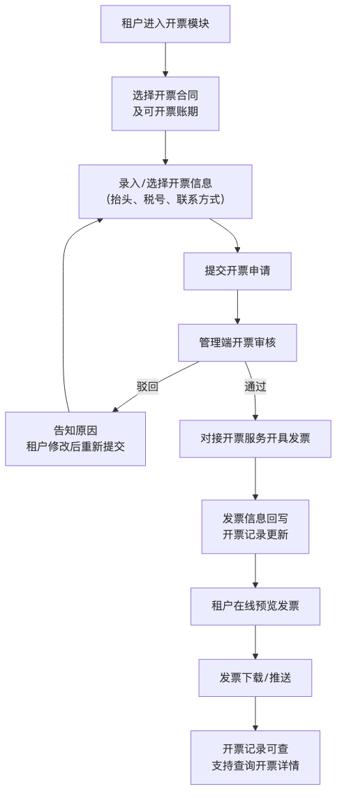

### 2.5.4 优惠券管理

**设计概述**：优惠券管理为租金运营提供促缴、惠民工具，覆盖"券配置→发放/领取→缴费抵扣→核销→效果统计"闭环。设计目标：规则灵活可配、核销准确留痕、运营效果可量化。

逐项功能设计如下：

| 功能点 | 功能设计说明 | 关键业务规则 |
|---|---|---|
| 优惠券配置 | 管理端新增/编辑/删除/查询优惠券：券名称、面额（定额/折扣）、适用范围（项目/业态/账单类型）、有效期、发放总量、每人限领数量 | 已有领取记录的券不可删除，仅可停发；面额与适用范围变更仅影响后续领取 |
| 优惠券发放与领取 | 支持用户端首页/优惠券入口主动领取，支持管理端定向发放至指定用户群 | 领取受总量与限领数控制，超量领取拦截；领取即写入用户券包并记录 |
| 领取记录管理 | 管理端按券/按用户查询领取记录，支持导出 | 记录含领取时间、渠道、状态（未使用/已使用/已过期） |
| 缴费抵扣 | 缴费环节自动筛选该账单可用券并推荐最优抵扣组合，用户确认后按抵扣后金额支付 | 券的适用范围、有效期、状态三重校验；抵扣金额不可超过账单金额；支付关闭/退款时券按规则返还或作废 |
| 核销明细 | 每笔券核销记录券、账单、支付单、核销时间的完整关联，管理端可查可导出 | 核销记录不可修改；退款场景核销状态同步更新 |
| 运营效果统计 | 按券统计发放量、领取量、核销量、核销率、带动缴费金额 | 统计口径与核销明细一致 |

### 2.5.5 消息管理

**设计概述**：消息管理为全系统提供统一的信息触达能力，覆盖业务消息通知、运营公告发布、政策文件宣贯三类场景。设计目标：触达及时、渠道可配、送达可查。

逐项功能设计如下：

| 功能点 | 功能设计说明 | 关键业务规则 |
|---|---|---|
| 消息通知 | 业务事件自动触发通知（预约确认、审批结果、账单生成、缴费到账、催缴提醒、合同到期提醒等）；管理端支持定向/群发手工消息 | 通知模板统一管理，参数化填充；发送记录含接收人、渠道、时间、状态 |
| 消息渠道配置 | 站内信、微信模板消息、短信三类渠道可按消息类型配置启用 | 渠道发送失败自动降级（模板消息失败转站内信）；短信渠道用量统计 |
| 消息队列配置 | 消息异步化发送，队列削峰；失败消息自动重试，超限进入死信人工处理 | 重试次数与间隔可配置；死信消息可人工重发 |
| 我的消息（用户端） | 消息列表（分类：业务通知/公告）、消息详情、已读/未读状态管理 | 未读数角标实时更新；重要消息支持置顶 |
| 通知公告 | 管理端发布/撤回通知公告，用户端banner位与消息中心联动展示 | 公告支持定时上下线；撤回后用户端立即不可见 |
| 政策文件 | 管理端发布政策文件（标题/正文/附件），用户端首页政策文件入口查看详情 | 附件格式与大小校验；政策文件支持按类别组织 |

### 2.5.6 个人中心

**设计概述**：个人中心是用户个人事务的统一入口，聚合账号、房源、合同、预约、消息、申诉、优惠券等个人数据。设计目标：信息聚合清晰、高频入口直达、个人信息安全可控。

逐项功能设计如下：

| 功能点 | 功能设计说明 | 关键业务规则 |
|---|---|---|
| 账号资料 | 展示郑好办同步的实名信息与本地补充资料（联系方式、通讯地址等），支持本地资料编辑 | 实名信息以郑好办为准不可自行修改；敏感字段脱敏展示 |
| 信息维护 | 用户自助维护个人补充信息；实名认证完成前允许修改身份证件信息，认证后锁定 | 证件号修改校验格式合法性；修改记录留痕 |
| 我的房源 | 展示当前承租房源信息（房源详情、管家电话、服务入口） | 仅展示履行中合同关联房源 |
| 我的合同 | 合同列表与详情，聚合签订、缴纳、续租、下载入口 | 与合同管理域数据一致，状态实时同步 |
| 我的预约 | 预约看房记录与状态查询 | 支持取消未确认的预约 |
| 申诉记录 | 资格申诉历史记录与审核进度查询 | 审核结论与意见完整展示 |
| 优惠券（我的） | 用户券包：可用/已使用/已过期分类展示 | 临期券到期提醒 |
| 关于我们 | 平台介绍、服务协议、隐私政策、联系方式、版本信息 | 协议与政策版本化管理 |

### 2.5.7 运营中心

**设计概述**：运营中心是甲方运营团队的日常工作台，聚合租户运营、业务审批、服务分派、运营配置、监控查看五类高频操作。设计目标：审批高效流转、运营灵活配置、服务闭环管理。

逐项功能设计如下：

| 功能点 | 功能设计说明 | 关键业务规则 |
|---|---|---|
| 运营位配置 | 金刚位、轮播图、腰封位、广告位可视化配置（图片、跳转目标、排序、生效时间），用户端首页按配置动态渲染 | 配置发布即生效；下线运营位用户端立即隐藏；图片尺寸规格校验 |
| 租户管理 | 租户档案查询/导出/详情（基础信息、资格状态、合同、账单汇总）；资格退出与拉黑处理 | 资格退出须记录原因并联动在租业务提示；拉黑用户禁止发起新申请 |
| 黑名单管理 | 黑名单新增/解除/导出，记录列入原因与期限 | 解除须审批留痕；黑名单校验嵌入申请、选房、签约环节 |
| 用户管理 | 平台注册用户查询、状态管理 | 与郑好办用户体系数据关联一致 |
| 预约看房处理 | 预约单签收/确认，安排带看 | 处理结果触发用户通知 |
| 投诉处置 | 投诉记录受理、处置、回复 | 处置时限提醒；处置结果用户可见 |
| 资格申诉审核 | 申诉工单人工审核（通过/驳回+意见），支持导出 | 审核结论回写资格状态；驳回须填写明确原因 |
| 入住/退租签收 | 常态与企业入住/退租的签收、作废、物品核对、退费确认、强制退租处理 | 强制退租须双人复核留痕；物品核对清单与房源设施配置联动 |
| 承诺书管理 | 承诺书签署记录查询/导出 | 承诺书PDF存档可调取 |
| 服务订单分派 | 保洁/搬家/报修订单分派至服务公司，进度跟踪，评价查看 | 分派时限提醒；服务公司仅见本公司订单 |
| 服务公司管理 | 服务公司档案（服务类型、服务范围、联系方式）增删改查 | 有在途订单的服务公司不可删除 |
| 监控列表 | 对接园区监控，按小区组织监控设备列表，管理端实时查看监控画面 | 监控查看权限独立控制并记录查看日志 |

退租办理业务流程如下图所示：

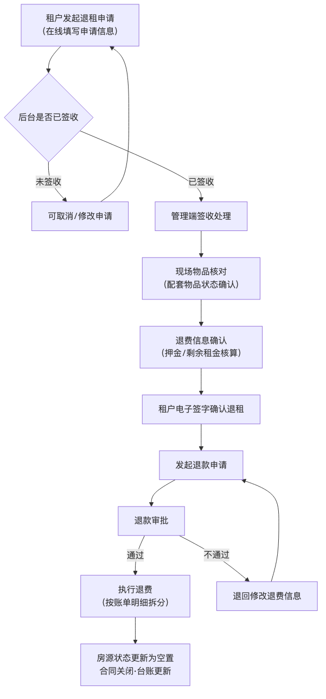

保洁/搬家/报修服务订单处理流程如下图所示：

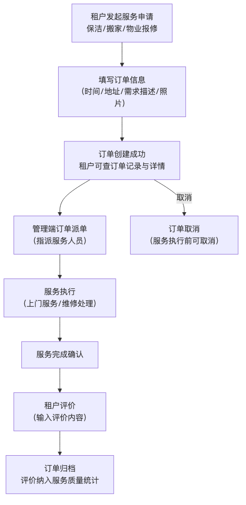

### 2.5.8 数据看板

**设计概述**：数据看板面向管理决策层与财务，将业务过程数据加工为实时经营指标。设计目标：指标准确一致、维度灵活下钻、报表自助可得。

逐项功能设计如下：

| 功能点 | 功能设计说明 | 关键业务规则 |
|---|---|---|
| 财务数据统计 | 应收金额、实收金额、预计应收、逾期金额、退款金额五大指标，支持按月筛选、按项目下钻 | 指标口径以账单与支付流水为准，与收款台账一致 |
| 房源数据统计 | 房源总数、已租、空置、维修、出租率、累计出租率、用户转化率 | 房源状态实时联动业务；转化率=签约用户数/访问选房用户数 |
| 租户数据分析 | 在租租户婚姻状况、户籍分布统计图表 | 统计基于脱敏聚合数据，不展示个体明细 |
| 客户分析 | 租户学历分布、职业分布分析 | 同上 |
| 项目台账 | 各项目房源、合同、收款汇总台账 | 支持导出，口径与各业务明细一致 |
| 项目收款台账 | 按项目/按月收款明细与汇总，支持导出 | 与支付管理域收款数据同源 |
| 自定义报表 | 运营人员自选统计对象（房源/合同/账单/租户）、维度与字段，生成报表并导出 | 可保存报表模板复用；导出受数据权限约束 |

**指标一致性设计**：所有看板指标统一由指标计算服务提供，明细—汇总同源计算，杜绝"看板一个数、报表另一个数"；统计类查询走只读从库与缓存，不影响在线交易性能。

### 2.5.9 功能明细逐项设计——移动端（功能明细序号1—149）

前述2.5.1～2.5.8节按业务域给出了系统级功能设计。为便于评审专家将本方案与招标文件"软件开发清单及功能明细"逐条核对，本节起按招标功能明细的**原始序号顺序**，对全部211项功能逐项给出设计说明。其中：序号1—149为移动端（H5）功能，序号150—200为后台管理端功能，序号201—211为数据迁移、培训与系统对接等实施项。公众号端（序号209）、小程序端（序号210）功能同H5页面，本节移动端设计对三端同时生效，端差异项（如人脸识别调用方式）在对应条目中单独说明。

逐项设计表字段约定：**序号/功能点**与招标功能明细一一对应；**设计说明**描述页面构成、操作流程与系统处理逻辑；**关键规则与校验**描述该功能的约束条件与异常处理。

#### 2.5.9.1 登录与首页（序号1—14）

**模块设计概述**：登录模块对接郑好办用户体系实现统一认证；首页是用户进入系统的总入口，采用"搜索栏 + banner轮播 + 金刚位矩阵 + 腰封/广告位 + 通知公告 + 项目列表"的信息架构，全部运营位内容由后台管理端运营配置驱动动态渲染，实现"运营改配置、前端零发版"。

| 序号 | 功能点 | 设计说明 | 关键规则与校验 |
|---|---|---|---|
| 1 | 登录 | 对接郑好办用户体系完成统一认证：用户点击登录→跳转郑好办授权页→授权回调→系统换取用户身份信息并采集入库（姓名、证件号、手机号等）→建立/关联本地用户档案→颁发系统会话；首次登录弹出港区保租房、人才公寓管理现行办法告知页，用户阅读确认后方可继续 | 授权令牌服务端换取，前端不接触敏感凭证；用户信息采集遵循最小必要原则；管理办法告知记录留存（用户、时间、版本） |
| 2 | 首页—搜索 | 首页顶部搜索栏，支持按房源关键词搜索；搜索结果列表页展示匹配的项目与房源；支持按人才公寓/保租房/市场租赁分类搜索 | 搜索仅返回已上架房源；关键词防注入过滤；搜索历史本地保存可清除 |
| 3 | banner位展示 | 首页banner轮播展示政策通知、办事指引等运营发布信息，支持点击跳转对应内容详情页 | banner素材、排序、跳转目标、上下线时间均由后台运营配置管理；过期素材自动下线 |
| 4 | 金刚位—人才公寓 | 按后台运营配置展示人才公寓功能入口图标，点击进入人才公寓办事功能页 | 入口可见性、图标、排序由后台配置；未配置入口不展示 |
| 5 | 金刚位—保租房 | 按后台运营配置展示保租房功能入口图标，点击进入保租房办事功能页 | 同上 |
| 6 | 金刚位—市场租赁 | 按后台运营配置展示市场租赁功能入口图标，点击进入市场租赁办事功能页 | 同上 |
| 7 | 金刚位—地图找房 | 房源地图点位聚合展示；支持按区域、小区、户型筛选；支持按保租房、市场化房源、人才公寓房源三类业态筛选；点击点位跳转房源详情 | 地图点位与房源上下架状态实时同步；定位授权失败时默认展示港区中心区域 |
| 8 | 金刚位—人才家园 | 按后台配置展示人才家园功能入口，点击进入人才家园信息页并支持查看信息详情 | 内容由后台发布管理，支持图文详情 |
| 9 | 金刚位—政策文件 | 按后台配置展示政策文件入口，点击进入政策文件列表页，支持查看政策文件详情（正文+附件） | 仅展示已发布状态的政策文件；附件在线预览与下载 |
| 10 | 金刚位—资料上传 | 按后台配置展示资料上传入口，点击进入资料上传页，支持用户按要求上传资料（证件、证明材料等） | 上传文件格式与大小校验；上传记录与审核状态可查 |
| 11 | 金刚位—优惠券 | 按后台配置展示优惠券入口，点击进入优惠券领取页，支持用户领取可领优惠券 | 领取受发放总量与每人限领数控制；重复领取拦截并提示 |
| 12 | 金刚位—我的消息 | 按后台配置展示我的消息入口，点击进入消息列表，支持查看消息详情 | 未读消息数角标展示；进入详情自动置为已读 |
| 13 | 通知公告 | 按后台配置展示通知公告入口，点击进入通知公告列表，支持查看公告信息详情 | 仅展示发布中的公告；公告撤回后立即不可见 |
| 14 | 项目列表 | 首页项目列表支持切换展示人才公寓、保租房、市场租赁三类项目；点击项目卡片跳转项目介绍详情；支持"查看更多"进入对应类别的项目全量列表 | 项目卡片信息（名称、图片、地址、租金区间）与项目档案实时一致；仅展示启用状态项目 |

**首页性能设计**：首页聚合接口一次拉取运营位配置+公告+项目列表，配置数据Redis缓存（运营变更主动失效），banner与金刚位图片CDN分发，保证首页首屏加载时间不超过2秒。

#### 2.5.9.2 办事—人才公寓（序号15—51）

**模块设计概述**：人才公寓办事模块承载"资格申诉→选房→合同签署→押金缴纳→入住办理→退租办理→续租→账单缴费→我的合同→开票→我的预约→合住人→调换房"完整办事链路。资格校验环节由系统后台自动调取社保信息（郑州市）、婚姻信息（郑州市）、学历信息（郑州市）、住房信息（港区）、保租房信息（港区）五类政务数据接口自动比对，用户对不符合项可在线申诉，实现"数据核验为主、人工申诉兜底"。

| 序号 | 功能点 | 设计说明 | 关键规则与校验 |
|---|---|---|---|
| 15 | 资格申诉—资格不符项列表 | 展示用户自动资格校验不符合项清单（逐项列明校验维度、校验结果、数据来源）；支持用户手动刷新校验结果，触发后台重新调取社保（郑州市）、婚姻（郑州市）、学历（郑州市）、住房（港区）、保租房（港区）数据接口比对；对不符合项支持填写申诉原因发起资格申诉 | 刷新设频次限制防接口滥用；校验结果缓存有效期内直接返回；申诉须选定具体不符项并填写原因 |
| 16 | 资格申诉—资格申诉记录 | 展示用户针对不同资格不符项的历次申诉记录与审核结果，支持按状态查询 | 申诉记录含申诉时间、审核状态、审核意见；审核结果变化触发消息通知 |
| 17 | 选房—搜索 | 提供项目房源搜索入口，按项目名称、区域等关键词快速查找人才公寓项目房源 | 仅返回人才公寓业态且已上架房源 |
| 18 | 选房—项目列表 | 展示人才公寓项目列表：项目名称、是否存在房源、房源套数、地址、房租价格、距当前位置距离等信息 | 距离基于用户定位实时计算；无房源项目明确标示 |
| 19 | 选房—项目详情 | 展示项目详情：项目照片轮播、项目基本信息、项目介绍等；提供"查看房源"入口 | 项目信息与管理端项目档案实时一致 |
| 20 | 选房—承诺书 | 用户查看房源前需签订承诺书；提供承诺书查询与在线签订功能（阅读全文→电子签名→提交） | 未签承诺书拦截进入房源列表；承诺书签署记录（含签名图像、时间）存档，管理端可查可导出 |
| 21 | 选房—房源列表 | 展示项目内房源信息，按楼栋、单元、房间层级组织；支持按户型、楼层、朝向等条件筛选 | 仅展示空置且已上架房源；集中配租窗口期内批次房源仅对批次内人员可见 |
| 22 | 选房—房源详情 | 展示房源详细信息：房源照片、基本信息、公示信息、周边配套设施、楼盘介绍、动态等；展示详细地址与距当前位置距离，支持跳转第三方地图导航；支持查看管家电话一键拨打；支持选定房源操作；支持VR看房，360°无死角沉浸式漫游查看房间布局、采光及细节 | 选定房源即加锁（锁定有效期内他人不可选），防一房多租；VR资源按需加载不阻塞首屏 |
| 23 | 选房—预约看房 | 针对查看的房源在线填写预约看房信息（预约人、联系方式、期望看房时间）提交预约 | 同一用户对同一项目有效预约不重复创建；预约提交后管理端签收并通知用户 |
| 24 | 人脸识别 | 签约前调用人脸识别接口对人员信息核对，保证签订合同人与选房人一致 | 小程序/公众号端调用平台人脸核身能力；比对不通过禁止进入合同签署；调用记录留存 |
| 25 | 合同签署 | 展示所选房源签订所需合同信息（合同要素预览）；用户在线签署合同（电子签章），并提供合同下载功能 | 签署前人脸识别通过；合同要素自动填充自合同模板与房源/租户信息；签署完成PDF存证不可篡改 |
| 26 | 押金缴纳 | 展示签订合同后的房源信息，提供押金在线缴纳；押金缴纳前提示上传材料，规定时间内未上传材料则自动退回押金、取消合同 | 押金金额取自合同模板配置；材料上传超时由定时任务自动执行退押金、解约、释放房源并通知用户 |
| 27 | 入住办理—入住列表 | 展示用户所签订合同信息，区分已入住、未入住及待入住确认三种状态 | 状态与后台入住管理实时同步 |
| 28 | 入住办理—入住申请 | 在线填写入住申请信息提交后台审核；支持取消申请、修改申请 | 后台签收后不可再修改/取消；申请信息完整性校验 |
| 29 | 入住办理—入住确认 | 展示入住申请审批进度；支持用户勾选房间物品并核对物品状态，核对完成后确认入住；提供用户在线签字，签字确认入住 | 物品核对清单来自房源设施配置；签字图像与确认记录存档 |
| 30 | 入住办理—入住详情 | 展示办理入住的详情信息（申请信息、审批记录、物品核对结果、签字凭证） | 详情只读，全程留痕可追溯 |
| 31 | 退租办理—退租列表 | 展示用户在租房源基本信息与房租账单信息 | 仅履行中合同可发起退租 |
| 32 | 退租办理—退租申请 | 在线填写退租申请信息提交后台审核；支持取消申请、修改申请 | 后台签收后不可再修改/取消；欠费账单在申请页醒目提示 |
| 33 | 退租办理—退租确认 | 展示退租申请审批进度、配套物品信息、退费信息；提供用户在线签字，签字确认退租 | 退费金额由后台核定后展示；签字确认后退租生效、房源释放 |
| 34 | 退租办理—退租详情 | 展示退租办理详情信息（申请、审批、物品核对、退费明细、签字凭证） | 详情只读留痕 |
| 35 | 续租—合同列表 | 展示需续租的合同基本信息（临近到期合同进入续租提醒窗口） | 续租窗口期规则可配置；窗口外合同不展示续租入口 |
| 36 | 续租—续租校验 | 续租前资格校验：校验办理资格是否符合（政务数据自动核验）以及是否存在欠费 | 校验不通过明确提示不通过原因；欠费结清后可重新校验 |
| 37 | 续租—合同签订 | 提供续租合同信息预览；支持在线签订续租合同及合同下载 | 续租合同租期与原合同无缝衔接；签署流程同新签合同 |
| 38 | 续租—租金缴纳提示 | 提供租金缴纳提示：缴费前展示合同审核进度，合同审核通过后方可进行租金缴纳 | 审核未通过时缴费入口置灰并提示等待审核 |
| 39 | 账单缴费—账单列表 | 展示当前用户当前账单及历史账单，包含押金账单与房租账单 | 账单按状态（待缴/已缴/逾期）分类标示；逾期账单醒目提醒 |
| 40 | 账单缴费—账单缴费 | 调用三方支付方式在线支付（港区支付接口）；支持计算优惠券抵扣后在线缴费；支持选择租期账单缴费 | 押金未缴时无法选择租期账单缴费；支付回调幂等核销；优惠抵扣金额实时计算展示 |
| 41 | 我的合同—合同列表 | 展示租户当前合同及历史合同 | 仅本人合同可见；合同状态实时同步 |
| 42 | 我的合同—合同签订 | 提供合同签署功能：合同详情信息展示与线上签字 | 待签合同醒目提示；签署超时自动作废 |
| 43 | 我的合同—租金缴纳 | 提供租金缴纳入口，跳转账单缴费列表选择账期在线缴纳 | 与账单缴费域同源数据 |
| 44 | 我的合同—续租校验 | 提供续租前资格校验：校验办理资格是否符合、是否存在欠费 | 同序号36规则 |
| 45 | 我的合同—续租合同签订 | 支持在线签订续租合同及合同下载 | 同序号37规则 |
| 46 | 开票—开票记录 | 展示租户申请开票记录，支持查询开票详情 | 记录含申请时间、账期、开票状态 |
| 47 | 开票—申请开票 | 展示可开票合同基本信息及账期，用户选择账期申请开票；提供开票信息（抬头、税号等）录入功能 | 仅已缴账期可申请；同一账期不可重复申请；开票信息格式校验 |
| 48 | 开票—发票信息 | 提供发票信息服务：在线预览发票与下载发票文件 | 发票文件由管理端上传后用户端即时可见 |
| 49 | 我的预约 | 展示预约看房历史记录，支持取消看房及确认看房操作 | 已签收预约取消时通知管理端；确认看房后记录闭环 |
| 50 | 合住人申请 | 提供合住人申请信息录入（合住人身份信息），待管理端审批通过后合住人可办理入住 | 合住人数量受房型限制；身份信息脱敏展示 |
| 51 | 调换房申请 | 提供调换房申请入口：查看调换房记录及详情、发起调换房申请 | 换房前须结清原房源账单；申请进度与审核结果消息通知 |

#### 2.5.9.3 办事—保租房（序号52—88）

**模块设计概述**：保租房办事模块的功能构成与人才公寓一致（资格申诉→选房→签约→押金→入住→退租→续租→缴费→我的合同→开票→预约→合住人→调换房），系统采用"统一业务模型+业务类型策略分流"实现：页面与流程组件复用，资格校验规则、配租策略、租金标准按保租房业态独立配置。本节逐项设计中与人才公寓同构的功能标注对应实现，差异点单独说明。

| 序号 | 功能点 | 设计说明 | 关键规则与校验 |
|---|---|---|---|
| 52 | 资格申诉—资格不符项列表 | 展示保租房资格自动校验不符合项；支持手动刷新校验（后台调取社保（郑州市）、婚姻（郑州市）、学历（郑州市）、住房（港区）、保租房（港区）接口）；不符合项可填写申诉原因发起申诉 | 校验规则按保租房准入条件配置，与人才公寓规则独立维护；其余同序号15 |
| 53 | 资格申诉—资格申诉记录 | 展示历次保租房资格申诉记录与审核结果 | 同序号16 |
| 54 | 选房—搜索 | 保租房项目房源搜索入口 | 仅返回保租房业态已上架房源 |
| 55 | 选房—项目列表 | 展示保租房项目列表（名称、是否有房、套数、地址、租金、距离） | 同序号18 |
| 56 | 选房—项目详情 | 项目照片、基本信息、项目介绍展示，提供查看房源入口 | 同序号19 |
| 57 | 选房—承诺书 | 查看房源前签订保租房承诺书，提供查询与签订功能 | 承诺书文本按业态独立配置；其余同序号20 |
| 58 | 选房—房源列表 | 楼栋/单元/房间层级展示，支持户型、楼层、朝向筛选 | 同序号21 |
| 59 | 选房—房源详情 | 房源照片、基本信息、公示信息、周边配套、楼盘介绍、动态展示；地址与距离展示、地图导航跳转；管家电话；选定房源；VR看房360°漫游 | 同序号22 |
| 60 | 选房—预约看房 | 在线填写预约看房信息提交预约 | 同序号23 |
| 61 | 人脸识别 | 签约前人脸核验，保证签约人与选房人一致 | 同序号24 |
| 62 | 合同签署 | 展示所选房源签约合同信息；在线签署与合同下载 | 合同模板按保租房业态配置；其余同序号25 |
| 63 | 押金缴纳 | 押金在线缴纳；缴纳前材料上传提示，超时未传自动退押解约 | 同序号26 |
| 64 | 入住办理—入住列表 | 已入住、未入住、待入住确认合同分类展示 | 同序号27 |
| 65 | 入住办理—入住申请 | 在线入住申请，支持取消/修改（签收后锁定） | 同序号28 |
| 66 | 入住办理—入住确认 | 审批进度展示、物品勾选核对、签字确认入住 | 同序号29 |
| 67 | 入住办理—入住详情 | 入住办理详情展示 | 同序号30 |
| 68 | 退租办理—退租列表 | 在租房源与房租账单信息展示 | 同序号31 |
| 69 | 退租办理—退租申请 | 在线退租申请，支持取消/修改（签收后锁定） | 同序号32 |
| 70 | 退租办理—退租确认 | 审批进度、配套物品、退费信息展示，签字确认退租 | 同序号33 |
| 71 | 退租办理—退租详情 | 退租详情展示 | 同序号34 |
| 72 | 续租—合同列表 | 需续租合同基本信息展示 | 同序号35 |
| 73 | 续租—续租校验 | 续租资格校验（资格符合性+欠费检查） | 校验规则按保租房业态配置；其余同序号36 |
| 74 | 续租—合同签订 | 续租合同在线签订与下载 | 同序号37 |
| 75 | 续租—租金缴纳提示 | 合同审核进度展示，审核通过后开放租金缴纳 | 同序号38 |
| 76 | 账单缴费—账单列表 | 当前与历史账单展示（押金+房租） | 同序号39 |
| 77 | 账单缴费—账单缴费 | 港区支付接口在线支付、优惠计算、账期选择缴费 | 押金未缴不可选租期账单；其余同序号40 |
| 78 | 我的合同—合同列表 | 当前与历史合同展示 | 同序号41 |
| 79 | 我的合同—合同签订 | 合同详情与线上签字 | 同序号42 |
| 80 | 我的合同—租金缴纳 | 跳转账单缴费选择账期缴纳 | 同序号43 |
| 81 | 我的合同—续租校验 | 续租资格与欠费校验 | 同序号44 |
| 82 | 我的合同—续租合同签订 | 续租合同在线签订与下载 | 同序号45 |
| 83 | 开票—开票记录 | 开票记录查询与详情 | 同序号46 |
| 84 | 开票—申请开票 | 选择账期申请开票、开票信息录入 | 同序号47 |
| 85 | 开票—发票信息 | 发票在线预览与下载 | 同序号48 |
| 86 | 我的预约 | 预约看房记录，取消/确认看房 | 同序号49 |
| 87 | 合住人申请 | 合住人信息录入，审批后可入住 | 同序号50 |
| 88 | 调换房申请 | 调换房记录查看与申请发起 | 同序号51 |

**复用与差异控制说明**：保租房与人才公寓两条业务线共用同一套前端流程组件与后端服务，通过业务类型参数分流。差异全部收敛在**配置层**（资格校验规则集、承诺书文本、合同模板、租金标准）与**策略层**（资格校验策略类），任何一条业务线的规则调整不影响另一条业务线，保证后期政策变化时的快速响应。

#### 2.5.9.4 办事—市场租赁（序号89—123）

**模块设计概述**：市场租赁面向市场化承租群体，与保障类业务的核心差异在于：**无资格申诉环节**（不做保障资格核验）、续租校验仅检查欠费（序号108）、我的合同支持新签约合同倒计时（序号113）。流程组件复用同前两条业务线。

| 序号 | 功能点 | 设计说明 | 关键规则与校验 |
|---|---|---|---|
| 89 | 选房—搜索 | 市场租赁项目房源搜索入口 | 仅返回市场化业态已上架房源 |
| 90 | 选房—项目列表 | 展示市场租赁项目列表（名称、是否有房、套数、地址、租金、距离） | 同序号18 |
| 91 | 选房—项目详情 | 项目照片、基本信息、项目介绍展示，查看房源入口 | 同序号19 |
| 92 | 选房—承诺书 | 查看房源前签订承诺书，提供查询与签订功能 | 承诺书文本按市场租赁业态配置；其余同序号20 |
| 93 | 选房—房源列表 | 楼栋/单元/房间层级展示，户型、楼层、朝向条件筛选 | 同序号21 |
| 94 | 选房—房源详情 | 房源照片、基本信息、公示信息、周边配套、楼盘介绍、动态展示；地址距离与地图导航；管家电话；选定房源；VR看房360°漫游 | 同序号22 |
| 95 | 选房—预约看房 | 在线填写预约看房信息提交预约 | 同序号23 |
| 96 | 人脸识别 | 签约前人脸核验，保证签约人与选房人一致 | 同序号24 |
| 97 | 合同签署 | 所选房源合同信息展示、在线签署与合同下载 | 合同模板按市场租赁业态配置；其余同序号25 |
| 98 | 押金缴纳 | 押金在线缴纳；材料上传提示，超时未传自动退押解约 | 同序号26 |
| 99 | 入住办理—入住列表 | 已入住、未入住、待入住确认合同分类展示 | 同序号27 |
| 100 | 入住办理—入住申请 | 在线入住申请，支持取消/修改（签收后锁定） | 同序号28 |
| 101 | 入住办理—入住确认 | 审批进度、物品勾选核对、签字确认入住 | 同序号29 |
| 102 | 入住办理—入住详情 | 入住办理详情展示 | 同序号30 |
| 103 | 退租办理—退租列表 | 在租房源与房租账单信息展示 | 同序号31 |
| 104 | 退租办理—退租申请 | 在线退租申请，支持取消/修改（签收后锁定） | 同序号32 |
| 105 | 退租办理—退租确认 | 审批进度、配套物品、退费信息展示，签字确认退租 | 同序号33 |
| 106 | 退租办理—退租详情 | 退租详情展示 | 同序号34 |
| 107 | 续租—合同列表 | 需续租合同基本信息展示 | 同序号35 |
| 108 | 续租—续租校验 | 续租前校验：**仅校验是否存在欠费**（市场租赁不做保障资格核验） | 欠费存在时明确提示欠费账单；结清后可重新校验 |
| 109 | 续租—合同签订 | 续租合同信息展示、在线签订与下载 | 同序号37 |
| 110 | 续租—租金缴纳提示 | 合同审核进度展示，审核通过后开放租金缴纳 | 同序号38 |
| 111 | 账单缴费—账单列表 | 当前与历史账单展示（押金+房租） | 同序号39 |
| 112 | 账单缴费—账单缴费 | 港区支付接口在线支付、优惠计算、账期选择缴费 | 押金未缴不可选租期账单；其余同序号40 |
| 113 | 我的合同—合同列表 | 展示当前合同及历史合同，**支持新签约合同倒计时功能**（签约有效期剩余时间醒目展示） | 倒计时到期未签自动作废并释放房源；其余同序号41 |
| 114 | 我的合同—合同签订 | 合同详情与线上签字 | 同序号42 |
| 115 | 我的合同—租金缴纳 | 跳转账单缴费选择账期缴纳 | 同序号43 |
| 116 | 我的合同—续租校验 | 续租前资格校验（办理资格+欠费） | 同序号44 |
| 117 | 我的合同—续租合同签订 | 续租合同在线签订与下载 | 同序号45 |
| 118 | 开票—开票记录 | 开票记录查询与详情 | 同序号46 |
| 119 | 开票—申请开票 | 选择账期申请开票、开票信息录入 | 同序号47 |
| 120 | 开票—发票信息 | 发票在线预览与下载 | 同序号48 |
| 121 | 我的预约 | 预约看房记录，取消/确认看房 | 同序号49 |
| 122 | 合住人申请 | 合住人信息录入，审批后可入住 | 同序号50 |
| 123 | 调换房申请 | 调换房记录查看与申请发起 | 同序号51 |

#### 2.5.9.5 服务（序号124—136）

**模块设计概述**：服务模块为在租租户提供投诉建议、保洁、搬家、物业报修四类居住服务，统一采用"申请→受理分派→服务履约→评价"的订单化管理模式；三类服务订单（保洁/搬家/报修）共用订单引擎，服务类型、分派对象（服务公司）按类别配置。

| 序号 | 功能点 | 设计说明 | 关键规则与校验 |
|---|---|---|---|
| 124 | 投诉及建议—投诉记录 | 展示租户历史投诉记录，支持查询投诉详情（投诉内容、处置状态、处置回复） | 处置结果更新触发消息通知 |
| 125 | 投诉及建议—发起投诉 | 提供投诉建议在线录入（类型、内容、图片附件、联系方式） | 内容敏感词过滤；附件格式与大小校验；提交后管理端处置时限提醒 |
| 126 | 保洁订单—搜索 | 提供保洁订单搜索功能，按时间、状态等条件检索 | 仅检索本人订单 |
| 127 | 保洁订单—订单列表 | 展示租户保洁订单记录，支持查看订单详情（服务时间、服务公司、进度状态） | 订单状态实时同步管理端分派与履约进度 |
| 128 | 保洁订单—保洁申请 | 提供保洁申请服务，用户填写服务地址（默认在租房源）、期望时间等创建保洁订单 | 仅在租租户可申请；期望时间不早于当前时间 |
| 129 | 保洁订单—评价 | 服务完成后提供订单评价：评分+评价内容输入 | 每单限评一次；评价内容管理端可见 |
| 130 | 搬家订单—搜索 | 提供搬家订单搜索功能 | 同序号126 |
| 131 | 搬家订单—订单列表 | 展示租户搬家订单记录与详情 | 同序号127 |
| 132 | 搬家订单—搬家申请 | 用户填写搬家信息（起止地址、期望时间、物品说明）创建搬家订单 | 同序号128 |
| 133 | 搬家订单—评价 | 搬家服务完成后订单评价 | 同序号129 |
| 134 | 物业报修—报修记录 | 展示租户报修记录，支持查询报修详情（报修事项、维修进度、处理结果） | 同序号127 |
| 135 | 物业报修—报修申请 | 用户填写报修信息（报修部位、故障描述、现场照片）创建报修订单 | 照片附件辅助定位故障；紧急报修标记优先处理 |
| 136 | 物业报修—评价 | 维修完成后订单评价 | 同序号129 |

#### 2.5.9.6 企业客户（序号137—139）

**模块设计概述**：企业客户模块面向承接集中配租的企业单位，提供批量缴费、批量入住、批量退租三大在线办理能力，替代传统的线下名单流转模式。

| 序号 | 功能点 | 设计说明 | 关键规则与校验 |
|---|---|---|---|
| 137 | 在线缴费 | 展示集中分配房源项目信息，企业用户输入单位信息后对配租房源批量在线缴费 | 单位信息与企业集中配租批次校验匹配；缴费生成汇总支付单，核销拆分回写各房源账单 |
| 138 | 入住办理 | 展示集中分配房源项目信息，企业上传入住人员名单提交入住申请（系统提供入住人员名单标准模板下载） | 名单模板字段校验（姓名、证件号、联系方式、分配房源），校验失败逐行返回错误明细；名单人数不超过配租房源数 |
| 139 | 退租办理 | 展示集中分配房源项目信息，企业选择账期发起退租申请 | 退租账期不早于已缴账期；退租申请进入管理端企业退租流程审批 |

#### 2.5.9.7 代购补贴（序号140—141）

**模块设计概述**：代购补贴模块为租户后续购房提供合同备案与补贴申请两级递进服务：先完成购房合同备案，备案通过后方可发起代购补贴申请。

| 序号 | 功能点 | 设计说明 | 关键规则与校验 |
|---|---|---|---|
| 140 | 合同备案 | 提供代购补贴合同备案功能：查询历史备案记录与审批进度、发起备案申请（填写备案信息、上传购房合同材料） | 备案材料格式与完整性校验；审批结果消息通知；备案通过是补贴申请的前置条件 |
| 141 | 代购补贴 | 提供代购补贴申请功能：查询历史申请与审批进度、发起补贴申请、在线签署承诺书 | 未完成合同备案不可发起申请；承诺书签署留痕；审批进度全程可查 |

#### 2.5.9.8 我的（序号142—149）

**模块设计概述**：见2.5.6节个人中心设计概述，本节按功能明细序号逐项对应。

| 序号 | 功能点 | 设计说明 | 关键规则与校验 |
|---|---|---|---|
| 142 | 账号资料 | 展示用户账号资料信息（郑好办同步实名信息+本地补充资料） | 实名信息只读；敏感字段脱敏展示 |
| 143 | 我的消息 | 展示用户收到的系统通知消息，支持查看消息详情 | 未读角标；已读状态管理 |
| 144 | 我的房源 | 展示租户所选房源信息，支持查看房源详情 | 仅展示本人有效合同关联房源 |
| 145 | 我的合同 | 展示当前合同及历史合同；聚合合同签订、租金缴纳、续租校验、续租合同签订功能入口 | 与合同管理域数据一致、状态实时同步 |
| 146 | 申诉记录 | 展示用户针对不同资格不符项的申诉结果记录查询 | 覆盖人才公寓与保租房两类申诉记录 |
| 147 | 信息维护 | 展示租户个人信息，支持在线修改编辑 | 修改留痕；证件信息认证后锁定 |
| 148 | 优惠券 | 展示当前租户已领取优惠券（可用/已使用/已过期），支持"前往使用"跳转缴费 | 临期券提醒；已过期券置灰 |
| 149 | 关于我们 | 展示公司信息、平台介绍、服务协议、隐私政策等 | 协议与政策版本化管理 |

至此，移动端（H5）序号1—149全部功能逐项设计完毕。公众号端（序号209）与小程序端（序号210）功能与H5页面完全一致，基于uni-app一套代码编译三端交付，人脸识别（序号211）在小程序/公众号端通过平台人脸核身能力调用，详见2.5.11节。

### 2.5.10 功能明细逐项设计——后台管理端（功能明细序号150—200）

后台管理端面向运营管理人员，按"登录→首页看板→资产管理→申请信息→合同管理→入住/退租/退款→合住/调换房→租金账单→代购补贴→服务管理→开票→监控→报表→优惠券→黑名单/用户→配置管理→系统管理"组织功能菜单。全部功能受RBAC三级权限（菜单/按钮/数据）控制，全部操作留痕。

#### 2.5.10.1 登录与首页看板（序号150—155）

| 序号 | 功能点 | 设计说明 | 关键规则与校验 |
|---|---|---|---|
| 150 | 登录 | 管理端登录页，用户通过账号、密码登录系统；登录附加图形验证码 | 密码加密传输与加密存储；连续失败锁定策略；登录日志留痕 |
| 151 | 首页—财务数据统计 | 默认统计当前月份财务数据：应收金额、实收金额、预计应收金额、逾期金额、退款金额；支持按月筛选统计结果 | 指标口径与账单/支付流水一致；数据权限内统计 |
| 152 | 首页—房源数据 | 统计房源总房间数、已租房间数、空房间数、维修房间数、当前出租率、累计出租率、用户转化率 | 房源状态实时联动；转化率=签约用户数/访问选房用户数 |
| 153 | 首页—租户数据 | 统计租户婚姻状态（已婚/未婚/离异/其他）与户籍分布（本地/外地/未知）数据 | 基于脱敏聚合统计，不展示个体明细 |
| 154 | 首页—客户分析 | 统计租户学历类型与职业类型分布分析 | 同上 |
| 155 | 首页—项目台账 | 默认统计各项目本月金额，支持点击查看条状项目台账统计列表详情 | 台账口径与收款明细一致，可追溯到单笔账单 |

#### 2.5.10.2 资产管理（序号156—159）

| 序号 | 功能点 | 设计说明 | 关键规则与校验 |
|---|---|---|---|
| 156 | 项目管理 | 小区、产业园、厂房等房源项目管理：①查询（小区、行政区、配租方式等条件）；②新增（补充项目所需字段）；③编辑；④删除；⑤按模板导入；⑥选择导出；⑦房型管理（项目内房型新增/编辑/删除）；⑧详情查看 | 项目下存在在租房源不可删除；导入模板校验并返回逐行错误明细；房型被房源引用时变更二次确认 |
| 157 | 房源管理—房源列表 | 项目内房源管理：①查询（小区名称、楼栋、单元、分类类型、房源状态、上架状态）；②新增；③编辑；④删除；⑤模板导入；⑥模板导出；⑦上架（前端平台展示）；⑧下架（未分配房源）；⑨常规分配（未配租房源配租处理）；⑩集中分配；⑪管家电话管理（添加/编辑/删除）；⑫房源精选设置；⑬定向配租时间设置（限制到日）；⑭VR管理（VR文件上传、删除） | 上架前信息完整性校验；已出租房源不可删除/下架；定向配租时间精确到日、窗口外自动恢复常规可见性；VR文件格式与大小校验 |
| 158 | 配租批次—集中配租 | 集中配租管理：①查询（批次名称、人次类型、审批状态、批次状态）；②新增（配租房源信息+人员信息）；③编辑；④作废；⑤审批；⑥详情查看 | 批次房源窗口期内仅批次人员可见；作废自动释放未选房源；批次操作走审批流并留痕 |
| 159 | 配租批次—企业客户 | 企业集中配租管理：①查询（批次名称、审批状态、批次状态）；②新增（企业客户集中配租房源信息）；③编辑；④作废；⑤审批；⑥详情查看 | 企业配租房源不进入个人选房池；企业欠费限制新增配租 |

#### 2.5.10.3 申请信息管理（序号160—164）

| 序号 | 功能点 | 设计说明 | 关键规则与校验 |
|---|---|---|---|
| 160 | 租户管理 | 租户信息管理：①查询（租户姓名、学历、职业、是否配置、申请时间等）；②按模板导出；③资格退出（手动拉黑操作）；④租户详情查看 | 资格退出须记录原因并联动在租业务提示；导出留痕且受数据权限约束 |
| 161 | 预约看房 | 前端租户预约看房信息处理：①查询（小区名称、预约人、手机号、预约时间）；②签收（可按实际情况调整预约看房时间并告知用户进度）；③确认看房（一键处理看房记录） | 签收/时间调整触发用户消息通知；预约单状态闭环管理 |
| 162 | 投诉记录 | 前端租户投诉信息处理：①查询（投诉类型、手机号、投诉时间）；②处置（处置投诉建议并回复） | 处置时限提醒；处置结果同步用户端可见 |
| 163 | 资格申诉 | 租户资格申诉处理：①查询（申请人、手机号、审核状态、申请时间）；②按模板导出申诉记录；③手动审核（通过/驳回+审核意见） | 审核结论回写资格状态并通知用户；驳回须填写明确原因 |
| 164 | 承诺书 | 租户承诺书管理：①查询（姓名、身份证号、联系方式）；②按模板导出承诺书 | 承诺书签署文件PDF存档可调取；导出留痕 |

#### 2.5.10.4 合同与入住退租管理（序号165—172）

| 序号 | 功能点 | 设计说明 | 关键规则与校验 |
|---|---|---|---|
| 165 | 合同管理 | 常态化合同与集中合同统一管理：①查询（房间地址、合同状态、审批状态、押金状态、发起时间、签订时间、到期时间）；②审批（续租合同审批）；③详情查看 | 合同状态机管控；审批留痕；集中合同关联配租批次 |
| 166 | 入住管理—常态入住 | 前端入住申请处理：①查询（房间地址、申请人、申请状态、申请时间）；②签收；③作废；④详情查看；⑤强制退租（对异常用户执行强制退租） | 签收后用户端锁定修改；强制退租须双人复核、记录原因并全程留痕 |
| 167 | 入住管理—企业入住 | 企业入住申请记录展示，支持查询企业入住详情信息 | 名单明细与批次房源关联展示 |
| 168 | 退租管理—常态退租 | 前端退租申请处理：①查询（房间地址、申请人、申请状态、申请时间）；②签收；③作废；④退租（确认房间配备状态、补充退费信息）；⑤详情查看；⑥退租记录列表展示 | 退租确认联动房源释放与账单停止；退费信息核定留痕 |
| 169 | 退租管理—企业退租 | 企业退租记录展示，支持查询企业退租详情信息 | 退租账期与企业缴费记录核对 |
| 170 | 退款管理 | 基于退租数据的退款申请与审批：①查询（批次号、发起时间、审批状态、审批时间）；②新增退费申请；③撤销申请；④审批；⑤退费（审核通过后手动执行退费）；⑥详情查看 | 退款原路退回、与原支付单强关联；审批与退费操作分权、全程留痕 |
| 171 | 合住人管理 | 前端合住人申请处理：①查询（申请人、合住人、申请状态）；②审批 | 审批结果通知用户；合住人信息脱敏展示 |
| 172 | 调换房管理 | 调换房业务处理：①查询（申请人、房间地址、调换状态）；②新增；③编辑；④删除；⑤审核；⑥详情查看 | 换房前结清原房源账单；原/新房源状态联动、合同关联可追溯 |

#### 2.5.10.5 账单、代购补贴与服务管理（序号173—181）

| 序号 | 功能点 | 设计说明 | 关键规则与校验 |
|---|---|---|---|
| 173 | 租金账单 | 租金账单管理：①查询（小区名称、房间地址、账单类型、账单状态、账单开始时间、账单支付时间）；②导出；③详情查看；④催缴（逾期未缴账单催缴） | 催缴触发消息通知（渠道可配）、频次受限；导出留痕 |
| 174 | 代购补贴—合同备案 | 前端合同备案申请处理：①查询（签订人、签订单位、申请状态）；②审批；③详情查看 | 审批意见回传用户端；备案通过开放补贴申请 |
| 175 | 代购补贴—代购补贴 | 前端代购补贴申请处理：①查询（申请人、申请状态）；②审批；③详情查看 | 未备案申请自动拦截；审批全程留痕 |
| 176 | 服务管理—保洁订单 | 前端保洁订单处理：①查询（申请人、申请时间）；②处理（分配保洁单位） | 分派时限提醒；分派结果通知用户与服务公司 |
| 177 | 服务管理—搬家订单 | 前端搬家订单处理：①查询（申请人、申请时间）；②处理（分配搬家单位） | 同序号176 |
| 178 | 服务管理—物业报修 | 前端报修订单处理：①查询（申请人、申请时间）；②处理（分配物业单位） | 紧急报修优先分派；同序号176 |
| 179 | 服务管理—服务公司管理 | 服务公司档案维护：①查询（单位名称）；②新增；③编辑；④删除 | 有在途订单的服务公司不可删除 |
| 180 | 开票管理 | 前端开票申请处理：①查询（申请人、申请时间）；②上传发票（管理端上传发票文件） | 发票文件与账单关联存档；上传后用户端即时可见 |
| 181 | 监控列表 | 展示各小区监控设备信息，管理端实时查看监控画面 | 监控查看权限独立控制；查看行为记录日志 |

#### 2.5.10.6 报表、优惠券与用户管理（序号182—188）

| 序号 | 功能点 | 设计说明 | 关键规则与校验 |
|---|---|---|---|
| 182 | 报表管理—项目收款台账 | 默认统计当前月份项目收款台账，支持按月筛选查询；支持导出 | 口径与账单明细一致；导出留痕 |
| 183 | 报表管理—自定义报表 | 用户自选统计字段生成统计数据，支持导出 | 报表模板可保存复用；导出受数据权限约束 |
| 184 | 优惠券管理—优惠券管理 | 优惠券新增、编辑、删除、查询 | 有领取记录的券不可删除仅可停发 |
| 185 | 优惠券管理—领取记录 | 优惠券领取记录展示与查询 | 记录含领取时间、渠道、使用状态 |
| 186 | 优惠券管理—核销明细 | 优惠券核销明细记录展示与查询 | 核销记录关联券/账单/支付单，不可修改 |
| 187 | 黑名单管理 | 黑名单维护：①查询（用户名、手机号）；②新增黑名单成员；③解除；④导出 | 解除须审批留痕；黑名单校验嵌入申请/选房/签约环节 |
| 188 | 用户管理 | 展示登录平台的所有用户信息，支持更新用户信息和加入黑名单操作 | 与郑好办用户体系关联一致；操作留痕 |

#### 2.5.10.7 配置管理（序号189—193）

| 序号 | 功能点 | 设计说明 | 关键规则与校验 |
|---|---|---|---|
| 189 | 消息通知 | 面向前端用户发送消息通知：查询、新增、编辑、删除、发送 | 已发送消息不可编辑；发送记录含接收范围与送达状态 |
| 190 | 合同模板 | 按不同项目配置签约合同基本信息：付款周期、合同签约期限、押金金额等 | 模板版本化管理，变更仅影响新签合同 |
| 191 | 运营配置 | 金刚位、轮播图、腰封位、广告位可视化配置 | 配置发布即生效；素材规格校验；上下线时间控制 |
| 192 | 通知公告 | 面向前端用户发布通知公告：查询、新增、编辑、删除、发布 | 发布/撤回即时生效；发布留痕 |
| 193 | 政策文件 | 面向前端用户发布政策文件：查询、新增、编辑、删除、发布 | 附件格式与大小校验；发布留痕 |

#### 2.5.10.8 系统管理（序号194—200）

| 序号 | 功能点 | 设计说明 | 关键规则与校验 |
|---|---|---|---|
| 194 | 用户管理 | 管理端用户增删改查 | 删除采用逻辑删除；用户与角色关联管理 |
| 195 | 账号管理 | 管理端用户账号增删改查（账号启停、密码重置） | 密码复杂度策略强制；重置留痕 |
| 196 | 角色管理 | 管理端用户角色增删改查 | 在用角色（已分配用户）删除前须解除关联 |
| 197 | 权限管理 | 角色菜单权限配置、数据权限配置 | 权限变更即时生效并留痕；最小权限原则默认配置 |
| 198 | 字典管理 | 系统字典增删改查配置 | 被业务引用的字典项禁用前校验 |
| 199 | 消息管理 | 系统消息渠道、消息队列配置 | 渠道参数加密存储；队列重试与死信策略可配 |
| 200 | 安全日志 | 记录管理端平台登录日志、操作日志，可查询、可追溯 | 日志不可篡改删除，留存期限满足审计要求 |

### 2.5.11 功能明细逐项设计——实施与对接项（功能明细序号201—211）

| 序号 | 实施项 | 实施设计说明 | 关键保障措施 |
|---|---|---|---|
| 201 | 数据迁移 | 将现有系统中港区业务数据迁移到新系统，包括但不限于房屋数据、合同数据、账单数据、用户数据等；按"数据摸底→映射设计→清洗转换→试迁移→比对校验→正式迁移→复核"七步实施 | 迁移前后逐表记录数、关键字段抽样、金额汇总三重比对，比对一致率100%；迁移窗口选择业务低峰期，具备回退预案 |
| 202 | 培训 | 系统使用培训：面向管理端运营人员与业务人员，提供集中授课+操作演练+操作手册+常态答疑 | 培训考核确认掌握；培训资料随系统交付并持续更新 |
| 203 | 公共数据接口对接 | 对接房管局、不动产权中心相关公共数据接口 | 通过政务接口代理网关统一接入、统一鉴权、统一留痕；接口不可用降级人工通道 |
| 204 | 地图对接 | 第三方地图服务对接：项目定位、距离计算、地图找房点位、导航跳转 | 前端SDK+服务端逆地理双通道；坐标系统一转换 |
| 205 | 用户信息资格核验接口 | 用户信息资格核验接口对接（婚姻、房产、户籍等） | 核验结果结构化落库并缓存；敏感信息最小必要调用、传输加密 |
| 206 | 监控对接 | 第三方园区监控图像对接，管理端监控列表实时查看 | 监控访问独立权限与查看日志 |
| 207 | 支付渠道对接 | 港区支付渠道对接：在线支付、退款、对账 | 签名验签、回调幂等、每日对账、退款原路退回 |
| 208 | 电子签章对接 | 电子签章服务对接：合同在线签署、签章文件存证 | 模板化签署流；签署状态回调+回查双通道；文件加密存证 |
| 209 | 公众号端 | 公众号端功能同H5页面，基于uni-app同源代码编译交付 | 公众号网页授权登录适配；模板消息触达联动 |
| 210 | 小程序端 | 小程序端功能同H5页面，基于uni-app同源代码编译交付 | 小程序登录态适配；上架审核规范符合微信平台要求 |
| 211 | 公众号、小程序端人脸识别调用 | 调用人脸识别接口核对人员信息，保证签订合同人和选房人一致；调用费用根据实际调用次数据实结算 | 调用量计量统计报表支撑据实结算；识别失败重试与人工核验兜底 |

**功能明细覆盖性自查**：本节2.5.9～2.5.11与招标"软件开发清单及功能明细"序号1—211逐项对应，无遗漏、无合并省略；各功能点的设计说明均覆盖招标功能描述的全部要求条款，并补充了关键业务规则与异常处理设计。

## 2.6 系统接口设计

### 2.6.1 接口设计原则

统一采用 RESTful 风格 + JSON 报文；接口全部纳入 OpenAPI 3.0 在线文档；外部接口一律通过适配器层封装，做到"外部协议变化不侵入业务代码"；所有接口调用记录日志（请求方、时间、参数摘要、结果、耗时），可查可追溯。

### 2.6.2 郑好办用户体系对接

采用 OAuth2 授权模式对接郑好办统一用户体系：用户在移动端发起登录→跳转郑好办授权→回调携带授权码→后端换取访问令牌→获取用户身份信息→本地建立/关联用户档案→颁发系统 JWT 会话。令牌获取采用双重检查锁+Redis 缓存机制，避免并发重复请求；令牌到期自动刷新。对接时序如下图所示：

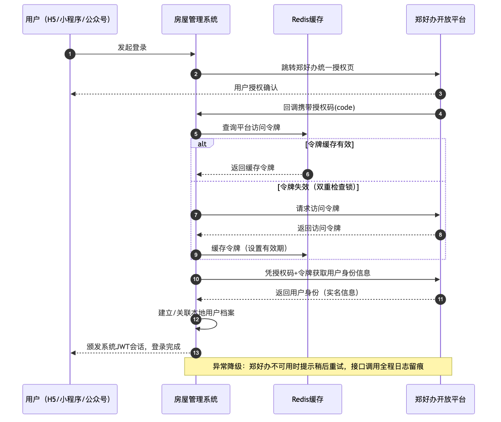

郑好办对接接口逐项定义如下：

| 接口 | 方向 | 触发场景 | 关键请求要素 | 关键响应要素 | 异常处理 |
|---|---|---|---|---|---|
| 授权跳转 | 本系统→郑好办 | 用户点击登录 | 应用标识、回调地址、状态码 | 授权页跳转 | 跳转失败提示重试，记录失败日志 |
| 授权码回调 | 郑好办→本系统 | 用户完成授权 | 授权码、状态码 | — | 状态码校验防CSRF；授权码一次性使用 |
| 令牌换取 | 本系统→郑好办 | 收到授权码 | 授权码、应用凭证 | 访问令牌、有效期 | 换取失败降级重新授权；凭证服务端保管 |
| 用户信息获取 | 本系统→郑好办 | 令牌换取成功 | 访问令牌 | 用户实名信息（姓名、证件号、手机号） | 信息不全时引导用户补充；采集留痕 |
| 令牌刷新 | 本系统→郑好办 | 令牌临期 | 刷新令牌 | 新访问令牌 | 双重检查锁防并发重复刷新；刷新失败重新走授权 |

### 2.6.3 政务数据资格核验对接

通过政务接口代理网关对接社保（郑州市）、婚姻（郑州市）、学历（郑州市）、住房（港区）、保租房（港区）5类核验接口以及房管局、不动产权中心公共数据接口：

- 代理网关部署于可访问政务网络的环境，统一鉴权、统一报文转换、统一日志留痕；
- 核验结果结构化落库并缓存，支持用户手动刷新重新核验；
- 接口不可用时自动降级人工审核通道，业务不中断；
- 敏感个人信息按最小必要原则调用，传输全程加密。

资格核验接口逐项定义如下：

| 接口 | 数据层级 | 核验内容 | 调用时机 | 结果处理 | 降级策略 |
|---|---|---|---|---|---|
| 社保信息核验 | 郑州市级 | 参保状态、缴费单位、连续缴费情况 | 资格校验发起/用户手动刷新 | 结构化落库，比对准入规则输出符合/不符合项 | 接口超时重试2次后转人工审核 |
| 婚姻信息核验 | 郑州市级 | 婚姻登记状态 | 同上 | 同上 | 同上 |
| 学历信息核验 | 郑州市级 | 最高学历、毕业院校 | 同上 | 同上 | 同上 |
| 住房信息核验 | 港区级 | 本区自有住房情况 | 同上 | 同上 | 同上 |
| 保租房信息核验 | 港区级 | 是否已承租保租房 | 同上 | 同上 | 同上 |
| 房管局公共数据 | 市/区级 | 房屋登记相关信息 | 业务按需调用 | 结果留痕 | 人工核查兜底 |
| 不动产权中心数据 | 市/区级 | 不动产权属信息 | 业务按需调用 | 结果留痕 | 人工核查兜底 |

**核验结果缓存与刷新机制**：核验结果设置有效期缓存，有效期内重复校验直接返回缓存结果不再调用政务接口，降低政务接口压力；用户点击"手动刷新"强制穿透缓存重新调用；每次核验的调用时间、数据来源、比对结论完整留痕，支撑资格审核的事后追溯。

资格核验整体业务流程如下图所示：

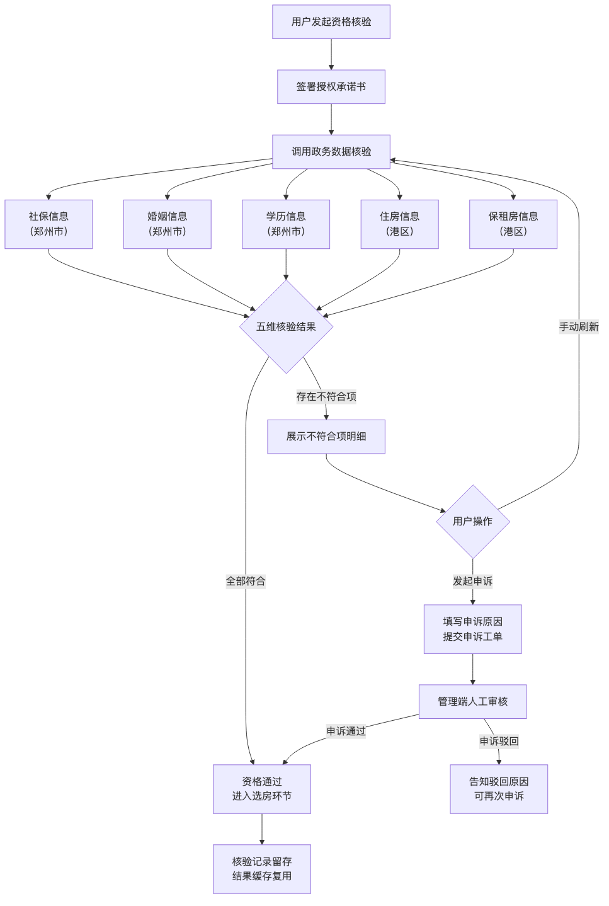

### 2.6.4 其他第三方接口对接

| 接口 | 对接方式 | 关键设计 |
|---|---|---|
| 支付渠道（港区支付接口） | 服务端API+异步回调 | 签名验签、回调幂等、定时对账、退款拆分 |
| 电子签章 | 服务端API | 模板化签署流、签署状态回查、合同文件存证 |
| 人脸识别 | 小程序/公众号端SDK+服务端核验 | 选房人与签约人一致性比对，调用量计费按实结算 |
| 地图服务 | 前端SDK+服务端逆地理 | 项目定位、距离计算、第三方导航跳转 |
| 园区监控 | 视频流/截图接口 | 管理端监控列表实时查看，按小区组织 |
| 微信平台 | 小程序/公众号开放能力 | 登录态、模板消息、支付能力协同 |

支付渠道接口逐项定义如下：

| 接口 | 方向 | 触发场景 | 关键要素 | 异常处理 |
|---|---|---|---|---|
| 统一下单 | 本系统→支付渠道 | 用户确认缴费 | 商户订单号、金额、账单摘要、回调地址 | 下单失败提示重试；订单号全局唯一 |
| 支付回调 | 支付渠道→本系统 | 用户完成支付 | 渠道流水号、支付结果、签名 | 验签失败拒绝；幂等处理重复回调 |
| 订单查询 | 本系统→支付渠道 | 回调未达/状态存疑 | 商户订单号 | 定时任务主动回查补偿，保证最终一致 |
| 退款申请 | 本系统→支付渠道 | 退款审批通过 | 原订单号、退款金额、退款单号 | 退款失败告警人工介入；按原账单明细拆分原路退回 |
| 退款查询 | 本系统→支付渠道 | 退款结果确认 | 退款单号 | 结果留痕，凭证归档 |
| 对账单下载 | 本系统→支付渠道 | 每日定时 | 对账日期 | 下载失败重试并告警；逐笔核对差异生成异常清单 |

支付渠道对接时序如下图所示：

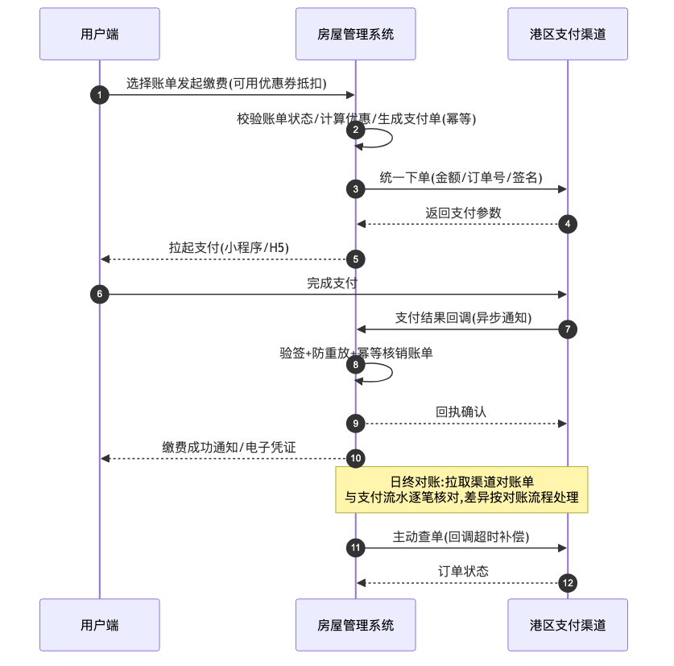

电子签章接口逐项定义如下：

| 接口 | 触发场景 | 关键要素 | 异常处理 |
|---|---|---|---|
| 签署流创建 | 用户发起合同签署 | 合同模板、填充要素、签署方信息、控件位置 | 创建失败重试；要素完整性预校验 |
| 个人签名 | 用户在线签字 | 签署链接/签名数据 | 签署链接限时有效；超时作废重新发起 |
| 平台签章 | 用户签署完成 | 企业签章调用 | 签章失败告警人工处理 |
| 签署状态回调 | 签署状态变化 | 签署流ID、状态、签署文件 | 回调+定时回查双通道防漏 |
| 合同文件下载 | 签署完成归档 | 签署流ID | 文件加密存证；哈希校验完整性 |

电子签章对接时序如下图所示：

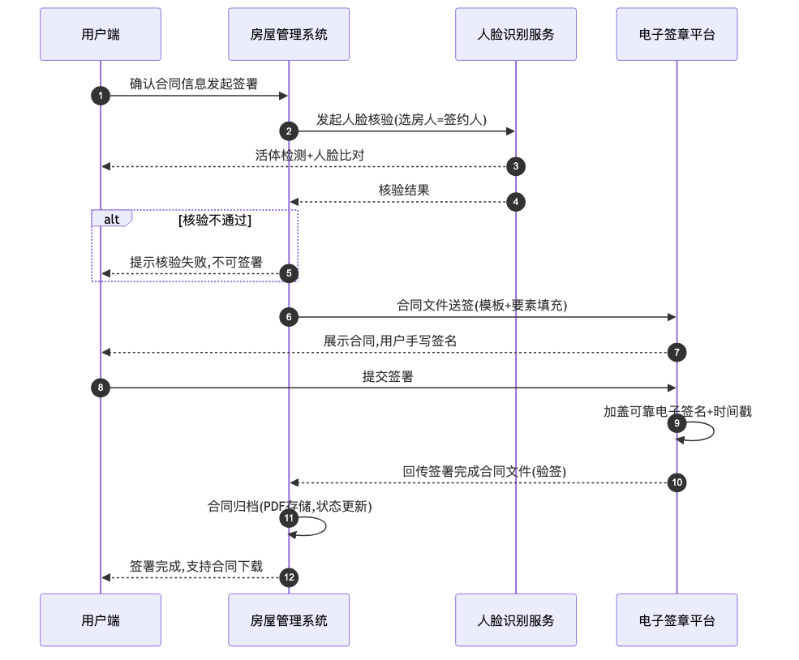

### 2.6.5 内部接口与数据交换

前后端接口统一网关入口、统一响应结构（代码/消息/数据三段式）、统一异常处理；批量数据交换（房源导入、租户导出、迁移数据）采用模板化 Excel + 异步任务 + 结果回执模式，保证大批量数据处理不阻塞在线业务。

**接口规范细则**：

1. **命名规范**：URL 按"/模块/资源/动作"层级组织，资源名用名词复数，动作语义由 HTTP 方法表达（GET查询/POST新增/PUT修改/DELETE删除）；
2. **报文规范**：请求与响应统一 UTF-8 编码 JSON 报文；时间格式统一 yyyy-MM-dd HH:mm:ss；金额统一以分为单位的整数传输，杜绝浮点精度问题；
3. **分页规范**：列表接口统一 pageNum/pageSize 入参与 total/rows 出参结构；
4. **鉴权规范**：所有业务接口携带 JWT 令牌，网关统一校验；开放回调类接口采用签名验签+IP白名单双重防护；
5. **幂等规范**：所有写操作接口支持幂等（业务唯一键约束或幂等令牌），防止网络重试导致的重复提交；
6. **版本规范**：接口版本化管理，新版本上线保持旧版本兼容过渡期，避免多端发版不同步导致的接口不可用。

### 2.6.6 接口异常处理与容错设计

针对外部接口不可用、超时、返回异常三类故障场景，统一容错设计如下：

| 外部接口 | 故障场景 | 容错策略 | 用户侧体验 |
|---|---|---|---|
| 郑好办认证 | 授权服务不可用 | 已登录会话不受影响；新登录友好提示稍后重试 | 明确的错误提示与重试入口 |
| 政务核验 | 超时/不可用 | 重试2次→自动降级人工审核通道 | 提示"已转人工审核"，业务不中断 |
| 支付渠道 | 回调丢失 | 定时任务主动查单补偿，保证最终一致 | 支付结果页轮询，短暂延迟后正确显示 |
| 支付渠道 | 下单失败 | 幂等重试；持续失败则账单保持待缴状态 | 提示重试，账单状态不错乱 |
| 电子签章 | 签署流异常 | 回调+回查双通道；超时作废可重新发起 | 签署状态透明，可重新发起 |
| 人脸识别 | 识别服务异常 | 有限次重试；持续失败转人工核验通道 | 提示改用人工核验，流程可继续 |
| 地图服务 | 加载失败 | 前端降级为列表模式 | 找房功能不中断 |
| 园区监控 | 视频源中断 | 管理端标注离线状态，恢复自动重连 | 不影响其他业务 |

**熔断与隔离**：外部接口调用统一设置超时（连接/读取分离配置）与熔断阈值，故障接口快速失败不拖垮主线程池；各外部依赖独立线程池隔离，单一外部故障不产生雪崩效应。所有异常调用记录接口日志并触发告警，供运维快速定位。

## 2.7 系统数据设计

### 2.7.1 数据实体总体设计

系统数据模型围绕"人、房、约、钱、务"五条主线组织，核心数据实体及其关系如下：

| 主线 | 核心实体 | 主要内容 | 关键关联 |
|---|---|---|---|
| 人（用户域） | 用户、租户档案、资格核验记录、申诉记录、黑名单 | 用户身份、实名信息、资格状态 | 用户—租户档案1:1；租户—核验记录1:N |
| 房（资产域） | 项目、楼栋、单元、房源、房型、VR资源、配租批次 | 四级资产台账、房源状态、配租关系 | 项目—房源1:N；批次—房源N:N |
| 约（合同域） | 合同、合同模板、承诺书、入住单、退租单、合住人、调换房单 | 合同全生命周期、入住退租办理 | 合同—房源N:1；合同—入住/退租单1:N |
| 钱（资金域） | 账单、支付订单、退款单、优惠券、券核销记录、开票申请、发票 | 押金/租金账单、支付流水、退款、开票 | 合同—账单1:N；账单—支付单1:N；账单—券核销1:N |
| 务（服务域） | 服务订单、服务公司、投诉单、预约单、消息、公告、政策文件 | 居住服务、运营触达 | 租户—服务订单1:N；订单—服务公司N:1 |

### 2.7.2 核心实体字段设计（示例）

以下给出五个最核心实体的字段设计（详细数据字典在概要设计阶段完整交付）：

**房源实体（核心字段）**：

| 字段 | 类型 | 说明 |
|---|---|---|
| 房源ID | 长整型 | 主键 |
| 项目ID/楼栋/单元/房号 | 长整型/字符 | 四级归属定位 |
| 房型ID | 长整型 | 关联房型，继承户型/面积/朝向属性 |
| 业态类型 | 字典 | 人才公寓/保租房/市场租赁 |
| 房源状态 | 字典 | 空置/已预订/已出租/维修中/下架 |
| 上架状态 | 字典 | 已上架/未上架 |
| 月租金/押金 | 整数(分) | 金额字段统一分为单位 |
| 精选标记/定向配租时间 | 布尔/日期 | 运营属性 |
| 管家电话 | 字符(脱敏) | 用户端展示 |
| 创建/更新/删除标记 | 审计字段 | 全表统一审计四件套（创建人/时间、更新人/时间）+逻辑删除 |

**合同实体（核心字段）**：

| 字段 | 类型 | 说明 |
|---|---|---|
| 合同ID/合同编号 | 长整型/字符 | 主键与业务编号 |
| 租户ID/房源ID | 长整型 | 签约双方与标的 |
| 业态类型/合同类型 | 字典 | 三业态；新签/续签/集中 |
| 合同状态 | 字典 | 待签署/待生效/履行中/待续签/已到期/已解除/已作废 |
| 租期起止/付款周期 | 日期/字典 | 月付/季付/半年付/年付 |
| 月租金/押金金额 | 整数(分) | 取自模板配置 |
| 签署文件地址/签署时间 | 字符/时间 | 电子签章存证文件 |
| 关联批次ID | 长整型 | 集中合同关联配租批次 |

**账单实体（核心字段）**：账单ID、合同ID、账单类型（押金/租金）、账期起止、应缴金额、优惠金额、实缴金额、缴费截止日、账单状态（待缴/已缴/逾期/已退款/已关闭）、支付时间、审计字段。

**支付订单实体（核心字段）**：支付单ID、商户订单号（全局唯一）、账单ID集合、支付金额、渠道流水号、订单状态（待支付/支付中/已支付/已关闭/已退款）、回调时间、对账状态、审计字段。

**资格核验记录实体（核心字段）**：记录ID、租户ID、业态类型、核验维度（社保/婚姻/学历/住房/保租房）、数据来源层级、核验结果、结果明细摘要、核验时间、缓存有效期、审计字段。

### 2.7.3 数据设计规范

1. **命名规范**：表名统一业务前缀+下划线命名；字段名见名知义；字典值统一由字典管理维护；
2. **审计规范**：全部业务表带创建人/创建时间/更新人/更新时间四个审计字段；删除一律逻辑删除；
3. **金额规范**：金额字段以分为单位整型存储，展示层格式化，从存储层杜绝小数精度差错；
4. **索引规范**：高频查询条件建立复合索引；大表（账单、日志、消息）按时间维度规划归档策略；
5. **敏感数据规范**：证件号、手机号等敏感字段加密存储、脱敏展示，密钥独立管理。

### 2.7.4 关键编码规则设计

业务单据统一编码，保证全局唯一、可读可溯：

| 单据类型 | 编码规则 | 示例说明 |
|---|---|---|
| 房源编码 | 项目码-楼栋-单元-房号 | 支持按编码快速定位资产位置 |
| 合同编号 | HT-业态码-年月-流水号 | 业态码区分人才公寓/保租房/市场租赁 |
| 账单编号 | ZD-合同号-账期序号 | 与合同、账期强关联 |
| 支付订单号 | PAY-年月日-毫秒-随机位 | 全局唯一，防并发重复 |
| 退款单号 | RF-原支付单号-序号 | 与原支付单强关联，支持多次部分退款 |
| 配租批次号 | PZ-年份-批次序号 | 批次业务全程引用 |
| 工单编号 | GD-年月日-序号 | 运维期故障工单统一编号 |
| 开票申请号 | KP-年月-流水号 | 与账期、发票文件关联 |

### 2.7.5 数据量估算与增长预测

按港区业务规模（存量迁移+6年运维期增长）进行数据量估算，指导容量规划与索引设计：

| 数据实体 | 初始迁移量级 | 年增长量级 | 6年总量级 | 存储策略 |
|---|---|---|---|---|
| 用户/租户 | 万级 | 千级/年 | 万级 | 常规存储 |
| 项目/楼栋/单元/房源 | 千至万级 | 百级/年 | 万级 | 常规存储 |
| 合同 | 万级 | 千级/年 | 万级 | 常规存储+PDF文件独立存储 |
| 账单 | 十万级 | 万级/年 | 十万至百万级 | 按年分区/归档 |
| 支付流水 | 十万级 | 万级/年 | 百万级 | 按年分区/归档 |
| 消息记录 | — | 十万级/年 | 百万级 | 定期归档，在线保留1年 |
| 操作/接口日志 | — | 百万级/年 | 千万级 | 在线≥6个月，历史归档压缩 |
| 附件（图片/PDF/VR） | 十GB级 | 十GB级/年 | 百GB级 | 对象存储/文件服务器分层 |

估算结论：核心交易表在6年内均处于MySQL单表可高效承载范围（配合分区与归档策略），无需引入分库分表复杂度，符合"够用、可靠、低维护成本"的选型原则。

## 2.8 系统安全设计

系统安全设计贯穿身份认证（郑好办统一认证+JWT+会话管理）、访问控制（RBAC菜单/按钮/数据三级权限）、传输安全（全站HTTPS）、数据安全（敏感字段加密存储、脱敏展示）、应用安全（SQL注入/XSS/CSRF防护、接口签名与幂等）、审计安全（登录/操作/接口日志全留痕）六个层面，整体按照网络安全等级保护二级标准设计建设。详细安全解决方案见本方案第四章"系统安全管理"。

应用层关键场景的安全设计要点如下：

| 安全场景 | 威胁 | 设计措施 |
|---|---|---|
| 登录认证 | 凭证窃取、会话劫持 | 郑好办统一认证，本系统不存密码；JWT短有效期+刷新机制；同账号异常登录检测 |
| 越权访问 | 水平/垂直越权 | 接口级鉴权+数据行级权限双重校验；用户端接口强制校验数据归属（仅本人合同/账单可见） |
| 支付安全 | 金额篡改、重复支付、伪造回调 | 金额以服务端账单为准不信任前端；订单状态机+幂等；回调验签+IP白名单 |
| 文件上传 | WebShell、带毒文件 | 类型白名单+内容检测+重命名+隔离存储+禁执行权限 |
| 敏感数据 | 泄露、滥用 | 证件号/手机号加密存储、界面脱敏；导出脱敏与权限控制；最小必要采集 |
| 接口滥用 | 爬取、刷单、短信轰炸 | 限流、验证码、频次控制；关键操作行为日志分析告警 |
| 前端安全 | XSS、CSRF | 输入输出双向过滤转义、CSP策略、Token校验、敏感操作二次确认 |

## 2.9 方案特色与技术亮点总结

本章系统设计方案的核心特色与技术亮点归纳如下，供评审对照：

| 序号 | 亮点 | 内容概述 | 给甲方带来的价值 |
|---|---|---|---|
| 1 | 同类平台成熟方案定制适配 | 约90%功能与我方已建成运行的住房租赁平台直接对应，以生产验证过的方案定制适配而非从零开发 | 60天工期可行性的根本保障；质量风险显著低于新开发 |
| 2 | uni-app一码三端 | H5/小程序/公众号一套代码，业务逻辑与交互完全一致 | 开发与维护成本约降三分之二，多端行为永不打架 |
| 3 | 政务接口代理网关复用 | 生产运行中的代理网关直接复用，统一鉴权/转换/缓存/降级/留痕 | 资格核验对接成本降约75%，接口异常业务不中断 |
| 4 | 支付资金三重保障 | 状态机+回调幂等+每日对账 | 资金零差错、可对账、可追溯 |
| 5 | 统一业务模型+策略分流 | 三类业态统一数据模型，差异规则策略化 | 政策调整时规则独立演进，改动小、风险低 |
| 6 | 全状态机业务管控 | 房源/合同/账单/订单/审批单全部状态机管理 | 杜绝一房多租、重复支付等状态混乱问题 |
| 7 | 配置驱动运营 | 运营位/合同模板/消息模板/审批规则全配置化 | 运营调整零发版、当日生效 |
| 8 | 五步数据迁移法 | 分域清洗—映射转换—试迁移校验—增量补迁—并行核对 | 存量数据不丢不错不重，切换业务不中断 |
| 9 | 指标同源计算 | 看板与报表统一指标服务，明细汇总同源 | 数据口径一致，管理决策可信 |
| 10 | 可观测性体系 | 日志/指标/链路三位一体+三级告警 | 故障定位从小时级到分钟级，支撑10分钟响应承诺 |

# 第三章 项目实施管理

我方对本项目实行"系统开发—平台对接—运行测试—验收交付"全流程管控，建立覆盖人员、进度、质量、配置、规范五个维度的实施管理体系。项目实施总体流程如下图所示：

## 3.1 人员配置

### 3.1.1 项目组织架构

项目实行项目经理负责制，接受甲方项目主管部门的统一领导与考核。项目组织架构如下图所示：

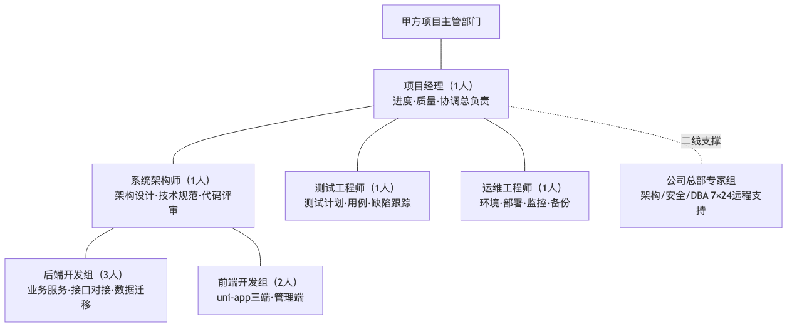

### 3.1.2 驻场团队角色与职责

| 角色 | 人数 | 主要职责 |
|---|---|---|
| 项目经理 | 1 | 总体计划、进度控制、需求基线管理、与甲方对口协调、周报/月报 |
| 系统架构师 | 1 | 技术架构设计、技术规范制定、关键技术攻关、代码评审 |
| 后端开发工程师 | 3 | 业务服务开发、第三方接口对接、数据迁移开发 |
| 前端开发工程师 | 2 | uni-app 三端开发、管理端开发、UI还原 |
| 测试工程师 | 1 | 测试计划/用例、功能/接口/兼容性测试、缺陷跟踪、测试报告 |
| 运维工程师 | 1 | 环境搭建、部署发布、监控巡检、数据备份、故障处置 |

团队配置满足开发期60日历天、总人月数不少于37人月的要求。全体驻场人员承诺：在甲方指定地点办公，遵守甲方考勤制度，进场前提交人员明细单（身份证、资质、工作经历、项目经验证明），签订个人保密承诺书，配合甲方背景核验与技能测试；未经甲方书面同意不擅自更换人员。

### 3.1.3 岗位任职资格要求

我方为本项目各岗位设定的任职资格标准如下，进场人员全部满足或高于该标准：

| 岗位 | 学历要求 | 从业年限 | 能力要求 | 项目经验要求 |
|---|---|---|---|---|
| 项目经理 | 本科及以上 | 8年以上软件行业，5年以上项目管理 | 具备项目管理知识体系，熟悉政企信息化项目管理流程；具备需求管理、进度控制、多方协调能力 | 主持过2个以上同等规模政企信息系统项目交付 |
| 系统架构师 | 本科及以上 | 8年以上Java开发，3年以上架构设计 | 精通Spring Boot微服务体系、高并发与缓存架构、安全架构设计；具备技术方案评审与攻关能力 | 主导过住房租赁/政务服务类平台架构设计 |
| 后端开发工程师 | 本科及以上 | 3年以上Java开发 | 熟练掌握Spring Boot、Spring Security、MyBatis-Plus、MySQL、Redis；具备第三方接口对接经验 | 参与过支付、电子签章或政务数据对接开发 |
| 前端开发工程师 | 本科及以上 | 3年以上前端开发 | 熟练掌握Vue、uni-app跨端开发、Element UI；具备H5/小程序/公众号三端适配经验 | 交付过小程序+H5双端以上的移动应用 |
| 测试工程师 | 本科及以上 | 3年以上测试 | 掌握测试用例设计方法、接口测试工具、性能测试工具；具备缺陷管理与测试报告编制能力 | 参与过大型业务系统全流程测试 |
| 运维工程师 | 本科及以上 | 3年以上运维 | 掌握Linux、Nginx、MySQL、Redis运维，容器化部署，监控告警体系搭建 | 具备生产环境部署与故障处置经验 |

### 3.1.4 人月投入分布

开发期60日历天（约2个月）内9名驻场人员满负荷投入18人月，其余人月投入分布于试运行保障、验收支持与运维期首年重点保障，总投入不少于37人月：

| 阶段 | 投入人员 | 人月数 |
|---|---|---|
| 开发期（60日历天） | 全员9人驻场 | 18 |
| 试运行与验收期 | 项目经理+核心开发+测试+运维6人 | 9 |
| 运维期首年重点保障 | 驻场运维+轮值开发支持 | 10 |
| 合计 | — | ≥37 |

### 3.1.5 人员进场计划

| 时间节点 | 进场安排 |
|---|---|
| 合同签订后3个工作日内 | 项目经理、架构师先行进场：对接甲方项目组、确认办公条件、启动需求调研准备 |
| 合同签订后5个工作日内 | 全员进场：提交人员明细单与保密承诺书、完成背景核验与技能测试、领取门禁与账号 |
| 进场第1周内 | 完成开发/测试环境搭建、项目管理工具初始化、需求宣讲会启动 |

### 3.1.6 人员保障机制

- **AB角备份**：关键岗位（项目经理、架构师、核心后端）设置AB角，A角不可用时B角24小时内到岗接替；
- **二线支持**：公司总部提供架构、安全、DBA二线专家支持，疑难问题远程+现场协同解决；
- **人员稳定性承诺**：核心成员服务期内保持稳定，确需更换的提前书面报甲方审批，并完成不少于5个工作日的交接；
- **知识管理**：项目知识库（需求纪要、设计文档、问题台账、运维手册）随项目沉淀，人员交接以知识库为基线，避免知识随人流失。

### 3.1.5 人员到岗与稳定性保障

- **到岗承诺**：中标后按合同约定时间全员到岗驻场，人员名单与简历报甲方备案，关键岗位（项目经理、架构师、组长）人选与投标承诺一致；
- **人员更换约束**：关键岗位人员原则上项目期内不更换；确需更换的，提前15个工作日书面报甲方同意，替换人员资历不低于原人员，并完成不少于10个工作日交接带教；
- **考勤管理**：驻场人员遵守甲方考勤与保密规定，接受甲方月度考勤考核；
- **后备资源池**：公司为本项目建立后备人力池（开发、测试、运维各岗位），进度告警或人员突发情况时3个工作日内增援到岗，费用由我方承担；
- **知识不落单人**：关键模块实行"主备负责制"，设计文档与代码评审保证至少两人熟悉每个核心模块，避免单点人员依赖。

### 3.1.6 人员技能要求与培训

进场前完成项目专项培训并考核上岗：业务培训（三类业态政策与业务流程）、技术培训（项目技术栈与编码规范）、安全保密培训（甲方保密规定、个人信息保护要求，签署保密承诺书）。项目期内每两周组织技术分享，重点沉淀政务对接、支付对接的项目专有知识，保证团队能力与项目需求持续匹配。

## 3.2 开发规划

### 3.2.1 开发模式

采用"迭代式开发 + 里程碑管控"模式：将60日历天开发期划分为需求确认、迭代开发（3轮）、系统联调、试运行准备等阶段，每轮迭代交付可运行、可演示的功能增量，甲方全程可见、可试用、可纠偏，避免"最后一刻才见系统"的交付风险。

### 3.2.2 开发阶段规划

| 阶段 | 工作内容 | 交付物 |
|---|---|---|
| 需求确认（第1周） | 需求宣讲、原型确认、需求基线冻结、数据迁移调研 | 需求规格说明书、原型稿、迁移方案 |
| 迭代一（第2-3周） | 基础框架、登录（郑好办对接）、房源管理、首页运营位 | 可演示版本V0.1 |
| 迭代二（第4-5周） | 选房签约、合同管理（电子签章）、押金缴纳、入住办理 | 可演示版本V0.2 |
| 迭代三（第6-7周） | 退租/续租/账单缴费/开票、优惠券、服务订单、数据看板、企业客户 | 可演示版本V0.3 |
| 系统联调（第7-8周） | 政务核验/支付/人脸/地图/监控全链路联调、数据迁移演练、性能与安全测试 | 联调报告、迁移比对报告 |
| 试运行准备（第8-9周） | 缺陷修复、验收测试、培训、上线切换方案评审 | 测试报告、培训记录、上线方案 |

注：第三方接口（政务核验、支付渠道、电子签章、人脸识别）的接入申请、参数开通等外部依赖事项在第1周即并行启动，不占用关键路径。

### 3.2.3 迭代任务分解

三轮迭代的功能任务分解与责任分工如下：

**迭代一（第2-3周）——地基与门面**：

| 任务 | 覆盖功能明细序号 | 责任岗位 | 完成标准 |
|---|---|---|---|
| 基础框架搭建 | — | 架构师+后端 | 权限/字典/日志/代码生成/任务调度就绪 |
| 郑好办登录对接 | 1、150 | 后端 | 授权登录全流程沙箱联调通过 |
| 首页与运营位 | 2-14、191 | 前端+后端 | 首页各运营位后台可配、前端动态渲染 |
| 项目/房型/房源管理 | 156-157 | 后端+前端 | 四级台账增删改查+导入导出+上下架可用 |
| 管理端首页看板框架 | 151-155 | 前端+后端 | 五类统计卡片出数 |

**迭代二（第4-5周）——核心交易链路**：

| 任务 | 覆盖功能明细序号 | 责任岗位 | 完成标准 |
|---|---|---|---|
| 选房链路（三业态） | 17-23、54-60、89-95 | 前端+后端 | 搜索→项目→承诺书→房源→选定全链路可走通 |
| 人脸识别与合同签署 | 24-25、61-62、96-97、208、211 | 后端 | 沙箱环境签署流闭环 |
| 押金缴纳与支付对接 | 26、63、98、207 | 后端 | 下单/回调/对账沙箱联调通过 |
| 入住办理（用户端+管理端） | 27-30、64-67、99-102、166-167 | 前端+后端 | 申请→签收→物品核对→签字确认闭环 |
| 配租批次与企业配租 | 158-159、137-139 | 后端+前端 | 批次创建→审批→窗口期选房可用 |
| 资格核验与申诉 | 15-16、52-53、163、205 | 后端 | 五维核验沙箱联调+申诉工单闭环 |

**迭代三（第6-7周）——履约服务与运营**：

| 任务 | 覆盖功能明细序号 | 责任岗位 | 完成标准 |
|---|---|---|---|
| 退租/退款链路 | 31-34、68-71、103-106、168-170 | 前端+后端 | 申请→审批→物品核对→退费→退款闭环 |
| 续租链路 | 35-38、72-75、107-110、165 | 前端+后端 | 校验→签订→审批→缴费提示闭环 |
| 账单缴费与开票 | 39-48、76-85、111-120、173、180 | 后端+前端 | 账单生成→缴费→核销→开票闭环 |
| 优惠券体系 | 11、148、184-186 | 后端 | 配置→领取→抵扣→核销闭环 |
| 服务订单与投诉 | 124-136、161-162、176-179 | 前端+后端 | 三类服务订单+投诉处置闭环 |
| 合住人/调换房/代购补贴 | 50-51、87-88、122-123、140-141、171-172、174-175 | 后端 | 申请审批链路闭环 |
| 数据看板与报表 | 151-155、182-183 | 后端 | 指标出数一致性核对通过 |
| 消息/公告/政策/监控 | 12-13、143、189、192-193、181、206 | 后端 | 触达渠道联调+监控画面接入 |

### 3.2.4 需求管理

需求基线冻结后实行变更受控（见3.4节）；建立需求跟踪矩阵，实现"招标功能清单211项 → 需求规格 → 开发任务 → 测试用例 → 验收项"全链路双向追溯，确保功能不漏项、验收有依据。

需求跟踪矩阵样式如下：

| 功能明细序号 | 功能点 | 需求规格编号 | 开发任务编号 | 测试用例编号 | 测试结论 | 验收项编号 | 验收结论 |
|---|---|---|---|---|---|---|---|
| 40 | 账单缴费 | REQ-PAY-003 | DEV-PAY-012 | TC-PAY-021~035 | 通过 | ACC-040 | 待验收 |
| ……（211项逐项登记） | | | | | | | |

## 3.3 开发测试与协作管理

### 3.3.1 协作机制

- **每日站会**（15分钟）：同步昨日进展、当日计划、阻塞问题；
- **每周例会**：与甲方共同评审周进度、演示迭代成果、确认下周计划，输出周报；
- **里程碑评审**：每个迭代结束由甲方参与评审，签署阶段确认意见；
- **问题台账**：需求疑问、外部依赖、风险事项统一登记跟踪，明确责任人与解决时限。

### 3.3.2 测试管理

实行"开发自测 → 提测准入 → 集成测试 → 回归测试 → 验收测试"五级测试流程：

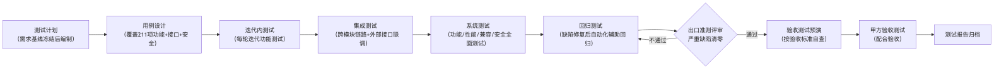

| 测试类型 | 内容 |
|---|---|
| 功能测试 | 依据需求跟踪矩阵逐项覆盖211项功能，用例评审后执行 |
| 接口测试 | 内部接口与8类外部接口的正向/异常/边界场景测试 |
| 业务流程测试 | 选房签约、入住退租、缴费开票等端到端全流程串测 |
| 兼容性测试 | 主流手机机型、微信版本、小程序/公众号环境、主流PC浏览器 |
| 性能测试 | 核心接口压测（集中配租选房高峰场景），验证响应时间与并发指标 |
| 安全测试 | 越权访问、SQL注入、XSS、敏感信息泄露等安全用例（详见第四章） |
| 数据迁移测试 | 试迁移记录数/金额合计/关键字段抽样三级比对 |

缺陷按严重/一般/轻微三级管理，严重缺陷24小时内修复，版本发布前严重与一般缺陷清零。

### 3.3.3 关键业务测试用例样例

以下给出核心业务场景的测试用例样例（完整用例库随测试计划交付，预计用例总数不少于1500条）：

**选房签约场景用例样例**：

| 用例编号 | 用例名称 | 前置条件 | 测试步骤 | 预期结果 |
|---|---|---|---|---|
| TC-XF-001 | 正常选房锁定 | 房源空置已上架，用户已签承诺书 | 用户A进入房源详情→点击选定房源 | 房源状态变为已预订，锁定归属用户A，锁定倒计时开始 |
| TC-XF-002 | 并发选房防重 | 同一房源空置 | 用户A与用户B同时点击选定同一房源 | 仅一人锁定成功，另一人提示房源已被选定 |
| TC-XF-003 | 锁定超时释放 | 用户A已锁定房源未支付 | 等待锁定有效期超时 | 房源自动释放回空置，用户A收到超时通知 |
| TC-XF-004 | 未签承诺书拦截 | 用户未签署承诺书 | 直接访问房源列表页 | 拦截并引导至承诺书签署页 |
| TC-XF-005 | 人脸识别不一致拦截 | 用户A选房，用户B尝试签约 | 用户B进行人脸识别 | 比对不通过，禁止进入合同签署 |
| TC-XF-006 | 集中配租窗口可见性 | 配租批次生效，用户C不在批次内 | 用户C浏览批次房源 | 批次房源对用户C不可见 |

**账单缴费场景用例样例**：

| 用例编号 | 用例名称 | 前置条件 | 测试步骤 | 预期结果 |
|---|---|---|---|---|
| TC-PAY-001 | 押金未缴拦截租金缴费 | 押金账单待缴 | 用户选择租期账单缴费 | 拦截并提示先缴纳押金 |
| TC-PAY-002 | 优惠券抵扣计算 | 用户持有效券，账单可用 | 选择账单→选择优惠券→确认支付 | 实付金额=应缴-抵扣，券状态锁定 |
| TC-PAY-003 | 支付回调幂等 | 支付单已核销 | 模拟渠道重复推送同一回调 | 二次回调不重复核销，返回成功 |
| TC-PAY-004 | 回调丢失补偿 | 用户已支付但回调未达 | 等待定时回查任务执行 | 账单补核销，状态最终一致 |
| TC-PAY-005 | 支付超时关单 | 支付单创建后未支付 | 等待超时时限 | 订单自动关闭，优惠券解锁返还 |
| TC-PAY-006 | 退款原路退回 | 退款审批通过 | 执行退费操作 | 按原账单明细拆分原路退回，退款单与原支付单关联 |

**资格核验场景用例样例**：

| 用例编号 | 用例名称 | 前置条件 | 测试步骤 | 预期结果 |
|---|---|---|---|---|
| TC-ZG-001 | 五维核验全通过 | 测试数据满足全部准入条件 | 发起资格校验 | 五项全部显示符合，可进入选房 |
| TC-ZG-002 | 单项不符提示 | 社保数据不满足条件 | 发起资格校验 | 社保项显示不符合及原因，提供申诉入口 |
| TC-ZG-003 | 手动刷新频次限制 | 用户已连续刷新达上限 | 再次点击刷新 | 拦截并提示稍后重试 |
| TC-ZG-004 | 接口超时降级 | 模拟政务接口超时 | 发起资格校验 | 重试2次后转人工审核通道，业务不中断 |
| TC-ZG-005 | 申诉审核通过联动 | 申诉工单待审核 | 管理端审核通过 | 资格状态更新，用户收到通知，可继续办理 |

### 3.3.4 缺陷管理细则

缺陷从发现到关闭的管理流程如下图所示：

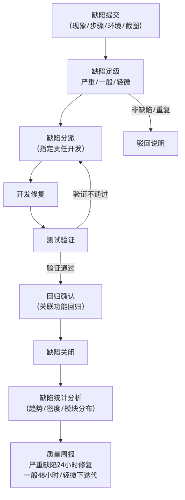

| 缺陷等级 | 定义 | 修复时限 | 发布门禁 |
|---|---|---|---|
| 严重 | 系统崩溃、核心流程阻断、资金计算错误、数据丢失、安全漏洞 | 24小时内修复 | 清零方可发布 |
| 一般 | 功能不符合需求、流程可绕行但体验受损、兼容性问题 | 3个工作日内修复 | 清零方可发布 |
| 轻微 | 界面瑕疵、文案错误、优化建议 | 纳入后续版本 | 登记跟踪不阻断发布 |

缺陷全生命周期（新建→确认→修复→回归→关闭）在缺陷管理工具中留痕；每周输出缺陷趋势分析（新增/修复/遗留曲线），作为版本质量放行的量化依据。

### 3.3.5 质量保证

代码走查与评审（合并前强制评审）、编码规范静态检查、单元测试覆盖核心业务逻辑、每日构建冒烟测试；质量数据（缺陷密度、修复时长、用例通过率）纳入周报向甲方透明呈现。

### 3.3.6 性能压测方案

上线前针对高风险场景开展专项压力测试，压测环境数据规模模拟生产量级：

| 压测场景 | 模拟条件 | 通过标准 |
|---|---|---|
| 配租批次开放选房 | 批次窗口开启瞬时并发选房请求 | 无超卖（同一房源仅一人锁定成功）、无宕机、P95响应≤2秒 |
| 高峰缴费 | 月初集中缴费时段并发下单与回调 | 支付订单不重不漏、账单核销准确、P95≤2秒 |
| 列表与看板查询 | 万级房源/十万级账单下多条件组合查询 | 常规查询P95≤1秒，统计看板≤3秒 |
| 批量导入导出 | 万级数据Excel导入/导出 | ≤5分钟完成，在线业务无感知 |
| 消息群发 | 万级用户催缴消息群发 | 队列削峰平稳消费，无消息丢失 |
| 稳定性测试 | 混合业务场景持续运行12小时 | 无内存泄漏、无连接泄漏、错误率＜0.1% |

压测输出《性能测试报告》（TPS、响应时间分布、资源占用曲线、瓶颈分析与调优记录），作为上线评审的必备材料；调优后复测验证，达标方可上线。

## 3.4 配置与变更管理

### 3.4.1 配置管理

- **版本控制**：全部源代码、数据库脚本、配置文件、文档纳入 Git 统一管理；采用分支模型（主干保护+功能分支+发布分支），合并须经代码评审；
- **持续集成/持续部署**：搭建自动化流水线，代码提交自动触发编译、静态检查、自动化部署到测试环境，发布过程标准化、可重复、可回滚（该流水线为我方同类项目生产环境验证过的成熟实践）；
- **配置项标识**：版本号规范化管理，每次发布输出版本说明（变更内容、影响范围、回滚方案）；
- **环境配置分离**：开发/测试/生产环境参数外部化，杜绝硬编码，敏感配置（密钥、口令）加密管理。

### 3.4.2 变更管理

需求/设计/计划变更执行"申请—影响评估—审批—实施—验证—关闭"闭环流程：变更申请书面提出，项目经理组织评估对工期、成本、质量的影响，报甲方审批后实施，变更结果回归验证并更新需求跟踪矩阵与基线文档。紧急变更（生产缺陷修复）可先行处置、48小时内补办手续。

变更管理流程如下图所示：

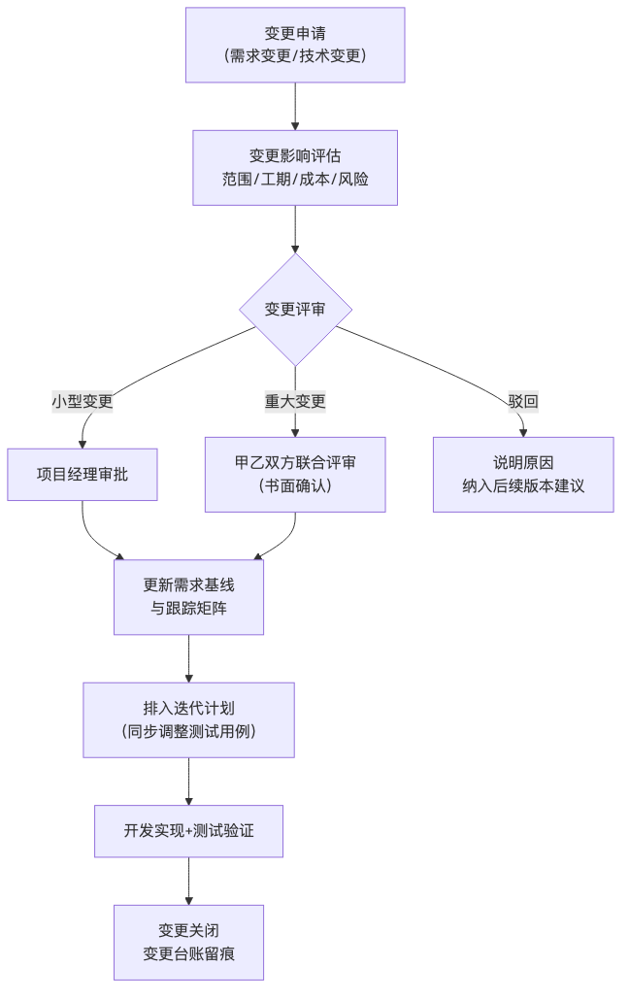

## 3.5 技术规范管控

- **编码规范**：Java 开发遵循业界通用编码规约，前端遵循 Vue/uni-app 官方风格指南，静态扫描工具纳入流水线强制检查；
- **数据库规范**：表结构设计评审制，命名规范、索引规范、变更脚本版本化管理，禁止生产库手工变更；
- **接口规范**：RESTful 设计规范 + OpenAPI 3.0 文档强制同步更新，接口变更须评审并通知联调方；
- **安全规范**：敏感数据处理规范、日志脱敏规范、密钥管理规范（详见第四章）；
- **文档规范**：按 GB/T 8567 编制需求、设计、测试、部署、操作手册等全套文档，随里程碑同步交付。

### 3.5.1 编码规范细则（要点）

| 类别 | 规范要点 |
|---|---|
| 命名 | 类名大驼峰、方法/变量小驼峰、常量全大写下划线；包名按"公司.项目.模块.分层"组织；禁止拼音缩写混用 |
| 分层 | Controller只做参数校验与结果封装，业务逻辑收敛Service层，数据访问收敛Mapper层；禁止跨层调用 |
| 异常 | 统一业务异常体系，全局异常处理器兜底；禁止吞异常、禁止捕获后仅打印不处理 |
| 事务 | 事务边界在Service层声明；跨服务数据一致性采用补偿/对账机制；长事务拆分 |
| 日志 | 统一日志门面；关键业务动作INFO级留痕；敏感字段（证件号/手机号）日志脱敏；禁止System.out |
| 注释 | 类/公共方法必须有文档注释；复杂业务逻辑行内注释说明"为什么"；源代码交付注释完整可读 |
| 前端 | 组件化开发、公共组件下沉；接口调用统一封装；页面状态与接口异常统一处理；禁止硬编码接口地址 |

### 3.5.2 数据库规范细则（要点）

| 类别 | 规范要点 |
|---|---|
| 命名 | 表/字段小写下划线命名，业务前缀区分模块；索引命名含表名与字段特征 |
| 结构 | 全表必备主键与审计四字段+逻辑删除标记；金额用整型分存储；状态用字典值 |
| 索引 | 高频查询条件建复合索引；避免冗余索引；大字段拆表存储 |
| 变更 | 表结构变更走脚本+评审+版本化；生产变更在发布窗口执行并可回滚；禁止生产库手工改数据（确需修数走工单+备份+复核） |
| SQL | 禁止SELECT *；分页查询强制；大批量操作分批提交；慢SQL纳入监控每周治理 |

## 3.6 部署对接及运行测试保障

- **环境保障**：进场第1周完成开发、测试环境搭建；生产环境部署方案（服务器规划、网络策略、域名证书、备份策略）提前与甲方评审确认；
- **对接保障**：为8类外部对接（郑好办、政务核验、支付、签章、人脸、地图、监控、微信平台）分别建立对接联系人清单与联调计划表，接口开通申请提前发起；每项对接完成"沙箱联调→生产验证→回归测试"三步确认；
- **数据迁移保障**：迁移演练不少于2轮，正式切换安排在业务低峰期，制定分步切换与回退预案，旧系统保留只读查询用于并行核对；
- **试运行保障**：试运行期间驻场团队全程值守，建立问题快速响应通道（紧急10分钟响应），每日输出试运行日报；
- **验收保障**：按招标验收标准与合同约定组织初验、终验，交付源代码（可独立编译、注释完整、含编译部署脚本与说明文档）及全套文档，配合甲方源代码功能性验证与质量审查。

数据迁移整体流程如下图所示：

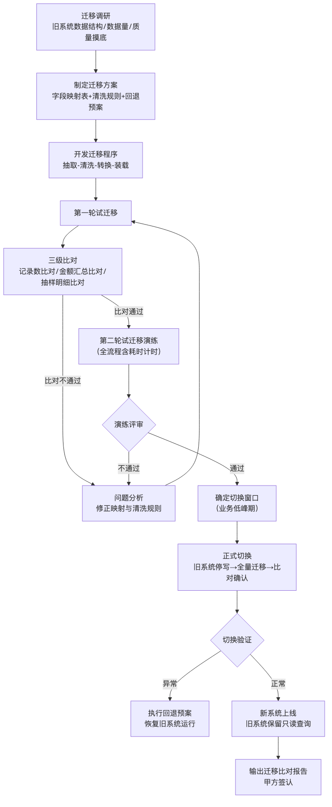

### 3.6.1 外部对接联调计划表

| 对接项 | 启动时间 | 沙箱联调 | 生产验证 | 责任人 | 外部依赖事项 |
|---|---|---|---|---|---|
| 郑好办用户体系 | 第1周 | 第2-3周 | 第8周 | 后端组长 | 应用注册、授权参数开通 |
| 政务资格核验（5类） | 第1周 | 第4-5周 | 第8周 | 后端组长 | 数据使用申请、网关网络开通 |
| 房管局/不动产权公共数据 | 第1周 | 第5-6周 | 第8周 | 后端组长 | 数据使用申请 |
| 港区支付渠道 | 第1周 | 第4-5周 | 第8周 | 后端支付专责 | 商户开通、密钥交换 |
| 电子签章 | 第1周 | 第4-5周 | 第8周 | 后端签章专责 | 企业认证、模板备案 |
| 人脸识别 | 第2周 | 第4-5周 | 第8周 | 后端 | 服务开通、计费协议 |
| 地图服务 | 第2周 | 第2-3周 | 第8周 | 前端 | 密钥申请 |
| 园区监控 | 第2周 | 第6-7周 | 第8周 | 运维 | 视频源与网络策略 |
| 微信平台（小程序/公众号） | 第1周 | 第3-7周 | 第8-9周 | 前端组长 | 主体认证、类目审核 |

每项对接建立《对接联调记录单》：联调日期、参与方、测试场景、问题清单、闭环结论，双方确认签字后进入生产验证。

## 3.7 低成本、标准化实现系统互联互通

我方以"标准优先、复用优先、配置优先"三原则实现系统互联互通的低成本落地：

1. **标准化接口体系**：全部对外/对内接口采用 RESTful + JSON 统一标准，OpenAPI 3.0 文档自动生成，第三方接入无需定制开发即可完成联调，降低双方对接成本；
2. **适配器模式隔离外部差异**：支付、签章、人脸、地图、监控等外部能力均以适配器封装，更换服务商仅需替换适配器实现，业务代码零改动，避免供应商锁定带来的重复建设成本；
3. **政务接口代理网关复用**：我方已建成并在生产环境稳定运行的政务数据代理网关（统一鉴权、报文转换、缓存、降级、日志），可直接复用于本项目的资格核验与公共数据对接，节省该部分从零开发成本；
4. **成熟平台底座复用**：统一权限、字典、日志、代码生成、任务调度等平台能力为我方成熟资产，直接复用，将人力集中投入业务功能开发；
5. **模板化数据交换**：批量导入导出、数据迁移采用标准 Excel 模板 + 校验回执机制，与甲方既有办公习惯无缝衔接，无需额外采购数据交换工具。

**可复用标准能力清单**：

| 能力项 | 复用来源 | 复用方式 | 节省工作量估算 |
|---|---|---|---|
| 政务接口代理网关 | 我方生产运行资产 | 直接部署+参数适配 | 约1.5人月 |
| 支付对接组件（下单/回调/对账/退款） | 我方生产运行资产 | 适配港区支付接口协议 | 约1人月 |
| 电子签章组件（模板签署流/状态回查/存证） | 我方生产运行资产 | 适配签章服务商接口 | 约0.5人月 |
| 统一权限/字典/日志/任务调度底座 | 成熟平台底座 | 直接复用 | 约2人月 |
| 房源/合同/账单核心业务模型 | 同类平台成熟实现 | 定制化适配 | 约4人月 |
| uni-app多端工程框架 | 成熟工程模板 | 直接复用 | 约1人月 |

**互联互通实施成本对照**：以政务资格核验对接为例，从零开发需完成网络申请、协议调研、报文封装、加密联调、异常降级等全链路工作（约2人月）；复用我方代理网关模式后，仅需完成接口参数配置与联调验证（约0.5人月），成本降低约75%，且生产验证过的降级、缓存、留痕机制同步复用，质量风险显著低于新开发。

## 3.8 项目风险管理

### 3.8.1 风险管理机制

项目实行"识别—评估—应对—监控"闭环风险管理：项目启动即建立风险登记册，每周例会滚动评审风险状态，高风险项指定专人跟踪并向甲方通报；风险应对以"预防为主、预案兜底"为原则。

### 3.8.2 项目风险登记册

| 风险编号 | 风险描述 | 概率 | 影响 | 等级 | 应对措施 | 责任人 |
|---|---|---|---|---|---|---|
| R01 | 第三方接口开通周期不可控（政务核验/支付/签章），阻塞联调 | 高 | 高 | 高 | 第1周即发起全部开通申请并行推进；未开通期间以挡板服务先行开发，接口就绪后切换联调；对接进展纳入周报向甲方通报请求协调 | 项目经理 |
| R02 | 60日历天工期紧张，功能量大（211项） | 中 | 高 | 高 | 成熟平台底座+代码生成器复用压缩基础开发量；三轮迭代并行推进；里程碑周检控制偏差，偏差超3天即启动纠偏（加班/增援） | 项目经理 |
| R03 | 需求理解偏差导致返工 | 中 | 中 | 中 | 第1周需求宣讲+原型确认+基线冻结；每轮迭代甲方演示评审及时纠偏；需求跟踪矩阵防漏项 | 项目经理 |
| R04 | 存量数据质量差，迁移比对不一致 | 中 | 高 | 高 | 第1周启动数据摸底；清洗规则与甲方逐项确认；不少于2轮试迁移演练；三重比对+回退预案 | 后端组长 |
| R05 | 集中配租高峰并发导致系统性能问题 | 中 | 高 | 高 | 选房锁定用分布式锁+缓存预热；高峰场景专项压测；应用无状态可横向扩容 | 架构师 |
| R06 | 关键人员流失 | 低 | 高 | 中 | AB角机制+知识库沉淀+总部人才池随时补位；更换须甲方审批并5个工作日交接 | 项目经理 |
| R07 | 小程序平台审核不通过影响上线节奏 | 中 | 中 | 中 | 提前研读平台规范，类目/资质材料第1周准备；预留审核与整改时间；公众号/H5端先行可用 | 前端组长 |
| R08 | 政务接口生产环境响应不稳定 | 中 | 中 | 中 | 核验结果缓存+重试+人工审核降级通道，保证业务不中断 | 后端组长 |
| R09 | 支付资金差错 | 低 | 高 | 中 | 状态机+幂等+每日对账三重保障；差异当日告警专人闭环 | 后端支付专责 |
| R10 | 试运行期集中暴露缺陷影响口碑 | 中 | 中 | 中 | 发布门禁（严重/一般缺陷清零）；试运行全程值守+快速响应通道；灰度放量策略 | 测试工程师 |

### 3.8.3 风险升级路径

一般风险由项目组内部处置并周报通报；高风险项48小时内书面报告甲方项目主管部门，提交专项应对方案；重大风险（可能影响里程碑交付）立即启动公司级资源协调，由公司分管领导与甲方对口会商解决。

### 3.8.4 项目沟通管理计划

项目实行例行会议与报告双轨沟通机制，保证甲乙双方信息对称、决策及时：

**会议机制**：

| 会议 | 频次 | 参与方 | 主要议题 | 输出 |
|---|---|---|---|---|
| 每日站会 | 每工作日15分钟 | 项目组全员 | 昨日进展、今日计划、阻塞问题 | 阻塞问题清单 |
| 周例会 | 每周一 | 项目经理+甲方项目负责人+各组长 | 上周交付物核对、本周计划、风险与依赖 | 周例会纪要（双方留档） |
| 里程碑评审会 | 每里程碑节点 | 双方项目负责人+评审专家 | 里程碑交付物评审与签认 | 评审结论与签认单 |
| 专项协调会 | 按需 | 相关方 | 外部对接受阻、重大变更、重大风险 | 专项决议与行动项 |
| 月度回顾会（运维期） | 每月 | 双方运维对口人 | 指标达成、故障复盘、改进计划 | 月度运维报告 |

**报告机制**：

| 报告 | 频次 | 内容要点 |
|---|---|---|
| 项目周报 | 每周 | 进度对照（计划/实际）、交付物、风险预警、下周计划、需甲方协调事项 |
| 里程碑报告 | 每里程碑 | 里程碑达成情况、偏差说明、后续计划调整 |
| 风险专报 | 高风险触发时48小时内 | 风险描述、影响评估、专项应对方案 |
| 试运行日报 | 试运行期每日 | 运行情况、问题清单与闭环状态、用户反馈 |

**沟通升级路径**：日常事项由双方对口人直接沟通；对口人无法达成一致或涉及范围/工期/费用的事项，升级至双方项目负责人协商；重大事项由公司分管领导与甲方主管领导层面会商，确保问题不悬置、决策不拖延。

## 3.9 项目文档管理

项目全周期文档实行"统一模板、统一编号、统一存储、版本受控"管理，全部文档纳入配置管理库，与代码同等管控：

| 文档类别 | 主要文档 | 产出阶段 | 更新机制 |
|---|---|---|---|
| 管理类 | 项目计划、周报月报、会议纪要、风险登记册、变更记录 | 全过程 | 事件驱动即时更新 |
| 需求类 | 需求规格说明书、需求跟踪矩阵、原型说明 | 需求阶段 | 需求变更同步修订并升版 |
| 设计类 | 概要设计、详细设计、数据库设计、接口设计文档 | 设计阶段 | 设计变更评审后升版 |
| 开发类 | 编码规范、代码评审记录、单元测试报告 | 开发阶段 | 随迭代持续产出 |
| 测试类 | 测试计划、测试用例、测试报告、缺陷清单 | 测试阶段 | 每轮测试后归档 |
| 交付类 | 部署手册、操作手册、运维手册、培训材料、验收报告 | 交付阶段 | 随系统版本同步更新 |

**文档质量要求**：文档编号规则为"项目代号-类别-序号-版本"；每份文档设编写人、审核人、批准人三级签署；文档修订记录页完整记载每次变更的内容、原因、日期与修订人；交付甲方的文档以正式受控版本为准，非受控副本加水印标识。文档与实物（代码、系统）的一致性列入阶段评审必查项，杜绝"文实不符"。

# 第四章 系统安全管理

我方按照网络安全等级保护二级（GB/T 22239-2019）要求，构建"技术防控 + 管理制度"双轮驱动的安全解决方案，对系统漏洞、病毒、黑客攻击、管理制度缺陷四类风险实施针对性防控。安全防护整体架构如下图所示：

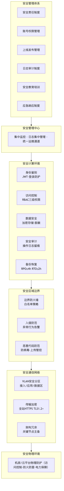

## 4.1 系统漏洞风险防控

### 4.1.1 开发阶段漏洞预防

- **安全编码规范**：强制执行输入校验、输出编码、参数化查询（MyBatis-Plus 预编译杜绝SQL拼接）、文件上传白名单校验（类型/大小/重命名存储）、反序列化限制等安全编码要求；
- **框架级防护**：Spring Security 统一认证鉴权，接口默认拒绝匿名访问；全局 XSS 过滤器对请求参数净化；CSRF 防护与同源校验；
- **依赖组件治理**：建立第三方组件清单，版本纳入配置管理；上线前执行依赖漏洞扫描，高危组件（如存在已公开CVE）强制升级或替换；
- **代码安全审计**：静态代码扫描纳入CI流水线，安全类缺陷阻断合并；核心模块（认证、支付、资格核验）人工安全评审。

### 4.1.2 运行阶段漏洞管理

- **漏洞扫描**：系统上线前及运行期定期（每季度）开展主机漏洞扫描与Web应用漏洞扫描，输出扫描报告；
- **渗透测试**：上线前配合甲方或第三方机构开展渗透测试，问题限期整改复测；
- **补丁管理**：操作系统、中间件、数据库补丁评估—测试环境验证—生产窗口期更新的三步流程，重大安全补丁48小时内完成评估；
- **漏洞响应**：收到漏洞通报（甲方、监管、CNVD等渠道）后，高危漏洞24小时内完成处置或临时缓解措施。

### 4.1.3 安全基线配置规范

我方为生产环境各组件制定安全基线，部署时逐项核对、运行期定期复查：

**操作系统基线（Linux）**：

| 基线项 | 配置要求 |
|---|---|
| 账号策略 | 禁用直接root远程登录；运维账号实名；口令复杂度与有效期策略生效 |
| 服务最小化 | 关闭无关系统服务；卸载无关软件包；仅开放业务必需端口 |
| SSH加固 | 修改默认端口、密钥登录优先、失败锁定、登录超时 |
| 审计配置 | 开启系统审计（auditd），记录特权命令与关键文件变更 |
| 内核参数 | 关闭ICMP重定向、开启SYN Cookie等防护参数 |

**中间件基线（Nginx）**：

| 基线项 | 配置要求 |
|---|---|
| 版本信息隐藏 | 关闭版本号回显（server_tokens off） |
| TLS配置 | 仅启用TLS 1.2+，禁用弱加密套件 |
| 限流防护 | 连接数限制、请求速率限制、请求体大小限制 |
| 安全响应头 | X-Frame-Options、X-Content-Type-Options、CSP等安全头统一下发 |
| 目录防护 | 禁止目录浏览；上传目录禁止执行脚本 |

**数据库基线（MySQL）**：

| 基线项 | 配置要求 |
|---|---|
| 网络访问 | 仅监听内网地址，仅授权应用服务器网段访问 |
| 账号分权 | 应用/运维/备份/只读账号分离，禁用匿名账号，应用账号无DDL权限 |
| 口令策略 | 强口令、定期更换、禁止硬编码明文（配置加密存储） |
| 日志审计 | 开启慢查询日志、错误日志；关键库表变更留痕 |
| 备份加密 | 备份文件加密存储、异机存放、权限受控 |

**缓存基线（Redis）**：

| 基线项 | 配置要求 |
|---|---|
| 访问控制 | 仅内网监听、启用密码认证、禁用危险命令（FLUSHALL/CONFIG等重命名） |
| 数据安全 | 不存储明文敏感数据；键设置合理过期时间 |

**应用基线（Spring Boot）**：

| 基线项 | 配置要求 |
|---|---|
| 配置安全 | 生产配置与代码分离，数据库口令、接口密钥加密存放 |
| 接口安全 | actuator等管理端点关闭或鉴权保护；Swagger生产环境关闭 |
| 错误处理 | 统一异常处理，生产环境不回显堆栈信息 |
| 日志安全 | 敏感字段输出统一脱敏；日志级别生产环境为INFO及以上 |

## 4.2 病毒风险防控

- **服务器侧**：生产服务器安装防病毒软件并保持病毒库自动更新，定期全盘查杀；最小化安装原则关闭无关服务与端口，禁用未授权外设与移动介质；
- **应用侧**：文件上传统一经过类型白名单校验、内容检测与重命名隔离存储，上传目录禁止执行权限，从源头阻断WebShell与带毒文件；
- **终端侧**：驻场开发终端统一安装防病毒软件，接入甲方网络前完成安全检查，遵守甲方终端管理规定；
- **传播阻断**：网络分区隔离（见4.3），关键服务器间仅开放必要端口，病毒即使侵入也难以横向扩散。

**防病毒部署矩阵**：

| 部署对象 | 防护措施 | 病毒库更新 | 查杀策略 |
|---|---|---|---|
| 应用服务器 | 服务器防病毒软件+最小化安装+端口白名单 | 每日自动更新 | 每周全盘查杀，日志留存 |
| 数据库服务器 | 防病毒软件（排除数据文件目录防误杀）+访问白名单 | 每日自动更新 | 每周全盘查杀（业务低峰执行） |
| 文件存储目录 | 上传文件类型白名单+内容检测+重命名隔离+禁执行权限 | — | 上传即检、定期复扫 |
| 驻场办公终端 | 统一防病毒软件+补丁管理+移动介质管控 | 每日自动更新 | 每周查杀+接入前检查 |

**病毒安全事件处置流程**：发现（告警/巡检）→ 隔离（受染主机断网或访问隔离）→ 查杀（专杀工具处置，无法清除则重装）→ 溯源（感染途径分析，堵住入口）→ 恢复（业务验证后恢复接入）→ 报告（2小时内向甲方报告事件与处置结果，形成事件报告归档）。全程处置动作留痕，重大病毒事件按应急预案（见第五章）升级处置。

**日常管理要求**：每周巡检核查各节点病毒库版本与查杀日志；禁止在生产服务器安装与运行无关软件；外来文件（含甲方提供的数据文件）先查毒后使用；病毒防控执行情况纳入月度安全运营报告。

## 4.3 黑客攻击风险防控

系统构建"网络边界—应用—数据"三层纵深防御体系，如下图所示：

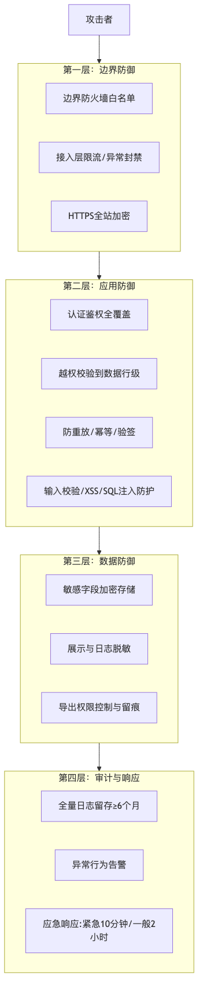

### 4.3.1 网络边界防护

- **防火墙策略**：边界防火墙白名单策略，仅开放业务必需端口（443等）；管理端口（SSH、数据库）禁止公网暴露，仅限运维专用通道访问；
- **网络分区**：按"接入区—应用区—数据区"划分安全域（VLAN隔离），数据库仅接受应用服务器网段访问；
- **DDoS与流量防护**：接入层限流（Nginx 连接数/请求速率限制），异常流量告警，必要时联动上游清洗服务；
- **传输加密**：全站 HTTPS（TLS 1.2+），证书规范管理，杜绝明文传输。

### 4.3.2 应用层攻击防护

- **认证安全**：登录失败次数限制与账户锁定、验证码机制、JWT 令牌签名校验与有效期控制、会话超时自动登出、同账号异地登录检测；
- **接口安全**：接口鉴权全覆盖（横向越权校验到数据行级）、支付/签约等敏感接口幂等与防重放（时间戳+随机数+签名）、第三方回调验签；
- **暴力破解防护**：管理端登录接口速率限制，弱口令策略强制（长度、复杂度、定期更换）；
- **入侵检测与审计**：登录日志、操作日志、接口调用日志全量留存（保存期不少于6个月），异常行为（高频失败登录、异常时段操作、批量导出）告警。

### 4.3.3 数据安全防护

- **加密存储**：身份证号等敏感字段加密存储，口令加盐哈希，密钥独立管理并定期轮换；
- **脱敏展示**：身份证、手机号在前端展示与日志输出中统一脱敏（该规范为我方生产系统既有实践）；
- **权限最小化**：数据库账号按应用/运维/备份分权，禁用超级账号跑业务；管理端数据权限按部门/角色收敛；
- **防泄漏**：批量导出功能权限单独控制并留痕；测试环境使用脱敏数据，禁止生产数据出域。

### 4.3.4 渗透测试与攻防演练

- **上线前渗透测试**：上线前委托内部安全团队按OWASP TOP 10开展渗透测试，覆盖认证绕过、越权访问、注入攻击、文件上传、逻辑漏洞（支付金额篡改、优惠券滥用）等场景，输出渗透测试报告，高危漏洞清零后方可上线；
- **运维期年度渗透测试**：每年度开展1次渗透测试复测，覆盖新增功能与历史修复项回归；
- **攻防演练配合**：积极配合甲方及监管部门组织的网络安全攻防演练（如护网行动），演练期间提高监测等级、专人值守，演练发现问题限期整改闭环；
- **安全应急演练**：每年组织不少于1次安全事件应急演练（模拟WebShell植入、数据库拖库、勒索攻击等场景），检验监测发现、隔离处置、恢复报告全流程有效性，演练报告报送甲方。

## 4.4 管理制度缺陷风险防控

建立与技术措施配套的安全管理制度体系：

| 制度 | 核心内容 |
|---|---|
| 安全责任制度 | 项目经理为安全第一责任人，岗位安全职责书面化，全员签订保密承诺书 |
| 账号权限管理制度 | 账号实名唯一、权限最小化、离岗即回收、特权账号双人管理、权限季度复核 |
| 上线发布管理制度 | 发布申请—审批—窗口期执行—验证—回滚预案，禁止未经审批的生产变更 |
| 数据管理制度 | 数据分级分类、备份与恢复演练、生产数据访问审批、导出留痕 |
| 日志审计制度 | 日志集中留存、定期审计、异常事件溯源分析 |
| 安全教育制度 | 人员进场安全培训、季度安全意识教育、钓鱼与社工防范演练 |
| 第三方管理制度 | 外部接口对接安全评估、供应商访问受控、接口密钥定期轮换 |
| 应急响应制度 | 安全事件分级、响应流程、上报机制、事后复盘（与第五章应急预案衔接） |

八项制度的执行条款如下：

### 4.4.1 安全责任制度（执行条款）

1. 项目经理为项目安全第一责任人，对项目全周期安全工作负总责；架构师兼任安全技术负责人，负责安全设计与技术措施落地；运维工程师为日常安全运行责任人；
2. 各岗位安全职责以《岗位安全职责书》书面明确，人员进场时签署确认；
3. 全体项目人员进场前签订个人保密承诺书，承诺不泄露甲方业务数据、系统资料与个人信息，保密义务在离场后持续有效；
4. 每季度开展安全责任落实情况检查，检查结果与人员考核挂钩；
5. 发生安全责任事故，按"事故原因未查清不放过、责任人未处理不放过、整改措施未落实不放过、相关人员未受教育不放过"原则处理。

### 4.4.2 账号权限管理制度（执行条款）

1. 系统账号（应用、数据库、服务器、中间件）实行实名制，一人一号，禁止共用；
2. 权限按最小必要原则授予：申请—审批—授权—记录四步流程，审批人须为该系统权限归口负责人；
3. 特权账号（数据库管理员、服务器root）实行双人管理：口令分段保管，使用须双人在场并登记《特权操作记录单》；
4. 人员离岗（离职、调岗、项目撤出）当日回收全部账号权限，运维工程师执行、项目经理复核；
5. 每季度开展权限复核：输出账号清单与权限矩阵，逐一确认"账号在用、权限匹配岗位"，冗余权限限期清理；
6. 口令策略：长度与复杂度强制要求、定期更换、禁止默认口令与弱口令，系统层面技术强制。

### 4.4.3 上线发布管理制度（执行条款）

1. 生产变更一律走发布流程：《发布申请单》（变更内容、影响范围、验证方案、回滚方案）→项目经理审批→甲方确认（重大变更）→窗口期执行；
2. 发布窗口原则上安排在业务低峰期；涉及停机的发布提前通知甲方并公告用户；
3. 发布执行采用标准化流水线（自动化部署），发布过程双人操作（一人执行、一人复核）；
4. 发布后执行验证清单（核心流程冒烟测试），验证通过方可宣布发布完成；验证不通过立即执行回滚方案；
5. 紧急缺陷修复可走紧急发布通道：口头报备即可执行，48小时内补齐发布单据；
6. 每次发布输出《版本说明》归档，全年发布记录可审计。

### 4.4.4 数据管理制度（执行条款）

1. 数据分级：按敏感程度将数据分为公开、内部、敏感、重要四级，个人身份信息、资格核验信息、支付信息列为敏感级及以上；
2. 敏感数据访问实行审批制：生产数据查询/修数/导出须提交工单，说明用途、范围、时限，审批通过后在监督下执行并全程留痕；
3. 备份策略：数据库每日全量+binlog增量备份，备份文件异机存储；每季度至少1次恢复演练并输出演练报告；
4. 数据导出：批量导出功能权限单独控制，导出记录（操作人、时间、数据范围、行数）留痕可审计；
5. 测试数据管理：测试环境一律使用脱敏数据，禁止生产数据未脱敏出域；
6. 数据销毁：存储介质报废前执行数据安全擦除；临时数据文件用后即删。

### 4.4.5 日志审计制度（执行条款）

1. 日志范围：登录日志、操作日志、接口调用日志、系统运行日志、安全设备日志全量采集；
2. 日志集中管理：各节点日志统一归集存储，保存期不少于6个月；日志文件权限受控、禁止篡改删除；
3. 定期审计：运维工程师每周开展日志抽查审计（异常登录、越权尝试、批量导出、异常时段操作），每月输出审计报告；
4. 异常处置：审计发现可疑行为立即溯源分析，确认为安全事件的按应急响应制度处置并上报甲方；
5. 日志脱敏：日志输出中的证件号、手机号等敏感字段统一脱敏，防止日志成为泄露源。

### 4.4.6 安全教育制度（执行条款）

1. 进场教育：全员进场时完成安全培训（甲方安全规定、保密要求、安全编码规范、终端安全要求），考核通过方可上岗；
2. 季度教育：每季度组织安全意识教育（近期安全事件案例、钓鱼邮件识别、口令安全、办公区安全）；
3. 专项演练：每年组织钓鱼与社会工程学防范演练，演练结果通报并针对性补课；
4. 新规宣贯：甲方安全管理规定更新时，5个工作日内完成全员宣贯签认。

### 4.4.7 第三方管理制度（执行条款）

1. 对接安全评估：新增外部接口对接前开展安全评估（认证方式、传输加密、数据范围、留痕能力），评估通过方可对接；
2. 密钥管理：与第三方交换的接口密钥、证书专人保管、加密存储，按约定周期或人员变动时轮换；
3. 访问受控：第三方人员确需访问项目环境的，须甲方批准、限定范围与时限、全程陪同与留痕；
4. 供应商变更：第三方服务变更（版本升级、协议调整）须提前评估影响并回归测试后生效。

### 4.4.8 应急响应制度（执行条款）

1. 事件分级：按影响范围与严重程度将安全事件分为重大、较大、一般三级；
2. 响应时限：紧急事件10分钟内响应，一般事件2小时内响应；
3. 处置流程：发现/接报→初步研判定级→先行止损（隔离、封禁、降级）→上报甲方→根因排查→恢复验证→事后复盘报告；
4. 上报机制：重大事件立即电话+书面双通道上报甲方安全归口部门，处置进展持续同步；
5. 复盘改进：每起事件输出复盘报告（时间线、根因、损失评估、整改项），整改项闭环跟踪（详细应急预案见第五章）。

### 4.4.9 制度执行监督与检查机制

制度的价值在于执行。我方建立"自查+互查+专项检查+外部审计"四层监督机制，确保上述八项管理制度不流于纸面：

| 检查层级 | 检查主体 | 频次 | 检查内容 | 结果处理 |
|---|---|---|---|---|
| 日常自查 | 各岗位人员 | 每日 | 本岗位制度执行情况随工作日志自查申报 | 异常事项当日上报直接负责人 |
| 交叉互查 | 项目组内互查 | 每月 | 账号权限、日志完整性、备份有效性、发布记录合规性 | 互查发现问题限期3个工作日整改 |
| 专项检查 | 项目经理+安全负责人 | 每季度 | 按制度逐条对照检查，输出《制度执行检查表》 | 检查结果纳入人员季度考核；重大偏差报公司质量部门 |
| 外部审计配合 | 甲方/第三方审计机构 | 按甲方安排 | 配合等保测评、审计检查，提供全部留痕材料 | 审计意见逐条整改并书面反馈 |

**制度执行检查表（模板摘要）**：检查表按八项制度设置检查项，每项标注"符合/基本符合/不符合"三档结论与证据索引（日志编号、审批单编号、记录表编号），检查人与被检查人双签确认。典型检查项包括：离岗人员账号是否在当日禁用、特权操作是否双人复核留痕、备份恢复演练是否按季度执行并有记录、发布是否均有审批单与回退预案、安全教育是否按计划开展并有签到记录等。

**持续改进闭环**：每季度专项检查后召开制度评审会，对检查中暴露的制度缺陷（条款缺失、职责不清、流程不顺）进行修订，修订版本报甲方备案后发布执行，形成"执行—检查—改进—再执行"的PDCA闭环。

## 4.5 等保二级安全控制措施

对照 GB/T 22239-2019 二级要求，逐层落实安全控制措施：

| 等保层面 | 主要控制措施 |
|---|---|
| 安全物理环境 | 依托甲方机房/云平台的物理访问控制、防火防水防雷、电力保障能力 |
| 安全通信网络 | 网络架构冗余、VLAN分区、通信传输加密（HTTPS/TLS） |
| 安全区域边界 | 边界防火墙访问控制、入侵防范、恶意代码防范、安全审计 |
| 安全计算环境 | 主机身份鉴别、访问控制、安全审计、入侵防范、恶意代码防范、数据完整性与保密性、数据备份恢复、剩余信息保护、个人信息保护 |
| 安全管理中心 | 集中监控、日志集中管理、统一运维通道 |
| 安全管理体系 | 4.4节八项管理制度 + 安全管理机构与人员管理 + 建设管理与运维管理流程 |

各层面逐控制点的落实措施设计如下。

### 4.5.1 安全物理环境

本项目应用部署于甲方指定机房/云平台环境，物理环境控制点主要依托甲方基础设施能力落实，我方负责核对确认并在系统定级备案与测评材料中如实呈现：

| 控制点 | 二级控制要求 | 本项目落实措施 |
|---|---|---|
| 物理访问控制 | 机房出入口有专人值守或电子门禁 | 依托甲方机房门禁体系；我方人员进入机房须甲方审批并登记 |
| 防盗窃防破坏 | 设备固定、标识管理 | 服务器设备由甲方机房统一管理，资产标识纳入配置管理库 |
| 防雷击/防火/防水防潮 | 具备防雷、灭火、防水措施 | 依托甲方机房消防、防雷与环境监控设施，进场核对确认 |
| 温湿度控制 | 温湿度在设备运行允许范围内 | 依托机房精密空调与环境监控，异常纳入监控告警 |
| 电力供应 | 稳压与备用供电 | 依托机房UPS与双路供电；系统层面配合做好异常掉电后的自动恢复与数据一致性校验 |

### 4.5.2 安全通信网络

| 控制点 | 二级控制要求 | 本项目落实措施 |
|---|---|---|
| 网络架构 | 划分网络区域、关键节点冗余 | 按"接入区—应用区—数据区"三区划分（VLAN隔离）；Nginx双节点、应用双实例避免单点 |
| 通信传输 | 采用校验/密码技术保证传输完整性 | 全站HTTPS（TLS 1.2+）；与政务核验、支付、签章等外部接口通信采用签名+加密双重保护 |
| 可信验证 | 对通信设备的系统引导与应用程序进行可信验证 | 服务器操作系统基线加固，关键程序文件完整性定期校验，异常告警 |

### 4.5.3 安全区域边界

| 控制点 | 二级控制要求 | 本项目落实措施 |
|---|---|---|
| 边界防护 | 跨边界访问经受控接口通信 | 互联网流量统一经边界防火墙+Nginx接入层进入，未授权端口一律关闭 |
| 访问控制 | 基于访问控制策略允许/拒绝数据包 | 防火墙白名单策略，规则精确到源地址、目的地址、端口与协议；策略变更走审批流程 |
| 入侵防范 | 在关键网络节点检测防御外部攻击 | 接入层限流与异常流量告警；登录接口、支付接口高频异常访问自动封禁；结合甲方边界安全设备联动 |
| 恶意代码防范 | 在关键节点对恶意代码检测清除 | 上传文件白名单校验+内容检测；服务器防病毒软件常驻查杀 |
| 安全审计 | 对重要用户行为与安全事件审计 | 边界访问日志、登录日志、操作日志全量留存不少于6个月，每周抽查审计 |

### 4.5.4 安全计算环境

安全计算环境是等保二级控制点最密集的层面，我方逐控制点落实如下：

| 控制点 | 二级控制要求 | 本项目落实措施 |
|---|---|---|
| 身份鉴别 | 身份标识唯一、鉴别信息复杂度、登录失败处理 | 账号实名唯一；口令复杂度技术强制并定期更换；登录失败次数限制与锁定；管理端会话超时自动登出 |
| 访问控制 | 账户权限分配、默认账户处理、最小权限 | RBAC角色权限模型，权限最小化；系统默认账户重命名或禁用、默认口令强制修改；离岗当日回收 |
| 安全审计 | 覆盖每个用户的安全审计、日志保护 | 登录/操作/接口日志覆盖全部用户与关键行为，记录事件时间、用户、类型、结果；日志防篡改、保存期不少于6个月 |
| 入侵防范 | 最小化安装、关闭多余端口、漏洞修补 | 操作系统与中间件最小化安装；端口最小开放；季度漏洞扫描+补丁评估更新流程（见4.1.2） |
| 恶意代码防范 | 安装防恶意代码软件并及时更新 | 服务器防病毒软件病毒库自动更新；上传目录禁止执行权限 |
| 数据完整性 | 采用校验技术保证重要数据传输/存储完整性 | 接口报文签名校验；支付/账单等资金数据落库前后勾稽校验；关键状态变更留痕 |
| 数据保密性 | 重要数据采用密码技术存储保护 | 身份证号等敏感字段加密存储、口令加盐哈希、密钥独立管理定期轮换 |
| 数据备份恢复 | 本地备份与恢复功能 | 每日全量+binlog增量备份、异机存放，每季度恢复演练（见4.4.4） |
| 剩余信息保护 | 鉴别信息与敏感数据存储空间释放前清除 | 会话注销即失效；临时文件用后即删；存储介质报废前安全擦除 |
| 个人信息保护 | 仅采集必要个人信息、访问与使用受控 | 按"最小必要"采集（详见4.6节个人信息保护专项设计） |

### 4.5.5 安全管理中心

| 控制点 | 二级控制要求 | 本项目落实措施 |
|---|---|---|
| 系统管理 | 系统管理员身份鉴别、操作审计 | 运维操作统一经堡垒通道进行，命令级审计留痕；特权操作双人在场 |
| 审计管理 | 审计记录的存储、管理与查询 | 日志集中归集存储，审计员定期查询分析，审计报告月度输出 |
| 集中管控 | 运行监控、日志集中、安全事件识别 | 监控告警体系覆盖主机、中间件、数据库、应用与业务指标；异常事件自动告警至值班人员 |

### 4.5.6 安全管理体系

等保二级对安全管理制度、管理机构、人员、建设管理、运维管理五个管理域的要求，我方对应落实如下：

| 管理域 | 二级核心要求 | 本项目落实措施 |
|---|---|---|
| 安全管理制度 | 建立日常管理活动的安全管理制度 | 4.4节八项制度全文化并执行留痕，制度年度评审修订 |
| 安全管理机构 | 明确安全管理岗位与职责 | 项目经理（安全第一责任人）+架构师（安全技术负责人）+运维（日常安全运行责任人）三级责任结构 |
| 安全管理人员 | 人员录用、离岗、教育培训管控 | 进场背景核验、保密承诺书、离岗当日权限回收、季度安全教育（见4.4.6） |
| 安全建设管理 | 定级备案、方案设计、测试验收、交付管控 | 配合甲方完成定级备案；安全设计纳入方案评审；上线前安全测试；交付物含安全配置文档 |
| 安全运维管理 | 环境/资产/介质/配置/密码/变更/备份/事件管理 | 与第五章运维体系一体化执行：资产台账、配置管理库、变更审批、备份演练、安全事件分级处置 |

我方承诺：系统建设全过程执行等保二级标准，配合甲方完成系统定级、备案、等级测评及问题整改，提供测评所需的全部技术配合，确保系统通过等级保护二级测评。

## 4.6 个人信息与密码应用专项设计

### 4.6.1 个人信息保护专项

本系统涉及公民身份信息、社保婚姻学历等政务核验信息、支付信息，属于个人信息密集型系统。我方依据《个人信息保护法》《数据安全法》要求进行专项设计：

- **最小必要采集**：仅采集业务办理所必需的个人信息字段，资格核验数据仅取核验结论所需项，不留存政务侧原始全量数据；
- **告知同意**：用户首次使用时展示隐私政策并取得同意；资格核验前由用户签署承诺书授权数据调用（对应功能明细承诺书环节）；
- **全生命周期管控**：采集（加密传输）→存储（敏感字段加密）→使用（权限最小化+脱敏展示）→共享（仅限合同签章/支付等业务必需且经签名加密）→销毁（到期清理与安全擦除）逐环节受控；
- **用户权利响应**：支持用户查询本人信息；收到甲方转办的更正、删除类诉求后按流程限期处理；
- **员工侧约束**：全员保密承诺书覆盖个人信息条款，生产数据访问审批留痕，违规访问纳入安全责任追究。

### 4.6.2 密码应用设计

参照 GB/T 39786《信息安全技术 信息系统密码应用基本要求》对本系统密码应用进行设计：

| 应用环节 | 密码技术措施 |
|---|---|
| 传输保护 | 全站TLS 1.2+加密传输；与外部平台接口报文签名（防篡改）+关键字段加密（防泄露） |
| 存储保护 | 身份证号等敏感字段对称加密存储；用户口令加盐单向哈希，不可逆存储 |
| 身份鉴别 | JWT令牌签名防伪造；第三方回调验签；管理端登录图形验证码+失败锁定 |
| 完整性保护 | 电子合同经电子签章平台加盖可靠电子签名与时间戳，确保合同不可抵赖、不可篡改 |
| 密钥管理 | 密钥与代码分离存放、专人管理、权限受控；接口密钥按周期或人员变动轮换；密钥变更留痕 |

## 4.7 安全测试与验证

为验证上述安全措施有效落地，我方在测试阶段设置安全专项测试，典型安全测试用例如下：

| 用例编号 | 测试项 | 测试要点 | 预期结果 |
|---|---|---|---|
| TC-SEC-01 | SQL注入 | 对查询、登录、搜索类接口注入常见payload | 全部拦截，无异常回显，无数据泄露 |
| TC-SEC-02 | XSS攻击 | 表单与富文本字段提交脚本代码 | 输出统一编码/过滤，脚本不执行 |
| TC-SEC-03 | 横向越权 | 用户A携带自身令牌访问用户B的合同/账单/发票数据 | 返回无权限，越权行为记入日志 |
| TC-SEC-04 | 纵向越权 | 普通账号调用管理端接口 | 鉴权拦截，返回未授权 |
| TC-SEC-05 | 暴力破解 | 管理端登录连续错误口令尝试 | 触发失败锁定与告警 |
| TC-SEC-06 | 文件上传绕过 | 上传伪装扩展名的可执行文件 | 白名单+内容检测拦截，上传目录不可执行 |
| TC-SEC-07 | 支付防重放 | 重复提交同一支付回调报文 | 幂等处理，账单不重复核销 |
| TC-SEC-08 | 敏感信息泄露 | 检查接口响应、日志、错误页中的证件号/手机号 | 统一脱敏，错误页不暴露堆栈 |
| TC-SEC-09 | 会话安全 | 令牌过期、注销后旧令牌重放 | 旧令牌全部失效拒绝 |
| TC-SEC-10 | 弱口令检测 | 对全部系统账号执行弱口令扫描 | 无弱口令、无默认口令 |

安全测试问题纳入缺陷管理流程（见3.3.4），安全类缺陷一律按严重级别处理，未清零不允许上线；上线前配合甲方或第三方机构完成渗透测试并整改复测。

## 4.8 日常安全运营

安全不是一次性建设，而是持续运营。运维期我方按"日—周—月—季—年"五个周期开展例行安全运营工作：

| 周期 | 安全运营工作项 | 输出物 |
|---|---|---|
| 每日 | 安全告警核查（异常登录、高频失败、异常流量）、备份任务结果核查 | 值班日志 |
| 每周 | 日志抽查审计、账号异动核查、防病毒查杀结果核查 | 周巡检记录 |
| 每月 | 安全审计报告、补丁评估、基线配置抽查 | 月度安全报告 |
| 每季 | 漏洞扫描、权限全量复核、安全意识教育、安全责任落实检查、备份恢复演练 | 季度扫描报告、权限复核表、恢复演练报告 |
| 每年 | 应急演练（每半年不少于1次）、制度评审修订、配合等保测评 | 演练报告、制度修订记录 |

**安全运营量化指标承诺**：

| 指标 | 承诺值 |
|---|---|
| 高危漏洞处置时限 | 24小时内处置或临时缓解 |
| 重大安全补丁评估时限 | 48小时内完成评估 |
| 安全事件响应时限 | 紧急10分钟内、一般2小时内 |
| 日志保存期 | 不少于6个月 |
| 权限复核频次 | 每季度1次，覆盖率100% |
| 漏洞扫描频次 | 每季度1次，高危项清零 |
| 恢复演练频次 | 每季度至少1次 |

## 4.9 安全事件分级与报告时限

安全事件按影响程度分四级管理，报告与处置时限刚性执行：

| 事件等级 | 判定标准 | 报告时限 | 处置要求 |
|---|---|---|---|
| 特别重大 | 大规模个人信息泄露、系统被控、资金损失 | 立即口头报告甲方，1小时内书面报告 | 立即启动应急预案，隔离止损优先，公司级资源支援，配合监管报告义务 |
| 重大 | 高危漏洞被利用、局部数据泄露风险、页面篡改 | 2小时内报告甲方 | 24小时内完成处置与加固，输出事件报告 |
| 较大 | 高危漏洞发现（未被利用）、异常攻击流量 | 当日报告 | 24小时内完成高危漏洞处置；攻击源封禁与策略加固 |
| 一般 | 中低危漏洞、少量异常登录尝试 | 纳入周报 | 中危30天内修复，低危纳入迭代；持续监测 |

每起较大及以上安全事件执行"处置—根因—整改—复盘"闭环：处置完成后5个工作日内提交事件复盘报告（时间线、根因、损失评估、整改项与完成时限），整改项跟踪至闭环并在月度安全报告中呈现。

上述指标纳入月度安全报告向甲方呈报，接受甲方监督考核。通过"技术防控措施 + 八项管理制度 + 等保逐控制点落实 + 常态化安全运营"四位一体的安全解决方案，实现对系统漏洞、病毒、黑客攻击、管理制度缺陷四类风险的闭环管控。

# 第五章 系统运维管理

系统上线后，我方提供**自最终验收合格之日起为期6年的免费运维服务**，建立"制度化、工具化、指标化"的运维管理体系。运维故障处置流程如下图所示：

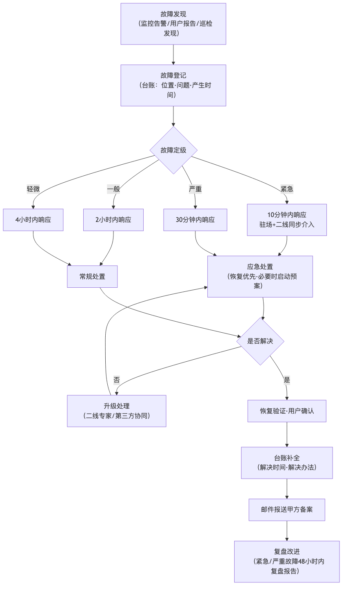

## 5.1 系统部署升级

- **标准化部署**：部署过程脚本化、文档化（部署手册随源代码交付），应用进程守护托管，故障自动拉起、开机自启；
- **发布管理**：版本升级执行"发布申请—甲方审批—低峰窗口发布—验证—公告"流程；采用可回滚发布策略，升级失败5分钟内回退上一版本；
- **灰度与回归**：重要功能升级先在测试环境完成全量回归，生产发布后执行冒烟验证清单；
- **升级留痕**：每次升级输出版本说明与升级记录，纳入运维台账。

### 5.1.1 发布流程细化

| 步骤 | 工作内容 | 责任人 | 控制要求 |
|---|---|---|---|
| 1. 发布申请 | 填写《发布申请单》：版本号、变更内容、影响范围、验证方案、回滚方案、计划窗口 | 开发负责人 | 无回滚方案不受理 |
| 2. 发布评审 | 项目经理评审变更风险；重大变更报甲方确认 | 项目经理 | 涉及数据结构变更、停机、资金链路的一律报甲方 |
| 3. 发布准备 | 版本打包（CI流水线出包）、数据库变更脚本评审、备份确认 | 运维工程师 | 发布前完成数据库全量备份 |
| 4. 窗口执行 | 低峰窗口执行发布，双人操作（一人执行、一人复核） | 运维+开发 | 停机发布提前公告用户 |
| 5. 发布验证 | 执行冒烟验证清单：登录、选房、缴费、合同查看、管理端核心页面 | 测试/运维 | 任一项不通过立即回滚 |
| 6. 发布公告 | 通知甲方发布完成，输出《版本说明》归档 | 项目经理 | 记录纳入运维台账 |

### 5.1.2 发布验证清单（模板）

| 验证项 | 验证内容 | 结果 |
|---|---|---|
| 服务状态 | 全部应用实例健康检查通过 | □通过 □不通过 |
| 用户端核心链路 | 登录→首页→项目列表→房源详情打开正常 | □通过 □不通过 |
| 交易链路 | 账单查询、支付下单（沙箱/小额验证）正常 | □通过 □不通过 |
| 管理端核心页面 | 看板、房源管理、合同管理打开与查询正常 | □通过 □不通过 |
| 外部接口 | 郑好办登录、支付、签章接口连通性探测正常 | □通过 □不通过 |
| 日志与告警 | 无新增ERROR级异常刷屏，监控无告警 | □通过 □不通过 |

## 5.2 运维制度

建立驻场运维制度体系，六项制度执行条款如下：

### 5.2.1 值班制度

1. 工作日驻场值守：驻场运维人员按甲方考勤要求现场办公，负责当日监控值守、工单响应与例行维护；
2. 非工作时间7×24小时远程响应：设置值班电话，告警自动推送值班人员；紧急故障远程处置，必要时1小时内赶赴现场；
3. 值班表每月编制并报甲方备案，调班须经项目经理批准并同步甲方；
4. 值班期间发生的事件、处置过程记入值班日志，次日晨会通报。

### 5.2.2 巡检制度

1. 日巡检：每工作日上午完成一轮标准巡检（详见5.7），填写《日巡检记录表》；
2. 周深度巡检：每周对性能趋势、慢查询、磁盘增长、证书有效期做深度检查，输出周报送；
3. 巡检发现异常按故障管理流程登记处置，重大隐患当日报甲方；
4. 巡检记录保存期与项目运维期一致，接受甲方抽查。

### 5.2.3 故障管理制度

1. 故障分级：按5.4节四级标准（紧急/严重/一般/轻微）定级，定级有争议时按高一级处理；
2. 响应与处置：紧急10分钟内响应、一般2小时内响应；处置优先恢复业务，再查根因；
3. 台账管理：全部故障录入《故障处理记录台账》（位置、问题、产生时间、解决时间、解决办法），邮件报送甲方备案；
4. 复盘改进：紧急与严重故障48小时内输出复盘报告，改进项闭环跟踪；
5. 升级机制：处置超时或影响扩大时，逐级升级至项目经理、公司二线专家团队。

### 5.2.4 备份制度

1. 每日自动备份（策略见5.11），备份结果纳入日巡检必查项；
2. 备份失败当日补备并排查原因；连续失败按严重故障处理；
3. 每季度恢复演练1次，演练报告报甲方；
4. 备份文件访问权限受控，加密存放，禁止擅自外拷。

### 5.2.5 报送制度

1. 周报送：每周输出运维工作报送（本周工作、故障与处置、下周计划）；
2. 月度运维报告：每月末前2个工作日邮件报送甲方备案，内容包括运维工作总结、故障统计分析、指标达成情况、容量与风险提示、运维建议；
3. 即时报送：紧急故障、安全事件在响应的同时立即电话+书面报甲方；
4. 报送材料统一归档，作为考核与审计依据。

### 5.2.6 交接班制度

1. 值班交接采用书面交接：未决事项、在途工单、注意事项逐项列明，接班人签字确认；
2. 人员轮换（休假、调整）时执行工作交接清单，项目经理复核；
3. 交接期间发生的事件责任界定以交接记录为准，避免"三不管"空档。

## 5.3 运维技术工具

| 工具类别 | 用途 |
|---|---|
| 服务器监控 | CPU/内存/磁盘/网络实时监控与阈值告警 |
| 应用监控 | 服务存活探测、接口响应时间、错误率统计、JVM 状态监控 |
| 数据库监控 | 慢查询分析、连接数监控、主从同步状态监控 |
| 日志平台 | 应用日志集中收集、检索、异常关键字告警 |
| 进程守护 | 应用进程托管，异常退出自动拉起 |
| 备份工具 | 数据库自动备份脚本、备份完整性校验 |
| 告警通道 | 告警信息推送值班人员（短信/即时通讯），分级升级通知 |

### 5.3.1 监控指标与告警阈值

监控体系覆盖"基础设施—中间件—应用—业务"四层，分层监控体系如下图所示：

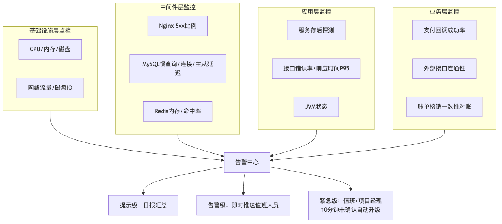

主要指标与告警阈值设定如下：

| 监控层 | 监控指标 | 告警阈值（示例基线，运行期按实际调优） |
|---|---|---|
| 服务器 | CPU使用率 | 持续5分钟>80%告警，>90%紧急告警 |
| 服务器 | 内存使用率 | 持续5分钟>85%告警 |
| 服务器 | 磁盘使用率 | >80%告警，>90%紧急告警并触发清理预案 |
| 服务器 | 磁盘IO/网络流量 | 突增超基线3倍告警 |
| 中间件 | Nginx 5xx比例 | 5分钟内>1%告警 |
| 数据库 | 慢查询数 | 单小时新增慢查询>10条告警 |
| 数据库 | 连接数 | >最大连接数80%告警 |
| 数据库 | 主从延迟 | >30秒告警 |
| 缓存 | Redis内存/命中率 | 内存>80%、命中率<90%告警 |
| 应用 | 服务存活 | 健康检查连续3次失败紧急告警并自动拉起 |
| 应用 | 接口错误率 | 5分钟错误率>1%告警 |
| 应用 | 接口响应时间 | P95>2秒告警 |
| 业务 | 支付回调成功率 | 5分钟成功率<95%紧急告警 |
| 业务 | 外部接口连通性 | 郑好办/核验/签章探测失败即告警 |
| 业务 | 账单核销一致性 | 日终对账不平即告警并触发对账处理流程 |

告警分三级推送：提示级（记录+日报汇总）、告警级（即时推送值班人员）、紧急级（推送值班人员+项目经理，10分钟未确认自动升级）。

## 5.4 服务响应

严格执行招标文件规定的故障响应时限，并提供多渠道7×24小时响应服务：

| 故障等级 | 定义 | 响应时间 | 解决目标 |
|---|---|---|---|
| 紧急 | 系统整体不可用、支付故障、数据安全事件 | **10分钟** | 2小时内恢复或提供应急方案 |
| 严重 | 核心业务功能不可用、性能严重下降 | 30分钟 | 4小时内解决 |
| 一般 | 非核心功能异常、页面显示问题 | **2小时** | 1个工作日内解决 |
| 轻微 | 使用咨询、优化建议 | 4小时 | 按周版本安排处理 |

响应渠道：驻场现场响应 + 热线电话 + 网络支持 + 邮件报送。故障处理完成后填写故障处理记录台账（位置、问题、产生时间、解决时间、解决办法），邮件报送甲方备案。

### 5.4.1 工单处理流程

全部服务请求（故障申报、使用咨询、数据维护、优化建议）统一纳入工单管理：

| 环节 | 处理动作 | 时限要求 |
|---|---|---|
| 受理 | 接报即建单：记录报告人、渠道、现象描述、发生时间 | 紧急10分钟内、一般2小时内确认受理 |
| 定级 | 按故障四级标准定级，通知相关责任人 | 受理时同步完成 |
| 处置 | 优先恢复业务；需开发修复的转缺陷流程；需数据维护的走数据审批 | 按各级解决目标执行 |
| 验证 | 处置完成后向报告人确认恢复，必要时测试复验 | 处置完成当日 |
| 关单 | 填写解决办法与耗时，报告人确认后关单 | 验证通过后 |
| 回访 | 紧急/严重工单一周内回访，确认无复发 | 关单后7日内 |

### 5.4.2 故障处理记录台账（模板）

| 字段 | 填写说明 |
|---|---|
| 工单编号 | 按"GD-年月日-序号"编号 |
| 故障位置 | 系统/模块/服务器节点 |
| 故障问题 | 现象描述与影响范围（影响用户数、影响业务） |
| 故障等级 | 紧急/严重/一般/轻微 |
| 产生时间 | 故障发生（或发现）时间，精确到分钟 |
| 响应时间 | 我方响应时间（用于响应时限考核） |
| 解决时间 | 业务恢复时间 |
| 解决办法 | 处置措施、根因、后续改进项 |
| 处理人/复核人 | 处置责任人与复核人签字 |

台账按月汇总统计（故障数量、等级分布、响应达标率、解决达标率），纳入月度运维报告报送甲方。

### 5.4.3 服务级别协议（SLA）矩阵

| 故障等级 | 判定标准 | 响应时限 | 恢复目标 | 通报要求 |
|---|---|---|---|---|
| 紧急 | 系统整体不可用、资金类功能异常、数据丢失风险、安全事件 | 10分钟内 | 2小时内恢复业务（或启用降级） | 立即电话通报甲方，处置期间每30分钟通报进展 |
| 严重 | 核心业务流程受阻（选房/签约/缴费不可用）、大面积用户受影响 | 30分钟内 | 4小时内恢复 | 1小时内通报甲方，每2小时通报进展 |
| 一般 | 单一功能异常、少量用户受影响、有替代操作路径 | 2小时内 | 1个工作日内解决 | 当日通报，纳入周报 |
| 轻微 | 界面显示问题、优化建议类 | 4小时内 | 按迭代计划安排 | 纳入周报 |

### 5.4.4 问题升级路径

| 升级层级 | 触发条件 | 责任人 | 动作 |
|---|---|---|---|
| 一线（驻场） | 全部工单首接 | 驻场运维人员 | 10分钟内响应，30分钟内初步定位，可解决的直接闭环 |
| 二线（远程专家） | 一线30分钟内无法定位或超出权限 | 后端/DBA/安全专家（7×24远程） | 15分钟内接手，远程或到场处置 |
| 三线（原厂/公司级） | 涉及第三方服务商或需公司资源 | 项目经理协调 | 协调第三方处置；公司层面调派资源 |
| 管理升级 | 紧急故障超2小时未恢复或重大安全事件 | 公司分管领导 | 与甲方领导层面会商，启动重大事件应急机制 |

## 5.5 运维范围

- **应用运维**：房屋管理系统四端应用的运行保障、缺陷修复、参数配置调整、小型功能优化；
- **数据运维**：数据库性能优化、数据备份恢复、报表数据核对、按甲方审批的数据维护；
- **接口运维**：郑好办、政务核验、支付、签章、人脸、地图、监控等8类外部接口的连通性监控与异常协调处置；
- **基础运维**：应用服务器、中间件、缓存的日常维护（配合甲方基础设施团队）；
- **基础信息维护**：组织、人员、设备等基础信息维护，保障系统数据及时有效；
- **用户支持**：管理端用户常态化培训、使用答疑、操作指导，先于用户发现问题、解决问题。

## 5.6 指标考核

我方接受甲方按下列指标对运维服务进行月度考核：

| 考核指标 | 目标值 |
|---|---|
| 系统年可用率 | ≥99.5% |
| 紧急故障10分钟响应达成率 | 100% |
| 一般故障2小时响应达成率 | 100% |
| 故障按时解决率 | ≥95% |
| 数据备份成功率 | 100% |
| 月度运维报告按时报送率 | 100% |
| 驻场人员考勤合格率 | 满足甲方考勤要求 |
| 用户满意度 | ≥90% |

考核结果与驻场人员绩效挂钩；连续不达标时无条件更换驻场人员并提交整改报告。

**月度考核评分细则（示例，最终以甲方考核办法为准）**：

| 考核项 | 分值 | 扣分标准 |
|---|---|---|
| 故障响应及时性 | 20分 | 紧急故障响应超时1次扣5分；一般故障响应超时1次扣2分 |
| 故障解决质量 | 20分 | 超时解决1次扣3分；同一根因故障当月重复发生扣5分 |
| 巡检与备份执行 | 15分 | 漏巡检1次扣2分；备份失败未当日补备1次扣5分 |
| 报告报送 | 10分 | 周报/月报迟报1次扣2分，漏报1次扣5分 |
| 驻场考勤 | 15分 | 按甲方考勤规定执行，无故缺勤1次扣5分 |
| 培训与支持 | 10分 | 培训计划未按期执行1次扣3分；用户投诉核实1次扣2分 |
| 主动改进 | 10分 | 无当月改进项不得分；预防性发现并消除隐患酌情加分 |

月度得分低于80分为不合格，我方提交书面整改报告；连续两个月不合格无条件更换驻场人员。

## 5.7 日常维护

- **日巡检**：每工作日检查服务器资源、应用状态、接口连通性、备份结果、错误日志，填写巡检记录表；
- **周维护**：慢查询分析、磁盘清理、日志归档、证书与密钥有效期检查，输出周运维报送；
- **月维护**：性能趋势分析、容量评估、安全补丁评估、权限复核，编制月度运维报告（运维工作总结、问题统计与分析、运维建议）；
- **报表维护**：配合甲方财务口径核对收款台账等关键报表数据。

### 5.7.0 周维护与月维护检查清单

| 频次 | 检查项 | 完成标准 |
|---|---|---|
| 每周 | 慢查询日志分析 | TOP10慢SQL识别，优化项登记 |
| 每周 | 磁盘空间与日志归档 | 各节点磁盘使用率＜70%，过期日志按策略归档 |
| 每周 | 证书/密钥有效期检查 | 距到期＞30天；不足则启动更换流程 |
| 每周 | 备份文件抽样校验 | 抽取1份备份验证可读性与完整性 |
| 每周 | 接口连通性专项 | 8类外部接口全部连通，异常项协调处置 |
| 每月 | 性能趋势分析 | 响应时间、TPS、资源占用月度曲线与同比 |
| 每月 | 容量评估 | 五类容量维度水位与预测（见5.9） |
| 每月 | 安全补丁评估 | 操作系统/中间件/依赖库补丁清单与升级计划 |
| 每月 | 权限复核 | 管理端账号与权限清单核对，清理冗余账号 |
| 每月 | 数据一致性核查 | 账单-支付-合同-房源状态一致性脚本核查 |

### 5.7.1 日巡检记录表（模板）

| 巡检类别 | 巡检项 | 正常标准 | 巡检结果 |
|---|---|---|---|
| 服务器 | CPU/内存/磁盘使用率 | 低于告警阈值 | □正常 □异常 |
| 服务器 | 系统时间同步、关键进程 | NTP同步、进程齐全 | □正常 □异常 |
| 应用 | 各应用实例健康状态 | 全部健康检查通过 | □正常 □异常 |
| 应用 | 前一日ERROR日志 | 无未处置的新增异常 | □正常 □异常 |
| 数据库 | 主从同步、连接数、慢查询 | 延迟<30秒、无堆积 | □正常 □异常 |
| 缓存 | Redis内存、命中率 | 低于告警阈值 | □正常 □异常 |
| 接口 | 外部接口连通性探测 | 郑好办/核验/支付/签章/地图全部可达 | □正常 □异常 |
| 备份 | 前一日备份任务结果 | 全部成功且完整性校验通过 | □正常 □异常 |
| 业务 | 日终对账结果 | 支付流水与账单核销一致 | □正常 □异常 |
| 证书 | HTTPS证书/接口密钥有效期 | 距到期>30天 | □正常 □异常 |

巡检人签字：＿＿＿　巡检日期：＿＿＿　异常项处置说明：＿＿＿

## 5.8 故障应急处置

制定分场景应急预案并定期演练（每半年不少于1次）：

| 场景 | 应急措施 |
|---|---|
| 应用服务宕机 | 进程自动拉起；无效则备节点接管，10分钟内恢复访问 |
| 数据库故障 | 主从切换预案；数据损坏时按备份恢复（RPO≤4小时，RTO≤2小时） |
| 支付渠道异常 | 启用支付降级提示，交易对账兜底，与渠道方联动排查 |
| 外部接口中断 | 资格核验自动降级人工审核；接口恢复后数据补偿 |
| 安全事件 | 立即隔离受影响节点、留存证据、上报甲方，按应急响应制度处置 |
| 高峰拥塞 | 集中配租等高峰前扩容预案、限流保护核心交易链路 |

典型场景的处置步骤卡如下，值班人员按卡执行、逐步打钩，避免紧急状态下的处置遗漏：

### 5.8.1 场景一：应用服务宕机处置卡

1. 【0-2分钟】确认告警真实性（健康检查、页面访问验证），排除误报；
2. 【2-5分钟】检查进程守护是否已自动拉起；已拉起则观察稳定性并进入根因排查；
3. 【5-10分钟】未自动恢复的，切换流量至备用节点，恢复对外服务；
4. 【恢复后】提取宕机时段日志（OOM、异常堆栈、资源曲线）定位根因；
5. 【当日】向甲方通报，48小时内输出复盘报告。

### 5.8.2 场景二：数据库故障处置卡

1. 【0-5分钟】确认故障类型：连接不可用/主从异常/数据损坏；
2. 【5-15分钟】连接类故障：重启实例或清理异常会话；主库不可用：执行主从切换预案，应用切换数据源；
3. 【数据损坏】立即停止写入，评估损坏范围，按"最近全量备份+binlog回放"恢复至故障前状态（RPO≤4小时、RTO≤2小时）；
4. 【恢复后】执行数据一致性核对脚本（账单、合同、房源状态勾稽），输出核对结果；
5. 【当日】向甲方通报，复盘并加固（如慢SQL治理、容量扩容）。

### 5.8.3 场景三：支付渠道异常处置卡

1. 【0-10分钟】监控确认支付回调成功率异常，区分我方故障与渠道方故障（渠道探测+我方日志）；
2. 【10-30分钟】我方故障立即修复回滚；渠道方故障启用前端降级提示（"支付渠道维护中"），同时联系渠道方技术；
3. 【处置中】对"用户已扣款、账单未核销"的在途交易挂起处理，禁止重复支付；
4. 【恢复后】执行专项对账：拉取渠道对账数据与我方支付单逐笔核对，差异交易按对账处理流程补单/退款；
5. 【当日】资金相关异常无论大小一律书面报甲方。

### 5.8.4 场景四：政务核验接口中断处置卡

1. 【0-10分钟】接口探测确认中断范围（单接口/全部），联系数据源侧确认；
2. 【10-30分钟】启用降级策略：资格核验切换"缓存结果 + 人工审核"模式，用户端提示"核验结果以人工复核为准"，业务不中断；
3. 【中断期间】记录降级期间产生的待复核清单；
4. 【恢复后】对降级期间数据批量重新核验，差异项转人工处置；
5. 【复盘】评估中断时长与影响面，必要时与数据源方完善联络与容错机制。

应急处置全程记录，事后48小时内输出故障复盘报告（原因、影响、处置过程、改进措施）。

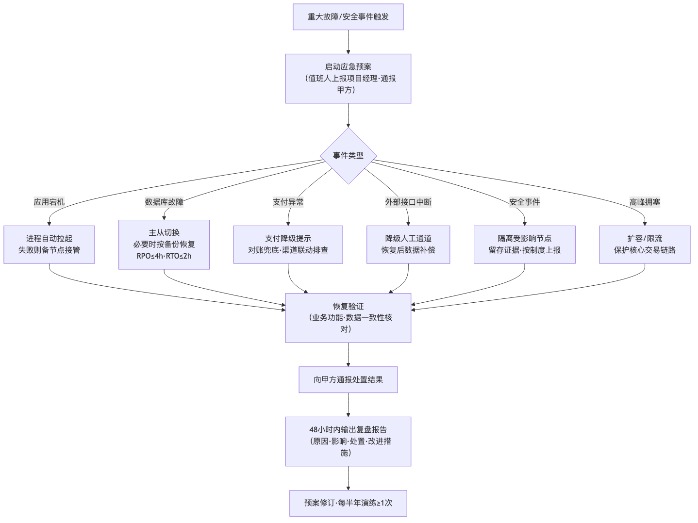

## 5.9 系统及软件运行保障

- **容量保障**：定期容量评估（存储增长、并发趋势），提前扩容预警；
- **性能保障**：慢接口与慢SQL持续治理，热点数据缓存优化，高峰场景压测验证；
- **可用性保障**：关键组件冗余部署，健康检查与自动故障转移；
- **数据质量保障**：账单、合同、房源状态一致性定期核查脚本化，异常数据及时修复并溯源；
- **证书与依赖保障**：HTTPS证书、接口密钥、第三方SDK有效期台账化管理，到期前30天预警更换。

**容量管理细则**：每月对以下容量维度进行评估并在月度报告中呈现趋势与预测：

| 容量维度 | 监控项 | 扩容预警线 | 扩容措施 |
|---|---|---|---|
| 数据库存储 | 数据文件大小、单表行数、增长速率 | 磁盘使用率70% | 提前申请扩容；大表按年归档 |
| 附件存储 | 合同PDF/图片/VR文件占用 | 磁盘使用率70% | 扩容+冷数据分层存储 |
| 应用容量 | 高峰并发、线程池/连接池水位 | 高峰水位持续＞70% | 横向扩实例、参数调优 |
| 缓存容量 | Redis内存使用、键数量 | 内存使用率70% | 过期策略优化、扩内存 |
| 日志容量 | 日志增长速率 | 磁盘使用率70% | 归档压缩，保留策略执行（在线≥6个月） |

**性能优化机制**：每月输出慢SQL TOP10与慢接口TOP10治理清单，逐项优化并在次月报告复核效果；每年结合业务增长（新增项目、房源、配租批次）开展1次全链路压测，验证系统承载能力并输出容量规划建议。

## 5.10 运维人员配置

免费运维期内配备驻场运维人员（人数满足招标要求），驻场人员具备：

1. **3年以上系统运维及管理工作经验**；
2. 良好的分析解决问题能力，能独立承担任务并具备系统进度把控能力；
3. 良好的沟通能力，能够协调内外场资源，及时获得二线技术支持；
4. 良好的服务意识，主动提供培训指导，先于用户发现并解决问题。

驻场人员在法定工作日遵守甲方考勤要求并接受甲方月度考勤考核；驻场时间与免费运维期一致（自初步验收合格之日起至免费运维期届满）。工作内容涵盖：用户常态化培训、基础信息维护、软硬件日常巡检、巡检与故障报表编制、甲方安排的其他项目相关工作。公司二线（架构、DBA、安全专家）提供7×24小时远程支撑。

**驻场人员一日标准工作流程**：为保证驻场服务的规范性与可考核性，我方为驻场人员制定一日标准工作流程，形成"晨检—值守—巡检—记录—日结"的闭环工作节奏：

| 时段 | 工作事项 | 工作内容与输出 |
|---|---|---|
| 08:30—09:00 | 晨检 | 到岗签到；检查监控大盘（服务存活、CPU/内存/磁盘、昨夜告警）；核对昨夜定时任务执行结果（账单生成、对账、备份）；异常事项第一时间处置或上报 |
| 09:00—09:30 | 晨会与工单梳理 | 查阅未闭环工单与昨日遗留问题，排定当日处理优先级；参加甲方晨会（如有）并同步系统运行情况 |
| 09:30—12:00 | 上午值守 | 处理用户咨询与工单；执行业务操作协助（配租批次、账单核对、数据导出等）；响应突发事件（紧急10分钟内响应） |
| 12:00—13:00 | 午间轮值 | 保持通讯畅通，紧急事件即时响应 |
| 13:00—15:00 | 下午值守 | 继续处理工单；开展用户操作辅导与常态化培训（按培训计划） |
| 15:00—16:00 | 例行巡检 | 按日巡检表逐项巡检（应用、数据库、中间件、备份、安全日志），填写日巡检记录表 |
| 16:00—17:00 | 问题跟进 | 跟进升级到二线的问题处理进度；复核当日已闭环工单的用户满意度回访 |
| 17:00—17:30 | 日结报送 | 编制运维日报（运行状态、工单统计、异常事项、次日计划）报送甲方；工单系统台账更新；交接班记录（如有轮换） |

日流程执行情况纳入驻场人员月度考核；甲方临时安排的工作事项优先插入执行并在日报中如实记录。

### 5.10.1 用户常态化培训计划

运维期内由驻场人员承担管理端用户的常态化培训与使用支持：

| 培训类型 | 对象 | 频次 | 内容 |
|---|---|---|---|
| 上线集中培训 | 全体管理端用户 | 上线前1轮+上线后1轮 | 系统全功能操作、常见问题、应急联系方式 |
| 新员工培训 | 甲方新入职/转岗人员 | 按需（接到通知5个工作日内安排） | 岗位相关模块操作培训 |
| 版本更新培训 | 相关模块用户 | 每次功能升级后 | 新功能操作说明+操作手册更新 |
| 专项强化培训 | 高频咨询模块用户 | 每季度评估安排 | 依据工单咨询统计，针对高频问题模块强化培训 |
| 应急演练培训 | 甲方运维对接人 | 每半年随应急演练 | 故障上报流程、应急预案配合要点 |

每次培训输出培训记录（时间、对象、内容、签到），培训材料（操作手册、视频、FAQ）沉淀至知识库供用户随时查阅。

### 5.10.2 运维知识库

建立项目运维知识库并持续维护，作为运维质量与人员交接的基础：

- **运维手册类**：部署手册、参数配置手册、监控告警手册、备份恢复手册；
- **故障案例类**：历史故障台账、根因分析、处置办法，形成"同类故障5分钟定位"的案例索引；
- **业务知识类**：业务流程说明、账务口径说明、常见业务咨询FAQ；
- **对接资料类**：外部接口联系人、接口文档版本、密钥证书台账（脱敏管理）；
- 知识库每月更新，人员交接以知识库为基线，甲方可随时查阅。

## 5.11 数据备份

- **备份策略**：数据库每日凌晨全量备份+日间增量备份；附件文件（合同PDF、VR文件、图片）每日增量同步备份；备份文件异机/异地存放；
- **保留策略**：日备份保留30天、月备份保留12个月、年度归档长期保留；
- **恢复演练**：每季度执行1次备份恢复演练，验证备份可用性，输出演练报告；
- **恢复指标**：RPO≤4小时、RTO≤2小时；
- **备份监控**：备份任务纳入监控告警，失败立即处置补备，备份成功率考核目标100%。

备份恢复体系总体设计如下图所示：

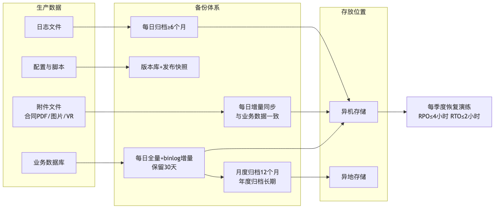

### 5.11.1 备份策略明细表

| 备份对象 | 备份方式 | 频次 | 保留期 | 存放位置 |
|---|---|---|---|---|
| 业务数据库 | 全量备份（mysqldump/物理备份） | 每日凌晨1次 | 30天 | 异机存储 |
| 业务数据库 | binlog增量 | 实时落盘，每4小时归集 | 30天 | 异机存储 |
| 业务数据库 | 月度全量归档 | 每月1日 | 12个月 | 异机+异地 |
| 附件文件（合同/图片/VR） | 增量同步 | 每日 | 与业务数据一致 | 异机存储 |
| 应用配置与部署脚本 | 版本库管理+发布快照 | 每次变更 | 全程保留 | 代码仓库 |
| 日志文件 | 归档压缩 | 每日归档 | 不少于6个月 | 日志平台/归档存储 |

### 5.11.2 恢复演练方案

1. 演练环境：使用独立恢复演练环境，不影响生产；
2. 演练内容：随机抽取一份全量备份+对应binlog，恢复至指定时间点，核对关键表数据量与抽样记录一致性；
3. 演练指标：记录恢复耗时，验证满足RTO≤2小时；核对恢复点，验证满足RPO≤4小时；
4. 演练输出：《恢复演练报告》（演练时间、备份集、恢复步骤、耗时、核对结果、问题与改进）报甲方备案；
5. 演练不达标时：一周内完成备份方案整改并复测。

## 5.12 运维服务持续改进

- **月度服务回顾**：每月与甲方召开运维服务回顾会，通报指标达成、故障复盘、下月计划，收集甲方意见；
- **问题趋势治理**：对重复发生的同类工单专项治理（根因消缺而非反复救火），月度报告呈现同比趋势；
- **满意度调查**：每半年开展用户满意度调查（目标≥90%），低分项制定改进计划并跟踪闭环；
- **服务标准演进**：随业务发展（如新增配租批次、政策调整）主动评估系统适配性，提前提出优化建议供甲方决策；
- **年度服务报告**：每个运维年度输出年度服务总结报告，全面回顾可用率、故障、变更、演练、培训情况，作为次年服务优化依据。

## 5.13 运维报告体系

运维期各类报告的内容要素、报送频次与报送对象约定如下：

| 报告类型 | 报送频次 | 内容要素 | 报送对象 |
|---|---|---|---|
| 日巡检记录 | 每工作日 | 巡检项结果、异常项与处置 | 甲方运维对口人（异常时） |
| 周运维报送 | 每周 | 本周工单统计、故障处置、变更记录、下周计划 | 甲方运维对口人 |
| 月度运维报告 | 每月末前2个工作日 | 指标达成（可用率/响应达标率/备份成功率）、故障台账汇总、容量趋势、慢SQL/慢接口治理、安全运营、改进项 | 甲方项目主管部门 |
| 季度演练报告 | 每季度 | 备份恢复演练过程、结果、发现问题与整改 | 甲方项目主管部门 |
| 年度服务总结 | 每运维年度 | 全年可用率、故障、变更、演练、培训、满意度回顾与次年计划 | 甲方项目主管部门 |
| 事件专报 | 重大故障/安全事件后 | 事件经过、影响评估、根因分析、整改措施 | 甲方项目主管部门（重大事件2小时内先行口头通报） |

所有报告采用固定模板编制，电子版存入甲方指定位置，纸质版按需提供；报告数据均来自监控系统与工单台账，可追溯、可核验。

通过以上"制度—工具—指标—模板—改进"五位一体的运维管理体系，我方确保6年免费运维期内系统持续稳定运行、服务质量可量化、可考核、可追溯。

## 5.14 运维服务期满移交方案

6年免费运维期届满前3个月，我方主动启动服务移交程序，确保服务无缝衔接、甲方权益不受损：

| 移交阶段 | 时间节点 | 移交内容 | 交付形式 |
|---|---|---|---|
| 移交准备 | 期满前3个月 | 编制《运维移交方案》报甲方审定；梳理全部移交清单 | 移交方案文档 |
| 资料移交 | 期满前2个月 | 全部源代码（最终版）、数据库设计文档、部署手册、运维手册、操作手册、接口文档、知识库全量导出 | 电子档案+清单签收 |
| 环境移交 | 期满前1个月 | 服务器账号、数据库账号、中间件配置、证书密钥、域名解析、监控配置的权限交接与密钥轮换 | 账号交接单双签 |
| 技术移交 | 期满前1个月 | 面向甲方或接续服务方的技术交底培训（架构讲解、常见故障处理、发布流程实操），不少于3场 | 培训记录+考核确认 |
| 并行支持 | 期满后1个月 | 提供1个月的免费咨询过渡支持（远程答疑），协助接续方独立运行 | 咨询记录 |

**移交承诺**：移交内容以双方签署的《移交确认单》为准逐项核销；移交完成后我方按数据管理制度删除所持有的甲方业务数据并出具书面承诺；若甲方选择续签运维服务，我方承诺以不高于市场公允价格优先提供接续服务。

# 第六章 服务期限保证

## 6.1 服务期限总体承诺

我方郑重承诺严格履行招标文件规定的服务期限要求：

| 期限项 | 承诺 |
|---|---|
| 开发期 | **60日历天**（自收到甲方书面开工通知之日起计算，24小时内书面确认开工） |
| 研发服务人月数 | **不少于37人月**；如未完成合同规定成果，自行承担费用继续安排人员直至交付 |
| 软件免费运维期 | **6年**（自最终验收合格之日起计算） |
| 驻场时间 | 与免费运维期一致（自初步验收合格之日起至免费运维期届满） |
| 服务期限 | 自合同签订生效之日起至运维服务期结束 |

**服务期限承诺汇总表**：为便于评审核对，现将本项目全部期限类承诺汇总如下，我方承诺以下各项均写入合同并接受违约条款约束：

| 承诺事项 | 承诺指标 | 对应依据 |
|---|---|---|
| 定制化开发交付 | 合同签订后60日历天内完成开发、部署并具备上线条件 | 招标文件服务期限要求 |
| 人力投入 | 不少于37人月的开发实施人力投入 | 招标文件人力要求 |
| 免费运维期 | 初步验收合格之日起6年免费运维 | 招标文件运维要求 |
| 紧急故障响应 | 10分钟内响应 | 招标文件服务响应要求 |
| 一般问题响应 | 2小时内响应 | 招标文件服务响应要求 |
| 日志留存 | 系统日志留存不少于6个月 | 等保及审计要求 |
| 数据恢复点目标 | RPO≤4小时 | 备份策略承诺 |
| 数据恢复时间目标 | RTO≤2小时 | 备份策略承诺 |
| 恢复演练 | 每季度至少1次备份恢复演练 | 运维制度承诺 |
| 高危漏洞修复 | 24小时内完成修复或有效缓解 | 安全运营承诺 |
| 驻场服务 | 免费运维期内驻场人员服务，遵守甲方考勤 | 运维人员配置承诺 |

## 6.2 项目总体进度计划

以60日历天开发期为约束，项目总体进度计划如下图所示：

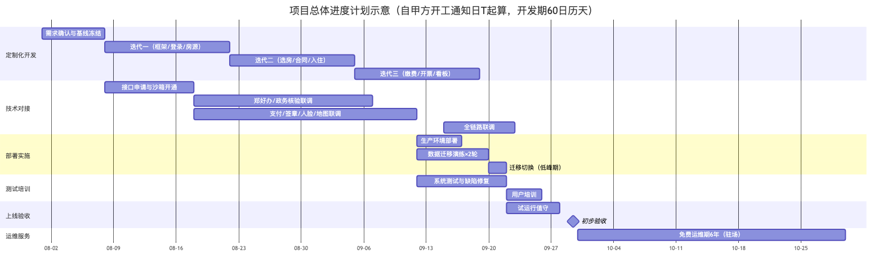

各阶段期限计划明细：

| 阶段 | 时间窗口 | 关键工作 | 里程碑交付物 |
|---|---|---|---|
| 定制化开发-需求确认 | 第1-7天 | 需求宣讲、原型确认、需求基线冻结 | 需求规格说明书（甲方签认） |
| 定制化开发-迭代一 | 第8-21天 | 框架搭建、登录、房源管理、运营位 | 可演示版本V0.1 |
| 定制化开发-迭代二 | 第22-35天 | 选房签约、合同、押金、入住 | 可演示版本V0.2 |
| 定制化开发-迭代三 | 第36-49天 | 退租续租、缴费开票、优惠券、看板 | 可演示版本V0.3（功能全量） |
| 技术对接 | 第8-52天（并行） | 郑好办/政务核验/支付/签章/人脸/地图/监控对接联调 | 各接口联调确认单 |
| 部署实施 | 第43-52天 | 生产环境部署、数据迁移演练与切换 | 部署报告、迁移比对报告 |
| 测试培训 | 第43-56天 | 系统测试、缺陷修复、用户培训 | 测试报告、培训记录 |
| 上线验收 | 第53-60天 | 试运行、初步验收 | 初验报告 |
| 正式运行与终验 | 试运行满足约定后 | 终验资料编制、最终验收 | 终验报告、全套交付物 |
| 免费运维期 | 终验合格起6年 | 驻场运维、培训、升级维护 | 周报送/月度运维报告 |

### 6.2.1 逐周实施计划表

将60日历天开发期细化为逐周计划（按9个自然周排布），每周设定周目标、任务、交付物与甲方配合事项，周例会逐项核对：

**第1周（第1-7天）：需求确认与环境就绪**

| 维度 | 内容 |
|---|---|
| 周目标 | 需求基线冻结、团队全员进场、环境就绪、外部对接申请全部发起 |
| 主要任务 | 需求宣讲会（分业务域4场）、原型逐页确认、数据迁移调研（旧系统数据结构与数据量摸底）、开发/测试环境搭建、CI流水线初始化、8类外部接口接入申请提交 |
| 交付物 | 需求规格说明书（甲方签认）、原型确认稿、迁移调研报告、环境就绪清单 |
| 甲方配合 | 指定各业务域需求对接人参加宣讲会；提供旧系统数据字典与访问通道；协调政务侧接口申请渠道 |

**第2周（第8-14天）：迭代一上半程**

| 维度 | 内容 |
|---|---|
| 周目标 | 基础框架成型、郑好办登录沙箱打通、房源台账数据模型落地 |
| 主要任务 | 权限/字典/日志/任务调度框架搭建、郑好办授权登录联调、项目/房型/房源四级台账开发、管理端框架与看板骨架、移动端首页框架 |
| 交付物 | 框架演示环境、郑好办沙箱联调记录 |
| 甲方配合 | 提供郑好办对接参数与沙箱账号；确认房源台账初始数据口径 |

**第3周（第15-21天）：迭代一收口**

| 维度 | 内容 |
|---|---|
| 周目标 | V0.1版本演示评审通过 |
| 主要任务 | 首页运营位前后端联调、房源导入导出与上下架、看板五类统计出数、迭代一测试与缺陷修复、V0.1演示评审 |
| 交付物 | 可演示版本V0.1、迭代一测试记录、评审纪要 |
| 甲方配合 | 参加V0.1评审并反馈意见（3个工作日内） |

**第4周（第22-28天）：迭代二上半程**

| 维度 | 内容 |
|---|---|
| 周目标 | 选房链路走通、签章/支付沙箱联调启动 |
| 主要任务 | 三业态选房链路（搜索→项目→承诺书→房源→选定）、资格五维核验对接、人脸识别对接、电子签章沙箱联调、配租批次管理 |
| 交付物 | 选房链路演示、核验/人脸/签章沙箱联调记录 |
| 甲方配合 | 协调政务核验接口联调窗口；确认承诺书、合同模板文本 |

**第5周（第29-35天）：迭代二收口**

| 维度 | 内容 |
|---|---|
| 周目标 | V0.2版本评审通过，核心交易链路（选房→签约→缴押金→入住）闭环 |
| 主要任务 | 合同签署流闭环、押金缴纳与支付回调、入住办理双端联动、企业客户配租、迭代二测试与修复、V0.2评审 |
| 交付物 | 可演示版本V0.2、支付沙箱对账记录、评审纪要 |
| 甲方配合 | 提供支付渠道沙箱参数；参加V0.2评审 |

**第6周（第36-42天）：迭代三上半程**

| 维度 | 内容 |
|---|---|
| 周目标 | 履约服务链路成型、生产环境部署方案评审 |
| 主要任务 | 退租/续租链路、账单生成与缴费开票、优惠券体系、服务订单（保洁/搬家/报修）与投诉、生产部署方案编制与评审 |
| 交付物 | 履约链路演示、生产部署方案（甲方确认） |
| 甲方配合 | 确认账单/退费计算规则口径；评审部署方案 |

**第7周（第43-49天）：迭代三收口与联调启动**

| 维度 | 内容 |
|---|---|
| 周目标 | V0.3功能全量、全链路联调与第一轮试迁移完成 |
| 主要任务 | 报表/消息/公告/监控画面收尾、V0.3评审、外部接口全链路生产参数联调、生产环境部署、第一轮数据试迁移与三级比对 |
| 交付物 | 可演示版本V0.3（功能全量）、联调记录、第一轮迁移比对报告 |
| 甲方配合 | 协调各接口生产参数发放；确认迁移比对结果 |

**第8周（第50-56天）：系统测试与培训**

| 维度 | 内容 |
|---|---|
| 周目标 | 系统测试收敛、培训完成、第二轮试迁移通过 |
| 主要任务 | 功能/接口/性能/安全全面测试、缺陷集中修复、第二轮试迁移演练、管理端分角色培训与上机考核、验收测试预演 |
| 交付物 | 测试报告、培训记录与考核结果、第二轮迁移比对报告 |
| 甲方配合 | 组织参训人员按计划参加培训；确认切换窗口时间 |

**第9周（第57-60天）：切换上线与初验**

| 维度 | 内容 |
|---|---|
| 周目标 | 正式切换上线、试运行启动、初步验收 |
| 主要任务 | 低峰期正式数据切换（含回退预案待命）、上线公告、试运行全程值守、初验资料递交与初步验收 |
| 交付物 | 切换记录、上线公告、初验申请与初验报告 |
| 甲方配合 | 确认切换执行；组织初步验收 |

### 6.2.2 里程碑基线管理

- 五个刚性里程碑：需求基线冻结（第7天）、V0.2核心链路闭环（第35天）、V0.3功能全量（第49天）、切换上线（第57天前后低峰窗口）、初步验收（第60天内）；
- 里程碑达成以甲方签认为准，任何里程碑偏差超过2天即触发赶工预案（见6.8）；
- 周例会（固定每周一）逐项核对上周交付物与本周计划，例会纪要双方留档。

60日历天关键里程碑时间线如下图所示：

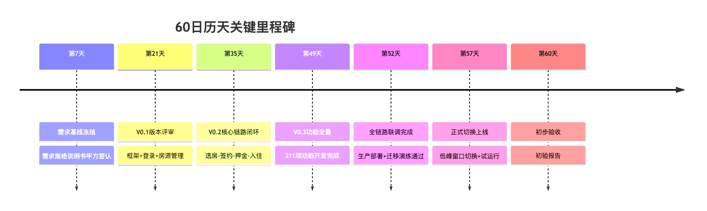

### 6.2.3 关键路径与并行策略分析

60日历天工期的关键路径为：**需求冻结（第7天）→ 核心业务开发（选房-签约-支付链路）→ 外部接口联调（政务核验/支付/签章）→ 全链路联调（第52天）→ 数据迁移与切换（第57天）→ 初验（第60天）**。针对关键路径的专项管理措施：

| 关键路径环节 | 风险特征 | 并行/提前策略 |
|---|---|---|
| 外部接口开通 | 周期不受我方控制 | 第1周全部申请并行发起；未开通期间以挡板服务先行开发 |
| 政务核验联调 | 网络环境与数据授权依赖甲方协调 | 代理网关模式成熟复用；沙箱联调安排在第4-5周留足缓冲 |
| 支付/签章联调 | 涉及资金与法律效力，验证项多 | 我方成熟对接组件复用，联调重点收敛为参数适配与回归验证 |
| 数据迁移 | 数据质量不确定性 | 第2周即启动数据摸底与清洗规则制定，与开发并行推进；两轮演练前置 |
| 培训与验收资料 | 易被挤压后置 | 教材随迭代三并行编制；验收资料随里程碑同步沉淀 |

非关键路径任务（优惠券、消息、数据看板、报表等）在迭代计划中弹性调度，为关键路径让渡资源，保证整体工期刚性达成。

## 6.3 定制化开发期限保证

1. **需求快速冻结**：进场7天内完成需求基线签认，避免需求阶段拖期侵占开发窗口；
2. **成熟资产复用**：我方同类住房租赁平台成熟功能资产（约90%功能直接对应）+代码生成器，可将标准功能开发提速50%以上，是60天工期最有力的可行性保障；
3. **三轮迭代滚动交付**：每14天一个迭代，功能增量可视化验证，进度偏差在迭代粒度内即被发现与纠正；
4. **关键路径管理**：项目经理每日跟踪关键路径任务（外部对接、数据迁移），偏差超2天即启动纠偏（加班赶工、任务重排、增派人力）；
5. **人力弹性储备**：公司保持后备开发人力，进度告警时3个工作日内增援到岗，费用由我方承担。

## 6.4 部署实施期限保证

1. **环境先行**：开发/测试环境第1周就绪；生产环境部署方案第6周前与甲方评审确认，避免部署窗口临时协调；
2. **部署自动化**：标准化部署脚本+自动化流水线，单次部署耗时可控、过程可重复、失败可回滚；
3. **数据迁移预演**：不少于2轮试迁移演练，输出记录数/金额/抽样三级比对报告，正式切换选择业务低峰期执行，并制定回退预案；
4. **切换双保险**：新旧系统切换后保留旧系统只读查询，出现重大问题可快速回退，业务连续性有保障。

## 6.5 技术对接期限保证

1. **对接前置启动**：8类外部接口的接入申请、账号开通、沙箱环境申请在进场第1周并行发起，不等业务开发完成；
2. **对接经验复用**：我方已完成同类政务核验、支付渠道、电子签章、地图、微信平台的生产级对接，接口协议、联调要点、常见问题均有成熟预案，可大幅压缩联调周期；
3. **对接计划表管理**：每项对接明确甲方/第三方联系人、联调窗口、完成标准（沙箱联调→生产验证→回归测试），周例会逐项跟踪；
4. **风险缓冲设计**：对接受阻时启用降级方案先行保障主流程（如资格核验降级人工审核），不阻塞整体进度，待接口恢复后补齐联调。

## 6.6 测试培训期限保证

1. **测试左移**：测试工程师自迭代一即介入编写用例、执行迭代内测试，避免测试后置压缩周期；
2. **测试环境常备**：每日构建自动部署测试环境，回归测试自动化辅助，缩短回归周期；
3. **培训计划前置**：培训教材（操作手册、视频）随迭代三同步编制；采用"集中授课+现场辅导+常态答疑"组合，管理端按角色分批培训并组织上机考核，保证培训实效；
4. **验收测试预演**：正式验收前按验收标准逐项自查预演，问题先行整改，保证验收一次通过。

## 6.7 上线验收期限保证

1. **验收标准前置对齐**：进场后即与甲方确认初验、终验的标准与资料清单，验收资料随里程碑同步沉淀，不临时补造；
2. **试运行全程值守**：试运行期驻场团队现场值守，紧急问题10分钟响应，每日试运行日报，缺陷快速闭环；
3. **源代码交付质量**：交付源代码保证可独立编译生成与生产环境一致的可执行文件，代码结构清晰、注释完整、含编译部署脚本与说明文档，全力配合甲方源代码功能性验证与质量审查；
4. **验收资料完备**：需求、设计、测试、部署、操作手册、培训记录、迁移报告等全套文档按 GB/T 8567 规范编制，随验收一次性移交。

## 6.8 逾期风险防控与违约责任承诺

1. **进度预警机制**：里程碑偏差率超过10%即向甲方书面预警并提交赶工方案；
2. **资源兜底承诺**：如约定人月数内未完成成果交付，我方自行承担全部费用继续安排符合要求的人员，确保成果如期交付；
3. **质保延续**：免费运维期内系统缺陷免费修复；运维期届满前配合甲方完成运维交接，保证服务不断档；
4. **诚信履约**：我方将严格按照投标承诺与合同约定履行各项义务，接受甲方按合同约定进行的考核与违约追责。

进度偏差的分级应对预案如下：

| 偏差程度 | 判定标准 | 应对措施 |
|---|---|---|
| 轻度偏差 | 单任务滞后≤2天，不影响里程碑 | 迭代内任务重排、当周加班消化，周例会通报 |
| 中度偏差 | 里程碑预计滞后2-5天 | 启动赶工：增派后备开发人力（3个工作日内到岗，费用我方承担）、压缩非关键任务、双班推进关键路径 |
| 重度偏差 | 里程碑预计滞后>5天或关键外部依赖受阻 | 书面报甲方并提交专项赶工方案；启用降级预案保障主流程（如接口降级人工审核）；公司层面成立专项保障组，二线专家进场支援 |
| 外部依赖延迟 | 第三方接口参数/联调窗口延迟 | 该部分工期顺延处理书面确认，同时以模拟桩先行开发联调，外部就绪后快速切换真实环境，最大限度压缩追赶时间 |

## 6.9 项目交付物清单

我方按阶段向甲方移交以下交付物，全部文档按 GB/T 8567 规范编制：

**阶段交付物**：

| 阶段 | 交付物 | 形式 |
|---|---|---|
| 需求阶段 | 需求规格说明书、原型确认稿、需求跟踪矩阵 | 纸质+电子 |
| 设计阶段 | 概要设计说明书、数据库设计说明书、接口设计说明书 | 电子 |
| 开发阶段 | 迭代版本（V0.1/V0.2/V0.3）、版本说明、代码评审记录 | 演示环境+电子 |
| 测试阶段 | 测试计划、测试用例、测试报告、缺陷统计报告 | 电子 |
| 迁移阶段 | 数据迁移方案、两轮试迁移比对报告、正式切换记录 | 电子 |
| 部署阶段 | 部署方案、部署手册、生产部署报告 | 电子 |
| 培训阶段 | 培训计划、操作手册（分角色）、培训视频、培训签到与考核记录 | 纸质+电子 |
| 验收阶段 | 初验申请与报告、终验申请与报告、验收资料汇编 | 纸质+电子 |

**最终交付物（终验时全量移交）**：

| 类别 | 交付内容 |
|---|---|
| 软件成果 | 系统全部源代码（可独立编译生成与生产一致的可执行文件）、编译部署脚本、数据库结构与初始化脚本 |
| 文档成果 | 需求/设计/测试/部署/运维全套文档、操作手册、接口文档 |
| 数据成果 | 迁移后的完整业务数据、数据字典 |
| 账号资产 | 系统全部管理账号、配置参数清单、证书密钥台账（当面移交） |
| 知识资产 | 运维知识库、故障案例库、FAQ |

**运维期持续交付物**：周运维报送、月度运维报告（每月末前2个工作日报送）、季度恢复演练报告、年度服务总结报告、故障处理记录台账。

交付物移交实行清单化签收：每次移交附《交付物移交清单》，双方签字确认；电子文档同步存入甲方指定位置，版本更新时同步替换并保留版本记录。

## 6.10 六年免费运维服务期年度工作安排

免费运维期自初步验收合格之日起共6年，我方按年度制定运维工作重点，保证服务质量前紧后稳、持续改进：

| 服务年度 | 阶段定位 | 年度工作重点 |
|---|---|---|
| 第1年 | 磨合稳定期 | 试运行问题集中收敛与根因消缺；用户分批次集中培训（不少于4场）；运维制度与甲方管理流程对齐；完成首年等保测评配合与整改；建立完整的监控基线与知识库 |
| 第2年 | 优化提升期 | 慢SQL/慢接口专项治理；容量首轮扩容评估；业务规则随政策调整的适配优化；开展全链路压测复验 |
| 第3年 | 平稳运行期 | 数据归档策略实施（历史账单/日志分层存储）；组件版本升级评估与实施（安全补丁、依赖库）；满意度专项提升计划 |
| 第4年 | 技术保鲜期 | 中间件与运行环境版本中期升级（充分测试后低峰实施）；备份恢复体系复审；安全体系复测与加固 |
| 第5年 | 持续服务期 | 业务发展适配（新增项目/批次/政策的系统适配建议）；性能与容量再评估；知识库与文档全面更新 |
| 第6年 | 交接准备期 | 系统健康度全面体检；文档、代码、配置、知识库完整性核查；配合甲方制定后续运维方案；运维交接计划编制与交接演练，保证服务不断档 |

**贯穿6年的常态化工作**：日巡检/周维护/月度报告、每季度恢复演练、每年度渗透测试与应急演练、每半年满意度调查、7×24小时故障响应（紧急10分钟/一般2小时）、用户常态化培训与答疑。

**运维期人员稳定性承诺**：驻场运维人员保持稳定，如需更换提前15个工作日书面报甲方同意，并完成不少于10个工作日的交接带教；公司二线专家团队（架构、DBA、安全）名单报甲方备案，人员变化同步更新。

## 6.11 需甲方配合事项清单

为保证60日历天工期刚性达成，恳请甲方在以下事项上给予配合（我方将提前书面提醒并提供全部所需材料）：

| 序号 | 配合事项 | 期望时间 | 说明 |
|---|---|---|---|
| 1 | 指定项目负责人与各业务对口人 | 进场第1周 | 需求确认、审批规则确认的决策通道 |
| 2 | 需求基线评审与签认 | 第7天前 | 需求规格说明书签认，冻结基线 |
| 3 | 外部接口开通协调 | 第1周发起，持续跟进 | 郑好办应用注册、政务数据使用申请、支付商户开通、签章企业认证、监控视频源接入等 |
| 4 | 微信小程序/公众号主体资质 | 第1-2周 | 主体认证、类目审核所需材料 |
| 5 | 生产环境资源就绪 | 第6周前 | 服务器、网络策略、域名与证书 |
| 6 | 存量数据提供与口径确认 | 第2周起 | 旧系统数据导出、字段口径答疑、清洗规则确认 |
| 7 | 里程碑评审参与 | 各里程碑节点 | V0.1/V0.2/V0.3评审与签认 |
| 8 | 切换窗口审批 | 第8周 | 确认业务低峰切换时间窗与通知渠道 |
| 9 | 培训组织协调 | 第8-9周 | 参训人员组织、场地安排 |
| 10 | 初验组织 | 第60天内 | 验收小组组建与验收安排 |

以上配合事项均已纳入逐周实施计划（见6.2.1）对应周次的"甲方配合"栏，我方将在每周例会上滚动确认后续两周的配合事项，确保双方节奏对齐。

---

**结语**：我方对本项目的业务需求有着深刻且经过生产实践验证的理解，拥有同类住房租赁管理平台的完整建设与运营经验。我方承诺以本技术方案为基线，投入充足且稳定的驻场团队，在60日历天内高质量完成系统定制化开发、部署实施、技术对接、测试培训与上线验收，并以6年免费运维保障系统持续稳定运行，全力协同招标人把本项目建设成为让租户满意、让管理高效的示范性房屋管理系统。
