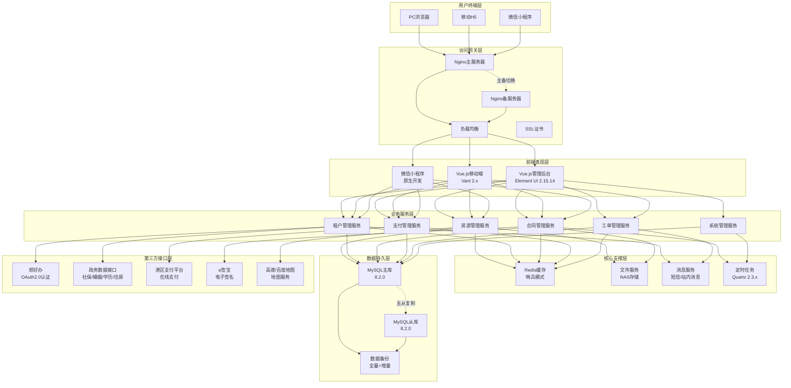
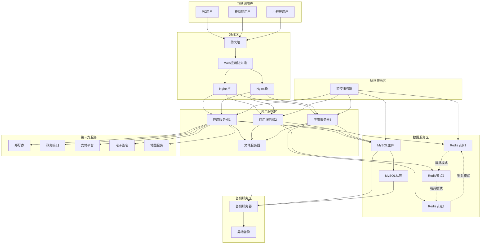

# 港好住信息系统平台 - 架构设计方案

## 一、系统架构设计

### 1.1 系统架构设计说明

港好住信息系统平台是面向港区保障性住房管理业务的综合信息化平台，服务对象包括普通租户、企业用户以及管理人员。系统采用现代化的技术架构，支持人才公寓管理、保租房管理、市场租赁等多种业务场景，为港区住房保障工作提供全方位的信息化支撑。

#### 1.1.1 架构设计原则

本系统在架构设计过程中遵循以下核心原则：

**（1）前后端分离原则**

采用前后端分离架构模式，前端负责展示和交互，后端负责业务逻辑和数据处理。前后端通过RESTful API进行数据交互，实现技术栈解耦、团队协作高效、独立部署升级的目标。

**（2）分层架构原则**

系统采用经典的分层架构设计，从上到下分为用户终端层、访问网关层、前端表现层、业务服务层、核心支撑层、数据持久层和第三方接口层。各层职责清晰、边界明确，上层依赖下层服务，下层对上层透明，确保系统的可维护性和可扩展性。

**（3）高可用性原则**

系统关键组件均采用冗余设计和集群部署，包括Nginx主备切换、应用服务器集群、MySQL主从复制、Redis哨兵模式等，确保单点故障不影响整体业务运行，系统可用性达到99.9%以上。

**（4）可扩展性原则**

系统采用模块化设计和松耦合架构，业务模块可独立开发、部署和升级。预留微服务化改造空间，支持未来根据业务发展进行水平扩展和垂直拆分，满足业务量快速增长的需求。

**（5）安全性原则**

系统建立多层次安全防护体系，包括网络安全（防火墙、WAF）、传输安全（HTTPS、SSL）、应用安全（Spring Security、OAuth2.0）、数据安全（加密存储、脱敏处理）、访问控制（RBAC权限模型）等，全方位保障系统和数据安全。

**（6）信创适配原则**

系统充分考虑国产化替代要求，技术选型兼容信创环境，支持麒麟/统信操作系统、达梦/人大金仓数据库、东方通/金蝶中间件等国产基础软件，确保系统可在纯信创环境中稳定运行。

#### 1.1.2 架构特点

基于以上设计原则，港好住系统架构具有以下显著特点：

**（1）前后端分离架构**

前端采用Vue.js 2.6.12框架开发，包括PC管理后台（Element UI）、移动H5端（Vant UI）和微信小程序三种终端形态。后端采用Spring Boot 3.5.4 + Spring Security 6.x构建RESTful API服务，前后端通过JSON格式进行数据交互，实现了技术栈的完全解耦。

**（2）多层次分层设计**

系统采用七层架构设计，各层职责明确：用户终端层提供多端访问入口，访问网关层实现负载均衡和SSL卸载，前端表现层负责页面渲染，业务服务层处理核心业务逻辑，核心支撑层提供缓存、文件、消息等公共服务，数据持久层负责数据存储，第三方接口层对接外部系统。层与层之间通过标准接口通信，降低耦合度。

**（3）微服务化预留**

当前系统采用单体应用架构，但在设计时充分考虑了未来微服务化改造的可能性。业务服务层按照房源管理、租户管理、合同管理、支付管理、工单管理等业务领域进行模块划分，各模块保持低耦合高内聚，为后续按业务域拆分为独立微服务奠定基础。

**（4）多终端统一支持**

系统提供PC Web管理后台、移动H5端和微信小程序三种访问方式，后端统一提供RESTful API服务，前端根据终端特性进行适配开发。管理后台侧重功能全面性和操作便捷性，移动端侧重用户体验和便携性，微信小程序侧重社交属性和即用即走，三端数据实时同步，为不同用户群体提供最优访问体验。

**（5）信创环境兼容**

系统技术选型充分考虑国产化替代，数据库支持MySQL和达梦/金仓数据库双模式，应用服务器支持Tomcat和东方通TongWeb，操作系统支持CentOS和麒麟/统信，JDK支持Oracle JDK和华为毕昇JDK。通过数据库方言、中间件适配等技术手段，确保系统可在信创环境中平滑部署运行。

### 1.2 系统总体架构图

港好住系统采用七层架构设计，从上到下依次为用户终端层、访问网关层、前端表现层、业务服务层、核心支撑层、数据持久层和第三方接口层。系统整体架构如下图所示：



**架构说明：**

- **用户终端层**：提供三种访问方式，覆盖PC办公场景、移动办公场景和微信生态场景
- **访问网关层**：Nginx主备部署，提供负载均衡、反向代理、SSL加密等功能
- **前端表现层**：基于Vue.js 2.6.12开发，三端共用后端API，提供统一用户体验
- **业务服务层**：基于Spring Boot 3.5.4开发，按业务领域划分为6个核心服务模块
- **核心支撑层**：提供缓存、文件、消息、定时任务等公共基础服务
- **数据持久层**：MySQL主从架构，主库负责写操作，从库负责读操作，实现读写分离
- **第三方接口层**：对接5个外部系统，提供用户认证、数据校验、支付、签名、地图等能力

### 1.3 系统分层架构详解

本节详细说明系统七层架构中每一层的功能定位、技术实现和关键设计。

#### 1.3.1 用户终端层

用户终端层是用户访问系统的入口，提供三种访问方式以满足不同场景的使用需求。

**（1）PC浏览器端**

面向管理人员和后台工作人员，提供功能完整的管理后台系统。支持Chrome、Firefox、Edge等主流现代浏览器，要求浏览器版本支持ES6语法。主要用于房源管理、租户管理、合同管理、账单管理、系统配置等后台管理功能。通过HTTPS协议访问，默认端口443。

**（2）移动H5端**

面向租户和企业用户，提供移动端Web应用。采用响应式设计，适配各种手机屏幕尺寸（最小支持320px宽度）。用户通过微信浏览器或手机浏览器访问，主要用于查看房源、在线选房、预约看房、签署合同、缴纳费用、查看账单、申请开票等租户端功能。支持微信JSSDK调用，可调用微信支付、位置选择等原生能力。

**（3）微信小程序端**

嵌入微信生态，提供原生小程序体验。用户通过微信搜索或扫码进入，无需安装即可使用。相比H5端具有更好的性能和用户体验，支持微信授权登录、微信支付、消息订阅等微信特有能力。主要功能与移动H5端保持一致，部分功能根据小程序特性进行优化，如利用小程序码实现房源分享、利用模板消息推送账单提醒等。

#### 1.3.2 访问网关层

访问网关层是系统的入口网关，负责流量接入、负载均衡、安全防护等关键功能。

**（1）Nginx主备部署**

采用Nginx 1.20+版本，部署主备两台服务器，通过Keepalived实现主备自动切换。主服务器正常运行时处理所有请求，主服务器故障时，VIP（虚拟IP）自动漂移到备服务器，切换时间小于3秒，对用户透明。主备服务器配置完全一致，定期同步配置文件。

**（2）负载均衡配置**

Nginx配置upstream负载均衡，后端应用服务器采用轮询（round-robin）策略，支持按权重分配。配置健康检查机制，每10秒检测一次后端服务器状态，连续3次失败则标记为down，自动剔除故障节点。支持会话保持（ip_hash），确保同一用户的请求路由到同一应用服务器。

**（3）反向代理功能**

Nginx作为反向代理服务器，隐藏后端真实服务器地址。前端请求统一发送到Nginx（https://域名），Nginx根据请求路径转发到对应的后端服务：
- `/` → 前端静态资源（Vue打包文件）
- `/dev-api/` → 后端API服务（去除/dev-api前缀后转发）
- `/profile/` → 文件资源（映射到文件服务器）

**（4）SSL证书配置**

启用HTTPS加密传输，使用SSL/TLS 1.2+协议。配置正规CA机构颁发的数字证书，证书类型为域名型DV或企业型OV证书。强制HTTP重定向到HTTPS，禁用不安全的SSL 2.0/3.0和TLS 1.0/1.1协议。配置HSTS（HTTP Strict Transport Security）头，防止协议降级攻击。

**（5）性能优化配置**

- 启用Gzip压缩，压缩HTML、CSS、JS、JSON等文本资源，压缩率设置为6级
- 配置浏览器缓存策略，静态资源（图片、CSS、JS）设置1年缓存时间
- 启用HTTP/2协议，提升资源并发加载能力
- 配置连接池和缓冲区大小，worker_processes设置为CPU核心数
- 限流配置，单IP每秒最多10个连接，防止CC攻击

#### 1.3.3 前端表现层

前端表现层采用Vue.js 2.6.12框架开发，提供PC管理后台、移动H5端和微信小程序三种终端形态。

**（1）PC管理后台（Element UI）**

基于Vue.js 2.6.12 + Element UI 2.15.14开发，采用若依(RuoYi)前端框架作为基础，提供完整的后台管理系统。主要技术栈包括：
- Vue Router 3.4.9：前端路由管理，支持动态路由和权限控制
- Vuex 3.6.0：全局状态管理，统一管理用户信息、权限信息、字典数据等
- Axios 0.24.0：HTTP客户端，封装统一的请求拦截和响应处理
- Element UI 2.15.14：UI组件库，提供表格、表单、弹窗等丰富组件

关键设计：
- 布局采用左侧菜单+顶部导航+内容区域的经典后台布局
- 菜单根据用户权限动态加载，实现按钮级权限控制
- 表格支持分页、排序、筛选、导出等功能
- 表单支持复杂验证、联动、动态表单等场景
- 集成富文本编辑器、文件上传、图片裁剪等常用组件

**（2）移动H5端（Vant UI）**

基于Vue.js 2.6.12 + Vant 2.x开发，采用移动优先的响应式设计。主要技术栈包括：
- Vant 2.x：移动端UI组件库，提供按钮、列表、表单等移动组件
- Vant Weapp：部分组件与小程序端保持一致，便于代码复用
- Axios：与PC端共用HTTP封装，统一接口调用
- Vue Router：路由管理，支持路由懒加载减少首屏加载时间
- Vuex：状态管理，缓存用户信息和常用数据

关键设计：
- 采用rem适配方案，基准字体大小37.5px，兼容各种屏幕尺寸
- 页面采用下拉刷新、上拉加载更多的移动端交互模式
- 集成微信JSSDK，支持微信支付、地理位置、图片上传等能力
- 优化图片加载，使用懒加载和渐进式加载提升性能
- 离线缓存策略，缓存静态资源和常用数据，提升二次访问速度

**（3）微信小程序端**

采用微信原生小程序开发框架，使用微信小程序开发者工具进行开发调试。主要技术特点：
- 原生WXML+WXSS+JS开发，充分利用小程序性能优势
- 组件化开发，将页面拆分为可复用的自定义组件
- 使用wx.request进行网络请求，与H5端共用后端API
- 利用小程序云开发能力，实现消息推送、二维码生成等功能
- 支持微信登录、微信支付，简化用户操作流程

关键设计：
- 分包加载，将非核心功能分包，主包控制在2MB以内，提升启动速度
- 数据预加载，利用小程序生命周期提前请求数据
- 使用小程序全局状态管理（类似Vuex），统一管理用户信息
- 配置小程序订阅消息，及时推送账单提醒、审核结果等通知
- 兼容微信旧版本，最低支持微信7.0.0版本

#### 1.3.4 业务服务层

业务服务层是系统的核心，负责处理所有业务逻辑，基于Spring Boot 3.5.4 + Spring Security 6.x + MyBatis-Plus 3.5.x开发。按业务领域划分为6个核心服务模块。

**（1）房源管理服务**

负责项目、房源、楼栋、单元、房间等房源信息的全生命周期管理。

核心功能：
- 项目管理：支持多个保障房项目管理，记录项目基本信息、位置、配套设施等
- 楼栋管理：管理项目下的楼栋信息，包括楼栋号、楼层数、单元数等
- 房源管理：管理房间详细信息，包括房间号、面积、户型、租金、状态等
- 户型管理：管理房源户型分类，支持一室一厅、两室一厅等多种户型
- 房源状态：跟踪房源状态（空闲、已预订、已出租、维修中等）
- VR全景：关联房源的VR全景图片或视频，支持在线看房
- 地图标注：集成高德/百度地图，标注项目和房源位置

关键技术：
- 使用MyBatis-Plus的BaseMapper简化CRUD操作
- 图片和VR资源存储在文件服务器，数据库仅存储路径
- 房源状态变更记录日志，支持状态回溯和统计分析
- 支持按区域、户型、租金范围等多维度条件查询
- 定时任务同步房源状态，自动处理过期预订

**（2）租户管理服务**

负责租户信息管理、资格审核、配租批次管理等核心业务。

核心功能：
- 租户注册：通过郑好办OAuth2.0认证完成用户注册
- 资格校验：对接政务数据接口，校验社保、婚姻、学历、住房、保租房等资格
- 配租批次：管理人才公寓和保租房的配租批次，设置批次时间、房源池等
- 选房管理：支持在线选房、预约看房、房源锁定等功能
- 资格申诉：租户对资格审核结果不满意可发起申诉，管理员审核
- 黑名单：管理违规租户黑名单，黑名单用户禁止选房
- 企业客户：管理企业客户信息，支持企业批量租赁

关键技术：
- 资格校验采用并发调用多个政务接口，使用CompletableFuture提升性能
- 校验结果缓存到Redis，有效期24小时，避免重复调用
- 选房采用乐观锁机制，防止并发选房冲突
- 黑名单采用Redis Set结构存储，快速判断用户是否在黑名单中
- 配租批次支持定时开启和关闭，使用Quartz定时任务

**（3）合同管理服务**

负责租赁合同的全生命周期管理，包括合同生成、电子签署、归档、查询、下载等功能。

核心功能：
- 合同生成：根据选房信息自动生成租赁合同，支持合同模板配置
- 电子签署：对接e签宝平台，实现在线电子签署，具有法律效力
- 合同审核：管理员审核合同内容，确认无误后推送给租户签署
- 合同归档：已签署合同自动归档，支持按租户、项目、时间等维度查询
- 合同下载：支持下载PDF格式的电子合同，带电子签章
- 续签管理：支持合同到期提醒、在线续签功能
- 变更管理：支持合同变更（如房间调换、租金调整等）

关键技术：
- 合同模板使用FreeMarker引擎，支持动态填充租户、房源、租金等信息
- 对接e签宝API，调用实名认证、合同签署、合同下载等接口
- 签署状态采用回调机制，e签宝签署完成后回调更新合同状态
- 合同PDF文件存储在文件服务器，数据库记录文件路径和签署状态
- 到期提醒使用Quartz定时任务，每天检查即将到期的合同并发送通知

**（4）支付管理服务**

负责押金、租金、费用等在线支付功能，对接港区支付平台。

核心功能：
- 支付订单：生成支付订单，记录订单号、金额、支付类型、状态等信息
- 在线支付：对接港区支付平台，支持微信支付、支付宝支付
- 支付回调：接收支付平台的异步回调通知，更新订单状态
- 退款管理：支持押金退款、多缴退款等场景
- 账单管理：自动生成租金账单，支持按月、按季、按年缴费
- 缴费记录：记录所有缴费流水，支持导出和打印
- 开票申请：租户可申请开具租金发票，管理员审核后开票

关键技术：
- 订单号采用雪花算法生成，确保全局唯一
- 支付采用异步回调模式，接口需验证签名防止伪造回调
- 支付状态使用状态机模式管理（待支付→支付中→已支付→已关闭）
- 账单生成使用Quartz定时任务，每月1日自动生成当月租金账单
- 退款需记录退款原因、审批流程，防止恶意退款
- 缴费记录与合同、账单关联，支持对账和统计分析

**（5）工单管理服务**

负责报修、保洁、搬家等服务工单的管理和流程跟踪。

核心功能：
- 工单创建：租户可在线提交报修、保洁、搬家等服务申请
- 工单派发：管理员接收工单后分配给对应的服务人员
- 工单跟踪：实时跟踪工单状态（待受理→已受理→处理中→已完成→已评价）
- 工单评价：租户可对服务进行评价和打分
- 工单统计：统计工单数量、处理时效、满意度等指标
- 消息通知：工单状态变更时通过短信或站内消息通知用户
- 工单归档：已完成工单自动归档，支持历史查询

关键技术：
- 工单状态采用状态机模式，确保状态流转合法
- 工单派发支持手动分配和自动分配（按区域、按负载均衡）
- 图片上传支持，租户可上传现场照片描述问题
- 消息通知集成短信服务和站内消息，确保及时送达
- 超时预警机制，超过24小时未处理的工单自动提醒管理员
- 工单数据用于服务质量分析和考核

**（6）系统管理服务**

提供系统级的基础管理功能，继承若依框架的系统管理模块。

核心功能：
- 用户管理：管理后台用户账号、角色、部门、岗位等信息
- 角色管理：配置角色和权限，支持数据权限（本人、本部门、全部等）
- 菜单管理：动态配置菜单和按钮权限，支持按角色显示菜单
- 字典管理：管理系统字典数据，如房源状态、户型分类等
- 参数配置：管理系统参数，如文件上传路径、短信模板等
- 通知公告：发布系统通知和政策公告
- 日志管理：记录操作日志、登录日志、接口调用日志
- 定时任务：配置和管理Quartz定时任务

关键技术：
- 基于Spring Security实现认证和授权
- 权限采用RBAC（基于角色的访问控制）模型
- 菜单权限通过注解@PreAuthorize("@ss.hasPermi('system:user:list')")控制
- 数据权限通过自定义注解@DataScope实现
- 操作日志通过AOP切面自动记录
- 字典数据缓存到Redis，提升查询性能

#### 1.3.5 核心支撑层

核心支撑层为业务服务层提供公共基础服务，包括缓存、文件、消息、定时任务等功能。

**（1）Redis缓存服务**

采用Redis 3.0+版本，部署哨兵（Sentinel）模式实现高可用。

应用场景：
- 用户会话缓存：存储JWT Token、用户登录信息，有效期2小时
- 资格校验结果缓存：缓存政务接口返回的资格数据，有效期24小时
- 字典数据缓存：缓存系统字典、参数配置等热点数据
- 验证码缓存：存储短信验证码、图片验证码，有效期5分钟
- 分布式锁：用于选房、支付等并发场景的互斥控制
- 黑名单缓存：快速判断用户是否在黑名单中
- 接口限流：基于Token Bucket算法的接口限流

数据结构使用：
- String：存储用户Token、验证码、配置参数
- Hash：存储用户信息、字典数据
- Set：存储黑名单、权限集合
- ZSet：存储排行榜、时间序列数据
- List：存储消息队列、日志队列

缓存策略：
- 缓存更新：先更新数据库，再删除缓存（Cache Aside模式）
- 缓存穿透：使用布隆过滤器或空值缓存
- 缓存击穿：热点数据使用互斥锁更新
- 缓存雪崩：设置随机过期时间，避免同时失效

**（2）文件服务**

提供统一的文件上传、存储、访问服务。

存储方案：
- 本地存储：文件存储在文件服务器的本地磁盘（D:/ruoyi/uploadPath/）
- 目录结构：按日期分层存储（/upload/2025/01/19/uuid.jpg）
- 文件命名：使用UUID重命名，避免文件名冲突
- 支持格式：图片（jpg/png/gif）、文档（pdf/doc/docx）、视频（mp4）
- 大小限制：单个文件最大10MB，头像限制2MB

文件访问：
- 访问路径：通过Nginx映射/profile路径到文件目录
- 完整URL：数据库存储相对路径（/profile/upload/...），前端拼接baseUrl
- 图片优化：支持缩略图生成、图片压缩
- 防盗链：配置Nginx referer验证，防止外站盗链
- 访问控制：敏感文件（合同PDF）需验证Token才能访问

文件管理：
- 定期清理：定时任务清理未关联的临时文件（上传后未使用）
- 备份策略：每天增量备份到备份服务器
- 容量监控：监控磁盘使用率，超过80%告警

**（3）消息服务**

提供短信通知和站内消息两种消息推送能力。

短信服务：
- 服务商：对接第三方短信平台（阿里云、腾讯云等）
- 应用场景：验证码、账单提醒、合同签署通知、工单进度通知
- 模板管理：在短信平台配置消息模板，系统调用时传入参数
- 发送限流：同一手机号60秒内只能发送1条，每天最多5条
- 发送记录：记录所有短信发送日志，包括手机号、内容、状态、时间
- 失败重试：发送失败自动重试3次，间隔1分钟

站内消息：
- 消息类型：系统通知、账单提醒、审核结果、工单进度等
- 消息存储：存储在数据库，用户登录后查看未读消息
- 消息推送：使用WebSocket实现实时推送（PC端），或轮询查询（移动端）
- 消息状态：未读、已读、已删除
- 消息管���：支持批量标记已读、批量删除

微信消息（小程序端）：
- 订阅消息：用户订阅后可接收模板消息推送
- 推送场景：账单生成、合同待签署、审核结果、工单进度
- 跳转链接：消息支持跳转到小程序相关页面

**（4）定时任务服务**

基于Quartz 2.3.x实现定时任务调度。

核心任务：
- 账单生成任务：每月1日0点生成当月租金账单
- 合同到期提醒：每天检查30天内到期的合同并发送提醒
- 房源状态同步：每小时同步预订超时的房源，自动释放
- 数据统计任务：每天凌晨2点统计前一天的业务数据
- 数据备份任务：每天凌晨3点执行数据库全量备份
- 日志清理任务：每周日凌晨删除3个月前的操作日志
- 临时文件清理：每天清理7天前的未关联文件

任务管理：
- 任务配置：支持在管理后台动态配置任务执行时间（Cron表达式）
- 任务监控：记录任务执行日志，包括开始时间、结束时间、执行结果
- 任务控制：支持手动执行、暂停、恢复、删除任务
- 异常处理：任务执行失败发送告警通知
- 集群支持：配置任务集群，避免多实例重复执行

#### 1.3.6 数据持久层

数据持久层负责数据的持久化存储，采用MySQL 8.2.0主从架构。

**（1）MySQL主从架构**

架构设计：
- 主库（Master）：负责所有写操作（INSERT、UPDATE、DELETE）
- 从库（Slave）：负责读操作（SELECT），通过主从复制同步数据
- 读写分离：使用MyBatis-Plus多数据源插件，注解指定读写库
- 主从延迟：正常情况下延迟小于1秒，可接受最终一致性

主从复制配置：
- 复制模式：异步复制（Asynchronous Replication）
- 复制格式：ROW格式，记录每行数据的变更
- 复制过滤：只复制业务数据库，不复制系统库
- 延迟监控：监控主从延迟时间，超过5秒告警

高可用方案：
- 主库故障：手动提升从库为主库（未配置自动故障转移）
- 从库故障：读请求自动切换到主库，不影响业务
- 数据一致性：定期校验主从数据一致性

**（2）数据库设计规范**

表结构设计：
- 命名规范：表名小写加下划线（user_info），字段名驼峰转下划线
- 主键设计：使用自增主键（id BIGINT AUTO_INCREMENT）
- 字段类型：字符串用VARCHAR，金额用DECIMAL(10,2)，时间用DATETIME
- 索引设计：主键索引+唯一索引+普通索引，单表索引不超过5个
- 字段注释：每个表和字段必须有注释说明
- 预留字段：每个表预留2-3个备用字段

公共字段：
- create_by：创建人
- create_time：创建时间
- update_by：更新人
- update_time：更新时间
- remark：备注
- del_flag：删除标志（0正常 2删除）

**（3）数据备份策略**

备份方案：
- 全量备份：每天凌晨3点执行mysqldump全量备份
- 增量备份：每2小时备份binlog增量日志
- 备份保留：全量备份保留30天，增量备份保留7天
- 备份存储：本地备份+异地备份（备份服务器）
- 备份验证：每周随机抽取备份文件进行恢复测试

恢复方案：
- 完全恢复：使用最近的全量备份+增量备份恢复到故障前状态
- 时间点恢复：根据binlog恢复到指定时间点
- 表级恢复：单独恢复某个表的数据
- RTO：2小时内完成恢复
- RPO：最多丢失4小时数据

#### 1.3.7 第三方接口层

第三方接口层负责与外部系统对接，提供用户认证、数据校验、支付、签名、地图等能力。

**（1）郑好办OAuth2.0认证**

对接郑州市统一认证平台"郑好办"，实现用户单点登录。

对接方式：
- 协议：OAuth2.0授权码模式（Authorization Code）
- 认证流程：用户点击登录→跳转郑好办→用户授权→回调获取code→换取access_token→获取用户信息
- 用户信息：姓名、身份证号、手机号、性别、出生日期等
- Token有效期：access_token有效期2小时，refresh_token有效期30天
- 安全措施：HTTPS传输，验证state参数防止CSRF攻击

业务处理：
- 首次登录自动创建租户账号，记录郑好办用户ID
- 已注册用户直接登录，更新最后登录时间
- 退出登录时同时退出郑好办和本系统
- 支持账号绑定和解绑功能

**（2）政务数据接口**

对接政府数据共享平台，获取用户的社保、婚姻、学历、住房、保租房等资格数据。

接口列表：
- 社保接口：查询用户近12个月社保缴纳记录
- 婚姻接口：查询用户婚姻状况（未婚/已婚/离异等）
- 学历接口：查询用户最高学历和毕业院校
- 住房接口：查询用户在本市的住房情况
- 保租房接口：查询用户是否已享受保租房

对接方式：
- 协议：RESTful API，JSON格式
- 认证：接口密钥（AppKey+AppSecret）或数字证书
- 限流：每个接口每天最多调用1000次
- 超时：接口超时时间10秒

性能优化：
- 并发调用：使用CompletableFuture并发调用5个接口，总耗时取最慢的接口
- 缓存结果：将查询结果缓存到Redis，有效期24小时
- 异常处理：单个接口失败不影响其他接口，记录日志并返回失败原因
- 重试机制：接口调用失败自动重试1次

**（3）港区支付平台**

对接郑州航空港区统一支付平台，支持微信支付、支付宝支付。

对接方式：
- 协议：RESTful API，JSON格式
- 认证：商户号+API密钥
- 签名：使用RSA签名算法，确保数据完整性和真实性

支付流程：
- 创建订单：调用支付平台创建支付订单接口
- 发起支付：前端调用微信/支付宝SDK，传入支付参数
- 支付回调：支付成功后支付平台异步回调通知接口
- 验证签名：验证回调请求的签名，确保来自支付平台
- 更新状态：更新订单状态为已支付，更新账单缴费状态

退款流程：
- 申请退款：调用支付平台退款接口
- 退款审核：管理员审核退款申请
- 退款处理：审核通过后调用退款接口，原路退回
- 退款通知：接收退款结果异步通知

**（4）e签宝电子签名平台**

对接e签宝平台，实现租赁合同的在线电子签署。

对接方式：
- 协议：RESTful API，JSON格式
- 认证：AppId+Secret
- 文档：提供详细的API文档和SDK

签署流程：
- 实名认证：调用个人实名认证接口，验证租户身份
- 创建印章：为租户创建电子签名印章
- 上传合同：将生成的PDF合同上传到e签宝
- 添加签署方：添加甲方（管理方）和乙方（租户）
- 发起签署：发起签署流程，推送签署链接给租户
- 签署合同：租户点击链接进行签署
- 签署回调：签署完成后e签宝回调通知
- 下载合同：下载已签署的PDF合同并归档

关键功能：
- 支持手写签名、印章签名
- 签署位置可配置（坐标定位）
- 签署完成的合同具有法律效力
- 提供合同存证和证据保全服务

**（5）高德/百度地图服务**

集成地图服务，提供地图展示、位置搜索、路线规划等功能。

使用功能：
- 地图展示：在地图上标注项目和房源位置
- 位置搜索：根据关键词搜索位置
- 逆地理编码：根据经纬度获取详细地址
- 路线规划：规划从用户位置到房源的路线
- 周边搜索：搜索房源周边的学校、医院、超市等配套设施

对接方式：
- 前端：引入地图JavaScript SDK，在页面中展示地图
- 后端：调用地图Web服务API，进行地理编码等操作
- 认证：使用API Key进行认证
- 配额：每天免费调用次数有限制，超出需购买

### 1.4 关键技术组件说明

本节详细说明系统使用的5个关键技术组件的原理、应用和配置。

#### 1.4.1 Spring Security安全框架

Spring Security是系统的安全核心，负责认证、授权、会话管理等安全功能。

**（1）认证流程**

用户登录认证流程：
1. 用户提交用户名和密码
2. UsernamePasswordAuthenticationFilter拦截请求
3. AuthenticationManager调用UserDetailsService加载用户信息
4. PasswordEncoder验证密码是否正确
5. 认证成功生成JWT Token返回给前端
6. 前端在后续请求的Header中携带Token
7. JwtAuthenticationTokenFilter验证Token有效性
8. 验证通过后从Token中解析用户信息并设置到SecurityContextHolder

JWT Token设计：
- 算法：HS256（HMAC with SHA-256）
- 载荷：用户ID、用户名、权限列表、过期时间
- 密钥：配置在application.yml中，定期更换
- 有效期：2小时，过期后需重新登录

**（2）权限控制**

RBAC权限模型：
- 用户（User）：系统使用者
- 角色（Role）：权限的集合，如管理员、操作员
- 权限（Permission）：具体的操作权限，如system:user:add
- 用户-角色：多对多关系，一个用户可以有多个角色
- 角色-权限：多对多关系，一个角色可以有多个权限

权限控制方式：
- 方法级：使用@PreAuthorize注解控制方法访问权限
- URL级：配置HttpSecurity过滤规则
- 按钮级：前端根据权限标识显示/隐藏按钮
- 数据级：使用@DataScope注解控制数据范围（本人/本部门/全部）

#### 1.4.2 MyBatis-Plus ORM框架

MyBatis-Plus是MyBatis的增强工具，在MyBatis基础上只做增强不做改变，简化开发、提高效率。

**（1）核心功能**

通用CRUD操作：
- BaseMapper接口：提供insert、delete、update、select等基础方法
- 无需编写XML：简单CRUD操作无需手写SQL和XML配置
- 条件构造器：QueryWrapper和LambdaQueryWrapper构建复杂查询条件
- 分页插件：内置物理分页，支持MySQL、Oracle等多种数据库

代码生成器：
- 自动生成Entity、Mapper、Service、Controller代码
- 支持模板定制，生成符合项目规范的代码
- 大幅减少重复性编码工作

**（2）常用注解**

实体类注解：
- @TableName：指定表名，如@TableName("sys_user")
- @TableId：主键注解，type=IdType.AUTO表示自增
- @TableField：字段映射，value指定列名，exist=false表示非表字段
- @TableLogic：逻辑删除字段标记

**（3）MyBatis迁移策略**

项目正在从MyBatis逐步迁移到MyBatis-Plus：

迁移原则：
- 新代码必须使用MyBatis-Plus
- 旧代码逐步重构，优先重构高频模块
- 保持向后兼容，迁移期间两者共存

具体措施：
- Mapper接口继承BaseMapper<T>，获得通用CRUD方法
- 简单查询改用QueryWrapper，删除对应XML配置
- 复杂查询保留XML，使用@Select等注解标记
- Service层可继承ServiceImpl<M,T>获得批量操作等便捷方法

#### 1.4.3 Redis缓存

Redis是高性能的内存数据库，用于缓存热点数据、Session共享、分布式锁等场景。

**（1）应用场景**

数据缓存：
- 热点数据：用户信息、字典数据、配置信息等高频查询数据
- 列表数据：项目列表、房源列表等，减少数据库压力
- 查询结果：复杂查询结果缓存，提升响应速度

Session共享：
- 分布式Session：多台应用服务器共享用户会话
- Token存储：JWT Token黑名单、Token刷新令牌
- 登录状态：记录用户在线状态、踢人下线

分布式锁：
- 防重复提交：表单提交、订单创建等操作防止重复
- 库存扣减：房源预订时保证库存一致性
- 定时任务：分布式环境下确保定时任务只执行一次

**（2）数据结构应用**

String（字符串）：
- Token存储：key为token，value为用户信息JSON
- 计数器：访问次数统计、验证码发送限制
- 分布式锁：使用SETNX实现

Hash（哈希）：
- 用户信息：以userId为key，字段为userName、avatar等
- 对象缓存：缓存完整的业务对象，避免序列化

List（列表）：
- 消息队列：异步任务队列、通知消息队列
- 最新数据：最新公告、最新订单

Set（集合）：
- 去重场景：用户签到记录、访问IP统计
- 共同关注：用户关注列表、权限集合

**（3）缓存策略**

缓存更新策略：
- Cache Aside：业务代码控制缓存更新，先更新数据库再删除缓存
- 双写一致性：更新数据库的同时更新Redis缓存
- 延迟双删：更新数据库→删除缓存→延迟500ms→再删除缓存

缓存过期策略：
- 字典数据：永不过期，手动更新时删除
- 用户信息：30分钟过期，保持数据时效性
- Token：2小时过期，与JWT过期时间一致
- 查询结果：5分钟过期，平衡性能与实时性

高可用部署：
- 哨兵模式：3个Redis节点+3个Sentinel节点
- 主从同步：异步复制，主节点故障时自动切换
- 持久化：RDB+AOF混合持久化，确保数据不丢失

#### 1.4.4 Quartz定时任务

Quartz是Java领域的定时任务调度框架，支持Cron表达式、集群部署、任务持久化。

**（1）任务调度机制**

核心组件：
- Scheduler：调度器，管理所有Job和Trigger
- Job：具体的任务逻辑，实现execute()方法
- Trigger：触发器，定义任务执行时间和频率
- JobDetail：Job的描述信息，包含Job类、参数等

集群部署：
- 数据库存储：Job、Trigger信息存储在数据库（11张Quartz表）
- 分布式调度：多节点部署，同一任务只在一个节点执行
- 负载均衡：任务分散到不同节点，避免单点压力

**（2）核心定时任务**

账单生成任务：
- 执行时间：每月1日凌晨2:00
- 任务内容：生成当月租金账单、物业费账单
- Cron表达式：0 0 2 1 * ?

逾期提醒任务：
- 执行时间：每天上午9:00
- 任务内容：检查逾期未缴账单，发送短信和站内消息提醒
- Cron表达式：0 0 9 * * ?

合同到期提醒：
- 执行时间：每天上午10:00
- 任务内容：检查即将到期合同（30天、15天、7天），发送续租提醒
- Cron表达式：0 0 10 * * ?

数据备份任务：
- 执行时间：每天凌晨3:00
- 任务内容：备份数据库和上传文件
- Cron表达式：0 0 3 * * ?

#### 1.4.5 Nginx反向代理

Nginx是高性能的HTTP服务器和反向代理服务器，用于负载均衡、静态资源服务、SSL终止等。

**（1）核心功能**

反向代理：
- 请求转发：将前端请求转发到后端应用服务器
- 负载均衡：多台应用服务器间分发请求，支持轮询、权重、IP哈希等策略
- 健康检查：自动检测后端服务器状态，故障时自动摘除

静态资源服务：
- 文件服务：直接提供静态文件访问，如上传的图片、文档
- 资源映射：将/profile路径映射到实际文件系统目录
- 高性能：零拷贝技术，比应用服务器处理更高效

SSL终止：
- HTTPS支持：配置SSL证书，提供HTTPS访问
- 证书管理：统一管理SSL证书，后端服务器无需配置
- 性能优化：SSL会话复用，减少握手开销

**（2）关键配置要点**

负载均衡配置：
- upstream定义后端服务器组
- 轮询策略：默认策略，请求依次分发
- 权重策略：weight参数控制分发比例
- IP哈希：ip_hash保证同一客户端访问同一服务器

静态资源配置：
- location /profile：匹配静态资源路径
- alias指定实际文件目录
- expires设置缓存时间，减少重复请求
- gzip压缩：压缩文本文件，节省带宽

高可用部署：
- 主备模式：2台Nginx服务器，主备切换
- Keepalived：虚拟IP漂移，故障时自动切换
- 健康检查：监控Nginx进程，异常时触发切换
- 配置同步：主备服务器配置保持一致

### 1.5 技术选型说明

#### 1.5.1 前端技术选型

| 技术栈 | 版本 | 选型理由 |
|--------|------|----------|
| Vue.js | 2.6.12 | 渐进式框架，轻量高效，生态成熟，团队熟悉 |
| Element UI | 2.15.14 | PC端组件库，样式美观，组件丰富，文档完善 |
| Vant | 2.x | 移动端组件库，适配H5页面，性能优异 |
| Vue Router | 3.4.9 | 官方路由库，支持动态路由和权限控制 |
| Vuex | 3.6.0 | 状态管理，集中管理用户信息、字典等全局数据 |
| Axios | 0.24.0 | HTTP客户端，支持拦截器、请求取消等特性 |
| 微信小程序 | 原生 | 官方框架，性能最佳，API完整 |

#### 1.5.2 后端技术选型

| 技术栈 | 版本 | 选型理由 |
|--------|------|----------|
| Spring Boot | 3.5.4 | 简化Spring开发，自动配置，内置服务器，快速开发 |
| Spring Security | 6.x | 企业级安全框架，认证授权功能完善，与Spring深度集成 |
| MyBatis-Plus | 3.5.x | MyBatis增强工具，简化CRUD操作，提高开发效率 |
| MySQL | 8.2.0 | 开源关系型数据库，性能稳定，支持事务，生态成熟 |
| Redis | 3.0+ | 高性能内存数据库，用于缓存、Session共享、分布式锁 |
| Quartz | 2.3.x | 定时任务框架，支持Cron表达式，集群部署 |
| Nginx | 1.20+ | 高性能Web服务器，反向代理，负载均衡 |

#### 1.5.3 信创环境适配

系统技术选型充分考虑国产化替代，支持信创环境部署。

| 组件类型 | 标准配置 | 信创配置 | 适配说明 |
|---------|---------|---------|---------|
| 操作系统 | CentOS 7/8 | 麒麟V10 / 统信UOS | 支持国产操作系统，应用无需修改 |
| 数据库 | MySQL 8.2.0 | 达梦DM8 / 金仓KingBase | 通过MyBatis方言适配，SQL兼容 |
| 中间件 | Tomcat 9.x | 东方通TongWeb | 兼容Servlet规范，应用无需改造 |
| JDK | Oracle JDK 17 | 华为毕昇JDK 17 | 符合OpenJDK规范，完全兼容 |

### 1.6 性能优化设计

系统采用多层次、全方位的性能优化策略，确保系统高效稳定运行。

#### 1.6.1 前端性能优化

**（1）首屏加载优化**

代码分割：
- 路由懒加载：使用Vue Router的动态import实现按需加载
- 组件懒加载：非首屏组件使用异步组件加载
- 第三方库按需引入：Element UI和Vant按需引入组件，减少打包体积

资源优化：
- 图片压缩：使用image-webpack-loader压缩图片资源
- 代码压缩：使用UglifyJS压缩JavaScript，使用cssnano压缩CSS
- Gzip压缩：开启Gzip，压缩文本资源
- CDN加速：将静态资源部署到CDN，加速访问

**（2）运行时性能优化**

列表渲染优化：
- 虚拟滚动：长列表使用vue-virtual-scroller实现虚拟滚动
- 分页加载：列表数据分页加载，避免一次性加载大量数据
- 懒加载：图片使用vue-lazyload实现懒加载

组件优化：
- 避免不必要的重渲染：使用v-show替代v-if（频繁切换场景）
- 计算属性缓存：使用computed替代method，利用缓存机制
- 事件委托：列表项事件使用事件委托，减少事件监听器数量

**（3）缓存策略**

浏览器缓存：
- 强缓存：静态资源设置Cache-Control，缓存时间1年
- 协商缓存：HTML文件使用ETag，确保内容更新
- LocalStorage：缓存字典数据、用户信息等常用数据
- SessionStorage：缓存当前会话的临时数据

#### 1.6.2 后端性能优化

**（1）数据库优化**

索引优化：
- 主键索引：所有表使用自增主键，聚簇索引
- 联合索引：高频查询条件建立联合索引，遵循最左前缀原则
- 覆盖索引：查询字段包含在索引中，避免回表
- 索引维护：定期分析索引使用情况，删除无效索引

SQL优化：
- 避免全表扫描：查询条件使用索引字段
- 避免SELECT *：只查询需要的字段，减少数据传输
- 批量操作：使用批量插入、批量更新，减少数据库交互次数
- 分页优化：深分页使用延迟关联或子查询优化

读写分离：
- 主库写入：所有写操作（INSERT、UPDATE、DELETE）路由到主库
- 从库读取：查询操作路由到从库，降低主库压力
- 强制主库：对实时性要求高的查询强制使用主库

**（2）缓存优化**

多级缓存：
- 本地缓存：使用Caffeine缓存热点数据，减少Redis访问
- Redis缓存：缓存用户信息、字典数据、查询结果
- 数据库：最后的数据源，缓存未命中时查询

缓存预热：
- 系统启动时预加载字典数据、配置参数到Redis
- 定时任务定期刷新热点数据，保持缓存有效性

**（3）代码优化**

异步处理：
- 使用@Async注解实现异步方法调用
- 发送短信、记录日志等非核心业务使用异步处理
- 使用线程池管理异步任务，避免线程泄漏

并发优化：
- 使用CompletableFuture并发调用政务接口，缩短响应时间
- 使用Stream并行流处理大数据量计算
- 合理使用锁机制，避免死锁和性能瓶颈

**（4）接口优化**

响应优化：
- 数据压缩：接口返回数据使用Gzip压缩
- 字段精简：只返回前端需要的字段，减少数据量
- 分页查询：列表接口使用分页，避免一次返回大量数据

接口限流：
- 使用Redis + Lua实现令牌桶限流
- 单IP限流：防止恶意请求
- 接口限流：保护核心接口，防止过载

---

**第一部分"一、系统架构设计"已完成，包含：**
- 1.1 系统架构设计说明
- 1.2 系统总体架构图
- 1.3 系统分层架构详解（7层详细说明）
- 1.4 关键技术组件说明（5个组件）
- 1.5 技术选型说明（前端+后端+信创适配）
- 1.6 性能优化设计（前端+后端优化策略）

**文档当前进度：约1000行，预计10000字。**

## 二、部署架构设计

### 2.1 部署架构设计说明

**（1）部署原则**

- 高可用性：关键组件采用主备或集群部署，消除单点故障
- 可扩展性：支持水平扩展，应对业务增长
- 安全隔离：网络分区隔离，最小权限原则
- 易运维性：统一监控告警，自动化部署
- 信创适配：支持国产操作系统和数据库部署

**（2）部署环境**

| 环境 | 用途 | 配置 |
|------|------|------|
| 开发环境 | 开发人员本地开发测试 | 开发机 |
| 测试环境 | 功能测试、集成测试 | 1台服务器（一体机） |
| 生产环境 | 正式对外提供服务 | 13台服务器（高可用集群） |

### 2.2 部署架构图



### 2.3 服务器规划

**（1）生产环境服务器配置**

| 服务器名称 | 数量 | CPU | 内存 | 硬盘 | 用途 |
|-----------|------|-----|------|------|------|
| Nginx负载均衡 | 2 | 4核 | 8GB | 200GB | 负载均衡、反向代理 |
| 应用服务器 | 3 | 8核 | 16GB | 500GB | 部署Spring Boot应用 |
| MySQL数据库 | 2 | 8核 | 32GB | 1TB SSD | 主从数据库 |
| Redis缓存 | 3 | 4核 | 16GB | 200GB | 哨兵集群 |
| 文件服务器 | 1 | 4核 | 8GB | 2TB | 文件存储（NAS） |
| 备份服务器 | 1 | 4核 | 8GB | 4TB | 数据备份 |
| 监控服务器 | 1 | 4核 | 8GB | 500GB | 系统监控 |
| **合计** | **13** | - | - | - | - |

**（2）测试环境服务器配置**

| 服务器名称 | 数量 | CPU | 内存 | 硬盘 | 说明 |
|-----------|------|-----|------|------|------|
| 测试一体机 | 1 | 8核 | 16GB | 500GB | 部署所有服务 |

### 2.4 网络拓扑设计

**（1）网络分区**

| 网络区域 | VLAN | IP段 | 功能 |
|---------|------|------|------|
| DMZ区 | VLAN 10 | 192.168.10.0/24 | Nginx、防火墙 |
| 应用服务区 | VLAN 20 | 192.168.20.0/24 | 应用服务器 |
| 数据服务区 | VLAN 30 | 192.168.30.0/24 | 数据库、缓存 |
| 备份服务区 | VLAN 40 | 192.168.40.0/24 | 备份服务器 |
| 监控服务区 | VLAN 50 | 192.168.50.0/24 | 监控服务器 |

**（2）防火墙策略**

- DMZ区→应用服务区：仅允许HTTP/HTTPS（8080端口）
- 应用服务区→数据服务区：仅允许MySQL（3306）、Redis（6379）
- 应用服务区→文件服务区：仅允许NFS/SMB
- 所有区域→监控服务区：允许监控端口（9090、3000、10050）
- 拒绝其他所有未明确允许的访问

**（3）端口规划**

| 服务 | 端口 | 访问控制 |
|------|------|---------|
| Nginx HTTP | 80 | 公网开放 |
| Nginx HTTPS | 443 | 公网开放 |
| Spring Boot | 8080 | 内网访问 |
| MySQL | 3306 | 应用服务器访问 |
| Redis | 6379/26379 | 应用服务器访问 |
| Prometheus | 9090 | 监控服务器访问 |
| Grafana | 3000 | 内网访问 |

### 2.5 容灾备份方案

**（1）高可用设计**

| 层级 | 高可用方案 | 切换方式 | RTO |
|------|-----------|---------|-----|
| 负载均衡 | Nginx主备（Keepalived） | 自动切换 | <1分钟 |
| 应用层 | 3节点集群 | 负载均衡 | 实时 |
| 数据库 | MySQL主从复制 | 手动切换 | <30分钟 |
| 缓存 | Redis哨兵模式 | 自动切换 | <1分钟 |
| 文件存储 | NAS+定期备份 | 手动恢复 | <2小时 |

**（2）数据备份策略**

| 备份对象 | 备份方式 | 备份频率 | 保留周期 |
|---------|---------|---------|---------|
| MySQL全量备份 | mysqldump | 每日凌晨2点 | 30天 |
| MySQL增量备份 | binlog | 实时 | 7天 |
| Redis数据 | RDB快照 | 每6小时 | 7天 |
| 上传文件 | rsync同步 | 每日凌晨3点 | 30天 |
| 应用代码 | Git+打包 | 每次发版 | 永久保留 |
| 异地备份 | 全量备份 | 每周日 | 90天 |

**（3）容灾恢复**

- **RPO（恢复点目标）**：4小时
- **RTO（恢复时间目标）**：2小时
- **恢复流程**：检测故障 → 启动备用系统 → 恢复最近备份 → 验证数据完整性 → 切换服务

### 2.6 部署流程

**（1）环境准备**

```
操作系统安装 → JDK安装 → 数据库安装 → Redis安装 → Nginx安装 → 网络配置 → 防火墙配置
```

**（2）应用部署步骤**

| 步骤 | 操作 | 说明 |
|------|------|------|
| 1 | 数据库初始化 | 执行SQL脚本创建表结构 |
| 2 | Redis配置 | 配置哨兵模式 |
| 3 | 后端部署 | 上传jar包，配置application.yml |
| 4 | 前端部署 | 打包dist目录，部署到Nginx |
| 5 | Nginx配置 | 配置反向代理和静态资源 |
| 6 | 服务启动 | 启动后端服务，验证启动日志 |
| 7 | 功能验证 | 测试核心功能是否正常 |

**（3）灰度发布流程**

```
准备发布包 → 备份当前版本 → 停止1台应用服务器 → 部署新版本 → 启动验证 →
观察运行（30分钟） → 逐步部署其他服务器 → 全量上线 → 监控观察
```

### 2.7 监控运维

**（1）监控体系**

| 监控类型 | 工具 | 监控指标 | 告警阈值 |
|---------|------|---------|---------|
| 基础监控 | Zabbix | CPU、内存、磁盘、网络 | CPU>80%、内存>85%、磁盘>90% |
| 应用监控 | Prometheus+Grafana | JVM、接口响应时间、TPS | 响应时间>3s、错误率>5% |
| 数据库监控 | Prometheus | 连接数、慢查询、主从延迟 | 慢查询>100ms、延迟>10s |
| 缓存监控 | Redis Exporter | 内存使用、命中率 | 内存>80%、命中率<90% |
| 业务监控 | 自定义指标 | 订单量、支付成功率 | 支付失败率>10% |

**（2）日志管理**

| 日志类型 | 存储位置 | 保留周期 | 用途 |
|---------|---------|---------|------|
| 应用日志 | /logs/app/*.log | 30天 | 业务问题排查 |
| 访问日志 | /logs/nginx/access.log | 15天 | 访问统计分析 |
| 错误日志 | /logs/nginx/error.log | 30天 | 错误问题排查 |
| 慢查询日志 | /var/log/mysql/slow.log | 7天 | SQL性能优化 |
| 安全审计日志 | /logs/audit/*.log | 180天 | 安全审计 |

**（3）告警机制**

- **告警方式**：短信 + 邮件 + 钉钉机器人
- **告警分级**：P0（致命）、P1（严重）、P2（警告）、P3（提示）
- **告警策略**：P0立即通知、P1 5分钟通知、P2 30分钟汇总、P3每日报告

## 三、功能架构设计

### 3.1 功能架构设计说明

**（1）设计原则**

- 模块化设计：按业务领域划分功能模块，高内聚低耦合
- 分层设计：前台/后台分离，业务逻辑与数据访问分离
- 可扩展性：预留功能扩展接口，支持新业务快速接入
- 复用性：公共模块统一封装，避免重复开发

**（2）功能分类**

| 功能类型 | 使用对象 | 主要功能 |
|---------|---------|---------|
| 移动端功能 | 租户、企业用户 | 选房、签约、缴费、看房、服务订单 |
| 后台管理功能 | 管理员、运营人员 | 房源管理、租户管理、合同管理、账单管理、数据统计 |
| 公共支撑功能 | 全部用户 | 认证授权、消息通知、文件上传、日志审计 |

### 3.2 功能架构图

系统功能按使用对象和业务场景划分为移动端、后台管理、公共支撑三大类模块，各模块间通过统一的业务核心引擎和数据接口层进行交互。

```mermaid
graph TB
    subgraph "移动端功能模块"
        M1[登录认证]
        M2[首页展示]
        M3[人才公寓服务]
        M4[保租房服务]
        M5[市场租赁]
        M6[地图找房]
        M7[VR看房]
        M8[账单缴费]
        M9[开票申请]
        M10[服务订单]
        M11[企业客户]
        M12[个人中心]
    end

    subgraph "后台管理功能模块"
        A1[数据统计]
        A2[项目管理]
        A3[房源管理]
        A4[配租批次]
        A5[租户管理]
        A6[预约看房]
        A7[资格申诉]
        A8[合同管理]
        A9[入住管理]
        A10[退租管理]
        A11[退款管理]
        A12[账单管理]
        A13[开票管理]
        A14[服务管理]
        A15[报表管理]
        A16[黑名单管理]
        A17[系统管理]
    end

    subgraph "公共支撑模块"
        C1[用户认证]
        C2[权限管理]
        C3[消息通知]
        C4[文件上传]
        C5[数据字典]
        C6[日志审计]
    end

    subgraph "业务核心引擎"
        E1[资格校验引擎]
        E2[合同签署引擎]
        E3[支付引擎]
        E4[账单生成引擎]
        E5[工单流程引擎]
    end

    subgraph "数据接口层"
        D1[郑好办接口]
        D2[政务数据接口]
        D3[支付接口]
        D4[电子签名接口]
        D5[地图接口]
    end

    M1 --> C1
    M3 --> E1
    M4 --> E1
    M8 --> E3
    M10 --> E5
    
    A5 --> E1
    A8 --> E2
    A12 --> E4
    A14 --> E5
    
    E1 --> D2
    E2 --> D4
    E3 --> D3
    
    C1 --> D1
```



### 3.3 功能模块分解

#### 3.3.1 移动端功能模块

| 模块名称 | 核心功能 | 技术要点 |
|---------|---------|---------|
| 登录认证模块 | 郑好办OAuth2.0登录、手机号登录 | 单点登录、Token管理 |
| 首页模块 | 轮播图、政策公告、快捷入口、房源推荐 | 动态配置、图片懒加载 |
| 人才公寓服务 | 资格校验、房源浏览、在线选房、合同签署 | 并发调用政务接口、乐观锁选房 |
| 保租房服务 | 资格校验、配租批次、摇号选房、签约入住 | 批次管理、摇号算法 |
| 市场租赁 | 房源搜索、预约看房、签约租赁 | 多条件筛选、地图展示 |
| 地图找房 | 地图标注、位置搜索、周边配套 | 高德/百度地图集成 |
| VR看房 | 360度全景展示、房间切换 | VR资源加载优化 |
| 账单缴费 | 账单查看、在线支付、缴费记录 | 微信/支付宝支付、支付回调 |
| 开票申请 | 发票申请、发票查看下载 | 电子发票 |
| 服务订单 | 报修、保洁、搬家申请、进度查询、服务评价 | 工单状态机、图片上传 |
| 企业客户 | 企业信息、批量租赁、员工管理 | 企业账号体系 |
| 个人中心 | 个人信息、我的房源、我的合同、我的账单 | 数据汇总展示 |

#### 3.3.2 后台管理功能模块

| 模块名称 | 核心功能 | 技术要点 |
|---------|---------|---------|
| 数据统计模块 | 房源统计、租户统计、收入统计、数据可视化 | ECharts图表、定时任务统计 |
| 项目管理 | 项目基本信息、楼栋管理、配套设施 | 树形结构展示 |
| 房源管理 | 房源录入、房源状态、户型管理、VR上传 | 批量导入、图片上传 |
| 配租批次 | 批次创建、房源分配、批次开启/关闭 | 定时任务、状态控制 |
| 租户管理 | 租户信息、资格审核、黑名单管理 | 政务接口调用、Excel导出 |
| 预约看房 | 预约审核、看房安排、预约记录 | 日历组件、状态流转 |
| 资格申诉 | 申诉审核、审核记录、结果通知 | 审批流程、消息推送 |
| 合同管理 | 合同生成、电子签署、合同归档、合同下载 | FreeMarker模板、e签宝对接 |
| 入住管理 | 入住办理、押金收取、钥匙发放 | 入住流程、状态管理 |
| 退租管理 | 退租申请、房屋验收、退租办理 | 退租流程、押金退还 |
| 退款管理 | 退款审核、退款处理、退款记录 | 审批流程、支付退款接口 |
| 账单管理 | 账单生成、账单调整、欠费管理 | 定时生成、账单模板 |
| 开票管理 | 开票审核、发票开具、发票查询 | 电子发票对接 |
| 服务管理 | 工单派发、工单跟踪、服务评价 | 工单分配算法、超时提醒 |
| 报表管理 | 租金报表、入住率报表、收缴率报表 | 报表生成、Excel导出 |
| 黑名单管理 | 黑名单录入、黑名单解除、黑名单查询 | Redis缓存、快速校验 |
| 系统管理 | 用户管理、角色权限、菜单管理、字典管理、日志管理 | 继承RuoYi框架 |

#### 3.3.3 公共支撑模块

| 模块名称 | 核心功能 | 技术要点 |
|---------|---------|---------|
| 用户认证模块 | 郑好办OAuth2.0、JWT Token、单点登录 | Spring Security、Token刷新 |
| 权限管理模块 | RBAC权限模型、菜单权限、按钮权限、数据权限 | 动态菜单加载、权限注解 |
| 消息通知模块 | 短信通知、站内消息、小程序订阅消息 | 消息模板、异步发送 |
| 文件上传模块 | 图片上传、文档上传、文件存储、文件访问 | 文件大小限制、格式校验 |
| 数据字典模块 | 字典配置、字典缓存、字典接口 | Redis缓存、懒加载 |
| 日志审计模块 | 操作日志、登录日志、接口日志、安全审计 | AOP切面、异步写入 |

#### 3.3.4 业务核心引擎

| 引擎名称 | 核心功能 | 技术要点 |
|---------|---------|---------|
| 资格校验引擎 | 并发调用政务接口、资格判定、结果缓存 | CompletableFuture并发、Redis缓存24小时 |
| 合同签署引擎 | 合同生成、电子签署、签署回调、合同归档 | FreeMarker模板、e签宝API |
| 支付引擎 | 订单生成、支付调起、支付回调、订单更新 | 雪花算法、签名验证、状态机 |
| 账单生成引擎 | 定时生成、账单模板、账单推送 | Quartz定时任务、账单计算规则 |
| 工单流程引擎 | 工单创建、工单派发、状态流转、超时提醒 | 状态机、自动分配算法 |

### 3.4 模块间交互关系

**（1）核心业务流程**

选房签约流程:

```
用户登录 → 资格校验引擎(调用政务接口) → 选房(乐观锁) → 生成合同 →  
合同签署引擎(e签宝) → 签署完成 → 生成押金/租金账单 → 支付引擎 → 支付成功 → 入住办理
```

账单缴费流程:

```
账单生成引擎(定时任务) → 账单推送(消息通知) → 用户查看账单 →  
发起支付 → 支付引擎(调用支付接口) → 支付回调 → 更新账单状态 → 缴费通知
```

服务订单流程:

```
用户提交工单 → 工单流程引擎 → 自动派发/手动派发 → 服务人员接单 →  
上门服务 → 完成工单 → 用户评价 → 工单归档
```

**（2）模块依赖关系**

| 依赖类型 | 说明 |
|---------|------|
| 核心依赖 | 所有业务模块依赖用户认证模块、权限管理模块、日志审计模块 |
| 业务依赖 | 租户管理依赖资格校验引擎、合同管理依赖合同签署引擎、账单管理依赖账单生成引擎和支付引擎 |
| 数据依赖 | 房源管理为选房提供数据、租户管理为合同提供数据、合同管理为账单提供数据 |

### 3.5 数据流转设计

**（1）核心数据流**

| 数据流名称 | 流转过程 | 一致性保证 |
|-----------|---------|-----------|
| 用户数据流 | 郑好办认证 → 本地创建用户 → 同步用户信息 → 缓存到Redis | OAuth2.0协议、数据库事务 |
| 资格校验数据流 | 并发调用5个政务接口 → 汇总结果 → 缓存Redis(24小时) → 返回前端 | CompletableFuture、异常隔离 |
| 支付数据流 | 创建订单 → 调用支付接口 → 异步回调 → 验证签名 → 更新订单和账单 | 支付回调重试、幂等性校验 |
| 文件数据流 | 前端上传 → 后端接收 → 存储到文件服务器 → 返回相对路径 → 数据库存储路径 → 前端拼接baseUrl显示 | 文件唯一性(UUID)、路径标准化 |

**（2）数据一致性保证**

| 一致性场景 | 保障机制 |
|-----------|---------|
| 数据库事务 | Spring @Transactional注解，确保ACID特性 |
| 缓存一致性 | Cache Aside模式，先更新数据库再删除缓存 |
| 分布式锁 | Redis SETNX实现，防止并发选房、并发支付 |
| 乐观锁 | 数据库版本号字段，防止并发更新冲突 |

---

## 总结

本架构设计方案基于港好住信息系统平台的业务需求，采用前后端分离、分层架构设计，实现了人才公寓、保租房、市场租赁的全流程信息化管理。

**关键架构特点：**

1. **七层架构设计**：用户终端层、访问网关层、前端表现层、业务服务层、核心支撑层、数据持久层、第三方接口层，职责清晰，易于扩展
2. **高可用部署**：Nginx主备、应用集群、MySQL主从、Redis哨兵，确保系统稳定运行
3. **多端统一服务**：PC管理后台、移动H5、微信小程序共用后端API，三端数据实时同步
4. **信创环境支持**：兼容国产操作系统、数据库、中间件，满足信创要求
5. **安全可靠**：OAuth2.0认证、Spring Security权限控制、数据加密传输、完善的日志审计

**技术亮点：**

1. **并发资格校验**：使用CompletableFuture并发调用5个政务接口，总耗时取最慢的接口，大幅提升用户体验
2. **电子合同签署**：对接e签宝平台，实现在线签署，具有法律效力
3. **Redis哨兵模式**：3节点哨兵集群，主节点故障自动切换，RTO<1分钟
4. **MyBatis-Plus迁移**：新代码使用MyBatis-Plus，减少80%的XML配置，提升开发效率
5. **灰度发布流程**：分批部署、逐步观察，降低发布风险

**性能保障：**

1. **前端性能**：路由懒加载、代码分割、Gzip压缩、CDN加速，首屏加载<2秒
2. **后端性能**：读写分离、Redis缓存、连接池优化、异步处理，接口响应<200ms
3. **数据库性能**：索引优化、SQL优化、批量操作、分页查询，慢查询<100ms
4. **系统容量**：支持10万租户、5000套房源、日均5万访问量，可水平扩展

本方案经过充分调研和设计，技术选型成熟稳定，架构设计合理规范，能够满足港好住平台的业务需求和性能要求，为后续系统建设提供坚实的技术保障。

